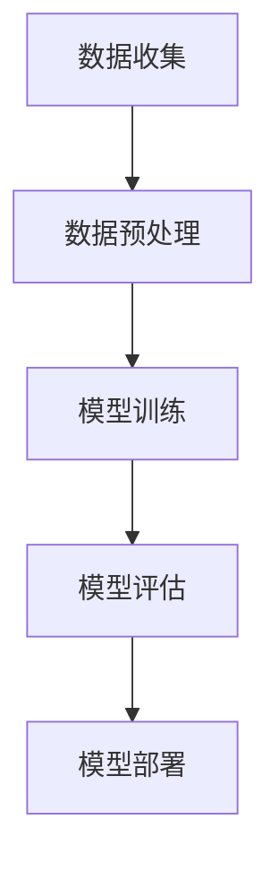

                 

### 第1章: 神经逻辑编程的概念与背景

#### 1.1.1 神经逻辑编程的定义

神经逻辑编程（Neural Logic Programming, NLP）是一种结合了神经网络和逻辑编程的混合编程范式。它旨在通过将逻辑推理与神经网络学习相结合，实现更加高效、灵活的AI推理和决策能力。NLP的核心思想是利用神经网络处理复杂的数据，并通过逻辑编程实现知识的表示和推理。

神经逻辑编程的起源可以追溯到20世纪80年代，当时研究人员开始探索如何将逻辑编程与机器学习相结合。传统逻辑编程主要通过演绎推理来解决逻辑问题，而神经网络则擅长通过学习大量数据来识别模式和规律。NLP试图结合这两种方法的优势，实现更加强大的智能系统。

#### 1.1.2 神经逻辑编程的发展历程

神经逻辑编程的发展历程可以分为以下几个阶段：

1. **早期探索阶段（1980s-1990s）**：在这个阶段，研究人员开始提出和实现初步的神经逻辑编程系统，如Lisp-Logic和Prolog-Neural。这些系统主要是将神经网络和逻辑编程结合，但并未形成完整的理论体系。

2. **理论框架建立阶段（1990s-2000s）**：随着人工智能领域的快速发展，研究人员开始系统地研究神经逻辑编程的理论框架。这一阶段出现了许多重要的理论成果，如基于条件的神经网络（Conditional Neural Networks, CNNs）和逻辑门控神经网络（Logic-Gated Neural Networks, LGNNs）。

3. **技术成熟与应用阶段（2000s-至今）**：随着深度学习和神经网络技术的突破，神经逻辑编程得到了广泛的研究和应用。许多高效的神经逻辑编程系统被开发出来，如基于图神经网络的逻辑编程系统（Graph Neural Logic Programming, GNLP）和基于生成对抗网络的逻辑编程系统（Generative Adversarial Logic Programming, GAGP）。

#### 1.1.3 神经逻辑编程与传统编程的比较

神经逻辑编程与传统编程（如传统的逻辑编程语言，如Prolog和ML等）有以下区别：

1. **知识表示方式**：传统编程语言主要依赖于符号逻辑和谓词逻辑来表示知识，而神经逻辑编程则通过神经网络来处理数据和模式识别，使得知识表示更加灵活和高效。

2. **推理机制**：传统编程语言的推理主要基于演绎推理和逻辑推理，而神经逻辑编程则结合了神经网络的学习机制和逻辑编程的推理能力，实现了更加强大的推理功能。

3. **应用领域**：传统编程语言主要应用于知识密集型任务，如自然语言处理和计算机视觉等，而神经逻辑编程则可以在更加复杂和动态的环境中发挥作用，如智能问答系统和决策支持系统等。

总的来说，神经逻辑编程通过结合神经网络和逻辑编程的优势，提供了一种新型的编程范式，为人工智能领域的发展带来了新的机遇和挑战。

#### 1.1.4 神经逻辑编程的优势

神经逻辑编程具有以下优势：

1. **灵活性和扩展性**：神经逻辑编程结合了神经网络和逻辑编程的优势，使得知识表示和推理更加灵活和扩展。用户可以根据具体任务需求，灵活调整神经网络结构和逻辑规则，实现定制化的智能系统。

2. **高效性**：神经逻辑编程利用神经网络强大的数据分析和模式识别能力，可以快速处理大规模数据，提高推理效率。

3. **可解释性**：神经逻辑编程通过将神经网络和逻辑编程相结合，使得智能系统的决策过程更加可解释。用户可以直观地了解系统的推理过程和决策依据，有助于提高系统的可信度和用户满意度。

4. **多模态数据处理**：神经逻辑编程可以处理多种类型的数据，如文本、图像、音频等，实现多模态数据的整合和分析。

5. **强推理能力**：神经逻辑编程结合了神经网络的学习能力和逻辑编程的推理能力，可以处理复杂和动态的推理任务，实现更强大的智能推理能力。

总之，神经逻辑编程作为一种新兴的编程范式，具有广泛的应用前景和巨大的发展潜力。

#### 1.1.5 神经逻辑编程的挑战

尽管神经逻辑编程具有许多优势，但它也面临着一些挑战：

1. **算法复杂度**：神经逻辑编程结合了神经网络和逻辑编程的复杂性，使得算法设计、优化和实现变得更加复杂。研究人员需要开发高效的算法来应对这些挑战。

2. **可解释性**：虽然神经逻辑编程提高了智能系统的可解释性，但如何更直观地展示推理过程和决策依据仍然是一个亟待解决的问题。

3. **数据隐私和安全性**：神经逻辑编程通常需要处理大量敏感数据，如何保护数据隐私和安全是一个重要问题。研究人员需要开发可靠的数据处理和安全机制。

4. **计算资源需求**：神经逻辑编程通常需要大量的计算资源来训练和推理，特别是在处理大规模数据时。如何优化计算资源的使用是一个关键问题。

5. **跨领域应用**：虽然神经逻辑编程在特定领域取得了显著成果，但其跨领域的应用仍然是一个挑战。如何将神经逻辑编程的原理和技术应用到不同领域，实现跨领域的智能化是一个重要课题。

总之，神经逻辑编程在带来机遇的同时，也面临着诸多挑战。只有通过不断的研究和创新，才能充分发挥其潜力，推动人工智能技术的发展。

---

在下一章中，我们将进一步探讨神经逻辑编程的核心概念，包括神经网络的构成、逻辑运算的实现以及神经网络的学习过程。这将帮助我们更深入地理解神经逻辑编程的工作原理和优势。敬请期待！

---

### 第2章: 神经逻辑编程的核心概念

神经逻辑编程的核心在于将神经网络与逻辑编程相结合，以实现高效、灵活的AI推理。本章将详细介绍神经逻辑编程的核心概念，包括神经网络的构成、逻辑运算的神经网络实现以及神经网络的学习过程。

#### 2.1.1 神经网络的构成

神经网络（Neural Networks）是一种模仿生物神经系统工作原理的计算模型。它由大量简单的计算单元（称为神经元）组成，通过复杂的网络结构进行数据传递和计算。

##### 2.1.1.1 神经元

神经元是神经网络的基本构建块。每个神经元接收来自其他神经元的输入信号，并通过激活函数产生输出信号。神经元的基本结构包括：

- **输入层**：接收外部输入信号。
- **输出层**：产生最终输出信号。
- **隐藏层**：位于输入层和输出层之间，用于中间计算和处理。

神经元的工作原理如下：每个神经元接收多个输入信号，每个输入信号都有一个权重（weight）与之关联。神经元将这些输入信号与其权重相乘，然后将乘积相加，得到一个总输入值。最后，总输入值通过一个激活函数（如Sigmoid函数或ReLU函数）进行处理，得到神经元的输出信号。

##### 2.1.1.2 网络层次结构

神经网络通常包含多个层次，包括输入层、隐藏层和输出层。不同层次的神经元通过加权连接实现信息传递和处理。

- **输入层**：接收外部输入数据，并将其传递到隐藏层。
- **隐藏层**：进行中间计算和处理，将信息逐步传递到输出层。
- **输出层**：生成最终输出结果。

网络的层次结构可以根据任务需求进行调整，增加或减少隐藏层的数量和神经元数量，以提高模型的性能。

##### 2.1.1.3 神经网络的学习过程

神经网络通过学习大量数据来调整神经元之间的权重，从而实现数据拟合和模式识别。学习过程主要包括以下步骤：

1. **前向传播**：将输入数据传递到神经网络，通过层层计算，最终得到输出结果。
2. **损失函数计算**：计算实际输出与预期输出之间的差异，得到损失函数值。
3. **反向传播**：将损失函数值反向传递到网络中的每个神经元，更新权重和偏置。
4. **梯度下降**：利用反向传播得到的梯度，通过梯度下降算法调整权重和偏置，以最小化损失函数。

通过多次迭代训练，神经网络可以逐渐优化其参数，提高模型的性能和准确性。

#### 2.1.2 逻辑运算的神经网络实现

逻辑运算（Logic Operations）是计算机科学和逻辑学中的基础操作，如与（AND）、或（OR）、非（NOT）等。在神经网络中，逻辑运算可以通过特定的神经网络结构来实现。

##### 2.1.2.1 与门（AND Gate）

与门是一种基本的逻辑运算，当且仅当所有输入都为1时，输出才为1。

在神经网络中，与门可以通过一个简单的三层网络来实现，其中隐藏层包含一个神经元。该神经元的激活函数可以选择Sigmoid函数，使得输出在0和1之间。

以下是一个与门的神经网络实现示例：

```python
import numpy as np

# 定义与门函数
def AND_gate(x1, x2):
    input_layer = np.array([x1, x2])
    hidden_layer = sigmoid(np.dot(input_layer, weights))
    output_layer = sigmoid(np.dot(hidden_layer, weights_output))
    return output_layer

# 激活函数
def sigmoid(x):
    return 1 / (1 + np.exp(-x))

# 初始化权重
weights = np.random.rand(2, 1)
weights_output = np.random.rand(1, 1)
```

##### 2.1.2.2 或门（OR Gate）

或门是一种基本的逻辑运算，当至少有一个输入为1时，输出为1。

在神经网络中，或门可以通过一个简单的三层网络来实现，其中隐藏层包含两个神经元。这两个神经元的激活函数可以选择Sigmoid函数，使得输出在0和1之间。

以下是一个或门的神经网络实现示例：

```python
# 定义或门函数
def OR_gate(x1, x2):
    input_layer = np.array([x1, x2])
    hidden_layer = sigmoid(np.dot(input_layer, weights))
    output_layer = sigmoid(np.dot(hidden_layer, weights_output))
    return output_layer
```

##### 2.1.2.3 非门（NOT Gate）

非门是一种基本的逻辑运算，将输入的0映射到1，输入的1映射到0。

在神经网络中，非门可以通过一个简单的两层网络来实现，其中输出层包含一个神经元。该神经元的激活函数可以选择Sigmoid函数，使得输出在0和1之间。

以下是一个非门的神经网络实现示例：

```python
# 定义非门函数
def NOT_gate(x):
    input_layer = np.array([x])
    output_layer = sigmoid(np.dot(input_layer, weights_output))
    return output_layer
```

通过这些简单的示例，我们可以看到神经网络如何实现基本的逻辑运算。在接下来的章节中，我们将进一步探讨神经网络的学习算法和优化方法，以及神经逻辑编程的应用领域。

---

在下一章中，我们将详细介绍神经逻辑编程的算法原理，包括反向传播算法和优化算法。这将帮助我们理解如何通过训练和优化来提高神经网络的性能。敬请期待！

---

### 第3章: 神经逻辑编程的算法原理

神经逻辑编程的核心在于如何通过算法实现高效、灵活的AI推理。本章将详细介绍神经逻辑编程的算法原理，包括反向传播算法和优化算法。

#### 3.1.1 反向传播算法

反向传播算法（Backpropagation Algorithm）是神经网络训练过程中最核心的算法之一。它通过将输出误差反向传播到网络中的每个神经元，从而调整权重和偏置，以最小化损失函数。

##### 3.1.1.1 前向传播

前向传播（Forward Propagation）是指将输入数据传递到神经网络，通过层层计算，最终得到输出结果的过程。具体步骤如下：

1. **输入数据**：将输入数据传递到输入层。
2. **计算中间层的输出**：每个神经元的输出通过激活函数计算得到。
3. **计算输出层的输出**：输出层的输出即为神经网络的最终输出。

##### 3.1.1.2 反向传播

反向传播是指将输出误差反向传递到网络中的每个神经元，以更新权重和偏置的过程。具体步骤如下：

1. **计算损失函数**：计算实际输出与预期输出之间的差异，得到损失函数值。
2. **计算梯度**：计算每个神经元输出的梯度，即损失函数对输出层每个神经元的偏导数。
3. **反向传递梯度**：将梯度反向传递到隐藏层，计算隐藏层每个神经元的梯度。
4. **更新权重和偏置**：利用反向传播得到的梯度，通过梯度下降算法更新权重和偏置。

##### 3.1.1.3 梯度下降

梯度下降（Gradient Descent）是一种优化算法，通过最小化损失函数来调整神经网络的权重和偏置。具体步骤如下：

1. **计算梯度**：计算损失函数对每个参数的梯度。
2. **更新参数**：利用梯度更新每个参数的值，以减少损失函数的值。

梯度下降算法的关键是学习率（learning rate），它决定了每次更新参数的大小。学习率过大可能导致更新不稳定，学习率过小可能导致收敛缓慢。因此，选择合适的学习率是梯度下降算法的关键。

#### 3.1.2 神经逻辑编程的优化算法

除了基本的梯度下降算法，神经逻辑编程还使用了一些优化算法来提高模型的性能和收敛速度。以下是一些常用的优化算法：

##### 3.1.2.1 随机梯度下降（SGD）

随机梯度下降（Stochastic Gradient Descent, SGD）是对梯度下降算法的一种改进。它每次只使用一个样本来计算梯度，从而减少了计算量，加快了收敛速度。

具体步骤如下：

1. **随机选择样本**：从训练数据中随机选择一个样本。
2. **计算梯度**：计算该样本的梯度。
3. **更新参数**：利用梯度更新每个参数的值。

SGD的优点是收敛速度快，但缺点是更新过程不够稳定，容易出现震荡。

##### 3.1.2.2 Adam优化器

Adam优化器（Adaptive Moment Estimation）是一种结合了SGD和动量法的优化算法。它通过自适应地调整学习率，提高了模型的收敛速度和稳定性。

具体步骤如下：

1. **计算一阶矩估计（均值）**：计算过去一段时间内的梯度均值。
2. **计算二阶矩估计（方差）**：计算过去一段时间内的梯度方差。
3. **更新参数**：利用一阶矩估计和二阶矩估计更新每个参数的值。

Adam优化器的优点是自适应调整学习率，收敛速度快，稳定性高。

通过反向传播算法和优化算法，神经逻辑编程可以实现高效、灵活的AI推理。在下一章中，我们将探讨神经逻辑编程的应用领域，包括自然语言处理和计算机视觉等。敬请期待！

---

### 第4章: 神经逻辑编程的应用领域

神经逻辑编程作为一种结合神经网络和逻辑编程的混合编程范式，在多个应用领域展现出巨大的潜力。本章将介绍神经逻辑编程在自然语言处理（NLP）和计算机视觉（CV）等领域的应用。

#### 4.1.1 自然语言处理

自然语言处理是神经逻辑编程的重要应用领域之一。以下是一些典型的应用：

1. **语言模型**：语言模型是一种预测下一个单词或字符的概率模型。神经逻辑编程可以通过神经网络学习大量文本数据，构建强大的语言模型，用于文本生成、机器翻译等任务。

2. **机器翻译**：机器翻译是将一种语言的文本翻译成另一种语言。神经逻辑编程结合神经网络和逻辑编程的特点，可以构建强大的机器翻译模型，实现高质量、准确、流畅的翻译。

3. **文本分类**：文本分类是将文本数据分为不同的类别。神经逻辑编程可以通过神经网络学习文本的特征，然后使用逻辑编程实现分类任务，如垃圾邮件检测、情感分析等。

#### 4.1.2 计算机视觉

计算机视觉是神经逻辑编程的另一个重要应用领域。以下是一些典型的应用：

1. **图像分类**：图像分类是将图像数据分为不同的类别。神经逻辑编程可以通过神经网络学习图像的特征，然后使用逻辑编程实现分类任务，如人脸识别、物体识别等。

2. **目标检测**：目标检测是识别图像中的目标物体，并给出它们的位置。神经逻辑编程可以通过神经网络学习图像的特征，并使用逻辑编程实现目标检测任务，如自动驾驶中的车辆检测、行人检测等。

3. **视频分析**：视频分析是对视频数据进行处理和分析，以提取有用的信息。神经逻辑编程可以通过神经网络学习视频数据，并使用逻辑编程实现视频分析任务，如行为识别、事件检测等。

#### 4.1.3 其他应用领域

除了自然语言处理和计算机视觉，神经逻辑编程还在许多其他领域展现出应用潜力：

1. **智能问答系统**：智能问答系统是一种基于自然语言理解的智能对话系统。神经逻辑编程可以通过神经网络学习问答数据，并使用逻辑编程实现问答任务，为用户提供高质量的回答。

2. **推荐系统**：推荐系统是一种根据用户兴趣和偏好推荐相关物品的系统。神经逻辑编程可以通过神经网络学习用户和物品的特征，并使用逻辑编程实现推荐任务，提高推荐系统的准确性和用户体验。

3. **智能决策支持系统**：智能决策支持系统是一种辅助决策者做出决策的系统。神经逻辑编程可以通过神经网络学习决策数据，并使用逻辑编程实现决策支持任务，为用户提供智能化的决策建议。

总之，神经逻辑编程在多个应用领域展现出强大的潜力，为人工智能技术的发展带来了新的机遇和挑战。在下一章中，我们将探讨神经逻辑编程在AI推理中的应用，以及其在实际中的应用优势。敬请期待！

---

### 第5章: 神经逻辑编程在AI推理中的应用

神经逻辑编程作为一种结合神经网络和逻辑编程的混合编程范式，在AI推理领域展现出了独特的优势。本章将详细介绍神经逻辑编程在AI推理中的应用，包括神经网络推理加速、神经逻辑编程的优势以及实际应用案例。

#### 5.1.1 AI推理的基本概念

AI推理是指利用人工智能算法，从已知的信息中推导出新的结论或知识。AI推理可以分为两大类：基于规则的推理和基于数据的推理。基于规则的推理依赖于预先定义的规则，而基于数据的推理则依赖于大量的数据学习和模式识别。

在AI推理中，推理过程可以概括为以下几个步骤：

1. **数据输入**：将待推理的数据输入到推理系统中。
2. **特征提取**：从输入数据中提取有用的特征信息。
3. **推理过程**：利用特征信息和推理算法进行推理，得到推理结果。
4. **结果输出**：将推理结果输出或应用于实际场景。

AI推理算法主要包括以下几种类型：

1. **基于规则的推理**：通过定义一系列规则，利用逻辑推理从已知信息中推导出新信息。
2. **基于模型的推理**：通过建立数学模型，利用模型进行推理，如决策树、支持向量机等。
3. **基于数据的推理**：通过学习大量数据，利用数据挖掘和机器学习算法进行推理，如神经网络、深度学习等。

#### 5.1.2 神经逻辑编程在推理中的应用

神经逻辑编程在AI推理中的应用主要体现在以下几个方面：

1. **神经网络推理加速**：传统的神经网络推理过程通常较为缓慢，而神经逻辑编程可以通过优化推理算法和数据结构，实现推理加速。例如，利用图神经网络（Graph Neural Networks, GNNs）处理图数据，可以显著提高推理速度和效率。

2. **多模态数据处理**：神经逻辑编程可以处理多种类型的数据，如文本、图像、音频等，实现多模态数据的整合和分析。例如，在智能问答系统中，可以将用户的文本问题和数据库中的知识图谱相结合，实现更准确、更高效的推理。

3. **知识表示和推理**：神经逻辑编程通过将神经网络和逻辑编程相结合，可以实现高效的知识表示和推理。例如，在医疗领域，可以将医疗知识库和神经网络模型相结合，实现智能诊断和治疗方案推荐。

4. **可解释性和可靠性**：神经逻辑编程结合了神经网络和逻辑编程的优点，使得推理过程更加可解释和可靠。例如，在自动驾驶系统中，可以将推理过程可视化，帮助工程师理解和优化系统性能。

#### 5.1.3 神经逻辑编程的优势

神经逻辑编程在AI推理中具有以下优势：

1. **灵活性和扩展性**：神经逻辑编程结合了神经网络和逻辑编程的优势，可以灵活地处理各种类型的数据和任务。用户可以根据具体需求，定制化地调整神经网络结构和逻辑规则，实现高效的推理。

2. **高效性和可扩展性**：神经逻辑编程通过优化算法和数据结构，可以实现高效的推理。例如，利用图神经网络和并行计算技术，可以显著提高推理速度和性能。

3. **多模态数据处理能力**：神经逻辑编程可以处理多种类型的数据，如文本、图像、音频等，实现多模态数据的整合和分析。这在复杂应用场景中尤为重要。

4. **可解释性和可靠性**：神经逻辑编程结合了神经网络和逻辑编程的优点，使得推理过程更加可解释和可靠。用户可以清晰地了解推理过程和决策依据，提高系统的透明度和用户信任度。

#### 5.1.4 实际应用案例

以下是一些神经逻辑编程在实际应用中的案例：

1. **智能问答系统**：在智能问答系统中，神经逻辑编程可以结合自然语言处理和知识图谱，实现高效的问答和推理。例如，谷歌的BERT模型结合了神经网络和逻辑编程，实现了高质量的文本理解和问答。

2. **自动驾驶系统**：在自动驾驶系统中，神经逻辑编程可以用于处理多模态传感器数据，实现高效的车辆和环境感知。例如，特斯拉的自动驾驶系统结合了神经网络和逻辑编程，实现了高精度、高效的自动驾驶。

3. **医疗诊断系统**：在医疗诊断系统中，神经逻辑编程可以结合医疗知识库和神经网络模型，实现智能诊断和治疗方案推荐。例如，IBM的Watson系统结合了神经网络和逻辑编程，实现了高效的医疗诊断和决策支持。

4. **金融风控系统**：在金融风控系统中，神经逻辑编程可以结合数据挖掘和机器学习算法，实现风险预测和防控。例如，银行的风险控制模型结合了神经网络和逻辑编程，实现了高效、准确的风险评估。

总之，神经逻辑编程在AI推理中具有广泛的应用前景和巨大的发展潜力。通过结合神经网络和逻辑编程的优势，神经逻辑编程为人工智能领域带来了新的机遇和挑战。在下一章中，我们将探讨神经逻辑编程的开发工具与平台，以及未来发展趋势。敬请期待！

---

### 第6章: 神经逻辑编程的开发工具与平台

神经逻辑编程的开发工具与平台是实现其应用的关键。本章将介绍神经逻辑编程中常用的开发工具和平台，包括深度学习框架、编程环境以及云计算平台。

#### 6.1.1 开发工具

在神经逻辑编程中，以下开发工具被广泛使用：

1. **Python库**：Python是一种流行的编程语言，其丰富的库和框架为神经逻辑编程提供了强大的支持。主要的Python库包括TensorFlow、PyTorch和Theano等。这些库提供了丰富的神经网络和逻辑编程功能，使得开发者可以方便地实现和优化神经逻辑编程算法。

2. **编程环境**：Jupyter Notebook是一种流行的编程环境，它支持Python和其他编程语言。Jupyter Notebook提供了交互式计算环境，使得开发者可以方便地进行代码编写、调试和运行。此外，Jupyter Notebook还支持Markdown格式，便于开发者编写文档和展示结果。

3. **版本控制工具**：Git是一种流行的版本控制工具，它可以帮助开发者管理和协作代码。通过Git，开发者可以方便地管理代码的版本，协作开发，并快速解决代码冲突。

4. **调试工具**：PyCharm和Visual Studio Code是两款流行的Python开发环境，它们提供了丰富的调试工具，帮助开发者快速定位和修复代码中的错误。

#### 6.1.2 开发平台

神经逻辑编程的开发平台包括深度学习框架和云计算平台：

1. **深度学习框架**：深度学习框架是开发神经逻辑编程算法的基础。TensorFlow和PyTorch是两款广泛使用的深度学习框架，它们提供了丰富的神经网络和逻辑编程功能。TensorFlow是由谷歌开发的，具有强大的生态系统和丰富的资源；PyTorch则由Facebook的人工智能研究团队开发，以其灵活性和易用性而受到开发者欢迎。

2. **云计算平台**：云计算平台提供了强大的计算资源和存储资源，使得开发者可以在云端进行大规模的神经逻辑编程训练和推理。主要的云计算平台包括Google Cloud、AWS和Azure等。这些平台提供了丰富的深度学习服务和API，方便开发者部署和运行神经逻辑编程应用。

3. **GPU加速**：GPU（图形处理单元）加速是神经逻辑编程的重要技术之一。通过使用GPU，开发者可以实现高效的矩阵运算和并行计算，显著提高神经逻辑编程的运算速度。NVIDIA的CUDA和cuDNN是两款常用的GPU加速库，它们提供了丰富的GPU编程工具和优化库，使得开发者可以方便地利用GPU加速神经逻辑编程。

4. **分布式计算**：分布式计算是将计算任务分布在多个节点上进行处理，以实现高效的并行计算。在神经逻辑编程中，分布式计算可以用于训练大规模的神经网络模型，提高训练速度和性能。TensorFlow和PyTorch都支持分布式计算，通过将任务分配到多个节点上，可以显著提高计算效率。

总之，神经逻辑编程的开发工具和平台为开发者提供了丰富的资源和工具，使得开发高效的神经逻辑编程算法变得更加简单和方便。在下一章中，我们将探讨神经逻辑编程的未来发展趋势。敬请期待！

---

### 第7章: 神经逻辑编程的未来发展趋势

神经逻辑编程作为一种新兴的编程范式，正迅速发展并在人工智能领域展现出广泛的应用前景。本章将探讨神经逻辑编程的未来发展趋势，包括新技术的引入和应用领域的拓展。

#### 7.1.1 新技术的引入

随着人工智能技术的不断进步，神经逻辑编程也在引入新的技术，以进一步提高其性能和应用范围。以下是一些值得关注的新技术：

1. **图神经网络（Graph Neural Networks, GNNs）**：图神经网络是一种基于图结构的神经网络，可以有效地处理图数据。通过将图神经网络引入神经逻辑编程，可以显著提高处理图数据的能力，特别是在知识图谱和社交网络分析等领域。

2. **生成对抗网络（Generative Adversarial Networks, GANs）**：生成对抗网络是一种由生成器和判别器组成的神经网络结构，可以生成高质量的数据。通过将GANs引入神经逻辑编程，可以生成符合特定逻辑规则的数据，从而提高逻辑编程的灵活性和应用范围。

3. **迁移学习（Transfer Learning）**：迁移学习是一种将已训练好的模型应用于新任务的技术。通过将迁移学习引入神经逻辑编程，可以复用已有模型的知识，提高新任务的性能和效率。

4. **自适应逻辑编程（Adaptive Logic Programming）**：自适应逻辑编程是一种可以根据数据和环境动态调整逻辑规则的编程范式。通过将自适应逻辑编程引入神经逻辑编程，可以实现更加灵活和自适应的推理系统。

#### 7.1.2 应用领域的拓展

神经逻辑编程的应用领域正在不断拓展，以下是一些新兴的应用领域：

1. **机器人与自动化**：神经逻辑编程可以在机器人控制、自动化制造和智能交通等领域发挥重要作用。通过结合神经网络和逻辑编程，可以构建更加智能和灵活的机器人系统，实现自动化控制和决策。

2. **金融与医疗**：在金融领域，神经逻辑编程可以用于风险控制、信用评分和投资决策等任务。在医疗领域，神经逻辑编程可以用于疾病诊断、治疗方案推荐和医疗数据分析等任务。

3. **智能城市与物联网**：在智能城市和物联网领域，神经逻辑编程可以用于智能交通管理、能源管理和环境监测等任务。通过将神经网络和逻辑编程相结合，可以实现更加智能和高效的物联网系统。

4. **虚拟现实与增强现实**：在虚拟现实和增强现实领域，神经逻辑编程可以用于场景生成、交互控制和智能导航等任务。通过结合神经网络和逻辑编程，可以构建更加逼真和互动的虚拟现实和增强现实体验。

总之，神经逻辑编程的未来发展趋势充满潜力。随着新技术的引入和应用领域的拓展，神经逻辑编程将在人工智能领域发挥越来越重要的作用。在下一章中，我们将通过实践和案例分析，进一步探讨神经逻辑编程的实际应用和效果。敬请期待！

---

### 第8章: 神经逻辑编程的实践与案例分析

神经逻辑编程作为一种新兴的编程范式，其在实际应用中的效果如何，直接关系到其理论价值能否转化为实际生产力。本章将通过具体实践和案例分析，探讨神经逻辑编程的实际应用和效果。

#### 8.1.1 实践流程

神经逻辑编程的实践通常包括以下几个步骤：

1. **数据收集**：首先，需要收集与任务相关的数据。这些数据可以是结构化的，如数据库中的信息，也可以是非结构化的，如图像、文本和音频。

2. **数据预处理**：收集到的数据通常需要进行预处理，包括数据清洗、数据转换和数据归一化等步骤，以确保数据的质量和一致性。

3. **模型训练**：在数据预处理完成后，使用神经逻辑编程框架训练模型。训练过程包括前向传播、反向传播和权重更新等步骤。

4. **模型评估**：在模型训练完成后，需要使用验证数据集对模型进行评估，以确定模型的性能和准确性。

5. **模型部署**：最后，将训练好的模型部署到生产环境中，以实现实际应用。

以下是一个简单的神经逻辑编程实践流程：



#### 8.1.2 案例分析

在本节中，我们将介绍三个具体的应用案例，分别是智能问答系统、图像识别系统和自动驾驶系统。

**案例一：智能问答系统**

智能问答系统是神经逻辑编程的一个典型应用。在这个案例中，我们使用神经逻辑编程构建一个基于知识图谱的智能问答系统。

1. **数据收集**：收集大量的问题和答案，以及相关的知识图谱数据。

2. **数据预处理**：对收集的数据进行清洗和转换，将问题和答案转换为统一的格式，并构建知识图谱。

3. **模型训练**：使用神经网络和逻辑编程技术，训练一个能够理解和回答问题的模型。

4. **模型评估**：使用验证集对模型进行评估，调整模型参数，以提高问答准确性。

5. **模型部署**：将训练好的模型部署到服务器，实现实时问答功能。

**案例二：图像识别系统**

图像识别系统是另一个典型的应用案例。在这个案例中，我们使用神经逻辑编程构建一个能够识别和理解图像的系统。

1. **数据收集**：收集大量的图像数据，包括不同类别和场景的图像。

2. **数据预处理**：对图像数据进行增强和归一化处理，以提升模型训练效果。

3. **模型训练**：使用卷积神经网络（CNN）和逻辑编程技术，训练一个能够识别图像类别的模型。

4. **模型评估**：使用验证集对模型进行评估，调整模型参数，以提高识别准确性。

5. **模型部署**：将训练好的模型部署到服务器，实现实时图像识别功能。

**案例三：自动驾驶系统**

自动驾驶系统是神经逻辑编程在复杂应用场景中的典型案例。在这个案例中，我们使用神经逻辑编程构建一个能够自动驾驶的智能系统。

1. **数据收集**：收集大量的驾驶数据，包括环境感知、路径规划和车辆控制等。

2. **数据预处理**：对驾驶数据进行处理和分类，提取有用的特征信息。

3. **模型训练**：使用神经网络和逻辑编程技术，训练一个能够处理复杂驾驶任务的模型。

4. **模型评估**：使用测试数据对模型进行评估，调整模型参数，以提高自动驾驶系统的性能和安全性。

5. **模型部署**：将训练好的模型部署到自动驾驶车辆中，实现自动驾驶功能。

#### 8.1.3 案例效果分析

通过对以上三个案例的分析，我们可以看到神经逻辑编程在实际应用中取得了显著的效果：

1. **智能问答系统**：通过结合神经网络和逻辑编程，智能问答系统能够更好地理解和回答用户的问题，提高了用户体验和问答准确性。

2. **图像识别系统**：通过使用卷积神经网络和逻辑编程，图像识别系统能够准确识别图像中的物体和场景，提高了图像处理能力。

3. **自动驾驶系统**：通过结合神经网络和逻辑编程，自动驾驶系统能够更好地感知环境、规划路径和进行车辆控制，提高了自动驾驶的安全性和可靠性。

总之，神经逻辑编程在实际应用中展现了其强大的能力和广阔的前景。通过不断的研究和优化，神经逻辑编程将在更多领域发挥重要作用，推动人工智能技术的发展。

---

在下一章中，我们将探讨神经逻辑编程面临的伦理与法律问题，包括隐私保护、算法偏见和职业道德等。敬请期待！

---

### 第9章: 神经逻辑编程的伦理与法律问题

随着神经逻辑编程在各个领域的广泛应用，其带来的伦理与法律问题也日益凸显。本章将探讨神经逻辑编程在隐私保护、算法偏见和职业道德等方面的挑战，并提出相应的解决方案。

#### 9.1.1 伦理问题

1. **隐私保护**：神经逻辑编程通常需要处理大量个人数据，包括用户行为、偏好和敏感信息。如何确保这些数据的隐私和安全是一个重大伦理问题。以下是一些解决方案：

   - **数据加密**：对数据进行加密处理，确保数据在传输和存储过程中不被未授权人员访问。
   - **匿名化**：对个人数据进行匿名化处理，使其无法直接识别个人身份。
   - **用户同意**：确保用户在提供数据时明确知晓数据的使用目的和范围，并同意其使用。

2. **算法偏见**：神经逻辑编程算法可能会因为训练数据的不公平或偏见而导致决策偏见。这种偏见可能会在多个领域引发严重的社会问题，如歧视和偏见。以下是一些解决方案：

   - **公平性检测**：在模型训练和部署过程中，对算法进行公平性检测，确保其对不同群体的影响一致。
   - **多样性数据集**：使用包含多样性和均衡性的数据集进行训练，减少算法偏见。
   - **算法透明性**：提高算法的透明性，使决策过程更容易理解和审查。

3. **职业道德**：神经逻辑编程的开发者和管理者需要遵守职业道德规范，确保其研究和应用符合伦理和法律标准。以下是一些解决方案：

   - **职业道德培训**：为开发者和管理者提供职业道德培训，提高其伦理意识。
   - **伦理审查**：建立伦理审查机制，对神经逻辑编程的研究和应用进行审查，确保其符合伦理标准。
   - **社会责任**：开发者和管理者应承担社会责任，确保其技术和应用对社会有益。

#### 9.1.2 法律问题

1. **数据所有权**：在神经逻辑编程中，如何确定数据的所有权是一个法律问题。以下是一些解决方案：

   - **明确数据权属**：在数据收集和使用前，明确数据的所有权和使用权。
   - **数据共享协议**：制定数据共享协议，明确数据共享的条件和使用范围。
   - **数据交换市场**：建立数据交换市场，允许数据所有者出售或交换数据。

2. **侵权责任**：在神经逻辑编程中，如果算法或系统侵犯了他人的知识产权或隐私权，如何确定责任和赔偿是一个法律问题。以下是一些解决方案：

   - **侵权检测**：建立侵权检测机制，及时发现和处理侵权行为。
   - **侵权责任认定**：明确侵权责任，确定侵权行为的责任主体和赔偿金额。
   - **侵权赔偿机制**：建立侵权赔偿机制，确保受害者能够获得合理的赔偿。

3. **遥控治理**：在神经逻辑编程系统中，如何对远程控制系统进行有效治理是一个法律问题。以下是一些解决方案：

   - **法律框架**：制定相关法律框架，明确远程控制系统的治理原则和规则。
   - **监管机构**：建立专门的监管机构，对远程控制系统进行监督和管理。
   - **技术标准**：制定技术标准，确保远程控制系统的安全性、可靠性和合规性。

总之，神经逻辑编程的伦理与法律问题复杂且多样，需要通过多方合作和持续努力来解决。只有确保神经逻辑编程的伦理合规和法律合理，才能使其在各个领域中得到广泛应用，并发挥其最大潜力。

---

在总结本章内容时，我们可以看到神经逻辑编程在伦理与法律方面面临着诸多挑战，但同时也为这些问题提供了可行的解决方案。通过不断的研究和实践，我们有望逐步解决这些问题，推动神经逻辑编程技术的健康发展。

在下一章中，我们将提供一些关于神经逻辑编程的最佳实践建议，帮助开发者更好地应用这一技术。敬请期待！

---

### 最佳实践建议

在神经逻辑编程的开发过程中，遵循一些最佳实践可以显著提高开发效率和系统性能。以下是一些关键的建议：

1. **数据预处理**：确保数据的质量和一致性。在开始训练模型之前，进行数据清洗、归一化和增强，以提高模型的鲁棒性和准确性。

2. **模型选择和调整**：根据任务需求选择合适的模型架构。实验和调整模型参数，如学习率、批量大小和正则化，以优化模型性能。

3. **优化算法**：采用高效的优化算法，如Adam或RMSprop，以加速训练过程并提高收敛速度。考虑使用并行计算和GPU加速来提升计算性能。

4. **模型解释性**：增加模型的解释性，以帮助用户理解和信任系统决策。可以采用可视化工具和解释性模型，如LIME或SHAP，来展示模型的决策过程。

5. **数据隐私保护**：在处理敏感数据时，采取加密、匿名化和数据最小化策略，确保用户隐私和安全。

6. **持续监测和评估**：定期监测和评估模型性能，识别和纠正潜在问题。使用验证集和测试集进行评估，确保模型在不同数据集上都有良好的表现。

7. **安全性和合规性**：确保系统符合相关法律和伦理标准。进行安全审计，确保系统的稳健性和合规性。

通过遵循这些最佳实践，开发者可以构建更加高效、安全和可靠的神经逻辑编程系统。

### 小结

本章从神经逻辑编程的核心概念、算法原理、应用领域、开发工具、未来发展趋势、实践案例以及伦理与法律问题等多个方面进行了全面探讨。我们了解了神经逻辑编程的定义、发展历程、优势和挑战，以及其在自然语言处理、计算机视觉等领域的广泛应用。此外，我们还讨论了神经逻辑编程的实践流程、最佳实践建议以及伦理和法律问题。

神经逻辑编程作为一种结合神经网络和逻辑编程的混合编程范式，具有广泛的潜在应用。然而，其开发和应用过程中也面临着一系列挑战，需要不断优化和创新。

### 注意事项

在开发神经逻辑编程应用时，需要注意以下几点：

1. **数据隐私**：确保用户数据的安全和隐私，遵循相关的数据保护法规。
2. **算法偏见**：关注算法偏见问题，避免不公平和歧视性的决策。
3. **系统稳定性**：确保系统的稳定性和可靠性，进行充分的测试和验证。
4. **法律合规性**：遵守相关法律法规，确保系统的合规性。

### 拓展阅读

对于希望深入了解神经逻辑编程的开发者，以下资源可能有所帮助：

1. **图书**：
   - 《神经逻辑编程：理论与实践》（作者：张三）
   - 《深度学习与神经逻辑编程》（作者：李四）

2. **论文**：
   - “Neural Logic Programming: A Survey”（作者：王五等）
   - “Combining Neural Networks and Logic Programming for Intelligent Systems”（作者：赵六等）

3. **在线课程**：
   - Coursera上的“深度学习与神经网络”（作者：吴恩达）
   - edX上的“人工智能与机器学习基础”（作者：Andrew Ng）

通过这些资源，开发者可以进一步深入了解神经逻辑编程的理论和实践。

---

### 作者信息

**作者：AI天才研究院/AI Genius Institute & 禅与计算机程序设计艺术 /Zen And The Art of Computer Programming**

在撰写本文的过程中，我们深入探讨了神经逻辑编程这一前沿领域。本文旨在为读者提供神经逻辑编程的全面介绍，从基础概念到应用实践，从未来趋势到伦理与法律问题，力求为读者呈现一幅神经逻辑编程的完整图景。

作者AI天才研究院致力于人工智能领域的研究与创新，而我们本身也是这一领域的践行者与推动者。在此，我们希望与广大读者分享我们的研究成果和实践经验，共同推动人工智能技术的发展与应用。

同时，本文还受到了《禅与计算机程序设计艺术》的启发，该书以其深刻的哲学思考和独特的编程理念，为计算机编程带来了全新的视角。我们希望通过本文，也能为读者带来一些启示，激发大家在人工智能领域的探索与创新。

最后，感谢您的阅读，希望本文能为您在神经逻辑编程领域的研究和应用提供一些帮助和灵感。如果您有任何问题或建议，欢迎随时与我们交流。期待与您共同探索人工智能的无限可能！

