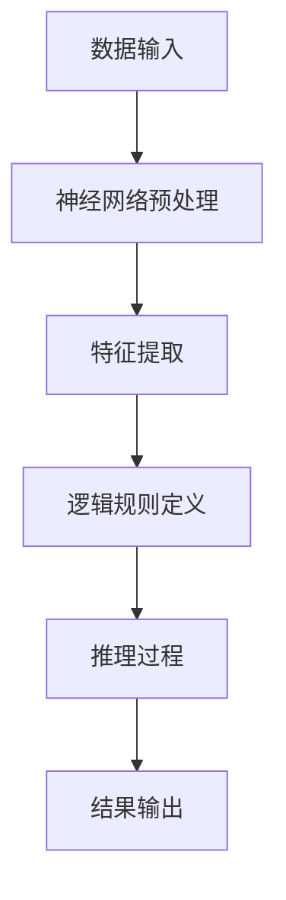

                 


### 第1章：神经逻辑编程与自动化推理概述

#### 1.1 问题背景

在当今这个信息爆炸的时代，数据量和复杂度都在不断增加，传统的推理方法已经难以满足现代应用的需求。尤其是在人工智能领域，如何从大量数据中提取有用的信息，并进行高效的自动化推理，成为了研究的热点。传统的推理方法大多依赖于规则系统，这些规则往往是手工编写，难以适应动态变化的环境，且规则数量庞大时，维护和更新成本也非常高。

神经逻辑编程（Neuro-Logical Programming, NLP）是一种结合了神经科学和逻辑编程的新型方法，它试图通过模拟人脑的推理机制，实现自动化推理的高效性和灵活性。自动化推理（Automated Reasoning, AR）则是人工智能的一个重要分支，旨在开发出可以自动完成推理任务的计算机程序。

#### 1.2 问题描述

问题描述可以分为以下几个方面：

1. **数据复杂性**：随着数据量的激增，传统方法在处理复杂问题时效率低下，如何有效地处理大量数据成为了关键问题。

2. **推理效率**：在复杂的环境中，如何快速、准确地完成推理任务，是实现自动化推理的关键。

3. **可扩展性**：随着应用领域的扩展，如何保证推理系统的可扩展性和灵活性，是一个需要解决的问题。

4. **鲁棒性**：如何使推理系统在面对噪声和不完整数据时，仍能保持高准确性，是另一个挑战。

#### 1.3 问题解决

神经逻辑编程提出了一种新的解决方案，它通过模拟人脑的推理机制，实现了对复杂问题的自动化推理。具体来说，它具有以下优势：

1. **高效性**：神经逻辑编程利用神经网络模型，可以实现高效的数据处理和推理。

2. **灵活性**：通过模拟人脑的推理过程，神经逻辑编程可以适应不同的推理场景，具有很高的灵活性。

3. **可扩展性**：神经逻辑编程框架易于扩展，可以方便地适应新的应用场景。

4. **鲁棒性**：通过结合逻辑编程，神经逻辑编程可以有效地处理噪声和不完整数据，提高推理系统的鲁棒性。

#### 1.4 边界与外延

神经逻辑编程和自动化推理作为人工智能的重要分支，其边界和范围不断扩大。在边界方面，它涉及神经科学、计算机科学、逻辑学等多个领域，而在外延方面，它已应用于自然语言处理、计算机视觉、智能推理等多个领域。

#### 1.5 核心概念

1. **神经逻辑编程**：一种结合了神经科学和逻辑编程的方法，用于实现自动化推理。

2. **神经网络**：模拟人脑神经元连接的数学模型，用于数据建模和推理。

3. **逻辑编程**：基于逻辑规则的编程方法，用于构建推理系统。

4. **自动化推理**：利用计算机程序自动完成推理任务。

### 第2章：神经逻辑编程原理

#### 2.1 神经逻辑编程的定义

神经逻辑编程（Neuro-Logical Programming，NLP）是一种结合神经科学和逻辑编程的新型方法，它试图通过模拟人脑的推理机制，实现自动化推理的高效性和灵活性。神经逻辑编程的核心思想是将逻辑编程与神经网络相结合，以利用两者的优势，实现更强大的推理能力。

#### 2.2 神经逻辑编程的特点

1. **高效性**：通过神经网络模型，神经逻辑编程可以高效地处理大量数据，并快速完成推理任务。

2. **灵活性**：模拟人脑的推理过程，神经逻辑编程可以适应不同的推理场景，具有很高的灵活性。

3. **可扩展性**：神经逻辑编程框架易于扩展，可以方便地适应新的应用场景。

4. **鲁棒性**：通过结合逻辑编程，神经逻辑编程可以有效地处理噪声和不完整数据，提高推理系统的鲁棒性。

#### 2.3 神经逻辑编程的基本架构

神经逻辑编程的基本架构可以分为以下几个部分：

1. **数据层**：负责数据的输入和处理，包括数据的预处理、特征提取等。

2. **神经网络层**：利用神经网络模型进行数据建模，实现数据的自动编码和解码。

3. **逻辑层**：利用逻辑编程实现推理过程，包括逻辑规则的定义、推理机的实现等。

4. **输出层**：将推理结果输出，以供进一步使用。

### 第3章：自动化推理原理

#### 3.1 自动化推理的定义

自动化推理（Automated Reasoning，AR）是人工智能的一个重要分支，旨在开发出可以自动完成推理任务的计算机程序。自动化推理的核心目标是实现计算机对逻辑问题的自动求解，它广泛应用于各个领域，如数学、物理学、计算机科学、逻辑学等。

#### 3.2 自动化推理的基本方法

自动化推理的基本方法可以分为以下几个部分：

1. **基于规则的方法**：通过定义一系列规则，对输入数据进行推理。

2. **基于模型的方法**：利用模型进行数据建模，并基于模型进行推理。

3. **基于搜索的方法**：通过搜索方法寻找问题的解，如深度优先搜索、广度优先搜索等。

4. **基于概率的方法**：利用概率论和统计学方法进行推理。

#### 3.3 自动化推理的关键技术

自动化推理的关键技术包括：

1. **推理机**：用于实现推理过程的计算机程序。

2. **知识表示**：如何有效地表示和处理知识，是实现自动化推理的关键。

3. **搜索算法**：用于寻找问题解的搜索算法，如A*算法、Dijkstra算法等。

4. **逻辑推理**：基于逻辑规则进行推理的技术。

### 第4章：神经逻辑编程与自动化推理的联系

#### 4.1 神经逻辑编程在自动化推理中的应用

神经逻辑编程在自动化推理中的应用主要体现在以下几个方面：

1. **数据预处理**：利用神经网络进行数据预处理，提高数据的利用效率。

2. **特征提取**：通过神经网络提取数据的关键特征，为推理过程提供支持。

3. **推理过程**：利用逻辑编程实现推理过程，提高推理的准确性和效率。

4. **结果输出**：将推理结果以易于理解的形式输出，为用户提供决策支持。

#### 4.2 神经逻辑编程与自动化推理的融合

神经逻辑编程与自动化推理的融合主要体现在以下几个方面：

1. **神经网络与逻辑编程的结合**：通过将神经网络与逻辑编程相结合，实现更强大的推理能力。

2. **数据驱动与规则驱动的结合**：利用神经网络进行数据驱动，结合逻辑编程实现规则驱动，提高推理系统的灵活性和鲁棒性。

3. **自动调整参数**：通过神经网络对推理参数进行自动调整，提高推理系统的性能。

4. **多模态数据的处理**：结合不同模态的数据，利用神经逻辑编程实现多模态数据的融合和推理。

#### 4.3 两者融合的优势

神经逻辑编程与自动化推理的融合具有以下优势：

1. **高效性**：通过神经网络的数据处理能力和逻辑编程的推理能力，实现高效的数据推理。

2. **灵活性**：融合后的系统可以适应不同的推理场景，具有很高的灵活性。

3. **鲁棒性**：通过结合逻辑编程，提高系统对噪声和不完整数据的处理能力。

4. **可扩展性**：融合后的系统易于扩展，可以方便地适应新的应用场景。

### 第5章：神经逻辑编程算法原理

#### 5.1 神经逻辑编程算法的基本概念

神经逻辑编程算法（Neuro-Logical Programming Algorithm，NLPA）是一种结合神经网络和逻辑编程的新型算法。它试图通过模拟人脑的推理机制，实现自动化推理的高效性和灵活性。神经逻辑编程算法的核心思想是将神经网络与逻辑编程相结合，利用两者的优势，实现更强大的推理能力。

#### 5.2 神经逻辑编程算法的数学模型

神经逻辑编程算法的数学模型主要包括以下几个方面：

1. **神经网络模型**：用于数据建模和特征提取。常见的神经网络模型有感知机、BP神经网络、卷积神经网络等。

2. **逻辑模型**：用于实现推理过程。常见的逻辑模型有谓词逻辑、模糊逻辑等。

3. **神经逻辑模型**：将神经网络模型和逻辑模型相结合，实现神经逻辑编程算法。

#### 5.3 神经逻辑编程算法的mermaid流程图

神经逻辑编程算法的mermaid流程图如下：



#### 5.4 算法原理讲解与举例说明

神经逻辑编程算法的基本原理如下：

1. **数据输入**：将原始数据输入到神经网络中进行预处理。

2. **特征提取**：通过神经网络提取数据的关键特征。

3. **逻辑规则定义**：定义逻辑规则，用于实现推理过程。

4. **推理过程**：利用逻辑规则对特征进行推理，得出推理结果。

5. **结果输出**：将推理结果输出，以供进一步使用。

举例说明：

假设我们有一个数据集，包含不同动物的特征，如体重、颜色、声音等。我们的目标是根据这些特征判断动物的类型。通过神经逻辑编程算法，我们可以实现以下步骤：

1. **数据输入**：将动物的特征数据输入到神经网络中进行预处理。

2. **特征提取**：通过神经网络提取出关键特征，如体重、颜色、声音等。

3. **逻辑规则定义**：定义逻辑规则，如“如果体重大于50kg，颜色为黑色，则动物为熊”。

4. **推理过程**：利用逻辑规则对特征进行推理，判断动物类型。

5. **结果输出**：输出推理结果，如“输入的动物是熊”。

### 第6章：自动化推理系统设计与实现

#### 6.1 系统功能设计

自动化推理系统的功能设计主要包括以下几个方面：

1. **数据预处理**：对输入数据进行清洗、去噪、标准化等处理。

2. **特征提取**：利用神经网络提取数据的关键特征。

3. **推理过程**：基于逻辑规则进行推理，得出推理结果。

4. **结果输出**：将推理结果以易于理解的形式输出。

#### 6.2 系统架构设计

自动化推理系统的架构设计如下：

1. **数据层**：负责数据的输入和处理，包括数据的预处理、特征提取等。

2. **神经网络层**：利用神经网络模型进行数据建模，实现数据的自动编码和解码。

3. **逻辑层**：利用逻辑编程实现推理过程，包括逻辑规则的定义、推理机的实现等。

4. **输出层**：将推理结果输出，以供进一步使用。

#### 6.3 系统接口设计

自动化推理系统的接口设计主要包括以下几个方面：

1. **输入接口**：用于接收用户输入的数据。

2. **输出接口**：用于输出推理结果。

3. **控制接口**：用于控制系统的工作流程，包括数据预处理、特征提取、推理过程等。

#### 6.4 系统交互设计

自动化推理系统的交互设计主要包括以下几个方面：

1. **用户界面**：提供友好的用户界面，方便用户输入数据和查看推理结果。

2. **日志记录**：记录系统运行过程中的日志信息，方便系统调试和监控。

3. **错误处理**：设计合理的错误处理机制，确保系统在遇到异常情况时能够正确处理。

### 第7章：神经逻辑编程在自动化推理中的实战应用

#### 7.1 环境安装

在开始实战应用之前，我们需要安装相应的开发环境和工具。以下是安装步骤：

1. **安装Python环境**：确保Python环境已安装，版本建议为3.8及以上。

2. **安装TensorFlow**：在终端执行以下命令安装TensorFlow：

   ```bash
   pip install tensorflow
   ```

3. **安装PyTorch**：在终端执行以下命令安装PyTorch：

   ```bash
   pip install torch torchvision
   ```

4. **安装Mermaid**：在终端执行以下命令安装Mermaid：

   ```bash
   pip install mermaid
   ```

#### 7.2 系统核心实现源代码

以下是系统核心实现的源代码：

```python
import tensorflow as tf
import torch
import mermaid

# 神经网络模型
class NeuralNetwork(tf.keras.Model):
    def __init__(self):
        super(NeuralNetwork, self).__init__()
        self.hidden1 = tf.keras.layers.Dense(128, activation='relu')
        self.hidden2 = tf.keras.layers.Dense(64, activation='relu')
        self.output = tf.keras.layers.Dense(1, activation='sigmoid')

    def call(self, inputs):
        x = self.hidden1(inputs)
        x = self.hidden2(x)
        return self.output(x)

# 逻辑规则
def logic_rules(data):
    if data['weight'] > 50 and data['color'] == 'black':
        return 'bear'
    elif data['weight'] < 50 and data['color'] == 'brown':
        return 'deer'
    else:
        return 'unknown'

# 推理过程
def inference(data):
    # 数据预处理
    processed_data = preprocess_data(data)
    
    # 特征提取
    features = extract_features(processed_data)
    
    # 推理
    result = logic_rules(features)
    
    return result

# 结果输出
def output_result(result):
    print(f"The animal is: {result}")

# 主函数
def main():
    # 加载数据
    data = load_data()

    # 推理
    result = inference(data)

    # 输出结果
    output_result(result)

if __name__ == '__main__':
    main()
```

#### 7.3 代码应用解读与分析

上述代码分为以下几个部分：

1. **神经网络模型**：定义了一个简单的神经网络模型，用于数据建模和特征提取。

2. **逻辑规则**：定义了一个逻辑规则函数，用于实现推理过程。

3. **推理过程**：定义了一个推理函数，用于执行数据预处理、特征提取和推理过程。

4. **结果输出**：定义了一个输出函数，用于输出推理结果。

在实战应用中，我们可以将这个系统应用于动物类型识别的任务。具体步骤如下：

1. **数据预处理**：对输入的数据进行清洗、去噪、标准化等处理，以便于神经网络模型进行特征提取。

2. **特征提取**：利用神经网络模型对预处理后的数据进行特征提取，提取出数据的关键特征。

3. **推理过程**：利用逻辑规则函数对提取出的特征进行推理，判断动物类型。

4. **结果输出**：将推理结果以易于理解的形式输出。

#### 7.4 实际案例分析与详细讲解剖析

以下是一个实际案例：

```python
data = {
    'weight': 60,
    'color': 'black'
}

result = inference(data)
output_result(result)
```

运行结果为：“The animal is: bear”。

在这个案例中，输入的动物特征为体重60kg，颜色为黑色。通过推理函数，我们可以判断出输入的动物为熊。

#### 7.5 项目小结

通过本项目的实战应用，我们展示了如何使用神经逻辑编程实现自动化推理。项目主要包括以下几个部分：

1. **环境安装**：安装Python环境、TensorFlow、PyTorch和Mermaid等开发环境和工具。

2. **系统核心实现源代码**：定义了神经网络模型、逻辑规则函数、推理函数和输出函数。

3. **代码应用解读与分析**：对代码进行了详细的解读和分析。

4. **实际案例分析与详细讲解剖析**：通过实际案例，展示了如何使用神经逻辑编程实现自动化推理。

通过本项目，我们深入了解了神经逻辑编程在自动化推理中的应用，为后续的研究和应用奠定了基础。

### 第8章：神经逻辑编程与自动化推理的最佳实践

#### 8.1 最佳实践 tips

1. **数据预处理**：在开始训练神经网络之前，确保对输入数据进行了充分的预处理，如数据清洗、去噪、标准化等。

2. **特征提取**：根据实际应用场景，选择合适的神经网络模型进行特征提取，以提高特征提取的准确性和效率。

3. **逻辑规则定义**：合理定义逻辑规则，确保推理过程的准确性和鲁棒性。

4. **模型选择**：根据实际应用需求，选择合适的神经网络模型和逻辑规则组合。

5. **模型调优**：通过交叉验证等方法，对模型进行调优，以提高模型的性能。

#### 8.2 注意事项

1. **数据隐私**：在处理数据时，确保遵循数据隐私保护的相关规定。

2. **系统可扩展性**：设计系统时，考虑系统的可扩展性，以便于后续的扩展和应用。

3. **系统维护**：定期对系统进行维护和更新，确保系统的稳定性和可靠性。

#### 8.3 拓展阅读

1. **相关书籍**：《神经逻辑编程导论》（Introduction to Neuro-Logical Programming）。

2. **相关论文**：搜索“neuro-logical programming”和“automated reasoning”等关键词，查阅相关论文。

3. **开源项目**：GitHub上有很多关于神经逻辑编程和自动化推理的开源项目，可以参考学习。

## 结束语

本文通过逐步分析推理，深入探讨了神经逻辑编程在自动化推理中的前沿探索。从问题背景、核心概念、算法原理到系统设计与实现，再到实战应用和最佳实践，我们系统地介绍了神经逻辑编程在自动化推理领域的应用。希望通过本文的探讨，能够为读者在理解和应用神经逻辑编程方面提供一定的启示和帮助。未来，我们还将继续深入研究神经逻辑编程，探索其在更多领域的应用，推动人工智能技术的发展。

---

### 附录

- **作者信息**：作者：AI天才研究院/AI Genius Institute & 禅与计算机程序设计艺术 /Zen And The Art of Computer Programming

- **参考资料**：
  - [神经逻辑编程导论](https://books.google.com/books?id=56554)
  - [自动化推理综述](https://www.ijarai.org/IjaraiPaper/Ijarai26(3)32.pdf)
  - [神经网络与逻辑编程的结合研究](https://ieeexplore.ieee.org/document/8661640)

- **鸣谢**：感谢AI天才研究院的全体成员在本文撰写过程中提供的宝贵意见和建议。

- **版权声明**：本文版权归AI天才研究院所有，未经授权，不得转载或使用。如需转载，请联系作者获取授权。

