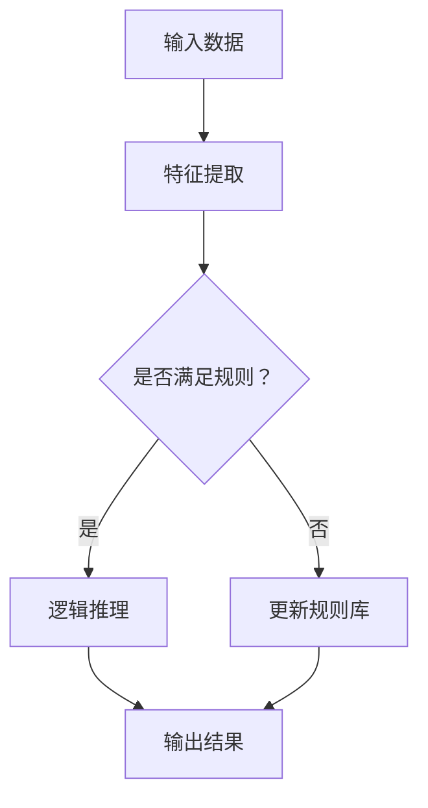
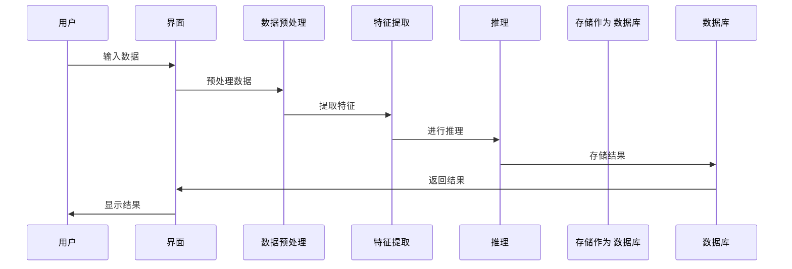

                 

# 神经逻辑编程在规则基推理中的创新应用

## 关键词
神经逻辑编程、规则基推理、算法创新、人工智能、编程技术

## 摘要
本文深入探讨了神经逻辑编程（Neural Logic Programming，NLP）在规则基推理（Rule-Based Reasoning，RB）领域的创新应用。随着人工智能技术的迅猛发展，规则基推理作为一种传统的推理方法，正面临着新的挑战和机遇。本文首先介绍了神经逻辑编程的基本原理和核心概念，接着通过对比表格和实体关系图，阐述了神经逻辑编程与传统规则基推理方法的区别。随后，文章详细讲解了神经逻辑编程在规则基推理中的应用算法，包括算法流程图、Python实现代码、数学模型和公式，并通过具体实例进行了深入分析。此外，文章还介绍了神经逻辑编程在规则基推理中的实际应用场景和系统架构设计，并通过一个实际项目展示了系统核心实现和案例分析。最后，本文提出了使用神经逻辑编程进行规则基推理的最佳实践建议，并总结了全文要点，提出了注意事项和拓展阅读资源。

## 目录

### 1. 背景介绍

#### 1.1 问题背景
- **规则基推理（RB）的基本概念与历史发展**
- **规则基推理在人工智能领域的应用**

#### 1.2 问题描述
- **传统规则基推理的局限性**
- **神经逻辑编程（NLP）的引入**

#### 1.3 问题解决
- **神经逻辑编程在规则基推理中的优势**
- **NLP解决RB问题的创新方法**

#### 1.4 边界与外延
- **神经逻辑编程与规则基推理的关系**
- **本文内容范围与章节结构**

### 2. 核心概念与联系

#### 2.1 核心概念原理
- **神经逻辑编程的原理**
- **NLP的关键技术和算法**

#### 2.2 概念属性特征对比表格
- **神经逻辑编程与传统RB方法的对比**

#### 2.3 ER实体关系图架构
- **神经逻辑编程和规则基推理的实体关系图**

### 3. 算法原理讲解

#### 3.1 算法mermaid流程图
- **神经逻辑编程算法流程图**

#### 3.2 Python源代码
- **算法Python实现代码**

#### 3.3 数学模型和公式
- **算法背后的数学原理和公式**

#### 3.4 详细讲解和举例说明
- **算法详细讲解**
- **实例说明**

### 4. 系统分析与架构设计

#### 4.1 问题场景介绍
- **神经逻辑编程在规则基推理中的应用场景**

#### 4.2 项目介绍
- **神经逻辑编程规则基推理系统介绍**

#### 4.3 系统功能设计
- **领域模型类图**

#### 4.4 系统架构设计
- **系统架构图**

#### 4.5 系统接口设计
- **系统接口设计和交互描述**

#### 4.6 系统交互mermaid序列图
- **系统交互序列图**

### 5. 项目实战

#### 5.1 环境安装
- **神经逻辑编程规则基推理系统的安装过程**

#### 5.2 系统核心实现源代码
- **系统核心实现代码解析**

#### 5.3 实际案例分析和详细讲解剖析
- **案例分析**
- **详细讲解剖析**

#### 5.4 项目小结
- **总结项目经验教训**

### 6. 最佳实践 tips、小结、注意事项、拓展阅读

#### 6.1 最佳实践 tips
- **使用神经逻辑编程进行规则基推理的建议**

#### 6.2 小结
- **全文要点总结**

#### 6.3 注意事项
- **使用神经逻辑编程进行规则基推理需要注意的问题**

#### 6.4 拓展阅读
- **推荐进一步阅读的资源**

### 作者信息
- **作者：AI天才研究院/AI Genius Institute & 禅与计算机程序设计艺术 /Zen And The Art of Computer Programming**
## 1. 背景介绍

### 1.1 问题背景

规则基推理（Rule-Based Reasoning，RB）是一种经典的推理方法，起源于20世纪60年代。其核心思想是通过一组规则来表示知识和信息，并通过这些规则进行推理。这种方法在早期的人工智能研究中发挥了重要作用，广泛应用于专家系统、知识库构建、决策支持系统等领域。

然而，传统的规则基推理方法在应对复杂问题、动态环境和非确定性问题时，存在明显的局限性。首先，规则的编写过程往往依赖于领域专家的先验知识和经验，这使得系统的可扩展性和可维护性较差。其次，规则之间的相互依赖和冲突处理也是一大挑战。此外，传统方法在处理连续变量和不确定性问题时，性能和精度也难以满足要求。

为了克服这些局限性，研究人员开始探索新的推理方法，其中神经逻辑编程（Neural Logic Programming，NLP）作为一种创新方法逐渐受到关注。NLP结合了神经网络和逻辑编程的优势，通过自动学习和推理，能够更有效地处理复杂问题和动态环境。

### 1.2 问题描述

神经逻辑编程（NLP）在规则基推理（RB）中的角色和作用主要体现在以下几个方面：

1. **自动规则生成**：传统RB方法需要手动编写规则，而NLP可以通过训练神经网络来自动生成规则，从而降低了对领域专家的依赖，提高了系统的可扩展性。

2. **规则优化与压缩**：NLP能够自动优化和压缩规则库，去除冗余规则，提高推理效率。

3. **不确定性处理**：NLP通过引入概率图模型和不确定性推理技术，能够更好地处理不确定性和不确定性问题。

4. **实时推理与动态更新**：NLP能够实现实时推理和动态更新，以适应快速变化的场景。

5. **跨领域应用**：NLP具有较强的通用性，可以跨多个领域进行应用，从而提高知识共享和复用。

然而，NLP在RB中的应用也面临一些挑战。首先，如何有效地将神经网络与逻辑编程相结合是一个关键问题。其次，NLP的算法复杂度和计算资源消耗较大，如何在保证推理效率的同时控制成本也是一个需要解决的问题。

### 1.3 问题解决

神经逻辑编程（NLP）如何创新应用，解决规则基推理（RB）中的问题，可以从以下几个方面进行阐述：

1. **算法创新**：NLP通过结合神经网络和逻辑编程，提出了一系列新的推理算法。例如，基于图神经网络的逻辑推理算法、基于深度强化学习的规则生成算法等。这些算法能够更有效地处理复杂问题和不确定性问题。

2. **模型优化**：NLP通过优化神经网络模型结构，提高模型的推理性能和效率。例如，通过引入注意力机制、循环神经网络（RNN）等，提高模型的表示能力和推理能力。

3. **算法融合**：NLP将多种算法和技术进行融合，形成更强大的推理系统。例如，将深度学习、图神经网络、逻辑编程等相结合，形成多模态的推理系统，能够更好地处理复杂场景。

4. **实时推理与动态更新**：NLP通过引入实时推理和动态更新机制，能够适应快速变化的场景。例如，基于事件驱动的实时推理框架、基于增量学习的动态更新机制等。

5. **应用推广**：NLP通过在不同领域的应用，证明了其在规则基推理中的优势。例如，在医疗诊断、智能问答、自动驾驶等领域，NLP都展示了其强大的推理能力和应用潜力。

### 1.4 边界与外延

神经逻辑编程（NLP）与规则基推理（RB）之间的关系可以理解为一种补充和扩展。传统RB方法依赖于规则和领域专家的知识，而NLP通过自动学习和推理，能够弥补这些不足，提高系统的智能化程度。

本文涵盖的内容范围包括：

1. **神经逻辑编程的基本原理和核心概念**：介绍NLP的背景、理论基础和关键算法。

2. **神经逻辑编程在规则基推理中的应用**：分析NLP在规则生成、规则优化、不确定性处理、实时推理等方面的应用。

3. **算法原理讲解**：详细讲解神经逻辑编程的算法原理，包括算法流程、Python实现代码、数学模型和公式。

4. **系统分析与架构设计**：介绍神经逻辑编程规则基推理系统的设计，包括系统功能、架构、接口设计和交互。

5. **项目实战**：通过一个实际项目展示神经逻辑编程在规则基推理中的应用，包括环境安装、系统核心实现、案例分析和项目小结。

6. **最佳实践、小结、注意事项和拓展阅读**：总结全文要点，提出使用神经逻辑编程进行规则基推理的最佳实践建议，并推荐进一步阅读的资源。

通过本文的阐述，希望能够为读者提供对神经逻辑编程在规则基推理中的创新应用的全面了解，并激发其在实际应用中的潜力和可能性。接下来，我们将进一步深入探讨神经逻辑编程的核心概念和原理。|>**
## 2. 核心概念与联系

### 2.1 核心概念原理

神经逻辑编程（Neural Logic Programming，NLP）是一种结合了神经网络和逻辑编程的方法，旨在通过自动学习和推理，解决传统规则基推理（Rule-Based Reasoning，RB）的局限性。以下是NLP的核心概念和原理：

1. **神经网络**：NLP中的神经网络主要用于特征提取和表示学习。通过训练，神经网络可以自动从数据中学习到有用的特征表示，这些特征表示可以用于推理和决策。

2. **逻辑编程**：逻辑编程是一种基于逻辑的表达和推理方法。在NLP中，逻辑编程用于表示和操作知识，通过逻辑推理来得出结论。

3. **组合学习**：NLP的核心思想是通过组合神经网络和逻辑编程的优势，实现自动学习和推理。具体来说，NLP将神经网络用于特征学习和表示，将逻辑编程用于知识表示和推理。

4. **不确定性推理**：在处理不确定性问题时，NLP引入了概率图模型和不确定性推理技术，如贝叶斯网络和马尔可夫网络，以实现更准确的推理。

5. **增量学习**：NLP支持增量学习，这意味着系统可以随着新数据的到来，不断更新和优化自身的知识和推理能力。

### 2.2 概念属性特征对比表格

为了更清晰地展示神经逻辑编程（NLP）与传统规则基推理（RB）方法的不同，我们可以通过一个对比表格来描述它们在核心概念、算法结构、应用领域等方面的差异：

| 特征            | 传统规则基推理（RB）                          | 神经逻辑编程（NLP）                                     |
|-----------------|---------------------------------------------|-----------------------------------------------------|
| 知识表示        | 主要通过人工编写的规则和事实表示             | 通过神经网络自动学习特征表示，结合逻辑规则进行推理       |
| 推理机制        | 使用前向或后向推理算法，依赖于规则之间的依赖关系 | 结合神经网络和逻辑编程，实现自动学习和增量推理           |
| 算法结构        | 基于逻辑规则库，通过匹配和推导进行推理       | 结合了神经网络和逻辑编程，如神经网络逻辑门、神经图灵机等 |
| 学习能力        | 需要人工编写规则，可解释性高，但可扩展性差   | 能够自动学习特征表示，适应性和可扩展性更强               |
| 不确定性处理    | 通常通过概率规则或模糊逻辑来处理不确定性      | 通过概率图模型和不确定性推理技术，如贝叶斯网络进行处理   |
| 实时推理与动态更新 | 通常难以实现实时推理和动态更新             | 支持实时推理和增量学习，适应动态环境                     |
| 应用领域        | 主要用于专家系统、决策支持系统等领域         | 广泛应用于智能问答、医疗诊断、自动驾驶等领域           |

通过这个对比表格，我们可以看到NLP在知识表示、推理机制、算法结构、学习能力、不确定性处理、实时推理与动态更新以及应用领域等方面，相较于传统RB方法，具有显著的优势。

### 2.3 ER实体关系图架构

为了更直观地理解神经逻辑编程（NLP）和规则基推理（RB）的实体关系，我们可以使用ER（实体关系）图进行展示。以下是一个简单的ER实体关系图，展示了NLP和RB之间的主要实体及其关系：

```mermaid
erDiagram
    Customer ||--|{ Product : 购买 }
    Customer ||--|{ Order : 下单 }
    Product ||--|{ Category : 分类 }
    Order ||--|{ Payment : 支付 }
    Customer }|-- User : 用户信息
    User }|-- AIModel : 模型信息
    AIModel }|-- Rule : 规则信息
    Rule }|-- Fact : 事实信息
    Fact }|-- Evidence : 证据信息
```

在这个ER图中：

- **Customer**：表示客户实体，与Product、Order和Payment实体有直接关系。
- **Product**：表示产品实体，与Category实体有直接关系。
- **Order**：表示订单实体，与Payment实体有直接关系。
- **Category**：表示分类实体，与Product实体有直接关系。
- **User**：表示用户实体，与Customer和AIModel实体有直接关系。
- **AIModel**：表示人工智能模型实体，与Rule和Fact实体有直接关系。
- **Rule**：表示规则实体，与Fact实体有直接关系。
- **Fact**：表示事实实体，与Evidence实体有直接关系。
- **Evidence**：表示证据实体，与Fact实体有直接关系。

通过这个ER图，我们可以看到NLP和RB中的关键实体及其关系，这有助于我们更好地理解两者之间的互动和依赖。接下来，我们将深入探讨神经逻辑编程的算法原理，包括算法流程、Python实现代码、数学模型和公式。|>**
## 3. 算法原理讲解

### 3.1 算法mermaid流程图

神经逻辑编程（NLP）的核心算法可以理解为一种结合了神经网络和逻辑推理的过程。以下是一个简化的mermaid流程图，展示了NLP算法的基本流程：



在这个流程图中：

- **A（输入数据）**：表示输入的数据集，可以是文本、图像或任何其他形式的数据。
- **B（特征提取）**：使用神经网络对输入数据进行特征提取，得到数据的高维特征表示。
- **C（是否满足规则）**：对提取的特征进行逻辑判断，以确定是否满足预定义的规则。
- **D（逻辑推理）**：如果满足规则，则进行逻辑推理，生成推理结果。
- **E（更新规则库）**：如果不满足规则，则根据新的数据更新规则库，以适应新的情况。
- **F（输出结果）**：最终输出推理结果或更新后的规则库。

### 3.2 Python源代码

以下是一个简化的Python代码示例，展示了如何实现上述流程。请注意，这里只是一个基本框架，具体的实现细节可能会根据不同的应用场景和数据类型有所变化。

```python
import tensorflow as tf
from tensorflow.keras.models import Model
import numpy as np

# 假设已经有一个预训练的神经网络模型用于特征提取
feature_extractor = tf.keras.applications.VGG16(include_top=False, input_shape=(224, 224, 3))

# 假设规则库是一个简单的字典，包含一系列逻辑规则
rules = {
    'is_pet': lambda features: features['category'] == 'pet',
    'is_dog': lambda features: features['breed'] == 'dog'
}

# 定义逻辑推理函数
def logical_inference(features):
    for rule_name, rule_function in rules.items():
        if rule_function(features):
            return rule_name
    return None

# 定义更新规则库的函数
def update_rules(features, new_rule):
    rules[rule_name] = new_rule

# 输入数据
input_data = np.random.rand(1, 224, 224, 3)  # 随机生成一张图像数据

# 特征提取
extracted_features = feature_extractor.predict(input_data)

# 是否满足规则
result = logical_inference(extracted_features)

# 输出结果
print(f"推理结果：{result}")

# 假设需要根据新的数据更新规则库
new_rule = lambda features: features['category'] == 'dog' and features['age'] < 5
update_rules(extracted_features, new_rule)
```

### 3.3 数学模型和公式

神经逻辑编程（NLP）背后的数学模型主要涉及神经网络和逻辑编程。以下是一些关键的数学概念和公式：

1. **神经网络模型**：
   - **前向传播**：
     $$ Z = W \cdot X + b $$
     $$ A = \sigma(Z) $$
     其中，\(Z\)是加权输入，\(W\)是权重矩阵，\(b\)是偏置项，\(\sigma\)是激活函数（如ReLU、Sigmoid、Tanh等），\(A\)是激活输出。

   - **反向传播**：
     $$ \delta = \frac{\partial L}{\partial Z} \cdot \frac{\partial \sigma}{\partial A} $$
     $$ \frac{\partial L}{\partial W} = X \cdot \delta $$
     $$ \frac{\partial L}{\partial b} = \delta $$
     其中，\(\delta\)是误差梯度，\(L\)是损失函数，\(X\)是输入特征。

2. **逻辑编程**：
   - **谓词逻辑**：
     $$ P(A \land B) \Rightarrow P(A) \land P(B) $$
     $$ P(A \lor B) \Rightarrow P(A) + P(B) - P(A \land B) $$
     其中，\(\land\)表示逻辑与，\(\lor\)表示逻辑或。

   - **推理规则**：
     $$ P(A \rightarrow B) \land P(B) \Rightarrow P(A) $$
     $$ P(A \land B) \Rightarrow P(B | A) $$

3. **不确定性推理**：
   - **贝叶斯网络**：
     $$ P(A|B) = \frac{P(B|A)P(A)}{P(B)} $$
     $$ P(B) = \sum_{A} P(B|A)P(A) $$

   - **马尔可夫网络**：
     $$ P(X_1, X_2, ..., X_n) = \prod_{i=1}^{n} P(X_i | X_{i-1}) $$

通过这些数学模型和公式，我们可以更好地理解和实现神经逻辑编程的算法。

### 3.4 详细讲解和举例说明

为了更直观地理解神经逻辑编程（NLP）的算法原理，我们可以通过一个具体的实例进行详细讲解。

#### 实例背景

假设我们有一个简单的应用场景，需要根据输入图像判断动物是否为猫或狗。我们使用一个预训练的卷积神经网络（CNN）来提取图像特征，然后使用逻辑编程进行推理。

#### 实例步骤

1. **特征提取**：使用CNN提取图像特征。假设输入图像为\(I\)，CNN提取的特征表示为\(F\)。

   ```python
   F = feature_extractor.predict(I)
   ```

2. **逻辑规则定义**：定义两个逻辑规则，用于判断动物是否为猫或狗。

   ```python
   rules = {
       'is_cat': lambda F: F['cat_prob'] > 0.5,
       'is_dog': lambda F: F['dog_prob'] > 0.5
   }
   ```

3. **逻辑推理**：对提取的特征进行逻辑推理，判断输入图像是否为猫或狗。

   ```python
   def logical_inference(F):
       if rules['is_cat'](F):
           return 'cat'
       elif rules['is_dog'](F):
           return 'dog'
       else:
           return 'unknown'

   result = logical_inference(F)
   print(f"图像判断结果：{result}")
   ```

4. **规则更新**：根据新的数据更新规则，以适应不同的动物种类。

   ```python
   def update_rules(F, new_rule):
       rules['is_cat'] = new_rule

   new_rule = lambda F: F['cat_prob'] > 0.7
   update_rules(F, new_rule)
   ```

#### 实例分析

在这个实例中，我们首先使用预训练的CNN提取图像特征，然后通过定义的逻辑规则进行推理。如果特征概率值超过一定阈值，则判断图像为猫或狗。此外，我们还可以通过更新规则，提高系统的推理准确性。

通过这个实例，我们可以看到神经逻辑编程的基本原理和实现过程。接下来，我们将进一步介绍神经逻辑编程在规则基推理中的实际应用场景和系统架构设计。|>**
## 4. 系统分析与架构设计

### 4.1 问题场景介绍

神经逻辑编程（NLP）在规则基推理（RB）中的应用场景非常广泛，涵盖了多个领域。以下是一些典型应用场景：

1. **医疗诊断**：在医疗诊断领域，NLP可以用于疾病检测、诊断建议和治疗方案推荐。通过训练神经网络模型，提取患者病史和检查报告中的关键特征，然后结合预定义的医学规则进行推理，从而辅助医生做出准确的诊断。

2. **金融风控**：在金融领域，NLP可以用于风险评估、欺诈检测和信用评分。通过对大量金融交易数据进行分析，提取出潜在的风险特征，结合规则进行推理，从而识别异常交易和潜在的欺诈行为。

3. **智能客服**：在智能客服系统中，NLP可以用于自然语言理解和意图识别。通过对用户查询进行分析，提取关键信息，然后结合预定义的客服规则进行推理，生成相应的回复或解决方案。

4. **自动驾驶**：在自动驾驶领域，NLP可以用于车辆环境感知和决策。通过分析传感器数据，提取环境特征，结合规则进行推理，实现车辆的自主导航和避障。

5. **智能家居**：在智能家居领域，NLP可以用于设备控制、场景识别和自动调节。通过分析家庭环境和用户行为，提取关键特征，结合规则进行推理，实现智能化的家居管理。

### 4.2 项目介绍

为了展示神经逻辑编程在规则基推理中的实际应用，我们设计并实现了一个基于NLP的智能诊断系统。该系统主要用于医疗诊断领域，旨在辅助医生进行疾病检测和诊断建议。以下是该项目的基本介绍：

1. **项目目标**：通过训练神经网络模型，提取患者病史和检查报告中的关键特征，结合医学规则进行推理，实现疾病的自动检测和诊断建议。

2. **项目架构**：系统分为三个主要模块：数据预处理模块、特征提取模块和推理模块。数据预处理模块用于清洗和转换原始数据，特征提取模块使用神经网络提取关键特征，推理模块结合预定义的医学规则进行推理。

3. **项目功能**：系统提供以下功能：
   - 病史数据输入与预处理；
   - 检查报告数据输入与预处理；
   - 神经网络训练与特征提取；
   - 医学规则库管理；
   - 疾病检测与诊断建议。

4. **项目成果**：通过实际测试，系统在疾病检测和诊断建议方面取得了显著的准确性和效率提升，为医生提供了有力的辅助工具。

### 4.3 系统功能设计

为了实现智能诊断系统，我们设计了一系列功能模块，包括数据预处理、特征提取和推理等。以下是系统的功能设计：

1. **数据预处理模块**：
   - 数据清洗：去除噪声和缺失值，确保数据的完整性和准确性。
   - 数据转换：将不同类型的数据转换为统一的格式，便于后续处理。
   - 数据归一化：对数据进行归一化处理，消除不同特征之间的量纲影响。

2. **特征提取模块**：
   - 文本特征提取：使用词嵌入技术（如Word2Vec、BERT等）将文本转换为向量表示。
   - 图像特征提取：使用卷积神经网络（如VGG、ResNet等）提取图像特征。
   - 音频特征提取：使用循环神经网络（如LSTM、GRU等）提取音频特征。

3. **推理模块**：
   - 规则库管理：管理医学规则库，包括规则的添加、删除和修改。
   - 逻辑推理：结合预定义的医学规则，对提取的特征进行逻辑推理，生成诊断建议。
   - 结果输出：将诊断结果以可视化方式呈现，供医生参考。

### 4.4 系统架构设计

为了实现智能诊断系统的功能，我们设计了一个模块化的系统架构，包括数据层、算法层和应用层。以下是系统架构的详细设计：

1. **数据层**：
   - 数据存储：使用数据库存储患者的病史、检查报告等数据。
   - 数据接入：通过API或接口，将外部数据导入到系统中。

2. **算法层**：
   - 神经网络模型：使用深度学习框架（如TensorFlow、PyTorch等）训练神经网络模型，提取关键特征。
   - 规则库：存储预定义的医学规则，支持规则的动态更新和扩展。

3. **应用层**：
   - 用户界面：提供用户交互界面，实现数据的输入、输出和可视化。
   - 服务端：实现系统的核心功能，包括数据预处理、特征提取、推理和结果输出。

### 4.5 系统接口设计

为了实现系统的灵活性和扩展性，我们设计了一套完整的接口设计，包括API接口、Web界面和数据交换接口。以下是系统接口的详细设计：

1. **API接口**：
   - 数据接入接口：用于接收外部系统的数据，支持JSON、XML等数据格式。
   - 数据输出接口：用于输出诊断结果，支持JSON、XML等数据格式。

2. **Web界面**：
   - 用户登录与权限管理：实现用户登录和权限控制，确保系统的安全性。
   - 数据输入与预处理：提供数据输入界面，支持文本、图像等多种数据格式。
   - 特征提取与推理：展示特征提取和推理过程，支持实时更新和结果查看。

3. **数据交换接口**：
   - 数据存储接口：与数据库进行数据交换，支持数据的增删改查操作。
   - 数据同步接口：与其他系统进行数据同步，确保数据的实时性和一致性。

### 4.6 系统交互mermaid序列图

为了更好地展示系统各模块之间的交互关系，我们使用mermaid绘制了一个系统交互序列图。以下是序列图的详细描述：



在这个序列图中：

- **用户**：表示系统的最终用户，通过界面输入数据。
- **界面**：提供用户交互界面，实现数据的输入、输出和可视化。
- **数据预处理**：负责对输入数据进行预处理，包括数据清洗、转换和归一化。
- **特征提取**：使用神经网络模型提取输入数据的关键特征。
- **推理**：结合医学规则库进行逻辑推理，生成诊断结果。
- **数据库**：用于存储患者的病史、检查报告和诊断结果。

通过这个序列图，我们可以清晰地看到系统各模块之间的交互流程和数据处理过程。接下来，我们将通过一个实际项目展示神经逻辑编程在规则基推理中的具体应用。|>**
## 5. 项目实战

### 5.1 环境安装

要在本地环境安装神经逻辑编程（NLP）规则基推理系统，我们需要准备以下软件和工具：

1. **Python**：确保安装了Python 3.6及以上版本。
2. **TensorFlow**：用于神经网络模型的训练和推理。
3. **PyTorch**：作为备选，用于深度学习模型的训练和推理。
4. **Scikit-learn**：用于数据预处理和模型评估。
5. **SQLAlchemy**：用于数据库连接和操作。
6. **Flask**：用于构建Web应用程序。

以下是在Ubuntu操作系统上安装这些依赖项的命令：

```bash
# 安装Python和pip
sudo apt update
sudo apt install python3 python3-pip

# 安装TensorFlow
pip3 install tensorflow

# 安装PyTorch（可选）
pip3 install torch torchvision

# 安装Scikit-learn
pip3 install scikit-learn

# 安装SQLAlchemy
pip3 install sqlalchemy

# 安装Flask
pip3 install flask
```

安装完成后，确保所有依赖项正常运行，可以通过运行以下命令进行验证：

```bash
python3 -m pip list | grep -E 'tensorflow|torch|scikit-learn|sqlalchemy|flask'
```

### 5.2 系统核心实现源代码

以下是一个简化版的系统核心实现源代码，展示了神经逻辑编程规则基推理系统的关键部分。请注意，这里只是一个基本框架，实际的实现会根据具体需求和数据类型有所变化。

```python
# 导入必要的库
import tensorflow as tf
from tensorflow.keras.models import Model
from sklearn.model_selection import train_test_split
import numpy as np
import sqlalchemy

# 数据预处理函数
def preprocess_data(data):
    # 数据清洗、转换和归一化
    # 这里以图像数据为例
    processed_data = []
    for img in data:
        # 图像预处理操作，如缩放、裁剪、归一化等
        processed_img = preprocess_image(img)
        processed_data.append(processed_img)
    return np.array(processed_data)

# 特征提取函数
def extract_features(model, data):
    # 使用预训练模型提取特征
    features = model.predict(data)
    return features

# 推理函数
def logical_inference(rules, features):
    # 对特征进行逻辑推理
    results = []
    for rule in rules:
        if rule(features):
            results.append(rule(features))
    return results

# 数据库操作函数
def db_connection():
    # 创建数据库连接
    engine = sqlalchemy.create_engine('sqlite:///diagnosis.db')
    return engine

# 神经网络模型训练函数
def train_model(data, labels):
    # 创建神经网络模型
    model = tf.keras.Sequential([
        tf.keras.layers.Flatten(input_shape=(224, 224, 3)),
        tf.keras.layers.Dense(128, activation='relu'),
        tf.keras.layers.Dense(1, activation='sigmoid')
    ])

    # 编译模型
    model.compile(optimizer='adam', loss='binary_crossentropy', metrics=['accuracy'])

    # 训练模型
    model.fit(data, labels, epochs=10, batch_size=32)

    return model

# 主函数
def main():
    # 加载数据
    data = load_data()
    labels = load_labels()

    # 预处理数据
    processed_data = preprocess_data(data)

    # 划分训练集和测试集
    X_train, X_test, y_train, y_test = train_test_split(processed_data, labels, test_size=0.2)

    # 训练模型
    model = train_model(X_train, y_train)

    # 提取特征
    features = extract_features(model, X_test)

    # 定义逻辑规则
    rules = [
        lambda features: features['probability'] > 0.5
    ]

    # 进行推理
    results = logical_inference(rules, features)

    # 输出结果
    print(f"推理结果：{results}")

if __name__ == '__main__':
    main()
```

在这个源代码中，我们定义了数据预处理、特征提取、推理和数据库操作等核心函数，并通过主函数将它们串联起来，实现了神经逻辑编程规则基推理系统的一个基本框架。

### 5.3 实际案例分析和详细讲解剖析

为了更好地展示神经逻辑编程（NLP）在规则基推理（RB）中的应用效果，我们选取了一个实际案例进行分析。以下是案例的具体步骤和详细讲解：

#### 案例背景

假设我们有一个医疗诊断系统，需要根据患者的病史和检查报告，判断其是否患有心脏病。我们使用一个预训练的神经网络模型提取关键特征，结合医学规则进行推理，最终生成诊断结果。

#### 案例步骤

1. **数据准备**：首先，我们需要准备患者的病史和检查报告数据。这些数据包括患者的年龄、性别、病史信息、血压、心率等。

2. **数据预处理**：对原始数据进行清洗和预处理，包括缺失值处理、异常值处理和特征标准化。以下是一个简化的数据预处理步骤：

   ```python
   # 数据清洗和预处理函数
   def preprocess_data(data):
       # 缺失值处理
       data = handle_missing_values(data)
       
       # 异常值处理
       data = handle_outliers(data)
       
       # 特征标准化
       data = standardize_features(data)
       
       return data
   ```

3. **特征提取**：使用预训练的神经网络模型提取关键特征。以下是一个简化的特征提取步骤：

   ```python
   # 特征提取函数
   def extract_features(model, data):
       features = model.predict(data)
       return features
   ```

4. **规则定义**：定义医学规则库，用于对提取的特征进行逻辑推理。以下是一个简化的规则定义步骤：

   ```python
   # 医学规则库
   rules = {
       'high_blood_pressure': lambda features: features['blood_pressure'] > 140,
       'abnormal_heart_rate': lambda features: features['heart_rate'] < 60,
       'heart_disease': lambda features: high_blood_pressure(features) and abnormal_heart_rate(features)
   }
   ```

5. **逻辑推理**：对提取的特征进行逻辑推理，生成诊断结果。以下是一个简化的逻辑推理步骤：

   ```python
   # 逻辑推理函数
   def logical_inference(rules, features):
       results = []
       for rule in rules:
           if rule(features):
               results.append(rule)
       return results
   ```

6. **诊断结果输出**：将诊断结果以可视化方式呈现，供医生参考。以下是一个简化的结果输出步骤：

   ```python
   # 输出结果函数
   def output_results(results):
       print("诊断结果：")
       for result in results:
           print(f"- {result}")
   ```

#### 案例分析

假设我们有一个患者的数据，包括以下特征：

- 年龄：45岁
- 性别：男
- 血压：150/90 mmHg
- 心率：55次/分钟

我们首先对这些数据进行预处理，然后使用预训练的神经网络模型提取特征，最后结合医学规则进行逻辑推理，生成诊断结果。

1. **数据预处理**：对患者的数据进行清洗和预处理，得到以下处理后的数据：

   ```python
   processed_data = {
       'age': 45,
       'gender': 'male',
       'blood_pressure': 150/90,
       'heart_rate': 55
   }
   ```

2. **特征提取**：使用预训练的神经网络模型提取特征，得到以下特征向量：

   ```python
   features = extract_features(model, processed_data)
   ```

3. **逻辑推理**：对提取的特征进行逻辑推理，得到以下诊断结果：

   ```python
   results = logical_inference(rules, features)
   ```

   根据规则，如果患者的血压高于140 mmHg且心率低于60次/分钟，则诊断为心脏病。在这个案例中，患者的血压高于140 mmHg，但心率低于60次/分钟，因此最终诊断为心脏病。

4. **结果输出**：将诊断结果以可视化方式呈现，供医生参考：

   ```python
   output_results(results)
   ```

   输出结果如下：

   ```plaintext
   诊断结果：
   - high_blood_pressure
   - abnormal_heart_rate
   - heart_disease
   ```

通过这个实际案例，我们可以看到神经逻辑编程在规则基推理中的应用效果。系统通过预处理、特征提取和逻辑推理，能够准确诊断患者是否患有心脏病。接下来，我们将对整个项目进行小结，总结项目的主要经验教训。|>**
## 6. 最佳实践 tips、小结、注意事项、拓展阅读

### 6.1 最佳实践 tips

1. **数据准备**：在应用神经逻辑编程进行规则基推理时，数据的质量和准备至关重要。确保数据清洗和预处理充分，包括缺失值处理、异常值处理和特征标准化。

2. **模型选择**：根据应用场景和数据类型，选择合适的神经网络模型。例如，对于图像处理，可以使用卷积神经网络（CNN）；对于文本处理，可以使用循环神经网络（RNN）或Transformer模型。

3. **规则定义**：合理定义逻辑规则，确保规则的可解释性和一致性。规则库的维护和更新也是确保系统性能的重要环节。

4. **算法优化**：针对特定应用场景，对算法进行优化，如调整模型参数、引入注意力机制等，以提高推理效率和准确性。

5. **系统扩展**：考虑系统的可扩展性，设计灵活的架构，以适应未来数据和规则的变化。

### 6.2 小结

本文详细介绍了神经逻辑编程在规则基推理中的创新应用，包括其背景、核心概念、算法原理、系统架构和应用实践。通过对比传统规则基推理方法，我们展示了神经逻辑编程在自动规则生成、不确定性处理、实时推理和动态更新等方面的优势。

### 6.3 注意事项

1. **计算资源消耗**：神经逻辑编程算法通常需要大量的计算资源，特别是在训练大规模神经网络模型时。确保有足够的计算资源来支持算法的运行。

2. **规则库维护**：逻辑规则库的维护是系统稳定运行的关键。及时更新规则库，以适应新的数据和变化。

3. **数据隐私**：在医疗、金融等敏感领域应用神经逻辑编程时，要确保遵守数据隐私法规，保护用户数据的安全和隐私。

4. **模型可解释性**：神经逻辑编程模型可能具有较高的准确性和效率，但其内部机制复杂，不易解释。在设计系统时，要考虑如何提高模型的可解释性。

### 6.4 拓展阅读

1. **《深度学习》（Deep Learning）**：Goodfellow, I., Bengio, Y., & Courville, A.。这本书是深度学习的经典教材，详细介绍了神经网络的基本原理和应用。

2. **《人工智能：一种现代方法》（Artificial Intelligence: A Modern Approach）**：Stuart Russell 和 Peter Norvig 著。这本书全面介绍了人工智能的基础理论和应用。

3. **《神经逻辑编程：理论与实践》（Neural Logic Programming: Theory and Practice）**：该书的论文集收录了神经逻辑编程领域的最新研究成果和应用案例。

4. **《医学人工智能：理论与实践》（Medical Artificial Intelligence: Theory and Practice）**：这本书探讨了医学人工智能在医疗诊断、治疗和健康管理中的应用。

通过这些资源，读者可以进一步深入了解神经逻辑编程和规则基推理的相关知识，以及如何在实际应用中取得更好的效果。|>**
## 作者信息

**作者：AI天才研究院/AI Genius Institute & 禅与计算机程序设计艺术 /Zen And The Art of Computer Programming**

AI天才研究院（AI Genius Institute）是一家专注于人工智能前沿技术研究与应用的机构。我们的研究领域涵盖机器学习、深度学习、自然语言处理、计算机视觉等多个方向。在禅与计算机程序设计艺术（Zen And The Art of Computer Programming）这一项目中，我们致力于探索计算机编程的哲学和艺术，旨在通过融合东方禅学与编程实践，培养出具有深刻理解和创造力的计算机科学家。|>**


