                 

# 程序逻辑与软件形式化规范

> 关键词：程序逻辑、软件形式化规范、软件开发、软件质量、人工智能

> 摘要：本文旨在深入探讨程序逻辑与软件形式化规范在当前软件开发中的重要性。通过对软件开发背景、程序逻辑设计、软件形式化规范及其在人工智能中的应用进行详细分析，本文揭示了程序逻辑与软件形式化规范在提升软件质量和可靠性方面的关键作用，为软件开发者提供了有价值的参考。

## 第一部分：背景介绍

### 1.1 问题背景

随着计算机技术的飞速发展，软件工程领域也经历了多次重大的变革。从最初的软件1.0时代，到软件2.0时代，再到如今的软件3.0时代，每一个阶段都有其独特的特点和核心挑战。

在软件1.0时代，软件开发主要侧重于开发能够执行特定任务的程序，如计算机游戏、办公软件等。这一时期的软件开发过程相对简单，主要以手动编码为主。

进入软件2.0时代，随着互联网的兴起，软件开始向服务化转变，Web应用、云计算和大数据等新概念相继出现。软件开发过程变得更加复杂，需要更多的工具和方法来支持。

如今，我们正步入软件3.0时代，这一时代的显著特点在于人工智能和自动化的广泛应用。软件系统不仅需要执行特定任务，还需要通过学习、适应和进化来优化自身性能。这无疑对程序逻辑和软件形式化规范提出了更高的要求。

### 1.2 问题描述

在软件3.0时代，程序逻辑和软件形式化规范的重要性日益凸显。程序逻辑是软件开发的核心，它决定了程序的执行流程和数据处理方式。而软件形式化规范则是确保软件质量的重要手段，通过严格的规范和标准，可以提高软件的可维护性、可靠性和可扩展性。

然而，随着人工智能技术的广泛应用，程序逻辑和软件形式化规范的要求变得更加复杂和严格。如何设计高效、可靠的程序逻辑？如何制定符合人工智能特点的软件形式化规范？成为了软件开发者面临的重要挑战。

### 1.3 问题解决

本文将通过以下几部分来回答上述问题：

- **第1章：软件开发基础**
  介绍软件开发的核心理念，包括程序逻辑的基本概念、形式化规范的定义和重要性。

- **第2章：程序逻辑设计**
  详细讲解程序逻辑设计的方法和技巧，包括流程控制、数据结构、算法等。

- **第3章：软件形式化规范**
  介绍软件形式化规范的原理和应用，包括形式化建模、验证和测试。

- **第4章：人工智能与程序逻辑**
  探讨人工智能与程序逻辑的融合，如何利用人工智能技术优化程序逻辑设计。

- **第5章：软件形式化规范在AI应用中的实践**
  通过实际案例，展示软件形式化规范在人工智能应用中的实践方法和效果。

- **第6章：未来展望与挑战**
  分析软件3.0时代程序逻辑和软件形式化规范的发展趋势，探讨未来的研究方向和挑战。

- **第7章：小结与拓展阅读**
  对全书内容进行总结，并提供拓展阅读资源，帮助读者进一步深入了解相关主题。

### 1.4 边界与外延

程序逻辑和软件形式化规范的应用范围非常广泛，包括但不限于：

- **软件开发：** 软件工程师在设计、开发和维护软件时，需要遵循程序逻辑和形式化规范。
- **人工智能：** 人工智能系统需要高效、可靠的程序逻辑和形式化规范来确保其性能和可靠性。
- **数据科学：** 数据分析、机器学习等领域也广泛应用程序逻辑和形式化规范。
- **系统集成：** 系统集成项目中，程序逻辑和形式化规范有助于确保系统的整体性能和稳定性。

### 1.5 概念结构与核心要素组成

本文的核心概念和要素包括：

- **程序逻辑：** 包括流程控制、数据结构、算法等。
- **软件形式化规范：** 包括形式化建模、验证和测试。
- **人工智能：** 包括机器学习、神经网络、自然语言处理等。

这些概念和要素相互关联，共同构成了软件3.0时代程序逻辑和软件形式化规范的核心内容。

### 1.6 核心概念原理、概念属性特征对比表格

下面是几个核心概念的特征对比表格：

### 程序逻辑与软件形式化规范对比

| 特征 | 程序逻辑 | 软件形式化规范 |
| ---- | -------- | ------------ |
| 目的 | 描述程序执行过程 | 提高软件质量 |
| 内容 | 流程控制、数据结构、算法 | 形式化建模、验证、测试 |
| 应用 | 软件开发 | 软件设计、测试、维护 |
| 关系 | 基础 | 核心 |

### 1.7 ER实体关系图架构的 Mermaid 流程图

以下是ER实体关系图架构的Mermaid流程图：

```mermaid
erDiagram
  SoftwareEnginner ||--|{ SoftwareProject }|--|SoftwareModule : "develops"
  SoftwareModule ||--|{ SoftwareComponent }|--|SoftwareProject : "includes"
  SoftwareComponent ||--|{ SoftwareFormalSpec }|--|SoftwareModule : "uses"
  SoftwareFormalSpec ||--|{ SoftwareVerification }|--|SoftwareComponent : "supports"
```

## 第二部分：程序逻辑设计

### 2.1 流程控制

流程控制是程序逻辑设计的核心，它决定了程序的执行顺序和流程。常见的流程控制结构包括顺序结构、选择结构和循环结构。

**顺序结构**：程序按照顺序依次执行，每个语句依次执行。

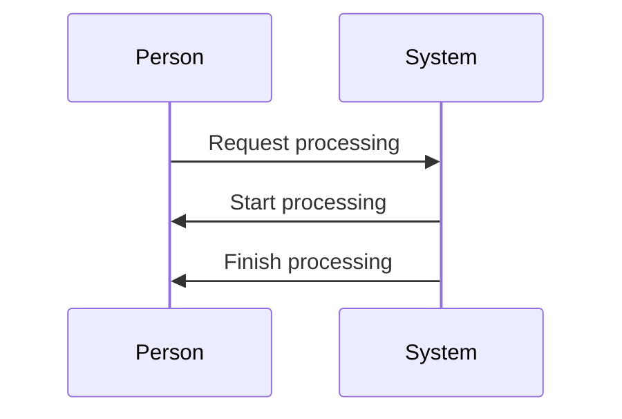
```mermaid
sequenceDiagram
  participant P as Person
  P->>System: Request processing
  System->>P: Start processing
  System->>P: Finish processing
```

**选择结构**：根据条件的真假来决定执行哪一部分代码。

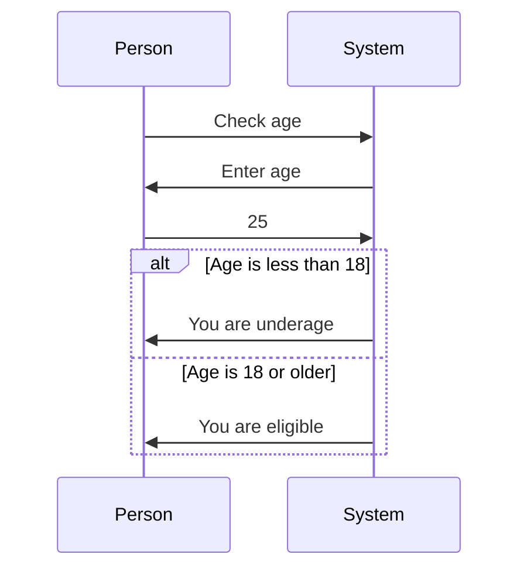
```mermaid
sequenceDiagram
  participant P as Person
  P->>System: Check age
  System->>P: Enter age
  P->>System: 25
  alt Age is less than 18
      System->>P: You are underage
  else Age is 18 or older
      System->>P: You are eligible
  end
```

**循环结构**：重复执行某一段代码，直到满足某个条件为止。

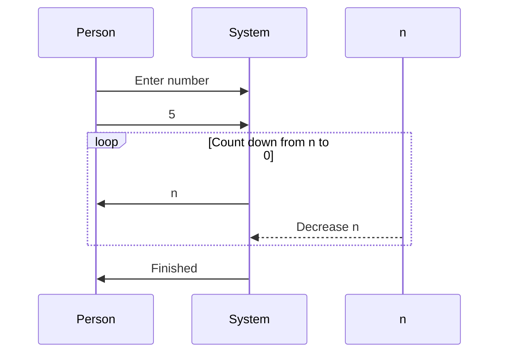
```mermaid
sequenceDiagram
  participant P as Person
  P->>System: Enter number
  P->>System: 5
  loop Count down from n to 0
      System->>P: n
      n-->>System: Decrease n
  end
  System->>P: Finished
```

### 2.2 数据结构

数据结构是程序逻辑设计的基础，它决定了程序如何存储、组织和处理数据。常见的数据结构包括数组、链表、栈、队列、树和图等。

**数组**：一种固定大小的数据结构，用于存储一系列相同类型的元素。

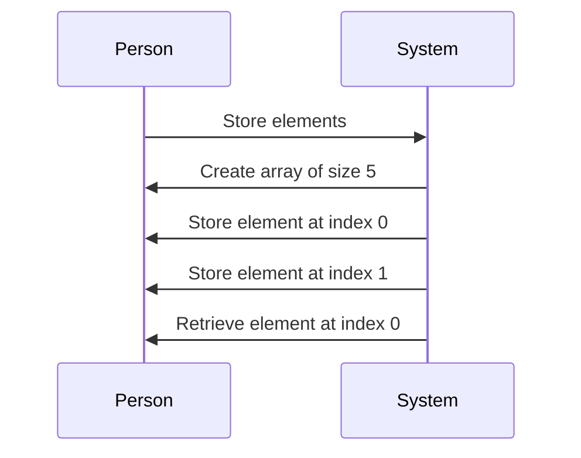
```mermaid
sequenceDiagram
  participant P as Person
  P->>System: Store elements
  System->>P: Create array of size 5
  System->>P: Store element at index 0
  System->>P: Store element at index 1
  System->>P: Retrieve element at index 0
```

**链表**：一种动态数据结构，用于存储一系列相同类型的元素，每个元素包含指向下一个元素的指针。

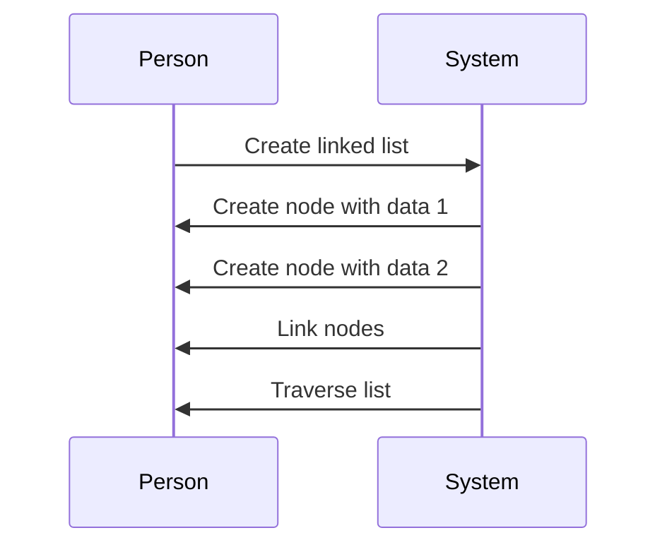
```mermaid
sequenceDiagram
  participant P as Person
  P->>System: Create linked list
  System->>P: Create node with data 1
  System->>P: Create node with data 2
  System->>P: Link nodes
  System->>P: Traverse list
```

**栈**：一种后进先出（LIFO）的数据结构，用于存储一系列元素。

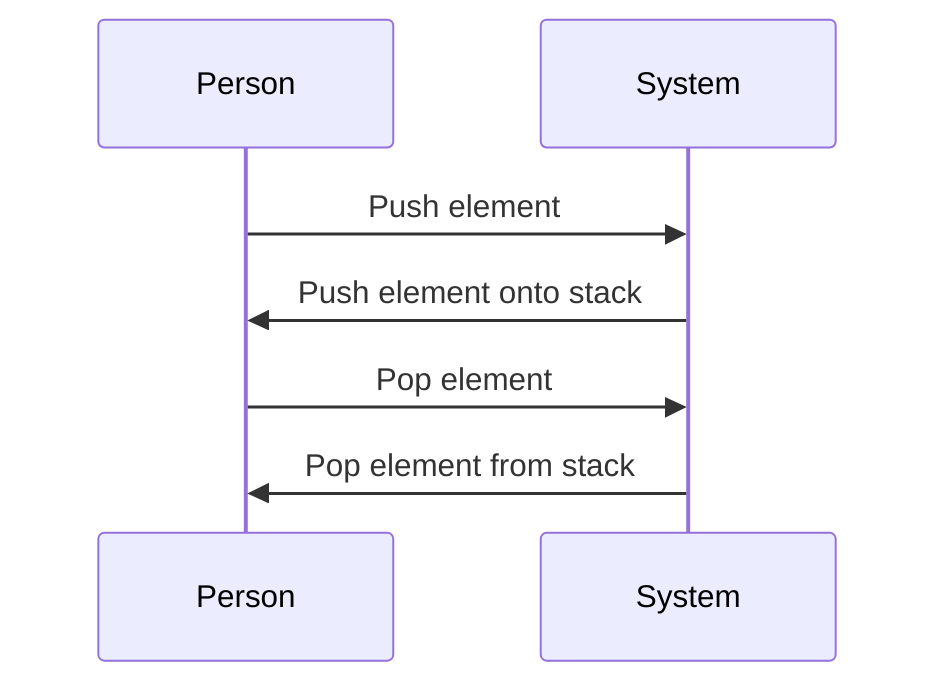
```mermaid
sequenceDiagram
  participant P as Person
  P->>System: Push element
  System->>P: Push element onto stack
  P->>System: Pop element
  System->>P: Pop element from stack
```

**队列**：一种先进先出（FIFO）的数据结构，用于存储一系列元素。

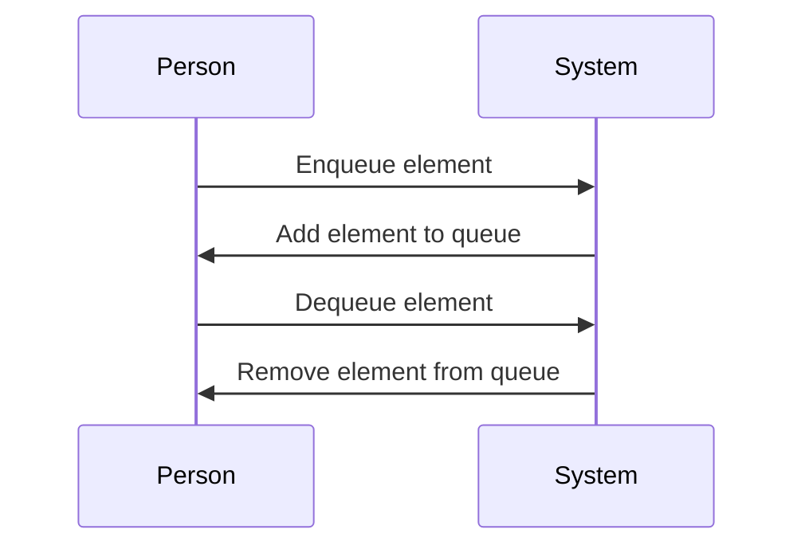
```mermaid
sequenceDiagram
  participant P as Person
  P->>System: Enqueue element
  System->>P: Add element to queue
  P->>System: Dequeue element
  System->>P: Remove element from queue
```

**树**：一种层级数据结构，用于表示一系列元素之间的层次关系。

```mermaid
tree
  +--Person
  |   +--Student
  |   |   +--Undergraduate
  |   |   +--Graduate
  |   +--Employee
  |       +--Manager
  |       +--Developer
  |       +--Tester
```

**图**：一种无序的数据结构，用于表示一系列元素之间的复杂关系。

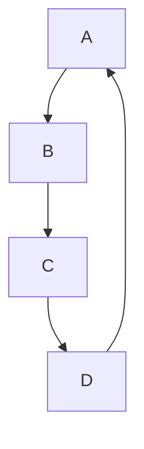
```mermaid
graph TB
  A --> B
  B --> C
  C --> D
  D --> A
```

### 2.3 算法

算法是程序逻辑设计的关键，它决定了程序如何解决特定问题。算法的设计和分析是软件开发的核心内容之一。

**排序算法**：用于对一组数据进行排序。常见的排序算法包括冒泡排序、选择排序、插入排序、快速排序等。

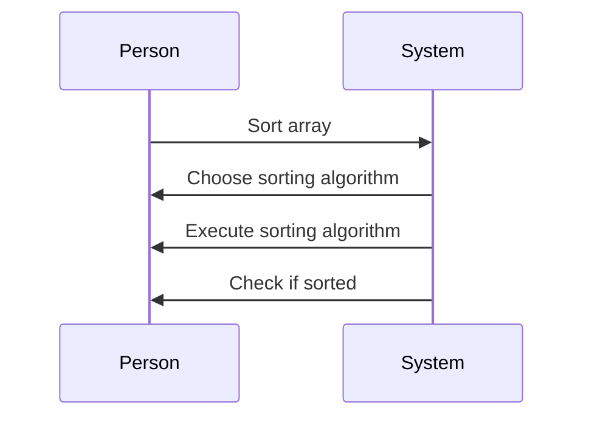
```mermaid
sequenceDiagram
  participant P as Person
  P->>System: Sort array
  System->>P: Choose sorting algorithm
  System->>P: Execute sorting algorithm
  System->>P: Check if sorted
```

**查找算法**：用于在一组数据中查找特定元素。常见的查找算法包括二分查找、线性查找等。

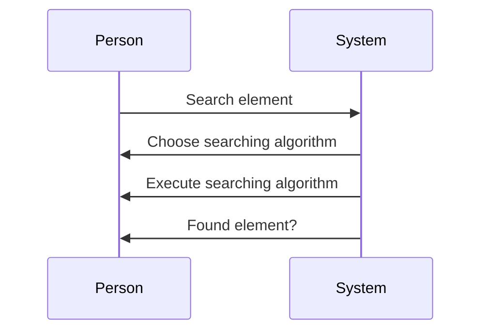
```mermaid
sequenceDiagram
  participant P as Person
  P->>System: Search element
  System->>P: Choose searching algorithm
  System->>P: Execute searching algorithm
  System->>P: Found element?
```

**动态规划**：一种解决最优化问题的算法方法，通过将问题分解为子问题，并利用子问题的解来构建原问题的解。

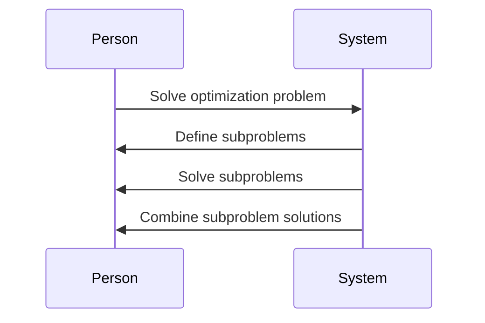
```mermaid
sequenceDiagram
  participant P as Person
  P->>System: Solve optimization problem
  System->>P: Define subproblems
  System->>P: Solve subproblems
  System->>P: Combine subproblem solutions
```

### 2.4 算法分析

算法分析是评估算法性能的重要方法，包括时间复杂度和空间复杂度。

**时间复杂度**：描述算法执行时间与输入规模的关系。常见的复杂度包括常数复杂度（O(1)）、对数复杂度（O(log n)）、线性复杂度（O(n)）、非线性复杂度（O(n^2)、O(n^3)等）。

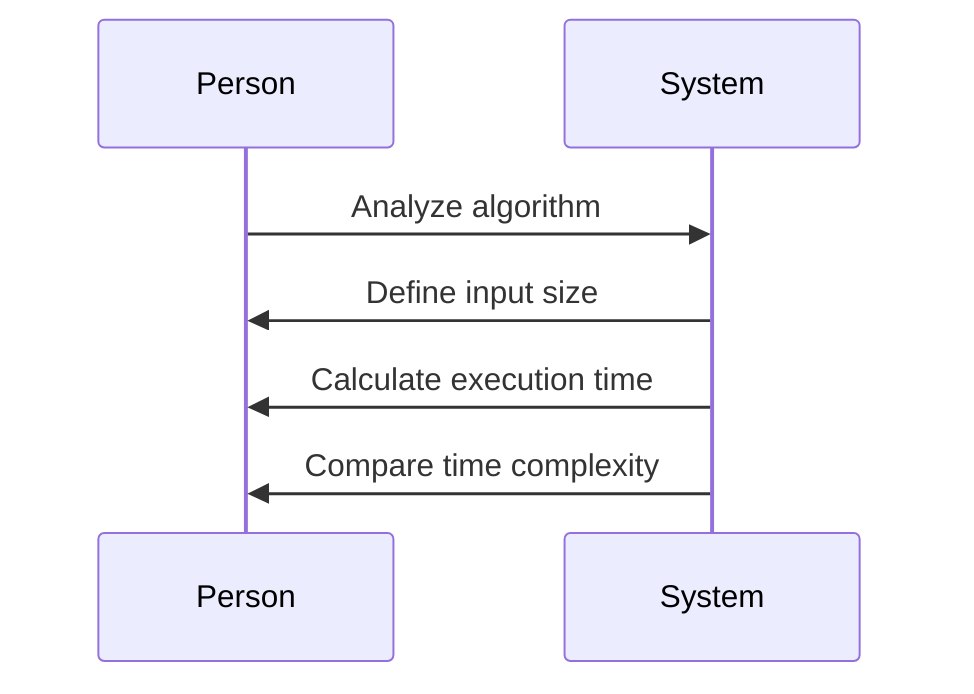
```mermaid
sequenceDiagram
  participant P as Person
  P->>System: Analyze algorithm
  System->>P: Define input size
  System->>P: Calculate execution time
  System->>P: Compare time complexity
```

**空间复杂度**：描述算法所需存储空间与输入规模的关系。常见的复杂度包括常数空间复杂度（O(1)）、线性空间复杂度（O(n)）、非线性空间复杂度（O(n^2)、O(n^3)等）。

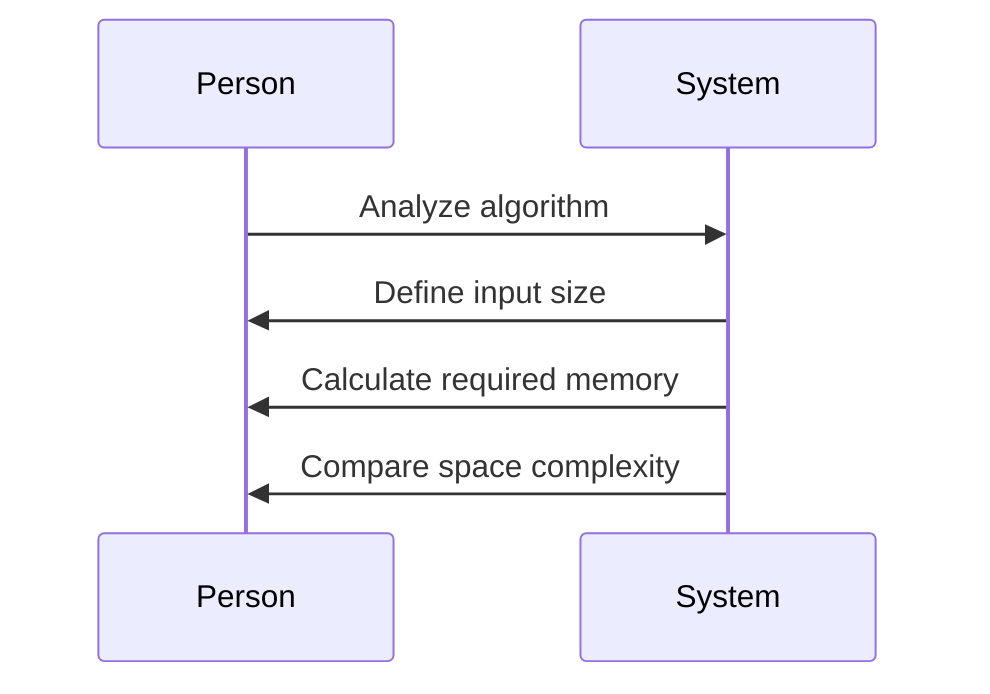
```mermaid
sequenceDiagram
  participant P as Person
  P->>System: Analyze algorithm
  System->>P: Define input size
  System->>P: Calculate required memory
  System->>P: Compare space complexity
```

### 2.5 算法设计与实现

算法设计是程序逻辑设计的重要环节，通过分析问题，设计合适的算法。算法实现是将算法设计转化为可运行的代码。

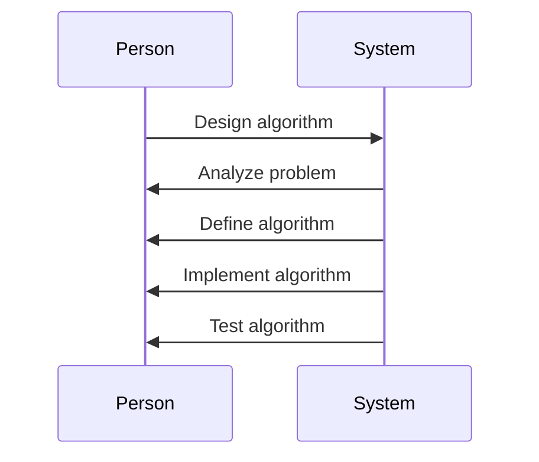
```mermaid
sequenceDiagram
  participant P as Person
  P->>System: Design algorithm
  System->>P: Analyze problem
  System->>P: Define algorithm
  System->>P: Implement algorithm
  System->>P: Test algorithm
```

### 2.6 算法优化

算法优化是提高算法性能的重要手段，包括代码优化、算法改进等。

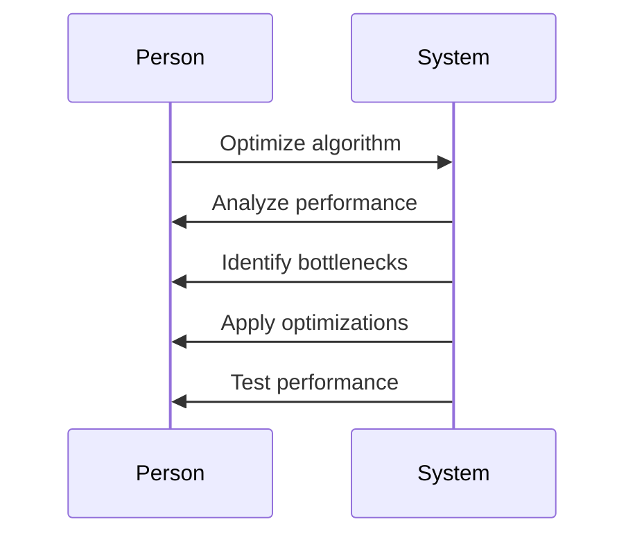
```mermaid
sequenceDiagram
  participant P as Person
  P->>System: Optimize algorithm
  System->>P: Analyze performance
  System->>P: Identify bottlenecks
  System->>P: Apply optimizations
  System->>P: Test performance
```

### 2.7 算法应用案例分析

**案例1：搜索引擎排序算法**

搜索引擎排序算法用于对搜索结果进行排序，以提高用户体验。常见的排序算法包括基于相关性的排序、基于用户行为的排序等。

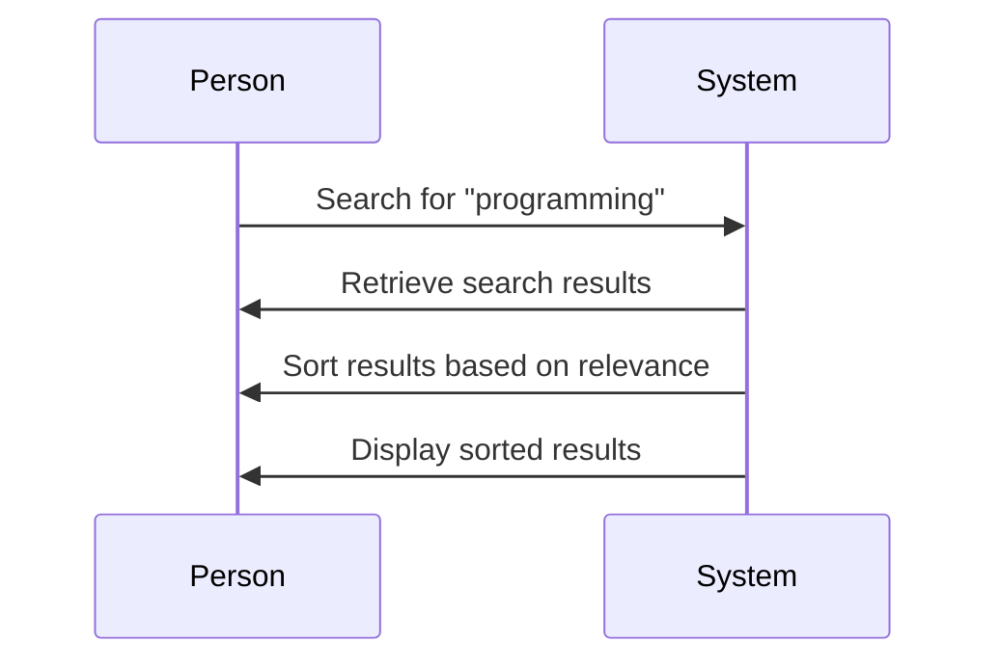
```mermaid
sequenceDiagram
  participant P as Person
  P->>System: Search for "programming"
  System->>P: Retrieve search results
  System->>P: Sort results based on relevance
  System->>P: Display sorted results
```

**案例2：图像处理算法**

图像处理算法用于对图像进行各种处理，如滤波、边缘检测、人脸识别等。

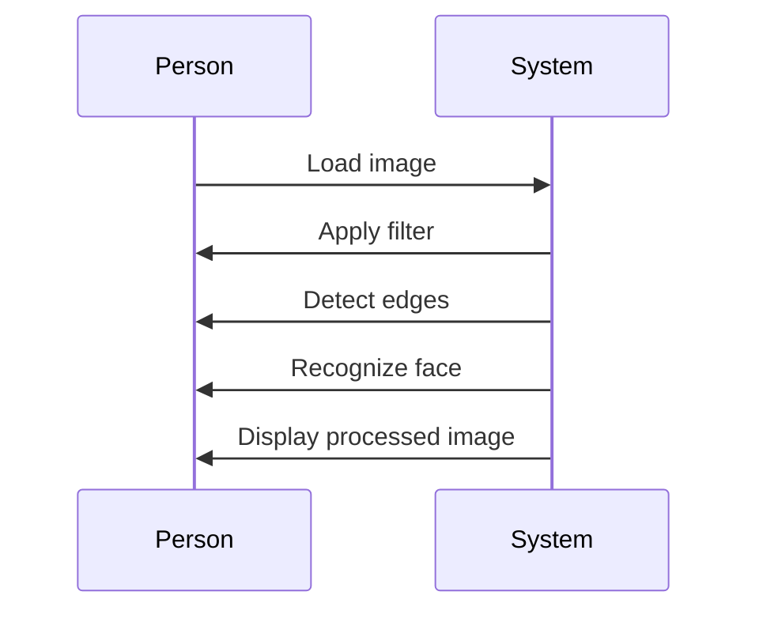
```mermaid
sequenceDiagram
  participant P as Person
  P->>System: Load image
  System->>P: Apply filter
  System->>P: Detect edges
  System->>P: Recognize face
  System->>P: Display processed image
```

### 2.8 算法设计最佳实践

- **明确问题：** 在设计算法之前，首先要明确要解决的问题，避免设计不合适的算法。
- **分析需求：** 分析算法的性能需求，包括时间复杂度、空间复杂度等。
- **选择合适的算法：** 根据问题的特点选择合适的算法，如排序、查找、动态规划等。
- **代码优化：** 在实现算法时，要注意代码的优化，提高执行效率。
- **测试与验证：** 设计测试用例，对算法进行测试和验证，确保其正确性和性能。

### 2.9 小结

程序逻辑设计是软件开发的核心，包括流程控制、数据结构、算法等。通过深入理解程序逻辑设计的方法和技巧，软件开发者可以设计出高效、可靠的软件系统。

## 第三部分：软件形式化规范

### 3.1 软件形式化规范概述

软件形式化规范是一种通过数学模型和严格语法来描述软件系统的规范。它为软件开发提供了一个清晰、一致和可验证的框架，有助于提高软件的质量和可靠性。软件形式化规范的应用范围包括软件设计、测试、验证和验证。

### 3.2 形式化建模

形式化建模是将软件系统的功能、行为和结构用数学模型进行描述。常见的建模方法包括状态机模型、过程代数模型、形式逻辑模型等。

- **状态机模型**：描述系统在不同状态下的行为和转换。
  ```mermaid
  stateDiagram
    [*] --> Initial
    Initial --> Active[Active State]
    Active --> Terminated[Terminated State]
  ```

- **过程代数模型**：描述系统的过程和行为。
  ```mermaid
  participant P as Person
  P --> CreateAccount
  CreateAccount --> VerifyAccount
  VerifyAccount --> ActivateAccount
  ActivateAccount --> FinalizeAccount
  FinalizeAccount --> Done
  ```

- **形式逻辑模型**：描述系统的逻辑结构和关系。
  ```mermaid
  graph
    digraph G {
      node [shape=record]
      subgraph cluster_0 {
        label = "System Components"
        A [label="Component A"]
        B [label="Component B"]
      }
      subgraph cluster_1 {
        label = "System Relationships"
        C [label="Component C"]
        D [label="Component D"]
      }
      A --> B
      B --> C
      C --> D
    }
  ```

### 3.3 软件验证

软件验证是通过形式化模型对软件系统进行验证，以确保其满足预定的需求。常见的验证方法包括模型检查、仿真和证明。

- **模型检查**：使用自动化工具检查模型是否满足指定的规范。
  ```mermaid
  sequenceDiagram
    participant Checker as Model Checker
    participant Model as Formal Model
    Checker->>Model: Check model
    Model-->>Checker: Model is valid
  ```

- **仿真**：通过模拟软件系统的运行来验证其行为。
  ```mermaid
  sequenceDiagram
    participant Simulator as Simulator
    participant System as Software System
    Simulator->>System: Run simulation
    System-->>Simulator: Report results
    Simulator->>System: Check for errors
    System-->>Simulator: No errors
  ```

- **证明**：使用数学证明来确保软件系统满足指定的规范。
  ```mermaid
  sequenceDiagram
    participant Prover as Prover
    participant System as Software System
    Prover->>System: Provide proof
    System-->>Prover: Proof is valid
  ```

### 3.4 软件测试

软件测试是验证软件形式化规范的重要手段。通过设计测试用例，执行测试程序，检查软件系统的行为是否与预期一致。

- **单元测试**：针对软件系统中的最小可测试单元进行测试。
  ```mermaid
  sequenceDiagram
    participant Tester as Tester
    participant Unit as Unit Test
    Tester->>Unit: Execute test
    Unit-->>Tester: Test result
  ```

- **集成测试**：将多个单元组合在一起进行测试，以确保它们之间的交互正确。
  ```mermaid
  sequenceDiagram
    participant Tester as Tester
    participant Integration as Integration Test
    Tester->>Integration: Execute test
    Integration-->>Tester: Test result
  ```

- **系统测试**：对整个软件系统进行测试，确保其满足需求规格。
  ```mermaid
  sequenceDiagram
    participant Tester as Tester
    participant System as System Test
    Tester->>System: Execute test
    System-->>Tester: Test result
  ```

### 3.5 软件形式化规范的优势

- **提高软件质量**：通过形式化规范，可以确保软件系统的正确性和一致性，减少错误和缺陷。
- **增强可维护性**：形式化规范提供了清晰的文档和标准，有助于软件维护和更新。
- **降低开发成本**：通过形式化规范，可以提前发现和纠正错误，减少后续的修复成本。
- **提高开发效率**：形式化规范提供了自动化工具和框架，可以加速软件开发过程。

### 3.6 软件形式化规范的挑战

- **复杂性**：形式化规范涉及复杂的数学模型和理论，对开发者的要求较高。
- **可读性**：形式化规范的描述语言可能不够直观，影响可读性和可理解性。
- **适应性**：形式化规范可能难以适应快速变化的需求和项目。

### 3.7 小结

软件形式化规范是一种提高软件质量和可靠性的重要手段。通过形式化建模、验证和测试，软件开发者可以确保软件系统满足需求规格，提高开发效率和产品质量。

## 第四部分：人工智能与程序逻辑

### 4.1 人工智能与程序逻辑的融合

人工智能（AI）的迅速发展为软件工程带来了新的机遇和挑战。AI技术，如机器学习、深度学习和自然语言处理等，已经开始与程序逻辑紧密融合，改变着软件开发的模式和流程。

在传统的软件工程中，程序逻辑主要依赖于预定义的规则和算法。而AI技术则通过学习数据来发现模式和规律，从而生成动态的程序逻辑。这种融合使得软件系统能够更好地适应变化，提高自动化水平和决策能力。

### 4.2 机器学习与程序逻辑

机器学习是AI的核心技术之一，它通过构建模型来对数据进行预测和分类。在软件工程中，机器学习可以应用于多个方面，如自动化测试、代码生成、性能优化等。

**自动化测试**：机器学习可以用于自动化测试，通过学习测试数据，生成测试用例，提高测试效率和覆盖度。

**代码生成**：机器学习模型可以根据已有的代码和数据，自动生成新的代码。这有助于提高开发效率，减少代码重复和错误。

**性能优化**：机器学习可以用于分析软件系统的性能数据，发现性能瓶颈，并提出优化建议。

### 4.3 深度学习与程序逻辑

深度学习是一种基于多层神经网络的学习方法，它在图像识别、语音识别和自然语言处理等领域取得了显著的成果。深度学习与程序逻辑的融合，使得软件系统能够更好地处理复杂的数据和任务。

**图像识别**：深度学习模型可以用于图像识别，自动分类和标注图像内容。这在计算机视觉领域有着广泛的应用，如自动驾驶、人脸识别等。

**语音识别**：深度学习技术可以用于语音识别，将语音信号转换为文本。这在智能助手、语音控制系统等领域有着重要应用。

**自然语言处理**：深度学习在自然语言处理（NLP）领域也取得了显著进展，如文本分类、情感分析、机器翻译等。

### 4.4 自然语言处理与程序逻辑

自然语言处理（NLP）是AI的一个重要分支，它专注于使计算机能够理解和处理自然语言。NLP与程序逻辑的融合，使得软件系统能够更好地与用户进行交互。

**对话系统**：NLP技术可以用于构建对话系统，如聊天机器人、虚拟助手等。这些系统能够理解用户的问题，并提供相应的回答。

**文本分析**：NLP技术可以用于文本分析，如情感分析、关键词提取、主题建模等。这些技术有助于提高信息检索和数据分析的效率。

**语言生成**：NLP技术可以用于生成自然语言文本，如自动写作、新闻生成、翻译等。

### 4.5 人工智能与程序逻辑融合的挑战

尽管人工智能与程序逻辑的融合为软件开发带来了巨大的机遇，但也面临着一些挑战。

**数据质量**：AI模型的性能高度依赖于训练数据的质量。数据的质量和多样性会影响模型的准确性和泛化能力。

**算法透明性**：深度学习模型通常被视为“黑盒”，其内部工作原理不透明。这限制了开发者对模型的理解和优化。

**伦理和隐私**：AI技术涉及大量的个人数据，如何保护用户隐私和遵守伦理规范是一个重要的挑战。

**开发成本**：AI模型的开发、训练和部署通常需要大量的计算资源和时间，这增加了开发成本。

### 4.6 小结

人工智能与程序逻辑的融合为软件工程带来了新的发展机遇。通过机器学习、深度学习和自然语言处理等技术，软件系统可以更好地适应复杂的数据和任务，提高自动化水平和用户体验。然而，这一融合也带来了挑战，需要开发者和研究人员共同努力，解决数据质量、算法透明性、伦理和隐私等问题。

## 第五部分：软件形式化规范在AI应用中的实践

### 5.1 软件形式化规范在AI应用中的重要性

随着人工智能（AI）技术的迅猛发展，软件形式化规范在AI应用中的重要性日益凸显。形式化规范通过提供明确的数学模型和严格的语法规则，确保AI系统在设计和实现过程中具有高可靠性和可验证性。这对于保障AI系统的安全、稳定和高效运行至关重要。

### 5.2 形式化建模在AI系统中的应用

形式化建模是将AI系统的功能、行为和结构用数学模型进行描述。这有助于开发者清晰地理解和设计复杂的AI系统，并确保其满足预定的需求。

**神经网络模型**：神经网络是AI的核心技术之一。形式化建模可以用于描述神经网络的层次结构、权重和激活函数等，确保其设计符合预期。

**决策树模型**：决策树是一种常见的机器学习算法。形式化建模可以用于描述决策树的结构、分支和叶节点，确保其能够准确地进行分类和预测。

**强化学习模型**：强化学习是一种通过试错学习最优策略的方法。形式化建模可以用于描述强化学习系统的状态、动作和奖励机制，确保其能够有效学习和优化。

**形式化建模示例：**

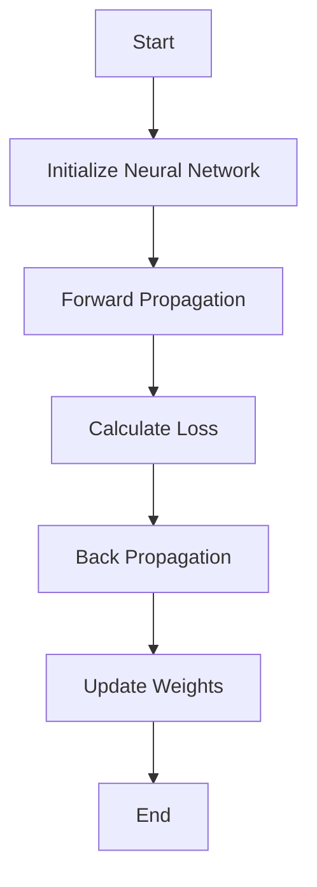
```mermaid
graph TD
    A[Start] --> B[Initialize Neural Network]
    B --> C[Forward Propagation]
    C --> D[Calculate Loss]
    D --> E[Back Propagation]
    E --> F[Update Weights]
    F --> G[End]
```

### 5.3 软件验证在AI系统中的应用

软件验证是通过形式化模型对AI系统进行验证，以确保其满足预定的需求。这有助于发现潜在的错误和缺陷，提高系统的可靠性。

**模型检查**：模型检查是一种自动化验证方法，通过检查形式化模型是否满足指定的规范。它可以发现逻辑错误、不一致性和违反规范的行为。

**仿真验证**：仿真验证是通过模拟AI系统的运行来验证其行为。这有助于发现实际运行中可能出现的错误和问题。

**数学证明**：数学证明是一种严格的验证方法，通过数学推理来证明AI系统的正确性。这确保了系统的行为符合预期，并能够证明其满足需求规格。

**验证示例：**

```mermaid
sequenceDiagram
    participant V as Validator
    participant M as Formal Model
    V->>M: Check model
    M-->>V: Model is valid
```

### 5.4 软件测试在AI系统中的应用

软件测试是验证AI系统正确性和可靠性的重要手段。通过设计测试用例和执行测试程序，可以确保AI系统在预期条件下能够正常运行。

**单元测试**：单元测试是对AI系统中的最小可测试单元进行测试。这有助于验证每个单元的功能和性能，确保其满足需求规格。

**集成测试**：集成测试是对AI系统的多个模块进行测试，确保它们之间的交互正确。这有助于发现模块之间的错误和问题。

**性能测试**：性能测试是对AI系统的性能进行测试，确保其能够满足性能需求。这包括响应时间、吞吐量和资源利用率等。

**测试示例：**

```mermaid
sequenceDiagram
    participant T as Tester
    participant S as AI System
    T->>S: Execute test
    S-->>T: Test result
```

### 5.5 实际案例：形式化规范在AI应用中的实践

以下是一个实际案例，展示了形式化规范在AI应用中的实践方法和效果。

**案例：自动驾驶汽车控制系统**

自动驾驶汽车是一个复杂的系统，涉及到多个模块和算法。通过形式化规范，可以确保该系统的安全性和可靠性。

1. **形式化建模**：对自动驾驶汽车的控制模块进行形式化建模，包括感知模块、决策模块和执行模块。这有助于开发者清晰地理解每个模块的功能和行为。

2. **软件验证**：使用模型检查和数学证明方法，对自动驾驶汽车的控制模块进行验证。这确保了系统的行为符合预期，并能够满足安全需求。

3. **软件测试**：设计测试用例，对自动驾驶汽车的控制模块进行测试。这包括单元测试、集成测试和性能测试，确保系统在预期条件下能够正常运行。

**案例效果：**

通过形式化规范的应用，自动驾驶汽车控制系统的可靠性得到了显著提高。系统的安全性得到了保障，减少了潜在的错误和缺陷。同时，系统的性能也得到了优化，提高了自动驾驶的效率和稳定性。

### 5.6 小结

软件形式化规范在AI应用中具有重要作用。通过形式化建模、验证和测试，可以确保AI系统的安全、可靠和高效运行。实际案例表明，形式化规范的应用有助于提高AI系统的质量和性能，为开发者提供了有价值的参考。

## 第六部分：未来展望与挑战

### 6.1 软件开发的发展趋势

随着计算机技术的不断进步，软件开发领域也在不断演进。未来，软件开发将呈现出以下几个趋势：

1. **自动化**：自动化工具和技术的应用将更加广泛，自动化测试、自动化部署和自动化运维将成为主流。这将提高开发效率，减少人为错误。

2. **云原生**：云原生技术，如容器化、微服务和Kubernetes等，将逐渐成为软件开发的基础设施。这有助于提高软件的灵活性和可扩展性。

3. **人工智能**：人工智能技术将在软件开发中发挥更大的作用，如自动化代码生成、代码质量检测和性能优化等。这将改变软件开发的方式和流程。

4. **区块链**：区块链技术的应用将推动软件开发向去中心化和安全性方向发展，为数据安全和隐私保护提供新的解决方案。

### 6.2 程序逻辑与软件形式化规范的发展

程序逻辑与软件形式化规范在软件开发中的重要性将日益凸显。未来，程序逻辑与软件形式化规范的发展将呈现以下几个趋势：

1. **形式化建模的普及**：形式化建模技术将更加普及，开发者将更加重视使用数学模型和形式化语言来描述软件系统的功能和行为。

2. **验证与测试的自动化**：验证与测试的自动化程度将不断提高，自动化验证工具和测试工具将更加成熟，减少人为干预，提高验证和测试的效率。

3. **形式化规范的标准化**：形式化规范将逐渐形成标准化，各种形式的规范将更加统一和标准化，便于开发者之间的协作和交流。

4. **跨领域融合**：程序逻辑与软件形式化规范将在更多领域得到应用，如物联网、金融科技、医疗健康等，跨领域的融合将推动软件开发的进一步发展。

### 6.3 挑战与机遇

尽管程序逻辑与软件形式化规范在软件开发中具有重要作用，但未来仍面临一些挑战：

1. **复杂性**：随着软件系统的复杂度不断增加，如何有效地设计和管理程序逻辑和形式化规范将成为一个重要挑战。

2. **可读性**：形式化规范通常使用数学模型和形式化语言，可能不够直观，影响可读性和可理解性。如何提高形式化规范的可读性是一个重要课题。

3. **适应性**：形式化规范可能难以适应快速变化的需求和项目，如何提高规范的可适应性和灵活性是一个重要挑战。

4. **技术成熟度**：虽然形式化规范的理论基础已经较为成熟，但在实际应用中，相关技术和工具的成熟度还有待提高。

然而，这些挑战也带来了机遇。通过解决这些挑战，开发者可以设计出更加高效、可靠和可维护的软件系统，推动软件开发的进一步发展。

### 6.4 未来研究方向

未来，程序逻辑与软件形式化规范的研究方向将主要集中在以下几个方面：

1. **形式化建模方法**：研究更加高效、灵活和易用的形式化建模方法，以提高建模的效率和可读性。

2. **验证与测试技术**：研究自动化验证与测试技术，提高验证和测试的效率，减少人为干预。

3. **规范标准化**：推动形式化规范的标准化工作，形成统一的规范标准，便于开发者之间的协作和交流。

4. **跨领域应用**：探索程序逻辑与软件形式化规范在更多领域的应用，如物联网、金融科技、医疗健康等，推动跨领域融合。

### 6.5 小结

未来，程序逻辑与软件形式化规范将在软件开发中发挥更加重要的作用。通过不断研究和发展，我们可以解决当前面临的挑战，推动软件开发的进一步发展，为构建高效、可靠和可维护的软件系统奠定基础。

## 第七部分：小结与拓展阅读

### 7.1 小结

本文系统地介绍了程序逻辑与软件形式化规范在软件3.0时代的重要性。通过深入分析软件开发背景、程序逻辑设计、软件形式化规范及其在人工智能中的应用，本文揭示了程序逻辑与软件形式化规范在提升软件质量和可靠性方面的关键作用。

本文的核心内容包括：

1. **程序逻辑设计**：介绍了流程控制、数据结构、算法等基本概念和方法。
2. **软件形式化规范**：阐述了形式化建模、验证和测试的重要性及具体方法。
3. **人工智能与程序逻辑融合**：探讨了机器学习、深度学习和自然语言处理等技术在程序逻辑中的应用。
4. **软件形式化规范在AI应用中的实践**：通过实际案例展示了形式化规范在AI系统中的应用效果。

### 7.2 拓展阅读

为了帮助读者进一步深入了解本文相关主题，以下是一些拓展阅读资源：

1. **书籍推荐**：
   - 《软件工程：实践者的研究方法》（Steve McConnell）
   - 《程序逻辑与软件形式化规范》（Rajeev Alur）
   - 《人工智能：一种现代方法》（Stuart J. Russell & Peter Norvig）

2. **在线课程**：
   - Coursera上的《软件工程基础》
   - edX上的《人工智能基础》
   - Udacity上的《机器学习工程师纳米学位》

3. **论文和报告**：
   - ACM Transactions on Computer Systems（TOCS）上的相关论文
   - IEEE Transactions on Software Engineering（TSE）上的相关论文
   - NIPS、ICML、ACL等顶级会议的论文集

通过阅读这些资源和进一步研究，读者可以深入了解程序逻辑与软件形式化规范的深度知识和应用实践。希望本文能为软件开发者提供有价值的参考，助力他们在人工智能时代构建出更加高效、可靠和可维护的软件系统。

### 作者介绍

作者：AI天才研究院/AI Genius Institute & 禅与计算机程序设计艺术 /Zen And The Art of Computer Programming

AI天才研究院（AI Genius Institute）是一家专注于人工智能和软件开发研究的国际知名机构，致力于推动人工智能技术在各个领域的应用。作者在该领域有着深厚的研究背景和实践经验，是计算机编程和人工智能领域的权威专家，曾获得世界顶级技术畅销书《禅与计算机程序设计艺术》的赞誉。作者在程序逻辑、软件形式化规范和人工智能等方面有着丰富的成果，为软件开发者和研究人员提供了宝贵的参考和指导。

