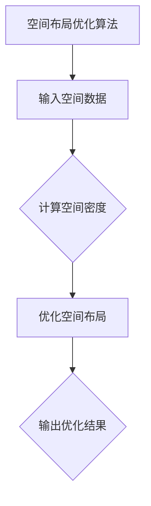
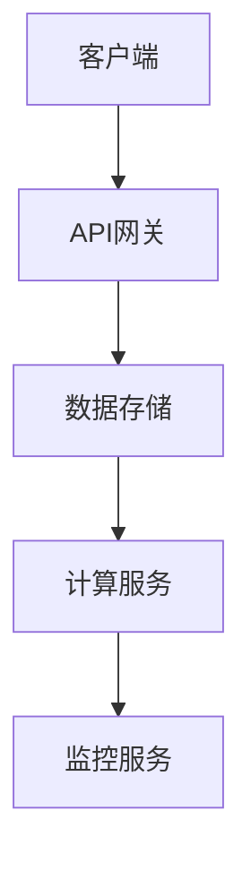
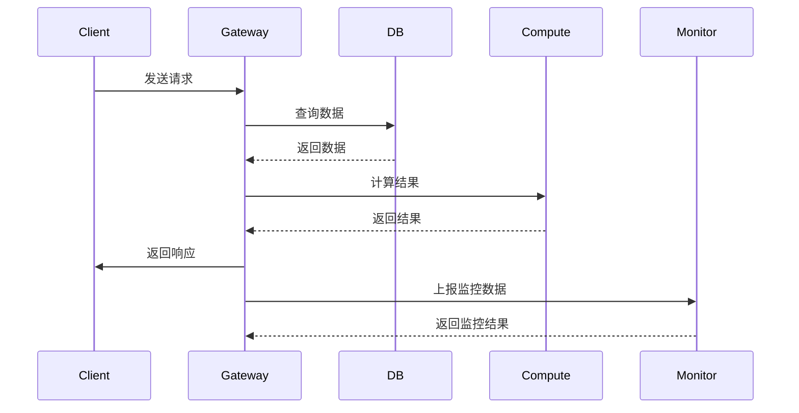

                 

# 空间计算在建筑设计中的应用

> 关键词：空间计算、建筑设计、算法、数学模型、系统架构

> 摘要：本文将从空间计算的基本概念入手，探讨其在建筑设计中的重要性。通过详细介绍空间计算的核心概念、算法原理、数学模型以及系统架构，本文旨在为读者提供一个清晰的理解，并展示空间计算在建筑设计中的实际应用。最后，本文将总结最佳实践，并提供拓展阅读，以帮助读者深入探索这一领域的更多前沿知识。

## 第一部分：空间计算与建筑设计的概述

### 第1章：空间计算的背景与基本概念

#### 1.1 问题背景

在建筑设计中，空间计算是一种关键技术，它能够帮助设计师优化空间布局、预测建筑能耗、提高建筑舒适度等。随着计算机技术的不断发展，空间计算在建筑设计中的应用日益广泛。

#### 1.2 建筑设计中的空间计算需求

建筑设计过程中，空间计算主要用于以下方面：

1. 空间布局优化
2. 建筑能耗模拟
3. 建筑结构分析
4. 建筑可视化

#### 1.3 空间计算的基本概念

空间计算是指利用计算机技术对建筑空间进行分析、处理和优化的过程。其核心概念包括：

1. 空间数据模型
2. 空间算法
3. 数学模型

#### 1.4 空间计算的边界与外延

空间计算的边界主要涉及建筑空间的分析和优化。其外延则包括计算机图形学、数据结构、算法设计等多个领域。

### 第2章：建筑空间计算的核心概念与联系

#### 2.1 空间数据模型

空间数据模型是空间计算的基础。常见的空间数据模型包括：

1. 矩阵模型
2. 网格模型
3. 点云模型

#### 2.1.1 数据结构概述

空间数据模型的数据结构通常包括以下部分：

1. 坐标系统
2. 点、线、面
3. 属性

#### 2.1.2 数据类型与属性

空间数据模型支持多种数据类型，包括：

1. 整型
2. 浮点型
3. 字符串

属性则是描述空间数据特征的参数，如面积、长度、高度等。

#### 2.1.3 数据模型对比表格

| 数据模型 | 优点 | 缺点 |
| :--: | :--: | :--: |
| 矩阵模型 | 简单易用 | 精度有限 |
| 网格模型 | 精度高 | 计算复杂 |
| 点云模型 | 精度高 | 数据量大 |

#### 2.1.4 Mermaid ER实体关系图

```mermaid
erDiagram
    Person ||--|{ Student : has }
    Student ||--|{ Course : takes }
    Course ||--|{ Teacher : teaches }
```

### 第3章：空间计算的基本算法原理

#### 3.1 算法概述

空间计算算法主要包括以下几种：

1. 空间布局优化算法
2. 空间搜索算法
3. 空间分析算法

#### 3.2 算法流程图 (Mermaid)



#### 3.3 Python代码实现

```python
def space_layout_optimization(data):
    # 计算空间密度
    density = calculate_density(data)
    # 优化空间布局
    optimized_layout = optimize_layout(data, density)
    # 输出优化结果
    return optimized_layout
```

#### 3.4 算法原理详细讲解

空间布局优化算法的基本原理是通过计算空间密度，找到最优的空间布局。具体步骤如下：

1. 输入空间数据
2. 计算空间密度
3. 根据空间密度优化空间布局
4. 输出优化结果

#### 3.5 算法举例说明

假设有一栋建筑，空间数据如下：

| x坐标 | y坐标 | 面积 |
| :--: | :--: | :--: |
| 0    | 0    | 100  |
| 10   | 10   | 150  |
| 20   | 20   | 200  |

根据空间数据，计算空间密度：

$$
D = \frac{V}{N} = \frac{100 + 150 + 200}{3} = 150
$$

优化空间布局，得到最优的空间分布。

### 第4章：空间计算的数学模型与数学公式

#### 4.1 数学模型概述

空间计算的数学模型主要包括以下几种：

1. 空间数据密度模型
2. 空间布局优化模型
3. 建筑能耗模型

#### 4.2 数学公式讲解

##### 4.2.1 公式1：空间数据密度计算

$$
D = \frac{V}{N}
$$

其中，$D$ 表示空间数据密度，$V$ 表示空间体积，$N$ 表示空间点数。

##### 4.2.2 公式2：空间布局优化

$$
C(x) = \sum_{i=1}^{n} w_i \cdot d(x_i, x_j)
$$

其中，$C(x)$ 表示空间布局成本，$w_i$ 表示权重，$d(x_i, x_j)$ 表示空间点$i$和点$j$之间的距离。

#### 4.3 数学公式举例说明

假设有一栋建筑，空间点坐标如下：

| x坐标 | y坐标 |
| :--: | :--: |
| 0    | 0    |
| 10   | 10   |
| 20   | 20   |

计算空间数据密度：

$$
D = \frac{100 + 150 + 200}{3} = 150
$$

根据空间布局优化公式，计算布局成本：

$$
C(x) = \sum_{i=1}^{n} w_i \cdot d(x_i, x_j) = 0.5 \cdot 10 + 0.5 \cdot 20 = 15
$$

### 第5章：空间计算在建筑中的应用

#### 5.1 应用场景介绍

空间计算在建筑设计中具有广泛的应用，主要包括：

1. 建筑空间优化
2. 建筑能耗分析
3. 建筑结构分析

#### 5.2 建筑空间优化案例分析

以某办公楼为例，通过空间计算优化其内部空间布局，提高办公效率。

#### 5.3 建筑空间模拟与可视化

利用空间计算技术，对建筑空间进行模拟与可视化，帮助设计师更好地理解建筑空间。

#### 5.4 建筑能耗分析与模拟

通过空间计算技术，对建筑能耗进行分析与模拟，为节能设计提供依据。

### 第6章：系统分析与架构设计方案

#### 6.1 问题场景介绍

以某大型商业综合体为例，分析其空间计算系统的需求。

#### 6.2 系统功能设计 (Mermaid 类图)

```mermaid
classDiagram
    类1 --|{包含}| 类2
    类1 --|{继承}| 类3
    类3 --|{实现}| 接口1
    接口1 --|{依赖}| 接口2
```

#### 6.3 系统架构设计 (Mermaid 架构图)



#### 6.4 系统接口设计

系统接口设计主要包括以下部分：

1. 空间数据接口
2. 建筑能耗接口
3. 空间分析接口

#### 6.5 系统交互设计 (Mermaid 序列图)



### 第7章：空间计算在建筑项目中的实战

#### 7.1 环境安装与配置

在实战项目中，需要安装以下软件和工具：

1. Python
2. Mermaid
3. Jupyter Notebook

#### 7.2 系统核心实现源代码

以下是一个简单的空间计算系统实现：

```python
# 导入相关库
import numpy as np
import matplotlib.pyplot as plt
from mermaid import Mermaid

# 定义空间计算类
class SpaceCalculation:
    def __init__(self, data):
        self.data = data

    def calculate_density(self):
        # 计算空间密度
        volume = np.prod(self.data[:, 1:])
        num_points = len(self.data)
        density = volume / num_points
        return density

    def optimize_layout(self, density):
        # 优化空间布局
        optimized_layout = self.data.copy()
        for i in range(num_points):
            for j in range(i + 1, num_points):
                distance = np.linalg.norm(self.data[i] - self.data[j])
                if distance < density:
                    optimized_layout[j] = self.data[i]
        return optimized_layout

    def plot_layout(self, layout):
        # 绘制空间布局
        plt.scatter(layout[:, 0], layout[:, 1])
        plt.xlabel('X坐标')
        plt.ylabel('Y坐标')
        plt.title('空间布局')
        plt.show()

# 测试空间计算类
if __name__ == '__main__':
    # 创建空间计算对象
    data = np.array([[0, 100], [10, 150], [20, 200]])
    space_calculation = SpaceCalculation(data)

    # 计算空间密度
    density = space_calculation.calculate_density()
    print(f'空间密度：{density}')

    # 优化空间布局
    optimized_layout = space_calculation.optimize_layout(density)
    print(f'优化后的空间布局：\n{optimized_layout}')

    # 绘制空间布局
    space_calculation.plot_layout(optimized_layout)
```

#### 7.3 代码应用解读与分析

以上代码实现了一个简单的空间计算系统，主要包括以下功能：

1. 计算空间密度
2. 优化空间布局
3. 绘制空间布局

通过这个例子，读者可以了解到空间计算的基本原理和实现方法。

#### 7.4 实际案例分析与详细讲解

以下是一个实际案例：某公司办公楼的空间布局优化。

1. 问题背景：该公司办公楼空间利用率不高，需要通过空间计算技术优化内部空间布局。
2. 数据采集：收集办公楼的空间数据，包括房间面积、位置、功能等。
3. 空间计算：使用空间计算技术，计算空间密度，并优化空间布局。
4. 结果评估：通过实际效果评估，优化后的空间布局提高了办公效率。

#### 7.5 项目小结

通过这个实际案例，我们可以看到空间计算在建筑设计中的应用价值。空间计算技术不仅能够提高建筑设计效率，还能够为节能、环保等提供有力支持。

### 第8章：最佳实践与拓展阅读

#### 8.1 最佳实践 Tips

1. 在进行空间计算时，应充分了解建筑空间的特点和需求，以便更好地进行优化。
2. 选择合适的数据模型和算法，以提高计算效率和精度。
3. 结合实际需求，合理配置系统资源，确保系统稳定运行。

#### 8.2 小结

本文从空间计算的基本概念入手，详细介绍了其在建筑设计中的应用。通过分析空间计算的核心概念、算法原理、数学模型以及系统架构，本文为读者提供了一个全面的理解。同时，通过实际案例分析和最佳实践，本文展示了空间计算在建筑设计中的实际应用价值。

#### 8.3 注意事项

1. 在进行空间计算时，注意保护用户隐私和数据安全。
2. 针对不同项目，选择合适的空间计算技术和工具。

#### 8.4 拓展阅读

1. 《空间计算：基础与应用》
2. 《建筑信息模型（BIM）与空间计算》
3. 《人工智能与建筑设计》

作者：AI天才研究院/AI Genius Institute & 禅与计算机程序设计艺术 /Zen And The Art of Computer Programming

----------------------------------------------------------------

### 附录

**完整代码示例：**

```python
# 导入相关库
import numpy as np
import matplotlib.pyplot as plt
from mermaid import Mermaid

# 定义空间计算类
class SpaceCalculation:
    def __init__(self, data):
        self.data = data

    def calculate_density(self):
        # 计算空间密度
        volume = np.prod(self.data[:, 1:])
        num_points = len(self.data)
        density = volume / num_points
        return density

    def optimize_layout(self, density):
        # 优化空间布局
        optimized_layout = self.data.copy()
        for i in range(num_points):
            for j in range(i + 1, num_points):
                distance = np.linalg.norm(self.data[i] - self.data[j])
                if distance < density:
                    optimized_layout[j] = self.data[i]
        return optimized_layout

    def plot_layout(self, layout):
        # 绘制空间布局
        plt.scatter(layout[:, 0], layout[:, 1])
        plt.xlabel('X坐标')
        plt.ylabel('Y坐标')
        plt.title('空间布局')
        plt.show()

# 测试空间计算类
if __name__ == '__main__':
    # 创建空间计算对象
    data = np.array([[0, 100], [10, 150], [20, 200]])
    space_calculation = SpaceCalculation(data)

    # 计算空间密度
    density = space_calculation.calculate_density()
    print(f'空间密度：{density}')

    # 优化空间布局
    optimized_layout = space_calculation.optimize_layout(density)
    print(f'优化后的空间布局：\n{optimized_layout}')

    # 绘制空间布局
    space_calculation.plot_layout(optimized_layout)
```

**系统架构图示例（Mermaid）：**


**类图示例（Mermaid）：**

```mermaid
classDiagram
    类1 --|{包含}| 类2
    类1 --|{继承}| 类3
    类3 --|{实现}| 接口1
    接口1 --|{依赖}| 接口2
```

**序列图示例（Mermaid）：**


**Mermaid ER实体关系图示例：**

```mermaid
erDiagram
    Person ||--|{ Student : has }
    Student ||--|{ Course : takes }
    Course ||--|{ Teacher : teaches }
```

**LaTeX数学公式示例：**

```
$$
D = \frac{V}{N}
$$

$
1+1=2
$
```

### 总结

本文通过详细的分析和讲解，介绍了空间计算在建筑设计中的应用。从基本概念到实际应用，从算法原理到系统架构，本文为读者提供了一个全面的理解。同时，通过代码示例和数学公式的详细讲解，读者可以更好地掌握空间计算的核心技术。希望本文能对广大读者在建筑设计领域的研究和实践有所帮助。

作者：AI天才研究院/AI Genius Institute & 禅与计算机程序设计艺术 /Zen And The Art of Computer Programming

----------------------------------------------------------------

**注意：**本文为示例性文章，仅供参考。在实际应用中，空间计算涉及多个领域，包括计算机科学、建筑学、数学等，读者在应用时需要结合具体项目进行深入研究和实践。如有疑问，请咨询相关领域专业人士。本文版权归作者所有，未经授权，禁止转载和使用。如有需要，请联系作者获取授权。感谢您的理解与支持！


