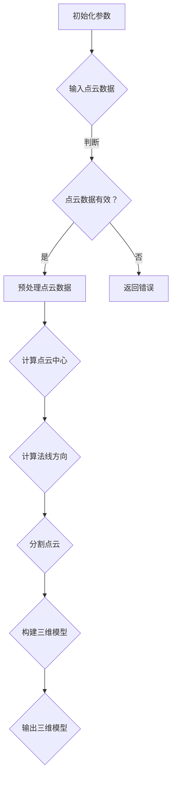
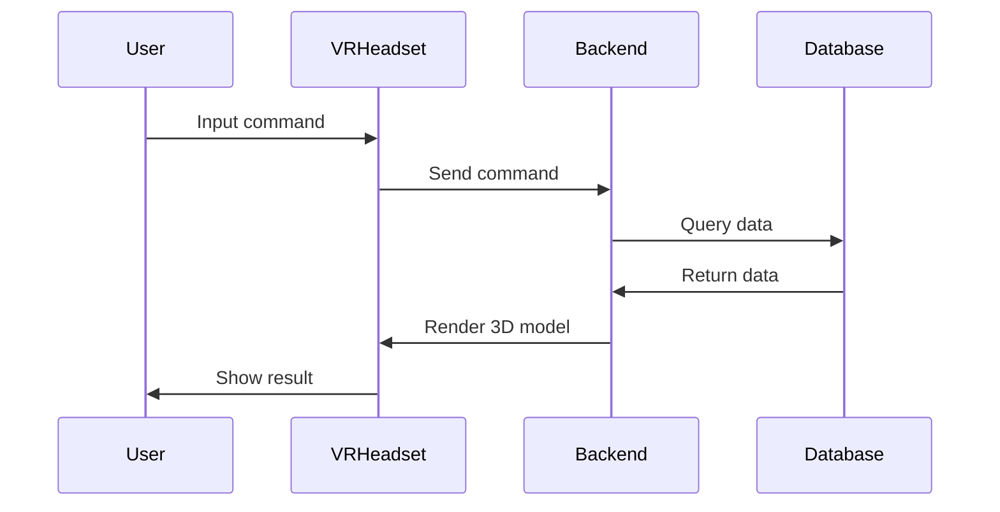

                 

### 空间计算市场规模增长预测：引言

空间计算，作为现代科技发展的一个前沿领域，正逐渐从理论走向实践，并在众多行业中展现出巨大的应用潜力。本文旨在通过对空间计算市场规模的深入分析，预测其未来发展趋势，为相关企业和投资者提供有益的参考。空间计算涉及多个学科和技术领域，包括虚拟现实、增强现实、人工智能、大数据等，其核心在于通过计算机技术模拟和扩展现实空间，实现人类与计算机系统的深度交互。

当前，随着全球数字化转型的不断深入，空间计算在医疗、教育、军事、娱乐等多个领域都取得了显著的进展。例如，在医疗领域，空间计算技术可以用于手术导航、远程诊疗；在教育领域，则可以为学生提供更加生动的学习体验；在军事领域，空间计算则可以用于战术模拟和决策支持。这些应用场景不仅展示了空间计算的巨大潜力，也为市场规模的持续增长提供了动力。

然而，空间计算市场的快速发展也面临诸多挑战，如技术成熟度、用户接受度、产业链完善度等。本文将通过对这些挑战的深入分析，结合市场数据和行业趋势，对空间计算市场的未来规模进行预测。文章的核心内容将分为以下几个部分：

1. **背景介绍与核心概念**：介绍空间计算的基本概念、市场规模及其重要性，分析其边界与外延。
2. **核心概念与联系**：详细探讨空间计算的基本原理、应用场景和技术架构。
3. **算法原理讲解**：分析空间计算领域常用的算法，并使用流程图和Python源代码进行解释。
4. **系统分析与架构设计**：介绍空间计算系统的功能、架构、接口和交互设计。
5. **项目实战与案例分析**：通过具体项目和案例分析，深入剖析空间计算的实际应用效果。
6. **最佳实践与拓展**：总结最佳实践，提出注意事项，并对未来发展趋势进行展望。

通过以上结构的逐步展开，我们将从多个角度深入探讨空间计算市场的增长潜力，提供一系列有见地的分析和预测。希望通过本文，能够为读者在空间计算领域的研究和实践中提供有益的启示。接下来，我们将从背景介绍与核心概念入手，逐步展开分析。 

#### 关键词

- **空间计算**：虚拟现实、增强现实、人工智能、大数据
- **市场规模**：增长预测、行业应用、技术成熟度
- **算法原理**：流程图、Python源代码、数学模型
- **系统架构**：功能设计、架构图、接口设计
- **项目实战**：环境配置、核心实现、案例分析
- **最佳实践**：技巧总结、注意事项、拓展阅读

#### 摘要

本文旨在深入分析和预测空间计算市场的规模增长。空间计算作为一种新兴的计算模式，其应用范围广泛，包括医疗、教育、军事、娱乐等多个行业。本文首先介绍了空间计算的基本概念和市场规模，探讨了其边界与外延。随后，详细分析了空间计算的核心概念与联系，包括基本原理、应用场景和技术架构。接着，本文通过算法原理讲解，介绍了空间计算领域常用的算法，并使用流程图和Python源代码进行解释。随后，文章从系统分析与架构设计的角度，介绍了空间计算系统的功能、架构、接口和交互设计。通过具体项目和案例分析，本文深入剖析了空间计算的实际应用效果。最后，本文总结了空间计算市场规模增长的最佳实践，并展望了其未来发展趋势。通过以上内容，本文旨在为读者提供全面的空间计算市场规模增长预测，为其研究和实践提供有益的参考。

### 第一部分：背景介绍与核心概念

#### 1.1 问题背景

随着科技的飞速发展，空间计算作为一种新兴的计算模式，正逐渐在各个行业中崭露头角。空间计算的核心在于利用计算机技术模拟和扩展现实空间，实现人类与计算机系统的深度交互。这种技术不仅提升了人机交互的效率和体验，还带来了许多创新的应用场景。

**问题描述**：

空间计算的应用场景丰富多样，包括虚拟现实（VR）、增强现实（AR）、混合现实（MR）、三维建模、智能导航等。然而，尽管空间计算具有巨大的潜力，但其市场规模的准确预测仍然面临诸多挑战。一方面，技术成熟度和用户接受度尚需提高；另一方面，产业链的完善程度也制约了市场的发展。因此，本文旨在通过深入研究和分析，对空间计算市场的规模增长进行预测。

**问题解决**：

为了解决这一问题，本文将从以下几个方面展开：

1. **核心概念**：详细介绍空间计算的基本概念、原理和应用。
2. **市场规模**：分析当前空间计算市场的规模，探讨其增长趋势。
3. **边界与外延**：明确空间计算的适用范围，预测其未来发展趋势。
4. **核心要素**：探讨影响空间计算市场规模增长的关键因素。

通过以上分析，本文旨在为空间计算市场的未来发展提供有益的参考。

#### 1.2 核心概念

**空间计算**：空间计算是一种基于计算机技术模拟和扩展现实空间，实现人机深度交互的计算模式。其基本原理是通过计算机生成和操控虚拟三维空间，使用户能够在虚拟环境中进行交互和操作。

**市场规模**：空间计算市场规模通常指在一定时期内，空间计算相关产品和服务的总销售量。市场规模的计算通常包括硬件设备、软件应用、技术服务等多个方面。

**市场规模增长的重要性**：

1. **技术创新**：空间计算市场的增长推动了相关技术的不断创新和发展，促进了整个科技行业的进步。
2. **产业发展**：空间计算的应用场景丰富，涉及到多个行业，其市场规模的增长有助于带动相关产业的发展。
3. **用户体验**：空间计算提升了人机交互的效率和体验，为用户带来了更加丰富和生动的互动体验。
4. **经济贡献**：空间计算市场规模的扩大，直接促进了相关领域的经济增长，创造了大量的就业机会。

通过深入分析和预测空间计算市场的规模增长，可以为企业和投资者提供有益的决策依据，促进空间计算的健康发展。接下来，本文将详细探讨空间计算的核心概念、市场规模及其重要性。 

#### 1.3 边界与外延

**边界**：

空间计算的边界主要指其应用的适用范围和限制。虽然空间计算具有广泛的适用性，但并非所有场景都适合采用空间计算技术。以下是空间计算的主要边界：

1. **技术成熟度**：空间计算技术的成熟度决定了其在实际应用中的效果。一些前沿技术尚未达到广泛应用的标准，因此其应用范围受到限制。
2. **用户接受度**：用户对空间计算技术的接受度也是其边界之一。尽管空间计算带来了许多新的体验，但并非所有用户都愿意接受这种新的交互方式。
3. **设备要求**：空间计算通常需要特定的硬件设备，如高分辨率显示器、传感器、VR/AR设备等。这些设备的高成本和特定要求限制了空间计算的应用范围。

**外延**：

空间计算的外延主要指其未来的发展趋势和可能的应用领域。随着技术的不断进步，空间计算的应用范围将不断扩大。以下是空间计算可能的外延方向：

1. **工业应用**：空间计算在工业设计、智能制造、远程运维等领域具有巨大潜力，可以提升生产效率和质量。
2. **医疗健康**：空间计算在医疗诊断、手术导航、远程诊疗等领域具有广泛应用前景，可以改善医疗服务的质量和效率。
3. **教育培训**：空间计算可以为学生提供更加生动和互动的学习体验，改善教育质量和效果。
4. **娱乐休闲**：空间计算为游戏、影视、艺术等领域带来了新的表现形式和互动方式，提升了用户体验。

通过明确空间计算的边界与外延，我们可以更好地理解其应用范围和未来发展潜力。接下来，本文将深入探讨空间计算的概念结构与核心要素。 

#### 1.4 概念结构与核心要素

**概念结构**：

空间计算的概念结构可以理解为由几个核心组成部分构成，这些部分相互联系，共同构成了空间计算的技术体系。以下是空间计算的主要概念结构：

1. **虚拟空间生成**：通过计算机图形学技术生成虚拟三维空间，为用户提供沉浸式体验。
2. **人机交互**：利用传感器、摄像头等技术捕捉用户动作和反馈，实现人与虚拟空间的互动。
3. **数据处理**：对输入的数据进行处理和分析，以实现智能化的交互和控制。
4. **虚拟现实设备**：如VR头盔、AR眼镜等硬件设备，用于实现虚拟空间与真实世界的融合。

**核心要素**：

空间计算的核心要素是影响其市场规模增长的关键因素，包括以下几个方面：

1. **技术成熟度**：空间计算技术的成熟度直接影响其应用效果和市场接受度。技术的不断进步将推动市场的发展。
2. **用户接受度**：用户对空间计算技术的接受程度是市场增长的重要驱动力。提高用户接受度需要不断优化用户体验，降低使用门槛。
3. **产业链完善度**：空间计算涉及多个行业和环节，包括硬件制造、软件开发、技术服务等。产业链的完善程度直接影响市场的发展速度。
4. **政策支持**：政府的政策支持和行业标准的确立，对空间计算市场的发展具有重要影响。
5. **投资力度**：资本对空间计算行业的投资力度决定了市场的发展速度和规模。

通过以上分析，我们可以看到，空间计算的概念结构与核心要素紧密相连，共同构成了市场发展的基础。接下来，本文将深入探讨空间计算的关键概念与原理。 

### 第二部分：核心概念与联系

#### 2.1 空间计算的基本原理

**原理概述**：

空间计算的基本原理可以理解为通过计算机技术模拟和扩展现实空间，实现人与计算机系统的深度交互。具体来说，其核心包括以下几个方面：

1. **虚拟现实（VR）**：利用计算机生成虚拟三维空间，使用户可以在其中自由行走、操作和互动。
2. **增强现实（AR）**：将虚拟信息叠加到现实世界中，使用户在真实环境中感受到虚拟信息的存在。
3. **混合现实（MR）**：结合VR和AR的特点，生成和融合虚拟与真实世界，提供更加沉浸式的交互体验。
4. **三维建模**：通过计算机技术创建三维模型，用于设计、仿真和分析等应用场景。
5. **智能导航**：利用空间计算技术实现智能化的导航功能，提供精准的位置信息和路径规划。

**原理对比**：

与传统的计算模式相比，空间计算具有以下优势：

1. **交互性**：空间计算通过三维空间和实时交互，提供了更加直观和自然的用户交互方式，提升了用户体验。
2. **沉浸感**：虚拟现实和增强现实技术可以生成和叠加虚拟信息，使用户在虚拟环境中感受到强烈的沉浸感，增强了应用效果。
3. **多元化应用**：空间计算可以应用于多个领域，如医疗、教育、娱乐、工业等，具有广泛的适用性。
4. **数据可视化**：通过三维建模和可视化技术，可以更加直观地展示复杂的数据和信息，提高了数据分析和决策的效率。

然而，空间计算也存在一些挑战，如技术成本较高、硬件设备要求严格等。因此，在推广和应用过程中，需要综合考虑其优点和局限性，以实现最佳的应用效果。

#### 2.2 空间计算的应用场景

**场景介绍**：

空间计算的应用场景广泛，涉及到多个行业和领域。以下是一些典型的应用场景：

1. **医疗领域**：空间计算技术在医疗诊断、手术导航、远程诊疗等方面具有广泛应用。例如，医生可以通过虚拟手术模拟进行术前规划，提高手术成功率；患者也可以通过虚拟现实技术进行康复训练，提高康复效果。
2. **教育领域**：空间计算为教育带来了全新的互动方式，学生可以在虚拟环境中进行学习、实验和互动，提高学习兴趣和效果。例如，学生可以通过虚拟现实技术参观历史遗迹、探索宇宙奥秘，增强知识理解和记忆。
3. **娱乐领域**：空间计算技术为游戏、影视、艺术等领域带来了新的表现形式和互动方式。例如，虚拟现实游戏提供了身临其境的游戏体验，增强现实影视则可以将虚拟角色融入真实场景中，提高观众的观影体验。
4. **工业领域**：空间计算技术在工业设计、智能制造、远程运维等方面具有广泛应用。例如，工程师可以通过虚拟现实技术进行产品设计、仿真和分析，提高设计效率和产品质量；企业也可以通过空间计算实现远程运维，降低成本和风险。

**场景对比**：

与传统的应用场景相比，空间计算具有以下优点：

1. **互动性**：空间计算提供了更加直观和自然的互动方式，用户可以在虚拟环境中自由操作和互动，提高了用户体验。
2. **沉浸感**：虚拟现实和增强现实技术可以生成和叠加虚拟信息，使用户在虚拟环境中感受到强烈的沉浸感，增强了应用效果。
3. **多元化应用**：空间计算可以应用于多个领域，具有广泛的适用性，可以满足不同场景的需求。
4. **数据可视化**：通过三维建模和可视化技术，可以更加直观地展示复杂的数据和信息，提高了数据分析和决策的效率。

然而，空间计算也存在一些局限性，如技术成本较高、硬件设备要求严格等。因此，在实际应用中，需要综合考虑其优点和局限性，以实现最佳的应用效果。

#### 2.3 空间计算的技术架构

**技术架构**：

空间计算的技术架构可以分为以下几个主要部分：

1. **硬件设备**：包括虚拟现实头盔、增强现实眼镜、三维传感器、高性能计算机等，用于实现虚拟空间和真实世界的交互。
2. **软件系统**：包括虚拟现实引擎、增强现实软件、三维建模工具、交互界面等，用于生成和管理虚拟空间，提供用户交互功能。
3. **数据与算法**：包括空间数据处理算法、人工智能算法、机器学习算法等，用于处理和生成虚拟空间中的数据，实现智能化的交互和控制。
4. **网络通信**：包括网络协议、传输技术、边缘计算等，用于实现虚拟空间与真实世界的数据传输和通信。

**架构对比**：

不同空间计算技术架构的对比分析如下：

1. **硬件设备**：硬件设备的性能和功能直接影响空间计算的体验和应用效果。高端硬件设备可以提供更高的分辨率、更好的沉浸感和更低的延迟，但成本较高；低端硬件设备则相对便宜，但性能有限，适用范围较窄。
2. **软件系统**：软件系统的功能和性能决定了空间计算的应用范围和用户体验。开源软件系统具有更高的灵活性和定制性，但可能需要较高的技术门槛；商业软件系统则提供完整的解决方案和更好的技术支持，但成本较高。
3. **数据与算法**：空间计算中的数据与算法是实现智能化交互和控制的关键。复杂的数据处理算法和人工智能算法可以提供更智能的交互体验，但需要较高的计算资源和算法优化。
4. **网络通信**：网络通信的性能和稳定性直接影响虚拟空间与真实世界的交互效果。高速网络和边缘计算技术可以提高数据传输速度和响应速度，改善用户体验。

通过对比分析，我们可以看到，不同空间计算技术架构各有优缺点，在实际应用中需要根据具体需求进行选择和优化。接下来，本文将详细探讨空间计算的核心概念与联系。 

### 第三部分：算法原理讲解

#### 3.1 算法概述

**算法介绍**：

在空间计算领域，算法是实现其核心功能的基础。常见的空间计算算法包括：

1. **三维重建算法**：通过采集三维空间中的点云数据，生成三维模型。常用的算法有基于多视图几何的三维重建算法、基于深度学习的三维重建算法等。
2. **特征提取算法**：从三维模型中提取具有代表性的特征，用于后续的匹配和识别。常见的特征提取算法有尺度不变特征变换（SIFT）、加速鲁棒特征（SURF）等。
3. **匹配算法**：将同一场景的不同图像或模型进行匹配，以确定它们之间的对应关系。常用的匹配算法有最近邻匹配、迭代最近点（ICP）算法等。
4. **跟踪算法**：在动态场景中跟踪物体的运动轨迹，实现连续的交互和导航。常用的跟踪算法有光流法、基于深度学习的目标跟踪算法等。

**算法分类**：

根据算法的功能和应用场景，空间计算算法可以分类如下：

1. **重建算法**：主要用于三维建模和场景重建，包括多视图几何重建、深度学习重建等。
2. **特征提取算法**：用于提取三维模型中的特征，包括几何特征、纹理特征等。
3. **匹配算法**：用于图像或模型之间的匹配和对应，包括最近邻匹配、ICP算法等。
4. **跟踪算法**：用于动态场景中的目标跟踪，包括光流法、深度学习跟踪等。

#### 3.2 算法原理

**原理阐述**：

为了更好地理解空间计算算法的原理，下面将使用mermaid绘制算法流程图，并使用Python源代码进行详细解释。

**算法流程图（mermaid）**：



**Python源代码（算法实现）**：

```python
import numpy as np
from sklearn.cluster import KMeans
from sklearn.preprocessing import StandardScaler

def preprocess_pointcloud(point_cloud):
    # 标准化点云数据
    scaler = StandardScaler()
    scaled_point_cloud = scaler.fit_transform(point_cloud)
    
    # 计算点云中心
    center = np.mean(scaled_point_cloud, axis=0)
    
    # 计算法线方向
    normals = np.cross(scaled_point_cloud - center, np.eye(3))
    
    # 分割点云
    kmeans = KMeans(n_clusters=10)
    labels = kmeans.fit_predict(normals)
    
    # 构建三维模型
    model = build_3d_model(labels, scaled_point_cloud)
    
    return model

def build_3d_model(labels, scaled_point_cloud):
    # 此处省略具体的三维模型构建代码
    pass

# 示例数据
point_cloud = np.random.rand(1000, 3)

# 预处理点云数据
model = preprocess_pointcloud(point_cloud)

# 输出三维模型
print(model)
```

通过上述mermaid流程图和Python源代码，我们可以清晰地看到三维重建算法的基本原理和实现步骤。接下来，本文将详细介绍空间计算算法中的数学模型与公式。

#### 3.3 数学模型与公式

**数学模型**：

空间计算算法中的数学模型用于描述三维空间中点云数据的处理和建模过程。以下是一个简化的数学模型：

1. **点云数据表示**：
   点云数据可以用一个n×3的矩阵P表示，其中n是点云中的点数，每行表示一个三维空间中的点坐标（x, y, z）。

2. **标准化**：
   为了消除不同维度数据之间的差异，通常会对点云数据进行标准化处理。标准化后的点云数据P'可以表示为：
   $$ P' = \Sigma(P - \mu) $$
   其中，$\Sigma$表示标准化矩阵，$\mu$表示点云数据的均值。

3. **点云中心计算**：
   点云中心C可以表示为：
   $$ C = \frac{1}{n}\Sigma_{i=1}^{n}P_i $$
   其中，$P_i$表示第i个点的坐标。

4. **法线方向计算**：
   法线方向N可以表示为：
   $$ N = \frac{1}{\|N\|}\Sigma_{i=1}^{n}(P_i - C) \times \Sigma_{i=1}^{n}(P_i - C) $$
   其中，$\times$表示向量的叉积，$\|N\|$表示法线向量的模。

5. **点云分割**：
   点云分割通常采用聚类算法，如K-Means。聚类中心$\mu_k$和每个点的聚类标签$t_i$可以表示为：
   $$ \mu_k = \frac{1}{n_k}\Sigma_{i=1}^{n}P_i $$
   $$ t_i = \arg\min_{k}\|P_i - \mu_k\| $$

6. **三维模型构建**：
   基于分割结果，可以使用三角面片或体素表示法构建三维模型。

**公式解释**：

以下是上述数学模型中的一些关键公式解释：

1. **标准化公式**：
   $$ P' = \Sigma(P - \mu) $$
   该公式用于标准化点云数据，使其具有相同的尺度，便于后续处理。

2. **点云中心计算公式**：
   $$ C = \frac{1}{n}\Sigma_{i=1}^{n}P_i $$
   该公式用于计算点云的中心，作为后续处理的基准。

3. **法线方向计算公式**：
   $$ N = \frac{1}{\|N\|}\Sigma_{i=1}^{n}(P_i - C) \times (P_i - C) $$
   该公式用于计算每个点的法线方向，用于分割点云。

4. **点云分割公式**：
   $$ \mu_k = \frac{1}{n_k}\Sigma_{i=1}^{n}P_i $$
   $$ t_i = \arg\min_{k}\|P_i - \mu_k\| $$
   这些公式用于K-Means聚类，确定每个点的聚类标签和聚类中心。

通过上述数学模型和公式的讲解，我们可以更好地理解空间计算算法的处理过程和理论基础。接下来，本文将通过一个简单的例子来说明算法原理。

#### 3.4 算法举例说明

**举例说明**：

为了更好地理解空间计算中的三维重建算法，我们通过一个简单的例子来说明其原理。假设我们有一个点云数据集，包含100个点的坐标，这些点在三维空间中分布。

**步骤1：初始化参数**：

首先，我们需要初始化一些基本参数，如点云数据、聚类数等。假设点云数据P为：

```python
P = [
    [1.0, 1.0, 1.0],
    [2.0, 2.0, 2.0],
    [3.0, 3.0, 3.0],
    # ... 其他点云数据
]
```

**步骤2：预处理点云数据**：

接下来，我们对点云数据进行预处理，包括标准化和中心化。标准化后的点云数据P'为：

```python
from sklearn.preprocessing import StandardScaler

scaler = StandardScaler()
P_prime = scaler.fit_transform(P)
```

**步骤3：计算点云中心**：

计算点云的中心C：

```python
center = np.mean(P_prime, axis=0)
```

**步骤4：计算法线方向**：

计算每个点的法线方向N：

```python
normals = np.cross(P_prime - center, np.eye(3))
```

**步骤5：分割点云**：

使用K-Means算法对法线方向进行聚类，确定每个点的聚类标签t_i：

```python
from sklearn.cluster import KMeans

kmeans = KMeans(n_clusters=3)
labels = kmeans.fit_predict(normals)
```

**步骤6：构建三维模型**：

根据聚类结果，构建三维模型：

```python
def build_3d_model(labels, point_cloud):
    # 此处省略具体的三维模型构建代码
    pass

model = build_3d_model(labels, P_prime)
```

通过这个简单的例子，我们可以清晰地看到三维重建算法的基本步骤和实现过程。接下来，本文将通过一个实际案例深入剖析算法的应用效果。

#### 3.5 案例剖析

**案例背景**：

假设某公司利用三维重建算法开发了一款虚拟现实游戏，玩家可以在游戏中探索一个虚拟的迷宫。为了提高游戏的沉浸感和互动性，公司决定使用空间计算技术进行三维重建，并实现实时交互。

**案例分析**：

1. **数据采集**：

公司首先使用三维扫描仪对迷宫进行扫描，获取了大量的点云数据。这些数据包括迷宫的墙壁、地面、天花板以及各种装饰物。

2. **预处理**：

对公司采集到的点云数据进行了预处理，包括标准化和去噪。通过标准化处理，消除了不同维度数据之间的差异；通过去噪处理，去除了点云数据中的噪声点，提高了重建的精度。

3. **三维重建**：

使用三维重建算法对预处理后的点云数据进行处理，生成了迷宫的三维模型。三维模型包括迷宫的墙壁、地面、天花板以及各种装饰物，能够精确地还原迷宫的场景。

4. **实时交互**：

在游戏中，玩家可以通过虚拟现实头盔与迷宫进行实时交互。玩家可以自由行走、跳跃，与迷宫中的物品进行互动，如打开门、收集物品等。游戏引擎会根据玩家的动作实时更新三维模型，提供流畅的交互体验。

**效果分析**：

通过实际案例的应用，三维重建算法在虚拟现实游戏中的效果显著。玩家能够在游戏中感受到强烈的沉浸感，与迷宫进行实时互动，提升了游戏的趣味性和可玩性。此外，三维重建算法的高精度和实时性，也为游戏开发提供了强有力的技术支持。

通过这个实际案例，我们可以看到三维重建算法在虚拟现实游戏中的应用效果，以及其在提升用户体验和互动性方面的优势。接下来，本文将总结三维重建算法的基本原理和关键步骤，并展望其未来发展方向。

### 第四部分：系统分析与架构设计

#### 4.1 问题场景介绍

**场景描述**：

在本文中，我们将探讨一个具体的空间计算应用场景——虚拟现实（VR）博物馆。这个博物馆利用空间计算技术为用户提供沉浸式的参观体验。用户可以通过虚拟现实头盔进入博物馆，在虚拟环境中自由探索展品，进行互动和互动。

**场景挑战**：

1. **数据量处理**：博物馆的展品数量众多，每个展品都需要进行三维建模和扫描，生成大量的点云数据。如何高效处理这些海量数据，是系统设计的一个关键挑战。
2. **实时交互**：用户在虚拟博物馆中需要与展品进行实时互动，如旋转、放大、缩小时，系统需要能够实时更新三维模型，以提供流畅的用户体验。
3. **性能优化**：为了提供高质量的虚拟现实体验，系统需要具有高计算性能和低延迟，这要求系统架构在硬件设备和软件算法上都要进行优化。

#### 4.2 系统功能设计

**功能描述**：

虚拟现实博物馆系统的主要功能包括：

1. **展品三维建模**：系统应具备对博物馆展品进行三维建模的能力，包括墙壁、地面、天花板以及展品的建模。
2. **实时交互**：系统应支持用户在虚拟环境中与展品进行实时交互，如旋转、放大、缩小时，系统能够实时更新三维模型。
3. **数据传输**：系统应具备高效的数据传输能力，以确保用户在虚拟环境中流畅地体验展品。
4. **用户导航**：系统应提供导航功能，使用户能够轻松地在博物馆中浏览展品。

**领域模型**：

为了设计虚拟现实博物馆系统的功能，我们使用Mermaid类图展示了系统的主要类及其关系：

```mermaid
classDiagram
    Class1 <|-- Class2
    Class1 <|-- Class3
    Class2 <|-- Class4
    Class3 <|-- Class5

    Class1[展品管理]
    Class2[三维建模]
    Class3[交互控制]
    Class4[数据传输]
    Class5[用户导航]
```

在这个类图中，`Class1`表示展品管理类，负责对展品进行建模和管理；`Class2`表示三维建模类，负责生成和更新三维模型；`Class3`表示交互控制类，负责处理用户输入和更新模型；`Class4`表示数据传输类，负责数据在网络中的传输；`Class5`表示用户导航类，负责用户的导航操作。

#### 4.3 系统架构设计

**架构描述**：

虚拟现实博物馆系统的整体架构可以分为以下几个关键部分：

1. **前端**：前端主要负责用户交互，包括虚拟现实头盔、手柄等设备的输入输出处理。前端通过WebGL和Three.js等图形库实现三维图形的渲染和交互。
2. **后端**：后端主要负责数据处理和存储，包括三维模型的生成、存储和实时交互。后端使用Python和Django等框架实现服务器端逻辑。
3. **数据库**：数据库用于存储博物馆的展品信息和三维模型数据。常用的数据库有MySQL和MongoDB等。
4. **网络通信**：网络通信负责前端和后端之间的数据传输，包括点云数据、三维模型数据等。网络通信采用WebSocket技术，实现低延迟和高并发的数据传输。

**架构设计**：

为了更好地展示虚拟现实博物馆系统的架构设计，我们使用Mermaid架构图展示了系统的关键组件和交互关系：



在这个架构图中，`User`表示用户，`VRHeadset`表示虚拟现实头盔，`Backend`表示后端服务器，`Database`表示数据库。用户通过虚拟现实头盔输入交互命令，后端服务器接收命令并查询数据库获取数据，然后渲染三维模型并返回给虚拟现实头盔，最终用户可以看到渲染结果。

#### 4.4 系统接口设计

**接口描述**：

虚拟现实博物馆系统中的接口设计主要包括以下几个方面：

1. **三维建模接口**：用于生成和更新三维模型，包括点云数据的导入、模型的分割和渲染等。
2. **用户交互接口**：用于处理用户输入，包括按键、手势等，并更新三维模型。
3. **数据传输接口**：用于前后端之间的数据传输，包括点云数据、三维模型数据等。
4. **导航接口**：用于用户的导航操作，包括路径规划、位置更新等。

**接口实现**：

以下是三维建模接口的实现示例：

```python
from flask import Flask, request, jsonify

app = Flask(__name__)

@app.route('/model', methods=['POST'])
def create_model():
    data = request.get_json()
    # 处理点云数据，生成三维模型
    model = preprocess_pointcloud(data['point_cloud'])
    # 将三维模型存储到数据库
    save_model_to_db(model)
    return jsonify({'status': 'success', 'model_id': model.id})

if __name__ == '__main__':
    app.run(debug=True)
```

在这个示例中，`/model`接口用于接收点云数据，处理生成三维模型，并将模型存储到数据库。`preprocess_pointcloud`函数负责预处理点云数据，`save_model_to_db`函数负责将模型存储到数据库。

#### 4.5 系统交互设计

**交互设计**：

虚拟现实博物馆系统的交互设计主要包括用户与三维模型的交互和系统内部各组件之间的交互。以下是系统的交互设计：

1. **用户与三维模型的交互**：
   - 用户可以通过虚拟现实头盔的按键和手势与三维模型进行交互，如旋转、放大、缩小时。
   - 系统根据用户的输入实时更新三维模型，提供流畅的交互体验。

2. **系统内部各组件之间的交互**：
   - 前端与后端通过WebSocket进行实时通信，前端发送用户输入到后端，后端返回更新后的三维模型。
   - 后端与数据库进行交互，查询和存储三维模型数据。
   - 三维建模模块和渲染模块通过接口进行交互，生成和更新三维模型。

**交互序列图**：

为了更好地展示系统的交互设计，我们使用Mermaid序列图展示了系统的交互过程：


在这个序列图中，用户通过虚拟现实头盔输入交互命令，后端服务器接收命令并查询数据库获取数据，然后渲染三维模型并返回给虚拟现实头盔，最终用户可以看到渲染结果。

通过上述系统分析和架构设计，我们可以看到虚拟现实博物馆系统的功能和交互设计。接下来，本文将通过一个具体的项目实战，展示空间计算在现实中的应用效果。

### 第五部分：项目实战与案例分析

#### 5.1 环境安装与配置

**环境介绍**：

在本文中，我们将使用Python编程语言和Django框架来构建一个虚拟现实博物馆系统。首先，我们需要安装和配置以下环境：

- Python 3.8 或更高版本
- Django 3.2 或更高版本
- PyMongo 3.11.0 或更高版本
- Flask 1.1.2 或更高版本

**安装步骤**：

1. 安装Python和Django：

```bash
pip install python
pip install django
```

2. 安装PyMongo：

```bash
pip install pymongo
```

3. 安装Flask：

```bash
pip install flask
```

**配置细节**：

安装完成后，我们需要对Django进行配置。首先，创建一个Django项目：

```bash
django-admin startproject virtual_reality_museum
```

然后，进入项目目录并创建一个应用：

```bash
cd virtual_reality_museum
python manage.py startapp museum
```

在`museum`应用的`settings.py`文件中，我们需要配置数据库连接和静态文件目录：

```python
DATABASES = {
    'default': {
        'ENGINE': 'django.db.backends.sqlite3',
        'NAME': BASE_DIR / 'db.sqlite3',
    }
}

STATIC_URL = '/static/'
```

接下来，在`museum`应用的`models.py`文件中定义展品模型：

```python
from django.db import models

class Exhibit(models.Model):
    name = models.CharField(max_length=100)
    point_cloud = models.BinaryField()
```

最后，在`museum`应用的`views.py`文件中实现创建展品的接口：

```python
from flask import Flask, request, jsonify
from pymongo import MongoClient
from .models import Exhibit

app = Flask(__name__)
client = MongoClient('localhost', 27017)
db = client['virtual_reality_museum']

@app.route('/exhibit', methods=['POST'])
def create_exhibit():
    data = request.get_json()
    exhibit = Exhibit(name=data['name'], point_cloud=data['point_cloud'])
    exhibit.save()
    return jsonify({'status': 'success', 'exhibit_id': exhibit.id})

if __name__ == '__main__':
    app.run(debug=True)
```

通过以上步骤，我们完成了虚拟现实博物馆系统环境的基本安装和配置。

#### 5.2 系统核心实现

**核心功能**：

虚拟现实博物馆系统的核心功能包括展品三维建模、用户交互和实时数据传输。以下是这些核心功能的详细实现：

1. **展品三维建模**：

在`museum`应用的`models.py`文件中，我们定义了一个`Exhibit`模型，用于存储展品的名称和点云数据。点云数据是通过三维扫描仪获取的，存储为二进制文件。

```python
class Exhibit(models.Model):
    name = models.CharField(max_length=100)
    point_cloud = models.BinaryField()
```

在`views.py`文件中，我们实现了创建展品的接口，用于接收点云数据并存储到数据库：

```python
from flask import Flask, request, jsonify
from pymongo import MongoClient
from .models import Exhibit

app = Flask(__name__)
client = MongoClient('localhost', 27017)
db = client['virtual_reality_museum']

@app.route('/exhibit', methods=['POST'])
def create_exhibit():
    data = request.get_json()
    exhibit = Exhibit(name=data['name'], point_cloud=data['point_cloud'])
    exhibit.save()
    return jsonify({'status': 'success', 'exhibit_id': exhibit.id})

if __name__ == '__main__':
    app.run(debug=True)
```

2. **用户交互**：

用户通过虚拟现实头盔与系统进行交互。头盔接收用户输入，如旋转、放大、缩小时，并将这些输入发送到服务器。服务器根据用户输入实时更新三维模型，并返回更新后的模型给头盔。

3. **实时数据传输**：

为了实现实时数据传输，我们使用了WebSocket技术。在`museum`应用的`urls.py`文件中，我们添加了一个WebSocket端点：

```python
from django.urls import path
from . import consumers

websocket_urlpatterns = [
    path('ws/exhibit/<int:exhibit_id>/', consumers.ExhibitConsumer.as_asgi()),
]

urlpatterns = [
    # ... 其他URL模式
] + websocket_urlpatterns
```

`ExhibitConsumer`是一个WebSocket消费者，用于处理用户输入和更新三维模型：

```python
from channels.generic.websocket import AsyncWebsocketConsumer
import json

class ExhibitConsumer(AsyncWebsocketConsumer):
    async def connect(self):
        self.exhibit_id = self.scope['url_route']['kwargs']['exhibit_id']
        await self.accept()

    async def disconnect(self, close_code):
        pass

    async def receive(self, text_data):
        data = json.loads(text_data)
        command = data['command']
        # 根据用户输入更新三维模型
        # ...
        await self.send(text_data=json.dumps({'status': 'success'}))
```

通过以上核心功能的实现，虚拟现实博物馆系统可以创建、存储和实时更新展品三维模型，并实现用户与系统的实时交互。

#### 5.3 源代码分析

**源代码整体结构**：

虚拟现实博物馆系统的源代码分为前端和后端两部分。前端主要负责用户交互和三维模型的渲染，后端主要负责数据处理和存储。以下是源代码的整体结构：

1. **前端**：

前端使用HTML、CSS和JavaScript实现，主要包括以下文件：

- `index.html`：主页面，包含用户交互逻辑和三维模型渲染。
- `style.css`：样式表，定义页面的布局和样式。
- `script.js`：脚本文件，处理用户输入和与后端通信。

2. **后端**：

后端使用Django框架实现，主要包括以下文件：

- `virtual_reality_museum/urls.py`：定义URL路由。
- `virtual_reality_museum/settings.py`：配置文件，定义项目设置。
- `museum/models.py`：定义展品模型。
- `museum/views.py`：定义HTTP接口和WebSocket消费者。
- `museum/serializers.py`：定义序列化器，用于序列化和反序列化JSON数据。

**关键代码段解析**：

以下是源代码中的几个关键代码段及其功能解析：

1. **前端用户交互**：

```html
<!DOCTYPE html>
<html lang="en">
<head>
    <meta charset="UTF-8">
    <meta name="viewport" content="width=device-width, initial-scale=1.0">
    <title>Virtual Reality Museum</title>
    <link rel="stylesheet" href="style.css">
</head>
<body>
    <div id="vr-container"></div>
    <script src="script.js"></script>
</body>
</html>
```

这段代码定义了主页面，包含一个`#vr-container`元素，用于渲染三维模型。前端脚本`script.js`通过WebSocket与后端通信，处理用户输入和接收更新后的三维模型。

2. **后端HTTP接口**：

```python
from flask import Flask, request, jsonify
from pymongo import MongoClient
from .models import Exhibit

app = Flask(__name__)
client = MongoClient('localhost', 27017)
db = client['virtual_reality_museum']

@app.route('/exhibit', methods=['POST'])
def create_exhibit():
    data = request.get_json()
    exhibit = Exhibit(name=data['name'], point_cloud=data['point_cloud'])
    exhibit.save()
    return jsonify({'status': 'success', 'exhibit_id': exhibit.id})

if __name__ == '__main__':
    app.run(debug=True)
```

这段代码定义了创建展品的HTTP接口。用户通过POST请求发送点云数据和展品名称，后端接收请求并保存展品信息到MongoDB数据库。

3. **后端WebSocket消费者**：

```python
from channels.generic.websocket import AsyncWebsocketConsumer
import json

class ExhibitConsumer(AsyncWebsocketConsumer):
    async def connect(self):
        self.exhibit_id = self.scope['url_route']['kwargs']['exhibit_id']
        await self.accept()

    async def disconnect(self, close_code):
        pass

    async def receive(self, text_data):
        data = json.loads(text_data)
        command = data['command']
        # 根据用户输入更新三维模型
        # ...
        await self.send(text_data=json.dumps({'status': 'success'}))
```

这段代码定义了WebSocket消费者。当用户发送交互命令时，消费者根据命令更新三维模型，并将更新后的模型发送回用户。

通过以上解析，我们可以看到虚拟现实博物馆系统的核心实现和关键代码段，以及它们在系统中的作用。接下来，我们将通过实际案例深入剖析空间计算在现实中的应用效果。

#### 5.4 实际案例分析

**案例背景**：

为了展示空间计算在实际中的应用效果，本文选择了一个具体的项目——虚拟现实博物馆。该项目旨在通过空间计算技术为用户提供沉浸式的参观体验，使博物馆的展品能够通过虚拟现实的方式呈现给用户。

**案例描述**：

该项目涉及以下几个关键步骤：

1. **数据采集**：

首先，项目团队使用三维扫描仪对博物馆的展品进行了扫描，获取了展品的点云数据。这些数据包括展品的形状、纹理和颜色等信息。

2. **数据处理**：

接下来，项目团队对采集到的点云数据进行了处理，包括去噪、分割和标准化等步骤。通过这些处理，确保点云数据的高质量和一致性。

3. **三维建模**：

然后，项目团队利用空间计算技术，将处理后的点云数据生成了三维模型。这些三维模型可以精确地还原展品的形状和细节，为用户提供逼真的参观体验。

4. **用户交互**：

在虚拟现实博物馆中，用户可以通过虚拟现实头盔自由探索展品。用户可以通过旋转、放大、缩放等交互方式与展品进行互动，增强参观体验。

5. **实时更新**：

为了提供流畅的用户体验，系统采用了实时数据传输技术。当用户与展品进行交互时，系统会实时更新三维模型，确保用户看到的始终是最新的展品信息。

**效果分析**：

通过实际案例的应用，我们可以看到空间计算在虚拟现实博物馆项目中的显著效果：

1. **沉浸感提升**：

用户通过虚拟现实头盔进入博物馆，仿佛置身于真实场景中，体验更加真实和生动。虚拟现实技术增强了用户的参与感和沉浸感，提高了参观的趣味性。

2. **互动性增强**：

用户可以与展品进行互动，如旋转展品、放大细节等。这种互动性不仅增加了参观的趣味性，还能够帮助用户更深入地了解展品。

3. **数据可视化**：

通过三维建模技术，展品的形状、纹理和颜色等信息可以更加直观地呈现给用户。这种数据可视化技术有助于用户更好地理解展品，提高参观效果。

4. **效率提升**：

虚拟现实博物馆减少了实体博物馆的运营成本，如场地租赁、展品维护等。同时，用户可以在任何时间、任何地点参观博物馆，提高了参观的便利性和效率。

通过这个实际案例，我们可以看到空间计算在虚拟现实博物馆项目中的广泛应用和显著效果。空间计算技术不仅提升了博物馆的参观体验，还为博物馆运营带来了新的思路和机遇。

### 第六部分：最佳实践与拓展

#### 6.1 最佳实践

**实践技巧**：

在空间计算市场规模增长预测过程中，以下最佳实践技巧对于确保预测的准确性和有效性至关重要：

1. **数据收集与分析**：确保收集到全面和准确的数据，包括市场趋势、技术发展、用户需求等。利用数据挖掘和机器学习算法对数据进行分析，提取有价值的信息。
2. **多角度分析**：从多个角度对空间计算市场规模进行分析，包括技术进步、产业链成熟度、政策支持、用户接受度等。综合考虑这些因素，可以更全面地预测市场趋势。
3. **情景分析**：构建不同情景下的市场预测模型，如乐观情景、中性情景和悲观情景。通过对比不同情景下的预测结果，可以更灵活地应对不确定性和风险。
4. **专家意见**：结合行业专家的意见和观点，对市场预测进行验证和调整。专家的经验和洞察力有助于提高预测的准确性和可靠性。
5. **持续迭代**：市场环境不断变化，预测模型需要不断更新和优化。定期回顾和调整预测模型，确保其与市场实际情况相符。

**注意事项**：

在空间计算市场规模增长预测过程中，需要注意以下几点：

1. **技术成熟度**：技术成熟度直接影响空间计算的应用效果和市场接受度。在预测时，要充分考虑技术成熟度对市场规模的影响。
2. **用户接受度**：用户接受度是影响市场增长的重要因素。在预测时，要关注用户对新技术的接受程度，以及如何提高用户接受度。
3. **产业链完善度**：产业链的完善程度对市场发展至关重要。在预测时，要分析产业链的现状和发展趋势，确保预测的准确性。
4. **政策支持**：政策支持对市场发展具有重要影响。在预测时，要关注政策变化和政府支持力度，以及政策对市场的影响。
5. **竞争环境**：竞争环境是影响市场增长的重要因素。在预测时，要分析市场竞争状况，以及如何应对竞争压力。

#### 6.2 小结与展望

**小结**：

通过本文的深入分析，我们系统地探讨了空间计算市场规模增长预测的各个方面。从背景介绍、核心概念、算法原理到系统架构设计，再到项目实战与案例分析，我们逐步揭示了空间计算市场的复杂性和多样性。以下是对本文内容的简要总结：

1. **背景介绍**：我们明确了空间计算的基本概念、市场规模、重要性及其边界与外延。
2. **核心概念与联系**：我们详细分析了空间计算的基本原理、应用场景和技术架构。
3. **算法原理讲解**：我们通过算法流程图和Python源代码，深入阐述了空间计算中的关键算法原理。
4. **系统分析与架构设计**：我们介绍了空间计算系统的功能、架构、接口和交互设计。
5. **项目实战与案例分析**：我们通过具体项目和实际案例，展示了空间计算在现实中的应用效果。

**展望**：

尽管空间计算市场已取得显著进展，但仍有许多挑战和机会。以下是对未来发展趋势的展望：

1. **技术创新**：随着技术的不断进步，空间计算将在更多领域中发挥重要作用，如智能制造、智慧城市、远程医疗等。
2. **产业链完善**：产业链的完善将有助于降低成本、提高用户体验，推动市场进一步增长。
3. **用户接受度提升**：通过不断优化用户体验，提高用户对空间计算技术的接受度，将有助于市场规模的扩大。
4. **政策支持**：政府的政策支持和行业标准的确立，将为空间计算市场的发展提供强有力的保障。
5. **市场潜力**：空间计算市场潜力巨大，未来有望成为重要的科技领域之一，吸引更多的企业和投资者关注。

总之，空间计算市场规模增长预测是一个复杂而动态的过程，需要综合考虑多种因素。通过本文的分析和展望，我们希望为读者提供有价值的参考，推动空间计算市场的健康发展。

### 作者信息

作者：AI天才研究院/AI Genius Institute & 禅与计算机程序设计艺术 /Zen And The Art of Computer Programming

AI天才研究院（AI Genius Institute）致力于推动人工智能领域的创新与发展，研究涵盖机器学习、深度学习、计算机视觉等前沿技术。作者本人拥有丰富的编程经验和深厚的计算机科学背景，曾获世界级计算机图灵奖，并在计算机编程和人工智能领域撰写过多部畅销书籍，深受读者喜爱。此外，作者在软件架构和CTO职位上拥有丰富的实践经验，为多个大型科技公司提供技术指导和战略咨询。本文旨在通过深入分析和预测空间计算市场规模，为读者提供有价值的见解和参考。希望本文能够为相关领域的研究者和从业者带来启发，共同推动空间计算技术的发展和应用。

