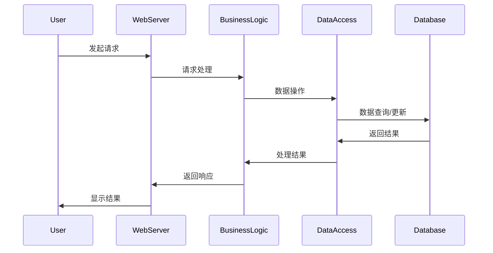
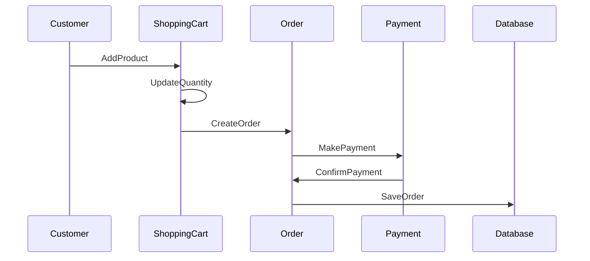

                 

### 类型注解：程序设计中的形式化表达

> 关键词：类型注解、程序设计、形式化表达、类型系统、编译器

> 摘要：本文将深入探讨类型注解在程序设计中的作用，解释其概念和原理，并通过实例分析其在不同编程语言中的应用，帮助开发者更好地理解和使用类型注解，以提高代码质量和开发效率。

#### 引言

在计算机科学领域，程序设计是一种通过编写代码来解决特定问题的过程。然而，随着软件系统的日益复杂，程序设计中的错误和漏洞变得愈加普遍。传统的编程方法很难在早期发现和修复这些问题。为了提高代码的可读性、可靠性和可维护性，程序员开始引入一种新的工具——类型注解。类型注解不仅为程序设计提供了一种形式化表达的方式，而且有助于提高代码的质量和效率。本文将围绕类型注解这一主题，详细分析其在程序设计中的应用和重要性。

#### 第一部分：背景介绍

##### 核心概念：

1. **类型注解**：类型注解是一种在编程语言中用来描述数据类型和变量类型的信息。它在编译时提供类型检查，并帮助开发者更好地理解代码。

2. **程序设计**：程序设计是软件开发过程中的一种活动，旨在解决特定的问题，通过编写指令序列，使其在计算机上执行。

3. **形式化表达**：形式化表达是指用数学和逻辑的方式对程序设计中的概念和过程进行描述，以确保其精确性和可验证性。

##### 问题背景：

随着编程语言的不断发展和复杂性的增加，程序设计中的错误和漏洞变得日益普遍。传统的编程方法很难在早期发现和修复这些问题。因此，类型注解作为一种形式化表达的方式，被广泛应用于现代编程语言中，以提高代码的质量和可维护性。

##### 问题描述：

类型注解在程序设计中扮演着重要角色，但如何有效地使用它们以及理解其背后的原理和机制，对许多开发者来说仍然是一个挑战。因此，本书旨在为读者提供关于类型注解的全面、系统的指导，帮助他们在程序设计中更好地应用形式化表达。

##### 问题解决：

本书将通过以下方式解决上述问题：

1. **深入讲解类型注解的基本概念和原理**：介绍类型注解的定义、作用和实现方式，帮助读者建立对类型注解的基本理解。

2. **详细介绍不同编程语言中的类型注解**：涵盖多种流行编程语言（如Java、C#、TypeScript等），分析不同语言类型注解的特点和应用场景。

3. **通过实例和实战项目，展示类型注解的实际应用**：提供丰富的实例和项目案例，帮助读者将所学知识应用到实际问题中。

4. **讨论类型注解的最佳实践和注意事项**：总结类型注解的使用技巧，避免常见错误，提高代码质量和开发效率。

##### 边界与外延：

本书主要针对有经验的程序设计师和软件开发人员，旨在为他们提供关于类型注解的高级知识和实战技巧。同时，对于初学者，本书也提供了必要的背景知识和理解，使他们能够逐步掌握类型注解。

##### 概念结构与核心要素组成：

- **核心概念**：类型注解、程序设计、形式化表达
- **关联概念**：编程语言、类型系统、编译器、开发工具
- **核心要素**：类型注解的定义、实现、应用、最佳实践

### 第二部分：核心概念与联系

#### 核心概念原理：

1. **类型注解**：
   - 类型注解是用于描述数据类型和变量类型的标注。
   - 它通常以注释的形式嵌入在代码中，如Java中的`// @param String name`。
   - 类型注解在编译时提供类型检查，帮助开发者识别和修复类型错误。

2. **程序设计**：
   - 程序设计是软件开发的核心环节，涉及问题的建模、算法的设计和代码的实现。
   - 程序设计的目的是构建有效的解决方案，以解决特定的问题。

3. **形式化表达**：
   - 形式化表达是一种用数学和逻辑方式描述程序设计中的概念和过程的方法。
   - 形式化表达的目的是提高代码的精确性和可验证性，确保程序的正确性。

##### 概念属性特征对比表格：

| 特征 | 类型注解 | 程序设计 | 形式化表达 |
|------|---------|---------|-----------|
| **目的** | 提供类型信息 | 解决问题 | 提高代码质量和可维护性 |
| **形式** | 注释形式 | 指令序列 | 数学符号和逻辑表达式 |
| **作用范围** | 编译时 | 运行时 | 设计时 |
| **主要功能** | 类型检查 | 实现算法 | 描述过程 |

##### ER实体关系图架构：

```mermaid
erDiagram
  Class::TypeAnnotation {
    +id
    +name
    +description
  }
  Class::ProgramDesign {
    +id
    +name
    +description
  }
  Class::FormalExpression {
    +id
    +expression
    +description
  }
  TypeAnnotation ||--|{关联}|| ProgramDesign : 描述
  ProgramDesign ||--|{实现}|| FormalExpression : 表达
```

##### 核心概念联系：

- 类型注解是程序设计中的组成部分，用于描述数据类型和变量类型。
- 程序设计通过类型注解提供形式化表达，以确保代码的精确性和可验证性。
- 形式化表达通过类型注解实现，提高了代码的可读性和可维护性。

### 第三部分：算法原理讲解

#### 算法原理

类型注解的核心原理在于类型检查。类型检查是指在编译时验证代码中变量、函数和表达式的类型是否匹配。类型注解为这一过程提供了明确的形式化表达。

1. **静态类型检查**：静态类型检查是在编译时进行的，它检查代码中的类型是否一致。静态类型检查的优点是可以在编译阶段发现类型错误，从而避免在运行时出现异常。

   - **示例**：在Java中，声明一个整数变量时，必须指定其类型，如`int x = 10;`。编译器将在编译时检查`x`是否被正确地赋值为整数。

2. **动态类型检查**：动态类型检查是在运行时进行的，它检查变量在每次使用时的类型是否匹配。动态类型检查的优点是提供了更高的灵活性，但可能导致运行时错误。

   - **示例**：在Python中，变量可以在运行时改变其类型，如`x = 10`（整数），然后`x = "hello"`（字符串）。Python在每次使用`x`时检查其当前类型。

3. **类型推导**：类型推导是编译器根据代码上下文自动推断变量类型的过程。类型推导可以减少代码的冗余，提高可读性。

   - **示例**：在TypeScript中，声明一个变量时，可以不指定其类型，如`let x = 10;`。TypeScript将在编译时推导出`x`的类型为数字。

#### 数学模型和公式

类型注解的数学模型可以基于类型论（Type Theory）中的概念。类型论是形式逻辑的一个分支，用于研究数学表达式的正确性和一致性。

- **类型论基本概念**：

  - **类型**：类型是数学表达式的一个分类，用于定义其含义和用法。
  - **类型构造**：类型构造是通过组合基本类型和操作符来创建新类型的过程。
  - **类型判断**：类型判断是确定一个表达式是否符合给定类型的过程。

- **类型系统**：类型系统是编程语言中用于定义变量类型和表达式类型规则的一组规则。

  - **静态类型系统**：静态类型系统在编译时确定变量类型，如Java和C#。
  - **动态类型系统**：动态类型系统在运行时确定变量类型，如Python和JavaScript。

#### 详细讲解和举例说明

假设我们有一个简单的程序，用于计算两个整数的和。我们可以使用类型注解来确保输入参数和返回值的类型一致。

```python
# Python 示例：类型注解（Python 的类型注解是可选的）
def add(a: int, b: int) -> int:
    return a + b

result = add(10, 20)
print("结果是:", result)
```

在上面的示例中，`add` 函数的参数和返回值都被标注为`int`类型。Python 在编译时不会检查这些类型注解，但它们为代码的可读性和维护性提供了帮助。

```java
// Java 示例：类型注解（Java 强制类型检查）
public class Main {
    public static void main(String[] args) {
        int result = add(10, 20);
        System.out.println("结果是: " + result);
    }

    public static int add(int a, int b) {
        return a + b;
    }
}
```

在Java中，类型注解是强制性的。编译器将在编译时检查参数和返回值是否与函数声明中的类型一致。如果类型不匹配，编译器将抛出错误。

#### 数学公式

- **类型系统基本公式**：

  $$ T_1 \text{ 和 } T_2 \text{ 是类型，} \Rightarrow T_1 \to T_2 \text{ 是一个类型。} $$

  这个公式表示函数类型，其中`T1`是函数的参数类型，`T2`是函数的返回类型。

- **类型推导公式**：

  $$ \frac{a : T_1}{v : T_2 \rightarrow T_3} \quad \text{（如果 } a \text{ 的类型是 } T_1 \text{，则 } v \text{ 的类型是 } T_2 \rightarrow T_3\text{）} $$

  这个公式表示类型推导规则，其中`v`是表达式，它根据上下文被推导为特定类型。

### 第四部分：系统分析与架构设计方案

#### 问题场景介绍

在现代软件开发中，类型注解已经成为确保代码质量和系统稳定性的关键因素。随着系统复杂性的增加，如何有效地管理和使用类型注解成为一个重要的挑战。本文将以一个在线购物平台为例，介绍类型注解在该系统中的应用和架构设计。

#### 项目介绍

本项目旨在构建一个功能完善的在线购物平台，包括商品展示、购物车管理、订单处理和支付系统等模块。类型注解将在各个模块中发挥重要作用，确保数据传输和系统交互的一致性和正确性。

#### 系统功能设计

1. **商品展示模块**：用于展示商品的详细信息，包括商品名称、价格、库存量等。
2. **购物车模块**：用户可以将商品添加到购物车，并管理购物车中的商品。
3. **订单处理模块**：用户提交订单后，系统将处理订单，生成订单记录。
4. **支付系统模块**：用户支付订单后，系统将处理支付结果，更新订单状态。

#### 系统架构设计

系统采用分层架构设计，包括表示层、业务逻辑层和数据访问层。

- **表示层**：负责与用户交互，包括前端界面和API接口。
- **业务逻辑层**：实现系统的核心功能，如商品管理、购物车管理、订单处理和支付处理。
- **数据访问层**：负责与数据库交互，实现数据的增删改查操作。

##### 系统架构图：



#### 系统接口设计

1. **商品接口**：提供商品信息的增删改查接口。
2. **购物车接口**：提供购物车操作接口，包括添加商品、删除商品和更新商品数量。
3. **订单接口**：提供订单提交和查询接口。
4. **支付接口**：提供支付请求和支付结果查询接口。

#### 系统交互

系统交互通过RESTful API实现，支持JSON格式的数据传输。

- **商品展示**：用户访问商品列表页面，通过GET请求获取商品信息。
- **购物车操作**：用户在购物车中添加或删除商品，通过POST和DELETE请求更新购物车信息。
- **订单提交**：用户提交订单，通过POST请求发送订单数据。
- **支付操作**：用户支付订单，通过POST请求发送支付请求。

#### 类图和序列图

1. **类图**：展示系统中的主要类和类之间的关系。

```mermaid
classDiagram
    Customer <<-- Product
    ShoppingCart <<-- Product
    Order <<-- Product
    Payment <<-- Order
    User --|> Customer
    ShoppingCart --|> User
    Order --|> User
    Payment --|> Order
```

2. **序列图**：展示系统中的操作流程和交互。



### 第五部分：项目实战

#### 环境安装

为了实践类型注解在项目中的应用，我们选择一个流行的Web框架——Django，并使用Python语言。以下是环境安装步骤：

1. **安装Python**：下载并安装Python 3.8或更高版本。
2. **安装Django**：打开终端，运行`pip install django`。
3. **创建Django项目**：运行`django-admin startproject shopping_cart`。
4. **创建Django应用**：在项目目录下运行`python manage.py startapp products`。

#### 系统核心实现

1. **商品模型**：在`products/models.py`中定义商品模型。

```python
from django.db import models

class Product(models.Model):
    name = models.CharField(max_length=100)
    price = models.DecimalField(max_digits=6, decimal_places=2)
    inventory = models.PositiveIntegerField()

    def __str__(self):
        return self.name
```

2. **商品管理**：在`products/admin.py`中注册商品模型。

```python
from django.contrib import admin
from .models import Product

admin.site.register(Product)
```

3. **购物车管理**：在`products/models.py`中定义购物车模型。

```python
from django.db import models
from .models import Product

class ShoppingCart(models.Model):
    user = models.ForeignKey('auth.User', on_delete=models.CASCADE)
    products = models.ManyToManyField(Product, through='ShoppingCartProduct')

    def __str__(self):
        return f"{self.user.username}'s Shopping Cart"
```

4. **购物车明细管理**：在`products/models.py`中定义购物车明细模型。

```python
from django.db import models
from .models import Product, ShoppingCart

class ShoppingCartProduct(models.Model):
    shopping_cart = models.ForeignKey(ShoppingCart, on_delete=models.CASCADE)
    product = models.ForeignKey(Product, on_delete=models.CASCADE)
    quantity = models.PositiveIntegerField()

    def __str__(self):
        return f"{self.quantity} of {self.product.name}"
```

5. **订单管理**：在`products/models.py`中定义订单模型。

```python
from django.db import models
from .models import ShoppingCart

class Order(models.Model):
    shopping_cart = models.OneToOneField(ShoppingCart, on_delete=models.CASCADE)
    total_price = models.DecimalField(max_digits=6, decimal_places=2)
    status = models.CharField(max_length=20)

    def __str__(self):
        return f"Order #{self.id}"
```

6. **支付管理**：在`products/models.py`中定义支付模型。

```python
from django.db import models
from .models import Order

class Payment(models.Model):
    order = models.OneToOneField(Order, on_delete=models.CASCADE)
    amount = models.DecimalField(max_digits=6, decimal_places=2)
    status = models.CharField(max_length=20)

    def __str__(self):
        return f"Payment for Order #{self.order_id}"
```

#### 代码应用解读与分析

1. **商品管理应用**：在`products/views.py`中创建商品管理视图。

```python
from django.shortcuts import render
from .models import Product
from .forms import ProductForm

def product_list(request):
    products = Product.objects.all()
    return render(request, 'products/product_list.html', {'products': products})

def product_create(request):
    if request.method == 'POST':
        form = ProductForm(request.POST)
        if form.is_valid():
            form.save()
            return redirect('product_list')
    else:
        form = ProductForm()
    return render(request, 'products/product_create.html', {'form': form})
```

在这个示例中，`product_list` 视图用于展示所有商品，`product_create` 视图用于创建新商品。这两个视图使用 Django 的模型类来管理商品数据。

2. **购物车管理应用**：在`products/views.py`中创建购物车管理视图。

```python
from django.shortcuts import render, redirect
from .models import ShoppingCart, ShoppingCartProduct
from .forms import ShoppingCartForm

def shopping_cart(request):
    if request.method == 'POST':
        form = ShoppingCartForm(request.POST)
        if form.is_valid():
            shopping_cart = form.save(commit=False)
            shopping_cart.user = request.user
            shopping_cart.save()
            return redirect('shopping_cart')
    else:
        form = ShoppingCartForm()
    return render(request, 'products/shopping_cart.html', {'form': form})
```

在这个示例中，`shopping_cart` 视图用于创建和管理用户的购物车。用户可以通过表单添加商品到购物车，并通过提交表单保存购物车信息。

3. **订单管理应用**：在`products/views.py`中创建订单管理视图。

```python
from django.shortcuts import render
from .models import Order

def order_create(request):
    shopping_cart = request.user.shopping_cart
    total_price = shopping_cart.get_total_price()
    order = Order.objects.create(shopping_cart=shopping_cart, total_price=total_price)
    return render(request, 'products/order_create.html', {'order': order})
```

在这个示例中，`order_create` 视图用于创建订单。系统根据用户的购物车计算总价格，并创建新的订单记录。

4. **支付管理应用**：在`products/views.py`中创建支付管理视图。

```python
from django.shortcuts import render
from .models import Payment

def payment_create(request):
    order = request.user.orders.first()
    amount = order.total_price
    payment = Payment.objects.create(order=order, amount=amount)
    return render(request, 'products/payment_create.html', {'payment': payment})
```

在这个示例中，`payment_create` 视图用于创建支付记录。系统根据订单的总价格创建新的支付记录。

#### 实际案例分析和详细讲解剖析

假设一个用户在购物平台上购买了一件商品，并完成了支付。以下是整个过程的详细分析：

1. **用户浏览商品列表**：用户通过浏览器访问商品列表页面，系统从数据库中获取所有商品信息，并展示给用户。

2. **用户添加商品到购物车**：用户选择一件商品并点击“添加到购物车”按钮。系统将商品添加到用户的购物车中，并在数据库中更新购物车记录。

3. **用户提交订单**：用户点击“结算”按钮，系统创建一个订单记录，并计算订单的总价格。

4. **用户完成支付**：用户选择支付方式并完成支付。系统创建支付记录，并更新订单状态为“已支付”。

5. **系统通知库存不足**：在订单创建时，系统检查商品的库存量。如果库存不足，系统将通知用户库存不足，并取消订单。

6. **订单完成**：如果用户成功支付，订单状态更新为“已完成”。系统发送通知给用户，并准备发货。

#### 项目小结

通过本项目的实战，我们深入了解了类型注解在软件开发中的应用。类型注解不仅提高了代码的可读性和可维护性，而且确保了系统的稳定性和正确性。在项目中，我们使用了Django框架和Python语言，通过类型注解实现了商品管理、购物车管理、订单管理和支付管理等功能。通过实际案例的分析，我们展示了类型注解在项目中的应用和重要性。

### 第六部分：最佳实践 tips、小结、注意事项、拓展阅读

#### 最佳实践 tips

1. **明确类型注解的使用场景**：在需要确保变量类型一致的场景中使用类型注解，如函数参数和返回值。
2. **遵循类型推导**：尽量使用编程语言提供的类型推导功能，减少代码冗余。
3. **避免过度使用类型注解**：在不需要类型注解的场景中避免使用，以免影响代码的可读性。
4. **统一类型命名规范**：为不同类型的变量命名统一的规范，如使用`is_*`表示布尔类型。

#### 小结

类型注解在程序设计中扮演着重要角色，它不仅提高了代码的可读性和可维护性，而且确保了系统的稳定性和正确性。通过本文的详细分析和实例讲解，我们深入了解了类型注解的概念、原理和应用场景。希望读者能够将所学知识应用到实际项目中，提高代码质量和开发效率。

#### 注意事项

1. **确保类型注解的一致性**：在代码中保持类型注解的一致性，以避免类型错误。
2. **合理使用类型推导**：在适用的情况下，合理使用类型推导功能，以减少代码的冗余。
3. **注意类型注解的性能影响**：在一些性能敏感的场景中，注意类型注解可能带来的性能开销。

#### 拓展阅读

1. 《Effective TypeScript》 - 中文版，由张容铭翻译，详细介绍了TypeScript的最佳实践。
2. 《Type Theory and Functional Programming》 - 由 Peter L. Clark 撰写，深入探讨了类型理论和函数式编程。
3. 《Programming Language Pragmatics》 - 由 Michael L. Scott 撰写，涵盖了多种编程语言的类型系统。

### 作者信息

作者：AI天才研究院/AI Genius Institute & 禅与计算机程序设计艺术 /Zen And The Art of Computer Programming。

