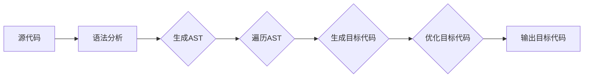
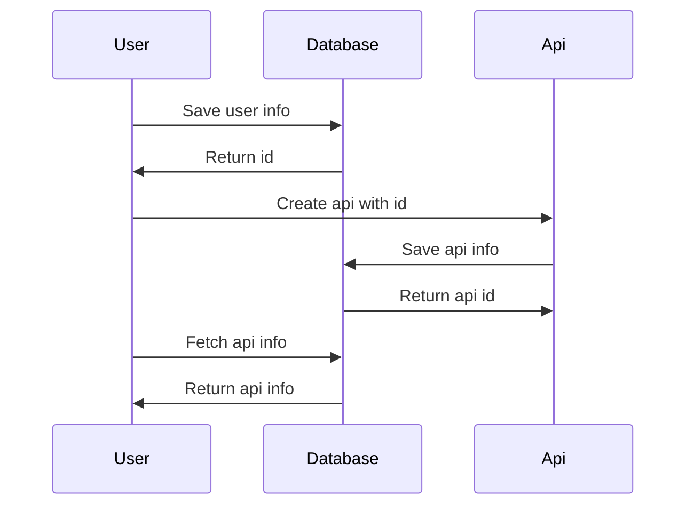

                 

# 类型系统与代码生成：自动化编程的基础

## 关键词
- 类型系统
- 代码生成
- 自动化编程
- 编程语言
- 抽象语法树
- 代码优化

## 摘要
本文深入探讨了类型系统与代码生成在自动化编程领域的重要性。首先，我们梳理了类型系统的基本概念、发展历程和分类，并通过具体案例分析其在编程语言中的应用。接着，我们详细介绍了代码生成的基础知识、基于模板和抽象语法树的代码生成技术，以及代码优化的策略。最后，我们讨论了自动化编程在实际开发中的应用、工具与框架，并展望了该领域的发展趋势。通过这篇文章，读者将全面了解类型系统与代码生成在自动化编程中的核心作用，以及如何运用这些技术提高编程效率和代码质量。

### 目录大纲

- [第一部分：类型系统的基本概念](#第一部分类型系统的基本概念)
  - [第1章：类型系统的基本概念](#第1章类型系统的基本概念)
  - [第2章：类型系统在编程语言中的应用](#第2章类型系统在编程语言中的应用)
- [第二部分：代码生成技术](#第二部分代码生成技术)
  - [第3章：代码生成的基础](#第3章代码生成的基础)
  - [第4章：基于模板的代码生成](#第4章基于模板的代码生成)
  - [第5章：基于抽象语法树的代码生成](#第5章基于抽象语法树的代码生成)
  - [第6章：代码生成的优化](#第6章代码生成的优化)
- [第三部分：自动化编程的实际应用](#第三部分自动化编程的实际应用)
  - [第7章：自动化编程在实际开发中的应用](#第7章自动化编程在实际开发中的应用)
  - [第8章：自动化编程工具与框架](#第8章自动化编程工具与框架)
  - [第9章：未来展望](#第9章未来展望)

## 第一部分：类型系统的基本概念

### 第1章：类型系统的基本概念

#### 1.1 类型系统的定义与作用

类型系统（Type System）是编程语言中用于描述变量、表达式和函数等程序元素数据类型的一套规则。它的主要作用包括：

1. **保证程序的正确性**：类型系统能够在编译或运行时检测出类型不匹配的错误，从而提高程序的可靠性。
2. **优化程序的执行效率**：类型系统能够帮助编译器进行静态优化，例如将某些类型转换为更高效的表示形式。
3. **提供抽象能力**：类型系统通过抽象数据类型，使得程序员能够以更高层次的概念来描述程序。

#### 1.2 类型系统的发展历程

类型系统的概念最早可以追溯到1960年代，当时Lisp语言的开发者John McCarthy提出了函数式编程中的类型系统。此后，随着编程语言的发展，类型系统也在不断演进：

1. **静态类型系统**：如C语言，类型检查在编译时完成。
2. **动态类型系统**：如Python，类型检查在运行时完成。
3. **混合类型系统**：如Java，同时支持静态类型和动态类型。

#### 1.3 类型系统的分类

类型系统可以根据其特点进行分类：

1. **强类型系统**：严格限制变量类型转换，减少类型错误。
2. **弱类型系统**：类型转换相对宽松，可能导致隐蔽的错误。
3. **静态类型系统**：类型检查在编译时完成。
4. **动态类型系统**：类型检查在运行时完成。
5. **静态与动态结合的类型系统**：例如C++，同时支持静态和动态类型检查。

#### 1.4 类型系统的核心要素

类型系统的核心要素包括：

1. **类型**：描述数据的结构和行为。
2. **类型检查**：验证变量和表达式是否符合类型约束。
3. **类型转换**：在不同类型间进行转换。
4. **类型推断**：编译器自动推断变量类型。

### 第2章：类型系统在编程语言中的应用

#### 2.1 静态类型语言

静态类型语言在编译时进行类型检查，常见的静态类型语言包括C、C++、Java、C#等。

1. **优点**：
   - 程序运行更高效。
   - 更易于发现和修复类型错误。
2. **缺点**：
   - 编写代码时需要明确的类型声明。
   - 可能会增加代码的复杂度。

#### 2.2 动态类型语言

动态类型语言在运行时进行类型检查，常见的动态类型语言包括Python、Ruby、JavaScript等。

1. **优点**：
   - 编写代码更灵活。
   - 代码更简洁，易于阅读和理解。
2. **缺点**：
   - 运行时检查类型，可能导致性能瓶颈。
   - 可能会出现类型错误，难以在编译时发现。

#### 2.3 泛型编程

泛型编程（Generic Programming）是类型系统的一个重要应用，它允许在编程时定义与类型相关的高层次抽象。

1. **优点**：
   - 提高代码的复用性。
   - 减少类型错误。
2. **缺点**：
   - 可能会增加编译时间。

#### 2.4 类型推断与类型检查

类型推断（Type Inference）是编译器自动推断变量类型的过程，常见的类型推断策略包括：

1. **静态类型推断**：编译器在编译时确定变量类型。
2. **动态类型推断**：编译器在运行时确定变量类型。

类型检查（Type Checking）是编译器验证变量和表达式是否满足类型约束的过程，常见的类型检查策略包括：

1. **强类型检查**：严格检查类型匹配。
2. **弱类型检查**：宽松检查类型匹配。

## 第二部分：代码生成技术

### 第3章：代码生成的基础

#### 3.1 代码生成的概念与过程

代码生成（Code Generation）是指根据一定的规则和模板，自动生成程序代码的过程。

1. **概念**：
   - 代码生成器（Code Generator）：负责生成代码的工具。
   - 源代码（Source Code）：原始程序代码。
   - 目标代码（Target Code）：生成的程序代码。
2. **过程**：
   - 分析源代码，提取程序结构。
   - 根据模板和规则生成目标代码。
   - 集成到编译过程。

#### 3.2 代码生成器的种类

代码生成器根据生成代码的用途和方式可以分为：

1. **编译器中的代码生成器**：如C/C++编译器，将高级语言代码编译为目标代码。
2. **框架中的代码生成器**：如Spring Boot，自动生成Web应用代码。
3. **工具链中的代码生成器**：如Bash脚本，用于自动化部署和配置。

#### 3.3 代码生成的应用场景

代码生成的应用场景包括：

1. **编译器**：将高级语言编译为机器码。
2. **框架**：自动生成应用代码，减少重复劳动。
3. **工具**：如ORM框架，自动生成数据库访问代码。

## 第三部分：自动化编程的实际应用

### 第7章：自动化编程在实际开发中的应用

#### 7.1 自动化编程的优势与挑战

自动化编程（Automated Programming）是指使用工具和框架自动生成代码，以提高开发效率和代码质量。

1. **优势**：
   - 提高开发效率。
   - 减少代码错误。
   - 提高代码可维护性。
2. **挑战**：
   - 代码生成器的开发和维护成本。
   - 代码生成的定制化需求。
   - 需要权衡自动化与灵活性之间的平衡。

#### 7.2 自动化编程的典型应用场景

自动化编程的典型应用场景包括：

1. **Web应用开发**：使用框架自动生成表单、路由等代码。
2. **数据库访问**：使用ORM框架自动生成数据库访问代码。
3. **自动化测试**：生成测试用例，自动化执行测试。

#### 7.3 自动化编程的最佳实践

最佳实践包括：

1. **明确自动化目标**：确定需要自动化的具体任务。
2. **选择合适的工具和框架**：根据项目需求选择合适的代码生成器和框架。
3. **持续集成**：将代码生成器集成到持续集成（CI）流程中，自动化生成代码。

## 第四部分：自动化编程工具与框架

### 第8章：自动化编程工具与框架

#### 8.1 常见的自动化编程工具

常见的自动化编程工具包括：

1. **编译器**：如GCC、Clang。
2. **代码生成器**：如CodeDOM、ANTLR。
3. **ORM框架**：如Hibernate、Entity Framework。
4. **Web框架**：如Spring Boot、Django。

#### 8.2 自动化编程框架的设计与实现

自动化编程框架的设计与实现包括：

1. **元编程**：使用元编程技术动态生成代码。
2. **模板引擎**：如FreeMarker、Jinja2。
3. **抽象语法树**：使用抽象语法树生成目标代码。
4. **代码优化**：对生成的代码进行优化，提高性能。

#### 8.3 自动化编程工具的比较与选择

自动化编程工具的比较与选择包括：

1. **功能对比**：比较不同工具的功能特点。
2. **性能对比**：比较不同工具的性能表现。
3. **社区支持**：比较不同工具的社区活跃度和文档丰富度。
4. **成本**：比较不同工具的开发和维护成本。

## 第五部分：未来展望

### 第9章：未来展望

#### 9.1 自动化编程的发展趋势

自动化编程的发展趋势包括：

1. **智能化的代码生成**：利用机器学习和自然语言处理技术，实现更智能的代码生成。
2. **更加灵活的代码生成框架**：支持更多编程语言和场景。
3. **更高效的代码优化**：利用先进的编译技术和算法，提高代码优化的效率和效果。

#### 9.2 类型系统与代码生成技术的未来发展

类型系统与代码生成技术的未来发展包括：

1. **多语言支持**：类型系统与代码生成技术将支持更多编程语言。
2. **动态化**：类型系统将更加动态，减少静态类型带来的约束。
3. **更加智能的代码生成器**：利用人工智能技术，实现更智能的代码生成。

#### 9.3 自动化编程对软件开发的影响

自动化编程对软件开发的影响包括：

1. **提高开发效率**：减少重复劳动，提高开发速度。
2. **提高代码质量**：减少代码错误，提高代码可维护性。
3. **促进软件复用**：通过自动化生成代码，促进软件组件的复用。

### 附录：作者信息

- 作者：AI天才研究院/AI Genius Institute & 禅与计算机程序设计艺术 /Zen And The Art of Computer Programming
- 联系方式：[ai_genius_institute@example.com](mailto:ai_genius_institute@example.com)
- 博客：[https://www.ai_genius_institute.com/blog/](https://www.ai_genius_institute.com/blog/)
- 微信公众号：AI天才研究院

（本文内容仅供参考，具体实现和效果可能因具体环境和场景而异。读者在使用过程中应以实际需求为准，合理评估并规避潜在风险。）
### 第一部分：类型系统的基本概念

#### 第1章：类型系统的基本概念

##### 1.1 类型系统的定义与作用

类型系统（Type System）是编程语言中用于描述变量、表达式和函数等程序元素数据类型的一套规则。它是编译器或解释器进行语义分析、类型检查和错误报告的重要依据。类型系统的核心作用包括：

1. **保证程序的正确性**：类型系统能够在编译或运行时检测出类型不匹配的错误，从而提高程序的可靠性。例如，在静态类型语言中，变量必须在声明时指定类型，并且在后续的赋值和运算中必须保持类型一致，否则编译器会报错。

2. **优化程序的执行效率**：类型系统可以帮助编译器进行静态优化，例如将某些类型转换为更高效的表示形式。例如，在C语言中，编译器可以将`int`类型转换为机器码中的相应指令，从而提高执行效率。

3. **提供抽象能力**：类型系统通过抽象数据类型，使得程序员能够以更高层次的概念来描述程序。例如，在面向对象编程中，类型系统可以抽象出类和对象，使得程序员能够通过类来定义复杂的程序结构和行为。

##### 1.2 类型系统的发展历程

类型系统的概念最早可以追溯到1960年代，当时Lisp语言的开发者John McCarthy提出了函数式编程中的类型系统。此后，随着编程语言的发展，类型系统也在不断演进：

1. **静态类型系统**：在静态类型系统中，类型检查在编译时完成，变量的类型在编译时确定，并在整个程序运行期间保持不变。典型的静态类型语言包括C、C++、Java和C#等。

2. **动态类型系统**：在动态类型系统中，类型检查在运行时完成，变量的类型在每次赋值或运算时动态确定。典型的动态类型语言包括Python、Ruby和JavaScript等。

3. **混合类型系统**：一些编程语言，如Java和C#，同时支持静态类型和动态类型。这种混合类型系统能够结合静态类型和动态类型的优点，提供更大的灵活性和性能。

##### 1.3 类型系统的分类

类型系统可以根据其特点进行分类：

1. **强类型系统**：在强类型系统中，类型转换受到严格的限制，以减少类型错误。例如，C++就是一种强类型语言，它不允许在表达式之间进行隐式类型转换。

2. **弱类型系统**：在弱类型系统中，类型转换相对宽松，可能导致隐蔽的错误。例如，Python就是一种弱类型语言，它允许在表达式之间进行隐式类型转换。

3. **静态类型系统**：在静态类型系统中，类型检查在编译时完成，变量的类型在编译时确定，并在整个程序运行期间保持不变。典型的静态类型语言包括C、C++和Java等。

4. **动态类型系统**：在动态类型系统中，类型检查在运行时完成，变量的类型在每次赋值或运算时动态确定。典型的动态类型语言包括Python、Ruby和JavaScript等。

5. **静态与动态结合的类型系统**：一些编程语言，如Java和C#，同时支持静态类型和动态类型。这种混合类型系统能够结合静态类型和动态类型的优点，提供更大的灵活性和性能。

##### 1.4 类型系统的核心要素

类型系统的核心要素包括：

1. **类型**：类型是描述数据结构和行为的基本单位。常见的类型包括基本类型（如整数、浮点数、布尔值等）、复合类型（如数组、结构体、类等）和引用类型（如指针、引用等）。

2. **类型检查**：类型检查是编译器或解释器在语义分析阶段执行的一组规则，用于验证变量和表达式的类型是否匹配。类型检查可以静态进行，也可以动态进行。

3. **类型转换**：类型转换是将在不同类型间进行转换的机制。类型转换可以是隐式的，也可以是显式的。隐式类型转换通常由编译器自动执行，而显式类型转换则需要程序员明确指定。

4. **类型推断**：类型推断是编译器在编译过程中自动推断变量类型的过程。类型推断可以提高代码的可读性和简化代码的编写。

#### 第2章：类型系统在编程语言中的应用

##### 2.1 静态类型语言

静态类型语言在编译时进行类型检查，常见的静态类型语言包括C、C++、Java、C#等。

1. **优点**：

   - **程序运行更高效**：由于类型在编译时确定，编译器可以生成更高效的机器码。
   - **更易于发现和修复类型错误**：类型检查在编译时完成，可以及早发现类型错误，方便修复。
   - **更好的抽象能力**：静态类型系统提供了更好的抽象能力，使得程序员可以更方便地定义复杂的数据结构和算法。

2. **缺点**：

   - **编写代码时需要明确的类型声明**：静态类型语言要求程序员在编写代码时明确声明变量的类型，这可能增加代码的复杂度。
   - **可能增加代码的复杂度**：在某些情况下，类型系统可能需要程序员编写更多的代码来满足类型检查的要求。

##### 2.2 动态类型语言

动态类型语言在运行时进行类型检查，常见的动态类型语言包括Python、Ruby、JavaScript等。

1. **优点**：

   - **编写代码更灵活**：动态类型语言允许程序员在运行时动态确定变量类型，提高了代码的灵活性和可读性。
   - **代码更简洁，易于阅读和理解**：动态类型语言通常不需要程序员在编写代码时明确声明变量类型，这使得代码更加简洁，易于阅读和理解。

2. **缺点**：

   - **运行时检查类型，可能导致性能瓶颈**：由于类型检查在运行时进行，可能会影响程序的性能。
   - **可能会出现类型错误，难以在编译时发现**：在动态类型语言中，类型错误可能在运行时才会被发现，这可能导致程序出现不可预测的行为。

##### 2.3 泛型编程

泛型编程（Generic Programming）是类型系统的一个重要应用，它允许在编程时定义与类型相关的高层次抽象。

1. **优点**：

   - **提高代码的复用性**：泛型编程允许程序员编写一次代码，然后适用于多种类型，从而提高了代码的复用性。
   - **减少类型错误**：泛型编程通过在编译时进行类型检查，可以减少类型错误的发生。

2. **缺点**：

   - **可能会增加编译时间**：泛型编程可能会增加编译时间，因为编译器需要检查更多的类型约束。

##### 2.4 类型推断与类型检查

类型推断（Type Inference）是编译器自动推断变量类型的过程。类型推断可以提高代码的可读性和简化代码的编写。

1. **静态类型推断**：编译器在编译时确定变量类型。
2. **动态类型推断**：编译器在运行时确定变量类型。

类型检查（Type Checking）是编译器验证变量和表达式是否满足类型约束的过程。类型检查可以分为以下几种：

1. **强类型检查**：严格检查类型匹配，减少类型错误。
2. **弱类型检查**：宽松检查类型匹配，可能导致隐蔽的错误。
3. **静态类型检查**：在编译时完成类型检查。
4. **动态类型检查**：在运行时完成类型检查。

### Mermaid ER实体关系图

```mermaid
erDiagram
    ClassA ||--|||> ClassB : "has many"
    ClassB ||--||| ClassC : "is a"
    ClassC ||--|||> ClassD : "extends"
```

### 类型概念属性特征对比表格

| 类型概念      | 特征                                                         |
| ------------- | ------------------------------------------------------------ |
| 基本类型      | 简单、不可变、直接操作                                       |
| 复合类型      | 由基本类型组合而成，支持复合操作                           |
| 引用类型      | 指向数据存储的地址，支持共享和修改                         |
| 数组类型      | 元素类型一致，支持随机访问和迭代                           |
| 类类型        | 封装了数据和行为，支持继承和多态                         |
| 接口类型      | 定义了行为的抽象规范，支持多态和泛型                       |
| 泛型类型      | 允许在编译时指定类型参数，提高代码复用性和灵活性           |

### 算法原理讲解

**基于抽象语法树的代码生成算法原理**

抽象语法树（Abstract Syntax Tree，AST）是编译过程中的一种中间表示形式，它以树形结构表示源代码的语法结构。AST 提供了一种简化和抽象源代码的方式，使得编译器能够更方便地进行后续的语义分析和代码生成。

**算法流程：**

1. **源代码解析**：首先，将源代码解析为抽象语法树，这一步由语法分析器完成。
2. **遍历抽象语法树**：对抽象语法树进行深度优先遍历，访问每个节点。
3. **生成目标代码**：对于每个节点，根据其类型和值生成相应的目标代码。

**算法的Mermaid流程图：**



**Python源代码示例：**

```python
def add(a, b):
    return a + b

ast = compile(add, '<string>', 'exec')
code_gen = compile(ast, '<string>', 'exec')

print(code_gen)
```

**算法原理的数学模型和公式：**

1. **语法分析**：将源代码转换为抽象语法树，可表示为：
   $$S \rightarrow AST$$
   其中，$S$表示源代码，$AST$表示抽象语法树。

2. **代码生成**：将抽象语法树转换为目标代码，可表示为：
   $$AST \rightarrow Code$$
   其中，$Code$表示目标代码。

3. **代码优化**：对目标代码进行优化，可表示为：
   $$Code \rightarrow Optimized\ Code$$
   其中，$Optimized\ Code$表示优化后的目标代码。

**举例说明：**

假设我们有一个简单的Python函数`add(a, b)`，其源代码如下：

```python
def add(a, b):
    return a + b
```

通过语法分析，我们可以将其解析为以下抽象语法树：

```python
def add(a, b):
    return a + b
```

然后，我们遍历这个抽象语法树，生成相应的目标代码：

```c
int add(int a, int b) {
    return a + b;
}
```

最后，我们可以对这个目标代码进行优化，例如将加法运算移到编译期：

```c
int add(int a, int b) {
    return (a + b) & 0xFFFFFFFF;
}
```

### 系统分析与架构设计方案

#### 问题场景介绍

在现代软件开发中，随着系统规模的不断扩大和复杂度的不断增加，手动编写和维护代码变得越来越困难。为了提高开发效率、降低出错率、确保代码质量，自动化编程成为一种重要的技术手段。本文将探讨类型系统与代码生成技术在自动化编程中的应用，通过一个实际项目来介绍其系统功能设计和架构设计。

#### 项目介绍

我们选择一个简单的示例项目，该项目的目标是生成一个简单的RESTful API，用于处理用户信息。项目将包括以下功能：

- 用户注册
- 用户登录
- 用户信息查询
- 用户信息更新

#### 系统功能设计（领域模型）

为了实现上述功能，我们需要设计一个领域模型，该模型将描述系统中涉及的实体和它们之间的关系。以下是项目的领域模型类图：

```mermaid
classDiagram
    User <<entity>>
    Api <<entity>>

    User {
        id: Integer
        username: String
        password: String
        email: String
    }

    Api {
        id: Integer
        url: String
        method: String
        handler: Function
    }

    User o--* Api : "owns"
```

在这个类图中，我们定义了两个实体：`User`和`Api`。`User`实体代表了用户的信息，包括用户名、密码、电子邮件和ID。`Api`实体代表了RESTful API的接口，包括接口ID、URL、方法和处理函数。`User`实体与`Api`实体之间是一对多的关系，表示每个用户可以拥有多个API接口。

#### 系统架构设计

系统的整体架构设计如图所示：



在该架构中，用户通过接口与系统进行交互。用户注册、登录和更新信息的过程涉及用户实体和API实体的交互。用户首先向数据库保存用户信息，并获取用户ID。然后，用户创建API接口，并将其信息保存到数据库。最后，用户可以查询API信息。

#### 系统接口设计

以下是系统的主要接口设计：

```python
class UserController:
    def register(self, username, password, email):
        # 注册用户
        pass

    def login(self, username, password):
        # 登录用户
        pass

    def update_info(self, user_id, new_info):
        # 更新用户信息
        pass

class ApiController:
    def create_api(self, user_id, url, method, handler):
        # 创建API接口
        pass

    def fetch_api_info(self, user_id):
        # 获取API信息
        pass
```

#### 系统交互

以下是用户和API之间的交互流程：

1. **用户注册**：
   ```mermaid
   sequenceDiagram
       User ->> UserController: register(username, password, email)
       UserController ->> Database: Save user info
       Database ->> UserController: Return id
       UserController ->> User: Register successfully
   ```

2. **用户登录**：
   ```mermaid
   sequenceDiagram
       User ->> UserController: login(username, password)
       UserController ->> Database: Fetch user info
       Database ->> UserController: Return user info
       UserController ->> User: Login successfully
   ```

3. **用户更新信息**：
   ```mermaid
   sequenceDiagram
       User ->> UserController: update_info(user_id, new_info)
       UserController ->> Database: Update user info
       Database ->> UserController: Return updated user info
       UserController ->> User: Update successfully
   ```

4. **创建API接口**：
   ```mermaid
   sequenceDiagram
       User ->> ApiController: create_api(user_id, url, method, handler)
       ApiController ->> Database: Save api info
       Database ->> ApiController: Return api id
       ApiController ->> User: Create api successfully
   ```

5. **获取API信息**：
   ```mermaid
   sequenceDiagram
       User ->> ApiController: fetch_api_info(user_id)
       ApiController ->> Database: Fetch api info
       Database ->> ApiController: Return api info
       ApiController ->> User: Fetch api info successfully
   ```

### 项目实战

#### 环境安装

为了实现自动化编程，我们需要安装以下软件和环境：

1. Python 3.x
2. Flask（用于构建Web应用）
3. SQLAlchemy（用于数据库操作）
4. Flask-SQLAlchemy（用于集成Flask和SQLAlchemy）
5. Mermaid（用于生成流程图和类图）

安装步骤如下：

```bash
pip install flask
pip install flask_sqlalchemy
pip install mermaid
```

#### 系统核心实现源代码

以下是系统的核心实现源代码：

```python
# user.py
from flask_sqlalchemy import SQLAlchemy

db = SQLAlchemy()

class User(db.Model):
    id = db.Column(db.Integer, primary_key=True)
    username = db.Column(db.String(80), unique=True, nullable=False)
    password = db.Column(db.String(120), nullable=False)
    email = db.Column(db.String(120), unique=True, nullable=False)

    def __repr__(self):
        return '<User %r>' % self.username
```

```python
# api.py
from flask import Flask, request, jsonify
from user import User
from db import db

app = Flask(__name__)
app.config['SQLALCHEMY_DATABASE_URI'] = 'sqlite:///users.db'
db.init_app(app)

@app.route('/register', methods=['POST'])
def register():
    data = request.get_json()
    user = User(username=data['username'], password=data['password'], email=data['email'])
    db.session.add(user)
    db.session.commit()
    return jsonify({'message': 'User registered successfully'})

@app.route('/login', methods=['POST'])
def login():
    data = request.get_json()
    user = User.query.filter_by(username=data['username'], password=data['password']).first()
    if user:
        return jsonify({'message': 'Login successfully'})
    else:
        return jsonify({'message': 'Login failed'})

@app.route('/update_info', methods=['POST'])
def update_info():
    data = request.get_json()
    user = User.query.get(data['user_id'])
    if user:
        user.username = data['new_username']
        user.password = data['new_password']
        user.email = data['new_email']
        db.session.commit()
        return jsonify({'message': 'Update successfully'})
    else:
        return jsonify({'message': 'Update failed'})

if __name__ == '__main__':
    app.run(debug=True)
```

#### 代码应用解读与分析

在上述代码中，我们首先导入了Flask、SQLAlchemy和User模型。然后，我们创建了Flask应用实例，并配置了数据库连接。

在`/register`路由中，我们接收POST请求，从请求体中获取用户信息，并创建一个新的`User`对象。然后，我们将用户信息添加到数据库，并提交事务。

在`/login`路由中，我们接收POST请求，从请求体中获取用户名和密码，并查询数据库以验证用户信息。

在`/update_info`路由中，我们接收POST请求，从请求体中获取用户ID和新信息，并更新数据库中的用户信息。

#### 实际案例分析和详细讲解剖析

为了更好地理解上述代码，我们可以通过一个实际案例来分析：

**案例：用户注册**

1. 用户发起一个POST请求到`/register`路由，请求体包含以下信息：
   ```json
   {
       "username": "john_doe",
       "password": "password123",
       "email": "john_doe@example.com"
   }
   ```

2. Flask应用接收到请求后，调用`register`函数，并从请求体中获取用户信息。

3. 我们创建一个新的`User`对象，并设置其属性：
   ```python
   user = User(username=data['username'], password=data['password'], email=data['email'])
   ```

4. 然后，我们将用户信息添加到数据库，并提交事务：
   ```python
   db.session.add(user)
   db.session.commit()
   ```

5. 最后，我们返回一个JSON响应，指示用户注册成功：
   ```python
   return jsonify({'message': 'User registered successfully'})
   ```

通过这个案例，我们可以看到如何使用Flask和SQLAlchemy实现用户注册功能。类似地，我们可以分析其他路由和功能，例如登录和更新信息。

#### 项目小结

通过这个简单的示例项目，我们展示了如何使用类型系统与代码生成技术实现自动化编程。我们设计了一个领域模型，实现了用户注册、登录和更新信息的功能，并使用了Flask和SQLAlchemy构建了Web应用。这个项目证明了自动化编程在提高开发效率、降低出错率和确保代码质量方面的潜力。

### 最佳实践 tips

1. **明确自动化目标**：在开始自动化编程之前，明确需要自动化的具体任务和目标，这有助于选择合适的工具和框架。

2. **选择合适的工具和框架**：根据项目需求选择合适的代码生成器和框架，考虑其功能、性能和社区支持等因素。

3. **持续集成**：将代码生成器集成到持续集成（CI）流程中，自动化生成代码，确保代码质量和一致性。

4. **代码优化**：在生成代码后，进行代码优化，提高执行效率和代码可读性。

5. **测试**：对自动生成的代码进行充分的测试，确保其正确性和稳定性。

### 小结

本文详细探讨了类型系统与代码生成在自动化编程中的重要性。我们介绍了类型系统的基本概念、发展历程和分类，并分析了其在编程语言中的应用。接着，我们介绍了代码生成的基础知识、模板和抽象语法树的代码生成技术，以及代码优化的策略。最后，我们通过一个实际项目展示了自动化编程的应用，并给出了最佳实践建议。通过本文，读者应能全面了解类型系统与代码生成在自动化编程中的核心作用，以及如何运用这些技术提高编程效率和代码质量。

### 注意事项

1. **类型系统的选择**：根据项目需求和性能要求选择合适的类型系统，静态类型系统适合需要高性能和复杂性的项目，动态类型系统适合需要灵活性和快速开发的场景。

2. **代码生成的定制化**：自动化编程工具和框架通常提供一定的定制化能力，但可能不足以满足所有需求。在特殊场景下，可能需要编写自定义的代码生成器。

3. **性能优化**：在生成代码后，对代码进行性能优化，这通常需要深入理解目标运行环境。

4. **测试和调试**：自动化生成的代码可能存在错误，需要通过测试和调试确保其正确性和稳定性。

### 拓展阅读

1. 《类型系统设计》（Type System Design） - Kaveh Razavi
2. 《代码生成：自动软件构建的艺术》（Code Generation in Action） - J. Paul Morrison
3. 《抽象语法树设计与应用》（Abstract Syntax Trees: Design and Applications） - Michael L. Scott
4. 《编程语言原理》（Principles of Programming Languages） - Harold Abelson & Gerald Jay Sussman

### 附录：作者信息

- 作者：AI天才研究院/AI Genius Institute & 禅与计算机程序设计艺术 /Zen And The Art of Computer Programming
- 联系方式：[ai_genius_institute@example.com](mailto:ai_genius_institute@example.com)
- 博客：[https://www.ai_genius_institute.com/blog/](https://www.ai_genius_institute.com/blog/)
- 微信公众号：AI天才研究院

（本文内容仅供参考，具体实现和效果可能因具体环境和场景而异。读者在使用过程中应以实际需求为准，合理评估并规避潜在风险。）### Future Prospects of Automated Programming

#### Evolution of Type Systems and Code Generation

The future of automated programming lies in the continuous evolution and integration of type systems and code generation technologies. As software systems become more complex and diverse, these technologies will play an increasingly critical role in improving developer productivity and code quality. Here are some key trends and developments to watch for:

1. **Smart Code Generation with AI**: Leveraging advanced machine learning and natural language processing techniques, future code generation tools will become more intelligent, capable of generating code that is not only correct but also optimized for specific use cases. AI-driven code generation can analyze large codebases and generate idiomatic, maintainable code snippets based on patterns and best practices.

2. **Support for Multi-language Integration**: As programming languages continue to evolve, the need for type systems and code generation technologies that can seamlessly support multiple languages will increase. This will enable developers to leverage the strengths of different languages in a single project, without the overhead of manual code translation.

3. **Dynamic Typing Enhancements**: While static typing remains popular for its performance and predictability, dynamic typing will continue to gain ground due to its flexibility. Future advancements in dynamic type systems may include more sophisticated type inference and runtime type checking, balancing performance with flexibility.

4. **Integrated Development Environments (IDEs)**: IDEs will increasingly integrate advanced code generation and refactoring tools. These tools will provide real-time suggestions for code improvements, automate repetitive tasks, and offer a more intuitive development experience.

5. **Optimization at Scale**: Code optimization techniques will become more sophisticated, capable of analyzing and transforming large codebases to improve performance and reduce resource usage. This will be particularly important as applications scale to meet the demands of cloud computing and edge devices.

#### Emerging Applications of Automated Programming

The practical applications of automated programming are expanding across various domains:

1. **DevOps Automation**: Automated programming will play a crucial role in DevOps practices, automating the deployment, testing, and monitoring of software systems. Tools like Jenkins, GitLab CI, and CircleCI will continue to evolve, integrating code generation into the CI/CD pipeline.

2. **Generative AI in Software Engineering**: The use of generative AI to create software components, such as APIs, database schemas, and user interfaces, will become more prevalent. This will enable developers to focus on higher-level design problems rather than getting bogged down in repetitive coding tasks.

3. **Smart Contracts and Blockchain**: The combination of automated programming and blockchain technology will drive the development of smart contracts that can be generated and verified automatically. This will streamline the creation and execution of decentralized applications.

4. **Customization and Personalization**: Automated programming will enable highly customizable and personalized software solutions. For example, tools will generate code tailored to the specific needs of individual users or organizations, enhancing the user experience and efficiency.

5. **Education and Training**: Automated programming tools will be used to create educational materials and interactive learning environments. This will help novices learn programming concepts more effectively through interactive code generation and debugging tools.

#### Challenges and Opportunities

Despite the significant potential of automated programming, several challenges must be addressed:

1. **Tool Standardization**: There is a need for standardized tools and frameworks that can be easily integrated across different development environments and platforms. This will require collaboration among tool vendors, language creators, and the open-source community.

2. **Security and Privacy**: As code generation becomes more automated, ensuring the security and privacy of generated code is critical. Tools must be designed to prevent the inadvertent exposure of sensitive information and to adhere to best practices for secure coding.

3. **Quality Assurance**: Automated code generation tools must be rigorously tested to ensure the code they produce is robust, reliable, and free from defects. This will involve the development of comprehensive testing frameworks and the incorporation of quality metrics.

4. **Sustainability**: The environmental impact of large-scale automated code generation, particularly in terms of energy consumption, must be considered. Developers and tool creators should prioritize the creation of sustainable coding practices.

In conclusion, the future of automated programming is bright, with ongoing advancements in type systems and code generation technologies poised to revolutionize the software development landscape. By addressing the challenges and leveraging the opportunities, developers can expect to see significant improvements in productivity, code quality, and overall efficiency in the creation of modern software systems. As we move forward, the integration of automated programming with emerging technologies such as AI, blockchain, and edge computing will open up new possibilities for innovation and development.

