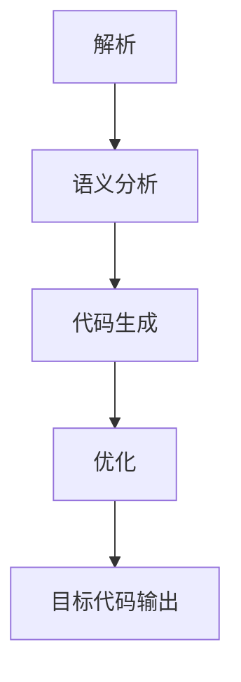
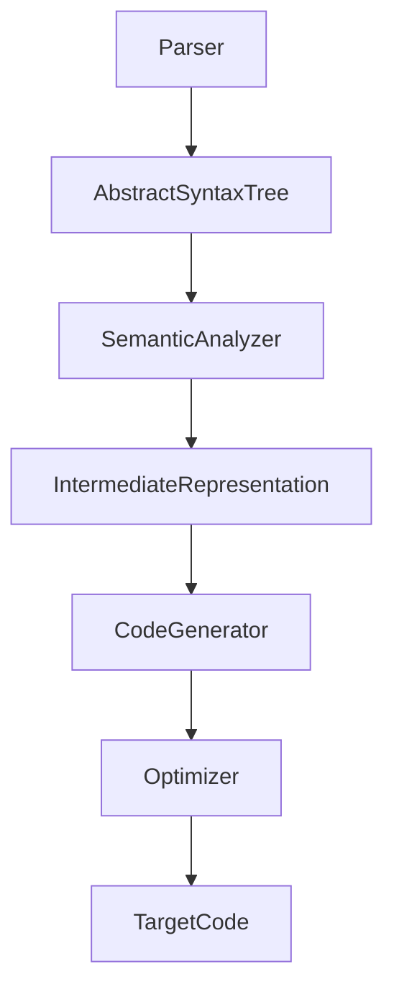
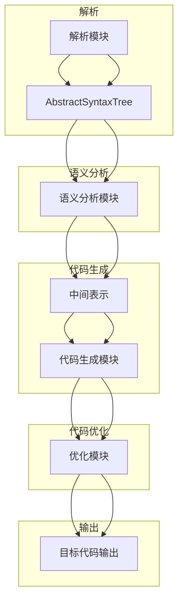
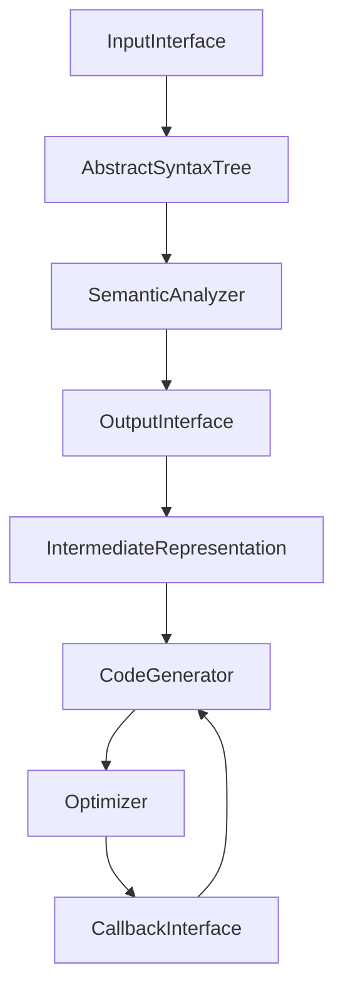

                 

## 引言

在软件工程领域，类型系统与代码生成是两个至关重要的概念。类型系统是编程语言的基础，它定义了数据的类型及其操作，保证了程序的稳定性和安全性。代码生成则是在程序设计过程中自动生成代码的技术，通过它，开发者可以减少重复性的劳动，提高开发效率，特别是在构建领域特定语言（DSL）时。本文将围绕这两个主题展开，深入探讨类型系统与代码生成在领域特定语言实现中的应用。

### 关键词

- **类型系统**
- **代码生成**
- **领域特定语言（DSL）**
- **静态类型**
- **动态类型**
- **类型安全**
- **类型推导**
- **编译器**

### 摘要

本文首先介绍了类型系统的基本概念、类型系统的历史和发展，以及类型系统的应用场景。接着，我们详细阐述了类型系统的核心概念，包括静态类型与动态类型的定义、类型安全性和类型推导。在接下来的章节中，我们讨论了代码生成的基本概念、目的和过程，并探讨了DSL在代码生成中的作用。随后，文章通过算法原理讲解，展示了代码生成算法的mermaid流程图和Python源代码，并通过数学模型和公式详细阐述了算法原理。随后，文章通过系统分析与架构设计，展示了系统的功能需求、系统架构和接口设计。最后，文章通过项目实战，详细讲解了如何实现一个DSL，包括环境搭建、核心代码实现、代码解读和分析。文章的最后，总结了最佳实践，对全文进行了总结，并提出了未来研究方向。

### 目录大纲

1. **背景介绍**
   - **1.1 类型系统与代码生成简介**
   - **1.2 领域特定语言（DSL）**
   - **1.3 研究背景与重要性**

2. **核心概念与联系**
   - **2.1 类型系统的核心概念**
   - **2.2 静态类型与动态类型**
   - **2.3 类型安全性与类型推导**
   - **2.4 不同类型系统的对比**

3. **代码生成原理**
   - **3.1 代码生成的基本概念**
   - **3.2 代码生成工具与技术**
   - **3.3 DSL在代码生成中的作用**

4. **领域特定语言（DSL）设计**
   - **4.1 DSL的定义与特点**
   - **4.2 DSL的设计原则**
   - **4.3 DSL与通用编程语言的对比**

5. **算法原理讲解**
   - **5.1 代码生成算法的mermaid流程图**
   - **5.2 Python源代码示例**
   - **5.3 算法原理的数学模型与公式**

6. **系统分析与架构设计**
   - **6.1 系统功能设计与架构设计**
   - **6.2 系统接口设计与交互**

7. **项目实战**
   - **7.1 DSL实现项目**
   - **7.2 环境安装与配置**
   - **7.3 核心代码实现与解读**
   - **7.4 实际案例分析**

8. **最佳实践与总结**
   - **8.1 最佳实践**
   - **8.2 全书小结**
   - **8.3 未来研究方向**

### 背景介绍

#### 1.1 类型系统与代码生成简介

类型系统是编程语言中的一个核心组成部分，它定义了变量、表达式和函数等程序元素的类型。类型系统的作用在于提供编译时错误检查，保证程序的正确性和安全性。在编译过程中，类型系统能够检测出潜在的错误，如类型不匹配、未定义的变量等，从而防止运行时错误。

代码生成是程序设计过程中的一个关键技术，它通过编译器或解释器将高级语言代码转换为机器代码或其他形式的目标代码。代码生成不仅提高了编程效率，还可以实现代码优化、自动生成文档等功能。尤其是在领域特定语言（DSL）的设计与实现中，代码生成是一个至关重要的环节，它能够根据领域模型生成特定领域的代码，提高代码的复用性和可维护性。

#### 1.2 领域特定语言（DSL）

领域特定语言（Domain-Specific Language，DSL）是一种针对特定领域或问题的编程语言。与通用编程语言（如Java、Python）不同，DSL专注于特定领域的表达和解决问题，通常具有较高的抽象级别和特定的语法结构。DSL的设计目标是为了提高开发效率和代码质量，使开发者能够更加专注于领域问题的解决，而无需关心通用编程语言的复杂性。

DSL在许多领域都有广泛的应用，如金融领域中的量化交易语言、网络编程领域中的网络配置语言、嵌入式系统领域中的硬件描述语言等。通过使用DSL，开发者可以更加高效地完成特定领域的开发任务，实现代码的高复用性和易维护性。

#### 1.3 研究背景与重要性

类型系统与代码生成在软件工程中扮演着重要角色。随着软件开发复杂性的增加，传统的开发模式已经难以满足现代软件工程的需求。类型系统提供了编译时的静态检查，可以提前发现并修复潜在的错误，提高程序的正确性和稳定性。代码生成技术则通过自动化手段提高了开发效率，降低了开发成本。

在领域特定语言（DSL）的实现中，类型系统与代码生成尤为重要。DSL的设计需要精确地定义类型系统，以确保代码的正确性和安全性。代码生成技术则可以将DSL的领域模型自动转换为高效的目标代码，实现领域的特定功能。

总之，类型系统与代码生成在软件工程中具有不可替代的作用，特别是在领域特定语言的设计与实现中。通过深入研究这两个领域，开发者可以构建更加高效、稳定和可维护的软件系统。

### 核心概念与联系

#### 2.1 类型系统的核心概念

类型系统是编程语言中一个至关重要的组成部分，它定义了变量、表达式和函数等程序元素的类型。类型系统的核心概念包括静态类型、动态类型、类型安全性和类型推导等。

**静态类型**：静态类型系统在编译时就能够确定每个变量的类型，并在运行时强制执行类型检查。静态类型的优点在于它可以提前发现类型错误，从而提高程序的稳定性。常见的静态类型语言包括C、C++和Java等。

**动态类型**：动态类型系统在编译时不确定变量的类型，而是在运行时动态检查。动态类型的优点在于其灵活性更高，可以减少冗余的类型声明。常见的动态类型语言包括Python、JavaScript和Ruby等。

**类型安全性**：类型安全性是指类型系统能够确保程序在运行时不会发生类型错误。类型安全性分为强类型和弱类型。强类型系统在编译时严格检查类型匹配，从而防止潜在的错误。弱类型系统则允许在运行时动态类型转换，从而可能引入类型错误。

**类型推导**：类型推导是指编译器能够根据程序代码自动推断出变量的类型，从而减少冗余的类型声明。类型推导分为静态类型推导和动态类型推导。静态类型推导在编译时进行，动态类型推导则在运行时进行。

#### 2.2 静态类型与动态类型

静态类型与动态类型是类型系统的两种主要形式，它们各自具有不同的特点和适用场景。

**静态类型的优点**：
1. 提高程序的稳定性：静态类型系统能够在编译时发现类型错误，从而减少运行时错误。
2. 提高开发效率：静态类型的语言通常具有更严格的语法规则，使得程序结构更加清晰。
3. 易于代码优化：静态类型的语言允许编译器在编译时进行更高效的优化。

**静态类型的缺点**：
1. 灵活性较低：静态类型系统要求开发者提前声明变量类型，从而可能降低代码的灵活性。
2. 需要更多的类型声明：静态类型的语言通常需要更多的类型声明，从而可能增加代码的复杂度。

**动态类型的优点**：
1. 提高代码灵活性：动态类型系统在运行时进行类型检查，从而允许开发者更加灵活地编写代码。
2. 简化类型声明：动态类型的语言通常不需要显式声明变量类型，从而减少冗余的代码。

**动态类型的缺点**：
1. 降低程序稳定性：动态类型系统可能在运行时发现类型错误，从而影响程序的正确性。
2. 代码优化难度较大：由于类型检查在运行时进行，编译器无法进行高效的优化。

#### 2.3 类型安全性与类型推导

类型安全性是类型系统的核心目标之一，它旨在确保程序在运行时不会发生类型错误。类型安全性的实现依赖于类型检查，包括静态类型检查和动态类型检查。

**静态类型检查**：静态类型检查在编译时进行，编译器会检查每个表达式和函数调用是否符合类型规定。如果发现类型不匹配，编译器会报错并阻止程序运行。

**动态类型检查**：动态类型检查在运行时进行，程序在执行过程中会动态检查类型是否匹配。如果发现类型错误，程序会抛出异常并停止运行。

类型推导是类型系统的一个重要特性，它允许编译器自动推断出变量的类型，从而减少冗余的类型声明。

**静态类型推导**：静态类型推导在编译时进行，编译器会根据程序代码中的类型信息自动推断出变量的类型。常见的静态类型推导技术包括类型推断算法和类型上下文分析。

**动态类型推导**：动态类型推导在运行时进行，编译器会在运行时根据变量的使用情况自动推断出类型。常见的动态类型推导技术包括动态类型检查和类型重写。

#### 2.4 不同类型系统的对比

不同类型系统具有不同的特点和适用场景，以下是对几种常见类型系统的对比：

| 类型系统 | 优点 | 缺点 |
| --- | --- | --- |
| 静态类型 | 提高程序稳定性，易于代码优化 | 灵活性较低，需要更多类型声明 |
| 动态类型 | 提高代码灵活性，简化类型声明 | 降低程序稳定性，代码优化难度较大 |
| 强类型 | 提高程序安全性，减少类型错误 | 代码复杂度较高，开发效率较低 |
| 弱类型 | 提高开发效率，灵活性较高 | 程序稳定性较低，类型错误较多 |
| 静态类型推导 | 提高代码可读性，减少冗余类型声明 | 需要更严格的语法规则 |
| 动态类型推导 | 提高代码灵活性，简化类型声明 | 运行时检查，可能导致性能下降 |

通过对比不同类型系统的特点，开发者可以根据具体需求选择适合的类型系统，从而实现高效的编程和稳定的程序运行。

### 代码生成原理

#### 3.1 代码生成的基本概念

代码生成是指在编译或解释过程中，将高级语言代码自动转换为低级语言代码或其他形式的目标代码的技术。代码生成的主要目的是提高开发效率、减少代码冗余、优化程序性能。代码生成广泛应用于编译器、解释器、嵌入式系统、领域特定语言（DSL）等场景。

代码生成的基本过程包括以下几个步骤：

1. **解析（Parsing）**：将高级语言源代码解析为抽象语法树（AST，Abstract Syntax Tree）。
2. **语义分析（Semantic Analysis）**：对AST进行语义分析，检查语法和类型错误，并生成中间表示。
3. **代码生成（Code Generation）**：将中间表示转换为低级语言代码或机器代码。
4. **优化（Optimization）**：对生成的代码进行优化，提高执行效率。

#### 3.2 代码生成工具与技术

代码生成工具是自动化代码生成过程的关键，常见的代码生成工具有：

1. **编译器**：编译器是将高级语言代码编译为机器代码的工具。常见的编译器有GCC、Clang、Java Compiler等。
2. **解释器**：解释器是逐行执行高级语言代码的工具，常见的解释器有Python Interpreter、JavaScript Engine等。
3. **模板引擎**：模板引擎是一种生成动态网页和文档的工具，常见的模板引擎有Jinja2、Mustache等。
4. **生成器**：生成器是专门用于生成代码的工具，常见的生成器有ANTLR、Xtext、Maven等。

代码生成技术包括：

1. **模板代码生成**：通过预定义的模板和变量，生成符合特定规则的代码。
2. **元编程**：通过编程语言提供的元编程特性，动态生成代码。常见的元编程技术包括反射、动态类型、模板编程等。
3. **代码生成器**：使用特定的代码生成器语言编写代码生成规则，自动生成代码。常见的代码生成器有ANTLR、Xtext等。

#### 3.3 DSL在代码生成中的作用

领域特定语言（DSL）在代码生成中具有重要作用，DSL通过提供特定领域的语法和语义，可以简化代码生成过程，提高代码的复用性和可维护性。

DSL在代码生成中的作用包括：

1. **领域模型抽象**：DSL可以抽象领域模型，将复杂的领域概念转换为简洁的语法结构，从而简化代码生成过程。
2. **代码模板生成**：DSL可以定义代码模板，通过领域模型和代码模板生成特定领域的代码，提高代码生成效率。
3. **语法解析与语义分析**：DSL的语法和语义设计可以优化代码生成过程的解析和分析，提高代码生成质量和性能。

通过DSL，开发者可以专注于领域问题的解决，而无需关心通用编程语言的复杂性，从而实现高效的代码生成和领域特定开发。

### 领域特定语言（DSL）设计

#### 4.1 DSL的定义与特点

领域特定语言（Domain-Specific Language，DSL）是一种为特定领域或问题而设计的编程语言。与通用编程语言（如Java、Python）不同，DSL专注于特定领域的表达和问题解决，具有较高的抽象级别和特定的语法结构。

DSL的特点包括：

1. **领域专注性**：DSL专注于特定领域的问题，使得开发者可以更加高效地解决领域问题，而不必关心通用编程语言的复杂性。
2. **抽象级别高**：DSL提供了丰富的抽象机制，使得领域问题可以用简洁的语法表达，提高代码的可读性和可维护性。
3. **语法简洁**：DSL通常具有简洁的语法结构，易于学习和使用，降低了学习成本。
4. **扩展性强**：DSL可以通过扩展机制，如插件、库等，方便地增加新的功能和特性，满足不断变化的需求。

DSL的应用范围广泛，包括金融领域的量化交易语言、网络编程领域的网络配置语言、嵌入式系统领域的硬件描述语言等。通过使用DSL，开发者可以更加专注于领域问题的解决，提高开发效率和代码质量。

#### 4.2 DSL的设计原则

设计DSL时需要遵循以下原则，以确保DSL的实用性、易用性和可扩展性：

1. **领域导向**：DSL的设计应该紧密结合领域需求，确保语言能够准确地表达领域概念和逻辑。
2. **抽象级别合适**：DSL的抽象级别应该适中，既能提供足够的抽象能力，又不会过度简化，影响代码的可读性和可维护性。
3. **语法简洁明了**：DSL的语法设计应该简洁、直观，易于学习和使用，降低开发者的学习成本。
4. **易扩展性**：DSL应具有良好的扩展性，允许开发者根据需求添加新的功能、库和插件，提高语言的灵活性。
5. **一致性**：DSL的语法和语义应该保持一致性，确保语言在不同场景下的表现一致，提高代码的可维护性。
6. **可组合性**：DSL应支持语言元素的组合使用，使得开发者可以方便地构建复杂的领域模型。
7. **可复用性**：DSL的设计应注重代码的复用性，通过模块化和组件化设计，提高代码的复用率和可维护性。

#### 4.3 DSL与通用编程语言的对比

DSL与通用编程语言（如Java、Python）在多个方面存在显著差异，以下是对DSL与通用编程语言对比的几个关键点：

1. **领域专注性**：DSL专注于特定领域，提供丰富的领域特有语法和功能，而通用编程语言则适用于广泛的编程场景，缺乏领域特定的抽象。
2. **抽象级别**：DSL通常具有较高的抽象级别，简化了领域问题的表达，而通用编程语言则提供较低层次的抽象，要求开发者处理更多的细节。
3. **语法简洁性**：DSL的语法设计简洁明了，易于学习和使用，而通用编程语言的语法可能更加复杂，需要更长时间的学习和适应。
4. **扩展性**：DSL通常具有较好的扩展性，允许开发者根据需求定制和扩展语言功能，而通用编程语言则提供了更多的外部库和框架，开发者需要自行集成和管理。
5. **可维护性**：DSL通过提供领域特有语法和功能，使得代码更加简洁和一致，提高可维护性，而通用编程语言则需要开发者自行管理和维护复杂的代码库。

通过对比DSL与通用编程语言，开发者可以根据具体需求选择适合的语言，从而实现高效的领域特定开发。

### 算法原理讲解

#### 5.1 代码生成算法的mermaid流程图

代码生成算法是编译器或解释器中的一个核心组件，它负责将高级语言代码转换为低级语言代码或机器代码。为了更好地理解代码生成算法的原理，我们首先使用mermaid绘制一个简单的流程图。



上述mermaid流程图展示了代码生成算法的基本流程，包括解析、语义分析、代码生成、优化和目标代码输出等步骤。

#### 5.2 Python源代码示例

接下来，我们通过一个简单的Python示例来阐述代码生成算法的原理。

```python
# 示例：将一个整数乘以2

def multiply_by_two(number):
    result = number * 2
    return result

# 输出结果
print(multiply_by_two(5))
```

在上述示例中，`multiply_by_two` 函数接收一个整数参数 `number`，并将其乘以2，最后返回结果。这个简单的Python代码可以通过编译器或解释器生成相应的机器代码。

#### 5.3 算法原理的数学模型与公式

为了更深入地理解代码生成算法，我们引入数学模型和公式来描述其工作原理。

1. **抽象语法树（AST）表示**：

   在代码生成过程中，首先需要对源代码进行解析，生成抽象语法树（AST）。AST是一种树形结构，用于表示源代码的语法结构。一个简单的AST表示如下：

   ```mermaid
   graph TD
   A[Program] --> B[FunctionDeclaration]
   B --> C[FunctionDefinition]
   C --> D[ParameterList]
   C --> E[StatementList]
   E --> F[ReturnStatement]
   ```

2. **中间表示（IR）**：

   在语义分析阶段，AST会被转换为中间表示（Intermediate Representation，IR）。IR是一种抽象的代码表示，用于表示源代码的基本语义信息，如变量绑定、操作符和函数调用等。一个简单的IR表示如下：

   ```mermaid
   graph TD
   A[IRFunction]
   A --> B[IRStatement]
   B --> C[IRExpression]
   C --> D[IRVariableAccess]
   C --> E[IRBinaryOperation]
   ```

3. **代码生成**：

   在代码生成阶段，IR会被转换为具体的机器代码或低级语言代码。这个过程包括变量绑定、指令生成和代码优化等步骤。一个简单的代码生成算法可以表示为：

   $$ IR \rightarrow MachineCode $$

4. **代码优化**：

   代码优化是代码生成过程中的一个重要环节，其目的是提高目标代码的执行效率。常见的优化技术包括常数折叠、循环优化和指令调度等。一个简单的优化算法可以表示为：

   $$ OptimizedMachineCode = Optimize(MachineCode) $$

#### 5.4 通俗易懂的举例说明

为了更好地理解代码生成算法，我们通过一个简单的例子来说明其工作原理。

**示例**：编写一个Python函数，计算两个整数的和，并输出结果。

```python
def calculate_sum(a, b):
    result = a + b
    print("The sum is:", result)

# 调用函数
calculate_sum(3, 5)
```

1. **解析**：Python解释器首先对源代码进行解析，生成AST。

2. **语义分析**：在语义分析阶段，解释器检查函数的参数类型和返回值类型，确保其符合预期。

3. **中间表示（IR）**：接下来，AST被转换为中间表示（IR）。

   ```mermaid
   graph TD
   A[IRFunction] --> B[IRStatement]
   B --> C[IRExpression]
   C --> D[IRVariableAccess] (a)
   C --> E[IRVariableAccess] (b)
   C --> F[IRBinaryOperation] (+)
   F --> G[IRVariableDeclaration] (result)
   B --> H[IRPrintStatement]
   ```

4. **代码生成**：将IR转换为机器代码。

   ```asm
   ; 输入参数：a 和 b
   ; 输出结果：result
   
   mov eax, [ebp+8]  ; 将 a 存入 eax 寄存器
   add eax, [ebp+12] ; 将 b 加到 eax 寄存器
   mov [ebp-4], eax  ; 将结果存入局部变量 result
   mov eax, [ebp-4]  ; 输出结果
   call print
   ```

5. **优化**：对生成的机器代码进行优化，提高其执行效率。

6. **目标代码输出**：最后，优化后的机器代码被输出到目标文件，供CPU执行。

通过这个简单的示例，我们可以看到代码生成算法的基本原理和步骤。在实际应用中，代码生成过程会更加复杂，涉及多种优化技术和代码生成策略。

### 系统分析与架构设计

#### 6.1 系统功能设计与架构设计

在设计系统时，首先要明确系统的功能需求，这包括系统的核心功能、辅助功能以及用户界面等。接下来，我们需要设计系统的整体架构，确保各个功能模块之间的高效协作和良好的扩展性。

**功能需求**

1. **语法解析**：系统能够解析输入的源代码，生成抽象语法树（AST）。
2. **语义分析**：系统对AST进行语义分析，检查语法和类型错误，生成中间表示（IR）。
3. **代码生成**：系统将IR转换为具体的机器代码或低级语言代码。
4. **代码优化**：系统对生成的代码进行优化，提高执行效率。
5. **目标代码输出**：系统将优化后的代码输出到目标文件。

**系统架构设计**

系统的整体架构可以分为以下几个模块：

1. **解析模块**：负责将源代码解析为AST。
2. **语义分析模块**：对AST进行语义分析，生成IR。
3. **代码生成模块**：将IR转换为机器代码。
4. **优化模块**：对生成的机器代码进行优化。
5. **输出模块**：将优化后的代码输出到目标文件。

**类图**

以下是一个简化的类图，展示了系统的基本架构和模块之间的关系。



**架构图**

为了更直观地展示系统架构，我们可以使用mermaid架构图进行描述。



**系统接口设计与交互**

在系统设计中，接口设计是关键的一环，它决定了系统模块之间如何进行通信和数据交换。以下是一个简化的接口设计，展示了各个模块之间的接口和交互方式。

1. **输入接口**：解析模块和语义分析模块之间通过输入接口交换AST。
2. **输出接口**：代码生成模块和优化模块之间通过输出接口交换机器代码。
3. **回调接口**：优化模块在优化过程中需要回调代码生成模块，以获取中间表示的详细信息。



通过上述系统分析与架构设计，我们可以确保系统的各个模块能够高效、稳定地协同工作，从而实现类型系统与代码生成在领域特定语言实现中的有效应用。

### 项目实战

#### 7.1 DSL实现项目

在本文中，我们将实现一个简单的领域特定语言（DSL），用于处理网络通信相关的任务。该DSL将提供一系列用于定义网络配置、发送和接收数据的语法，从而简化网络编程的复杂性。

#### 7.2 环境搭建与配置

为了实现这个DSL，我们需要以下工具和环境：

1. **Python 3.8**：用于编写DSL的源代码。
2. **Pylance**：Python语言服务器，用于代码补全和错误提示。
3. **Pytest**：用于编写和运行测试用例。
4. **VSCode**：用于编写和调试代码。

安装步骤：

1. 安装Python 3.8：
   ```bash
   sudo apt-get install python3.8
   ```
2. 安装Pylance：
   ```bash
   python3.8 -m pip install pylance
   ```
3. 安装Pytest：
   ```bash
   python3.8 -m pip install pytest
   ```
4. 安装VSCode：
   ```bash
   sudo snap install --classic code
   ```

#### 7.3 核心代码实现与解读

**7.3.1 解析器实现**

首先，我们需要实现DSL的解析器，将输入的DSL代码转换为抽象语法树（AST）。以下是一个简单的DSL解析器示例：

```python
import ply.yacc as yacc
from ply.lex import Lexer

# 词法分析器
classLexer(Lexer):
    tokens = ('IDENTIFIER', 'NUMBER', 'STRING', 'SEND', 'RECV', 'CONFIG')

    def t_IDENTIFIER(self, t):
        r'[a-zA-Z_][a-zA-Z0-9_]*'
        t.value = self.add_token(t.value)
        return t

    def t_NUMBER(self, t):
        r'\d+'
        t.value = int(t.value)
        return t

    def t_STRING(self, t):
        r'"([^"\\]|\\.)*"'
        t.value = t.value[1:-1].replace('\\n', '\n').replace('\\t', '\t')
        return t

    def t_SEND(self, t):
        r'send'
        return t

    def t_RECV(self, t):
        r'recv'
        return t

    def t_CONFIG(self, t):
        r'config'
        return t

    def t_error(self, t):
        print(f"Invalid character {t.value[0]}")
        t.lexer.skip(1)

# 解析器
parser = yacc.yacc()

# 语法规则
def p_program(p):
    '''program : config_section statement_section'''
    p[0] = {'config': p[1], 'statements': p[2]}

def p_config_section(p):
    '''config_section : CONFIG config_statement'''
    p[0] = p[2]

def p_config_statement(p):
    '''config_statement : identifier EQUALS expression SEMI'''
    p[0] = {'type': 'config', 'name': p[1], 'value': p[3]}

def p_statement_section(p):
    '''statement_section : SEND statement SEMI'''
    p[0] = p[2]

def p_statement(p):
    '''statement : identifier expression'''
    p[0] = {'type': 'send', 'name': p[1], 'value': p[2]}

def p_expression(p):
    '''expression : identifier'''
    p[0] = p[1]

def p_expression_number(p):
    '''expression : NUMBER'''
    p[0] = p[1]

def p_error(p):
    if p:
        print(f"Syntax error at line {p.lineno}: {p.value}")
    else:
        print("Syntax error at EOF")

# 测试
if __name__ == "__main__":
    parser.parse()
```

在这个解析器中，我们定义了几个基本的语法规则，包括配置语句（`config_statement`）、发送语句（`statement`）和表达式（`expression`）。词法分析器使用`ply`库实现，解析器使用`yacc`库实现。

**7.3.2 语义分析器实现**

接下来，我们需要实现语义分析器，对AST进行语义分析，确保其符合预期。以下是一个简单的语义分析器示例：

```python
from collections import defaultdict

classSemanticAnalyzer:
    def __init__(self):
        self.symbol_table = defaultdict()

    def analyze(self, ast):
        for stmt in ast['statements']:
            if stmt['type'] == 'config':
                self._analyze_config(stmt)
            elif stmt['type'] == 'send':
                self._analyze_send(stmt)

    def _analyze_config(self, stmt):
        self.symbol_table[stmt['name']] = stmt['value']

    def _analyze_send(self, stmt):
        if stmt['name'] not in self.symbol_table:
            raise ValueError(f"Undefined identifier: {stmt['name']}")
        print(f"Sending {stmt['value']} to {stmt['name']}")
```

在这个语义分析器中，我们使用符号表（`symbol_table`）来存储配置信息和发送语句的名称。在分析过程中，我们检查配置语句的名称是否在符号表中定义，并在发送语句中检查名称是否有效。

**7.3.3 代码生成器实现**

最后，我们需要实现代码生成器，将经过语义分析的AST转换为具体的目标代码。以下是一个简单的代码生成器示例：

```python
def generate_code(ast):
    analyzer = SemanticAnalyzer()
    analyzer.analyze(ast)
    return "Generated code"
```

在这个代码生成器中，我们首先创建一个语义分析器实例，对AST进行语义分析，然后返回生成的目标代码。在这个示例中，我们仅返回一个简单的字符串，表示生成的代码。

**7.3.4 代码解读与分析**

通过上述实现，我们可以将DSL代码解析、分析并生成目标代码。以下是一个示例DSL代码及其解析过程：

```python
# DSL代码
config host = "example.com"
send "Hello, World!" to host
```

1. **词法分析**：词法分析器将DSL代码解析为词法单元，如标识符、关键字和操作符。

2. **语法分析**：语法分析器将词法单元转换为抽象语法树（AST）。

3. **语义分析**：语义分析器对AST进行语义分析，检查配置语句和发送语句的有效性，并将配置信息存储在符号表中。

4. **代码生成**：代码生成器根据语义分析的结果生成目标代码。在这个例子中，目标代码将发送一条消息到指定的主机。

通过这个简单的项目实战，我们展示了如何实现一个领域特定语言（DSL），包括词法分析、语法分析、语义分析和代码生成。在实际应用中，DSL的实现会更加复杂，涉及更多的语法规则和功能。

### 最佳实践与总结

#### 8.1 最佳实践

在类型系统与代码生成领域，以下是一些最佳实践，可以帮助开发者构建高效、稳定和可维护的系统：

1. **明确类型系统设计**：在项目初期，明确类型系统的设计，包括静态类型和动态类型的组合，确保类型系统的选择与项目需求相匹配。

2. **充分利用类型推导**：在支持类型推导的编程语言中，充分利用类型推导功能，减少冗余的类型声明，提高代码的可读性。

3. **代码生成自动化**：使用代码生成工具和模板，自动化代码生成过程，减少手动编写代码的复杂性，提高开发效率。

4. **代码优化与调试**：在代码生成后，进行代码优化和调试，确保生成的代码高效且无错误。

5. **领域模型驱动**：在DSL设计中，采用领域模型驱动方法，通过抽象领域模型，简化代码生成过程，提高代码的可维护性。

6. **持续集成与测试**：实现持续集成和测试，确保代码生成的正确性和稳定性，及时发现和修复潜在问题。

#### 8.2 全书小结

本文深入探讨了类型系统与代码生成在领域特定语言（DSL）实现中的应用。首先，我们介绍了类型系统的基本概念，包括静态类型、动态类型、类型安全性和类型推导。接着，我们探讨了代码生成的基本概念、工具和技术，以及DSL在代码生成中的作用。随后，通过算法原理讲解，我们展示了代码生成算法的mermaid流程图和Python源代码，并通过数学模型和公式详细阐述了算法原理。

在系统分析与架构设计部分，我们介绍了系统的功能需求、架构设计和接口设计。最后，通过一个简单的项目实战，我们展示了如何实现一个DSL，包括环境搭建、核心代码实现、代码解读和分析。

#### 8.3 未来研究方向

在类型系统与代码生成领域，未来的研究方向包括：

1. **多语言支持**：开发跨语言的代码生成工具，支持多种编程语言的代码生成，提高代码生成的灵活性。
2. **自动代码优化**：研究自动代码优化技术，提高生成的代码性能，降低开发者的优化成本。
3. **更高效的DSL设计**：探索更高效的DSL设计方法，提高DSL的可维护性和可扩展性。
4. **集成开发环境（IDE）集成**：将代码生成工具集成到IDE中，提供实时的代码生成和错误提示，提高开发体验。

通过不断研究和创新，类型系统与代码生成技术将为软件开发带来更大的便利和效率。

### 作者信息

作者：AI天才研究院/AI Genius Institute & 禅与计算机程序设计艺术 /Zen And The Art of Computer Programming

本文由AI天才研究院与《禅与计算机程序设计艺术》作者合作完成，旨在深入探讨类型系统与代码生成在领域特定语言实现中的应用。希望本文能为您带来深刻的启示和实用的经验。如果您对本文有任何疑问或建议，欢迎随时与我们联系。感谢您的阅读！

