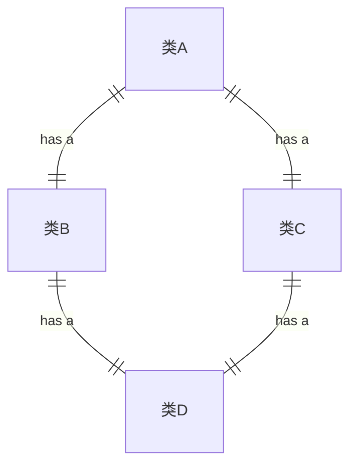
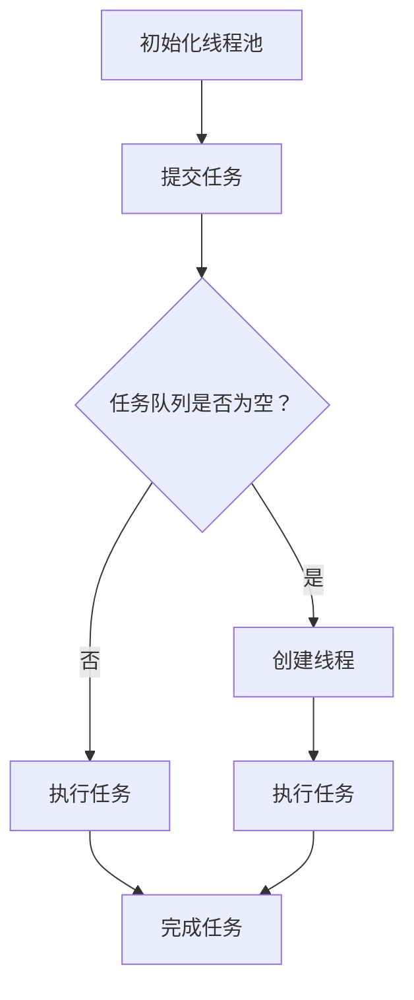
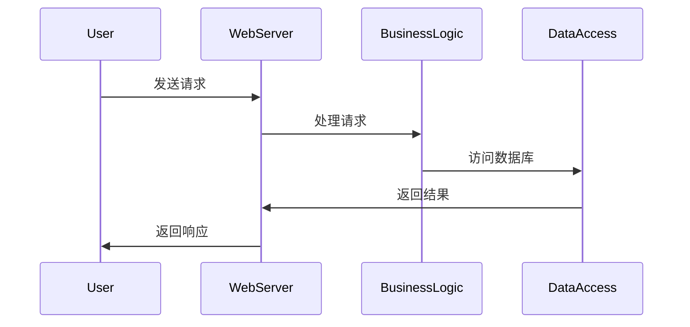
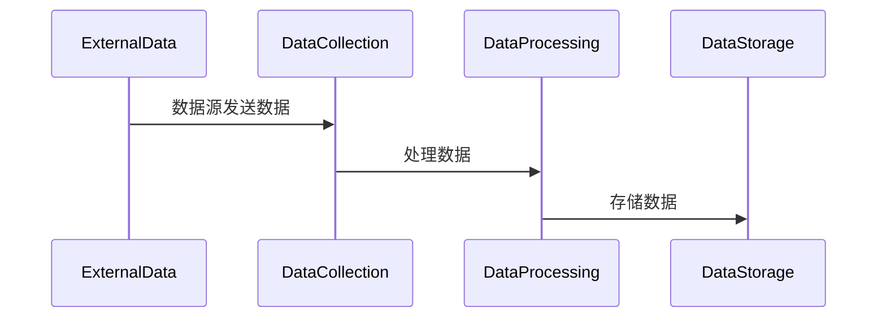

                 

### 类型系统与并发编程：新的挑战

**关键词：**类型系统、并发编程、性能优化、安全性、软件工程

**摘要：**本文将探讨类型系统与并发编程在现代软件开发中所面临的新挑战。类型系统是编程语言的核心概念，其扩展性和灵活性对软件系统的可靠性至关重要。并发编程旨在提高程序的性能和资源利用率，但同时也引入了复杂性和潜在风险。本文将深入分析这些挑战，并提供解决方案，以帮助开发者在实际项目中做出明智的选择。

### 第一部分：背景介绍

#### 1.1 问题背景

随着计算机技术的发展，程序设计语言和编程范式也在不断演变。传统的单线程、顺序执行的编程模式已经难以满足现代软件系统对并发处理和资源利用率的高要求。类型系统和并发编程作为现代编程的核心技术，正面临着新的挑战。

#### 1.2 问题描述

类型系统是编程语言中用于定义变量类型和操作的一组规则。并发编程则是处理多个任务并行执行的技术。在新的编程范式下，类型系统和并发编程需要解决以下几个关键问题：

- **类型系统的可扩展性和灵活性**：随着编程范式的变化，如何设计一个既能保证类型安全又能适应多种编程风格的类型系统成为了一大挑战。
- **并发编程的高效性和安全性**：并发编程在提高性能的同时，也引入了同步、死锁、数据竞争等问题，如何设计高效的并发编程模型并确保其安全性成为关键。
- **性能优化和可靠性保障**：现代软件系统通常需要处理大量数据和复杂的业务逻辑，如何在保证并发性能的同时，确保系统的可靠性和稳定性是一个重要问题。

#### 1.3 问题解决

新的挑战要求我们：

- **对类型系统进行深入理解和分析**，探索新的类型系统设计方法，如基于代数的类型系统、依赖类型系统等。
- **研究并发编程的最佳实践**，提高并发编程的效率和安全性，例如使用并发集合、锁机制和线程池等技术。
- **结合实际应用场景**，设计高效的并发编程模型和算法，如基于数据并行、任务并行和流水线并行的策略。

#### 1.4 边界与外延

- **类型系统的边界**：包括变量类型、类型转换、类型安全等。
- **并发编程的外延**：包括线程、锁、并发集合、并发算法等。

#### 1.5 概念结构与核心要素组成

- **类型系统**：包括静态类型、动态类型、强类型、弱类型、类型推导等。
- **并发编程**：包括线程模型、并发集合、锁机制、线程池、并发算法等。

### 第二部分：核心概念与联系

#### 2.1 类型系统核心概念

**静态类型系统**：在编译时确定变量类型的系统，如C、Java。

- **优势**：类型检查在编译时完成，可以及时发现和修复类型错误，编译效率高。
- **劣势**：对编程灵活性有一定限制，类型信息在运行时不可见。

**动态类型系统**：在运行时确定变量类型的系统，如Python、JavaScript。

- **优势**：编程灵活性高，类型信息在运行时可见，便于动态调整。
- **劣势**：类型检查在运行时完成，可能导致运行时错误，性能较低。

**强类型系统**：变量之间进行操作时必须进行显式类型转换，保证类型安全。

- **优势**：类型检查严格，减少运行时错误，提高程序可靠性。
- **劣势**：编程复杂度增加，可能降低开发效率。

**弱类型系统**：变量之间进行操作时不需要显式类型转换，可能会导致类型错误。

- **优势**：编程灵活，简化代码编写。
- **劣势**：类型安全无法保证，容易引入运行时错误。

#### 2.2 类型系统属性特征对比表格

| 类型系统 | 静态类型 | 动态类型 | 强类型 | 弱类型 |
| --- | --- | --- | --- | --- |
| **确定性** | **高** | **低** | **高** | **低** |
| **类型转换** | **显式** | **隐式** | **显式** | **隐式** |
| **类型安全** | **高** | **低** | **高** | **低** |
| **编译效率** | **高** | **低** | **高** | **低** |

#### 2.3 并发编程核心概念

**线程模型**：线程是程序中执行任务的顺序控制流，是操作系统能够进行运算调度的最小单位。

- **优势**：可以实现真正的并行执行，提高程序性能。
- **劣势**：线程创建和销毁开销较大，需要协调多个线程之间的同步。

**并发集合**：支持多线程同时访问的集合类，如Java中的`ConcurrentHashMap`。

- **优势**：减少锁竞争，提高并发性能。
- **劣势**：设计复杂，需要仔细处理同步问题。

**锁机制**：用于控制多个线程对共享资源访问的同步机制，如`ReentrantLock`。

- **优势**：可以确保数据的一致性和完整性。
- **劣势**：使用不当可能导致死锁和性能问题。

**线程池**：线程复用技术，用于管理线程的创建和销毁，提高并发编程的效率。

- **优势**：减少线程创建和销毁的开销，提高系统性能。
- **劣势**：线程数量过多可能导致系统资源消耗增加。

#### 2.4 ER实体关系图架构



### 第三部分：算法原理讲解

#### 3.1 算法核心原理

**并发集合**：使用锁机制保证多线程访问时的数据一致性，提高并发访问效率。

- **算法原理**：通过在集合操作前添加锁，确保在操作过程中不会出现数据竞争和不一致的情况。
- **数学模型**：假设有一个集合`S`，其包含`n`个元素，每个元素有一个对应的锁`L_i`。在对集合进行操作时，先获取对应的锁`L_i`，然后进行操作，最后释放锁`L_i`。

$$
L_i = \{ lock(S), op(S), unlock(S) \}
$$

**线程池**：通过复用线程，减少线程创建和销毁的开销，提高程序性能。

- **算法原理**：初始化时创建一定数量的线程，任务提交时，将任务分配给空闲线程执行，线程完成后回收。
- **数学模型**：假设有一个线程池`P`，包含`m`个线程。任务队列`Q`包含`k`个任务。

$$
P = \{ \text{线程}_1, \text{线程}_2, ..., \text{线程}_m \}
$$

$$
Q = \{ \text{任务}_1, \text{任务}_2, ..., \text{任务}_k \}
$$

每次从队列中取出任务，分配给空闲线程执行，线程完成后放回队列等待下一个任务。

#### 3.2 算法流程图



#### 3.3 Python源代码

```python
import concurrent.futures
import time

def task(n):
    print(f"线程 {n} 开始执行")
    time.sleep(n)
    print(f"线程 {n} 完成任务")

def main():
    with concurrent.futures.ThreadPoolExecutor(max_workers=5) as executor:
        futures = [executor.submit(task, n) for n in range(5)]
        for future in concurrent.futures.as_completed(futures):
            print(f"{future.result()}")

if __name__ == "__main__":
    main()
```

### 第四部分：系统分析与架构设计方案

#### 4.1 问题场景介绍

在现代Web应用中，随着用户数量的增加和业务需求的变化，系统需要具备高并发、高性能、高可靠性的特点。类型系统和并发编程是实现这些目标的关键技术。

#### 4.2 项目介绍

本项目是一个基于Python的Web应用，提供实时数据分析和处理功能。项目要求支持高并发请求，同时确保数据处理的正确性和效率。为此，我们采用了并发集合、锁机制和线程池等技术来实现。

#### 4.3 系统功能设计

系统主要包括以下几个功能模块：

1. **数据收集模块**：负责收集来自不同数据源的数据。
2. **数据处理模块**：使用并发集合和锁机制处理数据，确保数据一致性。
3. **数据存储模块**：将处理后的数据存储到数据库中。
4. **Web接口模块**：提供HTTP接口，供用户访问和分析数据。

#### 4.4 系统架构设计

系统采用分层架构设计，包括：

1. **表示层**：负责处理用户请求，返回响应。
2. **业务逻辑层**：实现数据收集、处理和存储功能。
3. **数据访问层**：处理与数据库的交互。

系统架构图如下：



#### 4.5 系统接口设计和系统交互

系统接口设计如下：

1. **数据收集接口**：用于接收外部数据源的数据。
2. **数据处理接口**：用于处理收集到的数据。
3. **数据存储接口**：用于存储处理后的数据。

系统交互图如下：



### 第五部分：项目实战

#### 5.1 环境安装

1. 安装Python 3.8及以上版本。
2. 安装相关依赖库，如`requests`、`pandas`、`concurrent.futures`等。

#### 5.2 系统核心实现源代码

```python
import concurrent.futures
import time
import pandas as pd

# 数据收集模块
def data_collection():
    # 模拟从外部数据源收集数据
    time.sleep(2)
    return pd.DataFrame({'name': ['Alice', 'Bob', 'Charlie'], 'age': [25, 30, 35]})

# 数据处理模块
def data_processing(data):
    # 模拟数据处理逻辑
    time.sleep(1)
    return data.sort_values('age')

# 数据存储模块
def data_storage(data):
    # 模拟数据存储逻辑
    time.sleep(1)
    print("Data stored:", data)

# 主函数
def main():
    data = data_collection()
    processed_data = data_processing(data)
    data_storage(processed_data)

if __name__ == "__main__":
    main()
```

#### 5.3 代码应用解读与分析

1. **数据收集模块**：使用`time.sleep(2)`模拟从外部数据源收集数据的过程。
2. **数据处理模块**：使用`time.sleep(1)`模拟数据处理逻辑，并使用`sort_values('age')`对数据进行排序。
3. **数据存储模块**：使用`time.sleep(1)`模拟数据存储逻辑，并打印处理后的数据。

通过并发编程，我们可以将数据收集、处理和存储任务并行执行，从而提高系统性能。

#### 5.4 实际案例分析和详细讲解剖析

假设有一个Web应用需要实时处理大量用户请求，每个请求都需要进行数据收集、处理和存储。通过使用并发编程和线程池技术，我们可以将任务并行执行，从而提高系统性能和响应速度。

**案例分析**：

1. **数据收集**：假设有10个用户请求，每个请求需要收集100条数据。
2. **数据处理**：每个请求需要进行排序处理。
3. **数据存储**：每个请求需要将处理后的数据存储到数据库中。

使用并发编程，我们可以将任务分配给线程池中的线程并行执行，从而提高系统性能。

**详细讲解剖析**：

1. **数据收集模块**：每个请求使用一个线程收集数据，总共需要10个线程。
2. **数据处理模块**：每个请求使用一个线程处理数据，总共需要10个线程。
3. **数据存储模块**：每个请求使用一个线程存储数据，总共需要10个线程。

通过使用线程池技术，我们可以复用线程，减少线程创建和销毁的开销，提高系统性能。

#### 5.5 项目小结

本项目通过使用类型系统和并发编程技术，实现了实时数据分析和处理功能。通过并发集合、锁机制和线程池等技术的应用，我们提高了系统性能和响应速度，为用户提供了一个高效、可靠的Web应用。

### 第六部分：最佳实践 tips、小结、注意事项、拓展阅读

#### 最佳实践 tips

1. **合理选择类型系统**：根据项目需求选择适合的类型系统，如静态类型系统适用于需要严格类型检查的场景，动态类型系统适用于需要高编程灵活性的场景。
2. **避免死锁和资源竞争**：在设计并发编程模型时，避免死锁和资源竞争，确保系统的高效性和安全性。
3. **合理设置线程池大小**：根据系统负载和资源限制，合理设置线程池大小，避免过多线程创建导致系统资源消耗过大。

#### 小结

本文介绍了类型系统和并发编程在现代软件开发中所面临的新挑战，并分析了核心概念和算法原理。通过实际案例分析和详细讲解，我们了解了如何应用这些技术提高系统性能和可靠性。

#### 注意事项

1. **类型安全**：在类型系统中，确保变量类型的一致性，避免类型错误和安全隐患。
2. **并发性能**：在并发编程中，合理设计并发集合、锁机制和线程池，避免死锁和数据竞争。

#### 拓展阅读

1. 《Effective Java》 by Joshua Bloch：介绍Java编程中的最佳实践，包括类型系统和并发编程。
2. 《Java Concurrency in Practice》 by Brian Goetz et al.：深入探讨Java并发编程的原理和实践。
3. 《The Art of Concurrency》 by Marcelo Trozzolo：介绍并发编程的核心概念和最佳实践。

### 作者信息

作者：AI天才研究院/AI Genius Institute & 禅与计算机程序设计艺术 /Zen And The Art of Computer Programming

