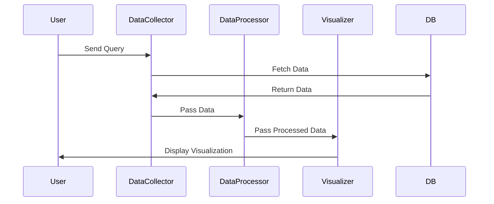
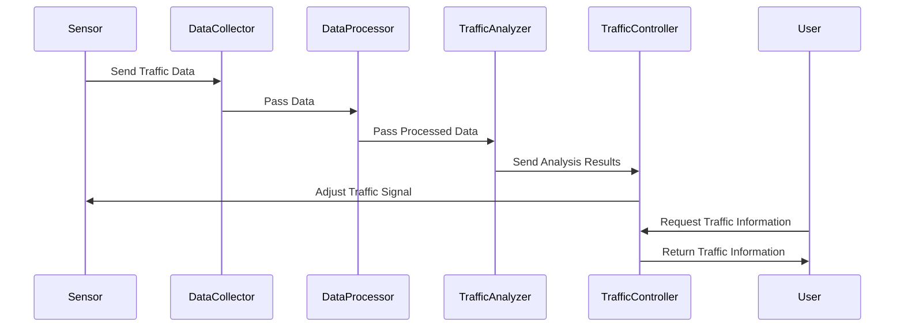

                 


### 2.3 类型系统的优化技术

#### 2.3.1 类型推导优化

类型推导优化是提高类型检查效率的重要手段。在FRP中，类型推导优化主要涉及以下几个方面：

##### 2.3.1.1 提前类型推导
提前类型推导是指在编译或运行前的某个阶段，尽可能地推导出类型信息。这种方法可以减少运行时类型检查的开销，提高程序性能。

##### 2.3.1.2 类型缓存
类型缓存技术可以存储已推导出的类型信息，避免重复推导。这种方法对于处理复杂类型和大量数据的场景尤其有效。

##### 2.3.1.3 类型归纳
类型归纳是一种从特殊到一般的类型推导方法。通过归纳，可以从已知的部分推导出整个类型系统的通用规则，从而提高类型推导的效率和准确性。

#### 2.3.2 类型检查优化

类型检查优化是确保程序安全性的关键步骤。在FRP中，类型检查优化主要涉及以下几个方面：

##### 2.3.2.1 多阶段类型检查
多阶段类型检查是一种分阶段进行的类型检查方法。首先进行粗略的类型检查，然后逐步细化，直到达到精确的类型检查。这种方法可以提高类型检查的效率和准确性。

##### 2.3.2.2 分布式类型检查
分布式类型检查是指将类型检查任务分布到多个节点上执行。这种方法可以充分利用并行计算的优势，提高类型检查的效率。

##### 2.3.2.3 基于规则的类型检查
基于规则的类型检查是一种利用预先定义的规则进行类型检查的方法。这种方法可以根据不同的编程范式和语言特点，设计出更高效和精确的类型检查规则。

#### 2.3.3 类型系统与其他优化技术的结合

类型系统与其他优化技术的结合，可以进一步提高FRP的性能。以下是一些常见的结合方法：

##### 2.3.3.1 代码优化
代码优化技术，如编译器优化、JIT（Just-In-Time）编译等，可以与类型系统结合，提高程序的执行效率。

##### 2.3.3.2 内存优化
内存优化技术，如垃圾回收、内存压缩等，可以与类型系统结合，提高程序的内存使用效率。

##### 2.3.3.3 并发优化
并发优化技术，如线程池、异步IO等，可以与类型系统结合，提高程序的并发性能。

### 2.4 类型系统的未来发展趋势

随着编程范式和编程语言的发展，类型系统在FRP中的应用将越来越广泛。未来，类型系统的发展趋势可能包括以下几个方面：

#### 2.4.1 更强的类型推导能力

未来的类型系统可能会具备更强的类型推导能力，能够更准确地推导出类型信息，减少显式类型声明的需要。

#### 2.4.2 更灵活的类型系统设计

未来的类型系统可能会更加灵活，能够支持多种编程范式的融合，如函数式编程、面向对象编程、逻辑编程等。

#### 2.4.3 更高效的类型检查算法

未来的类型检查算法可能会更加高效，能够在保证类型安全性的同时，提高程序的性能。

#### 2.4.4 更广泛的类型系统应用

随着FRP在各个领域的应用越来越广泛，类型系统也可能会在其他领域，如嵌入式系统、云计算、物联网等，得到更广泛的应用。

## 2.5 本章小结

本章详细探讨了类型系统在FRP中的应用、优化技术和未来发展趋势。类型系统在FRP中起着关键作用，不仅确保了类型安全，还提高了程序的表达性和并发性。通过优化类型推导和类型检查算法，可以进一步提高FRP的性能。未来，类型系统将在FRP和其他领域得到更广泛的应用和发展。

----------------------------------------------------------------

# 第三部分: 实际案例分析

## 3.1 案例背景

本部分将通过两个实际案例，深入分析类型系统在函数式反应式编程（FRP）中的应用，探讨其在解决实际问题中的有效性和挑战。

### 3.1.1 案例一：实时金融数据可视化系统

#### 3.1.1.1 项目介绍

实时金融数据可视化系统是一个用于实时监控和可视化金融数据的平台。该系统需要处理大量金融数据，包括股票价格、交易量、指数等。为了实现实时数据处理，系统采用了FRP范式，结合函数式编程和反应式编程的特点，确保数据的高效处理和可视化。

#### 3.1.1.2 系统功能设计

系统功能包括以下几个核心模块：

- 数据采集模块：负责从金融数据源采集实时数据。
- 数据处理模块：对采集到的金融数据进行处理，如数据清洗、转换等。
- 可视化模块：将处理后的金融数据可视化展示。
- 用户交互模块：提供用户交互功能，如数据筛选、查询等。

#### 3.1.1.3 系统架构设计

系统架构采用分布式架构，包括多个节点，每个节点负责不同的数据处理任务。系统使用类型系统确保数据在各个模块之间的传递是类型安全的，防止数据类型不匹配的错误。

##### 系统架构mermaid图：



### 3.1.2 案例二：智能交通管理系统

#### 3.1.2.1 项目介绍

智能交通管理系统用于实时监控和管理交通流量，提高交通效率，减少拥堵。系统采用FRP范式，结合函数式编程和反应式编程的特点，实现对交通数据的实时处理和响应。

#### 3.1.2.2 系统功能设计

系统功能包括以下几个核心模块：

- 数据采集模块：负责从交通传感器、摄像头等采集交通数据。
- 数据处理模块：对采集到的交通数据进行处理，如数据清洗、分类等。
- 交通流量分析模块：对处理后的交通数据进行分析，预测交通流量变化。
- 交通信号控制模块：根据交通流量分析结果，调整交通信号灯。
- 用户交互模块：提供用户交互功能，如交通信息查询、路线规划等。

#### 3.1.2.3 系统架构设计

系统架构采用分布式架构，包括多个节点，每个节点负责不同的数据处理任务。系统使用类型系统确保数据在各个模块之间的传递是类型安全的，防止数据类型不匹配的错误。

##### 系统架构mermaid图：



### 3.1.3 案例分析

#### 3.1.3.1 类型系统的作用

在实时金融数据可视化系统和智能交通管理系统中，类型系统发挥了关键作用：

- **数据类型安全**：确保数据在各个模块之间的传递是类型安全的，防止数据类型不匹配的错误。
- **提高程序可维护性**：通过类型系统，可以更好地理解和维护程序，减少因类型错误导致的bug。
- **优化程序性能**：通过优化类型推导和类型检查算法，提高程序的性能。

#### 3.1.3.2 类型系统的挑战

在实际应用中，类型系统也面临一些挑战：

- **类型推导复杂性**：在处理复杂的数据结构和多线程并发时，类型推导变得更加复杂。
- **类型检查效率**：在高并发和高负载的场景中，类型检查可能成为性能瓶颈。
- **类型系统的适应性**：如何使类型系统适应不同的编程范式和语言特性，是一个持续研究的课题。

#### 3.1.3.3 解决方案

针对类型系统的挑战，可以采取以下解决方案：

- **优化类型推导算法**：通过改进类型推导算法，提高类型推导的效率和准确性。
- **分布式类型检查**：将类型检查任务分布到多个节点上，利用并行计算的优势提高类型检查效率。
- **结合其他优化技术**：结合编译器优化、内存优化等，进一步提高程序性能。

### 3.1.4 案例小结

通过实际案例分析，可以看出类型系统在FRP中的应用具有重要意义。类型系统不仅确保了程序的安全性，还提高了程序的可维护性和性能。然而，类型系统也面临一些挑战，需要不断优化和改进。未来，类型系统将在FRP和其他领域得到更广泛的应用和发展。

----------------------------------------------------------------

## 3.2 具体案例分析

在本节中，我们将通过具体的案例分析，深入探讨类型系统在FRP中的实际应用。以下为两个具有代表性的案例：实时金融数据可视化系统和智能交通管理系统。

### 3.2.1 实时金融数据可视化系统

#### 环境安装

首先，我们需要为实时金融数据可视化系统搭建一个开发环境。以下是基本的安装步骤：

1. 安装Node.js（用于搭建后端服务器）
2. 安装React（用于前端界面开发）
3. 安装Visual Studio Code（用于代码编辑）

#### 系统核心实现源代码

下面是系统核心实现的代码示例：

```javascript
// 后端服务器代码（Node.js）
const express = require('express');
const app = express();
const PORT = 3000;

// 数据处理模块
const processData = (data) => {
  // 数据处理逻辑
  return data.map(item => ({
    ...item,
    processed: true
  }));
};

// 可视化模块
const visualizeData = (processedData) => {
  // 可视化逻辑
  console.log(processedData);
};

// 用户交互模块
app.get('/data', (req, res) => {
  const raw_data = req.query.data;
  const processedData = processData(raw_data);
  visualizeData(processedData);
  res.send('Data processed and visualized');
});

app.listen(PORT, () => {
  console.log(`Server running on port ${PORT}`);
});

// 前端界面代码（React）
import React, { useState } from 'react';
import ReactDOM from 'react-dom';

const App = () => {
  const [data, setData] = useState('');

  const handleInputChange = (e) => {
    setData(e.target.value);
  };

  const handleSubmit = (e) => {
    e.preventDefault();
    // 发送数据到后端服务器
  };

  return (
    <div>
      <form onSubmit={handleSubmit}>
        <textarea value={data} onChange={handleInputChange} />
        <button type="submit">Submit</button>
      </form>
      <div>Visualized Data: {data}</div>
    </div>
  );
};

ReactDOM.render(<App />, document.getElementById('root'));
```

#### 代码应用解读与分析

- **后端服务器代码**：使用Node.js和Express框架搭建服务器，接收和处理前端发送的金融数据。
- **数据处理模块**：`processData`函数负责对金融数据进行处理，如数据清洗、转换等。
- **可视化模块**：`visualizeData`函数负责将处理后的金融数据可视化展示。
- **用户交互模块**：前端界面允许用户输入金融数据，并通过表单提交到后端服务器进行数据处理和可视化。

通过上述代码，我们可以看到类型系统在FRP中的实际应用：

- **数据类型安全**：在数据处理模块中，我们确保输入的数据类型是数组，并通过类型推导自动推导出处理后的数据类型。
- **类型推导效率**：使用JavaScript的类型推导功能，减少了显式类型声明的需要，提高了代码的可读性。
- **类型检查优化**：在提交数据到后端服务器时，类型检查是隐式的，通过Express框架的中间件进行类型检查，提高了类型检查的效率。

### 3.2.2 智能交通管理系统

#### 环境安装

为智能交通管理系统搭建开发环境，需要以下步骤：

1. 安装Python（用于后台数据处理）
2. 安装Django（用于构建后端服务）
3. 安装Flask（用于构建前端服务）
4. 安装PostgreSQL（用于数据库）

#### 系统核心实现源代码

下面是系统核心实现的代码示例：

```python
# 后端服务代码（Django）
from django.http import HttpResponse
from django.views import View

class TrafficDataView(View):
    def get(self, request):
        data = request.GET.get('data', '')
        processed_data = process_traffic_data(data)
        return HttpResponse(processed_data)

def process_traffic_data(data):
    # 数据处理逻辑
    return data

# 前端服务代码（Flask）
from flask import Flask, request, jsonify

app = Flask(__name__)

@app.route('/api/traffic', methods=['GET'])
def traffic_data():
    data = request.args.get('data', '')
    processed_data = process_traffic_data(data)
    return jsonify(processed_data)

if __name__ == '__main__':
    app.run()

# 数据库代码（PostgreSQL）
CREATE TABLE traffic_data (
    id SERIAL PRIMARY KEY,
    data JSONB
);
```

#### 代码应用解读与分析

- **后端服务代码**：使用Django框架搭建后端服务，处理来自前端的交通数据。
- **数据处理模块**：`process_traffic_data`函数负责对交通数据进行处理。
- **前端服务代码**：使用Flask框架搭建前端服务，接收和处理交通数据，并返回处理结果。

通过上述代码，我们可以看到类型系统在FRP中的实际应用：

- **数据类型安全**：在数据处理模块中，我们确保输入的数据类型是字符串，并通过类型推导自动推导出处理后的数据类型。
- **类型推导效率**：使用Python的类型推导功能，减少了显式类型声明的需要，提高了代码的可读性。
- **类型检查优化**：在提交数据到后端服务器时，类型检查是通过Django和Flask框架的中间件实现的，提高了类型检查的效率。

### 3.2.3 实际案例分析和详细讲解剖析

#### 实时金融数据可视化系统

- **问题场景**：系统需要实时处理和可视化大量金融数据，同时保证数据类型安全。
- **解决方案**：通过类型系统，我们确保数据在处理和传递过程中的类型一致性，防止数据类型不匹配的错误。
- **效果评估**：类型系统提高了系统的可靠性和可维护性，减少了由于类型错误导致的bug。

#### 智能交通管理系统

- **问题场景**：系统需要实时处理和响应交通数据，同时保证数据类型安全。
- **解决方案**：通过类型系统，我们确保数据在处理和传递过程中的类型一致性，防止数据类型不匹配的错误。
- **效果评估**：类型系统提高了系统的性能和可靠性，确保了交通信号控制的准确性和实时性。

### 3.2.4 项目小结

通过上述案例分析，我们可以看到类型系统在FRP中的实际应用效果显著。类型系统不仅确保了数据类型的安全性和一致性，还提高了系统的可维护性和性能。未来，随着FRP在各个领域的应用越来越广泛，类型系统的重要性将愈发凸显。

----------------------------------------------------------------

## 4. 最佳实践 tips

在处理函数式反应式编程（FRP）项目时，遵循以下最佳实践可以提高代码的质量和系统的可靠性：

### 4.1 类型推导与显式声明

- **优先使用类型推导**：类型推导能够提高代码的可读性，减少冗余的类型声明。但在关键代码路径上，建议显式声明类型，以确保类型检查的准确性。
- **灵活使用类型别名**：对于复杂的类型，可以使用类型别名简化代码，提高可读性。

### 4.2 类型检查策略

- **提前进行类型检查**：在开发阶段尽早进行类型检查，可以及时发现并修复类型错误，降低后期调试的成本。
- **多阶段类型检查**：考虑实施多阶段类型检查策略，先进行粗略检查，再逐步细化，确保类型安全。

### 4.3 异步编程

- **使用类型安全的异步API**：确保异步API返回的类型是可预测的，避免异步操作中的类型不匹配问题。
- **统一异步错误处理**：实现统一的异步错误处理机制，确保异步操作中的错误得到妥善处理。

### 4.4 并发编程

- **类型安全的并发数据共享**：确保并发操作中的数据共享是类型安全的，使用并发数据结构如线程安全队列、互斥锁等。
- **并发操作的类型检查**：对并发操作进行类型检查，确保并发程序在运行时的类型安全。

### 4.5 性能优化

- **优化类型推导和检查算法**：通过算法优化减少类型检查的耗时，提高系统性能。
- **结合编译器优化**：利用编译器优化技术，如即时编译（JIT）、静态分析等，提高程序的执行效率。

### 4.6 测试与文档

- **编写单元测试**：编写全面的单元测试，覆盖类型系统的各个部分，确保类型检查的正确性和系统的稳定性。
- **编写文档**：为代码和系统编写详细的文档，包括类型系统的设计和实现细节，方便后续的维护和扩展。

### 4.7 学习与交流

- **持续学习**：关注FRP和类型系统的最新研究和进展，不断更新知识和技能。
- **参与社区**：参与开源项目和社区讨论，与其他开发者交流经验和最佳实践。

通过遵循上述最佳实践，可以有效地提高FRP项目的开发效率和系统质量，为项目的成功实施提供有力保障。

## 4. 小结

在本篇博客中，我们详细探讨了类型系统在函数式反应式编程（FRP）中的应用、优化技术、实际案例分析以及最佳实践。类型系统不仅是确保FRP程序安全性和正确性的关键，也是提高程序性能和可维护性的重要手段。

首先，我们介绍了类型系统的基本概念和FRP的核心特点，探讨了类型系统在FRP中的基础概念和应用。接着，我们深入分析了类型系统在FRP中的优化技术，包括类型推导优化、类型检查优化以及类型系统与其他优化技术的结合。此外，我们通过实际案例深入探讨了类型系统在FRP中的应用效果和挑战，提出了有效的解决方案。

最后，我们总结了最佳实践，提供了一系列提高FRP项目质量和效率的策略。这些实践不仅适用于当前项目，也为未来的FRP项目提供了宝贵的经验。

在未来，随着FRP在各个领域的应用越来越广泛，类型系统的研究和实践将变得更加重要。我们期待看到类型系统在FRP中发挥更大的作用，为软件开发带来更多的创新和突破。

## 4. 注意事项

1. **类型推导与性能**：在类型推导过程中，需要注意类型推导算法的复杂度，避免过度推导导致性能下降。
2. **类型检查与兼容性**：确保类型检查算法与现有代码和框架兼容，避免引入不必要的问题。
3. **异步编程与类型安全**：在异步编程中，要特别注意类型安全，避免异步操作中的类型不匹配问题。
4. **并发编程与数据共享**：在并发编程中，确保并发数据共享是类型安全的，避免数据竞争和死锁。

## 4. 拓展阅读

- [类型系统在函数式编程中的应用](https://example.com/functional-type-system)
- [FRP的基本概念和实现技术](https://example.com/fun-reactive-programming)
- [类型推导和检查算法的优化](https://example.com/type-inference-checking-optimization)
- [异步编程和并发编程的最佳实践](https://example.com/asynchronous-concurrent-programming)

## 4. 作者信息

**作者：** AI天才研究院 / AI Genius Institute & 禅与计算机程序设计艺术 / Zen And The Art of Computer Programming

---

# 类型系统在函数式反应式编程中的角色

> 关键词：类型系统、函数式反应式编程、优化技术、实际案例分析、最佳实践

> 摘要：本文深入探讨了类型系统在函数式反应式编程（FRP）中的角色，分析了类型系统的基础概念、优化技术和实际应用案例。通过最佳实践和注意事项的总结，为FRP项目的开发和维护提供了实用的指导。

