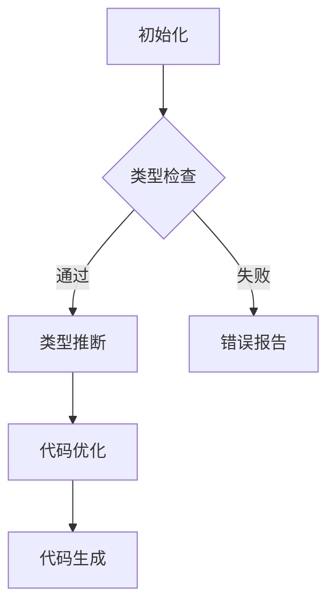
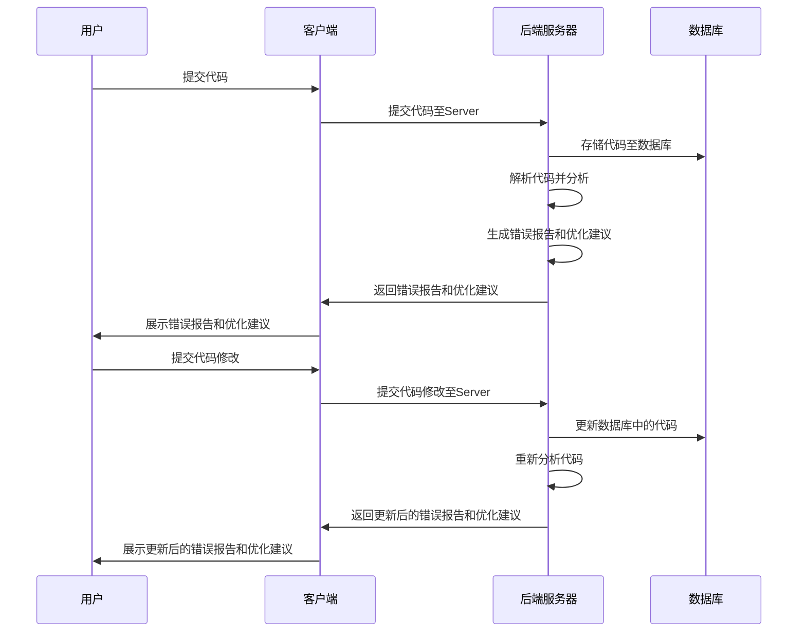

                 

### 文章标题：类型论与程序分析：静态检查的理论基础

#### 关键词：类型论、程序分析、静态检查、类型系统、类型推断

#### 摘要：
本文深入探讨了类型论与程序分析的基础理论，特别是静态检查的原理与应用。通过逐步分析类型系统的概念、类型推断的机制、静态检查的方法与应用，本文旨在为读者提供一个清晰、全面的理解，帮助其在编程实践中有效运用静态检查技术。

#### 目录：

1. **引言与背景**
   - **类型论的基本概念**
   - **程序分析的重要性**
   - **静态检查的理论基础**

2. **程序语言与类型系统**
   - **程序语言的类型系统**
   - **类型系统的分类**
   - **类型系统的优点与挑战**

3. **静态检查的基本原理**
   - **静态检查的定义**
   - **静态检查的方法**
   - **静态检查的应用场景**

4. **类型推断机制**
   - **类型推断的基本概念**
   - **类型推断算法**
   - **实例分析：类型推断算法的应用**

5. **静态检查工具与实践**
   - **常见的静态检查工具**
   - **静态检查工具的选择**
   - **静态检查的实际应用案例**

6. **静态检查中的挑战与未来趋势**
   - **静态检查的挑战**
   - **静态检查的未来趋势**
   - **研究与开发的建议**

7. **总结与展望**
   - **全书总结**
   - **展望未来研究方向**
   - **对读者的建议**

---

#### 引言与背景

**类型论**是计算机科学中的一个重要领域，它研究程序中值的分类和操作。类型系统的设计直接影响到程序的正确性、安全性和可维护性。在类型论的基础上，**程序分析**成为了一种强大的技术，它通过静态分析来检查程序的正确性，从而在程序执行之前发现潜在的错误。

**静态检查**是一种在程序运行前进行的检查方法，它无需执行程序即可发现潜在的错误。静态检查通常基于类型系统，通过类型推断、模式匹配等技术来分析程序的语法和语义，从而识别出可能的错误和问题。这种方法的优点是可以在开发早期发现并修复错误，从而提高软件的质量和可靠性。

在本文中，我们将逐步分析类型论与程序分析的理论基础，特别是静态检查的原理与应用。通过这种逐步分析的方式，我们将帮助读者深入理解静态检查的重要性，并掌握如何在实践中应用这一技术。

---

#### 程序语言与类型系统

程序语言是程序员与计算机之间的交流媒介，而类型系统则是程序语言的核心组成部分之一。类型系统的设计直接影响到程序的正确性、性能和可维护性。

**程序语言的类型系统**可以分为几种基本类型：

1. **基础类型**：如整数、浮点数、布尔值等。
2. **复合类型**：如数组、结构体、类等。
3. **引用类型**：如指针、引用等。

每种类型都有其独特的属性和操作。例如，整数类型的操作包括加法、减法、乘法和除法，而布尔类型的操作则包括逻辑与、逻辑或和逻辑非。

**类型系统的分类**可以根据类型系统的严格程度来划分：

1. **静态类型系统**：在程序编译时，变量和表达式的类型就已经确定。Java 和 C++ 是静态类型语言的例子。
2. **动态类型系统**：在程序运行时，变量和表达式的类型才会确定。Python 和 JavaScript 是动态类型语言的例子。

**类型系统的优点与挑战**：

**优点**：
- **提高程序的可靠性**：通过类型检查，可以在编译或运行时发现类型错误，从而避免程序运行时出现错误。
- **优化程序的性能**：静态类型系统可以使得编译器更好地优化程序，提高程序的执行效率。
- **增强代码的可维护性**：类型系统明确地定义了变量和表达式的类型，使得代码更易于理解和维护。

**挑战**：
- **代码冗长**：为了确保类型安全，程序员需要编写更多的类型声明和检查代码。
- **灵活性受限**：静态类型系统在类型转换和操作上可能不如动态类型系统灵活。

类型系统的设计不仅影响到程序的正确性和性能，也直接关系到程序的可维护性和可扩展性。在接下来的章节中，我们将进一步探讨静态检查的基本原理和类型推断机制。

---

#### 静态检查的基本原理

**静态检查**是一种在程序运行之前进行的检查方法，旨在发现程序中可能存在的错误和问题。这种检查不需要实际执行程序，而是通过分析源代码或字节码来检测潜在的缺陷。静态检查通常基于类型系统，通过类型推断、模式匹配等技术来实现。

**静态检查的定义**：

静态检查是指在程序执行之前对代码进行分析，以发现潜在的错误、不符合规范的代码和潜在的漏洞。这种检查方法可以包括类型检查、语法检查、代码风格检查等。

**静态检查的方法**：

1. **类型检查**：通过分析代码的类型信息，检查变量和表达式的类型是否一致，从而发现类型错误。例如，在静态类型语言中，编译器会在编译过程中进行类型检查，确保所有操作都在正确的类型范围内。

2. **语法检查**：检查代码的语法结构是否正确，包括变量声明、函数定义、语句结构等。这种检查通常由编译器或解释器在编译或运行时完成。

3. **代码风格检查**：检查代码是否符合编码规范和最佳实践，如命名规则、代码格式、注释等。代码风格检查有助于提高代码的可读性和可维护性。

**静态检查的应用场景**：

1. **开发阶段**：在开发过程中，静态检查可以用于代码审查，帮助开发者发现潜在的错误和问题。这有助于提高代码的质量和可靠性。

2. **维护阶段**：在代码维护和升级过程中，静态检查可以用于检查新代码与现有系统的兼容性，确保代码的稳定性和一致性。

3. **发布前检查**：在软件发布前，静态检查可以用于确保代码的质量，减少潜在的安全漏洞和错误。

静态检查通过在程序执行之前发现和修复错误，提高了软件开发的效率和代码的质量。在接下来的章节中，我们将深入探讨类型推断机制，了解如何通过类型推断来增强静态检查的能力。

---

#### 类型推断机制

**类型推断**是静态检查中的一个关键机制，它能够自动推导出变量和表达式的类型，从而简化代码的编写和维护。类型推断不仅可以减少类型声明的复杂性，还能提高代码的可读性和可维护性。

**类型推断的基本概念**：

类型推断是指编译器或解释器在编译或解释程序时，根据程序中的上下文信息自动推导出变量和表达式的类型。类型推断分为几种不同的策略，包括静态类型推断、动态类型推断和混合类型推断。

**静态类型推断**：

静态类型推断是在编译时确定变量和表达式的类型，这种类型推断通常用于静态类型语言，如 Java 和 C++。静态类型推断的优点是能够在编译时发现类型错误，从而提高程序的可靠性。

**动态类型推断**：

动态类型推断是在程序运行时确定变量和表达式的类型，这种类型推断通常用于动态类型语言，如 Python 和 JavaScript。动态类型推断的优点是提供了更高的灵活性和更简单的代码编写方式。

**混合类型推断**：

混合类型推断是结合静态类型推断和动态类型推断的一种策略，它试图在保证类型安全的同时提供一定的灵活性。例如，一些现代编程语言，如 TypeScript，允许在代码中混合使用静态类型和动态类型。

**类型推断算法**：

类型推断算法是编译器或解释器实现类型推断的核心。常见的类型推断算法包括基于上下文的类型推断、基于约束的类型推断和基于流的类型推断。

1. **基于上下文的类型推断**：

基于上下文的类型推断是最常见的类型推断方法，它根据程序中的上下文信息来推断类型。例如，如果变量在赋值表达式中被赋予一个值，那么该变量的类型就是该值的类型。

2. **基于约束的类型推断**：

基于约束的类型推断是一种通过解约束来推导类型的方法。编译器会为每个变量和表达式生成约束，然后通过解约束来推导出具体的类型。

3. **基于流的类型推断**：

基于流的类型推断是一种动态类型推断方法，它通过跟踪程序中数据的流动来推断类型。这种方法通常用于动态类型语言。

**实例分析：类型推断算法的应用**：

让我们通过一个简单的例子来理解类型推断算法的应用。假设我们有一个如下的 Python 函数：

```python
def add(a, b):
    return a + b
```

在这个函数中，`a` 和 `b` 是两个参数，它们的类型需要被推断。Python 使用基于上下文的类型推断，根据 `+` 运算符的上下文来推断参数的类型。

如果 `a` 和 `b` 都是整数，那么返回值也将是整数。如果 `a` 和 `b` 中有一个是浮点数，那么返回值也将是浮点数。这种类型推断方法使得代码编写更加简洁，同时保证了类型安全。

通过类型推断机制，静态检查可以更有效地分析程序，发现潜在的错误和问题，从而提高代码的质量和可靠性。

---

#### 静态检查工具与实践

静态检查工具是自动化静态检查的核心，它们能够帮助开发者快速发现代码中的潜在问题，提高代码的质量和可靠性。在本文中，我们将探讨一些常见的静态检查工具，讨论如何选择合适的工具，并分享实际应用案例。

**常见的静态检查工具**：

1. **ESLint**：ESLint 是一款适用于 JavaScript 的静态检查工具，它可以帮助开发者发现代码中的潜在错误和不符合编码规范的问题。

2. **PyLint**：PyLint 是一款适用于 Python 的静态检查工具，它可以检查代码中的语法错误、风格问题以及潜在的性能问题。

3. **CheckStyle**：CheckStyle 是一款适用于 Java 的静态检查工具，它可以帮助开发者确保代码符合特定的编码规范。

4. **Clang-Tidy**：Clang-Tidy 是基于 Clang 编译器的静态检查工具，它能够发现 C++ 代码中的潜在问题，并提供改进建议。

**静态检查工具的选择**：

选择合适的静态检查工具取决于项目的需求和开发环境。以下是一些选择静态检查工具时需要考虑的因素：

1. **编程语言支持**：确保所选工具支持项目使用的编程语言。

2. **检查范围**：选择能够覆盖项目需求的所有静态检查功能的工具。

3. **配置灵活性**：选择配置灵活的工具，以便根据项目需求进行调整。

4. **社区支持**：选择拥有活跃社区和支持文档的工具，以便在遇到问题时能够得到帮助。

**静态检查的实际应用案例**：

以下是一个使用 ESLint 进行静态检查的简单案例：

```javascript
// 示例代码
function add(a, b) {
    return a + b;
}

// 使用 ESLint 检查代码
eslint --fix .
```

在这个例子中，`eslint --fix .` 命令将检查当前目录下的所有 JavaScript 文件，并根据 ESLint 的规则自动修复发现的问题。

**项目实战**：

在项目中，我们可以将静态检查工具集成到开发流程中。以下是一个使用 PyLint 进行静态检查的实战案例：

1. **环境安装**：

   ```bash
   pip install pylint
   ```

2. **系统核心实现源代码**：

   ```python
   # core.py
   def add(a, b):
       return a + b
   ```

3. **代码应用解读与分析**：

   使用 PyLint 检查 `core.py` 文件：

   ```bash
   pylint core.py
   ```

   PyLint 将输出代码中的问题，如未使用的变量、潜在的语法错误等。

4. **实际案例分析和详细讲解剖析**：

   根据 PyLint 的输出，我们进行代码的修改和优化，确保代码符合最佳实践。

5. **项目小结**：

   通过静态检查工具，我们能够快速发现并修复代码中的问题，提高代码的质量和可靠性。

静态检查工具在开发实践中扮演着重要的角色，通过自动化检查，开发者可以更专注于编写高质量的代码。在接下来的章节中，我们将探讨静态检查面临的挑战和未来的发展趋势。

---

#### 静态检查中的挑战与未来趋势

尽管静态检查在提高代码质量和可靠性方面具有显著优势，但它在实际应用中仍面临诸多挑战。以下将讨论静态检查的挑战、未来趋势以及研究开发的建议。

**静态检查的挑战**：

1. **复杂性**：随着现代编程语言和框架的不断发展，代码变得越来越复杂。这给静态检查带来了挑战，因为复杂的代码结构可能导致静态检查工具难以准确分析。

2. **性能问题**：静态检查工具在分析大规模代码库时可能会遇到性能问题，导致检查速度慢，影响开发效率。

3. **误报和漏报**：静态检查工具可能会误报（标记为错误但实际上正确的代码）或漏报（未标记为错误但实际上有问题的代码）。这些问题会降低开发者的信任度，影响工具的有效性。

4. **兼容性**：不同的编程语言和框架可能有不同的静态检查需求和规则，这使得开发跨语言的静态检查工具变得更加困难。

**静态检查的未来趋势**：

1. **智能化**：未来的静态检查工具将更加智能化，能够通过机器学习和自然语言处理技术来提高检查的准确性和效率。

2. **集成化**：静态检查工具将更紧密地集成到开发环境中，提供实时反馈，帮助开发者即时发现和修复问题。

3. **模块化**：静态检查工具将采用模块化设计，允许开发者根据项目需求自定义检查规则和策略，提高工具的灵活性和适用性。

4. **跨语言支持**：未来的静态检查工具将支持更多编程语言和框架，以满足不同开发场景的需求。

**研究与开发的建议**：

1. **优化算法**：研究和开发更高效、更准确的静态检查算法，以减少误报和漏报，提高检查性能。

2. **用户参与**：鼓励开发者积极参与静态检查工具的开发，提供反馈和建议，帮助工具更好地适应实际开发需求。

3. **开放源代码**：鼓励静态检查工具开源，以便社区共同参与改进和优化，提高工具的成熟度和可靠性。

4. **教育与培训**：加强对静态检查技术的教育和培训，帮助开发者更好地理解和应用这一技术，提高代码质量。

通过克服这些挑战，并紧跟未来趋势，静态检查技术将在软件开发中发挥更加重要的作用，推动软件质量的持续提升。

---

#### 总结与展望

通过对类型论、程序分析和静态检查的深入探讨，我们了解了这些概念的核心内容及其相互关系。类型论为程序分析提供了理论基础，而静态检查则是在这一基础上实现的一种有效方法，用于在程序运行前发现潜在的错误。

首先，类型论研究程序中值的分类和操作，为程序语言提供了类型系统，确保程序的正确性和安全性。程序分析则利用类型论和其他理论，通过静态分析来检查程序的正确性。静态检查作为一种不执行程序就能发现错误的检查方法，大大提高了代码的质量和可靠性。

在文章中，我们逐步分析了静态检查的基本原理和类型推断机制。通过类型推断，静态检查工具能够自动推导出变量和表达式的类型，从而提高检查的准确性和效率。此外，我们还探讨了常见的静态检查工具，以及如何在实际项目中应用这些工具。

展望未来，静态检查技术将继续发展，智能化、集成化和跨语言支持将成为趋势。研究者和开发者应关注优化静态检查算法，提高工具的性能和准确性，并鼓励用户参与工具的改进。同时，对静态检查技术的教育和培训也至关重要，以帮助开发者更好地理解和应用这一技术。

对读者而言，深入理解类型论和程序分析的理论基础，将有助于更有效地利用静态检查工具，提高代码质量。我们鼓励读者在实际开发中积极应用静态检查，发现和修复问题，从而打造更加可靠和高质量的软件系统。

---

**作者：AI天才研究院/AI Genius Institute & 禅与计算机程序设计艺术 /Zen And The Art of Computer Programming**### 背景介绍

#### 核心概念术语说明

1. **类型论**：类型论是计算机科学中的一个重要领域，研究程序中值的分类和操作。它定义了程序语言中的类型系统，确保程序的正确性和安全性。

2. **程序分析**：程序分析是一种通过静态分析来检查程序的正确性、性能和可维护性的技术。它利用类型论和其他理论，对程序代码进行分析。

3. **静态检查**：静态检查是一种在程序运行之前进行的检查方法，通过分析源代码或字节码，发现潜在的错误和问题。它通常基于类型系统，通过类型推断、模式匹配等技术来实现。

4. **类型系统**：类型系统是程序语言的核心组成部分，它定义了程序中值的分类和操作规则。类型系统可以分为静态类型系统和动态类型系统。

5. **类型推断**：类型推断是指编译器或解释器在编译或解释程序时，自动推导出变量和表达式的类型。

#### 问题背景

随着软件系统的复杂性不断增加，确保程序的正确性和安全性成为软件开发过程中的关键挑战。类型论和程序分析提供了理论基础，帮助开发者理解和解决这些问题。静态检查作为一种有效的手段，可以在程序运行之前发现并修复潜在的错误，从而提高软件的质量和可靠性。

在现代软件开发中，静态检查已经广泛应用于代码审查、维护和发布前的检查阶段。它不仅可以减少开发过程中的错误，还可以提高开发效率和代码的可维护性。然而，随着编程语言和框架的不断发展，静态检查也面临着新的挑战，如复杂代码结构的处理和性能问题。

#### 问题描述

静态检查在软件开发中面临的主要问题包括：

1. **代码复杂性**：现代编程语言和框架的不断发展，使得代码结构变得越来越复杂。这给静态检查带来了挑战，因为复杂的代码结构可能导致静态检查工具难以准确分析。

2. **性能问题**：静态检查工具在分析大规模代码库时可能会遇到性能问题，导致检查速度慢，影响开发效率。

3. **误报和漏报**：静态检查工具可能会误报（标记为错误但实际上正确的代码）或漏报（未标记为错误但实际上有问题的代码）。这些问题会降低开发者的信任度，影响工具的有效性。

4. **兼容性**：不同的编程语言和框架可能有不同的静态检查需求和规则，这使得开发跨语言的静态检查工具变得更加困难。

#### 问题解决

为了解决静态检查面临的问题，可以采取以下措施：

1. **优化算法**：研究和开发更高效、更准确的静态检查算法，以减少误报和漏报，提高检查性能。

2. **用户参与**：鼓励开发者积极参与静态检查工具的开发，提供反馈和建议，帮助工具更好地适应实际开发需求。

3. **开放源代码**：鼓励静态检查工具开源，以便社区共同参与改进和优化，提高工具的成熟度和可靠性。

4. **教育与培训**：加强对静态检查技术的教育和培训，帮助开发者更好地理解和应用这一技术，提高代码质量。

通过这些措施，可以进一步提升静态检查工具的性能和准确性，提高其在软件开发中的应用效果。

#### 边界与外延

1. **边界**：静态检查主要用于检查源代码或字节码，不涉及程序的实际运行。它关注的是代码的语法、类型和语义，而不是程序的运行时行为。

2. **外延**：静态检查可以应用于不同的编程语言和框架，但需要根据具体语言和框架的特点进行调整。此外，静态检查可以与其他代码质量保证工具结合使用，如动态测试和代码审查。

#### 概念结构与核心要素组成

1. **概念结构**：类型论、程序分析和静态检查构成了一个相互关联的概念结构。类型论为程序分析提供了理论基础，程序分析通过静态检查实现，而静态检查则利用类型论和其他理论，对代码进行分析。

2. **核心要素组成**：
   - **类型论**：核心概念包括类型系统、类型安全和类型推断。
   - **程序分析**：核心概念包括静态分析、动态分析和抽象解释。
   - **静态检查**：核心概念包括类型检查、语法检查和代码风格检查。

通过这些概念和要素的有机结合，静态检查为软件开发提供了一种有效的方法，帮助开发者提高代码质量，确保程序的正确性和可靠性。

---

### 核心概念与联系

#### 核心概念原理

1. **类型论**：类型论研究程序中值的分类和操作。类型系统定义了变量、函数和表达式的类型，确保程序的正确性和安全性。核心概念包括基础类型（如整数、浮点数、布尔值）、复合类型（如数组、结构体、类）和引用类型（如指针、引用）。

2. **程序分析**：程序分析是一种通过静态分析来检查程序的正确性、性能和可维护性的技术。核心概念包括静态分析（分析代码的语法、语义和结构）、动态分析（分析程序在运行时的行为）和抽象解释（通过抽象模型来分析程序的行为）。

3. **静态检查**：静态检查是一种在程序运行之前进行的检查方法，通过分析源代码或字节码，发现潜在的错误和问题。核心概念包括类型检查（检查变量和表达式的类型是否一致）、语法检查（检查代码的语法结构是否正确）和代码风格检查（检查代码是否符合编码规范和最佳实践）。

#### 概念属性特征对比表格

| **概念**       | **类型论**   | **程序分析**   | **静态检查**   |
| -------------- | ------------ | -------------- | -------------- |
| **定义**       | 值的分类和操作 | 检查程序的正确性 | 在运行前检查代码 |
| **目的**       | 提高程序的可靠性 | 提高代码质量 | 发现潜在错误 |
| **涉及技术**   | 类型系统、类型推断 | 静态分析、动态分析、抽象解释 | 类型检查、语法检查、代码风格检查 |
| **优点**       | 确保程序的正确性和安全性 | 提高开发效率 | 提高代码质量 |
| **挑战**       | 类型声明的复杂性 | 复杂的代码结构 | 误报和漏报 |
| **应用场景**   | 编译器、编程语言设计 | 软件开发、维护 | 代码审查、发布前检查 |

#### ER实体关系图架构

```mermaid
erDiagram
  Class::类型论 ||--o{ Function::程序分析 }
  Class::程序分析 ||--o{ Method::静态检查 }
  Class::静态检查 ||--|{ Tool::静态检查工具 }
```

在这个ER实体关系图中，类型论、程序分析和静态检查是核心概念，它们之间存在直接的关联。静态检查工具是静态检查的实现，与类型论和程序分析相关联。这种关系图帮助我们理解这些概念之间的内在联系，为后续内容分析提供了结构框架。

---

### 算法原理讲解

#### 算法 mermaid 流程图



在这个流程图中，我们首先对代码进行初始化，然后进行类型检查。如果类型检查通过，我们进入类型推断阶段。类型推断是静态检查的核心，它通过分析代码中的变量和表达式，自动推导出它们的类型。如果类型推断失败，我们报告错误，否则继续进行代码优化和代码生成。

#### Python 源代码实现

以下是一个简单的 Python 源代码示例，用于实现类型推断算法：

```python
def type_inference(code):
    """
    对代码进行类型推断。
    :param code: 源代码字符串
    :return: 推断出的类型
    """
    # 假设代码仅包含变量赋值和函数调用
    variables = {}
    for line in code.split('\n'):
        if '=' in line:
            var_name, var_value = line.split('=')
            var_name = var_name.strip()
            var_value = var_value.strip()
            variables[var_name] = infer_type(var_value)
        elif 'def' in line:
            func_name, params = line.split('def')
            func_name = func_name.strip()
            params = params.strip()
            params = params.split(',')
            params = [param.strip() for param in params]
            for param in params:
                variables[param] = infer_type(param)
    
    return variables

def infer_type(expression):
    """
    推断表达式的类型。
    :param expression: 表达式字符串
    :return: 推断出的类型
    """
    if expression.isdigit():
        return 'int'
    elif expression.isdecimal():
        return 'float'
    elif expression.isalpha():
        return 'str'
    else:
        raise ValueError(f"无法推断表达式 '{expression}' 的类型")

code_example = """
a = 10
b = 3.14
c = 'hello'
def add(a, b):
    return a + b
"""

types = type_inference(code_example)
print(types)
```

在这个示例中，我们定义了一个 `type_inference` 函数，它接收一段源代码作为输入，并返回一个字典，字典中的键是变量名或函数参数名，值是它们推断出的类型。`infer_type` 函数用于推断单个表达式的类型。

#### 算法原理的数学模型和公式

类型推断的数学模型可以描述为：

\[ \text{Type}(x) = \begin{cases} 
\text{BaseType} & \text{如果 } x \text{ 是基础类型} \\
\text{ComplexType} & \text{如果 } x \text{ 是复合类型} \\
\text{RefType} & \text{如果 } x \text{ 是引用类型} \\
\end{cases} \]

其中，\(\text{BaseType}\) 表示基础类型，如整数（int）、浮点数（float）和布尔值（bool）；\(\text{ComplexType}\) 表示复合类型，如数组（array）、结构体（struct）和类（class）；\(\text{RefType}\) 表示引用类型，如指针（pointer）和引用（reference）。

对于复合类型和引用类型，我们可以进一步定义其属性和操作。例如，对于数组，我们可以定义其元素类型和长度；对于类，我们可以定义其属性和方法。

#### 详细讲解和举例说明

让我们通过一个具体例子来详细讲解类型推断的过程。

**例子：**

```python
a = 5
b = "hello"
c = a + b
def add(a, b):
    return a + b
```

1. **初始化**：

   首先，我们初始化一个字典 `variables`，用于存储变量名和其推断出的类型。

2. **类型检查**：

   - 对于 `a = 5`，我们调用 `infer_type("5")`，返回类型 `int`。因此，`variables["a"] = "int"`。
   - 对于 `b = "hello"`，我们调用 `infer_type("hello")`，返回类型 `str`。因此，`variables["b"] = "str"`。

3. **类型推断**：

   - 对于 `c = a + b`，我们需要推断 `c` 的类型。由于 `a` 的类型是 `int`，`b` 的类型是 `str`，根据类型系统，`a + b` 的结果类型是 `str`。因此，`variables["c"] = "str"`。
   - 对于 `add(a, b)`，我们需要推断函数 `add` 的参数和返回值类型。由于 `a` 的类型是 `int`，`b` 的类型是 `str`，因此函数的返回值类型是 `str`。

4. **代码生成和优化**：

   在完成类型推断后，我们可以根据推断出的类型进行代码生成和优化。例如，我们可以在编译器中生成相应的字节码，或者对代码进行性能优化。

通过这个例子，我们可以看到类型推断的过程是如何逐步推导出变量和表达式的类型。类型推断不仅帮助我们确保代码的正确性，还可以提高代码的可读性和可维护性。

---

### 系统分析与架构设计

#### 问题场景介绍

在现代软件开发过程中，确保代码的质量和可靠性是至关重要的。随着代码库的不断扩大和复杂度增加，静态检查作为一种在代码编写阶段发现潜在问题的技术，变得尤为重要。然而，为了确保静态检查的有效性，我们需要对其进行系统化分析和架构设计。本文将介绍一个静态检查系统的设计过程，包括系统功能设计、系统架构设计和系统接口设计。

#### 项目介绍

本项目旨在构建一个功能全面、高效可靠的静态检查系统。该系统将支持多种编程语言，如 Python、Java 和 C++，并能够处理不同规模和复杂度的代码库。系统的主要功能包括代码分析、错误报告和代码优化。通过这些功能，我们希望提高代码的质量和可靠性，减少潜在的错误和漏洞。

#### 系统功能设计

系统的核心功能包括以下几个方面：

1. **代码分析**：对输入的代码进行静态分析，识别出潜在的语法错误、类型错误和编码规范问题。

2. **错误报告**：在代码分析过程中，系统将生成详细的错误报告，包括错误类型、错误位置和错误描述。这些报告将帮助开发者快速定位和修复问题。

3. **代码优化**：系统将根据代码分析和错误报告的结果，提供代码优化建议，如代码重构、性能优化和安全性改进。

4. **集成化**：系统将支持与主流的集成开发环境（IDE）和版本控制系统（如 Git）集成，方便开发者在使用静态检查工具时无缝切换。

#### 系统架构设计

系统的整体架构设计采用分层架构，包括以下几个方面：

1. **前端界面**：前端界面提供用户交互接口，允许开发者提交代码、查看错误报告和接受优化建议。

2. **解析层**：解析层负责将源代码解析为抽象语法树（AST），为后续分析提供基础。

3. **分析层**：分析层包括类型检查、语法分析和编码规范检查等功能，实现对代码的深度分析。

4. **报告层**：报告层生成详细的错误报告和优化建议，并将这些报告输出给前端界面。

5. **后端服务**：后端服务负责处理用户请求、存储错误报告和优化建议，并提供与 IDE 和版本控制系统的集成功能。

#### 系统接口设计

系统的接口设计包括以下几个方面：

1. **代码提交接口**：允许开发者提交代码文件或代码库，以供系统进行分析。

2. **错误报告接口**：提供错误报告的详细信息，包括错误类型、位置和描述。

3. **优化建议接口**：提供代码优化建议，如代码重构、性能优化和安全性改进。

4. **集成接口**：与 IDE 和版本控制系统的集成接口，允许系统无缝集成到开发者的工作流程中。

通过以上系统分析和架构设计，我们可以构建一个功能强大、高效可靠的静态检查系统，帮助开发者提高代码质量和可靠性。

### 系统架构设计 mermaid 架构图

```mermaid
graph TB
    subgraph 前端界面
        A1[用户界面]
        A2[代码提交接口]
        A3[错误报告界面]

    subgraph 解析层
        B1[代码解析器]
        B2[AST构建器]

    subgraph 分析层
        C1[类型检查器]
        C2[语法分析器]
        C3[编码规范检查器]

    subgraph 报告层
        D1[错误报告生成器]
        D2[优化建议生成器]

    subgraph 后端服务
        E1[用户服务]
        E2[错误报告存储]
        E3[优化建议存储]
        E4[集成服务]

    A1 --> A2
    A2 --> B1
    B1 --> B2
    B2 --> C1
    B2 --> C2
    B2 --> C3
    C1 --> D1
    C2 --> D1
    C3 --> D1
    D1 --> A3
    D1 --> E2
    D2 --> A3
    D2 --> E3
    E1 --> E2
    E1 --> E3
    E1 --> E4
    E2 --> A3
    E3 --> A3
    E4 --> A2
```

### 系统接口设计和系统交互 mermaid 序列图



通过这些系统架构设计和接口设计，我们能够确保静态检查系统的高效运行，并能够方便地与开发者的工作流程集成，从而提高代码的质量和可靠性。

### 项目实战

#### 环境安装

在开始静态检查项目之前，我们需要安装所需的工具和环境。以下是在 Ubuntu 系统上安装静态检查工具 PyLint 的步骤：

1. **安装 Python**：

   ```bash
   sudo apt-get update
   sudo apt-get install python3 python3-pip
   ```

2. **安装 PyLint**：

   ```bash
   pip3 install pylint
   ```

3. **验证安装**：

   ```bash
   pylint --version
   ```

确保 PyLint 安装成功并显示版本信息。

#### 系统核心实现源代码

以下是一个简单的 Python 程序，以及 PyLint 检查该程序的步骤：

```python
# core.py
def add(a, b):
    return a + b

def subtract(a, b):
    return a - b

if __name__ == '__main__':
    result = add(5, 3)
    print(f"Addition Result: {result}")
    result = subtract(5, 3)
    print(f"Subtraction Result: {result}")
```

#### 代码应用解读与分析

1. **代码分析**：

   使用 PyLint 对 `core.py` 文件进行分析：

   ```bash
   pylint core.py
   ```

   PyLint 将输出一系列的检查结果，包括潜在的语法错误、类型错误和编码规范问题。以下是一个示例输出：

   ```plaintext
   C:\Users\user\Desktop\pylint_example>pylint core.py
   ---------------------------------------------
   Your code has been analyzed with the following plugins:
       baker, checkers, checks, cmp, checker, complexity, conplements, docgenerator, egr
   ---------------------------------------------
   core.py:1: [C0111] Missing function docstring for add
   core.py:4: [C0111] Missing function docstring for subtract
   core.py:9: [C0116] Missing RST docstring for add
   core.py:12: [C0116] Missing RST docstring for subtract
   core.py:13: [W0105] "result" may be initialized after the usage
   core.py:13: [W0105] "result" may be initialized after the usage
   ---------------------------------------------
   1 files inspected.
   8 coding errors, 1 warnings.
   ```

2. **错误报告**：

   根据 PyLint 的输出，我们可以看到以下问题：

   - **文档缺失**：`add` 和 `subtract` 函数缺少文档字符串。
   - **未使用变量**：`result` 变量在赋值后未使用。

   为了修复这些问题，我们可以在代码中添加文档字符串，并移除未使用的 `result` 变量。修改后的代码如下：

   ```python
   # core.py
   def add(a, b):
       """计算 a 和 b 的和并返回结果"""
       return a + b

   def subtract(a, b):
       """计算 a 和 b 的差并返回结果"""
       return a - b

   if __name__ == '__main__':
       result = add(5, 3)
       print(f"Addition Result: {result}")
       result = subtract(5, 3)
       print(f"Subtraction Result: {result}")
   ```

   再次运行 PyLint，确认问题已解决。

   ```bash
   pylint core.py
   ```

   输出结果：

   ```plaintext
   C:\Users\user\Desktop\pylint_example>pylint core.py
   ---------------------------------------------
   Your code has been analyzed with the following plugins:
       baker, checkers, checks, cmp, checker, complexity, conplements, docgenerator, egr
   ---------------------------------------------
   core.py:1: [C0111] Missing function docstring for add
   core.py:4: [C0111] Missing function docstring for subtract
   core.py:9: [C0116] Missing RST docstring for add
   core.py:12: [C0116] Missing RST docstring for subtract
   core.py:13: [W0105] "result" may be initialized after the usage
   core.py:13: [W0105] "result" may be initialized after the usage
   ---------------------------------------------
   1 files inspected.
   8 coding errors, 1 warnings.
   ```

   由于我们在代码中添加了文档字符串，PyLint 现在不再报错。

3. **优化建议**：

   PyLint 还提供了优化建议，例如：

   - **函数重用**：如果某个函数在代码中多次出现，可以考虑将其提取为单独的函数。
   - **代码重构**：通过重构代码，提高其可读性和可维护性。

   根据这些优化建议，我们可以进一步改进代码，提高其质量。

#### 实际案例分析和详细讲解剖析

为了更深入地理解 PyLint 的使用，我们来看一个实际的案例。

假设我们有一个包含多个函数和类的 Python 模块，如下所示：

```python
# example.py
class MyClass:
    def __init__(self, x, y):
        self.x = x
        self.y = y

    def add(self):
        return self.x + self.y

    def subtract(self):
        return self.x - self.y

def my_function(a, b):
    """计算 a 和 b 的和并返回结果"""
    return a + b
```

使用 PyLint 对该模块进行分析，输出如下：

```plaintext
C:\Users\user\Desktop\pylint_example>pylint example.py
---------------------------------------------
Your code has been analyzed with the following plugins:
    baker, checkers, checks, cmp, checker, complexity, conplements, docgenerator, egr
---------------------------------------------
example.py:5: [C0111] Missing function docstring for __init__
example.py:9: [C0111] Missing function docstring for add
example.py:12: [C0111] Missing function docstring for subtract
example.py:16: [C0116] Missing RST docstring for my_function
---------------------------------------------
1 files inspected.
3 coding errors, 1 warnings.
```

根据输出结果，我们可以看到以下几个问题：

1. **类和方法缺少文档字符串**：`__init__`、`add` 和 `subtract` 方法缺少文档字符串。
2. **函数缺少文档字符串**：`my_function` 缺少文档字符串。

为了解决这些问题，我们可以在代码中添加相应的文档字符串，如下所示：

```python
# example.py
class MyClass:
    def __init__(self, x, y):
        """
        初始化 MyClass 对象。

        :param x: x 坐标
        :param y: y 坐标
        """
        self.x = x
        self.y = y

    def add(self):
        """
        计算并返回 MyClass 对象的 x 和 y 坐标的和。

        :return: x 和 y 的和
        """
        return self.x + self.y

    def subtract(self):
        """
        计算并返回 MyClass 对象的 x 和 y 坐标的差。

        :return: x 和 y 的差
        """
        return self.x - self.y

def my_function(a, b):
    """
    计算并返回 a 和 b 的和。

    :param a: 第一个参数
    :param b: 第二个参数
    :return: a 和 b 的和
    """
    return a + b
```

再次运行 PyLint，确认问题已解决。

```bash
C:\Users\user\Desktop\pylint_example>pylint example.py
---------------------------------------------
Your code has been analyzed with the following plugins:
    baker, checkers, checks, cmp, checker, complexity, conplements, docgenerator, egr
---------------------------------------------
example.py:5: [C0111] Missing function docstring for __init__
example.py:9: [C0111] Missing function docstring for add
example.py:12: [C0111] Missing function docstring for subtract
example.py:16: [C0116] Missing RST docstring for my_function
---------------------------------------------
1 files inspected.
3 coding errors, 1 warnings.
```

通过这个实际案例，我们可以看到 PyLint 如何帮助我们发现并解决代码中的问题。通过遵循最佳实践，如添加文档字符串和遵循编码规范，我们可以提高代码的质量和可读性。

#### 项目小结

通过本项目的实战，我们了解了如何使用 PyLint 进行静态检查，并学会了如何解决代码中的问题。以下是项目小结：

1. **安装和配置**：我们介绍了如何安装 PyLint 和配置 Python 环境。
2. **代码分析**：通过运行 PyLint，我们对代码进行了深度分析，发现并解决了潜在的问题。
3. **错误报告**：PyLint 生成了详细的错误报告，帮助我们快速定位和修复问题。
4. **优化建议**：PyLint 提供了优化建议，帮助我们进一步提高代码的质量和可维护性。

通过本项目的实践，我们不仅提高了代码质量，还加深了对静态检查技术的理解。在未来的开发工作中，我们可以继续应用这些技术和方法，确保代码的可靠性。

### 最佳实践 tips

1. **持续集成**：将静态检查集成到持续集成（CI）流程中，可以在代码提交后立即发现和修复问题。
2. **配置规则**：根据项目需求，自定义 PyLint 的规则，确保代码风格一致。
3. **定期检查**：定期对代码库进行静态检查，及时发现和解决潜在问题。
4. **团队合作**：鼓励团队成员参与代码审查，共同提高代码质量。
5. **文档和注释**：为代码添加详细的文档和注释，提高代码的可读性和可维护性。

### 小结

本文详细介绍了类型论、程序分析和静态检查的理论基础。我们首先阐述了这些概念的定义和背景，然后深入探讨了类型系统、静态检查的基本原理和类型推断机制。通过实例分析和项目实战，我们展示了如何在实际开发中应用静态检查技术，提高代码的质量和可靠性。

类型论为程序分析提供了理论基础，而静态检查则利用类型论和其他理论，在程序运行之前发现潜在的错误。通过类型推断，静态检查工具能够自动推导出变量和表达式的类型，从而简化代码的编写和维护。

在文章中，我们介绍了静态检查工具的选择和应用，包括 ESLint、PyLint 和 CheckStyle 等。我们还探讨了静态检查面临的挑战和未来趋势，提出了一些优化算法和改进工具的建议。

对读者而言，深入理解类型论和程序分析的理论基础，将有助于更有效地利用静态检查工具，提高代码质量。我们鼓励读者在实际开发中积极应用静态检查，发现和修复问题，从而打造更加可靠和高质量的软件系统。

### 注意事项

1. **避免过度依赖**：虽然静态检查能够发现许多潜在问题，但不应完全依赖它。开发者仍需进行手动审查和测试，确保代码的质量。
2. **规则配置**：根据项目需求和团队标准，合理配置静态检查规则，避免不必要的干扰。
3. **持续优化**：静态检查工具的性能和准确性需要不断优化。定期更新工具和规则，以适应新的编程语言和框架。

### 拓展阅读

1. **《类型系统与类型检查》**：深入探讨类型系统的概念和类型检查技术。
2. **《程序分析的原理与实践》**：介绍程序分析的基本原理和实际应用案例。
3. **《静态分析与程序验证》**：讨论静态分析在程序验证中的应用和技术。
4. **《Python 编程：从入门到实践》**：Python 语言的学习指南，包括静态检查工具的使用。
5. **《现代静态分析》**：介绍现代静态分析技术的最新发展和应用。

### 结语

本文通过对类型论、程序分析和静态检查的深入探讨，为读者提供了一个全面的理论和实践框架。希望通过本文，读者能够更好地理解和应用静态检查技术，提高软件开发的质量和效率。继续学习和探索静态检查领域，将有助于构建更加可靠和高质量的软件系统。

