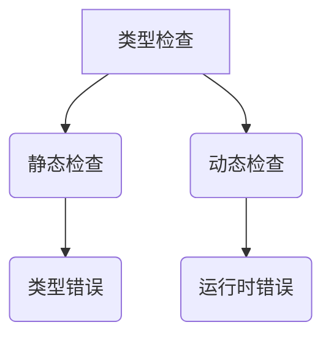
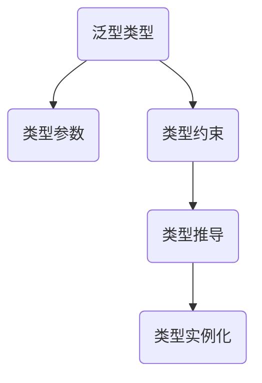
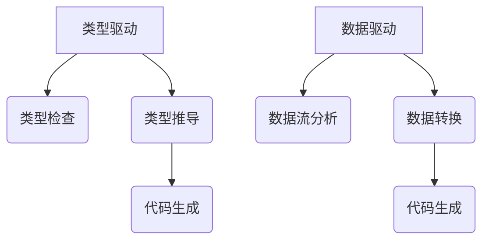
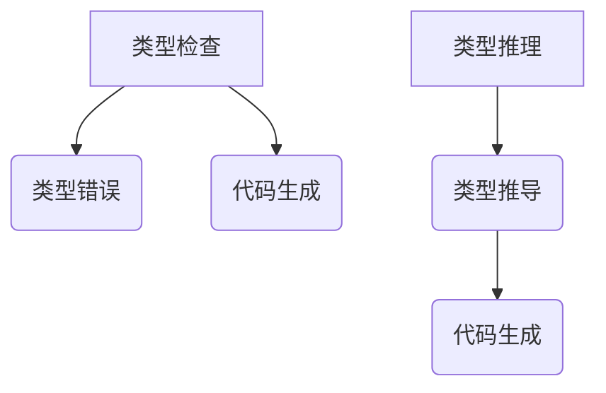
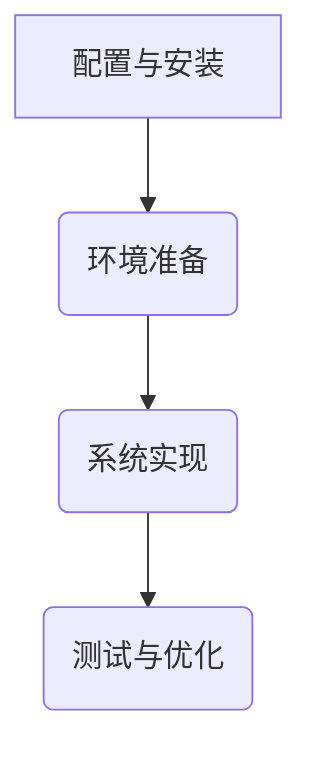

                 

# 类型论与程序合成：从类型到实现的自动化

## 关键词
类型论、程序合成、自动化、类型系统、实现

## 摘要
本文深入探讨类型论与程序合成的结合，分析其理论基础、技术方法及其在实现自动化程序合成中的应用。通过逐步分析类型论的基本概念、类型系统的构建、程序合成的方法和技术，以及如何在实践中应用这些技术，本文旨在为读者提供一套完整且实用的类型论与程序合成的知识和应用指南。

---

## 引言

### 类型论基础

类型论是计算机科学中的一个重要分支，它研究程序中的类型系统，确保程序的正确性和安全性。类型系统通过定义类型和类型规则，使得程序中的变量、函数和表达式都具有明确的类型，从而在编译时可以进行类型检查，防止潜在的运行时错误。

### 程序合成

程序合成，又称代码生成，是一种自动化地构造程序的技术。通过将高层次的描述转换为低层次的代码，程序合成能够提高开发效率，减少手工编码的错误，并在一定程度上实现代码的优化。

### 类型论与程序合成结合

类型论与程序合成相结合，可以在类型系统的指导下，自动化地从类型规格说明生成高效的程序代码。这一结合在编译器设计、编程语言实现、软件工程等领域具有重要应用。

### 本书目的与结构

本书旨在系统地介绍类型论与程序合成的相关概念、技术和实现方法。全书分为以下几个部分：

1. 引言与背景
2. 类型论基础
3. 程序合成技术
4. 类型与程序合成结合
5. 实现与自动化
6. 案例分析
7. 结论与展望

---

## 类型论基础

### 基本类型系统

基本类型系统包括原始类型和复合类型。原始类型如整数、浮点数等，复合类型如数组、结构体等。

### 类型属性

类型具有多种属性，如确定性、可扩展性、一致性等。不同的类型属性适用于不同的场景，影响类型系统的设计和性能。

### 类型检查算法

类型检查算法用于验证程序中的类型约束是否满足。常见的类型检查算法包括静态检查和动态检查。

### 数学模型和公式

在类型论中，许多概念和算法都可以用数学模型和公式来描述。例如，类型推导可以用递归关系和代数方法来表示。

### Mermaid 流程图

---

### 高级类型系统

#### 泛型类型

泛型类型允许定义通用的类型参数，使得代码更加复用和灵活。

#### 协变与逆变

协变和逆变是类型系统中的两个重要概念，它们影响类型之间的兼容性和转换。

#### 数学模型和公式

泛型类型的推导可以使用依赖类型系统和类型等价性来描述。

### Mermaid 流程图

---

## 程序合成技术

### 程序合成原理

程序合成基于类型系统和程序语义，通过自动化地构造程序代码来满足特定的需求。

### 程序合成方法

程序合成方法包括类型驱动的程序合成、数据驱动的程序合成等。

### 类型驱动的程序合成

类型驱动的程序合成基于类型规格说明，通过类型检查和类型推导来生成程序代码。

### 数据驱动的程序合成

数据驱动的程序合成基于数据结构和数据流，通过数据转换和优化来生成程序代码。

### Mermaid 流程图

---

## 类型与程序合成结合

### 类型安全与程序合成

类型安全是程序合成的重要目标之一，通过确保程序的正确性和可靠性来提高程序合成的质量。

### 类型推理与程序合成

类型推理是程序合成的基础，通过推理类型之间的等价关系来生成符合类型约束的程序代码。

### 类型检查与代码生成

类型检查和代码生成相互依赖，类型检查为代码生成提供安全保证，而代码生成利用类型检查的结果来优化程序。

### Mermaid 流程图

---

## 实现与自动化

### 实现自动化程序合成

实现自动化程序合成需要选择合适的编程语言和工具，如基于类型理论和程序合成原理的编程语言。

### 系统核心实现

系统核心实现包括类型检查器、类型推导引擎、代码生成器等组件。

### 系统配置与安装

在实现自动化程序合成的过程中，需要对系统进行配置和安装，确保环境满足需求。

### Mermaid 流程图

---

## 案例分析

### 案例分析一

#### 问题场景介绍

介绍一个实际的应用场景，如自动化的Web应用开发。

#### 系统功能设计

使用Mermaid绘制领域模型类图，展示系统的功能结构。

#### 系统架构设计

使用Mermaid绘制系统架构图，展示系统的组件和交互。

#### 系统接口设计和系统交互

使用Mermaid绘制系统接口设计和系统交互序列图，展示系统的交互流程。

### 案例分析二

#### 问题场景介绍

介绍另一个实际的应用场景，如自动化数据库管理。

#### 系统功能设计

使用Mermaid绘制领域模型类图，展示系统的功能结构。

#### 系统架构设计

使用Mermaid绘制系统架构图，展示系统的组件和交互。

#### 系统接口设计和系统交互

使用Mermaid绘制系统接口设计和系统交互序列图，展示系统的交互流程。

---

## 小结与展望

本文系统地介绍了类型论与程序合成的相关概念、技术和实现方法。类型论与程序合成的结合在自动化程序开发中具有重要应用，为未来的自动化编程提供了新的思路和方法。未来研究可以进一步探索类型论在更广泛的应用领域中的潜力，如智能合约、自动化测试等。

---

## 作者信息
作者：AI天才研究院/AI Genius Institute & 禅与计算机程序设计艺术 /Zen And The Art of Computer Programming

