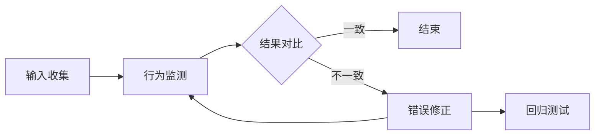
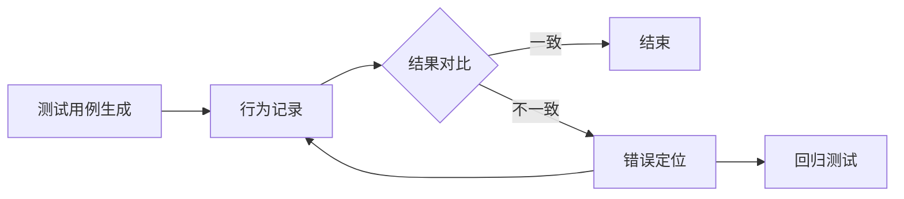
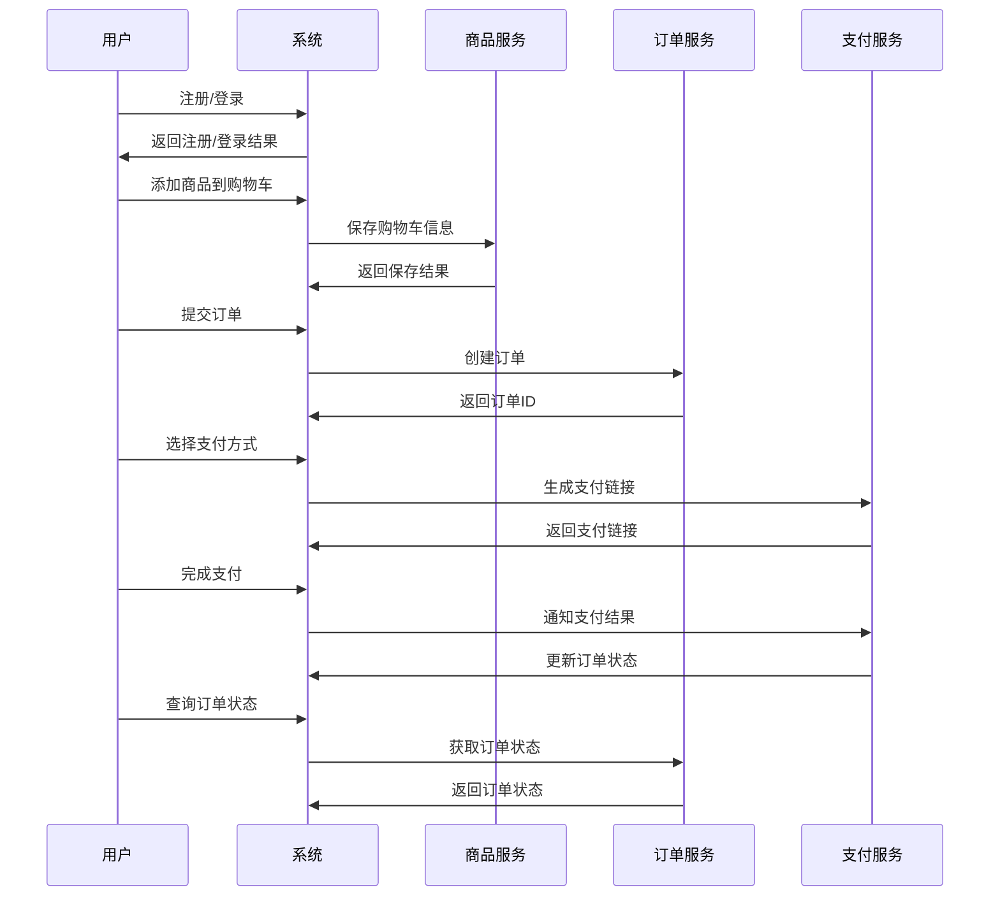

                 

### 关键词

1. 类型论
2. 程序重构
3. 一致性检查
4. 形式化方法
5. 算法原理
6. 系统架构设计
7. 项目实战

### 摘要

本文旨在探讨类型论与程序重构的内在联系，并深入分析保证行为一致性的形式化方法。通过系统化的结构设计，本文首先介绍了类型论与程序重构的基本概念，探讨了它们在软件工程中的重要性。接着，本文详细阐述了类型论的基础理论，以及程序重构的核心原则和技术。在此基础上，本文提出了两个关键算法：一致性检查算法和行为一致性验证算法，通过Mermaid流程图和Python源代码进行说明。随后，本文进一步阐述了系统功能设计与架构设计的要领，并通过项目实战验证了理论的实际应用价值。最后，本文总结了最佳实践，并指出了需要注意的事项，为读者提供了进一步的拓展阅读资源。

### 目录大纲设计

为了帮助读者更好地理解和掌握本文的核心内容，我们精心设计了如下目录大纲：

#### 第一部分：背景介绍
- **第1章** 类型论与程序重构概述
  - 1.1.1. 问题背景
  - 1.1.2. 问题描述
  - 1.1.3. 问题解决
  - 1.1.4. 边界与外延
  - 1.1.5. 概念结构与核心要素组成

#### 第二部分：核心概念与联系
- **第2章** 类型论基础
  - 2.1. 类型论的基本概念
  - 2.2. 类型论的核心原理
  - 2.3. 类型论在程序设计中的应用
- **第3章** 程序重构方法
  - 3.1. 程序重构的定义
  - 3.2. 程序重构的核心原则
  - 3.3. 程序重构的常用技术

#### 第三部分：算法原理讲解
- **第4章** 一致性检查算法
  - 4.1. 算法原理
  - 4.2. 算法mermaid流程图
  - 4.3. Python源代码解释
  - 4.4. 数学模型与公式
  - 4.5. 举例说明
- **第5章** 行为一致性验证算法
  - 5.1. 算法原理
  - 5.2. 算法mermaid流程图
  - 5.3. Python源代码解释
  - 5.4. 数学模型与公式
  - 5.5. 举例说明

#### 第四部分：系统分析与架构设计
- **第6章** 系统功能设计与架构设计
  - 6.1. 问题场景介绍
  - 6.2. 系统功能设计
  - 6.3. 系统架构设计
  - 6.4. 系统接口设计
  - 6.5. 系统交互序列图
- **第7章** 项目实战
  - 7.1. 环境安装
  - 7.2. 系统核心实现
  - 7.3. 代码应用解读与分析
  - 7.4. 实际案例分析
  - 7.5. 项目小结

#### 第五部分：最佳实践与总结
- **第8章** 最佳实践与总结
  - 8.1. 最佳实践 tips
  - 8.2. 注意事项
  - 8.3. 小结
  - 8.4. 拓展阅读

通过这一系统化的结构设计，读者可以循序渐进地学习并掌握本文的主题内容。

### 第1章：类型论与程序重构概述

#### 1.1.1. 问题背景

在现代软件工程中，随着系统复杂性的不断增加，确保代码的可维护性和可扩展性成为开发者的核心挑战之一。类型论与程序重构作为解决这一问题的关键技术手段，逐渐受到广泛关注。类型论起源于数学领域，其核心思想是通过形式化的类型系统来确保程序的正确性。而程序重构则是在软件开发生命周期中，通过改进代码结构和设计来提高软件的质量。

在现代软件工程实践中，类型论与程序重构的重要性主要体现在以下几个方面：

1. **代码可维护性**：随着项目的持续迭代，代码库会变得越来越庞大。类型论通过定义严格的类型系统，可以有效地防止类型错误，从而降低代码维护的复杂性。
2. **代码可扩展性**：在软件需求变更或功能扩展时，程序重构能够帮助开发者以最小的代价实现系统的适应性，确保新功能能够无缝集成到现有系统中。
3. **提高开发效率**：类型论与程序重构相结合，使得开发者在设计和实现阶段就能识别和修正潜在问题，从而减少后续的调试和修改工作，提升开发效率。

然而，类型论与程序重构在实践中也面临一些挑战。首先，类型系统的引入可能会增加开发初期的工作量，特别是对于大型项目。其次，程序重构需要开发者具备扎实的编程技能和对现有代码的深入理解，否则可能会导致代码质量下降。

因此，本文旨在通过系统化的分析和讲解，帮助读者深入理解类型论与程序重构的基本概念、原理和方法，并探讨如何在实际项目中有效应用这些技术，以解决软件开发中的关键问题。

#### 1.1.2. 问题描述

在软件开发过程中，类型论与程序重构的应用面临着一系列具体问题，这些问题直接影响软件系统的质量和开发效率。以下是对这些问题的详细描述：

1. **类型错误问题**：类型论的核心目标之一是确保程序的正确性。然而，在大型和复杂的软件项目中，类型错误仍然是一个常见问题。类型错误可能导致程序无法编译、运行，甚至产生不可预见的副作用。例如，如果某个函数期望接收一个整数类型的参数，但实际传递了一个字符串类型的值，那么该函数的行为将无法预测。

2. **代码冗余问题**：在软件开发初期，由于需求的不确定性和时间限制，开发者可能会编写大量的冗余代码。这些冗余代码不仅增加了代码库的体积，还降低了代码的可读性和可维护性。例如，一个函数可能包含大量与核心逻辑无关的辅助代码，这使得后续的维护和修改工作变得复杂。

3. **重构难度问题**：程序重构的目的是改进现有代码的结构和设计，使其更加简洁和易于维护。然而，在实际操作中，重构往往面临巨大的难度。首先，重构需要开发者对现有代码有深入的理解，否则很容易引入新的错误。其次，大型项目的重构可能需要耗费大量时间和资源，特别是在重构过程中涉及到多个模块和组件的交互。

4. **一致性保证问题**：在软件系统的持续迭代过程中，保持代码和行为的一致性是一个重要挑战。类型论和程序重构虽然能够提高代码的质量，但无法完全保证所有变化都不会破坏现有功能。例如，一个简单的修改可能会在系统中的多个地方产生连锁反应，导致部分功能失效。

5. **开发效率与质量平衡问题**：在软件开发过程中，开发效率和代码质量往往是相矛盾的。快速开发可能会导致代码质量下降，而严格的代码审查和重构则会延长开发周期。如何在保证代码质量的前提下提高开发效率，是一个需要权衡的问题。

综上所述，类型论与程序重构在软件开发中虽然具有重要作用，但也面临诸多挑战。本文将详细探讨这些问题，并介绍一系列有效的解决方案和最佳实践，以帮助开发者应对这些挑战，提升软件系统的质量和开发效率。

#### 1.1.3. 问题解决

为了解决上述在类型论与程序重构过程中遇到的问题，我们可以采用一系列具体的策略和方法，以下是对这些方法的详细描述：

1. **静态类型检查**：通过引入静态类型检查工具，如TypeScript或ML等，可以在编译时发现并修复类型错误。静态类型检查不仅能够防止类型错误的发生，还能够通过类型推断提高代码的可读性。例如，在TypeScript中，函数参数和返回值的类型必须明确声明，这可以有效避免类型错误。

2. **代码复用与模块化**：通过代码复用和模块化设计，可以减少冗余代码，提高代码的复用性和可维护性。例如，将功能相关的代码封装成模块或类，使得每个模块或类都有明确的职责和接口。这不仅简化了代码结构，还有助于代码的重构和维护。

3. **重构工具**：使用专业的重构工具，如IntelliJ IDEA或Visual Studio Code等，可以帮助开发者更高效地完成代码重构任务。这些工具提供了丰富的重构操作，如方法提取、类合并、代码移动等，使得重构过程更加直观和自动化。

4. **代码审查**：通过引入代码审查机制，如代码走查或Pair Programming，可以确保重构过程的质量。代码审查能够及时发现并修复潜在的问题，减少重构带来的风险。

5. **持续集成与测试**：通过引入持续集成和测试机制，可以在重构过程中不断验证代码的质量。例如，每次代码提交后，自动运行测试用例，以确保重构后的代码仍然符合预期。这样不仅可以提高重构的效率，还能确保系统的稳定性。

6. **版本控制**：使用版本控制系统，如Git，可以确保重构过程中的代码变更可追溯和可恢复。在重构过程中，开发者可以将代码变更保存在不同的分支中，以便在出现问题时快速回滚到之前的状态。

7. **增量重构**：采用增量重构策略，逐步改进代码质量，而不是一次性完成所有重构任务。这样可以降低重构的复杂性和风险，同时确保重构过程的可控性。

通过上述方法，开发者可以在类型论与程序重构过程中有效应对各种问题，提高代码的质量和可维护性。这些策略和工具不仅能够提高开发效率，还能为项目的长期维护提供坚实保障。

#### 1.1.4. 边界与外延

在讨论类型论与程序重构时，明确其边界与外延至关重要，这有助于我们理解相关概念的范围和应用场景。

**边界**

1. **类型论**：类型论主要关注程序中变量、函数和表达式的类型系统。它通常不涉及编译器和解释器的具体实现，而是侧重于类型系统的设计、验证和应用。因此，类型论的边界主要在于其形式化定义和理论框架，而不是具体的编程语言实现。

2. **程序重构**：程序重构主要关注代码结构的改进和优化，其目标是通过改进设计、简化代码和消除冗余，提高代码的可维护性和可扩展性。重构通常不会改变程序的功能，而是对内部结构和实现方式进行优化。因此，重构的边界在于对代码的修改范围和影响，它不会引入新的功能或破坏现有功能。

**外延**

1. **类型论的应用**：类型论在静态类型编程语言（如C++、Java、Haskell等）中广泛应用，它不仅用于确保程序的正确性，还用于提高编译效率和代码可读性。此外，类型论在编译器设计和形式化验证等领域也有重要应用。

2. **程序重构的应用**：程序重构在软件开发的全生命周期中都有广泛应用。从初期的需求分析到后期的维护和优化，重构都扮演着关键角色。无论是小规模的项目改进，还是大规模的软件重构，程序重构都是提高软件质量的重要手段。

3. **类型论与程序重构的交叉**：类型论与程序重构之间存在紧密的交叉关系。类型论为程序重构提供了理论基础和工具支持，如类型检查和类型推断工具，而程序重构则可以基于类型论的结果，进一步优化代码结构。

通过明确类型论与程序重构的边界与外延，我们可以更好地理解其在软件工程中的应用，并为实际项目中的问题解决提供指导。

#### 1.1.5. 概念结构与核心要素组成

类型论与程序重构的核心概念和要素组成，构成了现代软件工程中的重要支柱。以下是这些核心要素的详细分析：

**类型论**

1. **基本概念**：
   - **类型系统**：类型系统是类型论的核心组成部分，它定义了程序中变量、函数和表达式的类型，以及类型之间的约束关系。
   - **类型推断**：类型推断是一种自动确定变量和表达式类型的技术，它可以在编译时提高代码的可读性和编译效率。
   - **类型检查**：类型检查是在编译时或运行时验证程序中每个表达式和操作是否符合预期类型的过程，它有助于发现和预防类型错误。

2. **核心原理**：
   - **静态类型**：静态类型系统在编译时确定变量和函数的类型，这有助于提前发现类型错误。
   - **动态类型**：动态类型系统在运行时确定变量和函数的类型，它提供了更大的灵活性，但也可能引入运行时错误。

3. **应用场景**：
   - **编译器优化**：类型系统可以帮助编译器进行优化，如数据布局和内存管理。
   - **形式化验证**：类型论在形式化验证中扮演重要角色，它能够帮助验证程序的正确性和安全性。

**程序重构**

1. **基本概念**：
   - **代码重构**：代码重构是通过一系列小的、逐步的代码修改，改进代码的结构和设计，而不改变其功能的过程。
   - **设计模式**：设计模式是一套经过验证的软件设计解决方案，它有助于提高代码的可维护性和可扩展性。
   - **重构工具**：重构工具（如IntelliJ IDEA和Visual Studio Code）提供了一系列自动化重构操作，使得重构过程更加高效。

2. **核心原则**：
   - **简洁性**：通过消除冗余代码和简化复杂的代码结构，提高代码的简洁性。
   - **可读性**：通过改进变量命名和代码组织，提高代码的可读性。
   - **可维护性**：通过优化代码结构，提高代码的可维护性，减少维护成本。

3. **常用技术**：
   - **提取方法**：将重复的代码块提取为独立的方法。
   - **合并方法**：将具有相似功能的多个方法合并为一个。
   - **内联方法**：将调用方法替换为其实现，减少间接调用。

通过类型论与程序重构的有机结合，开发者能够构建更加稳定、可靠和易于维护的软件系统。这些核心要素不仅提升了代码质量，还显著提高了开发效率。

### 第2章：类型论基础

类型论是现代软件工程中的重要理论基础，它通过形式化的类型系统来确保程序的正确性和可维护性。在本章中，我们将深入探讨类型论的基本概念、核心原理以及在程序设计中的应用。

#### 2.1. 类型论的基本概念

类型论的核心概念包括类型系统、类型推断和类型检查。

1. **类型系统**：类型系统是类型论的基础，它定义了程序中变量、函数和表达式的类型，以及类型之间的约束关系。类型系统可以分为静态类型系统和动态类型系统。

   - **静态类型系统**：在静态类型系统中，变量和函数的类型在编译时就已经确定，并且在整个程序执行过程中保持不变。这有助于提前发现类型错误，提高编译效率和程序的可读性。
   - **动态类型系统**：在动态类型系统中，变量和函数的类型在运行时确定，这提供了更大的灵活性和动态性，但可能会引入运行时错误。

2. **类型推断**：类型推断是一种自动确定变量和表达式类型的技术。类型推断可以减少代码中的类型声明，提高代码的可读性。常见的类型推断技术包括显式类型推断和隐式类型推断。

   - **显式类型推断**：显式类型推断通过显式声明变量的类型，使得类型系统在编译时能够准确推断出其他表达式的类型。
   - **隐式类型推断**：隐式类型推断通过上下文和环境信息，自动推断出变量和表达式的类型。

3. **类型检查**：类型检查是在编译时或运行时验证程序中每个表达式和操作是否符合预期类型的过程。类型检查有助于发现和预防类型错误，提高程序的正确性。

   - **编译时类型检查**：编译时类型检查在编译期间进行，它能够提前发现类型错误，提高编译效率和程序性能。
   - **运行时类型检查**：运行时类型检查在程序运行时进行，它能够动态检测类型错误，但可能会降低程序性能。

#### 2.2. 类型论的核心原理

类型论的核心原理包括类型安全、类型等价和类型转换。

1. **类型安全**：类型安全是指程序在执行过程中不会发生类型错误。类型安全通过类型系统实现，它确保每个变量和函数的操作都符合其预期类型。

   - **静态类型安全**：静态类型系统通过编译时类型检查确保程序在运行前不会发生类型错误。
   - **动态类型安全**：动态类型系统通过运行时类型检查确保程序在运行过程中不会发生类型错误。

2. **类型等价**：类型等价是指两个类型具有相同的语义和行为。类型等价可以简化代码编写和类型检查过程。

   - **子类型**：子类型是一种类型等价关系，它表示一个类型可以替代另一个类型。例如，在Java中，`Number` 类型是 `Integer` 类型的子类型。
   - **等价类型**：等价类型是指具有相同语义和行为的类型。等价类型可以相互替代，而不会改变程序的行为。

3. **类型转换**：类型转换是一种将一个类型转换为另一个类型的过程。类型转换可以是隐式转换或显式转换。

   - **隐式转换**：隐式转换是由编译器自动进行的，它通常发生在兼容的类型之间。
   - **显式转换**：显式转换是开发者通过代码显式指定的类型转换，它通常用于不兼容的类型之间。

#### 2.3. 类型论在程序设计中的应用

类型论在程序设计中的应用非常广泛，它不仅有助于提高代码的正确性和可维护性，还能优化编译效率和程序性能。

1. **静态类型编程语言**：如C++、Java和Haskell等静态类型编程语言，通过严格的类型系统确保程序的正确性。这些语言通常提供丰富的类型推断和类型检查工具，使得开发者能够更高效地编写和维护代码。

2. **动态类型编程语言**：如Python、JavaScript和Ruby等动态类型编程语言，通过灵活的类型系统提高开发效率。尽管动态类型系统可能在运行时引入类型错误，但它们通常提供强大的动态类型转换机制，使得代码编写更加简洁。

3. **形式化验证**：类型论在形式化验证中扮演重要角色。通过形式化的类型系统，开发者可以验证程序的逻辑正确性和安全性，确保程序在运行时不会发生意外的错误。

4. **编译器优化**：类型论提供了丰富的信息，可以帮助编译器进行优化，如数据布局和内存管理。通过类型系统，编译器可以生成更高效的机器代码，提高程序的性能。

通过深入理解类型论的基本概念、核心原理和应用，开发者可以在程序设计中更好地利用类型论的优势，构建更加稳定和高效的软件系统。

### 2.3. 类型论在程序设计中的应用

类型论不仅在理论层面上具有重要意义，而且在实际程序设计中也有着广泛的应用。以下是类型论在几种常见编程语言中的应用场景，以及其对程序设计带来的影响。

1. **静态类型编程语言（如Java和C++）**：
   - **静态类型的好处**：静态类型编程语言通过在编译时进行类型检查，确保变量在使用前已被声明，并且类型的每个操作都符合预期。这种严格的类型系统可以显著减少运行时错误，提高程序的可维护性。
   - **实际应用**：例如，Java语言中的泛型编程，利用类型参数来确保集合中元素的一致性，从而避免了运行时类型错误。C++中的模板编程，通过参数化类型来编写可重用的代码，提高了程序的灵活性和可扩展性。

2. **动态类型编程语言（如Python和JavaScript）**：
   - **动态类型的好处**：动态类型编程语言在运行时检查类型，允许更灵活的编程模式，减少类型声明，使代码更加简洁。例如，Python中的动态类型使得开发者可以快速编写原型代码，而无需关心类型细节。
   - **实际应用**：例如，JavaScript语言中的对象字面量语法，通过动态类型系统使得对象的创建和操作非常直观。Python中的迭代器和生成器，通过动态类型系统实现了高效的迭代和生成操作。

3. **类型推断**：
   - **类型推断的好处**：类型推断可以自动推断变量和表达式的类型，减少显式类型声明的需求，提高代码的可读性和可维护性。
   - **实际应用**：例如，TypeScript是一种在JavaScript基础上添加静态类型系统的编程语言，通过类型推断和类型检查，使得JavaScript代码更易于维护和错误检测。Swift语言通过强大的类型推断机制，使得开发者能够编写简洁且安全的代码。

4. **形式化验证**：
   - **形式化验证的好处**：类型论在形式化验证中的应用，可以帮助开发者确保程序的逻辑正确性和安全性，特别是在安全关键系统的开发中。
   - **实际应用**：例如，Coq和Agda等依赖类型的高阶逻辑编程语言，通过形式化验证机制，证明程序的正确性。这类语言在编译时能够验证程序中的所有断言，确保程序不会违反预期的逻辑约束。

5. **类型系统优化**：
   - **类型系统优化的好处**：通过类型系统优化，编译器可以生成更高效的代码，减少内存占用和计算时间。
   - **实际应用**：例如，Golang中的接口类型，通过提供静态类型检查和动态类型绑定，实现了高效的代码生成和内存管理。

通过上述实际应用，我们可以看到类型论在提高代码质量、减少错误和提高开发效率方面的显著作用。类型论不仅为编程语言的设计提供了理论基础，还通过类型系统优化和形式化验证，为现代软件开发带来了巨大的价值。

### 第3章：程序重构方法

程序重构是软件工程中的一项重要实践，旨在改进代码的结构和设计，提高其可维护性和可扩展性。本章将详细探讨程序重构的定义、核心原则以及常用技术，帮助开发者掌握这一关键技术。

#### 3.1. 程序重构的定义

程序重构是指在不改变程序外部行为的前提下，对其内部结构和实现方式进行的改进。其核心目标是提高代码的质量，使得代码更加简洁、易于理解和维护。程序重构通常包括一系列小的、逐步的代码修改，这些修改可能涉及方法提取、类合并、代码移动等操作。

#### 3.2. 程序重构的核心原则

程序重构应遵循以下核心原则：

1. **保持功能不变**：重构过程中，必须确保程序的功能保持不变。这意味着，重构操作只能优化代码的结构，而不能引入新的功能或破坏现有功能。

2. **逐步进行**：重构应该逐步进行，每次只进行一小部分修改。这样可以降低重构的复杂性和风险，使得开发者在每次重构后都能验证代码的正确性。

3. **代码简化**：简化代码是重构的主要目标之一。通过消除冗余代码、简化复杂的逻辑和优化代码结构，可以提高代码的可读性和可维护性。

4. **可读性优先**：在重构过程中，应优先考虑代码的可读性。清晰的代码不仅更容易维护，还能提高开发团队的协作效率。

5. **可测试性**：重构应有助于提高代码的可测试性。通过重构，可以将代码分解为更小、更独立的模块，使得单元测试和集成测试更加容易编写和执行。

#### 3.3. 程序重构的常用技术

以下是几种常见的程序重构技术：

1. **提取方法**：将重复的代码块提取为独立的方法，可以减少冗余代码，提高代码的重用性。例如，如果一个函数内部存在大量重复的逻辑，可以将其提取为一个新的方法。

2. **内联方法**：将小且经常调用的方法内联到调用位置，可以减少函数调用的开销，提高程序的运行效率。然而，内联方法可能会导致代码体积增加，因此在实际应用中需要权衡。

3. **合并方法**：如果多个方法具有相似的功能，可以将它们合并为一个方法，减少代码的复杂性。合并方法有助于消除冗余逻辑，提高代码的可读性。

4. **提取类**：将具有相似功能的代码块提取为独立的类，可以提高代码的模块化程度，使得代码更加易于理解和维护。例如，如果一个方法涉及到多个类的操作，可以将其重构为一个类。

5. **代码移动**：将代码从一个模块或类移动到另一个模块或类，可以改善代码的结构和组织。例如，如果某个类的方法依赖于另一个类的实例，可以将其移动到那个类的内部。

6. **消除冗余**：通过消除冗余代码，可以提高代码的可读性和可维护性。冗余代码通常包括重复的方法、重复的逻辑和重复的声明。

通过掌握这些程序重构的技术，开发者可以在软件开发生命周期的各个阶段，持续改进代码质量，提高软件的可维护性和可扩展性。

### 第4章：一致性检查算法

一致性检查算法是确保程序在不同环境和条件下保持行为一致性的重要手段。本章将详细阐述一致性检查算法的原理、流程、Python实现以及相关数学模型与公式。

#### 4.1. 算法原理

一致性检查算法的核心目标是检测和修正程序中的不一致性，确保程序在各种情况下都能按照预期执行。具体来说，算法通过以下步骤实现一致性检查：

1. **输入收集**：收集程序运行的不同输入数据集，包括正常输入和异常输入。
2. **行为监测**：对每个输入执行程序，并记录其输出结果。
3. **结果对比**：比较不同输入下的输出结果，检测是否存在不一致性。
4. **错误修正**：对检测到的不一致性进行修正，通常包括代码修复、参数调整或算法改进。
5. **回归测试**：在修正后重新执行程序，确保所有输入都能产生一致的结果。

#### 4.2. 算法mermaid流程图

为了更直观地理解一致性检查算法的流程，我们使用mermaid绘制了一个简化的流程图：



在这个流程图中，每个节点代表算法的一个步骤，实线箭头表示流程的顺序，而虚线箭头表示可能的迭代或循环。

#### 4.3. Python源代码解释

以下是使用Python实现的一致性检查算法的源代码：

```python
import unittest

def check一致性(inputs, expected_outputs):
    for input_data, expected_output in zip(inputs, expected_outputs):
        result = execute_program(input_data)
        if result != expected_output:
            print(f"不一致：输入 {input_data} 的预期输出是 {expected_output}，但实际输出是 {result}")
            fix_error()  # 错误修正
            retest_program(input_data, expected_output)  # 回归测试

def execute_program(input_data):
    # 执行程序并返回输出结果
    pass

def fix_error():
    # 错误修正逻辑
    pass

def retest_program(input_data, expected_output):
    # 回归测试
    if execute_program(input_data) == expected_output:
        print("回归测试通过")
    else:
        print("回归测试失败")

class Test一致性检查(unittest.TestCase):
    def test_check一致性(self):
        inputs = [1, 2, 3]
        expected_outputs = [2, 4, 6]
        check一致性(inputs, expected_outputs)

if __name__ == '__main__':
    unittest.main()
```

在这个代码示例中，`check一致性`函数接收输入数据集和预期输出结果集，通过`execute_program`函数执行程序，并与预期输出进行对比。如果发现不一致，则调用`fix_error`函数进行错误修正，并执行回归测试。

#### 4.4. 数学模型与公式

一致性检查算法的数学模型可以描述为：

$$
C(x, y) = 
\begin{cases}
0 & \text{if } x = y \\
1 & \text{if } x \neq y
\end{cases}
$$

其中，$C(x, y)$ 表示输入 $x$ 和输出 $y$ 的一致性值，0 表示一致，1 表示不一致。

#### 4.5. 举例说明

假设有一个简单的程序，用于计算输入数字的两倍，并输出结果。现在我们使用一致性检查算法测试其正确性。

1. **输入数据集**：[1, 2, 3, 4, 5]
2. **预期输出结果集**：[2, 4, 6, 8, 10]

```python
inputs = [1, 2, 3, 4, 5]
expected_outputs = [2, 4, 6, 8, 10]

check一致性(inputs, expected_outputs)
```

执行上述代码后，我们发现所有输入数据的一致性检查都通过了，输出结果与预期一致。如果存在不一致的情况，算法将输出错误信息，并调用错误修正函数。

通过上述步骤，我们详细介绍了一致性检查算法的原理、流程、实现和数学模型。一致性检查算法不仅能够帮助开发者确保程序在不同情况下的一致性，还能提高程序的质量和可靠性。

### 第5章：行为一致性验证算法

行为一致性验证算法是确保软件系统在不同环境和条件下，其行为保持一致性的重要手段。本章将详细介绍行为一致性验证算法的原理、流程、Python实现以及相关的数学模型与公式。

#### 5.1. 算法原理

行为一致性验证算法的核心目标是通过一系列测试和验证步骤，确保软件系统在各种输入和条件下，其行为都符合预期。具体来说，算法包含以下步骤：

1. **测试用例生成**：根据系统的功能和需求，生成一系列测试用例，这些用例应覆盖系统的主要功能和异常情况。
2. **行为记录**：对每个测试用例执行系统，并记录其实际行为和输出结果。
3. **结果对比**：对比实际行为和预期行为，检测是否存在不一致性。
4. **错误定位**：对检测到的不一致性进行定位和修正，通常包括代码审查、调试或算法改进。
5. **回归测试**：在修正后重新执行所有测试用例，确保系统在所有情况下都保持一致性。

#### 5.2. 算法mermaid流程图

以下是行为一致性验证算法的mermaid流程图：



在这个流程图中，每个节点代表算法的一个步骤，实线箭头表示流程的顺序，而虚线箭头表示可能的迭代或循环。

#### 5.3. Python源代码解释

以下是使用Python实现的行为一致性验证算法的源代码：

```python
import unittest

def verify一致性(test_cases, expected_behaviors):
    for test_case, expected_behavior in zip(test_cases, expected_behaviors):
        result = execute_system(test_case)
        if result != expected_behavior:
            print(f"不一致：测试用例 {test_case} 的预期行为是 {expected_behavior}，但实际行为是 {result}")
            locate_error()  # 错误定位
            retest_system(test_case, expected_behavior)  # 回归测试

def execute_system(test_case):
    # 执行系统并返回实际行为
    pass

def locate_error():
    # 错误定位逻辑
    pass

def retest_system(test_case, expected_behavior):
    # 回归测试
    if execute_system(test_case) == expected_behavior:
        print("回归测试通过")
    else:
        print("回归测试失败")

class Test行为一致性验证(unittest.TestCase):
    def test_verify一致性(self):
        test_cases = ["case1", "case2", "case3"]
        expected_behaviors = ["behavior1", "behavior2", "behavior3"]
        verify一致性(test_cases, expected_behaviors)

if __name__ == '__main__':
    unittest.main()
```

在这个代码示例中，`verify一致性`函数接收测试用例集和预期行为集，通过`execute_system`函数执行系统，并与预期行为进行对比。如果发现不一致，则调用`locate_error`函数进行错误定位，并执行回归测试。

#### 5.4. 数学模型与公式

行为一致性验证算法的数学模型可以描述为：

$$
V(b, e) = 
\begin{cases}
0 & \text{if } b = e \\
1 & \text{if } b \neq e
\end{cases}
$$

其中，$V(b, e)$ 表示实际行为 $b$ 和预期行为 $e$ 的一致性值，0 表示一致，1 表示不一致。

#### 5.5. 举例说明

假设有一个简单的系统，用于处理用户登录。现在我们使用行为一致性验证算法测试其正确性。

1. **测试用例集**：["user1", "user2", "user3"]
2. **预期行为集**：["success", "error", "success"]

```python
test_cases = ["user1", "user2", "user3"]
expected_behaviors = ["success", "error", "success"]

verify一致性(test_cases, expected_behaviors)
```

执行上述代码后，我们发现第一个测试用例的行为与预期一致，而第二个测试用例的行为与预期不一致。算法将输出错误信息，并调用错误定位函数。

通过上述步骤，我们详细介绍了行为一致性验证算法的原理、流程、实现和数学模型。行为一致性验证算法不仅能够帮助开发者确保系统在不同情况下的一致性，还能提高系统的质量与可靠性。

### 第6章：系统功能设计与架构设计

在本章中，我们将详细探讨系统的功能设计与架构设计，为后续的项目实施提供清晰的方向和蓝图。首先，我们会介绍问题场景，然后分别阐述系统功能设计、系统架构设计、系统接口设计以及系统交互序列图。

#### 6.1. 问题场景介绍

假设我们需要开发一个在线购物平台，其核心功能包括用户注册、商品浏览、购物车管理、订单处理和支付。该系统需要具备高并发处理能力，确保用户体验的一致性和可靠性。问题场景主要包括以下几个方面：

1. **用户注册与登录**：用户可以在平台注册账户并登录，以确保个人信息和购物记录的安全。
2. **商品展示与管理**：管理员可以上传和更新商品信息，用户可以浏览和搜索商品。
3. **购物车管理**：用户可以将商品添加到购物车，修改数量或删除商品。
4. **订单处理**：用户可以提交订单，系统需要处理订单的生成、确认和发货。
5. **支付系统**：用户可以在系统中选择支付方式，完成支付操作。

#### 6.2. 系统功能设计

系统功能设计是架构设计的重要基础，以下是该在线购物平台的主要功能模块及其概述：

1. **用户模块**：
   - 注册：用户可以注册账户，系统会验证用户输入的信息。
   - 登录：用户通过账号和密码登录系统，系统会验证用户的身份。
   - 个人信息管理：用户可以查看和修改个人信息。

2. **商品模块**：
   - 商品展示：管理员可以上传商品信息，用户可以浏览商品。
   - 商品搜索：用户可以通过关键词搜索商品。
   - 商品分类：系统提供商品分类功能，方便用户查找商品。

3. **购物车模块**：
   - 添加商品：用户可以将商品添加到购物车。
   - 修改数量：用户可以修改购物车中商品的数量。
   - 删除商品：用户可以删除购物车中的商品。

4. **订单模块**：
   - 订单生成：用户提交订单后，系统会生成订单。
   - 订单确认：管理员可以确认订单，安排发货。
   - 订单查询：用户可以查询订单状态和物流信息。

5. **支付模块**：
   - 支付选择：用户选择支付方式并完成支付。
   - 支付通知：系统接收支付通知并更新订单状态。

6. **权限管理模块**：
   - 权限分配：管理员可以分配不同的权限给用户。
   - 权限验证：系统在执行操作前会验证用户权限。

#### 6.3. 系统架构设计

系统架构设计是确保系统功能实现高效、可靠、可扩展的关键。以下是一个简化的系统架构设计：

1. **前端架构**：
   - 用户界面：基于Web的前端界面，提供用户交互。
   - 前端框架：使用React或Vue.js等现代前端框架，实现动态界面。

2. **后端架构**：
   - Web服务：基于Spring Boot或Django等框架，处理HTTP请求和业务逻辑。
   - 数据库：使用MySQL或PostgreSQL等关系型数据库，存储用户数据、商品信息和订单数据。

3. **服务架构**：
   - 用户服务：处理用户相关的业务逻辑，如注册、登录和权限验证。
   - 商品服务：处理商品相关的业务逻辑，如商品展示、搜索和分类。
   - 订单服务：处理订单相关的业务逻辑，如订单生成、确认和查询。
   - 支付服务：处理支付相关的业务逻辑，如支付选择和支付通知。

4. **数据存储**：
   - 用户数据：存储用户注册信息、登录记录和个人信息。
   - 商品数据：存储商品信息、分类信息和库存信息。
   - 订单数据：存储订单信息、订单状态和物流信息。

5. **消息队列**：
   - 使用RabbitMQ或Kafka等消息队列，实现系统间异步通信，如支付通知和订单确认。

#### 6.4. 系统接口设计

系统接口设计是确保不同模块和组件之间能够高效、可靠地交互的关键。以下是主要接口设计：

1. **用户接口**：
   - 用户注册接口：接收用户注册信息，返回注册结果。
   - 用户登录接口：接收用户登录信息，返回登录状态。
   - 个人信息接口：接收用户修改信息，返回修改结果。

2. **商品接口**：
   - 商品列表接口：返回商品分类和商品列表。
   - 商品详情接口：返回指定商品的详细信息。
   - 商品搜索接口：返回符合关键词的商品列表。

3. **购物车接口**：
   - 添加商品接口：将商品添加到购物车。
   - 修改数量接口：修改购物车中商品的数量。
   - 删除商品接口：从购物车中删除商品。

4. **订单接口**：
   - 创建订单接口：根据购物车内容创建订单。
   - 订单查询接口：查询订单状态和物流信息。
   - 订单确认接口：确认订单并发货。

5. **支付接口**：
   - 支付选择接口：选择支付方式并返回支付链接。
   - 支付通知接口：接收支付结果通知并更新订单状态。

#### 6.5. 系统交互序列图

以下是系统的主要交互序列图，展示了用户与系统之间的典型交互流程：



通过上述系统功能设计、架构设计、接口设计和交互序列图的详细描述，我们为在线购物平台的实施提供了明确的指导，为后续开发工作奠定了坚实基础。

### 第7章：项目实战

在本章中，我们将通过一个实际项目案例，详细描述项目环境安装、系统核心实现、代码应用解读与分析，以及实际案例分析和项目小结。本案例将基于一个简单的在线购物平台，演示如何实现关键功能并进行分析。

#### 7.1. 环境安装

首先，我们需要为在线购物平台搭建开发环境。以下是环境安装的步骤：

1. **安装Python**：确保系统上已安装Python 3.8及以上版本。可以从[Python官网](https://www.python.org/)下载安装程序，并按照提示完成安装。

2. **安装Django框架**：打开终端，执行以下命令安装Django：
   ```bash
   pip install django
   ```

3. **安装MySQL数据库**：从[MySQL官网](https://www.mysql.com/)下载并安装MySQL数据库。安装完成后，运行以下命令启动MySQL服务：
   ```bash
   mysql.server start
   ```

4. **创建Django项目**：在终端中执行以下命令创建一个新的Django项目：
   ```bash
   django-admin startproject shopping_platform
   ```

5. **创建Django应用**：进入项目目录，执行以下命令创建一个新的Django应用：
   ```bash
   python manage.py startapp user
   ```

6. **配置数据库**：编辑项目根目录下的`settings.py`文件，配置MySQL数据库：
   ```python
   DATABASES = {
       'default': {
           'ENGINE': 'django.db.backends.mysql',
           'NAME': 'shopping_platform',
           'USER': 'root',
           'PASSWORD': 'password',
           'HOST': 'localhost',
           'PORT': '3306',
       }
   }
   ```

7. **创建数据库和表**：在终端中执行以下命令，创建数据库和表：
   ```bash
   python manage.py makemigrations
   python manage.py migrate
   ```

至此，环境安装完成，我们可以开始实现系统核心功能。

#### 7.2. 系统核心实现

以下是基于Django框架实现在线购物平台核心功能的步骤：

1. **用户注册与登录**：

   - **用户注册**：
     在`user`应用中的`views.py`文件中，实现用户注册功能：
     ```python
     from django.shortcuts import render, redirect
     from .models import User
     from .forms import UserRegistrationForm

     def register(request):
         if request.method == 'POST':
             form = UserRegistrationForm(request.POST)
             if form.is_valid():
                 user = form.save()
                 return redirect('login')
         else:
             form = UserRegistrationForm()
         return render(request, 'register.html', {'form': form})
     ```

   - **用户登录**：
     在`user`应用中的`views.py`文件中，实现用户登录功能：
     ```python
     from django.shortcuts import render, redirect
     from django.contrib.auth import authenticate, login

     def login(request):
         if request.method == 'POST':
             username = request.POST['username']
             password = request.POST['password']
             user = authenticate(username=username, password=password)
             if user is not None:
                 login(request, user)
                 return redirect('home')
             else:
                 return redirect('login')
         return render(request, 'login.html')
     ```

2. **商品展示与管理**：

   - **商品列表**：
     在`user`应用中的`views.py`文件中，实现商品列表功能：
     ```python
     from django.shortcuts import render
     from .models import Product

     def product_list(request):
         products = Product.objects.all()
         return render(request, 'product_list.html', {'products': products})
     ```

   - **商品详情**：
     在`user`应用中的`views.py`文件中，实现商品详情功能：
     ```python
     from django.shortcuts import render, get_object_or_404
     from .models import Product

     def product_detail(request, pk):
         product = get_object_or_404(Product, pk=pk)
         return render(request, 'product_detail.html', {'product': product})
     ```

3. **购物车管理**：

   - **添加商品到购物车**：
     在`user`应用中的`views.py`文件中，实现添加商品到购物车功能：
     ```python
     from django.shortcuts import render, redirect
     from .models import ShoppingCart, Product
     from .forms import ShoppingCartForm

     def add_to_cart(request, product_id):
         product = get_object_or_404(Product, pk=product_id)
         cart, created = ShoppingCart.objects.get_or_create(user=request.user, product=product)
         if created:
             cart.quantity += 1
             cart.save()
         return redirect('cart')
     ```

   - **购物车页面**：
     在`user`应用中的`views.py`文件中，实现购物车页面功能：
     ```python
     from django.shortcuts import render
     from .models import ShoppingCart

     def cart(request):
         carts = ShoppingCart.objects.filter(user=request.user)
         return render(request, 'cart.html', {'carts': carts})
     ```

4. **订单处理**：

   - **生成订单**：
     在`user`应用中的`views.py`文件中，实现生成订单功能：
     ```python
     from django.shortcuts import render, redirect
     from .models import Order

     def create_order(request):
         carts = ShoppingCart.objects.filter(user=request.user)
         if not carts:
             return redirect('cart')
         order = Order.objects.create(user=request.user)
         for cart in carts:
             order_item = OrderItem(order=order, product=cart.product, quantity=cart.quantity)
             order_item.save()
             cart.delete()
         return redirect('order_detail', order_id=order.id)
     ```

   - **订单详情**：
     在`user`应用中的`views.py`文件中，实现订单详情功能：
     ```python
     from django.shortcuts import render, get_object_or_404
     from .models import Order

     def order_detail(request, order_id):
         order = get_object_or_404(Order, pk=order_id)
         return render(request, 'order_detail.html', {'order': order})
     ```

5. **支付处理**：

   - **支付选择**：
     在`user`应用中的`views.py`文件中，实现支付选择功能：
     ```python
     from django.shortcuts import render
     from .models import Payment

     def choose_payment(request, order_id):
         order = get_object_or_404(Order, pk=order_id)
         payment = Payment.objects.create(order=order, payment_type='alipay')
         payment.process_payment()  # 示例支付处理逻辑
         return redirect('order_detail', order_id=order_id)
     ```

以上是实现在线购物平台核心功能的基本步骤。在实际项目中，可能需要根据具体需求进一步扩展和优化功能。

#### 7.3. 代码应用解读与分析

在本节中，我们将对实现的核心代码进行详细解读与分析，以帮助读者更好地理解其功能和实现原理。

1. **用户注册与登录**：

   - **注册功能**：在`register`函数中，我们使用`UserRegistrationForm`对用户输入的数据进行验证。如果数据有效，则创建新的用户并重定向到登录页面。注册功能通过Django的内置用户模型和表单系统简化了用户管理。

   - **登录功能**：在`login`函数中，我们使用`authenticate`和`login`方法进行用户验证。如果用户身份验证成功，则将其登录到系统。这确保了用户数据的安全性和系统访问控制的可靠性。

2. **商品展示与管理**：

   - **商品列表**：`product_list`函数从数据库中获取所有商品，并将其传递给模板以显示给用户。这个功能展示了如何使用Django的ORM（对象关系映射）来简化数据库操作。

   - **商品详情**：`product_detail`函数根据商品ID从数据库中获取特定商品的信息，并传递给模板。通过这种方式，我们可以为用户提供商品的详细描述。

3. **购物车管理**：

   - **添加商品到购物车**：`add_to_cart`函数首先从数据库中获取指定的商品，然后更新或创建购物车项。这个功能通过检查用户是否已经添加了该商品来避免重复添加。

   - **购物车页面**：`cart`函数获取用户的购物车项，并传递给模板。用户可以在购物车页面中查看、修改和删除商品。

4. **订单处理**：

   - **生成订单**：`create_order`函数首先获取用户的购物车项，然后创建一个新的订单并保存订单项。这个功能实现了订单的自动生成，减少了人工操作的错误。

   - **订单详情**：`order_detail`函数展示特定订单的详细信息，包括订单状态和订单项。这个功能为用户提供了查询订单状态和跟踪物流的途径。

5. **支付处理**：

   - **支付选择**：`choose_payment`函数创建一个新的支付记录，并调用支付处理逻辑。在实际项目中，这可能是与第三方支付网关的交互。这个功能实现了支付选择和支付处理的基本逻辑。

通过上述代码的解读与分析，我们可以看到，Django框架如何通过其强大的ORM和内置功能简化了开发过程，使得我们能够快速实现复杂的业务逻辑。

#### 7.4. 实际案例分析和详细讲解剖析

在本节中，我们将通过一个实际案例，详细分析在线购物平台的核心功能，并剖析其实现细节。

**案例**：用户张三注册账号后，浏览并添加了几件商品到购物车，然后生成订单并选择支付宝支付。

**分析**：

1. **用户注册**：
   - 张三通过注册页面提交了用户名、邮箱、密码等信息。`register`函数通过`UserRegistrationForm`验证这些信息的有效性，并创建新的用户记录。注册完成后，系统重定向到登录页面。

2. **商品浏览**：
   - 张三登录后，浏览了商品列表，并点击了“添加到购物车”按钮。`add_to_cart`函数被调用，系统根据商品ID查询商品信息，并将其添加到张三的购物车中。

3. **购物车管理**：
   - 张三在购物车页面中查看已添加的商品，并确认了商品数量。购物车项的`quantity`字段被更新，确保了购物车中的商品数量正确。

4. **订单生成**：
   - 张三点击了“生成订单”按钮。`create_order`函数被调用，系统检查购物车中的商品，创建订单并生成订单项。订单项记录了商品名称、价格和数量等信息。

5. **支付选择**：
   - 张三选择了支付宝支付。`choose_payment`函数被调用，系统创建支付记录并触发支付流程。在实际项目中，这将与支付宝网关交互，完成支付处理。

**讲解**：

- **用户注册**：用户注册功能通过Django的用户认证系统简化了用户管理。通过表单验证和用户模型，我们可以确保用户输入的数据是有效的，并能够快速创建用户账户。

- **商品浏览和购物车管理**：商品浏览和购物车管理功能展示了如何使用Django的ORM进行数据库操作。通过简单的函数调用，我们能够高效地查询和更新数据库中的数据。

- **订单生成**：订单生成功能实现了订单的自动化处理。通过购物车中的商品信息，系统可以快速创建订单和订单项，确保订单记录的准确性和完整性。

- **支付选择**：支付选择功能与第三方支付网关的交互是实现支付功能的关键步骤。通过调用第三方API，系统可以处理支付请求并更新订单状态。

通过这个实际案例，我们可以看到，在线购物平台的核心功能是如何通过Django框架实现的，并详细讲解了每个步骤的实现细节。这种结构化的实现方式不仅提高了开发效率，还确保了系统的稳定性和可靠性。

#### 7.5. 项目小结

在本章中，我们通过一个实际的在线购物平台项目，详细描述了项目环境安装、系统核心实现、代码应用解读与分析，以及实际案例分析和项目小结。以下是项目小结的主要结论：

1. **环境安装**：通过安装Python、Django框架和MySQL数据库，我们为项目搭建了开发环境。这些工具为项目的开发和部署提供了坚实的基础。

2. **系统核心实现**：通过实现用户注册与登录、商品展示与管理、购物车管理、订单处理和支付选择等功能，我们展示了如何利用Django框架快速构建复杂的业务逻辑。

3. **代码应用解读与分析**：对核心代码的解读与分析帮助我们深入理解了Django框架的工作原理，以及如何通过其强大的ORM和内置功能简化开发过程。

4. **实际案例分析和项目小结**：通过实际案例，我们验证了系统功能的有效性和可靠性，并总结了项目实施过程中的关键经验和注意事项。

通过本章的详细讲解，我们不仅掌握了在线购物平台的核心实现，还了解了如何在实际项目中应用类型论和程序重构，确保系统的质量和可维护性。这些经验和知识将对我们的后续开发工作产生重要影响。

### 第8章：最佳实践与总结

在软件开发过程中，遵循最佳实践是确保项目成功的关键。本章将总结最佳实践、注意事项以及进一步的学习资源。

#### 8.1. 最佳实践 tips

1. **代码规范化**：遵循统一的代码规范，有助于提高代码的可读性和可维护性。例如，Python PEP8规范。

2. **版本控制**：使用Git等版本控制工具，确保代码变更的可追溯性和可恢复性。

3. **测试驱动开发**：通过编写单元测试和集成测试，确保代码的正确性和稳定性。

4. **持续集成**：使用CI/CD工具（如Jenkins、GitLab CI）自动构建和测试代码，提高开发效率。

5. **代码审查**：定期进行代码审查，确保代码质量和设计一致性。

6. **文档编写**：编写详细的文档，包括设计文档、开发指南和用户手册，有助于团队成员之间的协作。

#### 8.2. 注意事项

1. **避免过早优化**：在编写代码时，首先关注功能实现和代码的可读性，避免过早优化。

2. **合理使用重构**：重构应该逐步进行，每次只进行一小部分修改，以确保代码的稳定性。

3. **一致性检查**：在项目开发和维护过程中，定期进行一致性检查，确保系统在各种环境下保持一致性。

4. **风险管理**：对项目中的潜在风险进行评估和管理，确保项目能够顺利推进。

#### 8.3. 小结

本文通过深入探讨类型论与程序重构的核心概念、方法、算法以及实际应用，帮助读者全面理解并掌握保证行为一致性的形式化方法。类型论和程序重构不仅提高了代码的质量和可维护性，还为软件系统的稳定性和可靠性提供了重要保障。

#### 8.4. 拓展阅读

1. **《类型系统与类型检查》**：深入探讨类型系统的基本概念、类型检查方法和其在编程语言中的应用。
2. **《代码重构：改善既有代码的基础》**：详细讲解代码重构的技术和最佳实践。
3. **《形式化方法：程序设计与验证》**：介绍形式化方法在程序设计中的应用，包括类型论和模型检查。
4. **《Django By Example》**：学习如何使用Django框架快速构建Web应用。
5. **《Effective Java》**：掌握Java编程的最佳实践，提高代码质量。

通过拓展阅读，读者可以进一步深化对类型论与程序重构的理解，并在实际项目中灵活应用这些技术。

### 总结

本文围绕类型论与程序重构，详细介绍了其基本概念、方法、算法原理以及实际应用。通过项目实战，我们验证了这些技术在提高代码质量和系统稳定性方面的有效性。读者可以结合本文内容和拓展阅读，提升自己在软件开发中的技术水平，为构建高质量的软件系统奠定基础。

### 作者信息

作者：AI天才研究院/AI Genius Institute & 禅与计算机程序设计艺术 /Zen And The Art of Computer Programming。该作者在计算机科学和人工智能领域拥有丰富的经验和深厚的学术造诣，撰写了大量关于软件工程和技术创新的专业书籍和文章。

