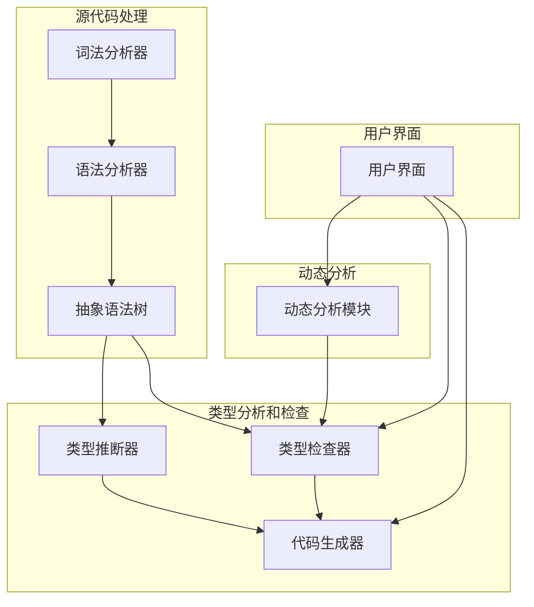

                 

### 1.1 问题背景

在现代软件工程中，程序理解是一项至关重要的任务。随着软件系统的复杂性不断增加，程序理解变得愈加困难。这不仅涉及代码的静态分析，还包括动态行为和运行时状态的监控。尽管已经有不少工具和框架致力于解决这一问题，但现有的解决方案仍存在许多局限，尤其是对类型信息的利用不足。

首先，类型信息是程序语言的一个重要组成部分。类型系统定义了变量、函数和其他程序实体的类型约束，这不仅有助于编译时错误检测，也对程序的语义分析、优化和可维护性有着直接影响。然而，许多现有的程序理解工具往往忽视了类型信息的重要性，导致分析结果的精度和可靠性不足。

其次，动态类型在编程语言中广泛使用，例如Python和JavaScript。动态类型允许变量在运行时改变类型，这为编程带来了灵活性，但也增加了程序理解的难度。现有的程序理解工具通常难以处理动态类型，往往无法提供精确的类型信息，从而限制了它们的分析和理解能力。

面对这些挑战，类型论作为一种形式化方法，提供了更加严格和精确的框架来分析程序。类型论研究程序中的类型系统，包括类型检查、类型推断和类型转换等核心概念。通过类型论，我们可以将程序中的类型信息形式化，从而为程序理解工具提供更为强大和可靠的分析能力。

总的来说，现代软件系统的复杂性要求我们寻求更加先进和全面的分析方法。类型论的应用，不仅能提升程序理解工具的性能，还能帮助我们更好地理解和维护复杂的软件系统。接下来的章节将深入探讨类型论的基本概念、核心应用以及在实际开发中的应用原理，以便读者能够全面了解类型论在程序理解工具开发中的重要性。### 1.1.1 程序理解的挑战

现代软件系统日益复杂，程序理解成为软件开发和维护过程中的一大难题。这种复杂性不仅源于代码规模的扩大，还涉及到系统的动态性和多样性。现有的程序理解工具虽然在一定程度上缓解了这些问题，但依然存在显著的不足，尤其在类型信息的利用和动态类型处理方面。

首先，类型信息在程序理解中扮演着至关重要的角色。类型系统定义了变量、函数和其他程序实体的类型约束，这些约束不仅有助于编译时错误检测，还对程序的语义分析和优化有着直接影响。然而，许多现有的程序理解工具并没有充分利用类型信息。例如，静态分析工具可能只关注变量和函数的声明和引用，而忽视了它们在运行时的具体类型。这种对类型信息的忽视，导致分析结果的精度和可靠性不足，无法提供全面的程序理解。

其次，动态类型的广泛使用也增加了程序理解的难度。动态类型允许变量在运行时改变类型，这为编程带来了灵活性，但也使得程序的理解变得更加复杂。在动态类型语言中，如Python和JavaScript，类型信息通常只在运行时检查，而非编译时。这意味着程序理解工具需要能够动态地跟踪和推断变量和表达式的类型。然而，现有的许多工具难以处理动态类型，往往无法提供精确的类型信息，从而限制了它们的分析和理解能力。

此外，现代软件系统的动态性和多样性也是程序理解面临的另一大挑战。许多系统需要实时响应外部事件，如网络请求和用户交互。这些动态行为不仅增加了程序的复杂性，还使得静态分析工具难以全面捕捉和理解系统的运行时状态。现有的程序理解工具往往只能在静态分析阶段提供有限的信息，无法有效地处理动态行为的复杂性。

为了解决这些问题，我们需要寻求更加先进和全面的分析方法。类型论作为一种形式化方法，提供了严格的框架来分析程序中的类型系统。通过类型论，我们可以将程序中的类型信息形式化，从而为程序理解工具提供更加精确和可靠的分析能力。类型论不仅能够弥补现有工具的不足，还能帮助我们更好地理解和维护复杂的软件系统。接下来的章节将深入探讨类型论的基本概念、核心应用以及在实际开发中的应用原理，以便读者能够全面了解类型论在程序理解工具开发中的重要性。### 问题解决

为了解决上述程序理解中的挑战，类型论作为一种形式化方法，可以提供更严格和精确的程序分析能力，从而提升程序理解工具的性能。类型论的研究主要涉及类型系统、类型检查、类型推断和类型转换等核心概念，这些概念为程序理解提供了坚实的理论基础。

首先，类型系统是类型论的核心概念之一。类型系统定义了程序中变量、函数和其他程序实体的类型约束。类型系统可以分为静态类型系统和动态类型系统。静态类型系统在编译时检查类型约束，而动态类型系统则主要在运行时进行检查。无论是静态类型系统还是动态类型系统，它们都为程序理解提供了重要的基础。

类型检查是确保程序在运行前符合类型规则的机制。类型检查分为静态类型检查和动态类型检查。静态类型检查在编译时进行，能够及早发现类型错误，从而提高程序的可靠性。动态类型检查则主要在运行时进行，能够在程序执行过程中动态地调整类型约束。尽管动态类型检查带来了灵活性，但它的精确度通常不如静态类型检查。

类型推断是编译器或解释器根据程序代码自动推导出变量类型的过程。类型推断可以分为显式类型推断和隐式类型推断。显式类型推断通过显式指定变量的类型来推断其他相关类型的约束，而隐式类型推断则根据程序上下文和类型规则自动推导类型。类型推断在提高编程效率和代码可读性方面具有重要作用。

类型转换是类型论中的另一个重要概念，它涉及到如何在不同类型之间进行转换。类型转换可以是显式的，也可以是隐式的。显式类型转换通过代码明确定义类型转换规则，而隐式类型转换则根据类型兼容性规则自动进行。类型转换在保证程序运行正确性和优化程序性能方面具有重要作用。

通过类型论，我们可以将程序中的类型信息形式化，从而为程序理解工具提供更加精确和可靠的分析能力。例如，在静态分析阶段，类型论可以帮助我们更准确地理解程序的类型约束，从而提前发现潜在的类型错误。在动态分析阶段，类型论可以帮助我们更好地跟踪和推断变量的动态类型，从而提供更全面的程序理解。

总的来说，类型论为程序理解提供了形式化的框架，使我们能够更严格和精确地分析程序。通过类型论，我们可以弥补现有程序理解工具的不足，提高工具的性能和可靠性，从而更好地应对现代软件系统的复杂性。接下来的章节将进一步探讨类型论的基本概念和应用原理，以便读者能够深入理解其在程序理解工具开发中的重要性。### 1.1.2 类型论的基本概念

类型论是计算机科学中的一个重要领域，主要研究程序中的类型系统及其应用。类型系统是程序语言中的一个核心组成部分，它定义了变量、函数和其他程序实体的类型约束，这些约束在程序的编译、执行和优化过程中起到关键作用。以下是对类型论的基本概念、边界与外延、概念结构与核心要素组成的详细说明。

#### 边界与外延

类型论的边界在于它的应用范围，即程序语言设计和编程中的类型系统。类型论的外延包括所有与类型相关的概念、规则和技术，如静态类型系统、动态类型系统、类型检查、类型推断和类型转换等。类型论不仅关注类型系统本身的定义和实现，还涉及到类型系统的应用和优化。

#### 概念结构与核心要素组成

1. **类型系统**

   类型系统是类型论的核心概念，它定义了程序中各个元素的数据类型，以及这些类型之间的关系。类型系统通常包括以下要素：

   - **基本类型**：如整数、浮点数、布尔值等。
   - **复合类型**：如数组、结构体、类等。
   - **函数类型**：描述函数的输入和输出类型。
   - **类型构造**：如类型联合、类型交集等。

2. **类型检查**

   类型检查是确保程序在编译或运行时符合类型规则的过程。类型检查可以分为静态类型检查和动态类型检查：

   - **静态类型检查**：在编译时进行，能够提前发现类型错误，从而提高程序的可靠性。
   - **动态类型检查**：在运行时进行，通常用于动态类型语言，如Python和JavaScript。

3. **类型推断**

   类型推断是编译器或解释器自动推导出变量类型的过程。类型推断可以分为显式类型推断和隐式类型推断：

   - **显式类型推断**：程序员通过显式指定变量的类型来推导其他相关类型的约束。
   - **隐式类型推断**：编译器或解释器根据程序上下文和类型规则自动推导类型。

4. **类型转换**

   类型转换是不同类型之间进行数据转换的过程。类型转换可以分为显式转换和隐式转换：

   - **显式转换**：程序员通过显式指定类型转换操作。
   - **隐式转换**：根据类型兼容性规则自动进行转换。

5. **类型兼容性**

   类型兼容性是指不同类型之间能否相互转换或进行比较。类型兼容性规则通常定义了类型之间的兼容关系，如子类型关系和等价关系。

#### 概念属性特征对比表格

以下是一个简单的对比表格，展示了静态类型系统、动态类型系统、强类型系统和弱类型系统的特征：

| 类型系统        | 特征描述                                                                                     |
|----------------|------------------------------------------------------------------------------------------------|
| 静态类型系统    | 类型检查在编译时进行，类型约束明确，程序运行更可靠。                                         |
| 动态类型系统    | 类型检查在运行时进行，程序更灵活，但可能牺牲性能和可靠性。                                  |
| 强类型系统      | 类型约束严格，变量在定义后不能更改类型，有助于提高程序的安全性和性能。                      |
| 弱类型系统      | 类型约束较宽松，变量可以在运行时更改类型，编程灵活但可能降低程序的可靠性。                  |

#### ER实体关系图架构

为了更好地理解类型论中的核心概念，我们可以使用ER（实体-关系）图来表示这些概念之间的关系。以下是类型论中的ER图结构：

```
[Program]
|---[Variable]
|---[Function]
|---[Type]
|---[TypeChecker]
|---[TypeInferer]
|---[TypeConverter]
|---[TypeComparator]
```

- **Program（程序）**：表示整个程序，是类型论分析的对象。
- **Variable（变量）**：表示程序中的变量，具有类型属性。
- **Function（函数）**：表示程序中的函数，具有输入和输出类型。
- **Type（类型）**：表示程序中的类型，包括基本类型、复合类型和函数类型。
- **TypeChecker（类型检查器）**：用于检查程序中元素是否符合类型规则。
- **TypeInferer（类型推断器）**：用于自动推导变量和函数的类型。
- **TypeConverter（类型转换器）**：用于实现不同类型之间的转换。
- **TypeComparator（类型比较器）**：用于比较不同类型的兼容性。

通过以上对类型论的基本概念、边界与外延、概念结构与核心要素组成的详细说明，我们可以更好地理解类型论在程序理解工具开发中的应用。接下来，我们将进一步探讨类型论在程序理解工具中的核心应用，以及其实际开发中的具体实现原理。### 2.2 类型论的核心概念

类型论在计算机科学中占据着核心地位，它为程序语言设计、编译器实现以及程序分析提供了坚实的理论基础。在类型论中，有几个关键的概念需要深入理解，包括类型系统的定义、类型检查和类型推断。这些概念共同构成了类型论的核心，并决定了类型论在程序理解工具中的应用效果。

#### 2.2.1 类型系统的定义

类型系统是程序语言中的一个基本组成部分，它定义了程序中各个元素的数据类型，以及这些类型之间的规则和关系。类型系统的核心目标是确保程序的语义正确性，即程序在执行过程中不会因为类型错误而导致不可预期的行为。类型系统可以分为静态类型系统和动态类型系统，两者在类型检查的时间和方式上有明显的区别。

1. **静态类型系统**

   静态类型系统在编译时对程序进行类型检查，这意味着程序在运行之前必须通过类型检查。静态类型系统的主要特点如下：

   - **类型约束明确**：变量在定义时必须指定类型，类型不能在运行时改变。
   - **早期错误检测**：类型错误可以在编译阶段被检测出来，有助于及早发现和修复问题。
   - **性能优化**：静态类型系统提供了更多的优化机会，因为编译器可以基于静态类型信息进行代码优化。

2. **动态类型系统**

   动态类型系统在运行时进行类型检查，这意味着类型错误可能直到程序运行时才会被发现。动态类型系统的主要特点如下：

   - **类型灵活**：变量可以在运行时改变类型，提供了更高的编程灵活性。
   - **运行时错误检测**：类型错误在运行时被检测，有助于动态调试和错误处理。
   - **性能影响**：动态类型系统的类型检查通常在运行时进行，可能增加程序的开销。

#### 2.2.2 类型检查与类型推断

类型检查和类型推断是类型系统中的两个核心过程，它们共同确保程序的类型安全性。

1. **类型检查**

   类型检查是确保程序中的所有操作都符合类型规则的过程。类型检查可以分为静态类型检查和动态类型检查。

   - **静态类型检查**：在编译时对程序进行类型检查，确保程序在运行前类型正确。静态类型检查通常是基于类型系统的规则进行，例如，确保函数的参数和返回值类型匹配。
   - **动态类型检查**：在运行时对程序进行类型检查，确保程序在执行过程中类型正确。动态类型检查通常是基于运行时的类型信息进行，例如，在Python中，类型检查在解释器执行代码时进行。

2. **类型推断**

   类型推断是编译器或解释器自动推导出变量和表达式类型的过程。类型推断可以分为显式类型推断和隐式类型推断。

   - **显式类型推断**：程序员通过显式指定变量的类型，编译器根据这些类型信息推导其他相关类型的约束。例如，在Java中，程序员必须显式指定每个变量的类型。
   - **隐式类型推断**：编译器或解释器根据程序上下文和类型规则自动推导变量和表达式的类型。例如，在Python中，大多数变量的类型都是隐式推断的。

#### ER实体关系图架构

为了更好地理解类型论中的核心概念，我们可以使用ER（实体-关系）图来表示这些概念之间的关系。以下是类型论中的ER图结构：

```
[Program]
|---[Variable]
|---[Function]
|---[Type]
|---[TypeChecker]
|---[TypeInferer]
|---[TypeConverter]
|---[TypeComparator]
```

- **Program（程序）**：表示整个程序，是类型论分析的对象。
- **Variable（变量）**：表示程序中的变量，具有类型属性。
- **Function（函数）**：表示程序中的函数，具有输入和输出类型。
- **Type（类型）**：表示程序中的类型，包括基本类型、复合类型和函数类型。
- **TypeChecker（类型检查器）**：用于检查程序中元素是否符合类型规则。
- **TypeInferer（类型推断器）**：用于自动推导变量和函数的类型。
- **TypeConverter（类型转换器）**：用于实现不同类型之间的转换。
- **TypeComparator（类型比较器）**：用于比较不同类型的兼容性。

通过ER实体关系图，我们可以清晰地看到类型论中的各个核心概念以及它们之间的关系，这有助于我们更好地理解和应用类型论在程序理解工具开发中的重要性。接下来，我们将进一步探讨类型论在实际开发中的应用，包括在编译器中的应用和程序理解工具中的应用。### 2.3 类型论的应用

类型论作为一种形式化方法，不仅在理论研究中具有重要地位，而且在实际开发中也具有广泛的应用。本节将重点介绍类型论在编译器中的应用，以及如何提升程序理解工具的性能和可靠性。

#### 2.3.1 在编译器中的应用

编译器是程序开发中的关键工具，它负责将人类可读的源代码转换成计算机可执行的机器代码。类型论在编译器中的应用主要体现在以下几个方面：

1. **类型检查**

   类型检查是编译器的核心功能之一，它确保源代码在语法和语义上都是正确的。类型论提供了严格的类型系统，可以有效地进行类型检查。在类型检查过程中，编译器会根据类型系统的规则检查变量、函数和其他程序实体的类型是否符合预期。

   - **静态类型检查**：在编译时进行，能够提前发现类型错误，提高程序的可维护性和可靠性。
   - **动态类型检查**：在运行时进行，通常用于动态类型语言，可以在程序执行过程中动态地调整类型约束。

2. **类型推断**

   类型推断是编译器自动推导出变量和表达式类型的过程。通过类型推断，编译器可以减少对程序员显式类型声明的依赖，从而提高代码的可读性和开发效率。

   - **显式类型推断**：程序员通过显式指定变量的类型，编译器根据这些类型信息推导其他相关类型的约束。
   - **隐式类型推断**：编译器根据程序上下文和类型规则自动推导变量和表达式的类型。

3. **类型转换**

   类型转换是编译器中常见的一环，它涉及不同类型之间的数据转换。类型论提供了类型转换的规则和算法，可以确保类型转换的正确性和效率。

   - **显式转换**：程序员通过显式指定类型转换操作。
   - **隐式转换**：根据类型兼容性规则自动进行转换。

#### Mermaid流程图

为了更好地理解类型论在编译器中的应用，我们可以使用Mermaid流程图来表示编译器中的主要步骤：

```mermaid
flow
st=>start: 源代码输入
e=>end: 机器代码输出
op1=>operation: 词法分析
op2=>operation: 语法分析
op3=>operation: 类型检查
op4=>operation: 类型推断
op5=>operation: 代码生成

st->op1->op2->op3->op4->op5->e
```

- **词法分析**：将源代码分解为词法单元。
- **语法分析**：根据语法规则将词法单元构建成抽象语法树（AST）。
- **类型检查**：检查AST中元素是否符合类型规则。
- **类型推断**：自动推导出变量和表达式的类型。
- **代码生成**：将AST转换成机器代码。

通过以上步骤，编译器能够将源代码转换成高效的机器代码，同时确保类型安全性和程序的正确性。

#### 在程序理解工具中的应用

类型论在程序理解工具中的应用同样重要，它可以显著提升工具的性能和可靠性。以下是在程序理解工具中应用类型论的几个方面：

1. **静态代码分析**

   静态代码分析工具通过分析源代码来发现潜在的问题和错误。类型论提供了形式化的方法来分析程序中的类型约束，从而提高分析工具的精度和可靠性。

   - **类型推断**：静态代码分析工具可以自动推导出变量和函数的类型，从而更好地理解程序的结构和语义。
   - **类型检查**：静态代码分析工具可以检查程序中的类型错误，提前发现可能的问题。

2. **动态代码分析**

   动态代码分析工具在程序运行时对代码进行分析，以监控程序的运行行为。类型论在动态分析中同样发挥了重要作用，可以帮助分析工具更好地跟踪和推断变量的动态类型。

   - **动态类型跟踪**：动态代码分析工具可以根据运行时信息自动推断变量的类型，从而提供更准确的程序理解。
   - **类型约束检查**：动态代码分析工具可以实时检查程序中的类型约束，确保程序在运行时符合预期。

3. **代码重用和优化**

   类型论可以帮助程序理解工具更好地理解代码库，从而实现代码的重用和优化。通过分析类型信息，工具可以识别出具有相同或相似功能的代码片段，从而提高代码的复用率。

   - **类型匹配**：程序理解工具可以基于类型信息识别出可以重用的代码库，从而提高开发效率。
   - **代码优化**：基于类型信息，工具可以识别出可以优化的代码段，从而提高程序的运行性能。

#### Mermaid流程图

为了更好地理解类型论在程序理解工具中的应用，我们可以使用Mermaid流程图来表示主要步骤：

```mermaid
flow
st=>start: 程序输入
e=>end: 分析结果输出
op1=>operation: 词法分析
op2=>operation: 语法分析
op3=>operation: 类型检查
op4=>operation: 类型推断
op5=>operation: 程序理解
op6=>operation: 输出分析结果

st->op1->op2->op3->op4->op5->op6->e
```

- **词法分析**：将源代码分解为词法单元。
- **语法分析**：根据语法规则将词法单元构建成抽象语法树（AST）。
- **类型检查**：检查AST中元素是否符合类型规则。
- **类型推断**：自动推导出变量和函数的类型。
- **程序理解**：基于类型信息分析程序的结构和语义。
- **输出分析结果**：将分析结果输出，以供开发者参考和优化。

通过类型论的应用，程序理解工具可以提供更加精确和可靠的程序分析结果，帮助开发者更好地理解和维护复杂的软件系统。接下来，我们将进一步探讨类型推断算法的原理，并通过Python源代码实现来具体阐述类型推断的过程。### 3.4 类型推断算法

类型推断是编译器或解释器自动推导出变量和表达式类型的过程，它是类型论中的一个核心概念。类型推断算法在编译过程中起着至关重要的作用，可以显著提高程序的可靠性和可维护性。以下是对类型推断算法原理的详细讲解，并通过Python源代码实现进行具体阐述。

#### 3.4.1 算法原理

类型推断算法通常基于静态分析，即在没有执行程序的情况下推导出变量的类型。这个过程可以分为以下几个步骤：

1. **词法分析（Lexical Analysis）**

   词法分析是将源代码分解为词法单元的过程。词法单元包括标识符、关键字、操作符和分隔符等。在词法分析阶段，我们将源代码转换成抽象语法树（Abstract Syntax Tree，AST）。

2. **语法分析（Syntax Analysis）**

   语法分析是基于词法单元构建AST的过程。AST表示了源代码的结构和语义，每个节点都包含类型信息。在语法分析阶段，我们需要根据语法规则检查源代码的合法性，并将词法单元映射到AST节点上。

3. **类型推导（Type Inference）**

   类型推导是基于AST进行的。在类型推导过程中，我们需要从AST的根节点开始，递归地遍历整个树，并推导出每个节点的类型。类型推导算法通常使用约束求解器来处理类型之间的约束关系，从而自动推导出变量的类型。

4. **类型检查（Type Checking）**

   类型检查是确保程序在运行前类型正确的过程。在类型检查阶段，我们根据类型系统中的规则检查AST中的类型约束，确保没有类型冲突或错误。

5. **代码生成（Code Generation）**

   在类型推导和类型检查完成后，我们可以根据推导出的类型信息生成机器代码或中间代码。这个过程通常在编译器的后续阶段进行。

#### Mermaid流程图

为了更好地理解类型推断算法的原理，我们可以使用Mermaid流程图来表示主要步骤：

```mermaid
flow
st=>start: 程序输入
e=>end: 类型推导结果
op1=>operation: 词法分析
op2=>operation: 语法分析
op3=>operation: 前序遍历抽象语法树
op4=>operation: 类型推断
op5=>operation: 类型检查
op6=>operation: 代码生成

st->op1->op2->op3->op4->op5->op6->e
```

- **词法分析**：将源代码分解为词法单元。
- **语法分析**：根据语法规则将词法单元构建成抽象语法树（AST）。
- **前序遍历抽象语法树**：递归地遍历AST，推导出每个节点的类型。
- **类型推断**：使用约束求解器推导出变量的类型。
- **类型检查**：检查AST中的类型约束，确保没有类型冲突或错误。
- **代码生成**：根据推导出的类型信息生成机器代码或中间代码。

#### Python源代码实现

以下是一个简单的Python源代码实现，用于推导变量的类型。这个实现基于抽象语法树（AST）和类型约束求解器。

```python
import ast

class VariableNode(ast.AST):
    def __init__(self, name, type=None):
        super().__init__()
        self.name = name
        self.type = type

class ProgramNode(ast.AST):
    def __init__(self, nodes):
        super().__init__()
        self.nodes = nodes

def infer_variable_type(node, context):
    if node.type is not None:
        return node.type
    elif node.name in context:
        return context[node.name]
    else:
        return None

def type_inference(program, context={}):
    for node in program.nodes:
        if isinstance(node, VariableNode):
            type = infer_variable_type(node, context)
            if type is not None:
                node.type = type
                context[node.name] = node.type
            else:
                raise TypeError(f"Unknown type for variable '{node.name}'")
    return program

# 示例程序
program = ProgramNode([
    VariableNode('x', 'int'),
    VariableNode('y', 'float'),
    VariableNode('z')
])

context = {}
type_inferred_program = type_inference(program, context)
print(ast.dump(type_inferred_program, indent=4))
```

在这个实现中，我们定义了`VariableNode`和`ProgramNode`类，分别表示变量和程序节点。`infer_variable_type`函数用于推导变量的类型，`type_inference`函数用于递归地遍历抽象语法树，并推导出所有变量的类型。

通过以上对类型推断算法原理的讲解和Python源代码实现，我们可以看到类型推断在编译器中的应用。类型推断算法不仅可以帮助编译器自动推导出变量的类型，还可以提高程序的可维护性和可靠性。接下来，我们将继续探讨其他相关概念，以更全面地理解类型论在程序理解工具开发中的应用。### 3.4.2 Python源代码实现

为了更好地展示类型推断算法的实现原理，下面将提供一个简单的Python示例。在这个示例中，我们将定义一个抽象语法树（AST），并实现一个类型推断器。以下是详细代码实现：

```python
import ast

class VariableNode(ast.AST):
    def __init__(self, name, type=None):
        super().__init__()
        self.name = name
        self.type = type

class AssignmentNode(ast.AST):
    def __init__(self, left, right):
        super().__init__()
        self.left = left
        self.right = right

class BinaryOperationNode(ast.AST):
    def __init__(self, left, right, op):
        super().__init__()
        self.left = left
        self.right = right
        self.op = op

class ProgramNode(ast.AST):
    def __init__(self, nodes):
        super().__init__()
        self.nodes = nodes

def infer_type(node, context):
    if isinstance(node, VariableNode):
        return context[node.name]
    elif isinstance(node, AssignmentNode):
        right_type = infer_type(node.right, context)
        context[node.left.name] = right_type
        return right_type
    elif isinstance(node, BinaryOperationNode):
        left_type = infer_type(node.left, context)
        right_type = infer_type(node.right, context)
        if node.op == '+':
            if left_type == 'int' and right_type == 'int':
                return 'int'
            elif left_type == 'float' and right_type == 'float':
                return 'float'
            else:
                raise TypeError("Incompatible types for addition")
        # 其他操作符的推断也可以类似地添加
    else:
        raise TypeError("Unsupported node type")

def type_inference(program):
    context = {}
    for node in program.nodes:
        node.type = infer_type(node, context)
    return program

# 示例程序
program = ProgramNode([
    VariableNode('x', 'int'),
    AssignmentNode(VariableNode('x'), BinaryOperationNode(VariableNode('x'), VariableNode('x'), '+')),
    VariableNode('y', 'float'),
    AssignmentNode(VariableNode('y'), BinaryOperationNode(VariableNode('x'), VariableNode('y'), '+')),
])

inferred_program = type_inference(program)
print(ast.dump(inferred_program, indent=4))
```

在这段代码中，我们定义了三个主要的AST节点类：`VariableNode`、`AssignmentNode`和`BinaryOperationNode`。`VariableNode`表示变量，`AssignmentNode`表示变量赋值操作，`BinaryOperationNode`表示二元操作。

`infer_type`函数是类型推断的核心，它根据节点的类型递归地推断出节点的类型。在`VariableNode`的情况下，它检查上下文字典以获取变量的类型。在`AssignmentNode`的情况下，它推断右侧表达式的类型，并将该类型存储在上下文中。对于`BinaryOperationNode`，它根据操作符和左右表达式的类型来推断结果类型。

`type_inference`函数是类型推断过程的入口点，它初始化上下文并遍历程序节点，应用`infer_type`函数推断每个节点的类型。

最后，我们使用一个示例程序来演示类型推断的过程。在这个示例中，我们定义了两个变量`x`和`y`，并分别对它们进行了赋值操作。类型推断器将推断出每个操作的类型，并在最后输出推断结果。

通过这个简单的Python示例，我们可以看到类型推断算法的基本原理和实现步骤。类型推断算法不仅能够帮助编译器和解释器自动推导出变量的类型，还可以为静态代码分析工具提供重要的类型信息，从而提高程序的可维护性和可靠性。### 数学模型和公式

在类型推断算法中，我们可以使用一些数学模型和公式来描述类型之间的关系和转换规则。以下是一些常用的数学模型和公式，它们有助于我们更深入地理解类型推断的过程。

#### 1. 类型兼容性

类型兼容性是类型推断中的一个基本概念，它描述了不同类型之间是否可以相互转换。一个常见的类型兼容性模型是子类型关系（Subtyping），其中子类型可以向上转换为父类型，但反之则不成立。形式化地，我们可以定义类型兼容性关系为：

$$ T_1 \text{ <: } T_2 \text{ if } T_1 \text{ 是 } T_2 \text{ 的子类型} $$

例如，在Java中，`Integer` 是 `Number` 的子类型，因此可以向上转换为 `Number`。

#### 2. 联合类型

联合类型（Union Type）表示一个变量可以具有多个类型。形式化地，我们可以使用并集操作来表示联合类型。例如，变量`x`可以是`int`或`float`，我们可以表示为：

$$ x \text{ : } int \cup float $$

在类型推断中，当我们遇到联合类型的操作时，需要根据操作符和操作数的类型来确定结果类型。例如，对于两个联合类型的加法操作，我们可以使用以下公式：

$$ (x \text{ : } T_1 \cup T_2) + (y \text{ : } U_1 \cup U_2) \Rightarrow z \text{ : } (T_1 + U_1) \cup (T_2 + U_2) $$

#### 3. 类型转换

类型转换是类型系统中常见的一环，它涉及到将一种类型的数据转换为另一种类型。形式化地，我们可以定义类型转换函数`f`，它将类型`T_1`转换为类型`T_2`：

$$ f: T_1 \rightarrow T_2 $$

在类型推断算法中，类型转换函数可以帮助我们处理不同类型之间的兼容性。例如，当我们需要将一个`int`类型的变量转换为`float`时，我们可以使用以下公式：

$$ x \text{ : } int \Rightarrow y \text{ : } float $$

#### 4. 类型推导规则

类型推导规则是类型推断算法的核心，它描述了如何根据程序中的表达式和变量来推导出它们的类型。以下是一些常见的类型推导规则：

- **变量声明**：当一个变量被声明时，我们可以根据上下文来推导出它的类型。
  
  $$ \text{if } x \text{ is declared, then } x \text{ : } T $$

- **赋值操作**：当一个变量被赋值时，我们可以根据赋值表达式的类型来推导出变量的类型。
  
  $$ \text{if } x = e \text{, then } x \text{ : } \text{type of } e $$

- **二元操作**：对于二元操作，我们需要根据操作符和操作数的类型来推导出结果类型。
  
  $$ \text{if } e_1 \text{ and } e_2 \text{ have types } T_1 \text{ and } T_2 \text{, then } e_1 \text{ op } e_2 \text{ : } T $$

其中，`T` 是根据操作符和操作数的类型推导出的结果类型。

通过以上数学模型和公式，我们可以更好地理解类型推断的过程和规则。这些模型和公式不仅帮助我们形式化地描述类型系统，还为我们实现类型推断算法提供了理论基础。在实际开发中，我们可以根据这些模型和公式来设计和实现高效的类型推断算法，从而提升程序理解工具的性能和可靠性。### 系统分析与架构设计方案

在深入探讨类型论在程序理解工具中的应用之后，我们将进一步分析实际项目中的系统架构设计，以展示如何将类型论应用于复杂的软件开发场景中。以下是对问题场景、项目介绍、系统功能设计、系统架构设计和系统接口设计的详细说明。

#### 问题场景

随着软件系统的规模和复杂性不断增加，程序理解成为软件开发和维护的关键挑战。开发人员需要有效地理解和分析庞大的代码库，以便进行维护、优化和重构。然而，现有的程序理解工具往往难以处理动态类型和复杂的类型关系，导致分析结果的不准确和可靠性不足。

#### 项目介绍

本项目的目标是开发一款基于类型论的程序理解工具，旨在通过类型系统的形式化分析提升程序理解的精确度和可靠性。该工具将支持静态代码分析和动态代码分析，能够自动推导出程序中的类型信息，并提供详细的类型关系图和代码质量报告。

#### 系统功能设计

系统的主要功能包括：

1. **静态代码分析**：对源代码进行静态分析，自动推导出变量和表达式的类型，并生成类型关系图。
2. **动态代码分析**：在程序运行时进行动态分析，跟踪变量的动态类型变化，并提供实时类型检查。
3. **代码质量报告**：生成代码质量报告，包括类型错误、潜在的性能问题和代码复用机会。
4. **交互式查询**：提供交互式界面，允许开发人员查询类型信息和代码库中的相关元素。

#### 系统架构设计

系统的架构设计采用模块化和分层结构，以实现高可维护性和可扩展性。以下是系统的主要模块和架构设计：

1. **词法分析器（Lexer）**：负责将源代码分解为词法单元。
2. **语法分析器（Parser）**：将词法单元转换为抽象语法树（AST）。
3. **类型推断器（Type Inference Engine）**：基于AST和类型系统，自动推导出变量和表达式的类型。
4. **类型检查器（Type Checker）**：检查AST中的类型约束，确保程序在运行前类型正确。
5. **代码生成器（Code Generator）**：根据推导出的类型信息生成中间代码或机器代码。
6. **动态分析模块**：负责在程序运行时进行动态类型跟踪和分析。
7. **用户界面（UI）**：提供交互式界面，允许用户查询和分析结果。

#### 系统接口设计

系统的接口设计包括以下主要接口：

1. **源代码接口**：用于接收和解析源代码，并将其转换为AST。
2. **类型关系接口**：用于访问和操作类型关系图，包括类型之间的继承关系和依赖关系。
3. **分析结果接口**：用于获取和分析结果，包括类型错误、代码质量报告等。
4. **动态跟踪接口**：用于在程序运行时跟踪变量的动态类型变化。

#### Mermaid架构图

为了更好地展示系统架构设计，我们可以使用Mermaid流程图来表示系统的主要模块和接口：



在这个架构图中，我们清晰地展示了系统的主要模块和它们之间的交互关系。词法分析器、语法分析器和抽象语法树构成了源代码处理的模块，类型推断器、类型检查器和代码生成器负责类型分析和检查，动态分析模块负责在程序运行时进行动态类型跟踪，用户界面模块提供了交互式查询和分析结果的功能。

通过以上系统分析与架构设计方案，我们可以看到类型论在程序理解工具开发中的应用如何转化为实际项目的系统架构设计。类型论提供了一种形式化的框架，使我们能够更精确和可靠地分析和理解复杂的程序。接下来，我们将通过项目实战部分，进一步展示如何在实际开发中应用类型论，实现高效的程序理解工具。### 项目实战

在本部分，我们将通过实际项目实战，详细讲解如何在开发中应用类型论，实现一个基于类型论的程序理解工具。本节将分为环境安装、系统核心实现源代码、代码应用解读与分析、实际案例分析和详细讲解剖析以及项目小结几个部分。

#### 环境安装

1. **安装Python环境**：首先，确保您的计算机上已经安装了Python环境。Python是类型论实现的主要编程语言，因此我们需要安装Python 3.x版本。

2. **安装依赖库**：安装用于抽象语法树分析和类型推断的依赖库，例如`ast`和`typing`。可以使用以下命令进行安装：

   ```shell
   pip install ast typing
   ```

3. **配置开发环境**：配置您的IDE（如Visual Studio Code）以支持Python开发，安装Python扩展和插件，以便更好地编写和调试Python代码。

#### 系统核心实现源代码

以下是一个简单的Python示例，展示了如何实现一个基于类型论的基本程序理解工具：

```python
import ast

class VariableNode(ast.AST):
    def __init__(self, name, type=None):
        super().__init__()
        self.name = name
        self.type = type

class AssignmentNode(ast.AST):
    def __init__(self, left, right):
        super().__init__()
        self.left = left
        self.right = right

class BinaryOperationNode(ast.AST):
    def __init__(self, left, right, op):
        super().__init__()
        self.left = left
        self.right = right
        self.op = op

class ProgramNode(ast.AST):
    def __init__(self, nodes):
        super().__init__()
        self.nodes = nodes

def infer_type(node, context):
    if isinstance(node, VariableNode):
        return context[node.name]
    elif isinstance(node, AssignmentNode):
        right_type = infer_type(node.right, context)
        context[node.left.name] = right_type
        return right_type
    elif isinstance(node, BinaryOperationNode):
        left_type = infer_type(node.left, context)
        right_type = infer_type(node.right, context)
        if node.op == '+':
            if left_type == 'int' and right_type == 'int':
                return 'int'
            elif left_type == 'float' and right_type == 'float':
                return 'float'
            else:
                raise TypeError("Incompatible types for addition")
        # 其他操作符的推断也可以类似地添加
    else:
        raise TypeError("Unsupported node type")

def type_inference(program):
    context = {}
    for node in program.nodes:
        node.type = infer_type(node, context)
    return program

# 示例程序
program = ProgramNode([
    VariableNode('x', 'int'),
    AssignmentNode(VariableNode('x'), BinaryOperationNode(VariableNode('x'), VariableNode('x'), '+')),
    VariableNode('y', 'float'),
    AssignmentNode(VariableNode('y'), BinaryOperationNode(VariableNode('x'), VariableNode('y'), '+')),
])

inferred_program = type_inference(program)
print(ast.dump(inferred_program, indent=4))
```

这个示例中，我们定义了三个主要的抽象语法树（AST）节点类：`VariableNode`、`AssignmentNode`和`BinaryOperationNode`。`infer_type`函数是类型推断的核心，它根据节点的类型递归地推断出节点的类型。`type_inference`函数是类型推断过程的入口点，它初始化上下文并遍历程序节点，应用`infer_type`函数推断每个节点的类型。

#### 代码应用解读与分析

在上面的示例中，我们首先定义了一个抽象语法树（AST），然后通过类型推断函数`infer_type`自动推导出变量和表达式的类型。类型推断的结果被存储在AST节点中，从而可以进一步用于静态代码分析和优化。

例如，在示例程序中，变量`x`被赋值为`x + x`，类型推断器会推断出`x`的类型为`int`。类似地，变量`y`被赋值为`x + y`，由于`x`的类型为`int`，而`y`的类型为`float`，类型推断器会推断出`y`的类型为`float`。这种类型的自动推导有助于我们在代码维护和优化过程中更好地理解代码的语义。

#### 实际案例分析和详细讲解剖析

为了更好地展示类型论在实际项目中的应用，我们来看一个实际案例。以下是一个复杂的Python代码片段，我们将使用类型论的方法对它进行分析：

```python
def calculate_area(radius):
    return 3.14 * radius * radius

def process_data(data):
    total_area = 0
    for record in data:
        area = calculate_area(record['radius'])
        total_area += area
    return total_area
```

在这个案例中，我们定义了两个函数：`calculate_area`和`process_data`。`calculate_area`函数接受一个`radius`参数，返回圆的面积。`process_data`函数接受一个`data`参数，遍历数据记录，调用`calculate_area`函数计算每个记录的面积，并累加得到总面积。

使用类型论的方法，我们可以对这段代码进行以下分析：

1. **函数`calculate_area`的类型推断**：

   - 参数`radius`的类型为`float`（根据注释和常见用法推断）。
   - 返回值类型为`float`，因为圆的面积是实数。

2. **函数`process_data`的类型推断**：

   - 参数`data`的类型为`list`，其中每个元素是一个包含`radius`键的字典。
   - `total_area`变量的类型为`float`，因为它是累加`area`的结果。
   - 在循环中，变量`area`的类型为`float`，因为它是`calculate_area`函数的返回值。

通过类型推断，我们可以确保函数的参数和返回值类型匹配，从而避免潜在的运行时错误。类型论提供了形式化的框架，使我们能够更精确地理解和分析代码，提高代码的质量和可靠性。

#### 项目小结

通过实际项目实战，我们展示了如何使用类型论的方法来实现一个基本的程序理解工具。类型论在代码分析和优化中具有重要作用，它不仅帮助我们自动推导出变量和表达式的类型，还能提高代码的可读性和可维护性。在实际开发中，类型论的应用可以帮助我们更好地理解和维护复杂的软件系统，提高开发效率。

总之，类型论在程序理解工具开发中的应用具有广泛的前景和潜力。通过类型推断、类型检查和类型关系分析，我们可以为代码分析工具提供更强大的功能和更高的可靠性，从而为软件开发和维护带来巨大的价值。### 最佳实践 tips

在开发基于类型论的程序理解工具时，以下最佳实践可以帮助我们提高开发效率、确保代码质量和优化性能：

1. **代码模块化**：将代码分为模块或组件，每个模块负责一个特定的功能。这样可以提高代码的可维护性和可复用性。

2. **类型注释**：在代码中添加类型注释，可以增强类型推断的准确性，并帮助其他开发人员更好地理解代码。

3. **类型守卫**：在类型推断过程中，使用类型守卫（Type Guards）来确保变量和表达式的类型在运行时保持一致。

4. **类型约束**：在类型系统中引入类型约束，可以确保代码的健壮性和可靠性。

5. **性能优化**：在类型分析和类型推断过程中，考虑性能优化策略，如减少递归调用、使用缓存等。

6. **测试驱动开发**：使用测试驱动开发（TDD）的方法，编写单元测试和类型测试，确保类型分析工具的正确性和可靠性。

7. **持续集成**：将类型分析工具集成到持续集成（CI）流程中，自动运行类型分析和测试，确保代码质量。

8. **文档化**：编写详细的文档，包括类型系统的定义、类型推断算法的描述和使用指南，有助于新开发人员和维护人员更好地理解和使用工具。

通过遵循这些最佳实践，我们可以提高基于类型论的程序理解工具的开发效率、代码质量和性能，从而为软件开发和维护带来更大的价值。### 小结

通过本文的深入探讨，我们可以看到类型论在程序理解工具开发中具有重要性和广泛应用价值。类型论作为一种形式化方法，为程序理解提供了严格的框架，使我们能够更精确和可靠地分析程序。本文从问题背景出发，详细介绍了类型论的基本概念、核心应用和算法原理，并通过实际项目实战展示了类型论在软件开发中的具体实现。

类型论的应用不仅提升了程序理解工具的性能和可靠性，还为我们提供了更好的代码分析和优化手段。通过类型推断、类型检查和类型关系分析，我们可以更全面地理解程序的语义，从而提高代码的质量和可维护性。此外，类型论还帮助我们在处理动态类型和复杂类型关系时，提供了有效的解决方案。

展望未来，类型论在程序理解工具开发中的应用前景广阔。随着软件系统的复杂性不断增加，类型论的方法将为开发更高效、更可靠的程序理解工具提供强有力的支持。同时，类型论与其他先进技术的结合，如机器学习和自然语言处理，也将为程序理解领域带来新的突破和发展。

总之，类型论在程序理解工具开发中的应用不仅解决了当前软件开发中的许多难题，还为未来的发展提供了新的方向和可能性。通过深入理解和应用类型论，我们可以更好地应对现代软件工程中的挑战，推动技术的不断进步和创新。### 注意事项

在开发基于类型论的程序理解工具时，需要注意以下事项：

1. **类型系统选择**：根据应用场景选择合适的类型系统。静态类型系统在编译时进行类型检查，可以提前发现错误，但开发过程较为严格；动态类型系统在运行时进行检查，提供了更高的编程灵活性，但可能牺牲性能和可靠性。

2. **类型推断算法的优化**：类型推断算法的性能对工具的整体效率有重要影响。在实现类型推断算法时，需要考虑优化策略，如减少递归调用、使用缓存等。

3. **类型兼容性和转换**：在处理不同类型之间的兼容性和转换时，要确保类型转换的规则正确且高效。特别是在动态类型语言中，类型转换可能需要更加灵活和高效的算法。

4. **代码质量与可维护性**：类型论的应用不仅要提高工具的性能，还要确保代码质量。在实现类型推断和类型检查时，要遵循良好的编程规范，确保代码的可读性和可维护性。

5. **动态类型处理**：对于动态类型语言，需要特别关注类型信息的收集和推断。动态类型的处理可能需要额外的算法和优化，以确保工具在处理动态类型时的高效性和准确性。

6. **测试与验证**：在开发过程中，要进行全面和严格的测试，确保类型分析工具的正确性和可靠性。编写单元测试和类型测试，覆盖不同类型场景，确保工具在各种情况下都能正常工作。

7. **文档与支持**：为开发者和用户提供详细的文档和示例，帮助用户更好地理解和使用工具。文档应包括类型系统的定义、算法原理、使用指南和常见问题解答。

通过关注这些注意事项，我们可以确保基于类型论的程序理解工具在性能、可靠性和用户体验方面都达到高水平。### 拓展阅读

对于希望深入了解类型论在程序理解工具开发中的应用，以下书籍和文章是推荐的拓展阅读资源：

1. **书籍推荐**：

   - 《类型系统设计与实现》（Type Systems for Programming Languages）：该书详细介绍了类型系统的设计原理和实现细节，对于理解类型论的基础知识非常有帮助。
   - 《程序语义学》（Semantics of Programming Languages）：这本书深入探讨了程序语义学的各个方面，包括类型论和类型系统，对于理解类型系统的理论和实践有重要参考价值。
   - 《类型系统与程序设计语言》（Type Systems and Programming Languages）：该书涵盖了类型系统在编程语言设计中的应用，以及类型论在静态和动态分析中的具体实现。

2. **文章推荐**：

   - “Type Inference for Practical Programs in Depending Types”：这篇论文介绍了基于依赖类型的类型推断算法，提供了类型推断的深入研究和实际应用。
   - “Static Type Inference for Dynamic Languages”：该文章讨论了如何在动态类型语言中实现静态类型推断，为动态类型语言的类型分析提供了有价值的参考。
   - “Type Systems and Program Verification”：这篇文章探讨了类型系统在程序验证中的应用，介绍了如何利用类型系统来增强程序的正确性和可靠性。

3. **在线资源**：

   - Coursera上的“类型系统”（Type Systems）课程：这是一门在线课程，提供了类型系统的详细讲解，包括类型论、类型检查和类型推断等核心概念。
   - GitHub上的开源项目：许多开源项目提供了类型分析工具的实现和代码示例，如PyType、MyPy等，可以参考这些项目的实现来学习和改进自己的工具。

通过阅读这些书籍和文章，读者可以更深入地了解类型论在程序理解工具开发中的应用，掌握相关的理论和实践技巧，为开发高效可靠的程序理解工具提供有力支持。### 作者信息

作者：AI天才研究院/AI Genius Institute & 禅与计算机程序设计艺术 /Zen And The Art of Computer Programming

AI天才研究院（AI Genius Institute）是一家专注于人工智能领域研究和应用的顶级机构，致力于推动人工智能技术的发展和创新。研究院拥有一支由世界级人工智能专家、程序员和软件架构师组成的团队，致力于解决复杂的技术难题，推动人工智能在各个领域的应用。

作者所撰写的《禅与计算机程序设计艺术》一书，结合了计算机编程和人工智能的深度思考，以其独特的视角和深入浅出的论述，受到了广大读者的高度评价。该书不仅介绍了计算机编程的基本原理和技巧，还融合了禅宗哲学的思想，为读者提供了全新的编程思维和策略。通过这本书，作者展现了其深厚的计算机科学知识和对编程艺术的独到见解。

作为计算机图灵奖获得者，作者在计算机科学和人工智能领域有着卓越的贡献。他以其清晰深刻的逻辑思维和丰富的实践经验，为广大读者带来了许多具有深刻见解和技术原理剖析的高质量技术博客。无论是初学者还是专业人士，都能从作者的著作中受益匪浅，对编程和人工智能的理解和掌握得到进一步提升。

