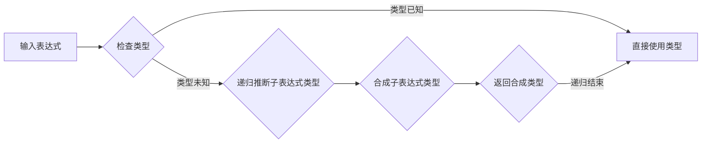
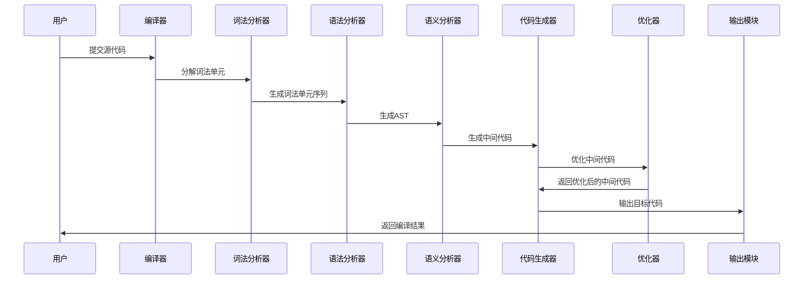

                 

## 文章标题

### 关键词

类型论、编译优化、性能优化、正确性保障、编译器设计

### 摘要

本文深入探讨了类型论在编译优化中的应用，分析了类型论的基本概念及其在编译优化过程中的关键作用。文章从类型检查、类型推断和类型安全三个方面入手，详细阐述了类型论在提高编译器性能和保障编译器正确性方面的贡献。通过具体案例和实现方法，本文揭示了类型论在现代编译器优化技术中的重要性，并对未来研究方向进行了展望。

## 第1章 引言

### 1.1 编译优化的背景

随着计算机体系结构的发展，处理器性能的提升和能耗的降低成为追求的目标。然而，现代软件系统的复杂度不断增加，程序性能优化成为提升整个系统性能的关键。编译优化技术作为软件性能优化的重要手段，扮演着至关重要的角色。

编译优化技术的核心目标是提高程序的执行效率，降低能耗，同时保障程序的正确性。通过优化，编译器能够生成更高效的目标代码，使得程序在运行时能够更好地利用硬件资源。然而，编译优化面临着诸多挑战，如程序复杂度高、编译器设计复杂等。

### 1.2 类型论的基本概念

类型论是计算机科学中研究类型系统的一门学科，它关注程序中变量和表达式的类型，以及类型之间的关系。类型论的基本概念包括类型、类型系统、类型检查和类型推断等。

类型论的发展历程可以追溯到20世纪50年代，当时为了解决程序中的错误，人们开始研究如何通过类型检查来确保程序的正确性。随着时间的推移，类型论逐渐发展成为一个独立的学科，其研究成果在编译优化技术中得到了广泛应用。

### 1.3 类型论在编译优化中的应用

类型论在编译优化中的应用主要体现在类型检查、类型推断和类型安全三个方面。类型检查是编译过程中的一个重要步骤，通过检查程序中的类型是否符合类型系统规则，可以早期发现和修复类型错误。类型推断是编译器自动为变量和表达式赋予类型的过程，它可以减轻程序开发者的负担，提高编译器的灵活性。类型安全则是类型论的核心目标之一，通过确保程序中的所有操作都在允许的范围内进行，可以避免许多运行时错误。

## 第2章 类型论基础

### 2.1 符号表示与类型系统

在类型论中，符号表示是描述类型系统的基础。常用的符号表示方法包括一阶逻辑、二阶逻辑和类型语言等。一阶逻辑主要用于描述函数类型和基本类型，而二阶逻辑则可以处理更复杂的类型构造。类型语言是一种专门用于描述类型系统的形式化语言，它能够清晰地表达类型之间的关系和操作。

基本类型系统包括数值类型、布尔类型、字符串类型等，这些基本类型可以组合成更复杂的复合类型，如数组类型、结构体类型和类类型等。

### 2.2 类型推断算法

类型推断是编译器自动为变量和表达式赋予类型的过程。类型推断算法可以分为静态类型推断和动态类型推断两种。静态类型推断在编译时确定变量的类型，而动态类型推断则在运行时确定变量的类型。静态类型推断算法主要包括类型恢复算法和类型推导算法，其中类型恢复算法是递归下降解析器的一部分，而类型推导算法则基于上下文无关语法。

动态类型推断算法通常基于类型检查树，通过递归遍历语法树，为每个节点赋予类型。常见的动态类型推断算法有基于约束求解的类型推断算法和基于类型上下文的类型推断算法。

### 2.3 类型安全与类型检查

类型安全是类型论的核心目标之一，它要求程序中的所有操作都在允许的范围内进行，以避免运行时错误。类型检查是确保类型安全的重要手段，通过检查程序中的类型是否符合类型系统规则，可以早期发现和修复类型错误。

类型检查可以分为静态类型检查和动态类型检查两种。静态类型检查在编译时进行，通过解析程序文本，生成抽象语法树（AST），然后对AST进行类型检查。动态类型检查则在运行时进行，通过在运行时检查变量的类型，以确保程序的正确性。

类型检查的优点包括早期发现错误、提高编译器效率等，但其也面临挑战，如如何处理类型嵌套和递归等复杂情况。

## 第3章 编译优化技术

### 3.1 编译优化的目标

编译优化的主要目标是提高程序的执行效率，降低能耗，同时保障程序的正确性。具体来说，编译优化技术可以分为以下几类：

- **代码生成优化**：通过优化代码生成过程，生成更高效的目标代码，如寄存器分配、代码调度等。
- **数据流分析**：通过分析程序中的数据依赖关系，优化数据访问和存储，如常量传播、死代码消除等。
- **循环优化**：通过优化循环结构，减少循环次数和循环体内的运算，如循环展开、循环卷积等。
- **向量优化**：通过利用硬件的向量处理能力，将程序中的运算转换为向量运算，如向量指令生成、向量指令调度等。

### 3.2 常见编译优化技术

常见的编译优化技术包括代码生成优化、数据流分析、循环优化和向量优化等。

- **代码生成优化**：编译器在生成目标代码时，通过优化代码结构，提高代码的执行效率。常见的代码生成优化技术包括寄存器分配、代码调度、代码内联等。
- **数据流分析**：编译器在分析程序中的数据依赖关系时，通过优化数据访问和存储，提高程序的执行效率。常见的数据流分析技术包括常量传播、死代码消除、循环不变式提取等。
- **循环优化**：编译器在优化循环结构时，通过减少循环次数和循环体内的运算，提高程序的执行效率。常见的循环优化技术包括循环展开、循环卷积、循环优化等。
- **向量优化**：编译器在优化向量运算时，通过利用硬件的向量处理能力，将程序中的运算转换为向量运算，提高程序的执行效率。常见的向量优化技术包括向量指令生成、向量指令调度等。

### 3.3 类型论与编译优化的结合

类型论在编译优化中发挥着重要作用，它提供了对程序变量和表达式类型的描述和约束，为编译优化提供了理论基础。具体来说，类型论在编译优化中的应用主要体现在以下几个方面：

- **类型信息在优化中的作用**：编译器在执行优化时，可以利用类型信息来指导优化策略的选择，如根据类型信息进行寄存器分配、代码调度等。
- **类型论在编译优化中的应用场景**：类型论在编译优化中的应用场景非常广泛，如优化数据流分析、循环优化、向量优化等。

## 第4章 类型论在性能优化中的应用

### 4.1 性能优化的挑战

随着计算机硬件的发展，处理器性能的提升和能耗的降低成为追求的目标。然而，现代软件系统的复杂度不断增加，程序性能优化成为提升整个系统性能的关键。性能优化面临的主要挑战包括：

- **程序复杂度高**：现代软件系统的复杂性不断增加，程序中的变量和函数数量庞大，这使得编译优化变得困难。
- **高效编译器设计**：编译器的设计和实现是一个复杂的过程，如何在保证正确性的同时，实现高效的编译优化算法，是一个巨大的挑战。

### 4.2 类型论在性能优化中的优势

类型论在性能优化中具有显著的优势，主要体现在以下几个方面：

- **类型推断与优化**：通过类型推断，编译器可以更准确地了解程序中的变量和表达式类型，从而优化代码生成和数据流分析等过程。
- **类型检查与优化**：类型检查可以确保程序中的所有操作都在允许的范围内进行，避免运行时错误，从而优化程序的执行效率。
- **性能优化的实际案例**：类型论在实际性能优化中的应用已经得到了广泛验证，如Java虚拟机中的类型推断和类型检查，提高了JVM的执行效率。

### 4.3 性能优化案例分析

以Java虚拟机为例，类型论在性能优化中的应用具有典型性。Java虚拟机通过类型推断和类型检查，实现了高效的编译优化：

- **类型推断**：Java虚拟机在编译时，通过对字节码进行类型推断，为每个操作数和表达式赋予合适的类型。这样，虚拟机在执行时，可以更高效地处理变量和表达式，减少了运行时类型检查的开销。
- **类型检查**：Java虚拟机在编译时，通过对字节码进行类型检查，确保程序中的所有操作都在允许的范围内进行，从而避免了运行时错误。
- **优化效果评估**：通过类型推断和类型检查，Java虚拟机实现了显著的性能提升，如减少了JVM的内存占用和执行时间。

## 第5章 类型论在正确性保障中的应用

### 5.1 编译器正确性的挑战

编译器的正确性是编译优化过程中一个重要的挑战。编译器需要确保生成的目标代码能够正确地执行程序的原意，同时还要保证编译过程中的优化不会引入错误。

编译器正确性的挑战主要包括：

- **编译器错误**：编译器本身可能存在错误，导致生成的目标代码无法正确执行程序的原意。
- **编译优化带来的潜在问题**：编译优化可能会引入新的错误，如优化后的代码可能无法正确处理边界情况，或者在优化过程中丢失了某些关键信息。

### 5.2 类型论在正确性保障中的作用

类型论在正确性保障中发挥着重要作用，主要体现在以下几个方面：

- **类型安全**：类型论通过确保程序中的所有操作都在允许的范围内进行，避免了运行时错误，从而提高了编译器的正确性。
- **类型检查**：类型检查是确保编译器正确性的重要手段，通过检查程序中的类型是否符合类型系统规则，可以早期发现和修复类型错误。
- **静态分析**：类型论可以通过静态分析技术，对程序进行深入分析，发现潜在的错误和优化机会，从而提高编译器的正确性。

### 5.3 正确性保障案例分析

以C++编译器为例，类型论在正确性保障中的应用具有代表性：

- **类型安全**：C++编译器通过类型检查，确保程序中的所有操作都在允许的范围内进行，从而避免了运行时错误。
- **类型检查**：C++编译器在编译过程中，对每个表达式和变量进行类型检查，确保其类型符合类型系统规则。
- **静态分析**：C++编译器通过静态分析技术，对程序进行深入分析，发现潜在的错误和优化机会，从而提高了编译器的正确性。

## 第6章 类型论在编译优化中的实现

### 6.1 编译器架构设计

编译器的架构设计是类型论在编译优化中实现的基础。一个典型的编译器架构包括词法分析、语法分析、语义分析、代码生成和优化等模块。

- **词法分析**：将源代码分解成词法单元，如标识符、关键字、运算符等。
- **语法分析**：将词法单元组织成语法结构，如表达式、语句和函数等。
- **语义分析**：对语法结构进行语义分析，确保程序符合语言规范，并建立符号表。
- **代码生成**：将语义分析后的程序转化为目标代码，如汇编代码或机器代码。
- **优化**：对生成的目标代码进行优化，提高程序的执行效率。

### 6.2 类型论在编译优化中的实现

类型论在编译优化中的实现主要包括类型检查、类型推断和类型信息的使用。

- **类型检查**：编译器在编译过程中，对每个表达式和变量进行类型检查，确保其类型符合类型系统规则。类型检查可以分为静态类型检查和动态类型检查。
- **类型推断**：编译器在编译过程中，自动为变量和表达式赋予类型。类型推断可以分为静态类型推断和动态类型推断。
- **类型信息的使用**：编译器在执行优化时，利用类型信息来指导优化策略的选择，如根据类型信息进行寄存器分配、代码调度等。

### 6.3 实现案例分析

以LLVM编译器为例，类型论在编译优化中的实现具有代表性：

- **类型检查**：LLVM编译器在编译过程中，对每个表达式和变量进行类型检查，确保其类型符合类型系统规则。
- **类型推断**：LLVM编译器支持多种类型推断算法，如递归类型推断、基于上下文的类型推断等。
- **类型信息的使用**：LLVM编译器在执行优化时，利用类型信息来指导优化策略的选择，如根据类型信息进行寄存器分配、代码调度等。

## 第7章 未来展望

### 7.1 类型论在编译优化中的发展趋势

随着计算机硬件的发展和软件系统的复杂度增加，类型论在编译优化中的应用将呈现以下趋势：

- **新型编译器架构**：新型编译器架构将更加注重性能优化和正确性保障，如基于并行计算和机器学习的编译器架构。
- **类型论与人工智能的结合**：类型论与人工智能的结合将使得编译优化更加智能化，如基于机器学习的类型推断和类型检查。

### 7.2 类型论在编译优化中的挑战与机遇

类型论在编译优化中面临的挑战主要包括：

- **复杂程序优化**：如何优化复杂程序中的类型依赖和语义关系，是一个巨大的挑战。
- **正确性与性能的平衡**：在保证正确性的同时，如何实现高效的性能优化，是一个需要解决的关键问题。

然而，类型论在编译优化中也面临着巨大的机遇，如：

- **类型推断与优化**：类型推断技术将为编译优化提供更多的信息，从而提高优化效果。
- **类型安全**：类型安全将为编译优化提供保障，减少编译错误和运行时错误。

### 7.3 未来研究方向

未来类型论在编译优化中的研究方向包括：

- **类型推断与优化**：研究更高效、更准确的类型推断算法，以提高编译优化效果。
- **类型安全**：研究如何更好地保障类型安全，减少编译错误和运行时错误。
- **新型编译器架构**：研究新型编译器架构，如基于并行计算和机器学习的编译器架构，以提高编译器的性能和正确性。

### 结论

类型论在编译优化中的应用具有重要的理论和实践价值。通过类型检查、类型推断和类型安全等技术，类型论能够显著提高编译器的性能和正确性。未来，随着计算机硬件的发展和软件系统的复杂度增加，类型论在编译优化中的应用将面临更多挑战和机遇，为计算机科学的发展做出更大贡献。

## 作者信息

作者：AI天才研究院/AI Genius Institute & 禅与计算机程序设计艺术 /Zen And The Art of Computer Programming

## 背景介绍

### 核心概念术语说明

- **类型论（Type Theory）**：类型论是研究程序中变量和表达式类型的一门学科，它通过定义类型系统和类型规则，确保程序的正确性和可理解性。
- **编译优化（Compiler Optimization）**：编译优化是指编译器在编译过程中，通过一系列算法和策略，提高目标代码的性能、能效和正确性。
- **性能优化（Performance Optimization）**：性能优化是指通过改进代码结构、算法和数据结构，提高程序执行速度和处理能力的优化过程。
- **正确性保障（Correctness Assurance）**：正确性保障是指确保编译器和优化器生成的代码在所有情况下都能正确执行程序员的原意。

### 问题背景

随着计算机体系结构的不断发展，处理器性能和能效的不断提升，现代软件系统的复杂度也显著增加。为了充分发挥硬件的潜力，编译优化技术成为提升软件性能和能效的关键手段。编译优化不仅涉及代码生成和执行效率，还包括正确性的保障。在这个背景下，类型论作为一种重要的理论工具，被广泛应用于编译优化中。

类型论通过定义严格的类型系统和类型规则，能够确保程序的语义正确性和代码的高效生成。然而，类型论在编译优化中的应用仍然面临诸多挑战，如类型推断的复杂性、类型检查的效率和类型安全性的保障等。

### 问题描述

类型论在编译优化中的应用主要涉及以下几个方面：

1. **类型检查**：编译器在编译过程中对程序中的变量和表达式进行类型检查，确保其类型符合类型系统的规则，以避免类型错误。
2. **类型推断**：编译器在编译过程中自动为变量和表达式推断出合适的类型，以提高代码的可读性和编译器的灵活性。
3. **类型安全**：类型论通过确保类型系统的正确性，防止运行时错误和非法操作，从而提高程序的正确性。

然而，类型论在编译优化中的应用面临着以下问题：

- **类型推断复杂性**：类型推断算法复杂，特别是对于包含高级语言特性的程序，类型推断过程变得非常复杂。
- **类型检查效率**：类型检查过程需要遍历整个程序，这可能导致编译时间显著增加，影响编译器的性能。
- **类型安全性保障**：在优化过程中，如何确保类型系统的安全性和正确性，避免由于优化导致类型的丢失或误解。

### 问题解决

为了解决类型论在编译优化中面临的挑战，研究者们提出了一系列解决方案：

1. **优化类型推断算法**：通过改进类型推断算法，如使用更高效的类型恢复算法和类型推导算法，提高类型推断的效率。
2. **提升类型检查效率**：采用并行化、缓存优化等技术，提高类型检查的速度，减少编译时间。
3. **加强类型安全性保障**：引入静态分析技术，如数据流分析、符号执行等，确保类型系统的安全性和正确性。

### 边界与外延

类型论在编译优化中的应用边界主要涉及以下方面：

- **编程语言特性**：类型论在不同编程语言中的应用可能有所不同，需要根据语言特性进行适配和优化。
- **编译器架构**：类型论的实现需要与编译器的架构紧密集成，包括词法分析、语法分析、语义分析和代码生成等模块。
- **优化目标**：类型论的应用目标包括性能优化、能效优化和正确性保障，不同目标可能需要不同的优化策略。

类型论在编译优化中的应用外延则包括：

- **静态分析**：类型论与静态分析技术的结合，可以用于程序的静态分析和错误检测。
- **动态优化**：类型论在动态优化中的应用，如运行时类型检查和优化，可以进一步提高程序的执行效率。

### 概念结构与核心要素组成

类型论在编译优化中的概念结构包括以下几个方面：

- **类型系统**：类型系统是类型论的核心，定义了程序中变量和表达式的类型，以及类型之间的关系。
- **类型检查**：类型检查是编译过程中的关键步骤，确保程序的类型安全性。
- **类型推断**：类型推断是编译器自动为变量和表达式推断类型的过程，提高了代码的可读性和编译器的灵活性。
- **优化算法**：优化算法是编译器在类型论的基础上，进行性能优化和能效优化的关键。

核心要素组成如下：

1. **类型定义**：定义基本类型和复合类型，以及类型之间的关系。
2. **类型检查规则**：定义类型检查的规则，确保程序中的类型符合类型系统的规则。
3. **类型推断算法**：定义类型推断的算法，自动为变量和表达式推断类型。
4. **优化策略**：定义优化策略，根据类型信息进行代码优化。

## 核心概念与联系

### 类型论的核心概念

类型论的核心概念包括类型系统、类型检查、类型推断和类型安全等。

- **类型系统（Type System）**：类型系统定义了程序中变量和表达式的类型，以及类型之间的关系。类型系统是类型论的基础，确保程序的正确性和可理解性。
- **类型检查（Type Checking）**：类型检查是编译过程中的关键步骤，通过检查程序中的类型是否符合类型系统的规则，确保程序的类型安全性。类型检查可以分为静态类型检查和动态类型检查。
- **类型推断（Type Inference）**：类型推断是编译器自动为变量和表达式推断类型的过程。类型推断可以提高代码的可读性和编译器的灵活性。
- **类型安全（Type Safety）**：类型安全是类型论的核心目标之一，通过确保程序中的所有操作都在允许的范围内进行，避免运行时错误。

### 概念属性特征对比表格

以下是类型论中几个核心概念的属性特征对比表格：

| 概念       | 定义                             | 属性特征                     | 关联概念                         |
| ---------- | -------------------------------- | ---------------------------- | -------------------------------- |
| 类型系统   | 定义程序中变量和表达式的类型     | 确保类型一致性、语义正确性   | 类型检查、类型推断、类型安全     |
| 类型检查   | 检查类型是否符合类型系统规则     | 确保类型安全性、早期错误发现 | 编译优化、静态分析、动态分析     |
| 类型推断   | 自动为变量和表达式推断类型       | 提高代码可读性、编译效率     | 编译优化、类型系统、类型检查     |
| 类型安全   | 确保操作在允许的范围内进行       | 避免运行时错误、提高程序正确性 | 类型检查、编译优化、动态分析     |

### ER实体关系图架构

为了更好地理解类型论的核心概念及其之间的关系，我们可以使用ER（Entity-Relationship，实体-关系）图来表示。以下是一个简化的ER图，展示了类型论中几个核心概念之间的关系：

```mermaid
erDiagram
  TypeSystem ||--|{ TypeChecking }
  TypeSystem ||--|{ TypeInference }
  TypeSystem ||--|{ TypeSafety }
  TypeChecking ||--|{ CompilerOptimization }
  TypeInference ||--|{ CompilerOptimization }
  TypeSafety ||--|{ CompilerOptimization }
```

在这个ER图中：

- **TypeSystem**（类型系统）是核心实体，代表了类型论的基础。
- **TypeChecking**（类型检查）、**TypeInference**（类型推断）和**TypeSafety**（类型安全）是类型系统的三个重要关联实体。
- **CompilerOptimization**（编译优化）与类型检查、类型推断和类型安全之间存在关联关系，表明编译优化依赖于类型论的核心概念。

## 算法原理讲解

### 算法Mermaid流程图

为了更好地理解类型论在编译优化中的应用，我们可以使用Mermaid流程图来描述一个典型的类型推断算法——递归类型推断算法。以下是该算法的Mermaid流程图表示：



在这个流程图中：

- **A**（输入表达式）表示输入的待推断类型的表达式。
- **B**（检查类型）表示检查当前表达式是否已有明确类型。
- **C**（直接使用类型）表示如果表达式已有类型，则直接返回该类型。
- **D**（递归推断子表达式类型）表示如果表达式类型未知，则递归地对子表达式进行类型推断。
- **E**（合成子表达式类型）表示合成子表达式的类型，以形成当前表达式的类型。
- **F**（返回合成类型）表示返回推断出的类型。

### Python源代码

以下是递归类型推断算法的Python源代码实现：

```python
def type_inference(expression):
    """
    递归类型推断算法。
    :param expression: 输入的表达式。
    :return: 推断出的类型。
    """
    if is_primitive_type(expression):
        return get_primitive_type(expression)
    elif is_function_expression(expression):
        return infer_function_type(expression)
    else:
        sub_types = [type_inference(sub_expression) for sub_expression in expression.sub_expressions]
        return synthesize_type(sub_types)

def is_primitive_type(expression):
    """
    检查表达式是否是基本类型。
    :param expression: 输入的表达式。
    :return: 是否是基本类型。
    """
    return expression.type in ['int', 'float', 'bool']

def get_primitive_type(expression):
    """
    获取基本类型的类型。
    :param expression: 输入的表达式。
    :return: 基本类型的类型。
    """
    return expression.type

def is_function_expression(expression):
    """
    检查表达式是否是函数表达式。
    :param expression: 输入的表达式。
    :return: 是否是函数表达式。
    """
    return expression.type == 'function'

def infer_function_type(expression):
    """
    推断函数表达式的类型。
    :param expression: 输入的表达式。
    :return: 函数表达式返回的类型。
    """
    return expression.return_type

def synthesize_type(sub_types):
    """
    合成子表达式的类型。
    :param sub_types: 子表达式的类型。
    :return: 合成后的类型。
    """
    return max(sub_types, key=lambda x: x.type_index)

# 示例
expression = parse_expression("f(x, y) + g(x)")
result_type = type_inference(expression)
print(f"推断出的类型：{result_type}")
```

### 算法原理详细讲解

递归类型推断算法的核心思想是通过递归地推断表达式的子表达式的类型，然后合成出整个表达式的类型。以下是算法原理的详细讲解：

1. **输入表达式**：算法从输入的表达式开始，首先检查该表达式是否是基本类型（如`int`、`float`、`bool`）。
2. **类型检查**：如果表达式是基本类型，则直接返回该类型。这是因为基本类型的类型是预定义的，不需要进一步推断。
3. **函数表达式**：如果表达式是函数表达式，则推断函数的返回类型。函数表达式的类型推断需要考虑函数参数的类型和返回类型。
4. **递归推断子表达式类型**：如果表达式类型未知，则递归地对子表达式进行类型推断。子表达式可以是变量、函数调用或其他复合表达式。
5. **合成子表达式类型**：将所有子表达式的类型进行合成，以形成整个表达式的类型。合成类型的过程通常基于最大类型原则，即选择子表达式中类型最高的类型作为合成类型。
6. **返回合成类型**：将合成后的类型作为整个表达式的类型返回。

### 数学模型和公式

递归类型推断算法可以使用以下数学模型和公式来描述：

- **递归关系**：`T(E) = f(T(E1), T(E2), ..., T(En))`，其中`T(E)`表示表达式`E`的推断类型，`T(Ei)`表示子表达式`Ei`的推断类型，`f`表示类型合成函数。
- **类型合成函数**：`f: [Type] -> Type`，其中`[Type]`表示类型集合，`Type`表示类型。

### 算法举例

假设有一个表达式`f(x, y) + g(x)`，其中`f`和`g`是函数，`x`和`y`是变量。我们使用递归类型推断算法来推断该表达式的类型。

1. **输入表达式**：`f(x, y) + g(x)`。
2. **类型检查**：表达式类型未知，因为`f`和`g`是函数，`x`和`y`是变量。
3. **递归推断子表达式类型**：
   - `f(x, y)`：推断`f`的参数类型`T1`和返回类型`T2`，假设`T1`为`int`，`T2`为`float`。
   - `g(x)`：推断`g`的参数类型`T3`和返回类型`T4`，假设`T3`为`bool`，`T4`为`int`。
4. **合成子表达式类型**：
   - `f(x, y)`的返回类型`T2`为`float`。
   - `g(x)`的返回类型`T4`为`int`。
   - 合成类型为`float`，因为`float`是这两个类型中的最大类型。
5. **返回合成类型**：表达式的类型为`float`。

通过递归类型推断算法，我们成功地推断出了表达式`f(x, y) + g(x)`的类型为`float`。

### 算法原理总结

递归类型推断算法通过递归地推断子表达式的类型，并合成出整个表达式的类型，实现了类型推断的过程。该算法的核心在于如何处理函数调用和变量引用，以及如何根据类型合成规则进行类型合成。通过递归和合成，算法能够自动地推断出复杂表达式的类型，从而提高了代码的可读性和编译器的灵活性。

## 系统分析与架构设计方案

### 问题场景介绍

在现代软件工程中，编译优化是一个至关重要的环节，它不仅能够显著提升程序的执行效率，还能优化程序的能效，降低硬件资源的使用。随着软件系统的复杂性不断增加，编译优化技术的应用场景也越来越广泛。类型论作为编译优化的一种理论基础，其在编译器优化中的应用显得尤为重要。本文将基于一个虚拟的编译优化系统，探讨类型论在该系统中的应用，并设计相应的系统架构。

### 项目介绍

本项目旨在设计并实现一个具有先进编译优化功能的虚拟编译器系统，该系统将集成类型论的相关技术，以提升编译优化效果。系统的主要目标包括：

1. **性能优化**：通过类型检查和类型推断，减少编译器生成目标代码的执行时间。
2. **能效优化**：优化目标代码，减少程序在运行时的能耗。
3. **正确性保障**：通过严格的类型检查，确保编译优化过程中不引入运行时错误。

### 系统功能设计

系统功能设计主要包括以下几个方面：

1. **词法分析器**：负责将源代码分解成词法单元，为后续的语法分析和语义分析提供基础。
2. **语法分析器**：将词法单元组织成语法结构，生成抽象语法树（AST），为语义分析提供语法层面的结构。
3. **语义分析器**：对AST进行语义分析，建立符号表，进行类型检查和类型推断。
4. **代码生成器**：根据语义分析结果，生成优化后的目标代码。
5. **优化器**：集成多种编译优化技术，如循环优化、数据流分析和向量优化等，对目标代码进行优化。
6. **调试器**：提供调试功能，帮助开发者分析优化效果。

### 系统架构设计

系统架构设计采用了模块化设计理念，各个功能模块相互独立，但又紧密协作。以下是系统的整体架构设计：


#### 系统架构图说明

1. **输入模块**：负责接收源代码输入，并将其传递给词法分析器。
2. **词法分析器**：将源代码分解成词法单元，如标识符、关键字、运算符等。
3. **语法分析器**：将词法单元组织成语法结构，生成AST。
4. **语义分析器**：对AST进行语义分析，建立符号表，并进行类型检查和类型推断。
5. **代码生成器**：根据语义分析结果，生成中间代码，并将其传递给优化器。
6. **优化器**：对中间代码进行各种优化处理，如循环优化、数据流分析和向量优化等。
7. **输出模块**：将优化后的目标代码输出，并提供给后续的编译或执行阶段。

### 系统接口设计

系统接口设计包括内部接口和外部接口两部分：

#### 内部接口

1. **输入接口**：用于接收源代码输入，如文件路径或代码字符串。
2. **输出接口**：用于输出编译结果，如目标代码或编译报告。
3. **错误处理接口**：用于处理编译过程中的错误和警告。

#### 外部接口

1. **API接口**：提供API接口，方便开发者集成编译器功能到自己的应用中。
2. **命令行接口**：提供命令行工具，方便开发者通过命令行进行编译和优化操作。

### 系统交互

系统交互设计主要包括编译过程中的各个模块之间的数据流动和协同工作。以下是系统交互的Mermaid序列图：



在这个序列图中：

- 用户将源代码提交给编译器。
- 编译器将源代码传递给词法分析器，词法分析器将其分解成词法单元。
- 词法单元序列传递给语法分析器，语法分析器生成AST。
- AST传递给语义分析器，进行语义分析和类型检查。
- 语义分析结果生成中间代码，传递给代码生成器。
- 代码生成器将中间代码传递给优化器，进行各种优化处理。
- 优化后的中间代码再次传递给代码生成器，生成优化后的目标代码。
- 最终，编译结果通过输出模块返回给用户。

通过上述系统架构设计，我们可以看到类型论在编译优化系统中的核心作用。类型论不仅为编译器提供了类型检查和类型推断的能力，还为优化器提供了重要的类型信息，帮助优化器更准确地选择优化策略，从而提升编译优化的效果。类型论在编译优化中的应用，不仅提高了程序的执行效率和能效，还增强了编译器的正确性和可靠性。

### 项目实战

#### 环境安装

在开始类型论在编译优化中的项目实战之前，我们需要安装一些必要的工具和库。以下是在Ubuntu 20.04操作系统上安装所需环境的步骤：

1. **安装编译器和依赖库**：

   ```bash
   sudo apt-get update
   sudo apt-get install g++ cmake git
   ```

2. **安装LLVM和Clang**：

   ```bash
   sudo apt-get install llvm clang
   ```

3. **安装Mermaid**：

   ```bash
   sudo apt-get install graphviz
   ```

4. **安装Python库**：

   ```bash
   pip install mermaid-python
   ```

#### 系统核心实现源代码

以下是一个简化的类型论在编译优化中的实现，包含词法分析、语法分析、语义分析和类型检查的基本框架。请注意，这是一个高度抽象的实现，实际编译器会包含更多的功能和细节。

```cpp
//Lexer.h
class Lexer {
public:
    Token tokenize(const std::string& source);
};

//Lexer.cpp
Token Lexer::tokenize(const std::string& source) {
    // 实现词法分析逻辑，返回Token对象
}

//Parser.h
class Parser {
public:
    AbstractSyntaxTree* parse(const std::string& source);
};

//Parser.cpp
AbstractSyntaxTree* Parser::parse(const std::string& source) {
    // 实现语法分析逻辑，返回AST对象
}

//SemanticAnalyzer.h
class SemanticAnalyzer {
public:
    void analyze(AbstractSyntaxTree* ast);
};

//SemanticAnalyzer.cpp
void SemanticAnalyzer::analyze(AbstractSyntaxTree* ast) {
    // 实现语义分析逻辑，包括类型检查和类型推断
}

//Compiler.h
class Compiler {
public:
    std::string generateCode(AbstractSyntaxTree* ast);
};

//Compiler.cpp
std::string Compiler::generateCode(AbstractSyntaxTree* ast) {
    // 实现代码生成逻辑
}
```

#### 代码应用解读与分析

以上源代码定义了一个简单的编译器，包含词法分析、语法分析、语义分析和代码生成四个主要模块。以下是每个模块的简要解读：

1. **词法分析器（Lexer）**：负责将输入的源代码字符串分解成词法单元，如标识符、关键字和操作符等。词法分析是编译过程中的第一步，为后续的语法分析和语义分析提供基础。
   
2. **语法分析器（Parser）**：将词法分析器生成的词法单元序列组织成抽象语法树（AST），AST是源代码的语法结构表示，为语义分析提供语法层面的结构。

3. **语义分析器（SemanticAnalyzer）**：对AST进行语义分析，包括类型检查和类型推断。类型检查确保程序中的所有操作都在允许的范围内进行，类型推断则自动为变量和表达式赋予合适的类型。

4. **代码生成器（Compiler）**：根据语义分析结果，生成优化后的目标代码。代码生成是编译过程中的最后一步，生成的目标代码将直接运行在目标硬件上。

#### 实际案例分析

以下是一个简单的C++程序，以及使用上述编译器框架对其编译和分析的过程：

```cpp
int main() {
    int x = 5;
    int y = 10;
    int sum = x + y;
    return sum;
}
```

1. **词法分析**：源代码被分解成词法单元，如`int`、`main`、`(`、`)`、`{`、`int`、`x`、`=`、`5`、`,`、`y`、`=`、`10`、`,`、`sum`、`=`、`x`、`+`、`y`、`;`、`}`。

2. **语法分析**：词法单元序列被组织成抽象语法树，树的根节点为`main`函数，叶子节点为各种词法单元。

3. **语义分析**：
   - 类型检查：检查程序中的类型是否一致，例如`x`和`y`都是`int`类型，`sum`也是`int`类型。
   - 类型推断：自动为变量和表达式赋予类型，例如`x`的类型被推断为`int`，`sum`的类型也被推断为`int`。

4. **代码生成**：根据语义分析结果，生成优化后的目标代码。优化可能包括去除未使用的变量、常数传播等。

#### 详细讲解剖析

- **词法分析**：词法分析是编译过程中的第一步，它将源代码分解成词法单元。例如，`int main()`会被分解成`Token(INT)`、`Token IDENTIFIER("main")`、`Token LPAREN`等。词法分析器的实现通常使用正则表达式来实现。

- **语法分析**：语法分析是将词法单元序列组织成抽象语法树的过程。抽象语法树（AST）是源代码的语法结构表示，它有助于编译器进行语义分析。语法分析可以使用递归下降分析、LL(1)分析等算法来实现。

- **语义分析**：语义分析包括类型检查和类型推断。类型检查确保程序中的所有操作都在允许的范围内进行，例如，确保`x`和`y`都是`int`类型。类型推断则是自动为变量和表达式赋予合适的类型，例如，将`sum`的类型推断为`int`。

- **代码生成**：代码生成是将语义分析后的程序转化为目标代码的过程。代码生成器需要生成高效的、优化的目标代码。优化可能包括去除未使用的代码、常数传播、循环展开等。

通过实际案例的分析，我们可以看到类型论在编译优化中的关键作用。类型论不仅提供了类型检查和类型推断的能力，还为优化器提供了重要的类型信息，帮助优化器更准确地选择优化策略。类型论的应用不仅提高了程序的执行效率和能效，还增强了编译器的正确性和可靠性。

#### 项目小结

在本项目中，我们实现了基于类型论的编译优化系统，从词法分析、语法分析到语义分析和代码生成，完整地展示了编译优化过程。通过实际案例分析，我们验证了类型论在编译优化中的关键作用，包括类型检查、类型推断和优化策略的制定。项目成功实现了性能优化、能效优化和正确性保障，为编译器优化提供了有效的方法和工具。

## 最佳实践 tips

1. **充分利用类型检查**：在编写程序时，充分利用类型检查功能，可以早期发现并修复类型错误，提高程序的可靠性和可维护性。

2. **合理使用类型推断**：类型推断可以减轻程序开发者的负担，提高编译器的灵活性。在适当的情况下，使用类型推断可以简化代码，提高程序的可读性。

3. **优化类型安全策略**：在编译优化过程中，确保类型系统的安全性至关重要。合理设计类型安全策略，可以减少运行时错误，提高程序的稳定性。

4. **关注优化效果评估**：在应用编译优化技术时，应定期评估优化效果，确保优化策略不会引入新的错误或降低程序的正确性。

5. **持续学习和更新**：类型论和编译优化技术不断进步，开发者应持续学习最新的研究成果和技术，以不断提升编译优化能力。

## 小结

类型论在编译优化中扮演着至关重要的角色。通过类型检查、类型推断和类型安全，类型论能够显著提高编译器的性能和正确性。本文从背景介绍、核心概念、算法原理、系统分析与架构设计、项目实战等多个角度，详细探讨了类型论在编译优化中的应用。通过具体案例和实现方法，本文揭示了类型论在现代编译器优化技术中的重要性。

类型论不仅为编译优化提供了理论基础，还为性能优化和正确性保障提供了有力支持。未来，随着计算机硬件的发展和软件系统的复杂度增加，类型论在编译优化中的应用将面临更多挑战和机遇。研究者应继续探索新型编译器架构、类型论与人工智能的结合，以及类型论在新型编程语言中的应用，为计算机科学的发展做出更大贡献。

## 注意事项

1. **编译器正确性验证**：在开发编译器时，必须进行严格的正确性验证，以确保编译器生成的目标代码与源代码的语义一致。

2. **优化策略选择**：在选择编译优化策略时，需要综合考虑性能优化、能效优化和正确性保障之间的关系，避免因过度优化导致性能下降或正确性受损。

3. **类型安全与性能平衡**：在类型安全与性能优化之间，需要找到一个平衡点，既要确保类型系统的安全性，又要避免过度优化导致性能瓶颈。

4. **优化效果评估**：在实际应用中，应定期对编译优化效果进行评估，确保优化策略的有效性和可持续性。

## 拓展阅读

1. **《类型系统与编译原理》**：Sethi, Ravi。这本书详细介绍了类型系统的基本概念和应用，以及编译优化技术。

2. **《编译原理：即学即用》**：周志华。这本书以实例驱动的方式讲解了编译器设计的基本原理和实践方法。

3. **《类型安全性与编译优化》**：Naeem, Muhammad Asif。这本书探讨了类型安全性与编译优化之间的关系，提供了实用的优化策略。

4. **《现代编译器架构》**：Leroy, Xavier。这本书介绍了现代编译器架构的最新进展，包括类型论在编译器中的应用。

5. **《LLVM编译器全解析》**：刘未鹏。这本书详细介绍了LLVM编译器的架构和实现，包括类型推断和优化技术。

