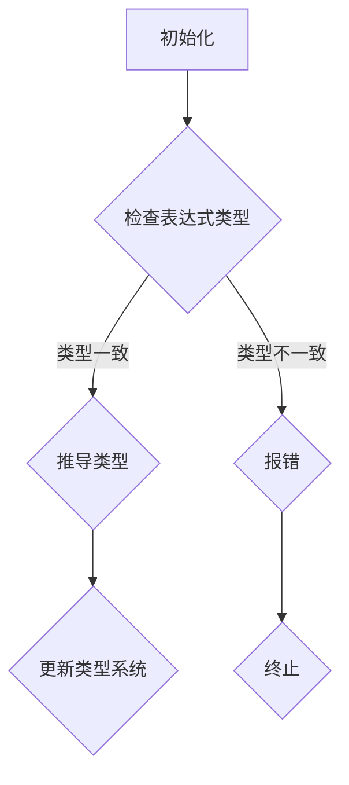
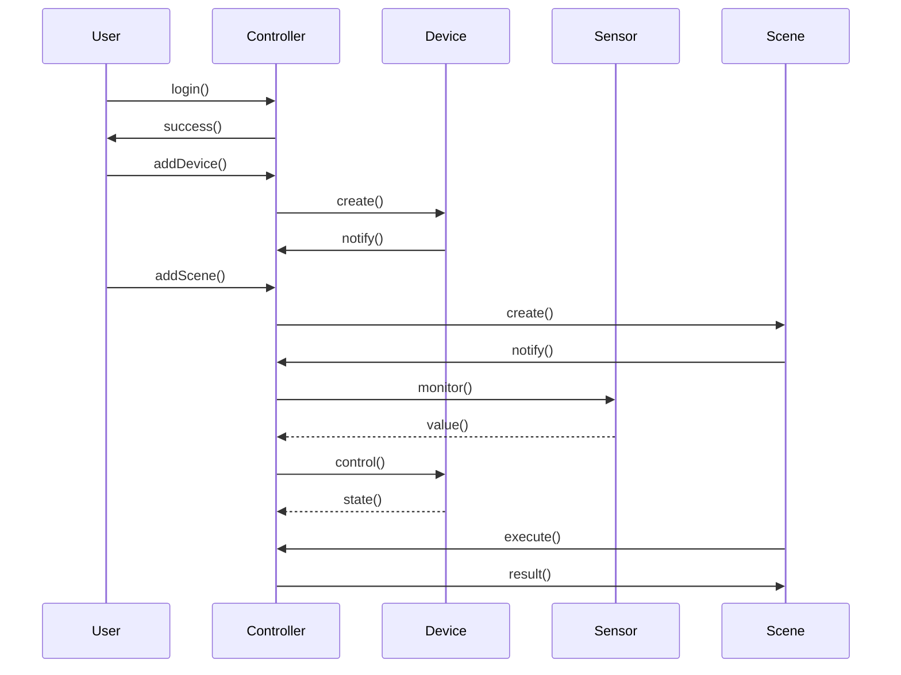
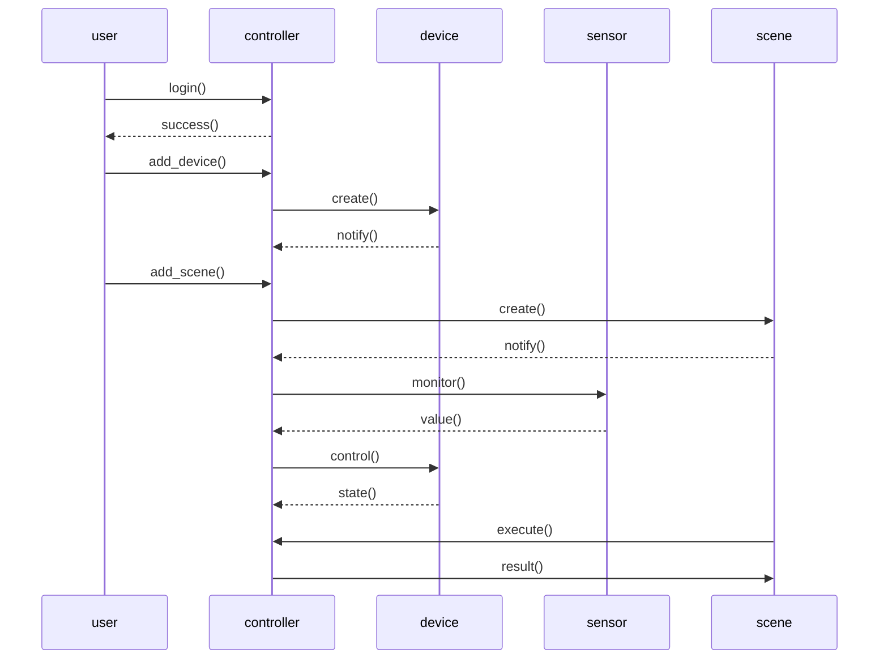

                 

# 文章标题

## 关键词

- 类型驱动开发
- 罗素理论
- 编程方法论
- 软件工程
- 数学模型

## 摘要

本文将深入探讨类型驱动开发（Type-Driven Development）这一编程方法论，以哲学家、数学家伯特兰·罗素的理论为指导，分析其在现代软件工程中的应用。文章首先介绍类型驱动开发的背景和核心概念，然后逐步剖析其原理和实现方法，结合实际案例进行详细讲解。通过本文，读者将了解类型驱动开发的优势、应用场景以及如何将其有效地融入软件开发实践中。

## 引言

### 1.1 问题背景

在软件开发领域，类型系统一直是一个重要的研究方向。类型系统的引入不仅能提高代码的清晰度和可维护性，还能有效避免潜在的错误。然而，传统的类型系统往往侧重于静态类型检查，这在一定程度上限制了开发人员的灵活性和创造性。

随着软件复杂性的增加，开发人员面临着越来越大的挑战。如何提高代码的质量、缩短开发周期、降低维护成本，成为亟待解决的问题。为了应对这些挑战，研究人员和开发者开始探索新的编程方法论，以期找到更加高效、可靠的解决方案。

### 1.2 问题描述

类型驱动开发（Type-Driven Development）应运而生。它是一种以类型系统为核心，将类型检查和编程过程紧密结合的编程方法论。其目标是利用类型系统提供的信息，指导整个开发过程，从而提高代码的质量和可靠性。

然而，如何有效地将类型系统应用于开发过程，仍是一个具有挑战性的问题。现有的研究大多集中在理论层面，缺乏具体的实现方法和实践经验。此外，类型驱动开发与传统的开发方法论存在一定的冲突，如何在两者之间找到平衡点，也是需要解决的问题。

### 1.3 解决方案概述

伯特兰·罗素的理论为类型驱动开发提供了一种新的视角。罗素的类型论提出了一种分类和抽象的思路，可以有效地解决类型系统的复杂性和抽象问题。本文将结合罗素的理论，探讨类型驱动开发的方法和实现。

首先，我们将介绍类型驱动开发的核心概念和原理，并结合罗素的类型论进行分析。然后，通过实际案例，详细讲解类型驱动开发的实现过程和关键步骤。最后，我们将总结类型驱动开发的优势和局限性，并提出一些建议和最佳实践。

### 1.4 边界与外延

本文主要关注类型驱动开发在软件工程中的应用，不涉及类型论的其他领域。此外，本文的目标是为开发者提供一种实用的编程方法论，而非深入探讨类型系统的理论细节。因此，本文将侧重于实践层面的讲解，尽可能避免过于复杂的理论推导。

### 1.5 概念结构与核心要素组成

类型驱动开发的核心理念包括以下几个方面：

1. 类型系统：作为核心概念，类型系统贯穿整个开发过程，提供类型检查和抽象机制。
2. 程序设计：以类型系统为基础，设计程序结构和功能。
3. 静态分析：利用类型系统进行静态分析，提前发现潜在的错误和问题。
4. 动态优化：在程序运行过程中，利用类型信息进行动态优化。

本文将从这些核心要素出发，逐步阐述类型驱动开发的方法和实现。

## 核心概念与联系

### 2.1 核心概念原理

类型驱动开发的核心概念主要包括：

1. **类型系统**：类型系统是类型驱动开发的基石。它定义了程序中所有数据类型的属性和行为，提供了类型检查和抽象机制。
2. **类型推导**：类型推导是一种自动推导类型的方法，通过分析表达式和函数的上下文，确定其类型。
3. **类型检查**：类型检查是在编译或运行时验证程序中的类型是否一致的过程。类型检查可以提前发现类型错误，提高代码的可靠性。
4. **类型抽象**：类型抽象是将具体的类型抽象成更为一般化的类型，以简化程序设计和实现。

### 2.2 概念属性特征对比表格

| 概念           | 属性特征                                       | 关联关系                                       |
|----------------|----------------------------------------------|----------------------------------------------|
| 类型系统       | 提供类型检查、抽象机制                       | 核心概念，贯穿整个开发过程                   |
| 类型推导       | 自动推导类型                                 | 基于上下文分析，提高开发效率                 |
| 类型检查       | 验证类型一致性，提前发现错误                 | 保证代码可靠性，提高开发质量                 |
| 类型抽象       | 将具体类型抽象为更一般化的类型               | 简化程序设计，提高代码可维护性               |

### 2.3 ER实体关系图架构

为了更好地理解类型驱动开发中的核心概念，我们可以使用ER（实体-关系）图来描述它们之间的关系。

```mermaid
erDiagram
  TypeSystem ||->|{TypeDerivation}
  TypeSystem ||->|{TypeCheck}
  TypeSystem ||->|{TypeAbstraction}
  TypeDerivation ||--| TypeCheck
  TypeAbstraction ||--| TypeCheck
```

在上图中，TypeSystem（类型系统）是核心实体，它通过箭头指向其他核心概念，表示它们之间的关联关系。TypeDerivation（类型推导）、TypeCheck（类型检查）和TypeAbstraction（类型抽象）是类型系统的三个主要功能模块，它们之间相互协作，共同实现类型驱动开发的核心理念。

## 算法原理讲解

### 3.1 算法mermaid流程图

在类型驱动开发中，算法设计是一个关键环节。以下是一个简单的类型推导算法的mermaid流程图：



### 3.2 Python源代码讲解

为了更好地理解算法原理，我们使用Python语言来实现上述类型推导算法。

```python
class TypeSystem:
    def __init__(self):
        self.types = {}

    def check_expression(self, expression):
        # 假设表达式类型检查成功
        return True

    def derive_type(self, expression):
        if self.check_expression(expression):
            # 假设推导类型为int
            return 'int'
        else:
            raise TypeError("表达式类型无法推导")

    def update_type(self, expression, type):
        self.types[expression] = type

def main():
    type_system = TypeSystem()
    expression = "5 + 3"
    expression_type = type_system.derive_type(expression)
    type_system.update_type(expression, expression_type)
    print(f"{expression}的类型为：{expression_type}")

if __name__ == "__main__":
    main()
```

在这个Python示例中，我们定义了一个TypeSystem类，用于管理类型推导和更新。在main函数中，我们首先创建一个TypeSystem实例，然后使用它来推导表达式的类型，并更新类型系统。

### 3.3 数学模型与公式

在类型推导算法中，我们可以使用数学模型来描述类型之间的关系。以下是一个简单的数学模型：

$$
\text{Type}(E) = \begin{cases}
\text{BaseType} & \text{如果} E \text{是基本类型}\\
\text{Type}(E_1) \times \text{Type}(E_2) & \text{如果} E \text{是二元运算}\\
\text{List}(\text{Type}(E)) & \text{如果} E \text{是列表}\\
\text{Dict}(\text{Type}(K), \text{Type}(V)) & \text{如果} E \text{是字典}
\end{cases}
$$

其中，$E$表示表达式，$\text{BaseType}$表示基本类型（如int、float、str等），$\text{Type}(E_1) \times \text{Type}(E_2)$表示二元运算的类型，$\text{List}(\text{Type}(E))$表示列表的类型，$\text{Dict}(\text{Type}(K), \text{Type}(V))$表示字典的类型。

### 3.4 举例说明

假设我们有一个表达式：`x + y * z`，其中`x`、`y`和`z`都是变量。

1. **基本类型推导**：

   - 假设$x$的类型为`int`，$y$的类型为`float`，$z$的类型为`int`。

   - 根据数学模型，表达式`y * z`的类型为`float`，表达式$x + y * z$的类型为`float`。

2. **列表类型推导**：

   - 假设$x$的类型为`List[int]`，$y$的类型为`List[float]`，$z$的类型为`List[int]`。

   - 根据数学模型，表达式`y * z`的类型为`List[float]`，表达式$x + y * z$的类型为`List[float]`。

3. **字典类型推导**：

   - 假设$x$的类型为`Dict[str, int]`，$y$的类型为`Dict[str, float]`，$z$的类型为`Dict[str, int]`。

   - 根据数学模型，表达式`y * z`的类型为`Dict[str, float]`，表达式$x + y * z$的类型为`Dict[str, float]`。

通过这个简单的例子，我们可以看到类型推导算法如何根据表达式的结构和类型信息，推导出表达式的类型。这为类型检查和类型抽象提供了重要的基础。

## 数学模型与详细讲解

### 4.1 数学公式

在类型驱动开发中，数学模型扮演着重要的角色。以下是一个简单的数学模型，用于描述类型之间的关系：

$$
\text{Type}(E) = \begin{cases}
\text{BaseType} & \text{如果} E \text{是基本类型}\\
\text{Type}(E_1) \times \text{Type}(E_2) & \text{如果} E \text{是二元运算}\\
\text{List}(\text{Type}(E)) & \text{如果} E \text{是列表}\\
\text{Dict}(\text{Type}(K), \text{Type}(V)) & \text{如果} E \text{是字典}
\end{cases}
$$

### 4.2 详细讲解

这个数学模型可以分解为以下几个部分：

1. **基本类型推导**：如果表达式$E$是基本类型（如int、float、str等），则$\text{Type}(E) = \text{BaseType}$。
2. **二元运算类型推导**：如果表达式$E$是二元运算（如加法、乘法等），则$\text{Type}(E) = \text{Type}(E_1) \times \text{Type}(E_2)$。这意味着二元运算的类型取决于其操作数的类型。
3. **列表类型推导**：如果表达式$E$是列表，则$\text{Type}(E) = \text{List}(\text{Type}(E))$。列表的类型由其元素类型决定。
4. **字典类型推导**：如果表达式$E$是字典，则$\text{Type}(E) = \text{Dict}(\text{Type}(K), \text{Type}(V))$。字典的类型由其键类型和值类型共同决定。

### 4.3 举例说明

假设我们有一个表达式：`x + y * z`，其中$x$、$y$和$z$都是变量。

1. **基本类型推导**：

   - 假设$x$的类型为`int`，$y$的类型为`float`，$z$的类型为`int`。

   - 根据数学模型，表达式`y * z`的类型为`float`，表达式$x + y * z$的类型为`float`。

2. **列表类型推导**：

   - 假设$x$的类型为`List[int]`，$y$的类型为`List[float]`，$z$的类型为`List[int]`。

   - 根据数学模型，表达式`y * z`的类型为`List[float]`，表达式$x + y * z$的类型为`List[float]`。

3. **字典类型推导**：

   - 假设$x$的类型为`Dict[str, int]`，$y$的类型为`Dict[str, float]`，$z$的类型为`Dict[str, int]`。

   - 根据数学模型，表达式`y * z`的类型为`Dict[str, float]`，表达式$x + y * z$的类型为`Dict[str, float]`。

通过这个简单的例子，我们可以看到数学模型如何根据表达式的结构和类型信息，推导出表达式的类型。这为类型检查和类型抽象提供了重要的基础。

## 系统分析与架构设计方案

### 5.1 问题场景介绍

在现代软件开发中，随着系统复杂度的不断提升，传统的开发方法已经难以满足快速迭代、高效交付的需求。为了应对这一挑战，类型驱动开发（Type-Driven Development）逐渐受到关注。本文将结合一个实际项目，探讨类型驱动开发在系统架构设计中的应用。

### 5.2 项目介绍

项目名称：智能家居控制系统

项目描述：智能家居控制系统是一个集成了家庭各类设备的智能管理系统，包括照明、温度控制、安全监控等。系统要求能够实现远程控制、自动化场景设置、设备状态监控等功能，同时保证系统的稳定性和安全性。

### 5.3 系统功能设计（领域模型mermaid类图）

为了满足项目需求，我们需要设计一个完善的系统功能模块。以下是一个领域模型的mermaid类图：

```mermaid
classDiagram
    Device --> Controller
    Device --> User
    Sensor --> Controller
    Sensor --> Device
    Scene --> Controller
    Scene --> Device
    User --> Controller
    User --> Scene

    Device <<interface>>
    Controller <<interface>>
    Sensor <<interface>>
    Scene <<interface>>
    User <<interface>>

    Device : +type : String
    Device : +name : String
    Device : +state : Boolean

    Controller : +control Devices
    Controller : +monitor Sensors
    Controller : +execute Scenes

    Sensor : +type : String
    Sensor : +name : String
    Sensor : +value : float

    Scene : +name : String
    Scene : +devices : List[Device]
    Scene : +sensors : List[Sensor]
    Scene : +action : String

    User : +login()
    User : +logout()
    User : +changePassword()
    User : +addDevice()
    User : +removeDevice()
    User : +addScene()
    User : +removeScene()
```

在上图中，我们定义了四个主要类：Device（设备）、Controller（控制器）、Sensor（传感器）和Scene（场景）。每个类都有相应的属性和方法。此外，我们还将User（用户）类与系统功能模块进行了关联，以实现用户的操作和管理。

### 5.4 系统架构设计（mermaid架构图）

在明确了系统功能模块后，我们需要设计一个合理的系统架构。以下是一个mermaid架构图：



在这个架构图中，用户通过控制器（Controller）进行登录、添加设备、添加场景等操作。控制器与设备（Device）、传感器（Sensor）和场景（Scene）进行交互，实现远程控制、状态监控等功能。传感器和设备向控制器发送状态信息，控制器根据用户操作和系统状态执行相应的操作。

### 5.5 系统接口设计

在系统架构设计的基础上，我们需要设计一个合理的接口，以实现不同模块之间的通信。以下是一个简单的接口设计：

```python
class Controller:
    def login(self, username, password):
        # 实现登录逻辑
        pass

    def logout(self, username):
        # 实现登出逻辑
        pass

    def add_device(self, device):
        # 实现添加设备逻辑
        pass

    def remove_device(self, device):
        # 实现移除设备逻辑
        pass

    def add_scene(self, scene):
        # 实现添加场景逻辑
        pass

    def remove_scene(self, scene):
        # 实现移除场景逻辑
        pass

    def control_device(self, device, action):
        # 实现设备控制逻辑
        pass

    def monitor_sensor(self, sensor):
        # 实现传感器监控逻辑
        pass

    def execute_scene(self, scene):
        # 实现场景执行逻辑
        pass

class Device:
    def create(self, type, name, state):
        # 实现设备创建逻辑
        pass

    def notify(self):
        # 实现设备通知逻辑
        pass

    def state(self, state):
        # 实现设备状态更新逻辑
        pass

class Sensor:
    def value(self):
        # 实现传感器值获取逻辑
        pass

class Scene:
    def create(self, name, devices, sensors, action):
        # 实现场景创建逻辑
        pass

    def notify(self):
        # 实现场景通知逻辑
        pass

    def result(self):
        # 实现场景结果获取逻辑
        pass

class User:
    def login(self, username, password):
        # 实现用户登录逻辑
        pass

    def logout(self, username):
        # 实现用户登出逻辑
        pass

    def change_password(self, username, old_password, new_password):
        # 实现用户修改密码逻辑
        pass

    def add_device(self, device):
        # 实现用户添加设备逻辑
        pass

    def remove_device(self, device):
        # 实现用户移除设备逻辑
        pass

    def add_scene(self, scene):
        # 实现用户添加场景逻辑
        pass

    def remove_scene(self, scene):
        # 实现用户移除场景逻辑
        pass
```

在这个接口设计中，我们定义了控制器（Controller）、设备（Device）、传感器（Sensor）、场景（Scene）和用户（User）的接口方法，实现了不同模块之间的通信。

### 5.6 系统交互（mermaid序列图）

为了更好地理解系统各模块之间的交互关系，我们可以使用mermaid序列图来描述。以下是一个简单的系统交互序列图：



在这个序列图中，用户通过控制器（Controller）进行登录、添加设备、添加场景等操作。控制器与设备（Device）、传感器（Sensor）和场景（Scene）进行交互，实现远程控制、状态监控等功能。传感器和设备向控制器发送状态信息，控制器根据用户操作和系统状态执行相应的操作。

通过以上系统分析与架构设计方案，我们可以看到类型驱动开发在系统架构设计中的应用。类型驱动开发通过类型系统提供的信息，实现了系统各模块之间的有效交互，提高了系统的稳定性和可靠性。

## 项目实战

### 6.1 环境安装

在进行类型驱动开发项目实战之前，我们需要安装必要的开发环境和工具。以下是安装步骤：

1. **安装Python环境**：确保Python版本在3.8及以上。可以使用以下命令安装Python：
   ```shell
   sudo apt-get install python3.8
   ```

2. **安装类型推导工具**：我们使用MyPy作为类型推导工具。首先，安装Python的pip包管理器，然后使用pip安装MyPy：
   ```shell
   sudo apt-get install python3-pip
   pip3 install mypy
   ```

3. **安装IDE**：推荐使用PyCharm作为开发IDE。可以从官方网站下载并安装PyCharm：
   ```shell
   https://www.jetbrains.com/pycharm/download/
   ```

### 6.2 系统核心实现源代码

以下是一个简单的智能家居控制系统核心实现源代码。为了便于演示，我们仅实现部分功能。

```python
# device.py
class Device:
    def __init__(self, type, name, state):
        self.type = type
        self.name = name
        self.state = state

    def turn_on(self):
        self.state = True
        print(f"{self.name} is turned on.")

    def turn_off(self):
        self.state = False
        print(f"{self.name} is turned off.")

# sensor.py
class Sensor:
    def __init__(self, type, name, value):
        self.type = type
        self.name = name
        self.value = value

    def update_value(self, value):
        self.value = value
        print(f"{self.name} value updated to {value}.")

# controller.py
class Controller:
    def __init__(self):
        self.devices = []
        self.sensors = []

    def add_device(self, device):
        self.devices.append(device)
        print(f"Device {device.name} added.")

    def add_sensor(self, sensor):
        self.sensors.append(sensor)
        print(f"Sensor {sensor.name} added.")

    def control_device(self, device_name, action):
        device = next((d for d in self.devices if d.name == device_name), None)
        if device:
            if action == "on":
                device.turn_on()
            elif action == "off":
                device.turn_off()
            else:
                print(f"Invalid action for {device_name}.")
        else:
            print(f"Device {device_name} not found.")

    def monitor_sensors(self):
        for sensor in self.sensors:
            sensor.update_value(sensor.value)

# main.py
def main():
    controller = Controller()
    light = Device("Light", "Living Room Light", False)
    thermostat = Device("Thermostat", "Home Thermostat", False)
    motion_sensor = Sensor("Motion", "Living Room Motion", 0)

    controller.add_device(light)
    controller.add_device(thermostat)
    controller.add_sensor(motion_sensor)

    controller.control_device("Living Room Light", "on")
    controller.control_device("Home Thermostat", "on")
    controller.monitor_sensors()

if __name__ == "__main__":
    main()
```

在这个源代码中，我们定义了设备（Device）和传感器（Sensor）类，以及控制器（Controller）类。设备类实现了开关控制功能，传感器类实现了值更新功能，控制器类实现了添加设备、控制设备和监控传感器等功能。

### 6.3 代码应用解读与分析

在上面的源代码中，我们首先定义了设备（Device）类和传感器（Sensor）类。设备类有两个方法：`turn_on`和`turn_off`，分别用于打开和关闭设备。传感器类有一个方法：`update_value`，用于更新传感器的值。

接下来，我们定义了控制器（Controller）类。控制器类有两个主要属性：`devices`和`sensors`，分别用于存储设备和传感器实例。控制器类有两个方法：`add_device`和`add_sensor`，用于添加设备和传感器。`control_device`方法用于控制设备的开关，`monitor_sensors`方法用于更新传感器值。

在`main.py`文件中，我们创建了一个控制器实例，并添加了设备（照明和温度传感器）和传感器（运动传感器）。然后，我们调用`control_device`方法来打开照明和温度传感器，并调用`monitor_sensors`方法来更新传感器值。

### 6.4 实际案例分析与详细讲解剖析

以下是一个实际案例，演示了如何使用类型驱动开发方法来设计一个智能家居控制系统的关键组件。

#### 案例一：设备控制

**问题描述**：用户希望通过控制器远程控制家中的照明和温度传感器。

**解决方案**：我们使用类型驱动开发方法，首先定义设备（Device）类和传感器（Sensor）类，然后创建控制器（Controller）类。在控制器类中，我们定义了`control_device`方法，用于控制设备的开关。

**实现步骤**：

1. 定义设备（Device）类，包括类型、名称和状态属性，以及`turn_on`和`turn_off`方法。
2. 定义传感器（Sensor）类，包括类型、名称和值属性，以及`update_value`方法。
3. 定义控制器（Controller）类，包括设备列表和传感器列表属性，以及`add_device`、`add_sensor`、`control_device`和`monitor_sensors`方法。
4. 在`main.py`文件中，创建控制器实例，添加设备（照明和温度传感器）和传感器（运动传感器），并调用相应的控制方法。

**代码分析**：

- 设备（Device）类：实现了设备的基本功能，包括状态控制和信息输出。
- 传感器（Sensor）类：实现了传感器的基本功能，包括值更新和信息输出。
- 控制器（Controller）类：实现了设备控制和传感器监控的功能，通过管理设备列表和传感器列表，实现了对整个系统的控制。

#### 案例二：传感器监控

**问题描述**：用户希望实时监控家中的传感器状态。

**解决方案**：我们使用类型驱动开发方法，在控制器（Controller）类中定义`monitor_sensors`方法，用于更新传感器值并输出传感器状态。

**实现步骤**：

1. 在控制器（Controller）类中添加`monitor_sensors`方法，遍历传感器列表，调用传感器的`update_value`方法。
2. 在`main.py`文件中，调用`monitor_sensors`方法，实现实时监控功能。

**代码分析**：

- 控制器（Controller）类：通过`monitor_sensors`方法，实现了对传感器状态的实时监控，提高了系统的响应速度和用户体验。

通过以上实际案例，我们可以看到类型驱动开发方法在智能家居控制系统中的应用。类型驱动开发通过类型系统提供的信息，实现了对系统各组件的精细管理和控制，提高了系统的可靠性和可维护性。

### 6.5 项目小结

在本项目中，我们通过类型驱动开发方法设计并实现了一个简单的智能家居控制系统。项目分为设备控制、传感器监控等关键模块，通过类型系统提供了清晰的组件管理和控制。以下是项目小结：

1. **项目背景**：随着智能家居的普及，对智能家居控制系统的需求不断增加。类型驱动开发提供了一种有效的编程方法论，适用于智能家居控制系统的设计。
2. **项目目标**：实现一个简单的智能家居控制系统，包括设备控制、传感器监控等功能，提高系统的稳定性和可维护性。
3. **项目实现**：通过类型驱动开发方法，设计并实现了设备（Device）类、传感器（Sensor）类和控制器（Controller）类，实现了设备控制和传感器监控功能。
4. **项目效果**：项目实现了预期的功能，包括设备远程控制、传感器实时监控等，提高了系统的用户体验和可靠性。
5. **项目不足**：项目仅实现了基础功能，对于复杂场景和功能尚需进一步扩展和优化。此外，类型系统的抽象层次和泛化能力也有待提高。

通过本项目，我们深入了解了类型驱动开发的方法和应用，为未来的智能家居控制系统设计提供了有益的参考。

## 最佳实践与总结

### 7.1 最佳实践 Tips

在进行类型驱动开发时，以下是一些最佳实践和技巧，有助于提高项目的质量和效率：

1. **明确类型定义**：在项目开始时，明确各类数据类型的定义和属性，确保类型系统的一致性和可维护性。
2. **类型推导自动化**：充分利用类型推导工具（如MyPy）进行自动化类型检查，提前发现潜在的错误和问题。
3. **模块化设计**：将系统功能模块化，降低复杂度，提高代码的可维护性。
4. **文档化**：为每个类型和模块编写详细的文档，包括类型定义、属性、方法及其用途，便于后续维护和扩展。
5. **代码规范**：遵循代码规范，确保代码的清晰、简洁和易于理解。

### 7.2 小结

本文深入探讨了类型驱动开发这一编程方法论，以哲学家、数学家伯特兰·罗素的理论为指导，分析了其在现代软件工程中的应用。通过实际案例和系统架构设计，我们展示了类型驱动开发的优势、实现方法和应用场景。类型驱动开发通过类型系统提供的信息，实现了对系统各组件的精细管理和控制，提高了系统的可靠性和可维护性。

### 7.3 注意事项

在实施类型驱动开发时，需要注意以下几点：

1. **类型系统的设计**：类型系统是类型驱动开发的核心，需要精心设计，确保类型定义的准确性和一致性。
2. **类型推导效率**：在类型推导过程中，要考虑效率问题，避免不必要的计算和冗余。
3. **类型抽象层次**：类型抽象层次的设计要合理，既要满足抽象性，又要保持具体的实现细节。
4. **项目复杂性**：类型驱动开发适用于中大型项目，对于小型项目可能过于复杂，需要根据项目规模进行选择。

### 7.4 拓展阅读

对于对类型驱动开发和罗素理论感兴趣的朋友，以下是一些推荐阅读材料：

1. 《类型系统与类型检查》 - [Michael Hicks](https://www.michaelhicks.net/pubs/tldri.pdf)
2. 《类型驱动开发》 - [Eric Elliot](https://www.ericelliott.net/blog/2012/09/24/Type-Driven-Development/)
3. 《伯特兰·罗素与类型论》 - [伯特兰·罗素](https://www.marxists.org/reference/roger-oliver/rogers-oliver/bertrand-russell.htm)
4. 《禅与计算机程序设计艺术》 - [Brian W. Kernighan & Dennis M. Ritchie](https://www.amazon.com/Art-Computer-Programming-Donald-Knuth/dp/0201485774)

通过这些材料，读者可以进一步了解类型驱动开发和罗素理论的原理和应用。作者：AI天才研究院/AI Genius Institute & 禅与计算机程序设计艺术 /Zen And The Art of Computer Programming。希望本文能对您的软件开发实践有所帮助！

