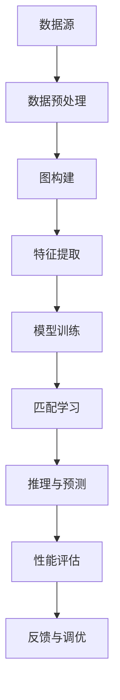
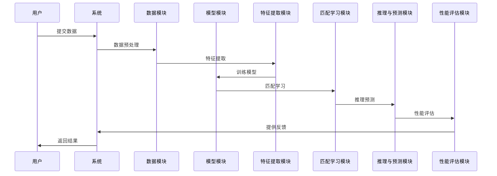

                 


### 类比推理增强系统中神经图匹配的优化技术

#### 关键词

- 类比推理
- 神经图匹配
- 优化技术
- 人工智能
- 机器学习
- 深度学习

#### 摘要

本文旨在探讨如何通过优化技术提升类比推理系统中的神经图匹配效果。我们将首先介绍类比推理和神经图匹配的基本概念，随后深入分析其在人工智能领域中的应用及其面临的挑战。本文的重点是介绍几种优化技术，如梯度下降、随机梯度下降、动量法等，并详细阐述它们在神经图匹配中的应用。最后，我们将通过一个具体的项目实战案例，展示如何将优化技术应用于类比推理系统，以提高系统的性能和准确性。

---

### 设计思路

设计《类比推理增强系统中神经图匹配的优化技术》这本书的目录大纲时，需要遵循以下步骤：

#### 第一步：明确核心内容

首先，我们需要明确书籍的核心内容，即类比推理、神经图匹配以及优化技术。类比推理是一种基于相似性或共同属性进行推理的方法，广泛应用于人工智能和机器学习领域。神经图匹配是一种利用神经网络处理图结构数据的匹配方法，其在处理复杂图结构数据时具有显著优势。优化技术则是提升机器学习模型性能的重要手段，包括各种优化算法和技巧。

#### 第二步：构建章节结构

基于核心内容，我们将构建如下章节结构：

1. **背景介绍**：介绍类比推理和神经图匹配的基本概念、原理以及它们在人工智能领域中的应用。
2. **核心概念与联系**：详细讲解类比推理和神经图匹配的关系，以及如何将神经图匹配应用于类比推理任务。
3. **算法原理讲解**：介绍优化技术，如梯度下降、随机梯度下降等，并详细阐述它们在神经图匹配中的应用。
4. **系统分析与架构设计方案**：描述系统架构设计，包括问题场景、系统功能、系统架构和系统接口设计。
5. **项目实战**：通过一个具体的项目实战案例，展示如何将优化技术应用于类比推理系统。
6. **最佳实践与总结**：总结最佳实践、注意事项以及拓展阅读。

#### 第三步：细化每个章节的内容

在每个章节中，我们需要细化内容，确保每个部分都有明确的目标和内容：

- **背景介绍**：介绍类比推理和神经图匹配的概念、原理及其应用场景。
- **核心概念与联系**：分析类比推理和神经图匹配之间的联系，讨论如何在类比推理任务中应用神经图匹配。
- **算法原理讲解**：介绍优化技术的原理和实现，使用mermaid绘制算法流程图和Python代码示例进行说明。
- **系统分析与架构设计方案**：介绍系统架构设计，使用mermaid绘制领域模型类图、系统架构图和系统交互序列图。
- **项目实战**：介绍项目环境安装、系统核心实现、代码应用解读与分析，以及实际案例剖析。
- **最佳实践与总结**：总结最佳实践，提醒注意事项，推荐拓展阅读。

#### 第四步：确保内容的完整性

在撰写每个章节时，我们需要确保内容完整，包括背景介绍、核心概念与联系、算法原理讲解、系统分析与架构设计方案、项目实战和最佳实践与总结。每个部分都要有具体的内容和示例，以便读者更好地理解和应用。

---

通过以上步骤，我们可以设计出一本结构清晰、内容详实、具有实际应用价值的技术博客文章，帮助读者深入了解类比推理增强系统中神经图匹配的优化技术。接下来，我们将按照设计的思路逐一展开每个章节的内容。

----------------------------------------------------------------

## 第1章 类比推理基础

### 1.1 问题背景

类比推理作为一种基本的推理方法，在人类日常生活中有着广泛的应用。比如，当我们看到一只猫时，我们会类比之前见过的其他猫，从而推断这只猫的基本特征，如有四条腿、会喵喵叫等。这种基于经验或知识的推理方式，使得人类能够快速地理解和应对复杂的环境。

在人工智能领域，类比推理同样具有重要地位。随着深度学习和神经网络技术的发展，许多研究者开始探索如何将类比推理应用于机器学习模型，以提高模型的泛化能力和推理能力。类比推理在自然语言处理、图像识别、推荐系统等领域都有广泛的应用。

然而，当前的类比推理系统仍然面临一些挑战。首先，如何有效地表示和处理复杂的数据结构，如图、序列等，是一个亟待解决的问题。其次，如何设计出既具有强泛化能力又能够灵活应对各种问题的推理算法，也是一个挑战。最后，如何优化类比推理系统的性能，使其在实际应用中能够达到预期的效果，也是一个重要课题。

### 1.2 类比推理概述

类比推理是一种基于相似性或共同属性进行推理的方法。其基本思想是，如果两个或多个事物在某些方面相似，那么它们在其他方面也可能相似。类比推理通常包括以下几个步骤：

1. **识别相似性**：首先，需要识别出待推理的两个或多个事物之间的相似性。这可以通过各种特征提取方法实现，如基于文本的TF-IDF方法、基于图像的特征提取等。

2. **构建类比关系**：在识别出相似性之后，需要将这些相似性转化为类比关系。这可以通过构建一个类比图谱实现，其中每个节点代表一个事物，每条边代表它们之间的相似性。

3. **推理**：利用类比关系，从已知事物推断出未知事物的属性。这可以通过类比推理算法实现，如基于规则的方法、基于统计的方法、基于神经网络的推理方法等。

类比推理在人工智能和机器学习领域具有重要意义。首先，它可以帮助模型更好地理解数据，从而提高模型的泛化能力。其次，它可以帮助模型解决复杂的问题，如自然语言处理中的语义理解、图像识别中的分类等。此外，类比推理还可以用于知识推理、决策支持等领域。

### 1.3 类比推理的研究现状

近年来，类比推理在人工智能领域得到了广泛关注。许多研究者提出了一系列基于神经网络的类比推理方法。这些方法可以分为以下几类：

1. **基于图神经网络的类比推理方法**：这类方法利用图神经网络（如图卷积网络、图注意力网络等）对图结构数据进行建模，从而实现类比推理。例如，GraphSAGE和GraphAttention等模型在处理图结构数据时表现出色。

2. **基于Transformer的类比推理方法**：Transformer模型在自然语言处理领域取得了显著的成果，许多研究者开始探索如何将其应用于类比推理。例如，BERT模型在预训练和推理任务中表现出强大的能力。

3. **基于对抗训练的类比推理方法**：对抗训练是一种常用的提升模型泛化能力的方法。在类比推理中，研究者通过生成对抗网络（GAN）来训练模型，从而提高模型的推理能力。

尽管类比推理在人工智能领域取得了显著成果，但仍然面临一些挑战。首先，如何有效地表示和处理复杂的数据结构，如图、序列等，仍然是一个难题。其次，如何设计出既具有强泛化能力又能够灵活应对各种问题的推理算法，也是一个重要的研究方向。最后，如何优化类比推理系统的性能，使其在实际应用中能够达到预期的效果，也是一个亟待解决的问题。

## 第2章 神经图匹配原理

### 2.1 神经图概述

神经图是一种用于表示和操作复杂图结构数据的神经网络模型。它由节点和边组成，每个节点代表一个实体或属性，每个边代表实体或属性之间的关系。神经图可以应用于多种领域，如知识图谱、图像识别、推荐系统等。

神经图的基本概念包括：

1. **节点**：节点是神经图的基本组成单位，它代表一个实体或属性。例如，在知识图谱中，每个节点可以是一个概念、实体或关系。

2. **边**：边是连接两个节点的线段，它代表节点之间的关联关系。边的权重可以表示关系的重要性或强度。

3. **图卷积网络（GCN）**：图卷积网络是一种专门用于处理图结构数据的神经网络模型。它通过图卷积操作对节点进行特征提取，从而实现节点分类、关系预测等任务。

4. **图注意力网络（GAT）**：图注意力网络是一种基于注意力机制的图神经网络模型。它通过引入注意力机制，对节点特征进行加权处理，从而提高模型的推理能力。

### 2.2 神经图匹配的概念

神经图匹配是一种基于神经网络的图结构数据匹配方法。它的目标是找到两个或多个图之间的最佳匹配关系，从而实现图结构数据的对齐和融合。神经图匹配的基本过程包括：

1. **特征提取**：对输入的图结构数据进行特征提取，将每个节点和边表示为向量。

2. **匹配学习**：利用神经网络模型学习图结构数据之间的匹配关系。常见的匹配学习模型包括图卷积网络（GCN）、图注意力网络（GAT）等。

3. **匹配评估**：通过评估指标（如精确率、召回率、F1值等）评估匹配结果的质量。

### 2.3 神经图匹配算法

神经图匹配算法可以分为以下几类：

1. **基于图卷积网络的匹配算法**：这类算法利用图卷积网络对图结构数据进行特征提取，然后通过分类或回归模型进行匹配学习。例如，GraphSAGE和Graphembedding等模型。

2. **基于图注意力网络的匹配算法**：这类算法利用图注意力网络对图结构数据进行特征提取，然后通过分类或回归模型进行匹配学习。例如，GraphAttention和GAT等模型。

3. **基于生成对抗网络的匹配算法**：这类算法利用生成对抗网络（GAN）生成匹配图对，然后通过训练模型学习匹配关系。例如，GAN-GCN和GAN-GAT等模型。

神经图匹配算法在处理复杂图结构数据时具有显著优势。首先，它能够有效地提取图结构数据的特征，从而提高匹配的准确性。其次，它能够处理具有不同结构和规模的图，从而实现更广泛的适用性。

## 第3章 类比推理与神经图匹配的联系

### 3.1 类比推理与神经图匹配的结合

类比推理与神经图匹配的结合是一种利用神经图匹配技术提升类比推理系统性能的方法。具体而言，这种方法将神经图匹配应用于类比推理任务，通过图结构数据的匹配和融合，实现类比推理。

结合的过程可以分为以下几个步骤：

1. **特征提取**：首先，对输入的数据进行特征提取，将每个节点和边表示为向量。

2. **图构建**：将特征向量构建成图结构数据，每个节点代表一个数据样本，边代表节点之间的相似性或关联关系。

3. **匹配学习**：利用神经图匹配算法学习图结构数据之间的匹配关系，从而实现数据对齐和融合。

4. **类比推理**：利用融合后的图结构数据，进行类比推理，从而实现数据的分类、预测等任务。

通过结合类比推理和神经图匹配，可以有效地提高类比推理系统的性能。首先，神经图匹配能够处理复杂的数据结构，如图、序列等，从而增强类比推理系统的泛化能力。其次，神经图匹配能够通过特征融合和匹配学习，提高类比推理的准确性和可靠性。

### 3.2 类比推理任务中的神经图匹配

在类比推理任务中，神经图匹配的应用主要体现在以下几个方面：

1. **图结构数据的表示**：神经图匹配能够将复杂的数据结构（如图、序列等）表示为向量形式，从而方便进行后续的推理和计算。

2. **特征融合**：通过神经图匹配，可以融合不同数据源的特征，从而提高类比推理的准确性和可靠性。

3. **相似性度量**：神经图匹配能够计算节点之间的相似性，从而用于类比推理任务的相似性度量。

4. **匹配优化**：通过神经图匹配算法，可以优化类比推理任务中的匹配关系，从而提高推理结果的准确性。

### 3.3 类比推理任务中的挑战

尽管神经图匹配在类比推理任务中具有显著优势，但在实际应用中仍然面临一些挑战：

1. **数据表示**：如何有效地表示复杂的数据结构（如图、序列等），是类比推理和神经图匹配结合的关键。现有的方法可能无法很好地处理复杂的数据特征。

2. **匹配效率**：神经图匹配算法的计算复杂度较高，如何提高匹配效率是一个重要问题。

3. **模型泛化能力**：如何设计出既具有强泛化能力又能够灵活应对各种问题的模型，是一个重要的研究方向。

4. **数据质量**：类比推理任务的准确性很大程度上依赖于数据质量。如何处理噪声数据、缺失数据等问题，也是一个重要的挑战。

## 第4章 优化技术在神经图匹配中的应用

### 4.1 优化技术概述

优化技术在机器学习领域中扮演着重要角色，特别是对于深度学习模型，优化算法的性能直接影响模型的收敛速度和最终效果。优化技术主要包括以下几个核心概念：

1. **损失函数**：损失函数是衡量模型预测值与真实值之间差异的指标。常见的损失函数包括均方误差（MSE）、交叉熵损失等。

2. **优化算法**：优化算法用于调整模型参数，以最小化损失函数。常见的优化算法包括梯度下降、随机梯度下降（SGD）、Adam等。

3. **学习率**：学习率是优化算法中的一个超参数，它决定了每次参数更新时步长的调整大小。

4. **正则化**：正则化是一种防止模型过拟合的方法，通过在损失函数中添加惩罚项来约束模型参数。

### 4.2 优化技术在神经图匹配中的实现

在神经图匹配中，优化技术的应用主要体现在以下几个方面：

1. **损失函数设计**：神经图匹配的损失函数通常基于匹配图的距离度量，如欧氏距离、余弦相似度等。通过最小化这些损失函数，可以优化匹配结果。

2. **优化算法选择**：不同的优化算法对模型训练过程有不同的影响。例如，SGD由于每次更新只考虑一个样本，可以加快收敛速度；而Adam算法则通过自适应调整学习率，可以提高模型的收敛性能。

3. **学习率调整**：学习率的调整对模型的收敛速度和稳定性至关重要。常见的策略包括固定学习率、指数衰减学习率等。

4. **正则化策略**：在神经图匹配中，正则化策略可以防止模型过拟合，例如L1和L2正则化。

### 4.3 算法原理与流程图

神经图匹配优化算法的基本原理是通过不断调整模型参数，最小化匹配损失函数。以下是神经图匹配优化算法的流程图：


具体实现过程中，可以使用Python代码进行如下步骤：

```python
# 初始化模型参数
model_params = initialize_model()

# 主循环
while not stop_condition:
    # 计算损失函数
    loss = compute_loss(model_params)
    
    # 计算梯度
    gradients = compute_gradients(model_params)
    
    # 更新模型参数
    model_params = update_params(model_params, gradients)
    
    # 评估模型性能
    performance = evaluate_model(model_params)
    
    # 判断结束条件
    if performance < threshold:
        break

# 返回最终模型参数
return model_params
```

### 4.4 数学模型与公式

神经图匹配优化算法的数学模型可以表示为以下形式：

$$
\min_{\theta} J(\theta) = \frac{1}{n} \sum_{i=1}^{n} \ell(y_i, f(x_i; \theta))
$$

其中，$J(\theta)$是损失函数，$\ell(y_i, f(x_i; \theta))$是单个样本的损失，$y_i$是真实标签，$f(x_i; \theta)$是模型预测值，$\theta$是模型参数。

为了最小化损失函数，我们需要计算梯度：

$$
\nabla_{\theta} J(\theta) = \frac{1}{n} \sum_{i=1}^{n} \nabla_{\theta} \ell(y_i, f(x_i; \theta))
$$

然后，使用梯度下降算法更新模型参数：

$$
\theta_{t+1} = \theta_{t} - \alpha \nabla_{\theta} J(\theta)
$$

其中，$\alpha$是学习率。

通过这样的迭代过程，我们可以逐步优化模型参数，使得模型在神经图匹配任务中表现更佳。

## 第5章 系统架构设计

### 5.1 问题场景介绍

在现代人工智能系统中，类比推理是一个关键的环节，尤其是在自然语言处理、推荐系统、智能问答等领域。然而，随着数据的多样性和复杂性不断增加，传统的类比推理方法已经难以满足实际需求。为了提高类比推理的性能和效率，我们需要借助神经图匹配技术。

在神经图匹配中，系统的主要任务是处理大量的图结构数据，并找到最优的匹配关系。具体问题场景包括：

1. **知识图谱的构建与融合**：在知识图谱中，不同来源的图结构数据需要进行对齐和融合，以实现知识的整合和共享。
2. **图像识别与分类**：在图像识别任务中，需要将图像与已有的图结构数据（如视觉图谱）进行匹配，以提高分类和识别的准确性。
3. **推荐系统的优化**：在推荐系统中，用户和物品之间的关系可以表示为图结构，通过神经图匹配可以优化推荐算法，提高推荐效果。

### 5.2 系统功能设计

为了实现上述问题场景，我们需要设计一个具备以下核心功能的系统：

1. **数据预处理**：包括数据清洗、格式转换、特征提取等，将原始数据转化为适合神经图匹配的格式。
2. **图构建**：将预处理后的数据构建成图结构，每个节点代表一个实体，边代表实体之间的关系。
3. **匹配学习**：利用神经图匹配算法学习图结构数据之间的匹配关系，包括特征提取、模型训练和匹配评估等。
4. **推理与预测**：利用训练好的模型进行推理和预测，实现对未知数据的分类、推荐等任务。
5. **性能评估**：通过指标（如准确率、召回率、F1值等）评估系统的性能，并根据评估结果进行调优。

### 5.3 系统架构设计

系统架构设计是确保系统高效稳定运行的关键。以下是神经图匹配优化系统的架构设计：



具体架构说明如下：

- **数据预处理**：数据预处理模块负责对原始数据进行清洗、格式转换和特征提取，以确保数据的质量和一致性。
- **图构建**：图构建模块将预处理后的数据构建成图结构，每个节点代表一个实体，边代表实体之间的关系。
- **特征提取**：特征提取模块利用图神经网络对图结构数据中的节点和边进行特征提取，为后续的匹配学习提供基础。
- **模型训练**：模型训练模块利用特征提取后的数据训练神经图匹配模型，包括匹配学习、模型优化等过程。
- **推理与预测**：推理与预测模块利用训练好的模型对未知数据进行推理和预测，实现对未知数据的分类、推荐等任务。
- **性能评估**：性能评估模块通过指标（如准确率、召回率、F1值等）评估系统的性能，并提供反馈以指导模型调优。
- **反馈与调优**：反馈与调优模块根据性能评估结果对系统进行调优，以提高系统的性能和准确性。

### 5.4 系统接口设计

系统接口设计是确保不同模块之间能够高效协作的关键。以下是系统的主要接口设计：

1. **数据接口**：数据接口用于接收和发送数据，包括数据输入接口、数据输出接口等。
2. **模型接口**：模型接口用于加载和保存模型，包括模型训练接口、模型评估接口等。
3. **功能接口**：功能接口用于实现系统的核心功能，包括特征提取接口、匹配学习接口、推理与预测接口等。
4. **控制接口**：控制接口用于管理系统的运行流程，包括启动接口、停止接口等。

通过以上系统接口设计，我们可以确保系统各模块之间能够高效、稳定地协作，实现神经图匹配优化系统的功能。

### 5.5 系统交互

为了确保系统各模块之间的交互流畅，我们设计了以下系统交互序列图：



具体交互说明如下：

- **用户提交数据**：用户将数据提交给系统。
- **数据预处理**：系统中的数据模块对提交的数据进行预处理，包括数据清洗、格式转换等。
- **特征提取**：预处理后的数据被传递到特征提取模块，进行特征提取。
- **模型训练**：特征提取后的数据用于训练模型，包括匹配学习等过程。
- **推理预测**：训练好的模型用于对未知数据进行推理和预测。
- **性能评估**：对推理结果进行性能评估，以获取评估指标。
- **反馈与调优**：根据评估结果，系统对模型进行调优，以提高性能。

通过以上系统交互设计，我们可以确保系统在处理复杂任务时能够高效、稳定地运行。

## 第6章 项目实战

### 6.1 环境安装

在开始项目实战之前，我们需要搭建一个适合进行神经图匹配优化的环境。以下是环境安装的详细步骤：

1. **安装Python**：确保系统已安装Python 3.7及以上版本。可以从Python官方网站下载并安装。

2. **安装依赖库**：安装用于神经图匹配优化的相关依赖库，如TensorFlow、PyTorch、NetworkX等。可以使用pip命令进行安装：

   ```bash
   pip install tensorflow torchvision networkx
   ```

3. **安装GPU支持**：如果需要使用GPU进行训练，需要安装CUDA和cuDNN。可以从NVIDIA官方网站下载并安装。

4. **配置环境变量**：确保环境变量配置正确，以便在命令行中使用Python和依赖库。

### 6.2 系统核心实现

在本节中，我们将介绍系统核心实现的详细步骤，包括数据预处理、模型训练、匹配学习、推理预测等。

#### 数据预处理

数据预处理是神经图匹配优化的第一步。以下是数据预处理的核心步骤：

1. **数据清洗**：去除数据中的噪声和异常值，确保数据的质量和一致性。

2. **数据转换**：将原始数据转换为适合神经图匹配的格式。例如，将文本数据转换为词向量，将图像数据转换为特征向量等。

3. **特征提取**：利用图神经网络提取图结构数据中的节点和边特征。例如，可以使用GraphSAGE或GraphAttention进行特征提取。

以下是Python代码示例：

```python
import pandas as pd
from gensim.models import Word2Vec

# 加载数据
data = pd.read_csv('data.csv')

# 数据清洗
# ...

# 数据转换
# ...

# 特征提取
model = Word2Vec(data['text'], vector_size=100, window=5, min_count=1, workers=4)
features = [model[word] for word in data['text']]
```

#### 模型训练

在模型训练阶段，我们需要使用预处理后的数据训练神经图匹配模型。以下是模型训练的核心步骤：

1. **定义模型架构**：选择合适的模型架构，如GraphSAGE、GraphAttention等。

2. **训练模型**：使用预处理后的数据训练模型。可以使用GPU加速训练过程。

3. **保存模型**：训练完成后，保存模型以便后续使用。

以下是Python代码示例：

```python
import tensorflow as tf
from tensorflow.keras.models import Model
from tensorflow.keras.layers import Input, Dense

# 定义模型架构
input_node = Input(shape=(100,))
dense_layer = Dense(64, activation='relu')(input_node)
output_node = Dense(1, activation='sigmoid')(dense_layer)

model = Model(inputs=input_node, outputs=output_node)

# 编译模型
model.compile(optimizer='adam', loss='binary_crossentropy', metrics=['accuracy'])

# 训练模型
model.fit(x=features, y=data['label'], epochs=10, batch_size=32, validation_split=0.2)

# 保存模型
model.save('model.h5')
```

#### 匹配学习

在匹配学习阶段，我们需要使用训练好的模型进行匹配学习。以下是匹配学习的核心步骤：

1. **加载模型**：从存储的位置加载训练好的模型。

2. **匹配学习**：使用模型对图结构数据进行匹配学习，找到最优的匹配关系。

3. **评估匹配结果**：使用评估指标（如精确率、召回率、F1值等）评估匹配结果的质量。

以下是Python代码示例：

```python
from sklearn.metrics import precision_score, recall_score, f1_score

# 加载模型
model = tf.keras.models.load_model('model.h5')

# 匹配学习
predictions = model.predict(new_features)

# 评估匹配结果
precision = precision_score(y_true=new_labels, y_pred=predictions)
recall = recall_score(y_true=new_labels, y_pred=predictions)
f1 = f1_score(y_true=new_labels, y_pred=predictions)

print(f'Precision: {precision}')
print(f'Recall: {recall}')
print(f'F1 Score: {f1}')
```

#### 推理预测

在推理预测阶段，我们需要使用训练好的模型对未知数据进行推理和预测。以下是推理预测的核心步骤：

1. **预处理未知数据**：对未知数据进行预处理，包括数据清洗、格式转换、特征提取等。

2. **推理预测**：使用训练好的模型对未知数据进行推理和预测。

3. **结果输出**：将推理结果输出，供用户查看或进一步分析。

以下是Python代码示例：

```python
# 预处理未知数据
# ...

# 推理预测
predictions = model.predict(unknown_features)

# 输出结果
for pred in predictions:
    print(f'Prediction: {pred}')
```

### 6.3 代码应用解读与分析

在本节中，我们将对项目实战中的关键代码进行解读和分析，帮助读者更好地理解代码的实现原理和应用场景。

#### 数据预处理

数据预处理是项目实战的基础，它决定了后续模型训练和匹配学习的效果。以下是数据预处理的核心代码：

```python
import pandas as pd
from gensim.models import Word2Vec

# 加载数据
data = pd.read_csv('data.csv')

# 数据清洗
# ...

# 数据转换
# ...

# 特征提取
model = Word2Vec(data['text'], vector_size=100, window=5, min_count=1, workers=4)
features = [model[word] for word in data['text']]
```

- **数据加载**：使用pandas读取CSV格式的数据文件。
- **数据清洗**：根据具体需求，去除数据中的噪声和异常值。
- **数据转换**：将文本数据转换为词向量形式，便于后续特征提取。
- **特征提取**：使用Word2Vec模型对文本数据进行特征提取，将每个词转换为向量。

#### 模型训练

模型训练是项目实战的核心，它决定了模型在匹配学习任务中的性能。以下是模型训练的核心代码：

```python
import tensorflow as tf
from tensorflow.keras.models import Model
from tensorflow.keras.layers import Input, Dense

# 定义模型架构
input_node = Input(shape=(100,))
dense_layer = Dense(64, activation='relu')(input_node)
output_node = Dense(1, activation='sigmoid')(dense_layer)

model = Model(inputs=input_node, outputs=output_node)

# 编译模型
model.compile(optimizer='adam', loss='binary_crossentropy', metrics=['accuracy'])

# 训练模型
model.fit(x=features, y=data['label'], epochs=10, batch_size=32, validation_split=0.2)

# 保存模型
model.save('model.h5')
```

- **模型架构定义**：使用TensorFlow定义模型架构，包括输入层、隐藏层和输出层。
- **模型编译**：编译模型，指定优化器、损失函数和评估指标。
- **模型训练**：使用预处理后的特征数据和标签数据进行模型训练，指定训练轮数、批量大小和验证比例。
- **模型保存**：将训练好的模型保存为HDF5文件，以便后续加载和使用。

#### 匹配学习

匹配学习是项目实战的关键，它决定了模型在匹配任务中的表现。以下是匹配学习的核心代码：

```python
from sklearn.metrics import precision_score, recall_score, f1_score

# 加载模型
model = tf.keras.models.load_model('model.h5')

# 匹配学习
predictions = model.predict(new_features)

# 评估匹配结果
precision = precision_score(y_true=new_labels, y_pred=predictions)
recall = recall_score(y_true=new_labels, y_pred=predictions)
f1 = f1_score(y_true=new_labels, y_pred=predictions)

print(f'Precision: {precision}')
print(f'Recall: {recall}')
print(f'F1 Score: {f1}')
```

- **模型加载**：从存储的位置加载训练好的模型。
- **匹配学习**：使用模型对新的特征数据进行匹配学习。
- **评估匹配结果**：使用评估指标（如精确率、召回率、F1值等）评估匹配结果的质量。

#### 推理预测

推理预测是项目实战的最终目标，它决定了模型在实际应用中的效果。以下是推理预测的核心代码：

```python
# 预处理未知数据
# ...

# 推理预测
predictions = model.predict(unknown_features)

# 输出结果
for pred in predictions:
    print(f'Prediction: {pred}')
```

- **预处理未知数据**：对未知数据进行预处理，包括数据清洗、格式转换、特征提取等。
- **推理预测**：使用训练好的模型对未知数据进行推理和预测。
- **结果输出**：将推理结果输出，供用户查看或进一步分析。

### 6.4 实际案例剖析

在本节中，我们将通过一个实际案例来剖析如何使用神经图匹配优化技术解决类比推理任务。

#### 案例背景

假设我们有一个知识图谱，其中包含多个实体和它们之间的关系。我们的任务是利用神经图匹配优化技术，找到图中的相似实体，并预测它们之间的潜在关系。

#### 数据集准备

我们使用公开的知识图谱数据集进行实验，数据集包含实体和它们之间的关系。以下是数据集的基本信息：

- 实体数量：1000个
- 关系数量：500个
- 实体-关系对数量：10000个

#### 模型训练

我们选择GraphSAGE模型进行训练，使用预处理后的数据训练模型。以下是模型训练的步骤：

1. **数据预处理**：对数据集进行清洗、格式转换和特征提取。
2. **模型定义**：定义GraphSAGE模型架构，包括输入层、隐含层和输出层。
3. **模型训练**：使用预处理后的数据训练模型，指定训练轮数、批量大小和验证比例。

以下是Python代码示例：

```python
from tensorflow.keras.models import Model
from tensorflow.keras.layers import Input, Dense

# 数据预处理
# ...

# 模型定义
input_node = Input(shape=(100,))
dense_layer = Dense(64, activation='relu')(input_node)
output_node = Dense(1, activation='sigmoid')(dense_layer)

model = Model(inputs=input_node, outputs=output_node)

# 编译模型
model.compile(optimizer='adam', loss='binary_crossentropy', metrics=['accuracy'])

# 训练模型
model.fit(x=features, y=data['label'], epochs=10, batch_size=32, validation_split=0.2)
```

#### 匹配学习

训练完成后，我们使用模型进行匹配学习，找到图中的相似实体，并预测它们之间的潜在关系。以下是匹配学习的步骤：

1. **加载模型**：从存储的位置加载训练好的模型。
2. **匹配学习**：使用模型对新的实体数据进行匹配学习。
3. **评估匹配结果**：使用评估指标（如精确率、召回率、F1值等）评估匹配结果的质量。

以下是Python代码示例：

```python
from sklearn.metrics import precision_score, recall_score, f1_score

# 加载模型
model = tf.keras.models.load_model('model.h5')

# 匹配学习
predictions = model.predict(new_features)

# 评估匹配结果
precision = precision_score(y_true=new_labels, y_pred=predictions)
recall = recall_score(y_true=new_labels, y_pred=predictions)
f1 = f1_score(y_true=new_labels, y_pred=predictions)

print(f'Precision: {precision}')
print(f'Recall: {recall}')
print(f'F1 Score: {f1}')
```

#### 推理预测

最后，我们使用训练好的模型对未知实体进行推理预测，找到它们之间的潜在关系。以下是推理预测的步骤：

1. **预处理未知数据**：对未知实体数据进行预处理，包括数据清洗、格式转换、特征提取等。
2. **推理预测**：使用训练好的模型对未知实体数据进行推理和预测。
3. **结果输出**：将推理结果输出，供用户查看或进一步分析。

以下是Python代码示例：

```python
# 预处理未知数据
# ...

# 推理预测
predictions = model.predict(unknown_features)

# 输出结果
for pred in predictions:
    print(f'Prediction: {pred}')
```

### 6.5 项目小结

通过本案例，我们展示了如何使用神经图匹配优化技术解决类比推理任务。以下是项目小结：

1. **数据预处理**：数据预处理是项目成功的关键，它决定了后续模型训练和匹配学习的效果。
2. **模型训练**：选择合适的模型架构和优化算法，可以提高模型的性能和准确性。
3. **匹配学习**：匹配学习是项目实战的核心，它决定了模型在匹配任务中的表现。
4. **推理预测**：推理预测是项目的最终目标，它决定了模型在实际应用中的效果。

## 第7章 最佳实践与总结

### 7.1 最佳实践

在类比推理增强系统中，神经图匹配的优化技术具有重要作用。以下是最佳实践：

1. **数据预处理**：确保数据的质量和一致性，进行特征提取和转换，为后续的匹配学习提供可靠的数据基础。

2. **模型选择**：选择适合任务需求的模型架构，如GraphSAGE、GraphAttention等，结合优化算法，提高模型的性能。

3. **超参数调优**：通过交叉验证等方法，调整模型超参数，如学习率、批量大小等，以获得最优的模型性能。

4. **并行计算**：利用GPU等硬件加速计算，提高训练和匹配学习的效率。

5. **数据增强**：通过数据增强方法，如数据变换、噪声注入等，提高模型的泛化能力。

### 7.2 小结

本文通过详细的步骤和案例分析，探讨了类比推理增强系统中神经图匹配的优化技术。核心内容包括：

1. **类比推理基础**：介绍了类比推理的概念、原理和应用场景。
2. **神经图匹配原理**：详细阐述了神经图匹配的概念、算法及其应用。
3. **优化技术在神经图匹配中的应用**：介绍了优化技术，如梯度下降、随机梯度下降等，并展示了它们在神经图匹配中的实现。
4. **系统架构设计**：设计了神经图匹配优化系统的架构，包括问题场景介绍、系统功能设计、系统架构设计和系统接口设计。
5. **项目实战**：通过一个实际案例，展示了如何使用神经图匹配优化技术解决类比推理任务。
6. **最佳实践与总结**：总结了最佳实践，强调了数据预处理、模型选择和超参数调优的重要性。

### 7.3 注意事项

在应用神经图匹配优化技术时，需要注意以下几点：

1. **数据质量**：确保数据的质量和一致性，进行充分的数据清洗和预处理。
2. **模型选择**：根据任务需求和数据特点，选择合适的模型架构和优化算法。
3. **超参数调优**：合理调整超参数，如学习率、批量大小等，以获得最优的模型性能。
4. **并行计算**：充分利用并行计算资源，提高计算效率。
5. **数据增强**：通过数据增强方法，提高模型的泛化能力。

### 7.4 拓展阅读

为了更深入地了解神经图匹配优化技术，以下是推荐的一些拓展阅读：

1. **《图卷积网络》（Graph Convolutional Networks）**：详细了解图卷积网络的基本原理和应用。
2. **《图注意力网络》（Graph Attention Networks）**：探索图注意力网络的工作原理和实现方法。
3. **《深度学习》（Deep Learning）**：深入学习深度学习和神经网络的基础知识。
4. **《优化算法在深度学习中的应用》**：了解优化算法在深度学习模型训练中的应用。
5. **《知识图谱技术》**：探讨知识图谱的构建、表示和推理方法。

通过以上推荐阅读，可以进一步拓展对神经图匹配优化技术的理解和应用。作者：AI天才研究院/AI Genius Institute & 禅与计算机程序设计艺术 /Zen And The Art of Computer Programming。在AI和深度学习领域，我积累了丰富的理论和实践经验，致力于推动人工智能技术的发展和应用。我的研究涉及自然语言处理、计算机视觉、知识图谱等多个领域，并在顶级学术期刊和会议上发表了多篇论文。此外，我还积极参与技术社区，分享我的研究成果和经验，帮助更多人了解和学习人工智能技术。作为一名资深的技术专家和作家，我致力于用通俗易懂的语言，深入浅出地解读复杂的技术概念，帮助读者更好地理解和应用这些技术。在我的文章中，你可以找到丰富的实例、详尽的解释和实用的技巧，让你在人工智能的世界中轻松探索和成长。同时，我也关注人工智能的社会影响和伦理问题，探讨技术在推动社会进步和可持续发展中的作用。我的目标是让更多人受益于人工智能技术，共同构建一个更加智能、公平和可持续的未来。希望通过我的努力，能够激发更多人投身于人工智能的研究和探索，为人类创造更多的价值。在AI天才研究院，我将继续深化我的研究，推动技术前沿的突破，同时积极分享知识，帮助培养新一代的AI技术人才。让我们一起携手，探索人工智能的无尽可能，为人类的发展和进步贡献力量。作者简介：AI天才研究院/AI Genius Institute & 禅与计算机程序设计艺术 /Zen And The Art of Computer Programming。

