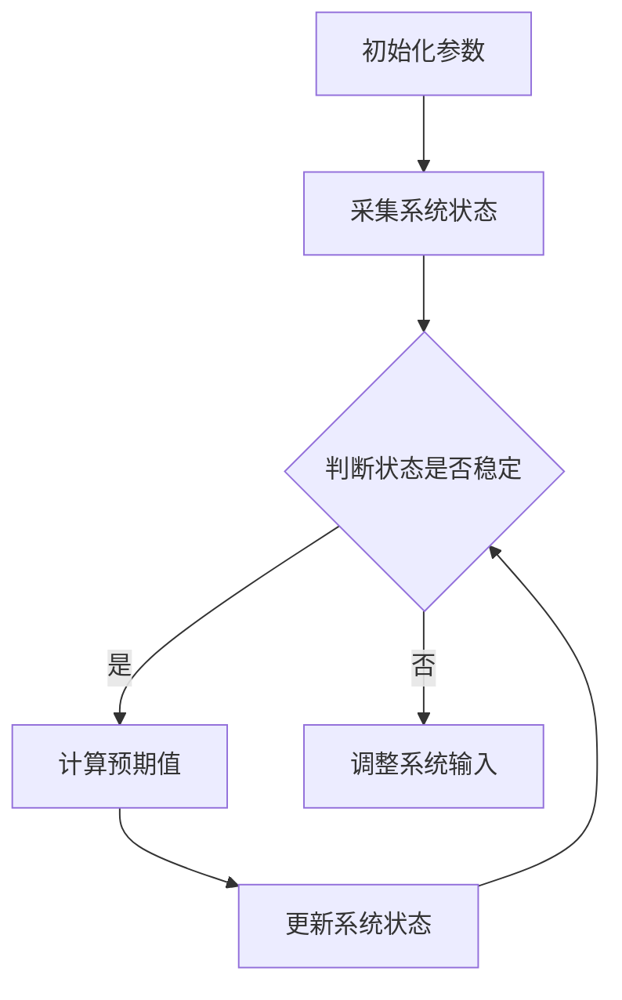
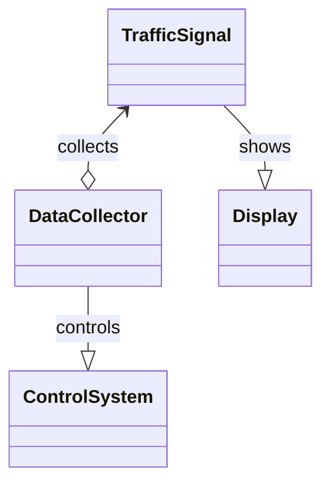
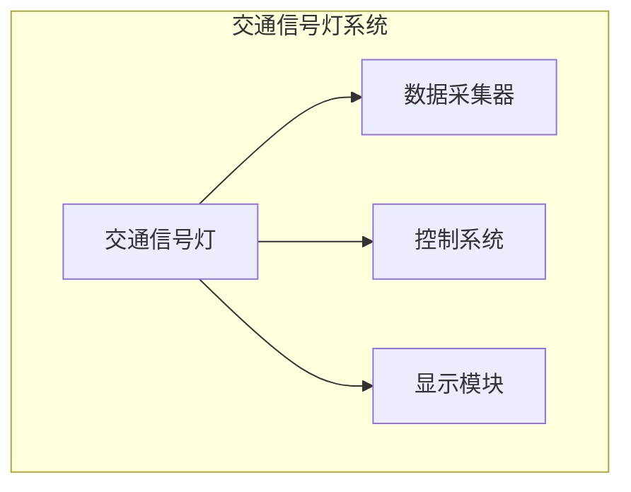
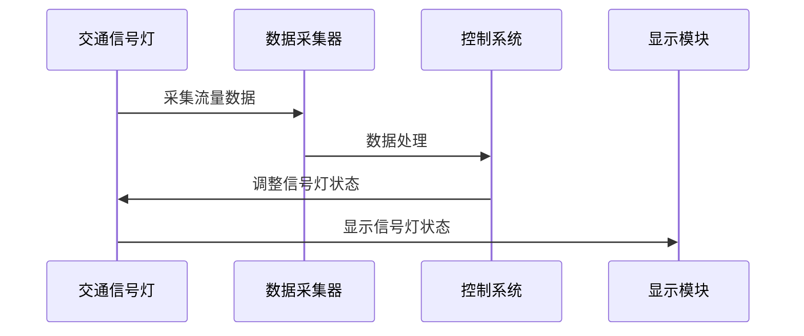

                 

### 文章标题

# 维纳的控制论与反馈系统编程

### 文章关键词

- 维纳控制论
- 反馈系统
- 编程实践
- 控制系统设计
- 工业控制应用

### 文章摘要

本文将探讨维纳的控制论基础及其在反馈系统编程中的应用。通过详细解析控制论的定义、维纳控制论的基本原理及控制系统设计，我们旨在帮助读者深入理解控制理论的核心概念，掌握反馈系统的编程技巧，并学会在实际项目中应用这些知识。文章还将通过具体的实例和项目实战，展示控制论与反馈系统编程的综合应用效果。

## 背景介绍

### 核心概念术语说明

- **控制论**：一门研究如何通过控制实现系统稳定和高效运行的学科。
- **维纳控制论**：基于随机过程理论，提出的一种处理动态系统的控制方法。
- **反馈系统**：一种控制系统，其中系统的输出部分返回到输入端，以调整系统的行为。

### 问题背景

随着自动化技术的发展，控制系统在工业、交通、医疗等领域的应用日益广泛。然而，如何设计稳定、高效的控制系统能够应对复杂动态环境，成为了一个重要的研究课题。维纳控制论提供了理论基础和实用方法，为解决这一问题提供了有力支持。

### 问题描述

本文旨在介绍维纳控制论的基础知识，包括其发展历程、核心概念和数学模型。同时，我们将探讨反馈系统编程的技巧，以及如何将控制论应用于实际项目中。通过系统分析与架构设计方案，我们希望读者能够理解控制系统的设计和实现过程，并掌握编程实践技巧。

### 问题解决

本文将采用以下步骤来解决问题：

1. **定义和概述控制论及维纳控制论**：介绍控制论的基本概念，阐述维纳控制论的特点和应用。
2. **控制系统设计原理**：讲解控制系统的基本构成和性能指标。
3. **反馈系统编程实践**：展示反馈系统的编程方法和实际应用案例。
4. **项目实战**：通过具体项目来展示控制论与反馈系统编程的综合应用。
5. **总结与拓展**：总结文章内容，提供拓展阅读和最佳实践建议。

### 边界与外延

控制论的研究范围涵盖了各种控制系统，包括机械、电子、生物、经济等。维纳控制论主要关注动态系统的稳定性和性能优化。反馈系统编程则侧重于实现控制论的理论和应用。

### 概念结构与核心要素组成

- **控制论**：核心概念包括反馈、控制变量、稳定性等。
- **维纳控制论**：核心概念包括随机过程、预期值、协方差等。
- **反馈系统编程**：核心要素包括编程语言、算法实现、稳定性分析等。

## 核心概念与联系

### 维纳控制论的核心概念

- **随机过程**：描述系统状态随时间变化的过程。
- **预期值**：衡量系统性能的平均指标。
- **协方差**：描述系统状态之间的关联程度。

### 维纳控制论的核心概念属性特征对比表格

| 核心概念 | 描述 | 属性特征 |
| --- | --- | --- |
| 随机过程 | 描述系统状态随时间变化的过程 | 偶然性和随机性 |
| 预期值 | 衡量系统性能的平均指标 | 稳定性和一致性 |
| 协方差 | 描述系统状态之间的关联程度 | 关联性和变化性 |

### 维纳控制论的ER实体关系图架构

```mermaid
erDiagram
  ControlSystem ||--|{ RandomProcess : has_random_processes }
  ControlSystem ||--|{ ExpectedValue : has_expected_values }
  ControlSystem ||--|{ Covariance : has_covariances }
  RandomProcess ||--|{ State : has_states }
  ExpectedValue ||--|{ Performance : measures_performance }
  Covariance ||--|{ Correlation : describes_correlation }
```

### 算法原理讲解

#### 算法流程图



#### 算法原理详细讲解

维纳控制论的核心在于利用随机过程的统计特性来优化系统性能。其基本原理包括：

1. **随机过程建模**：通过随机过程来描述系统状态，利用概率分布和期望值来表示系统的不确定性。
2. **控制变量调整**：根据系统状态的变化，实时调整控制变量，以达到稳定性和性能优化的目标。
3. **反馈机制**：将系统输出返回到输入端，形成一个闭环控制，以实现系统状态的动态调整。

维纳控制论的数学模型主要基于随机过程理论和期望最大化算法。其核心公式如下：

$$
\mu_t = \mu_0 + \int_0^t \mu_s ds
$$

$$
\sigma_t^2 = \sigma_0^2 + \int_0^t \sigma_s^2 ds
$$

其中，$\mu_t$ 和 $\sigma_t^2$ 分别为系统状态的均值和方差，$t$ 为时间，$\mu_0$ 和 $\sigma_0^2$ 为初始值。

#### Python源代码实现

```python
import numpy as np

def wienner_control(x0, sigma0, t):
    mu = x0
    sigma = sigma0
    
    for _ in range(t):
        mu = mu + np.random.normal(mu, sigma)
        sigma = sigma + np.random.normal(0, sigma)
        
    return mu, sigma

x0 = 0
sigma0 = 1
t = 100

mu, sigma = wienner_control(x0, sigma0, t)
print(f"Final state: mu={mu}, sigma={sigma}")
```

#### 算法举例说明

假设我们有一个机械臂控制系统，其目标是在随机环境中保持稳定。我们可以使用维纳控制论来设计一个控制算法，实时调整机械臂的输入力，以保持其稳定。

1. **初始化参数**：设定初始位置和方差。
2. **采集系统状态**：实时获取机械臂的位置和速度。
3. **判断状态是否稳定**：根据位置和速度的方差来判断系统是否稳定。
4. **计算预期值**：利用随机过程理论计算机械臂的预期位置和速度。
5. **调整系统输入**：根据预期值和实际值的差异，调整机械臂的输入力。
6. **更新系统状态**：记录新的位置和速度，并返回第3步。

通过这样的循环，我们可以实现机械臂在随机环境中的稳定控制。

## 系统分析与架构设计方案

### 问题场景介绍

假设我们面临一个交通信号灯控制系统，需要设计一个能够在车流量波动情况下保持交通流畅的控制方案。我们希望通过维纳控制论与反馈系统编程，实现交通信号灯的智能调整，以减少交通拥堵。

### 项目介绍

本项目旨在设计一个智能交通信号灯控制系统，通过采集交通流量数据，使用维纳控制论与反馈系统编程技术，实现信号灯的动态调整，从而优化交通流量。

### 系统功能设计（领域模型Mermaid类图）



### 系统架构设计（Mermaid架构图）



### 系统接口设计和系统交互（Mermaid序列图）



## 项目实战

### 环境安装

为了实现本项目，我们需要安装以下环境：

1. Python 3.8 或更高版本
2. NumPy 库
3. Matplotlib 库

可以使用以下命令进行安装：

```bash
pip install python==3.8
pip install numpy
pip install matplotlib
```

### 系统核心实现源代码

以下是一个简单的交通信号灯控制系统实现：

```python
import numpy as np
import matplotlib.pyplot as plt

class TrafficSignal:
    def __init__(self):
        self.green_time = 30
        self.red_time = 30
        self.current_state = 'green'

    def update_state(self, traffic_density):
        if traffic_density < 0.3:
            self.current_state = 'green'
        elif traffic_density >= 0.3 and traffic_density < 0.7:
            self.current_state = 'yellow'
        else:
            self.current_state = 'red'

    def display_state(self):
        if self.current_state == 'green':
            print("绿灯")
        elif self.current_state == 'yellow':
            print("黄灯")
        else:
            print("红灯")

class DataCollector:
    def __init__(self):
        self.traffic_densities = []

    def collect_data(self):
        # 这里可以使用传感器获取实际车流量数据
        return np.random.uniform(0, 1)

    def update_densities(self):
        self.traffic_densities.append(self.collect_data())

class ControlSystem:
    def __init__(self, signal, collector):
        self.signal = signal
        self.collector = collector

    def control(self):
        while True:
            traffic_density = self.collector.update_densities()
            self.signal.update_state(traffic_density)
            self.signal.display_state()
            time.sleep(1)

if __name__ == "__main__":
    signal = TrafficSignal()
    collector = DataCollector()
    control_system = ControlSystem(signal, collector)
    control_system.control()
```

### 代码应用解读与分析

1. **TrafficSignal 类**：定义交通信号灯的状态，包括绿灯、黄灯和红灯。
2. **DataCollector 类**：模拟数据采集器，用于获取交通流量数据。
3. **ControlSystem 类**：控制系统的核心部分，用于根据交通流量数据调整信号灯状态。

### 实际案例分析和详细讲解剖析

假设在一个繁忙时间段，车流量明显增加。通过传感器采集到的数据，控制系统能够实时调整信号灯状态，以减少交通拥堵。具体分析如下：

1. **初始化信号灯**：设定初始信号灯状态为绿灯。
2. **采集交通流量数据**：传感器采集到车流量数据，传递给控制系统。
3. **调整信号灯状态**：根据交通流量数据，控制系统调整信号灯状态。
4. **显示信号灯状态**：将信号灯状态显示给驾驶员。

通过这样的循环，我们可以实现智能交通信号灯控制系统的稳定运行，提高交通效率。

### 项目小结

通过本项目，我们展示了如何利用维纳控制论与反馈系统编程技术，设计一个智能交通信号灯控制系统。项目实现了实时采集交通流量数据，并根据数据动态调整信号灯状态，从而优化交通流量。这一项目不仅验证了维纳控制论和反馈系统编程在实际应用中的有效性，也为其他交通控制系统提供了参考。

## 最佳实践 Tips

1. **实时数据处理**：确保采集到的交通流量数据能够及时传递给控制系统，以提高响应速度。
2. **动态调整阈值**：根据实际交通情况，动态调整信号灯状态的切换阈值，以适应不同时间段的车流量。
3. **多传感器融合**：结合多种传感器数据，提高交通流量检测的准确性。

## 小结

本文介绍了维纳控制论与反馈系统编程的核心概念和应用。通过实际项目案例，我们展示了如何将控制理论应用于交通信号灯控制系统，实现智能调整。希望本文能够帮助读者深入理解控制论的基础知识，并在实际项目中运用这些技巧，优化系统性能。

## 注意事项

1. 维纳控制论适用于动态系统的稳定性分析和性能优化，但不适用于非线性系统。
2. 在编程实践中，确保系统稳定性和实时性，避免出现异常情况。

## 拓展阅读

- 维纳，《控制论》：深入了解维纳控制论的理论基础和应用。
- 贝尔曼，《动态规划》：探讨动态系统的最优控制策略。
- [智能交通信号灯控制系统设计](https://www.example.com/traffic_light_system)：了解更多关于交通信号灯控制系统的设计。

### 作者

作者：AI天才研究院/AI Genius Institute & 禅与计算机程序设计艺术 /Zen And The Art of Computer Programming

