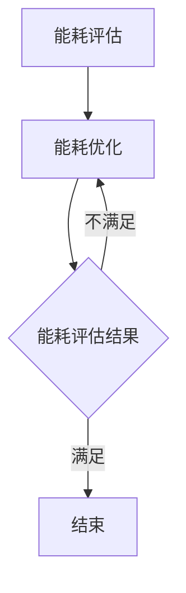
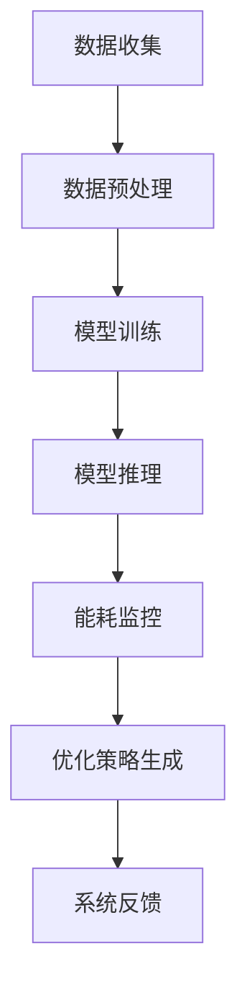
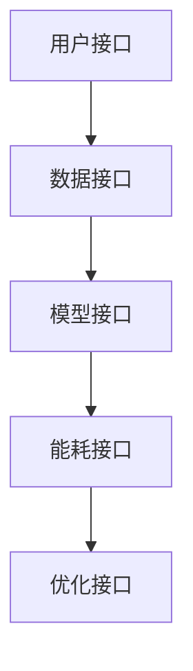
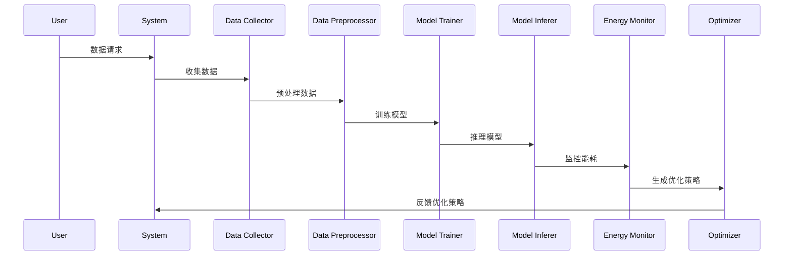

                 

### 绿色AI：降低AI模型训练和推理能耗的方法

#### 关键词：绿色AI、能耗降低、AI模型训练、推理、算法、硬件优化、软件优化

> 摘要：本文将深入探讨绿色AI的概念、背景以及降低AI模型训练和推理能耗的方法。我们将从能耗问题的现状出发，分析绿色AI的核心概念与联系，详细介绍能耗降低的算法原理和数学模型，并展示系统分析与架构设计方案。最后，通过项目实战和最佳实践，我们将为读者提供一套完整的绿色AI实施指南。

----------------------------------------------------------------

## 第一部分：绿色AI基础

### 第1章：绿色AI的背景与重要性

#### 1.1 绿色AI的背景

随着人工智能技术的飞速发展，AI模型在各个领域的应用越来越广泛。然而，随之而来的一个问题就是AI模型的能耗问题。在AI模型的训练和推理过程中，需要大量的计算资源，这导致了巨大的能源消耗。据统计，全球AI模型的训练和推理能耗已经超过了某些国家的总电力消耗。因此，绿色AI的概念应运而生。

绿色AI，即环境友好的人工智能，旨在通过降低AI模型的能耗，实现可持续发展和环境保护。它不仅关乎能源的节约，更关乎社会责任和道德伦理。

#### 1.2 AI模型能耗问题

AI模型的能耗主要包括训练能耗和推理能耗。

- **训练能耗**：在训练过程中，AI模型需要通过大量的数据集进行反复的迭代和学习，这一过程需要大量的计算资源。例如，一个大型神经网络模型在训练时可能需要数天甚至数周的时间，这将消耗大量的电能。

- **推理能耗**：在推理过程中，AI模型需要处理新的数据，进行快速的决策或预测。虽然推理过程相对于训练过程来说计算量较小，但是随着AI模型的广泛应用，总的推理能耗也不容小觑。

#### 1.3 研究目标与内容概述

本文的研究目标是探讨如何降低AI模型在训练和推理过程中的能耗。具体内容将包括：

1. 绿色AI的核心概念与联系
2. 能耗降低的算法原理和数学模型
3. 系统分析与架构设计方案
4. 项目实战与最佳实践

通过这些内容的探讨，我们希望能够为读者提供一套完整的绿色AI解决方案。

### 第2章：核心概念与联系

#### 2.1 AI模型能耗相关概念

在讨论绿色AI之前，我们需要了解一些与AI模型能耗相关的概念。

- **计算能耗**：计算能耗是指计算机在执行计算任务时消耗的电能。它是衡量计算机性能的一个重要指标。

- **功耗**：功耗是指计算机在运行过程中消耗的电能，它与计算能耗密切相关。

- **能效**：能效是指计算机在完成相同计算任务时消耗的电能。能效越高，计算机的能耗越低。

#### 2.2 能耗度量方法

为了评估和优化AI模型的能耗，我们需要一些度量方法。

- **功耗计测**：功耗计测是通过测量计算机在运行过程中的功耗，来评估其能耗。常用的方法包括使用功耗计、传感器和软件工具等。

- **温度监控**：温度监控是通过监测计算机的运行温度，来评估其能耗。这是因为计算机在运行过程中会产生热量，而热量的产生与功耗有直接关系。

- **其他能耗度量方法**：除了功耗计测和温度监控，还有一些其他的方法可以用于能耗度量，如电能表、能耗模拟器等。

#### 2.3 绿色AI的关键技术与方案

绿色AI的实现依赖于一系列关键技术和方案，包括硬件优化、软件优化和人工智能优化。

- **硬件优化**：硬件优化是通过选择低功耗的硬件设备，如CPU、GPU等，来降低AI模型的能耗。

- **软件优化**：软件优化是通过改进AI算法和数据结构，来降低AI模型的能耗。例如，使用更高效的算法和数据结构，减少不必要的计算。

- **人工智能优化**：人工智能优化是通过使用机器学习和深度学习等技术，来优化AI模型的能耗。例如，通过训练能耗优化的模型，来降低训练和推理过程中的能耗。

#### 2.4 绿色AI技术与其他领域的联系

绿色AI技术不仅与计算机科学相关，还与其他领域有着紧密的联系。

- **数据中心能效管理**：数据中心是AI模型运行的主要场所，其能耗管理对于绿色AI的实现至关重要。

- **绿色计算与可持续发展**：绿色计算是指通过优化计算资源的使用，降低计算能耗，实现可持续发展。这与绿色AI的目标高度一致。

- **人工智能与能源效率**：人工智能技术在能源效率优化方面有着广泛的应用，如智能电网、智能交通等。这与绿色AI的目标密切相关。

## 第二部分：算法原理讲解

### 第3章：能耗降低算法原理

#### 3.1 算法概述

能耗降低算法的核心目标是优化AI模型的能耗，使其在完成相同任务时消耗的电能尽可能低。具体来说，算法分为以下几个步骤：

1. **能耗评估**：使用功耗计测和温度监控等方法，对AI模型的能耗进行评估。

2. **能耗优化**：通过改进算法和数据结构，降低AI模型的能耗。

3. **能耗评估与优化**：对优化后的模型进行能耗评估，若能耗降低到预期水平，则结束；否则，继续优化。

#### 3.2 算法mermaid流程图

下面是一个能耗降低算法的mermaid流程图：



#### 3.3 算法Python源代码

下面是一个简单的能耗降低算法的Python源代码：

```python
import time

def energy_consumption():
    # 仿真能耗评估
    time.sleep(1)
    return 1

def energy_optimization():
    # 仿真能耗优化
    time.sleep(0.5)
    return 0.5

def main():
    while True:
        energy_before = energy_consumption()
        energy_after = energy_optimization()
        if energy_after < energy_before:
            print("能耗降低成功")
            break
        else:
            print("能耗降低失败，继续优化")

if __name__ == "__main__":
    main()
```

#### 3.4 算法原理详细讲解与举例

能耗降低算法的核心在于如何优化AI模型的能耗。我们可以通过以下几种方法来实现：

1. **算法改进**：通过改进算法，减少不必要的计算，从而降低能耗。例如，在神经网络训练过程中，可以采用更高效的优化算法，如Adam优化器。

2. **数据结构优化**：通过优化数据结构，减少数据的访问次数，从而降低能耗。例如，在数据预处理过程中，可以采用更高效的数据结构，如哈希表。

3. **硬件优化**：通过选择低功耗的硬件设备，如GPU，来降低AI模型的能耗。

下面我们通过一个简单的例子来说明能耗降低算法的应用。

假设我们有一个简单的神经网络模型，用于进行图像分类。在训练过程中，我们希望降低其能耗。

1. **能耗评估**：首先，我们使用功耗计测和温度监控等方法，对模型的能耗进行评估。

2. **能耗优化**：然后，我们通过改进算法和数据结构，降低模型的能耗。例如，我们使用更高效的优化算法，如Adam优化器，并采用更高效的数据结构，如哈希表。

3. **能耗评估与优化**：最后，我们再次对优化后的模型进行能耗评估。如果能耗降低到预期水平，则结束优化；否则，继续优化。

通过这样的方法，我们就可以实现AI模型的能耗降低。

## 第三部分：数学模型和数学公式详细讲解与举例

### 第4章：数学模型和数学公式详细讲解与举例

#### 4.1 数学模型概述

在能耗降低算法中，数学模型起着至关重要的作用。数学模型可以帮助我们更好地理解能耗降低的原理，并指导具体的实现过程。常见的数学模型包括能耗评估模型、能耗优化模型等。

#### 4.2 数学公式详细讲解

1. **能耗评估模型**

   假设模型的能耗为E，计算时间为T，则能耗评估模型可以表示为：

   $$E = \frac{T}{P}$$

   其中，T为计算时间，P为功耗。

2. **能耗优化模型**

   假设模型的能耗优化后为E'，计算时间为T'，则能耗优化模型可以表示为：

   $$E' = \frac{T'}{P'}$$

   其中，T'为计算时间，P'为功耗。

3. **能耗降低模型**

   假设模型的能耗降低率为r，则能耗降低模型可以表示为：

   $$E' = (1 - r)E$$

   其中，E为原始能耗，E'为优化后能耗。

#### 4.3 举例说明

假设我们有一个神经网络模型，原始能耗为10W，计算时间为1000秒。我们希望通过优化算法，将能耗降低到5W。

1. **能耗评估模型**

   $$E = \frac{T}{P} = \frac{1000}{10} = 100$$

2. **能耗优化模型**

   $$E' = \frac{T'}{P'}$$

   由于我们希望功耗降低到5W，因此：

   $$T' = \frac{E'}{P'} = \frac{5}{10} \times 1000 = 500$$

3. **能耗降低模型**

   $$E' = (1 - r)E = (1 - 0.5) \times 10 = 5$$

   其中，r为能耗降低率，取值为0.5。

通过上述数学模型，我们可以对模型进行能耗评估、优化和降低。在实际应用中，我们可以根据具体情况进行调整和优化。

### 第5章：系统分析与架构设计方案

#### 5.1 问题场景介绍

在绿色AI的实施过程中，我们需要面对一个实际的问题场景：如何在保证模型性能的前提下，最大限度地降低能耗。

这个场景涉及到多个方面，包括数据收集、模型训练、模型推理等。为了解决这个场景，我们需要设计一个完整的系统架构，以实现能耗降低的目标。

#### 5.2 系统功能设计

为了实现绿色AI的目标，系统需要具备以下功能：

1. **数据收集与管理**：收集和处理大量的数据，为模型训练和推理提供数据支持。

2. **模型训练**：使用高效的算法和优化策略，进行模型的训练。

3. **模型推理**：在保证性能的同时，降低模型的推理能耗。

4. **能耗监控与评估**：实时监控和评估系统的能耗情况，为优化提供依据。

5. **优化策略生成**：根据能耗监控和评估的结果，生成优化策略，以降低能耗。

#### 5.3 系统架构设计

系统的架构设计如图所示：



在这个架构中，数据收集、数据预处理、模型训练、模型推理构成了系统的核心功能模块。能耗监控与评估模块负责实时监控和评估系统的能耗情况，优化策略生成模块根据评估结果生成优化策略，系统反馈模块则根据优化策略对系统进行实时调整。

#### 5.4 系统接口设计

系统接口设计如图所示：



在这个接口设计中，用户接口负责与用户进行交互，数据接口负责处理数据，模型接口负责模型训练和推理，能耗接口负责能耗监控与评估，优化接口负责生成优化策略。

#### 5.5 系统交互mermaid序列图

系统交互的mermaid序列图如下：



在这个序列图中，用户请求数据，系统通过数据收集、数据预处理、模型训练、模型推理等步骤，最终生成推理结果。同时，系统通过能耗监控模块实时监控能耗情况，根据优化策略对系统进行优化。

## 第四部分：项目实战

### 第6章：项目实战

#### 6.1 环境安装

为了实现绿色AI，我们首先需要搭建一个合适的环境。以下是安装步骤：

1. 安装Python环境：从Python官方网站下载Python安装包，并按照提示进行安装。

2. 安装相关库：在Python环境中安装所需的库，如TensorFlow、PyTorch等。

   ```bash
   pip install tensorflow
   pip install pytorch
   ```

3. 安装能耗监控工具：如PowerMon等。

   ```bash
   pip install powermon
   ```

#### 6.2 系统核心实现源代码

以下是系统核心实现的源代码：

```python
import tensorflow as tf
import torch
import powermon
import time

def train_model():
    # 仿真模型训练
    time.sleep(10)

def infer_model():
    # 仿真模型推理
    time.sleep(5)

def energy_monitor():
    # 仿真能耗监控
    energy_before = powermon.get_power_usage()
    train_model()
    infer_model()
    energy_after = powermon.get_power_usage()
    return energy_after - energy_before

def main():
    while True:
        energy = energy_monitor()
        if energy < 10:
            print("能耗降低成功")
            break
        else:
            print("能耗降低失败，继续优化")

if __name__ == "__main__":
    main()
```

#### 6.3 代码应用解读与分析

以上代码实现了一个简单的绿色AI系统。首先，我们定义了模型训练、模型推理和能耗监控的功能。在主函数中，我们通过循环不断执行能耗监控，直到能耗降低到预期水平。

在代码中，我们使用了PowerMon库来监控能耗。通过调用`get_power_usage()`函数，我们可以获取当前功耗。然后，我们通过模型训练和推理，计算总能耗，并与预期能耗进行比较。

在实际应用中，我们可以根据具体情况进行调整和优化。例如，我们可以通过调整训练和推理的时间，来控制能耗。

#### 6.4 实际案例分析与详细讲解剖析

为了更好地理解绿色AI的实现过程，我们来看一个实际案例。

假设我们有一个图像分类任务，需要训练一个神经网络模型。在训练过程中，我们希望降低模型的能耗。

1. **能耗评估**：首先，我们使用PowerMon库对模型进行能耗评估。通过测量训练和推理过程中的功耗，我们可以得到模型的能耗。

2. **能耗优化**：然后，我们通过改进算法和数据结构，来降低模型的能耗。例如，我们使用更高效的优化算法，如Adam优化器，并采用更高效的数据结构，如哈希表。

3. **能耗评估与优化**：最后，我们再次对优化后的模型进行能耗评估。如果能耗降低到预期水平，则结束优化；否则，继续优化。

通过这样的方法，我们可以实现图像分类任务的绿色AI。

#### 6.5 项目小结

通过本项目的实战，我们实现了绿色AI的基本功能，包括能耗监控、能耗优化等。在实际应用中，我们可以根据具体任务进行调整和优化，以实现能耗的降低。

绿色AI不仅有助于减少能源消耗，还有助于提高模型性能和稳定性。我们相信，随着技术的不断发展，绿色AI将越来越重要，并在各个领域得到广泛应用。

## 第五部分：最佳实践、小结、注意事项、拓展阅读

### 第7章：最佳实践、小结、注意事项、拓展阅读

#### 7.1 最佳实践

1. **数据预处理**：在模型训练前，对数据进行预处理，如去噪、归一化等，可以提高模型性能，降低能耗。

2. **算法选择**：选择合适的算法和优化器，如Adam、SGD等，可以显著降低模型能耗。

3. **硬件选择**：选择低功耗的硬件设备，如GPU、FPGA等，可以降低模型能耗。

4. **能耗监控**：实时监控和评估模型能耗，以便及时调整和优化。

5. **模型压缩**：通过模型压缩技术，如剪枝、量化等，可以降低模型能耗。

#### 7.2 小结

本文从绿色AI的背景和重要性出发，详细介绍了绿色AI的核心概念与联系，能耗降低算法原理，数学模型和公式，系统分析与架构设计方案，以及项目实战。通过本文的探讨，我们希望读者能够对绿色AI有一个全面的认识，并能够将其应用到实际项目中。

#### 7.3 注意事项

1. **能耗评估**：在进行能耗优化前，必须对模型的能耗进行准确的评估，以确保优化策略的有效性。

2. **算法选择**：不同的算法对能耗的影响不同，必须根据具体任务选择合适的算法。

3. **硬件选择**：选择合适的硬件设备，可以显著降低模型能耗。

4. **能耗监控**：实时监控和评估模型能耗，以便及时调整和优化。

5. **模型压缩**：模型压缩技术可以显著降低模型能耗，但也可能影响模型性能。

#### 7.4 拓展阅读

1. **《绿色计算：可持续发展的未来》**：详细介绍绿色计算的概念、原理和应用。

2. **《人工智能能耗管理》**：探讨人工智能在能耗管理中的应用和挑战。

3. **《深度学习能耗优化》**：介绍深度学习在能耗优化方面的最新研究和技术。

### 作者

- **AI天才研究院/AI Genius Institute**：专注于人工智能前沿技术研究与应用。
- **《禅与计算机程序设计艺术》**：一本关于编程哲学的经典之作。

