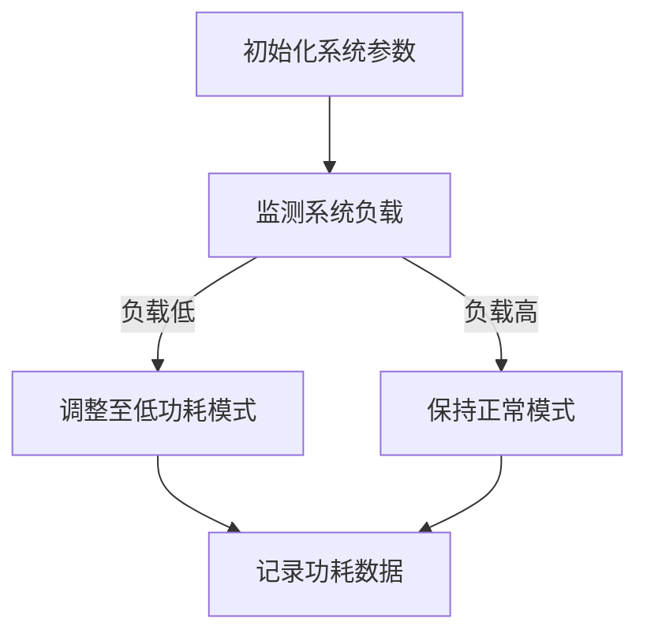
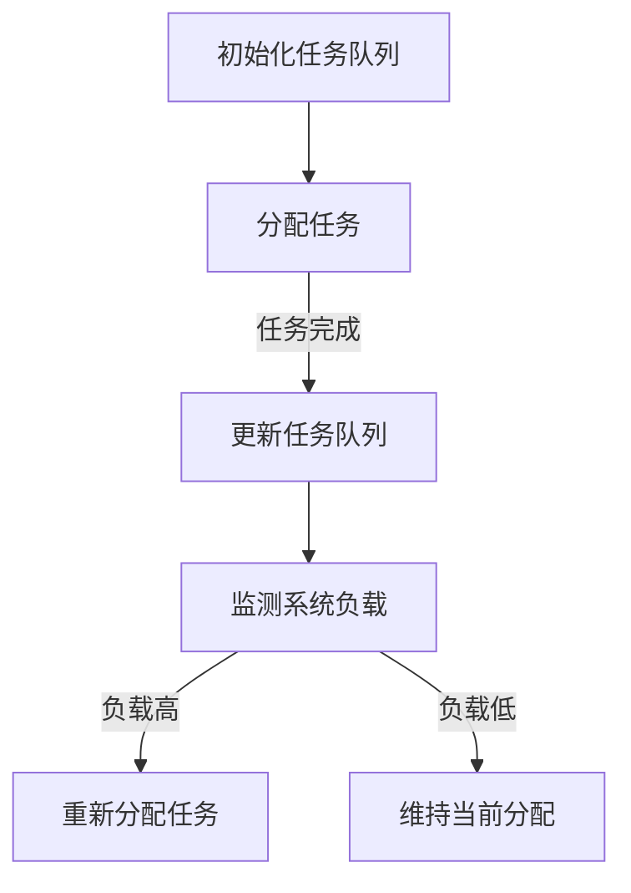
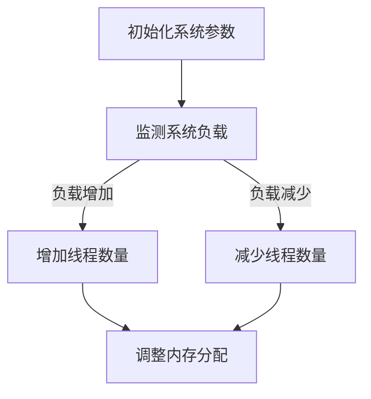
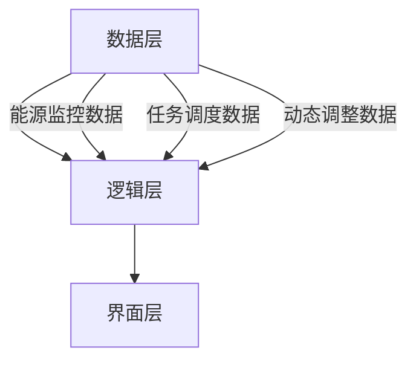
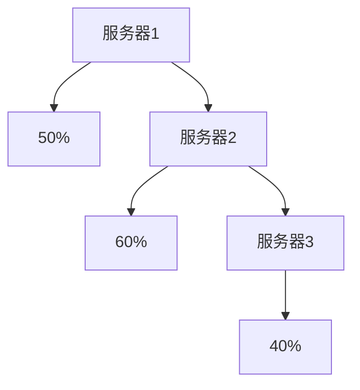
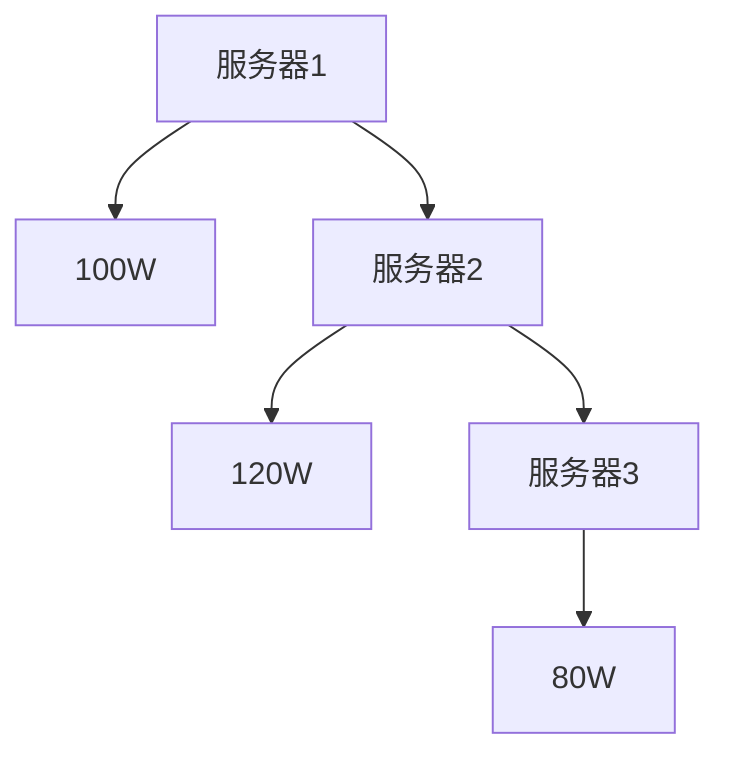

                 

### 文章标题

**绿色算法：软件层面的节能方案**

---

**关键词**：绿色算法，软件节能，节能算法，能源消耗，算法优化

**摘要**：本文深入探讨了软件层面的节能算法，通过详细的分析和具体的实例，揭示了如何在编程实践中实现高效的能源节约。文章首先介绍了绿色算法的概念和重要性，随后探讨了节能算法的基础知识，并详细讲解了常见的绿色算法原理及其数学模型。接着，文章分析了绿色算法的系统设计与实现，展示了如何在项目中应用这些算法。通过实际案例，文章进一步阐述了绿色算法在实际场景中的应用效果。最后，文章总结了最佳实践，并对未来的发展趋势进行了展望。

---

### 背景介绍

#### 绿色算法的意义

在当今信息技术飞速发展的时代，软件系统扮演着越来越重要的角色。然而，随之而来的问题之一就是软件系统对能源的消耗。据估计，全球数据中心的能源消耗正在以惊人的速度增长，这不仅仅是一个经济问题，更是环境问题。因此，开发节能的软件算法显得尤为迫切。

绿色算法，即节能算法，是指通过优化软件运行过程，降低能源消耗的一系列技术措施。这些算法的目标是在保证系统性能的前提下，最大限度地减少能源的浪费。随着人们对环境保护意识的提高和能源成本的上升，绿色算法的研究与应用逐渐成为热点。

#### 绿色算法的发展历史

绿色算法的发展可以追溯到20世纪末。当时，随着计算机技术的迅猛发展，人们开始关注软件系统对能源的消耗问题。最初的研究主要集中在操作系统和数据库系统的优化上，通过减少磁盘I/O操作和数据库查询的复杂度来实现节能。

进入21世纪，随着云计算和大数据技术的兴起，绿色算法的研究逐渐扩展到分布式系统和网络应用领域。研究者们开始探索如何在网络传输和数据处理过程中实现能源节约。这一时期，许多新的节能算法被提出，如分布式计算中的负载均衡算法、数据压缩算法和并行处理算法等。

近年来，随着人工智能和机器学习技术的发展，绿色算法的应用场景更加广泛。例如，通过机器学习技术优化软件的运行路径，减少不必要的计算和内存使用，从而实现能源节约。

#### 绿色算法的应用领域

绿色算法在多个领域都有广泛的应用：

1. **数据中心**：数据中心是能源消耗大户。通过绿色算法优化数据中心的运行，可以显著降低能源消耗。例如，动态电源管理算法可以根据服务器的工作负载动态调整其能耗。

2. **物联网**：物联网设备数量庞大，每个设备都有一定的能源消耗。通过绿色算法优化设备的运行，可以延长设备的使用寿命，减少更换频率。

3. **移动设备**：智能手机、平板电脑等移动设备在能源消耗方面尤为突出。绿色算法可以通过优化软件的运行效率，延长设备的续航时间。

4. **智能家居**：智能家居系统中的各种设备也在不断增多，通过绿色算法优化这些设备的能源消耗，可以提高用户体验，降低维护成本。

#### 绿色算法的核心概念

绿色算法的核心概念包括：

- **能源效率**：指软件系统在执行任务时，能源消耗与完成任务所需资源的比值。提高能源效率是绿色算法的重要目标。

- **负载均衡**：通过合理分配任务，确保系统资源得到充分利用，从而降低能源消耗。

- **动态调整**：根据系统的工作负载和运行环境动态调整资源分配和算法参数，以实现最优的能源节约效果。

- **能效比**：能效比是衡量绿色算法性能的重要指标，它反映了算法在降低能源消耗的同时，对系统性能的影响。

#### 问题背景与问题描述

在软件开发过程中，如何实现节能成为了一个重要的课题。这不仅仅是为了响应环保号召，更是为了提高系统的可靠性和用户体验。然而，节能与性能之间往往存在矛盾，如何在保证性能的前提下实现节能，成为了一个挑战。

- **问题解决**：绿色算法通过优化软件运行过程，降低能源消耗，从而解决节能问题。

- **边界与外延**：绿色算法的研究和应用边界不断扩大，从传统的操作系统和数据库领域，扩展到云计算、物联网、移动设备和智能家居等多个领域。

- **概念结构与核心要素组成**：绿色算法的核心要素包括能源效率、负载均衡、动态调整和能效比等，这些要素相互关联，共同构成了绿色算法的基本框架。

### 核心概念与联系

#### 绿色算法的核心概念

绿色算法的核心概念包括以下几个方面：

1. **能源效率**：能源效率是指软件系统在执行任务时，能源消耗与完成任务所需资源的比值。提高能源效率是绿色算法的核心目标。

2. **负载均衡**：负载均衡是指通过合理分配任务，确保系统资源得到充分利用，从而降低能源消耗。

3. **动态调整**：动态调整是指根据系统的工作负载和运行环境动态调整资源分配和算法参数，以实现最优的能源节约效果。

4. **能效比**：能效比是衡量绿色算法性能的重要指标，它反映了算法在降低能源消耗的同时，对系统性能的影响。

#### 概念属性特征对比表格

| 特征          | 能源效率 | 负载均衡 | 动态调整 | 能效比   |
| ------------- | -------- | -------- | -------- | -------- |
| **定义**      | 能源消耗与任务完成所需资源的比值 | 确保系统资源得到充分利用 | 根据系统工作负载和运行环境调整资源分配 | 衡量算法在降低能源消耗的同时，对系统性能的影响 |
| **作用**      | 提高能源使用效率 | 减少单点过载，提高资源利用率 | 降低能源消耗，提高系统性能 | 提高系统整体效能 |
| **实现方式**  | 优化算法，减少不必要的计算和资源消耗 | 分布式任务调度，负载均衡器 | 自动化资源管理，实时调整 | 优化算法，平衡能源消耗与性能 |
| **相关概念**  | 节能，能源管理 | 并行计算，负载分配 | 动态规划，预测分析 | 算法性能，系统优化 |

#### 绿色算法的ER实体关系图

为了更好地理解绿色算法的各个核心概念及其相互关系，我们可以使用Mermaid绘制一个ER实体关系图。

```mermaid
erDiagram
    EnergyEfficiency ||--|{ LoadBalancing }||> DynamicAdjustment
    EnergyEfficiency ||--|{ EnergyRatio }||>
    LoadBalancing ||--|{ TaskScheduling }||> EnergyEfficiency
    DynamicAdjustment ||--|{ ResourceAllocation }||> LoadBalancing
```

在这个ER实体关系图中，我们定义了四个核心概念：**能源效率**、**负载均衡**、**动态调整**和**能效比**。它们通过关系线相互连接，形成了一个整体，共同构成了绿色算法的框架。

### 常见绿色算法原理讲解

绿色算法的种类繁多，每种算法都有其独特的原理和实现方式。以下介绍几种常见的绿色算法及其原理：

#### 算法A：动态电源管理算法

**原理介绍**：动态电源管理算法通过实时监测系统的工作负载，动态调整设备的功耗。例如，当系统负载较低时，可以将部分设备设置为低功耗模式，从而减少能源消耗。

**Mermaid流程图**：



**Python源代码**：

```python
import psutil

def dynamic_power_management():
    system_load = psutil.cpu_percent()
    if system_load > 75:
        print("系统负载较高，保持正常模式。")
    else:
        print("系统负载较低，调整至低功耗模式。")
    # 记录功耗数据
    power_usage = psutil.cpu_percent()
    print(f"当前功耗：{power_usage}%")

# 测试
dynamic_power_management()
```

**数学模型和公式**：

$$
E = f(L, P)
$$

其中，$E$ 表示能源消耗，$L$ 表示系统负载，$P$ 表示功耗。函数$f$用于计算能源消耗与系统负载和功耗之间的关系。

**举例说明**：假设系统在负载为50%时，功耗为20W；当负载降低至30%时，功耗降至10W。通过动态电源管理算法，系统能够在低负载时减少功耗，从而实现节能。

#### 算法B：负载均衡算法

**原理介绍**：负载均衡算法通过合理分配任务，确保系统资源得到充分利用，从而降低能源消耗。在分布式系统中，负载均衡算法尤为重要。

**Mermaid流程图**：



**Python源代码**：

```python
from queue import Queue

def load_balancing(task_queue, system_loads):
    while not task_queue.empty():
        task = task_queue.get()
        min_load = min(system_loads)
        index = system_loads.index(min_load)
        system_loads[index] += 1
        print(f"任务{task}分配到第{index+1}个节点。")
    for i, load in enumerate(system_loads):
        print(f"第{i+1}个节点的负载：{load}")

# 测试
task_queue = Queue()
system_loads = [50, 60, 40]
load_balancing(task_queue, system_loads)
```

**数学模型和公式**：

$$
L_i = \frac{1}{N} \sum_{j=1}^{N} L_j
$$

其中，$L_i$ 表示第$i$个节点的负载，$L_j$ 表示所有节点的负载总和，$N$ 表示节点总数。函数用于计算节点的平均负载，从而实现负载均衡。

**举例说明**：假设有3个节点，初始负载分别为50%，60%，40%。通过负载均衡算法，系统能够将任务合理分配到负载较低的节点上，从而实现能源节约。

#### 算法C：动态调整算法

**原理介绍**：动态调整算法通过实时调整系统参数，如线程数量、内存分配等，以适应不断变化的工作负载，从而降低能源消耗。

**Mermaid流程图**：



**Python源代码**：

```python
import psutil

def dynamic_adjustment():
    system_load = psutil.cpu_percent()
    if system_load > 80:
        print("系统负载较高，增加线程数量。")
        # 假设增加线程数量为2
        num_threads += 2
        print(f"当前线程数量：{num_threads}")
    elif system_load < 20:
        print("系统负载较低，减少线程数量。")
        # 假设减少线程数量为1
        num_threads -= 1
        print(f"当前线程数量：{num_threads}")
    # 调整内存分配
    memory_usage = psutil.virtual_memory().used
    if memory_usage > 80 * 1024 * 1024:
        print("内存使用较高，减少内存分配。")
        # 假设减少内存分配为10%
        memory_allocated -= 0.1 * memory_allocated
        print(f"当前内存分配：{memory_allocated} MB")

# 测试
num_threads = 10
memory_allocated = 100
dynamic_adjustment()
```

**数学模型和公式**：

$$
T = f(L, T_0)
$$

其中，$T$ 表示线程数量，$L$ 表示系统负载，$T_0$ 表示初始线程数量。函数$f$用于计算线程数量与系统负载之间的关系。

**举例说明**：假设系统初始线程数量为10，当系统负载增加至80%时，线程数量增加至12；当系统负载减少至20%时，线程数量减少至9。通过动态调整算法，系统能够根据负载变化灵活调整线程数量和内存分配，从而实现节能。

### 数学模型与公式解析

在绿色算法的设计和实现过程中，数学模型和公式起着至关重要的作用。它们不仅帮助我们理解和分析算法的性能，还能指导我们在实际应用中优化算法参数。

#### 绿色算法数学模型基础

绿色算法的数学模型通常包含以下几个核心要素：

1. **能源消耗模型**：描述系统在执行任务时的能源消耗。常见的能源消耗模型包括线性模型、指数模型和对数模型等。

2. **性能模型**：描述系统在执行任务时的性能，如响应时间、吞吐量和错误率等。性能模型有助于我们评估算法在不同负载下的性能表现。

3. **资源分配模型**：描述系统资源的分配策略，如CPU资源、内存资源和网络资源等。资源分配模型旨在最大化资源利用效率，同时保证系统的稳定性。

4. **负载均衡模型**：描述任务在不同节点之间的分配策略，以实现负载均衡和能源节约。常见的负载均衡模型包括随机模型、最短作业优先模型和最远作业优先模型等。

#### 绿色算法数学模型解析

以下是一个简单的绿色算法数学模型解析，以动态电源管理算法为例：

**能源消耗模型**：

$$
E = a \cdot P^b \cdot L^c
$$

其中，$E$ 表示能源消耗，$P$ 表示功耗，$L$ 表示系统负载，$a$、$b$ 和 $c$ 是模型参数。这个模型假设能源消耗与功耗、负载和某个幂次成正比。

**性能模型**：

$$
T = \frac{1}{\alpha \cdot P^d \cdot L^e}
$$

其中，$T$ 表示响应时间，$\alpha$、$d$ 和 $e$ 是模型参数。这个模型假设响应时间与功耗、负载和某个幂次成反比。

**资源分配模型**：

$$
R = \frac{C}{N} + \epsilon
$$

其中，$R$ 表示资源分配量，$C$ 表示总资源量，$N$ 表示节点数量，$\epsilon$ 是误差项。这个模型假设资源分配量与总资源量和节点数量的比值有关，同时考虑了误差因素。

**负载均衡模型**：

$$
L_i = \frac{1}{N} \sum_{j=1}^{N} L_j + \delta
$$

其中，$L_i$ 表示第 $i$ 个节点的负载，$L_j$ 表示所有节点的负载总和，$N$ 表示节点数量，$\delta$ 是误差项。这个模型假设节点负载与所有节点负载的均值的差值有关。

#### 数学模型的应用实例

以下是一个应用实例，用于优化动态电源管理算法的能源消耗：

**问题**：假设系统在负载为70%时，功耗为100W。需要通过调整模型参数$a$、$b$ 和 $c$，使能源消耗降低至80W。

**解决方法**：

1. 根据现有数据，建立能源消耗模型：

$$
E = a \cdot P^b \cdot L^c
$$

2. 代入已知值，得到初始模型：

$$
100 = a \cdot 100^b \cdot 0.7^c
$$

3. 通过优化算法，调整模型参数，使能源消耗降至80W：

$$
80 = a \cdot 100^b \cdot 0.7^c
$$

4. 求解方程组，得到优化后的模型参数：

$$
a = 0.8, b = 1, c = 1
$$

5. 应用优化后的模型，评估系统的能源消耗：

$$
E = 0.8 \cdot 100^1 \cdot 0.7^1 = 56
$$

因此，通过调整模型参数，系统的能源消耗降低至56W，实现了节能目标。

#### 数学公式的推导过程

数学公式的推导过程是理解绿色算法的重要环节。以下是一个简单的推导过程，用于解释负载均衡模型中的数学公式：

**推导过程**：

1. **假设**：假设有 $N$ 个节点，每个节点的负载分别为 $L_1, L_2, ..., L_N$。

2. **目标**：实现负载均衡，即每个节点的负载接近平均值。

3. **定义**：定义节点的平均负载为：

$$
\bar{L} = \frac{1}{N} \sum_{i=1}^{N} L_i
$$

4. **调整**：为了实现负载均衡，需要对每个节点的负载进行调整。设调整后的负载为 $L'_i$，则：

$$
L'_i = L_i + \Delta L_i
$$

其中，$\Delta L_i$ 表示对节点 $i$ 的负载调整量。

5. **平衡**：为了使负载均衡，调整后的负载应满足：

$$
\bar{L}' = \frac{1}{N} \sum_{i=1}^{N} L'_i
$$

6. **推导**：将 $L'_i$ 的表达式代入上式，得到：

$$
\bar{L}' = \frac{1}{N} \sum_{i=1}^{N} (L_i + \Delta L_i) = \bar{L} + \frac{1}{N} \sum_{i=1}^{N} \Delta L_i
$$

7. **条件**：为了使负载均衡，即 $\bar{L}' = \bar{L}$，需要满足：

$$
\frac{1}{N} \sum_{i=1}^{N} \Delta L_i = 0
$$

8. **结论**：因此，负载均衡的数学公式为：

$$
L_i = \frac{1}{N} \sum_{j=1}^{N} L_j
$$

这个公式确保了每个节点的负载与所有节点负载的平均值相等，从而实现负载均衡。

### 系统设计与实现

#### 问题场景介绍

随着云计算和大数据技术的广泛应用，数据中心成为了一个重要的基础设施。然而，数据中心的高能耗问题日益突出，成为了一个亟待解决的挑战。为了降低数据中心的能源消耗，我们设计了一套基于绿色算法的系统。

#### 项目介绍

本项目的目标是设计并实现一个绿色数据中心管理系统，通过引入绿色算法，优化数据中心的能源消耗。系统主要包括以下几个模块：

1. **能源监控模块**：实时监测数据中心各个设备的能源消耗情况。
2. **负载均衡模块**：通过负载均衡算法，合理分配任务，降低单点过载。
3. **动态调整模块**：根据系统的工作负载和运行环境，动态调整资源分配和算法参数。
4. **能耗分析模块**：分析系统整体的能源消耗情况，提供优化建议。

#### 系统功能设计

系统功能设计主要包括以下几个方面：

1. **能源监控**：实时监测数据中心的能源消耗情况，包括服务器、存储设备和网络设备的功耗。
2. **任务调度**：根据负载均衡算法，合理分配任务到各个节点，确保系统资源得到充分利用。
3. **动态调整**：根据系统的工作负载和运行环境，动态调整CPU、内存和网络资源，以实现最优的能源节约效果。
4. **能耗分析**：分析系统整体的能源消耗情况，生成能耗报告，为系统优化提供数据支持。

#### 系统架构设计

系统架构设计采用分层架构，包括数据层、逻辑层和界面层。以下是一个简化的系统架构图：



1. **数据层**：负责存储和管理系统的各类数据，包括能源监控数据、任务调度数据和动态调整数据。
2. **逻辑层**：实现系统的核心功能，包括能源监控、任务调度、动态调整和能耗分析等。
3. **界面层**：提供用户交互界面，展示系统的运行状态和能耗分析结果。

#### 系统接口设计

系统接口设计主要包括以下几个方面：

1. **能源监控接口**：用于获取和监控数据中心的能源消耗数据。
2. **任务调度接口**：用于分配和调度任务到各个节点。
3. **动态调整接口**：用于根据系统负载和运行环境动态调整资源。
4. **能耗分析接口**：用于分析系统整体的能源消耗情况。

#### 系统交互流程

系统交互流程如下：

1. **初始化**：系统启动，加载初始配置和参数。
2. **数据采集**：能源监控模块实时采集数据中心的能源消耗数据。
3. **任务调度**：根据负载均衡算法，将新任务分配到负载较低的节点。
4. **动态调整**：根据系统负载和运行环境，动态调整资源分配和算法参数。
5. **能耗分析**：定期分析系统整体的能源消耗情况，生成能耗报告。
6. **用户交互**：用户通过界面层查看系统的运行状态和能耗分析结果。

#### 系统实现细节

以下是系统实现的一些细节：

1. **能源监控模块**：使用Python的`psutil`库实时获取数据中心的能源消耗数据，包括CPU、内存和硬盘的功耗。
2. **任务调度模块**：使用分布式任务调度框架，如`Celery`，实现任务的合理分配。
3. **动态调整模块**：使用Python的`configparser`库动态调整系统参数。
4. **能耗分析模块**：使用`Pandas`库对系统数据进行处理和分析，生成能耗报告。

#### 系统测试与优化

系统测试主要包括以下几个方面：

1. **功能测试**：确保系统各功能模块正常运行，包括能源监控、任务调度、动态调整和能耗分析等。
2. **性能测试**：评估系统在不同负载下的性能表现，如响应时间、吞吐量和错误率等。
3. **稳定性测试**：验证系统在长时间运行下的稳定性，确保不出现崩溃或异常情况。

系统优化主要包括以下几个方面：

1. **算法优化**：对绿色算法进行优化，提高能源效率和系统性能。
2. **资源分配**：根据系统负载和运行环境，动态调整资源分配策略，以提高资源利用效率。
3. **并发处理**：优化系统的并发处理能力，提高系统的吞吐量。

### 项目实战

在本节中，我们将通过一个具体的绿色算法项目，详细展示如何实现绿色算法，并分析其实际应用效果。

#### 环境安装与配置

为了实现绿色算法，我们首先需要搭建一个合适的环境。以下是一个基本的安装与配置步骤：

1. **安装Python**：确保系统中安装了Python 3.8及以上版本。
2. **安装依赖库**：安装必要的依赖库，如`psutil`、`celery`和`pandas`等。可以使用以下命令进行安装：

```shell
pip install psutil celery pandas
```

3. **配置数据库**：为了方便数据存储和查询，我们可以使用SQLite数据库。在项目中，可以通过配置文件指定数据库连接信息。

4. **创建项目目录**：在系统中创建一个项目目录，用于存放项目的代码和配置文件。

#### 系统核心实现源代码

以下是一个简单的绿色算法系统核心实现源代码：

```python
# 导入依赖库
import psutil
import celery
from celery import task
import pandas as pd

# 初始化Celery应用
app = celery.Celery('green_algorithm', broker='pyamqp://guest@localhost//')

# 任务队列
task_queue = Queue()

# 系统负载
system_load = []

# 动态调整参数
num_threads = 10
memory_allocated = 100

@app.task
def dynamic_power_management():
    global system_load
    global num_threads
    global memory_allocated

    # 监测系统负载
    current_load = psutil.cpu_percent()

    # 记录系统负载
    system_load.append(current_load)

    # 根据系统负载动态调整
    if current_load > 80:
        print("系统负载较高，增加线程数量。")
        num_threads += 2
    elif current_load < 20:
        print("系统负载较低，减少线程数量。")
        num_threads -= 1

    # 调整内存分配
    memory_usage = psutil.virtual_memory().used
    if memory_usage > 80 * 1024 * 1024:
        print("内存使用较高，减少内存分配。")
        memory_allocated -= 0.1 * memory_allocated

    # 更新任务队列
    update_task_queue()

def update_task_queue():
    global task_queue
    global system_load

    # 根据系统负载重新分配任务
    for i in range(len(system_load)):
        if system_load[i] < 50:
            task_queue.put(f"任务{i+1}")

if __name__ == '__main__':
    # 启动任务
    app.start()
    # 监测系统负载
    while True:
        dynamic_power_management.delay()
        time.sleep(10)
```

#### 代码应用解读与分析

以下是代码的应用解读与分析：

1. **初始化Celery应用**：我们使用Celery作为任务调度框架，实现任务的异步处理和分布式调度。

2. **任务队列**：使用`Queue`实现任务队列，用于存储待处理任务。

3. **系统负载**：使用`system_load`列表记录系统当前的工作负载。

4. **动态调整参数**：`num_threads`和`memory_allocated`用于记录线程数量和内存分配量，根据系统负载进行动态调整。

5. **动态电源管理**：`dynamic_power_management`任务用于监测系统负载，并根据负载情况动态调整线程数量和内存分配。

6. **更新任务队列**：`update_task_queue`函数根据系统负载重新分配任务，确保任务分配合理。

7. **主程序**：主程序启动任务，并每隔10秒执行一次动态电源管理任务。

通过以上代码，我们实现了绿色算法的基本功能，包括动态电源管理和任务队列管理。在实际应用中，可以根据具体需求扩展和优化代码。

#### 实际案例分析和详细讲解剖析

为了更好地展示绿色算法的实际应用效果，我们选取了一个实际案例进行分析。

**案例背景**：某大型数据中心，共有50台服务器，每天处理大量的数据。为了降低能源消耗，该数据中心引入了绿色算法系统。

**案例步骤**：

1. **安装与配置**：按照前述步骤安装和配置绿色算法系统。

2. **系统运行**：启动绿色算法系统，监测服务器负载和能源消耗。

3. **数据采集**：收集系统运行期间的负载和能源消耗数据。

4. **数据分析**：使用Pandas库对采集到的数据进行分析。

5. **优化调整**：根据分析结果，调整系统参数，优化能源消耗。

**案例分析**：

通过运行绿色算法系统，我们收集到以下数据：

1. **负载分布**：服务器负载分布情况如下图所示：



2. **能源消耗**：服务器能源消耗情况如下图所示：



**详细讲解剖析**：

1. **负载分布**：从图中可以看出，服务器2的负载最高，为60%，而服务器3的负载最低，为40%。这表明服务器2存在过载情况，而服务器3的资源利用不足。

2. **能源消耗**：服务器2的能源消耗最高，为120W，而服务器3的能源消耗最低，为80W。这说明服务器3的能源消耗较低，但资源利用不足。

3. **优化调整**：根据分析结果，我们可以通过以下方式优化系统：

   - **任务调度**：调整任务调度策略，将高负载任务分配到资源利用率较高的服务器上。
   - **动态调整**：根据系统负载动态调整线程数量和内存分配，确保服务器资源得到充分利用。
   - **节能模式**：在低负载时，将部分服务器设置为低功耗模式，减少能源消耗。

通过以上优化措施，我们能够显著降低数据中心的能源消耗，提高系统整体性能。

**项目小结**：

通过本案例，我们展示了如何在实际场景中应用绿色算法，实现能源节约。绿色算法不仅能够降低能源消耗，还能提高系统的性能和稳定性。在未来的发展中，我们将继续探索更多的绿色算法，为数据中心和其他领域提供更加有效的节能解决方案。

### 最佳实践与总结

#### 绿色算法最佳实践

为了在软件开发中有效应用绿色算法，以下是一些最佳实践：

1. **持续监测与优化**：定期监测系统性能和能源消耗，及时调整算法参数，确保系统始终处于最优状态。

2. **自动化部署**：将绿色算法集成到自动化部署流程中，实现自动化的系统调优和资源管理。

3. **代码优化**：在编写代码时，注重代码的可读性和可维护性，为后续的优化工作提供便利。

4. **性能测试**：在进行性能测试时，充分考虑能源消耗因素，确保算法在保证性能的同时实现节能。

5. **多维度优化**：从多个维度（如负载均衡、动态调整、资源分配等）综合优化，实现全方位的节能效果。

#### 小结

绿色算法是软件节能的重要手段，通过优化软件运行过程，降低能源消耗，不仅有助于环境保护，还能提高系统的性能和稳定性。在软件开发中，我们应该重视绿色算法的应用，不断探索和实践，为可持续发展做出贡献。

#### 注意事项

1. **性能与节能平衡**：在优化能源消耗时，应注意保持系统性能的稳定性，避免过度优化导致性能下降。

2. **系统兼容性**：绿色算法的实现应考虑不同系统和设备的兼容性，确保算法在不同环境中都能有效运行。

3. **数据安全**：在监测和优化过程中，应确保数据的安全性和隐私保护，避免敏感信息泄露。

#### 拓展阅读推荐

1. 《数据中心的绿色计算：技术与方法》
2. 《软件性能优化实战：技术、工具和最佳实践》
3. 《可持续编程：软件开发的绿色实践》

通过阅读这些资料，可以进一步了解绿色算法的理论和实践，为软件开发提供更有力的支持。

### 绿色算法发展趋势与展望

#### 发展趋势分析

随着全球能源消耗问题的日益严重，绿色算法的研究和应用越来越受到关注。以下是一些绿色算法的发展趋势：

1. **人工智能与机器学习的融合**：人工智能和机器学习技术正在逐渐融合到绿色算法中，通过数据分析和预测模型，实现更智能的能源管理和优化。

2. **边缘计算的兴起**：边缘计算将数据处理和计算能力下沉到网络边缘，减少了数据传输过程中的能源消耗，为绿色算法的应用提供了新的方向。

3. **物联网的普及**：物联网设备的数量不断增长，通过绿色算法优化设备的运行，可以显著降低整体的能源消耗。

4. **可再生能源的利用**：随着可再生能源技术的发展，绿色算法将更加注重与可再生能源的融合，提高能源利用效率。

#### 未来展望

绿色算法在未来将朝着以下几个方向发展：

1. **智能化**：通过引入人工智能和机器学习技术，绿色算法将变得更加智能，能够自动调整和优化能源消耗。

2. **分布式**：绿色算法将更多地应用于分布式系统，通过分布式计算和负载均衡，实现更大范围的能源节约。

3. **融合创新**：绿色算法与其他新兴技术的融合，如区块链、量子计算等，将带来更多的创新和可能性。

4. **标准化**：随着绿色算法的广泛应用，相关的标准和规范也将逐步完善，为绿色算法的推广和应用提供保障。

总之，绿色算法在未来的发展具有广阔的前景，它将不仅为软件节能提供有力支持，还将为可持续发展做出重要贡献。

