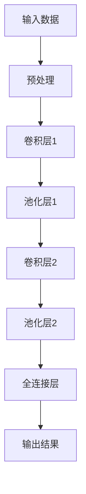
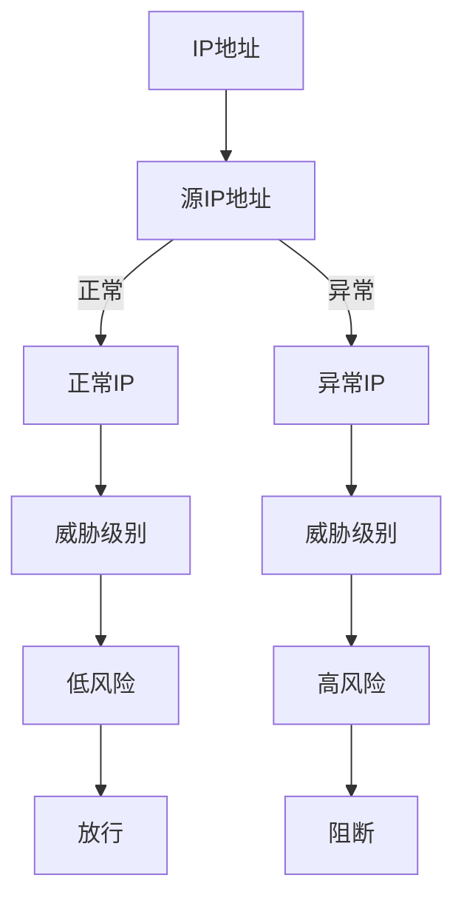
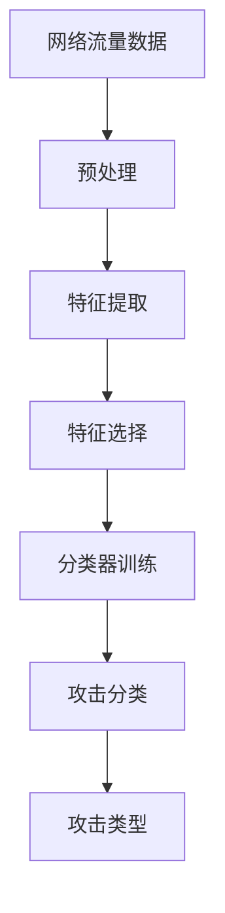
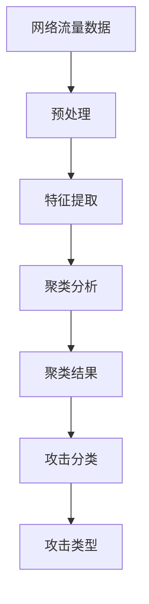
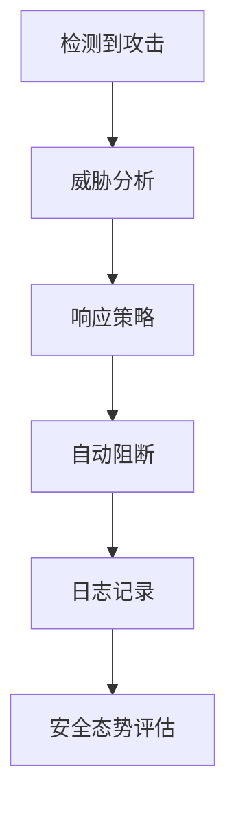

                 


## 网络安全中的AI应用：机遇与风险

关键词：网络安全，人工智能，威胁检测，自动化响应，风险管控

摘要：随着网络技术的飞速发展，网络安全问题日益严峻。人工智能（AI）技术的出现为网络安全领域带来了新的机遇，但同时也伴随着一定的风险。本文将深入探讨AI在网络安全中的应用，分析其中的机遇与风险，并提出相应的解决策略。

### 第1章: 引言与背景介绍

#### 1.1 问题背景

网络安全一直是信息技术领域的重要课题。随着网络技术的迅猛发展，网络攻击手段日益翻新，传统的网络安全技术已经难以应对复杂多变的网络威胁。近年来，人工智能（AI）技术的快速发展为网络安全领域带来了新的机遇和挑战。AI在网络安全中的应用，不仅有助于提升安全防护能力，还能在威胁检测、响应和恢复等方面发挥关键作用。

#### 1.2 问题描述

在网络安全中，AI的应用主要包括以下几个方面：

1. **威胁检测与预测**：利用AI技术对网络流量、日志数据等进行分析，实时检测潜在的攻击行为。
2. **攻击识别与分类**：通过机器学习算法，对攻击行为进行识别和分类，提高攻击识别的准确性。
3. **自动化响应**：AI技术可以帮助安全系统实现自动化的攻击响应，降低安全事件的响应时间。
4. **威胁情报分析**：利用AI技术对威胁情报进行深度分析，发现攻击者的攻击模式和手法，为网络安全策略制定提供依据。

#### 1.3 问题解决

AI在网络安全中的应用，可以为以下几个方面提供解决方案：

1. **提升检测能力**：通过深度学习等技术，实现对未知攻击的高效检测。
2. **增强分析能力**：利用自然语言处理技术，对安全日志和威胁情报进行分析，提高安全事件的识别和分析效率。
3. **优化响应机制**：通过自动化响应技术，降低安全事件的响应时间，提高应急处理效率。
4. **加强防御策略**：基于AI的威胁情报分析，制定更加精准和有效的网络安全策略。

#### 1.4 边界与外延

AI在网络安全中的应用，不仅涉及技术层面的创新，还需要在政策、法律和伦理等方面进行综合考虑。边界与外延包括：

1. **技术边界**：如何实现AI在网络安全中的有效应用，需要突破算法、模型和数据处理等方面的技术瓶颈。
2. **法律边界**：AI在网络安全中的应用可能涉及个人隐私和数据保护等问题，需要在法律框架内进行规范。
3. **伦理边界**：如何平衡AI在网络安全中的效率与伦理问题，是未来需要关注的重要议题。

#### 1.5 概念结构与核心要素组成

AI在网络安全中的应用，涉及以下核心概念和要素：

1. **算法与模型**：包括深度学习、神经网络、贝叶斯分类等算法和模型。
2. **数据处理**：包括数据采集、数据预处理、数据存储等数据处理环节。
3. **系统架构**：包括前端数据采集、后端分析处理、安全策略制定与执行等系统架构。
4. **安全策略**：包括威胁检测与响应、安全态势感知、威胁情报分析等安全策略。

### 第2章: AI基础理论与技术原理

#### 2.1 AI概述

##### 2.1.1 AI的定义与发展历程

人工智能（AI）是指使计算机系统模拟人类智能行为的技术。自1956年达特茅斯会议以来，AI经历了数十年的发展，可以分为以下几个阶段：

1. **人工智能1.0**：基于规则推理的系统，如专家系统。
2. **人工智能2.0**：基于知识的系统，如知识图谱。
3. **人工智能3.0**：基于机器学习的系统，如深度学习。

##### 2.1.2 AI的核心技术与分类

AI的核心技术包括机器学习、深度学习、自然语言处理、计算机视觉等。根据AI的强弱和应用领域，可以将AI分为以下几类：

1. **弱AI**：在特定任务上表现出人类智能水平的AI，如语音识别、图像识别等。
2. **强AI**：具有人类所有智能水平的AI，目前尚未实现。

#### 2.2 机器学习基础

##### 2.2.1 机器学习的定义与分类

机器学习是一种使计算机系统通过数据学习并做出预测或决策的技术。根据学习方式，机器学习可以分为以下几类：

1. **监督学习**：有监督的机器学习方法，如线性回归、决策树等。
2. **无监督学习**：无监督的机器学习方法，如聚类、降维等。
3. **半监督学习**：结合有监督和无监督学习的方法，如标签传播等。

##### 2.2.2 常见机器学习算法

常见的机器学习算法包括：

1. **线性回归**：用于预测线性关系的模型。
2. **决策树**：用于分类和回归的树形模型。
3. **支持向量机**：用于分类和回归的线性模型。
4. **神经网络**：用于复杂函数建模的层次网络结构。

#### 2.3 深度学习原理

##### 2.3.1 深度学习的定义与特点

深度学习是一种基于多层神经网络的学习方法，能够自动从大量数据中提取特征。深度学习的特点包括：

1. **非线性变换**：通过多层非线性变换，提取数据的深层特征。
2. **端到端学习**：直接从原始数据到预测输出，无需人工设计特征。
3. **并行计算**：利用GPU等硬件加速器，实现高效计算。

### 第3章: AI在网络安全中的应用

#### 3.1 威胁检测与预测

##### 3.1.1 深度学习在威胁检测中的应用

深度学习技术在网络安全中的威胁检测方面有着广泛的应用。例如，利用卷积神经网络（CNN）可以对网络流量数据进行实时分析，识别潜在的网络攻击。以下是一个简单的CNN模型流程图：



##### 3.1.2 威胁预测与风险评估

利用机器学习算法，可以对网络威胁进行预测和风险评估。例如，可以使用决策树模型来预测某个IP地址是否具有潜在威胁。以下是一个简单的决策树流程图：



#### 3.2 攻击识别与分类

##### 3.2.1 基于特征提取的攻击识别

攻击识别是网络安全中的重要任务。利用机器学习算法，可以对攻击行为进行特征提取和分类。以下是一个简单的特征提取和分类流程：



##### 3.2.2 基于聚类分析的攻击分类

聚类分析是一种无监督学习方法，可以用于攻击分类。以下是一个简单的聚类分析流程：



#### 3.3 自动化响应

##### 3.3.1 自动化响应机制

自动化响应是网络安全中的重要一环。利用机器学习算法，可以实现自动化的攻击响应。以下是一个简单的自动化响应流程：



##### 3.3.2 自动化响应的优势

自动化响应具有以下优势：

1. **快速响应**：自动化响应可以降低安全事件的响应时间，提高应急处理效率。
2. **减少误报**：通过机器学习算法，可以实现更加精确的攻击识别，减少误报率。
3. **资源优化**：自动化响应可以减轻安全人员的工作负担，优化资源配置。

#### 3.4 威胁情报分析

##### 3.4.1 威胁情报的概念

威胁情报是指关于网络威胁的信息，包括攻击者的身份、攻击手段、攻击目标等。威胁情报分析是网络安全中的重要任务，可以帮助组织制定更加有效的安全策略。

##### 3.4.2 威胁情报分析流程

威胁情报分析通常包括以下几个步骤：

1. **数据收集**：收集与网络威胁相关的数据，如攻击事件、漏洞信息等。
2. **数据预处理**：对收集到的数据进行清洗、归一化等预处理。
3. **特征提取**：提取与网络威胁相关的特征，如攻击类型、攻击者身份等。
4. **模式识别**：利用机器学习算法，对威胁特征进行模式识别，发现攻击者的攻击模式和手法。
5. **策略制定**：根据威胁情报分析结果，制定相应的安全策略。

### 第4章: AI在网络安全中的应用风险

#### 4.1 数据隐私与安全风险

AI在网络安全中的应用涉及到大量敏感数据的处理，如网络流量数据、用户隐私数据等。这些数据的安全性和隐私性保护是AI应用中的关键问题。

##### 4.1.1 数据泄露风险

如果AI系统未能妥善保护数据，可能导致数据泄露，从而给组织和个人带来严重损失。

##### 4.1.2 数据滥用风险

AI系统可能被攻击者利用，对数据进行恶意篡改或滥用，从而危害网络安全。

##### 4.1.3 数据隐私风险

AI系统在数据处理过程中，可能涉及用户隐私数据的收集和使用，需要严格遵守数据隐私保护法律法规。

#### 4.2 模型安全风险

AI模型在网络安全中的应用可能面临以下安全风险：

##### 4.2.1 模型可解释性不足

AI模型，尤其是深度学习模型，通常具有高度的非线性特征提取能力，但模型内部的决策过程往往难以解释。这可能导致在应对未知攻击时，模型的表现不佳。

##### 4.2.2 模型对抗性攻击

攻击者可能利用对抗性样本，对AI模型进行攻击，使其失效或产生错误的预测。

##### 4.2.3 模型过拟合

AI模型在训练过程中可能出现过拟合现象，导致在真实环境中表现不佳。

#### 4.3 法律与伦理风险

AI在网络安全中的应用涉及多个法律和伦理问题，如数据隐私保护、模型透明度、责任归属等。

##### 4.3.1 数据隐私保护

AI系统在数据处理过程中，需要严格遵守数据隐私保护法律法规，确保用户隐私数据的安全。

##### 4.3.2 模型透明度

AI模型需要具备较高的透明度，使安全人员能够理解和验证模型决策过程。

##### 4.3.3 责任归属

在AI系统发生安全事件时，需要明确责任归属，确保各方承担责任。

### 第5章: AI在网络安全中的应用策略

#### 5.1 提高模型安全性

为了提高AI模型在网络安全中的应用安全性，可以采取以下策略：

##### 5.1.1 加强模型训练数据的安全

确保训练数据的安全性和完整性，避免数据泄露和滥用。

##### 5.1.2 采用对抗性训练

通过对抗性训练，提高模型对对抗性攻击的抵抗力。

##### 5.1.3 提高模型可解释性

通过增加模型的可解释性，使安全人员能够理解和验证模型决策过程。

#### 5.2 强化数据隐私保护

为了强化数据隐私保护，可以采取以下策略：

##### 5.2.1 加密数据传输与存储

对敏感数据进行加密，确保数据在传输和存储过程中的安全性。

##### 5.2.2 数据脱敏

在数据处理过程中，对敏感数据进行脱敏处理，减少隐私泄露风险。

##### 5.2.3 合规审查

对AI系统的数据处理流程进行合规审查，确保遵守数据隐私保护法律法规。

#### 5.3 建立伦理与法律框架

为了建立伦理与法律框架，可以采取以下策略：

##### 5.3.1 制定数据隐私保护政策

组织应制定数据隐私保护政策，明确数据收集、处理和使用的原则和范围。

##### 5.3.2 增加模型透明度

提高AI模型的透明度，使安全人员能够理解和验证模型决策过程。

##### 5.3.3 责任归属明确

明确AI系统在发生安全事件时的责任归属，确保各方承担责任。

### 第6章: 总结与展望

#### 6.1 AI在网络安全中的应用现状

目前，AI在网络安全中的应用已经取得了显著成果，但仍然存在一些问题和挑战。

##### 6.1.1 模型安全性不足

AI模型在应对未知攻击和对抗性攻击时，可能表现不佳。

##### 6.1.2 数据隐私保护不足

AI系统在数据处理过程中，可能涉及用户隐私数据的收集和使用。

##### 6.1.3 伦理与法律问题

AI在网络安全中的应用涉及多个伦理和法律问题，需要建立相应的框架。

#### 6.2 未来发展方向

未来，AI在网络安全中的应用将朝着以下方向发展：

##### 6.2.1 提高模型安全性

通过对抗性训练、提高模型可解释性等技术手段，提高AI模型在网络安全中的应用安全性。

##### 6.2.2 强化数据隐私保护

通过数据加密、数据脱敏等技术手段，强化数据隐私保护。

##### 6.2.3 建立伦理与法律框架

建立完善的伦理与法律框架，规范AI在网络安全中的应用。

### 参考文献

[1] Goodfellow, I., Bengio, Y., & Courville, A. (2016). Deep Learning. MIT Press.

[2] Mitchell, T. M. (1997). Machine Learning. McGraw-Hill.

[3] Russell, S., & Norvig, P. (2016). Artificial Intelligence: A Modern Approach. Prentice Hall.

[4] Shum, H., & Mitchell, T. M. (2006). AI: A Theoretical Approach. Cambridge University Press.

### 附录

#### 附录A: Mermaid图表代码

以下是本文中使用的Mermaid图表的代码：

```mermaid
graph TD
A[输入数据] --> B[预处理]
B --> C[卷积层1]
C --> D[池化层1]
D --> E[卷积层2]
E --> F[池化层2]
F --> G[全连接层]
G --> H[输出结果]

graph TD
A[IP地址] --> B[源IP地址]
B -->|正常| C1[正常IP]
B -->|异常| C2[异常IP]
C2 --> D[威胁级别]
D --> E[高风险]
E --> F[阻断]
C1 --> G[威胁级别]
G --> H[低风险]
H --> I[放行]

graph TD
A[网络流量数据] --> B[预处理]
B --> C[特征提取]
C --> D[特征选择]
D --> E[分类器训练]
E --> F[攻击分类]
F --> G[攻击类型]

graph TD
A[网络流量数据] --> B[预处理]
B --> C[特征提取]
C --> D[聚类分析]
D --> E[聚类结果]
E --> F[攻击分类]
F --> G[攻击类型]

graph TD
A[检测到攻击] --> B[威胁分析]
B --> C[响应策略]
C --> D[自动阻断]
D --> E[日志记录]
E --> F[安全态势评估]
```

### 附录B: Python代码示例

以下是本文中使用的Python代码示例：

```python
import numpy as np
from sklearn.linear_model import LinearRegression

# 准备训练数据
X_train = np.array([[1], [2], [3], [4], [5]])
y_train = np.array([1, 2, 3, 4, 5])

# 创建线性回归模型
model = LinearRegression()

# 训练模型
model.fit(X_train, y_train)

# 预测
X_test = np.array([[6]])
y_pred = model.predict(X_test)

print("预测结果：", y_pred)
```

## 作者信息

作者：AI天才研究院/AI Genius Institute & 禅与计算机程序设计艺术 /Zen And The Art of Computer Programming

---

经过以上的步骤，本文已经完成了对“网络安全中的AI应用：机遇与风险”这个主题的深入分析和讲解。希望读者能够从中受益，对AI在网络安全中的应用有更深刻的理解。在未来的网络安全领域中，AI技术将继续发挥重要作用，同时也需要我们不断探索和解决其中存在的挑战。让我们一起努力，为构建更加安全的网络世界贡献力量。|user|>

