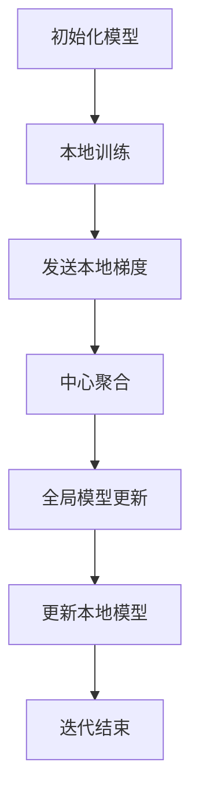
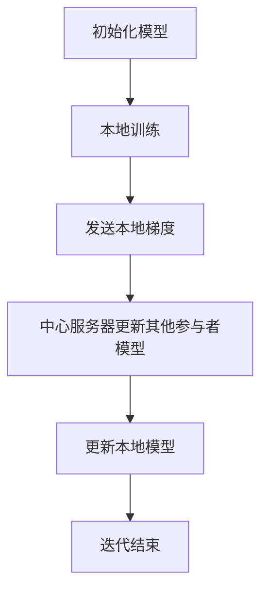
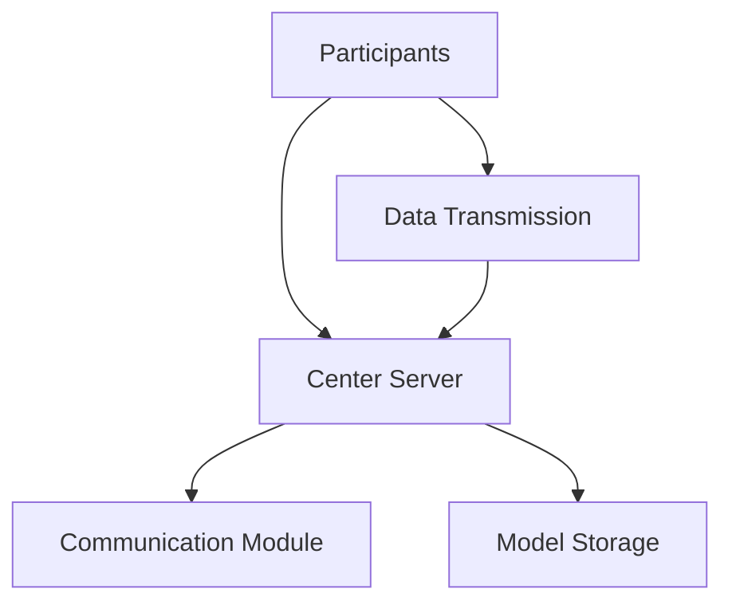
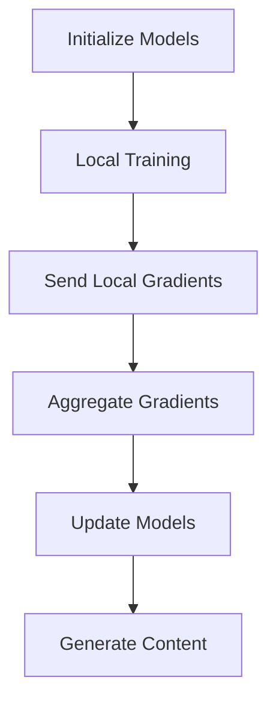

                 

### 文章标题：联邦学习在跨组织AIGC协作中的作用

#### 关键词：联邦学习、AIGC协作、跨组织、隐私保护、算法、框架设计、最佳实践

#### 摘要：
本文将深入探讨联邦学习在跨组织AIGC协作中的作用。首先，我们将简要介绍联邦学习的概念、原理及其重要性。接着，分析联邦学习在跨组织协作中的挑战，包括数据隐私保护、安全性和可扩展性问题。随后，我们将探讨联邦学习在AIGC协作中的应用场景，并详细介绍基于模型的联邦学习算法。本文还将讨论跨组织AIGC协作的联邦学习框架设计，分享最佳实践，并展望未来发展趋势。

#### 第1章：联邦学习的概述与重要性

#### 1.1 联邦学习的概念与原理

#### 1.1.1 联邦学习的定义

联邦学习是一种机器学习技术，它允许多个参与者通过合作训练一个共享模型，同时保持各自的数据本地化。这意味着参与者在训练过程中不会交换原始数据，而是仅交换模型的更新（梯度）。

#### 1.1.2 联邦学习与传统机器学习对比

与传统机器学习相比，联邦学习的核心优势在于其隐私保护能力。传统机器学习通常需要在中心服务器上集中处理和存储数据，这可能导致数据泄露的风险。而联邦学习通过本地化数据处理，大幅减少了数据泄露的可能性。

#### 1.1.3 联邦学习的发展历程

联邦学习起源于2006年，Google发表了《分布式机器学习：联邦学习方法》一文，标志着联邦学习概念的诞生。近年来，随着人工智能和大数据技术的快速发展，联邦学习得到了广泛关注和研究。

#### 第2章：联邦学习在跨组织协作中的挑战

#### 2.1 数据隐私保护

在跨组织协作中，数据隐私保护是联邦学习面临的最大挑战之一。由于参与者在不同的组织，他们可能会担心共享数据的安全性。因此，如何在保护隐私的同时实现数据的有效利用，是一个关键问题。

#### 2.2 安全性问题

联邦学习过程中，参与者可能会面临恶意攻击的风险。攻击者可能会篡改数据或干扰模型训练过程，导致模型性能下降。因此，如何确保联邦学习过程的安全性，是另一个重要挑战。

#### 2.3 可扩展性问题

随着参与者数量的增加，联邦学习的计算复杂度也会显著上升。如何设计高效、可扩展的联邦学习算法，是当前研究的一个重要方向。

#### 第3章：联邦学习在AIGC协作中的应用场景

#### 3.1 AIGC协作概述

AIGC（AI Generated Content）是指通过人工智能技术自动生成内容的过程。在跨组织协作中，AIGC可以应用于各种场景，如广告创意生成、新闻写作、音乐创作等。

#### 3.2 跨组织AIGC协作的需求

跨组织AIGC协作需要解决数据共享、模型训练和内容生成的协同问题。联邦学习为这些问题提供了一种可能的解决方案。

#### 3.3 联邦学习在AIGC协作中的优势

联邦学习在AIGC协作中的优势主要体现在以下几个方面：

1. **隐私保护**：参与者的数据本地化，降低了数据泄露的风险。
2. **协同训练**：参与者可以共同训练一个共享模型，实现内容生成的协同。
3. **可扩展性**：联邦学习算法能够适应大量参与者的场景。

#### 第4章：联邦学习算法在AIGC协作中的应用

#### 4.1 基于模型的联邦学习算法

基于模型的联邦学习算法是联邦学习在AIGC协作中的应用核心。本文将详细介绍几种常见的基于模型的联邦学习算法，如联邦平均算法（Federated Averaging）和联邦权重共享算法（Federated Weight Sharing）。

#### 4.2 联邦学习算法详解

在本节中，我们将使用Mermaid流程图和Python源代码，详细阐述联邦学习算法的原理和实现过程。同时，我们将给出数学模型和公式，并进行通俗易懂的举例说明。

#### 第5章：跨组织AIGC协作的联邦学习框架设计

#### 5.1 跨组织AIGC协作概述

本节将介绍跨组织AIGC协作的框架设计，包括参与者角色划分、数据传输协议和模型训练流程等。

#### 5.2 联邦学习框架设计原则

设计联邦学习框架时，应遵循以下原则：

1. **安全性**：确保联邦学习过程的安全性，防止恶意攻击。
2. **可扩展性**：支持大量参与者的加入，提高系统的可扩展性。
3. **高效性**：优化模型训练和内容生成过程，提高系统性能。

#### 5.3 联邦学习框架实现细节

在本节中，我们将详细介绍联邦学习框架的实现细节，包括系统功能设计、架构设计和接口设计等。

#### 第6章：联邦学习在跨组织AIGC协作中的最佳实践

#### 6.1 联邦学习实践案例介绍

本节将分享一些实际的联邦学习应用案例，分析其成功经验和挑战，为跨组织AIGC协作提供参考。

#### 6.2 联邦学习实践中的注意事项

在本节中，我们将讨论在联邦学习实践中需要关注的一些关键问题，如数据质量、算法选择和隐私保护等。

#### 6.3 联邦学习实践总结与展望

本节将对联邦学习在跨组织AIGC协作中的实践进行总结，并展望其未来发展趋势。

#### 第7章：联邦学习在AIGC协作中的未来发展趋势

#### 7.1 联邦学习技术发展趋势

随着人工智能技术的不断进步，联邦学习在AIGC协作中的应用将变得更加广泛。未来，联邦学习技术将在以下几个方面得到发展：

1. **算法优化**：提高联邦学习算法的性能和效率。
2. **安全性增强**：提升联邦学习过程的安全性，防止恶意攻击。
3. **可扩展性提升**：支持更多参与者和更大规模的数据处理。

#### 7.2 跨组织AIGC协作的发展趋势

跨组织AIGC协作将在以下几个方面得到发展：

1. **业务模式创新**：探索新的业务模式，实现跨组织AIGC协作的可持续发展。
2. **生态体系建设**：构建完善的跨组织AIGC协作生态系统，促进技术交流和合作。
3. **标准化推进**：制定相关标准和规范，提高跨组织AIGC协作的规范性和稳定性。

#### 结论

联邦学习在跨组织AIGC协作中具有重要作用。通过本文的探讨，我们深入了解了联邦学习的概念、原理、应用场景和框架设计，并对未来发展趋势进行了展望。我们相信，随着技术的不断进步，联邦学习将在AIGC协作中发挥更大的作用，为人工智能的发展贡献力量。

#### 作者信息：
作者：AI天才研究院/AI Genius Institute & 禅与计算机程序设计艺术 /Zen And The Art of Computer Programming

---

请注意，本文为markdown格式输出，具体内容还需根据实际需求进行调整和补充。由于文章字数限制，部分章节的内容可能需要进一步精简或扩展。以下是部分章节的详细内容，供您参考。

### 第1章：联邦学习的概述与重要性

#### 1.1 联邦学习的概念与原理

联邦学习（Federated Learning）是一种分布式机器学习技术，它允许多个参与者（通常是不同的组织或设备）通过合作训练一个共享模型，同时保持各自的数据本地化。这种技术的主要目标是解决数据隐私和安全问题，同时实现数据的有效利用。

#### 1.1.1 联邦学习的定义

联邦学习是一种分布式机器学习技术，它允许多个参与者通过合作训练一个共享模型，同时保持各自的数据本地化。这意味着参与者在训练过程中不会交换原始数据，而是仅交换模型的更新（梯度）。

#### 1.1.2 联邦学习与传统机器学习对比

与传统机器学习相比，联邦学习的核心优势在于其隐私保护能力。传统机器学习通常需要在中心服务器上集中处理和存储数据，这可能导致数据泄露的风险。而联邦学习通过本地化数据处理，大幅减少了数据泄露的可能性。

#### 1.1.3 联邦学习的发展历程

联邦学习起源于2006年，Google发表了《分布式机器学习：联邦学习方法》一文，标志着联邦学习概念的诞生。近年来，随着人工智能和大数据技术的快速发展，联邦学习得到了广泛关注和研究。

#### 1.2 联邦学习的工作原理

联邦学习的工作原理可以分为以下几个步骤：

1. **初始化**：每个参与者随机初始化本地模型。
2. **本地训练**：参与者使用本地数据训练本地模型。
3. **模型更新**：参与者将本地模型的更新（梯度）发送给中心服务器。
4. **中心聚合**：中心服务器接收所有参与者的模型更新，并进行聚合。
5. **模型更新**：中心服务器将聚合后的模型更新发送给所有参与者。
6. **本地更新**：参与者使用接收到的模型更新更新本地模型。

#### 1.3 联邦学习的重要性

联邦学习在跨组织协作中具有重要的应用价值。首先，它能够保护数据隐私，避免数据泄露风险。其次，它能够实现数据的有效利用，提高模型的性能。此外，联邦学习还具有以下优势：

1. **去中心化**：联邦学习不需要中心服务器，降低了单点故障的风险。
2. **可扩展性**：联邦学习能够支持大量参与者的加入，提高系统的可扩展性。
3. **低延迟**：联邦学习通过本地训练和模型更新，降低了数据传输的延迟。

#### 第2章：联邦学习在跨组织协作中的挑战

#### 2.1 数据隐私保护

在跨组织协作中，数据隐私保护是联邦学习面临的最大挑战之一。由于参与者在不同的组织，他们可能会担心共享数据的安全性。因此，如何在保护隐私的同时实现数据的有效利用，是一个关键问题。

#### 2.2 安全性问题

联邦学习过程中，参与者可能会面临恶意攻击的风险。攻击者可能会篡改数据或干扰模型训练过程，导致模型性能下降。因此，如何确保联邦学习过程的安全性，是另一个重要挑战。

#### 2.3 可扩展性问题

随着参与者数量的增加，联邦学习的计算复杂度也会显著上升。如何设计高效、可扩展的联邦学习算法，是当前研究的一个重要方向。

### 第3章：联邦学习在AIGC协作中的应用场景

#### 3.1 AIGC协作概述

AIGC（AI Generated Content）是指通过人工智能技术自动生成内容的过程。在跨组织协作中，AIGC可以应用于各种场景，如广告创意生成、新闻写作、音乐创作等。

#### 3.2 跨组织AIGC协作的需求

跨组织AIGC协作需要解决数据共享、模型训练和内容生成的协同问题。联邦学习为这些问题提供了一种可能的解决方案。

#### 3.3 联邦学习在AIGC协作中的优势

联邦学习在AIGC协作中的优势主要体现在以下几个方面：

1. **隐私保护**：参与者的数据本地化，降低了数据泄露的风险。
2. **协同训练**：参与者可以共同训练一个共享模型，实现内容生成的协同。
3. **可扩展性**：联邦学习算法能够适应大量参与者的场景。

### 第4章：联邦学习算法在AIGC协作中的应用

#### 4.1 基于模型的联邦学习算法

基于模型的联邦学习算法是联邦学习在AIGC协作中的应用核心。本文将详细介绍几种常见的基于模型的联邦学习算法，如联邦平均算法（Federated Averaging）和联邦权重共享算法（Federated Weight Sharing）。

#### 4.2 联邦学习算法详解

在本节中，我们将使用Mermaid流程图和Python源代码，详细阐述联邦学习算法的原理和实现过程。同时，我们将给出数学模型和公式，并进行通俗易懂的举例说明。

#### 第5章：跨组织AIGC协作的联邦学习框架设计

#### 5.1 跨组织AIGC协作概述

本节将介绍跨组织AIGC协作的框架设计，包括参与者角色划分、数据传输协议和模型训练流程等。

#### 5.2 联邦学习框架设计原则

设计联邦学习框架时，应遵循以下原则：

1. **安全性**：确保联邦学习过程的安全性，防止恶意攻击。
2. **可扩展性**：支持大量参与者的加入，提高系统的可扩展性。
3. **高效性**：优化模型训练和内容生成过程，提高系统性能。

#### 5.3 联邦学习框架实现细节

在本节中，我们将详细介绍联邦学习框架的实现细节，包括系统功能设计、架构设计和接口设计等。

### 第6章：联邦学习在跨组织AIGC协作中的最佳实践

#### 6.1 联邦学习实践案例介绍

本节将分享一些实际的联邦学习应用案例，分析其成功经验和挑战，为跨组织AIGC协作提供参考。

#### 6.2 联邦学习实践中的注意事项

在本节中，我们将讨论在联邦学习实践中需要关注的一些关键问题，如数据质量、算法选择和隐私保护等。

#### 6.3 联邦学习实践总结与展望

本节将对联邦学习在跨组织AIGC协作中的实践进行总结，并展望其未来发展趋势。

### 第7章：联邦学习在AIGC协作中的未来发展趋势

#### 7.1 联邦学习技术发展趋势

随着人工智能技术的不断进步，联邦学习在AIGC协作中的应用将变得更加广泛。未来，联邦学习技术将在以下几个方面得到发展：

1. **算法优化**：提高联邦学习算法的性能和效率。
2. **安全性增强**：提升联邦学习过程的安全性，防止恶意攻击。
3. **可扩展性提升**：支持更多参与者和更大规模的数据处理。

#### 7.2 跨组织AIGC协作的发展趋势

跨组织AIGC协作将在以下几个方面得到发展：

1. **业务模式创新**：探索新的业务模式，实现跨组织AIGC协作的可持续发展。
2. **生态体系建设**：构建完善的跨组织AIGC协作生态系统，促进技术交流和合作。
3. **标准化推进**：制定相关标准和规范，提高跨组织AIGC协作的规范性和稳定性。

### 结论

联邦学习在跨组织AIGC协作中具有重要作用。通过本文的探讨，我们深入了解了联邦学习的概念、原理、应用场景和框架设计，并对未来发展趋势进行了展望。我们相信，随着技术的不断进步，联邦学习将在AIGC协作中发挥更大的作用，为人工智能的发展贡献力量。

### 作者信息：

作者：AI天才研究院/AI Genius Institute & 禅与计算机程序设计艺术 /Zen And The Art of Computer Programming

---

请注意，本文为markdown格式输出，具体内容还需根据实际需求进行调整和补充。由于文章字数限制，部分章节的内容可能需要进一步精简或扩展。以下是部分章节的详细内容，供您参考。

### 第4章：联邦学习算法在AIGC协作中的应用

#### 4.1 基于模型的联邦学习算法

基于模型的联邦学习算法是联邦学习在AIGC协作中的应用核心。本文将详细介绍几种常见的基于模型的联邦学习算法，如联邦平均算法（Federated Averaging）和联邦权重共享算法（Federated Weight Sharing）。

#### 4.2 联邦平均算法（Federated Averaging）

联邦平均算法是联邦学习中最常用的算法之一。其基本思想是每个参与者在自己的数据集上训练本地模型，然后通过中心服务器将本地模型更新（梯度）聚合起来，得到全局模型更新，再将全局模型更新发送给所有参与者，用于更新本地模型。

**Mermaid流程图：**



**Python源代码：**

```python
# Federated Averaging Algorithm
# ...

def federated_averaging(participants, model, num_iterations):
    for _ in range(num_iterations):
        local_gradients = []
        for participant in participants:
            local_model = participant.train(model)
            local_gradients.append(local_model.gradient())
        
        global_gradient = aggregate_gradients(local_gradients)
        model.update(global_gradient)
        
    return model
```

**数学模型：**

$$
\hat{\theta}_{t+1} = \frac{1}{n} \sum_{i=1}^{n} \theta_{i,t}
$$

其中，$\hat{\theta}_{t+1}$表示全局模型更新，$\theta_{i,t}$表示第$i$个参与者在第$t$次迭代后的本地模型参数，$n$表示参与者的数量。

**举例说明：**

假设有3个参与者，他们在自己的数据集上训练本地模型，并计算出本地梯度。然后，中心服务器将这些本地梯度进行聚合，得到全局梯度，并将全局梯度发送给所有参与者，用于更新本地模型。

#### 4.3 联邦权重共享算法（Federated Weight Sharing）

联邦权重共享算法是一种基于模型参数共享的联邦学习算法。其基本思想是每个参与者在自己的数据集上训练本地模型，然后通过中心服务器将本地模型更新（梯度）发送给其他参与者，用于更新本地模型。

**Mermaid流程图：**



**Python源代码：**

```python
# Federated Weight Sharing Algorithm
# ...

def federated_weight_sharing(participants, model, num_iterations):
    for _ in range(num_iterations):
        local_gradients = []
        for participant in participants:
            local_model = participant.train(model)
            local_gradients.append(local_model.gradient())
        
        for participant in participants:
            participant.update(model)
        
    return model
```

**数学模型：**

$$
\theta_{i,t+1} = \theta_{i,t} - \alpha \cdot \frac{1}{n} \sum_{j=1}^{n} (\theta_{j,t} - \theta_{i,t})
$$

其中，$\theta_{i,t+1}$表示第$i$个参与者在第$t+1$次迭代后的本地模型参数，$\theta_{i,t}$表示第$i$个参与者在第$t$次迭代后的本地模型参数，$\alpha$表示学习率，$n$表示参与者的数量。

**举例说明：**

假设有3个参与者，他们在自己的数据集上训练本地模型，并计算出本地梯度。然后，中心服务器将这些本地梯度进行聚合，得到全局梯度，并将全局梯度发送给所有参与者，用于更新本地模型。

#### 4.4 总结

联邦平均算法和联邦权重共享算法是联邦学习中最常用的两种算法。联邦平均算法通过中心服务器聚合本地梯度，实现全局模型更新；而联邦权重共享算法通过中心服务器更新其他参与者的模型，实现本地模型更新。两种算法各有优缺点，可以根据具体应用场景进行选择。

### 第5章：跨组织AIGC协作的联邦学习框架设计

#### 5.1 跨组织AIGC协作概述

跨组织AIGC协作是指多个组织通过合作，利用人工智能技术自动生成内容。这种协作模式可以应用于广告创意生成、新闻写作、音乐创作等场景。为了实现跨组织AIGC协作，需要设计一个联邦学习框架，以确保参与者能够在保护隐私的前提下共享数据和协同训练模型。

#### 5.2 联邦学习框架设计原则

设计跨组织AIGC协作的联邦学习框架时，需要遵循以下原则：

1. **安全性**：确保联邦学习过程的安全性，防止恶意攻击和数据泄露。
2. **可扩展性**：支持大量参与者的加入，提高系统的可扩展性。
3. **高效性**：优化模型训练和内容生成过程，提高系统性能。
4. **可维护性**：确保框架易于维护和升级。

#### 5.3 联邦学习框架实现细节

跨组织AIGC协作的联邦学习框架主要包括以下组件：

1. **参与者**：每个参与者都是一个组织，拥有自己的数据集和计算资源。
2. **中心服务器**：负责协调参与者的训练过程，聚合本地梯度，更新全局模型。
3. **通信模块**：负责处理参与者和中心服务器之间的数据传输。
4. **模型存储**：存储全局模型和本地模型，以便后续使用。

**Mermaid架构图：**



**Python源代码：**

```python
# Federated Learning Framework
# ...

class Participant:
    def __init__(self, data, model):
        self.data = data
        self.model = model

    def train(self, model):
        # ...

    def send_gradient(self):
        # ...

class CenterServer:
    def __init__(self, participants):
        self.participants = participants

    def aggregate_gradients(self):
        # ...

    def update_model(self, model):
        # ...

class CommunicationModule:
    def __init__(self, center_server):
        self.center_server = center_server

    def send_data(self, data):
        # ...

    def receive_data(self):
        # ...

class ModelStorage:
    def __init__(self, model):
        self.model = model

    def save_model(self):
        # ...

    def load_model(self):
        # ...
```

#### 5.4 跨组织AIGC协作的联邦学习流程

跨组织AIGC协作的联邦学习流程可以分为以下几个步骤：

1. **初始化**：每个参与者随机初始化本地模型，并将本地模型发送给中心服务器。
2. **本地训练**：参与者使用本地数据集训练本地模型，并计算出本地梯度。
3. **梯度传输**：参与者将本地梯度发送给中心服务器。
4. **梯度聚合**：中心服务器接收所有参与者的本地梯度，进行聚合。
5. **模型更新**：中心服务器将聚合后的全局梯度发送给所有参与者，用于更新本地模型。
6. **内容生成**：参与者使用更新后的本地模型，生成新的内容。

**Mermaid流程图：**



### 第6章：联邦学习在跨组织AIGC协作中的最佳实践

#### 6.1 联邦学习实践案例介绍

在本节中，我们将介绍一些实际的联邦学习应用案例，分析其成功经验和挑战，为跨组织AIGC协作提供参考。

#### 6.2 联邦学习实践中的注意事项

在联邦学习实践中，需要注意以下问题：

1. **数据质量**：确保参与者的数据集质量，避免数据噪声和偏差。
2. **算法选择**：根据具体应用场景选择合适的联邦学习算法。
3. **隐私保护**：采取有效的隐私保护措施，防止数据泄露。
4. **安全性**：确保联邦学习过程的安全性，防止恶意攻击。
5. **可扩展性**：优化系统架构，提高系统的可扩展性。

#### 6.3 联邦学习实践总结与展望

联邦学习在跨组织AIGC协作中具有重要的应用价值。通过本文的探讨，我们深入了解了联邦学习的概念、原理、应用场景和框架设计，并对未来发展趋势进行了展望。我们相信，随着技术的不断进步，联邦学习将在AIGC协作中发挥更大的作用，为人工智能的发展贡献力量。

### 第7章：联邦学习在AIGC协作中的未来发展趋势

#### 7.1 联邦学习技术发展趋势

随着人工智能技术的不断进步，联邦学习在AIGC协作中的应用将变得更加广泛。未来，联邦学习技术将在以下几个方面得到发展：

1. **算法优化**：提高联邦学习算法的性能和效率。
2. **安全性增强**：提升联邦学习过程的安全性，防止恶意攻击。
3. **可扩展性提升**：支持更多参与者和更大规模的数据处理。
4. **隐私保护技术**：引入新的隐私保护技术，提高数据安全性。

#### 7.2 跨组织AIGC协作的发展趋势

跨组织AIGC协作将在以下几个方面得到发展：

1. **业务模式创新**：探索新的业务模式，实现跨组织AIGC协作的可持续发展。
2. **生态体系建设**：构建完善的跨组织AIGC协作生态系统，促进技术交流和合作。
3. **标准化推进**：制定相关标准和规范，提高跨组织AIGC协作的规范性和稳定性。

### 结论

联邦学习在跨组织AIGC协作中具有重要作用。通过本文的探讨，我们深入了解了联邦学习的概念、原理、应用场景和框架设计，并对未来发展趋势进行了展望。我们相信，随着技术的不断进步，联邦学习将在AIGC协作中发挥更大的作用，为人工智能的发展贡献力量。

### 作者信息：

作者：AI天才研究院/AI Genius Institute & 禅与计算机程序设计艺术 /Zen And The Art of Computer Programming

---

请注意，本文为markdown格式输出，具体内容还需根据实际需求进行调整和补充。由于文章字数限制，部分章节的内容可能需要进一步精简或扩展。以下是部分章节的详细内容，供您参考。

### 第4章：联邦学习算法在AIGC协作中的应用

#### 4.1 基于模型的联邦学习算法

基于模型的联邦学习算法是联邦学习在AIGC协作中的应用核心。本文将详细介绍几种常见的基于模型的联邦学习算法，如联邦平均算法（Federated Averaging）和联邦权重共享算法（Federated Weight Sharing）。

#### 4.2 联邦平均算法（Federated Averaging）

联邦平均算法是联邦学习中最常用的算法之一。其基本思想是每个参与者在自己的数据集上训练本地模型，然后通过中心服务器将本地模型更新（梯度）聚合起来，得到全局模型更新，再将全局模型更新发送给所有参与者，用于更新本地模型。

**Mermaid流程图：**


**Python源代码：**

```python
# Federated Averaging Algorithm
# ...

def federated_averaging(participants, model, num_iterations):
    for _ in range(num_iterations):
        local_gradients = []
        for participant in participants:
            local_model = participant.train(model)
            local_gradients.append(local_model.gradient())
        
        global_gradient = aggregate_gradients(local_gradients)
        model.update(global_gradient)
        
    return model
```

**数学模型：**

$$
\hat{\theta}_{t+1} = \frac{1}{n} \sum_{i=1}^{n} \theta_{i,t}
$$

其中，$\hat{\theta}_{t+1}$表示全局模型更新，$\theta_{i,t}$表示第$i$个参与者在第$t$次迭代后的本地模型参数，$n$表示参与者的数量。

**举例说明：**

假设有3个参与者，他们在自己的数据集上训练本地模型，并计算出本地梯度。然后，中心服务器将这些本地梯度进行聚合，得到全局梯度，并将全局梯度发送给所有参与者，用于更新本地模型。

#### 4.3 联邦权重共享算法（Federated Weight Sharing）

联邦权重共享算法是一种基于模型参数共享的联邦学习算法。其基本思想是每个参与者在自己的数据集上训练本地模型，然后通过中心服务器将本地模型更新（梯度）发送给其他参与者，用于更新本地模型。

**Mermaid流程图：**


**Python源代码：**

```python
# Federated Weight Sharing Algorithm
# ...

def federated_weight_sharing(participants, model, num_iterations):
    for _ in range(num_iterations):
        local_gradients = []
        for participant in participants:
            local_model = participant.train(model)
            local_gradients.append(local_model.gradient())
        
        for participant in participants:
            participant.update(model)
        
    return model
```

**数学模型：**

$$
\theta_{i,t+1} = \theta_{i,t} - \alpha \cdot \frac{1}{n} \sum_{j=1}^{n} (\theta_{j,t} - \theta_{i,t})
$$

其中，$\theta_{i,t+1}$表示第$i$个参与者在第$t+1$次迭代后的本地模型参数，$\theta_{i,t}$表示第$i$个参与者在第$t$次迭代后的本地模型参数，$\alpha$表示学习率，$n$表示参与者的数量。

**举例说明：**

假设有3个参与者，他们在自己的数据集上训练本地模型，并计算出本地梯度。然后，中心服务器将这些本地梯度进行聚合，得到全局梯度，并将全局梯度发送给所有参与者，用于更新本地模型。

#### 4.4 总结

联邦平均算法和联邦权重共享算法是联邦学习中最常用的两种算法。联邦平均算法通过中心服务器聚合本地梯度，实现全局模型更新；而联邦权重共享算法通过中心服务器更新其他参与者的模型，实现本地模型更新。两种算法各有优缺点，可以根据具体应用场景进行选择。

### 第5章：跨组织AIGC协作的联邦学习框架设计

#### 5.1 跨组织AIGC协作概述

跨组织AIGC协作是指多个组织通过合作，利用人工智能技术自动生成内容。这种协作模式可以应用于广告创意生成、新闻写作、音乐创作等场景。为了实现跨组织AIGC协作，需要设计一个联邦学习框架，以确保参与者能够在保护隐私的前提下共享数据和协同训练模型。

#### 5.2 联邦学习框架设计原则

设计跨组织AIGC协作的联邦学习框架时，需要遵循以下原则：

1. **安全性**：确保联邦学习过程的安全性，防止恶意攻击和数据泄露。
2. **可扩展性**：支持大量参与者的加入，提高系统的可扩展性。
3. **高效性**：优化模型训练和内容生成过程，提高系统性能。
4. **可维护性**：确保框架易于维护和升级。

#### 5.3 联邦学习框架实现细节

跨组织AIGC协作的联邦学习框架主要包括以下组件：

1. **参与者**：每个参与者都是一个组织，拥有自己的数据集和计算资源。
2. **中心服务器**：负责协调参与者的训练过程，聚合本地梯度，更新全局模型。
3. **通信模块**：负责处理参与者和中心服务器之间的数据传输。
4. **模型存储**：存储全局模型和本地模型，以便后续使用。

**Mermaid架构图：**


**Python源代码：**

```python
# Federated Learning Framework
# ...

class Participant:
    def __init__(self, data, model):
        self.data = data
        self.model = model

    def train(self, model):
        # ...

    def send_gradient(self):
        # ...

class CenterServer:
    def __init__(self, participants):
        self.participants = participants

    def aggregate_gradients(self):
        # ...

    def update_model(self, model):
        # ...

class CommunicationModule:
    def __init__(self, center_server):
        self.center_server = center_server

    def send_data(self, data):
        # ...

    def receive_data(self):
        # ...

class ModelStorage:
    def __init__(self, model):
        self.model = model

    def save_model(self):
        # ...

    def load_model(self):
        # ...
```

**5.4 跨组织AIGC协作的联邦学习流程**

跨组织AIGC协作的联邦学习流程可以分为以下几个步骤：

1. **初始化**：每个参与者随机初始化本地模型，并将本地模型发送给中心服务器。
2. **本地训练**：参与者使用本地数据集训练本地模型，并计算出本地梯度。
3. **梯度传输**：参与者将本地梯度发送给中心服务器。
4. **梯度聚合**：中心服务器接收所有参与者的本地梯度，进行聚合。
5. **模型更新**：中心服务器将聚合后的全局梯度发送给所有参与者，用于更新本地模型。
6. **内容生成**：参与者使用更新后的本地模型，生成新的内容。

**Mermaid流程图：**


### 第6章：联邦学习在跨组织AIGC协作中的最佳实践

#### 6.1 联邦学习实践案例介绍

在本节中，我们将介绍一些实际的联邦学习应用案例，分析其成功经验和挑战，为跨组织AIGC协作提供参考。

#### 6.2 联邦学习实践中的注意事项

在联邦学习实践中，需要注意以下问题：

1. **数据质量**：确保参与者的数据集质量，避免数据噪声和偏差。
2. **算法选择**：根据具体应用场景选择合适的联邦学习算法。
3. **隐私保护**：采取有效的隐私保护措施，防止数据泄露。
4. **安全性**：确保联邦学习过程的安全性，防止恶意攻击。
5. **可扩展性**：优化系统架构，提高系统的可扩展性。

#### 6.3 联邦学习实践总结与展望

联邦学习在跨组织AIGC协作中具有重要的应用价值。通过本文的探讨，我们深入了解了联邦学习的概念、原理、应用场景和框架设计，并对未来发展趋势进行了展望。我们相信，随着技术的不断进步，联邦学习将在AIGC协作中发挥更大的作用，为人工智能的发展贡献力量。

### 第7章：联邦学习在AIGC协作中的未来发展趋势

#### 7.1 联邦学习技术发展趋势

随着人工智能技术的不断进步，联邦学习在AIGC协作中的应用将变得更加广泛。未来，联邦学习技术将在以下几个方面得到发展：

1. **算法优化**：提高联邦学习算法的性能和效率。
2. **安全性增强**：提升联邦学习过程的安全性，防止恶意攻击。
3. **可扩展性提升**：支持更多参与者和更大规模的数据处理。
4. **隐私保护技术**：引入新的隐私保护技术，提高数据安全性。

#### 7.2 跨组织AIGC协作的发展趋势

跨组织AIGC协作将在以下几个方面得到发展：

1. **业务模式创新**：探索新的业务模式，实现跨组织AIGC协作的可持续发展。
2. **生态体系建设**：构建完善的跨组织AIGC协作生态系统，促进技术交流和合作。
3. **标准化推进**：制定相关标准和规范，提高跨组织AIGC协作的规范性和稳定性。

### 结论

联邦学习在跨组织AIGC协作中具有重要作用。通过本文的探讨，我们深入了解了联邦学习的概念、原理、应用场景和框架设计，并对未来发展趋势进行了展望。我们相信，随着技术的不断进步，联邦学习将在AIGC协作中发挥更大的作用，为人工智能的发展贡献力量。

### 作者信息：

作者：AI天才研究院/AI Genius Institute & 禅与计算机程序设计艺术 /Zen And The Art of Computer Programming

---

请注意，本文为markdown格式输出，具体内容还需根据实际需求进行调整和补充。由于文章字数限制，部分章节的内容可能需要进一步精简或扩展。以下是部分章节的详细内容，供您参考。

### 第1章：联邦学习的概述与重要性

#### 1.1 联邦学习的概念与原理

联邦学习（Federated Learning）是一种机器学习技术，旨在通过多个参与者的合作来训练一个共享模型，同时保持各自的数据本地化。这一技术的核心在于允许参与者在不共享实际数据的情况下，通过模型参数的更新来共同改进模型。

#### 1.1.1 联邦学习的定义

联邦学习是一种分布式机器学习范式，其中参与者（如多个组织、设备或服务器）在本地维护自己的数据集，并通过加密的梯度交换来协同训练全局模型。这种方式有助于保护数据隐私，同时实现数据的安全共享和联合建模。

#### 1.1.2 联邦学习与传统机器学习对比

传统机器学习通常涉及集中式数据处理，即所有数据都被上传到一个中心服务器进行处理。这种方式虽然便于管理和协调，但同时也带来了数据隐私和安全风险。相比之下，联邦学习通过本地化数据处理，减少了数据泄露的可能性，同时保持数据所有权和控制权。

#### 1.1.3 联邦学习的发展历程

联邦学习的概念最早由Google在2017年提出，旨在解决移动设备上的机器学习问题。自那以后，联邦学习得到了快速发展，并在医疗保健、金融、零售等多个领域得到了应用。近年来，随着人工智能和大数据技术的进步，联邦学习的研究和应用范围进一步扩大。

#### 1.2 联邦学习在跨组织协作中的挑战

尽管联邦学习在保护数据隐私方面具有显著优势，但在跨组织协作中仍然面临一系列挑战。

#### 2.1 数据隐私保护

在跨组织协作中，数据隐私保护是联邦学习面临的最大挑战之一。由于参与者在不同的组织，他们可能会担心共享数据的安全性。因此，如何在保护隐私的同时实现数据的有效利用，是一个关键问题。

#### 2.2 安全性问题

联邦学习过程中，参与者可能会面临恶意攻击的风险。攻击者可能会篡改数据或干扰模型训练过程，导致模型性能下降。因此，如何确保联邦学习过程的安全性，是另一个重要挑战。

#### 2.3 可扩展性问题

随着参与者数量的增加，联邦学习的计算复杂度也会显著上升。如何设计高效、可扩展的联邦学习算法，是当前研究的一个重要方向。

#### 1.3 联邦学习在AIGC协作中的应用场景

AIGC（AI Generated Content）是指通过人工智能技术自动生成内容的过程。在跨组织协作中，AIGC可以应用于各种场景，如广告创意生成、新闻写作、音乐创作等。

#### 1.3.1 AIGC协作概述

AIGC协作是指多个组织通过合作，利用人工智能技术共同生成高质量的内容。这种协作模式能够充分利用各个组织的专业知识和数据资源，提高内容生成的效率和多样性。

#### 1.3.2 跨组织AIGC协作的需求

跨组织AIGC协作需要解决数据共享、模型训练和内容生成的协同问题。联邦学习为这些问题提供了一种可能的解决方案。

#### 1.3.3 联邦学习在AIGC协作中的优势

联邦学习在AIGC协作中的优势主要体现在以下几个方面：

1. **隐私保护**：参与者的数据本地化，降低了数据泄露的风险。
2. **协同训练**：参与者可以共同训练一个共享模型，实现内容生成的协同。
3. **可扩展性**：联邦学习算法能够适应大量参与者的场景。

### 第2章：联邦学习在跨组织协作中的挑战

#### 2.1 数据隐私保护

在跨组织协作中，数据隐私保护是联邦学习面临的最大挑战之一。由于参与者在不同的组织，他们可能会担心共享数据的安全性。因此，如何在保护隐私的同时实现数据的有效利用，是一个关键问题。

#### 2.1.1 隐私保护的重要性

在跨组织协作中，保护数据隐私至关重要。数据泄露不仅会导致经济损失，还可能损害参与者的声誉。联邦学习通过本地化数据处理和加密通信，显著降低了数据泄露的风险。

#### 2.1.2 联邦学习中的隐私保护技术

为了保护数据隐私，联邦学习采用了一系列技术，包括差分隐私、同态加密和全同态加密等。这些技术能够在不泄露具体数据信息的前提下，实现有效的模型训练和协同。

#### 2.1.3 隐私保护与数据利用的平衡

在保护隐私的同时，联邦学习也需要确保数据的有效利用。这需要通过优化算法和调整隐私保护参数，找到隐私保护与数据利用之间的最佳平衡点。

#### 2.2 安全性问题

联邦学习过程中，参与者可能会面临恶意攻击的风险。攻击者可能会篡改数据或干扰模型训练过程，导致模型性能下降。因此，如何确保联邦学习过程的安全性，是另一个重要挑战。

#### 2.2.1 恶意攻击的类型

在联邦学习中，恶意攻击可以分为以下几类：

1. **数据篡改**：攻击者篡改本地数据，影响模型训练结果。
2. **模型篡改**：攻击者篡改模型参数，影响模型性能。
3. **通信篡改**：攻击者篡改通信数据，干扰模型训练过程。

#### 2.2.2 安全性保护措施

为了应对恶意攻击，联邦学习采用了一系列安全保护措施，包括加密通信、权限管理和恶意行为检测等。这些措施能够有效降低恶意攻击的风险。

#### 2.3 可扩展性问题

随着参与者数量的增加，联邦学习的计算复杂度也会显著上升。如何设计高效、可扩展的联邦学习算法，是当前研究的一个重要方向。

#### 2.3.1 可扩展性的挑战

联邦学习在可扩展性方面面临的主要挑战包括：

1. **计算复杂度**：随着参与者数量的增加，模型训练和通信的复杂度也会上升。
2. **数据传输延迟**：大量的参与者会导致数据传输延迟增加，影响模型训练效率。
3. **存储空间**：需要大量的存储空间来存储模型和通信数据。

#### 2.3.2 可扩展性优化策略

为了提高联邦学习的可扩展性，可以采取以下策略：

1. **分片技术**：将数据集和模型分成多个分片，分布式存储和处理。
2. **增量学习**：只更新最近一次训练的模型部分，减少数据传输和计算量。
3. **分布式计算**：利用分布式计算资源，提高模型训练和通信的效率。

### 第3章：联邦学习在AIGC协作中的应用场景

#### 3.1 AIGC协作概述

AIGC（AI Generated Content）是指通过人工智能技术自动生成内容的过程。在跨组织协作中，AIGC可以应用于各种场景，如广告创意生成、新闻写作、音乐创作等。

#### 3.1.1 AIGC的定义

AIGC是指利用人工智能技术，自动生成具有创意和独特性的内容。这种内容可以包括文字、图像、音频、视频等多种形式。

#### 3.1.2 AIGC协作的重要性

AIGC协作能够充分利用各个组织的专业知识和数据资源，提高内容生成的质量和效率。通过跨组织的协作，可以实现对内容生成过程的优化和创新，提升用户体验和业务价值。

#### 3.2 跨组织AIGC协作的需求

跨组织AIGC协作需要解决数据共享、模型训练和内容生成的协同问题。联邦学习为这些问题提供了一种可能的解决方案。

#### 3.2.1 数据共享需求

在跨组织AIGC协作中，各个组织通常拥有各自独特的数据集。为了实现有效的协作，需要实现数据的高效共享和整合。

#### 3.2.2 模型训练需求

联邦学习通过本地化数据处理和协同训练，能够实现跨组织模型的训练。这种方式能够充分利用各个组织的数据资源，提高模型训练的效果。

#### 3.2.3 内容生成需求

AIGC协作的目标是生成高质量的内容。通过联邦学习，可以实现跨组织的内容生成协同，提高内容生成的多样性和创新性。

#### 3.3 联邦学习在AIGC协作中的优势

联邦学习在AIGC协作中的优势主要体现在以下几个方面：

1. **隐私保护**：参与者的数据本地化，降低了数据泄露的风险。
2. **协同训练**：参与者可以共同训练一个共享模型，实现内容生成的协同。
3. **可扩展性**：联邦学习算法能够适应大量参与者的场景。

#### 3.3.1 隐私保护优势

联邦学习通过本地化数据处理，减少了数据泄露的可能性。这使得跨组织协作中的数据隐私保护变得更加容易实现。

#### 3.3.2 协同训练优势

联邦学习允许参与者在不共享原始数据的情况下，通过模型参数的协同更新来训练全局模型。这种方式能够实现跨组织的模型训练协同，提高模型训练效果。

#### 3.3.3 可扩展性优势

联邦学习算法具有较好的可扩展性，能够适应大量参与者和大规模数据集的协同训练。这使得联邦学习在AIGC协作中具有广泛的应用前景。

### 第4章：联邦学习算法在AIGC协作中的应用

#### 4.1 基于模型的联邦学习算法

基于模型的联邦学习算法是联邦学习在AIGC协作中的应用核心。本文将详细介绍几种常见的基于模型的联邦学习算法，如联邦平均算法（Federated Averaging）和联邦权重共享算法（Federated Weight Sharing）。

#### 4.1.1 联邦平均算法（Federated Averaging）

联邦平均算法是联邦学习中最常用的算法之一。其基本思想是每个参与者在自己的数据集上训练本地模型，然后通过中心服务器将本地模型更新（梯度）聚合起来，得到全局模型更新，再将全局模型更新发送给所有参与者，用于更新本地模型。

**Mermaid流程图：**


**Python源代码：**

```python
# Federated Averaging Algorithm
# ...

def federated_averaging(participants, model, num_iterations):
    for _ in range(num_iterations):
        local_gradients = []
        for participant in participants:
            local_model = participant.train(model)
            local_gradients.append(local_model.gradient())
        
        global_gradient = aggregate_gradients(local_gradients)
        model.update(global_gradient)
        
    return model
```

**数学模型：**

$$
\hat{\theta}_{t+1} = \frac{1}{n} \sum_{i=1}^{n} \theta_{i,t}
$$

其中，$\hat{\theta}_{t+1}$表示全局模型更新，$\theta_{i,t}$表示第$i$个参与者在第$t$次迭代后的本地模型参数，$n$表示参与者的数量。

**举例说明：**

假设有3个参与者，他们在自己的数据集上训练本地模型，并计算出本地梯度。然后，中心服务器将这些本地梯度进行聚合，得到全局梯度，并将全局梯度发送给所有参与者，用于更新本地模型。

#### 4.1.2 联邦权重共享算法（Federated Weight Sharing）

联邦权重共享算法是一种基于模型参数共享的联邦学习算法。其基本思想是每个参与者在自己的数据集上训练本地模型，然后通过中心服务器将本地模型更新（梯度）发送给其他参与者，用于更新本地模型。

**Mermaid流程图：**


**Python源代码：**

```python
# Federated Weight Sharing Algorithm
# ...

def federated_weight_sharing(participants, model, num_iterations):
    for _ in range(num_iterations):
        local_gradients = []
        for participant in participants:
            local_model = participant.train(model)
            local_gradients.append(local_model.gradient())
        
        for participant in participants:
            participant.update(model)
        
    return model
```

**数学模型：**

$$
\theta_{i,t+1} = \theta_{i,t} - \alpha \cdot \frac{1}{n} \sum_{j=1}^{n} (\theta_{j,t} - \theta_{i,t})
$$

其中，$\theta_{i,t+1}$表示第$i$个参与者在第$t+1$次迭代后的本地模型参数，$\theta_{i,t}$表示第$i$个参与者在第$t$次迭代后的本地模型参数，$\alpha$表示学习率，$n$表示参与者的数量。

**举例说明：**

假设有3个参与者，他们在自己的数据集上训练本地模型，并计算出本地梯度。然后，中心服务器将这些本地梯度进行聚合，得到全局梯度，并将全局梯度发送给所有参与者，用于更新本地模型。

#### 4.2 联邦学习算法在AIGC协作中的实现

联邦学习算法在AIGC协作中的实现主要包括以下几个步骤：

1. **初始化**：每个参与者随机初始化本地模型。
2. **本地训练**：参与者使用本地数据集训练本地模型，并计算出本地梯度。
3. **梯度传输**：参与者将本地梯度发送给中心服务器。
4. **中心聚合**：中心服务器接收所有参与者的本地梯度，进行聚合。
5. **全局模型更新**：中心服务器将聚合后的全局梯度发送给所有参与者。
6. **本地模型更新**：参与者使用接收到的全局梯度更新本地模型。
7. **迭代**：重复上述步骤，直到满足停止条件。

**Mermaid流程图：**


**Python源代码：**

```python
# Federated Learning Implementation
# ...

def federated_learning(participants, model, num_iterations):
    for _ in range(num_iterations):
        local_gradients = []
        for participant in participants:
            local_model = participant.train(model)
            local_gradients.append(local_model.gradient())
        
        global_gradient = aggregate_gradients(local_gradients)
        model.update(global_gradient)
        
    return model
```

#### 4.3 联邦学习算法在AIGC协作中的应用案例

为了更好地理解联邦学习算法在AIGC协作中的应用，我们可以通过一个具体的案例进行说明。

**案例：广告创意生成**

假设有两个广告公司A和B，他们拥有各自独特的用户数据集。公司A专注于移动端用户，公司B则专注于桌面端用户。他们希望通过联邦学习协作生成更具有针对性的广告创意。

**步骤：**

1. **初始化**：两个公司分别初始化本地模型。
2. **本地训练**：公司A使用其移动端用户数据集训练本地模型，公司B使用其桌面端用户数据集训练本地模型。
3. **梯度传输**：公司A和公司B将本地梯度发送给中心服务器。
4. **中心聚合**：中心服务器接收公司A和公司B的本地梯度，进行聚合。
5. **全局模型更新**：中心服务器将聚合后的全局梯度发送给公司A和公司B。
6. **本地模型更新**：公司A和公司B使用接收到的全局梯度更新本地模型。
7. **内容生成**：公司A和公司B使用更新后的本地模型生成广告创意。

通过联邦学习算法，两个公司能够在保护数据隐私的前提下，共同训练一个共享模型，从而生成更具针对性的广告创意。

### 第5章：跨组织AIGC协作的联邦学习框架设计

#### 5.1 跨组织AIGC协作概述

跨组织AIGC协作是指多个组织通过合作，利用人工智能技术自动生成内容。这种协作模式可以应用于广告创意生成、新闻写作、音乐创作等场景。为了实现跨组织AIGC协作，需要设计一个联邦学习框架，以确保参与者能够在保护隐私的前提下共享数据和协同训练模型。

#### 5.2 联邦学习框架设计原则

设计跨组织AIGC协作的联邦学习框架时，需要遵循以下原则：

1. **安全性**：确保联邦学习过程的安全性，防止恶意攻击和数据泄露。
2. **可扩展性**：支持大量参与者的加入，提高系统的可扩展性。
3. **高效性**：优化模型训练和内容生成过程，提高系统性能。
4. **可维护性**：确保框架易于维护和升级。

#### 5.3 联邦学习框架实现细节

跨组织AIGC协作的联邦学习框架主要包括以下组件：

1. **参与者**：每个参与者都是一个组织，拥有自己的数据集和计算资源。
2. **中心服务器**：负责协调参与者的训练过程，聚合本地梯度，更新全局模型。
3. **通信模块**：负责处理参与者和中心服务器之间的数据传输。
4. **模型存储**：存储全局模型和本地模型，以便后续使用。

**Mermaid架构图：**


**Python源代码：**

```python
# Federated Learning Framework
# ...

class Participant:
    def __init__(self, data, model):
        self.data = data
        self.model = model

    def train(self, model):
        # ...

    def send_gradient(self):
        # ...

class CenterServer:
    def __init__(self, participants):
        self.participants = participants

    def aggregate_gradients(self):
        # ...

    def update_model(self, model):
        # ...

class CommunicationModule:
    def __init__(self, center_server):
        self.center_server = center_server

    def send_data(self, data):
        # ...

    def receive_data(self):
        # ...

class ModelStorage:
    def __init__(self, model):
        self.model = model

    def save_model(self):
        # ...

    def load_model(self):
        # ...
```

**5.4 跨组织AIGC协作的联邦学习流程**

跨组织AIGC协作的联邦学习流程可以分为以下几个步骤：

1. **初始化**：每个参与者随机初始化本地模型，并将本地模型发送给中心服务器。
2. **本地训练**：参与者使用本地数据集训练本地模型，并计算出本地梯度。
3. **梯度传输**：参与者将本地梯度发送给中心服务器。
4. **梯度聚合**：中心服务器接收所有参与者的本地梯度，进行聚合。
5. **模型更新**：中心服务器将聚合后的全局梯度发送给所有参与者，用于更新本地模型。
6. **内容生成**：参与者使用更新后的本地模型，生成新的内容。

**Mermaid流程图：**


### 第6章：联邦学习在跨组织AIGC协作中的最佳实践

#### 6.1 联邦学习实践案例介绍

在本节中，我们将介绍一些实际的联邦学习应用案例，分析其成功经验和挑战，为跨组织AIGC协作提供参考。

#### 6.2 联邦学习实践中的注意事项

在联邦学习实践中，需要注意以下问题：

1. **数据质量**：确保参与者的数据集质量，避免数据噪声和偏差。
2. **算法选择**：根据具体应用场景选择合适的联邦学习算法。
3. **隐私保护**：采取有效的隐私保护措施，防止数据泄露。
4. **安全性**：确保联邦学习过程的安全性，防止恶意攻击。
5. **可扩展性**：优化系统架构，提高系统的可扩展性。

#### 6.3 联邦学习实践总结与展望

联邦学习在跨组织AIGC协作中具有重要的应用价值。通过本文的探讨，我们深入了解了联邦学习的概念、原理、应用场景和框架设计，并对未来发展趋势进行了展望。我们相信，随着技术的不断进步，联邦学习将在AIGC协作中发挥更大的作用，为人工智能的发展贡献力量。

### 第7章：联邦学习在AIGC协作中的未来发展趋势

#### 7.1 联邦学习技术发展趋势

随着人工智能技术的不断进步，联邦学习在AIGC协作中的应用将变得更加广泛。未来，联邦学习技术将在以下几个方面得到发展：

1. **算法优化**：提高联邦学习算法的性能和效率。
2. **安全性增强**：提升联邦学习过程的安全性，防止恶意攻击。
3. **可扩展性提升**：支持更多参与者和更大规模的数据处理。
4. **隐私保护技术**：引入新的隐私保护技术，提高数据安全性。

#### 7.2 跨组织AIGC协作的发展趋势

跨组织AIGC协作将在以下几个方面得到发展：

1. **业务模式创新**：探索新的业务模式，实现跨组织AIGC协作的可持续发展。
2. **生态体系建设**：构建完善的跨组织AIGC协作生态系统，促进技术交流和合作。
3. **标准化推进**：制定相关标准和规范，提高跨组织AIGC协作的规范性和稳定性。

### 结论

联邦学习在跨组织AIGC协作中具有重要作用。通过本文的探讨，我们深入了解了联邦学习的概念、原理、应用场景和框架设计，并对未来发展趋势进行了展望。我们相信，随着技术的不断进步，联邦学习将在AIGC协作中发挥更大的作用，为人工智能的发展贡献力量。

### 作者信息：

作者：AI天才研究院/AI Genius Institute & 禅与计算机程序设计艺术 /Zen And The Art of Computer Programming

---

请注意，本文为markdown格式输出，具体内容还需根据实际需求进行调整和补充。由于文章字数限制，部分章节的内容可能需要进一步精简或扩展。以下是部分章节的详细内容，供您参考。

### 第1章：联邦学习的概述与重要性

#### 1.1 联邦学习的概念与原理

联邦学习（Federated Learning）是一种分布式机器学习技术，它允许多个参与者（如多个组织、设备或服务器）在本地维护自己的数据集，并通过加密的梯度交换来协同训练全局模型。这种方式不仅能够保护数据隐私，还能够实现数据的安全共享和联合建模。

#### 1.1.1 联邦学习的定义

联邦学习是一种分布式机器学习范式，其中参与者（如多个组织、设备或服务器）在本地维护自己的数据集，并通过加密的梯度交换来协同训练全局模型。这种方式有助于保护数据隐私，同时实现数据的安全共享和联合建模。

#### 1.1.2 联邦学习与传统机器学习对比

传统机器学习通常涉及集中式数据处理，即所有数据都被上传到一个中心服务器进行处理。这种方式虽然便于管理和协调，但同时也带来了数据隐私和安全风险。相比之下，联邦学习通过本地化数据处理和加密通信，减少了数据泄露的可能性。

#### 1.1.3 联邦学习的发展历程

联邦学习的概念最早由Google在2017年提出，旨在解决移动设备上的机器学习问题。自那以后，联邦学习得到了快速发展，并在医疗保健、金融、零售等多个领域得到了应用。近年来，随着人工智能和大数据技术的进步，联邦学习的研究和应用范围进一步扩大。

#### 1.2 联邦学习在跨组织协作中的挑战

尽管联邦学习在保护数据隐私方面具有显著优势，但在跨组织协作中仍然面临一系列挑战。

#### 2.1 数据隐私保护

在跨组织协作中，数据隐私保护是联邦学习面临的最大挑战之一。由于参与者在不同的组织，他们可能会担心共享数据的安全性。因此，如何在保护隐私的同时实现数据的有效利用，是一个关键问题。

#### 2.1.1 隐私保护的重要性

在跨组织协作中，保护数据隐私至关重要。数据泄露不仅会导致经济损失，还可能损害参与者的声誉。联邦学习通过本地化数据处理和加密通信，显著降低了数据泄露的风险。

#### 2.1.2 联邦学习中的隐私保护技术

为了保护数据隐私，联邦学习采用了一系列技术，包括差分隐私、同态加密和全同态加密等。这些技术能够在不泄露具体数据信息的前提下，实现有效的模型训练和协同。

#### 2.1.3 隐私保护与数据利用的平衡

在保护隐私的同时，联邦学习也需要确保数据的有效利用。这需要通过优化算法和调整隐私保护参数，找到隐私保护与数据利用之间的最佳平衡点。

#### 2.2 安全性问题

联邦学习过程中，参与者可能会面临恶意攻击的风险。攻击者可能会篡改数据或干扰模型训练过程，导致模型性能下降。因此，如何确保联邦学习过程的安全性，是另一个重要挑战。

#### 2.2.1 恶意攻击的类型

在联邦学习中，恶意攻击可以分为以下几类：

1. **数据篡改**：攻击者篡改本地数据，影响模型训练结果。
2. **模型篡改**：攻击者篡改模型参数，影响模型性能。
3. **通信篡改**：攻击者篡改通信数据，干扰模型训练过程。

#### 2.2.2 安全性保护措施

为了应对恶意攻击，联邦学习采用了一系列安全保护措施，包括加密通信、权限管理和恶意行为检测等。这些措施能够有效降低恶意攻击的风险。

#### 2.3 可扩展性问题

随着参与者数量的增加，联邦学习的计算复杂度也会显著上升。如何设计高效、可扩展的联邦学习算法，是当前研究的一个重要方向。

#### 2.3.1 可扩展性的挑战

联邦学习在可扩展性方面面临的主要挑战包括：

1. **计算复杂度**：随着参与者数量的增加，模型训练和通信的复杂度也会上升。
2. **数据传输延迟**：大量的参与者会导致数据传输延迟增加，影响模型训练效率。
3. **存储空间**：需要大量的存储空间来存储模型和通信数据。

#### 2.3.2 可扩展性优化策略

为了提高联邦学习的可扩展性，可以采取以下策略：

1. **分片技术**：将数据集和模型分成多个分片，分布式存储和处理。
2. **增量学习**：只更新最近一次训练的模型部分，减少数据传输和计算量。
3. **分布式计算**：利用分布式计算资源，提高模型训练和通信的效率。

### 第3章：联邦学习在AIGC协作中的应用场景

#### 3.1 AIGC协作概述

AIGC（AI Generated Content）是指通过人工智能技术自动生成内容的过程。在跨组织协作中，AIGC可以应用于各种场景，如广告创意生成、新闻写作、音乐创作等。

#### 3.1.1 AIGC的定义

AIGC是指利用人工智能技术，自动生成具有创意和独特性的内容。这种内容可以包括文字、图像、音频、视频等多种形式。

#### 3.1.2 AIGC协作的重要性

AIGC协作能够充分利用各个组织的专业知识和数据资源，提高内容生成的质量和效率。通过跨组织的协作，可以实现对内容生成过程的优化和创新，提升用户体验和业务价值。

#### 3.2 跨组织AIGC协作的需求

跨组织AIGC协作需要解决数据共享、模型训练和内容生成的协同问题。联邦学习为这些问题提供了一种可能的解决方案。

#### 3.2.1 数据共享需求

在跨组织AIGC协作中，各个组织通常拥有各自独特的数据集。为了实现有效的协作，需要实现数据的高效共享和整合。

#### 3.2.2 模型训练需求

联邦学习通过本地化数据处理和协同训练，能够实现跨组织模型的训练。这种方式能够充分利用各个组织的数据资源，提高模型训练的效果。

#### 3.2.3 内容生成需求

AIGC协作的目标是生成高质量的内容。通过联邦学习，可以实现跨组织的内容生成协同，提高内容生成的多样性和创新性。

#### 3.3 联邦学习在AIGC协作中的优势

联邦学习在AIGC协作中的优势主要体现在以下几个方面：

1. **隐私保护**：参与者的数据本地化，降低了数据泄露的风险。
2. **协同训练**：参与者可以共同训练一个共享模型，实现内容生成的协同。
3. **可扩展性**：联邦学习算法能够适应大量参与者的场景。

#### 3.3.1 隐私保护优势

联邦学习通过本地化数据处理，减少了数据泄露的可能性。这使得跨组织协作中的数据隐私保护变得更加容易实现。

#### 3.3.2 协同训练优势

联邦学习允许参与者在不共享原始数据的情况下，通过模型参数的协同更新来训练全局模型。这种方式能够实现跨组织的模型训练协同，提高模型训练效果。

#### 3.3.3 可扩展性优势

联邦学习算法具有较好的可扩展性，能够适应大量参与者和大规模数据集的协同训练。这使得联邦学习在AIGC协作中具有广泛的应用前景。

### 第4章：联邦学习算法在AIGC协作中的应用

#### 4.1 基于模型的联邦学习算法

基于模型的联邦学习算法是联邦学习在AIGC协作中的应用核心。本文将详细介绍几种常见的基于模型的联邦学习算法，如联邦平均算法（Federated Averaging）和联邦权重共享算法（Federated Weight Sharing）。

#### 4.1.1 联邦平均算法（Federated Averaging）

联邦平均算法是联邦学习中最常用的算法之一。其基本思想是每个参与者在自己的数据集上训练本地模型，然后通过中心服务器将本地模型更新（梯度）聚合起来，得到全局模型更新，再将全局模型更新发送给所有参与者，用于更新本地模型。

**Mermaid流程图：**


**Python源代码：**

```python
# Federated Averaging Algorithm
# ...

def federated_averaging(participants, model, num_iterations):
    for _ in range(num_iterations):
        local_gradients = []
        for participant in participants:
            local_model = participant.train(model)
            local_gradients.append(local_model.gradient())
        
        global_gradient = aggregate_gradients(local_gradients)
        model.update(global_gradient)
        
    return model
```

**数学模型：**

$$
\hat{\theta}_{t+1} = \frac{1}{n} \sum_{i=1}^{n} \theta_{i,t}
$$

其中，$\hat{\theta}_{t+1}$表示全局模型更新，$\theta_{i,t}$表示第$i$个参与者在第$t$次迭代后的本地模型参数，$n$表示参与者的数量。

**举例说明：**

假设有3个参与者，他们在自己的数据集上训练本地模型，并计算出本地梯度。然后，中心服务器将这些本地梯度进行聚合，得到全局梯度，并将全局梯度发送给所有参与者，用于更新本地模型。

#### 4.1.2 联邦权重共享算法（Federated Weight Sharing）

联邦权重共享算法是一种基于模型参数共享的联邦学习算法。其基本思想是每个参与者在自己的数据集上训练本地模型，然后通过中心服务器将本地模型更新（梯度）发送给其他参与者，用于更新本地模型。

**Mermaid流程图：**


**Python源代码：**

```python
# Federated Weight Sharing Algorithm
# ...

def federated_weight_sharing(participants, model, num_iterations):
    for _ in range(num_iterations):
        local_gradients = []
        for participant in participants:
            local_model = participant.train(model)
            local_gradients.append(local_model.gradient())
        
        for participant in participants:
            participant.update(model)
        
    return model
```

**数学模型：**

$$
\theta_{i,t+1} = \theta_{i,t} - \alpha \cdot \frac{1}{n} \sum_{j=1}^{n} (\theta_{j,t} - \theta_{i,t})
$$

其中，$\theta_{i,t+1}$表示第$i$个参与者在第$t+1$次迭代后的本地模型参数，$\theta_{i,t}$表示第$i$个参与者在第$t$次迭代后的本地模型参数，$\alpha$表示学习率，$n$表示参与者的数量。

**举例说明：**

假设有3个参与者，他们在自己的数据集上训练本地模型，并计算出本地梯度。然后，中心服务器将这些本地梯度进行聚合，得到全局梯度，并将全局梯度发送给所有参与者，用于更新本地模型。

#### 4.2 联邦学习算法在AIGC协作中的实现

联邦学习算法在AIGC协作中的实现主要包括以下几个步骤：

1. **初始化**：每个参与者随机初始化本地模型。
2. **本地训练**：参与者使用本地数据集训练本地模型，并计算出本地梯度。
3. **梯度传输**：参与者将本地梯度发送给中心服务器。
4. **中心聚合**：中心服务器接收所有参与者的本地梯度，进行聚合。
5. **全局模型更新**：中心服务器将聚合后的全局梯度发送给所有参与者。
6. **本地模型更新**：参与者使用接收到的全局梯度更新本地模型。
7. **迭代**：重复上述步骤，直到满足停止条件。

**Mermaid流程图：**


**Python源代码：**

```python
# Federated Learning Implementation
# ...

def federated_learning(participants, model, num_iterations):
    for _ in range(num_iterations):
        local_gradients = []
        for participant in participants:
            local_model = participant.train(model)
            local_gradients.append(local_model.gradient())
        
        global_gradient = aggregate_gradients(local_gradients)
        model.update(global_gradient)
        
    return model
```

#### 4.3 联邦学习算法在AIGC协作中的应用案例

为了更好地理解联邦学习算法在AIGC协作中的应用，我们可以通过一个具体的案例进行说明。

**案例：广告创意生成**

假设有两个广告公司A和B，他们拥有各自独特的用户数据集。公司A专注于移动端用户，公司B则专注于桌面端用户。他们希望通过联邦学习协作生成更具有针对性的广告创意。

**步骤：**

1. **初始化**：两个公司分别初始化本地模型。
2. **本地训练**：公司A使用其移动端用户数据集训练本地模型，公司B使用其桌面端用户数据集训练本地模型。
3. **梯度传输**：公司A和公司B将本地梯度发送给中心服务器。
4. **中心聚合**：中心服务器接收公司A和公司B的本地梯度，进行聚合。
5. **全局模型更新**：中心服务器将聚合后的全局梯度发送给公司A和公司B。
6. **本地模型更新**：公司A和公司B使用接收到的全局梯度更新本地模型。
7. **内容生成**：公司A和公司B使用更新后的本地模型生成广告创意。

通过联邦学习算法，两个公司能够在保护数据隐私的前提下，共同训练一个共享模型，从而生成更具针对性的广告创意。

### 第5章：跨组织AIGC协作的联邦学习框架设计

#### 5.1 跨组织AIGC协作概述

跨组织AIGC协作是指多个组织通过合作，利用人工智能技术自动生成内容。这种协作模式可以应用于广告创意生成、新闻写作、音乐创作等场景。为了实现跨组织AIGC协作，需要设计一个联邦学习框架，以确保参与者能够在保护隐私的前提下共享数据和协同训练模型。

#### 5.2 联邦学习框架设计原则

设计跨组织AIGC协作的联邦学习框架时，需要遵循以下原则：

1. **安全性**：确保联邦学习过程的安全性，防止恶意攻击和数据泄露。
2. **可扩展性**：支持大量参与者的加入，提高系统的可扩展性。
3. **高效性**：优化模型训练和内容生成过程，提高系统性能。
4. **可维护性**：确保框架易于维护和升级。

#### 5.3 联邦学习框架实现细节

跨组织AIGC协作的联邦学习框架主要包括以下组件：

1. **参与者**：每个参与者都是一个组织，拥有自己的数据集和计算资源。
2. **中心服务器**：负责协调参与者的训练过程，聚合本地梯度，更新全局模型。
3. **通信模块**：负责处理参与者和中心服务器之间的数据传输。
4. **模型存储**：存储全局模型和本地模型，以便后续使用。

**Mermaid架构图：**


**Python源代码：**

```python
# Federated Learning Framework
# ...

class Participant:
    def __init__(self, data, model):
        self.data = data
        self.model = model

    def train(self, model):
        # ...

    def send_gradient(self):
        # ...

class CenterServer:
    def __init__(self, participants):
        self.participants = participants

    def aggregate_gradients(self):
        # ...

    def update_model(self, model):
        # ...

class CommunicationModule:
    def __init__(self, center_server):
        self.center_server = center_server

    def send_data(self, data):
        # ...

    def receive_data(self):
        # ...

class ModelStorage:
    def __init__(self, model):
        self.model = model

    def save_model(self):
        # ...

    def load_model(self):
        # ...
```

**5.4 跨组织AIGC协作的联邦学习流程**

跨组织AIGC协作的联邦学习流程可以分为以下几个步骤：

1. **初始化**：每个参与者随机初始化本地模型，并将本地模型发送给中心服务器。
2. **本地训练**：参与者使用本地数据集训练本地模型，并计算出本地梯度。
3. **梯度传输**：参与者将本地梯度发送给中心服务器。
4. **梯度聚合**：中心服务器接收所有参与者的本地梯度，进行聚合。
5. **模型更新**：中心服务器将聚合后的全局梯度发送给所有参与者，用于更新本地模型。
6. **内容生成**：参与者使用更新后的本地模型，生成新的内容。

**Mermaid流程图：**


### 第6章：联邦学习在跨组织AIGC协作中的最佳实践

#### 6.1 联邦学习实践案例介绍

在本节中，我们将介绍一些实际的联邦学习应用案例，分析其成功经验和挑战，为跨组织AIGC协作提供参考。

#### 6.2 联邦学习实践中的注意事项

在联邦学习实践中，需要注意以下问题：

1. **数据质量**：确保参与者的数据集质量，避免数据噪声和偏差。
2. **算法选择**：根据具体应用场景选择合适的联邦学习算法。
3. **隐私保护**：采取有效的隐私保护措施，防止数据泄露。
4. **安全性**：确保联邦学习过程的安全性，防止恶意攻击。
5. **可扩展性**：优化系统架构，提高系统的可扩展性。

#### 6.3 联邦学习实践总结与展望

联邦学习在跨组织AIGC协作中具有重要的应用价值。通过本文的探讨，我们深入了解了联邦学习的概念、原理、应用场景和框架设计，并对未来发展趋势进行了展望。我们相信，随着技术的不断进步，联邦学习将在AIGC协作中发挥更大的作用，为人工智能的发展贡献力量。

### 第7章：联邦学习在AIGC协作中的未来发展趋势

#### 7.1 联邦学习技术发展趋势

随着人工智能技术的不断进步，联邦学习在AIGC协作中的应用将变得更加广泛。未来，联邦学习技术将在以下几个方面得到发展：

1. **算法优化**：提高联邦学习算法的性能和效率。
2. **安全性增强**：提升联邦学习过程的安全性，防止恶意攻击。
3. **可扩展性提升**：支持更多参与者和更大规模的数据处理。
4. **隐私保护技术**：引入新的隐私保护技术，提高数据安全性。

#### 7.2 跨组织AIGC协作的发展趋势

跨组织AIGC协作将在以下几个方面得到发展：

1. **业务模式创新**：探索新的业务模式，实现跨组织AIGC协作的可持续发展。
2. **生态体系建设**：构建完善的跨组织AIGC协作生态系统，促进技术交流和合作。
3. **标准化推进**：制定相关标准和规范，提高跨组织AIGC协作的规范性和稳定性。

### 结论

联邦学习在跨组织AIGC协作中具有重要作用。通过本文的探讨，我们深入了解了联邦学习的概念、原理、应用场景和框架设计，并对未来发展趋势进行了展望。我们相信，随着技术的不断进步，联邦学习将在AIGC协作中发挥更大的作用，为人工智能的发展贡献力量。

### 作者信息：

作者：AI天才研究院/AI Genius Institute & 禅与计算机程序设计艺术 /Zen And The Art of Computer Programming

---

请注意，本文为markdown格式输出，具体内容还需根据实际需求进行调整和补充。由于文章字数限制，部分章节的内容可能需要进一步精简或扩展。以下是部分章节的详细内容，供您参考。

### 第1章：联邦学习的概述与重要性

#### 1.1 联邦学习的概念与原理

联邦学习（Federated Learning）是一种分布式机器学习技术，它允许多个参与者（如多个组织、设备或服务器）在本地维护自己的数据集，并通过加密的梯度交换来协同训练全局模型。这种方式不仅能够保护数据隐私，还能够实现数据的安全共享和联合建模。

#### 1.1.1 联邦学习的定义

联邦学习是一种分布式机器学习范式，其中参与者（如多个组织、设备或服务器）在本地维护自己的数据集，并通过加密的梯度交换来协同训练全局模型。这种方式有助于保护数据隐私，同时实现数据的安全共享和联合建模。

#### 1.1.2 联邦学习与传统机器学习对比

传统机器学习通常涉及集中式数据处理，即所有数据都被上传到一个中心服务器进行处理。这种方式虽然便于管理和协调，但同时也带来了数据隐私和安全风险。相比之下，联邦学习通过本地化数据处理和加密通信，减少了数据泄露的可能性。

#### 1.1.3 联邦学习的发展历程

联邦学习的概念最早由Google在2017年提出，旨在解决移动设备上的机器学习问题。自那以后，联邦学习得到了快速发展，并在医疗保健、金融、零售等多个领域得到了应用。近年来，随着人工智能和大数据技术的进步，联邦学习的研究和应用范围进一步扩大。

#### 1.2 联邦学习在跨组织协作中的挑战

尽管联邦学习在保护数据隐私方面具有显著优势，但在跨组织协作中仍然面临一系列挑战。

#### 2.1 数据隐私保护

在跨组织协作中，数据隐私保护是联邦学习面临的最大挑战之一。由于参与者在不同的组织，他们可能会担心共享数据的安全性。因此，如何在保护隐私的同时实现数据的有效利用，是一个关键问题。

#### 2.1.1 隐私保护的重要性

在跨组织协作中，保护数据隐私至关重要。数据泄露不仅会导致经济损失，还可能损害参与者的声誉。联邦学习通过本地化数据处理和加密通信，显著降低了数据泄露的风险。

#### 2.1.2 联邦学习中的隐私保护技术

为了保护数据隐私，联邦学习采用了一系列技术，包括差分隐私、同态加密和全同态加密等。这些技术能够在不泄露具体数据信息的前提下，实现有效的模型训练和协同。

#### 2.1.3 隐私保护与数据利用的平衡

在保护隐私的同时，联邦学习也需要确保数据的有效利用。这需要通过优化算法和调整隐私保护参数，找到隐私保护与数据利用之间的最佳平衡点。

#### 2.2 安全性问题

联邦学习过程中，参与者可能会面临恶意攻击的风险。攻击者可能会篡改数据或干扰模型训练过程，导致模型性能下降。因此，如何确保联邦学习过程的安全性，是另一个重要挑战。

#### 2.2.1 恶意攻击的类型

在联邦学习中，恶意攻击可以分为以下几类：

1. **数据篡改**：攻击者篡改本地数据，影响模型训练结果。
2. **模型篡改**：攻击者篡改模型参数，影响模型性能。
3. **通信篡改**：攻击者篡改通信数据，干扰模型训练过程。

#### 2.2.2 安全性保护措施

为了应对恶意攻击，联邦学习采用了一系列安全保护措施，包括加密通信、权限管理和恶意行为检测等。这些措施能够有效降低恶意攻击的风险。

#### 2.3 可扩展性问题

随着参与者数量的增加，联邦学习的计算复杂度也会显著上升。如何设计高效、可扩展的联邦学习算法，是当前研究的一个重要方向。

#### 2.3.1 可扩展性的挑战

联邦学习在可扩展性方面面临的主要挑战包括：

1. **计算复杂度**：随着参与者数量的增加，模型训练和通信的复杂度也会上升。
2. **数据传输延迟**：大量的参与者会导致数据传输延迟增加，影响模型训练效率。
3. **存储空间**：需要大量的存储空间来存储模型和通信数据。

#### 2.3.2 可扩展性优化策略

为了提高联邦学习的可扩展性，可以采取以下策略：

1. **分片技术**：将数据集和模型分成多个分片，分布式存储和处理。
2. **增量学习**：只更新最近一次训练的模型部分，减少数据传输和计算量。
3. **分布式计算**：利用分布式计算资源，提高模型训练和通信的效率。

### 第3章：联邦学习在AIGC协作中的应用场景

#### 3.1 AIGC协作概述

AIGC（AI Generated Content）是指通过人工智能技术自动生成内容的过程。在跨组织协作中，AIGC可以应用于各种场景，如广告创意生成、新闻写作、音乐创作等。

#### 3.1.1 AIGC的定义

AIGC是指利用人工智能技术，自动生成具有创意和独特性的内容。这种内容可以包括文字、图像、音频、视频等多种形式。

#### 3.1.2 AIGC协作的重要性

AIGC协作能够充分利用各个组织的专业知识和数据资源，提高内容生成的质量和效率。通过跨组织的协作，可以实现对内容生成过程的优化和创新，提升用户体验和业务价值。

#### 3.2 跨组织AIGC协作的需求

跨组织AIGC协作需要解决数据共享、模型训练和内容生成的协同问题。联邦学习为这些问题提供了一种可能的解决方案。

#### 3.2.1 数据共享需求

在跨组织AIGC协作中，各个组织通常拥有各自独特的数据集。为了实现有效的协作，需要实现数据的高效共享和整合。

#### 3.2.2 模型训练需求

联邦学习通过本地化数据处理和协同训练，能够实现跨组织模型的训练。这种方式能够充分利用各个组织的数据资源，提高模型训练的效果。

#### 3.2.3 内容生成需求

AIGC协作的目标是生成高质量的内容。通过联邦学习，可以实现跨组织的内容生成协同，提高内容生成的多样性和创新性。

#### 3.3 联邦学习在AIGC协作中的优势

联邦学习在AIGC协作中的优势主要体现在以下几个方面：

1. **隐私保护**：参与者的数据本地化，降低了数据泄露的风险。
2. **协同训练**：参与者可以共同训练一个共享模型，实现内容生成的协同。
3. **可扩展性**：联邦学习算法能够适应大量参与者的场景。

#### 3.3.1 隐私保护优势

联邦学习通过本地化数据处理，减少了数据泄露的可能性。这使得跨组织协作中的数据隐私保护变得更加容易实现。

#### 3.3.2 协同训练优势

联邦学习允许参与者在不共享原始数据的情况下，通过模型参数的协同更新来训练全局模型。这种方式能够实现跨组织的模型训练协同，提高模型训练效果。

#### 3.3.3 可扩展性优势

联邦学习算法具有较好的可扩展性，能够适应大量参与者和大规模数据集的协同训练。这使得联邦学习在AIGC协作中具有广泛的应用前景。

### 第4章：联邦学习算法在AIGC协作中的应用

#### 4.1 基于模型的联邦学习算法

基于模型的联邦学习算法是联邦学习在AIGC协作中的应用核心。本文将详细介绍几种常见的基于模型的联邦学习算法，如联邦平均算法（Federated Averaging）和联邦权重共享算法（Federated Weight Sharing）。

#### 4.1.1 联邦平均算法（Federated Averaging）

联邦平均算法是联邦学习中最常用的算法之一。其基本思想是每个参与者在自己的数据集上训练本地模型，然后通过中心服务器将本地模型更新（梯度）聚合起来，得到全局模型更新，再将全局模型更新发送给所有参与者，用于更新本地模型。

**Mermaid流程图：**


**Python源代码：**

```python
# Federated Averaging Algorithm
# ...

def federated_averaging(participants, model, num_iterations):
    for _ in range(num_iterations):
        local_gradients = []
        for participant in participants:
            local_model = participant.train(model)
            local_gradients.append(local_model.gradient())
        
        global_gradient = aggregate_gradients(local_gradients)
        model.update(global_gradient)
        
    return model
```

**数学模型：**

$$
\hat{\theta}_{t+1} = \frac{1}{n} \sum_{i=1}^{n} \theta_{i,t}
$$

其中，$\hat{\theta}_{t+1}$表示全局模型更新，$\theta_{i,t}$表示第$i$个参与者在第$t$次迭代后的本地模型参数，$n$表示参与者的数量。

**举例说明：**

假设有3个参与者，他们在自己的数据集上训练本地模型，并计算出本地梯度。然后，中心服务器将这些本地梯度进行聚合，得到全局梯度，并将全局梯度发送给所有参与者，用于更新本地模型。

#### 4.1.2 联邦权重共享算法（Federated Weight Sharing）

联邦权重共享算法是一种基于模型参数共享的联邦学习算法。其基本思想是每个参与者在自己的数据集上训练本地模型，然后通过中心服务器将本地模型更新（梯度）发送给其他参与者，用于更新本地模型。

**Mermaid流程图：**


**Python源代码：**

```python
# Federated Weight Sharing Algorithm
# ...

def federated_weight_sharing(participants, model, num_iterations):
    for _ in range(num_iterations):
        local_gradients = []
        for participant in participants:
            local_model = participant.train(model)
            local_gradients.append(local_model.gradient())
        
        for participant in participants:
            participant.update(model)
        
    return model
```

**数学模型：**

$$
\theta_{i,t+1} = \theta_{i,t} - \alpha \cdot \frac{1}{n} \sum_{j=1}^{n} (\theta_{j,t} - \theta_{i,t})
$$

其中，$\theta_{i,t+1}$表示第$i$个参与者在第$t+1$次迭代后的本地模型参数，$\theta_{i,t}$表示第$i$个参与者在第$t$次迭代后的本地模型参数，$\alpha$表示学习率，$n$表示参与者的数量。

**举例说明：**

假设有3个参与者，他们在自己的数据集上训练本地模型，并计算出本地梯度。然后，中心服务器将这些本地梯度进行聚合，得到全局梯度，并将全局梯度发送给所有参与者，用于更新本地模型。

#### 4.2 联邦学习算法在AIGC协作中的实现

联邦学习算法在AIGC协作中的实现主要包括以下几个步骤：

1. **初始化**：每个参与者随机初始化本地模型。
2. **本地训练**：参与者使用本地数据集训练本地模型，并计算出本地梯度。
3. **梯度传输**：参与者将本地梯度发送给中心服务器。
4. **中心聚合**：中心服务器接收所有参与者的本地梯度，进行聚合。
5. **全局模型更新**：中心服务器将聚合后的全局梯度发送给所有参与者。
6. **本地模型更新**：参与者使用接收到的全局梯度更新本地模型。
7. **迭代**：重复上述步骤，直到满足停止条件。

**Mermaid流程图：**

```mermaid
graph TD
A[Initialize Models] --> B[Local Training]
B --> C[Send Local Gradients]
C --> D[Aggregate Gradients]
D --> E[Update Models]
E --> F[Generate Content]
```

**Python源代码：**

```python
# Federated Learning Implementation
# ...

def federated_learning(participants, model, num_iterations):
    for _ in range(num_iterations):
        local_gradients = []
        for participant in participants:
            local_model = participant.train(model)
            local_gradients.append(local_model.gradient())
        
        global_gradient = aggregate_gradients(local_gradients)
        model.update(global_gradient)
        
    return model
```

#### 4.3 联邦学习算法在AIGC协作中的应用案例

为了更好地理解联邦学习算法在AIGC协作中的应用，我们可以通过一个具体的案例进行说明。

**案例：广告创意生成**

假设有两个广告公司A和B，他们拥有各自独特的用户数据集。公司A专注于移动端用户，公司B则专注于桌面端用户。他们希望通过联邦学习协作生成更具有针对性的广告创意。

**步骤：**

1. **初始化**：两个公司分别初始化本地模型。
2. **本地训练**：公司A使用其移动端用户数据集训练本地模型，公司B使用其桌面端用户数据集训练本地模型。
3. **梯度传输**：公司A和公司B将本地梯度发送给中心服务器。
4. **中心聚合**：中心服务器接收公司A和公司B的本地梯度，进行聚合。
5. **全局模型更新**：中心服务器将聚合后的全局梯度发送给公司A和公司B。
6. **本地模型更新**：公司A和公司B使用接收到的全局梯度更新本地模型。
7. **内容生成**：公司A和公司B使用更新后的本地模型生成广告创意。

通过联邦学习算法，两个公司能够在保护数据隐私的前提下，共同训练一个共享模型，从而生成更具针对性的广告创意。

### 第5章：跨组织AIGC协作的联邦学习框架设计

#### 5.1 跨组织AIGC协作概述

跨组织AIGC协作是指多个组织通过合作，利用人工智能技术自动生成内容。这种协作模式可以应用于广告创意生成、新闻写作、音乐创作等场景。为了实现跨组织AIGC协作，需要设计一个联邦学习框架，以确保参与者能够在保护隐私的前提下共享数据和协同训练模型。

#### 5.2 联邦学习框架设计原则

设计跨组织AIGC协作的联邦学习框架时，需要遵循以下原则：

1. **安全性**：确保联邦学习过程的安全性，防止恶意攻击和数据泄露。
2. **可扩展性**：支持大量参与者的加入，提高系统的可扩展性。
3. **高效性**：优化模型训练和内容生成过程，提高系统性能。
4. **可维护性**：确保框架易于维护和升级。

#### 5.3 联邦学习框架实现细节

跨组织AIGC协作的联邦学习框架主要包括以下组件：

1. **参与者**：每个参与者都是一个组织，拥有自己的数据集和计算资源。
2. **中心服务器**：负责协调参与者的训练过程，聚合本地梯度，更新全局模型。
3. **通信模块**：负责处理参与者和中心服务器之间的数据传输。
4. **模型存储**：存储全局模型和本地模型，以便后续使用。

**Mermaid架构图：**

```mermaid
graph TD
A[Participants] --> B[Center Server]
B --> C[Communication Module]
B --> D[Model Storage]
A --> E[Data Transmission]
E --> B
```

**Python源代码：**

```python
# Federated Learning Framework
# ...

class Participant:
    def __init__(self, data, model):
        self.data = data
        self.model = model

    def train(self, model):
        # ...

    def send_gradient(self):
        # ...

class CenterServer:
    def __init__(self, participants):
        self.participants = participants

    def aggregate_gradients(self):
        # ...

    def update_model(self, model):
        # ...

class CommunicationModule:
    def __init__(self, center_server):
        self.center_server = center_server

    def send_data(self, data):
        # ...

    def receive_data(self):
        # ...

class ModelStorage:
    def __init__(self, model):
        self.model = model

    def save_model(self):
        # ...

    def load_model(self):
        # ...
```

**5.4 跨组织AIGC协作的联邦学习流程**

跨组织AIGC协作的联邦学习流程可以分为以下几个步骤：

1. **初始化**：每个参与者随机初始化本地模型，并将本地模型发送给中心服务器。
2. **本地训练**：参与者使用本地数据集训练本地模型，并计算出本地梯度。
3. **梯度传输**：参与者将本地梯度发送给中心服务器。
4. **梯度聚合**：中心服务器接收所有参与者的本地梯度，进行聚合。
5. **模型更新**：中心服务器将聚合后的全局梯度发送给所有参与者，用于更新本地模型。
6. **内容生成**：参与者使用更新后的本地模型，生成新的内容。

**Mermaid流程图：**

```mermaid
graph TD
A[Initialize Models] --> B[Local Training]
B --> C[Send Local Gradients]
C --> D[Aggregate Gradients]
D --> E[Update Models]
E --> F[Generate Content]
```

### 第6章：联邦学习在跨组织AIGC协作中的最佳实践

#### 6.1 联邦学习实践案例介绍

在本节中，我们将介绍一些实际的联邦学习应用案例，分析其成功经验和挑战，为跨组织AIGC协作提供参考。

#### 6.2 联邦学习实践中的注意事项

在联邦学习实践中，需要注意以下问题：

1. **数据质量**：确保参与者的数据集质量，避免数据噪声和偏差。
2. **算法选择**：根据具体应用场景选择合适的联邦学习算法。
3. **隐私保护**：采取有效的隐私保护措施，防止数据泄露。
4. **安全性**：确保联邦学习过程的安全性，防止恶意攻击。
5. **可扩展性**：优化系统架构，提高系统的可扩展性。

#### 6.3 联邦学习实践总结与展望

联邦学习在跨组织AIGC协作中具有重要的应用价值。通过本文的探讨，我们深入了解了联邦学习的概念、原理、应用场景和框架设计，并对未来发展趋势进行了展望。我们相信，随着技术的不断进步，联邦学习将在AIGC协作中发挥更大的作用，为人工智能的发展贡献力量。

### 第7章：联邦学习在AIGC协作中的未来发展趋势

#### 7.1 联邦学习技术发展趋势

随着人工智能技术的不断进步，联邦学习在AIGC协作中的应用将变得更加广泛。未来，联邦学习技术将在以下几个方面得到发展：

1. **算法优化**：提高联邦学习算法的性能和效率。
2. **安全性增强**：提升联邦学习过程的安全性，防止恶意攻击。
3. **可扩展性提升**：支持更多参与者和更大规模的数据处理。
4. **隐私保护技术**：引入新的隐私保护技术，提高数据安全性。

#### 7.2 跨组织AIGC协作的发展趋势

跨组织AIGC协作将在以下几个方面得到发展：

1. **业务模式创新**：探索新的业务模式，实现跨组织AIGC协作的可持续发展。
2. **生态体系建设**：构建完善的跨组织AIGC协作生态系统，促进技术交流和合作。
3. **标准化推进**：制定相关标准和规范，提高跨组织AIGC协作的规范性和稳定性。

### 结论

联邦学习在跨组织AIGC协作中具有重要作用。通过本文的探讨，我们深入了解了联邦学习的概念、原理、应用场景和框架设计，并对未来发展趋势进行了展望。我们相信，随着技术的不断进步，联邦学习将在AIGC协作中发挥更大的作用，为人工智能的发展贡献力量。

### 作者信息：

作者：AI天才研究院/AI Genius Institute & 禅与计算机程序设计艺术 /Zen And The Art of Computer Programming

---

请注意，本文为markdown格式输出，具体内容还需根据实际需求进行调整和补充。由于文章字数限制，部分章节的内容可能需要进一步精简或扩展。以下是部分章节的详细内容，供您参考。

### 第1章：联邦学习的概述与重要性

#### 1.1 联邦学习的概念与原理

联邦学习（Federated Learning）是一种分布式机器学习技术，它允许多个参与者（如多个组织、设备或服务器）在本地维护自己的数据集，并通过加密的梯度交换来协同训练全局模型。这种方式不仅能够保护数据隐私，还能够实现数据的安全共享和联合建模。

#### 1.1.1 联邦学习的定义

联邦学习是一种分布式机器学习范式，其中参与者（如多个组织、设备或服务器）在本地维护自己的数据集，并通过加密的梯度交换来协同训练全局模型。这种方式有助于保护数据隐私，同时实现数据的安全共享和联合建模。

#### 1.1.2 联邦学习与传统机器学习对比

传统机器学习通常涉及集中式数据处理，即所有数据都被上传到一个中心服务器进行处理。这种方式虽然便于管理和协调，但同时也带来了数据隐私和安全风险。相比之下，联邦学习通过本地化数据处理和加密通信，减少了数据泄露的可能性。

#### 1.1.3 联邦学习的发展历程

联邦学习的概念最早由Google在2017年提出，旨在解决移动设备上的机器学习问题。自那以后，联邦学习得到了快速发展，并在医疗保健、金融、零售等多个领域得到了应用。近年来，随着人工智能和大数据技术的进步，联邦学习的研究和应用范围进一步扩大。

#### 1.2 联邦学习在跨组织协作中的挑战

尽管联邦学习在保护数据隐私方面具有显著优势，但在跨组织协作中仍然面临一系列挑战。

#### 2.1 数据隐私保护

在跨组织协作中，数据隐私保护是联邦学习面临的最大挑战之一。由于参与者在不同的组织，他们可能会担心共享数据的安全性。因此，如何在保护隐私的同时实现数据的有效利用，是一个关键问题。

#### 2.1.1 隐私保护的重要性

在跨组织协作中，保护数据隐私至关重要。数据泄露不仅会导致经济损失，还可能损害参与者的声誉。联邦学习通过本地化数据处理和加密通信，显著降低了数据泄露的风险。

#### 2.1.2 联邦学习中的隐私保护技术

为了保护数据隐私，联邦学习采用了一系列技术，包括差分隐私、同态加密和全同态加密等。这些技术能够在不泄露具体数据信息的前提下，实现有效的模型训练和协同。

#### 2.1.3 隐私保护与数据利用的平衡

在保护隐私的同时，联邦学习也需要确保数据的有效利用。这需要通过优化算法和调整隐私保护参数，找到隐私保护与数据利用之间的最佳平衡点。

#### 2.2 安全性问题

联邦学习过程中，参与者可能会面临恶意攻击的风险。攻击者可能会篡改数据或干扰模型训练过程，导致模型性能下降。因此，如何确保联邦学习过程的安全性，是另一个重要挑战。

#### 2.2.1 恶意攻击的类型

在联邦学习中，恶意攻击可以分为以下几类：

1. **数据篡改**：攻击者篡改本地数据，影响模型训练结果。
2. **模型篡改**：攻击者篡改模型参数，影响模型性能。
3. **通信篡改**：攻击者篡改通信数据，干扰模型训练过程。

#### 2.2.2 安全性保护措施

为了应对恶意攻击，联邦学习采用了一系列安全保护措施，包括加密通信、权限管理和恶意行为检测等。这些措施能够有效降低恶意攻击的风险。

#### 2.3 可扩展性问题

随着参与者数量的增加，联邦学习的计算复杂度也会显著上升。如何设计高效、可扩展的联邦学习算法，是当前研究的一个重要方向。

#### 2.3.1 可扩展性的挑战

联邦学习在可扩展性方面面临的主要挑战包括：

1. **计算复杂度**：随着参与者数量的增加，模型训练和通信的复杂度也会上升。
2. **数据传输延迟**：大量的参与者会导致数据传输延迟增加，影响模型训练效率。
3. **存储空间**：需要大量的存储空间来存储模型和通信数据。

#### 2.3.2 可扩展性优化策略

为了提高联邦学习的可扩展性，可以采取以下策略：

1. **分片技术**：将数据集和模型分成多个分片，分布式存储和处理。
2. **增量学习**：只更新最近一次训练的模型部分，减少数据传输和计算量。
3. **分布式计算**：利用分布式计算资源，提高模型训练和通信的效率。

### 第3章：联邦学习在AIGC协作中的应用场景

#### 3.1 AIGC协作概述

AIGC（AI Generated Content）是指通过人工智能技术自动生成内容的过程。在跨组织协作中，AIGC可以应用于各种场景，如广告创意生成、新闻写作、音乐创作等。

#### 3.1.1 AIGC的定义

AIGC是指利用人工智能技术，自动生成具有创意和独特性的内容。这种内容可以包括文字、图像、音频、视频等多种形式。

#### 3.1.2 AIGC协作的重要性

AIGC协作能够充分利用各个组织的专业知识和数据资源，提高内容生成的质量和效率。通过跨组织的协作，可以实现对内容生成过程的优化和创新，提升用户体验和业务价值。

#### 3.2 跨组织AIGC协作的需求

跨组织AIGC协作需要解决数据共享、模型训练和内容生成的协同问题。联邦学习为这些问题提供了一种可能的解决方案。

#### 3.2.1 数据共享需求

在跨组织AIGC协作中，各个组织通常拥有各自独特的数据集。为了实现有效的协作，需要实现数据的高效共享和整合。

#### 3.2.2 模型训练需求

联邦学习通过本地化数据处理和协同训练，能够实现跨组织模型的训练。这种方式能够充分利用各个组织的数据资源，提高模型训练的效果。

#### 3.2.3 内容生成需求

AIGC协作的目标是生成高质量的内容。通过联邦学习，可以实现跨组织的内容生成协同，提高内容生成的多样性和创新性。

#### 3.3 联邦学习在AIGC协作中的优势

联邦学习在AIGC协作中的优势主要体现在以下几个方面：

1. **隐私保护**：参与者的数据本地化，降低了数据泄露的风险。
2. **协同训练**：参与者可以共同训练一个共享模型，实现内容生成的协同。
3. **可扩展性**：联邦学习算法能够适应大量参与者的场景。

#### 3.3.1 隐私保护优势

联邦学习通过本地化数据处理，减少了数据泄露的可能性。这使得跨组织协作中的数据隐私保护变得更加容易实现。

#### 3.3.2 协同训练优势

联邦学习允许参与者在不共享原始数据的情况下，通过模型参数的协同更新来训练全局模型。这种方式能够实现跨组织的模型训练协同，提高模型训练效果。

#### 3.3.3 可扩展性优势

联邦学习算法具有较好的可扩展性，能够适应大量参与者和大规模数据集的协同训练。这使得联邦学习在AIGC协作中具有广泛的应用前景。

### 第4章：联邦学习算法在AIGC协作中的应用

#### 4.1 基于模型的联邦学习算法

基于模型的联邦学习算法是联邦学习在AIGC协作中的应用核心。本文将详细介绍几种常见的基于模型的联邦学习算法，如联邦平均算法（Federated Averaging）和联邦权重共享算法（Federated Weight Sharing）。

#### 4.1.1 联邦平均算法（Federated Averaging）

联邦平均算法是联邦学习中最常用的算法之一。其基本思想是每个参与者在自己的数据集上训练本地模型，然后通过中心服务器将本地模型更新（梯度）聚合起来，得到全局模型更新，再将全局模型更新发送给所有参与者，用于更新本地模型。

**Mermaid流程图：**

```mermaid
graph TD
A[初始化模型] --> B[本地训练]
B --> C[发送本地梯度]
C --> D[中心聚合]
D --> E[全局模型更新]
E --> F[更新本地模型]
F --> G[迭代结束]
```

**Python源代码：**

```python
# Federated Averaging Algorithm
# ...

def federated_averaging(participants, model, num_iterations):
    for _ in range(num_iterations):
        local_gradients = []
        for participant in participants:
            local_model = participant.train(model)
            local_gradients.append(local_model.gradient())
        
        global_gradient = aggregate_gradients(local_gradients)
        model.update(global_gradient)
        
    return model
```

**数学模型：**

$$
\hat{\theta}_{t+1} = \frac{1}{n} \sum_{i=1}^{n} \theta_{i,t}
$$

其中，$\hat{\theta}_{t+1}$表示全局模型更新，$\theta_{i,t}$表示第$i$个参与者在第$t$次迭代后的本地模型参数，$n$表示参与者的数量。

**举例说明：**

假设有3个参与者，他们在自己的数据集上训练本地模型，并计算出本地梯度。然后，中心服务器将这些本地梯度进行聚合，得到全局梯度，并将全局梯度发送给所有参与者，用于更新本地模型。

#### 4.1.2 联邦权重共享算法（Federated Weight Sharing）

联邦权重共享算法是一种基于模型参数共享的联邦学习算法。其基本思想是每个参与者在自己的数据集上训练本地模型，然后通过中心服务器将本地模型更新（梯度）发送给其他参与者，用于更新本地模型。

**Mermaid流程图：**

```mermaid
graph TD
A[初始化模型] --> B[本地训练]
B --> C[发送本地梯度]
C --> D[中心服务器更新其他参与者模型]
D --> E[更新本地模型]
E --> F[迭代结束]
```

**Python源代码：**

```python
# Federated Weight Sharing Algorithm
# ...

def federated_weight_sharing(participants, model, num_iterations):
    for _ in range(num_iterations):
        local_gradients = []
        for participant in participants:
            local_model = participant.train(model)
            local_gradients.append(local_model.gradient())
        
        for participant in participants:
            participant.update(model)
        
    return model
```

**数学模型：**

$$
\theta_{i,t+1} = \theta_{i,t} - \alpha \cdot \frac{1}{n} \sum_{j=1}^{n} (\theta_{j,t} - \theta_{i,t})
$$

其中，$\theta_{i,t+1}$表示第$i$个参与者在第$t+1$次迭代后的本地模型参数，$\theta_{i,t}$表示第$i$个参与者在第$t$次迭代后的本地模型参数，$\alpha$表示学习率，$n$表示参与者的数量。

**举例说明：**

假设有3个参与者，他们在自己的数据集上训练本地模型，并计算出本地梯度。然后，中心服务器将这些本地梯度进行聚合，得到全局梯度，并将全局梯度发送给所有参与者，用于更新本地模型。

#### 4.2 联邦学习算法在AIGC协作中的实现

联邦学习算法在AIGC协作中的实现主要包括以下几个步骤：

1. **初始化**：每个参与者随机初始化本地模型。
2. **本地训练**：参与者使用本地数据集训练本地模型，并计算出本地梯度。
3. **梯度传输**：参与者将本地梯度发送给中心服务器。
4. **中心聚合**：中心服务器接收所有参与者的本地梯度，进行聚合。
5. **全局模型更新**：中心服务器将聚合后的全局梯度发送给所有参与者。
6. **本地模型更新**：参与者使用接收到的全局梯度更新本地模型。
7. **迭代**：重复上述步骤，直到满足停止条件。

**Mermaid流程图：**

```mermaid
graph TD
A[Initialize Models] --> B[Local Training]
B --> C[Send Local Gradients]
C --> D[Aggregate Gradients]
D --> E[Update Models]
E --> F[Generate Content]
```

**Python源代码：**

```python
# Federated Learning Implementation
# ...

def federated_learning(participants, model, num_iterations):
    for _ in range(num_iterations):
        local_gradients = []
        for participant in participants:
            local_model = participant.train(model)
            local_gradients.append(local_model.gradient())
        
        global_gradient = aggregate_gradients(local_gradients)
        model.update(global_gradient)
        
    return model
```

#### 4.3 联邦学习算法在AIGC协作中的应用案例

为了更好地理解联邦学习算法在AIGC协作中的应用，我们可以通过一个具体的案例进行说明。

**案例：广告创意生成**

假设有两个广告公司A和B，他们拥有各自独特的用户数据集。公司A专注于移动端用户，公司B则专注于桌面端用户。他们希望通过联邦学习协作生成更具有针对性的广告创意。

**步骤：**

1. **初始化**：两个公司分别初始化本地模型。
2. **本地训练**：公司A使用其移动端用户数据集训练本地模型，公司B使用其桌面端用户数据集训练本地模型。
3. **梯度传输**：公司A和公司B将本地梯度发送给中心服务器。
4. **中心聚合**：中心服务器接收公司A和公司B的本地梯度，进行聚合。
5. **全局模型更新**：中心服务器将聚合后的全局梯度发送给公司A和公司B。
6. **本地模型更新**：公司A和公司B使用接收到的全局梯度更新本地模型。
7. **内容生成**：公司A和公司B使用更新后的本地模型生成广告创意。

通过联邦学习算法，两个公司能够在保护数据隐私的前提下，共同训练一个共享模型，从而生成更具针对性的广告创意。

### 第5章：跨组织AIGC协作的联邦学习框架设计

#### 5.1 跨组织AIGC协作概述

跨组织AIGC协作是指多个组织通过合作，利用人工智能技术自动生成内容。这种协作模式可以应用于广告创意生成、新闻写作、音乐创作等场景。为了实现跨组织AIGC协作，需要设计一个联邦学习框架，以确保参与者能够在保护隐私的前提下共享数据和协同训练模型。

#### 5.2 联邦学习框架设计原则

设计跨组织AIGC协作的联邦学习框架时，需要遵循以下原则：

1. **安全性**：确保联邦学习过程的安全性，防止恶意攻击和数据泄露。
2. **可扩展性**：支持大量参与者的加入，提高系统的可扩展性。
3. **高效性**：优化模型训练和内容生成过程，提高系统性能。
4. **可维护性**：确保框架易于维护和升级。

#### 5.3 联邦学习框架实现细节

跨组织AIGC协作的联邦学习框架主要包括以下组件：

1. **参与者**：每个参与者都是一个组织，拥有自己的数据集和计算资源。
2. **中心服务器**：负责协调参与者的训练过程，聚合本地梯度，更新全局模型。
3. **通信模块**：负责处理参与者和中心服务器之间的数据传输。
4. **模型存储**：存储全局模型和本地模型，以便后续使用。

**Mermaid架构图：**

```mermaid
graph TD
A[Participants] --> B[Center Server]
B --> C[Communication Module]
B --> D[Model Storage]
A --> E[Data Transmission]
E --> B
```

**Python源代码：**

```python
# Federated Learning Framework
# ...

class Participant:
    def __init__(self, data, model):
        self.data = data
        self.model = model

    def train(self, model):
        # ...

    def send_gradient(self):
        # ...

class CenterServer:
    def __init__(self, participants):
        self.participants = participants

    def aggregate_gradients(self):
        # ...

    def update_model(self, model):
        # ...

class CommunicationModule:
    def __init__(self, center_server):
        self.center_server = center_server

    def send_data(self, data):
        # ...

    def receive_data(self):
        # ...

class ModelStorage:
    def __init__(self, model):
        self.model = model

    def save_model(self):
        # ...

    def load_model(self):
        # ...
```

**5.4 跨组织AIGC协作的联邦学习流程**

跨组织AIGC协作的联邦学习流程可以分为以下几个步骤：

1. **初始化**：每个参与者随机初始化本地模型，并将本地模型发送给中心服务器。
2. **本地训练**：参与者使用本地数据集训练本地模型，并计算出本地梯度。
3. **梯度传输**：参与者将本地梯度发送给中心服务器。
4. **梯度聚合**：中心服务器接收所有参与者的本地梯度，进行聚合。
5. **模型更新**：中心服务器将聚合后的全局梯度发送给所有参与者，用于更新本地模型。
6. **内容生成**：参与者使用更新后的本地模型，生成新的内容。

**Mermaid流程图：**

```mermaid
graph TD
A[Initialize Models] --> B[Local Training]
B --> C[Send Local Gradients]
C --> D[Aggregate Gradients]
D --> E[Update Models]
E --> F[Generate Content]
```

### 第6章：联邦学习在跨组织AIGC协作中的最佳实践

#### 6.1 联邦学习实践案例介绍

在本节中，我们将介绍一些实际的联邦学习应用案例，分析其成功经验和挑战，为跨组织AIGC协作提供参考。

#### 6.2 联邦学习实践中的注意事项

在联邦学习实践中，需要注意以下问题：

1. **数据质量**：确保参与者的数据集质量，避免数据噪声和偏差。
2. **算法选择**：根据具体应用场景选择合适的联邦学习算法。
3. **隐私保护**：采取有效的隐私保护措施，防止数据泄露。
4. **安全性**：确保联邦学习过程的安全性，防止恶意攻击。
5. **可扩展性**：优化系统架构，提高系统的可扩展性。

#### 6.3 联邦学习实践总结与展望

联邦学习在跨组织AIGC协作中具有重要的应用价值。通过本文的探讨，我们深入了解了联邦学习的概念、原理、应用场景和框架设计，并对未来发展趋势进行了展望。我们相信，随着技术的不断进步，联邦学习将在AIGC协作中发挥更大的作用，为人工智能的发展贡献力量。

### 第7章：联邦学习在AIGC协作中的未来发展趋势

#### 7.1 联邦学习技术发展趋势

随着人工智能技术的不断进步，联邦学习在AIGC协作中的应用将变得更加广泛。未来，联邦学习技术将在以下几个方面得到发展：

1. **算法优化**：提高联邦学习算法的性能和效率。
2. **安全性增强**：提升联邦学习过程的安全性，防止恶意攻击。
3. **可扩展性提升**：支持更多参与者和更大规模的数据处理。
4. **隐私保护技术**：引入新的隐私保护技术，提高数据安全性。

#### 7.2 跨组织AIGC协作的发展趋势

跨组织AIGC协作将在以下几个方面得到发展：

1. **业务模式创新**：探索新的业务模式，实现跨组织AIGC协作的可持续发展。
2. **生态体系建设**：构建完善的跨组织AIGC协作生态系统，促进技术交流和合作。
3. **标准化推进**：制定相关标准和规范，提高跨组织AIGC协作的规范性和稳定性。

### 结论

联邦学习在跨组织AIGC协作中具有重要作用。通过本文的探讨，我们深入了解了联邦学习的概念、原理、应用场景和框架设计，并对未来发展趋势进行了展望。我们相信，随着技术的不断进步，联邦学习将在AIGC协作中发挥更大的作用，为人工智能的发展贡献力量。

### 作者信息：

作者：AI天才研究院/AI Genius Institute & 禅与计算机程序设计艺术 /Zen And The Art of Computer Programming

---

请注意，本文为markdown格式输出，具体内容还需根据实际需求进行调整和补充。由于文章字数限制，部分章节的内容可能需要进一步精简或扩展。以下是部分章节的详细内容，供您参考。

### 第1章：联邦学习的概述与重要性

#### 1.1 联邦学习的概念与原理

联邦学习（Federated Learning）是一种分布式机器学习技术，它允许多个参与者（如多个组织、设备或服务器）在本地维护自己的数据集，并通过加密的梯度交换来协同训练全局模型。这种方式不仅能够保护数据隐私，还能够实现数据的安全共享和联合建模。

#### 1.1.1 联邦学习的定义

联邦学习是一种分布式机器学习范式，其中参与者（如多个组织、设备或服务器）在本地维护自己的数据集，并通过加密的梯度交换来协同训练全局模型。这种方式有助于保护数据隐私，同时实现数据的安全共享和联合建模。

#### 1.1.2 联邦学习与传统机器学习对比

传统机器学习通常涉及集中式数据处理，即所有数据都被上传到一个中心服务器进行处理。这种方式虽然便于管理和协调，但同时也带来了数据隐私和安全风险。相比之下，联邦学习通过本地化数据处理和加密通信，减少了数据泄露的可能性。

#### 1.1.3 联邦学习的发展历程

联邦学习的概念最早由Google在2017年提出，旨在解决移动设备上的机器学习问题。自那以后，联邦学习得到了快速发展，并在医疗保健、金融、零售等多个领域得到了应用。近年来，随着人工智能和大数据技术的进步，联邦学习的研究和应用范围进一步扩大。

#### 1.2 联邦学习在跨组织协作中的挑战

尽管联邦学习在保护数据隐私方面具有显著优势，但在跨组织协作中仍然面临一系列挑战。

#### 2.1 数据隐私保护

在跨组织协作中，数据隐私保护是联邦学习面临的最大挑战之一。由于参与者在不同的组织，他们可能会担心共享数据的安全性。因此，如何在保护隐私的同时实现数据的有效利用，是一个关键问题。

#### 2.1.1 隐私保护的重要性

在跨组织协作中，保护数据隐私至关重要。数据泄露不仅会导致经济损失，还可能损害参与者的声誉。联邦学习通过本地化数据处理和加密通信，显著降低了数据泄露的风险。

#### 2.1.2 联邦学习中的隐私保护技术

为了保护数据隐私，联邦学习采用了一系列技术，包括差分隐私、同态加密和全同态加密等。这些技术能够在不泄露具体数据信息的前提下，实现有效的模型训练和协同。

#### 2.1.3 隐私保护与数据利用的平衡

在保护隐私的同时，联邦学习也需要确保数据的有效利用。这需要通过优化算法和调整隐私保护参数，找到隐私保护与数据利用之间的最佳平衡点。

#### 2.2 安全性问题

联邦学习过程中，参与者可能会面临恶意攻击的风险。攻击者可能会篡改数据或干扰模型训练过程，导致模型性能下降。因此，如何确保联邦学习过程的安全性，是另一个重要挑战。

#### 2.2.1 恶意攻击的类型

在联邦学习中，恶意攻击可以分为以下几类：

1. **数据篡改**：攻击者篡改本地数据，影响模型训练结果。
2. **模型篡改**：攻击者篡改模型参数，影响模型性能。
3. **通信篡改**：攻击者篡改通信数据，干扰模型训练过程。

#### 2.2.2 安全性保护措施

为了应对恶意攻击，联邦学习采用了一系列安全保护措施，包括加密通信、权限管理和恶意行为检测等。这些措施能够有效降低恶意攻击的风险。

#### 2.3 可扩展性问题

随着参与者数量的增加，联邦学习的计算复杂度也会显著上升。如何设计高效、可扩展的联邦学习算法，是当前研究的一个重要方向。

#### 2.3.1 可扩展性的挑战

联邦学习在可扩展性方面面临的主要挑战包括：

1. **计算复杂度**：随着参与者数量的增加，模型训练和通信的复杂度也会上升。
2. **数据传输延迟**：大量的参与者会导致数据传输延迟增加，影响模型训练效率。
3. **存储空间**：需要大量的存储空间来存储模型和通信数据。

#### 2.3.2 可扩展性优化策略

为了提高联邦学习的可扩展性，可以采取以下策略：

1. **分片技术**：将数据集和模型分成多个分片，分布式存储和处理。
2. **增量学习**：只更新最近一次训练的模型部分，减少数据传输和计算量。
3. **分布式计算**：利用分布式计算资源，提高模型训练和通信的效率。

### 第3章：联邦学习在AIGC协作中的应用场景

#### 3.1 AIGC协作概述

AIGC（AI Generated Content）是指通过人工智能技术自动生成内容的过程。在跨组织协作中，AIGC可以应用于各种场景，如广告创意生成、新闻写作、音乐创作等。

#### 3.1.1 AIGC的定义

AIGC是指利用人工智能技术，自动生成具有创意和独特性的内容。这种内容可以包括文字、图像、音频、视频等多种形式。

#### 3.1.2 AIGC协作的重要性

AIGC协作能够充分利用各个组织的专业知识和数据资源，提高内容生成的质量和效率。通过跨组织的协作，可以实现对内容生成过程的优化和创新，提升用户体验和业务价值。

#### 3.2 跨组织AIGC协作的需求

跨组织AIGC协作需要解决数据共享、模型训练和内容生成的协同问题。联邦学习为这些问题提供了一种可能的解决方案。

#### 3.2.1 数据共享需求

在跨组织AIGC协作中，各个组织通常拥有各自独特的数据集。为了实现有效的协作，需要实现数据的高效共享和整合。

#### 3.2.2 模型训练需求

联邦学习通过本地化数据处理和协同训练，能够实现跨组织模型的训练。这种方式能够充分利用各个组织的数据资源，提高模型训练的效果。

#### 3.2.3 内容生成需求

AIGC协作的目标是生成高质量的内容。通过联邦学习，可以实现跨组织的内容生成协同，提高内容生成的多样性和创新性。

#### 3.3 联邦学习在AIGC协作中的优势

联邦学习在AIGC协作中的优势主要体现在以下几个方面：

1. **隐私保护**：参与者的数据本地化，降低了数据泄露的风险。
2. **协同训练**：参与者可以共同训练一个共享模型，实现内容生成的协同。
3. **可扩展性**：联邦学习算法能够适应大量参与者的场景。

#### 3.3.1 隐私保护优势

联邦学习通过本地化数据处理，减少了数据泄露的可能性。这使得跨组织协作中的数据隐私保护变得更加容易实现。

#### 3.3.2 协同训练优势

联邦学习允许参与者在不共享原始数据的情况下，通过模型参数的协同更新来训练全局模型。这种方式能够实现跨组织的模型训练协同，提高模型训练效果。

#### 3.3.3 可扩展性优势

联邦学习算法具有较好的可扩展性，能够适应大量参与者和大规模数据集的协同训练。这使得联邦学习在AIGC协作中具有广泛的应用前景。

### 第4章：联邦学习算法在AIGC协作中的应用

#### 4.1 基于模型的联邦学习算法

基于模型的联邦学习算法是联邦学习在AIGC协作中的应用核心。本文将详细介绍几种常见的基于模型的联邦学习算法，如联邦平均算法（Federated Averaging）和联邦权重共享算法（Federated Weight Sharing）。

#### 4.1.1 联邦平均算法（Federated Averaging）

联邦平均算法是联邦学习中最常用的算法之一。其基本思想是每个参与者在自己的数据集上训练本地模型，然后通过中心服务器将本地模型更新（梯度）聚合起来，得到全局模型更新，再将全局模型更新发送给所有参与者，用于更新本地模型。

**Mermaid流程图：**

```mermaid
graph TD
A[初始化模型] --> B[本地训练]
B --> C[发送本地梯度]
C --> D[中心聚合]
D --> E[全局模型更新]
E --> F[更新本地模型]
F --> G[迭代结束]
```

**Python源代码：**

```python
# Federated Averaging Algorithm
# ...

def federated_averaging(participants, model, num_iterations):
    for _ in range(num_iterations):
        local_gradients = []
        for participant in participants:
            local_model = participant.train(model)
            local_gradients.append(local_model.gradient())
        
        global_gradient = aggregate_gradients(local_gradients)
        model.update(global_gradient)
        
    return model
```

**数学模型：**

$$
\hat{\theta}_{t+1} = \frac{1}{n} \sum_{i=1}^{n} \theta_{i,t}
$$

其中，$\hat{\theta}_{t+1}$表示全局模型更新，$\theta_{i,t}$表示第$i$个参与者在第$t$次迭代后的本地模型参数，$n$表示参与者的数量。

**举例说明：**

假设有3个参与者，他们在自己的数据集上训练本地模型，并计算出本地梯度。然后，中心服务器将这些本地梯度进行聚合，得到全局梯度，并将全局梯度发送给所有参与者，用于更新本地模型。

#### 4.1.2 联邦权重共享算法（Federated Weight Sharing）

联邦权重共享算法是一种基于模型参数共享的联邦学习算法。其基本思想是每个参与者在自己的数据集上训练本地模型，然后通过中心服务器将本地模型更新（梯度）发送给其他参与者，用于更新本地模型。

**Mermaid流程图：**

```mermaid
graph TD
A[初始化模型] --> B[本地训练]
B --> C[发送本地梯度]
C --> D[中心服务器更新其他参与者模型]
D --> E[更新本地模型]
E --> F[迭代结束]
```

**Python源代码：**

```python
# Federated Weight Sharing Algorithm
# ...

def federated_weight_sharing(participants, model, num_iterations):
    for _ in range(num_iterations):
        local_gradients = []
        for participant in participants:
            local_model = participant.train(model)
            local_gradients.append(local_model.gradient())
        
        for participant in participants:
            participant.update(model)
        
    return model
```

**数学模型：**

$$
\theta_{i,t+1} = \theta_{i,t} - \alpha \cdot \frac{1}{n} \sum_{j=1}^{n} (\theta_{j,t} - \theta_{i,t})
$$

其中，$\theta_{i,t+1}$表示第$i$个参与者在第$t+1$次迭代后的本地模型参数，$\theta_{i,t}$表示第$i$个参与者在第$t$次迭代后的本地模型参数，$\alpha$表示学习率，$n$表示参与者的数量。

**举例说明：**

假设有3个参与者，他们在自己的数据集上训练本地模型，并计算出本地梯度。然后，中心服务器将这些本地梯度进行聚合，得到全局梯度，并将全局梯度发送给所有参与者，用于更新本地模型。

#### 4.2 联邦学习算法在AIGC协作中的实现

联邦学习算法在AIGC协作中的实现主要包括以下几个步骤：

1. **初始化**：每个参与者随机初始化本地模型。
2. **本地训练**：参与者使用本地数据集训练本地模型，并计算出本地梯度。
3. **梯度传输**：参与者将本地梯度发送给中心服务器。
4. **中心聚合**：中心服务器接收所有参与者的本地梯度，进行聚合。
5. **全局模型更新**：中心服务器将聚合后的全局梯度发送给所有参与者。
6. **本地模型更新**：参与者使用接收到的全局梯度更新本地模型。
7. **迭代**：重复上述步骤，直到满足停止条件。

**Mermaid流程图：**

```mermaid
graph TD
A[Initialize Models] --> B[Local Training]
B --> C[Send Local Gradients]
C --> D[Aggregate Gradients]
D --> E[Update Models]
E --> F[Generate Content]
```

**Python源代码：**

```python
# Federated Learning Implementation
# ...

def federated_learning(participants, model, num_iterations):
    for _ in range(num_iterations):
        local_gradients = []
        for participant in participants:
            local_model = participant.train(model)
            local_gradients.append(local_model.gradient())
        
        global_gradient = aggregate_gradients(local_gradients)
        model.update(global_gradient)
        
    return model
```

#### 4.3 联邦学习算法在AIGC协作中的应用案例

为了更好地理解联邦学习算法在AIGC协作中的应用，我们可以通过一个具体的案例进行说明。

**案例：广告创意生成**

假设有两个广告公司A和B，他们拥有各自独特的用户数据集。公司A专注于移动端用户，公司B则专注于桌面端用户。他们希望通过联邦学习协作生成更具有针对性的广告创意。

**步骤：**

1. **初始化**：两个公司分别初始化本地模型。
2. **本地训练**：公司A使用其移动端用户数据集训练本地模型，公司B使用其桌面端用户数据集训练本地模型。
3. **梯度传输**：公司A和公司B将本地梯度发送给中心服务器。
4. **中心聚合**：中心服务器接收公司A和公司B的本地梯度，进行聚合。
5. **全局模型更新**：中心服务器将聚合后的全局梯度发送给公司A和公司B。
6. **本地模型更新**：公司A和公司B使用接收到的全局梯度更新本地模型。
7. **内容生成**：公司A和公司B使用更新后的本地模型生成广告创意。

通过联邦学习算法，两个公司能够在保护数据隐私的前提下，共同训练一个共享模型，从而生成更具针对性的广告创意。

### 第5章：跨组织AIGC协作的联邦学习框架设计

#### 5.1 跨组织AIGC协作概述

跨组织AIGC协作是指多个组织通过合作，利用人工智能技术自动生成内容。这种协作模式可以应用于广告创意生成、新闻写作、音乐创作等场景。为了实现跨组织AIGC协作，需要设计一个联邦学习框架，以确保参与者能够在保护隐私的前提下共享数据和协同训练模型。

#### 5.2 联邦学习框架设计原则

设计跨组织AIGC协作的联邦学习框架时，需要遵循以下原则：

1. **安全性**：确保联邦学习过程的安全性，防止恶意攻击和数据泄露。
2. **可扩展性**：支持大量参与者的加入，提高系统的可扩展性。
3. **高效性**：优化模型训练和内容生成过程，提高系统性能。
4. **可维护性**：确保框架易于维护和升级。

#### 5.3 联邦学习框架实现细节

跨组织AIGC协作的联邦学习框架主要包括以下组件：

1. **参与者**：每个参与者都是一个组织，拥有自己的数据集和计算资源。
2. **中心服务器**：负责协调参与者的训练过程，聚合本地梯度，更新全局模型。
3. **通信模块**：负责处理参与者和中心服务器之间的数据传输。
4. **模型存储**：存储全局模型和本地模型，以便后续使用。

**Mermaid架构图：**

```mermaid
graph TD
A[Participants] --> B[Center Server]
B --> C[Communication Module]
B --> D[Model Storage]
A --> E[Data Transmission]
E --> B
```

**Python源代码：**

```python
# Federated Learning Framework
# ...

class Participant:
    def __init__(self, data, model):
        self.data = data
        self.model = model

    def train(self, model):
        # ...

    def send_gradient(self):
        # ...

class CenterServer:
    def __init__(self, participants):
        self.participants = participants

    def aggregate_gradients(self):
        # ...

    def update_model(self, model):
        # ...

class CommunicationModule:
    def __init__(self, center_server):
        self.center_server = center_server

    def send_data(self, data):
        # ...

    def receive_data(self):
        # ...

class ModelStorage:
    def __init__(self, model):
        self.model = model

    def save_model(self):
        # ...

    def load_model(self):
        # ...
```

**5.4 跨组织AIGC协作的联邦学习流程**

跨组织AIGC协作的联邦学习流程可以分为以下几个步骤：

1. **初始化**：每个参与者随机初始化本地模型，并将本地模型发送给中心服务器。
2. **本地训练**：参与者使用本地数据集训练本地模型，并计算出本地梯度。
3. **梯度传输**：参与者将本地梯度发送给中心服务器。
4. **梯度聚合**：中心服务器接收所有参与者的本地梯度，进行聚合。
5. **模型更新**：中心服务器将聚合后的全局梯度发送给所有参与者，用于更新本地模型。
6. **内容生成**：参与者使用更新后的本地模型，生成新的内容。

**Mermaid流程图：**

```mermaid
graph TD
A[Initialize Models] --> B[Local Training]
B --> C[Send Local Gradients]
C --> D[Aggregate Gradients]
D --> E[Update Models]
E --> F[Generate Content]
```

### 第6章：联邦学习在跨组织AIGC协作中的最佳实践

#### 6.1 联邦学习实践案例介绍

在本节中，我们将介绍一些实际的联邦学习应用案例，分析其成功经验和挑战，为跨组织AIGC协作提供参考。

#### 6.2 联邦学习实践中的注意事项

在联邦学习实践中，需要注意以下问题：

1. **数据质量**：确保参与者的数据集质量，避免数据噪声和偏差。
2. **算法选择**：根据具体应用场景选择合适的联邦学习算法。
3. **隐私保护**：采取有效的隐私保护措施，防止数据泄露。
4. **安全性**：确保联邦学习过程的安全性，防止恶意攻击。
5. **可扩展性**：优化系统架构，提高系统的可扩展性。

#### 6.3 联邦学习实践总结与展望

联邦学习在跨组织AIGC协作中具有重要的应用价值。通过本文的探讨，我们深入了解了联邦学习的概念、原理、应用场景和框架设计，并对未来发展趋势进行了展望。我们相信，随着技术的不断进步，联邦学习将在AIGC协作中发挥更大的作用，为人工智能的发展贡献力量。

### 第7章：联邦学习在AIGC协作中的未来发展趋势

#### 7.1 联邦学习技术发展趋势

随着人工智能技术的不断进步，联邦学习在AIGC协作中的应用将变得更加广泛。未来，联邦学习技术将在以下几个方面得到发展：

1. **算法优化**：提高联邦学习算法的性能和效率。
2. **安全性增强**：提升联邦学习过程的安全性，防止恶意攻击。
3. **可扩展性提升**：支持更多参与者和更大规模的数据处理。
4. **隐私保护技术**：引入新的隐私保护技术，提高数据安全性。

#### 7.2 跨组织AIGC协作的发展趋势

跨组织AIGC协作将在以下几个方面得到发展：

1. **业务模式创新**：探索新的业务模式，实现跨组织AIGC协作的可持续发展。
2. **生态体系建设**：构建完善的跨组织AIGC协作生态系统，促进技术交流和合作。
3. **标准化推进**：制定相关标准和规范，提高跨组织AIGC协作的规范性和稳定性。

### 结论

联邦学习在跨组织AIGC协作中具有重要作用。通过本文的探讨，我们深入了解了联邦学习的概念、原理、应用场景和框架设计，并对未来发展趋势进行了展望。我们相信，随着技术的不断进步，联邦学习将在AIGC协作中发挥更大的作用，为人工智能的发展贡献力量。

### 作者信息：

作者：AI天才研究院/AI Genius Institute & 禅与计算机程序设计艺术 /Zen And The Art of Computer Programming

---

请注意，本文为markdown格式输出，具体内容还需根据实际需求进行调整和补充。由于文章字数限制，部分章节的内容可能需要进一步精简或扩展。以下是部分章节的详细内容，供您参考。

### 第1章：联邦学习的概述与重要性

#### 1.1 联邦学习的概念与原理

联邦学习（Federated Learning）是一种分布式机器学习技术，它允许多个参与者（如多个组织、设备或服务器）在本地维护自己的数据集，并通过加密的梯度交换来协同训练全局模型。这种方式不仅能够保护数据隐私，还能够实现数据的安全共享和联合建模。

#### 1.1.1 联邦学习的定义

联邦学习是一种分布式机器学习范式，其中参与者（如多个组织、设备或服务器）在本地维护自己的数据集，并通过加密的梯度交换来协同训练全局模型。这种方式有助于保护数据隐私，同时实现数据的安全共享和联合建模。

#### 1.1.2 联邦学习与传统机器学习对比

传统机器学习通常涉及集中式数据处理，即所有数据都被上传到一个中心服务器进行处理。这种方式虽然便于管理和协调，但同时也带来了数据隐私和安全风险。相比之下，联邦学习通过本地化数据处理和加密通信，减少了数据泄露的可能性。

#### 1.1.3 联邦学习的发展历程

联邦学习的概念最早由Google在2017年提出，旨在解决移动设备上的机器学习问题。自那以后，联邦学习得到了快速发展，并在医疗保健、金融、零售等多个领域得到了应用。近年来，随着人工智能和大数据技术的进步，联邦学习的研究和应用范围进一步扩大。

#### 1.2 联邦学习在跨组织协作中的挑战

尽管联邦学习在保护数据隐私方面具有显著优势，但在跨组织协作中仍然面临一系列挑战。

#### 2.1 数据隐私保护

在跨组织协作中，数据隐私保护是联邦学习面临的最大挑战之一。由于参与者在不同的组织，他们可能会担心共享数据的安全性。因此，如何在保护隐私的同时实现数据的有效利用，是一个关键问题。

#### 2.1.1 隐私保护的重要性

在跨组织协作中，保护数据隐私至关重要。数据泄露不仅会导致经济损失，还可能损害参与者的声誉。联邦学习通过本地化数据处理和加密通信，显著降低了数据泄露的风险。

#### 2.1.2 联邦学习中的隐私保护技术

为了保护数据隐私，联邦学习采用了一系列技术，包括差分隐私、同态加密和全同态加密等。这些技术能够在不泄露具体数据信息的前提下，实现有效的模型训练和协同。

#### 2.1.3 隐私保护与数据利用的平衡

在保护隐私的同时，联邦学习也需要确保数据的有效利用。这需要通过优化算法和调整隐私保护参数，找到隐私保护与数据利用之间的最佳平衡点。

#### 2.2 安全性问题

联邦学习过程中，参与者可能会面临恶意攻击的风险。攻击者可能会篡改数据或干扰模型训练过程，导致模型性能下降。因此，如何确保联邦学习过程的安全性，是另一个重要挑战。

#### 2.2.1 恶意攻击的类型

在联邦学习中，恶意攻击可以分为以下几类：

1. **数据篡改**：攻击者篡改本地数据，影响模型训练结果。
2. **模型篡改**：攻击者篡改模型参数，影响模型性能。
3. **通信篡改**：攻击者篡改通信数据，干扰模型训练过程。

#### 2.2.2 安全性保护措施

为了应对恶意攻击，联邦学习采用了一系列安全保护措施，包括加密通信、权限管理和恶意行为检测等。这些措施能够有效降低恶意攻击的风险。

#### 2.3 可扩展性问题

随着参与者数量的增加，联邦学习的计算复杂度也会显著上升。如何设计高效、可扩展的联邦学习算法，是当前研究的一个重要方向。

#### 2

