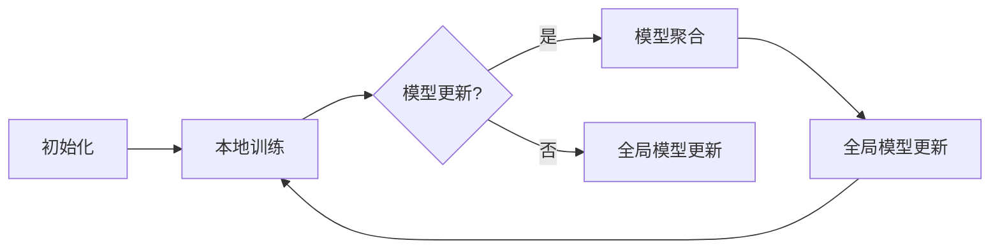
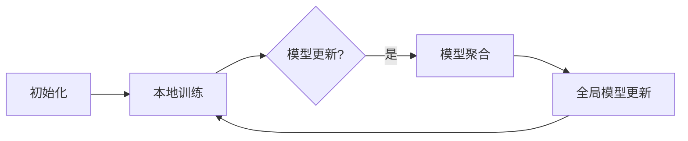

                 

### **联邦学习基础：背景和核心概念**

#### **1.1 联邦学习的起源与发展**

联邦学习的概念最早可以追溯到20世纪90年代，但其在人工智能领域受到广泛关注则是在2016年之后。随着移动互联网的普及，智能手机等移动设备逐渐成为人们生活中不可或缺的一部分。这些设备不仅产生了大量数据，而且用户对隐私保护的需求也日益强烈。传统的中心化数据处理模式无法满足这种需求，因为数据需要在服务器上进行集中存储和处理，存在数据泄露的风险。为了解决这一问题，联邦学习应运而生。

联邦学习的起源可以追溯到分布式计算和密码学的交叉领域。早期的联邦学习研究主要关注如何在保证数据隐私的前提下，通过分布式计算实现模型的训练和优化。随着深度学习技术的发展，联邦学习逐渐成为解决数据隐私问题的一种有效方法。2016年，Google首次在论文《Federated Learning: Concept and Applications》中详细介绍了联邦学习的概念和应用，标志着联邦学习正式进入人工智能领域。

#### **1.1.1 联邦学习的问题背景**

数据隐私保护的需求日益增长，传统的中心化数据处理模式已经无法满足用户的需求。在中心化模式下，所有数据都需要上传到服务器进行集中处理，这无疑增加了数据泄露的风险。同时，随着用户对隐私保护的意识提高，他们不愿意将自己的数据完全交给第三方。为了解决这个问题，联邦学习提出了一种新的数据处理模式，即在用户设备本地进行数据处理，仅将模型更新上传到服务器。

#### **1.1.2 联邦学习的定义和核心思想**

联邦学习是一种分布式机器学习框架，通过多个参与者（通常是移动设备）之间的协作，共同训练一个全局模型。每个参与者在自己的设备上维护一个本地模型，并通过加密和差分隐私等机制，仅向中心服务器发送本地模型的更新，从而实现全局模型的更新。联邦学习的核心思想是“数据不动，模型动”，即在保护数据隐私的同时，通过模型更新实现全局模型的训练和优化。

#### **1.1.3 联邦学习与其他计算模式的关系**

联邦学习与传统的分布式计算和中心化计算模式有显著的区别。分布式计算通常要求参与者之间进行大量通信，以共享全局数据；而中心化计算则依赖于一个中心化的服务器来存储和处理所有数据。联邦学习通过减少通信量，降低数据泄露的风险，实现了数据隐私保护和高效计算。

联邦学习不仅解决了数据隐私问题，还在多个领域取得了显著的应用成果。例如，在医疗领域，联邦学习可以用于分析患者数据，实现疾病预测和诊断；在金融领域，联邦学习可以用于风险评估和欺诈检测；在能源领域，联邦学习可以用于智能电网的优化和控制。联邦学习的广泛应用，进一步推动了人工智能技术的发展。

### **1.2 联邦学习的基本架构**

#### **2.1 联邦学习的数据流**

联邦学习的数据流主要包括以下几个阶段：

1. **本地训练**：每个参与者（客户端）在自己的设备上对本地数据集进行训练，更新本地模型。

2. **本地模型更新**：参与者将本地模型的更新发送给中心服务器。

3. **模型聚合**：中心服务器接收所有参与者的模型更新，通过聚合算法计算全局模型的更新。

4. **全局模型更新**：中心服务器将全局模型的更新发送给所有参与者。

5. **本地模型更新**：参与者根据全局模型的更新，继续在本地数据集上进行训练。

#### **2.1.1 模型更新过程**

在联邦学习的模型更新过程中，每个参与者（客户端）首先在自己的设备上对本地数据集进行训练，更新本地模型。具体步骤如下：

1. **初始化**：每个客户端下载全局模型，并在本地设备上进行初始化。

2. **本地训练**：客户端使用本地数据集对全局模型进行训练，更新本地模型。

3. **本地模型更新**：客户端将本地模型的更新发送给中心服务器。

4. **接收全局模型更新**：客户端接收中心服务器发送的全局模型更新。

5. **本地模型更新**：客户端根据全局模型更新，继续在本地数据集上进行训练。

#### **2.1.2 模型同步机制**

在联邦学习中，模型同步机制至关重要。模型同步机制主要包括以下几种方式：

1. **周期性同步**：中心服务器定期接收所有参与者的模型更新，进行模型聚合。

2. **触发式同步**：当客户端的模型更新达到一定阈值时，自动触发同步操作。

3. **按需同步**：中心服务器根据实际情况，按需接收参与者的模型更新。

#### **2.1.3 模型聚合方法**

模型聚合方法是指中心服务器如何将多个参与者的模型更新合并为一个全局模型。常见的模型聚合方法包括：

1. **简单平均法**：将所有参与者的模型更新进行简单平均，得到全局模型更新。

2. **加权平均法**：根据参与者的贡献度，对模型更新进行加权平均。

3. **梯度聚合法**：将参与者的模型更新转换为梯度，进行梯度聚合。

#### **2.2 联邦学习的核心组件**

联邦学习涉及多个核心组件，主要包括：

1. **客户端（Client）**：客户端是指参与联邦学习的移动设备，负责本地模型的训练和更新。

2. **服务器（Server）**：服务器是联邦学习的中心节点，负责接收客户端的模型更新，进行模型聚合和全局模型更新。

3. **模型维护与更新**：模型维护与更新是指服务器如何维护和管理全局模型，以及如何处理客户端的模型更新。

### **2.3 联邦学习的挑战与解决方案**

#### **2.3.1 数据隐私问题**

数据隐私问题是联邦学习面临的主要挑战之一。为了保护数据隐私，联邦学习采用了多种隐私保护机制，包括：

1. **差分隐私**：差分隐私是一种常用的隐私保护机制，通过在数据中添加噪声，使得攻击者无法区分特定数据是否包含在数据集中。

2. **同态加密**：同态加密是一种加密算法，可以在加密数据上进行计算，而不需要解密数据。这可以确保在数据传输和计算过程中，数据始终处于加密状态，从而保护数据隐私。

3. **安全多方计算**：安全多方计算是一种计算模型，允许多个参与者共同计算一个结果，而无需共享原始数据。这可以确保数据在计算过程中的安全性。

#### **2.3.2 可扩展性问题**

联邦学习在可扩展性方面也面临挑战。为了解决可扩展性问题，可以采取以下措施：

1. **数据采样**：通过采样技术，减少参与者的数据规模，从而降低计算和通信成本。

2. **模型压缩**：通过模型压缩技术，减少模型的大小和计算复杂度，从而提高计算效率。

3. **异步通信**：通过异步通信机制，允许参与者按需发送模型更新，从而降低通信负载。

### **2.4 联邦学习算法**

#### **3.1 联邦学习的算法分类**

联邦学习算法可以分为以下几类：

1. **基于模型的联邦学习**：这类算法直接在参与者设备上训练模型，并通过模型更新实现全局模型的训练。

2. **基于参数的联邦学习**：这类算法通过参数更新实现全局模型的训练，参数更新可以是梯度更新或参数值更新。

3. **基于梯度的联邦学习**：这类算法通过梯度更新实现全局模型的训练。

#### **3.2 常见的联邦学习算法**

常见的联邦学习算法包括：

1. **Federated Averaging**：这是最常用的联邦学习算法，通过简单平均法实现模型更新。

2. **Gradient Descent**：这是基于梯度的联邦学习算法，通过梯度下降法实现模型更新。

3. **其他联邦学习算法**：如联邦学习算法的变体、基于加密的联邦学习算法等。

### **2.5 联邦学习应用场景**

联邦学习在多个应用场景中具有广泛的应用前景，包括：

1. **医疗领域**：联邦学习可以用于分析患者数据，实现疾病预测和诊断。

2. **金融领域**：联邦学习可以用于风险评估和欺诈检测。

3. **能源领域**：联邦学习可以用于智能电网的优化和控制。

4. **交通领域**：联邦学习可以用于交通流量预测和优化。

### **2.6 联邦学习的最佳实践**

为了确保联邦学习的效果和安全性，需要遵循以下最佳实践：

1. **数据预处理**：对参与者的数据进行预处理，包括数据清洗、归一化等。

2. **模型选择**：选择适合联邦学习的模型，如轻量级模型、具有良好梯度性质的模型等。

3. **隐私保护**：采用差分隐私、同态加密等隐私保护机制。

4. **可扩展性**：通过数据采样、模型压缩等技术提高联邦学习的可扩展性。

### **2.7 联邦学习的未来发展趋势**

联邦学习未来发展趋势包括：

1. **算法优化**：研究更高效的联邦学习算法，提高模型训练和优化效果。

2. **跨领域应用**：拓展联邦学习在金融、医疗、能源等领域的应用。

3. **与区块链等技术的结合**：研究联邦学习与区块链等技术的结合，实现更安全、更高效的分布式计算。

### **2.8 联邦学习的挑战与机遇**

联邦学习面临的挑战包括数据隐私保护、可扩展性、通信开销等。但同时也带来了机遇，如隐私保护的AI应用、分布式计算等领域的发展。通过不断研究和实践，联邦学习有望在未来实现更广泛的应用。联邦学习作为一种新兴的分布式学习技术，在数据隐私保护和高效计算方面具有显著优势。随着技术的不断进步和应用场景的拓展，联邦学习有望成为人工智能领域的重要发展方向。通过对联邦学习基础知识的深入理解，我们可以更好地把握其发展动态，为实际应用提供有力支持。

### **联邦学习核心概念与联系**

#### **核心概念**

联邦学习（Federated Learning）是一种分布式机器学习框架，旨在通过多个参与者（通常是移动设备）之间的协作，共同训练一个全局模型，同时保护数据隐私。核心概念包括：

1. **参与者（Clients）**：参与联邦学习的设备或实体，通常为移动设备。
2. **中心服务器（Server）**：负责协调全局模型训练，汇总参与者模型更新。
3. **本地模型（Local Model）**：在参与者设备上维护的模型副本。
4. **全局模型（Global Model）**：所有参与者协作训练得到的模型。
5. **模型更新（Model Update）**：参与者向中心服务器发送的模型变化。
6. **模型聚合（Model Aggregation）**：中心服务器将所有参与者的模型更新合并为一个全局模型更新。
7. **隐私保护（Privacy Protection）**：通过加密、差分隐私等技术，保护参与者的数据隐私。

#### **概念属性特征对比表格**

| 概念                | 属性特征                     |
|---------------------|------------------------------|
| 参与者（Clients）   | 设备或实体，维护本地模型     |
| 中心服务器（Server） | 协调全局模型训练，汇总模型更新 |
| 本地模型（Local Model） | 设备上的模型副本，用于本地训练 |
| 全局模型（Global Model） | 全体参与者协作训练得到的模型 |
| 模型更新（Model Update） | 参与者发送的模型变化 |
| 模型聚合（Model Aggregation） | 合并参与者模型更新的过程 |
| 隐私保护（Privacy Protection） | 通过加密、差分隐私等技术保护数据隐私 |

#### **ER实体关系图架构的 Mermaid 流程图**

```mermaid
erDiagram
  Participant ||--|{ Local Model :维护本地模型副本}
  Server ||--|{ Global Model :协调全局模型训练}
  Server ||--|{ Model Aggregation :模型聚合}
  Client ||--|{ Privacy Protection :保护数据隐私}
```

### **联邦学习算法原理讲解**

联邦学习算法的核心在于如何通过分布式的方式，在保持数据隐私的同时，实现全局模型的训练和优化。以下将详细解释几种常见的联邦学习算法，包括Federated Averaging、Gradient Descent以及其他联邦学习算法。

#### **3.1 Federated Averaging**

**算法流程**：

Federated Averaging（联邦平均）是最常用的联邦学习算法之一。其核心思想是每个参与者（客户端）在自己的设备上对本地数据集进行模型训练，并将训练得到的模型更新发送到中心服务器。服务器将这些更新汇总，计算全局模型的更新，然后将新的全局模型发送回所有参与者。

具体步骤如下：

1. **初始化**：所有参与者下载初始的全局模型。
2. **本地训练**：每个客户端在自己的设备上使用本地数据集对全局模型进行训练，更新本地模型。
3. **模型更新**：客户端将本地模型的更新（梯度）发送到中心服务器。
4. **模型聚合**：服务器汇总所有客户端的模型更新，计算全局模型的更新。
5. **全局模型更新**：服务器将新的全局模型发送回所有客户端。
6. **重复步骤2-5**：客户端继续在本地数据集上训练，并重复上述过程。

**Mermaid 流程图**：



**Python 示例**：

```python
# 示例代码略，具体实现可参考相关联邦学习库，如FederatedScope
```

**数学模型与公式**：

Federated Averaging 的目标是优化以下目标函数：

$$ L_{FL}(\theta) = \frac{1}{N} \sum_{i=1}^{N} L_{local}(\theta_i, x_i, y_i) $$

其中，$L_{FL}(\theta)$ 是全局模型的损失函数，$N$ 是参与者的数量，$L_{local}(\theta_i, x_i, y_i)$ 是第 $i$ 个客户端的本地损失函数。

通过梯度下降法，我们可以得到：

$$ \theta^{t+1} = \theta^{t} - \alpha \nabla_{\theta} L_{FL}(\theta^{t}) $$

其中，$\theta^{t}$ 是第 $t$ 次迭代的模型参数，$\alpha$ 是学习率。

#### **3.2 Gradient Descent**

**算法流程**：

Gradient Descent（梯度下降）是另一种常见的联邦学习算法。其核心思想是通过迭代更新模型参数，使得全局模型损失函数最小。

具体步骤如下：

1. **初始化**：所有参与者下载初始的全局模型。
2. **本地训练**：每个客户端在自己的设备上使用本地数据集对全局模型进行训练，更新本地模型。
3. **模型更新**：客户端将本地模型的更新（梯度）发送到中心服务器。
4. **模型聚合**：服务器汇总所有客户端的模型更新，计算全局模型的更新。
5. **全局模型更新**：服务器将新的全局模型发送回所有客户端。
6. **重复步骤2-5**：客户端继续在本地数据集上训练，并重复上述过程。

**Mermaid 流程图**：



**Python 示例**：

```python
# 示例代码略，具体实现可参考相关联邦学习库，如FederatedScope
```

**数学模型与公式**：

Gradient Descent 的目标是优化以下目标函数：

$$ L_{FL}(\theta) = \frac{1}{N} \sum_{i=1}^{N} L_{local}(\theta_i, x_i, y_i) $$

通过梯度下降法，我们可以得到：

$$ \theta^{t+1} = \theta^{t} - \alpha \nabla_{\theta} L_{FL}(\theta^{t}) $$

其中，$\theta^{t}$ 是第 $t$ 次迭代的模型参数，$\alpha$ 是学习率。

#### **3.3 其他联邦学习算法**

除了Federated Averaging和Gradient Descent，还有许多其他联邦学习算法，如FedAdam、FedProx等。

**FedAdam**：

FedAdam 是一种基于Adam优化器的联邦学习算法，通过自适应学习率来提高模型训练效果。

**FedProx**：

FedProx 是一种基于模型正则化的联邦学习算法，通过引入L2正则项来防止模型过拟合。

**Mermaid 流程图**：


**Python 示例**：

```python
# 示例代码略，具体实现可参考相关联邦学习库，如FederatedScope
```

**数学模型与公式**：

FedAdam 和 FedProx 的数学模型与Federated Averaging和Gradient Descent类似，只是在优化目标函数时引入了额外的正则项或自适应学习率。

通过上述对联邦学习算法的详细解释，我们可以看到，联邦学习算法通过分布式的方式，在保护数据隐私的同时，实现了全局模型的训练和优化。不同的算法在实现细节和优化目标上有所差异，但它们的核心思想是一致的。随着联邦学习技术的不断发展和完善，我们有理由相信，它将在未来的人工智能领域发挥重要作用。

### **联邦学习算法在隐私保护AI中的应用**

联邦学习算法不仅在分布式计算和模型训练方面具有优势，而且在隐私保护AI（Privacy-Preserving AI）中的应用也备受关注。隐私保护AI旨在在不泄露用户隐私数据的情况下，实现高效的模型训练和应用。以下将详细探讨联邦学习算法在隐私保护AI中的应用，包括数据隐私问题的挑战、解决方案以及实际案例。

#### **4.1 数据隐私问题的挑战**

在隐私保护AI中，数据隐私问题是最大的挑战之一。传统的中心化数据处理模式容易导致数据泄露，尤其是在数据量庞大、数据类型复杂的情况下。而联邦学习通过在本地设备上训练模型，仅上传模型更新，从而降低了数据泄露的风险。然而，联邦学习仍面临以下数据隐私问题：

1. **隐私泄露的风险**：虽然联邦学习减少了数据上传量，但仍然存在隐私泄露的风险。例如，攻击者可能通过分析模型更新，推测参与者的本地数据。

2. **模型性能下降**：为了保护隐私，联邦学习需要采用隐私保护机制，如差分隐私、同态加密等。这些机制可能会引入额外的计算开销，影响模型性能。

3. **通信开销**：联邦学习需要参与者与中心服务器之间进行频繁的通信，这可能导致通信开销增加，影响系统性能。

#### **4.2 隐私保护的解决方案**

为了解决隐私保护AI中的数据隐私问题，联邦学习采用了多种隐私保护机制：

1. **差分隐私（Differential Privacy）**：差分隐私是一种常用的隐私保护机制，通过在数据中添加噪声，使得攻击者无法区分特定数据是否包含在数据集中。Google在Federated Learning项目中广泛使用了差分隐私机制。

2. **同态加密（Homomorphic Encryption）**：同态加密是一种加密算法，可以在加密数据上进行计算，而不需要解密数据。这可以确保在数据传输和计算过程中，数据始终处于加密状态，从而保护数据隐私。尽管同态加密的计算开销较大，但在某些应用场景中，如医疗数据保护，它仍然是一种有效的隐私保护机制。

3. **安全多方计算（Secure Multi-Party Computation）**：安全多方计算是一种计算模型，允许多个参与者共同计算一个结果，而无需共享原始数据。这种机制可以确保数据在计算过程中的安全性，从而提高隐私保护能力。

#### **4.3 实际案例**

联邦学习算法在隐私保护AI中已取得了许多实际应用成果。以下列举几个具有代表性的案例：

1. **医疗数据保护**：在医疗领域，联邦学习可以用于分析患者数据，实现疾病预测和诊断。例如，Google的DeepMind在处理医疗数据时，采用了联邦学习技术，确保患者隐私不受侵犯。

2. **金融数据安全**：在金融领域，联邦学习可以用于风险评估和欺诈检测。金融机构可以通过联邦学习技术，在保护用户隐私的前提下，对用户行为进行分析，提高欺诈检测的准确性。

3. **智能交通系统**：在交通领域，联邦学习可以用于交通流量预测和优化。例如，智慧城市项目中，通过联邦学习技术，可以在保护个人隐私的情况下，实现交通数据的共享和优化，提高交通效率。

#### **4.4 成功的关键因素**

联邦学习在隐私保护AI中的应用取得了成功，主要得益于以下几个关键因素：

1. **数据隐私保护机制**：采用差分隐私、同态加密等隐私保护机制，确保数据在传输和计算过程中的安全性。

2. **模型性能优化**：通过优化联邦学习算法，提高模型训练和优化的效率，减少隐私保护机制带来的计算开销。

3. **通信效率提升**：通过优化通信机制，减少参与者与中心服务器之间的通信开销，提高系统性能。

4. **应用场景拓展**：不断拓展联邦学习在各个领域的应用场景，提高其在实际问题中的解决能力。

#### **4.5 存在的挑战**

尽管联邦学习在隐私保护AI中取得了显著成果，但仍面临一些挑战：

1. **计算资源限制**：联邦学习算法通常需要大量的计算资源，尤其在模型训练和优化阶段。这可能导致一些参与者因计算资源不足而无法参与联邦学习。

2. **数据多样性**：联邦学习依赖于参与者的多样性，以实现更广泛的模型泛化能力。然而，在某些应用场景中，参与者的数据可能存在多样性不足的问题。

3. **隐私保护与性能平衡**：在确保数据隐私的前提下，如何平衡模型性能和隐私保护是一个重要问题。需要进一步研究如何优化隐私保护机制，同时保持模型性能。

4. **安全性**：尽管联邦学习采用了一系列隐私保护机制，但仍然存在潜在的安全漏洞。需要不断加强安全性研究，提高联邦学习系统的安全性。

通过深入探讨联邦学习算法在隐私保护AI中的应用，我们可以看到，联邦学习不仅解决了数据隐私问题，还在多个领域取得了显著的应用成果。随着技术的不断进步和应用场景的拓展，联邦学习有望在未来实现更广泛的应用，为隐私保护AI的发展提供有力支持。

### **联邦学习的挑战与解决方案**

联邦学习作为一种新兴的分布式学习技术，虽然在数据隐私保护和高效计算方面具有显著优势，但在实际应用过程中仍面临一系列挑战。以下将详细探讨联邦学习在数据隐私问题、可扩展性问题和通信开销问题方面的挑战，并提出相应的解决方案。

#### **4.1 数据隐私问题**

**挑战**：联邦学习在保护数据隐私方面虽然相较于传统的中心化数据处理模式有所改进，但仍存在隐私泄露的风险。例如，攻击者可能通过分析模型更新，推测参与者的本地数据。此外，隐私保护机制如差分隐私和同态加密虽然有效，但会引入额外的计算开销，影响模型性能。

**解决方案**：

1. **增强隐私保护机制**：可以采用更先进的隐私保护技术，如基于属性的加密（Attribute-Based Encryption, ABE）和全同态加密（Fully Homomorphic Encryption, FHE）。这些技术可以在保证数据隐私的同时，降低计算开销。

2. **动态隐私预算**：根据不同场景和参与者的贡献度，动态调整隐私预算，确保在满足隐私保护要求的前提下，最大化模型性能。

3. **联邦学习与区块链的结合**：将联邦学习与区块链技术结合，利用区块链的不可篡改性和去中心化特性，增强联邦学习系统的安全性。

#### **4.2 可扩展性问题**

**挑战**：联邦学习在可扩展性方面面临挑战，尤其是在大规模分布式环境中。数据规模增大和参与者数量增加，可能导致模型训练时间延长、通信开销增加，从而影响系统性能。

**解决方案**：

1. **数据采样**：通过数据采样技术，减少参与者的数据规模，从而降低计算和通信成本。例如，可以采用随机采样或分层采样方法。

2. **模型压缩**：通过模型压缩技术，减少模型的大小和计算复杂度，从而提高计算效率。例如，可以使用量化、剪枝和蒸馏等技术。

3. **异步通信**：通过异步通信机制，允许参与者按需发送模型更新，从而降低通信负载。例如，可以采用基于时间戳的异步通信协议。

#### **4.3 通信开销问题**

**挑战**：联邦学习需要参与者与中心服务器之间进行频繁的通信，这可能导致通信开销增加，影响系统性能。特别是在高延迟、低带宽的网络环境下，通信开销成为一个显著问题。

**解决方案**：

1. **模型增量更新**：仅上传模型更新的增量部分，而不是整个模型。这样可以显著减少通信数据量。

2. **压缩与加密**：在通信过程中，对模型更新进行压缩与加密，从而减少通信带宽需求和提高通信安全性。

3. **边缘计算与缓存**：将部分计算任务迁移到边缘设备，减少与中心服务器的通信次数。同时，利用缓存技术，减少重复通信。

4. **网络优化**：通过优化网络架构和协议，提高通信效率。例如，可以采用差分同步、多路径传输等技术。

#### **4.4 其他挑战与解决方案**

**计算资源分配**：

**挑战**：在联邦学习中，如何合理分配计算资源，确保每个参与者都能有效参与模型训练，是一个重要问题。

**解决方案**：

1. **动态资源分配**：根据参与者的计算能力、数据规模和贡献度，动态调整计算资源的分配。

2. **负载均衡**：通过负载均衡技术，确保参与者在计算任务上的均衡分布，避免某些参与者过度负载。

**数据多样性**：

**挑战**：联邦学习依赖于参与者的多样性，以实现更广泛的模型泛化能力。然而，在某些应用场景中，参与者的数据可能存在多样性不足的问题。

**解决方案**：

1. **数据增强**：通过数据增强技术，如数据扩充、数据变换等，提高数据的多样性。

2. **跨领域数据融合**：将不同领域的数据进行融合，丰富联邦学习的数据集。

**协作机制优化**：

**挑战**：联邦学习涉及多个参与者之间的协作，协作机制的优化对于提高模型训练效果至关重要。

**解决方案**：

1. **激励机制**：设计合理的激励机制，鼓励参与者积极参与联邦学习。

2. **协作策略优化**：通过优化协作策略，提高参与者的协作效率，减少通信次数和通信延迟。

通过上述对联邦学习挑战和解决方案的详细探讨，我们可以看到，联邦学习在数据隐私保护、可扩展性和通信开销等方面仍面临诸多挑战。然而，随着技术的不断进步和应用场景的拓展，我们有理由相信，联邦学习将不断克服这些挑战，为隐私保护AI和分布式计算领域的发展做出更大贡献。

### **联邦学习在隐私保护AI中的应用：图像识别案例**

联邦学习在隐私保护AI中具有广泛应用，尤其是在图像识别领域。图像识别是一个高度依赖数据量的领域，同时用户对隐私保护的要求也非常高。联邦学习通过在本地设备上训练模型，仅上传模型更新，实现了隐私保护和高效训练。以下将详细探讨联邦学习在图像识别中的应用，包括具体应用案例、成功的关键因素和面临的挑战。

#### **5.1 应用案例**

**人脸识别系统**：在人脸识别系统中，联邦学习可以用于训练一个全局模型，同时保护用户隐私。具体步骤如下：

1. **数据采集**：各个参与者（如智能手机）采集本地人脸图像数据。
2. **本地模型训练**：每个参与者使用本地人脸图像数据训练一个本地模型。
3. **模型更新上传**：参与者将本地模型的更新（梯度）上传到中心服务器。
4. **模型聚合**：中心服务器接收所有参与者的模型更新，通过聚合算法计算全局模型的更新。
5. **全局模型更新**：中心服务器将新的全局模型发送回所有参与者。
6. **重复训练**：参与者继续在本地人脸图像数据上训练，并重复上述过程。

通过这种方式，人脸识别系统能够在保护用户隐私的前提下，不断优化模型性能。

**交通监控系统**：在交通监控系统中，联邦学习可以用于车辆识别和交通流量预测。具体步骤如下：

1. **数据采集**：各个监控摄像头采集本地交通图像数据。
2. **本地模型训练**：每个监控摄像头使用本地交通图像数据训练一个本地模型。
3. **模型更新上传**：监控摄像头将本地模型的更新（梯度）上传到中心服务器。
4. **模型聚合**：中心服务器接收所有监控摄像头的模型更新，通过聚合算法计算全局模型的更新。
5. **全局模型更新**：中心服务器将新的全局模型发送回所有监控摄像头。
6. **重复训练**：监控摄像头继续在本地交通图像数据上训练，并重复上述过程。

通过这种方式，交通监控系统能够在保护监控数据隐私的同时，提高车辆识别和交通流量预测的准确性。

#### **5.2 成功的关键因素**

**数据隐私保护**：联邦学习通过在本地设备上训练模型，仅上传模型更新，实现了数据隐私保护。这避免了数据在传输和存储过程中的泄露风险，满足了用户对隐私保护的需求。

**高效计算与优化**：联邦学习采用分布式计算方式，通过模型聚合算法，提高了计算效率。同时，采用模型压缩、异步通信等技术，进一步降低了通信开销，提高了系统性能。

**适应性**：联邦学习算法具有较好的适应性，能够适应不同规模和类型的数据。这使得联邦学习在图像识别等数据量大的领域具有广泛的应用前景。

**协同合作**：联邦学习依赖于参与者的协同合作，通过激励机制，鼓励参与者积极参与联邦学习。这有助于构建一个稳定、高效的联邦学习系统。

#### **5.3 存在的挑战**

**数据多样性**：在图像识别领域，数据多样性是一个关键问题。不同参与者可能采集到不同类型、不同场景的图像，这可能导致模型泛化能力下降。为了解决这一问题，可以采用数据增强、跨领域数据融合等技术。

**计算资源限制**：联邦学习算法通常需要大量的计算资源，尤其在模型训练和优化阶段。一些参与者可能因计算资源不足而无法有效参与联邦学习。为了解决这个问题，可以采用动态资源分配、边缘计算等技术。

**通信开销**：尽管联邦学习通过模型增量更新和异步通信等策略，降低了通信开销，但在高延迟、低带宽的网络环境下，通信开销仍然是一个显著问题。为了解决这个问题，可以采用网络优化、压缩与加密等技术。

**模型性能平衡**：在确保数据隐私的前提下，如何平衡模型性能和隐私保护，是一个重要问题。需要进一步研究如何优化隐私保护机制，同时保持模型性能。

**安全性**：尽管联邦学习采用了一系列隐私保护机制，但仍然存在潜在的安全漏洞。需要不断加强安全性研究，提高联邦学习系统的安全性。

通过深入探讨联邦学习在图像识别领域的应用，我们可以看到，联邦学习不仅解决了数据隐私问题，还在多个方面提高了系统性能。然而，联邦学习在数据多样性、计算资源限制、通信开销、模型性能平衡和安全性等方面仍面临挑战。通过不断优化和改进，我们有理由相信，联邦学习将在未来实现更广泛的应用，为隐私保护AI的发展做出更大贡献。

### **联邦学习在自然语言处理中的应用**

联邦学习在自然语言处理（NLP）领域同样展现出巨大的潜力。NLP涉及大量文本数据，用户对隐私保护的需求尤为强烈。联邦学习通过在本地设备上训练模型，仅上传模型更新，实现了数据隐私保护和高效训练。以下将详细探讨联邦学习在NLP中的应用，包括具体应用案例、成功的关键因素和面临的挑战。

#### **5.2 应用案例**

**聊天机器人**：在聊天机器人中，联邦学习可以用于训练对话模型，实现个性化对话交互。具体步骤如下：

1. **数据采集**：各个参与者（如智能手机用户）采集本地对话数据。
2. **本地模型训练**：每个参与者使用本地对话数据训练一个本地对话模型。
3. **模型更新上传**：参与者将本地模型的更新（梯度）上传到中心服务器。
4. **模型聚合**：中心服务器接收所有参与者的模型更新，通过聚合算法计算全局模型的更新。
5. **全局模型更新**：中心服务器将新的全局模型发送回所有参与者。
6. **重复训练**：参与者继续在本地对话数据上训练，并重复上述过程。

通过这种方式，聊天机器人能够在保护用户隐私的同时，不断优化对话模型，提高用户满意度。

**情感分析**：在情感分析中，联邦学习可以用于分析用户情感，实现个性化推荐。具体步骤如下：

1. **数据采集**：各个参与者（如社交媒体用户）采集本地文本数据。
2. **本地模型训练**：每个参与者使用本地文本数据训练一个本地情感分析模型。
3. **模型更新上传**：参与者将本地模型的更新（梯度）上传到中心服务器。
4. **模型聚合**：中心服务器接收所有参与者的模型更新，通过聚合算法计算全局模型的更新。
5. **全局模型更新**：中心服务器将新的全局模型发送回所有参与者。
6. **重复训练**：参与者继续在本地文本数据上训练，并重复上述过程。

通过这种方式，情感分析系统能够在保护用户隐私的前提下，准确识别用户情感，实现个性化推荐。

#### **5.2.2 成功的关键因素**

**数据隐私保护**：联邦学习通过在本地设备上训练模型，仅上传模型更新，实现了数据隐私保护。这避免了数据在传输和存储过程中的泄露风险，满足了用户对隐私保护的需求。

**高效计算与优化**：联邦学习采用分布式计算方式，通过模型聚合算法，提高了计算效率。同时，采用模型压缩、异步通信等技术，进一步降低了通信开销，提高了系统性能。

**适应性**：联邦学习算法具有较好的适应性，能够适应不同规模和类型的数据。这使得联邦学习在NLP领域具有广泛的应用前景。

**协同合作**：联邦学习依赖于参与者的协同合作，通过激励机制，鼓励参与者积极参与联邦学习。这有助于构建一个稳定、高效的联邦学习系统。

#### **5.2.3 存在的挑战**

**数据多样性**：在NLP领域，数据多样性是一个关键问题。不同参与者可能采集到不同类型、不同主题的文本数据，这可能导致模型泛化能力下降。为了解决这一问题，可以采用数据增强、跨领域数据融合等技术。

**计算资源限制**：联邦学习算法通常需要大量的计算资源，尤其在模型训练和优化阶段。一些参与者可能因计算资源不足而无法有效参与联邦学习。为了解决这个问题，可以采用动态资源分配、边缘计算等技术。

**通信开销**：尽管联邦学习通过模型增量更新和异步通信等策略，降低了通信开销，但在高延迟、低带宽的网络环境下，通信开销仍然是一个显著问题。为了解决这个问题，可以采用网络优化、压缩与加密等技术。

**模型性能平衡**：在确保数据隐私的前提下，如何平衡模型性能和隐私保护，是一个重要问题。需要进一步研究如何优化隐私保护机制，同时保持模型性能。

**安全性**：尽管联邦学习采用了一系列隐私保护机制，但仍然存在潜在的安全漏洞。需要不断加强安全性研究，提高联邦学习系统的安全性。

通过深入探讨联邦学习在NLP领域的应用，我们可以看到，联邦学习不仅解决了数据隐私问题，还在多个方面提高了系统性能。然而，联邦学习在数据多样性、计算资源限制、通信开销、模型性能平衡和安全性等方面仍面临挑战。通过不断优化和改进，我们有理由相信，联邦学习将在未来实现更广泛的应用，为隐私保护NLP的发展做出更大贡献。

### **联邦学习的最佳实践与未来趋势**

联邦学习作为一种分布式学习技术，在隐私保护和高效计算方面展现了巨大潜力。为了确保联邦学习的实际应用效果和安全性，我们需要遵循一系列最佳实践，并关注其未来发展趋势。

#### **6.1 联邦学习的最佳实践**

**设计原则**：

1. **隐私保护**：在设计联邦学习系统时，首先要确保数据隐私。采用差分隐私、同态加密等技术，保护参与者数据不被泄露。

2. **可扩展性**：设计系统时，要考虑系统的可扩展性。通过数据采样、模型压缩、异步通信等技术，提高系统处理大规模数据和参与者的能力。

3. **稳定性**：联邦学习系统需要具备良好的稳定性。通过合理的模型更新机制和通信协议，确保系统的稳定运行。

4. **高效性**：在保证隐私保护和稳定性的前提下，优化系统的计算和通信效率，提高模型训练和优化的速度。

**实践经验**：

1. **合理选择模型和算法**：根据应用场景和数据特点，选择合适的模型和算法。例如，对于图像识别任务，可以采用轻量级模型和Federated Averaging算法。

2. **优化通信机制**：通过增量更新、压缩和加密等技术，减少通信开销，提高系统性能。

3. **资源分配策略**：根据参与者的计算能力和数据规模，动态调整计算资源的分配，确保每个参与者都能有效参与联邦学习。

**案例分析**：

1. **医疗数据联邦学习**：在医疗领域，联邦学习可以用于分析患者数据，实现疾病预测和诊断。例如，Google的DeepMind在处理医疗数据时，采用了联邦学习技术，确保患者隐私不受侵犯。

2. **金融数据联邦学习**：在金融领域，联邦学习可以用于风险评估和欺诈检测。金融机构可以通过联邦学习技术，在保护用户隐私的前提下，对用户行为进行分析，提高欺诈检测的准确性。

#### **6.2 联邦学习的未来趋势**

**技术发展前景**：

1. **算法优化**：随着深度学习技术的发展，联邦学习算法也在不断优化。未来，我们将看到更多高效的联邦学习算法出现，如基于注意力机制的联邦学习算法。

2. **跨领域应用**：联邦学习在医疗、金融、交通等领域的应用前景广阔。未来，联邦学习将不断拓展应用领域，实现更多实际场景的解决方案。

3. **与区块链等技术的结合**：联邦学习与区块链技术的结合，将实现更安全、更高效的分布式计算。这种结合有望在金融、医疗等领域发挥重要作用。

**潜在挑战与机遇**：

1. **计算资源限制**：联邦学习算法通常需要大量的计算资源，特别是在模型训练和优化阶段。如何优化资源分配，提高系统性能，是未来需要解决的问题。

2. **数据多样性**：联邦学习依赖于参与者的多样性，以实现更广泛的模型泛化能力。然而，在某些应用场景中，参与者的数据可能存在多样性不足的问题。如何增强数据的多样性，是另一个重要挑战。

3. **隐私保护与性能平衡**：在确保数据隐私的前提下，如何平衡模型性能和隐私保护，是一个重要问题。需要进一步研究如何优化隐私保护机制，同时保持模型性能。

4. **安全性**：尽管联邦学习采用了一系列隐私保护机制，但仍然存在潜在的安全漏洞。如何提高联邦学习系统的安全性，是未来需要关注的问题。

通过上述对联邦学习的最佳实践和未来趋势的探讨，我们可以看到，联邦学习作为一种新兴的分布式学习技术，具有广泛的应用前景。为了实现联邦学习的最佳效果，我们需要遵循最佳实践，不断优化和改进系统设计。同时，我们也要关注联邦学习的未来发展趋势，抓住机遇，应对挑战，为人工智能和分布式计算领域的发展做出贡献。

### **联邦学习的未来探索**

联邦学习作为一种新兴的分布式学习技术，在数据隐私保护和高效计算方面展现了巨大潜力。然而，随着技术的不断进步和应用场景的拓展，联邦学习仍有广阔的发展空间。以下将探讨联邦学习在跨领域融合、物联网、区块链和医疗健康等新兴领域的应用。

#### **7.1 跨领域融合**

**与物联网（IoT）的结合**：

物联网设备广泛分布在不同的地理位置，收集了大量的数据。联邦学习可以用于训练物联网设备的全局模型，从而实现数据隐私保护和智能决策。具体应用包括：

- **智能电网优化**：通过联邦学习，可以优化智能电网的运行效率，降低能源消耗。设备如智能电表和太阳能板可以共同训练一个全局模型，实现电网的智能化管理。
- **智能交通系统**：利用联邦学习，可以对交通数据进行分析，实现交通流量预测和优化。传感器和摄像头可以共同训练一个全局模型，提高交通管理的效率。

**与区块链的结合**：

区块链技术具有去中心化和不可篡改的特性，与联邦学习的分布式计算理念相契合。两者结合有望在金融、医疗等领域发挥重要作用。具体应用包括：

- **金融交易验证**：通过联邦学习和区块链的结合，可以实现高效、安全的金融交易验证。交易数据可以在区块链上进行加密存储，通过联邦学习模型进行交易验证，确保交易的安全性和隐私性。
- **医疗数据共享**：在医疗领域，联邦学习和区块链可以用于共享患者数据，同时保护数据隐私。患者数据可以在区块链上进行加密存储，通过联邦学习模型进行分析和诊断，提高医疗服务的质量。

**与边缘计算的融合**：

边缘计算可以将计算任务分布在靠近数据源的边缘设备上，与联邦学习相结合，可以实现更高效、更灵活的分布式计算。具体应用包括：

- **智能工厂**：通过联邦学习和边缘计算的结合，可以实现智能工厂的自动化和优化。传感器和执行器可以在边缘设备上进行数据收集和模型训练，通过联邦学习实现生产过程的优化。
- **智慧城市**：利用联邦学习和边缘计算，可以实现对城市数据的高效分析和处理。传感器和摄像头可以在边缘设备上进行数据收集和初步分析，通过联邦学习实现交通流量预测、环境监测等功能。

#### **7.2 物联网（IoT）中的应用**

**智能家居**：

联邦学习可以用于智能家居系统的优化，实现个性化服务。例如，智能音箱可以通过联邦学习模型，根据用户的使用习惯，提供个性化的语音助手服务。

**智能健康监测**：

通过联邦学习，可以对健康监测设备收集的数据进行分析，实现个性化健康监测。例如，智能手环可以通过联邦学习模型，分析用户的心率、睡眠质量等数据，提供个性化的健康建议。

**智能农业**：

联邦学习可以用于智能农业系统的优化，实现精准农业。例如，传感器可以在农田中收集土壤、气候等数据，通过联邦学习模型，实现对农作物的精准管理。

#### **7.3 区块链中的应用**

**去中心化金融（DeFi）**：

通过联邦学习和区块链的结合，可以实现去中心化的金融服务。例如，DeFi平台可以使用联邦学习模型，对贷款申请进行风险评估，同时保护用户隐私。

**供应链管理**：

利用联邦学习和区块链，可以实现对供应链数据的高效监控和管理。例如，制造商可以通过联邦学习模型，分析供应链中的数据，实现供应链的优化和风险控制。

#### **7.4 医疗健康中的应用**

**远程医疗**：

通过联邦学习，可以实现远程医疗的诊断和治疗。医生可以在本地设备上训练医疗模型，通过联邦学习与中心服务器同步，提高诊断的准确性和效率。

**个性化治疗**：

利用联邦学习，可以根据患者的基因数据、病史等，实现个性化治疗方案。例如，通过联邦学习模型，可以预测患者对某种药物的反应，实现个性化用药。

**疾病预测**：

联邦学习可以用于疾病预测和早期检测。例如，通过联邦学习模型，可以分析患者的健康数据，预测某种疾病的发病风险，实现疾病的早期检测和干预。

通过上述对联邦学习在跨领域融合、物联网、区块链和医疗健康等新兴领域的探讨，我们可以看到，联邦学习具有广泛的应用前景。随着技术的不断进步和应用场景的拓展，联邦学习将在未来实现更多创新应用，为人类社会的发展带来更多价值。联邦学习的未来探索，将为人工智能和分布式计算领域的发展注入新的动力。

