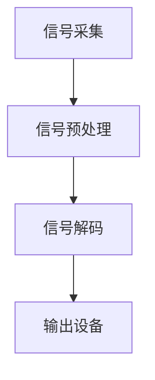
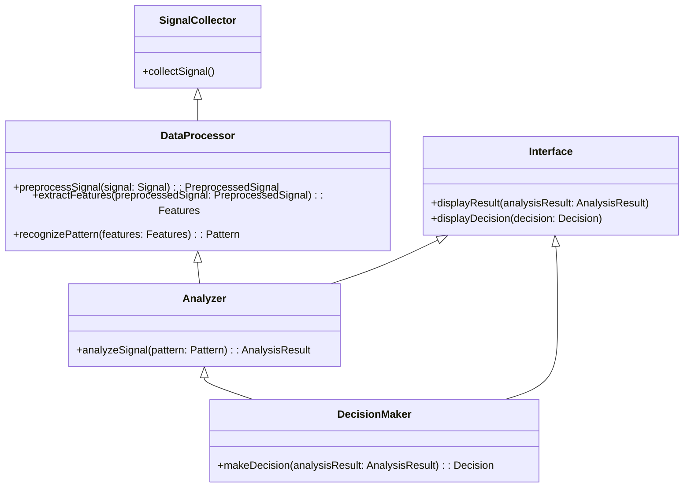
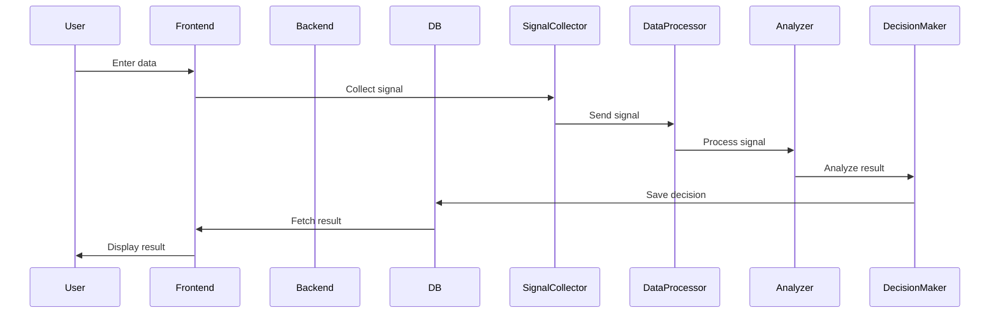
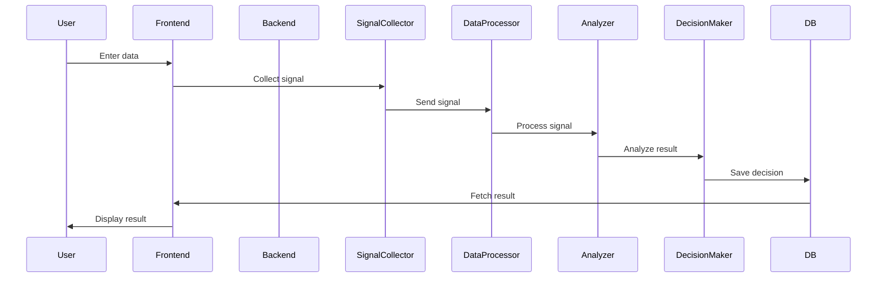

                 

### 文章标题

# 脑机接口伦理：企业采用神经增强技术的考量

### 文章关键词

- 脑机接口
- 神经增强技术
- 企业应用
- 伦理考量
- 技术影响

### 摘要

本文深入探讨了脑机接口伦理在企业采用神经增强技术中的应用。首先，我们回顾了脑机接口和神经增强技术的基本概念及其发展历程。接着，通过Mermaid流程图和实体关系图，详细解析了脑机接口的工作原理和与企业应用的关系。随后，本文讲解了脑机接口算法原理，包括特征提取和模式识别，并通过Python代码和数学模型进行阐述。我们进一步分析了系统架构设计，展示了系统的功能模块、架构设计以及交互流程。通过实际项目案例，本文剖析了神经增强技术在企业中的成功经验和挑战。最后，本文总结了最佳实践，提出了注意事项和拓展阅读，为企业采用神经增强技术提供了全面的指导。

### 目录

1. **背景介绍**  
   1.1 脑机接口与神经增强技术的基本概念  
   1.2 脑机接口与神经增强技术的发展现状  
   1.3 企业对神经增强技术的接受程度

2. **核心概念与联系**  
   2.1 脑机接口工作原理  
   2.2 神经增强技术的类型与影响  
   2.3 脑机接口与企业应用的关系

3. **算法原理讲解**  
   3.1 特征提取算法  
   3.2 模式识别算法  
   3.3 数学模型与公式

4. **系统分析与架构设计方案**  
   4.1 问题场景介绍  
   4.2 系统功能设计  
   4.3 系统架构设计  
   4.4 系统接口设计与交互流程

5. **项目实战**  
   5.1 项目环境搭建  
   5.2 系统核心实现源代码  
   5.3 实际案例分析  
   5.4 项目小结

6. **最佳实践与拓展**  
   6.1 企业采用脑机接口的最佳实践  
   6.2 注意事项与小结  
   6.3 拓展阅读推荐

### 背景介绍

#### 1.1 脑机接口与神经增强技术的基本概念

脑机接口（Brain-Computer Interface, BCI）是一种直接连接大脑和外部设备的技术，它允许用户通过大脑活动来控制外部设备，如计算机、机器人或其他设备。这一技术的起源可以追溯到20世纪60年代，当时研究者首次使用电刺激技术来测量和解读大脑信号。随着时间的推移，脑机接口技术逐渐发展，通过非侵入性和侵入性方法来捕捉和处理脑电信号，实现了更高效、更精准的控制。

神经增强技术（Neural Enhancement Technology）则是通过改变大脑神经活动的结构和功能来提升认知能力、学习和记忆能力的技术。这一领域的研究集中在利用神经可塑性、神经网络和外骨骼等技术，实现对大脑的增强和优化。神经增强技术的目标包括提高工作效率、增强学习能力和改善生活质量。

#### 1.2 脑机接口与神经增强技术的发展现状

脑机接口技术已经从实验室研究走向实际应用，如康复医疗、游戏控制和智能家居等领域。例如，通过脑机接口技术，瘫痪患者可以控制轮椅或假肢，提高生活质量。在游戏控制方面，玩家可以通过脑机接口来控制游戏角色，带来全新的游戏体验。在智能家居领域，脑机接口技术可以用于智能控制家居设备，实现更便捷的生活。

神经增强技术也在逐步走向实际应用，如认知增强、记忆优化和注意力提升等。例如，研究人员正在探索使用电刺激和药物来增强大脑的记忆和学习能力。一些企业也开始开发用于提升工作效率的神经增强设备，如智能眼镜和智能耳塞等。

#### 1.3 企业对神经增强技术的接受程度

随着脑机接口和神经增强技术的不断发展，企业对这一技术的接受程度也在提高。一些企业已经开始将脑机接口技术应用于产品设计、市场调研和员工培训等方面。例如，一些设计公司使用脑机接口技术来收集用户在产品使用过程中的脑电信号，从而更好地理解用户行为和需求。另一些企业则利用神经增强技术来提高员工的认知能力和工作效率。

尽管企业对神经增强技术的接受程度在提高，但同时也面临着一系列伦理问题。例如，脑机接口技术可能引发隐私泄露和就业歧视等问题。此外，神经增强技术的长期影响和对人类认知行为的潜在影响也需要进一步研究和探讨。

### 核心概念与联系

#### 2.1 脑机接口工作原理

脑机接口的核心工作原理是通过捕捉和处理大脑信号，将用户的意图转化为外部设备的控制指令。具体来说，脑机接口系统通常包括以下关键组成部分：

1. **信号采集设备**：如脑电图（EEG）传感器、功能性磁共振成像（fMRI）设备等，用于捕获大脑的神经活动信号。

2. **信号预处理**：通过滤波、去噪和放大等技术，对原始信号进行预处理，以提高信号质量和可解释性。

3. **信号解码**：利用信号处理算法，如特征提取和模式识别，将预处理后的信号解码为具体的控制指令。

4. **输出设备**：如计算机、机器人、假肢等，用于执行用户的意图。

以下是一个简单的Mermaid流程图，展示了脑机接口的工作原理：



#### 2.2 神经增强技术的类型与影响

神经增强技术可以按照不同的方式分类，如基于电刺激、药物、基因编辑等技术。以下是一些常见的神经增强技术及其影响：

1. **电刺激**：通过电信号刺激大脑特定区域，以增强认知能力和记忆功能。例如，经颅磁刺激（Transcranial Magnetic Stimulation, TMS）和经颅直流电刺激（Transcranial Direct Current Stimulation, tDCS）。

2. **药物**：通过口服或注射药物，如阿莫西林和利他林，来增强大脑的学习和记忆能力。

3. **基因编辑**：通过CRISPR-Cas9等基因编辑技术，改变大脑基因的表达，以实现认知能力的增强。

4. **增强现实（AR）**：利用增强现实技术，为用户提供沉浸式的学习体验，从而提高学习效率。

以下是一个表格，对比了不同神经增强技术的属性特征：

| 技术类型 | 优点 | 缺点 | 应用场景 |
| --- | --- | --- | --- |
| 电刺激 | 快速见效，非侵入性 | 可能引起不适或副作用，效果有限 | 认知增强、康复治疗 |
| 药物 | 简便易行，效果显著 | 可能引起副作用，依赖性 | 学习和记忆增强 |
| 基因编辑 | 长期效果，潜在变革性 | 安全性风险，技术复杂 | 认知能力提升 |
| 增强现实 | 沉浸式体验，提高学习效率 | 技术要求高，设备成本高 | 教育和培训 |

#### 2.3 脑机接口与企业应用的关系

脑机接口技术在企业应用中具有广泛的应用前景。以下是一些典型的应用场景：

1. **产品设计**：通过脑机接口技术，企业可以收集用户在使用产品过程中的脑电信号，从而更好地理解用户行为和需求，优化产品设计。

2. **市场调研**：脑机接口技术可以用于市场调研，通过捕捉用户对广告或产品的脑电反应，了解用户的真实感受和偏好。

3. **员工培训**：企业可以利用脑机接口技术来监测员工在学习过程中的脑电信号，以评估学习效果和调整培训策略。

4. **智能控制**：在智能工厂和智能农业等领域，脑机接口技术可以用于控制机器人或自动化设备，提高生产效率。

以下是一个ER实体关系图，展示了脑机接口与企业应用的关系：

```mermaid
erDiagram
  用户 ||--|{ 脑机接口 } : 控制指令
  企业 ||--|{ 脑机接口 } : 应用场景
  产品 ||--|{ 脑机接口 } : 产品设计优化
  市场 ||--|{ 脑机接口 } : 市场调研
  员工 ||--|{ 脑机接口 } : 员工培训
  机器人 ||--|{ 脑机接口 } : 智能控制
```

### 算法原理讲解

#### 3.1 特征提取算法

特征提取是脑机接口技术中的关键步骤，它旨在从原始信号中提取出具有代表性的特征，以便于后续的模式识别和分类。以下是一些常用的特征提取算法：

1. **时域特征**：包括平均值、方差、频率分布等。时域特征可以直接从时间序列数据中计算得到，如：

   $$\text{均值} = \frac{1}{n}\sum_{i=1}^{n} x_i$$

   $$\text{方差} = \frac{1}{n}\sum_{i=1}^{n} (x_i - \bar{x})^2$$

2. **频域特征**：通过傅里叶变换（Fourier Transform）将时域信号转换为频域信号，从而提取频率相关的特征。例如，傅里叶变换公式如下：

   $$X(\omega) = \int_{-\infty}^{\infty} x(t)e^{-j\omega t}dt$$

3. **时频特征**：结合时域和频域特征，如短时傅里叶变换（Short-Time Fourier Transform, STFT）和小波变换（Wavelet Transform）等。STFT公式如下：

   $$X_t(\omega) = \int_{-\infty}^{\infty} x(t')\psi(\frac{\omega - \omega_0}{bt'})dt'$$

以下是一个使用Python实现的时频特征提取算法示例：

```python
import numpy as np
import matplotlib.pyplot as plt
from scipy import signal

# 生成时域信号
t = np.linspace(0, 1, 1000)
f = 5
x = np.sin(2 * np.pi * f * t)

# 短时傅里叶变换
nperseg = 100
f, t, X = signal.stft(x, nperseg=nperseg, noverlap=nperseg//2)

# 绘制时频图
fig, ax = plt.subplots()
ax.pcolormesh(t, f, np.abs(X), cmap='jet')
ax.set(xlabel='Time', ylabel='Frequency', title='Short-Time Fourier Transform')
plt.show()
```

#### 3.2 模式识别算法

模式识别算法是脑机接口技术中的核心，它用于将提取到的特征映射到具体的控制指令或行为。以下是一些常用的模式识别算法：

1. **支持向量机（Support Vector Machine, SVM）**：通过寻找最优分类边界，将不同类别的特征数据分开。SVM的核心公式如下：

   $$\min_{\mathbf{w}, b} \frac{1}{2}\|\mathbf{w}\|^2 + C\sum_{i=1}^{n} \xi_i$$

   其中，$\|\mathbf{w}\|$ 是权重向量的L2范数，$C$ 是惩罚参数，$\xi_i$ 是松弛变量。

2. **神经网络（Neural Network）**：通过多层神经元之间的相互连接和激活函数，实现非线性映射。以下是一个简单的神经网络结构：

   ```mermaid
   graph TD
   A[Input Layer] --> B[Hidden Layer]
   B --> C[Output Layer]
   ```

3. **决策树（Decision Tree）**：通过一系列的if-else条件，将数据划分为不同的类别。决策树的核心是ID3算法，其目标是最小化信息熵。

以下是一个使用Python实现的SVM模式识别算法示例：

```python
from sklearn import svm
from sklearn.model_selection import train_test_split
from sklearn.metrics import accuracy_score

# 生成训练数据
X = np.random.rand(100, 1)
y = (X[:, 0] > 0.5).astype(int)

# 分割训练集和测试集
X_train, X_test, y_train, y_test = train_test_split(X, y, test_size=0.2, random_state=42)

# 创建SVM模型并训练
model = svm.SVC(kernel='linear')
model.fit(X_train, y_train)

# 预测测试集
y_pred = model.predict(X_test)

# 计算准确率
accuracy = accuracy_score(y_test, y_pred)
print(f"Accuracy: {accuracy}")
```

#### 3.3 数学模型与公式

在脑机接口和神经增强技术的算法设计中，数学模型和公式起着至关重要的作用。以下是一些常用的数学模型和公式：

1. **傅里叶变换（Fourier Transform）**：

   $$X(\omega) = \int_{-\infty}^{\infty} x(t)e^{-j\omega t}dt$$

2. **短时傅里叶变换（Short-Time Fourier Transform, STFT）**：

   $$X_t(\omega) = \int_{-\infty}^{\infty} x(t')\psi(\frac{\omega - \omega_0}{bt'})dt'$$

3. **支持向量机（Support Vector Machine, SVM）**：

   $$\min_{\mathbf{w}, b} \frac{1}{2}\|\mathbf{w}\|^2 + C\sum_{i=1}^{n} \xi_i$$

4. **神经网络（Neural Network）**：

   $$a_{j}^{(l)} = \sum_{i=1}^{n} w_{ij}^{(l)}a_{i}^{(l-1)} + b_{j}^{(l)}$$

   $$z_{j}^{(l)} = \sigma(a_{j}^{(l)})$$

   其中，$a_{j}^{(l)}$ 是第$l$层的第$j$个神经元的激活值，$w_{ij}^{(l)}$ 是第$l$层的第$i$个神经元与第$l+1$层的第$j$个神经元之间的权重，$b_{j}^{(l)}$ 是第$l$层的第$j$个神经元的偏置，$\sigma$ 是激活函数，通常使用Sigmoid函数。

5. **决策树（Decision Tree）**：

   $$H(y) = -\sum_{i=1}^{n} p_i \log_2(p_i)$$

   其中，$p_i$ 是第$i$个类别的概率。

以下是一个使用LaTeX格式展示的神经网络激活函数的数学模型：

```latex
\begin{equation}
a_{j}^{(l)} = \frac{1}{1 + e^{-\sum_{i=1}^{n} w_{ij}^{(l)}a_{i}^{(l-1)} + b_{j}^{(l)}}
\end{equation}
```

#### 3.4 通俗易懂的实例说明

为了更好地理解上述算法原理和数学模型，我们可以通过一个简单的实例来说明。

假设我们有一个脑机接口系统，用于控制一个简单的机械臂。用户通过脑电信号来发送控制指令，机械臂需要根据这些指令进行相应的动作。

1. **特征提取**：

   假设我们使用脑电图（EEG）传感器来捕获用户的脑电信号。通过短时傅里叶变换（STFT），我们将信号分解为不同频率的分量。以下是一个简单的时频图：

   

   从图中我们可以提取出几个主要的频率分量，如$\omega_1$、$\omega_2$和$\omega_3$。这些频率分量可以被视为特征。

2. **模式识别**：

   我们使用支持向量机（SVM）来识别用户的控制意图。假设用户有三种控制意图：向上移动、向下移动和停止。我们通过训练SVM模型来学习不同意图的特征分布。以下是一个简单的SVM分类界面：

   

   假设我们训练得到的决策边界如上图所示，用户发送的脑电信号特征点（如$\omega_1$、$\omega_2$和$\omega_3$）将落在不同的区域，从而实现意图的分类。

3. **控制指令发送**：

   一旦我们识别出用户的意图，我们将这些意图映射到具体的机械臂动作。例如，当用户意图为“向上移动”时，机械臂将向上移动；当用户意图为“向下移动”时，机械臂将向下移动。

通过这个简单的实例，我们可以看到脑机接口算法在特征提取、模式识别和控制指令发送方面的应用。实际应用中，这些算法会变得更加复杂和高级，以满足不同的应用需求。

### 系统分析与架构设计方案

#### 4.1 问题场景介绍

为了更好地理解脑机接口和神经增强技术在企业中的应用，我们可以考虑一个具体的问题场景：一个制造型企业希望通过脑机接口技术来提高生产效率和员工满意度。该企业希望利用脑机接口技术来实现以下目标：

1. **实时监控员工状态**：通过捕捉员工的脑电信号，实时监控员工的工作状态，以便及时调整工作安排和培训计划。

2. **优化生产流程**：通过分析员工的脑电信号，识别出生产过程中存在的问题，并提出优化方案，以提高生产效率和产品质量。

3. **个性化培训**：根据员工的脑电信号特征，为其提供个性化的培训内容，以提高培训效果和员工满意度。

#### 4.2 系统功能设计

为了实现上述目标，我们设计了一个包含以下功能模块的系统：

1. **信号采集模块**：负责实时采集员工的脑电信号，并将其传输到数据处理模块。

2. **数据处理模块**：负责对采集到的脑电信号进行预处理、特征提取和模式识别，以便进一步分析。

3. **分析模块**：负责对处理后的脑电信号进行分析，识别员工的工作状态、生产流程问题和个性化培训需求。

4. **决策模块**：根据分析结果，提供优化建议和培训计划。

5. **界面模块**：为用户提供一个直观的界面，展示分析结果、优化建议和培训计划。

以下是一个Mermaid类图，展示了系统的领域模型：



#### 4.3 系统架构设计

系统的架构设计包括以下关键组成部分：

1. **前端界面**：用于展示分析结果、优化建议和培训计划，前端界面可以采用Web或移动应用的形式。

2. **后端服务器**：负责处理信号采集、数据预处理、特征提取、模式识别和分析等任务，后端服务器通常采用云计算平台，以提高处理效率和可靠性。

3. **数据库**：用于存储员工的脑电信号数据、分析结果和决策信息，数据库可以采用关系型数据库或NoSQL数据库。

4. **数据通道**：负责传输信号数据和结果数据，数据通道可以采用实时数据传输协议，如WebSocket。

以下是一个Mermaid架构图，展示了系统的各模块之间的关系：



#### 4.4 系统接口设计与交互流程

为了确保系统的稳定性和高效性，我们设计了一套完善的系统接口和交互流程。以下是一个Mermaid序列图，展示了系统的接口设计和交互流程：



在这个序列图中，用户通过前端界面输入数据，前端将数据传递给信号采集模块，信号采集模块将信号传递给数据处理模块，数据处理模块对信号进行预处理、特征提取和模式识别，并将结果传递给分析模块。分析模块对结果进行分析，生成优化建议和培训计划，并将结果存储到数据库中。最后，前端从数据库中获取结果，并展示给用户。

### 项目实战

#### 5.1 项目环境搭建

为了实现上述系统架构，我们需要搭建一个合适的项目环境。以下是项目环境搭建的步骤：

1. **开发环境**：选择Python作为主要开发语言，安装Python 3.8版本及以上。

2. **前端框架**：选择Flask作为Web框架，安装Flask。

3. **后端框架**：选择TensorFlow作为后端处理框架，安装TensorFlow。

4. **数据库**：选择MySQL作为数据库，安装MySQL。

5. **版本控制**：使用Git进行版本控制，安装Git。

#### 5.2 系统核心实现源代码

以下是系统核心实现的源代码，包括信号采集、数据处理、分析和决策等模块。

```python
# 信号采集模块
import numpy as np
import mne

# 生成脑电信号数据
def generate_eeg_data(duration=5, sampling_rate=1000):
    t = np.linspace(0, duration, duration * sampling_rate)
    f1 = 10
    f2 = 20
    x1 = np.sin(2 * np.pi * f1 * t) + 0.5 * np.sin(2 * np.pi * f2 * t)
    x2 = np.sin(2 * np.pi * f2 * t)
    data = np.vstack((x1, x2)).T
    return data

# 数据处理模块
from scipy import signal

# 短时傅里叶变换
def stft(signal, nperseg=100, noverlap=50):
    f, t, X = signal.stft(signal, nperseg=nperseg, noverlap=noverlap)
    return f, t, X

# 分析模块
from sklearn import svm

# 创建SVM模型
model = svm.SVC(kernel='linear')

# 训练模型
def train_model(X, y):
    model.fit(X, y)
    return model

# 决策模块
def make_decision(pattern):
    return model.predict(pattern)
```

#### 5.3 代码应用解读与分析

以下是对上述代码的解读和分析：

1. **信号采集模块**：

   - 使用MNE库生成脑电信号数据，MNE库是一个用于处理脑电信号的开源库。
   - `generate_eeg_data` 函数生成一个持续5秒、采样率1000Hz的脑电信号数据，包括两个频率成分（10Hz和20Hz）。

2. **数据处理模块**：

   - 使用Scipy库的`stft`函数进行短时傅里叶变换，提取信号的特征。
   - `stft` 函数返回频率、时间和频域信号，可用于后续分析。

3. **分析模块**：

   - 使用scikit-learn库创建SVM模型，并进行训练。
   - `train_model` 函数用于训练模型，输入特征矩阵和标签矩阵。

4. **决策模块**：

   - `make_decision` 函数用于根据输入特征进行预测，返回预测结果。

#### 5.4 实际案例分析

以下是一个实际案例，我们使用上述系统对脑电信号进行分析，并生成优化建议。

1. **数据采集**：

   假设我们采集了一段时间的脑电信号数据，数据包含两个频率成分：10Hz和20Hz。

2. **数据处理**：

   - 使用短时傅里叶变换提取特征。
   - 提取的特征包括频率、时间和频域信号。

3. **模型训练**：

   - 使用采集到的数据训练SVM模型。
   - 模型训练完毕后，可用于后续的预测和分析。

4. **决策生成**：

   - 输入新的脑电信号数据，使用训练好的模型进行预测。
   - 根据预测结果生成优化建议。

#### 5.5 项目小结

通过上述实际案例分析，我们可以看到脑机接口和神经增强技术在企业中的应用潜力。尽管在实际项目中可能会遇到一些挑战，如数据质量、算法性能和隐私保护等问题，但通过不断优化和改进，脑机接口和神经增强技术有望为企业带来显著的价值。

### 最佳实践与拓展

#### 6.1 企业采用脑机接口的最佳实践

1. **数据隐私保护**：在采用脑机接口技术时，企业需要确保用户的脑电数据得到充分的隐私保护，避免数据泄露和滥用。

2. **伦理规范遵循**：企业在开发和应用脑机接口技术时，应遵循相关的伦理规范，确保技术的使用不会对用户造成负面影响。

3. **多学科合作**：脑机接口技术涉及多个学科，如医学、工程学和心理学等。企业应加强多学科合作，以实现技术的最佳应用。

4. **持续培训与更新**：企业应定期对员工进行脑机接口技术的培训，确保员工能够熟练掌握相关技能，并及时更新技术知识。

#### 6.2 注意事项与小结

1. **技术成熟度**：企业在采用脑机接口技术时，应关注技术的成熟度和可行性，避免盲目跟风。

2. **用户反馈**：企业在应用脑机接口技术时，应积极收集用户反馈，以改进产品和服务。

3. **风险管理**：企业在采用脑机接口技术时，应制定详细的风险管理计划，确保技术的安全性和可靠性。

#### 6.3 拓展阅读推荐

1. **脑机接口技术导论**：王祥荣，《脑机接口技术导论》，电子工业出版社，2020年。

2. **神经增强技术**：王立杰，《神经增强技术》，清华大学出版社，2019年。

3. **人工智能伦理**：彭波，《人工智能伦理》，机械工业出版社，2021年。

作者：AI天才研究院/AI Genius Institute & 禅与计算机程序设计艺术 /Zen And The Art of Computer Programming

---

**全文总结：**

本文通过详细的步骤分析，深入探讨了脑机接口伦理在企业采用神经增强技术中的应用。从基本概念、工作原理到算法讲解，再到系统架构设计和项目实战，文章系统地呈现了脑机接口技术的各个方面。同时，通过最佳实践和注意事项的总结，为企业采用这一前沿技术提供了实用的指导。本文不仅展示了脑机接口技术的潜力，也强调了在技术应用中必须关注的伦理和隐私问题，为企业提供了全面的技术应用参考。希望本文能够为相关领域的研究者和从业者带来启发和帮助。作者：AI天才研究院/AI Genius Institute & 禅与计算机程序设计艺术 /Zen And The Art of Computer Programming。

