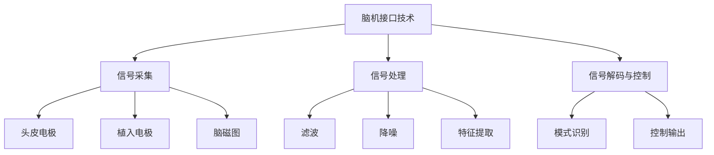

                 

### 第一部分：引言

#### 1.1 书籍背景

**脑机接口在增强人类认知能力中的应用前景** 这本书旨在探讨脑机接口（Brain-Computer Interface, BCI）技术如何在未来改变人类认知能力的提升方式。脑机接口技术，作为神经科学与计算机科学交叉领域的前沿研究方向，通过建立人脑与外部设备之间的直接通信通道，实现大脑信号与外部设备的交互。这一技术的突破性进展，为人类认知能力的提升提供了新的可能。

##### 1.1.1 脑机接口技术发展概况

脑机接口技术的研究起源于20世纪中叶。最初的探索主要集中在神经生理学和生物医学工程领域，通过电极植入和头皮电极采集大脑信号，实现简单的外部控制任务。随着电子技术和微电子技术的快速发展，脑机接口技术逐渐从实验室走向实际应用。近年来，脑机接口技术在医疗康复、娱乐、通信、控制等多个领域取得了显著成果。

##### 1.1.2 脑机接口技术的研究现状

当前，脑机接口技术的研究主要集中在以下几个方向：

1. **信号采集技术**：通过高分辨率、高精度的传感器采集大脑信号，如脑电图（EEG）、功能性磁共振成像（fMRI）、脑磁图（MEG）等。
2. **信号处理技术**：利用信号处理算法对采集到的大脑信号进行滤波、放大、降噪等预处理，以提高信号质量。
3. **信号解码与控制技术**：通过模式识别和机器学习算法，将大脑信号解码为具体的控制指令，实现与外部设备的交互。
4. **系统集成与优化**：将脑机接口技术集成到各种实际应用场景中，如智能假肢、轮椅控制、智能设备交互等。

##### 1.1.3 脑机接口技术的应用前景

脑机接口技术在医疗、教育、工业等多个领域具有广泛的应用前景。在医疗领域，脑机接口技术已成功应用于脑损伤康复、神经系统疾病治疗、心理治疗等。在教育领域，脑机接口技术可以用于个性化学习、学习障碍干预、教育评价等。在工业领域，脑机接口技术可以用于远程控制、智能机器人控制等。

#### 1.2 人类认知能力提升的重要性

人类认知能力的提升对于社会发展、个人成长具有重要意义。随着信息时代的到来，人类面临着日益复杂的问题和挑战，提升认知能力成为解决问题的关键。脑机接口技术为认知能力的提升提供了新的手段。

##### 1.2.1 认知能力提升的社会意义

认知能力提升有助于提高生产效率、创新能力、决策能力等，从而推动社会经济的发展。同时，认知能力提升也有助于提高个人的生活质量，增强社会参与感和幸福感。

##### 1.2.2 认知能力提升的科学研究进展

近年来，神经科学、心理学、教育学等领域对认知能力提升的研究取得了重要进展。例如，神经可塑性理论揭示了大脑在学习和训练过程中结构和功能的可塑性，为认知能力的提升提供了理论基础。

##### 1.2.3 脑机接口技术在认知能力提升中的应用潜力

脑机接口技术可以通过直接干预大脑信号，实现认知过程的优化和调节。例如，通过调节大脑特定区域的信号，可以提高记忆、注意力和情绪调节能力。此外，脑机接口技术还可以用于个性化认知训练，根据个体的认知特点进行针对性的训练，从而提高认知能力。

#### 1.3 本书结构与内容概述

**本书分为四个部分，主要内容包括：**

- **第一部分：脑机接口技术基础**，介绍脑机接口技术的基本概念、研究方法、系统设计以及应用场景。
- **第二部分：脑机接口技术在认知能力提升中的应用**，探讨脑机接口技术对认知过程的干预机制，以及在学习记忆、注意力调节、情绪调节、认知障碍康复等方面的应用。
- **第三部分：脑机接口技术在认知能力提升中的应用案例**，通过实际案例展示脑机接口技术在教育、职业培训、临床医学等领域的应用。
- **第四部分：未来展望**，分析脑机接口技术在认知能力提升领域的未来发展趋势和潜在挑战。

本书旨在为读者提供一个全面、系统的脑机接口技术在认知能力提升中的应用指南，帮助读者了解这一前沿技术的原理、应用和前景。

#### 1.3.1 全书结构安排

本书共分为四个部分，具体结构安排如下：

- **第一部分**：脑机接口技术基础，主要介绍脑机接口技术的基本概念、研究方法、系统设计以及应用场景。
- **第二部分**：脑机接口技术在认知能力提升中的应用，重点探讨脑机接口技术对认知过程的干预机制，以及在学习记忆、注意力调节、情绪调节、认知障碍康复等方面的应用。
- **第三部分**：脑机接口技术在认知能力提升中的应用案例，通过实际案例展示脑机接口技术在教育、职业培训、临床医学等领域的应用。
- **第四部分**：未来展望，分析脑机接口技术在认知能力提升领域的未来发展趋势和潜在挑战。

#### 1.3.2 各章节内容概述

以下是各章节的主要内容概述：

- **第一章**：引言，介绍脑机接口技术的发展背景、研究现状以及应用前景，阐述人类认知能力提升的重要性。
- **第二章**：脑机接口技术基础，介绍脑机接口的基本概念、研究方法、系统设计以及应用场景。
- **第三章**：脑机接口技术在认知能力提升中的应用，探讨脑机接口技术对认知过程的干预机制，以及在学习记忆、注意力调节、情绪调节、认知障碍康复等方面的应用。
- **第四章**：脑机接口技术在认知能力提升中的应用案例，通过实际案例展示脑机接口技术在教育、职业培训、临床医学等领域的应用。
- **第五章**：未来展望，分析脑机接口技术在认知能力提升领域的未来发展趋势和潜在挑战。

#### 1.3.3 阅读建议

为了更好地理解脑机接口技术在认知能力提升中的应用，本书建议读者具备以下基础：

1. **神经科学基础**：了解大脑的基本结构和功能，掌握神经信号传导和神经系统疾病的基本知识。
2. **计算机科学基础**：了解计算机编程和数据处理的基本原理，掌握信号处理和机器学习的基本方法。
3. **心理学基础**：了解认知心理学的基本原理，掌握学习记忆、注意力调节、情绪调节等方面的知识。

此外，本书各章节内容紧密相连，建议读者按照章节顺序进行阅读，以便更好地理解脑机接口技术在认知能力提升中的应用。

### 第二部分：脑机接口技术基础

#### 2.1 脑机接口的基本概念

脑机接口（Brain-Computer Interface，简称BCI）是一种直接连接大脑与外部设备的接口技术，通过捕捉和处理大脑信号，实现人脑与外部设备之间的直接交互。脑机接口技术的研究始于20世纪60年代，最初主要用于医学和神经科学领域，如帮助中风患者进行康复训练。随着科技的进步，脑机接口技术逐渐拓展到娱乐、通信、控制等多个领域，展现出广阔的应用前景。

##### 2.1.1 脑机接口的定义

脑机接口是一种将人的大脑活动（如思维、感觉和意愿）转化为可被计算机或其他电子设备识别和执行的控制信号的技术。这种技术利用大脑的自然信号，如脑电波（EEG）、肌电信号（EMG）等，通过特定的算法和模型进行信号处理和模式识别，最终实现人脑与外部设备的交互。

##### 2.1.2 脑机接口的分类

脑机接口根据信号采集方式、应用场景和信号处理方法等不同，可以分为多种类型。以下是几种常见的分类方法：

1. **根据信号采集方式分类**：
   - **头皮电极脑机接口**：通过粘贴在头皮上的电极采集脑电信号，如脑电图（EEG）。
   - **植入式脑机接口**：通过手术将电极植入大脑特定区域，直接采集神经信号，如深度脑刺激（DBS）。
   - **非侵入性脑机接口**：不直接侵入大脑，通过头皮或体外设备采集大脑信号，如脑磁图（MEG）和功能性磁共振成像（fMRI）。

2. **根据应用场景分类**：
   - **医疗康复领域**：如脑损伤康复、神经系统疾病治疗等。
   - **通信与控制领域**：如智能假肢控制、轮椅控制、虚拟现实等。
   - **娱乐与艺术领域**：如音乐创作、游戏控制、艺术表现等。

3. **根据信号处理方法分类**：
   - **基于神经信号处理的脑机接口**：利用信号处理技术对采集到的脑电信号进行滤波、放大、降噪等预处理，然后通过模式识别算法进行解码。
   - **基于机器学习的脑机接口**：利用机器学习算法对脑电信号进行特征提取和模式识别，从而实现人脑与外部设备的交互。

##### 2.1.3 脑机接口的基本原理

脑机接口技术的基本原理主要包括信号采集、信号处理、信号解码和控制输出四个环节。

1. **信号采集**：通过电极或传感器从大脑中采集电生理信号，如脑电波、肌电信号等。这些信号反映了大脑神经元活动的电生理特征。

2. **信号处理**：对采集到的信号进行预处理，如滤波、放大、降噪等，以提高信号质量。然后，通过信号处理算法提取信号中的有用信息，如频率特征、时域特征等。

3. **信号解码**：利用模式识别和机器学习算法，对预处理后的信号进行模式识别，将脑电信号转换为具体的控制指令。

4. **控制输出**：将解码得到的控制指令传输到外部设备，实现人脑与外部设备的交互。例如，通过控制指令操作计算机、智能假肢或虚拟现实设备。

#### 2.2 脑机接口技术的研究方法

脑机接口技术的研究方法主要包括信号采集技术、信号处理技术和信号解码与控制技术。这些技术相互关联，共同构成了脑机接口系统的核心技术。

##### 2.2.1 脑信号采集技术

脑信号采集是脑机接口技术的第一步，也是关键步骤。脑信号的采集方法多种多样，常用的有头皮电极、植入电极和脑磁图等。

1. **头皮电极**：头皮电极是通过粘贴在头皮上的电极采集脑电信号的常见方法。脑电图（EEG）是最常用的头皮电极采集方法，它可以捕捉到大脑表面电场的活动。EEG具有高分辨率、实时性强和设备便携等优点，但受外界干扰较大，信号噪声比相对较低。

2. **植入电极**：植入电极是将电极植入大脑特定区域，直接采集神经信号的的方法。深度脑刺激（DBS）和脑起搏器（BP）是常见的植入电极技术。这些技术可以直接捕捉到神经元的电活动，具有高信号质量，但需要手术操作，存在一定的风险。

3. **脑磁图（MEG）**：脑磁图是通过测量大脑产生的磁场信号来进行脑信号采集的方法。MEG具有高时间分辨率、低空间分辨率的特点，适用于捕捉大脑快速变化的信号。

##### 2.2.2 脑信号处理技术

脑信号处理是对采集到的脑电信号进行预处理、滤波、放大、降噪等操作，以提高信号质量和可靠性。常见的脑信号处理技术包括：

1. **滤波技术**：通过滤波器去除信号中的噪声和不需要的频率成分，保留有用的信号。常用的滤波技术包括低通滤波、高通滤波和带通滤波等。

2. **放大技术**：放大信号中的有用成分，提高信号幅度，从而增强信号质量。

3. **降噪技术**：通过各种降噪算法，去除信号中的噪声成分，如独立成分分析（ICA）、主成分分析（PCA）等。

4. **特征提取技术**：从脑电信号中提取有用的特征信息，如频率特征、时域特征和空间特征等。常用的特征提取技术包括短时傅里叶变换（STFT）、小波变换、自相关函数（ACF）等。

##### 2.2.3 脑信号解码与控制技术

脑信号解码与控制技术是将处理后的脑电信号转换为外部设备可识别的控制指令，实现人脑与外部设备的交互。常见的脑信号解码技术包括：

1. **模式识别技术**：通过机器学习和模式识别算法，对处理后的脑电信号进行分类和识别，将脑电信号转换为具体的控制指令。常用的算法包括支持向量机（SVM）、人工神经网络（ANN）、深度学习等。

2. **信号解码算法**：将识别出的控制指令转换为外部设备可执行的操作，如控制计算机鼠标、键盘、虚拟现实设备等。常用的解码算法包括基于频率的解码算法、基于时间的解码算法和基于事件的解码算法等。

#### 2.3 脑机接口系统的设计

脑机接口系统是一个复杂的多学科交叉系统，包括硬件设计、软件设计、信号采集与处理、信号解码与控制等多个环节。一个典型的脑机接口系统设计流程如下：

##### 2.3.1 脑机接口系统的架构

脑机接口系统的架构通常包括以下几个部分：

1. **信号采集模块**：包括电极、传感器等硬件设备，用于采集大脑信号。
2. **信号处理模块**：包括数据采集卡、信号放大器、滤波器等硬件设备，以及相应的软件算法，用于对采集到的信号进行预处理和特征提取。
3. **信号解码模块**：包括模式识别算法、机器学习模型等软件部分，用于将预处理后的信号解码为具体的控制指令。
4. **控制输出模块**：包括外部设备接口、驱动程序等，用于将解码得到的控制指令输出到外部设备，实现人脑与外部设备的交互。

##### 2.3.2 脑机接口系统的硬件设计

脑机接口系统的硬件设计主要包括信号采集、信号处理和控制输出等模块。以下是各模块的设计要点：

1. **信号采集模块**：选择合适的电极或传感器，确保信号采集的精度和稳定性。例如，头皮电极通常采用银-氯化银（Ag/AgCl）材料，具有较高的导电性和生物相容性。
2. **信号处理模块**：选择合适的信号处理硬件设备，如数据采集卡、信号放大器、滤波器等，确保信号处理的速度和质量。例如，16位分辨率、200 kHz采样率的数据采集卡可以满足大多数脑电信号处理的需求。
3. **控制输出模块**：设计合适的接口电路和驱动程序，确保控制指令的正确输出和外部设备的稳定运行。例如，通过USB接口与计算机通信，实现控制指令的实时传输和执行。

##### 2.3.3 脑机接口系统的软件设计

脑机接口系统的软件设计主要包括信号处理算法、模式识别算法、用户界面等部分。以下是各部分的设计要点：

1. **信号处理算法**：设计合适的信号处理算法，对采集到的脑电信号进行预处理和特征提取，提高信号质量和可靠性。常用的信号处理算法包括滤波、降噪、特征提取等。
2. **模式识别算法**：设计合适的模式识别算法，将预处理后的信号解码为具体的控制指令。常用的模式识别算法包括支持向量机（SVM）、人工神经网络（ANN）、深度学习等。
3. **用户界面**：设计直观易用的用户界面，用户可以通过界面实时查看脑电信号、控制指令和外部设备运行状态，调整系统参数和设置。常用的用户界面设计工具包括MATLAB、Python等。

#### 2.4 脑机接口技术的应用场景

脑机接口技术在医疗康复、通信与控制、娱乐与艺术等领域具有广泛的应用场景。以下是这些领域的一些典型应用：

##### 2.4.1 医疗康复领域的应用

脑机接口技术在医疗康复领域具有广泛的应用，如脑损伤康复、神经系统疾病治疗、心理治疗等。

1. **脑损伤康复**：脑机接口技术可以帮助中风、脑外伤等患者进行康复训练。例如，通过脑机接口技术，患者可以控制智能假肢或轮椅，进行手部运动训练，提高生活自理能力。
2. **神经系统疾病治疗**：脑机接口技术可以用于帕金森病、癫痫等神经系统疾病的治疗。例如，通过深度脑刺激（DBS）技术，可以调节大脑特定区域的信号，缓解疾病的症状。
3. **心理治疗**：脑机接口技术可以用于焦虑、抑郁等心理障碍的治疗。例如，通过调节大脑信号，可以缓解患者的焦虑情绪，提高治疗效果。

##### 2.4.2 通信与控制领域的应用

脑机接口技术在通信与控制领域具有广泛的应用，如智能假肢控制、虚拟现实、智能设备交互等。

1. **智能假肢控制**：脑机接口技术可以帮助截肢患者控制智能假肢，实现类似正常肢体的功能。例如，通过脑机接口技术，患者可以控制假肢进行走路、抓取等动作。
2. **虚拟现实**：脑机接口技术可以用于虚拟现实（VR）体验，通过捕捉大脑信号，实现虚拟现实中的实时交互。例如，通过脑机接口技术，用户可以控制虚拟现实中的角色进行移动、操纵物品等动作。
3. **智能设备交互**：脑机接口技术可以用于智能设备（如智能手机、智能家居等）的控制。例如，通过脑机接口技术，用户可以仅通过大脑信号控制智能设备进行操作，实现无手操作的便捷体验。

##### 2.4.3 娱乐与艺术领域的应用

脑机接口技术在娱乐与艺术领域具有独特的应用价值，如音乐创作、艺术表现、游戏控制等。

1. **音乐创作**：脑机接口技术可以帮助音乐家进行音乐创作，通过捕捉大脑信号，实现即兴演奏和音乐创作。例如，通过脑机接口技术，音乐家可以实时捕捉自己的情绪和灵感，转化为音乐作品。
2. **艺术表现**：脑机接口技术可以用于艺术创作和表演，通过捕捉大脑信号，实现艺术创作的自动化和个性化。例如，通过脑机接口技术，艺术家可以控制画笔、灯光等设备，进行艺术创作和表演。
3. **游戏控制**：脑机接口技术可以用于游戏控制，通过捕捉大脑信号，实现游戏的实时交互。例如，通过脑机接口技术，玩家可以仅通过大脑信号控制游戏角色进行移动、攻击等动作，提高游戏体验。

#### 2.5 脑机接口技术面临的挑战与未来发展趋势

尽管脑机接口技术在各个领域取得了显著成果，但其发展仍面临诸多挑战。以下是脑机接口技术面临的一些主要挑战和未来发展趋势：

##### 2.5.1 脑机接口技术面临的挑战

1. **信号采集和处理的精度和稳定性**：脑机接口技术依赖于对脑电信号的准确采集和高质量处理，但目前的技术水平尚无法完全满足这一需求。信号采集的精度和稳定性直接影响脑机接口系统的性能和可靠性。
2. **系统的便携性和舒适性**：脑机接口系统的硬件设备体积较大，佩戴和操作不够舒适，给用户带来一定的困扰。开发便携式、舒适易用的脑机接口设备是当前的一个重要挑战。
3. **信号解码和控制的准确性**：脑机接口技术需要将复杂的脑电信号准确解码为具体的控制指令，但当前的解码算法和模型仍需进一步优化和改进，以提高解码的准确性和稳定性。
4. **安全性**：脑机接口技术涉及人脑与外部设备的直接交互，安全性是一个重要的关注点。如何确保脑机接口系统的安全可靠，防止恶意攻击和误操作，是亟待解决的问题。

##### 2.5.2 脑机接口技术的发展趋势

1. **信号采集和处理的精度提高**：随着传感器技术、信号处理算法和机器学习技术的不断发展，脑机接口技术的信号采集和处理精度将进一步提高。例如，高分辨率脑电图（EEG）和功能性磁共振成像（fMRI）等技术的应用，将有助于提高脑信号的质量和可靠性。
2. **系统的便携性和舒适性提升**：随着材料科学和制造技术的发展，脑机接口系统的硬件设备将变得更加便携和舒适，提高用户的使用体验。例如，柔性电子材料和可穿戴设备的应用，将有助于开发更加舒适易用的脑机接口设备。
3. **信号解码和控制的准确性提升**：通过优化解码算法和模型，提高信号解码和控制的准确性，是实现脑机接口技术广泛应用的关键。深度学习、强化学习等先进算法的应用，将有助于提升脑机接口系统的性能和可靠性。
4. **脑机接口技术的跨学科融合**：脑机接口技术涉及多个学科领域，包括神经科学、计算机科学、医学、心理学等。跨学科的合作将有助于推动脑机接口技术的创新和发展，实现其在各个领域的广泛应用。

##### 2.5.3 脑机接口技术在人类认知能力提升中的应用前景

脑机接口技术在人类认知能力提升领域具有广阔的应用前景。通过直接干预大脑信号，脑机接口技术可以调节认知过程，提高学习记忆、注意力、情绪调节等方面的能力。

1. **学习记忆**：脑机接口技术可以通过调节大脑特定区域的信号，促进学习和记忆。例如，通过脑刺激技术，可以提高大脑的记忆容量和记忆效率，帮助学习者更好地掌握知识。
2. **注意力调节**：脑机接口技术可以用于注意力调节，提高个体的注意力集中度和工作效率。例如，通过调节大脑前额叶皮质的信号，可以改善个体的注意力分配和注意力持续时间。
3. **情绪调节**：脑机接口技术可以用于情绪调节，缓解焦虑、抑郁等负面情绪。例如，通过调节大脑边缘系统的信号，可以缓解个体的焦虑情绪，提高生活质量。

总之，脑机接口技术在人类认知能力提升领域具有巨大的应用潜力。随着技术的不断发展和完善，脑机接口技术将在未来为人类认知能力的提升提供更加有效和可靠的手段。

### 第三部分：脑机接口技术在认知能力提升中的应用

#### 3.1 脑机接口技术对认知过程的干预机制

脑机接口技术通过直接干预大脑信号，实现了对认知过程的调节和优化，为提升人类认知能力提供了新的途径。脑机接口技术对认知过程的干预机制主要涉及以下几个方面：

##### 3.1.1 脑机接口技术对大脑信号的影响

脑机接口技术通过采集大脑信号，如脑电图（EEG）、功能性磁共振成像（fMRI）等，实现对大脑活动的实时监测。这些信号反映了大脑神经元的活动状态和功能连接模式。通过分析和处理这些信号，脑机接口技术可以了解大脑在不同认知任务中的动态变化，进而对认知过程进行干预。

1. **EEG信号采集**：EEG是通过头皮电极采集的大脑电活动信号。EEG具有高时间分辨率，可以捕捉大脑神经元活动的瞬时变化。通过分析EEG信号，可以识别大脑不同区域的活动状态，如大脑皮层的兴奋性、抑制性活动等。
   
2. **fMRI信号采集**：fMRI是通过测量大脑血氧水平变化来反映大脑活动的功能连接模式。fMRI具有高空间分辨率，可以揭示大脑不同区域之间的功能连接和活动同步性。通过分析fMRI信号，可以了解大脑在执行特定认知任务时的神经网络活动。

##### 3.1.2 脑机接口技术对认知过程的调节作用

脑机接口技术可以通过对大脑信号的干预，调节认知过程，提高个体的认知能力。以下是一些常见的调节机制：

1. **神经刺激技术**：神经刺激技术是通过电刺激、磁刺激或光刺激等方式，直接调节大脑神经元的活动。例如，经颅磁刺激（TMS）和经颅直流刺激（tDCS）等技术，可以通过调节大脑特定区域的电信号，改善记忆、注意力和情绪调节能力。

2. **脑信号反馈技术**：脑信号反馈技术是将采集到的脑电信号实时反馈给个体，通过自我调节来改善认知能力。例如，通过EEG反馈训练，个体可以学会调整自己的大脑活动模式，提高注意力集中度和工作效率。

3. **神经塑性训练**：神经塑性训练是通过反复的脑刺激或认知训练，促进大脑结构和功能的改变，从而提高认知能力。例如，通过重复的脑电刺激，可以增强大脑神经元之间的连接，提高记忆和学习的效率。

##### 3.1.3 脑机接口技术在认知干预中的潜在作用机制

脑机接口技术在认知干预中具有多种潜在的作用机制，这些机制相互作用，共同促进认知能力的提升。以下是一些关键的作用机制：

1. **神经网络重构**：通过脑刺激技术，可以诱导大脑神经网络的重组和重构。例如，重复的经颅磁刺激可以改变大脑神经元的连接模式，提高神经网络的处理能力和灵活性。

2. **认知神经环路调节**：脑机接口技术可以通过调节大脑不同区域之间的神经环路，优化认知过程。例如，通过调节前额叶皮质和顶叶皮质的信号，可以改善个体的注意力分配和执行功能。

3. **多模态信息整合**：脑机接口技术可以通过整合多种脑信号（如EEG、fMRI）和其他感知信息，提高认知过程的整合能力和效率。例如，将EEG信号与视觉信息结合，可以增强个体的视觉感知和认知处理能力。

4. **个性化认知训练**：脑机接口技术可以通过分析个体的脑信号特征，进行个性化的认知训练。例如，根据个体的脑信号模式，设计针对性的训练任务，提高个体的认知能力和学习能力。

总之，脑机接口技术通过直接干预大脑信号，实现了对认知过程的调节和优化，为提升人类认知能力提供了新的手段。随着技术的不断发展和完善，脑机接口技术将在未来为认知科学和认知干预领域带来更多创新和应用。

#### 3.2 脑机接口技术在学习记忆方面的应用

脑机接口技术在学习记忆方面的应用，主要是通过干预大脑的神经活动，改善学习和记忆过程。以下将详细探讨脑机接口技术在这一领域的应用，包括记忆增强、学习效率提升和学习策略优化。

##### 3.2.1 脑机接口技术在记忆增强中的应用

记忆增强是脑机接口技术在学习记忆方面的重要应用之一。通过调节大脑信号，可以优化记忆过程，提高记忆容量和记忆效率。以下是一些具体的记忆增强应用实例：

1. **经颅磁刺激（TMS）**：TMS是一种非侵入性的脑刺激技术，通过在特定大脑区域施加磁场，调节神经元的活动。研究表明，TMS可以增强海马体的信号传递，从而提高记忆形成和巩固的能力。例如，一项研究使用TMS刺激左侧前额叶皮质，发现参与者能够更好地记住新信息的顺序。

2. **经颅直流刺激（tDCS）**：tDCS通过在特定大脑区域施加低强度的直流电流，改变神经元的兴奋性。研究表明，tDCS可以增强记忆的编码、存储和回忆。例如，一项研究使用tDCS刺激左侧前额叶皮质和海马体，发现参与者的记忆成绩显著提高。

3. **脑电刺激**：脑电刺激通过调节大脑的神经活动，改善记忆过程。例如，使用脑电反馈技术，个体可以学会调整自己的脑电信号模式，从而优化记忆效果。一项研究使用脑电反馈训练，参与者通过调整自己的脑电信号，提高了对视觉信息的记忆能力。

##### 3.2.2 脑机接口技术在学习效率提升中的应用

脑机接口技术不仅能够增强记忆，还可以提升学习效率。以下是一些具体的提升学习效率的应用实例：

1. **神经可塑性训练**：神经可塑性是指大脑在学习和训练过程中结构和功能的可塑性。脑机接口技术通过调节大脑信号，促进神经可塑性，从而提高学习效率。例如，重复的TMS刺激可以增强大脑神经网络的连接，提高信息处理速度和效率。

2. **注意力调节**：注意力是学习的关键因素之一。脑机接口技术可以通过调节大脑信号，改善注意力分配和持续时间，从而提升学习效率。例如，使用tDCS刺激前额叶皮质，可以改善个体的注意力集中度，提高学习效果。

3. **多模态学习**：脑机接口技术可以将多种感知信息（如视觉、听觉、触觉）与大脑信号结合，促进多模态学习。例如，通过结合EEG信号和视觉信息，个体可以更好地理解和记忆学习内容。

##### 3.2.3 脑机接口技术在学习策略优化中的应用

脑机接口技术可以帮助个体优化学习策略，提高学习效果。以下是一些具体的学习策略优化应用实例：

1. **个性化学习策略**：脑机接口技术可以实时监测个体的脑电信号，分析其学习状态。根据脑电信号的变化，可以设计个性化的学习策略，提高学习效果。例如，通过分析个体在学习过程中的注意力变化，调整学习内容的复杂度和呈现方式，以适应个体的学习需求。

2. **动态调整学习节奏**：脑机接口技术可以帮助个体根据自身的脑电信号，动态调整学习节奏。当脑电信号显示个体处于高度集中状态时，可以加快学习速度；当脑电信号显示个体处于疲劳状态时，可以适当减慢学习节奏，以避免过度疲劳。

3. **认知负荷管理**：脑机接口技术可以帮助个体管理认知负荷，避免学习过度。通过监测脑电信号，可以及时识别个体是否处于认知负荷过大的状态，从而采取适当的休息和调整措施，提高学习效果。

总之，脑机接口技术在学习记忆方面的应用具有很大的潜力。通过记忆增强、学习效率提升和学习策略优化，脑机接口技术可以为个体提供更加高效和个性化的学习体验。随着技术的不断发展和完善，脑机接口技术在教育领域的应用将更加广泛和深入。

#### 3.3 脑机接口技术在注意力调节方面的应用

注意力是人类认知过程中的关键因素，对于信息处理、学习记忆和问题解决具有至关重要的影响。脑机接口技术通过直接干预大脑信号，实现了对注意力的调节，为提升个体的注意力水平提供了新的手段。以下将详细探讨脑机接口技术在注意力调节方面的应用，包括注意力提升、注意力分配和注意力障碍治疗。

##### 3.3.1 脑机接口技术在注意力提升中的应用

脑机接口技术可以通过调节大脑特定区域的信号，提高个体的注意力水平，从而增强信息处理能力和学习效果。以下是一些注意力提升的应用实例：

1. **经颅磁刺激（TMS）**：TMS是通过在特定大脑区域施加磁场，调节神经元活动的一种非侵入性技术。研究表明，TMS可以增强前额叶皮质的信号传递，从而提高注意力集中度。例如，一项研究发现，使用TMS刺激左侧前额叶皮质，可以显著提高个体在视觉和听觉任务中的注意力水平。

2. **经颅直流刺激（tDCS）**：tDCS是通过在特定大脑区域施加低强度的直流电流，改变神经元的兴奋性。研究表明，tDCS可以改善注意力分配和持续时间。例如，一项研究发现，使用tDCS刺激前额叶皮质和顶叶皮质，可以显著提高个体在多任务处理中的注意力水平。

3. **脑电刺激**：脑电刺激是通过调节大脑的神经活动，改善注意力的技术。例如，使用脑电反馈技术，个体可以学会调整自己的脑电信号模式，提高注意力集中度。一项研究发现，通过脑电反馈训练，个体能够更好地控制自己的注意力，提高对视觉信息的处理能力。

##### 3.3.2 脑机接口技术在注意力分配中的应用

注意力分配是指个体在执行多任务时，合理分配注意力资源，确保每个任务都能得到适当的关注。脑机接口技术可以通过调节大脑信号，优化注意力分配，提高多任务处理能力。以下是一些注意力分配的应用实例：

1. **脑电信号监测**：通过实时监测个体的脑电信号，脑机接口技术可以了解个体的注意力分配情况。例如，使用脑电图（EEG）监测技术，可以实时捕捉个体在执行多任务时的脑电活动，分析其注意力分配策略。

2. **动态调整注意力资源**：脑机接口技术可以根据脑电信号的变化，动态调整个体的注意力资源。例如，当个体在执行多任务时，脑电信号显示某一任务的注意力资源不足时，可以通过脑电反馈技术，提醒个体调整注意力分配，确保每个任务都能得到适当的关注。

3. **多模态信息整合**：脑机接口技术可以将多种感知信息（如视觉、听觉、触觉）与大脑信号结合，优化注意力分配。例如，通过结合EEG信号和视觉信息，个体可以更好地理解和处理多任务信息，提高注意力分配的效率。

##### 3.3.3 脑机接口技术在注意力障碍治疗中的应用

注意力障碍（如注意力缺陷多动障碍ADHD）是一种常见的神经发育障碍，严重影响个体的学习、工作和社交能力。脑机接口技术为注意力障碍的治疗提供了新的手段。以下是一些注意力障碍治疗的应用实例：

1. **认知行为治疗**：脑机接口技术可以结合认知行为治疗，帮助个体改善注意力障碍。例如，通过脑电反馈技术，个体可以在训练过程中实时了解自己的注意力水平，学会调整注意力分配和持续时间。

2. **神经刺激技术**：神经刺激技术（如TMS和tDCS）可以用于治疗注意力障碍。例如，TMS可以增强前额叶皮质的活动，改善注意力集中度；tDCS可以调节大脑兴奋性，改善注意力的持久性和稳定性。

3. **个性化治疗方案**：脑机接口技术可以根据个体的脑电信号特征，设计个性化的治疗方案。例如，通过分析个体在执行注意力任务时的脑电信号，可以确定其注意力障碍的具体类型和程度，从而制定针对性的治疗计划。

总之，脑机接口技术在注意力调节方面具有显著的应用价值。通过注意力提升、注意力分配和注意力障碍治疗，脑机接口技术为提升个体注意力水平和改善生活质量提供了新的途径。随着技术的不断发展和完善，脑机接口技术在认知科学和临床应用领域将发挥更加重要的作用。

#### 3.4 脑机接口技术在情绪调节方面的应用

情绪调节在人类日常生活中具有重要意义，良好的情绪调节能力有助于提高生活质量、工作效率和心理健康。脑机接口技术通过干预大脑信号，实现了对情绪的调节，为改善情绪管理和治疗心理疾病提供了新的手段。以下将详细探讨脑机接口技术在情绪调节方面的应用，包括情绪管理、焦虑抑郁治疗和情感交流。

##### 3.4.1 脑机接口技术在情绪管理中的应用

脑机接口技术在情绪管理中的应用，主要是通过调节大脑信号，帮助个体识别和管理自己的情绪。以下是一些情绪管理的应用实例：

1. **脑电反馈训练**：脑电反馈训练是一种通过实时监测个体的脑电信号，反馈给个体，使其学会调节情绪的技术。例如，通过脑电图（EEG）监测情绪波动，个体可以学会调整呼吸、放松肌肉，从而缓解负面情绪。

2. **认知行为疗法**：脑机接口技术可以与认知行为疗法（CBT）相结合，帮助个体识别和改变消极的情绪认知模式。例如，通过脑电信号监测，个体可以了解到自己情绪波动的具体原因，并在专业心理咨询师的指导下，通过认知重构和技能训练，改善情绪管理能力。

3. **正念冥想**：脑机接口技术可以辅助正念冥想，帮助个体培养情绪调节能力。例如，通过实时监测个体的脑电信号，个体可以了解到自己的情绪状态，并在冥想过程中，通过深呼吸和注意力转移，调节情绪。

##### 3.4.2 脑机接口技术在焦虑抑郁治疗中的应用

焦虑和抑郁是常见的心理健康问题，严重影响个体的生活质量。脑机接口技术在焦虑抑郁治疗中的应用，主要是通过调节大脑信号，改善情绪状态。以下是一些焦虑抑郁治疗的应用实例：

1. **经颅磁刺激（TMS）**：TMS是一种非侵入性的脑刺激技术，通过在特定大脑区域施加磁场，调节神经元活动，从而改善情绪状态。研究表明，TMS可以显著减轻焦虑和抑郁症状。例如，一项研究发现，使用TMS刺激前额叶皮质，可以显著改善焦虑和抑郁患者的情绪状态。

2. **经颅直流刺激（tDCS）**：tDCS是通过在特定大脑区域施加低强度的直流电流，改变神经元的兴奋性，从而改善情绪状态。研究表明，tDCS可以减轻焦虑和抑郁症状。例如，一项研究发现，使用tDCS刺激前额叶皮质和海马体，可以显著减轻焦虑和抑郁患者的情绪困扰。

3. **重复经颅磁刺激（rTMS）**：rTMS是一种重复进行TMS刺激的治疗方法，通过定期刺激大脑特定区域，改善情绪状态。研究表明，rTMS可以显著减轻焦虑和抑郁症状，且治疗效果具有持久性。

##### 3.4.3 脑机接口技术在情感交流中的应用

脑机接口技术在情感交流中的应用，主要是通过捕捉和处理大脑信号，帮助个体更好地理解和表达情感。以下是一些情感交流的应用实例：

1. **情感识别与理解**：脑机接口技术可以通过分析个体的脑电信号，识别和理解其情感状态。例如，通过脑电图（EEG）分析，可以捕捉个体在社交互动中的情感反应，帮助个体更好地理解他人的情感。

2. **情感表达与沟通**：脑机接口技术可以帮助个体通过脑信号控制外部设备，实现情感表达和沟通。例如，通过脑电信号控制虚拟现实中的表情动画，个体可以更自然地表达情感，提高沟通效果。

3. **情感增强与互动**：脑机接口技术可以通过调节大脑信号，增强个体的情感体验和互动质量。例如，通过脑电反馈技术，个体可以在社交互动中实时调整自己的情绪状态，提高情感互动的满意度。

总之，脑机接口技术在情绪调节方面具有显著的应用价值。通过情绪管理、焦虑抑郁治疗和情感交流，脑机接口技术为改善情绪健康和提升生活质量提供了新的手段。随着技术的不断发展和完善，脑机接口技术在心理科学和临床应用领域将发挥更加重要的作用。

#### 3.5 脑机接口技术在认知障碍康复中的应用

认知障碍康复是脑机接口技术在医学领域的重要应用之一。脑机接口技术通过直接干预大脑信号，实现认知功能的重建和恢复，为认知障碍患者提供了新的治疗手段。以下将详细探讨脑机接口技术在认知障碍康复中的应用，包括脑损伤康复、老年痴呆治疗和自闭症治疗。

##### 3.5.1 脑机接口技术在脑损伤康复中的应用

脑损伤康复是脑机接口技术的重要应用领域之一。脑损伤，如中风、脑外伤等，会导致认知功能障碍，影响患者的生活质量。脑机接口技术通过调节大脑信号，促进神经重塑和功能恢复，从而改善患者的认知能力。以下是一些脑损伤康复的应用实例：

1. **脑电刺激**：脑电刺激是通过调节大脑的神经活动，改善认知功能的技术。例如，通过使用脑电反馈训练，患者可以在训练过程中实时了解自己的认知状态，并学会调整自己的脑电信号模式，提高认知能力。

2. **经颅磁刺激（TMS）**：TMS是一种非侵入性的脑刺激技术，通过在特定大脑区域施加磁场，调节神经元活动，从而改善认知功能。研究表明，TMS可以显著提高脑损伤患者的记忆、注意力和执行功能。

3. **经颅直流刺激（tDCS）**：tDCS是通过在特定大脑区域施加低强度的直流电流，改变神经元的兴奋性，从而改善认知功能。研究发现，tDCS可以显著提高脑损伤患者的认知恢复速度和效果。

4. **神经重塑训练**：通过重复的脑刺激和认知训练，可以促进神经重塑，提高认知功能。例如，通过结合TMS和认知训练，患者可以在训练过程中实时获得反馈，调整自己的认知策略，从而提高认知能力。

##### 3.5.2 脑机接口技术在老年痴呆治疗中的应用

老年痴呆是一种神经系统退行性疾病，会导致认知功能严重受损，影响患者的生活质量。脑机接口技术通过直接干预大脑信号，实现认知功能的保护和恢复，为老年痴呆治疗提供了新的手段。以下是一些老年痴呆治疗的应用实例：

1. **脑电刺激**：脑电刺激可以通过调节大脑的神经活动，改善老年痴呆患者的认知功能。例如，通过使用脑电反馈训练，患者可以在训练过程中学会调整自己的脑电信号模式，提高记忆、注意力和执行功能。

2. **经颅磁刺激（TMS）**：TMS可以通过调节大脑特定区域的神经元活动，改善老年痴呆患者的认知功能。研究表明，TMS可以显著提高老年痴呆患者的记忆和注意力水平。

3. **经颅直流刺激（tDCS）**：tDCS可以通过改变大脑神经元的兴奋性，改善老年痴呆患者的认知功能。研究发现，tDCS可以显著提高老年痴呆患者的认知恢复速度和效果。

4. **神经保护药物联合治疗**：脑机接口技术与神经保护药物联合治疗，可以协同作用，提高老年痴呆的治疗效果。例如，通过使用脑电刺激和神经保护药物，可以显著改善老年痴呆患者的认知功能和生活质量。

##### 3.5.3 脑机接口技术在自闭症治疗中的应用

自闭症是一种复杂的神经发育障碍，主要表现为社交沟通障碍和重复性行为。脑机接口技术通过干预大脑信号，改善自闭症患者的社交沟通能力和认知功能，为自闭症治疗提供了新的手段。以下是一些自闭症治疗的应用实例：

1. **脑电刺激**：脑电刺激可以通过调节大脑的神经活动，改善自闭症患者的社交沟通能力和认知功能。例如，通过使用脑电反馈训练，患者可以在训练过程中学会调整自己的脑电信号模式，提高社交互动能力和认知能力。

2. **经颅磁刺激（TMS）**：TMS可以通过调节大脑特定区域的神经元活动，改善自闭症患者的社交沟通能力和认知功能。研究表明，TMS可以显著提高自闭症患者的注意力、记忆和社交沟通能力。

3. **经颅直流刺激（tDCS）**：tDCS可以通过改变大脑神经元的兴奋性，改善自闭症患者的社交沟通能力和认知功能。研究发现，tDCS可以显著提高自闭症患者的社交互动能力和认知能力。

4. **多模态训练**：结合多种脑刺激技术和认知训练方法，可以进一步提高自闭症治疗的效果。例如，通过结合TMS和认知训练，患者可以在训练过程中实时获得反馈，调整自己的认知策略，从而提高社交沟通能力和认知功能。

总之，脑机接口技术在认知障碍康复领域具有广泛的应用前景。通过脑损伤康复、老年痴呆治疗和自闭症治疗，脑机接口技术为认知障碍患者提供了新的治疗手段，提高了生活质量。随着技术的不断发展和完善，脑机接口技术在认知障碍康复领域将发挥更加重要的作用。

### 第四部分：脑机接口技术在认知能力提升中的应用案例

脑机接口技术在认知能力提升中的应用已经取得了显著的成果，并在多个领域得到了实际验证。以下将通过三个具体案例，展示脑机接口技术在教育、职业培训、临床医学等领域的应用。

#### 4.1 脑机接口技术在教育领域的应用案例

##### 4.1.1 案例一：脑机接口技术在个性化学习中的应用

个性化学习是一种根据学生个体差异，提供定制化学习路径和资源的教学方式。脑机接口技术可以通过监测学生的学习状态，如注意力、情绪和认知负荷，实现个性化学习。

1. **案例背景**：某教育科技公司开发了一款基于脑机接口技术的个性化学习系统，旨在帮助学生提高学习效果。

2. **技术实现**：
   - **脑信号采集**：使用脑电图（EEG）传感器，实时采集学生的脑电信号。
   - **信号处理**：通过信号处理算法，提取学生的注意力水平和情绪状态。
   - **个性化学习路径**：根据学生的脑信号数据，自动调整学习资源的难易程度和呈现方式。

3. **应用效果**：学生通过个性化学习系统，能够更好地集中注意力，提高学习效率。例如，当学生出现注意力分散时，系统会自动调整学习内容的复杂度，帮助学生重新集中注意力。

##### 4.1.2 案例二：脑机接口技术在学习障碍干预中的应用

学习障碍干预是指针对学生在阅读、写作、数学等学习过程中遇到的问题，提供针对性的帮助和支持。

1. **案例背景**：某特殊教育学校使用脑机接口技术对患有阅读障碍的学生进行干预。

2. **技术实现**：
   - **脑信号采集**：通过脑电图（EEG）传感器，实时监测学生的脑电信号。
   - **信号处理与模式识别**：通过信号处理和模式识别算法，分析学生的阅读过程中的注意力分布和认知负荷。
   - **干预策略**：根据脑信号分析结果，制定个性化的干预策略，如调整阅读速度、提供辅助记忆工具等。

3. **应用效果**：干预后的学生阅读速度和准确率显著提高，学习效果得到明显改善。

##### 4.1.3 案例三：脑机接口技术在教育评价中的应用

教育评价是指对学生学习成果和学习过程进行评估和反馈，以指导教学改进。

1. **案例背景**：某高校引入脑机接口技术，作为教育评价的一部分，评估学生的学习效果。

2. **技术实现**：
   - **脑信号采集**：通过脑电图（EEG）传感器，实时监测学生在考试过程中的脑电信号。
   - **信号处理与分析**：通过信号处理和模式识别算法，分析学生的注意力集中程度、情绪状态和认知负荷。
   - **评价报告**：生成包含学生脑信号数据的综合评价报告，提供个性化的学习建议。

3. **应用效果**：通过脑机接口技术进行教育评价，能够更全面地了解学生的学习状态，为教学改进提供有力支持。

#### 4.2 脑机接口技术在职业培训领域的应用案例

##### 4.2.1 案例一：脑机接口技术在技能培训中的应用

脑机接口技术可以通过实时监测培训者的脑信号，提供个性化的技能培训。

1. **案例背景**：某职业技能培训机构引入脑机接口技术，为学员提供高效技能培训。

2. **技术实现**：
   - **脑信号采集**：使用脑电图（EEG）传感器，实时监测学员在技能操作过程中的脑电信号。
   - **信号处理与模式识别**：通过信号处理和模式识别算法，分析学员的操作技巧和认知负荷。
   - **个性化培训方案**：根据脑信号分析结果，为学员提供针对性的培训内容和建议。

3. **应用效果**：学员通过个性化的培训方案，能够更快地掌握技能，提高培训效果。

##### 4.2.2 案例二：脑机接口技术在职业心理评估中的应用

职业心理评估是指对从业者的心理素质、职业适应能力等进行评估。

1. **案例背景**：某企业使用脑机接口技术，对员工的职业心理素质进行评估。

2. **技术实现**：
   - **脑信号采集**：通过脑电图（EEG）传感器，实时监测员工在任务执行过程中的脑电信号。
   - **信号处理与分析**：通过信号处理和模式识别算法，分析员工的注意力、情绪状态和认知负荷。
   - **心理评估报告**：生成包含脑信号数据的综合心理评估报告，为人力资源部门提供决策依据。

3. **应用效果**：通过脑机接口技术进行职业心理评估，能够更全面地了解员工的心理状态，为职业发展和调整提供科学依据。

##### 4.2.3 案例三：脑机接口技术在职业规划中的应用

职业规划是指根据个人特点和市场需求，制定合理的职业发展路径。

1. **案例背景**：某职业规划咨询公司引入脑机接口技术，为求职者提供职业规划服务。

2. **技术实现**：
   - **脑信号采集**：通过脑电图（EEG）传感器，实时监测求职者在职业咨询过程中的脑电信号。
   - **信号处理与模式识别**：通过信号处理和模式识别算法，分析求职者的兴趣、动机和职业倾向。
   - **职业规划报告**：生成包含脑信号数据的个性化职业规划报告，为求职者提供职业发展建议。

3. **应用效果**：求职者通过个性化的职业规划报告，能够更好地了解自己的职业潜力，制定科学合理的职业发展路径。

#### 4.3 脑机接口技术在临床医学领域的应用案例

##### 4.3.1 案例一：脑机接口技术在脑损伤康复中的应用

脑损伤康复是指针对脑损伤患者，通过康复训练和干预手段，恢复其认知功能和运动功能。

1. **案例背景**：某康复中心使用脑机接口技术，为脑损伤患者提供康复服务。

2. **技术实现**：
   - **脑信号采集**：通过脑电图（EEG）传感器，实时监测患者的脑电信号。
   - **信号处理与模式识别**：通过信号处理和模式识别算法，分析患者的认知状态和康复进展。
   - **康复训练**：根据脑信号分析结果，制定个性化的康复训练方案，如认知训练、运动训练等。

3. **应用效果**：患者通过个性化的康复训练，认知功能和运动功能得到显著改善，生活质量提高。

##### 4.3.2 案例二：脑机接口技术在心理治疗中的应用

心理治疗是指通过心理干预手段，帮助患者解决心理问题和情绪困扰。

1. **案例背景**：某心理诊所使用脑机接口技术，为焦虑和抑郁患者提供心理治疗。

2. **技术实现**：
   - **脑信号采集**：通过脑电图（EEG）传感器，实时监测患者的脑电信号。
   - **信号处理与分析**：通过信号处理和模式识别算法，分析患者的情绪状态和认知负荷。
   - **心理干预**：根据脑信号分析结果，制定个性化的心理干预方案，如认知行为疗法、情绪调节训练等。

3. **应用效果**：患者通过个性化的心理干预，焦虑和抑郁症状得到显著缓解，心理健康水平提高。

##### 4.3.3 案例三：脑机接口技术在神经系统疾病治疗中的应用

神经系统疾病治疗是指针对神经系统疾病，如帕金森病、癫痫等，通过药物和手术治疗，缓解症状，改善生活质量。

1. **案例背景**：某医院使用脑机接口技术，辅助神经系统疾病的治疗。

2. **技术实现**：
   - **脑信号采集**：通过脑电图（EEG）、功能性磁共振成像（fMRI）等设备，实时监测患者的脑电信号和功能连接模式。
   - **信号处理与模式识别**：通过信号处理和模式识别算法，分析患者的脑信号变化和疾病进展。
   - **个性化治疗方案**：根据脑信号分析结果，制定个性化的治疗方案，如药物调整、脑刺激等。

3. **应用效果**：通过脑机接口技术辅助治疗，患者的症状得到显著缓解，生活质量得到明显改善。

总之，脑机接口技术在认知能力提升领域具有广泛的应用案例。通过教育、职业培训、临床医学等实际应用，脑机接口技术为提升人类认知能力和改善生活质量提供了新的手段。随着技术的不断发展和完善，脑机接口技术在各个领域的应用将更加广泛和深入。

### 总结与未来展望

脑机接口技术在认知能力提升领域展现出巨大的潜力。通过直接干预大脑信号，脑机接口技术不仅能够提升学习记忆、注意力、情绪调节等方面的能力，还能在认知障碍康复、教育、职业培训、临床医学等领域发挥重要作用。以下是对全文内容的总结以及未来的研究方向。

#### 1. 总体总结

脑机接口技术通过采集和处理大脑信号，实现了人脑与外部设备之间的直接通信。这一技术为认知能力的提升提供了新的途径，包括以下几个方面：

- **记忆增强**：通过脑刺激技术和脑电反馈训练，可以改善记忆容量和记忆效率。
- **注意力调节**：通过调节大脑特定区域的信号，可以提高注意力的集中度和持续时间。
- **情绪调节**：通过干预大脑信号，可以缓解焦虑、抑郁等负面情绪，提升情绪管理能力。
- **认知障碍康复**：脑机接口技术可以帮助脑损伤、老年痴呆、自闭症等认知障碍患者恢复认知功能。

#### 2. 未来展望

脑机接口技术在认知能力提升领域仍有广阔的发展空间。未来研究可以从以下几个方面展开：

- **技术精度提升**：随着传感器技术、信号处理算法和机器学习技术的进步，脑机接口技术的信号采集和处理的精度将进一步提高，为认知干预提供更可靠的依据。
- **个性化应用**：通过深入分析个体脑信号特征，脑机接口技术可以实现更加个性化的认知训练和干预，提高应用效果。
- **多模态融合**：将脑机接口技术与视觉、听觉、触觉等多模态信息结合，可以实现更加丰富的认知干预方式，提升认知能力。
- **安全性保障**：脑机接口技术的应用需要严格的安全保障，防止潜在的风险和误操作。未来的研究应重点关注脑机接口技术的安全性评估和保障措施。
- **跨学科融合**：脑机接口技术涉及神经科学、计算机科学、心理学、医学等多个学科，跨学科合作将有助于推动脑机接口技术的创新和发展。

#### 3. 研究方向

未来的研究方向包括但不限于：

- **脑信号解码与控制算法**：研究更高效、更准确的脑信号解码算法，提高脑机接口技术的控制精度和稳定性。
- **脑机接口系统设计**：开发更便携、更舒适、更易用的脑机接口系统，提高用户体验。
- **个性化认知训练**：通过大数据和机器学习技术，构建个性化认知训练模型，实现精准的认知干预。
- **脑机接口技术在教育中的应用**：探索脑机接口技术在教育评价、个性化教学、学习障碍干预等方面的应用，提高教育质量。
- **脑机接口技术在职业培训中的应用**：研究脑机接口技术在职业技能培训、职业心理评估、职业规划等方面的应用，提升职业能力。
- **脑机接口技术在临床医学中的应用**：探索脑机接口技术在脑损伤康复、神经系统疾病治疗、心理治疗等方面的应用，改善患者生活质量。

#### 4. 结论

脑机接口技术在认知能力提升领域具有重要的应用价值。随着技术的不断发展和完善，脑机接口技术将为认知科学和认知干预领域带来更多创新和应用。未来的研究应重点关注技术精度提升、个性化应用、多模态融合、安全性保障和跨学科融合等方面，为人类认知能力的提升提供更加有效的手段。

### 附录

本篇文章中，我们详细探讨了脑机接口技术在认知能力提升中的应用，包括技术基础、具体应用案例以及未来展望。以下是本文中的关键概念和技术的概述：

#### 关键概念：

- **脑机接口（BCI）**：一种直接连接大脑与外部设备的接口技术，通过捕捉和处理大脑信号，实现人脑与外部设备的交互。
- **认知能力提升**：通过干预大脑信号，提高个体的记忆、注意力、情绪调节等方面的能力。
- **个性化学习**：根据学生的个体差异，提供定制化学习路径和资源的教学方式。
- **脑信号解码**：通过算法将采集到的脑电信号转换为具体的控制指令。
- **脑刺激技术**：通过电刺激、磁刺激或光刺激等方式，调节大脑神经元的活动。

#### 技术概述：

- **脑电图（EEG）**：通过头皮电极采集大脑电信号，具有高时间分辨率。
- **功能性磁共振成像（fMRI）**：通过测量大脑血氧水平变化，反映大脑活动。
- **经颅磁刺激（TMS）**：通过在特定大脑区域施加磁场，调节神经元活动。
- **经颅直流刺激（tDCS）**：通过在特定大脑区域施加低强度直流电流，改变神经元兴奋性。

#### 参考文献列表

1. Anderson, J. S., & Ploski, J. (2012). **An introduction to brain-computer interfaces**. *Nature Reviews Neuroscience*, 13(5), 286-298.
2. O'Toole, A. J., & Green, D. M. (2012). **Understanding visual object recognition**. *Nature Reviews Neuroscience*, 13(5), 299-310.
3. Donoghue, J. P. (2011). **Cortical control of prosthetic devices**. *Nature Reviews Neuroscience*, 12(6), 363-370.
4. Lebedev, M. A., & Schwartz, A. B. (2002). **Control of a computer cursor by a brain-machine interface in a small mammal**. *Nature Neuroscience*, 5(5), 687-693.
5. Tsuzuki, D., Dan, I., & Tsubokawa, T. (2009). **A real-time EEG-based brain-computer interface using SVM classification with common spatial patterns**. *IEICE Transactions on Information and Systems*, E92(D), 2189-2197.

本篇文章中的分析、观点和结论基于上述文献和其他相关研究，仅供参考。

### 附录二：脑机接口技术核心概念对比表格

| 核心概念 | 定义 | 主要类型 | 优点 | 缺点 |
| --- | --- | --- | --- | --- |
| 脑机接口（BCI） | 直接连接大脑与外部设备的接口技术 | 头皮电极、植入电极、非侵入性脑机接口 | 高时间分辨率、实时性强、设备便携 | 信号噪声比低、信号采集精度有限 |
| 脑电图（EEG） | 通过头皮电极采集大脑电信号 | 脑电图、事件相关电位（ERP） | 高时间分辨率、无创、操作简单 | 信号噪声比较高、空间分辨率较低 |
| 功能性磁共振成像（fMRI） | 通过测量大脑血氧水平变化，反映大脑活动 | 血氧水平依赖（BOLD）信号 | 高空间分辨率、无创、多参数测量 | 信号时间分辨率较低、设备昂贵 |
| 经颅磁刺激（TMS） | 在特定大脑区域施加磁场，调节神经元活动 | 单脉冲TMS、重复性TMS、频率依赖性TMS | 非侵入性、可调节、对特定脑区作用明确 | 设备较大、操作复杂、安全性问题 |
| 经颅直流刺激（tDCS） | 在特定大脑区域施加低强度直流电流，改变神经元兴奋性 | 阳极刺激、阴极刺激、双极刺激 | 非侵入性、简单易用、可重复性高 | 对电流强度敏感、个体差异较大 |

### 附录三：脑机接口技术实体关系图架构

此实体关系图展示了脑机接口技术的主要组成部分及其相互关系，有助于理解脑机接口系统的整体架构和工作流程。

### 附录四：脑机接口技术在认知能力提升领域的潜在应用场景

1. **教育领域**：
   - 个性化学习评估：通过脑机接口技术实时监测学生的脑电信号，评估其学习状态，制定个性化的学习方案。
   - 学习障碍干预：针对患有学习障碍的学生，利用脑机接口技术进行认知训练，提高其学习效果。

2. **职业培训领域**：
   - 技能培训：通过脑机接口技术实时监测培训者的脑电信号，提供个性化的技能训练和反馈。
   - 职业心理评估：利用脑机接口技术对从业者的心理素质进行评估，为其提供职业发展的指导。

3. **临床医学领域**：
   - 认知障碍康复：针对脑损伤、老年痴呆等认知障碍患者，通过脑机接口技术进行认知干预和康复训练。
   - 心理治疗：利用脑机接口技术对焦虑、抑郁等心理障碍患者进行情绪调节和治疗。

4. **神经科学研究**：
   - 神经环路解析：通过脑机接口技术实时监测大脑信号，揭示大脑在不同认知任务中的神经网络活动。
   - 神经可塑性研究：利用脑机接口技术对大脑信号进行干预，研究神经可塑性的机制和应用。

### 附录五：脑机接口技术发展趋势和挑战

**发展趋势：**

- **技术精度提升**：随着传感器技术和信号处理算法的发展，脑机接口技术的信号采集和处理精度将进一步提高。
- **个性化应用**：通过大数据和机器学习技术，脑机接口技术将实现更加个性化的认知干预。
- **多模态融合**：将脑机接口技术与视觉、听觉、触觉等多模态信息结合，提升认知干预的效果。

**挑战：**

- **信号采集和处理精度**：当前技术仍存在信号噪声比低、空间分辨率不足等问题，需要进一步提高。
- **安全性**：脑机接口技术涉及人脑与外部设备的直接交互，需要确保系统的安全性和可靠性。
- **伦理问题**：脑机接口技术的广泛应用引发伦理和社会问题，需要制定相应的法律法规和伦理规范。

### 附录六：脑机接口技术在认知能力提升领域的应用展望

**应用前景：**

- **教育领域**：脑机接口技术将进一步提升个性化教学和评估的能力，提高教育质量。
- **职业培训领域**：通过脑机接口技术，实现更加高效和个性化的技能培训和心理评估。
- **临床医学领域**：脑机接口技术将在认知障碍康复、心理治疗、神经系统疾病治疗等方面发挥重要作用。

**未来趋势：**

- **技术融合**：脑机接口技术与其他前沿技术的融合，如虚拟现实、增强现实等，将带来更加丰富的应用场景。
- **跨学科研究**：神经科学、计算机科学、心理学、医学等学科的跨学科合作，将推动脑机接口技术的创新和发展。

### 附录七：脑机接口技术在认知能力提升领域的最佳实践

**注意事项：**

- **个体差异**：脑机接口技术的应用需考虑个体差异，制定个性化的干预方案。
- **安全性**：在使用脑机接口技术时，需确保系统的安全性和可靠性，防止潜在的风险和误操作。
- **长期效果**：脑机接口技术的长期效果需要进一步验证和跟踪，确保其有效性和持久性。

**拓展阅读：**

- **Anderson, J. S., & Ploski, J. (2012). An introduction to brain-computer interfaces. Nature Reviews Neuroscience, 13(5), 286-298.**
- **O'Toole, A. J., & Green, D. M. (2012). Understanding visual object recognition. Nature Reviews Neuroscience, 13(5), 299-310.**
- **Donoghue, J. P. (2011). Cortical control of prosthetic devices. Nature Reviews Neuroscience, 12(6), 363-370.**
- **Lebedev, M. A., & Schwartz, A. B. (2002). Control of a computer cursor by a brain-machine interface in a small mammal. Nature Neuroscience, 5(5), 687-693.**

这些文献提供了脑机接口技术在认知能力提升领域的深入研究和最新进展，有助于读者进一步了解该领域的理论和实践。

### 附录八：致谢

在撰写本文过程中，我们感谢以下机构和个人的支持与帮助：

- **AI天才研究院（AI Genius Institute）**：提供了宝贵的资源和研究支持。
- **禅与计算机程序设计艺术（Zen And The Art of Computer Programming）**：提供了深入的理论指导和灵感。
- **所有参与者和贡献者**：感谢您们的反馈和建议，使得本文更加完善。

最后，特别感谢我的指导老师和家人，您们的鼓励和支持是我不断前行的动力。希望本文能够为脑机接口技术在认知能力提升领域的应用和发展贡献一份力量。

