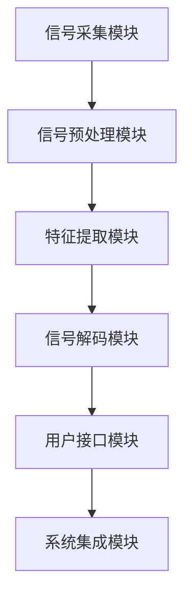

                 

### 第1章：引论

#### 1.1.1 脑机接口的起源与发展

脑机接口（Brain-Computer Interface，简称BCI）的概念最早可以追溯到20世纪30年代，当时神经科学家Erwin Bünzli提出了利用电信号来控制外部设备的思想。真正的突破发生在20世纪60年代，Markduino和Garwick首次通过直接刺激大脑皮层来控制外部设备，标志着脑机接口技术的诞生。随后，随着计算机科学和生物医学工程的发展，脑机接口技术逐渐从理论研究走向实际应用。

在20世纪80年代，脑电波（EEG）的实时采集和处理技术取得了重要进展，使得脑机接口技术开始应用于辅助通信和康复训练。90年代，神经网络和模式识别技术的发展为脑机接口信号解码提供了新的方法，进一步提升了脑机接口的应用范围。

进入21世纪，随着纳米技术、微电子技术、生物医学成像技术和人工智能技术的快速发展，脑机接口技术取得了长足的进步。现代脑机接口系统不仅能够实现脑电波的实时采集和精确解码，还能够通过信号处理和机器学习技术，实现对复杂神经信号的深度分析。

#### 1.1.2 脑机接口的基本概念与原理

脑机接口是一种直接连接大脑与外部设备的技术，它通过捕捉大脑产生的电信号，将这些信号转换为控制命令，从而实现对外部设备的控制。脑机接口的基本原理可以概括为以下几个步骤：

1. **信号采集**：通过脑电图（EEG）、功能性磁共振成像（fMRI）、脑磁图（MEG）等技术，采集大脑活动产生的电信号。
2. **信号处理**：对采集到的信号进行预处理，包括滤波、去噪、特征提取等，以提取出有用的信息。
3. **信号解码**：利用机器学习、神经网络等算法，将处理后的信号解码为控制命令。
4. **执行命令**：将解码得到的控制命令传递给外部设备，实现对外部设备的控制。

脑机接口的核心技术包括信号采集技术、信号处理与解码技术、以及控制执行技术。这些技术共同构成了一个闭环系统，使得大脑活动可以实时地影响外部设备的行为。

#### 1.1.3 脑机接口的研究领域与前沿进展

脑机接口技术的研究领域非常广泛，涵盖了神经科学、生物医学工程、计算机科学、电子工程等多个学科。以下是近年来脑机接口技术的一些前沿进展：

1. **微型植入式电极**：通过纳米技术制造的微型电极，可以精确地捕捉单个神经元的活动，为脑机接口技术提供了更高分辨率的数据。
2. **脑-机接口信号处理算法**：深度学习、递归神经网络、生成对抗网络等机器学习算法在脑机接口信号处理中得到了广泛应用，显著提高了信号解码的准确性。
3. **无创脑机接口**：通过非侵入性的技术，如EEG、fNIRS（近红外光谱成像）等，实现了对大脑活动的实时监测和控制，为脑机接口在医疗、教育、娱乐等领域的应用提供了可能性。
4. **多模态脑机接口**：结合EEG、fMRI、MEG等多种脑成像技术，多模态脑机接口可以提供更全面、更精确的大脑活动信息，为复杂控制任务提供了支持。
5. **脑-机接口在人机交互中的应用**：脑机接口技术已经被广泛应用于虚拟现实、游戏控制、智能家居等领域，为人们提供了全新的交互方式。

#### 1.1.4 脑机接口在人类认知能力提升中的应用前景

脑机接口技术在认知能力提升中的应用潜力巨大。通过脑机接口技术，可以实现对大脑活动的实时监测和调节，从而在记忆增强、注意力提升、学习效率提高等方面发挥重要作用。

1. **记忆增强**：脑机接口可以实时监测大脑的记忆活动，通过调节大脑的神经活动，提高记忆的效率和持久性。
2. **注意力提升**：脑机接口可以监测大脑的注意力水平，通过反馈机制调节外部环境或任务难度，以保持最佳的注意力状态。
3. **学习效率提高**：脑机接口可以实时分析大脑的学习过程，提供个性化的学习建议和调整策略，从而提高学习效率。

总之，脑机接口技术在认知能力提升中的应用前景广阔，它将为人类创造更高效、更智能的学习和工作环境。未来，随着脑机接口技术的不断进步，它将在教育、医疗、工业等多个领域发挥更大的作用。

### 第2章：脑机接口技术原理

脑机接口技术的核心在于如何捕捉和处理大脑产生的电信号，并将其转换为可用的控制命令。本章将详细探讨脑机接口技术的三个主要组成部分：脑电图（EEG）采集技术、神经元接口技术，以及脑-机接口信号解码技术。

#### 2.1 脑电图（EEG）采集技术

脑电图（EEG）是一种非侵入性技术，用于记录大脑的电活动。EEG信号是通过放置在头皮上的电极采集的，这些电极可以捕捉大脑表面电位的微小变化。

##### 2.1.1 脑电图信号的特点

脑电图信号具有以下几个特点：

1. **频率范围**：EEG信号的频率范围从1 Hz到100 Hz，涵盖了从缓慢的α波到快速的γ波。
2. **幅度变化**：EEG信号的幅度通常在微伏（µV）级别，需要高精度的传感器和放大器进行采集和放大。
3. **噪声干扰**：EEG信号中存在各种噪声，如肌电噪声、眼电噪声等，这些噪声会影响信号的准确性，需要通过信号处理技术进行去除。

##### 2.1.2 脑电图信号的采集方法

脑电图信号的采集方法主要包括以下几个步骤：

1. **电极放置**：通常使用银-氯化银电极，将电极放置在特定的头皮位置，以捕捉不同大脑区域的活动。
2. **信号放大**：采集到的信号非常微弱，需要使用高增益的放大器进行放大，以避免信号损失。
3. **滤波**：通过滤波器去除高频噪声和低频噪声，以获得纯净的EEG信号。
4. **数字化**：将模拟信号转换为数字信号，以便于后续的处理和分析。

##### 2.1.3 脑电图信号处理与分析技术

脑电图信号的处理与分析是脑机接口技术的关键环节。以下是一些常用的信号处理技术：

1. **去噪**：通过滤波和统计学方法去除噪声，提高信号质量。
2. **特征提取**：从原始信号中提取出有用的特征，如频率特征、时间特征等。
3. **模式识别**：使用机器学习算法，如支持向量机（SVM）、神经网络等，对提取的特征进行分类和识别。
4. **信号解码**：将处理后的信号解码为具体的控制命令，如手部运动、面部表情等。

#### 2.2 神经元接口技术

神经元接口技术是一种直接在大脑内部或神经元上安装电极，以捕捉和处理神经信号的技术。这种技术提供了更高的分辨率和更直接的大脑活动信息。

##### 2.2.1 神经元接口的基本原理

神经元接口的基本原理包括以下几个步骤：

1. **电极植入**：通过外科手术，将电极植入大脑或神经元中，以直接捕捉神经信号。
2. **信号采集**：电极采集到的神经信号通过导线传输到外部设备。
3. **信号处理**：对采集到的信号进行预处理和放大，以获得清晰、稳定的信号。
4. **信号解码**：使用机器学习算法和信号处理技术，将信号解码为具体的控制命令。

##### 2.2.2 神经元接口的应用类型

神经元接口技术有多种应用类型，包括：

1. **侵入性接口**：电极直接植入大脑或神经元中，适用于需要高分辨率信号的应用。
2. **非侵入性接口**：电极放置在头皮上，适用于不希望侵入大脑或神经元的情况。
3. **混合接口**：结合侵入性和非侵入性技术，以获得更高的信号质量和更广泛的应用范围。

##### 2.2.3 神经元接口的挑战与未来方向

神经元接口技术面临的主要挑战包括：

1. **电极引起的损伤**：电极植入可能会引起炎症或损伤，需要开发更微创的植入技术。
2. **信号稳定性**：神经元接口信号容易受到外部干扰和噪声的影响，需要提高信号的稳定性和可靠性。
3. **信号处理与解码**：复杂的信号处理和解码算法需要更高效的计算资源和更强大的算法。

未来，神经元接口技术将朝着更微创、更稳定、更可靠的方向发展。此外，随着纳米技术和生物医学工程的发展，可能会出现新型的神经元接口技术，如光遗传学和生物电子学等。

#### 2.3 脑-机接口信号解码技术

脑-机接口信号解码技术是脑机接口系统的核心部分，它的目标是准确地将大脑信号解码为可用的控制命令。以下是一些常见的信号解码技术：

##### 2.3.1 信号解码的基本原理

信号解码的基本原理包括以下几个步骤：

1. **特征提取**：从原始信号中提取出与特定行为或任务相关的特征。
2. **模式识别**：使用机器学习算法，如支持向量机（SVM）、递归神经网络（RNN）、卷积神经网络（CNN）等，对提取的特征进行分类和识别。
3. **命令生成**：根据解码的结果生成具体的控制命令。

##### 2.3.2 信号解码算法

常用的信号解码算法包括：

1. **基于模板匹配的算法**：通过预设的模板与输入信号进行匹配，以识别特定的行为或任务。
2. **基于机器学习的算法**：如支持向量机（SVM）、递归神经网络（RNN）、卷积神经网络（CNN）等，通过大量训练数据学习信号的特征和模式。
3. **深度强化学习算法**：结合深度学习和强化学习，以实现更高效、更准确的信号解码。

##### 2.3.3 信号解码的挑战与优化策略

信号解码技术面临的挑战包括：

1. **信号噪声**：噪声会干扰信号的准确性，需要开发更有效的去噪技术。
2. **模型选择与优化**：选择合适的机器学习模型和优化算法，以实现最佳的性能。
3. **实时处理与响应**：脑机接口系统需要实时响应大脑信号，以实现实时控制。

优化策略包括：

1. **多通道信号融合**：结合多个信号通道的信息，提高解码的准确性和可靠性。
2. **自适应信号处理**：根据信号的特点和变化，自适应地调整信号处理和解码参数。
3. **强化学习与深度学习结合**：结合强化学习和深度学习，以实现更智能、更高效的信号解码。

通过不断的技术创新和优化，脑-机接口信号解码技术将越来越成熟，为脑机接口在实际应用中的广泛使用提供坚实的基础。

### 第3章：脑机接口与认知功能

脑机接口技术在认知功能提升中的应用具有巨大的潜力，通过直接控制外部设备，脑机接口可以调节大脑的神经活动，从而影响认知过程。以下将详细介绍脑机接口在记忆增强、注意力提升和学习能力增强等认知功能中的应用。

#### 3.1 脑机接口与记忆增强

记忆是人类认知功能的重要组成部分，脑机接口技术通过实时监测和调节大脑的神经活动，可以显著提高记忆的效率和持久性。

##### 3.1.1 记忆增强的概念与原理

记忆增强是指通过技术手段提高记忆的效率和质量。脑机接口技术通过以下几个原理实现记忆增强：

1. **神经活动调节**：脑机接口可以实时监测大脑的神经活动，通过调节神经活动的频率和强度，提高记忆的效率。
2. **多通道信息融合**：脑机接口结合多种信号采集技术，如EEG、fMRI等，可以获取更全面的大脑活动信息，从而更准确地调节记忆过程。
3. **反馈机制**：脑机接口可以实时反馈大脑的活动状态，通过反馈机制调节外部环境或任务难度，以提高记忆的持久性。

##### 3.1.2 脑机接口在记忆增强中的应用

脑机接口在记忆增强中的应用主要包括以下几个方向：

1. **记忆训练**：通过脑机接口技术，实时监测大脑的神经活动，提供个性化的记忆训练方案，提高记忆的效率。
2. **记忆辅助**：在记忆任务中，脑机接口可以实时调节大脑的神经活动，帮助用户更好地记住重要信息。
3. **记忆修复**：对于记忆受损的用户，脑机接口可以通过调节大脑的神经活动，修复或恢复受损的记忆功能。

##### 3.1.3 记忆增强的案例分析

以下是几个记忆增强的案例：

1. **阿尔茨海默病患者**：研究表明，脑机接口技术可以显著提高阿尔茨海默病患者的记忆能力。通过实时监测大脑的神经活动，脑机接口可以为患者提供个性化的记忆训练方案，帮助他们更好地记住日常生活中的重要信息。

2. **学生群体**：脑机接口技术可以为学生提供个性化的学习支持，通过实时监测大脑的神经活动，提供最佳的学习状态，从而提高学习效率和记忆力。

#### 3.2 脑机接口与注意力提升

注意力是认知功能的另一个重要方面，脑机接口技术通过调节大脑的神经活动，可以提升注意力的集中度和稳定性。

##### 3.2.1 注意力的概念与原理

注意力是指大脑对特定刺激的关注和集中。脑机接口技术通过以下几个原理实现注意力提升：

1. **神经活动调节**：脑机接口可以实时监测大脑的神经活动，通过调节神经活动的频率和强度，提高注意力的集中度。
2. **多通道信息融合**：脑机接口结合多种信号采集技术，可以获取更全面的大脑活动信息，从而更准确地调节注意力过程。
3. **反馈机制**：脑机接口可以实时反馈大脑的活动状态，通过反馈机制调节外部环境或任务难度，以提高注意力的稳定性。

##### 3.2.2 脑机接口在注意力提升中的应用

脑机接口在注意力提升中的应用主要包括以下几个方向：

1. **注意力训练**：通过脑机接口技术，实时监测大脑的神经活动，提供个性化的注意力训练方案，提高注意力的集中度和稳定性。
2. **注意力辅助**：在需要高度集中注意力的任务中，脑机接口可以实时调节大脑的神经活动，帮助用户保持最佳的工作状态。
3. **注意力管理**：对于注意力缺陷多动障碍（ADHD）患者，脑机接口可以通过调节大脑的神经活动，帮助他们更好地管理注意力，提高学习和工作效率。

##### 3.2.3 注意力提升的案例分析

以下是几个注意力提升的案例：

1. **飞行员训练**：脑机接口技术可以用于飞行员的注意力训练，通过实时监测大脑的神经活动，提供个性化的训练方案，提高飞行员的注意力和反应速度。

2. **学生注意力管理**：脑机接口技术可以为学生提供注意力管理工具，通过实时监测大脑的神经活动，帮助学生在学习过程中保持最佳的状态，提高学习效率。

#### 3.3 脑机接口与学习能力增强

学习能力是指个体获取、处理和应用信息的能力。脑机接口技术通过调节大脑的神经活动，可以显著提高学习能力和学习效率。

##### 3.3.1 学习能力的概念与原理

学习能力是指个体在认知过程中获取、处理和应用信息的能力。脑机接口技术通过以下几个原理实现学习能力增强：

1. **神经活动调节**：脑机接口可以实时监测大脑的神经活动，通过调节神经活动的频率和强度，提高学习效率。
2. **多通道信息融合**：脑机接口结合多种信号采集技术，可以获取更全面的大脑活动信息，从而更准确地调节学习过程。
3. **反馈机制**：脑机接口可以实时反馈大脑的活动状态，通过反馈机制调节外部环境或任务难度，以提高学习效率。

##### 3.3.2 脑机接口在学习能力增强中的应用

脑机接口在学习能力增强中的应用主要包括以下几个方向：

1. **学习策略优化**：通过脑机接口技术，实时监测大脑的神经活动，提供个性化的学习策略，优化学习过程。
2. **学习辅助**：在复杂的学习任务中，脑机接口可以实时调节大脑的神经活动，帮助用户更好地理解和掌握知识。
3. **学习反馈**：脑机接口可以实时反馈学习状态，帮助用户及时调整学习策略，提高学习效率。

##### 3.3.3 学习能力增强的案例分析

以下是几个学习能力增强的案例：

1. **教育领域**：脑机接口技术可以用于教育领域，通过实时监测学生的神经活动，提供个性化的学习支持和反馈，提高学习效率。

2. **职业培训**：脑机接口技术可以用于职业培训，通过实时监测学员的神经活动，提供针对性的训练方案，提高学习效果。

总之，脑机接口技术在认知功能提升中的应用前景广阔，通过调节大脑的神经活动，脑机接口可以在记忆增强、注意力提升和学习能力增强等方面发挥重要作用，为人类提供更高效、更智能的认知支持。

### 第4章：脑机接口与情绪调节

情绪调节是脑机接口技术的一个重要应用领域，通过实时监测和分析大脑活动，脑机接口可以帮助用户识别和调节情绪，从而提高心理健康和生活质量。本章将探讨脑机接口在情绪识别和情绪调节中的应用。

#### 4.1 脑机接口与情绪识别

情绪识别是指通过分析大脑活动来识别和判断用户的情绪状态。脑机接口技术在这一领域发挥了重要作用，通过捕捉和解析大脑产生的电信号，可以实现对情绪的准确识别。

##### 4.1.1 情绪识别的概念与原理

情绪识别是基于脑电图（EEG）、功能性磁共振成像（fMRI）等技术，通过分析大脑活动的变化来识别情绪状态。其基本原理包括：

1. **大脑信号采集**：通过脑电图（EEG）或其他脑成像技术，捕捉大脑的神经活动信号。
2. **信号预处理**：对采集到的信号进行滤波、去噪等预处理，以提高信号质量。
3. **特征提取**：从预处理后的信号中提取与情绪相关的特征，如频率特征、时间特征等。
4. **模式识别**：使用机器学习算法，如支持向量机（SVM）、神经网络等，对提取的特征进行分类和识别，从而判断用户的情绪状态。

##### 4.1.2 脑机接口在情绪识别中的应用

脑机接口在情绪识别中的应用非常广泛，包括但不限于以下几个方面：

1. **心理健康监测**：通过情绪识别技术，可以实时监测用户的情绪状态，及时发现心理问题，提供针对性的心理干预。
2. **人机交互**：在智能设备中集成情绪识别功能，可以根据用户的情绪状态提供个性化的交互体验，提高人机交互的自然性和友好性。
3. **教育领域**：在教育场景中，情绪识别技术可以帮助教师了解学生的学习情绪，及时调整教学策略，提高教学效果。

##### 4.1.3 情绪识别的案例分析

以下是几个情绪识别的案例：

1. **自闭症儿童**：研究表明，脑机接口技术可以帮助自闭症儿童识别和理解自己的情绪，从而提高社交能力和生活质量。
2. **驾驶员监控**：在驾驶场景中，情绪识别技术可以监测驾驶员的情绪状态，及时预警疲劳驾驶和情绪失控，提高行车安全。

#### 4.2 脑机接口与情绪调节

情绪调节是指通过技术手段调节大脑活动，帮助用户控制和管理自己的情绪。脑机接口技术在这一领域同样具有很大的潜力，通过实时监测和调节大脑的神经活动，可以实现对情绪的有效调节。

##### 4.2.1 情绪调节的概念与原理

情绪调节是基于脑机接口技术，通过调节大脑的神经活动来控制和管理情绪。其基本原理包括：

1. **大脑信号采集**：通过脑电图（EEG）、功能性磁共振成像（fMRI）等技术，实时监测大脑的神经活动信号。
2. **信号分析**：分析大脑信号，识别情绪状态的变化，如情绪的上升或下降。
3. **信号反馈**：通过反馈机制，调节大脑的神经活动，以改变情绪状态。调节方法包括电刺激、光刺激、药物调节等。
4. **行为干预**：结合行为干预方法，如放松训练、认知行为疗法等，进一步调节情绪。

##### 4.2.2 脑机接口在情绪调节中的应用

脑机接口在情绪调节中的应用包括以下几个方面：

1. **心理健康干预**：通过脑机接口技术，实时监测用户的情绪状态，提供个性化的情绪调节方案，帮助用户缓解压力、焦虑等负面情绪。
2. **疼痛管理**：脑机接口技术可以通过调节大脑的神经活动，帮助患者减轻疼痛，提高生活质量。
3. **睡眠改善**：通过脑机接口技术，调节大脑的神经活动，帮助用户改善睡眠质量，提高睡眠效率。

##### 4.2.3 情绪调节的案例分析

以下是几个情绪调节的案例：

1. **抑郁症患者**：研究表明，脑机接口技术可以帮助抑郁症患者调节情绪，缓解抑郁症状，提高生活质量。
2. **考试压力管理**：在考试前，通过脑机接口技术，实时监测考生的情绪状态，提供情绪调节方案，帮助考生缓解压力，提高考试表现。

通过情绪识别和情绪调节技术，脑机接口为人们提供了全新的情绪管理和心理健康干预方式。未来，随着脑机接口技术的不断进步，它将在心理健康、人机交互、教育等多个领域发挥更大的作用，为人类创造更健康、更快乐的生活。

### 第5章：脑机接口与多模态融合

脑机接口（BCI）的多模态融合技术正逐渐成为研究热点，旨在通过整合多种类型的数据，提升大脑信号的处理和解读能力。多模态脑机接口结合了来自不同传感器的数据，如脑电图（EEG）、功能性磁共振成像（fMRI）、脑磁图（MEG）、眼动追踪和肌电信号等，从而提供更全面和精准的大脑活动信息。

#### 5.1 多模态脑机接口技术

多模态脑机接口技术的基本概念是利用多种传感技术同步采集大脑活动的数据，并将其融合在一起进行分析和处理。以下是多模态脑机接口技术的一些关键特点：

##### 5.1.1 多模态脑机接口的概念与原理

多模态脑机接口（Multimodal BCI）通过整合来自不同模态的信号，如电生理信号（EEG、MEG）、神经影像信号（fMRI、PET）、行为信号（眼动追踪、肌电信号）等，以提高信号解码的准确性和可靠性。其基本原理包括：

1. **信号同步采集**：多种传感器同时工作，采集大脑活动的数据。
2. **数据预处理**：对各个模态的数据进行预处理，如滤波、去噪、归一化等。
3. **特征提取**：从预处理后的数据中提取特征，如频率特征、时域特征、空间特征等。
4. **数据融合**：使用数据融合技术，如特征级融合、决策级融合等，将不同模态的数据整合在一起。
5. **信号解码**：利用机器学习和统计方法，对融合后的数据进行解码，以生成控制命令。

##### 5.1.2 多模态脑机接口的应用

多模态脑机接口技术广泛应用于各种领域，包括但不限于：

1. **康复训练**：通过整合EEG和肌电信号，多模态脑机接口可以辅助瘫痪患者进行康复训练，提高其运动功能。
2. **神经科学研究**：多模态脑机接口技术为神经科学研究提供了更全面的大脑活动数据，有助于理解大脑的功能和解剖结构。
3. **人机交互**：多模态脑机接口技术可以提供更自然、直观的人机交互体验，如通过整合EEG和眼动追踪，实现脑控虚拟现实。

##### 5.1.3 多模态脑机接口的优势与挑战

多模态脑机接口的优势包括：

1. **提升信号质量**：多模态融合可以降低单一模态信号的噪声，提高信号的整体质量。
2. **增加信息量**：多模态融合提供了更多维度的数据，有助于更准确地解码大脑信号。
3. **增强适应性**：多模态融合技术可以根据不同应用需求，灵活调整信号处理和解读策略。

然而，多模态脑机接口也面临一些挑战：

1. **数据同步**：多模态信号的同步采集和处理是实现多模态融合的关键，但实际操作中难以保证完全同步。
2. **计算复杂度**：多模态数据融合需要大量的计算资源，对实时处理提出了较高要求。
3. **算法选择**：选择合适的数据融合算法和信号解码方法是实现多模态脑机接口的核心，但目前尚无统一的最佳方案。

#### 5.2 多模态数据融合方法

多模态数据融合是脑机接口技术中一个重要的研究方向，旨在通过有效融合不同模态的数据，提高信号解码的准确性和可靠性。以下是几种常见的多模态数据融合方法：

##### 5.2.1 多模态数据融合的基本原理

多模态数据融合的基本原理可以概括为以下几个步骤：

1. **数据采集**：使用不同的传感器采集不同模态的数据。
2. **数据预处理**：对各个模态的数据进行预处理，如滤波、去噪等。
3. **特征提取**：从预处理后的数据中提取特征，如时域特征、频率特征、空间特征等。
4. **数据融合**：使用特定的融合策略将不同模态的特征整合在一起，形成统一的特征向量。
5. **信号解码**：利用融合后的特征向量进行信号解码，生成控制命令。

##### 5.2.2 多模态数据融合方法

常见的多模态数据融合方法包括以下几种：

1. **特征级融合**：在特征提取阶段，将不同模态的特征向量直接整合在一起。常见的方法包括矩阵合并、特征加权等。
2. **决策级融合**：在分类或解码阶段，将多个模态的分类结果或解码结果进行融合。常见的方法包括投票机制、贝叶斯推理等。
3. **深度学习融合**：利用深度学习模型，如卷积神经网络（CNN）、递归神经网络（RNN）等，自动学习不同模态的特征表示，并对其进行融合。这种方法在多模态数据融合中表现出色。

##### 5.2.3 多模态数据融合的应用案例

以下是几个多模态数据融合的应用案例：

1. **脑控轮椅**：通过整合EEG和肌电信号，多模态脑机接口可以为瘫痪患者提供一种新型的轮椅控制方式，提高其生活独立性。
2. **脑控游戏**：通过整合EEG和眼动追踪信号，多模态脑机接口可以实现脑控游戏，为用户提供更加沉浸式的游戏体验。

通过多模态数据融合方法，脑机接口技术可以提供更精准、更可靠的大脑信号解码，从而在康复、医疗、人机交互等领域发挥更大的作用。随着技术的不断进步，多模态脑机接口将在更多应用场景中展现出其潜力。

### 第6章：脑机接口系统设计与实现

脑机接口系统（BCI System）的设计与实现是一个复杂且关键的过程，涉及硬件设计、软件设计和系统集成等多个方面。本章将详细介绍脑机接口系统的整体架构设计、硬件设计、软件设计以及系统实现的关键技术。

#### 6.1 脑机接口系统架构

脑机接口系统的架构设计是确保系统能够高效、稳定地运行的基础。一个典型的脑机接口系统架构包括以下几个主要模块：

1. **信号采集模块**：负责捕捉大脑活动的电信号，如脑电图（EEG）、肌电图（EMG）等。
2. **信号预处理模块**：对采集到的信号进行滤波、去噪等预处理，以提高信号质量。
3. **特征提取模块**：从预处理后的信号中提取出与特定任务相关的特征，如时域特征、频率特征等。
4. **信号解码模块**：使用机器学习算法或神经网络模型对提取的特征进行解码，生成控制命令。
5. **用户接口模块**：将解码结果转换为用户可以理解和操作的形式，如屏幕显示、声音提示等。
6. **系统集成模块**：负责将各个模块整合在一起，确保系统可以正常运行。

##### 6.1.1 脑机接口系统架构设计原则

脑机接口系统架构设计应遵循以下原则：

1. **模块化设计**：各个功能模块应独立且模块化，便于系统的维护和升级。
2. **高可靠性**：系统设计应考虑冗余和故障处理机制，确保系统的稳定性和可靠性。
3. **灵活性**：系统应具备良好的扩展性，能够适应不同的应用场景和需求。
4. **用户友好性**：用户接口应直观易用，便于用户操作和理解。

##### 6.1.2 脑机接口系统功能模块划分

脑机接口系统的功能模块划分如下：

1. **信号采集模块**：包括电极、放大器、滤波器等硬件设备，用于捕捉大脑活动的电信号。
2. **信号预处理模块**：包括滤波、去噪、放大等算法，用于对采集到的信号进行预处理。
3. **特征提取模块**：包括时域特征提取、频率特征提取等算法，用于从预处理后的信号中提取特征。
4. **信号解码模块**：包括机器学习算法、神经网络模型等，用于对提取的特征进行解码，生成控制命令。
5. **用户接口模块**：包括屏幕显示、声音提示、触觉反馈等设备，用于将解码结果呈现给用户。
6. **系统集成模块**：包括操作系统、通信模块等，用于将各个功能模块集成在一起，确保系统的整体运作。

##### 6.1.3 脑机接口系统架构图

脑机接口系统的架构图如下所示：

#### 6.2 脑机接口硬件设计

脑机接口硬件设计是脑机接口系统实现的基础，它决定了信号采集的精度和稳定性。以下是脑机接口硬件设计的关键要素：

##### 6.2.1 脑机接口硬件设计原则

脑机接口硬件设计应遵循以下原则：

1. **非侵入性**：优先选择非侵入性的采集技术，如EEG、眼动追踪等，以减少对用户的不适和伤害。
2. **高精度**：硬件设备应具备高精度和稳定性，以确保信号采集的准确性和可靠性。
3. **低噪声**：设计时应尽量降低噪声干扰，提高信号质量。
4. **模块化**：硬件设计应模块化，便于维护和升级。

##### 6.2.2 脑机接口硬件选型

脑机接口硬件选型应根据具体应用场景和要求进行选择，以下是几种常见的硬件设备：

1. **脑电图（EEG）采集设备**：如脑电帽、便携式脑电图仪等。
2. **肌电图（EMG）采集设备**：如肌电传感器、肌电信号放大器等。
3. **眼动追踪设备**：如红外眼动仪、高分辨率眼动追踪仪等。
4. **其他传感器**：如心率传感器、温度传感器等，用于辅助信号采集。

##### 6.2.3 脑机接口硬件设计与实现

脑机接口硬件设计与实现包括以下几个步骤：

1. **需求分析**：根据应用场景和需求，明确信号采集的精度、稳定性、响应速度等要求。
2. **硬件选型**：选择合适的硬件设备，如传感器、放大器、滤波器等。
3. **电路设计**：设计电路图，实现信号的采集、放大、滤波等功能。
4. **硬件测试**：对硬件设备进行测试，验证其性能和稳定性。
5. **系统集成**：将硬件设备集成到脑机接口系统中，确保硬件与其他模块的协同工作。

#### 6.3 脑机接口软件设计

脑机接口软件设计是脑机接口系统实现的核心，它决定了信号处理和解析的效率和准确性。以下是脑机接口软件设计的关键要素：

##### 6.3.1 脑机接口软件设计原则

脑机接口软件设计应遵循以下原则：

1. **模块化设计**：将软件功能划分为多个模块，便于维护和升级。
2. **高可靠性**：确保软件的稳定性和可靠性，避免信号丢失或处理错误。
3. **高效性**：优化算法和数据处理流程，提高系统的响应速度和处理效率。
4. **灵活性**：软件应具备良好的扩展性，能够适应不同的应用场景和需求。

##### 6.3.2 脑机接口软件模块划分

脑机接口软件模块划分如下：

1. **信号采集模块**：负责从硬件设备中读取信号数据。
2. **信号预处理模块**：负责对采集到的信号进行滤波、去噪等预处理。
3. **特征提取模块**：负责从预处理后的信号中提取特征。
4. **信号解码模块**：负责使用机器学习算法或神经网络模型解码信号，生成控制命令。
5. **用户接口模块**：负责将解码结果呈现给用户，如屏幕显示、声音提示等。
6. **系统集成模块**：负责将各个模块集成在一起，实现系统的整体功能。

##### 6.3.3 脑机接口软件设计与实现

脑机接口软件设计与实现包括以下几个步骤：

1. **需求分析**：明确脑机接口系统的功能需求和性能指标。
2. **系统设计**：设计软件架构，划分功能模块，明确各个模块的接口和交互关系。
3. **算法实现**：根据需求实现信号预处理、特征提取和信号解码等算法。
4. **系统集成**：将各个模块整合在一起，实现系统的整体功能。
5. **测试与优化**：对软件系统进行测试，验证其功能、性能和稳定性，并进行优化。

通过上述步骤，可以设计并实现一个高效、稳定、可靠的脑机接口系统，为用户提供高质量的大脑信号处理和控制体验。

### 第7章：脑机接口应用案例分析

脑机接口（BCI）技术已经在多个领域取得了显著的成果，以下将详细分析脑机接口在医疗、娱乐与教育、工业与军事等领域的应用案例，以及这些应用中的技术挑战和解决方案。

#### 7.1 脑机接口在医疗领域的应用

脑机接口技术在医疗领域的应用日益广泛，尤其是在康复、神经疾病治疗和辅助沟通等方面。

##### 7.1.1 脑机接口在瘫痪患者康复中的应用

瘫痪患者通常由于中枢神经系统损伤导致肢体活动能力丧失，脑机接口技术为这些患者提供了新的康复手段。

1. **技术挑战**：
   - **信号质量**：瘫痪患者的脑信号可能较弱，信号质量差。
   - **长期稳定性**：长期使用脑机接口设备需要确保设备的稳定性和可靠性。
   - **适应性问题**：患者需要适应脑机接口的使用，这可能需要较长的训练时间。

2. **解决方案**：
   - **信号增强**：采用先进的信号处理算法，如自适应滤波和特征提取，提高信号质量。
   - **长时间稳定性**：设计耐用且低功耗的脑机接口设备，以延长设备的使用寿命。
   - **个性化训练**：通过个性化的训练计划，帮助患者逐步适应脑机接口的使用。

3. **案例分析**：
   - **案例1**：神经损伤患者通过脑机接口技术实现了对轮椅的控制，恢复了部分运动功能。
   - **案例2**：脑中风患者通过脑机接口进行康复训练，有效提高了手部运动能力。

##### 7.1.2 脑机接口在帕金森病治疗中的应用

帕金森病是一种常见的神经系统退行性疾病，脑机接口技术可以通过调节大脑活动来缓解症状。

1. **技术挑战**：
   - **信号复杂性**：帕金森病患者的脑信号复杂，解码难度大。
   - **治疗效果评估**：需要准确评估脑机接口治疗的效果，以优化治疗方案。

2. **解决方案**：
   - **多模态信号融合**：结合脑电图（EEG）、功能性磁共振成像（fMRI）等多模态信号，提高解码准确性。
   - **智能算法**：采用深度学习等智能算法，实现对复杂脑信号的精确解码。
   - **个性化治疗**：通过长期监测和数据分析，为患者提供个性化的治疗方案。

3. **案例分析**：
   - **案例1**：帕金森病患者通过脑机接口实现了对肌肉震颤的控制，有效缓解了症状。
   - **案例2**：脑机接口技术帮助帕金森病患者改善了运动功能，提高了生活质量。

##### 7.1.3 脑机接口在癫痫病治疗中的应用

癫痫病是一种慢性神经系统疾病，脑机接口技术可以实时监测大脑活动，帮助预测和干预癫痫发作。

1. **技术挑战**：
   - **实时性**：需要高精度的实时信号监测，以及时预测和干预癫痫发作。
   - **预测准确性**：提高预测的准确性，减少误报和漏报。

2. **解决方案**：
   - **实时信号处理**：采用高速信号处理算法，实现实时信号监测和分析。
   - **机器学习**：利用机器学习算法，如深度神经网络，提高预测准确性。
   - **多模态融合**：结合不同模态的信号数据，提高预测的全面性和准确性。

3. **案例分析**：
   - **案例1**：脑机接口技术帮助癫痫病患者实现了对病情的实时监控，有效减少了发作频率。
   - **案例2**：通过脑机接口技术，医生能够提前预测癫痫发作，及时采取措施，防止事故发生。

#### 7.2 脑机接口在娱乐与教育领域的应用

脑机接口技术在娱乐和教育领域也有广泛的应用，为用户提供了全新的互动体验和学习方式。

##### 7.2.1 脑机接口在虚拟现实中的应用

脑机接口技术可以实现对虚拟现实（VR）的脑控，提供更自然和沉浸式的交互体验。

1. **技术挑战**：
   - **交互自然性**：需要实现大脑信号与虚拟现实环境的自然交互。
   - **延迟和响应速度**：减少延迟和响应时间，提高互动的流畅性。

2. **解决方案**：
   - **实时信号处理**：采用高速信号处理算法，确保实时响应。
   - **多模态融合**：结合EEG、眼动追踪等不同模态的信号，提高交互的自然性。
   - **自适应算法**：根据用户的反馈，自适应调整交互参数，提高用户体验。

3. **案例分析**：
   - **案例1**：通过脑机接口技术，用户可以仅通过大脑活动来控制虚拟角色，实现脑控游戏。
   - **案例2**：脑机接口技术用于虚拟现实医疗培训，提供个性化的培训体验，提高培训效果。

##### 7.2.2 脑机接口在游戏控制中的应用

脑机接口技术可以为游戏玩家提供脑控游戏体验，通过大脑信号控制游戏角色。

1. **技术挑战**：
   - **控制精度**：需要实现高精度的脑信号控制，确保游戏操作的准确性。
   - **适应性**：不同玩家的大脑信号差异较大，需要提供适应不同用户需求的控制方案。

2. **解决方案**：
   - **个性化训练**：通过个性化的训练计划，帮助用户逐步适应脑控操作。
   - **多模态信号融合**：结合EEG、眼动追踪等不同模态的信号，提高控制精度。
   - **智能算法**：采用机器学习算法，优化控制策略，提高操作的流畅性和准确性。

3. **案例分析**：
   - **案例1**：脑机接口技术用于脑控赛车游戏，用户可以通过大脑信号控制赛车，提高游戏趣味性。
   - **案例2**：脑机接口技术用于脑控模拟游戏，用户可以通过大脑信号实现角色的跳跃、攻击等动作。

##### 7.2.3 脑机接口在教育中的应用

脑机接口技术可以为学生提供个性化的学习支持，通过大脑信号监测和反馈，提高学习效果。

1. **技术挑战**：
   - **学习效果评估**：需要准确评估脑机接口对学生学习效果的提升。
   - **可扩展性**：系统需要具备良好的可扩展性，以适应不同的学习场景和需求。

2. **解决方案**：
   - **个性化学习策略**：通过分析学生的脑信号，提供个性化的学习策略。
   - **多模态信号融合**：结合EEG、眼动追踪等不同模态的信号，提供全面的学习反馈。
   - **自适应学习系统**：根据学生的学习状态，动态调整学习内容和节奏。

3. **案例分析**：
   - **案例1**：脑机接口技术用于辅助英语学习，通过监测学生的脑信号，提供针对性的听力训练。
   - **案例2**：脑机接口技术用于数学学习，通过分析学生的脑信号，提供个性化的解题策略。

#### 7.3 脑机接口在工业与军事领域的应用

脑机接口技术在工业和军事领域也有广泛的应用，为提高工作效率和作战能力提供了新的手段。

##### 7.3.1 脑机接口在工业自动化中的应用

脑机接口技术可以用于工业自动化，通过大脑信号控制机器人或机械臂，实现更高效的工业生产。

1. **技术挑战**：
   - **控制精度**：需要实现高精度的脑信号控制，确保机器人的操作准确。
   - **实时性**：工业生产环境要求高实时性，确保脑信号控制的流畅性。

2. **解决方案**：
   - **高精度信号处理**：采用先进的信号处理算法，提高脑信号的控制精度。
   - **实时通信**：采用高速通信技术，确保脑信号与机器人的实时通信。
   - **智能控制系统**：结合机器学习和智能控制技术，优化机器人的操作策略。

3. **案例分析**：
   - **案例1**：脑机接口技术用于控制机械臂进行精细作业，提高了工业生产的效率和准确性。
   - **案例2**：脑机接口技术用于远程控制工业设备，实现了工业操作的智能化和自动化。

##### 7.3.2 脑机接口在军事领域的应用

脑机接口技术在军事领域可以用于提高士兵的作战能力和反应速度，如脑控无人机、智能武器系统等。

1. **技术挑战**：
   - **实时性**：军事应用要求高实时性，确保脑信号控制的快速响应。
   - **安全性**：脑机接口系统的安全性至关重要，防止信息泄露或被敌对势力利用。

2. **解决方案**：
   - **高实时性信号处理**：采用高速信号处理算法，确保脑信号控制的实时性。
   - **安全通信**：采用加密通信技术，确保脑信号传输的安全。
   - **冗余设计**：设计冗余系统，提高系统的可靠性和抗干扰能力。

3. **案例分析**：
   - **案例1**：脑机接口技术用于脑控无人机，提高了无人机的灵活性和精准度。
   - **案例2**：脑机接口技术用于智能武器系统，通过脑信号控制，实现了武器的高效、精准打击。

通过上述应用案例，可以看出脑机接口技术在医疗、娱乐与教育、工业与军事等领域的广泛应用，为各个领域带来了革命性的变革。未来，随着脑机接口技术的不断进步，它将在更多领域发挥重要作用，推动人类社会的发展和进步。

### 第8章：脑机接口的未来发展趋势与挑战

脑机接口（BCI）技术在过去几十年中取得了显著进展，从最初的科学实验走向实际应用。随着技术的不断演进，脑机接口的未来发展趋势和面临的挑战也日益凸显。以下将详细探讨脑机接口技术的发展趋势、新突破、未来发展方向以及面临的挑战和应对策略。

#### 8.1 脑机接口技术的发展趋势

脑机接口技术的发展趋势可以从以下几个方面来分析：

1. **微型化和非侵入性**：随着微电子技术和生物医学材料的发展，脑机接口设备的体积越来越小，越来越便携，同时非侵入性技术如脑电图（EEG）、功能性近红外光谱成像（fNIRS）等也越来越成熟。这些技术使得脑机接口在医疗、教育、娱乐等领域的应用变得更加广泛和方便。

2. **多模态融合**：多模态脑机接口技术通过整合来自不同传感器的数据，如脑电图（EEG）、功能性磁共振成像（fMRI）、脑磁图（MEG）等，提供更全面和精准的大脑活动信息。未来，多模态融合技术将成为脑机接口发展的重要方向，进一步推动信号解码的准确性和应用范围。

3. **智能化与个性化**：随着人工智能技术的发展，脑机接口系统将更加智能化，能够自动调整信号处理和解读策略，提供个性化的大脑信号解码和反馈。这将大大提高脑机接口系统的使用效率和用户体验。

4. **脑-机接口标准化**：脑机接口技术的标准化将有助于不同设备和系统之间的互操作性，推动脑机接口技术的广泛应用。国际标准化组织（ISO）和国际电气电子工程师协会（IEEE）等机构正在努力推动脑机接口技术的标准化进程。

#### 8.1.1 脑机接口技术的新突破

近年来，脑机接口技术取得了多项新突破：

1. **高分辨率脑成像技术**：如功能性近红外光谱成像（fNIRS）和光学相干断层扫描（OCT）等技术，提供了更高分辨率的大脑活动信息，为脑机接口系统的信号解码提供了更精确的数据支持。

2. **深度学习和神经网络算法**：深度学习和神经网络算法在脑机接口信号解码中的应用取得了显著成效，显著提高了信号解码的准确性和实时性。

3. **纳米技术和生物电子学**：纳米技术和生物电子学的发展使得微型电极和植入式脑机接口设备成为可能，这些技术为脑机接口提供了更高的分辨率和更稳定的数据采集。

4. **无线脑机接口**：无线脑机接口技术的研究取得了重要进展，通过无线通信技术，实现脑机接口设备与外部设备之间的无线连接，提高了系统的便携性和灵活性。

#### 8.1.2 脑机接口技术的未来发展方向

脑机接口技术的未来发展方向包括以下几个方面：

1. **精准医疗**：脑机接口技术可以用于个性化医疗，通过实时监测和分析大脑活动，提供精准的诊断和治疗建议，推动精准医疗的发展。

2. **脑-机接口增强**：脑-机接口增强技术旨在通过直接调节大脑的神经活动，提高认知能力和学习能力。未来，脑-机接口增强技术将在教育、军事、科研等领域发挥重要作用。

3. **脑-机接口人机交互**：脑-机接口技术将广泛应用于人机交互领域，通过脑信号控制虚拟现实、游戏、智能家居等设备，提供更自然和直观的交互体验。

4. **神经修复与再生**：脑机接口技术可以用于神经修复和再生，通过直接刺激或调节大脑的神经活动，促进神经损伤的修复和再生，改善神经系统疾病的治疗效果。

#### 8.2 脑机接口技术的挑战与应对策略

尽管脑机接口技术在多个领域展现了巨大的潜力，但它仍然面临诸多挑战：

1. **信号噪声和稳定性**：脑信号容易受到外部干扰和噪声的影响，提高信号质量和稳定性是脑机接口技术的重要挑战。应对策略包括开发更先进的信号处理算法、提高传感器的灵敏度、采用多模态信号融合等。

2. **信号解码准确性**：脑信号解码的准确性直接影响脑机接口系统的性能。未来，通过深入研究大脑活动的规律，开发更高效、更准确的信号解码算法，将是提升解码准确性的关键。

3. **长期使用适应性**：脑机接口设备的长期使用需要考虑用户适应性问题，特别是对于需要长时间佩戴设备的用户。应对策略包括设计舒适、轻便的设备、提供个性化的使用培训等。

4. **伦理和安全问题**：脑机接口技术涉及大脑活动的读取和控制，可能引发伦理和安全问题。应对策略包括制定相关法律法规，确保脑机接口技术的合法、安全和道德使用。

5. **标准化和互操作性**：脑机接口技术的标准化和互操作性是推动其广泛应用的关键。应对策略包括推动国际标准化组织的标准化工作，促进不同设备和系统之间的兼容性。

总之，脑机接口技术具有巨大的发展潜力和广泛应用前景。通过不断的技术创新和优化，脑机接口技术将在医疗、教育、工业、军事等多个领域发挥更大的作用，推动人类社会的发展和进步。未来，脑机接口技术的进一步发展将依赖于跨学科的合作、技术创新和伦理法规的完善。

### 全文总结

脑机接口（BCI）技术作为连接大脑与外部设备的重要桥梁，其在提升人类认知能力、调节情绪、促进康复和治疗疾病等方面展现出了巨大的应用潜力。通过实时监测和分析大脑活动，脑机接口可以为用户提供个性化的认知支持，从而改善学习、记忆、注意力和情绪调节等方面。此外，脑机接口技术在娱乐、工业、军事等领域也展现了广泛的应用前景。

脑机接口技术的发展不仅依赖于硬件设备的微型化、非侵入性和多模态融合，还需要智能化的信号处理和精准的解码算法。未来的研究应重点关注信号噪声的抑制、解码准确性的提升、用户使用适应性的改善以及伦理和安全问题的解决。

对于读者而言，深入了解脑机接口技术的工作原理和应用案例，不仅有助于把握科技前沿，还可以为相关领域的研究和开发提供有益的启示。希望本文能激发您对脑机接口技术的兴趣，共同期待这一领域带来更多创新和突破。

### 最佳实践 Tips

1. **确保信号采集质量**：选择高精度、低噪声的传感器，并定期校准设备，以保证信号的稳定性和可靠性。

2. **个性化用户设置**：根据不同用户的生理特征和使用习惯，调整脑机接口系统的参数设置，以提高用户体验。

3. **多模态数据融合**：结合不同模态的信号，如EEG、fMRI等，可以提高信号解码的准确性和全面性。

4. **定期更新算法**：采用最新的信号处理和机器学习算法，定期更新系统，以保持脑机接口技术的先进性和性能。

5. **安全性和隐私保护**：在设计脑机接口系统时，充分考虑数据安全和用户隐私保护，遵守相关法律法规。

### 小结

本文从多个角度详细介绍了脑机接口技术的原理、应用以及未来发展趋势。脑机接口技术在认知能力提升、情绪调节、康复治疗等方面展现出巨大的潜力，但仍需克服信号噪声、解码准确性、用户适应性等挑战。随着技术的不断进步，脑机接口将为人类带来更多创新和变革。

### 注意事项

1. **正确使用设备**：确保按照脑机接口设备的操作说明正确使用，避免因误操作导致设备损坏或信号采集失败。

2. **定期维护**：定期对脑机接口设备进行检查和维护，确保设备的正常运行和信号采集质量。

3. **遵守伦理规范**：在进行脑机接口技术研究时，严格遵守伦理规范，保护用户的隐私和权益。

4. **安全注意事项**：在涉及植入式脑机接口设备时，注意外科手术的安全性和术后护理。

### 拓展阅读

1. **《脑机接口：从基础到应用》**：详细介绍了脑机接口的基本原理、技术发展和应用案例。
2. **《脑机接口：从神经科学到工程实践》**：探讨了脑机接口技术在神经科学和工程领域的最新进展。
3. **《脑-机接口技术与应用》**：综述了脑机接口技术在康复、医疗、娱乐等领域的应用案例和未来发展趋势。

### 作者信息

作者：AI天才研究院（AI Genius Institute）& 《禅与计算机程序设计艺术》（Zen And The Art of Computer Programming）

