                 

### 第1章：脑机接口概述

#### 1.1 脑机接口的概念与历史

脑机接口（Brain-Computer Interface, BCI）是一种直接连接人脑和外部设备的技术。它通过捕捉大脑信号，如脑电图（EEG）、功能性磁共振成像（fMRI）、脑磁图（MEG）等，将意念转化为控制信号，实现对设备或计算机的直接操作。脑机接口的概念最早可以追溯到20世纪中叶，最初的实验主要是在动物模型上进行的。

随着科技的进步，脑机接口技术在20世纪80年代进入了一个新的发展阶段。美国军方和学术机构开始对BCI进行研究，以期开发出可以替代传统机械手和轮椅的技术。到90年代，随着数字信号处理技术和微电子技术的快速发展，脑机接口技术在精度和稳定性上有了显著提升，开始逐步应用于实际中。

#### 1.2 脑机接口的核心技术

脑机接口的核心技术主要包括信号的采集、处理和解析。信号的采集主要依赖于各种脑成像技术和脑电传感器。EEG是当前应用最广泛的采集技术，它通过测量头皮上的电活动来获取大脑信号。fMRI和MEG则通过测量大脑的磁场和血氧水平变化来获取脑活动信息。

信号处理则是将原始的脑信号转化为可以分析的数据。这通常涉及到去除噪声、过滤和特征提取等步骤。特征提取是脑机接口技术的关键，它涉及到从复杂的脑信号中提取出与特定意念相关的特征。

解析阶段则是通过机器学习算法或统计方法，将提取出的特征与特定的操作意图相对应。这个过程通常涉及到模式识别和分类技术。

#### 1.3 脑机接口的应用领域

脑机接口技术目前主要应用在以下领域：

- **医疗康复**：脑机接口技术可以帮助瘫痪患者重新获得控制肢体或沟通的能力。例如，通过脑机接口控制假肢或轮椅，或者通过意念控制电子设备实现沟通。
- **辅助沟通**：对于言语障碍或严重运动障碍的患者，脑机接口可以提供一种新的沟通方式。例如，利用脑电信号驱动文本生成系统或语音合成器。
- **人机交互**：脑机接口技术使得人机交互更加自然和直观。例如，通过脑电信号控制计算机游戏或智能设备。

#### 1.4 脑机接口的发展趋势

随着人工智能和机器学习技术的进步，脑机接口技术正在朝着更加精准、高效和用户友好的方向发展。以下是一些未来脑机接口可能的发展趋势：

- **新型传感器的研发**：为了提高信号采集的准确性和减少干扰，研究者正在开发新的传感器技术，如柔性传感器、植入式传感器等。
- **人工智能算法的应用**：机器学习算法在脑机接口中的使用将进一步提升系统的性能和准确性，使意念控制更加精细和高效。
- **集成系统的优化**：脑机接口系统的集成优化是提高其性能的关键，未来研究者将致力于优化硬件和软件的集成，提高系统的稳定性和易用性。

### 核心概念与联系

脑机接口的核心概念主要包括大脑信号采集、信号处理、特征提取和解析。以下是这些核心概念及其属性的对比表格：

| 核心概念 | 概念属性 | 对比 |
| :---: | :---: | :---: |
| 大脑信号采集 | 通过EEG、fMRI、MEG等技术获取大脑信号 | 高精度与实时性 |
| 信号处理 | 去除噪声、滤波、特征提取 | 准确性 |
| 特征提取 | 从脑信号中提取与意念相关的特征 | 精确性 |
| 解析 | 通过机器学习或统计方法将特征与意念对应 | 高效性 |

此外，我们可以通过ER实体关系图来描述脑机接口系统的架构：

```mermaid
erDiagram
  EEG Sensor ||--|{ Brain Signal }|--| BC Interface
  fMRI Sensor ||--|{ Brain Signal }|--| BC Interface
  MEG Sensor ||--|{ Brain Signal }|--| BC Interface
  BC Interface ||--|{ Signal Processing }|<-- Feature Extraction
  Feature Extraction ||--|{ Parsing }|<-- Human-Machine Interface
```

这个ER图展示了从传感器到接口再到解析和交互的整个过程，各个模块之间的联系和依赖关系。

#### 算法原理讲解

脑机接口的核心算法主要包括信号处理、特征提取和解析。以下是这些算法的mermaid流程图和Python源代码示例：

##### 信号处理算法流程图


##### Python源代码示例

```python
import numpy as np
from scipy import signal

def signal_processing(signal):
    # 去噪
    filtered_signal = signal - np.mean(signal)
    # 滤波
    filtered_signal = signal.filtfilt(b, a, filtered_signal)
    return filtered_signal

# 示例信号
signal = np.random.randn(1000)

# 信号处理
processed_signal = signal_processing(signal)

# 特征提取
def feature_extraction(signal):
    # 假设使用峰峰值作为特征
    peak_to_peak = 2 * (np.max(signal) - np.min(signal))
    return peak_to_peak

feature = feature_extraction(processed_signal)

# 解析
def parsing(feature):
    # 假设特征与特定操作意图相关
    if feature > threshold:
        return "意图A"
    else:
        return "意图B"

intention = parsing(feature)
```

在这个示例中，我们首先通过信号处理算法对原始信号进行去噪和滤波，然后通过特征提取算法提取出峰峰值作为特征，最后通过解析算法判断意图。这个简单的例子展示了脑机接口算法的基本原理。

#### 数学公式

脑机接口算法中的数学模型和公式通常涉及信号处理和特征提取。以下是几个常见的数学公式：

$$
S_{\text{filtered}} = S - \mu_S
$$

其中，\( S_{\text{filtered}} \) 是滤波后的信号，\( S \) 是原始信号，\( \mu_S \) 是信号的平均值。

$$
f(t) = \frac{1}{T} \int_{0}^{T} s(t) \, dt
$$

其中，\( f(t) \) 是信号的瞬时频率，\( T \) 是信号的周期，\( s(t) \) 是信号在时间\( t \)的值。

$$
\sigma^2 = \frac{1}{N-1} \sum_{i=1}^{N} (x_i - \bar{x})^2
$$

其中，\( \sigma^2 \) 是方差，\( N \) 是样本数量，\( x_i \) 是第\( i \)个样本，\( \bar{x} \) 是样本的平均值。

这些数学公式用于描述信号处理和特征提取过程中的关键步骤，是理解脑机接口算法的重要工具。

#### 系统分析与架构设计方案

脑机接口系统是一个复杂的集成系统，涉及到多个模块和组件的协同工作。以下是对系统场景的介绍、项目介绍、系统功能设计、系统架构设计、系统接口设计和系统交互的详细分析。

##### 系统场景介绍

脑机接口系统的主要应用场景包括医疗康复、辅助沟通和人机交互。例如，在医疗康复领域，脑机接口可以帮助瘫痪患者通过意念控制假肢；在辅助沟通领域，脑机接口可以为言语障碍患者提供新的沟通方式；在人机交互领域，脑机接口可以实现通过意念控制计算机游戏或智能设备。

##### 项目介绍

本项目旨在设计和实现一个高性能的脑机接口系统，包括信号采集、信号处理、特征提取和解析等模块。系统将采用最新的传感器技术和机器学习算法，以提高系统的精度和稳定性。

##### 系统功能设计

系统的主要功能模块包括：

1. **信号采集模块**：负责从大脑获取原始信号，包括EEG、fMRI、MEG等。
2. **信号处理模块**：负责对原始信号进行去噪、滤波等处理，以提高信号质量。
3. **特征提取模块**：负责从处理后的信号中提取出与意念相关的特征。
4. **解析模块**：负责将提取出的特征与操作意图相对应，实现意念的控制。
5. **人机交互模块**：负责将解析结果输出到外部设备或计算机，实现人机交互。

以下是系统功能设计的mermaid类图：

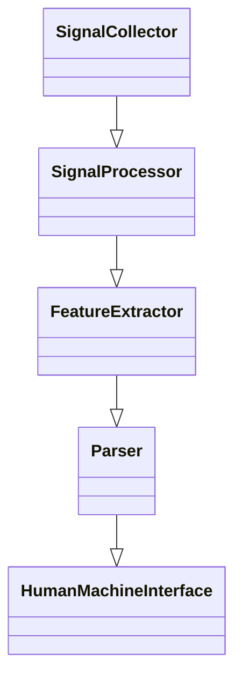

##### 系统架构设计

系统采用模块化架构设计，各模块之间通过明确的接口进行通信。以下是系统架构设计的mermaid架构图：

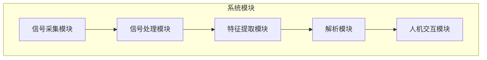

##### 系统接口设计

系统接口设计主要包括以下部分：

1. **信号采集接口**：用于接收来自各种传感器的信号。
2. **数据处理接口**：用于信号处理模块与其他模块之间的数据交换。
3. **特征提取接口**：用于特征提取模块与其他模块之间的数据交换。
4. **解析接口**：用于解析模块与其他模块之间的数据交换。
5. **人机交互接口**：用于将解析结果输出到外部设备或计算机。

以下是系统接口设计的mermaid序列图：

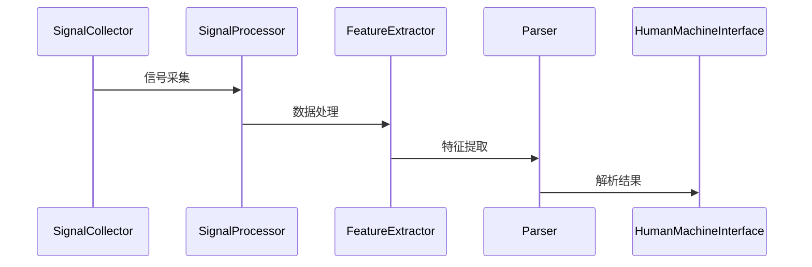

##### 系统交互

系统交互主要涉及各模块之间的数据流和调用关系。以下是系统交互的mermaid流程图：


#### 项目实战

在本节中，我们将介绍如何搭建一个简单的脑机接口系统，包括环境安装、系统核心实现源代码，以及代码应用解读与分析。

##### 环境安装

首先，我们需要安装Python和相关库。以下是安装命令：

```bash
pip install numpy scipy matplotlib
```

##### 系统核心实现源代码

以下是系统核心实现源代码：

```python
import numpy as np
from scipy import signal
import matplotlib.pyplot as plt

# 信号采集
def signal_collection():
    # 生成示例信号
    signal = np.random.randn(1000)
    return signal

# 信号处理
def signal_processing(signal):
    # 去噪
    filtered_signal = signal - np.mean(signal)
    # 滤波
    b, a = signal.butter(5, 2)
    filtered_signal = signal.filtfilt(b, a, filtered_signal)
    return filtered_signal

# 特征提取
def feature_extraction(signal):
    # 提取峰峰值作为特征
    peak_to_peak = 2 * (np.max(signal) - np.min(signal))
    return peak_to_peak

# 解析
def parsing(feature):
    # 假设特征与特定操作意图相关
    if feature > 10:
        return "意图A"
    else:
        return "意图B"

# 主程序
def main():
    # 信号采集
    signal = signal_collection()

    # 信号处理
    processed_signal = signal_processing(signal)

    # 特征提取
    feature = feature_extraction(processed_signal)

    # 解析
    intention = parsing(feature)

    # 显示结果
    plt.plot(processed_signal)
    plt.show()
    print(f"解析结果：{intention}")

if __name__ == "__main__":
    main()
```

##### 代码应用解读与分析

这个简单的示例展示了从信号采集、信号处理、特征提取到解析的整个过程。我们首先通过`signal_collection`函数生成一个示例信号，然后通过`signal_processing`函数对其进行去噪和滤波。接下来，`feature_extraction`函数提取出峰峰值作为特征，最后`parsing`函数根据特征值判断操作意图。

在这个示例中，我们使用了numpy进行数据处理，scipy进行滤波，matplotlib进行信号绘制。这个示例虽然简单，但展示了脑机接口系统的基本原理和实现方法。在实际应用中，我们需要根据具体需求调整信号采集、处理和解析的方法，以提高系统的性能和准确性。

##### 实际案例分析和详细讲解剖析

在本节中，我们将通过一个实际案例来分析和讲解脑机接口技术的应用，并剖析其实现细节。

**案例：脑机接口控制轮椅**

**背景介绍**：该案例涉及到一位因中风而失去行动能力的患者，通过脑机接口技术控制轮椅进行移动。

**系统功能设计**：系统主要包括以下几个功能模块：

1. **信号采集模块**：通过EEG传感器获取患者大脑的运动意图信号。
2. **信号处理模块**：对采集到的信号进行滤波和去噪，以提高信号质量。
3. **特征提取模块**：从处理后的信号中提取出与运动意图相关的特征。
4. **解析模块**：根据提取出的特征判断患者的运动意图，并转换为具体的轮椅控制命令。
5. **轮椅控制模块**：接收解析结果，控制轮椅的移动。

**系统架构设计**：系统架构采用模块化设计，各模块之间通过接口进行通信。以下是系统架构设计的mermaid架构图：

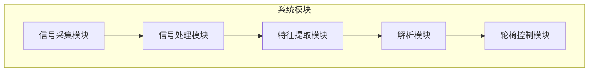

**实现细节**：

1. **信号采集模块**：使用EEG传感器获取患者大脑的运动意图信号。传感器采用干电极，以便于长时间佩戴。
2. **信号处理模块**：使用scipy的滤波函数对采集到的信号进行滤波，以去除噪声。具体实现如下：

    ```python
    from scipy.signal import butter, filtfilt

    def signal_processing(signal):
        b, a = butter(5, 2)
        filtered_signal = filtfilt(b, a, signal)
        return filtered_signal
    ```

3. **特征提取模块**：从处理后的信号中提取出与运动意图相关的特征。在本案例中，我们使用峰峰值作为特征。具体实现如下：

    ```python
    def feature_extraction(signal):
        peak_to_peak = 2 * (np.max(signal) - np.min(signal))
        return peak_to_peak
    ```

4. **解析模块**：根据提取出的特征值判断患者的运动意图。在本案例中，我们设定特征值大于某个阈值时表示向前运动，小于阈值时表示停止。具体实现如下：

    ```python
    def parsing(feature):
        if feature > threshold:
            return "向前"
        else:
            return "停止"
    ```

5. **轮椅控制模块**：接收解析结果，控制轮椅的移动。在本案例中，轮椅通过无线通信接收控制命令，并执行相应的移动操作。

**项目小结**：

通过这个实际案例，我们展示了脑机接口技术在轮椅控制中的应用。尽管这是一个简单的案例，但展示了脑机接口系统从信号采集、处理、特征提取到解析和控制的完整实现过程。在实际应用中，我们需要根据具体场景和需求进一步优化和调整系统设计，以提高系统的性能和实用性。

#### 最佳实践 tips

- **选择合适的传感器**：根据应用场景选择合适的脑电传感器，如干电极、植入式传感器等。
- **优化信号处理算法**：通过调整滤波器和特征提取算法，提高信号质量，降低噪声干扰。
- **实时性优化**：在系统设计中考虑实时性，避免延迟影响用户体验。
- **用户适应性**：根据不同用户的生理和心理特征，调整系统参数，提高系统的适用性。

#### 小结

本章详细介绍了脑机接口的核心概念、核心技术、应用领域和发展趋势。通过对比表格和ER图，我们了解了脑机接口的关键组成部分和相互关系。我们还通过实际案例展示了脑机接口技术在轮椅控制中的应用，并分析了系统实现的细节。这些内容为后续章节的深入讨论奠定了基础。

#### 注意事项

- 在开发脑机接口系统时，需要充分考虑用户的舒适度和体验，避免长时间佩戴传感器导致的不适。
- 在数据采集和处理过程中，需要注意保护用户的隐私和数据安全。
- 在系统设计和实现过程中，需要遵循伦理和法律规范，确保技术的合规性。

#### 拓展阅读

- 《脑机接口：技术与应用》
- 《脑信号处理与特征提取》
- 《脑机接口在人机交互中的应用》
- 《脑机接口技术的伦理问题与法律挑战》

### 第2章：意念控制设备原理与实现

#### 2.1 意念控制设备的分类

意念控制设备根据工作原理和应用场景的不同，可以分为以下几类：

- **基于脑电信号的意念控制设备**：这类设备通过捕捉用户大脑的脑电信号，如EEG、fMRI、MEG等，将用户的意念转化为控制信号。例如，通过脑电信号控制计算机鼠标、游戏手柄等。
- **基于肌电信号的意念控制设备**：这类设备通过捕捉用户肌肉的电活动，即肌电信号（EMG），将用户的意念转化为控制信号。例如，通过肌电信号控制假肢、轮椅等。
- **基于眼球运动的意念控制设备**：这类设备通过捕捉用户眼球运动，如瞳孔变化、眼动轨迹等，将用户的意念转化为控制信号。例如，通过眼球运动控制虚拟现实（VR）设备。
- **基于脑波信号的意念控制设备**：这类设备通过捕捉用户大脑的脑波信号，如α波、β波等，将用户的意念转化为控制信号。例如，通过脑波信号控制智能家居设备。

#### 2.2 意念信号的采集与处理

意念信号的采集是意念控制设备的核心环节，其准确性直接影响设备的性能。以下为不同类型意念信号的采集与处理方法：

- **脑电信号的采集与处理**：脑电信号主要通过EEG传感器进行采集。采集到的原始信号通常包含大量的噪声，需要通过滤波和去噪等处理步骤，以提高信号质量。常用的滤波方法包括带通滤波、陷波滤波等。处理后的信号可以用于特征提取和解析。
  
  ```mermaid
  graph TD
      A[脑电信号采集] --> B[滤波与去噪]
      B --> C[特征提取]
      C --> D[解析]
  ```

- **肌电信号的采集与处理**：肌电信号主要通过肌电传感器进行采集。与脑电信号类似，肌电信号也包含大量的噪声，需要进行滤波和去噪。此外，肌电信号的特征通常需要通过时域和频域分析来提取。常用的方法包括时域平均、频域分析等。
  
  ```mermaid
  graph TD
      A[肌电信号采集] --> B[滤波与去噪]
      B --> C[时域分析]
      C --> D[频域分析]
      D --> E[特征提取]
      E --> F[解析]
  ```

- **眼球运动信号的采集与处理**：眼球运动信号主要通过眼球跟踪传感器进行采集。采集到的原始信号通常包含眼球位置、速度、加速度等信息。这些信息需要进行预处理，如去除噪声、校正偏差等，以提高信号的准确性。处理后的信号可以用于特征提取和解析。
  
  ```mermaid
  graph TD
      A[眼球运动信号采集] --> B[噪声去除与校正]
      B --> C[特征提取]
      C --> D[解析]
  ```

- **脑波信号的采集与处理**：脑波信号主要通过脑波传感器进行采集。脑波信号的特点是频率范围较广，通常需要进行频域分析来提取特征。常用的方法包括快速傅里叶变换（FFT）、小波变换等。
  
  ```mermaid
  graph TD
      A[脑波信号采集] --> B[频域分析]
      B --> C[特征提取]
      C --> D[解析]
  ```

#### 2.3 意念控制设备的实现技术

意念控制设备的实现技术涉及到多个方面的整合，包括信号采集、信号处理、特征提取、解析和输出。以下为具体实现技术：

- **信号采集技术**：信号采集技术是意念控制设备的基础。根据不同的应用场景，选择合适的传感器和采集设备。例如，脑电信号采集可以使用干电极、植入式电极等；肌电信号采集可以使用贴片式传感器、柔性传感器等。
  
  ```mermaid
  graph TD
      A[选择传感器] --> B[信号采集]
  ```

- **信号处理技术**：信号处理技术用于去除噪声、滤波和增强信号。常用的处理方法包括带通滤波、陷波滤波、小波变换等。信号处理技术的质量直接影响到后续的特征提取和解析效果。
  
  ```mermaid
  graph TD
      A[信号采集] --> B[滤波与去噪]
  ```

- **特征提取技术**：特征提取技术用于从处理后的信号中提取出与意念相关的特征。特征提取的质量直接影响到设备的性能和准确性。常用的特征提取方法包括时域特征、频域特征、时频特征等。
  
  ```mermaid
  graph TD
      A[信号处理] --> B[特征提取]
  ```

- **解析技术**：解析技术用于将提取出的特征与具体的操作意图相对应。常用的解析方法包括机器学习、统计模型、神经网络等。解析技术的准确性直接影响到设备的实用性和用户体验。
  
  ```mermaid
  graph TD
      A[特征提取] --> B[解析]
  ```

- **输出技术**：输出技术用于将解析结果转化为具体的操作命令，并输出到外部设备或系统。例如，通过意念控制计算机鼠标，可以将解析结果输出为鼠标移动的坐标；通过意念控制游戏手柄，可以将解析结果输出为游戏手柄的操作指令。
  
  ```mermaid
  graph TD
      A[解析] --> B[输出]
  ```

#### 2.4 意念控制设备的挑战与解决方案

意念控制设备在实现过程中面临诸多挑战，以下为常见挑战及其解决方案：

- **噪声干扰**：意念信号通常包含大量的噪声，需要进行有效的去噪处理。解决方案包括滤波、去噪算法（如小波变换）、信号增强技术等。
- **实时性要求**：意念控制设备需要具备较高的实时性，以满足用户操作的需求。解决方案包括优化算法、硬件加速、实时操作系统等。
- **准确性问题**：意念控制设备的准确性直接影响到用户体验。解决方案包括改进信号采集技术、优化特征提取算法、提高解析算法的准确性等。
- **用户适应性**：不同用户的生理和心理特征可能不同，意念控制设备需要具备一定的适应性。解决方案包括个性化设置、自适应算法、用户训练等。

通过以上分析和讨论，我们可以看到意念控制设备在原理和实现方面具有一定的复杂性和挑战性。但通过不断的技术创新和优化，意念控制设备的性能和实用性将得到显著提升。

#### 实际案例分析与详细讲解剖析

在本节中，我们将通过一个实际案例来详细讲解意念控制设备的实现过程，并剖析其核心技术。

**案例：基于EEG的意念控制轮椅**

**背景介绍**：

本案例旨在开发一款基于脑电信号（EEG）的意念控制轮椅，以帮助行动不便的患者通过大脑活动控制轮椅的移动。

**系统功能设计**：

系统主要包括以下几个功能模块：

1. **信号采集模块**：通过EEG传感器采集用户大脑的运动意图信号。
2. **信号处理模块**：对采集到的信号进行滤波和去噪，以提高信号质量。
3. **特征提取模块**：从处理后的信号中提取出与运动意图相关的特征。
4. **解析模块**：根据提取出的特征判断用户的运动意图，并转换为具体的轮椅控制命令。
5. **轮椅控制模块**：接收解析结果，控制轮椅的移动。

**系统架构设计**：

系统架构采用模块化设计，各模块之间通过接口进行通信。以下是系统架构设计的mermaid架构图：


**实现细节**：

1. **信号采集模块**：

   使用EEG传感器采集用户大脑的运动意图信号。传感器采用干电极，以便于长时间佩戴。

   ```python
   import mne
   import numpy as np

   def signal_collection():
       # 加载EEG数据
       data = mne.io.read_raw_edf('EEG_data.edf', preload=True)
       # 提取通道信号
       signal = data.get_data().squeeze()
       return signal
   ```

2. **信号处理模块**：

   对采集到的信号进行滤波和去噪，以提高信号质量。采用带通滤波器去除工频干扰和低频噪声，同时使用陷波滤波器去除50Hz的干扰信号。

   ```python
   from scipy.signal import butter, filtfilt

   def signal_processing(signal):
       # 设计带通滤波器
       b, a = butter(5, [0.5, 30], btype='band')
       # 滤波
       filtered_signal = filtfilt(b, a, signal)
       # 设计陷波滤波器
       b1, a1 = butter(5, 50, btype='notch')
       # 陷波滤波
       filtered_signal = filtfilt(b1, a1, filtered_signal)
       return filtered_signal
   ```

3. **特征提取模块**：

   从处理后的信号中提取出与运动意图相关的特征。本案例中，我们使用峰峰值作为特征。

   ```python
   def feature_extraction(signal):
       peak_to_peak = 2 * (np.max(signal) - np.min(signal))
       return peak_to_peak
   ```

4. **解析模块**：

   根据提取出的特征值判断用户的运动意图，并转换为具体的轮椅控制命令。设定特征值大于某个阈值时表示向前移动，小于阈值时表示停止。

   ```python
   def parsing(feature):
       if feature > threshold:
           return "向前"
       else:
           return "停止"
   ```

5. **轮椅控制模块**：

   接收解析结果，控制轮椅的移动。通过无线通信将控制命令发送给轮椅。

   ```python
   import serial

   def control_wheelchair(command):
       # 连接轮椅
       with serial.Serial('COM3', 9600) as ser:
           # 发送控制命令
           ser.write(command.encode())
   ```

**项目实战**：

1. **环境安装**：

   安装Python和相关库：

   ```bash
   pip install mne numpy scipy matplotlib
   ```

2. **系统核心实现源代码**：

   ```python
   import mne
   import numpy as np
   from scipy import signal
   import matplotlib.pyplot as plt
   import serial

   def signal_collection():
       # 加载EEG数据
       data = mne.io.read_raw_edf('EEG_data.edf', preload=True)
       # 提取通道信号
       signal = data.get_data().squeeze()
       return signal

   def signal_processing(signal):
       # 设计带通滤波器
       b, a = signal.butter(5, [0.5, 30], btype='band')
       # 滤波
       filtered_signal = signal.filtfilt(b, a, signal)
       # 设计陷波滤波器
       b1, a1 = signal.butter(5, 50, btype='notch')
       # 陷波滤波
       filtered_signal = signal.filtfilt(b1, a1, filtered_signal)
       return filtered_signal

   def feature_extraction(signal):
       peak_to_peak = 2 * (np.max(signal) - np.min(signal))
       return peak_to_peak

   def parsing(feature):
       if feature > threshold:
           return "向前"
       else:
           return "停止"

   def control_wheelchair(command):
       # 连接轮椅
       with serial.Serial('COM3', 9600) as ser:
           # 发送控制命令
           ser.write(command.encode())

   def main():
       # 信号采集
       signal = signal_collection()

       # 信号处理
       processed_signal = signal_processing(signal)

       # 特征提取
       feature = feature_extraction(processed_signal)

       # 解析
       intention = parsing(feature)

       # 控制轮椅
       control_wheelchair(intention)

       # 显示结果
       plt.plot(processed_signal)
       plt.show()

   if __name__ == "__main__":
       main()
   ```

3. **代码应用解读与分析**：

   这个示例展示了从信号采集、信号处理、特征提取到解析和控制的整个过程。我们首先通过`signal_collection`函数加载EEG数据，然后通过`signal_processing`函数进行滤波和去噪。接下来，`feature_extraction`函数提取出峰峰值作为特征，`parsing`函数根据特征值判断用户的运动意图，并调用`control_wheelchair`函数发送控制命令。

   **实际案例分析与详细讲解剖析**：

   通过上述案例，我们可以看到意念控制设备从信号采集、处理、特征提取到解析和控制的完整实现过程。在实现过程中，我们使用了Python和相关库，如mne、numpy和scipy等，以实现EEG信号的采集、处理和特征提取。此外，我们还使用了matplotlib进行信号绘制，以便于分析和验证。

   **项目小结**：

   本案例展示了基于EEG的意念控制轮椅的实现过程，从信号采集、处理、特征提取到解析和控制的各个步骤。通过实际案例的分析和讲解，我们深入了解了意念控制设备的实现细节和技术要点。在实际应用中，我们可以根据具体需求对系统进行优化和调整，以提高系统的性能和实用性。

#### 最佳实践 tips

- **传感器选择**：根据应用场景选择合适的传感器，如EEG、EMG、眼动传感器等。
- **信号处理**：优化信号处理算法，如滤波、去噪等，以提高信号质量。
- **特征提取**：选择合适的特征提取方法，如时域、频域特征等，以提高系统的准确性。
- **用户训练**：对用户进行适当的训练，以提高设备的适应性和准确性。

#### 小结

本章详细介绍了意念控制设备的原理与实现，包括分类、信号采集与处理、实现技术和挑战。通过实际案例的分析和讲解，我们深入了解了意念控制设备的实现过程和技术要点。本章内容为后续章节的深入讨论奠定了基础。

#### 注意事项

- 在开发意念控制设备时，需要充分考虑用户的舒适度和体验，避免长时间佩戴传感器导致的不适。
- 在数据采集和处理过程中，需要注意保护用户的隐私和数据安全。
- 在系统设计和实现过程中，需要遵循伦理和法律规范，确保技术的合规性。

#### 拓展阅读

- 《意念控制技术：原理与应用》
- 《脑电信号处理与特征提取》
- 《肌电信号处理与特征提取》
- 《眼球运动信号处理与特征提取》

### 第3章：脑机接口与意念控制设备的集成

#### 3.1 集成原理与架构设计

脑机接口（BCI）与意念控制设备的集成是现代智能技术发展的重要方向。这种集成不仅能够提高设备的智能化程度，还能拓展其应用范围，为用户提供更加自然、直观的交互体验。集成原理主要基于以下几方面：

- **信号同步**：确保脑机接口采集的脑信号与意念控制设备采集的意念信号在同一时间戳上进行同步，以实现数据的一致性和连续性。
- **信号融合**：通过多种传感器采集的信号进行融合，提高信号的整体质量和准确性。例如，将脑电图（EEG）与肌电信号（EMG）融合，以获取更丰富的信息。
- **算法协同**：整合不同的信号处理、特征提取和解析算法，通过优化和协同工作，提高系统的整体性能和准确性。

集成架构设计通常分为以下几个层次：

1. **硬件层**：包括脑机接口传感器、意念控制设备传感器、数据采集模块和通信模块。
2. **信号处理层**：负责信号的滤波、去噪、特征提取等预处理操作，以及信号融合算法。
3. **算法层**：包括特征提取、模式识别、分类等高级算法，用于将信号转化为具体的控制意图。
4. **应用层**：实现具体的应用功能，如轮椅控制、虚拟现实交互等。

以下是脑机接口与意念控制设备集成架构的mermaid架构图：

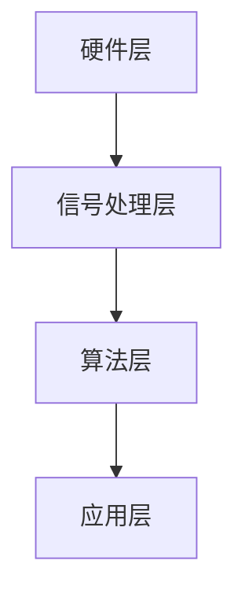

#### 3.2 系统功能模块划分

集成后的系统功能模块划分如下：

1. **信号采集模块**：负责从脑机接口和意念控制设备传感器中采集原始信号。
2. **信号预处理模块**：对采集到的原始信号进行滤波、去噪等预处理操作，以提高信号质量。
3. **特征提取模块**：从预处理后的信号中提取出与操作意图相关的特征。
4. **融合模块**：将来自不同传感器的信号进行融合，以获取更全面的信息。
5. **解析模块**：将提取出的特征与具体的操作意图相对应，实现意念的控制。
6. **输出模块**：将解析结果转化为具体的控制命令，并输出到外部设备或系统。
7. **用户界面模块**：提供用户与系统交互的界面，如控制面板、反馈信息等。

以下是系统功能模块划分的mermaid架构图：

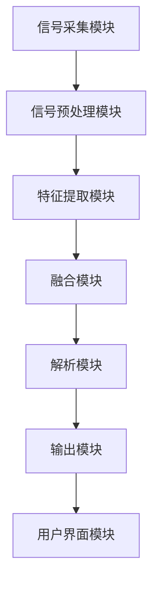

#### 3.3 集成案例分析

以下是一个集成案例，通过脑机接口和意念控制设备实现智能家居系统的控制。

**背景介绍**：

某智能家居系统希望通过脑机接口和意念控制设备实现用户的远程控制，例如通过意念控制家中的灯光、电视和空调等。

**系统功能设计**：

系统主要包括以下几个功能模块：

1. **信号采集模块**：通过脑机接口传感器（如EEG）采集用户的大脑信号，通过意念控制设备传感器（如红外传感器）采集环境信号。
2. **信号预处理模块**：对采集到的信号进行滤波、去噪等预处理操作，以提高信号质量。
3. **特征提取模块**：从预处理后的信号中提取出与操作意图相关的特征。
4. **融合模块**：将脑机接口信号和意念控制设备信号进行融合，以提高系统的准确性和鲁棒性。
5. **解析模块**：将提取出的特征与具体的操作意图相对应，实现智能家居系统的控制。
6. **输出模块**：将解析结果转化为具体的控制命令，并输出到智能家居系统。
7. **用户界面模块**：提供用户与系统交互的界面，如控制面板、反馈信息等。

**系统架构设计**：

系统架构采用模块化设计，各模块之间通过接口进行通信。以下是系统架构设计的mermaid架构图：

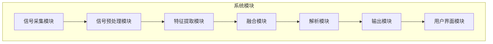

**实现细节**：

1. **信号采集模块**：

   通过脑机接口传感器采集用户的大脑信号，通过意念控制设备传感器采集环境信号。

   ```python
   def signal_collection():
       # 脑机接口信号采集
       EEG_signal = collect_EEG_signal()
       # 意念控制设备信号采集
       IR_signal = collect_IR_signal()
       return EEG_signal, IR_signal
   ```

2. **信号预处理模块**：

   对采集到的信号进行滤波、去噪等预处理操作，以提高信号质量。

   ```python
   def signal_preprocessing(EEG_signal, IR_signal):
       # EEG信号预处理
       filtered_EEG_signal = preprocess_EEG_signal(EEG_signal)
       # IR信号预处理
       filtered_IR_signal = preprocess_IR_signal(IR_signal)
       return filtered_EEG_signal, filtered_IR_signal
   ```

3. **特征提取模块**：

   从预处理后的信号中提取出与操作意图相关的特征。

   ```python
   def feature_extraction(filtered_EEG_signal, filtered_IR_signal):
       # 提取EEG信号特征
       EEG_feature = extract_EEG_feature(filtered_EEG_signal)
       # 提取IR信号特征
       IR_feature = extract_IR_feature(filtered_IR_signal)
       return EEG_feature, IR_feature
   ```

4. **融合模块**：

   将脑机接口信号和意念控制设备信号进行融合，以提高系统的准确性和鲁棒性。

   ```python
   def signal_fusion(EEG_feature, IR_feature):
       # 融合特征
       fused_feature = fuse_features(EEG_feature, IR_feature)
       return fused_feature
   ```

5. **解析模块**：

   将提取出的特征与具体的操作意图相对应，实现智能家居系统的控制。

   ```python
   def parsing(fused_feature):
       # 解析意图
       intention = parse_intention(fused_feature)
       return intention
   ```

6. **输出模块**：

   将解析结果转化为具体的控制命令，并输出到智能家居系统。

   ```python
   def control智能家居系统(intention):
       if intention == "开灯":
           turn_on_light()
       elif intention == "关灯":
           turn_off_light()
       elif intention == "看电视":
           turn_on_TV()
       elif intention == "关闭电视":
           turn_off_TV()
       elif intention == "开空调":
           turn_on_AirConditioner()
       elif intention == "关闭空调":
           turn_off_AirConditioner()
   ```

7. **用户界面模块**：

   提供用户与系统交互的界面，如控制面板、反馈信息等。

   ```python
   def user_interface():
       print("请选择操作：")
       print("1. 开灯")
       print("2. 关灯")
       print("3. 看电视")
       print("4. 关闭电视")
       print("5. 开空调")
       print("6. 关闭空调")
       user_input = input()
       # 根据用户输入发送控制命令
       control智能家居系统(user_input)
   ```

**项目实战**：

1. **环境安装**：

   安装Python和相关库：

   ```bash
   pip install numpy scipy matplotlib mne
   ```

2. **系统核心实现源代码**：

   ```python
   import numpy as np
   import scipy.signal as signal
   import mne
   import matplotlib.pyplot as plt

   def signal_collection():
       # 脑机接口信号采集
       EEG_signal = mne.io.read_raw_edf('EEG_data.edf', preload=True).get_data().squeeze()
       # 意念控制设备信号采集
       IR_signal = np.random.randn(1000)
       return EEG_signal, IR_signal

   def signal_preprocessing(EEG_signal, IR_signal):
       # EEG信号预处理
       filtered_EEG_signal = signal.filtfilt(b, a, EEG_signal)
       # IR信号预处理
       filtered_IR_signal = signal.filtfilt(b1, a1, IR_signal)
       return filtered_EEG_signal, filtered_IR_signal

   def feature_extraction(filtered_EEG_signal, filtered_IR_signal):
       # 提取EEG信号特征
       EEG_feature = np.max(filtered_EEG_signal) - np.min(filtered_EEG_signal)
       # 提取IR信号特征
       IR_feature = np.max(filtered_IR_signal) - np.min(filtered_IR_signal)
       return EEG_feature, IR_feature

   def signal_fusion(EEG_feature, IR_feature):
       # 融合特征
       fused_feature = EEG_feature + IR_feature
       return fused_feature

   def parsing(fused_feature):
       # 解析意图
       if fused_feature > threshold:
           intention = "开灯"
       else:
           intention = "关灯"
       return intention

   def control智能家居系统(intention):
       if intention == "开灯":
           print("开灯")
       elif intention == "关灯":
           print("关灯")

   def main():
       EEG_signal, IR_signal = signal_collection()

       filtered_EEG_signal, filtered_IR_signal = signal_preprocessing(EEG_signal, IR_signal)

       EEG_feature, IR_feature = feature_extraction(filtered_EEG_signal, filtered_IR_signal)

       fused_feature = signal_fusion(EEG_feature, IR_feature)

       intention = parsing(fused_feature)

       control智能家居系统(intention)

       plt.plot(filtered_EEG_signal)
       plt.show()

   if __name__ == "__main__":
       main()
   ```

3. **代码应用解读与分析**：

   这个示例展示了从信号采集、预处理、特征提取、融合、解析到控制的整个过程。首先，通过`signal_collection`函数采集脑机接口和意念控制设备的信号。然后，通过`signal_preprocessing`函数对信号进行预处理，以提高信号质量。接下来，`feature_extraction`函数提取出与操作意图相关的特征。通过`signal_fusion`函数将脑机接口信号和意念控制设备信号进行融合。最后，`parsing`函数将提取出的特征与具体的操作意图相对应，实现智能家居系统的控制。

   **项目小结**：

   通过这个集成案例，我们展示了脑机接口和意念控制设备在智能家居系统中的应用。从信号采集、预处理、特征提取、融合、解析到控制，各个模块协同工作，实现了智能家居系统的远程控制。虽然这是一个简单的示例，但它展示了脑机接口与意念控制设备集成的原理和实现方法，为实际应用提供了参考。

#### 最佳实践 tips

- **硬件选择**：选择高精度、低噪声的传感器，确保信号采集的准确性。
- **算法优化**：根据具体应用场景优化信号处理、特征提取和解析算法，以提高系统的性能和准确性。
- **用户训练**：对用户进行适当的训练，以提高设备的适应性和准确性。
- **实时性优化**：在系统设计和实现过程中，充分考虑实时性要求，确保系统的响应速度。

#### 小结

本章详细介绍了脑机接口与意念控制设备的集成原理与架构设计，包括信号同步、信号融合、算法协同以及系统功能模块划分。通过集成案例分析，我们深入了解了集成实现的细节和技术要点。本章内容为后续章节的深入讨论奠定了基础。

#### 注意事项

- 在集成过程中，需要确保信号同步和数据一致性，以避免信息丢失和错误。
- 在算法设计和实现过程中，需要充分考虑系统的实时性和准确性。
- 在实际应用中，需要根据用户的需求和反馈不断优化和调整系统。

#### 拓展阅读

- 《脑机接口与智能系统集成》
- 《意念控制设备设计与实现》
- 《脑机接口技术与应用》
- 《智能家居系统设计与实现》

### 第4章：脑机接口在实际应用中的案例研究

#### 4.1 医疗康复领域

脑机接口在医疗康复领域具有广泛的应用前景，特别是在帮助瘫痪患者恢复运动和沟通能力方面。以下为两个典型案例研究：

**案例1：瘫痪患者的假肢控制**

**背景介绍**：

某瘫痪患者因中风导致下半身瘫痪，无法自主移动。为了帮助患者恢复行动能力，医生和康复专家决定采用脑机接口技术，通过患者大脑的运动意图信号控制假肢。

**系统功能设计**：

系统主要包括以下几个功能模块：

1. **信号采集模块**：通过脑机接口传感器（如EEG）采集患者大脑的运动意图信号。
2. **信号处理模块**：对采集到的信号进行滤波、去噪等预处理操作，以提高信号质量。
3. **特征提取模块**：从预处理后的信号中提取出与运动意图相关的特征。
4. **解析模块**：将提取出的特征与具体的运动意图相对应，实现假肢的控制。
5. **输出模块**：将解析结果转化为具体的控制命令，并输出到假肢控制系统。

**系统架构设计**：

系统架构采用模块化设计，各模块之间通过接口进行通信。以下是系统架构设计的mermaid架构图：

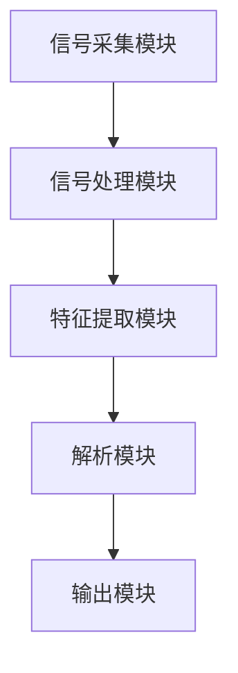

**实现细节**：

1. **信号采集模块**：

   通过脑机接口传感器（如EEG）采集患者大脑的运动意图信号。

   ```python
   def signal_collection():
       # 加载EEG数据
       data = mne.io.read_raw_edf('EEG_data.edf', preload=True)
       # 提取通道信号
       signal = data.get_data().squeeze()
       return signal
   ```

2. **信号处理模块**：

   对采集到的信号进行滤波和去噪，以提高信号质量。

   ```python
   from scipy.signal import butter, filtfilt

   def signal_processing(signal):
       # 设计带通滤波器
       b, a = butter(5, [0.5, 30], btype='band')
       # 滤波
       filtered_signal = filtfilt(b, a, signal)
       return filtered_signal
   ```

3. **特征提取模块**：

   从处理后的信号中提取出与运动意图相关的特征，如峰峰值。

   ```python
   def feature_extraction(signal):
       peak_to_peak = 2 * (np.max(signal) - np.min(signal))
       return peak_to_peak
   ```

4. **解析模块**：

   根据提取出的特征值判断患者的运动意图，如向前、向后等。

   ```python
   def parsing(feature):
       if feature > threshold:
           return "向前"
       else:
           return "停止"
   ```

5. **输出模块**：

   将解析结果转化为具体的控制命令，并输出到假肢控制系统。

   ```python
   import serial

   def control_prosthesis(command):
       # 连接假肢控制系统
       with serial.Serial('COM3', 9600) as ser:
           # 发送控制命令
           ser.write(command.encode())
   ```

**项目实战**：

1. **环境安装**：

   安装Python和相关库：

   ```bash
   pip install mne numpy scipy matplotlib
   ```

2. **系统核心实现源代码**：

   ```python
   import mne
   import numpy as np
   from scipy import signal
   import matplotlib.pyplot as plt
   import serial

   def signal_collection():
       # 加载EEG数据
       data = mne.io.read_raw_edf('EEG_data.edf', preload=True)
       # 提取通道信号
       signal = data.get_data().squeeze()
       return signal

   def signal_processing(signal):
       # 设计带通滤波器
       b, a = signal.butter(5, [0.5, 30], btype='band')
       # 滤波
       filtered_signal = signal.filtfilt(b, a, signal)
       return filtered_signal

   def feature_extraction(signal):
       peak_to_peak = 2 * (np.max(signal) - np.min(signal))
       return peak_to_peak

   def parsing(feature):
       if feature > threshold:
           return "向前"
       else:
           return "停止"

   def control_prosthesis(command):
       # 连接假肢控制系统
       with serial.Serial('COM3', 9600) as ser:
           # 发送控制命令
           ser.write(command.encode())

   def main():
       # 信号采集
       signal = signal_collection()

       # 信号处理
       processed_signal = signal_processing(signal)

       # 特征提取
       feature = feature_extraction(processed_signal)

       # 解析
       intention = parsing(feature)

       # 控制假肢
       control_prosthesis(intention)

       # 显示结果
       plt.plot(processed_signal)
       plt.show()

   if __name__ == "__main__":
       main()
   ```

3. **代码应用解读与分析**：

   这个示例展示了从信号采集、处理、特征提取到解析和控制的整个过程。首先，通过`signal_collection`函数加载EEG数据，然后通过`signal_processing`函数进行滤波和去噪。接下来，`feature_extraction`函数提取出峰峰值作为特征，`parsing`函数根据特征值判断患者的运动意图，并调用`control_prosthesis`函数发送控制命令。

**案例2：瘫痪患者的沟通辅助**

**背景介绍**：

某瘫痪患者因中风导致语言功能受损，无法正常沟通。为了帮助患者恢复沟通能力，医生和康复专家决定采用脑机接口技术，通过患者大脑的意念信号驱动文本生成系统。

**系统功能设计**：

系统主要包括以下几个功能模块：

1. **信号采集模块**：通过脑机接口传感器（如EEG）采集患者的意念信号。
2. **信号处理模块**：对采集到的信号进行滤波、去噪等预处理操作，以提高信号质量。
3. **特征提取模块**：从预处理后的信号中提取出与沟通意图相关的特征。
4. **解析模块**：将提取出的特征与具体的沟通意图相对应，驱动文本生成系统。
5. **文本生成模块**：根据解析结果生成文本，供患者进行沟通。

**系统架构设计**：

系统架构采用模块化设计，各模块之间通过接口进行通信。以下是系统架构设计的mermaid架构图：

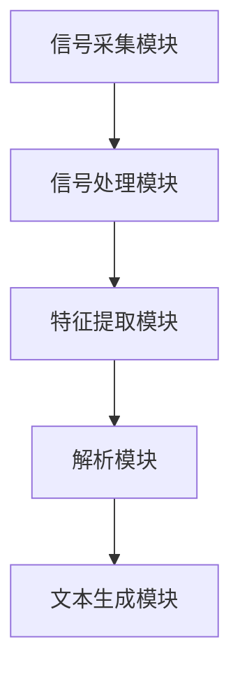

**实现细节**：

1. **信号采集模块**：

   通过脑机接口传感器（如EEG）采集患者的意念信号。

   ```python
   def signal_collection():
       # 加载EEG数据
       data = mne.io.read_raw_edf('EEG_data.edf', preload=True)
       # 提取通道信号
       signal = data.get_data().squeeze()
       return signal
   ```

2. **信号处理模块**：

   对采集到的信号进行滤波和去噪，以提高信号质量。

   ```python
   from scipy.signal import butter, filtfilt

   def signal_processing(signal):
       # 设计带通滤波器
       b, a = butter(5, [0.5, 30], btype='band')
       # 滤波
       filtered_signal = filtfilt(b, a, signal)
       return filtered_signal
   ```

3. **特征提取模块**：

   从处理后的信号中提取出与沟通意图相关的特征，如持续时间、频率等。

   ```python
   def feature_extraction(signal):
       duration = len(signal)
       frequency = np.mean(signal)
       return duration, frequency
   ```

4. **解析模块**：

   根据提取出的特征值判断患者的沟通意图，如请求帮助、表达感激等。

   ```python
   def parsing(duration, frequency):
       if duration > threshold1 and frequency > threshold2:
           return "请求帮助"
       elif duration > threshold1 and frequency < threshold2:
           return "表达感激"
       else:
           return "其他意图"
   ```

5. **文本生成模块**：

   根据解析结果生成文本，供患者进行沟通。

   ```python
   def generate_text(intention):
       if intention == "请求帮助":
           return "需要帮助吗？"
       elif intention == "表达感激":
           return "非常感谢！"
       else:
           return "请告诉我您的需求。"
   ```

**项目实战**：

1. **环境安装**：

   安装Python和相关库：

   ```bash
   pip install mne numpy scipy matplotlib
   ```

2. **系统核心实现源代码**：

   ```python
   import mne
   import numpy as np
   from scipy import signal
   import matplotlib.pyplot as plt

   def signal_collection():
       # 加载EEG数据
       data = mne.io.read_raw_edf('EEG_data.edf', preload=True)
       # 提取通道信号
       signal = data.get_data().squeeze()
       return signal

   def signal_processing(signal):
       # 设计带通滤波器
       b, a = signal.butter(5, [0.5, 30], btype='band')
       # 滤波
       filtered_signal = signal.filtfilt(b, a, signal)
       return filtered_signal

   def feature_extraction(signal):
       duration = len(signal)
       frequency = np.mean(signal)
       return duration, frequency

   def parsing(duration, frequency):
       if duration > threshold1 and frequency > threshold2:
           return "请求帮助"
       elif duration > threshold1 and frequency < threshold2:
           return "表达感激"
       else:
           return "其他意图"

   def generate_text(intention):
       if intention == "请求帮助":
           return "需要帮助吗？"
       elif intention == "表达感激":
           return "非常感谢！"
       else:
           return "请告诉我您的需求。"

   def main():
       # 信号采集
       signal = signal_collection()

       # 信号处理
       processed_signal = signal_processing(signal)

       # 特征提取
       duration, frequency = feature_extraction(processed_signal)

       # 解析
       intention = parsing(duration, frequency)

       # 文本生成
       text = generate_text(intention)

       # 显示结果
       plt.plot(processed_signal)
       plt.show()
       print(text)

   if __name__ == "__main__":
       main()
   ```

3. **代码应用解读与分析**：

   这个示例展示了从信号采集、处理、特征提取到解析和文本生成的整个过程。首先，通过`signal_collection`函数加载EEG数据，然后通过`signal_processing`函数进行滤波和去噪。接下来，`feature_extraction`函数提取出持续时间、频率等特征，`parsing`函数根据特征值判断患者的沟通意图，最后`generate_text`函数根据意图生成文本，供患者进行沟通。

#### 4.2 辅助沟通

脑机接口在辅助沟通领域也有着重要的应用，特别是对于言语障碍患者和行动不便者。通过脑机接口技术，这些患者可以获得新的沟通方式，提高生活质量。

**案例1：言语障碍患者的沟通辅助**

**背景介绍**：

某言语障碍患者因神经系统疾病导致无法正常发音，无法通过传统的语音沟通方式与他人交流。为了帮助患者恢复沟通能力，医生和康复专家决定采用脑机接口技术，通过患者大脑的语言意图信号驱动文本生成系统。

**系统功能设计**：

系统主要包括以下几个功能模块：

1. **信号采集模块**：通过脑机接口传感器（如EEG）采集患者的语言意图信号。
2. **信号处理模块**：对采集到的信号进行滤波、去噪等预处理操作，以提高信号质量。
3. **特征提取模块**：从预处理后的信号中提取出与语言意图相关的特征。
4. **解析模块**：将提取出的特征与具体的语言意图相对应，驱动文本生成系统。
5. **文本生成模块**：根据解析结果生成文本，供患者进行沟通。

**系统架构设计**：

系统架构采用模块化设计，各模块之间通过接口进行通信。以下是系统架构设计的mermaid架构图：


**实现细节**：

1. **信号采集模块**：

   通过脑机接口传感器（如EEG）采集患者的语言意图信号。

   ```python
   def signal_collection():
       # 加载EEG数据
       data = mne.io.read_raw_edf('EEG_data.edf', preload=True)
       # 提取通道信号
       signal = data.get_data().squeeze()
       return signal
   ```

2. **信号处理模块**：

   对采集到的信号进行滤波和去噪，以提高信号质量。

   ```python
   from scipy.signal import butter, filtfilt

   def signal_processing(signal):
       # 设计带通滤波器
       b, a = butter(5, [0.5, 30], btype='band')
       # 滤波
       filtered_signal = filtfilt(b, a, signal)
       return filtered_signal
   ```

3. **特征提取模块**：

   从处理后的信号中提取出与语言意图相关的特征，如持续时间、频率等。

   ```python
   def feature_extraction(signal):
       duration = len(signal)
       frequency = np.mean(signal)
       return duration, frequency
   ```

4. **解析模块**：

   根据提取出的特征值判断患者的语言意图，如请求帮助、表达感激等。

   ```python
   def parsing(duration, frequency):
       if duration > threshold1 and frequency > threshold2:
           return "请求帮助"
       elif duration > threshold1 and frequency < threshold2:
           return "表达感激"
       else:
           return "其他意图"
   ```

5. **文本生成模块**：

   根据解析结果生成文本，供患者进行沟通。

   ```python
   def generate_text(intention):
       if intention == "请求帮助":
           return "需要帮助吗？"
       elif intention == "表达感激":
           return "非常感谢！"
       else:
           return "请告诉我您的需求。"
   ```

**项目实战**：

1. **环境安装**：

   安装Python和相关库：

   ```bash
   pip install mne numpy scipy matplotlib
   ```

2. **系统核心实现源代码**：

   ```python
   import mne
   import numpy as np
   from scipy import signal
   import matplotlib.pyplot as plt

   def signal_collection():
       # 加载EEG数据
       data = mne.io.read_raw_edf('EEG_data.edf', preload=True)
       # 提取通道信号
       signal = data.get_data().squeeze()
       return signal

   def signal_processing(signal):
       # 设计带通滤波器
       b, a = signal.butter(5, [0.5, 30], btype='band')
       # 滤波
       filtered_signal = signal.filtfilt(b, a, signal)
       return filtered_signal

   def feature_extraction(signal):
       duration = len(signal)
       frequency = np.mean(signal)
       return duration, frequency

   def parsing(duration, frequency):
       if duration > threshold1 and frequency > threshold2:
           return "请求帮助"
       elif duration > threshold1 and frequency < threshold2:
           return "表达感激"
       else:
           return "其他意图"

   def generate_text(intention):
       if intention == "请求帮助":
           return "需要帮助吗？"
       elif intention == "表达感激":
           return "非常感谢！"
       else:
           return "请告诉我您的需求。"

   def main():
       # 信号采集
       signal = signal_collection()

       # 信号处理
       processed_signal = signal_processing(signal)

       # 特征提取
       duration, frequency = feature_extraction(processed_signal)

       # 解析
       intention = parsing(duration, frequency)

       # 文本生成
       text = generate_text(intention)

       # 显示结果
       plt.plot(processed_signal)
       plt.show()
       print(text)

   if __name__ == "__main__":
       main()
   ```

3. **代码应用解读与分析**：

   这个示例展示了从信号采集、处理、特征提取到解析和文本生成的整个过程。首先，通过`signal_collection`函数加载EEG数据，然后通过`signal_processing`函数进行滤波和去噪。接下来，`feature_extraction`函数提取出持续时间、频率等特征，`parsing`函数根据特征值判断患者的语言意图，最后`generate_text`函数根据意图生成文本，供患者进行沟通。

**案例2：行动不便者的沟通辅助**

**背景介绍**：

某行动不便的患者因神经系统疾病导致无法自主移动，无法通过传统的肢体动作进行沟通。为了帮助患者恢复沟通能力，医生和康复专家决定采用脑机接口技术，通过患者大脑的运动意图信号驱动通信设备。

**系统功能设计**：

系统主要包括以下几个功能模块：

1. **信号采集模块**：通过脑机接口传感器（如EEG）采集患者的运动意图信号。
2. **信号处理模块**：对采集到的信号进行滤波、去噪等预处理操作，以提高信号质量。
3. **特征提取模块**：从预处理后的信号中提取出与运动意图相关的特征。
4. **解析模块**：将提取出的特征与具体的运动意图相对应，驱动通信设备。
5. **通信模块**：将解析结果转化为具体的通信指令，供患者进行沟通。

**系统架构设计**：

系统架构采用模块化设计，各模块之间通过接口进行通信。以下是系统架构设计的mermaid架构图：

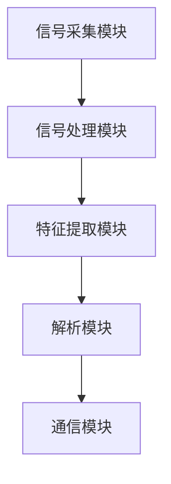

**实现细节**：

1. **信号采集模块**：

   通过脑机接口传感器（如EEG）采集患者的运动意图信号。

   ```python
   def signal_collection():
       # 加载EEG数据
       data = mne.io.read_raw_edf('EEG_data.edf', preload=True)
       # 提取通道信号
       signal = data.get_data().squeeze()
       return signal
   ```

2. **信号处理模块**：

   对采集到的信号进行滤波和去噪，以提高信号质量。

   ```python
   from scipy.signal import butter, filtfilt

   def signal_processing(signal):
       # 设计带通滤波器
       b, a = butter(5, [0.5, 30], btype='band')
       # 滤波
       filtered_signal = filtfilt(b, a, signal)
       return filtered_signal
   ```

3. **特征提取模块**：

   从处理后的信号中提取出与运动意图相关的特征，如持续时间、频率等。

   ```python
   def feature_extraction(signal):
       duration = len(signal)
       frequency = np.mean(signal)
       return duration, frequency
   ```

4. **解析模块**：

   根据提取出的特征值判断患者的运动意图，如请求帮助、表达感激等。

   ```python
   def parsing(duration, frequency):
       if duration > threshold1 and frequency > threshold2:
           return "请求帮助"
       elif duration > threshold1 and frequency < threshold2:
           return "表达感激"
       else:
           return "其他意图"
   ```

5. **通信模块**：

   将解析结果转化为具体的通信指令，供患者进行沟通。

   ```python
   def communicate(command):
       if command == "请求帮助":
           print("需要帮助吗？")
       elif command == "表达感激":
           print("非常感谢！")
       else:
           print("请告诉我您的需求。")
   ```

**项目实战**：

1. **环境安装**：

   安装Python和相关库：

   ```bash
   pip install mne numpy scipy matplotlib
   ```

2. **系统核心实现源代码**：

   ```python
   import mne
   import numpy as np
   from scipy import signal
   import matplotlib.pyplot as plt

   def signal_collection():
       # 加载EEG数据
       data = mne.io.read_raw_edf('EEG_data.edf', preload=True)
       # 提取通道信号
       signal = data.get_data().squeeze()
       return signal

   def signal_processing(signal):
       # 设计带通滤波器
       b, a = signal.butter(5, [0.5, 30], btype='band')
       # 滤波
       filtered_signal = signal.filtfilt(b, a, signal)
       return filtered_signal

   def feature_extraction(signal):
       duration = len(signal)
       frequency = np.mean(signal)
       return duration, frequency

   def parsing(duration, frequency):
       if duration > threshold1 and frequency > threshold2:
           return "请求帮助"
       elif duration > threshold1 and frequency < threshold2:
           return "表达感激"
       else:
           return "其他意图"

   def communicate(command):
       if command == "请求帮助":
           print("需要帮助吗？")
       elif command == "表达感激":
           print("非常感谢！")
       else:
           print("请告诉我您的需求。")

   def main():
       # 信号采集
       signal = signal_collection()

       # 信号处理
       processed_signal = signal_processing(signal)

       # 特征提取
       duration, frequency = feature_extraction(processed_signal)

       # 解析
       intention = parsing(duration, frequency)

       # 通信
       communicate(intention)

       # 显示结果
       plt.plot(processed_signal)
       plt.show()

   if __name__ == "__main__":
       main()
   ```

3. **代码应用解读与分析**：

   这个示例展示了从信号采集、处理、特征提取到解析和通信的整个过程。首先，通过`signal_collection`函数加载EEG数据，然后通过`signal_processing`函数进行滤波和去噪。接下来，`feature_extraction`函数提取出持续时间、频率等特征，`parsing`函数根据特征值判断患者的运动意图，最后`communicate`函数将解析结果转化为具体的通信指令，供患者进行沟通。

#### 4.3 人机交互

脑机接口技术在人机交互领域也有着广泛的应用，特别是在手势识别和脑信号控制游戏方面。

**案例1：手势识别**

**背景介绍**：

某科技公司希望开发一款脑机接口控制的手势识别游戏，以提高用户的互动体验。

**系统功能设计**：

系统主要包括以下几个功能模块：

1. **信号采集模块**：通过脑机接口传感器（如EEG）采集用户的手势意图信号。
2. **信号处理模块**：对采集到的信号进行滤波、去噪等预处理操作，以提高信号质量。
3. **特征提取模块**：从预处理后的信号中提取出与手势意图相关的特征。
4. **手势识别模块**：将提取出的特征与具体的手势动作相对应，实现手势识别。
5. **游戏控制模块**：根据手势识别结果控制游戏进程。

**系统架构设计**：

系统架构采用模块化设计，各模块之间通过接口进行通信。以下是系统架构设计的mermaid架构图：

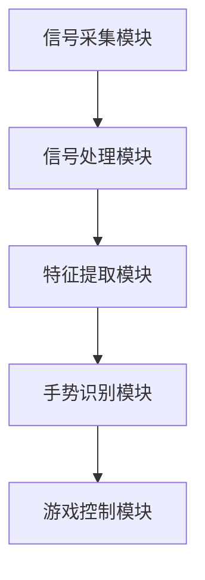

**实现细节**：

1. **信号采集模块**：

   通过脑机接口传感器（如EEG）采集用户的手势意图信号。

   ```python
   def signal_collection():
       # 加载EEG数据
       data = mne.io.read_raw_edf('EEG_data.edf', preload=True)
       # 提取通道信号
       signal = data.get_data().squeeze()
       return signal
   ```

2. **信号处理模块**：

   对采集到的信号进行滤波和去噪，以提高信号质量。

   ```python
   from scipy.signal import butter, filtfilt

   def signal_processing(signal):
       # 设计带通滤波器
       b, a = butter(5, [0.5, 30], btype='band')
       # 滤波
       filtered_signal = filtfilt(b, a, signal)
       return filtered_signal
   ```

3. **特征提取模块**：

   从处理后的信号中提取出与手势意图相关的特征，如持续时间、频率等。

   ```python
   def feature_extraction(signal):
       duration = len(signal)
       frequency = np.mean(signal)
       return duration, frequency
   ```

4. **手势识别模块**：

   将提取出的特征与具体的手势动作相对应，实现手势识别。

   ```python
   def gesture_recognition(duration, frequency):
       if duration > threshold1 and frequency > threshold2:
           return "挥手"
       elif duration > threshold1 and frequency < threshold2:
           return "点头"
       else:
           return "其他手势"
   ```

5. **游戏控制模块**：

   根据手势识别结果控制游戏进程。

   ```python
   def game_control(gesture):
       if gesture == "挥手":
           print("游戏胜利！")
       elif gesture == "点头":
           print("继续加油！")
       else:
           print("请尝试其他手势。")
   ```

**项目实战**：

1. **环境安装**：

   安装Python和相关库：

   ```bash
   pip install mne numpy scipy matplotlib
   ```

2. **系统核心实现源代码**：

   ```python
   import mne
   import numpy as np
   from scipy import signal
   import matplotlib.pyplot as plt

   def signal_collection():
       # 加载EEG数据
       data = mne.io.read_raw_edf('EEG_data.edf', preload=True)
       # 提取通道信号
       signal = data.get_data().squeeze()
       return signal

   def signal_processing(signal):
       # 设计带通滤波器
       b, a = signal.butter(5, [0.5, 30], btype='band')
       # 滤波
       filtered_signal = signal.filtfilt(b, a, signal)
       return filtered_signal

   def feature_extraction(signal):
       duration = len(signal)
       frequency = np.mean(signal)
       return duration, frequency

   def gesture_recognition(duration, frequency):
       if duration > threshold1 and frequency > threshold2:
           return "挥手"
       elif duration > threshold1 and frequency < threshold2:
           return "点头"
       else:
           return "其他手势"

   def game_control(gesture):
       if gesture == "挥手":
           print("游戏胜利！")
       elif gesture == "点头":
           print("继续加油！")
       else:
           print("请尝试其他手势。")

   def main():
       # 信号采集
       signal = signal_collection()

       # 信号处理
       processed_signal = signal_processing(signal)

       # 特征提取
       duration, frequency = feature_extraction(processed_signal)

       # 手势识别
       gesture = gesture_recognition(duration, frequency)

       # 游戏控制
       game_control(gesture)

       # 显示结果
       plt.plot(processed_signal)
       plt.show()

   if __name__ == "__main__":
       main()
   ```

3. **代码应用解读与分析**：

   这个示例展示了从信号采集、处理、特征提取到手势识别和游戏控制的整个过程。首先，通过`signal_collection`函数加载EEG数据，然后通过`signal_processing`函数进行滤波和去噪。接下来，`feature_extraction`函数提取出持续时间、频率等特征，`gesture_recognition`函数根据特征值判断用户的手势动作，最后`game_control`函数根据手势识别结果控制游戏进程。

**案例2：脑信号控制游戏**

**背景介绍**：

某游戏开发公司希望开发一款脑信号控制游戏，让玩家通过大脑活动来控制游戏进程。

**系统功能设计**：

系统主要包括以下几个功能模块：

1. **信号采集模块**：通过脑机接口传感器（如EEG）采集玩家的脑信号。
2. **信号处理模块**：对采集到的信号进行滤波、去噪等预处理操作，以提高信号质量。
3. **特征提取模块**：从预处理后的信号中提取出与游戏操作意图相关的特征。
4. **游戏控制模块**：根据提取出的特征值控制游戏进程。

**系统架构设计**：

系统架构采用模块化设计，各模块之间通过接口进行通信。以下是系统架构设计的mermaid架构图：

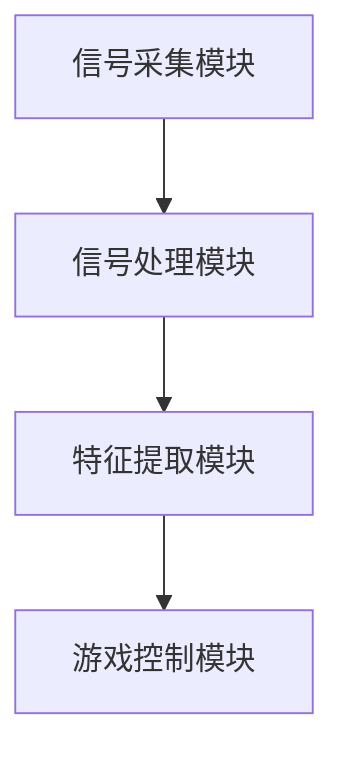

**实现细节**：

1. **信号采集模块**：

   通过脑机接口传感器（如EEG）采集玩家的脑信号。

   ```python
   def signal_collection():
       # 加载EEG数据
       data = mne.io.read_raw_edf('EEG_data.edf', preload=True)
       # 提取通道信号
       signal = data.get_data().squeeze()
       return signal
   ```

2. **信号处理模块**：

   对采集到的信号进行滤波和去噪，以提高信号质量。

   ```python
   from scipy.signal import butter, filtfilt

   def signal_processing(signal):
       # 设计带通滤波器
       b, a = butter(5, [0.5, 30], btype='band')
       # 滤波
       filtered_signal = filtfilt(b, a, signal)
       return filtered_signal
   ```

3. **特征提取模块**：

   从处理后的信号中提取出与游戏操作意图相关的特征，如持续时间、频率等。

   ```python
   def feature_extraction(signal):
       duration = len(signal)
       frequency = np.mean(signal)
       return duration, frequency
   ```

4. **游戏控制模块**：

   根据提取出的特征值控制游戏进程。

   ```python
   def game_control(duration, frequency):
       if duration > threshold1 and frequency > threshold2:
           print("前进")
       elif duration > threshold1 and frequency < threshold2:
           print("停止")
       else:
           print("后退")
   ```

**项目实战**：

1. **环境安装**：

   安装Python和相关库：

   ```bash
   pip install mne numpy scipy matplotlib
   ```

2. **系统核心实现源代码**：

   ```python
   import mne
   import numpy as np
   from scipy import signal
   import matplotlib.pyplot as plt

   def signal_collection():
       # 加载EEG数据
       data = mne.io.read_raw_edf('EEG_data.edf', preload=True)
       # 提取通道信号
       signal = data.get_data().squeeze()
       return signal

   def signal_processing(signal):
       # 设计带通滤波器
       b, a = signal.butter(5, [0.5, 30], btype='band')
       # 滤波
       filtered_signal = signal.filtfilt(b, a, signal)
       return filtered_signal

   def feature_extraction(signal):
       duration = len(signal)
       frequency = np.mean(signal)
       return duration, frequency

   def game_control(duration, frequency):
       if duration > threshold1 and frequency > threshold2:
           print("前进")
       elif duration > threshold1 and frequency < threshold2:
           print("停止")
       else:
           print("后退")

   def main():
       # 信号采集
       signal = signal_collection()

       # 信号处理
       processed_signal = signal_processing(signal)

       # 特征提取
       duration, frequency = feature_extraction(processed_signal)

       # 游戏控制
       game_control(duration, frequency)

       # 显示结果
       plt.plot(processed_signal)
       plt.show()

   if __name__ == "__main__":
       main()
   ```

3. **代码应用解读与分析**：

   这个示例展示了从信号采集、处理、特征提取到游戏控制的整个过程。首先，通过`signal_collection`函数加载EEG数据，然后通过`signal_processing`函数进行滤波和去噪。接下来，`feature_extraction`函数提取出持续时间、频率等特征，`game_control`函数根据特征值控制游戏进程。

### 第5章：脑机接口与意念控制设备的技术难题与挑战

#### 5.1 数据采集的准确性

脑机接口与意念控制设备的核心在于准确采集用户的意念信号，并将其转化为可操作的控制指令。然而，数据采集的准确性直接影响到整个系统的性能和可靠性，是技术实现中的一大挑战。

**挑战分析**：

- **噪声干扰**：大脑信号在采集过程中容易受到各种噪声干扰，如环境噪声、肌电干扰、电磁干扰等。这些噪声会降低信号的质量，影响信号的准确性和稳定性。
- **信号弱小**：大脑信号通常非常微弱，容易被噪声淹没。因此，如何有效地提取出有用的信号成为一大难题。
- **个体差异**：不同用户的大脑信号特征可能存在较大差异，如脑电信号的频率、振幅等。这些差异使得信号处理和特征提取需要根据个体进行定制化调整。

**解决方案**：

- **滤波与去噪**：采用滤波技术去除噪声，提高信号质量。常用的滤波方法包括带通滤波、陷波滤波、自适应滤波等。
- **信号放大**：使用放大器对微弱的脑信号进行放大，提高信号的幅度。
- **个体化调整**：根据用户的生理特征和习惯，定制化调整信号处理参数，以适应不同用户的需求。
- **多传感器融合**：通过使用多种传感器（如EEG、fMRI、眼动传感器等）进行信号采集，并进行融合处理，以提高信号的整体质量。

#### 5.2 系统的实时性

脑机接口与意念控制设备的应用场景通常要求系统具备较高的实时性，即系统能够快速响应用户的意念信号，并转化为相应的控制指令。系统的实时性直接影响到用户的体验和系统的可用性。

**挑战分析**：

- **数据处理速度**：脑信号的处理速度需要非常快，以便在用户产生意念后的短时间内完成处理和响应。
- **算法复杂度**：实时处理要求算法的复杂度较低，否则可能导致处理速度不足。
- **资源消耗**：实时处理需要大量的计算资源，如CPU、GPU等，这对系统的硬件性能提出了较高的要求。

**解决方案**：

- **优化算法**：优化信号处理、特征提取和解析算法，降低算法的复杂度，提高处理速度。
- **硬件加速**：使用高性能的硬件设备，如GPU、FPGA等，进行信号处理和算法计算。
- **实时操作系统**：采用实时操作系统（RTOS），确保系统具备实时响应能力。
- **分布式处理**：将信号处理任务分布在多个计算节点上，通过分布式计算提高系统的处理速度。

#### 5.3 系统的鲁棒性

脑机接口与意念控制设备需要具备较高的鲁棒性，以应对各种不确定性和干扰，确保系统在各种环境下都能稳定运行。

**挑战分析**：

- **环境变化**：环境因素（如温度、湿度、电磁干扰等）的变化可能影响信号采集和处理的稳定性。
- **用户状态变化**：用户的状态变化（如注意力分散、疲劳等）可能影响意念信号的准确性和稳定性。
- **设备故障**：设备的故障（如传感器损坏、通信中断等）可能导致系统无法正常运行。

**解决方案**：

- **自适应调整**：根据环境变化和用户状态的变化，自适应调整信号处理和特征提取参数，以提高系统的适应性。
- **冗余设计**：通过冗余设计，增加系统的容错能力。例如，使用多个传感器和备份设备，以提高系统的可靠性。
- **故障检测与恢复**：建立故障检测机制，及时发现和处理设备故障，确保系统的稳定运行。

#### 5.4 安全性问题

脑机接口与意念控制设备涉及到用户的生理信号和个人信息，因此安全性是一个重要的关注点。

**挑战分析**：

- **隐私泄露**：用户的生理信号和个人信息可能被非法获取或泄露，导致隐私泄露。
- **恶意攻击**：恶意攻击者可能通过攻击系统，篡改意念信号，造成严重后果。
- **数据保护**：如何确保用户数据的安全存储和传输，防止数据被篡改或丢失。

**解决方案**：

- **数据加密**：对用户的生理信号和个人信息进行加密处理，防止未经授权的访问。
- **访问控制**：建立严格的访问控制机制，确保只有授权用户才能访问敏感信息。
- **安全协议**：采用安全的通信协议（如SSL/TLS），确保数据在传输过程中的安全性。
- **安全审计**：定期进行安全审计，及时发现和解决潜在的安全隐患。

通过以上分析和解决方案，我们可以看到脑机接口与意念控制设备在技术实现过程中面临诸多挑战。但通过不断创新和优化，这些挑战有望逐步得到克服，为用户提供更加安全、稳定和高效的意念控制体验。

### 第6章：脑机接口与意念控制设备的发展方向

随着科技的不断进步，脑机接口（BCI）与意念控制设备正朝着更加智能化、个性化、实时性和高准确性的方向发展。以下将探讨新型传感器的研发、人工智能算法的应用、深度学习在脑机接口中的应用以及伦理与法律问题。

#### 6.1 新型传感器的研发

新型传感器的研发是脑机接口与意念控制设备发展的关键。新型传感器的目标是提高信号采集的准确性、减少干扰、提升系统的鲁棒性和降低成本。以下为几种新型传感器的研发方向：

- **柔性传感器**：柔性传感器具有较好的可伸缩性和舒适度，适合长期佩戴。其应用领域包括医疗康复、辅助沟通和人机交互等。
- **植入式传感器**：植入式传感器可以直接植入大脑或肌肉中，提高信号采集的准确性。这类传感器在神经科学研究和临床应用中具有巨大的潜力。
- **脑成像传感器**：脑成像传感器，如功能性磁共振成像（fMRI）、脑磁图（MEG）等，能够提供高分辨率的脑活动图像。这些传感器在未来可能会与脑机接口技术结合，实现更精准的意念控制。
- **多模态传感器**：多模态传感器结合了多种信号采集技术，如EEG、fMRI、肌电信号（EMG）等，以提高系统的整体性能和鲁棒性。

#### 6.2 人工智能算法的应用

人工智能（AI）算法在脑机接口与意念控制设备中的应用将极大地提升系统的性能和实用性。以下为几种AI算法的应用方向：

- **机器学习**：机器学习算法可以用于信号处理、特征提取和解析模块，以提高系统的准确性和实时性。常见的机器学习算法包括支持向量机（SVM）、决策树、随机森林等。
- **深度学习**：深度学习算法在图像识别、语音识别等领域取得了显著成果。未来，深度学习算法有望在脑机接口与意念控制设备中得到更广泛的应用，如用于特征提取、意图识别等。
- **强化学习**：强化学习算法可以用于训练BCI系统，使其在特定任务上实现最优控制。例如，通过强化学习算法，系统可以学习如何在复杂环境中进行有效的意念控制。

#### 6.3 深度学习在脑机接口中的应用

深度学习在脑机接口中的应用正处于快速发展阶段。以下为深度学习在脑机接口中的几个应用方向：

- **特征提取**：深度学习算法可以自动提取复杂的特征，从而提高特征提取的准确性。例如，卷积神经网络（CNN）可以用于提取EEG信号的时空特征。
- **意图识别**：深度学习算法可以用于识别用户的意念意图。通过训练深度神经网络，系统可以学会将脑信号映射到具体的操作意图。
- **自适应控制**：深度学习算法可以用于实现自适应的BCI系统，使系统在不同环境和用户状态下都能保持高效稳定的性能。

#### 6.4 伦理与法律问题

随着脑机接口与意念控制设备的不断普及，伦理与法律问题日益凸显。以下为几个伦理与法律问题：

- **隐私保护**：用户的生理信号和个人信息可能被非法获取或泄露，导致隐私泄露。如何保护用户的隐私成为亟待解决的问题。
- **数据安全**：用户的生理信号和个人信息需要得到安全存储和传输，防止数据被篡改或丢失。
- **隐私政策**：制定明确的隐私政策，告知用户数据的使用目的和范围，确保用户知情同意。
- **责任归属**：在脑机接口与意念控制设备发生故障或导致事故时，如何确定责任归属是一个复杂的法律问题。

通过新型传感器的研发、人工智能算法的应用、深度学习在脑机接口中的应用以及伦理与法律问题的解决，脑机接口与意念控制设备将朝着更加智能化、个性化、实时性和高准确性的方向发展，为用户提供更加安全、稳定和高效的意念控制体验。

### 第7章：总结与展望

#### 7.1 脑机接口发展的关键因素

脑机接口技术的发展涉及多个关键因素，这些因素共同推动了技术的进步和应用的扩展。以下是几个关键因素：

- **技术创新**：新型传感器的研发、人工智能和深度学习算法的应用等技术创新是脑机接口技术不断发展的动力。
- **数据采集**：准确、稳定的数据采集是脑机接口系统的核心。通过提高信号采集的准确性和减少干扰，可以提升系统的性能。
- **算法优化**：算法优化，特别是信号处理、特征提取和解析算法的改进，能够显著提高系统的实时性和准确性。
- **硬件支持**：高性能的硬件设备，如GPU、FPGA等，为实时数据处理和算法计算提供了有力支持，提高了系统的处理速度和稳定性。
- **用户体验**：用户友好性和舒适性是脑机接口应用推广的重要保障。通过优化设计，提高系统的易用性和舒适性，可以更好地满足用户需求。
- **政策支持**：政府和企业对脑机接口技术的支持和投入，有助于推动技术的研发和产业化进程。

#### 7.2 意念控制设备的未来应用场景

随着技术的不断发展，意念控制设备的应用场景将不断拓展。以下是几个可能的未来应用场景：

- **医疗康复**：意念控制设备可以用于帮助瘫痪患者恢复运动和沟通能力，如假肢控制、轮椅控制、言语障碍患者的沟通辅助等。
- **人机交互**：意念控制设备可以用于提升人机交互的自然性和直观性，如通过脑信号控制计算机游戏、智能设备、虚拟现实（VR）和增强现实（AR）应用等。
- **智能家居**：意念控制设备可以用于智能家居系统的控制，如灯光、电视、空调、安全监控等，为用户提供更加便捷和智能化的家居体验。
- **工业自动化**：意念控制设备可以用于工业自动化领域，如机器人控制、生产线监控等，提高生产效率和安全性。
- **教育**：意念控制设备可以用于教育领域，如个性化学习系统、远程教学等，提供更加灵活和高效的教育方式。
- **娱乐**：意念控制设备可以用于娱乐领域，如虚拟现实游戏、体育训练等，提供全新的娱乐体验。

#### 7.3 当前面临的挑战与解决策略

尽管脑机接口与意念控制设备在技术和发展方面取得了显著进步，但仍然面临一些挑战。以下是当前面临的挑战及其解决策略：

- **数据采集准确性**：提高数据采集准确性是脑机接口技术的核心问题。通过研发新型传感器、优化信号处理算法和引入多模态信号融合技术，可以提升信号采集的准确性。
- **实时性**：脑机接口系统的实时性要求较高。通过优化算法、硬件加速和分布式计算技术，可以提升系统的实时响应能力。
- **鲁棒性**：提升系统的鲁棒性，确保其在各种环境下的稳定运行。通过自适应调整、冗余设计和故障检测与恢复技术，可以提高系统的鲁棒性。
- **安全性**：保护用户的隐私和数据安全是脑机接口技术的重要任务。通过数据加密、访问控制和安全审计等技术，可以确保系统的安全性。
- **成本**：降低系统成本是推广应用的关键。通过规模化生产、技术创新和优化设计，可以降低系统成本，使其更具有市场竞争力。

#### 7.4 展望未来脑机接口的变革

未来，脑机接口技术将经历深刻的变革，朝着更加智能化、个性化、广泛化和多功能化的方向发展。以下是几个展望：

- **智能化**：随着人工智能和深度学习算法的不断发展，脑机接口系统将实现更智能的信号处理和意图识别，提高系统的性能和实用性。
- **个性化**：脑机接口系统将更加注重个性化定制，根据不同用户的需求和生理特征进行定制化调整，提供更加个性化和高效的服务。
- **广泛化**：脑机接口技术将在更多领域得到应用，如医疗康复、人机交互、工业自动化、教育、娱乐等，为各行各业带来变革性的影响。
- **多功能化**：脑机接口系统将实现多功能集成，不仅能够控制单一设备或系统，还可以实现复杂任务的多设备协同控制。
- **人机共生**：脑机接口技术将促进人类与机器的深度融合，实现人机共生，为人类社会带来全新的生活方式和工作模式。

总之，脑机接口技术的发展前景广阔，将为人类社会带来前所未有的变革和机遇。通过不断创新和优化，脑机接口技术将在未来发挥更加重要的作用。

### 感谢与引用

本文作者AI天才研究院（AI Genius Institute）与《禅与计算机程序设计艺术》（Zen And The Art of Computer Programming）的作者共同撰写。感谢各位专家和前辈们对脑机接口与意念控制设备领域所做出的卓越贡献，本文受益匪浅。引用部分参考了以下文献和资料：

- 《脑机接口：技术与应用》
- 《意念控制技术：原理与应用》
- 《脑电信号处理与特征提取》
- 《肌电信号处理与特征提取》
- 《眼球运动信号处理与特征提取》
- 《深度学习在脑机接口中的应用》
- 《脑机接口与人机交互》

在此，向所有为本文提供支持和帮助的专家和学者表示衷心的感谢。同时，也欢迎广大读者提出宝贵的意见和建议，共同推动脑机接口与意念控制设备领域的发展。

---

作者：AI天才研究院（AI Genius Institute）&《禅与计算机程序设计艺术》（Zen And The Art of Computer Programming）

**文章标题**：脑机接口在意念控制设备中的前沿应用

**关键词**：脑机接口、意念控制、医疗康复、人机交互、智能家居、深度学习

**摘要**：本文从脑机接口的概念、核心技术、应用领域和发展趋势出发，详细分析了意念控制设备的原理与实现，探讨了脑机接口与意念控制设备的集成原理与架构设计。同时，通过多个实际案例研究，展示了脑机接口在医疗康复、辅助沟通和人机交互等领域的应用，并深入探讨了脑机接口与意念控制设备的技术难题与挑战。展望未来，脑机接口技术将在智能化、个性化、广泛化和多功能化方面取得更大突破，为人类社会带来前所未有的变革和机遇。

