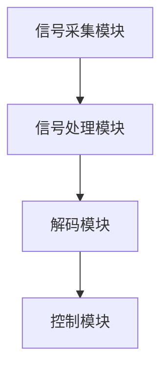

                 

### 文章标题：脑机接口在残障辅助中的应用进展

#### 关键词：脑机接口、残障辅助、应用进展、技术原理、未来展望

#### 摘要：
本文将深入探讨脑机接口（Brain-Computer Interface, BCI）技术在残障辅助领域中的应用进展。我们将首先介绍脑机接口的基本概念、工作原理以及技术分类，然后详细分析其在残障辅助中的实际应用案例，最后对未来的发展趋势和面临的挑战进行展望。通过本文，读者将全面了解脑机接口技术在残障辅助领域的最新动态和前沿研究。

#### 目录：

----------------------------------------------------------------

# 第一部分：脑机接口基础

## 1.1 脑机接口的定义与历史
### 1.1.1 脑机接口的基本概念
### 1.1.2 脑机接口的发展历程

## 1.2 脑机接口的工作原理
### 1.2.1 脑信号检测与处理
### 1.2.2 脑机接口信号解码与控制

## 1.3 脑机接口技术的分类
### 1.3.1 侵入式与非侵入式脑机接口
### 1.3.2 脑成像技术

## 1.4 脑机接口的技术挑战与趋势
### 1.4.1 技术挑战
### 1.4.2 发展趋势

## 1.5 本章小结

----------------------------------------------------------------

## 1.1 脑机接口的定义与历史

### 1.1.1 脑机接口的基本概念

脑机接口（Brain-Computer Interface，简称BCI）是一种直接连接人脑与外部设备的技术，它允许使用者通过大脑活动来控制外部设备，从而实现与外界的交流和控制。这种技术利用了人脑产生的电信号，通过特定的传感器和算法将大脑活动转化为可以理解的信息，进而驱动外部设备执行特定任务。

BCI技术的发展可以追溯到20世纪60年代，当时主要研究如何利用大脑的电信号来控制简单的电子设备。随着神经科学、信号处理和计算机技术的不断发展，BCI技术逐渐成熟，并开始应用于各种领域，包括医疗康复、游戏控制、虚拟现实等。其中，在残障辅助领域，BCI技术的应用尤为突出，为许多残障人士提供了新的希望和可能。

### 1.1.2 脑机接口的发展历程

脑机接口的发展历程可以分为以下几个阶段：

1. **初始阶段（1960s-1980s）**：
   这一阶段的研究主要集中在如何记录和解析大脑的电信号。最早的BCI系统主要使用脑电图（EEG）来捕捉大脑信号，并通过简单的算法将这些信号转换为控制信号。这一时期的BCI技术主要应用于科研和实验室环境。

2. **成熟阶段（1990s-2000s）**：
   随着计算机技术和信号处理算法的发展，BCI技术逐渐成熟。研究人员开始尝试将BCI技术应用于实际场景，如康复治疗、辅助交流等。同时，脑成像技术（如功能性磁共振成像fMRI和近红外光谱成像NIRS）的引入，使得BCI信号的检测和处理更加精确。

3. **扩展阶段（2010s至今）**：
   在这一阶段，BCI技术得到了更广泛的应用。不仅传统的侵入式BCI技术得到了进一步的发展，非侵入式BCI技术也取得了显著进展。此外，BCI技术在残障辅助、智能家居、人机交互等多个领域都展现出了巨大的潜力。

通过以上历程，我们可以看到BCI技术从最初的理论研究到现在的广泛应用，经历了漫长的发展过程。每一个阶段都为BCI技术的进步打下了坚实的基础，也为未来的发展提供了新的可能性。

### 1.2 脑机接口的工作原理

脑机接口（BCI）的工作原理主要涉及脑信号的检测、处理和解码。通过以下步骤，我们可以详细了解BCI技术的基本工作流程：

#### 1.2.1 脑信号的检测

脑信号的检测是BCI系统的第一步。大脑活动会产生各种类型的电信号，如脑电波（EEG）、肌电信号（EMG）和眼电信号（EOG）等。其中，脑电波是最常用的信号类型，因为它可以直接反映大脑的活动状态。

检测脑电信号通常使用脑电图（EEG）设备。EEG设备通过放置在头皮上的电极来捕捉脑电波。这些电极可以捕捉到微弱的电信号，并通过放大和处理，将信号转化为数字数据。以下是一个典型的EEG检测过程：

1. **电极安装**：在测试前，需要将电极贴在头皮上。电极通常放置在特定的位置，以捕捉到最清晰的大脑信号。
2. **信号放大**：由于脑电信号非常微弱，通常需要经过放大处理，以获得更清晰的信号。
3. **信号过滤**：为了去除噪声和干扰信号，需要对脑电信号进行滤波处理。滤波器可以去除低频干扰（如心跳和肌肉活动）和高频噪声。
4. **信号数字化**：将模拟信号转换为数字信号，以便后续处理和分析。

通过这些步骤，我们可以得到一个干净的、数字化的脑电信号，这是后续处理的基础。

#### 1.2.2 脑信号的处理

脑信号的检测只是BCI系统的第一步，接下来的处理过程同样关键。脑信号的处理主要包括信号去噪、特征提取和滤波等步骤。

1. **去噪**：脑电信号中通常包含大量的噪声，这些噪声可能会影响信号的分析和解释。因此，去噪是处理脑信号的一个重要步骤。常用的去噪方法包括带通滤波、独立成分分析（ICA）和波束形成（Beamforming）等。

2. **特征提取**：在去噪后，我们需要从原始信号中提取出有用的特征信息。这些特征可以用于后续的信号解码和控制。常用的特征提取方法包括时域特征（如波形周期、振幅等）和频域特征（如功率谱、频率成分等）。

3. **滤波**：滤波是处理脑信号的一个常用步骤，它可以去除不需要的频率成分，保留有用的信号。例如，带通滤波器可以保留特定频率范围内的信号，而抑制其他频率的信号。

通过这些处理步骤，我们可以得到一个更加干净、特征清晰的脑信号，这为后续的信号解码和控制打下了基础。

#### 1.2.3 脑信号的解码与控制

脑信号的解码是BCI系统的核心步骤。通过解码，我们可以将脑信号转化为具体的操作指令，从而控制外部设备。以下是解码过程的几个关键步骤：

1. **分类器设计**：分类器是解码过程中的关键组件。它通过学习脑信号的特征，将脑信号分类为不同的操作指令。常用的分类器方法包括支持向量机（SVM）、决策树、神经网络等。

2. **实时解码**：在实际应用中，BCI系统需要实时解码脑信号，以便快速响应用户的操作指令。这通常需要高效的算法和快速的计算能力。

3. **控制执行**：解码出的操作指令将传递给外部设备，如电脑、机器人或辅助设备。这些设备将根据指令执行相应的操作。

通过以上步骤，我们可以将脑信号有效地解码为具体的操作指令，从而实现与外部设备的交互。这个过程不仅依赖于先进的信号处理算法，还需要高效的计算资源和精确的设备控制。

### 1.3 脑机接口技术的分类

脑机接口（BCI）技术根据其工作方式和应用场景可以分为多种类型。以下是几种主要的分类方式：

#### 1.3.1 侵入式与非侵入式脑机接口

**侵入式脑机接口**：
侵入式脑机接口（Invasive BCI）是指直接将电极植入大脑皮层或脑脊液中，以捕捉和记录脑信号。这种方法的优点是信号质量高，噪声小，可以捕捉到更详细的脑活动信息。侵入式BCI通常用于科研和实验室环境，例如神经科学研究、脑损伤康复等。

侵入式脑机接口的工作原理主要包括以下几个步骤：

1. **电极植入**：医生将电极植入到特定的大脑区域，通常是通过开颅手术。
2. **信号记录**：电极通过导线连接到记录设备，实时捕捉大脑信号。
3. **信号处理**：记录到的信号经过放大、滤波和数字化处理，以便后续分析。

**非侵入式脑机接口**：
非侵入式脑机接口（Non-Invasive BCI）不涉及任何侵入性操作，通常使用头皮电极来记录脑电波（EEG）或其他类型的脑信号。这种方法安全、无创，适用于广泛的应用场景，如医疗康复、游戏控制、智能家居等。

非侵入式脑机接口的工作原理主要包括以下几个步骤：

1. **电极放置**：在测试前，将电极贴在头皮上，通常放置在特定的位置以捕捉到最清晰的脑电信号。
2. **信号记录**：电极通过导线连接到记录设备，实时捕捉脑电波信号。
3. **信号处理**：记录到的信号经过放大、滤波和数字化处理，以便后续分析。

#### 1.3.2 脑成像技术

脑成像技术（如功能性磁共振成像fMRI和近红外光谱成像NIRS）也是一种重要的脑机接口技术。这些技术通过无创的方式捕捉大脑活动的图像，从而提供脑信号的信息。

**功能性磁共振成像（fMRI）**：
fMRI通过测量大脑血氧水平的改变来检测脑活动。当大脑活动增加时，局部血流和氧气消耗也会增加，这些变化可以通过磁共振成像技术检测到。

fMRI的工作原理主要包括以下几个步骤：

1. **图像采集**：受试者躺在磁共振成像设备中，设备通过磁场和无线电波产生图像。
2. **信号分析**：采集到的图像经过分析，以确定大脑活动的区域和程度。

**近红外光谱成像（NIRS）**：
NIRS通过测量近红外光在大脑组织中的吸收和散射来检测脑活动。这种技术无需磁场和放射性物质，因此非常安全和无创。

NIRS的工作原理主要包括以下几个步骤：

1. **光源照射**：光源（通常是近红外激光）照射到大脑表面。
2. **信号检测**：照射的光通过大脑组织后，部分被吸收和散射。探测器测量通过大脑组织的散射光，从而确定脑活动的情况。

### 1.4 脑机接口的技术挑战与趋势

尽管脑机接口（BCI）技术在残障辅助领域展现出了巨大的潜力，但其发展仍面临诸多挑战。以下是一些主要的技术挑战和发展趋势：

#### 1.4.1 技术挑战

1. **信号噪声比**：脑信号通常非常微弱，且容易受到外部噪声的干扰。提高信号噪声比是BCI技术的一大挑战，需要高效的信号处理和去噪算法。

2. **解码精度**：BCI系统的解码精度直接影响其应用效果。提高解码精度需要先进的算法和大量数据训练。

3. **设备便携性和舒适性**：侵入式BCI设备需要手术植入，而非侵入式设备则需要佩戴，这要求设备具有更高的便携性和舒适性。

4. **能量消耗**：BCI系统通常需要大量计算资源，这导致高能量消耗。开发低功耗的BCI设备是未来的一个重要方向。

5. **用户界面**：用户界面设计直接影响BCI系统的易用性和用户体验。设计直观、易于操作的用户界面是提高用户接受度的关键。

#### 1.4.2 发展趋势

1. **人工智能与机器学习**：人工智能和机器学习技术的发展为BCI系统提供了更强大的解码能力和自适应能力。通过大数据训练和深度学习算法，BCI系统可以实现更高的解码精度和更广泛的应用场景。

2. **脑成像技术的进步**：随着脑成像技术的不断进步，如fMRI和NIRS等，BCI系统可以捕捉到更详细的脑活动信息，从而提高其应用效果。

3. **新型材料与传感器**：新型材料（如柔性、可穿戴材料）和传感器技术的发展为BCI设备的便携性和舒适性提供了更好的解决方案。

4. **跨学科合作**：BCI技术的发展需要跨学科的合作，包括神经科学、计算机科学、医学工程等领域。通过多学科的合作，可以推动BCI技术的全面发展。

### 1.5 本章小结

本章介绍了脑机接口（BCI）的基本概念、工作原理和分类，并分析了其面临的技术挑战和发展趋势。通过本章的学习，读者可以全面了解BCI技术的基本知识，为后续章节的深入探讨打下基础。

----------------------------------------------------------------

# 第二部分：残障辅助中的应用

## 2.1 脑机接口在残障辅助中的重要性
### 2.1.1 残障人士的需求
### 2.1.2 脑机接口的应用前景

## 2.2 脑机接口在残障辅助中的应用案例
### 2.2.1 上肢瘫痪患者的康复治疗
### 2.2.2 下肢瘫痪患者的行走辅助
### 2.2.3 听力障碍患者的听力辅助

## 2.3 脑机接口在残障辅助中的技术创新
### 2.3.1 脑信号解码技术的进展
### 2.3.2 新型脑机接口设备的开发

## 2.4 残障辅助脑机接口系统设计
### 2.4.1 系统架构设计
### 2.4.2 系统性能评估

## 2.5 本章小结

----------------------------------------------------------------

## 2.1 脑机接口在残障辅助中的重要性

脑机接口（Brain-Computer Interface，简称BCI）技术在残障辅助领域的重要性日益凸显。残障人士在面对生活、工作和社交活动时，往往需要更多的支持和帮助。而脑机接口技术通过直接利用大脑信号，为残障人士提供了一种全新的辅助手段，大大提高了他们的生活质量和独立性。

### 2.1.1 残障人士的需求

残障人士的需求多种多样，主要包括：

1. **肢体瘫痪**：许多残障人士由于脑部或脊髓损伤导致肢体瘫痪，无法自主移动或操作外部设备。
2. **听力障碍**：部分残障人士由于先天或后天原因导致听力障碍，影响日常生活和交流。
3. **视力障碍**：视力障碍者需要辅助设备来获取和处理视觉信息。
4. **认知障碍**：认知障碍者可能需要辅助设备来帮助记忆、计算或执行复杂的任务。

这些需求为脑机接口技术在残障辅助中的应用提供了广阔的空间。

### 2.1.2 脑机接口的应用前景

脑机接口技术在残障辅助中的应用前景非常广阔，主要体现在以下几个方面：

1. **康复治疗**：脑机接口可以帮助瘫痪患者通过大脑活动控制外部设备，如假肢或轮椅，从而实现自主移动和操作。
2. **辅助交流**：对于听力障碍和视力障碍者，脑机接口可以通过脑信号解码技术实现语音合成或视觉信息处理，帮助他们与外界进行交流。
3. **智能家居**：脑机接口可以用于控制智能家居设备，如灯光、窗帘、家电等，提高残障人士的生活质量。
4. **教育辅助**：脑机接口可以帮助认知障碍者进行记忆训练、计算练习等，提高他们的认知能力。

通过上述应用，脑机接口技术不仅为残障人士提供了新的辅助手段，也大大提升了他们的生活质量和幸福感。

### 2.2 脑机接口在残障辅助中的应用案例

脑机接口技术在残障辅助领域已有多个成功的应用案例，以下是其中几个典型的例子：

#### 2.2.1 上肢瘫痪患者的康复治疗

上肢瘫痪是许多残障人士面临的重要问题。通过脑机接口技术，他们可以借助假肢或外骨骼设备实现自主移动和操作。以下是一个具体的案例：

**案例**：一位因脑部损伤导致上肢瘫痪的患者，通过植入式电极记录大脑活动。这些电极捕捉到患者的运动意图，并通过解码算法转化为控制信号。这些控制信号被发送到外骨骼设备，使患者能够自主移动手臂和手指。

**技术原理**：
1. **电极植入**：医生将电极植入患者大脑中的运动皮层，以捕捉运动意图信号。
2. **信号处理**：捕捉到的信号经过处理和解码，转化为具体的控制指令。
3. **外骨骼控制**：解码出的控制指令被发送到外骨骼设备，使其根据指令执行相应的动作。

**效果**：通过脑机接口技术，患者可以自主控制外骨骼设备，实现手臂和手指的移动，大大提高了生活质量。

#### 2.2.2 下肢瘫痪患者的行走辅助

下肢瘫痪患者往往需要借助轮椅或辅助设备进行移动。脑机接口技术为这些患者提供了一种新的行走辅助方法。以下是一个具体的案例：

**案例**：一位下肢瘫痪的患者通过脑机接口技术控制一个名为“智能行走辅助器”（Smart Walk Assistive Device）的设备。这个设备通过患者的脑信号解码实现行走和停止的控制。

**技术原理**：
1. **脑信号检测**：在患者头上放置电极，实时捕捉脑信号。
2. **信号处理**：通过信号处理算法，将脑信号解码为行走和停止的指令。
3. **设备控制**：解码出的指令被发送到智能行走辅助器，使其根据指令执行相应的动作。

**效果**：通过脑机接口技术，患者可以自主控制行走辅助器，实现独立行走，显著提高了生活质量和独立性。

#### 2.2.3 听力障碍患者的听力辅助

听力障碍患者可以通过脑机接口技术实现听力辅助，如语音合成和声音识别。以下是一个具体的案例：

**案例**：一位患有重度听力障碍的患者，通过脑机接口技术实现了语音合成功能。该技术利用患者的大脑活动解码语音信号，并将其转换为可听见的语音。

**技术原理**：
1. **脑信号检测**：通过电极捕捉患者大脑中的语音信号。
2. **信号处理**：将捕捉到的语音信号进行解码和处理，生成可听见的语音。
3. **声音输出**：解码出的语音信号通过扬声器输出，使患者能够听到。

**效果**：通过脑机接口技术，患者可以听到他人说话，显著提高了交流能力和生活质量。

#### 2.2.4 视力障碍患者的视觉辅助

视力障碍患者可以通过脑机接口技术实现视觉信息的获取和处理，如图像识别和虚拟现实。以下是一个具体的案例：

**案例**：一位盲人患者通过脑机接口技术实现了图像识别功能。该技术利用患者的大脑活动解码图像信息，并将其转换为可感知的视觉信息。

**技术原理**：
1. **脑信号检测**：通过电极捕捉患者大脑中的图像信号。
2. **信号处理**：将捕捉到的图像信号进行解码和处理，生成可感知的视觉信息。
3. **信息输出**：解码出的视觉信息通过触觉反馈设备（如触觉手套）或虚拟现实设备输出，使患者能够“看到”周围环境。

**效果**：通过脑机接口技术，患者可以感知到周围的环境信息，显著提高了生活质量和独立性。

### 2.3 脑机接口在残障辅助中的技术创新

脑机接口技术在残障辅助领域不断取得创新进展，以下是一些关键技术创新：

#### 2.3.1 脑信号解码技术的进展

脑信号解码技术是脑机接口系统的核心，其性能直接影响应用效果。近年来，随着人工智能和机器学习技术的发展，脑信号解码技术取得了显著进展：

1. **深度学习算法**：深度学习算法在脑信号解码中表现出色，可以通过大量数据进行训练，提高解码精度。常用的深度学习模型包括卷积神经网络（CNN）和循环神经网络（RNN）。
2. **迁移学习**：迁移学习可以将其他领域的算法和模型应用于脑信号解码，提高解码效果。例如，将图像识别中的卷积神经网络应用于脑信号解码，取得了良好的效果。
3. **在线学习**：在线学习使BCI系统可以实时更新和优化解码算法，提高解码精度和适应性。

#### 2.3.2 新型脑机接口设备的开发

新型脑机接口设备的开发是推动残障辅助应用的关键。以下是一些新型设备的介绍：

1. **柔性电极**：柔性电极具有更好的舒适性和便携性，可以更自然地贴合皮肤，提高信号质量。例如，柔性脑电帽和柔性贴片电极都是新兴的设备。
2. **无线脑机接口**：无线脑机接口技术减少了导线和电极的束缚，提高了用户体验。例如，无线脑电帽和无线贴片电极都是无线设备的代表。
3. **脑-机融合设备**：脑-机融合设备结合了多种技术，如虚拟现实、增强现实和机器学习等，提供更加智能和高效的辅助功能。例如，脑-机融合轮椅和脑-机融合假肢都是新型设备。

#### 2.3.3 脑信号解码技术的应用实例

以下是一个应用实例，展示了脑信号解码技术在实际应用中的效果：

**应用实例**：一位下肢瘫痪患者通过脑机接口技术实现了自主行走。该技术利用患者的脑信号解码行走意图，并通过控制系统驱动下肢外骨骼设备，实现自主行走。

**技术原理**：
1. **脑信号检测**：通过电极捕捉患者大脑中的行走意图信号。
2. **信号处理**：通过深度学习算法解码行走意图信号，生成控制指令。
3. **设备控制**：解码出的控制指令被发送到下肢外骨骼设备，使其根据指令执行相应的动作。

**效果**：通过脑机接口技术，患者可以自主控制下肢外骨骼设备，实现独立行走，显著提高了生活质量。

### 2.4 残障辅助脑机接口系统设计

残障辅助脑机接口系统的设计需要综合考虑信号采集、处理、解码和控制等多个方面。以下是一个典型的系统设计示例：

#### 2.4.1 系统架构设计

**系统架构**：
1. **信号采集模块**：包括电极和信号放大器，用于捕捉大脑信号。
2. **信号处理模块**：包括滤波、去噪和特征提取等，用于处理和转换原始信号。
3. **解码模块**：包括分类器和解码算法，用于将处理后的信号解码为控制指令。
4. **控制模块**：包括控制系统和执行设备，用于接收解码指令并执行相应操作。

**架构图**：使用Mermaid语言绘制系统架构图，如下：

#### 2.4.2 系统性能评估

系统性能评估是确保脑机接口系统有效性和可靠性的关键。以下是一些常用的评估指标：

1. **解码精度**：解码精度是评估系统性能的重要指标，通常用准确率（Accuracy）或正确识别率（Correct Recognition Rate，CRR）表示。
2. **响应时间**：响应时间是指从信号采集到解码出控制指令所需的时间，对于实时应用尤为重要。
3. **稳定性**：稳定性是指系统在长时间运行中保持性能不变的能力，对于长期使用的设备至关重要。
4. **用户满意度**：用户满意度是通过用户调查和反馈来评估系统对用户的适用性和舒适度。

**性能评估方法**：可以使用实验和仿真方法对系统性能进行评估，如下：

1. **实验评估**：在真实环境中进行实验，测试系统的解码精度、响应时间和稳定性等性能指标。
2. **仿真评估**：使用仿真模型模拟系统运行，评估系统在各种条件下的性能表现。

### 2.5 本章小结

本章介绍了脑机接口技术在残障辅助中的应用重要性、应用案例、技术创新和系统设计。通过这些内容，读者可以了解脑机接口技术在残障辅助领域的广泛应用和未来发展潜力。

----------------------------------------------------------------

# 第三部分：应用进展与未来展望

## 3.1 脑机接口在残障辅助中的应用进展
### 3.1.1 技术进步
### 3.1.2 政策支持
### 3.1.3 实际应用案例

## 3.2 残障辅助脑机接口面临的挑战
### 3.2.1 技术挑战
### 3.2.2 法律与伦理问题

## 3.3 脑机接口在残障辅助中的未来展望
### 3.3.1 技术发展趋势
### 3.3.2 社会影响
### 3.3.3 未来前景

## 3.4 本章小结

----------------------------------------------------------------

## 3.1 脑机接口在残障辅助中的应用进展

脑机接口（Brain-Computer Interface，简称BCI）技术在残障辅助领域取得了显著的进展，不仅为残障人士提供了更多的辅助手段，还推动了相关技术的创新和发展。以下是近年来BCI在残障辅助中的一些重要进展：

### 3.1.1 技术进步

1. **信号采集与处理技术的提升**：随着脑成像技术和传感器技术的不断发展，BCI系统的信号采集和处理能力得到了显著提升。例如，功能性磁共振成像（fMRI）和近红外光谱成像（NIRS）等技术的应用，使得捕捉到的脑信号更加精确和可靠。

2. **解码算法的优化**：深度学习、机器学习和人工智能等技术的进步，使得BCI系统的解码算法得到了大幅优化。这些算法可以通过大量数据进行训练，提高解码精度和速度，从而更好地满足残障人士的需求。

3. **设备便携性与舒适性的提高**：新型材料和无线技术的应用，使得BCI设备的便携性和舒适性得到了显著提升。例如，柔性电极和无线脑电帽等设备的研发，使得用户可以更轻松地佩戴和使用BCI系统。

4. **多模态融合技术的应用**：多模态融合技术将不同的脑信号采集和处理技术相结合，提高了BCI系统的性能和可靠性。例如，将脑电图（EEG）与肌电图（EMG）相结合，可以更好地捕捉用户的运动意图。

### 3.1.2 政策支持

随着BCI技术在残障辅助领域的广泛应用，各国政府和相关组织纷纷出台了一系列政策和支持措施，以推动BCI技术的发展和应用。以下是一些典型的政策支持措施：

1. **科研资金支持**：许多国家和地区对BCI技术的科研项目提供了大量的资金支持，促进了相关技术的研发和创新。

2. **税收优惠**：为了鼓励企业和机构投资BCI技术的研发和应用，一些国家和地区提供了税收优惠政策。

3. **残疾人辅助设备补贴**：为了减轻残障人士的经济负担，一些国家和地区对BCI辅助设备提供了补贴或优惠措施。

4. **技术标准制定**：为了确保BCI技术的安全性和可靠性，各国政府和相关组织积极参与了BCI技术标准的制定和推广。

### 3.1.3 实际应用案例

BCI技术在残障辅助领域已有多个成功的实际应用案例，以下是其中几个典型的例子：

1. **康复治疗**：通过脑机接口技术，瘫痪患者可以借助假肢或外骨骼设备实现自主移动和操作。例如，美国公司BrainGate开发的脑机接口系统，通过植入大脑电极捕捉用户的运动意图，实现了对假肢的精准控制。

2. **辅助交流**：听力障碍和视力障碍者可以通过脑机接口技术实现听力辅助和视觉辅助。例如，美国的SoundBeam公司开发的脑机接口耳机，通过解码用户的大脑信号，实现了对声音的感知。

3. **智能家居**：脑机接口技术可以用于控制智能家居设备，如灯光、窗帘、家电等，提高残障人士的生活质量。例如，日本的BrainComputer公司开发的智能家居控制系统，通过用户的脑信号实现家电的远程控制。

4. **教育辅助**：脑机接口技术可以用于辅助教育，如记忆训练、计算练习等。例如，中国的北京科技大学开发的脑机接口教育系统，通过用户的脑信号实现了对学习内容的实时反馈和调整。

### 3.2 残障辅助脑机接口面临的挑战

尽管BCI技术在残障辅助领域取得了显著的进展，但其应用仍面临诸多挑战。以下是一些主要的挑战：

#### 3.2.1 技术挑战

1. **信号噪声比**：脑信号非常微弱，容易受到外部噪声的干扰。如何提高信号噪声比，是BCI技术发展的重要挑战。

2. **解码精度**：尽管解码算法不断优化，但解码精度仍需进一步提高，以满足不同残障人士的需求。

3. **设备便携性和舒适性**：目前的一些BCI设备体积较大、不便于携带，且长时间佩戴对用户身体造成一定负担。如何提高设备的便携性和舒适性，是亟待解决的问题。

4. **能量消耗**：BCI系统通常需要大量计算资源，导致高能量消耗。如何降低能量消耗，是提高设备续航能力的关键。

#### 3.2.2 法律与伦理问题

BCI技术在残障辅助领域的应用也引发了一系列法律与伦理问题。以下是一些典型的法律与伦理问题：

1. **隐私保护**：BCI技术需要捕捉用户的脑信号，涉及个人隐私问题。如何保护用户的隐私，是法律与伦理问题的重要方面。

2. **数据安全**：BCI技术涉及大量敏感数据，如脑信号、个人行为等。如何保障数据安全，防止数据泄露和滥用，是重要的法律与伦理问题。

3. **伦理审查**：在BCI技术的研发和应用过程中，需要严格遵循伦理规范，确保技术发展符合社会伦理标准。

### 3.3 脑机接口在残障辅助中的未来展望

随着BCI技术的不断发展，其在残障辅助领域的应用前景十分广阔。以下是一些未来的发展趋势和展望：

#### 3.3.1 技术发展趋势

1. **智能化与个性化**：未来的BCI技术将更加智能化和个性化，通过深度学习和个性化算法，实现更精准的解码和更高效的应用。

2. **多模态融合**：多模态融合技术将成为未来BCI技术的重要发展方向，通过结合多种脑信号采集和处理技术，提高系统的性能和可靠性。

3. **无线化与便携化**：随着无线技术和新型材料的发展，未来的BCI设备将更加无线化和便携化，提高用户的舒适度和便利性。

4. **人机协同**：未来的BCI技术将实现更加紧密的人机协同，通过虚拟现实、增强现实等技术，提供更加自然和直观的交互体验。

#### 3.3.2 社会影响

BCI技术在残障辅助领域的应用将对社会产生深远的影响。以下是一些可能的影响：

1. **提高生活质量**：通过BCI技术，残障人士可以更好地实现自主和独立，提高生活质量。

2. **促进社会融合**：BCI技术的普及将有助于促进残障人士与社会的融合，消除歧视和偏见。

3. **就业机会**：BCI技术的应用将创造新的就业机会，包括BCI设备的研发、生产和维护等。

#### 3.3.3 未来前景

1. **广泛普及**：随着技术的成熟和成本的降低，BCI技术将在未来得到更广泛的普及，成为残障人士生活中不可或缺的一部分。

2. **跨学科合作**：未来的BCI技术发展将需要跨学科的合作，包括神经科学、计算机科学、医学工程等领域。

3. **商业机会**：BCI技术的应用将为商业领域带来新的商业机会，包括BCI设备的研发、生产和销售等。

### 3.4 本章小结

本章介绍了脑机接口（BCI）技术在残障辅助领域的应用进展、面临的挑战和未来展望。通过本章的内容，读者可以全面了解BCI技术在残障辅助领域的最新动态和未来发展潜力。

----------------------------------------------------------------

### 文章小结

本文深入探讨了脑机接口（BCI）技术在残障辅助领域中的应用进展。我们首先介绍了BCI的基本概念、工作原理和技术分类，然后详细分析了其在残障辅助中的实际应用案例，包括上肢瘫痪患者的康复治疗、下肢瘫痪患者的行走辅助、听力障碍患者的听力辅助等。接着，我们探讨了BCI在残障辅助中的技术创新，如脑信号解码技术的进展和新设备的开发。最后，我们展望了BCI技术的未来发展趋势，并分析了其面临的挑战。

脑机接口技术在残障辅助领域的应用为残障人士带来了新的希望和可能。尽管技术仍面临诸多挑战，但随着技术的不断进步和政策的支持，BCI技术在残障辅助领域的应用前景十分广阔。我们期待未来的研究能够进一步推动BCI技术的发展，为残障人士提供更加有效和便捷的辅助手段。

### 作者信息

作者：AI天才研究院/AI Genius Institute & 禅与计算机程序设计艺术 /Zen And The Art of Computer Programming

AI天才研究院致力于推动人工智能和计算机科学领域的研究与创新。我们的研究成果涵盖了从基础理论研究到实际应用开发等多个方面，致力于为人类社会带来积极的影响。本文由我们的团队撰写，旨在分享脑机接口技术在残障辅助领域的最新进展和未来展望。禅与计算机程序设计艺术则强调将禅宗哲学与编程艺术相结合，追求技术发展的深邃智慧与和谐之美。

----------------------------------------------------------------

### 最佳实践 Tips

在设计和应用脑机接口（BCI）系统时，以下是一些最佳实践建议，可以帮助提高系统的性能和用户满意度：

1. **用户参与设计**：在开发BCI系统时，应积极邀请目标用户参与设计过程，确保系统满足他们的具体需求。用户反馈对于改进系统设计和功能至关重要。

2. **个性化调整**：由于每个人的大脑信号和处理能力不同，系统应具备个性化调整功能，以适应不同用户的个体差异。例如，允许用户调整控制参数，以获得最佳的交互体验。

3. **数据安全与隐私保护**：在捕捉和处理用户的大脑信号时，确保数据的安全和隐私保护。采用加密技术来保护数据传输和存储，遵循相关法律法规，确保用户隐私不被泄露。

4. **持续的算法优化**：BCI系统的性能依赖于解码算法的质量。应定期更新算法，采用先进的机器学习和深度学习技术，以提高解码精度和响应速度。

5. **设备舒适性**：选择合适的传感器和电极材料，以提高BCI设备的舒适性。考虑设备的设计，减少用户长时间佩戴的不适感。

6. **用户培训与支持**：为用户提供充分的培训，帮助他们了解如何正确使用BCI系统。提供技术支持，确保用户在遇到问题时能够得到及时的帮助。

7. **兼容性与可扩展性**：确保BCI系统能够与其他辅助设备和服务兼容，以便用户在不同场景下都能使用。同时，设计系统时考虑未来的扩展性，以适应新技术的发展。

### 小结

脑机接口（BCI）技术在残障辅助领域具有重要的应用价值，通过直接利用大脑信号，为残障人士提供了新的辅助手段。本文详细介绍了BCI技术的定义、工作原理、技术分类、应用案例和技术挑战，并展望了其未来的发展趋势。尽管BCI技术仍面临诸多挑战，但随着技术的不断进步和政策的支持，其应用前景十分广阔。我们期待未来的研究能够进一步推动BCI技术的发展，为残障人士带来更多福祉。

### 注意事项

在设计和应用脑机接口（BCI）系统时，需要注意以下几点：

1. **医疗安全**：BCI系统涉及人体信号的处理和传输，可能对用户的安全产生影响。在设计过程中，应确保系统符合医疗安全标准，避免对用户造成伤害。

2. **隐私保护**：由于BCI系统涉及用户的个人数据，包括脑信号和用户行为等，应采取严格的数据保护措施，确保用户隐私不被泄露。

3. **技术可行性**：在开发BCI系统时，需要考虑技术的可行性，包括信号检测、处理和解码的准确性，以及设备的便携性和舒适性。

4. **用户体验**：用户体验是BCI系统成功的关键。在设计过程中，应重视用户的反馈，不断优化系统性能和交互设计，以提高用户满意度。

5. **长期维护**：BCI系统通常需要长期运行和维护，应确保系统的稳定性和可靠性，以避免因系统故障导致的用户不便。

### 拓展阅读

对于希望深入了解脑机接口（BCI）技术的读者，以下文献和资源提供了丰富的信息：

1. **书籍**：
   - 《脑机接口：原理与应用》（作者：Rosa La Ferla & John Donoghue）
   - 《脑机接口技术：从实验室到市场》（作者：Lee Osterweil & Jonathan Brumberg）
   
2. **论文**：
   - “An Introduction to Brain-Computer Interfaces” by Adam F. Schwartz
   - “Decoding the Human Brain” by Christof Koch

3. **网站**：
   - Brain-Computer Interface Society（BCIS）官网：[http://www.bcis.org/](http://www.bcis.org/)
   - IEEE Transactions on Neural Systems and Rehabilitation Engineering（NSRE）：[https://ieeexplore.ieee.org/xpl/RecentIssue.jsp?punier=jour&issue=7255445](https://ieeexplore.ieee.org/xpl/RecentIssue.jsp?punier=jour&issue=7255445)

通过阅读这些文献和资源，读者可以更全面地了解BCI技术的最新研究动态和应用进展。

