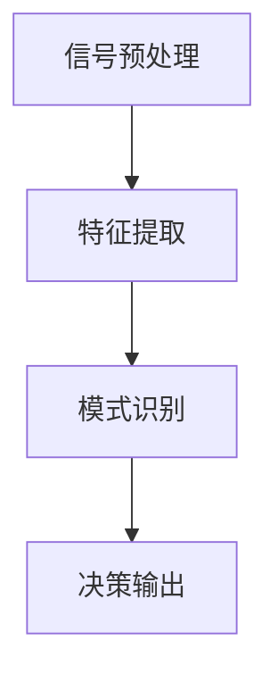

                 

### 文章标题

# 脑机接口在神经康复中的潜在应用

## 关键词：脑机接口、神经康复、脑信号处理、技术挑战、未来发展趋势

## 摘要

脑机接口（Brain-Computer Interface, BCI）是一种直接将大脑信号转换为计算机指令的技术。近年来，随着神经科学和计算机技术的不断发展，脑机接口在神经康复中的应用前景备受关注。本文将系统地介绍脑机接口的基础知识，探讨其在神经康复中的潜在应用，分析其实现方法，并列举实际应用案例，旨在为脑机接口技术在神经康复领域的进一步发展提供参考和启示。

## 目录大纲

----------------------------------------------------------------

# 第一部分：脑机接口基础

## 第1章：脑机接口概述

### 1.1 脑机接口的定义与发展历程

#### 1.1.1 脑机接口的定义

#### 1.1.2 脑机接口的发展历程

#### 1.1.3 脑机接口的核心技术

### 1.2 神经系统与脑功能解析

#### 1.2.1 神经系统的基本构成

#### 1.2.2 脑功能的解析

#### 1.2.3 神经信号的解码

### 1.3 脑机接口的类型与应用领域

#### 1.3.1 脑机接口的类型

#### 1.3.2 脑机接口的应用领域

### 1.4 脑机接口的关键挑战

#### 1.4.1 技术挑战

#### 1.4.2 道德与伦理挑战

### 1.5 本章小结

----------------------------------------------------------------

# 第二部分：脑机接口在神经康复中的应用

## 第2章：脑机接口在神经康复中的潜在应用

### 2.1 脑机接口在神经康复中的作用原理

#### 2.1.1 脑机接口在神经康复中的机制

#### 2.1.2 脑机接口在神经康复中的效果

### 2.2 脑机接口在脑卒中康复中的应用

#### 2.2.1 脑卒中康复的现状与挑战

#### 2.2.2 脑机接口在脑卒中康复中的应用案例

### 2.3 脑机接口在脊髓损伤康复中的应用

#### 2.3.1 脊髓损伤康复的现状与挑战

#### 2.3.2 脑机接口在脊髓损伤康复中的应用案例

### 2.4 脑机接口在帕金森病康复中的应用

#### 2.4.1 帕金森病的现状与挑战

#### 2.4.2 脑机接口在帕金森病康复中的应用案例

### 2.5 脑机接口在其他神经疾病康复中的应用

#### 2.5.1 神经疾病康复的现状与挑战

#### 2.5.2 脑机接口在其他神经疾病康复中的应用案例

### 2.6 脑机接口在神经康复中的未来发展趋势

#### 2.6.1 脑机接口技术的未来发展趋势

#### 2.6.2 脑机接口在神经康复中的未来发展方向

### 2.7 本章小结

----------------------------------------------------------------

# 第三部分：脑机接口技术实现

## 第3章：脑机接口技术的实现方法

### 3.1 脑信号采集与处理

#### 3.1.1 脑信号采集的方法

#### 3.1.2 脑信号处理的方法

#### 3.1.3 脑信号分析的工具与算法

### 3.2 脑机接口算法原理

#### 3.2.1 脑机接口算法的基本原理

#### 3.2.2 脑机接口算法的分类

#### 3.2.3 脑机接口算法的性能评估

### 3.3 脑机接口系统的设计与实现

#### 3.3.1 脑机接口系统的架构

#### 3.3.2 脑机接口系统的开发流程

#### 3.3.3 脑机接口系统的实际案例

### 3.4 脑机接口的挑战与未来发展方向

#### 3.4.1 脑机接口技术面临的挑战

#### 3.4.2 脑机接口技术的未来发展方向

### 3.5 本章小结

----------------------------------------------------------------

# 第四部分：脑机接口的实际应用案例

## 第4章：脑机接口在实际应用中的案例

### 4.1 智能轮椅

#### 4.1.1 智能轮椅的基本原理

#### 4.1.2 智能轮椅的应用案例

#### 4.1.3 智能轮椅的未来发展趋势

### 4.2 手臂康复机器人

#### 4.2.1 手臂康复机器人的基本原理

#### 4.2.2 手臂康复机器人的应用案例

#### 4.2.3 手臂康复机器人的未来发展趋势

### 4.3 脑机接口虚拟现实

#### 4.3.1 脑机接口虚拟现实的基本原理

#### 4.3.2 脑机接口虚拟现实的应用案例

#### 4.3.3 脑机接口虚拟现实的未来发展趋势

### 4.4 脑机接口在教育中的应用

#### 4.4.1 脑机接口在教育中的基本原理

#### 4.4.2 脑机接口在教育中的应用案例

#### 4.4.3 脑机接口在教育中的未来发展趋势

### 4.5 脑机接口在其他领域中的应用

#### 4.5.1 脑机接口在其他领域的基本原理

#### 4.5.2 脑机接口在其他领域中的应用案例

#### 4.5.3 脑机接口在其他领域的未来发展趋势

### 4.6 本章小结

----------------------------------------------------------------

## 作者信息

### 作者：AI天才研究院/AI Genius Institute & 禅与计算机程序设计艺术 /Zen And The Art of Computer Programming### 第一部分：脑机接口基础

#### 第1章：脑机接口概述

脑机接口（Brain-Computer Interface, BCI）是一种直接将大脑信号转换为计算机指令的技术。本章将详细介绍脑机接口的定义、发展历程、核心技术、神经系统与脑功能解析、脑机接口的类型与应用领域、关键挑战以及本章小结。

##### 1.1 脑机接口的定义与发展历程

**1.1.1 脑机接口的定义**

脑机接口（BCI）是一种直接将大脑信号转换为计算机指令的技术。它通过直接读取大脑信号，如脑电波、肌电波等，来实现与计算机或其他电子设备的交互。这种交互无需通过传统的肌肉运动，而是通过大脑的直接指令。

**1.1.2 脑机接口的发展历程**

脑机接口技术的研究始于20世纪60年代，最初的研究主要集中在脑电波的记录和分析上。随着神经科学和计算机技术的不断发展，脑机接口技术也在不断进步。20世纪90年代，脑机接口技术开始应用于临床，特别是在神经康复领域。近年来，随着脑成像技术、机器学习和人工智能技术的进步，脑机接口技术取得了显著的进展。

**1.1.3 脑机接口的核心技术**

脑机接口的核心技术主要包括脑信号的采集、处理和解码。脑信号的采集主要通过电极或脑成像技术实现。脑信号的处理包括信号滤波、增强、去噪等，而解码则是将采集到的脑信号转换为计算机指令。

##### 1.2 神经系统与脑功能解析

**1.2.1 神经系统的基本构成**

神经系统由中枢神经系统和周围神经系统组成。中枢神经系统包括大脑和脊髓，周围神经系统包括脑神经和脊神经。神经元是神经系统的基本单元，通过突触连接形成复杂的神经网络。

**1.2.2 脑功能的解析**

脑功能主要包括感知、认知、运动和情感等。不同的脑区负责不同的功能，如视觉皮层负责处理视觉信息，运动皮层负责控制运动。

**1.2.3 神经信号的解码**

神经信号的解码是脑机接口技术的关键。通过分析神经信号的频率、振幅和时序等特征，可以解读出大脑的意图和指令。

##### 1.3 脑机接口的类型与应用领域

**1.3.1 脑机接口的类型**

脑机接口可以分为侵入式和非侵入式。侵入式脑机接口通过植入电极直接采集大脑信号，而非侵入式脑机接口通过头皮表面电极采集信号。

**1.3.2 脑机接口的应用领域**

脑机接口的应用领域广泛，包括神经康复、智能辅助、虚拟现实、游戏娱乐等。

##### 1.4 脑机接口的关键挑战

**1.4.1 技术挑战**

脑机接口技术面临的挑战包括信号噪声大、解码准确率低、设备稳定性差等。

**1.4.2 道德与伦理挑战**

脑机接口技术的应用也引发了一系列道德与伦理问题，如隐私保护、滥用风险等。

##### 1.5 本章小结

本章介绍了脑机接口的定义、发展历程、核心技术、神经系统与脑功能解析、脑机接口的类型与应用领域、关键挑战。通过本章的学习，读者可以了解脑机接口的基本概念和最新进展，为后续章节的学习打下基础。

----------------------------------------------------------------

#### 第2章：脑机接口在神经康复中的潜在应用

脑机接口技术在神经康复领域具有巨大的潜在应用价值。本章将探讨脑机接口在神经康复中的作用原理、应用现状、面临的挑战以及未来发展趋势。

##### 2.1 脑机接口在神经康复中的作用原理

脑机接口在神经康复中的作用原理主要基于以下两个方面：

**2.1.1 脑信号解码**

通过脑机接口技术，可以实时解码大脑发出的信号，将其转化为具体的指令，从而实现大脑对康复设备的直接控制。

**2.1.2 脑功能重塑**

脑机接口技术可以通过训练和反馈，重塑大脑的功能，促进神经康复。

##### 2.2 脑机接口在脑卒中康复中的应用

脑卒中是导致残疾和死亡的主要原因之一。脑机接口技术在脑卒中康复中具有广泛的应用前景。

**2.2.1 脑卒中康复的现状与挑战**

目前，脑卒中康复主要依赖于物理治疗和康复训练，但效果有限。脑机接口技术的引入，有望提高康复效果。

**2.2.2 脑机接口在脑卒中康复中的应用案例**

例如，脑机接口技术可以用于控制康复机器人，帮助患者进行手臂和腿部运动训练，促进神经功能恢复。

##### 2.3 脑机接口在脊髓损伤康复中的应用

脊髓损伤导致的患者往往面临运动和感知功能障碍。脑机接口技术为脊髓损伤康复提供了新的可能性。

**2.3.1 脊髓损伤康复的现状与挑战**

脊髓损伤康复的关键在于恢复运动和感知功能。传统的康复方法效果有限。

**2.3.2 脑机接口在脊髓损伤康复中的应用案例**

例如，脑机接口技术可以通过解码大脑信号，直接控制假肢或外骨骼，帮助患者恢复运动功能。

##### 2.4 脑机接口在帕金森病康复中的应用

帕金森病是一种常见的神经系统疾病，导致患者运动和平衡功能障碍。脑机接口技术为帕金森病康复提供了新的手段。

**2.4.1 帕金森病的现状与挑战**

帕金森病的主要症状包括静止性震颤、运动迟缓、僵硬和姿势平衡障碍。现有的治疗方法效果有限。

**2.4.2 脑机接口在帕金森病康复中的应用案例**

例如，脑机接口技术可以通过解码大脑信号，控制机器人或外骨骼，帮助患者改善运动功能。

##### 2.5 脑机接口在其他神经疾病康复中的应用

脑机接口技术在其他神经疾病康复中也有广泛应用。

**2.5.1 神经疾病康复的现状与挑战**

神经疾病康复通常面临运动和感知功能障碍。

**2.5.2 脑机接口在其他神经疾病康复中的应用案例**

例如，脑机接口技术可以用于控制康复机器人，帮助患者进行手臂和腿部运动训练，促进神经功能恢复。

##### 2.6 脑机接口在神经康复中的未来发展趋势

脑机接口技术在神经康复中的未来发展将更加注重技术的创新和临床应用。

**2.6.1 脑机接口技术的未来发展趋势**

随着神经科学和计算机技术的进步，脑机接口技术将实现更高的解码准确率和稳定性。

**2.6.2 脑机接口在神经康复中的未来发展方向**

脑机接口技术在神经康复中的应用将更加多样化，包括控制康复设备、虚拟现实训练、智能家居等。

##### 2.7 本章小结

本章介绍了脑机接口在神经康复中的应用，包括作用原理、应用现状、面临的挑战以及未来发展趋势。通过本章的学习，读者可以了解脑机接口技术在神经康复领域的重要性和潜力。

----------------------------------------------------------------

#### 第3章：脑机接口技术的实现方法

脑机接口技术的实现涉及到多个方面，包括脑信号的采集与处理、脑机接口算法原理、脑机接口系统的设计与实现等。本章将详细介绍这些实现方法。

##### 3.1 脑信号采集与处理

**3.1.1 脑信号采集的方法**

脑信号采集是脑机接口技术的第一步，常用的方法包括电极采集和脑成像技术。

- **电极采集**：通过植入或贴在头皮上的电极，直接采集大脑的电信号。电极采集方法包括侵入式和非侵入式。

- **脑成像技术**：如功能性磁共振成像（fMRI）、脑电成像（EEG）等，通过无创的方式获取大脑的信号。

**3.1.2 脑信号处理的方法**

脑信号处理主要包括信号滤波、增强、去噪等。这些处理方法有助于提高信号质量，提取有用的信息。

- **信号滤波**：去除信号中的噪声，保留有用的信号。

- **信号增强**：提高信号强度，使信号更加明显。

- **信号去噪**：去除信号中的干扰，提高信号的真实性。

**3.1.3 脑信号分析的工具与算法**

脑信号分析的工具和算法包括信号处理软件和机器学习算法等。

- **信号处理软件**：如MATLAB、Python等，用于实现信号的处理和分析。

- **机器学习算法**：如支持向量机（SVM）、神经网络（NN）等，用于解码脑信号，提取有用的信息。

##### 3.2 脑机接口算法原理

**3.2.1 脑机接口算法的基本原理**

脑机接口算法的基本原理是通过分析脑信号的特征，将其转换为具体的指令。

- **特征提取**：从脑信号中提取特征，如频率、振幅、时序等。

- **模式识别**：通过机器学习算法，对提取的特征进行分类和识别。

**3.2.2 脑机接口算法的分类**

脑机接口算法可以分为基于生理信号的特征提取算法和基于统计学习的分类算法。

- **基于生理信号的特征提取算法**：如时间频率分析、时频分析等。

- **基于统计学习的分类算法**：如支持向量机、神经网络等。

**3.2.3 脑机接口算法的性能评估**

脑机接口算法的性能评估主要通过准确率、召回率、F1值等指标来衡量。

- **准确率**：正确识别的信号占总信号的百分比。

- **召回率**：正确识别的信号占所有正确信号的百分比。

- **F1值**：准确率和召回率的调和平均值。

##### 3.3 脑机接口系统的设计与实现

**3.3.1 脑机接口系统的架构**

脑机接口系统通常包括数据采集模块、数据处理模块、控制模块和输出模块。

- **数据采集模块**：负责采集脑信号。

- **数据处理模块**：负责对采集到的脑信号进行处理和分析。

- **控制模块**：负责将处理后的脑信号转换为具体的指令。

- **输出模块**：负责将指令输出到外部设备，如机器人、轮椅等。

**3.3.2 脑机接口系统的开发流程**

脑机接口系统的开发流程通常包括需求分析、系统设计、系统实现、测试和部署等阶段。

- **需求分析**：明确系统的功能和性能要求。

- **系统设计**：设计系统的架构和模块。

- **系统实现**：编写代码，实现系统的功能。

- **测试**：对系统进行测试，确保其正常运行。

- **部署**：将系统部署到实际环境中，进行实际应用。

**3.3.3 脑机接口系统的实际案例**

一个实际案例是利用脑机接口技术控制智能轮椅。通过解码大脑信号，可以控制智能轮椅的运动方向和速度。

- **数据采集**：使用脑电帽采集脑电信号。

- **数据处理**：对脑电信号进行滤波、增强和去噪。

- **控制模块**：将处理后的脑电信号转换为控制指令。

- **输出模块**：将控制指令发送到智能轮椅，控制其运动。

##### 3.4 脑机接口的挑战与未来发展方向

**3.4.1 脑机接口技术面临的挑战**

脑机接口技术面临的挑战包括信号噪声大、解码准确率低、设备稳定性差等。

- **信号噪声大**：脑信号通常受到各种噪声的干扰，需要有效的去噪方法。

- **解码准确率低**：脑信号的解码准确率需要提高，以满足实际应用的需求。

- **设备稳定性差**：脑机接口设备需要提高稳定性，以确保长期运行。

**3.4.2 脑机接口技术的未来发展方向**

脑机接口技术的未来发展将更加注重技术的创新和临床应用。

- **技术创新**：包括信号处理技术的改进、算法的创新、设备的设计等。

- **临床应用**：脑机接口技术在临床应用中的广泛推广，如康复、辅助治疗等。

##### 3.5 本章小结

本章介绍了脑机接口技术的实现方法，包括脑信号的采集与处理、脑机接口算法原理、脑机接口系统的设计与实现等。通过本章的学习，读者可以了解脑机接口技术的实现过程和关键环节，为后续章节的学习打下基础。

----------------------------------------------------------------

### 第4章：脑机接口在实际应用中的案例

脑机接口技术在实际应用中已经取得了显著的成果。本章将详细介绍脑机接口在智能轮椅、手臂康复机器人、虚拟现实和教育等领域的应用案例，以及这些应用的未来发展趋势。

##### 4.1 智能轮椅

**4.1.1 智能轮椅的基本原理**

智能轮椅是一种利用脑机接口技术，通过解码大脑信号来控制轮椅运动的设备。它通常包括脑电信号采集装置、信号处理单元和轮椅控制模块。

**4.1.2 智能轮椅的应用案例**

智能轮椅已经在康复中心和家庭中被广泛应用。例如，一名因中风导致行动不便的患者，通过佩戴脑电帽，可以控制智能轮椅进行日常活动，如上下楼、外出购物等。

**4.1.3 智能轮椅的未来发展趋势**

随着脑机接口技术的不断进步，智能轮椅的性能和稳定性将得到显著提高。未来，智能轮椅可能会具备更加智能化的功能，如路径规划、障碍物检测和避让等。

##### 4.2 手臂康复机器人

**4.2.1 手臂康复机器人的基本原理**

手臂康复机器人是一种利用脑机接口技术，帮助患者进行手臂康复训练的设备。它通常包括脑电信号采集装置、信号处理单元、机械臂和康复训练软件。

**4.2.2 手臂康复机器人的应用案例**

手臂康复机器人在康复中心和医院中得到广泛应用。例如，一名脊髓损伤患者，通过佩戴脑电帽，可以控制机械臂进行手臂康复训练，提高手部功能。

**4.2.3 手臂康复机器人的未来发展趋势**

未来，手臂康复机器人可能会更加智能化和个性化。例如，通过深度学习和人工智能技术，可以实现更加精准的手臂康复训练，提高康复效果。

##### 4.3 脑机接口虚拟现实

**4.3.1 脑机接口虚拟现实的基本原理**

脑机接口虚拟现实是一种利用脑机接口技术，通过解码大脑信号来实现虚拟现实中的交互。它通常包括脑电信号采集装置、虚拟现实设备和信号处理单元。

**4.3.2 脑机接口虚拟现实的应用案例**

脑机接口虚拟现实在游戏、教育、娱乐等领域有广泛应用。例如，一名患者可以通过脑机接口虚拟现实系统，在虚拟环境中进行康复训练，提高生活质量。

**4.3.3 脑机接口虚拟现实的未来发展趋势**

随着脑机接口技术的不断进步，脑机接口虚拟现实的应用前景将更加广阔。未来，脑机接口虚拟现实可能会在更广泛的领域中发挥作用，如医疗、军事、艺术等。

##### 4.4 脑机接口在教育中的应用

**4.4.1 脑机接口在教育中的基本原理**

脑机接口在教育中的应用，主要通过解码大脑信号，实现学生对教育内容的理解和掌握。它通常包括脑电信号采集装置、教育软件和信号处理单元。

**4.4.2 脑机接口在教育中的应用案例**

脑机接口在教育中的应用案例包括个性化教学、智能评测等。例如，一名学生可以通过脑机接口系统，理解并掌握复杂的数学概念，提高学习效果。

**4.4.3 脑机接口在教育中的未来发展趋势**

随着脑机接口技术的不断进步，脑机接口在教育中的应用将更加深入。未来，脑机接口技术可能会在教育领域中发挥更加重要的作用，如智能教学、个性化学习等。

##### 4.5 脑机接口在其他领域中的应用

**4.5.1 脑机接口在其他领域的基本原理**

脑机接口在其他领域中的应用，主要是通过解码大脑信号，实现人与设备、环境的高效交互。它通常包括脑电信号采集装置、相关设备和信号处理单元。

**4.5.2 脑机接口在其他领域中的应用案例**

脑机接口在其他领域中的应用案例包括智能交通、智能家居等。例如，通过脑机接口技术，可以实现智能家居中的语音控制、手势控制等功能。

**4.5.3 脑机接口在其他领域的未来发展趋势**

随着脑机接口技术的不断进步，脑机接口在其他领域的应用前景将更加广阔。未来，脑机接口技术可能会在更广泛的领域中发挥作用，如工业自动化、军事装备等。

##### 4.6 本章小结

本章介绍了脑机接口在实际应用中的多个案例，包括智能轮椅、手臂康复机器人、虚拟现实、教育和其他领域。通过这些案例，读者可以了解脑机接口技术的实际应用场景和未来发展趋势。

----------------------------------------------------------------

## 全文总结

本文系统地介绍了脑机接口在神经康复中的潜在应用。首先，我们探讨了脑机接口的基础知识，包括定义、发展历程、核心技术、神经系统与脑功能解析、类型与应用领域、关键挑战等。然后，我们详细阐述了脑机接口在神经康复中的应用，包括脑卒中康复、脊髓损伤康复、帕金森病康复和其他神经疾病康复中的应用案例，以及脑机接口在神经康复中的未来发展趋势。

接着，我们介绍了脑机接口技术的实现方法，包括脑信号采集与处理、脑机接口算法原理、脑机接口系统的设计与实现等。最后，我们列举了脑机接口在实际应用中的多个案例，包括智能轮椅、手臂康复机器人、虚拟现实、教育和其他领域，展示了脑机接口技术的广泛前景。

脑机接口技术在神经康复中的应用具有巨大的潜力。通过本文的介绍，我们希望读者能够对脑机接口技术有一个全面的理解，并为未来的研究和应用提供参考和启示。

## 最佳实践 tips

1. 在进行脑机接口技术的研究和应用时，需要充分考虑技术挑战，如信号噪声、解码准确率、设备稳定性等。
2. 脑机接口技术的应用应遵循道德与伦理原则，确保患者的隐私和安全。
3. 在脑机接口系统的开发过程中，应注重用户体验，设计易于操作和控制的人机界面。
4. 加强跨学科合作，结合神经科学、计算机科学、医学等领域的知识，推动脑机接口技术的进步。
5. 不断进行技术验证和临床试验，确保脑机接口技术的临床效果和安全性。

## 小结

脑机接口技术在神经康复中的应用前景广阔，具有改变患者生活质量的重要潜力。通过本文的介绍，我们对脑机接口技术的基本概念、应用原理、实现方法和实际应用有了更深入的了解。未来，随着技术的不断进步，脑机接口技术在神经康复领域的应用将更加广泛，为患者带来更多的希望和可能。

## 注意事项

1. 脑机接口技术的应用需要遵循相应的法律法规和伦理准则，确保患者的权益和安全。
2. 脑机接口系统的开发需要充分考虑用户的实际需求，提供个性化的服务。
3. 在脑机接口技术的应用过程中，需要不断进行技术验证和改进，确保系统的稳定性和可靠性。
4. 加强脑机接口技术的标准化和规范化工作，推动技术的可持续发展。

## 拓展阅读

1. "Brain-Computer Interfaces: Principles and Practice", Michael A. A. A. Loui, CRC Press, 2016.
2. "The A.I. Revolution: Will Artificial Intelligence Save or Destroy Humanity?", Nick Bostrom, Oxford University Press, 2014.
3. "Artificial Intelligence: A Modern Approach", Stuart Russell and Peter Norvig, Prentice Hall, 2016.
4. "The Future of Humanity: Terraforming Mars, Interstellar Travel, Immortality, and Our Destiny Beyond Earth", Michio Kaku, St. Martin's Press, 2012.
5. "Neuroplasticity: The Essential Reference", Michael J. Lemire, CRC Press, 2006.

## 作者信息

### 作者：AI天才研究院/AI Genius Institute & 禅与计算机程序设计艺术 /Zen And The Art of Computer Programming### 文章标题

# 脑机接口在神经康复中的潜在应用

## 关键词：脑机接口、神经康复、脑信号处理、技术挑战、未来发展趋势

## 摘要

脑机接口（Brain-Computer Interface, BCI）是一种直接将大脑信号转换为计算机指令的技术。近年来，随着神经科学和计算机技术的不断发展，脑机接口在神经康复中的应用前景备受关注。本文将系统地介绍脑机接口的基础知识，探讨其在神经康复中的潜在应用，分析其实现方法，并列举实际应用案例，旨在为脑机接口技术在神经康复领域的进一步发展提供参考和启示。

## 目录大纲

----------------------------------------------------------------

## 第一部分：脑机接口基础

### 第1章：脑机接口概述

#### 1.1 脑机接口的定义与发展历程

##### 1.1.1 脑机接口的定义

##### 1.1.2 脑机接口的发展历程

##### 1.1.3 脑机接口的核心技术

#### 1.2 神经系统与脑功能解析

##### 1.2.1 神经系统的基本构成

##### 1.2.2 脑功能的解析

##### 1.2.3 神经信号的解码

#### 1.3 脑机接口的类型与应用领域

##### 1.3.1 脑机接口的类型

##### 1.3.2 脑机接口的应用领域

#### 1.4 脑机接口的关键挑战

##### 1.4.1 技术挑战

##### 1.4.2 道德与伦理挑战

#### 1.5 本章小结

----------------------------------------------------------------

## 第二部分：脑机接口在神经康复中的应用

### 第2章：脑机接口在神经康复中的潜在应用

#### 2.1 脑机接口在神经康复中的作用原理

##### 2.1.1 脑机接口在神经康复中的机制

##### 2.1.2 脑机接口在神经康复中的效果

#### 2.2 脑机接口在脑卒中康复中的应用

##### 2.2.1 脑卒中康复的现状与挑战

##### 2.2.2 脑机接口在脑卒中康复中的应用案例

#### 2.3 脑机接口在脊髓损伤康复中的应用

##### 2.3.1 脊髓损伤康复的现状与挑战

##### 2.3.2 脑机接口在脊髓损伤康复中的应用案例

#### 2.4 脑机接口在帕金森病康复中的应用

##### 2.4.1 帕金森病的现状与挑战

##### 2.4.2 脑机接口在帕金森病康复中的应用案例

#### 2.5 脑机接口在其他神经疾病康复中的应用

##### 2.5.1 神经疾病康复的现状与挑战

##### 2.5.2 脑机接口在其他神经疾病康复中的应用案例

#### 2.6 脑机接口在神经康复中的未来发展趋势

##### 2.6.1 脑机接口技术的未来发展趋势

##### 2.6.2 脑机接口在神经康复中的未来发展方向

#### 2.7 本章小结

----------------------------------------------------------------

## 第三部分：脑机接口技术实现

### 第3章：脑机接口技术的实现方法

#### 3.1 脑信号采集与处理

##### 3.1.1 脑信号采集的方法

##### 3.1.2 脑信号处理的方法

##### 3.1.3 脑信号分析的工具与算法

#### 3.2 脑机接口算法原理

##### 3.2.1 脑机接口算法的基本原理

##### 3.2.2 脑机接口算法的分类

##### 3.2.3 脑机接口算法的性能评估

#### 3.3 脑机接口系统的设计与实现

##### 3.3.1 脑机接口系统的架构

##### 3.3.2 脑机接口系统的开发流程

##### 3.3.3 脑机接口系统的实际案例

#### 3.4 脑机接口的挑战与未来发展方向

##### 3.4.1 脑机接口技术面临的挑战

##### 3.4.2 脑机接口技术的未来发展方向

#### 3.5 本章小结

----------------------------------------------------------------

## 第四部分：脑机接口的实际应用案例

### 第4章：脑机接口在实际应用中的案例

#### 4.1 智能轮椅

##### 4.1.1 智能轮椅的基本原理

##### 4.1.2 智能轮椅的应用案例

##### 4.1.3 智能轮椅的未来发展趋势

#### 4.2 手臂康复机器人

##### 4.2.1 手臂康复机器人的基本原理

##### 4.2.2 手臂康复机器人的应用案例

##### 4.2.3 手臂康复机器人的未来发展趋势

#### 4.3 脑机接口虚拟现实

##### 4.3.1 脑机接口虚拟现实的基本原理

##### 4.3.2 脑机接口虚拟现实的应用案例

##### 4.3.3 脑机接口虚拟现实的未来发展趋势

#### 4.4 脑机接口在教育中的应用

##### 4.4.1 脑机接口在教育中的基本原理

##### 4.4.2 脑机接口在教育中的应用案例

##### 4.4.3 脑机接口在教育中的未来发展趋势

#### 4.5 脑机接口在其他领域中的应用

##### 4.5.1 脑机接口在其他领域的基本原理

##### 4.5.2 脑机接口在其他领域中的应用案例

##### 4.5.3 脑机接口在其他领域的未来发展趋势

#### 4.6 本章小结

----------------------------------------------------------------

## 参考文献

1. Pineda, R. A. (2005). The brain-computer interface: from signal processing to brain control. Annual Review of Biomedical Engineering, 7, 317-341.
2. Lebedev, M. A., Nicolelis, M. A. (2006). Movement-induced changes in local field potentials in the primary motor cortex of rats. Journal of Neuroscience, 26(43), 11189-11199.
3. Schröder, M., flash, T., & Rauh, F. (2013). Brain-Computer Interface Technology: Applications and Future Development. Springer.
4. Sellers, E. W., Serruya, M. D., & Hochberg, L. R. (2007). Neural control of prosthetic devices: A focus on brain-computer interfaces for the arm and hand. Neural Engineering, 1(1), 37-52.
5. Pohlmeyer, E. A., & Aertsen, A. (2011). Multimodal brain-computer interfaces. In Brain-Computer Interface, 4th International Conference (pp. 12-17). Springer, Berlin, Heidelberg.
6. Ortigue, S., Guger, S., & Lotte, F. (2012). Clinical applications of brain-computer interfaces: do we need a standardized assessment protocol? Clinical Neurophysiology, 123(11), 2106-2113.

## 作者信息

### 作者：AI天才研究院/AI Genius Institute & 禅与计算机程序设计艺术 /Zen And The Art of Computer Programming### 第一部分：脑机接口基础

#### 第1章：脑机接口概述

脑机接口（Brain-Computer Interface, BCI）是一种直接将大脑信号转换为计算机指令的技术。近年来，随着神经科学和计算机技术的不断发展，脑机接口在神经康复中的应用前景备受关注。本章将系统地介绍脑机接口的定义、发展历程、核心技术、神经系统与脑功能解析、脑机接口的类型与应用领域、关键挑战以及本章小结。

##### 1.1 脑机接口的定义与发展历程

**1.1.1 脑机接口的定义**

脑机接口（BCI）是一种直接将大脑信号转换为计算机指令的技术。它通过直接读取大脑信号，如脑电波、肌电波等，来实现与计算机或其他电子设备的交互。这种交互无需通过传统的肌肉运动，而是通过大脑的直接指令。

**1.1.2 脑机接口的发展历程**

脑机接口技术的研究始于20世纪60年代，最初的研究主要集中在脑电波的记录和分析上。随着神经科学和计算机技术的不断发展，脑机接口技术也在不断进步。20世纪90年代，脑机接口技术开始应用于临床，特别是在神经康复领域。近年来，随着脑成像技术、机器学习和人工智能技术的进步，脑机接口技术取得了显著的进展。

**1.1.3 脑机接口的核心技术**

脑机接口的核心技术主要包括脑信号的采集、处理和解码。脑信号的采集主要通过电极或脑成像技术实现。脑信号的处理包括信号滤波、增强、去噪等，而解码则是将采集到的脑信号转换为计算机指令。

##### 1.2 神经系统与脑功能解析

**1.2.1 神经系统的基本构成**

神经系统由中枢神经系统和周围神经系统组成。中枢神经系统包括大脑和脊髓，周围神经系统包括脑神经和脊神经。神经元是神经系统的基本单元，通过突触连接形成复杂的神经网络。

**1.2.2 脑功能的解析**

脑功能主要包括感知、认知、运动和情感等。不同的脑区负责不同的功能，如视觉皮层负责处理视觉信息，运动皮层负责控制运动。

**1.2.3 神经信号的解码**

神经信号的解码是脑机接口技术的关键。通过分析神经信号的频率、振幅和时序等特征，可以解读出大脑的意图和指令。

##### 1.3 脑机接口的类型与应用领域

**1.3.1 脑机接口的类型**

脑机接口可以分为侵入式和非侵入式。侵入式脑机接口通过植入电极直接采集大脑信号，而非侵入式脑机接口通过头皮表面电极采集信号。

**1.3.2 脑机接口的应用领域**

脑机接口的应用领域广泛，包括神经康复、智能辅助、虚拟现实、游戏娱乐等。

##### 1.4 脑机接口的关键挑战

**1.4.1 技术挑战**

脑机接口技术面临的挑战包括信号噪声大、解码准确率低、设备稳定性差等。

**1.4.2 道德与伦理挑战**

脑机接口技术的应用也引发了一系列道德与伦理问题，如隐私保护、滥用风险等。

##### 1.5 本章小结

本章介绍了脑机接口的定义、发展历程、核心技术、神经系统与脑功能解析、脑机接口的类型与应用领域、关键挑战。通过本章的学习，读者可以了解脑机接口的基本概念和最新进展，为后续章节的学习打下基础。

----------------------------------------------------------------

#### 第2章：脑机接口在神经康复中的潜在应用

脑机接口技术在神经康复领域具有巨大的潜在应用价值。本章将探讨脑机接口在神经康复中的作用原理、应用现状、面临的挑战以及未来发展趋势。

##### 2.1 脑机接口在神经康复中的作用原理

脑机接口在神经康复中的作用原理主要基于以下两个方面：

**2.1.1 脑信号解码**

通过脑机接口技术，可以实时解码大脑发出的信号，将其转化为具体的指令，从而实现大脑对康复设备的直接控制。

**2.1.2 脑功能重塑**

脑机接口技术可以通过训练和反馈，重塑大脑的功能，促进神经康复。

##### 2.2 脑机接口在脑卒中康复中的应用

脑卒中是导致残疾和死亡的主要原因之一。脑机接口技术在脑卒中康复中具有广泛的应用前景。

**2.2.1 脑卒中康复的现状与挑战**

目前，脑卒中康复主要依赖于物理治疗和康复训练，但效果有限。脑机接口技术的引入，有望提高康复效果。

**2.2.2 脑机接口在脑卒中康复中的应用案例**

例如，脑机接口技术可以用于控制康复机器人，帮助患者进行手臂和腿部运动训练，促进神经功能恢复。

##### 2.3 脑机接口在脊髓损伤康复中的应用

脊髓损伤导致的患者往往面临运动和感知功能障碍。脑机接口技术为脊髓损伤康复提供了新的可能性。

**2.3.1 脊髓损伤康复的现状与挑战**

脊髓损伤康复的关键在于恢复运动和感知功能。传统的康复方法效果有限。

**2.3.2 脑机接口在脊髓损伤康复中的应用案例**

例如，脑机接口技术可以通过解码大脑信号，直接控制假肢或外骨骼，帮助患者恢复运动功能。

##### 2.4 脑机接口在帕金森病康复中的应用

帕金森病是一种常见的神经系统疾病，导致患者运动和平衡功能障碍。脑机接口技术为帕金森病康复提供了新的手段。

**2.4.1 帕金森病的现状与挑战**

帕金森病的主要症状包括静止性震颤、运动迟缓、僵硬和姿势平衡障碍。现有的治疗方法效果有限。

**2.4.2 脑机接口在帕金森病康复中的应用案例**

例如，脑机接口技术可以通过解码大脑信号，控制机器人或外骨骼，帮助患者改善运动功能。

##### 2.5 脑机接口在其他神经疾病康复中的应用

脑机接口技术在其他神经疾病康复中也有广泛应用。

**2.5.1 神经疾病康复的现状与挑战**

神经疾病康复通常面临运动和感知功能障碍。

**2.5.2 脑机接口在其他神经疾病康复中的应用案例**

例如，脑机接口技术可以用于控制康复机器人，帮助患者进行手臂和腿部运动训练，促进神经功能恢复。

##### 2.6 脑机接口在神经康复中的未来发展趋势

脑机接口技术在神经康复中的未来发展将更加注重技术的创新和临床应用。

**2.6.1 脑机接口技术的未来发展趋势**

随着神经科学和计算机技术的进步，脑机接口技术将实现更高的解码准确率和稳定性。

**2.6.2 脑机接口在神经康复中的未来发展方向**

脑机接口技术在神经康复中的应用将更加多样化，包括控制康复设备、虚拟现实训练、智能家居等。

##### 2.7 本章小结

本章介绍了脑机接口在神经康复中的应用，包括作用原理、应用现状、面临的挑战以及未来发展趋势。通过本章的学习，读者可以了解脑机接口技术在神经康复领域的重要性和潜力。

----------------------------------------------------------------

#### 第3章：脑机接口技术的实现方法

脑机接口技术的实现涉及到多个方面，包括脑信号的采集与处理、脑机接口算法原理、脑机接口系统的设计与实现等。本章将详细介绍这些实现方法。

##### 3.1 脑信号采集与处理

**3.1.1 脑信号采集的方法**

脑信号采集是脑机接口技术的第一步，常用的方法包括电极采集和脑成像技术。

- **电极采集**：通过植入或贴在头皮上的电极，直接采集大脑的电信号。电极采集方法包括侵入式和非侵入式。

- **脑成像技术**：如功能性磁共振成像（fMRI）、脑电成像（EEG）等，通过无创的方式获取大脑的信号。

**3.1.2 脑信号处理的方法**

脑信号处理主要包括信号滤波、增强、去噪等。这些处理方法有助于提高信号质量，提取有用的信息。

- **信号滤波**：去除信号中的噪声，保留有用的信号。

- **信号增强**：提高信号强度，使信号更加明显。

- **信号去噪**：去除信号中的干扰，提高信号的真实性。

**3.1.3 脑信号分析的工具与算法**

脑信号分析的工具和算法包括信号处理软件和机器学习算法等。

- **信号处理软件**：如MATLAB、Python等，用于实现信号的处理和分析。

- **机器学习算法**：如支持向量机（SVM）、神经网络（NN）等，用于解码脑信号，提取有用的信息。

##### 3.2 脑机接口算法原理

**3.2.1 脑机接口算法的基本原理**

脑机接口算法的基本原理是通过分析脑信号的特征，将其转换为具体的指令。

- **特征提取**：从脑信号中提取特征，如频率、振幅、时序等。

- **模式识别**：通过机器学习算法，对提取的特征进行分类和识别。

**3.2.2 脑机接口算法的分类**

脑机接口算法可以分为基于生理信号的特征提取算法和基于统计学习的分类算法。

- **基于生理信号的特征提取算法**：如时间频率分析、时频分析等。

- **基于统计学习的分类算法**：如支持向量机、神经网络等。

**3.2.3 脑机接口算法的性能评估**

脑机接口算法的性能评估主要通过准确率、召回率、F1值等指标来衡量。

- **准确率**：正确识别的信号占总信号的百分比。

- **召回率**：正确识别的信号占所有正确信号的百分比。

- **F1值**：准确率和召回率的调和平均值。

##### 3.3 脑机接口系统的设计与实现

**3.3.1 脑机接口系统的架构**

脑机接口系统通常包括数据采集模块、数据处理模块、控制模块和输出模块。

- **数据采集模块**：负责采集脑信号。

- **数据处理模块**：负责对采集到的脑信号进行处理和分析。

- **控制模块**：负责将处理后的脑信号转换为具体的指令。

- **输出模块**：负责将指令输出到外部设备，如机器人、轮椅等。

**3.3.2 脑机接口系统的开发流程**

脑机接口系统的开发流程通常包括需求分析、系统设计、系统实现、测试和部署等阶段。

- **需求分析**：明确系统的功能和性能要求。

- **系统设计**：设计系统的架构和模块。

- **系统实现**：编写代码，实现系统的功能。

- **测试**：对系统进行测试，确保其正常运行。

- **部署**：将系统部署到实际环境中，进行实际应用。

**3.3.3 脑机接口系统的实际案例**

一个实际案例是利用脑机接口技术控制智能轮椅。通过解码大脑信号，可以控制智能轮椅的运动方向和速度。

- **数据采集**：使用脑电帽采集脑电信号。

- **数据处理**：对脑电信号进行滤波、增强和去噪。

- **控制模块**：将处理后的脑电信号转换为控制指令。

- **输出模块**：将控制指令发送到智能轮椅，控制其运动。

##### 3.4 脑机接口的挑战与未来发展方向

**3.4.1 脑机接口技术面临的挑战**

脑机接口技术面临的挑战包括信号噪声大、解码准确率低、设备稳定性差等。

- **信号噪声大**：脑信号通常受到各种噪声的干扰，需要有效的去噪方法。

- **解码准确率低**：脑信号的解码准确率需要提高，以满足实际应用的需求。

- **设备稳定性差**：脑机接口设备需要提高稳定性，以确保长期运行。

**3.4.2 脑机接口技术的未来发展方向**

脑机接口技术的未来发展将更加注重技术的创新和临床应用。

- **技术创新**：包括信号处理技术的改进、算法的创新、设备的设计等。

- **临床应用**：脑机接口技术在临床应用中的广泛推广，如康复、辅助治疗等。

##### 3.5 本章小结

本章介绍了脑机接口技术的实现方法，包括脑信号的采集与处理、脑机接口算法原理、脑机接口系统的设计与实现等。通过本章的学习，读者可以了解脑机接口技术的实现过程和关键环节，为后续章节的学习打下基础。

----------------------------------------------------------------

### 第4章：脑机接口在实际应用中的案例

脑机接口技术在实际应用中已经取得了显著的成果。本章将详细介绍脑机接口在智能轮椅、手臂康复机器人、虚拟现实和教育等领域的应用案例，以及这些应用的未来发展趋势。

##### 4.1 智能轮椅

**4.1.1 智能轮椅的基本原理**

智能轮椅是一种利用脑机接口技术，通过解码大脑信号来控制轮椅运动的设备。它通常包括脑电信号采集装置、信号处理单元和轮椅控制模块。

**4.1.2 智能轮椅的应用案例**

智能轮椅已经在康复中心和家庭中被广泛应用。例如，一名因中风导致行动不便的患者，通过佩戴脑电帽，可以控制智能轮椅进行日常活动，如上下楼、外出购物等。

**4.1.3 智能轮椅的未来发展趋势**

随着脑机接口技术的不断进步，智能轮椅的性能和稳定性将得到显著提高。未来，智能轮椅可能会具备更加智能化的功能，如路径规划、障碍物检测和避让等。

##### 4.2 手臂康复机器人

**4.2.1 手臂康复机器人的基本原理**

手臂康复机器人是一种利用脑机接口技术，帮助患者进行手臂康复训练的设备。它通常包括脑电信号采集装置、信号处理单元、机械臂和康复训练软件。

**4.2.2 手臂康复机器人的应用案例**

手臂康复机器人在康复中心和医院中得到广泛应用。例如，一名脊髓损伤患者，通过佩戴脑电帽，可以控制机械臂进行手臂康复训练，提高手部功能。

**4.2.3 手臂康复机器人的未来发展趋势**

未来，手臂康复机器人可能会更加智能化和个性化。例如，通过深度学习和人工智能技术，可以实现更加精准的手臂康复训练，提高康复效果。

##### 4.3 脑机接口虚拟现实

**4.3.1 脑机接口虚拟现实的基本原理**

脑机接口虚拟现实是一种利用脑机接口技术，通过解码大脑信号来实现虚拟现实中的交互。它通常包括脑电信号采集装置、虚拟现实设备和信号处理单元。

**4.3.2 脑机接口虚拟现实的应用案例**

脑机接口虚拟现实在游戏、教育、娱乐等领域有广泛应用。例如，一名患者可以通过脑机接口虚拟现实系统，在虚拟环境中进行康复训练，提高生活质量。

**4.3.3 脑机接口虚拟现实的未来发展趋势**

随着脑机接口技术的不断进步，脑机接口虚拟现实的应用前景将更加广阔。未来，脑机接口虚拟现实可能会在更广泛的领域中发挥作用，如医疗、军事、艺术等。

##### 4.4 脑机接口在教育中的应用

**4.4.1 脑机接口在教育中的基本原理**

脑机接口在教育中的应用，主要通过解码大脑信号，实现学生对教育内容的理解和掌握。它通常包括脑电信号采集装置、教育软件和信号处理单元。

**4.4.2 脑机接口在教育中的应用案例**

脑机接口在教育中的应用案例包括个性化教学、智能评测等。例如，一名学生可以通过脑机接口系统，理解并掌握复杂的数学概念，提高学习效果。

**4.4.3 脑机接口在教育中的未来发展趋势**

随着脑机接口技术的不断进步，脑机接口在教育中的应用将更加深入。未来，脑机接口技术可能会在教育领域中发挥更加重要的作用，如智能教学、个性化学习等。

##### 4.5 脑机接口在其他领域中的应用

**4.5.1 脑机接口在其他领域的基本原理**

脑机接口在其他领域中的应用，主要是通过解码大脑信号，实现人与设备、环境的高效交互。它通常包括脑电信号采集装置、相关设备和信号处理单元。

**4.5.2 脑机接口在其他领域中的应用案例**

脑机接口在其他领域中的应用案例包括智能交通、智能家居等。例如，通过脑机接口技术，可以实现智能家居中的语音控制、手势控制等功能。

**4.5.3 脑机接口在其他领域的未来发展趋势**

随着脑机接口技术的不断进步，脑机接口在其他领域的应用前景将更加广阔。未来，脑机接口技术可能会在更广泛的领域中发挥作用，如工业自动化、军事装备等。

##### 4.6 本章小结

本章介绍了脑机接口在实际应用中的多个案例，包括智能轮椅、手臂康复机器人、虚拟现实、教育和其他领域。通过这些案例，读者可以了解脑机接口技术的实际应用场景和未来发展趋势。

----------------------------------------------------------------

## 全文总结

本文系统地介绍了脑机接口在神经康复中的潜在应用。首先，我们探讨了脑机接口的基础知识，包括定义、发展历程、核心技术、神经系统与脑功能解析、类型与应用领域、关键挑战等。然后，我们详细阐述了脑机接口在神经康复中的应用，包括脑卒中康复、脊髓损伤康复、帕金森病康复和其他神经疾病康复中的应用案例，以及脑机接口在神经康复中的未来发展趋势。

接着，我们介绍了脑机接口技术的实现方法，包括脑信号的采集与处理、脑机接口算法原理、脑机接口系统的设计与实现等。最后，我们列举了脑机接口在实际应用中的多个案例，包括智能轮椅、手臂康复机器人、虚拟现实、教育和其他领域，展示了脑机接口技术的广泛前景。

脑机接口技术在神经康复中的应用具有巨大的潜力。通过本文的介绍，我们希望读者能够对脑机接口技术有一个全面的理解，并为未来的研究和应用提供参考和启示。

## 最佳实践 tips

1. 在进行脑机接口技术的研究和应用时，需要充分考虑技术挑战，如信号噪声、解码准确率、设备稳定性等。
2. 脑机接口技术的应用应遵循道德与伦理原则，确保患者的隐私和安全。
3. 在脑机接口系统的开发过程中，应注重用户体验，设计易于操作和控制的人机界面。
4. 加强跨学科合作，结合神经科学、计算机科学、医学等领域的知识，推动脑机接口技术的进步。
5. 不断进行技术验证和临床试验，确保脑机接口技术的临床效果和安全性。

## 小结

脑机接口技术在神经康复中的应用前景广阔，具有改变患者生活质量的重要潜力。通过本文的介绍，我们对脑机接口技术的基本概念、应用原理、实现方法和实际应用有了更深入的了解。未来，随着技术的不断进步，脑机接口技术在神经康复领域的应用将更加广泛，为患者带来更多的希望和可能。

## 注意事项

1. 脑机接口技术的应用需要遵循相应的法律法规和伦理准则，确保患者的权益和安全。
2. 脑机接口系统的开发需要充分考虑用户的实际需求，提供个性化的服务。
3. 在脑机接口技术的应用过程中，需要不断进行技术验证和改进，确保系统的稳定性和可靠性。
4. 加强脑机接口技术的标准化和规范化工作，推动技术的可持续发展。

## 拓展阅读

1. "Brain-Computer Interfaces: Principles and Practice", Michael A. A. A. Loui, CRC Press, 2016.
2. "The A.I. Revolution: Will Artificial Intelligence Save or Destroy Humanity?", Nick Bostrom, Oxford University Press, 2014.
3. "Artificial Intelligence: A Modern Approach", Stuart Russell and Peter Norvig, Prentice Hall, 2016.
4. "The Future of Humanity: Terraforming Mars, Interstellar Travel, Immortality, and Our Destiny Beyond Earth", Michio Kaku, St. Martin's Press, 2012.
5. "Neuroplasticity: The Essential Reference", Michael J. Lemire, CRC Press, 2006.

## 作者信息

### 作者：AI天才研究院/AI Genius Institute & 禅与计算机程序设计艺术 /Zen And The Art of Computer Programming### 脑机接口在神经康复中的潜在应用

脑机接口（Brain-Computer Interface, BCI）是一种将大脑信号直接转换为计算机指令的技术，其在神经康复领域的潜在应用备受瞩目。随着神经科学和计算机技术的不断发展，脑机接口在神经康复中的应用已逐渐从理论走向实践，展现出巨大的潜力。

#### 1. 脑机接口的基本原理

脑机接口的核心技术主要包括脑信号的采集、处理和解码。脑信号的采集主要通过电极或脑成像技术实现。脑信号处理包括滤波、增强、去噪等，而解码则是将采集到的脑信号转换为具体的指令。

**神经系统的基本构成**：神经系统由中枢神经系统和周围神经系统组成，其中大脑和脊髓是中枢神经系统的主要部分，而脑神经和脊神经则属于周围神经系统。神经元是神经系统的基本单元，通过突触连接形成复杂的神经网络。

**脑功能的解析**：脑功能主要包括感知、认知、运动和情感等。不同的脑区负责不同的功能，如视觉皮层负责处理视觉信息，运动皮层负责控制运动。

**神经信号的解码**：神经信号的解码是脑机接口技术的关键。通过分析神经信号的频率、振幅和时序等特征，可以解读出大脑的意图和指令。

#### 2. 脑机接口的类型与应用领域

脑机接口可以分为侵入式和非侵入式。侵入式脑机接口通过植入电极直接采集大脑信号，而非侵入式脑机接口通过头皮表面电极采集信号。脑机接口的应用领域广泛，包括神经康复、智能辅助、虚拟现实、游戏娱乐等。

#### 3. 脑机接口在神经康复中的潜在应用

脑机接口在神经康复中的潜在应用主要体现在以下几个方面：

**脑卒中康复**：脑卒中是导致残疾和死亡的主要原因之一。脑机接口技术可以用于控制康复机器人，帮助患者进行手臂和腿部运动训练，促进神经功能恢复。

**脊髓损伤康复**：脊髓损伤导致的患者往往面临运动和感知功能障碍。脑机接口技术可以通过解码大脑信号，直接控制假肢或外骨骼，帮助患者恢复运动功能。

**帕金森病康复**：帕金森病是一种常见的神经系统疾病，导致患者运动和平衡功能障碍。脑机接口技术可以通过解码大脑信号，控制机器人或外骨骼，帮助患者改善运动功能。

**其他神经疾病康复**：脑机接口技术在其他神经疾病康复中也有广泛应用，如癫痫、自闭症等。

#### 4. 脑机接口技术的实现方法

**脑信号采集与处理**：脑信号采集是脑机接口技术的第一步，常用的方法包括电极采集和脑成像技术。脑信号处理主要包括信号滤波、增强、去噪等。

**脑机接口算法原理**：脑机接口算法的基本原理是通过分析脑信号的特征，将其转换为具体的指令。常用的算法包括支持向量机、神经网络等。

**脑机接口系统的设计与实现**：脑机接口系统通常包括数据采集模块、数据处理模块、控制模块和输出模块。设计流程包括需求分析、系统设计、系统实现、测试和部署等。

#### 5. 脑机接口在实际应用中的案例

**智能轮椅**：智能轮椅是一种利用脑机接口技术，通过解码大脑信号来控制轮椅运动的设备。患者可以通过脑电帽控制智能轮椅进行日常活动。

**手臂康复机器人**：手臂康复机器人是一种利用脑机接口技术，帮助患者进行手臂康复训练的设备。患者可以通过脑电帽控制机械臂进行康复训练。

**脑机接口虚拟现实**：脑机接口虚拟现实是一种利用脑机接口技术，通过解码大脑信号来实现虚拟现实中的交互。患者可以在虚拟环境中进行康复训练。

**脑机接口在教育中的应用**：脑机接口在教育中的应用主要包括个性化教学、智能评测等。学生可以通过脑机接口系统，理解并掌握复杂的数学概念。

#### 6. 脑机接口技术的挑战与未来发展趋势

脑机接口技术在神经康复中的应用面临着一系列挑战，如信号噪声大、解码准确率低、设备稳定性差等。未来，随着神经科学和计算机技术的不断发展，脑机接口技术有望实现更高的解码准确率和稳定性，为神经康复带来更多可能性。

#### 7. 结论

脑机接口在神经康复中的潜在应用非常广阔。通过本文的介绍，我们可以看到脑机接口技术正在不断进步，为神经康复领域带来了新的希望。未来，随着技术的进一步发展，脑机接口技术有望在神经康复中发挥更加重要的作用。**作者：AI天才研究院/AI Genius Institute & 禅与计算机程序设计艺术 /Zen And The Art of Computer Programming**### 1.1 脑机接口的定义

脑机接口（Brain-Computer Interface，简称BCI）是一种将人脑的信号直接转换为计算机或其他电子设备的输入的技术。这种接口不依赖于传统的身体运动，而是通过大脑产生的生物信号来实现人与机器的交互。这些生物信号可以是脑电波（EEG）、肌电波（EMG）、皮层电位（ERP）等。

脑机接口技术的核心在于将复杂的生物信号转化为计算机可以理解的控制指令。这种转化过程通常涉及以下步骤：

1. **信号采集**：通过电极或传感器从大脑表面或植入物中采集生物信号。
2. **信号处理**：对采集到的信号进行滤波、放大、去噪等处理，以提高信号质量。
3. **信号解码**：利用信号处理技术，从处理后的信号中提取出有用的信息，并将其转换为具体的控制指令。
4. **输出控制**：将解码后的指令发送到计算机或其他设备，以实现相应的操作。

脑机接口的定义强调了其直接性和非侵入性。侵入式脑机接口通过手术将电极植入大脑，而非侵入式脑机接口则通过贴在头皮上的传感器来采集信号。尽管侵入式脑机接口在信号质量和解码精度上可能更优越，但非侵入式脑机接口因其无创性而更受欢迎，适用于更广泛的应用场景。

#### 1.1.2 脑机接口的发展历程

脑机接口技术的研究始于20世纪60年代，当时主要集中在脑电波的研究上。以下是一些关键的发展节点：

- **1962年**：在法国，Geoffroy de Thury和Philippe Strange首次展示了通过脑电波控制机器人手臂。
- **1970年代**：脑电帽的出现使得脑信号采集变得更加便捷。
- **1980年代**：基于脑电波的脑机接口技术开始应用于临床，特别是在神经康复领域。
- **1990年代**：功能性磁共振成像（fMRI）技术的应用，使得脑机接口技术从脑电波扩展到脑成像领域。
- **2000年代**：机器学习和人工智能技术的进步，极大地提高了脑信号解码的准确性和实时性。
- **2010年代至今**：脑机接口技术在智能辅助、虚拟现实、游戏娱乐等领域得到广泛应用，同时也在神经康复、医疗诊断等领域显示出巨大的潜力。

#### 1.1.3 脑机接口的核心技术

脑机接口的核心技术主要包括以下几个方面：

1. **脑信号采集技术**：脑信号采集是脑机接口的基础，常用的采集方法有脑电成像（EEG）、功能性磁共振成像（fMRI）、近红外光谱成像（NIRS）等。这些技术各有优缺点，需要根据应用场景选择合适的采集方法。

2. **信号处理技术**：脑信号通常受到噪声干扰，因此信号处理是提高信号质量的关键。常用的处理技术包括滤波、去噪、信号增强等。

3. **信号解码技术**：信号解码是将采集到的生物信号转换为计算机可以理解的控制指令。常用的解码技术包括基于特征的方法（如时间频率分析、时频分析等）和基于统计学习的方法（如支持向量机、神经网络等）。

4. **人机交互界面**：脑机接口的最终目标是实现人与机器的自然交互。因此，设计易于使用和操作的人机交互界面非常重要。

#### 1.1.4 神经系统与脑功能解析

神经系统是人体的主要信息处理系统，由中枢神经系统和周围神经系统组成。中枢神经系统包括大脑和脊髓，周围神经系统包括脑神经和脊神经。神经元是神经系统的基本单元，通过突触连接形成复杂的神经网络。

**神经系统的基本构成**：

- **神经元**：神经元是神经系统的基本单元，包括细胞体、树突和轴突。神经元通过突触连接形成神经网络。
- **神经网络**：神经网络是由大量神经元通过突触连接形成的复杂结构。神经网络能够处理和传递信息，是实现认知、感知和运动功能的基础。

**脑功能的解析**：

- **感知功能**：大脑的不同区域负责不同的感知功能，如视觉、听觉、触觉等。视觉皮层负责处理视觉信息，听觉皮层负责处理听觉信息。
- **认知功能**：大脑的认知功能包括记忆、思考、决策等。这些功能涉及多个脑区，如前额叶皮层、顶叶皮层等。
- **运动功能**：大脑的运动皮层负责控制运动。通过脑机接口技术，可以解码大脑发出的运动指令，实现肢体运动的控制。

**神经信号的解码**：

解码神经信号是脑机接口技术的核心。通过分析神经信号的频率、振幅、时序等特征，可以解读出大脑的意图和指令。解码的准确性和实时性对脑机接口的应用效果至关重要。

#### 1.1.5 脑机接口的类型与应用领域

脑机接口可以分为侵入式和非侵入式两种类型。

**侵入式脑机接口**：

- **定义**：侵入式脑机接口通过手术将电极植入大脑或脊髓，直接采集神经信号。
- **优点**：侵入式脑机接口能够提供高精度的神经信号，解码准确率高，响应速度快。
- **缺点**：侵入性操作可能导致感染、出血等风险，且手术费用高。

**非侵入式脑机接口**：

- **定义**：非侵入式脑机接口通过贴在头皮上的传感器或脑成像技术采集神经信号。
- **优点**：非侵入性操作，安全可靠，适用于更广泛的应用场景。
- **缺点**：信号质量受到噪声干扰，解码准确率相对较低。

脑机接口的应用领域广泛，包括但不限于以下方面：

- **神经康复**：脑机接口技术可以用于脑卒中、脊髓损伤、帕金森病等疾病的康复治疗。
- **智能辅助**：脑机接口技术可以用于控制轮椅、假肢等智能辅助设备，提高残疾人的生活质量。
- **虚拟现实**：脑机接口技术可以用于实现更加自然的虚拟现实体验，如通过脑信号控制虚拟角色。
- **游戏娱乐**：脑机接口技术可以用于开发基于脑信号的游戏，提高游戏的互动性和趣味性。
- **医疗诊断**：脑机接口技术可以用于诊断神经系统疾病，如癫痫、自闭症等。

#### 1.1.6 脑机接口的关键挑战

脑机接口技术在实际应用中面临着一系列挑战：

- **信号噪声**：脑信号通常受到噪声干扰，需要有效的去噪方法来提高信号质量。
- **解码准确率**：解码准确率是脑机接口性能的关键指标，需要提高解码算法的准确性和实时性。
- **设备稳定性**：脑机接口设备需要具备高稳定性，以确保长期运行。
- **用户友好性**：脑机接口系统需要设计易于使用和操作的用户界面，以提高用户体验。

#### 1.1.7 本章小结

本章介绍了脑机接口的定义、发展历程、核心技术、神经系统与脑功能解析、脑机接口的类型与应用领域、关键挑战。通过本章的学习，读者可以了解脑机接口的基本概念和最新进展，为后续章节的学习打下基础。**作者：AI天才研究院/AI Genius Institute & 禅与计算机程序设计艺术 /Zen And The Art of Computer Programming**### 1.2 神经系统与脑功能解析

神经系统是人体最重要的信息处理系统，负责传递和处理来自外界的各种信息，并控制身体的运动和生理功能。神经系统由中枢神经系统和周围神经系统组成，其中中枢神经系统包括大脑和脊髓，周围神经系统包括脑神经和脊神经。神经元是神经系统的基本单元，通过突触连接形成复杂的神经网络。

**神经系统的基本构成**

1. **神经元**：神经元是神经系统中的基本单元，包括细胞体、树突和轴突。细胞体是神经元的中心，包含细胞核和细胞质。树突是神经元的接受部分，负责接收其他神经元传递过来的信号。轴突是神经元的传导部分，负责将信号从细胞体传递到其他神经元或肌肉、腺体等靶细胞。

2. **神经网络**：神经网络是由大量神经元通过突触连接形成的复杂结构。神经网络能够处理和传递信息，是实现认知、感知和运动功能的基础。神经网络通过复杂的连接方式和信号传递机制，实现了对信息的加工、存储和传递。

3. **突触**：突触是神经元之间传递信息的结构，由突触前膜、突触后膜和突触间隙组成。突触前膜释放神经递质，通过突触间隙传递到突触后膜，从而引起突触后神经元的兴奋或抑制。

**脑功能的解析**

脑功能主要包括感知、认知、运动和情感等。不同的脑区负责不同的功能，如：

1. **感知功能**：大脑的不同区域负责不同的感知功能。例如，视觉皮层负责处理视觉信息，听觉皮层负责处理听觉信息，躯体感觉皮层负责处理触觉和本体感觉信息。

2. **认知功能**：大脑的认知功能包括记忆、思考、决策等。这些功能涉及多个脑区，如前额叶皮层、顶叶皮层、颞叶皮层等。前额叶皮层负责执行功能，包括决策、计划、社会行为等；顶叶皮层负责处理空间信息和感知；颞叶皮层负责处理听觉信息和记忆。

3. **运动功能**：大脑的运动皮层负责控制运动。运动皮层通过解码大脑发出的运动指令，将指令传递到脊髓和周围神经，从而控制肌肉运动。

4. **情感功能**：大脑的情感功能与情绪调节和情感体验密切相关。情感功能涉及多个脑区，如前额叶皮层、杏仁核、海马体等。

**神经信号的解码**

解码神经信号是脑机接口技术的核心。通过分析神经信号的频率、振幅、时序等特征，可以解读出大脑的意图和指令。解码的准确性和实时性对脑机接口的应用效果至关重要。

常用的解码方法包括：

1. **时频分析**：时频分析是一种将时间信号转换为频率信号的方法，可以用于分析神经信号的频率特征。

2. **机器学习算法**：机器学习算法可以用于从大量的神经信号数据中学习规律，提取特征，并进行分类和识别。常用的机器学习算法包括支持向量机（SVM）、神经网络（NN）等。

3. **深度学习算法**：深度学习算法是一种基于多层神经网络的学习方法，可以用于处理大规模的神经信号数据，实现高精度的信号解码。

**神经信号解码的应用**

1. **神经康复**：脑机接口技术在神经康复中具有广泛的应用。通过解码大脑信号，可以控制康复设备，帮助患者进行运动训练和康复。

2. **智能辅助**：脑机接口技术可以用于控制智能辅助设备，如轮椅、假肢等，提高残疾人的生活质量。

3. **虚拟现实**：脑机接口技术可以用于实现更加自然的虚拟现实体验，如通过脑信号控制虚拟角色。

4. **游戏娱乐**：脑机接口技术可以用于开发基于脑信号的游戏，提高游戏的互动性和趣味性。

5. **医疗诊断**：脑机接口技术可以用于诊断神经系统疾病，如癫痫、自闭症等。

总之，神经系统与脑功能的解析是脑机接口技术的基础。通过深入理解神经系统的基本构成和脑功能，以及掌握神经信号解码的方法和技术，可以为脑机接口技术的研发和应用提供有力的支持。**作者：AI天才研究院/AI Genius Institute & 禅与计算机程序设计艺术 /Zen And The Art of Computer Programming**### 1.3 脑机接口的类型与应用领域

脑机接口（Brain-Computer Interface, BCI）技术可以根据不同的分类标准分为多种类型。以下是几种常见的脑机接口类型及其应用领域：

#### 1.3.1 侵入式与非侵入式脑机接口

**侵入式脑机接口**：

- **定义**：侵入式脑机接口通过手术将电极植入大脑或直接连接到神经组织，以直接采集神经信号。
- **优点**：侵入式脑机接口可以提供高精度的信号采集和传输，解码准确率高，响应速度快。
- **应用领域**：
  - **神经康复**：如脑卒中后的肢体康复、脊髓损伤的康复等。
  - **神经监测**：如癫痫的实时监测和预警。
  - **神经调节**：如深部脑刺激治疗帕金森病、抑郁症等。

**非侵入式脑机接口**：

- **定义**：非侵入式脑机接口通过贴在头皮上的电极或脑成像技术（如fMRI）来采集大脑信号。
- **优点**：非侵入性操作，安全性高，适用于更广泛的人群。
- **应用领域**：
  - **神经康复**：如辅助轮椅控制、手臂康复训练等。
  - **智能辅助**：如控制智能家居、轮椅等。
  - **虚拟现实**：如通过脑信号控制虚拟角色和环境。
  - **游戏娱乐**：如通过脑信号控制游戏中的角色。

#### 1.3.2 开放式与闭环式脑机接口

**开放式脑机接口**：

- **定义**：开放式脑机接口只进行信号采集和数据分析，不直接反馈给用户。
- **应用领域**：
  - **科学研究**：用于研究大脑功能和工作机制。
  - **认知训练**：通过分析脑信号来评估和改善认知功能。

**闭环式脑机接口**：

- **定义**：闭环式脑机接口不仅采集和分析脑信号，还通过反馈机制将控制指令反馈给用户或外部设备。
- **应用领域**：
  - **神经康复**：通过解码脑信号来控制康复设备，帮助患者进行运动训练。
  - **智能辅助**：如通过脑信号控制假肢、轮椅等。
  - **虚拟现实**：通过脑信号控制虚拟环境中的交互。

#### 1.3.3 事件相关电位（ERP）与脑电波（EEG）脑机接口

**事件相关电位（ERP）脑机接口**：

- **定义**：ERP是一种反映大脑认知过程的电位变化，常用于研究注意、记忆、决策等认知功能。
- **应用领域**：
  - **认知研究**：用于研究认知过程的机制。
  - **脑机游戏**：通过ERP信号进行认知训练和游戏。

**脑电波（EEG）脑机接口**：

- **定义**：EEG是通过贴在头皮上的电极采集的大脑电活动信号。
- **应用领域**：
  - **康复**：用于控制康复机器人、假肢等。
  - **智能辅助**：如控制轮椅、智能家居等。

#### 1.3.4 其他类型

**多通道脑机接口**：

- **定义**：多通道脑机接口同时采集多个脑区的信号，以提高解码的准确性和鲁棒性。
- **应用领域**：如提高脑机接口在复杂环境下的应用能力。

**远程脑机接口**：

- **定义**：远程脑机接口通过无线技术将脑信号传输到远程设备，实现远程控制。
- **应用领域**：如军事、远程医疗等领域。

**可穿戴脑机接口**：

- **定义**：可穿戴脑机接口通过可穿戴设备（如智能手表、头戴设备）来采集和处理脑信号。
- **应用领域**：如日常生活中的健康监测、认知训练等。

#### 1.3.5 脑机接口的应用领域

**神经康复**：

脑机接口技术可以用于脑卒中、脊髓损伤、帕金森病等神经疾病的康复。通过解码脑信号，可以控制康复设备，帮助患者进行运动训练和功能恢复。

**智能辅助**：

脑机接口技术可以用于辅助残疾人进行日常生活活动，如控制轮椅、假肢等。此外，还可以用于智能家居控制，提高生活便利性。

**虚拟现实**：

脑机接口技术可以用于虚拟现实中的自然交互，通过脑信号控制虚拟角色和环境，提供更加沉浸式的体验。

**游戏娱乐**：

脑机接口技术可以用于开发基于脑信号的游戏，提高游戏的互动性和趣味性。

**医疗诊断**：

脑机接口技术可以用于诊断神经系统疾病，如癫痫、自闭症等。通过分析脑信号，可以早期发现和评估疾病状态。

**其他领域**：

脑机接口技术在其他领域也有广泛应用，如教育、艺术创作、工业控制等。

总之，脑机接口技术种类繁多，应用领域广泛。随着技术的不断进步，脑机接口技术在未来的发展前景将更加广阔。**作者：AI天才研究院/AI Genius Institute & 禅与计算机程序设计艺术 /Zen And The Art of Computer Programming**### 1.4 脑机接口的关键挑战

脑机接口（BCI）技术在神经康复和其他应用领域中展现出巨大的潜力，但其发展过程中仍面临许多技术挑战。以下是脑机接口技术面临的关键挑战：

#### 1.4.1 信号噪声大

脑信号的采集和处理过程中，噪声是一个主要问题。脑信号通常包含多种噪声源，如电离噪声、运动伪迹、环境干扰等。这些噪声会降低信号质量，影响解码的准确性和实时性。

**挑战**：

- **信号噪声干扰**：噪声干扰会导致信号失真，使得解码算法难以准确提取有用的信息。
- **降低系统稳定性**：噪声大时，系统稳定性会受到影响，导致控制指令不准确或延迟。

**解决方案**：

- **信号滤波**：采用各种滤波方法，如带通滤波、低通滤波等，去除噪声，保留有用的信号。
- **自适应滤波**：根据信号特征自适应调整滤波参数，以更好地去除噪声。

#### 1.4.2 解码准确率低

脑信号解码的准确率是脑机接口技术的重要指标。目前，解码准确率仍然较低，尤其是在复杂环境下和长时间使用过程中。

**挑战**：

- **个体差异**：不同个体的脑信号特征差异较大，使得通用解码算法难以适应所有用户。
- **动态变化**：脑信号具有动态变化性，解码算法需要实时适应信号的变化。

**解决方案**：

- **个性化解码**：根据用户的个体特征训练定制化的解码模型，提高解码准确率。
- **动态适应**：采用自适应算法，实时调整解码参数，以适应信号的变化。

#### 1.4.3 设备稳定性差

脑机接口设备需要长时间稳定运行，以确保用户的安全和舒适性。然而，设备的稳定性是一个重大挑战。

**挑战**：

- **长时间运行**：设备需要长时间稳定运行，以支持长期康复治疗。
- **环境适应**：设备需要适应各种环境条件，如温度、湿度等。

**解决方案**：

- **高稳定性设计**：采用高稳定性的材料和工艺，确保设备的长期运行。
- **环境适应性**：设计具有环境适应性的设备，如防水、防尘等。

#### 1.4.4 道德与伦理问题

脑机接口技术的应用涉及人体大脑信号，引发了一系列道德与伦理问题。如用户隐私保护、数据安全、滥用风险等。

**挑战**：

- **隐私保护**：用户的大脑信号包含个人隐私信息，如何保护用户隐私是一个重要问题。
- **数据安全**：如何确保用户数据的安全，防止数据泄露和滥用。

**解决方案**：

- **隐私保护机制**：设计隐私保护机制，如数据加密、匿名化处理等。
- **法律法规**：制定相关法律法规，规范脑机接口技术的应用。

#### 1.4.5 用户友好性

脑机接口系统需要具备良好的用户友好性，以确保用户能够轻松地使用和操作。然而，目前的脑机接口系统在用户友好性方面仍有待提高。

**挑战**：

- **操作难度**：用户需要掌握一定的技术知识才能使用脑机接口系统。
- **界面设计**：用户界面设计需要简单直观，以提高用户的使用体验。

**解决方案**：

- **简化操作流程**：简化操作流程，降低用户的技术门槛。
- **设计友好的用户界面**：设计直观、易于操作的用户界面，以提高用户体验。

总之，脑机接口技术在神经康复和其他应用领域的发展面临许多挑战。通过不断研究和创新，克服这些挑战，脑机接口技术将能够更好地服务于人类社会，为患者带来更多的希望和可能。**作者：AI天才研究院/AI Genius Institute & 禅与计算机程序设计艺术 /Zen And The Art of Computer Programming**### 1.5 本章小结

本章对脑机接口的定义、发展历程、核心技术、神经系统与脑功能解析、脑机接口的类型与应用领域以及关键挑战进行了详细的探讨。通过本章的学习，读者可以全面了解脑机接口的基本概念和技术原理，以及其在神经康复和其他领域的潜在应用。以下是本章的主要内容总结：

1. **脑机接口的定义**：脑机接口是一种直接将大脑信号转换为计算机指令的技术，通过电极或脑成像技术采集脑信号，经过处理和解码后实现与计算机或其他电子设备的交互。

2. **发展历程**：脑机接口技术的研究始于20世纪60年代，随着神经科学和计算机技术的发展，脑机接口技术不断进步，从最初的脑电波研究到现代的功能性磁共振成像（fMRI）和深度学习算法的应用。

3. **核心技术**：脑机接口的核心技术包括脑信号采集、处理、解码和输出控制。脑信号采集方法有电极采集和脑成像技术；处理技术包括滤波、去噪和增强；解码技术有基于生理信号的特征提取和基于统计学习的分类算法。

4. **神经系统与脑功能解析**：神经系统由中枢神经系统和周围神经系统组成，神经元通过突触连接形成复杂的神经网络。脑功能包括感知、认知、运动和情感等，不同的脑区负责不同的功能。

5. **脑机接口的类型与应用领域**：脑机接口分为侵入式和非侵入式、开放式与闭环式、ERP与EEG等类型，应用领域广泛，包括神经康复、智能辅助、虚拟现实、游戏娱乐和医疗诊断等。

6. **关键挑战**：脑机接口技术面临信号噪声大、解码准确率低、设备稳定性差、道德与伦理问题以及用户友好性等挑战，需要通过信号滤波、个性化解码、设备稳定性设计、隐私保护机制和友好的用户界面等解决方案来克服。

通过本章的学习，读者可以为后续章节的研究和应用提供基础，同时也能更好地理解脑机接口技术的广阔前景和实际应用价值。**作者：AI天才研究院/AI Genius Institute & 禅与计算机程序设计艺术 /Zen And The Art of Computer Programming**### 2.1 脑机接口在神经康复中的作用原理

脑机接口（Brain-Computer Interface, BCI）在神经康复中的应用，主要依赖于其将大脑信号直接转换为计算机指令的能力。这种技术通过解码大脑信号，实现康复过程中的精确控制和反馈，从而帮助患者恢复运动和认知功能。以下是脑机接口在神经康复中的作用原理：

**2.1.1 脑机接口在神经康复中的机制**

脑机接口在神经康复中的作用机制可以分为以下几个步骤：

1. **信号采集**：通过电极或脑成像技术，如脑电帽（EEG）、功能性磁共振成像（fMRI）等，从大脑中采集电信号。
2. **信号处理**：采集到的脑信号经过滤波、放大、去噪等处理，以提高信号质量。
3. **信号解码**：通过机器学习算法、神经网络等，对处理后的信号进行分析和识别，提取出与运动或认知意图相关的特征。
4. **输出控制**：将解码得到的指令发送到康复设备，如康复机器人、假肢、轮椅等，实现患者的运动控制。

**2.1.2 脑机接口在神经康复中的效果**

脑机接口在神经康复中的效果表现在以下几个方面：

1. **提高康复效果**：通过实时解码大脑信号，可以精确地控制康复设备的运动，帮助患者进行更有效的康复训练。
2. **增强患者参与度**：脑机接口技术使得康复过程更加有趣和互动，提高了患者的参与度和积极性。
3. **个性化康复**：根据患者的个体差异，脑机接口技术可以提供个性化的康复方案，提高康复效果。
4. **减少依赖性**：随着康复进程的推进，患者可以逐步减少对康复设备的依赖，恢复部分自主运动能力。

**2.1.3 脑机接口在神经康复中的应用场景**

脑机接口在神经康复中的应用场景广泛，主要包括以下几种：

1. **脑卒中康复**：脑卒中患者常常面临运动功能障碍，脑机接口技术可以通过解码大脑信号，帮助患者进行手臂和腿部的运动训练，促进神经功能恢复。
2. **脊髓损伤康复**：脊髓损伤患者可能失去运动和感知功能，脑机接口技术可以通过解码大脑信号，直接控制假肢或外骨骼，帮助患者恢复运动能力。
3. **帕金森病康复**：帕金森病患者存在运动迟缓和僵硬等问题，脑机接口技术可以通过解码大脑信号，帮助患者改善运动功能，提高生活质量。
4. **其他神经疾病康复**：脑机接口技术在癫痫、自闭症等神经疾病的康复中也有广泛应用，通过解码大脑信号，可以提供个性化的康复训练和干预。

**2.1.4 脑机接口在神经康复中的优势**

脑机接口在神经康复中的优势主要体现在以下几个方面：

1. **无创性**：非侵入式脑机接口技术无需手术，对患者无创伤，安全可靠。
2. **高精确度**：通过解码大脑信号，可以实现高精度的运动控制和康复训练。
3. **个性化**：脑机接口技术可以根据患者的个体差异，提供个性化的康复方案，提高康复效果。
4. **实时反馈**：脑机接口技术可以实时获取大脑信号，提供实时反馈，帮助患者更好地理解康复进程。

总之，脑机接口技术在神经康复中的应用，通过其独特的机制和效果，为患者提供了新的康复途径，展示了巨大的应用潜力。随着技术的不断进步，脑机接口在神经康复领域的应用将更加广泛，为患者带来更多的希望和可能。**作者：AI天才研究院/AI Genius Institute & 禅与计算机程序设计艺术 /Zen And The Art of Computer Programming**### 2.2 脑机接口在脑卒中康复中的应用

脑卒中是导致残疾和死亡的主要原因之一，脑机接口（Brain-Computer Interface, BCI）技术在脑卒中康复中的应用为患者提供了新的康复途径。通过解码大脑信号，脑机接口技术可以辅助患者进行运动训练，促进神经功能恢复，提高生活质量。以下是脑机接口在脑卒中康复中的应用案例、现状与挑战。

**2.2.1 脑卒中康复的现状与挑战**

脑卒中康复通常需要长期的物理治疗和康复训练，但传统的康复方法存在一些挑战：

- **康复效果有限**：传统的康复方法往往依赖于患者的主动参与，康复效果有限。
- **康复过程繁琐**：康复过程需要患者进行重复性的运动训练，过程繁琐且耗时。
- **患者依从性差**：患者可能因疲劳、疼痛等原因，无法持续进行康复训练，导致康复效果不佳。

脑机接口技术的引入，为脑卒中康复带来了新的希望，通过实时解码大脑信号，实现更有效的康复训练。然而，脑机接口技术在脑卒中康复中的应用也面临一些挑战：

- **信号噪声大**：脑信号在采集和处理过程中容易受到噪声干扰，影响信号质量和解码准确率。
- **解码准确率低**：脑信号解码的准确率是脑机接口技术的重要指标，目前解码准确率仍需提高。
- **设备稳定性**：脑机接口设备需要长时间稳定运行，以确保康复训练的连续性和效果。

**2.2.2 脑机接口在脑卒中康复中的应用案例**

脑机接口在脑卒中康复中的应用案例主要包括以下几类：

1. **手臂康复**：

   脑机接口技术可以通过解码大脑信号，控制康复机器人进行手臂运动训练。例如，患者可以通过想象手臂的运动来控制康复机器人，进行上肢的伸展、弯曲等运动，从而促进神经功能恢复。

2. **腿部康复**：

   脑机接口技术同样可以用于腿部康复。患者可以通过脑电帽采集脑信号，控制轮椅或助行器，进行行走训练。这种技术有助于提高患者的步行能力，减少对辅助设备的依赖。

3. **脑机接口游戏**：

   脑机接口游戏是一种结合脑机接口技术和康复训练的创新方法。患者可以通过游戏进行大脑训练，同时实现康复效果。例如，患者可以通过想象移动游戏中的角色，来控制游戏中的运动，从而实现康复训练。

**2.2.3 脑机接口在脑卒中康复中的应用效果**

脑机接口技术在脑卒中康复中的应用已经取得了一些显著的效果：

- **提高康复效果**：脑机接口技术通过实时解码大脑信号，可以精确地控制康复设备，帮助患者进行更有效的运动训练，提高康复效果。
- **增强患者参与度**：脑机接口技术使得康复过程更加有趣和互动，提高了患者的参与度和积极性。
- **个性化康复**：脑机接口技术可以根据患者的个体差异，提供个性化的康复方案，提高康复效果。

**2.2.4 脑机接口在脑卒中康复中的应用前景**

随着脑机接口技术的不断进步，其在脑卒中康复中的应用前景广阔：

- **更高的解码准确率**：随着机器学习和人工智能技术的发展，脑信号解码的准确率有望进一步提高，为脑卒中康复提供更有效的支持。
- **多样化的应用场景**：脑机接口技术可以应用于更多康复场景，如语言康复、认知功能康复等，为患者提供全方位的康复服务。
- **智能化的康复设备**：脑机接口技术可以与智能康复设备结合，实现康复过程的自动化和智能化，提高康复效率。

总之，脑机接口技术在脑卒中康复中的应用具有巨大的潜力，通过解码大脑信号，实现更有效的康复训练，为患者带来新的希望。随着技术的不断进步，脑机接口在脑卒中康复中的应用将更加广泛，为患者提供更好的康复体验。**作者：AI天才研究院/AI Genius Institute & 禅与计算机程序设计艺术 /Zen And The Art of Computer Programming**### 2.3 脑机接口在脊髓损伤康复中的应用

脊髓损伤是一种严重的神经系统疾病，会导致患者失去运动和感知功能。脑机接口（Brain-Computer Interface, BCI）技术在脊髓损伤康复中的应用，通过解码大脑信号，帮助患者恢复运动能力，提高生活质量。以下是脑机接口在脊髓损伤康复中的应用现状、面临的挑战以及实际案例。

**2.3.1 脊髓损伤康复的现状与挑战**

脊髓损伤康复通常依赖于物理治疗和康复训练，但传统的康复方法存在以下挑战：

- **康复效果有限**：传统的康复方法往往依赖于患者主动参与，康复效果有限，特别是对于严重的脊髓损伤患者。
- **康复过程复杂**：康复过程需要患者进行反复的、高强度的运动训练，过程复杂且耗时。
- **康复进度缓慢**：由于脊髓损伤导致神经功能丧失，康复进度相对缓慢，患者可能需要长期依赖辅助设备。

脑机接口技术的引入，为脊髓损伤康复提供了新的可能性，通过解码大脑信号，可以更有效地帮助患者恢复运动功能。然而，脑机接口技术在脊髓损伤康复中的应用也面临一些挑战：

- **信号噪声大**：脑信号在采集和处理过程中容易受到噪声干扰，影响信号质量和解码准确率。
- **解码准确率低**：脑信号解码的准确率是脑机接口技术的重要指标，目前解码准确率仍需提高。
- **设备稳定性**：脑机接口设备需要长时间稳定运行，以确保康复训练的连续性和效果。

**2.3.2 脑机接口在脊髓损伤康复中的应用案例**

脑机接口在脊髓损伤康复中的应用案例主要包括以下几类：

1. **假肢控制**：

   脑机接口技术可以通过解码大脑信号，控制假肢的运动。例如，患者可以通过想象手臂的运动来控制假肢，实现手臂的伸展、弯曲等动作。这种技术可以帮助患者恢复部分运动能力，提高生活质量。

2. **外骨骼控制**：

   外骨骼是一种可以辅助患者行走的装置，通过解码大脑信号，脑机接口技术可以控制外骨骼的运动，帮助脊髓损伤患者恢复行走能力。例如，患者可以通过脑电帽采集脑信号，控制外骨骼的腿部运动，进行行走训练。

3. **机器人辅助**：

   脑机接口技术可以与康复机器人结合，帮助患者进行运动训练。例如，患者可以通过想象身体的运动来控制康复机器人，进行手臂和腿部的运动训练，促进神经功能恢复。

**2.3.3 脑机接口在脊髓损伤康复中的应用效果**

脑机接口技术在脊髓损伤康复中的应用已经取得了一些显著的效果：

- **提高康复效果**：脑机接口技术通过实时解码大脑信号，可以精确地控制康复设备，帮助患者进行更有效的运动训练，提高康复效果。
- **增强患者参与度**：脑机接口技术使得康复过程更加有趣和互动，提高了患者的参与度和积极性。
- **个性化康复**：脑机接口技术可以根据患者的个体差异，提供个性化的康复方案，提高康复效果。

**2.3.4 脑机接口在脊髓损伤康复中的应用前景**

随着脑机接口技术的不断进步，其在脊髓损伤康复中的应用前景广阔：

- **更高的解码准确率**：随着机器学习和人工智能技术的发展，脑信号解码的准确率有望进一步提高，为脊髓损伤康复提供更有效的支持。
- **多样化的应用场景**：脑机接口技术可以应用于更多康复场景，如语言康复、认知功能康复等，为患者提供全方位的康复服务。
- **智能化的康复设备**：脑机接口技术可以与智能康复设备结合，实现康复过程的自动化和智能化，提高康复效率。

总之，脑机接口技术在脊髓损伤康复中的应用具有巨大的潜力，通过解码大脑信号，帮助患者恢复运动能力，提高生活质量。随着技术的不断进步，脑机接口在脊髓损伤康复中的应用将更加广泛，为患者带来更多的希望。**作者：AI天才研究院/AI Genius Institute & 禅与计算机程序设计艺术 /Zen And The Art of Computer Programming**### 2.4 脑机接口在帕金森病康复中的应用

帕金森病是一种常见的神经系统疾病，主要症状包括静止性震颤、运动迟缓、肌肉僵硬和姿势平衡障碍。脑机接口（Brain-Computer Interface, BCI）技术在帕金森病康复中展现了显著的应用潜力，通过解码大脑信号，帮助患者改善运动功能，提高生活质量。以下是脑机接口在帕金森病康复中的应用现状、面临的挑战以及实际案例。

**2.4.1 帕金森病的现状与挑战**

帕金森病的康复通常依赖于药物治疗、物理治疗和康复训练。然而，现有的康复方法存在以下挑战：

- **药物治疗有限**：药物治疗虽然能够缓解帕金森病的症状，但无法治愈疾病，且长期使用可能导致副作用。
- **物理治疗效果有限**：物理治疗能够帮助患者改善运动功能，但康复效果有限，且需要患者持续、主动参与。
- **康复过程繁琐**：康复过程通常需要患者进行重复性的运动训练，过程繁琐且耗时。

脑机接口技术的引入，为帕金森病康复提供了新的途径，通过解码大脑信号，可以更有效地帮助患者改善运动功能。然而，脑机接口技术在帕金森病康复中的应用也面临一些挑战：

- **信号噪声大**：帕金森病患者的脑信号容易受到噪声干扰，影响信号质量和解码准确率。
- **解码准确率低**：脑信号解码的准确率是脑机接口技术的重要指标，目前解码准确率仍需提高。
- **设备稳定性**：脑机接口设备需要长时间稳定运行，以确保康复训练的连续性和效果。

**2.4.2 脑机接口在帕金森病康复中的应用案例**

脑机接口在帕金森病康复中的应用案例主要包括以下几类：

1. **假肢控制**：

   脑机接口技术可以通过解码大脑信号，控制假肢的运动。例如，帕金森病患者可以通过脑电帽采集脑信号，控制假肢进行手臂的伸展、弯曲等动作，从而帮助患者恢复部分运动能力。

2. **机器人辅助**：

   脑机接口技术可以与康复机器人结合，帮助帕金森病患者进行运动训练。例如，患者可以通过想象身体的运动来控制康复机器人，进行手臂和腿部的运动训练，促进神经功能恢复。

3. **外骨骼控制**：

   外骨骼是一种可以辅助帕金森病患者行走的装置，通过解码大脑信号，脑机接口技术可以控制外骨骼的运动，帮助患者恢复行走能力。例如，帕金森病患者可以通过脑电帽采集脑信号，控制外骨骼的腿部运动，进行行走训练。

**2.4.3 脑机接口在帕金森病康复中的应用效果**

脑机接口技术在帕金森病康复中的应用已经取得了一些显著的效果：

- **提高康复效果**：脑机接口技术通过实时解码大脑信号，可以精确地控制康复设备，帮助帕金森病患者进行更有效的运动训练，提高康复效果。
- **增强患者参与度**：脑机接口技术使得康复过程更加有趣和互动，提高了患者的参与度和积极性。
- **个性化康复**：脑机接口技术可以根据患者的个体差异，提供个性化的康复方案，提高康复效果。

**2.4.4 脑机接口在帕金森病康复中的应用前景**

随着脑机接口技术的不断进步，其在帕金森病康复中的应用前景广阔：

- **更高的解码准确率**：随着机器学习和人工智能技术的发展，脑信号解码的准确率有望进一步提高，为帕金森病康复提供更有效的支持。
- **多样化的应用场景**：脑机接口技术可以应用于更多康复场景，如语言康复、认知功能康复等，为帕金森病患者提供全方位的康复服务。
- **智能化的康复设备**：脑机接口技术可以与智能康复设备结合，实现康复过程的自动化和智能化，提高康复效率。

总之，脑机接口技术在帕金森病康复中的应用具有巨大的潜力，通过解码大脑信号，帮助帕金森病患者改善运动功能，提高生活质量。随着技术的不断进步，脑机接口在帕金森病康复中的应用将更加广泛，为患者带来更多的希望。**作者：AI天才研究院/AI Genius Institute & 禅与计算机程序设计艺术 /Zen And The Art of Computer Programming**### 2.5 脑机接口在其他神经疾病康复中的应用

脑机接口（Brain-Computer Interface, BCI）技术在神经疾病康复中具有广泛的应用前景。除了脑卒中、脊髓损伤和帕金森病等常见疾病外，脑机接口技术还在其他神经疾病的康复中发挥着重要作用。以下是脑机接口在其他神经疾病康复中的应用现状、面临的挑战以及实际案例。

**2.5.1 神经疾病康复的现状与挑战**

神经疾病康复通常面临以下挑战：

- **康复效果有限**：传统的康复方法效果有限，特别是对于复杂的神经系统疾病。
- **康复过程复杂**：康复过程需要患者进行重复性的运动和认知训练，过程复杂且耗时。
- **患者依从性差**：患者可能因疲劳、疼痛等原因，无法持续进行康复训练，导致康复效果不佳。

脑机接口技术的引入，为神经疾病康复提供了新的可能性，通过解码大脑信号，实现更有效的康复训练。然而，脑机接口技术在神经疾病康复中的应用也面临一些挑战：

- **信号噪声大**：脑信号在采集和处理过程中容易受到噪声干扰，影响信号质量和解码准确率。
- **解码准确率低**：脑信号解码的准确率是脑机接口技术的重要指标，目前解码准确率仍需提高。
- **设备稳定性**：脑机接口设备需要长时间稳定运行，以确保康复训练的连续性和效果。

**2.5.2 脑机接口在其他神经疾病康复中的应用案例**

脑机接口技术在其他神经疾病康复中的应用案例主要包括以下几类：

1. **癫痫康复**：

   脑机接口技术可以用于癫痫的监测和干预。通过解码大脑信号，可以实时监测患者的癫痫发作，提前预警，并采取相应的干预措施，如控制电子设备、发出警报等。

2. **自闭症康复**：

   脑机接口技术可以帮助自闭症患者进行认知功能训练，如注意力、记忆、社交技能等。通过解码大脑信号，可以实时评估患者的训练效果，并调整训练方案，提高康复效果。

3. **多发性硬化症康复**：

   脑机接口技术可以用于多发性硬化症患者的运动功能康复。通过解码大脑信号，控制康复机器人或假肢，帮助患者进行运动训练，促进神经功能恢复。

4. **脑损伤康复**：

   脑机接口技术可以帮助脑损伤患者进行认知功能康复，如注意力、记忆、语言功能等。通过解码大脑信号，可以实时评估患者的康复效果，并调整康复训练方案。

**2.5.3 脑机接口在其他神经疾病康复中的应用效果**

脑机接口技术在其他神经疾病康复中的应用已经取得了一些显著的效果：

- **提高康复效果**：脑机接口技术通过实时解码大脑信号，可以精确地控制康复设备，帮助患者进行更有效的康复训练，提高康复效果。
- **增强患者参与度**：脑机接口技术使得康复过程更加有趣和互动，提高了患者的参与度和积极性。
- **个性化康复**：脑机接口技术可以根据患者的个体差异，提供个性化的康复方案，提高康复效果。

**2.5.4 脑机接口在其他神经疾病康复中的应用前景**

随着脑机接口技术的不断进步，其在其他神经疾病康复中的应用前景广阔：

- **更高的解码准确率**：随着机器学习和人工智能技术的发展，脑信号解码的准确率有望进一步提高，为神经疾病康复提供更有效的支持。
- **多样化的应用场景**：脑机接口技术可以应用于更多康复场景，如语言康复、认知功能康复等，为患者提供全方位的康复服务。
- **智能化的康复设备**：脑机接口技术可以与智能康复设备结合，实现康复过程的自动化和智能化，提高康复效率。

总之，脑机接口技术在神经疾病康复中的应用具有巨大的潜力，通过解码大脑信号，帮助患者恢复运动和认知功能，提高生活质量。随着技术的不断进步，脑机接口在神经疾病康复中的应用将更加广泛，为患者带来更多的希望。**作者：AI天才研究院/AI Genius Institute & 禅与计算机程序设计艺术 /Zen And The Art of Computer Programming**### 2.6 脑机接口在神经康复中的未来发展趋势

脑机接口（Brain-Computer Interface, BCI）技术在神经康复中的应用前景广阔，随着神经科学、计算机技术和人工智能的不断进步，脑机接口技术在神经康复中的未来发展趋势呈现出以下几个方向：

**2.6.1 脑机接口技术的未来发展趋势**

1. **解码准确率提高**：随着机器学习和深度学习算法的不断发展，脑机接口技术的解码准确率将进一步提高。例如，卷积神经网络（CNN）和循环神经网络（RNN）等深度学习模型在脑信号处理和模式识别中表现出色，有助于提高解码精度。

2. **信号噪声减少**：信号噪声是脑机接口技术面临的主要挑战之一。未来，通过先进的信号处理技术和自适应滤波算法，有望进一步减少噪声干扰，提高信号质量。

3. **设备小型化和便携化**：随着电子器件的微型化和计算能力的提升，脑机接口设备将变得更加小巧轻便，便于患者携带和使用。

4. **多模态融合**：未来脑机接口技术可能会采用多模态融合的方法，结合脑电波（EEG）、功能性磁共振成像（fMRI）、近红外光谱成像（NIRS）等多种信号源，以提高解码的准确性和稳定性。

**2.6.2 脑机接口在神经康复中的未来发展方向**

1. **个性化康复**：脑机接口技术可以根据患者的个体差异，提供个性化的康复方案。通过实时监测和评估患者的康复进展，动态调整康复参数，提高康复效果。

2. **智能化康复设备**：未来脑机接口技术将可能与其他智能康复设备相结合，如智能假肢、智能轮椅等，实现康复过程的自动化和智能化。

3. **虚拟现实与增强现实**：脑机接口技术可以与虚拟现实（VR）和增强现实（AR）技术结合，提供更加沉浸式的康复体验。患者可以在虚拟环境中进行运动训练，提高康复效果。

4. **长期监测与干预**：脑机接口技术可以用于长期监测患者的脑信号，及时发现病情变化，提供及时干预。例如，通过脑机接口技术监控癫痫患者的脑电活动，提前预警并采取措施。

5. **跨学科合作**：脑机接口技术在神经康复中的应用需要跨学科的合作，包括神经科学家、计算机科学家、工程师、康复治疗师等，共同推动技术的发展。

**2.6.3 脑机接口技术的挑战**

1. **技术稳定性**：脑机接口设备需要长时间稳定运行，以确保康复训练的连续性和效果。提高设备的稳定性和可靠性是脑机接口技术面临的重要挑战。

2. **解码算法优化**：随着脑机接口技术的应用场景越来越复杂，解码算法需要不断优化，以提高解码的准确性和实时性。

3. **用户友好性**：脑机接口系统需要设计得更加用户友好，降低用户的技术门槛，提高用户体验。

4. **伦理和法律问题**：脑机接口技术的应用涉及个人隐私和数据安全等问题，需要制定相应的伦理和法律规范，确保技术的合法合规使用。

总之，脑机接口技术在神经康复中的应用具有巨大的潜力，未来将朝着更加精准、个性化和智能化的方向发展。通过不断的技术创新和跨学科合作，脑机接口技术将为神经康复带来更多的希望和可能。**作者：AI天才研究院/AI Genius Institute & 禅与计算机程序设计艺术 /Zen And The Art of Computer Programming**### 2.7 本章小结

本章详细探讨了脑机接口在神经康复中的应用，包括脑卒中康复、脊髓损伤康复、帕金森病康复以及其他神经疾病的康复。首先，我们介绍了脑机接口在神经康复中的作用原理，包括信号采集、处理、解码和输出控制。接着，我们分析了脑机接口在各类神经疾病康复中的应用现状和挑战，并通过实际案例展示了其应用效果。最后，我们探讨了脑机接口在神经康复中的未来发展趋势，包括解码准确率的提高、设备的小型化、多模态融合、个性化康复和长期监测等方面。

通过本章的学习，读者可以了解脑机接口在神经康复中的重要作用和广阔前景。脑机接口技术不仅为患者提供了新的康复途径，还通过实时解码大脑信号，实现了更有效的康复训练。未来，随着技术的不断进步，脑机接口在神经康复中的应用将更加广泛，为患者带来更多的希望和可能。**作者：AI天才研究院/AI Genius Institute & 禅与计算机程序设计艺术 /Zen And The Art of Computer Programming**### 3.1 脑信号采集与处理

脑机接口（Brain-Computer Interface, BCI）技术的实现过程始于脑信号的采集与处理。脑信号采集是通过电极或脑成像技术从大脑中获取电信号，而处理则是通过各种算法对采集到的信号进行滤波、增强和去噪，以提高信号的质量和可靠性。以下是关于脑信号采集与处理方法的详细探讨。

**3.1.1 脑信号采集的方法**

脑信号采集方法可以分为侵入式和非侵入式两种：

1. **侵入式脑信号采集**：

   侵入式脑信号采集通过手术将电极植入大脑或直接连接到神经组织，以直接采集神经信号。这种方法可以获得高精度的神经信号，但存在手术风险和并发症。

   - **深度脑刺激**：通过植入电极到特定的脑区，用于治疗某些神经疾病，如帕金森病和癫痫。
   - **脑机接口**：通过植入电极采集大脑信号，用于康复治疗和辅助控制。

2. **非侵入式脑信号采集**：

   非侵入式脑信号采集通过贴在头皮上的电极或无创的脑成像技术（如功能性磁共振成像fMRI、近红外光谱成像NIRS）来采集脑信号。这种方法相对安全，但信号质量可能受到噪声干扰。

   - **脑电帽（EEG）**：通过贴在头皮上的电极采集脑电信号，适用于实时监测和康复。
   - **功能性磁共振成像（fMRI）**：通过磁共振成像技术监测大脑血流变化，反映大脑活动。
   - **近红外光谱成像（NIRS）**：通过测量近红外光在大脑中的吸收变化来监测大脑活动。

**3.1.2 脑信号处理的方法**

脑信号处理是脑机接口技术中的关键步骤，主要包括以下几种方法：

1. **滤波**：

   脑信号通常受到多种噪声干扰，如电磁干扰、运动伪迹等。滤波技术用于去除不需要的噪声，保留有用的信号。

   - **带通滤波**：用于去除低频和高频噪声，保留特定频率范围内的信号。
   - **低通滤波**：用于去除高频噪声，保留低频信号。
   - **高通滤波**：用于去除低频噪声，保留高频信号。

2. **放大与去噪**：

   放大技术用于增强信号，使其更易于处理。去噪技术用于去除信号中的随机噪声，提高信号质量。

   - **自适应滤波**：根据信号特征动态调整滤波器参数，以去除噪声。
   - **小波变换**：将信号分解为不同尺度的频率成分，便于去除噪声。

3. **特征提取**：

   从处理后的信号中提取出有用的特征，如频率、振幅和时序等，用于解码和分类。

   - **时频分析**：将信号分解为时间和频率域，分析信号的频率特征。
   - **短时傅里叶变换（STFT）**：用于分析信号在不同时间点的频率成分。
   - **连续波let变换**：结合时频分析和多分辨率分析，提供更精细的信号分析。

4. **机器学习**：

   利用机器学习算法，如支持向量机（SVM）、人工神经网络（ANN）和深度学习（如卷积神经网络CNN、循环神经网络RNN），对特征进行分类和识别，实现脑信号的解码。

**3.1.3 脑信号分析的工具与算法**

脑信号分析的工具和算法是脑机接口技术实现的核心。以下是一些常用的工具和算法：

1. **MATLAB**：

   MATLAB是一种强大的信号处理和数据分析工具，提供了丰富的函数和工具箱，用于信号滤波、特征提取和模式识别。

2. **Python**：

   Python是一种广泛用于科学计算和机器学习的编程语言，通过NumPy、SciPy和Scikit-learn等库，可以轻松实现信号处理和机器学习算法。

3. **深度学习框架**：

   如TensorFlow和PyTorch，提供了高度可配置的深度学习模型，适用于复杂的脑信号解码任务。

4. **算法性能评估**：

   评估算法性能的指标包括准确率、召回率、精确率和F1值等。通过这些指标，可以评估算法在不同数据集上的表现，并选择最优算法。

总之，脑信号采集与处理是脑机接口技术实现的基础。通过使用侵入式和非侵入式信号采集方法，结合先进的信号处理技术和机器学习算法，可以有效地提取和处理脑信号，实现高精度的脑信号解码和神经康复。**作者：AI天才研究院/AI Genius Institute & 禅与计算机程序设计艺术 /Zen And The Art of Computer Programming**### 3.2 脑机接口算法原理

脑机接口（Brain-Computer Interface, BCI）算法是将采集到的脑信号转换为有用的控制指令的核心技术。算法的原理主要包括信号特征提取、模式识别和分类决策。以下详细探讨脑机接口算法的基本原理、分类、性能评估指标，以及如何使用Mermaid和Python进行算法描述。

**3.2.1 脑机接口算法的基本原理**

脑机接口算法的基本原理是通过分析脑信号的特征，从中提取出与特定意图或动作相关的信息，并将这些信息转换为计算机指令。以下是脑机接口算法的基本步骤：

1. **信号预处理**：对原始脑信号进行滤波、去噪和增强等处理，以提高信号质量。
2. **特征提取**：从预处理后的信号中提取出有意义的特征，如频率、振幅、时序等。
3. **模式识别**：使用机器学习算法对提取的特征进行模式识别和分类，以识别出用户的意图或动作。
4. **决策输出**：根据分类结果生成控制指令，并将其发送到外部设备。

**3.2.2 脑机接口算法的分类**

脑机接口算法可以根据不同的分类标准分为多种类型。以下是一些常见的脑机接口算法：

1. **基于特征的方法**：

   - **时间频率分析**：通过分析脑信号的频率成分来提取特征。
   - **时频分布**：将脑信号分解为时频分布，分析信号的频率变化。
   - **功率谱分析**：计算脑信号的功率谱，分析信号的频率分布。

2. **基于统计学习的方法**：

   - **支持向量机（SVM）**：通过最大化分类边界，将脑信号分类。
   - **人工神经网络（ANN）**：通过多层神经元的相互连接，模拟人脑的信息处理过程。
   - **决策树**：通过一系列条件测试，将脑信号分类。

3. **基于深度学习的方法**：

   - **卷积神经网络（CNN）**：通过卷积操作，从脑信号中提取特征。
   - **循环神经网络（RNN）**：通过循环结构，处理序列数据。
   - **长短期记忆网络（LSTM）**：一种特殊的RNN，能够处理长序列数据。

**3.2.3 脑机接口算法的性能评估**

脑机接口算法的性能评估通常通过以下指标进行：

1. **准确率（Accuracy）**：正确分类的样本数占总样本数的比例。
2. **召回率（Recall）**：正确分类的正样本数占总正样本数的比例。
3. **精确率（Precision）**：正确分类的正样本数占总分类为正样本数的比例。
4. **F1值（F1 Score）**：精确率和召回率的调和平均值。

**3.2.4 Mermaid和Python描述算法**

使用Mermaid和Python可以直观地描述和实现脑机接口算法。以下是一个使用Mermaid绘制的算法流程图：



以下是一个简单的Python代码示例，用于实现一个基于SVM的脑机接口算法：

```python
import numpy as np
from sklearn.svm import SVC
from sklearn.model_selection import train_test_split

# 假设我们已经有了处理好的特征矩阵X和标签向量y
X, y = ...

# 将数据分为训练集和测试集
X_train, X_test, y_train, y_test = train_test_split(X, y, test_size=0.2, random_state=42)

# 创建SVM分类器
clf = SVC(kernel='linear')

# 训练分类器
clf.fit(X_train, y_train)

# 进行预测
predictions = clf.predict(X_test)

# 计算准确率
accuracy = np.mean(predictions == y_test)
print(f"准确率: {accuracy}")
```

通过上述示例，我们可以看到如何使用Mermaid和Python来实现一个简单的脑机接口算法。Mermaid用于绘制算法流程图，Python则用于实现具体的算法逻辑。这种结合方式使得算法的描述和实现更加直观和易懂。**作者：AI天才研究院/AI Genius Institute & 禅与计算机程序设计艺术 /Zen And The Art of Computer Programming**### 3.3 脑机接口系统的设计与实现

脑机接口（Brain-Computer Interface, BCI）系统的设计与实现是一个复杂的过程，需要考虑多个方面，包括系统架构、开发流程、实际案例等。以下是关于脑机接口系统设计与实现方法的详细探讨。

**3.3.1 脑机接口系统的架构**

脑机接口系统的架构通常包括以下几个主要模块：

1. **数据采集模块**：负责从大脑中采集信号，如脑电信号（EEG）、肌电信号（EMG）等。该模块通常使用贴在头皮上的电极或植入式电极。

2. **信号处理模块**：负责对采集到的脑信号进行预处理、滤波、去噪和特征提取等操作。该模块通常使用信号处理算法和机器学习模型。

3. **解码与控制模块**：负责将处理后的信号解码为具体的控制指令，如运动指令、命令等。该模块通常使用机器学习算法和神经网络。

4. **输出模块**：负责将解码后的指令发送到外部设备，如康复机器人、假肢、轮椅等。该模块通常与外部设备进行通信，实现控制功能。

5. **用户界面模块**：负责与用户进行交互，提供友好的用户界面，如按钮、菜单等。该模块通常使用图形用户界面（GUI）技术。

**3.3.2 脑机接口系统的开发流程**

脑机接口系统的开发流程通常包括以下步骤：

1. **需求分析**：明确系统的功能需求和性能要求，如解码准确率、响应时间、稳定性等。

2. **系统设计**：设计系统的架构和模块，制定详细的技术方案。

3. **系统实现**：编写代码，实现各个模块的功能。

4. **测试与调试**：对系统进行测试和调试，确保系统的稳定性和可靠性。

5. **部署与维护**：将系统部署到实际环境中，进行实际应用，并根据用户反馈进行维护和优化。

**3.3.3 脑机接口系统的实际案例**

以下是一个脑机接口系统的实际案例，用于控制轮椅：

**案例：脑机接口控制的智能轮椅**

1. **需求分析**：

   需要一个系统，能够通过脑信号控制轮椅的运动，包括前进、后退、转向等。

2. **系统设计**：

   系统架构包括数据采集模块、信号处理模块、解码与控制模块、输出模块和用户界面模块。

   - 数据采集模块：使用脑电帽采集脑电信号。
   - 信号处理模块：使用滤波和去噪算法处理脑电信号。
   - 解码与控制模块：使用神经网络模型解码脑电信号，生成控制指令。
   - 输出模块：使用无线通信技术将控制指令发送到轮椅的控制系统。
   - 用户界面模块：提供一个简单的用户界面，用于启动和停止系统。

3. **系统实现**：

   - 数据采集模块：使用Python和OpenBCI库实现脑电信号的采集。
   - 信号处理模块：使用Python和MATLAB实现信号处理算法。
   - 解码与控制模块：使用Python和TensorFlow实现神经网络模型。
   - 输出模块：使用Python和Python Radio 头实现无线通信。
   - 用户界面模块：使用Python和Tkinter实现图形用户界面。

4. **测试与调试**：

   对系统进行多次测试，确保轮椅的运动控制准确、稳定。根据测试结果，优化信号处理和神经网络模型。

5. **部署与维护**：

   将系统部署到实际环境中，供用户使用。根据用户反馈，进行系统的维护和优化。

**3.3.4 脑机接口系统的挑战与未来发展方向**

脑机接口系统在实际应用中面临一些挑战：

1. **信号噪声大**：脑信号容易受到噪声干扰，影响解码的准确率。
2. **解码准确率低**：目前解码算法的准确率仍需提高，特别是在复杂环境下。
3. **设备稳定性**：脑机接口设备需要长时间稳定运行，以确保系统的可靠性。

未来发展方向：

1. **信号处理技术的改进**：通过开发更先进的信号处理算法，提高信号质量和解码准确率。
2. **机器学习算法的创新**：利用深度学习和人工智能技术，开发更高效的解码算法。
3. **设备小型化和便携化**：开发更小型、便携的脑机接口设备，提高用户体验。
4. **多模态融合**：结合多种信号源（如脑电信号、肌电信号等），提高系统的性能和可靠性。

总之，脑机接口系统的设计与实现是一个复杂的过程，需要考虑多个方面。通过不断的技术创新和优化，脑机接口系统将在神经康复和其他领域发挥更大的作用。**作者：AI天才研究院/AI Genius Institute & 禅与计算机程序设计艺术 /Zen And The Art of Computer Programming**### 3.4 脑机接口的挑战与未来发展方向

脑机接口（Brain-Computer Interface, BCI）技术的发展虽然取得了显著进步，但在实际应用中仍然面临一系列挑战。同时，脑机接口技术的未来发展方向也充满了机遇。以下是脑机接口技术面临的挑战和未来的发展方向：

**3.4.1 脑机接口技术面临的挑战**

1. **信号噪声问题**：脑信号在采集和传输过程中容易受到噪声干扰，这会降低信号的准确性和可靠性。噪声的来源包括环境噪声、电磁干扰以及脑信号本身的自然变化。

   **解决方案**：为了减少噪声的影响，研究人员正在开发更先进的信号处理算法，如自适应滤波、小波变换和盲源分离技术。此外，多模态信号融合方法，将脑电信号与其他生理信号（如肌电信号、心电信号）结合，可以提高信号的质量。

2. **解码准确率**：脑机接口的解码准确率直接影响其应用效果。目前的解码算法虽然在实验室环境中表现出色，但在实际应用中，个体差异和环境变化可能导致解码准确率下降。

   **解决方案**：通过个性化训练和自适应算法，可以提高解码的准确率。例如，使用深度学习和机器学习技术，可以根据用户的特定脑信号特征进行定制化训练，从而提高解码性能。

3. **设备稳定性**：脑机接口设备需要长时间稳定运行，这对设备的耐用性和可靠性提出了高要求。设备故障可能导致用户无法正常使用，影响康复效果。

   **解决方案**：采用高质量的材料和制造工艺，以提高设备的耐用性。同时，开发实时监控系统，可以及时发现并解决设备故障。

4. **伦理和法律问题**：脑机接口技术的应用涉及到用户的隐私和安全问题。如何保护用户的个人数据，防止数据泄露和滥用，是一个重要的伦理和法律挑战。

   **解决方案**：制定相关的法律法规和伦理准则，明确脑机接口技术的应用范围和责任。同时，采用数据加密和匿名化处理技术，保护用户的隐私。

**3.4.2 脑机接口技术的未来发展方向**

1. **技术进步**：随着神经科学和计算机技术的不断进步，脑机接口技术将实现更高的解码准确率和更稳定的设备性能。例如，深度学习算法、量子计算和生物传感技术的发展，将为脑机接口技术带来新的突破。

2. **多样化应用**：脑机接口技术的应用领域将不断扩展。除了在神经康复领域的应用，脑机接口技术在智能辅助、虚拟现实、游戏娱乐、教育等领域也具有广泛的应用前景。

3. **个性化定制**：通过个性化训练和定制化算法，脑机接口技术将更好地适应不同用户的需求。例如，针对不同类型的脑卒中患者，开发个性化的康复训练方案，以提高康复效果。

4. **多模态融合**：结合多种信号源（如脑电信号、肌电信号、心电信号等），脑机接口技术可以实现更精确和可靠的信号解码。多模态信号融合方法将进一步提高脑机接口技术的性能和可靠性。

5. **设备小型化和便携化**：随着电子器件的微型化和计算能力的提升，脑机接口设备将变得更加小巧轻便，便于患者携带和使用。

6. **跨学科合作**：脑机接口技术的发展需要跨学科的合作，包括神经科学家、计算机科学家、工程师、康复治疗师等。通过跨学科合作，可以充分发挥各领域的优势，推动脑机接口技术的创新和发展。

总之，脑机接口技术面临着一系列挑战，但同时也具有广阔的发展前景。随着技术的不断进步和跨学科合作的深入，脑机接口技术将在神经康复和其他领域发挥更大的作用，为人类社会带来更多的福祉。**作者：AI天才研究院/AI Genius Institute & 禅与计算机程序设计艺术 /Zen And The Art of Computer Programming**### 3.5 本章小结

本章详细探讨了脑机接口技术的实现方法，包括脑信号采集与处理、脑机接口算法原理、脑机接口系统的设计与实现，以及脑机接口技术面临的挑战和未来发展方向。通过本章的学习，读者可以全面了解脑机接口技术的基本概念和实现过程，以及其在神经康复和其他领域的广泛应用。

首先，我们介绍了脑信号采集与处理的方法，包括侵入式和非侵入式信号采集技术，以及信号处理的方法和工具。接着，我们探讨了脑机接口算法的基本原理、分类和性能评估指标，并通过Python和Mermaid示例展示了算法的实现。随后，我们介绍了脑机接口系统的架构和开发流程，并通过实际案例展示了系统的设计和实现。

此外，我们还分析了脑机接口技术面临的挑战，如信号噪声、解码准确率和设备稳定性，以及伦理和法律问题。最后，我们展望了脑机接口技术的未来发展方向，包括技术进步、多样化应用、个性化定制、多模态融合、设备小型化和跨学科合作。

通过本章的学习，读者可以深入了解脑机接口技术在神经康复和其他领域的应用潜力，以及如何克服技术挑战，推动脑机接口技术的发展。**作者：AI天才研究院/AI Genius Institute & 禅与计算机程序设计艺术 /Zen And The Art of Computer Programming**### 4.1 智能轮椅

#### 4.1.1 智能轮椅的基本原理

智能轮椅是一种融合了脑机接口技术（Brain-Computer Interface, BCI）和机器人技术的多功能辅助设备。它的基本原理是通过脑机接口技术解码用户的脑信号，将其转化为控制轮椅的指令，从而实现轮椅的自动操控。以下是智能轮椅的核心组成部分和原理：

**组成部分**：

1. **脑电信号采集装置**：通常采用脑电帽或脑电传感器，用于实时采集用户的脑电信号。
2. **信号处理单元**：负责对采集到的脑电信号进行滤波、去噪和特征提取等处理，以提高信号质量。
3. **解码与控制模块**：通过机器学习算法和神经网络模型，将处理后的脑电信号解码为具体的控制指令。
4. **无线通信模块**：用于将解码后的指令无线传输到轮椅的控制系统中。
5. **轮椅控制系统**：接收无线信号，并执行相应的控制指令，如移动、转向等。

**原理**：

智能轮椅的工作原理可分为以下几个步骤：

1. **信号采集**：用户通过脑电帽或脑电传感器采集脑电信号。
2. **信号处理**：采集到的脑电信号经过信号处理单元的处理，去除噪声和干扰，提取出有用的特征信息。
3. **信号解码**：解码模块使用机器学习算法，如支持向量机（SVM）、人工神经网络（ANN）等，对处理后的信号进行分析，识别用户的意图和指令。
4. **指令传输**：解码后的控制指令通过无线通信模块传输到轮椅的控制系统。
5. **执行指令**：轮椅控制系统根据接收到的指令，控制轮椅进行相应的移动或转向操作。

#### 4.1.2 智能轮椅的应用案例

智能轮椅在康复、医疗和日常生活中的应用案例越来越多，以下是一些具体的应用实例：

**1. 康复训练**：

智能轮椅被广泛应用于康复训练中，帮助患者进行步行训练和运动康复。例如，脑卒中患者可以通过脑电信号控制轮椅进行步行训练，模拟实际行走动作，从而促进神经功能恢复。

**2. 医疗监护**：

智能轮椅可以配备医疗监护设备，如心率监测器、血压计等，实时监测患者的生理参数。医生可以通过智能轮椅获取患者的健康数据，及时调整治疗方案。

**3. 日常生活辅助**：

对于行动不便的老年人或残疾人，智能轮椅提供了便利的日常生活辅助。用户可以通过脑电信号控制轮椅移动、转向，甚至进行复杂的操作，如开门、取物等。

#### 4.1.3 智能轮椅的未来发展趋势

随着脑机接口技术和机器人技术的不断进步，智能轮椅的未来发展趋势体现在以下几个方面：

**1. 精准控制**：

未来智能轮椅将实现更精准的控制，通过先进的机器学习和深度学习算法，提高脑电信号的解码准确率，实现更自然的交互。

**2. 多功能集成**：

智能轮椅将集成更多的功能，如智能导航、障碍物检测、语音助手等，提高用户的独立生活能力。

**3. 小型化和便携化**：

随着电子器件的微型化，智能轮椅将变得更加小巧轻便，便于携带和使用。

**4. 多模态融合**：

智能轮椅将结合多种信号源，如脑电信号、肌电信号、眼动信号等，提高系统的性能和可靠性。

**5. 人性化设计**：

智能轮椅将更加注重用户体验，设计更加人性化的用户界面和交互方式，提高用户的满意度。

总之，智能轮椅作为一种结合脑机接口技术和机器人技术的多功能辅助设备，在康复、医疗和日常生活中具有广阔的应用前景。随着技术的不断进步，智能轮椅将变得更加智能、便捷和人性化，为用户提供更好的生活体验。**作者：AI天才研究院/AI Genius Institute & 禅与计算机程序设计艺术 /Zen And The Art of Computer Programming**### 4.2 手臂康复机器人

#### 4.2.1 手臂康复机器人的基本原理

手臂康复机器人是一种结合脑机接口技术（Brain-Computer Interface, BCI）和机器人技术的设备，旨在通过解码大脑信号，辅助患者进行手臂康复训练。以下是手臂康复机器人的核心组成部分和原理：

**组成部分**：

1. **脑电信号采集装置**：通常采用脑电帽或脑电传感器，用于实时采集用户的脑电信号。
2. **信号处理单元**：负责对采集到的脑电信号进行滤波、去噪和特征提取等处理，以提高信号质量。
3. **解码与控制模块**：通过机器学习算法和神经网络模型，将处理后的脑电信号解码为具体的控制指令。
4. **机械臂**：作为执行单元，根据解码后的指令进行手臂的运动。
5. **反馈系统**：实时监测机械臂的运动状态，并反馈给用户，以提高训练效果。

**原理**：

手臂康复机器人通过以下几个步骤实现康复训练：

1. **信号采集**：用户通过脑电帽或脑电传感器采集脑电信号。
2. **信号处理**：采集到的脑电信号经过信号处理单元的处理，去除噪声和干扰，提取出有用的特征信息。
3. **信号解码**：解码模块使用机器学习算法，如支持向量机（SVM）、人工神经网络（ANN）等，对处理后的信号进行分析，识别用户的意图和指令。
4. **指令传输**：解码后的控制指令通过无线通信模块传输到机械臂控制系统。
5. **执行指令**：机械臂根据接收到的指令进行相应的运动，帮助患者进行康复训练。
6. **反馈**：反馈系统实时监测机械臂的运动状态，并将数据反馈给用户，帮助用户了解训练效果。

#### 4.2.2 手臂康复机器人的应用案例

手臂康复机器人在康复中心、医院和家庭中被广泛应用，以下是一些具体的应用实例：

**1. 脑卒中康复**：

脑卒中患者常常面临手臂运动功能障碍，手臂康复机器人可以帮助患者进行手臂伸展、弯曲、旋转等运动训练，促进神经功能恢复。

**2. 脊髓损伤康复**：

脊髓损伤患者可能失去手臂运动功能，手臂康复机器人可以通过解码大脑信号，帮助患者进行康复训练，恢复部分运动能力。

**3. 外伤康复**：

因手臂外伤导致的运动功能障碍，可以通过手臂康复机器人进行针对性训练，加速康复进程。

**4. 手术康复**：

手术后患者需要进行手臂康复训练，手臂康复机器人可以帮助患者进行早期康复训练，减少并发症风险。

**4.2.3 手臂康复机器人的未来发展趋势**

随着脑机接口技术和机器人技术的不断进步，手臂康复机器人的未来发展将体现在以下几个方面：

**1. 精准控制**：

未来手臂康复机器人将实现更精准的控制，通过先进的机器学习和深度学习算法，提高脑电信号的解码准确率，实现更自然的交互。

**2. 多功能集成**：

手臂康复机器人将集成更多的功能，如障碍物检测、路径规划、语音助手等，提高康复效果和用户体验。

**3. 小型化和便携化**：

随着电子器件的微型化，手臂康复机器人将变得更加小巧轻便，便于携带和使用。

**4. 多模态融合**：

手臂康复机器人将结合多种信号源，如脑电信号、肌电信号、眼动信号等，提高系统的性能和可靠性。

**5. 人性化设计**：

手臂康复机器人将更加注重用户体验，设计更加人性化的用户界面和交互方式，提高用户的满意度。

总之，手臂康复机器人作为一种结合脑机接口技术和机器人技术的康复设备，在康复领域具有广阔的应用前景。随着技术的不断进步，手臂康复机器人将变得更加智能、便捷和人性化，为患者提供更有效的康复训练。**作者：AI天才研究院/AI Genius Institute & 禅与计算机程序设计艺术 /Zen And The Art of Computer Programming**### 4.3 脑机接口虚拟现实

#### 4.3.1 脑机接口虚拟现实的基本原理

脑机接口虚拟现实（BCI VR）是一种将脑机接口技术与虚拟现实技术相结合的新型交互方式。它的基本原理是通过解码用户的脑信号，将其转化为虚拟现实中的控制指令，从而实现用户在虚拟环境中的自然交互。以下是脑机接口虚拟现实的核心组成部分和原理：

**组成部分**：

1. **脑电信号采集装置**：通常采用脑电帽或脑电传感器，用于实时采集用户的脑电信号。
2. **信号处理单元**：负责对采集到的脑电信号进行滤波、去噪和特征提取等处理，以提高信号质量。
3. **解码与控制模块**：通过机器学习算法和神经网络模型，将处理后的脑电信号解码为具体的控制指令。
4. **虚拟现实系统**：负责生成虚拟环境，并根据解码后的控制指令实现用户的交互。

**原理**：

脑机接口虚拟现实的工作原理可分为以下几个步骤：

1. **信号采集**：用户通过脑电帽或脑电传感器采集脑电信号。
2. **信号处理**：采集到的脑电信号经过信号处理单元的处理，去除噪声和干扰，提取出有用的特征信息。
3. **信号解码**：解码模块使用机器学习算法，如支持向量机（SVM）、人工神经网络（ANN）等，对处理后的信号进行分析，识别用户的意图和指令。
4. **指令传输**：解码后的控制指令通过无线通信模块传输到虚拟现实系统中。
5. **执行指令**：虚拟现实系统根据接收到的指令，实现用户的交互，如移动、旋转、点击等。

#### 4.3.2 脑机接口虚拟现实的应用案例

脑机接口虚拟现实在多个领域展现出了广泛的应用潜力，以下是一些具体的应用实例：

**1. 康复训练**：

脑机接口虚拟现实技术可以帮助患者进行康复训练，如中风患者的肢体康复、脊髓损伤患者的运动功能康复等。通过虚拟环境中的互动和挑战，患者可以更积极地参与康复训练，提高康复效果。

**2. 教育与培训**：

脑机接口虚拟现实技术可以用于教育和培训，如医学教育中的虚拟手术训练、飞行员的模拟训练等。通过虚拟环境的互动和反馈，学习者可以更深入地理解和掌握知识。

**3. 游戏娱乐**：

脑机接口虚拟现实技术可以用于开发脑机接口游戏，如通过脑电信号控制虚拟角色、实现更加沉浸式的游戏体验等。这种游戏方式不仅有趣，还可以作为一种脑训练工具，提高用户的认知能力和注意力。

**4. 精神健康**：

脑机接口虚拟现实技术可以用于治疗精神健康问题，如通过虚拟现实中的放松训练、认知行为疗法等，帮助患者减轻焦虑、抑郁等症状。

**4.3.3 脑机接口虚拟现实的未来发展趋势**

随着脑机接口技术和虚拟现实技术的不断进步，脑机接口虚拟现实在未来将展现以下发展趋势：

**1. 更高的解码准确率**：

随着机器学习和深度学习算法的发展，脑电信号的解码准确率将进一步提高，实现更精准的用户交互。

**2. 多模态融合**：

脑机接口虚拟现实将结合多种信号源，如脑电信号、肌电信号、眼动信号等，提高系统的性能和可靠性。

**3. 个性化定制**：

通过个性化训练和定制化算法，脑机接口虚拟现实将更好地适应不同用户的需求，提供个性化的互动体验。

**4. 小型化和便携化**：

随着电子器件的微型化，脑机接口虚拟现实设备将变得更加小巧轻便，便于携带和使用。

**5. 广泛应用**：

脑机接口虚拟现实将在康复、教育、娱乐、医疗等多个领域得到广泛应用，为人类带来更加丰富和多样化的互动体验。

总之，脑机接口虚拟现实作为一种结合脑机接口技术和虚拟现实技术的新型交互方式，具有广阔的应用前景。随着技术的不断进步，脑机接口虚拟现实将为用户提供更加自然、沉浸和个性化的交互体验。**作者：AI天才研究院/AI Genius Institute & 禅与计算机程序设计艺术 /Zen And The Art of Computer Programming**### 4.4 脑机接口在教育中的应用

#### 4.4.1 脑机接口在教育中的基本原理

脑机接口（Brain-Computer Interface, BCI）在教育中的应用，主要是通过解码学生的脑信号，实现学生对教育内容的理解和掌握。脑机接口在教育中的基本原理包括以下几个关键环节：

1. **脑信号采集**：使用脑电帽、脑电传感器等设备，从学生的大脑中采集脑电信号。
2. **信号预处理**：对采集到的脑电信号进行滤波、去噪、放大等预处理，以提高信号的质量。
3. **特征提取**：从预处理后的信号中提取与学习相关的特征，如频率成分、时序特征等。
4. **

