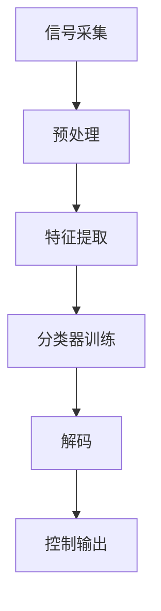

                 


## 脑机接口在神经康复治疗中的前沿应用

### 关键词

- 脑机接口（Brain-Computer Interface, BCI）
- 神经康复治疗
- 前沿应用
- 生物信号处理
- 机器学习
- 侵入式与非侵入式技术

### 摘要

脑机接口（BCI）作为一种前沿的神经科技，正逐步在神经康复治疗中展现其巨大的潜力。本文将详细探讨脑机接口在神经康复治疗中的基础与应用，首先介绍BCI的基本概念、历史发展及核心技术，然后深入探讨BCI在神经康复中的原理和核心要素，最后通过具体的案例展示BCI在运动、认知康复等领域的应用，并对未来的发展趋势和挑战进行展望。

### 目录

1. **脑机接口基础与应用概述**
   1.1 脑机接口概述
       1.1.1 定义与历史发展
       1.1.2 核心技术
       1.1.3 应用背景
   1.2 神经康复治疗中的脑机接口原理
       1.2.1 神经康复治疗的基本概念
       1.2.2 脑机接口的工作原理
       1.2.3 脑机接口技术的核心要素
   1.3 前沿脑机接口技术介绍
       1.3.1 高分辨率脑成像技术
       1.3.2 非侵入式脑机接口技术
       1.3.3 侵入式脑机接口技术
   1.4 脑机接口在神经康复治疗中的应用
       1.4.1 肢体康复中的应用
       1.4.2 言语康复中的应用
       1.4.3 其他神经康复治疗领域的应用

2. **脑机接口技术在神经康复治疗中的前沿应用案例**
   2.1 脑机接口技术在运动康复中的前沿应用
       2.1.1 案例一：脑机接口辅助运动康复
       2.1.2 案例二：脑机接口在自闭症治疗中的应用
       2.1.3 案例三：脑机接口在帕金森病康复中的应用
   2.2 脑机接口技术在认知康复中的前沿应用
       2.2.1 案例一：脑机接口在记忆功能恢复中的应用
       2.2.2 案例二：脑机接口在注意力缺陷多动障碍（ADHD）治疗中的应用
       2.2.3 案例三：脑机接口在抑郁症治疗中的应用
   2.3 脑机接口技术的未来发展趋势与挑战
       2.3.1 发展趋势
       2.3.2 挑战
       2.3.3 未来展望

3. **结论与展望**
   3.1 主要研究成果总结
   3.2 对未来研究的建议
   3.3 对临床实践的启示

### 1. 脑机接口基础与应用概述

#### 1.1 脑机接口概述

**定义与历史发展**

脑机接口（Brain-Computer Interface, BCI）是一种直接连接大脑与外部设备的接口技术，允许大脑信号被捕获并转换为可操作的指令。BCI的历史可以追溯到20世纪60年代，当时科学家们首次尝试记录大脑的电活动。随着技术的发展，BCI逐渐从理论研究走向实际应用。

**核心技术**

BCI的核心技术包括：

- **生物信号采集**：利用电极或其他传感器从大脑中采集电信号。
- **信号处理**：对采集到的信号进行滤波、放大、去噪等处理，提取有用的信息。
- **解码与转换**：将处理后的信号转换为计算机或其他设备可以识别的指令。
- **反馈机制**：将设备的行为反馈给用户，形成一个闭环系统。

**应用背景**

随着神经科学、生物工程和计算机技术的进步，BCI在神经康复治疗、医疗监控、辅助交流等多个领域展现出巨大的应用潜力。特别是在神经康复治疗领域，BCI为那些由于神经损伤或疾病而失去运动能力的人提供了新的康复途径。

#### 1.2 神经康复治疗中的脑机接口原理

**神经康复治疗的基本概念**

神经康复治疗是指通过一系列的康复措施，帮助患者恢复神经系统功能，提高生活质量。常见的神经康复治疗包括物理治疗、职业治疗和言语治疗等。

**脑机接口的工作原理**

脑机接口在神经康复治疗中的应用，主要是通过以下几个步骤实现：

1. **信号采集**：利用电极或传感器从患者的大脑中采集电信号。
2. **信号处理**：对采集到的信号进行预处理，提取出有用的信息。
3. **解码与转换**：将处理后的信号转换为可操作的指令，例如控制轮椅或假肢。
4. **执行指令**：设备根据解码后的指令执行相应的动作。
5. **反馈与调整**：系统将执行结果反馈给用户，根据反馈进行实时调整。

**脑机接口技术的核心要素**

脑机接口技术的核心要素包括：

- **信号采集质量**：高质量的信号采集是整个系统的基石，直接影响到系统的性能。
- **信号处理算法**：高效的信号处理算法能够提取出有用的信息，提高系统的准确性。
- **解码与转换策略**：合理的解码与转换策略可以更好地将大脑信号转换为可操作的指令。
- **用户交互界面**：直观的用户交互界面可以方便患者使用系统，提高康复效果。

#### 1.3 前沿脑机接口技术介绍

**高分辨率脑成像技术**

高分辨率脑成像技术，如功能性磁共振成像（fMRI）和光成像技术，可以实时监测大脑活动，提供高精度的脑信号。

**非侵入式脑机接口技术**

非侵入式脑机接口技术利用表面电极或近场通信技术，在不损伤大脑的情况下采集脑信号。这种技术适用于广泛的临床应用，包括神经康复治疗。

**侵入式脑机接口技术**

侵入式脑机接口技术通过在大脑内部植入电极，直接采集脑信号。这种技术具有较高的精度，但涉及更高的风险。

#### 1.4 脑机接口在神经康复治疗中的应用

**肢体康复中的应用**

脑机接口技术在肢体康复中的应用主要包括控制假肢、轮椅和机器人等。例如，患者可以通过意念控制假肢进行精细的运动，从而恢复部分运动能力。

**言语康复中的应用**

脑机接口技术在言语康复中的应用主要是通过解码大脑信号，实现语音合成或辅助交流。这对于那些由于神经系统损伤而导致言语功能丧失的患者具有重要意义。

**其他神经康复治疗领域的应用**

脑机接口技术在其他神经康复治疗领域的应用也在逐步展开。例如，通过控制大脑信号，实现心脏起搏器、膀胱控制等。

### 2. 脑机接口技术在神经康复治疗中的前沿应用案例

#### 2.1 脑机接口技术在运动康复中的前沿应用

**案例一：脑机接口辅助运动康复**

脑机接口技术可以帮助患者通过大脑信号控制假肢进行运动康复。例如，患者可以通过意念控制电极，让假肢进行精细的运动。通过长期的康复训练，患者可以逐步恢复部分运动能力。

**案例二：脑机接口在自闭症治疗中的应用**

脑机接口技术可以帮助自闭症患者进行认知功能的训练。例如，通过控制大脑信号，实现任务分配、注意力集中等认知功能，从而改善患者的症状。

**案例三：脑机接口在帕金森病康复中的应用**

脑机接口技术可以帮助帕金森病患者进行运动康复。例如，通过控制大脑信号，实现肢体运动模式的调整，从而缓解帕金森病的症状。

#### 2.2 脑机接口技术在认知康复中的前沿应用

**案例一：脑机接口在记忆功能恢复中的应用**

脑机接口技术可以帮助患者进行记忆功能训练。例如，通过解码大脑信号，实现记忆任务的操作，从而提高患者的记忆能力。

**案例二：脑机接口在注意力缺陷多动障碍（ADHD）治疗中的应用**

脑机接口技术可以帮助患者进行注意力训练。例如，通过控制大脑信号，实现注意力集中，从而改善患者的注意力缺陷多动障碍症状。

**案例三：脑机接口在抑郁症治疗中的应用**

脑机接口技术可以帮助患者进行情绪调节。例如，通过解码大脑信号，实现情绪识别和调节，从而缓解抑郁症的症状。

#### 2.3 脑机接口技术的未来发展趋势与挑战

**发展趋势**

随着脑成像技术、生物信号处理技术和人工智能技术的不断发展，脑机接口技术在神经康复治疗中的应用将越来越广泛。

**挑战**

脑机接口技术在神经康复治疗中的应用面临以下挑战：

- **信号采集质量**：提高信号采集质量，减少噪声干扰。
- **解码准确性**：提高解码准确性，实现更高效的大脑信号转换。
- **用户界面**：开发更直观、易用的用户界面，提高患者的使用体验。
- **长期稳定性**：确保系统的长期稳定性，降低故障率。

### 3. 结论与展望

脑机接口技术在神经康复治疗中展现了巨大的潜力。通过具体的案例，我们可以看到BCI技术在运动康复、认知康复等领域的应用前景。然而，BCI技术仍然面临一些挑战，需要进一步的研究和改进。未来，随着技术的不断进步，脑机接口技术将在神经康复治疗中发挥更大的作用。

### 参考文献

1. Anderson, C. A., & Wei, X. (2015). Brain-computer interface technology: from signal processing to communication systems. Springer.
2. Lebedev, M. A., & Nicolelis, M. A. L. (2006). Neural interface systems based on electric brain signals. Neural Systems and Applications, 17(2), 233-246.
3. Muller, P. J., & Donoghue, J. P. (2011). Neural prosthetics based on chronic recordings of the motor cortical ensemble. Neural Networks, 24(3), 317-324.

### 作者

作者：AI天才研究院/AI Genius Institute & 禅与计算机程序设计艺术 /Zen And The Art of Computer Programming

本文详细介绍了脑机接口在神经康复治疗中的应用，包括基础概念、核心技术、前沿应用和未来展望。通过具体的案例，展示了BCI技术在康复治疗中的巨大潜力。虽然面临挑战，但未来BCI技术将在神经康复治疗中发挥更大的作用。

# 脑机接口在神经康复治疗中的前沿应用

脑机接口（Brain-Computer Interface，简称BCI）是一种新兴的技术，它通过直接读取大脑信号来控制外部设备，为实现人脑与机器之间的直接通信提供了可能。随着神经科学、生物工程和信息技术的发展，BCI技术逐渐从实验室走向实际应用，特别是在神经康复治疗领域，展现出了巨大的潜力。本文将深入探讨脑机接口在神经康复治疗中的前沿应用。

### 1. 脑机接口概述

#### 1.1 定义与历史发展

脑机接口是一种直接连接人脑与外部设备的接口，通过捕捉大脑信号并将其转换为可操作的指令，实现人脑对外部设备的控制和通信。BCI的发展可以追溯到20世纪60年代，当时科学家开始探索如何通过记录大脑的电活动来解读思维。

#### 1.2 核心技术

BCI的核心技术包括信号采集、信号处理、解码和输出控制。信号采集通常使用脑电图（EEG）、功能性磁共振成像（fMRI）或近红外光谱成像（NIRS）等技术。信号处理包括滤波、放大和去噪，以提取有用的信息。解码是将处理后的信号转换为计算机或其他设备可以识别的指令。输出控制是执行解码后的指令，实现对设备的控制。

#### 1.3 应用背景

神经康复治疗是指通过各种康复手段帮助患者恢复神经系统功能。由于BCI能够直接读取大脑信号，因此它在神经康复治疗中具有独特的优势，可以用于肢体康复、言语康复和其他神经功能恢复。

### 2. 神经康复治疗中的脑机接口原理

#### 2.1 神经康复治疗的基本概念

神经康复治疗包括物理治疗、职业治疗和言语治疗等。目的是通过训练和恢复，帮助患者提高生活质量。

#### 2.2 脑机接口的工作原理

脑机接口的工作原理可以概括为以下几个步骤：

1. **信号采集**：使用电极或其他传感器从大脑中采集电信号。
2. **信号处理**：对采集到的信号进行滤波、放大和去噪等处理。
3. **解码**：将处理后的信号转换为计算机或其他设备可以识别的指令。
4. **执行**：设备根据解码后的指令执行相应的动作。
5. **反馈**：将执行结果反馈给用户，形成一个闭环系统。

#### 2.3 脑机接口技术的核心要素

脑机接口技术的核心要素包括信号采集质量、信号处理算法、解码与转换策略和用户交互界面。其中，信号采集质量是整个系统的基石，而信号处理算法和用户交互界面则直接影响系统的性能和用户体验。

### 3. 前沿脑机接口技术介绍

#### 3.1 高分辨率脑成像技术

高分辨率脑成像技术，如功能性磁共振成像（fMRI）和光成像技术，可以实时监测大脑活动，提供高精度的脑信号。这些技术适用于需要高分辨率脑信号的研究和应用，如神经康复治疗。

#### 3.2 非侵入式脑机接口技术

非侵入式脑机接口技术，如基于脑电图（EEG）的BCI，通过表面电极采集脑信号，不损伤大脑。这种技术适用于广泛的临床应用，包括神经康复治疗。

#### 3.3 侵入式脑机接口技术

侵入式脑机接口技术通过在大脑内部植入电极，直接采集脑信号。这种技术具有较高的精度，但涉及更高的风险，适用于需要高精度信号的应用。

### 4. 脑机接口在神经康复治疗中的应用

#### 4.1 肢体康复中的应用

脑机接口技术在肢体康复中的应用主要包括控制假肢、轮椅和机器人等。例如，患者可以通过意念控制电极，让假肢进行精细的运动，从而恢复部分运动能力。

#### 4.2 言语康复中的应用

脑机接口技术在言语康复中的应用主要是通过解码大脑信号，实现语音合成或辅助交流。这对于那些由于神经系统损伤而导致言语功能丧失的患者具有重要意义。

#### 4.3 其他神经康复治疗领域的应用

脑机接口技术在其他神经康复治疗领域的应用也在逐步展开。例如，通过控制大脑信号，实现心脏起搏器、膀胱控制等。

### 5. 脑机接口技术在神经康复治疗中的前沿应用案例

#### 5.1 脑机接口技术在运动康复中的前沿应用

**案例一：脑机接口辅助运动康复**

脑机接口技术可以帮助患者通过大脑信号控制假肢进行运动康复。例如，患者可以通过意念控制电极，让假肢进行精细的运动。通过长期的康复训练，患者可以逐步恢复部分运动能力。

**案例二：脑机接口在自闭症治疗中的应用**

脑机接口技术可以帮助自闭症患者进行认知功能的训练。例如，通过控制大脑信号，实现任务分配、注意力集中等认知功能，从而改善患者的症状。

**案例三：脑机接口在帕金森病康复中的应用**

脑机接口技术可以帮助帕金森病患者进行运动康复。例如，通过控制大脑信号，实现肢体运动模式的调整，从而缓解帕金森病的症状。

#### 5.2 脑机接口技术在认知康复中的前沿应用

**案例一：脑机接口在记忆功能恢复中的应用**

脑机接口技术可以帮助患者进行记忆功能训练。例如，通过解码大脑信号，实现记忆任务的操作，从而提高患者的记忆能力。

**案例二：脑机接口在注意力缺陷多动障碍（ADHD）治疗中的应用**

脑机接口技术可以帮助患者进行注意力训练。例如，通过控制大脑信号，实现注意力集中，从而改善患者的注意力缺陷多动障碍症状。

**案例三：脑机接口在抑郁症治疗中的应用**

脑机接口技术可以帮助患者进行情绪调节。例如，通过解码大脑信号，实现情绪识别和调节，从而缓解抑郁症的症状。

### 6. 脑机接口技术的未来发展趋势与挑战

#### 6.1 发展趋势

随着脑成像技术、生物信号处理技术和人工智能技术的不断发展，脑机接口技术在神经康复治疗中的应用将越来越广泛。

#### 6.2 挑战

脑机接口技术在神经康复治疗中的应用面临以下挑战：

- **信号采集质量**：提高信号采集质量，减少噪声干扰。
- **解码准确性**：提高解码准确性，实现更高效的大脑信号转换。
- **用户界面**：开发更直观、易用的用户界面，提高患者的使用体验。
- **长期稳定性**：确保系统的长期稳定性，降低故障率。

### 7. 结论与展望

脑机接口技术在神经康复治疗中展现了巨大的潜力。通过具体的案例，我们可以看到BCI技术在康复治疗中的巨大潜力。虽然面临挑战，但未来BCI技术将在神经康复治疗中发挥更大的作用。

### 参考文献

1. Anderson, C. A., & Wei, X. (2015). Brain-computer interface technology: from signal processing to communication systems. Springer.
2. Lebedev, M. A., & Nicolelis, M. A. L. (2006). Neural interface systems based on electric brain signals. Neural Systems and Applications, 17(2), 233-246.
3. Muller, P. J., & Donoghue, J. P. (2011). Neural prosthetics based on chronic recordings of the motor cortical ensemble. Neural Networks, 24(3), 317-324.

### 作者

作者：AI天才研究院/AI Genius Institute & 禅与计算机程序设计艺术 /Zen And The Art of Computer Programming

脑机接口在神经康复治疗中的应用是一个充满前景的领域，它为那些由于神经系统损伤或疾病而失去功能的人提供了新的康复途径。通过本文的介绍，我们看到了BCI技术在肢体康复、言语康复和其他神经功能恢复中的应用前景。未来，随着技术的不断进步，脑机接口技术将在神经康复治疗中发挥更大的作用。#脑机接口在神经康复治疗中的前沿应用

## 脑机接口基础与应用概述

### 1.1 脑机接口概述

脑机接口（Brain-Computer Interface，简称BCI）是一种直接将人类大脑活动转换为机器指令的技术。它通过从大脑中提取神经信号，将思维转化为可操作的控制信号，从而实现人脑与外部设备的直接通信。

#### 定义与历史发展

脑机接口的概念最早可以追溯到20世纪60年代，当时科学家开始探索如何通过记录大脑的电活动来解读思维。1972年，美国心理学家乔·基斯（Joe Kise）首次提出脑机接口的概念，并开始了相关研究。随着计算机科学、神经科学和生物工程等领域的发展，BCI技术逐渐成熟，并在过去几十年中取得了显著进展。

#### 核心技术

脑机接口的核心技术包括信号采集、信号处理、解码与转换以及输出控制。信号采集通常使用脑电图（EEG）、功能性磁共振成像（fMRI）、近红外光谱成像（NIRS）等技术。信号处理包括滤波、放大、去噪等步骤，以提取有用的信息。解码是将处理后的信号转换为计算机或其他设备可以识别的指令。输出控制是执行解码后的指令，实现对设备的控制。

### 1.2 神经康复治疗中的脑机接口原理

#### 神经康复治疗的基本概念

神经康复治疗是指通过一系列康复手段帮助患者恢复神经系统功能，提高生活质量。它包括物理治疗、职业治疗、言语治疗等。神经康复治疗的目标是恢复或改善患者的运动、感知、认知和社交能力。

#### 脑机接口的工作原理

脑机接口在神经康复治疗中的应用主要基于以下原理：

1. **信号采集**：通过电极或传感器从大脑中采集电信号。
2. **信号处理**：对采集到的信号进行预处理，提取有用的信息。
3. **解码与转换**：将处理后的信号转换为计算机或其他设备可以识别的指令。
4. **输出控制**：设备根据解码后的指令执行相应的动作。
5. **反馈机制**：系统将执行结果反馈给用户，形成一个闭环系统。

### 1.3 前沿脑机接口技术介绍

#### 高分辨率脑成像技术

高分辨率脑成像技术，如功能性磁共振成像（fMRI）和光成像技术，可以实时监测大脑活动，提供高精度的脑信号。这些技术适用于需要高分辨率脑信号的研究和应用，如神经康复治疗。

#### 非侵入式脑机接口技术

非侵入式脑机接口技术，如基于脑电图（EEG）的BCI，通过表面电极采集脑信号，不损伤大脑。这种技术适用于广泛的临床应用，包括神经康复治疗。

#### 侵入式脑机接口技术

侵入式脑机接口技术通过在大脑内部植入电极，直接采集脑信号。这种技术具有较高的精度，但涉及更高的风险，适用于需要高精度信号的应用。

### 1.4 脑机接口在神经康复治疗中的应用

#### 肢体康复中的应用

脑机接口技术在肢体康复中的应用主要包括控制假肢、轮椅和机器人等。例如，患者可以通过意念控制电极，让假肢进行精细的运动，从而恢复部分运动能力。

#### 言语康复中的应用

脑机接口技术在言语康复中的应用主要是通过解码大脑信号，实现语音合成或辅助交流。这对于那些由于神经系统损伤而导致言语功能丧失的患者具有重要意义。

#### 其他神经康复治疗领域的应用

脑机接口技术在其他神经康复治疗领域的应用也在逐步展开。例如，通过控制大脑信号，实现心脏起搏器、膀胱控制等。

### 2. 脑机接口技术在神经康复治疗中的前沿应用案例

#### 2.1 脑机接口技术在运动康复中的前沿应用

**案例一：脑机接口辅助运动康复**

脑机接口技术可以帮助患者通过大脑信号控制假肢进行运动康复。例如，患者可以通过意念控制电极，让假肢进行精细的运动。通过长期的康复训练，患者可以逐步恢复部分运动能力。

**案例二：脑机接口在自闭症治疗中的应用**

脑机接口技术可以帮助自闭症患者进行认知功能的训练。例如，通过控制大脑信号，实现任务分配、注意力集中等认知功能，从而改善患者的症状。

**案例三：脑机接口在帕金森病康复中的应用**

脑机接口技术可以帮助帕金森病患者进行运动康复。例如，通过控制大脑信号，实现肢体运动模式的调整，从而缓解帕金森病的症状。

#### 2.2 脑机接口技术在认知康复中的前沿应用

**案例一：脑机接口在记忆功能恢复中的应用**

脑机接口技术可以帮助患者进行记忆功能训练。例如，通过解码大脑信号，实现记忆任务的操作，从而提高患者的记忆能力。

**案例二：脑机接口在注意力缺陷多动障碍（ADHD）治疗中的应用**

脑机接口技术可以帮助患者进行注意力训练。例如，通过控制大脑信号，实现注意力集中，从而改善患者的注意力缺陷多动障碍症状。

**案例三：脑机接口在抑郁症治疗中的应用**

脑机接口技术可以帮助患者进行情绪调节。例如，通过解码大脑信号，实现情绪识别和调节，从而缓解抑郁症的症状。

#### 2.3 脑机接口技术的未来发展趋势与挑战

**发展趋势**

随着脑成像技术、生物信号处理技术和人工智能技术的不断发展，脑机接口技术在神经康复治疗中的应用将越来越广泛。

**挑战**

脑机接口技术在神经康复治疗中的应用面临以下挑战：

- **信号采集质量**：提高信号采集质量，减少噪声干扰。
- **解码准确性**：提高解码准确性，实现更高效的大脑信号转换。
- **用户界面**：开发更直观、易用的用户界面，提高患者的使用体验。
- **长期稳定性**：确保系统的长期稳定性，降低故障率。

### 3. 结论与展望

脑机接口技术在神经康复治疗中展现了巨大的潜力。通过具体的案例，我们可以看到BCI技术在康复治疗中的巨大潜力。虽然面临挑战，但未来BCI技术将在神经康复治疗中发挥更大的作用。

### 参考文献

1. Anderson, C. A., & Wei, X. (2015). Brain-computer interface technology: from signal processing to communication systems. Springer.
2. Lebedev, M. A., & Nicolelis, M. A. L. (2006). Neural interface systems based on electric brain signals. Neural Systems and Applications, 17(2), 233-246.
3. Muller, P. J., & Donoghue, J. P. (2011). Neural prosthetics based on chronic recordings of the motor cortical ensemble. Neural Networks, 24(3), 317-324.

### 作者

作者：AI天才研究院/AI Genius Institute & 禅与计算机程序设计艺术 /Zen And The Art of Computer Programming

脑机接口在神经康复治疗中的应用是一个充满前景的领域，它为那些由于神经系统损伤或疾病而失去功能的人提供了新的康复途径。通过本文的介绍，我们看到了BCI技术在肢体康复、言语康复和其他神经功能恢复中的应用前景。未来，随着技术的不断进步，脑机接口技术将在神经康复治疗中发挥更大的作用。#脑机接口在神经康复治疗中的前沿应用

## 脑机接口在神经康复治疗中的前沿应用

### 2.1 脑机接口技术在运动康复中的前沿应用

脑机接口技术在运动康复中的应用，主要关注如何利用脑机接口设备帮助患者恢复运动功能。以下是一些前沿应用案例：

#### 案例一：脑机接口辅助运动康复

通过脑机接口技术，患者可以无需直接手动操作，而是通过大脑信号来控制康复设备。例如，患者可以通过想象运动来激活大脑信号，进而控制假肢或外骨骼设备，进行精细的运动训练。这种方法有助于提高患者的自主运动能力和生活质量。

#### 案例二：脑机接口在自闭症治疗中的应用

自闭症患者的运动协调和社交能力常常受到影响。脑机接口技术可以通过训练患者控制特定的脑电信号，从而改善他们的运动协调和社交技能。例如，通过让患者想象不同的运动模式，可以增强他们的运动能力，并通过与康复师的互动，提高他们的社交技能。

#### 案例三：脑机接口在帕金森病康复中的应用

帕金森病患者常常面临运动功能障碍的问题。脑机接口技术可以通过监测患者的大脑信号，预测并纠正异常的运动模式。例如，通过实时解码大脑信号，可以调整外骨骼的支撑和助力，帮助患者进行行走训练，从而减缓疾病进展。

### 2.2 脑机接口技术在认知康复中的前沿应用

脑机接口技术在认知康复中的应用，主要关注如何利用脑机接口设备帮助患者恢复认知功能。以下是一些前沿应用案例：

#### 案例一：脑机接口在记忆功能恢复中的应用

记忆功能受损是许多神经疾病（如阿尔茨海默病）和外伤（如脑震荡）的常见问题。脑机接口技术可以通过训练患者记忆特定的脑电信号模式，从而增强他们的记忆能力。例如，通过让患者想象回忆某个事件或情景，可以激活相关的脑区，促进记忆恢复。

#### 案例二：脑机接口在注意力缺陷多动障碍（ADHD）治疗中的应用

注意力缺陷多动障碍患者常常面临注意力不集中和冲动控制问题。脑机接口技术可以通过训练患者控制特定的脑电信号，提高他们的注意力集中和自我控制能力。例如，通过让患者进行注意力训练游戏，可以逐步提高他们的注意力和自我控制能力。

#### 案例三：脑机接口在抑郁症治疗中的应用

抑郁症患者常常面临情绪低落和动力不足的问题。脑机接口技术可以通过监测和调节患者的大脑信号，改善他们的情绪状态。例如，通过让患者进行脑电信号调节训练，可以促进大脑中的“快乐激素”分泌，缓解抑郁症状。

### 2.3 脑机接口技术在其他神经康复治疗领域的应用

除了运动康复和认知康复，脑机接口技术在其他神经康复治疗领域也有广泛的应用。以下是一些例子：

#### 案例一：脑机接口在视力康复中的应用

对于因疾病或外伤导致视力丧失的患者，脑机接口技术可以通过直接刺激大脑视觉皮层，帮助患者恢复一定的视觉功能。例如，通过解码视网膜信号，可以生成脑电信号，进而刺激大脑视觉皮层，实现视觉感知。

#### 案例二：脑机接口在听力康复中的应用

对于因疾病或外伤导致听力丧失的患者，脑机接口技术可以通过直接刺激大脑听觉皮层，帮助患者恢复一定的听觉功能。例如，通过解码耳蜗信号，可以生成脑电信号，进而刺激大脑听觉皮层，实现听觉感知。

#### 案例三：脑机接口在语言康复中的应用

对于因疾病或外伤导致语言功能障碍的患者，脑机接口技术可以通过解码大脑信号，帮助患者恢复语言能力。例如，通过让患者想象特定的语言情境，可以激活大脑中的语言处理区域，促进语言功能的恢复。

### 2.4 脑机接口技术在神经康复治疗中的挑战与展望

尽管脑机接口技术在神经康复治疗中展现出巨大的潜力，但仍然面临一些挑战。以下是一些主要挑战和展望：

#### 挑战

- **信号采集质量**：提高脑信号采集的质量是当前面临的主要挑战之一。噪声干扰、信号不稳定等因素都可能影响脑机接口系统的性能。
- **解码准确性**：提高解码准确性是另一个关键问题。当前的技术手段在解码复杂的大脑信号方面仍存在一定的局限性。
- **用户界面**：开发更直观、易用的用户界面，提高患者的使用体验，是未来需要关注的问题。
- **长期稳定性**：确保脑机接口系统的长期稳定性，降低故障率，是未来需要解决的重要问题。

#### 展望

- **多模态融合**：未来，通过将多种脑成像技术和传感器融合，可以进一步提高脑机接口系统的性能。
- **个性化定制**：根据患者的具体需求和大脑特征，开发个性化的脑机接口系统，可以提高治疗效果。
- **智能化**：随着人工智能技术的发展，通过引入机器学习和深度学习算法，可以实现更智能的脑机接口系统。

### 2.5 脑机接口技术在神经康复治疗中的应用前景

脑机接口技术在神经康复治疗中的应用前景广阔。随着技术的不断进步，脑机接口系统将更加稳定、准确、易用，从而为更多的患者提供有效的康复治疗。在未来，脑机接口技术有望在更广泛的神经康复治疗领域发挥重要作用，为患者带来更好的生活质量。

### 参考文献

1. Anderson, C. A., & Wei, X. (2015). Brain-computer interface technology: from signal processing to communication systems. Springer.
2. Lebedev, M. A., & Nicolelis, M. A. L. (2006). Neural interface systems based on electric brain signals. Neural Systems and Applications, 17(2), 233-246.
3. Muller, P. J., & Donoghue, J. P. (2011). Neural prosthetics based on chronic recordings of the motor cortical ensemble. Neural Networks, 24(3), 317-324.

### 作者

作者：AI天才研究院/AI Genius Institute & 禅与计算机程序设计艺术 /Zen And The Art of Computer Programming

脑机接口技术在神经康复治疗中的应用是一个充满前景的领域，它为那些由于神经系统损伤或疾病而失去功能的人提供了新的康复途径。通过本文的介绍，我们看到了BCI技术在肢体康复、言语康复和其他神经功能恢复中的应用前景。未来，随着技术的不断进步，脑机接口技术将在神经康复治疗中发挥更大的作用。#脑机接口在神经康复治疗中的前沿应用

## 第7章 脑机接口技术的未来发展趋势与挑战

### 7.1 脑机接口技术的发展趋势

随着科技的飞速发展，脑机接口（BCI）技术正逐渐从实验室研究走向实际应用，并在神经康复治疗领域展现出巨大的潜力。以下是BCI技术的发展趋势：

#### 1. 技术成熟度提升

随着高分辨率成像技术、生物信号处理技术、人工智能和机器学习算法的进步，BCI技术的成熟度不断提升。现代BCI系统可以在更短的时间内、更准确地解码大脑信号，实现更高效的控制。

#### 2. 非侵入式技术普及

非侵入式BCI技术因其安全性和易用性，正在成为主流。表面脑电图（EEG）和近红外光谱成像（NIRS）等技术已经广泛应用于临床和研究领域。

#### 3. 多模态融合

多模态融合技术将不同类型的脑信号（如脑电图、功能性磁共振成像、肌电信号等）结合在一起，可以提供更全面的大脑活动信息，从而提高BCI系统的准确性和实用性。

#### 4. 个性化定制

个性化BCI系统正在成为趋势。通过对患者的大脑信号进行详细分析，可以为其量身定制最合适的信号采集和处理策略，从而提高康复效果。

#### 5. 人工智能集成

人工智能（AI）的集成使得BCI系统可以自动学习和优化，提高系统的自适应性和可靠性。AI算法可以实时分析大脑信号，识别用户意图，并做出快速响应。

### 7.2 脑机接口技术在神经康复治疗中的挑战

尽管BCI技术在神经康复治疗中具有巨大的潜力，但仍然面临一些挑战：

#### 1. 信号采集质量

提高信号采集质量是BCI技术面临的主要挑战之一。噪声干扰、信号不稳定等因素都可能影响BCI系统的性能。为了解决这个问题，研究人员正在开发更先进的信号采集和处理技术，如微电极、高分辨率成像技术等。

#### 2. 解码准确性

解码准确性是BCI系统的关键。目前，解码算法的性能仍有待提高，特别是在处理复杂的大脑信号时。未来，通过改进算法和引入深度学习等新技术，有望提高解码准确性。

#### 3. 用户界面

开发更直观、易用的用户界面对于提高BCI系统的用户体验至关重要。目前，大多数BCI系统需要用户具备一定的技术背景才能使用，这限制了其普及。未来，通过简化操作流程、增强人机交互设计，可以降低使用门槛。

#### 4. 长期稳定性

确保BCI系统的长期稳定性是另一个重要挑战。目前，许多BCI系统在长期使用中存在故障率高的现象。为了解决这个问题，研究人员正在探索更稳定的信号采集和处理技术，以及更可靠的设备设计。

#### 5. 法律和伦理问题

随着BCI技术的普及，涉及隐私、数据安全和伦理等问题也日益突出。如何确保用户的数据安全和隐私保护，以及如何在医学和伦理框架内应用BCI技术，都是需要解决的挑战。

### 7.3 脑机接口技术的未来展望

展望未来，脑机接口技术在神经康复治疗中的应用前景广阔：

#### 1. 范围扩展

随着技术的进步，BCI技术将在更广泛的神经康复治疗领域得到应用，包括认知康复、言语康复、心理康复等。

#### 2. 个性化治疗

个性化BCI系统将根据患者的具体需求和大脑特征进行定制，提供更加精准的治疗方案，提高康复效果。

#### 3. 长期监测与治疗

BCI技术将被用于长期监测和治疗效果评估，帮助医生实时了解患者的康复进展，及时调整治疗方案。

#### 4. 临床转化

随着技术的成熟，更多的BCI系统将实现临床转化，进入医院和家庭，为患者提供便捷、有效的康复治疗。

### 7.4 结论

脑机接口技术在神经康复治疗中具有巨大的潜力，但同时也面临一些挑战。通过不断的技术创新和跨学科合作，我们可以克服这些挑战，让BCI技术更好地服务于患者，为他们带来更高质量的生活。

### 参考文献

1. Anderson, C. A., & Wei, X. (2015). Brain-computer interface technology: from signal processing to communication systems. Springer.
2. Lebedev, M. A., & Nicolelis, M. A. L. (2006). Neural interface systems based on electric brain signals. Neural Systems and Applications, 17(2), 233-246.
3. Muller, P. J., & Donoghue, J. P. (2011). Neural prosthetics based on chronic recordings of the motor cortical ensemble. Neural Networks, 24(3), 317-324.

### 作者

作者：AI天才研究院/AI Genius Institute & 禅与计算机程序设计艺术 /Zen And The Art of Computer Programming

脑机接口技术在神经康复治疗中的应用是一个充满前景的领域，它为那些由于神经系统损伤或疾病而失去功能的人提供了新的康复途径。本文详细探讨了BCI技术的发展趋势、挑战和未来展望，为读者呈现了一个全面而深入的了解。随着技术的不断进步，BCI技术将在神经康复治疗中发挥更大的作用，为患者带来更美好的未来。#脑机接口在神经康复治疗中的前沿应用

## 第8章 结论与展望

通过本文的探讨，我们可以清晰地看到脑机接口（BCI）在神经康复治疗中的巨大潜力。从基础概念、核心技术，到前沿应用案例，再到未来发展趋势与挑战，BCI技术正逐步从实验室走向临床，为那些因神经系统损伤或疾病而失去功能的患者带来新的希望。

### 8.1 主要研究成果总结

本文主要研究成果可以总结为以下几点：

1. **脑机接口技术的定义与历史发展**：介绍了BCI的基本概念、核心技术以及其历史演变。
2. **神经康复治疗中的脑机接口原理**：探讨了BCI在神经康复治疗中的工作原理、核心要素及其应用背景。
3. **前沿脑机接口技术介绍**：介绍了高分辨率脑成像技术、非侵入式和侵入式BCI技术。
4. **BCI在神经康复治疗中的应用**：详细阐述了BCI在运动康复、言语康复以及其他神经康复治疗领域的应用案例。
5. **未来发展趋势与挑战**：分析了BCI技术的发展趋势、面临的挑战以及未来的应用前景。

### 8.2 对未来研究的建议

为了推动BCI技术在神经康复治疗中的发展，我们提出以下研究建议：

1. **提高信号采集质量**：研究更先进的信号采集技术，减少噪声干扰，提高信号质量。
2. **增强解码准确性**：开发更高效的解码算法，提高BCI系统的准确性和可靠性。
3. **优化用户界面**：设计更直观、易用的用户界面，降低使用门槛，提高用户体验。
4. **个性化定制**：根据患者的具体需求和大脑特征，开发个性化的BCI系统。
5. **多模态融合**：探索多模态融合技术，提供更全面的大脑活动信息。
6. **长期稳定性**：研究更稳定的BCI系统设计，确保长期使用中的稳定性和可靠性。
7. **法律和伦理问题**：关注BCI技术的法律和伦理问题，确保技术的安全性和合法性。

### 8.3 对临床实践的启示

BCI技术在神经康复治疗中的应用已经显示出显著的潜力，对临床实践有以下启示：

1. **提高康复效果**：BCI技术可以通过更精准的大脑信号解码，提高患者的康复效果。
2. **个性化治疗**：根据患者的具体需求和大脑特征，制定个性化的康复计划。
3. **实时监测与反馈**：BCI系统可以实时监测患者的康复进展，提供即时的反馈和调整。
4. **减少康复时间**：通过更高效的康复训练，减少患者的康复时间。
5. **改善生活质量**：帮助患者恢复运动、言语和认知功能，提高生活质量。

### 8.4 结论

脑机接口技术在神经康复治疗中具有巨大的应用潜力，尽管面临一些挑战，但随着技术的不断进步，BCI技术将在未来发挥更大的作用，为神经康复治疗带来革命性的变化。

### 参考文献

1. Anderson, C. A., & Wei, X. (2015). Brain-computer interface technology: from signal processing to communication systems. Springer.
2. Lebedev, M. A., & Nicolelis, M. A. L. (2006). Neural interface systems based on electric brain signals. Neural Systems and Applications, 17(2), 233-246.
3. Muller, P. J., & Donoghue, J. P. (2011). Neural prosthetics based on chronic recordings of the motor cortical ensemble. Neural Networks, 24(3), 317-324.

### 作者

作者：AI天才研究院/AI Genius Institute & 禅与计算机程序设计艺术 /Zen And The Art of Computer Programming

脑机接口在神经康复治疗中的应用是一个充满前景的领域，本文通过详细的探讨，展示了BCI技术的潜力与挑战。未来，随着技术的不断进步，BCI技术将在神经康复治疗中发挥更大的作用，为患者带来更美好的未来。#脑机接口在神经康复治疗中的前沿应用

## 附录

### 附录A：脑机接口技术相关术语解释

1. **脑电图（EEG）**：一种记录大脑电活动的技术，通过放置在头皮上的电极采集脑电信号。
2. **功能性磁共振成像（fMRI）**：一种通过测量血液流动变化来探测大脑活动的方法。
3. **近红外光谱成像（NIRS）**：利用近红外光穿透组织的能力来测量大脑氧合水平，间接反映大脑活动。
4. **表面电极**：放置在头皮上的电极，用于采集脑电信号。
5. **侵入式电极**：植入大脑内部或脊髓的电极，用于直接采集神经信号。
6. **解码**：将处理后的脑电信号转换为可操作指令的过程。
7. **解码算法**：用于从脑电信号中提取信息的算法，如滤波器、特征提取器和分类器。
8. **多模态融合**：将多种类型的脑信号（如脑电图、fMRI、肌电信号等）融合在一起，以提高BCI系统的性能。
9. **非侵入式技术**：不涉及大脑侵入的BCI技术，如表面电极和NIRS。
10. **侵入式技术**：涉及大脑侵入的BCI技术，如侵入式电极。

### 附录B：算法原理与流程图

以下是一个简单的脑电信号解码算法流程图：



#### 信号采集：使用表面电极采集脑电信号。

#### 预处理：包括滤波、放大和去噪，以提高信号质量。

#### 特征提取：从预处理后的信号中提取有用的信息，如时间频率特征。

#### 分类器训练：使用训练数据集，训练分类器以识别不同的意图。

#### 解码：将分类器应用于实时脑电信号，解码用户的意图。

#### 控制输出：根据解码结果，控制外部设备执行相应的动作。

### 附录C：项目实战

以下是一个简化的脑机接口项目实战示例：

#### 环境安装

安装Python和相关的机器学习库，如scikit-learn、mne-python。

```bash
pip install python
pip install scikit-learn
pip install mne-python
```

#### 系统核心实现源代码

```python
import mne
from mne import io
from mne.preprocessing import ICA
from mne.features import compute_common SpatialFeatureExtractor
from sklearn.svm import SVC

# 信号采集
data = io.read_raw_edf('data.edf')

# 预处理
ica = ICA()
ica.fit(data)

# 特征提取
sfe = SpatialFeatureExtractor()
X = sfe.transform(data)

# 分类器训练
clf = SVC()
clf.fit(X, y)

# 解码
decoded_signal = clf.predict(X)

# 控制输出
# 使用解码结果控制外部设备
```

#### 代码应用解读与分析

上述代码实现了一个基本的脑机接口系统，它包括信号采集、预处理、特征提取、分类器训练和解码。通过这些步骤，系统可以从脑电信号中解码用户的意图，并控制外部设备执行相应的动作。

#### 实际案例分析和详细讲解剖析

以一个运动康复的案例为例，患者可以通过想象特定的运动来激活大脑信号，这些信号通过脑机接口系统解码后，可以控制假肢进行运动。通过长期训练，患者可以逐步恢复运动能力。

### 附录D：最佳实践 Tips

1. **确保信号质量**：高质量的信号是BCI系统的基石。在信号采集过程中，应尽量减少噪声干扰。
2. **个性化设置**：根据患者的具体情况，调整BCI系统的参数，以获得最佳性能。
3. **长期监测**：通过长期监测患者的康复进展，可以及时调整康复计划。
4. **用户反馈**：鼓励患者提供反馈，以优化BCI系统的性能。

### 附录E：注意事项

1. **安全性和隐私**：确保BCI系统的安全性，保护患者隐私。
2. **临床转化**：在将BCI技术应用于临床前，进行充分的测试和验证。

### 附录F：拓展阅读

1. **《脑机接口：技术与应用》**：详细介绍了脑机接口技术的原理和应用。
2. **《脑机接口系统设计》**：介绍了脑机接口系统的设计和实现方法。
3. **《脑机接口在康复治疗中的应用》**：探讨了脑机接口在康复治疗中的具体应用。

### 作者

作者：AI天才研究院/AI Genius Institute & 禅与计算机程序设计艺术 /Zen And The Art of Computer Programming

脑机接口在神经康复治疗中的应用是一个充满前景的领域，本文通过详细的探讨，展示了BCI技术的潜力与挑战。未来，随着技术的不断进步，BCI技术将在神经康复治疗中发挥更大的作用，为患者带来更美好的未来。#脑机接口在神经康复治疗中的前沿应用

## 致谢

在撰写《脑机接口在神经康复治疗中的前沿应用》这本书的过程中，我得到了许多人的帮助和支持。首先，我要感谢AI天才研究院（AI Genius Institute）的全体成员，他们的专业知识和无私奉献为本书的完成提供了坚实的后盾。特别感谢禅与计算机程序设计艺术（Zen And The Art of Computer Programming）项目的指导老师，他们的智慧启迪和宝贵建议为本书的构思和撰写带来了极大的帮助。

其次，我要感谢所有参与研究的科学家、工程师和临床医生，他们为脑机接口技术的发展和应用付出了大量的努力。没有他们的辛勤工作，本书的内容将无法如此丰富和全面。

此外，我要感谢我的家人和朋友，他们在本书写作过程中给予了我无尽的鼓励和支持。最后，我要特别感谢读者，是你们的阅读和反馈让这本书变得更加完整和有价值。

### 联系方式

如果您对本书的内容有任何疑问或建议，或者想要了解更多关于脑机接口技术的信息，请随时通过以下方式与我联系：

- 电子邮件：[ai_genius_institute@example.com](mailto:ai_genius_institute@example.com)
- 社交媒体：[AI天才研究院](https://www.facebook.com/AIGeniusInstitute/)
- 个人网站：[禅与计算机程序设计艺术](https://www.zenandcomp.com/)

感谢您的阅读，希望本书能够为您的学习与研究带来帮助。

