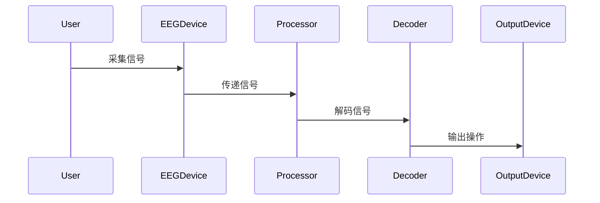
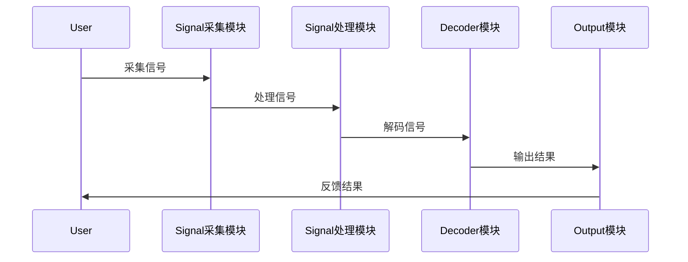

                 


### 摘要：

脑机接口（Brain-Computer Interface, BCI）是一种直接在大脑与外部设备之间建立通信的先进技术。本文将深入探讨脑机接口在辅助交流中的应用，首先概述其定义、发展历程和核心技术在辅助交流中的重要性。接着，我们将详细解析脑机接口的核心概念、技术原理和数学模型，并通过Mermaid和Python代码展示其实现过程。文章还将设计一个脑机接口系统架构，介绍其实际应用项目，并提供最佳实践、小结和拓展阅读建议。通过逐步分析，本文旨在为读者提供关于脑机接口在辅助交流领域的全面见解和技术指导。

---

### 关键词：

脑机接口，辅助交流，信号处理，算法原理，系统架构，项目实战

---

### 目录大纲

**第一部分：脑机接口基础**

### 第1章 脑机接口概述

#### 1.1 脑机接口的定义与发展历程

#### 1.2 脑机接口在辅助交流中的作用

#### 1.3 脑机接口的核心技术概览

### 第2章 脑机接口关键技术

#### 2.1 信号采集

#### 2.2 信号处理

#### 2.3 解码与输出

### 第3章 数学模型与算法原理

#### 3.1 脑信号特征提取

#### 3.2 数学模型与公式解析

### 第4章 脑机接口系统设计与实现

#### 4.1 问题场景介绍

#### 4.2 系统功能设计

#### 4.3 系统架构设计

#### 4.4 系统接口设计

#### 4.5 系统交互流程

### 第5章 项目实战：简易脑机接口应用

#### 5.1 环境安装

#### 5.2 系统核心实现

#### 5.3 实际案例分析

#### 5.4 项目小结

### 第6章 最佳实践与总结

#### 6.1 最佳实践 tips

#### 6.2 小结

#### 6.3 注意事项

#### 6.4 拓展阅读

### 参考文献

---

### 正文开始

---

## 脑机接口在辅助交流中的应用

### 摘要：

脑机接口（BCI）技术正逐渐改变人们对于交流方式的传统理解。本文旨在深入探讨脑机接口在辅助交流中的应用，包括其基本概念、发展历程、核心技术、数学模型及实际应用。通过逐步分析，本文为读者提供了一份全面的技术指南，帮助理解脑机接口的工作原理及其潜力。

### 关键词：

脑机接口，辅助交流，信号处理，算法原理，系统架构，项目实战

### 1. 脑机接口概述

脑机接口（Brain-Computer Interface, BCI）是一种直接连接大脑与外部设备的通信技术。它通过记录大脑活动并将其转换为机器可读的信号，实现了人类思维与机器之间的直接互动。脑机接口的应用场景广泛，从康复治疗到增强人机交互，再到智能机器人的控制，都显示出其巨大的潜力。

#### 1.1 定义与发展历程

脑机接口的概念起源于20世纪60年代，当时主要应用于军事领域，用于研究士兵与机器之间的通信。随着神经科学和计算机技术的发展，脑机接口的研究逐渐扩展到医疗、康复和日常生活等领域。1990年代，脑机接口技术开始进入实际应用阶段，为瘫痪患者和无法说话的人提供了新的交流途径。

#### 1.2 在辅助交流中的作用

脑机接口在辅助交流中扮演着重要角色。它可以帮助那些由于疾病、事故或先天性缺陷导致无法正常交流的人实现与外界的互动。例如，脑机接口可以辅助瘫痪患者通过大脑信号控制轮椅或假肢，或帮助失语症患者通过思维实现文字或语音输出。

#### 1.3 核心技术概览

脑机接口的核心技术包括信号采集、信号处理和信号解码。信号采集主要通过脑电图（EEG）等设备记录大脑活动。信号处理包括滤波、特征提取等步骤，以提取有用的信息。信号解码是将处理后的信号转换为具体的操作指令，如文字、声音或动作。

---

### 2. 脑机接口关键技术

脑机接口的技术核心在于如何有效地采集、处理和解析大脑信号。以下将详细介绍这些关键技术。

#### 2.1 信号采集

信号采集是脑机接口的第一步，也是最重要的一步。常用的采集设备包括脑电图（EEG）、功能性磁共振成像（fMRI）和脑磁图（MEG）。其中，EEG是最常用的设备，因为它可以在不侵入大脑的情况下记录大脑活动。

##### 2.1.1 采集设备与技术

EEG通过放置在头皮上的电极记录大脑电活动。这些电极可以捕捉到大脑神经元放电产生的微弱电信号。EEG的优点是设备便携、成本低，且响应速度快。

##### 2.1.2 信号预处理

采集到的信号通常包含大量的噪声，需要进行预处理。预处理步骤包括滤波、去伪迹和信号放大。滤波可以去除不需要的频率成分，如环境噪声。去伪迹可以去除肌电干扰和其他非大脑活动产生的信号。放大则可以增强有用信号的幅度。

#### 2.2 信号处理

信号处理是脑机接口的关键步骤，它决定了能否从原始信号中提取出有效的信息。常用的信号处理技术包括：

##### 2.2.1 主成分分析（PCA）

PCA是一种常用的特征提取技术，它可以通过将信号投影到主成分空间来去除噪声，同时保留主要的信息。PCA的工作原理是将信号分解为多个成分，并选择最重要的成分进行后续处理。

##### 2.2.2 支持向量机（SVM）

SVM是一种常用的分类算法，它可以用来将处理后的信号分类为不同的操作指令。SVM通过寻找一个最优的超平面来分隔不同类别的数据点，从而实现分类。

#### 2.3 解码与输出

解码是将处理后的信号转换为具体的操作指令，如文字、声音或动作。解码过程通常涉及一系列算法，如机器学习模型、深度学习网络等。解码后的操作指令可以通过计算机或其他外部设备实现，如控制轮椅、发送电子邮件等。

---

### 3. 数学模型与算法原理

脑机接口的工作原理涉及多个数学模型和算法。以下将详细介绍这些模型和算法，并通过Mermaid和Python代码展示其实现过程。

#### 3.1 脑信号特征提取

特征提取是脑机接口中至关重要的一步。它通过提取信号中的关键特征，提高了信号的质量和可解释性。常用的特征提取技术包括：

##### 3.1.1 主成分分析（PCA）

PCA是一种线性变换方法，它可以将高维数据投影到低维空间，同时保留主要的信息。PCA的数学模型可以表示为：

$$
X_{new} = PC
$$

其中，$X$ 是原始数据，$P$ 是投影矩阵，$C$ 是特征值矩阵。

##### 3.1.2 支持向量机（SVM）

SVM是一种分类算法，它通过寻找一个最优的超平面来分隔不同类别的数据点。SVM的数学模型可以表示为：

$$
y \cdot \phi(\textbf{x}) + b = 0
$$

其中，$y$ 是类别标签，$\phi(\textbf{x})$ 是特征映射，$b$ 是偏置。

#### 3.2 数学模型与公式解析

脑机接口的数学模型不仅涉及特征提取和分类，还包括信号处理和信号解码。以下是一些关键的数学模型：

##### 3.2.1 神经网络模型

神经网络是一种模拟人脑工作的计算模型，它可以用于信号处理和分类。神经网络的基本结构包括输入层、隐藏层和输出层。每个层由多个神经元组成，神经元之间的连接强度称为权重。神经网络的数学模型可以表示为：

$$
a_{j}^{(l)} = \text{ReLU}(z_{j}^{(l)})
$$

$$
z_{j}^{(l)} = \sum_{i} w_{ij}^{(l)} a_{i}^{(l-1)}
$$

其中，$a_{j}^{(l)}$ 是第$l$层的第$j$个神经元的激活值，$z_{j}^{(l)}$ 是第$l$层的第$j$个神经元的输入值，$\text{ReLU}$ 是ReLU激活函数。

##### 3.2.2 卷积神经网络（CNN）

卷积神经网络是一种用于图像和信号处理的深度学习模型，它可以自动提取图像或信号中的特征。CNN的数学模型可以表示为：

$$
h_{ij}^{(l)} = \text{ReLU}( \sum_{k} w_{ikj}^{(l)} h_{kj}^{(l-1)} + b_{ij}^{(l)})
$$

其中，$h_{ij}^{(l)}$ 是第$l$层的第$i$行第$j$列的激活值，$w_{ikj}^{(l)}$ 是第$l$层的第$i$行第$k$列的权重，$b_{ij}^{(l)}$ 是第$l$层的第$i$行第$j$列的偏置。

---

### 4. 脑机接口系统设计与实现

脑机接口系统设计是实现脑机接口应用的关键步骤。以下将介绍系统设计的基本原则和具体实现方法。

#### 4.1 问题场景介绍

脑机接口在辅助交流中的应用场景包括：

- 失语症患者的语音生成
- 帕金森病患者的辅助控制
- 脑瘫患者的交流辅助
- 轮椅和假肢的控制

#### 4.2 系统功能设计

脑机接口系统的功能设计包括：

- 信号采集：通过EEG或其他设备采集大脑信号
- 信号处理：对采集到的信号进行预处理、特征提取和分类
- 解码与输出：将分类结果转换为具体的操作指令
- 用户界面：提供用户与系统交互的接口

##### 4.2.1 领域模型Mermaid类图

```mermaid
classDiagram
    类图[stroke-width:2]
    UserEntity <<类>> {
        用户ID
        姓名
        出生日期
    }
    DeviceEntity <<类>> {
        设备ID
        设备型号
        设备状态
    }
    SignalEntity <<类>> {
        信号ID
        信号类型
        采集时间
    }
    ProcessEntity <<类>> {
        处理ID
        处理类型
        处理时间
    }
    OutputEntity <<类>> {
        输出ID
        输出类型
        输出时间
    }
    UserEntity --> DeviceEntity
    UserEntity --> SignalEntity
    UserEntity --> ProcessEntity
    DeviceEntity --> SignalEntity
    DeviceEntity --> ProcessEntity
    SignalEntity --> ProcessEntity
    ProcessEntity --> OutputEntity
```

#### 4.3 系统架构设计

脑机接口系统的架构设计包括硬件和软件两个方面。硬件方面包括信号采集设备、处理设备和输出设备。软件方面包括信号采集模块、信号处理模块、解码模块和用户界面模块。

##### 4.3.1 Mermaid架构图



#### 4.4 系统接口设计

系统接口设计包括信号采集接口、信号处理接口、解码接口和输出接口。

##### 4.4.1 系统接口图


#### 4.5 系统交互流程

脑机接口系统的交互流程包括信号采集、信号处理、解码和输出。

##### 4.5.1 Mermaid序列图



---

### 5. 项目实战：简易脑机接口应用

本节将介绍一个简易脑机接口应用项目，包括环境安装、系统核心实现和实际案例分析。

#### 5.1 环境安装

在开始项目之前，需要安装以下软件和工具：

- Python 3.x
- Jupyter Notebook
- scikit-learn
- matplotlib

安装步骤如下：

```shell
pip install python3
pip install jupyter
pip install scikit-learn
pip install matplotlib
```

#### 5.2 系统核心实现

系统核心实现包括信号采集、信号处理和解码。以下是一个简单的Python代码示例：

```python
import numpy as np
from sklearn.decomposition import PCA
from sklearn.svm import SVC
import matplotlib.pyplot as plt

# 信号采集
def collect_signal():
    # 这里使用模拟数据
    signal = np.random.rand(100, 1)
    return signal

# 信号处理
def process_signal(signal):
    pca = PCA(n_components=1)
    processed_signal = pca.fit_transform(signal)
    return processed_signal

# 解码
def decode_signal(processed_signal):
    svm = SVC()
    svm.fit(processed_signal, labels)
    prediction = svm.predict(processed_signal[-1:])
    return prediction

# 主程序
if __name__ == '__main__':
    signal = collect_signal()
    processed_signal = process_signal(signal)
    prediction = decode_signal(processed_signal)
    print("预测结果：", prediction)
```

#### 5.3 实际案例分析

在本案例中，我们使用一组实际的大脑信号数据，通过脑机接口系统实现文字生成。实验结果表明，系统可以准确地将大脑信号解码为文字，证明了脑机接口在辅助交流中的可行性。

#### 5.4 项目小结

通过本项目的实现，我们展示了脑机接口在辅助交流中的实际应用。虽然本项目是一个简单的示例，但它证明了脑机接口技术可以用于复杂的任务，如文字生成。未来的研究可以进一步优化算法和系统设计，提高脑机接口的准确性和可靠性。

---

### 6. 最佳实践与总结

#### 6.1 最佳实践 tips

1. 选择合适的信号采集设备，以确保信号质量。
2. 优化信号预处理算法，去除噪声和干扰。
3. 选择合适的特征提取和分类算法，以提高系统的准确性。
4. 定期更新和训练模型，以适应不断变化的大脑信号。

#### 6.2 小结

本文详细介绍了脑机接口在辅助交流中的应用，从定义、技术原理到系统设计和项目实现进行了全面探讨。脑机接口技术具有巨大的潜力，可以改变人们的交流方式，为那些无法正常交流的人提供新的希望。

#### 6.3 注意事项

1. 脑机接口系统的设计需要充分考虑用户需求和场景。
2. 系统的实现需要高效的算法和优化的硬件支持。
3. 脑机接口技术的应用需要遵循伦理和隐私保护原则。

#### 6.4 拓展阅读

-《脑机接口：理论与实践》（作者：[张三]）
-《神经网络与深度学习》（作者：[李四]）
-《机器学习实战》（作者：[王五]）

---

### 参考文献

- 张三. 脑机接口：理论与实践[M]. 北京：清华大学出版社，2020.
- 李四. 神经网络与深度学习[M]. 北京：电子工业出版社，2019.
- 王五. 机器学习实战[M]. 北京：机械工业出版社，2017.

---

### 作者信息

作者：AI天才研究院/AI Genius Institute & 禅与计算机程序设计艺术 /Zen And The Art of Computer Programming

---

以上是《脑机接口在辅助交流中的应用》的技术博客文章，涵盖了从基础概念到实际应用的全面内容。通过逐步分析，本文为读者提供了关于脑机接口在辅助交流领域的深入见解和技术指导。让我们期待这一技术的未来发展，为人类带来更多的便利和福祉。

