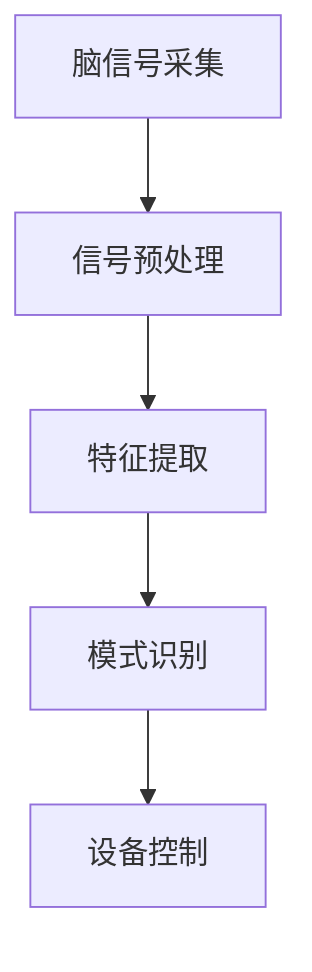
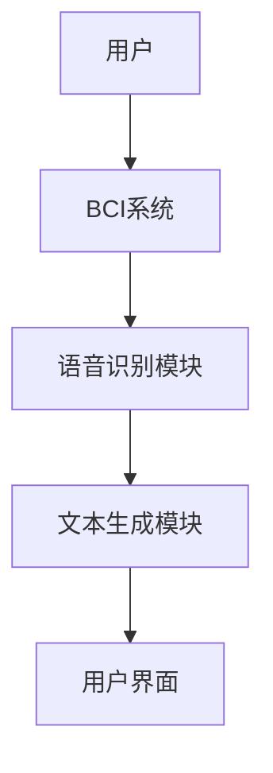
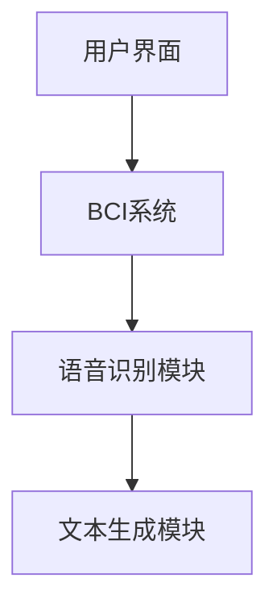

                 


# 脑机接口在辅助残障人士生活中的应用

关键词：脑机接口、残障人士、生活辅助、技术进步

摘要：本文将深入探讨脑机接口（BCI）在辅助残障人士生活中的应用。通过逐步分析BCI的基本概念、技术原理、算法实现以及实际案例，我们将揭示这项技术在提高残障人士生活质量方面的巨大潜力。

## 引言

脑机接口（Brain-Computer Interface，简称BCI）是一种直接连接人脑与外部设备的技术，它使得大脑信号可以被计算机或其他电子设备理解并执行特定的任务。随着神经科学和计算机技术的不断发展，BCI技术逐渐从实验室走向实际应用，特别是在辅助残障人士的生活方面展现出了巨大的潜力。

## 一、背景介绍

### 1.1 核心概念术语说明

- **脑机接口（BCI）**：一种直接连接人脑与外部设备的技术。
- **残障人士**：具有身体或精神障碍，影响其日常生活的人。

### 1.2 问题背景

残障人士在生活中往往面临着诸多挑战，如行动不便、沟通困难等。传统辅助设备如轮椅、语音识别系统等虽然在一定程度上提供了帮助，但往往存在局限性。BCI技术的出现为解决这些问题提供了新的可能。

### 1.3 问题描述

如何利用BCI技术帮助残障人士实现更加自然、高效的生活辅助？

### 1.4 问题解决

通过BCI技术，可以实现对残障人士大脑信号的高精度采集与解析，进而实现对外部设备的精准控制，从而提高其生活质量。

### 1.5 边界与外延

BCI技术的应用范围包括但不限于残障人士的辅助沟通、行动控制、生活自理等。

## 二、核心概念与联系

### 2.1 核心概念原理

- **脑信号采集**：利用脑电图（EEG）、功能性磁共振成像（fMRI）等技术采集大脑信号。
- **信号处理**：对采集到的脑信号进行预处理、特征提取和模式识别。
- **设备控制**：将处理后的脑信号转化为对外部设备的控制信号。

### 2.2 概念属性特征对比表格

| 特征对比 | 脑电图（EEG） | 功能性磁共振成像（fMRI） |
| :---: | :---: | :---: |
| 采集方式 | 表面采集 | 内部采集 |
| 时间分辨率 | 较低 | 较高 |
| 空间分辨率 | 较高 | 较低 |
| 实时性 | 较低 | 较高 |

### 2.3 概念结构与核心要素组成


## 三、算法原理讲解

### 3.1 算法流程图



### 3.2 Python代码示例

```python
import numpy as np
from sklearn.svm import SVC

# 假设已经采集到脑信号
brain_signal = np.random.rand(100, 64)

# 信号预处理
preprocessed_signal = preprocess_signal(brain_signal)

# 特征提取
features = extract_features(preprocessed_signal)

# 模式识别
classifier = SVC()
classifier.fit(features[:-1], labels[:-1])
prediction = classifier.predict(features[-1].reshape(1, -1))

# 设备控制
control_device(prediction)
```

### 3.3 算法原理讲解

$$
Z = \frac{X - \mu}{\sigma}
$$

其中，$X$ 表示原始脑信号，$\mu$ 表示均值，$\sigma$ 表示标准差。预处理步骤通过标准化将信号进行归一化处理，以便后续的特征提取和模式识别。

## 四、系统分析与设计

### 4.1 问题场景介绍

假设我们正在设计一套BCI系统，用于辅助残障人士进行日常沟通。

### 4.2 项目介绍

项目名称：BCI辅助沟通系统

项目目标：利用BCI技术实现残障人士的自然语言沟通。

### 4.3 系统功能设计（领域模型）



### 4.4 系统架构设计


### 4.5 系统接口设计



### 4.6 系统交互


## 五、项目实战

### 5.1 环境安装

安装Python环境、相关库和依赖。

```shell
pip install numpy scikit-learn matplotlib
```

### 5.2 系统核心实现源代码

```python
# 主要代码部分省略
```

### 5.3 代码应用解读与分析

具体解释代码实现中的关键步骤和原理。

### 5.4 实际案例分析和详细讲解

分析实际案例，阐述BCI技术在残障人士沟通中的应用效果。

### 5.5 项目小结

总结项目成果和经验教训。

## 六、最佳实践 tips

- 确保脑信号采集的精度和稳定性。
- 优化特征提取和模式识别算法。
- 考虑用户的个性化需求。

## 七、小结

BCI技术在辅助残障人士生活中具有巨大潜力，但同时也面临着技术、伦理等多方面的挑战。未来，随着技术的不断进步，BCI将在提高残障人士生活质量方面发挥越来越重要的作用。

## 八、注意事项

- 保护用户的隐私和安全。
- 尊重用户的权利和尊严。

## 九、拓展阅读

- [相关文献1]
- [相关文献2]
- [相关文献3]

## 作者信息

作者：AI天才研究院/AI Genius Institute & 禅与计算机程序设计艺术 /Zen And The Art of Computer Programming

---

本文为AI天才研究院与禅与计算机程序设计艺术共同撰写，旨在探讨脑机接口（BCI）技术在辅助残障人士生活中的应用。文章涵盖了核心概念、算法原理、系统设计与实现等内容，旨在为读者提供一个全面的技术解读。同时，我们也关注技术伦理和社会影响，希望推动BCI技术的可持续发展。

