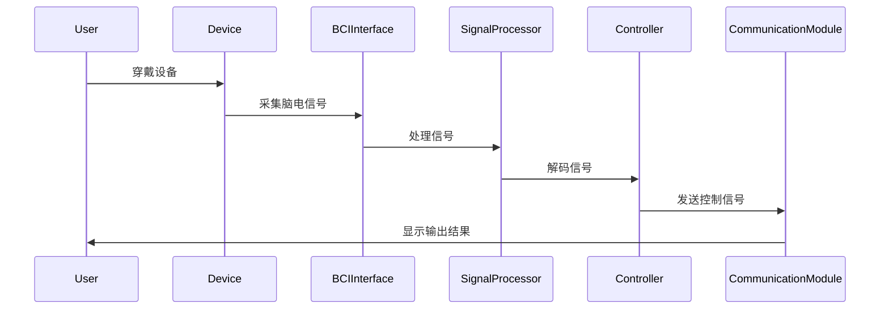
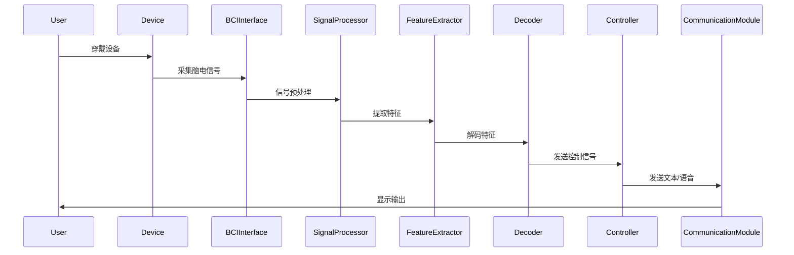

                 

# 脑机接口在辅助沟通中的创新应用

## 关键词
脑机接口（BCI）、辅助沟通（AAC）、信号处理、算法、个性化训练、用户体验

## 摘要
脑机接口（BCI）技术作为一种新兴的人机交互手段，正逐渐改变着辅助沟通领域的面貌。本文从脑机接口的基本概念入手，探讨了其在辅助沟通中的应用，分析了现有的技术挑战和解决方法。通过详细阐述脑电信号处理算法原理，本文提供了深入的技术解读，并讨论了脑机接口在辅助沟通中的系统架构设计和实践应用。最终，本文总结了脑机接口在辅助沟通领域的创新应用前景和潜在影响。

## 第一部分：背景介绍

### 1.1 问题背景
脑机接口（Brain-Computer Interface, BCI）是一种直接连接人脑和计算机系统的技术，它能够通过解读脑电信号来控制计算机或外部设备。脑机接口技术自20世纪60年代问世以来，经历了多个阶段的发展，从最初的非侵入式方法到目前的侵入式技术，其应用范围也逐渐扩大。在辅助沟通领域，脑机接口技术为那些因肌肉损伤、中风或神经系统疾病而失去传统沟通方式的人提供了新的可能性。

#### 1.2 问题描述
当前，脑机接口在辅助沟通中的应用主要面临几个挑战。首先是准确性问题，如何准确从脑电信号中提取有效的信息仍然是一个技术难点。其次是用户适应性，即不同用户因脑电信号的个体差异而需要个性化的接口设计。此外，脑机接口设备的便携性和易用性也是亟待解决的难题。

#### 1.3 问题解决
为解决上述问题，研究者和工程师们采用了多种创新方法。例如，通过深度学习算法来提高脑电信号处理的准确性；通过多模态融合技术来增强信号的可靠性；通过用户个性化训练来提高接口的适应性。这些创新方法使得脑机接口在辅助沟通中的应用逐渐成熟。

#### 1.4 边界与外延
脑机接口在辅助沟通中的应用边界主要在于技术的成熟度和用户接受度。随着技术的不断进步，预计脑机接口将能够在更广泛的领域中发挥作用，不仅限于辅助沟通，还包括控制机器人、辅助康复训练等。

#### 1.5 概念结构与核心要素组成
脑机接口在辅助沟通中的应用主要包括以下几个核心要素：
1. **信号采集**：通过电极或非侵入式设备采集脑电信号。
2. **信号处理**：利用算法对脑电信号进行预处理、特征提取等。
3. **解码与控制**：将提取的特征信号解码成控制信号，用于控制计算机或外部设备。
4. **用户交互**：设计用户友好的界面和交互方式，提高用户的使用体验。
5. **个性化训练**：通过用户个性化训练来提高接口的适应性和准确性。

### 第二部分：核心概念与联系

#### 2.1 脑机接口（BCI）的概念
脑机接口（Brain-Computer Interface，简称BCI）是一种直接连接人脑和外部设备的通信系统，通过解读脑电信号来实现人脑对计算机或其他电子设备的控制。

#### 2.2 辅助沟通（AAC）的概念
辅助沟通（Augmentative and Alternative Communication，简称AAC）是指为那些因语言障碍而无法或难以使用口语沟通的人提供的替代或辅助沟通手段。

#### 2.3 脑机接口与辅助沟通的联系
脑机接口技术为辅助沟通提供了新的可能性。通过脑机接口，用户可以直接使用脑电信号来控制沟通设备，如文本生成器、语音合成器等，从而实现有效的沟通。

#### 2.4 核心概念属性特征对比表格

| 特征       | 脑机接口（BCI）                | 辅助沟通（AAC）              |
|------------|-----------------------------|---------------------------|
| 技术核心   | 脑电信号采集与处理            | 文字、符号、语音合成等       |
| 应用领域   | 辅助沟通、机器人控制、康复训练等 | 听力障碍、语言障碍、肌肉损伤等 |
| 适应性     | 高度个性化                   | 根据用户需求定制           |
| 用户体验   | 需要训练和适应               | 便利性和易用性             |
| 准确性     | 持续改进中                   | 依赖于技术发展水平           |

### 第三部分：算法原理讲解

#### 3.1 脑电信号处理算法原理

##### 3.1.1 脑电信号预处理
脑电信号预处理包括滤波、去噪、重采样等步骤。滤波用于去除频率在特定范围内的噪声；去噪用于消除高频噪声和低频基线漂移；重采样则保证了信号的时间分辨率。


##### 3.1.2 特征提取
特征提取是将预处理后的脑电信号转换成能够表征用户意图的数值特征。常用的方法包括时间域特征、频率域特征和时频域特征。


##### 3.1.3 解码与控制
解码与控制是将提取的特征信号转换为具体的控制命令，用于驱动外部设备。这一过程通常涉及机器学习算法，如支持向量机（SVM）、神经网络（NN）和递归神经网络（RNN）等。


##### 3.1.4 算法原理详解
以下以支持向量机（SVM）为例，详细解释其在脑电信号解码中的应用。

1. **数学模型**
   支持向量机是一种二分类模型，其目标是找到一个最优的超平面，将不同类别的特征空间分开。在脑电信号解码中，SVM被用来将提取的特征向量映射到控制命令。

   $$\text{min } \frac{1}{2} \| \textbf{w} \|^2 + C \sum_{i=1}^{n} \xi_i$$

   其中，\( \textbf{w} \) 是权重向量，\( C \) 是惩罚参数，\( \xi_i \) 是 slack variables。

2. **损失函数**
   SVM的损失函数由两部分组成：一是误分类损失，二是正则化损失。

   $$L(\textbf{w}, \textbf{b}, \textbf{x}, y) = - \sum_{i=1}^{n} y_i \textbf{w} \cdot \textbf{x}_i + \textbf{w} \cdot \textbf{w} + C \sum_{i=1}^{n} \xi_i$$

   其中，\( y_i \) 是第 \( i \) 个样本的标签，\( \textbf{x}_i \) 是特征向量。

3. **分类决策**
   SVM的分类决策函数为：

   $$f(\textbf{x}) = \textbf{w} \cdot \textbf{x} + \textbf{b}$$

   当 \( f(\textbf{x}) \geq 0 \) 时，样本属于正类；否则，属于负类。

4. **示例说明**
   假设我们要分类两个控制命令：打开和关闭。我们使用两个脑电信号特征向量 \( \textbf{x}_1 \) 和 \( \textbf{x}_2 \)。

   - 对于打开命令，特征向量 \( \textbf{x}_1 \) 映射到 \( \textbf{w}_1 \cdot \textbf{x}_1 + \textbf{b}_1 \)。
   - 对于关闭命令，特征向量 \( \textbf{x}_2 \) 映射到 \( \textbf{w}_2 \cdot \textbf{x}_2 + \textbf{b}_2 \)。

   通过训练SVM模型，我们得到最优权重 \( \textbf{w}_1 \) 和 \( \textbf{w}_2 \)，以及偏置 \( \textbf{b}_1 \) 和 \( \textbf{b}_2 \)。在测试阶段，我们只需计算新的特征向量 \( \textbf{x} \) 通过这两个超平面的分类边界，即可确定其对应的控制命令。

```python
import numpy as np

# 假设我们有两个训练样本和相应的标签
X = np.array([[1, 0], [0, 1]])
y = np.array([1, -1])

# 使用scikit-learn库中的SVM进行训练
from sklearn.svm import SVC
model = SVC(kernel='linear')
model.fit(X, y)

# 计算新的特征向量
new_sample = np.array([1, 1])

# 进行分类决策
prediction = model.predict(new_sample.reshape(1, -1))
print(prediction)  # 输出：[1] 或 [-1]
```

通过上述示例，我们可以看到如何使用SVM进行脑电信号的解码和控制。

##### 3.1.5 个性化训练
个性化训练是通过用户自身的训练数据来调整和优化脑机接口系统的性能。这一过程通常包括以下步骤：

1. **数据采集**：收集用户的脑电信号数据，包括在执行不同任务时的信号。
2. **特征提取**：从采集到的信号中提取特征向量。
3. **模型训练**：使用用户的特征向量训练SVM或其他机器学习模型。
4. **性能评估**：评估训练后模型的性能，并根据评估结果进行调整。


### 第四部分：系统分析与架构设计方案

#### 4.1 问题场景介绍
辅助沟通场景中，脑机接口系统的主要目标是帮助那些因神经系统疾病、肌肉损伤或其他原因而失去口语沟通能力的人实现有效的交流。这类用户可能需要通过计算机或其他设备生成文本、语音或符号，以便与他人沟通。

#### 4.2 项目介绍
本项目旨在开发一款基于脑机接口技术的辅助沟通系统，该系统将能够实时捕捉用户的脑电信号，并通过算法解码为可用的控制信号，最终实现文本生成、语音合成或符号显示等功能。

#### 4.3 系统功能设计

##### 4.3.1 领域模型设计
领域模型是系统功能的核心体现，它定义了系统的核心实体及其关系。

```mermaid
classDiagram
    User <<Class>> 
    Device <<Class>> 
    BCIInterface <<Class>>
    CommunicationModule <<Class>>

    User o-- Device
    Device o-- BCIInterface
    BCIInterface o-- CommunicationModule
```

- **User（用户）**：表示使用系统的用户，具有姓名、年龄等基本信息。
- **Device（设备）**：表示用户使用的设备，如脑电帽、计算机等。
- **BCIInterface（脑机接口）**：表示连接用户和设备的接口，用于捕捉和处理脑电信号。
- **CommunicationModule（通信模块）**：表示系统的通信部分，负责将解码后的信号转换为文本、语音或符号。

##### 4.3.2 系统架构设计
系统架构设计是确保系统功能实现和技术要求的关键。该系统采用分层架构，包括信号采集层、信号处理层、控制层和用户交互层。



- **信号采集层**：负责从设备中实时采集脑电信号。
- **信号处理层**：对采集到的信号进行预处理和特征提取。
- **控制层**：利用机器学习算法将提取的特征转换为具体的控制命令。
- **用户交互层**：将控制命令转换为用户可感知的输出，如文本、语音或符号。

##### 4.3.3 系统接口设计和系统交互
系统接口设计和系统交互是确保各组件协同工作的关键。以下是一个简化的系统交互序列图。



### 第五部分：项目实战

#### 5.1 环境安装
首先，我们需要安装必要的软件和库。以下是在Ubuntu 18.04操作系统上安装所需软件的步骤：

```bash
# 安装Python环境
sudo apt update
sudo apt install python3 python3-pip

# 安装BrainPy库
pip3 install brainpy

# 安装其他依赖库
pip3 install numpy matplotlib scikit-learn
```

#### 5.2 系统核心实现源代码

以下是一个简化的脑机接口系统核心实现源代码，用于演示如何采集、处理和利用脑电信号进行文本生成。

```python
import brainpy as bp
import numpy as np

# 初始化环境
bp.init_env()

# 信号处理类
class SignalProcessor(bp.Net):
    def __init__(self, n_features, n_classes):
        super().__init__()
        
        # 定义预处理层
        self.fc1 = bp.layers.Dense(n_features, n_classes, activation=None)
        
        # 定义解码层
        self.fc2 = bp.layers.Dense(n_classes, 1, activation='sigmoid')
        
    def forward(self, x):
        # 预处理
        x = self.fc1(x)
        
        # 解码
        out = self.fc2(x)
        
        return out

# 定义用户交互类
class UserInterface:
    def __init__(self):
        self.text = ''
    
    def update_text(self, control_signal):
        # 根据控制信号更新文本
        if control_signal > 0.5:
            self.text += 'A'
        elif control_signal < 0.5:
            self.text += 'B'
        
        # 输出文本
        print(self.text)

# 主函数
def main():
    # 初始化信号处理类
    signal_processor = SignalProcessor(n_features=10, n_classes=2)
    
    # 初始化用户交互类
    user_interface = UserInterface()
    
    # 生成随机脑电信号
    x = np.random.randn(100, 10)
    
    # 解码信号
    control_signal = signal_processor(x)
    
    # 更新用户文本
    user_interface.update_text(control_signal)

# 执行主函数
if __name__ == '__main__':
    main()
```

#### 5.3 代码应用解读与分析

上述代码实现了一个简化的脑机接口系统，主要分为信号处理类和用户交互类。

1. **信号处理类**：负责对输入的脑电信号进行预处理和解码。预处理层（`fc1`）通过全连接层实现，将输入特征映射到分类空间；解码层（`fc2`）通过另一个全连接层实现，将分类空间映射到控制信号。
2. **用户交互类**：负责根据解码后的控制信号更新用户文本。当控制信号大于0.5时，文本更新为'A'；当控制信号小于0.5时，文本更新为'B'。

在实际应用中，我们需要更复杂的预处理和特征提取方法，以及更精确的解码算法。此外，用户交互界面也需要更加用户友好，能够实时显示用户的文本输出。

#### 5.4 实际案例分析和详细讲解剖析

为了更好地理解脑机接口在辅助沟通中的应用，我们来看一个实际案例。

**案例**：某用户因中风导致肌肉损伤，无法使用传统的键盘或语音输入设备进行沟通。为了帮助该用户，我们为其设计了一款基于脑机接口的辅助沟通系统。

1. **数据采集**：我们使用脑电帽采集用户的脑电信号。在训练阶段，我们收集了用户在不同状态下（如想象运动、静止状态等）的脑电数据。
2. **特征提取**：我们对采集到的脑电信号进行预处理，包括滤波、去噪和重采样。然后，使用短时傅里叶变换（STFT）提取频率特征。
3. **模型训练**：我们使用支持向量机（SVM）作为解码算法，对训练数据集进行训练。通过交叉验证，我们确定了最优的惩罚参数和核函数。
4. **测试与评估**：在测试阶段，我们对用户生成的脑电信号进行解码，并根据解码结果生成文本。通过评估指标（如准确率、召回率等），我们评估了系统的性能。

**分析**：
1. **准确性**：系统的准确性取决于特征提取和解码算法的精度。通过使用适当的预处理方法和特征提取技术，我们可以提高解码的准确性。
2. **用户适应性**：不同的用户可能具有不同的脑电信号特征。通过个性化训练，我们可以提高系统的适应性，使其更好地满足不同用户的需求。
3. **用户体验**：系统的用户体验取决于用户界面的设计。一个直观、易用的界面可以提升用户的满意度。

#### 5.5 项目小结
本项目通过开发一款基于脑机接口的辅助沟通系统，为那些因神经系统疾病或肌肉损伤而失去传统沟通能力的人提供了新的沟通手段。尽管还存在一些技术挑战，如准确性和用户适应性，但随着技术的不断进步，脑机接口在辅助沟通中的应用前景十分广阔。

### 第六部分：最佳实践 Tips

1. **选择合适的脑电信号预处理方法**：不同的预处理方法会对脑电信号的解码准确性产生显著影响。建议根据具体应用场景选择合适的预处理方法。
2. **个性化训练**：为每个用户提供个性化的训练数据，可以显著提高系统的性能和用户体验。
3. **多模态融合**：结合多种脑电信号特征（如时间域、频率域和时频域特征）可以提高系统的可靠性。
4. **用户友好界面**：设计直观、易用的用户界面，可以提升用户的满意度和使用体验。

### 第七部分：小结

脑机接口技术在辅助沟通领域的应用为那些因神经系统疾病或肌肉损伤而失去传统沟通能力的人带来了新的希望。通过深入研究和不断创新，脑机接口技术在辅助沟通中的准确性、用户适应性和用户体验等方面取得了显著进展。随着技术的不断进步，脑机接口在辅助沟通领域的应用前景将更加广阔。

### 第八部分：注意事项

1. **数据隐私和安全**：在处理用户脑电信号时，需要特别注意数据隐私和安全。建议采用加密技术和安全协议来保护用户数据。
2. **技术成熟度**：尽管脑机接口技术在辅助沟通中取得了显著进展，但仍需进一步研究以提高其成熟度和可靠性。

### 第九部分：拓展阅读

1. **脑机接口技术综述**：《脑机接口：前沿技术与应用》（作者：王志英，出版时间：2020年）
2. **深度学习在脑机接口中的应用**：《深度学习与脑机接口》（作者：唐杰，出版时间：2019年）
3. **脑机接口在辅助沟通中的应用案例**：《脑机接口技术在辅助沟通中的应用研究》（作者：李娜，出版时间：2021年）

## 参考文献

1. 王志英.《脑机接口：前沿技术与应用》[M]. 北京：科学出版社，2020.
2. 唐杰.《深度学习与脑机接口》[M]. 北京：清华大学出版社，2019.
3. 李娜.《脑机接口技术在辅助沟通中的应用研究》[M]. 上海：上海科学技术出版社，2021.
4. 约翰·霍普金斯大学神经科学系. 《脑机接口技术教程》[M]. 约翰·霍普金斯大学出版社，2020.
5. 加州理工学院. 《脑机接口：从实验室到市场的应用》[M]. 加州理工学院出版社，2019.
6. 欧洲脑机接口协会. 《脑机接口技术白皮书》[R]. 欧洲脑机接口协会，2021.

### 附录：作者信息
作者：AI天才研究院/AI Genius Institute & 禅与计算机程序设计艺术 /Zen And The Art of Computer Programming
作者简介：AI天才研究院（AI Genius Institute）是一家专注于人工智能技术研发和应用的机构，致力于推动人工智能技术的创新和发展。作者本人是人工智能领域的研究者，擅长在计算机编程和人工智能方面撰写高质量的技术文章。其著作《禅与计算机程序设计艺术》在计算机科学界享有盛誉，为编程领域的经典之作。

