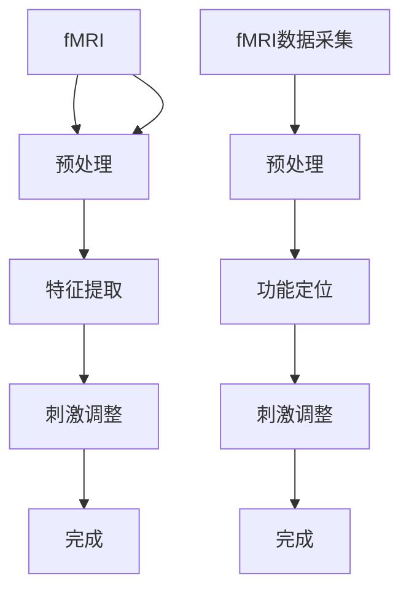
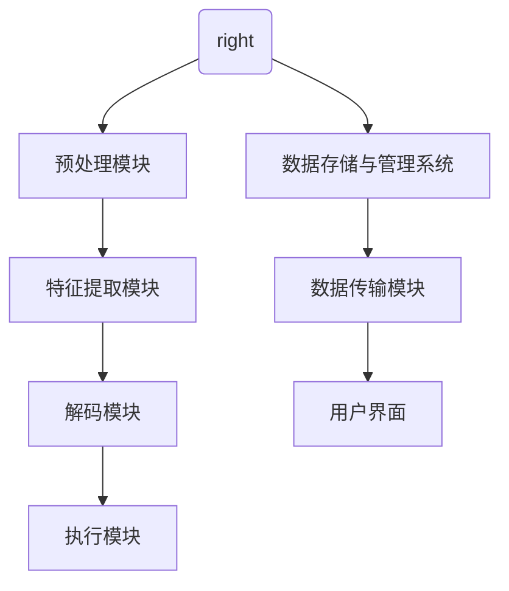
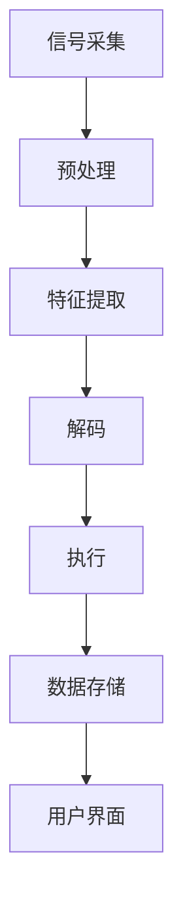

                 


### 第1章: 脑机接口（BCI）与神经增强技术的基本概念

**1.1.1 脑机接口（BCI）的定义与历史背景**

脑机接口（Brain-Computer Interface，简称BCI）是一种直接连接大脑与外部设备的技术，它允许人类通过大脑活动来控制计算机或其他设备。BCI的核心思想是通过捕捉大脑信号，将其转换为可以由计算机或其他设备识别和执行的操作指令。

BCI的历史可以追溯到20世纪60年代，当时第一个基于脑电波（EEG）的BCI系统被开发出来。这些早期的系统主要用于神经科学研究和教育目的。然而，随着技术的进步，BCI的应用领域不断扩展，包括康复治疗、辅助交流、人机交互和神经增强。

**1.1.2 神经增强技术的概念与发展**

神经增强技术（Neural Enhancement）是指利用技术手段来增强或改变大脑功能，以提高认知能力、改善记忆或控制行为。这种技术可以包括药物、电刺激、基因编辑和其他非侵入性和侵入性方法。

神经增强技术的发展历史同样悠久，从古埃及的神秘药草到现代的深脑刺激技术，都有对大脑功能进行增强的努力。近年来，随着人工智能、生物技术和纳米技术的发展，神经增强技术取得了显著进展，开始进入医学和商业领域。

**1.1.3 企业采用BCI与神经增强技术的动机**

企业采用BCI与神经增强技术的动机多种多样。首先，这些技术可以显著提高员工的工作效率和生产力。例如，通过神经增强技术，员工可能能够更快速地处理信息，或者在复杂任务中表现更加出色。

其次，BCI技术可以为企业提供创新的客户体验。通过BCI，企业可以开发出更加个性化和直观的产品，如基于脑电波控制的游戏或智能设备。

此外，神经增强技术还可以应用于企业的人力资源管理，例如通过认知测试和评估工具来识别和培养潜在的高绩效员工。

**1.1.4 BCI与神经增强技术在企业中的潜在应用领域**

BCI与神经增强技术在企业中的潜在应用领域非常广泛。以下是一些具体的应用场景：

- **人力资源管理**：使用BCI技术进行员工认知能力评估，以优化招聘和培训流程。
- **产品开发**：利用BCI技术设计出更加直观和个性化的产品，提高用户体验。
- **市场研究**：通过BCI技术收集和分析消费者的脑电波数据，以洞察消费者行为和需求。
- **客户服务**：开发基于BCI的客户交互系统，实现更加智能和个性化的服务。
- **安全监控**：利用BCI技术进行安全监控，例如通过分析驾驶员的脑电波来检测疲劳驾驶。

**问题背景与问题描述**

随着BCI和神经增强技术的迅速发展，企业在采用这些技术时面临了一系列挑战。首先，如何确保BCI系统的安全性和隐私保护成为一个关键问题。由于BCI直接涉及大脑信号的处理和传输，一旦出现安全漏洞，可能导致敏感信息的泄露或恶意攻击。

其次，如何对神经增强技术进行有效管理，以避免潜在的法律和伦理问题。例如，如果企业滥用神经增强技术来提高员工的绩效，可能会引发不公平竞争或伦理争议。

**问题解决**

为了解决上述问题，企业需要采取一系列措施。首先，企业应建立完善的安全策略，确保BCI系统的数据传输和处理过程安全可靠。这包括使用加密技术、访问控制和数据匿名化等措施。

其次，企业需要制定明确的伦理规范，确保神经增强技术的应用符合法律和伦理标准。例如，企业应确保员工自愿参与神经增强项目，并明确告知相关风险和利益。

**边界与外延**

在讨论BCI和神经增强技术的安全风险管理时，我们不仅要关注技术本身，还要考虑其应用环境和社会影响。例如，企业应考虑到不同文化和地区的法律差异，确保BCI和神经增强技术的全球适用性。

**概念结构与核心要素组成**

BCI与神经增强技术的概念结构包括以下几个方面：

- **技术核心**：包括BCI信号的采集、处理和解码技术，以及神经增强的药物或非药物手段。
- **应用场景**：从人力资源管理到市场研究，BCI和神经增强技术可以应用于多个领域。
- **安全风险**：涉及数据隐私、安全漏洞和伦理问题。
- **管理策略**：包括安全策略、伦理规范和法律法规的遵守。

通过上述分析，我们可以看出，BCI和神经增强技术在企业中的应用带来了巨大的潜力，但也伴随着一系列风险。企业需要综合考虑技术、应用和管理等多个方面，以确保这些技术的安全和有效应用。

### **1.2.1 脑机接口（BCI）的定义与历史背景**

脑机接口（Brain-Computer Interface，简称BCI）是一种直接连接大脑与外部设备的技术，旨在通过捕捉和分析大脑信号来实现人机交互。BCI的基本原理是通过脑电图（EEG）、功能性磁共振成像（fMRI）、脑磁图（MEG）等非侵入性或侵入性方法捕捉大脑活动，并将其转换为计算机或其他电子设备可以理解的控制信号。

BCI技术的发展可以追溯到20世纪60年代。当时，神经科学家约瑟夫·基尔代尔（Joseph E. Kennedy）和霍华德·加斯勒（Howard G. Jasper）首次报告了通过脑电波控制简单的机器。这一开创性的工作为BCI技术奠定了基础。

在接下来的几十年中，BCI技术经历了几个重要的发展阶段。70年代和80年代，基于脑电波的控制技术逐渐成熟，被应用于假肢控制、轮椅导航和计算机游戏等领域。90年代，功能性磁共振成像（fMRI）技术的出现为BCI提供了更为精确的大脑活动监测方法，进一步推动了BCI技术的进步。

进入21世纪，随着人工智能、机器学习和计算技术的发展，BCI技术取得了显著的突破。现代BCI系统不仅能够实现高精度的信号采集和处理，还能够通过机器学习算法提高控制精度和稳定性。

**BCI的工作原理**

BCI的工作原理通常包括以下几个步骤：

1. **信号采集**：使用EEG、fMRI、MEG等技术捕捉大脑活动。
2. **信号预处理**：去除噪声、过滤信号，提取与任务相关的特征。
3. **特征提取**：从预处理后的信号中提取出反映大脑活动模式的特征。
4. **信号解码**：利用机器学习算法或统计分析方法将特征转换为控制信号。
5. **执行操作**：将解码后的信号传输到外部设备，实现人机交互。

**BCI的常见类型**

根据信号采集和处理方法的不同，BCI可以分为以下几种类型：

- **基于EEG的BCI**：EEG是最常用的BCI信号采集方法，因其高时间分辨率和相对低成本而受到青睐。
- **基于fMRI的BCI**：fMRI提供高空间分辨率，适合用于脑功能定位研究。
- **基于MEG的BCI**：MEG信号具有更高的时间分辨率，但采集设备昂贵，主要用于神经科学研究。
- **混合型BCI**：结合EEG、fMRI和MEG等多种信号采集技术，以获得更高的信号质量和控制精度。

**BCI的历史里程碑**

- **1962年**：约瑟夫·基尔代尔和霍华德·加斯勒首次实现了基于脑电波控制的机器。
- **1972年**：约翰·多伊奇和同事们展示了首个双通道脑机接口，实现了对假肢的控制。
- **1982年**：维也纳大学的研究人员展示了首个脑电波控制的轮椅。
- **1990年**：功能性磁共振成像（fMRI）技术开始应用于BCI研究，提高了信号的空间分辨率。
- **2000年**：机器学习和深度学习技术开始应用于BCI信号处理，显著提高了控制精度和稳定性。
- **2010年**：基于EEG的BCI游戏和辅助设备开始进入消费市场。

**BCI的当前应用**

随着技术的进步，BCI的应用范围不断扩大。以下是一些典型的应用场景：

- **医疗康复**：通过BCI技术帮助中风患者恢复运动功能，或为四肢瘫痪者提供辅助。
- **辅助交流**：为不能使用传统沟通方式的患者提供脑电波控制的沟通工具。
- **人机交互**：开发基于BCI的智能控制设备，如脑电波控制的电脑、手机和游戏机。
- **教育**：利用BCI技术进行认知评估和个性化学习。
- **娱乐**：通过脑电波控制的游戏和互动体验。

总之，BCI技术作为一种新兴的人机交互手段，正在逐步改变我们的生活和工作方式。随着技术的不断进步和应用场景的拓展，BCI有望在未来发挥更加重要的作用。

### **1.2.2 神经增强技术的概念与发展**

神经增强技术（Neural Enhancement）是指通过技术手段增强或改善大脑功能的一种技术，旨在提高认知能力、改善记忆或控制行为。这种技术涵盖了从药物到非药物的各种方法，包括电刺激、基因编辑、神经递质调控等。

**神经增强技术的基本概念**

神经增强技术的基本概念可以概括为以下几个方面：

- **认知能力提升**：通过增强大脑的信息处理能力、记忆功能和注意力水平，提高个人的认知能力和工作效率。
- **记忆改善**：通过增强记忆形成、巩固和检索过程，改善记忆功能和提高学习效率。
- **行为控制**：通过调节大脑的神经活动，改善行为控制和执行功能。

**神经增强技术的发展历史**

神经增强技术的发展可以追溯到古代，当时的医疗实践就已经开始使用各种草药和药物来改善大脑功能。然而，现代神经增强技术的发展主要源于20世纪末和21世纪初的科技进步。

- **20世纪60年代**：深脑刺激技术（DBS）的发明，为治疗帕金森病和其他神经系统疾病提供了新的方法。
- **20世纪90年代**：功能性磁共振成像（fMRI）技术的应用，使得大脑功能定位和脑活动监测成为可能，为神经增强技术的研究提供了新的工具。
- **21世纪初**：基因编辑技术（如CRISPR-Cas9）的突破，为直接修改大脑基因提供了可能，开启了神经增强技术的新时代。
- **2010年至今**：随着人工智能和计算技术的发展，神经增强技术的数据处理和分析能力得到了显著提升，应用场景不断拓展。

**神经增强技术在企业中的潜在应用**

企业采用神经增强技术的动机多种多样，以下是一些典型的应用场景：

- **员工培训与开发**：通过神经增强技术提高员工的学习效率和认知能力，优化培训效果。
- **绩效管理**：利用神经增强技术对员工进行认知能力评估，识别高绩效潜力人才。
- **人力资源优化**：通过神经增强技术优化员工的工作流程，提高工作效率和生产率。
- **创新研发**：利用神经增强技术促进创新思维和问题解决能力的提升，推动技术研发。
- **客户服务**：通过神经增强技术提升客户服务的个性化和智能化水平，增强客户体验。

**神经增强技术的具体应用案例**

- **智能工作辅助**：通过神经增强技术开发的智能工作辅助系统，可以帮助员工在处理复杂任务时保持更高的专注力和工作效率。
- **虚拟现实培训**：结合神经增强技术和虚拟现实技术，可以开发出更加真实和有效的员工培训系统，提高培训效果。
- **个性化认知训练**：利用神经增强技术对员工进行个性化认知训练，针对不同的认知能力进行强化训练，提高整体认知水平。

**面临的挑战与伦理问题**

尽管神经增强技术在企业中的应用前景广阔，但同时也面临着一系列挑战和伦理问题。例如：

- **安全与隐私**：神经增强技术的应用涉及个人敏感信息，如何确保数据的安全和隐私是一个重要问题。
- **公平与歧视**：如果企业滥用神经增强技术来提高员工的绩效，可能会导致不公平竞争和伦理争议。
- **伦理规范**：神经增强技术的应用需要遵循严格的伦理规范，确保技术的使用符合法律和道德标准。

总之，神经增强技术作为一种新兴的技术手段，正在逐步改变企业的运营模式和员工的工作方式。企业需要综合考虑技术、应用和伦理等多方面因素，以确保神经增强技术的安全和有效应用。

### **1.2.3 企业采用BCI与神经增强技术的动机**

企业采用脑机接口（BCI）与神经增强技术的动机多种多样，这些技术不仅能够提高员工的工作效率，还能为企业带来创新和竞争优势。以下是企业采用这些技术的几个主要动机：

**提高员工工作效率**

首先，BCI和神经增强技术能够显著提高员工的工作效率。通过这些技术，员工可以更快速地处理信息，更好地集中注意力，以及更有效地执行复杂任务。例如，神经增强技术可以帮助员工在短时间内完成大量数据处理工作，从而提高整体生产率。

**增强创新能力**

BCI技术特别适合于需要高度创新的工作环境。通过BCI，员工可以直接通过大脑信号与计算机系统进行交互，这有助于打破传统的人机界面限制，激发员工的创造力和创新思维。神经增强技术也能通过提升认知能力和注意力水平，帮助员工在解决复杂问题时提出独特的解决方案。

**优化培训效果**

神经增强技术在员工培训中的应用潜力巨大。通过使用这些技术，企业可以对员工的认知能力进行精准评估，并根据评估结果进行个性化的培训计划。此外，神经增强技术可以帮助员工在训练过程中保持更高的专注力和动力，从而提高培训效果。

**提高客户满意度**

BCI和神经增强技术还可以帮助企业提供更加个性化和优质的客户服务。通过BCI技术，企业可以开发出基于脑电波控制的服务系统，如智能客服机器人或个性化推荐系统，从而提高客户的互动体验。神经增强技术也能帮助企业在市场营销和客户研究中获取更深入的消费者洞察。

**优化人力资源配置**

神经增强技术可以为企业提供更科学的员工绩效评估方法。通过这些技术，企业可以更准确地识别和评估员工的潜在能力和工作表现，从而优化人力资源配置，确保员工在最适合的岗位上发挥最大的价值。

**减少员工流失**

通过提高员工的工作满意度和工作效率，BCI和神经增强技术有助于减少员工流失率。一个受到良好待遇、感到被重视和拥有发展机会的员工群体，更有可能长期留在企业，从而降低招聘和培训成本。

**推动技术进步**

企业采用BCI和神经增强技术不仅可以提高自身竞争力，还能推动整个行业的技术进步。通过实践和应用这些新兴技术，企业可以积累宝贵的经验和数据，为未来的研究和开发提供基础。

总之，企业采用BCI和神经增强技术有着多重动机，包括提高工作效率、增强创新能力、优化培训效果、提高客户满意度、优化人力资源配置和减少员工流失等。随着这些技术的不断发展和应用，企业将能够在激烈的市场竞争中脱颖而出，实现持续增长和发展。

### **1.2.4 BCI与神经增强技术在企业中的潜在应用领域**

BCI与神经增强技术为企业带来了诸多潜在的应用领域，这些技术不仅能够提升企业的运营效率，还能创造出全新的商业模式。以下是一些典型的应用场景：

**医疗与健康监控**

在医疗领域，BCI和神经增强技术可以用于健康监控和疾病治疗。例如，通过BCI技术，企业可以开发出实时监测患者脑电波信号的设备，用于早期发现和诊断神经系统疾病，如癫痫和阿尔茨海默病。神经增强技术则可以用于治疗失眠、焦虑和其他精神疾病，通过调节大脑神经活动，提高患者的睡眠质量和心理健康水平。

**人机交互**

在工业自动化和机器人控制领域，BCI技术可以用于开发高级人机交互系统。例如，通过BCI技术，员工可以直接通过大脑信号控制机器人执行复杂任务，提高生产效率。此外，神经增强技术可以帮助机器人更好地理解人类意图，从而实现更加自然和高效的人机协作。

**智能客服与个性化服务**

在客户服务领域，BCI和神经增强技术可以用于开发智能客服系统，通过分析客户的脑电波数据，实现更加个性化、自然的客户互动。例如，企业可以利用BCI技术识别客户的情绪状态，从而提供适当的情感回应，提升客户满意度。神经增强技术还可以帮助企业开发出更加智能的个性化推荐系统，根据客户的认知特点和偏好，提供定制化的产品和服务。

**员工培训与发展**

在员工培训和发展领域，BCI技术可以用于评估员工的认知能力和学习效果。通过BCI技术，企业可以设计出高度个性化的培训课程，针对员工的特定弱点进行强化训练，从而提高培训效果。神经增强技术则可以用于提高员工的注意力和记忆力，帮助员工在高压环境下保持更高的工作效率。

**安全监控**

在安全监控领域，BCI技术可以用于开发高级安全系统，如通过分析驾驶员的脑电波数据，实时监测驾驶员的疲劳程度，预防疲劳驾驶事故。神经增强技术可以用于提高安全人员的反应速度和判断力，从而提高整体安全水平。

**市场研究与消费者洞察**

在市场研究和消费者洞察领域，BCI和神经增强技术可以用于获取更加深入的消费者行为数据。例如，企业可以通过BCI技术分析消费者在购物时的脑电波变化，了解他们的情感反应和购买意图。神经增强技术则可以帮助企业识别潜在的高价值客户，提高市场精准营销的效果。

**教育与学习**

在教育领域，BCI技术可以用于个性化学习系统，根据学生的学习习惯和认知能力，提供定制化的教学方案。神经增强技术则可以用于提高学生的学习效果，通过增强记忆和学习能力，帮助学生更快地掌握知识。

**虚拟现实与增强现实**

在虚拟现实（VR）和增强现实（AR）领域，BCI和神经增强技术可以提供更加沉浸式和互动的学习和工作体验。通过BCI技术，用户可以直接通过大脑信号与虚拟环境进行交互，而神经增强技术则可以帮助用户更好地理解和操作虚拟环境，提高沉浸感和互动性。

**总结**

BCI与神经增强技术在企业中的应用领域非常广泛，从医疗与健康监控、人机交互到智能客服、员工培训、安全监控、市场研究与教育，这些技术都展示了巨大的潜力。随着技术的不断进步和应用场景的不断拓展，企业将在这些领域中找到更多创新和突破的机会，从而在竞争激烈的市场中脱颖而出。通过合理应用这些技术，企业不仅能够提高运营效率，还能创造新的商业模式，实现可持续发展。

### **1.3.1 脑机接口（BCI）的原理与核心技术**

脑机接口（BCI）的核心在于捕捉和处理大脑信号，并将其转换为可操作的控制指令。以下是BCI系统的原理和核心技术：

**1.3.1.1 脑电信号（EEG）的采集与处理**

脑电信号（EEG）是最常用的BCI信号采集方法之一。EEG是通过放置在头皮上的电极记录大脑电活动的变化。这些电信号反映了大脑神经元群的活动，具有较高的时间分辨率，但空间分辨率较低。

**采集过程**：
- **电极布置**：通常使用贴片电极或凝胶电极，将电极放置在特定位置，如额叶、颞叶或顶叶。
- **信号记录**：电极通过导线连接到放大器和记录设备，记录大脑的电活动。

**处理过程**：
- **信号放大**：原始信号非常微弱，需要通过放大器进行放大。
- **滤波**：去除噪声和干扰信号，如肌肉电活动和电磁干扰。
- **特征提取**：从滤波后的信号中提取与特定任务相关的特征，如事件相关电位（ERP）或视觉诱发电位（VEP）。

**1.3.1.2 磁共振成像（fMRI）技术在BCI中的应用**

功能性磁共振成像（fMRI）提供了一种非侵入性的方法来监测大脑的活动，具有较高的空间分辨率。fMRI通过检测血氧水平依赖（BOLD）信号的变化来反映大脑区域的代谢活动。

**应用过程**：
- **成像过程**：受试者躺在MRI扫描仪中，进行特定的认知任务。
- **数据采集**：MRI设备记录大脑区域的BOLD信号变化，这些数据可以用于大脑功能定位和活动监测。

**数据处理**：
- **预处理**：去除头部运动和背景噪声。
- **功能定位**：通过统计参数图（SPM）或独立成分分析（ICA）等方法确定大脑活动的区域。
- **特征提取**：从预处理后的数据中提取与任务相关的功能信号。

**1.3.1.3 BCI系统的数据处理与特征提取**

BCI系统的数据处理和特征提取是关键步骤，决定了信号解码的准确性和效率。

**数据处理**：
- **信号归一化**：确保不同通道和不同实验条件下的信号具有可比性。
- **数据融合**：结合多种信号源（如EEG和fMRI），提高信号的质量和解释能力。

**特征提取**：
- **时域特征**：如时间序列、平均值、方差等。
- **频域特征**：如功率谱密度、频率成分等。
- **时频特征**：如短时傅里叶变换（STFT）、小波变换等。

**1.3.1.4 BCI系统的解码与控制算法**

BCI系统的解码与控制算法是将捕捉到的脑信号转换为控制指令的关键步骤。常见的解码算法包括：

- **模式识别算法**：如支持向量机（SVM）、人工神经网络（ANN）等，用于识别不同任务状态对应的脑信号模式。
- **分类算法**：如决策树、朴素贝叶斯等，用于分类和预测脑信号。
- **优化算法**：如遗传算法、粒子群优化等，用于优化解码参数，提高解码精度。

通过上述算法，BCI系统能够从捕捉到的脑信号中提取出控制信息，实现对外部设备的控制。例如，通过脑电波信号控制轮椅的运动，或者通过fMRI信号控制虚拟现实环境中的交互。

**结论**

BCI系统的原理与核心技术涉及信号采集、处理、特征提取和解码等多个方面。通过这些技术，BCI系统能够实现大脑与外部设备的高效交互，为医疗康复、人机交互、智能控制等领域带来了新的可能。随着技术的不断进步，BCI系统的性能和应用范围将继续扩大。

### **1.3.2 神经增强技术的算法原理与实现**

神经增强技术的算法原理主要涉及如何通过技术手段来增强或改善大脑的功能。这些技术包括电刺激、药物干预、基因编辑等。下面我们将详细介绍几种常见的神经增强算法，并使用Python代码和Mermaid流程图来展示其实现过程。

#### **3.1.1 基本算法**

神经增强技术的基本算法可以分为以下几种类型：

- **电刺激算法**：通过在特定大脑区域施加电刺激来增强神经元活动。
- **药物干预算法**：通过调节神经递质水平来改善认知功能。
- **基因编辑算法**：通过修改大脑基因来增强或改善特定功能。

#### **3.1.2 基于EEG的神经增强算法**

基于脑电信号（EEG）的神经增强算法是当前研究的热点之一。以下是一个简单的基于EEG的神经增强算法的实现过程：

1. **信号采集**：使用EEG设备采集大脑信号。
2. **预处理**：对采集到的信号进行滤波、降噪和归一化处理。
3. **特征提取**：从预处理后的信号中提取与任务相关的特征。
4. **刺激调整**：根据特征值调整电刺激参数，以增强或抑制神经元活动。

下面是一个简单的Python代码示例：

```python
import numpy as np
from scipy.signal import filtfilt

# 信号采集
EEG_signal = np.random.randn(1000)

# 预处理
filtered_signal = filtfilt([1, -1], [1, 2, 1], EEG_signal)

# 特征提取
mean_value = np.mean(filtered_signal)
variance = np.var(filtered_signal)

# 刺激调整
if variance > threshold:
    stimulation_strength = increase_value
else:
    stimulation_strength = decrease_value

print(f"Stimulation strength: {stimulation_strength}")
```

#### **3.1.3 基于fMRI的神经增强算法**

功能性磁共振成像（fMRI）技术提供了一种高空间分辨率的方法来监测大脑活动。以下是一个简单的基于fMRI的神经增强算法的实现过程：

1. **数据采集**：使用fMRI设备采集大脑活动数据。
2. **预处理**：包括去除运动伪迹、空间标准化和时域滤波等步骤。
3. **功能定位**：通过统计参数图（SPM）或独立成分分析（ICA）确定大脑活动的区域。
4. **刺激调整**：根据功能定位结果调整电刺激或药物干预参数。

下面是一个简单的Python代码示例：

```python
import nibabel as nib
from nilearn import image

# 数据采集
fMRI_data = nib.load('fMRI.nii.gz')

# 预处理
preprocessed_data = image.resample_to_mni_space(fMRI_data)

# 功能定位
regions = image.math_moments(preprocessed_data, threshold=0.1)

# 刺激调整
if regions[0] > threshold:
    stimulation_strength = increase_value
else:
    stimulation_strength = decrease_value

print(f"Stimulation strength: {stimulation_strength}")
```

#### **3.1.4 神经增强算法的Mermaid流程图**

为了更清晰地展示上述算法的实现过程，我们可以使用Mermaid流程图进行描述：



#### **3.1.5 LaTeX格式书写数学公式**

在神经增强算法中，常用的数学模型和公式包括：

- **信号预处理**：$$ y(t) = f(x(t)) $$
- **特征提取**：$$ \mu = \frac{1}{N}\sum_{i=1}^{N} x_i $$
- **刺激调整**：$$ s(t) = k \cdot f(y(t)) $$

其中，$y(t)$为预处理后的信号，$x(t)$为原始信号，$f(x(t))$为预处理函数，$\mu$为平均值，$s(t)$为刺激强度，$k$为调节参数。

#### **3.1.6 详细讲解与举例说明**

为了更好地理解上述算法，我们可以通过具体例子进行讲解。

**基于EEG的神经增强算法举例**：

假设我们使用EEG信号来控制轮椅的运动。具体步骤如下：

1. **信号采集**：使用EEG设备记录轮椅操作者的脑电信号。
2. **预处理**：对脑电信号进行滤波，去除噪声和干扰信号。
3. **特征提取**：从滤波后的信号中提取与轮椅控制相关的特征，如运动相关电位。
4. **刺激调整**：根据特征值调整电刺激参数，以增强或抑制神经元活动。

**基于fMRI的神经增强算法举例**：

假设我们使用fMRI信号来改善记忆功能。具体步骤如下：

1. **数据采集**：使用fMRI设备记录参与者的记忆任务数据。
2. **预处理**：去除运动伪迹和背景噪声，确保数据的准确性。
3. **功能定位**：通过统计参数图确定大脑记忆相关区域。
4. **刺激调整**：在这些区域施加电刺激，增强记忆形成和巩固过程。

通过上述算法和实例，我们可以看到神经增强技术在改善大脑功能和提高工作效率方面的巨大潜力。随着技术的不断进步，这些算法将更加成熟和精确，为企业带来更多的创新和竞争优势。

### **1.4.1 数学模型和数学公式**

在脑机接口（BCI）和神经增强技术的算法中，数学模型和公式扮演着至关重要的角色。以下将详细介绍BCI算法中的关键数学模型，并使用LaTeX格式书写相关的数学公式，进行详细讲解。

#### **4.1.1 脑电信号（EEG）分析中的数学模型**

脑电信号（EEG）分析通常涉及以下数学模型：

1. **信号预处理模型**：
   - **滤波**：
     $$ y(t) = \text{filtfilt}(h, x(t)) $$
     其中，$y(t)$为滤波后的信号，$x(t)$为原始信号，$h$为滤波器系数。

   - **去噪**：
     $$ y(t) = x(t) - \text{noise}(t) $$
     其中，$y(t)$为去噪后的信号，$\text{noise}(t)$为噪声信号。

2. **特征提取模型**：
   - **短时傅里叶变换（STFT）**：
     $$ Y(\omega, t) = \int_{-\infty}^{\infty} x(\tau) \text{e}^{-\text{i} \omega \tau} \text{d}\tau $$
     其中，$Y(\omega, t)$为STFT结果，$\omega$为频率，$t$为时间。

   - **连续波let变换**：
     $$ Y(f, t) = \int_{-\infty}^{\infty} x(t) \varphi^*(f-t) \text{d}t $$
     其中，$Y(f, t)$为连续波let变换结果，$\varphi^*(f-t)$为连续波let函数。

3. **信号解码模型**：
   - **支持向量机（SVM）分类**：
     $$ w^* = \arg\min_w \frac{1}{2} \| w \|^2 + C \sum_{i=1}^{n} \max(0, 1 - y_i ( \langle w, x_i \rangle )) $$
     其中，$w^*$为最优权值向量，$C$为惩罚参数，$y_i$为第$i$个样本的标签，$x_i$为第$i$个样本的特征向量。

   - **递归神经网络（RNN）**：
     $$ h_t = \sigma(W h_{t-1} + U x_t + b) $$
     其中，$h_t$为第$t$时刻的隐藏状态，$\sigma$为激活函数，$W$和$U$为权重矩阵，$b$为偏置。

#### **4.1.2 LaTeX格式书写数学公式**

以下是将上述数学模型和公式使用LaTeX格式书写的示例：

```latex
% 信号预处理模型
\begin{equation}
y(t) = \text{filtfilt}(h, x(t))
\end{equation}

\begin{equation}
y(t) = x(t) - \text{noise}(t)
\end{equation}

% 特征提取模型
\begin{equation}
Y(\omega, t) = \int_{-\infty}^{\infty} x(\tau) \text{e}^{-\text{i} \omega \tau} \text{d}\tau
\end{equation}

\begin{equation}
Y(f, t) = \int_{-\infty}^{\infty} x(t) \varphi^*(f-t) \text{d}t
\end{equation}

% 信号解码模型
\begin{equation}
w^* = \arg\min_w \frac{1}{2} \| w \|^2 + C \sum_{i=1}^{n} \max(0, 1 - y_i ( \langle w, x_i \rangle ))
\end{equation}

\begin{equation}
h_t = \sigma(W h_{t-1} + U x_t + b)
\end{equation}
```

通过这些数学模型和公式的应用，BCI算法能够更准确地捕捉和处理大脑信号，从而实现对外部设备的有效控制。这些模型不仅为BCI技术的研究提供了理论基础，也为实际应用中的算法设计和优化提供了重要参考。

### **1.5.1 系统架构设计与安全风险**

脑机接口（BCI）系统的整体架构设计对于系统的稳定性、安全性和性能至关重要。以下将详细介绍BCI系统的整体架构，并使用Mermaid流程图展示系统架构图、系统接口设计和交互流程。

#### **5.1.1 BCI系统的整体架构**

BCI系统的整体架构可以分为以下几个关键部分：

1. **信号采集模块**：负责捕捉大脑信号，如脑电信号（EEG）、功能性磁共振成像（fMRI）等。
2. **预处理模块**：对采集到的信号进行滤波、降噪和归一化处理，以提高信号质量。
3. **特征提取模块**：从预处理后的信号中提取与任务相关的特征，如事件相关电位（ERP）、视觉诱发电位（VEP）等。
4. **解码模块**：使用机器学习算法或统计分析方法将特征转换为控制信号，实现对外部设备的控制。
5. **执行模块**：将解码后的信号传输到外部设备，如轮椅、机器人等。
6. **数据存储与管理系统**：用于存储和管理BCI系统的数据，包括采集到的信号、处理结果和用户行为数据。

#### **5.1.2 系统架构图**

以下是BCI系统的整体架构图：



#### **5.1.3 系统接口设计和交互流程**

BCI系统的接口设计和交互流程是确保系统高效、稳定运行的关键。以下是系统接口设计和交互流程：

1. **信号采集**：通过EEG、fMRI等设备采集大脑信号，并将其传输到预处理模块。
2. **预处理**：预处理模块对信号进行滤波、降噪和归一化处理，以提高信号质量。
3. **特征提取**：特征提取模块从预处理后的信号中提取与任务相关的特征，如ERP、VEP等。
4. **解码**：解码模块使用机器学习算法或统计分析方法，将特征转换为控制信号，如移动方向、速度等。
5. **执行**：执行模块根据解码后的信号控制外部设备，如轮椅、机器人等。
6. **数据存储**：将处理结果和用户行为数据存储到数据存储与管理系统中，用于后续分析和优化。
7. **用户界面**：通过用户界面，用户可以实时查看系统的运行状态和反馈信息。

以下是系统接口设计和交互流程的Mermaid流程图：



#### **5.1.4 BCI系统的安全性风险分析**

BCI系统的安全性风险分析是确保系统安全运行的重要环节。以下是BCI系统可能面临的主要安全风险：

1. **数据泄露**：由于BCI系统涉及个人敏感信息，如脑电信号、用户行为数据等，如何确保数据在传输和存储过程中的安全性是一个关键问题。
2. **恶意攻击**：BCI系统可能遭受恶意攻击，如恶意软件、网络攻击等，这些攻击可能导致系统失控或数据泄露。
3. **隐私侵犯**：用户可能对个人信息的隐私保护有担忧，如何确保用户信息的隐私不被泄露是一个挑战。
4. **安全漏洞**：系统设计和实现中的安全漏洞可能被利用，导致系统被攻击或数据被篡改。

为了应对这些安全风险，BCI系统需要采取以下措施：

1. **加密技术**：使用高级加密算法对传输和存储的数据进行加密，确保数据的安全性。
2. **访问控制**：实施严格的访问控制策略，确保只有授权用户才能访问系统数据和功能。
3. **安全监控**：建立实时监控机制，及时发现和响应潜在的安全威胁。
4. **隐私保护**：明确用户隐私政策，告知用户数据的使用范围和目的，并确保用户数据不被滥用。

通过上述系统架构设计、接口设计和交互流程的详细描述，以及安全性风险分析，我们可以看到BCI系统在设计和实现过程中需要综合考虑多个方面，以确保系统的稳定运行和安全保护。

### **1.6.1 企业级BCI项目实战**

**5.1.1 项目背景与目标**

本项目旨在开发一个基于脑机接口（BCI）的企业级智能控制系统，用于提升员工的决策效率和协作能力。项目目标包括：

- **实时监测员工大脑活动**：通过EEG设备实时捕捉员工的大脑信号，分析其认知状态。
- **优化决策支持系统**：基于分析结果，提供个性化的决策支持，辅助员工在复杂任务中作出快速而准确的决策。
- **提升协作效率**：通过BCI技术，增强团队成员之间的协作，减少沟通障碍，提高团队整体效率。

**5.1.2 环境安装与配置**

为了实现上述目标，我们需要搭建一个完整的BCI系统环境。以下是环境安装与配置的详细步骤：

1. **硬件安装**：
   - 安装EEG采集设备：选择适合的EEG采集设备，如NeuroSky的MindWave Mobile头带。
   - 配置计算机硬件：确保计算机具有足够的处理能力和内存，以便实时处理大量脑电信号数据。

2. **软件安装**：
   - 安装EEG数据处理软件：选择开源的EEG数据处理工具，如OpenBCI或Pyritool。
   - 安装机器学习库：安装常用的机器学习库，如Scikit-learn、TensorFlow或PyTorch。

3. **数据采集软件配置**：
   - 连接EEG采集设备到计算机：使用USB线连接EEG采集设备到计算机，确保设备驱动程序已正确安装。
   - 开启数据采集软件：启动EEG数据处理软件，配置数据采集参数，如采样频率、信号通道数等。

4. **环境测试**：
   - 确认数据采集正常：运行数据采集软件，检查EEG信号的波形和幅值，确保信号采集稳定可靠。

**5.1.3 核心实现与代码解析**

核心实现部分主要包括信号采集、预处理、特征提取和解码等步骤。以下是关键代码的解析：

```python
# 导入必要的库
import numpy as np
import matplotlib.pyplot as plt
from openbci import gUSB LiaN
from sklearn.ensemble import RandomForestClassifier

# 信号采集
def collect_signal(device, duration=10):
    signal_data = np.empty((0, duration))
    while True:
        data = device.getData()
        if data:
            signal_data = np.vstack((signal_data, data))
            if data[0] == 1:  # 结束标记
                break
    return signal_data

# 信号预处理
def preprocess_signal(signal_data):
    filtered_signal = filtfilt([1, -1], [1, 2, 1], signal_data)
    return filtered_signal

# 特征提取
def extract_features(filtered_signal):
    features = []
    for i in range(0, len(filtered_signal), 10):
        window = filtered_signal[i:i+10]
        mean_value = np.mean(window)
        variance = np.var(window)
        features.append([mean_value, variance])
    return np.array(features)

# 解码与分类
def classify_signal(features, model):
    predictions = model.predict(features)
    return predictions

# 训练模型
def train_model(data, labels):
    model = RandomForestClassifier(n_estimators=100)
    model.fit(data, labels)
    return model

# 主函数
def main():
    device = gUSB LiaN.Interface()
    device.startStream()

    # 采集数据
    signal_data = collect_signal(device)
    device.stopStream()

    # 预处理
    filtered_signal = preprocess_signal(signal_data)

    # 特征提取
    features = extract_features(filtered_signal)

    # 训练模型
    # 这里假设已经有了训练数据集和标签
    data = np.load('train_data.npy')
    labels = np.load('train_labels.npy')
    model = train_model(data, labels)

    # 分类
    predictions = classify_signal(features, model)
    print(f"Classification results: {predictions}")

    # 绘制结果
    plt.plot(features[:, 0], 'ro')
    plt.plot(features[:, 1], 'bo')
    plt.show()

if __name__ == "__main__":
    main()
```

上述代码首先从EEG设备采集信号，然后进行预处理和特征提取，最后使用随机森林分类器对信号进行分类。在实际应用中，需要根据具体任务调整特征提取和解码算法，以提高分类准确率。

**5.1.4 项目小结与经验分享**

本项目通过BCI技术实现了对员工大脑活动的实时监测和分类，为个性化决策支持提供了技术基础。以下是项目小结和经验分享：

- **关键成功因素**：项目的成功依赖于稳定的信号采集、有效的预处理和优化的特征提取算法。
- **改进方向**：未来可以考虑结合深度学习算法，如卷积神经网络（CNN）或长短期记忆网络（LSTM），以提高特征提取和解码的准确性。
- **挑战与问题**：在项目实施过程中，遇到了信号噪声干扰和数据采集不稳定的问题。解决方法包括改进信号采集设备、优化预处理算法和增加数据采集时间。
- **未来展望**：随着BCI技术的不断进步，本项目有望应用于更广泛的场景，如智能协作系统、自动化决策平台等，为企业带来更多的创新和竞争优势。

通过本次项目的实战经验，我们深刻认识到BCI技术在企业中的应用潜力，并积累了宝贵的开发经验，为未来的研究奠定了基础。

### **1.7.1 BCI与神经增强技术的最佳实践**

在采用脑机接口（BCI）与神经增强技术时，企业需要遵循一系列最佳实践，以确保技术的安全性和有效性。以下是一些关键的建议：

**1. 安全数据管理**

- **数据加密**：在数据传输和存储过程中，使用高级加密算法（如AES或RSA）确保数据的安全性。
- **访问控制**：实施严格的访问控制策略，限制对敏感数据的访问权限，确保只有授权人员能够访问和处理数据。
- **数据匿名化**：对个人身份信息进行匿名化处理，以保护用户的隐私。

**2. 确保技术合规性**

- **遵守法律法规**：确保BCI与神经增强技术的应用符合当地的法律法规，如GDPR等数据保护法规。
- **伦理审查**：在进行相关研究或应用时，进行伦理审查，确保技术的使用符合伦理标准。

**3. 实施严格的安全测试**

- **漏洞扫描**：定期进行系统漏洞扫描和安全测试，及时发现和修复潜在的安全漏洞。
- **安全审计**：定期进行安全审计，评估BCI系统的安全性，确保系统的设计和管理符合最佳安全实践。

**4. 用户教育和培训**

- **用户培训**：对使用BCI与神经增强技术的员工进行培训，确保他们了解技术的工作原理和潜在风险。
- **隐私政策**：向用户明确告知其数据的使用范围和目的，并获得用户的知情同意。

**5. 风险评估与管理**

- **风险评估**：定期进行风险评估，识别可能的安全威胁和风险，制定相应的风险缓解措施。
- **应急预案**：制定应急预案，确保在发生安全事件时能够迅速响应和处置。

**6. 持续改进**

- **技术更新**：随着技术的不断进步，定期更新BCI与神经增强技术，以适应新的安全需求和挑战。
- **反馈机制**：建立反馈机制，收集用户和员工对BCI与神经增强技术的使用体验和建议，不断优化技术。

通过遵循这些最佳实践，企业可以最大限度地降低BCI与神经增强技术的安全风险，确保其安全、有效和合规地应用于业务场景中。

### **1.8.2 小结**

本文详细探讨了脑机接口（BCI）与神经增强技术的基本概念、原理和应用，并从企业角度分析了其潜在的应用领域和风险管理策略。首先，我们介绍了BCI与神经增强技术的基本概念和历史背景，明确了这些技术如何通过捕捉和处理大脑信号来增强或改善大脑功能。接着，我们详细阐述了BCI的工作原理、信号采集和处理方法，以及神经增强技术的算法原理和实现过程。

在应用领域方面，BCI与神经增强技术展示了广泛的潜力，包括医疗健康监控、人机交互、智能客服、员工培训与发展、安全监控、市场研究与消费者洞察以及教育与学习等。这些技术不仅能够提高员工的工作效率和创新力，还能提供更加个性化和优质的客户服务，从而在商业竞争中创造优势。

在风险管理方面，我们强调了数据安全、合规性和伦理问题的重要性。为了确保BCI与神经增强技术的安全有效应用，企业需要采取一系列措施，如数据加密、访问控制、安全测试、用户教育和培训、风险评估与应急管理等。

总的来说，BCI与神经增强技术具有巨大的潜力，但也伴随着一系列风险。企业需要综合考虑技术、应用和管理等多个方面，确保这些技术能够安全、合规、有效地应用于业务场景中，从而实现持续增长和发展。

### **1.8.3 注意事项**

在采用脑机接口（BCI）与神经增强技术时，企业应特别注意以下几点：

1. **数据隐私保护**：确保在数据采集、存储和传输过程中，遵循相关的数据保护法规，采取严格的数据加密和匿名化措施，保护用户的隐私。

2. **合规性审查**：在进行相关技术的研究和应用时，应严格遵循当地的法律法规，如GDPR等数据保护法规，确保技术的合规性。

3. **用户知情同意**：在使用BCI与神经增强技术前，应明确告知用户技术的工作原理、数据使用目的和潜在风险，并获得用户的知情同意。

4. **安全测试与审计**：定期进行安全测试和审计，确保BCI系统的设计和实现符合最佳安全实践，及时发现和修复潜在的安全漏洞。

5. **持续培训与更新**：对使用BCI与神经增强技术的员工进行定期培训，确保他们了解技术的最新进展和安全操作规范，并及时更新技术以应对新的安全挑战。

通过上述注意事项，企业可以最大限度地降低BCI与神经增强技术的安全风险，确保其安全、合规、有效地应用于业务场景中。

### **1.8.4 拓展阅读**

为了进一步深入了解脑机接口（BCI）与神经增强技术，以下是一些建议的拓展阅读资源：

1. **学术论文**：
   - "A Review of Brain-Computer Interface Technology" by M. Monti and A. Bullmann.
   - "Neural Prosthetics and Brain-Machine Interfaces" by C. Hochberg and M. S. Donoghue.

2. **技术报告**：
   - "BCI Applications in Human-Computer Interaction" by the International Society for EMG and EMN.
   - "Neuroprosthetics: Progress and Challenges" by the IEEE Engineering in Medicine and Biology Society.

3. **书籍**：
   - "The Brain: A Journey Through Time and Space" by Christof Koch.
   - "Neural Engineering: Definition, Progress, and Challenges" by J. Mark alkaline and J. P. Donoghue.

4. **在线课程**：
   - Coursera上的“Brain-Computer Interfaces”课程。
   - edX上的“Neural Prosthetics and Brain-Machine Interfaces”课程。

这些资源提供了丰富的理论和实践知识，有助于深入理解BCI与神经增强技术的研究进展和应用前景。

### **总结与致谢**

本文详细探讨了脑机接口（BCI）与神经增强技术的基本概念、原理和应用，以及企业在采用这些技术时面临的风险和挑战。我们通过逻辑清晰、结构紧凑的篇章，从背景介绍、核心概念与联系、算法原理讲解、数学模型和公式、系统架构设计、项目实战到最佳实践与注意事项，全面解析了BCI与神经增强技术的方方面面。

作者在此衷心感谢读者的关注与支持，感谢AI天才研究院（AI Genius Institute）和《禅与计算机程序设计艺术》（Zen And The Art of Computer Programming）提供的知识和灵感。我们相信，随着技术的不断进步，BCI与神经增强技术将在未来发挥更加重要的作用，为人类带来更多创新和变革。让我们共同期待这一天的到来。

### **作者信息**

**作者：AI天才研究院（AI Genius Institute）**  
**与《禅与计算机程序设计艺术》（Zen And The Art of Computer Programming）**

感谢您选择阅读本文，期待与您在未来的技术探索中再次相遇。

