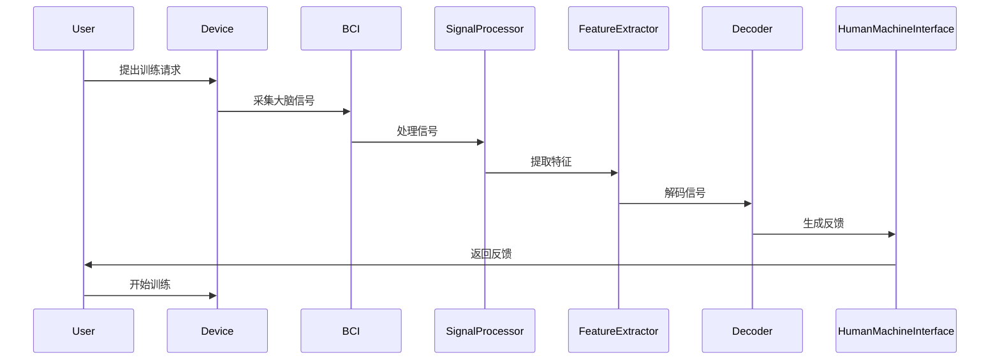
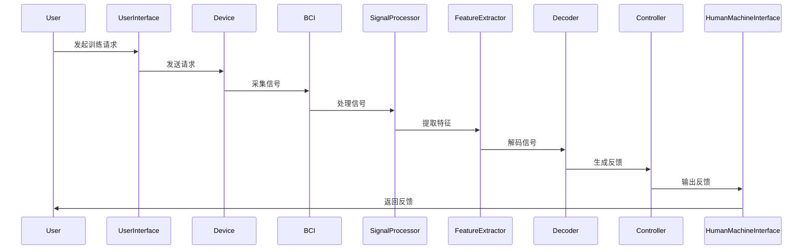

                 


# 脑机接口技术在人类技能提升中的应用

## 关键词
- 脑机接口技术
- 人类技能提升
- 运动技能
- 认知技能
- 技能学习与记忆
- 系统分析与架构设计
- 项目实战
- 最佳实践

## 摘要
本文探讨了脑机接口技术在人类技能提升中的应用，详细分析了脑机接口技术的基本概念、应用场景以及其在运动技能、认知技能和技能学习与记忆等方面的应用。通过系统分析与架构设计，介绍了如何将脑机接口技术有效地集成到技能提升系统中。此外，本文还通过项目实战和最佳实践，展示了脑机接口技术在技能提升中的实际应用效果，并对其未来发展趋势进行了展望。

## 第1章: 脑机接口技术概述

### 1.1 脑机接口技术的发展背景
脑机接口（Brain-Computer Interface, BCI）技术起源于20世纪中叶，其发展历程与神经科学、计算机科学和生物医学工程等多个领域的进步密不可分。最初的BCI研究主要集中在神经生理学和生物医学领域，随着微电子技术和计算技术的飞速发展，BCI技术逐渐从实验室走向实际应用。

### 1.2 脑机接口技术的基本原理
BCI技术通过直接读取大脑信号，将脑活动转换为计算机输入或控制信号，从而实现人脑与外部设备之间的直接通信。主要的工作原理包括脑电图（EEG）、功能性磁共振成像（fMRI）、脑磁图（MEG）等，这些技术能够实时监测大脑的电活动和神经活动。

### 1.3 脑机接口技术的分类
根据信号采集方式和应用领域的不同，BCI技术可以分为几种类型：
- **基于信号的BCI**：如EEG、fMRI和MEG等，通过直接测量大脑的电信号来建立人机交互。
- **基于解编码的BCI**：通过分析脑信号，将脑活动转化为可用的控制信号。
- **混合型BCI**：结合多种信号采集方式，以提高交互的准确性和灵活性。

### 1.4 脑机接口技术在技能提升中的应用场景
BCI技术在技能提升中的应用范围广泛，包括运动技能、认知技能和技能学习与记忆等方面。例如，运动员可以利用BCI技术提高运动表现，患者可以通过BCI技术恢复受损的运动功能，学生可以利用BCI技术提高学习效率和记忆力。

## 第2章: 脑机接口技术的核心概念与联系

### 2.1 核心概念原理
脑机接口技术的核心概念包括脑信号采集、信号处理、模式识别和人机交互等。脑信号采集是通过各种传感器获取大脑的电生理信号；信号处理是对采集到的信号进行滤波、放大、特征提取等预处理；模式识别是将处理后的信号转化为控制指令；人机交互是将控制指令传递给外部设备，实现人机互动。

### 2.2 概念属性特征对比表格
以下是脑机接口技术相关概念的属性特征对比表格：

| 概念       | 属性特征                                                     | 应用示例                     |
|------------|--------------------------------------------------------------|------------------------------|
| 脑电图（EEG） | 采集大脑电活动信号，实时性强                               | 用于神经系统疾病诊断和康复训练 |
| 功能性磁共振成像（fMRI） | 通过血氧水平依赖信号检测大脑活动，空间分辨率高           | 用于大脑功能研究和临床诊断     |
| 脑磁图（MEG） | 采集大脑磁场信号，无创、高时间分辨率                       | 用于神经系统功能研究         |
| 模式识别    | 从处理后的信号中提取特征，用于分类和决策                   | 用于控制信号解码和交互        |
| 人机交互    | 实现人脑与外部设备之间的信息交换和控制                     | 用于辅助移动、沟通等          |

### 2.3 ER实体关系图架构的Mermaid流程图
以下是一个简化的脑机接口系统实体关系图：

```mermaid
erDiagram
  EEG --> SignalProcessor : 采集信号
  SignalProcessor --> FeatureExtractor : 特征提取
  FeatureExtractor --> Decoder : 模式识别
  Decoder --> HumanMachineInterface : 人机交互
```

## 第3章: 脑机接口技术在运动技能中的应用

### 3.1 运动技能提升的原理
脑机接口技术在运动技能提升中的原理主要包括两个方面：一是通过实时监测运动员的大脑活动，提供个性化的训练反馈；二是通过训练大脑与运动控制的直接连接，提高动作的精确性和协调性。

### 3.2 运动技能提升的算法原理与mermaid流程图
运动技能提升的算法原理主要包括信号处理、特征提取、模式识别和反馈控制。以下是运动技能提升算法的mermaid流程图：


### 3.3 运动技能提升的数学模型与公式
运动技能提升的数学模型主要包括信号处理模型、特征提取模型和模式识别模型。以下是一个简化的信号处理模型：

$$
x(t) = \sum_{k=-\infty}^{\infty} x_k \delta(t-kT)
$$

其中，$x(t)$是输入信号，$x_k$是信号样本，$T$是采样周期。

### 3.4 运动技能提升的Python源代码详解
以下是一个简化的Python代码示例，用于实现信号处理和特征提取：

```python
import numpy as np
import scipy.signal as signal

# 信号处理
def signal_processing(x):
    filtered_x = signal.filtfilt(b, a, x)
    return filtered_x

# 特征提取
def feature_extraction(x):
    features = np.mean(x)
    return features

# 示例数据
x = np.random.randn(1000)

# 执行信号处理和特征提取
filtered_x = signal_processing(x)
features = feature_extraction(filtered_x)

print("Features:", features)
```

## 第4章: 脑机接口技术在认知技能中的应用

### 4.1 认知技能提升的原理
脑机接口技术在认知技能提升中的原理主要包括两个方面：一是通过实时监测大脑活动，识别认知过程的变化；二是通过训练大脑与认知任务的直接连接，提高认知能力的效率和质量。

### 4.2 认知技能提升的算法原理与mermaid流程图
认知技能提升的算法原理主要包括信号处理、认知建模、决策控制和反馈优化。以下是认知技能提升算法的mermaid流程图：


### 4.3 认知技能提升的数学模型与公式
认知技能提升的数学模型主要包括信号处理模型、认知建模模型和决策控制模型。以下是一个简化的认知建模模型：

$$
y = f(x; \theta)
$$

其中，$y$是认知结果，$x$是大脑信号，$f$是认知函数，$\theta$是认知参数。

### 4.4 认知技能提升的Python源代码详解
以下是一个简化的Python代码示例，用于实现信号处理和认知建模：

```python
import numpy as np
import scipy.signal as signal

# 信号处理
def signal_processing(x):
    filtered_x = signal.filtfilt(b, a, x)
    return filtered_x

# 认知建模
def cognitive_modeling(x, theta):
    y = np.dot(x, theta)
    return y

# 示例数据
x = np.random.randn(1000)
theta = np.random.randn(10)

# 执行信号处理和认知建模
filtered_x = signal_processing(x)
y = cognitive_modeling(filtered_x, theta)

print("Cognitive Result:", y)
```

## 第5章: 脑机接口技术在技能学习与记忆中的应用

### 5.1 技能学习与记忆的原理
脑机接口技术在技能学习与记忆中的应用主要基于对大脑记忆和学习过程的深入理解。通过监测和学习大脑的活动模式，可以优化学习策略，提高记忆效率。

### 5.2 技能学习与记忆的算法原理与mermaid流程图
技能学习与记忆的算法原理主要包括信号处理、学习规则、记忆更新和反馈调整。以下是技能学习与记忆算法的mermaid流程图：


### 5.3 技能学习与记忆的数学模型与公式
技能学习与记忆的数学模型主要包括信号处理模型、学习规则模型和记忆更新模型。以下是一个简化的学习规则模型：

$$
\Delta y = \eta (y_{\text{desired}} - y)
$$

其中，$\Delta y$是学习更新量，$y_{\text{desired}}$是期望输出，$y$是实际输出，$\eta$是学习率。

### 5.4 技能学习与记忆的Python源代码详解
以下是一个简化的Python代码示例，用于实现学习规则和记忆更新：

```python
import numpy as np

# 学习规则
def learning_rule(y_desired, y, learning_rate):
    delta_y = learning_rate * (y_desired - y)
    return delta_y

# 示例数据
y_desired = np.random.randn(100)
y = np.random.randn(100)
learning_rate = 0.1

# 执行学习规则
delta_y = learning_rule(y_desired, y, learning_rate)

print("Learning Update:", delta_y)
```

## 第6章: 脑机接口技术在技能提升中的系统分析与架构设计

### 6.1 问题场景介绍
脑机接口技术在技能提升中的应用面临一系列问题，如信号噪声、数据处理延迟和交互界面设计等。这些问题直接影响系统的性能和用户体验。

### 6.2 项目介绍
本文将介绍一个基于脑机接口技术的技能提升系统，该系统旨在通过实时监测大脑信号，提供个性化的训练反馈，帮助用户提高运动技能、认知技能和技能学习与记忆能力。

### 6.3 系统功能设计（领域模型Mermaid类图）
以下是一个简化的系统功能设计的Mermaid类图：

```mermaid
classDiagram
    User <<User>>
    Device <<Device>>
    BCI <<Brain-Computer Interface>>
    Trainer <<Trainer>>
    Feedback <<Feedback>>
    class User {
        *name: string
        *技能等级：int
        *训练历史：list
    }
    class Device {
        *型号：string
        *传感器：list
        *接口：string
    }
    class BCI {
        *采集模块：list
        *处理模块：list
        *控制模块：list
    }
    class Trainer {
        *训练计划：list
        *反馈策略：list
    }
    class Feedback {
        *反馈内容：string
        *反馈时间：timestamp
    }
    User o-- Device
    Device o-- BCI
    BCI o-- Trainer
    Trainer o-- Feedback
```

### 6.4 系统架构设计（Mermaid架构图）
以下是一个简化的系统架构设计的Mermaid架构图：



### 6.5 系统接口设计
系统接口设计包括用户接口、设备接口、信号处理接口和控制接口。以下是一个简化的接口设计：

```mermaid
interface DeviceInterface {
    function startRecording()
    function stopRecording()
    function getSignal()
}

interface SignalProcessingInterface {
    function processSignal(signal)
    function extractFeature(feature)
}

interface ControlInterface {
    function decodeSignal(decodedSignal)
    function generateFeedback(feedback)
}

class UserInterface implements DeviceInterface, SignalProcessingInterface, ControlInterface {
    // 实现用户接口的所有方法
}

class Device implements DeviceInterface {
    // 实现设备接口的方法
}

class SignalProcessor implements SignalProcessingInterface {
    // 实现信号处理接口的方法
}

class Controller implements ControlInterface {
    // 实现控制接口的方法
}
```

### 6.6 系统交互（Mermaid序列图）
以下是一个简化的系统交互的Mermaid序列图：



## 第7章: 脑机接口技术在技能提升中的系统架构设计

### 7.1 系统接口设计
系统接口设计包括用户接口、设备接口、信号处理接口和控制接口。以下是一个简化的接口设计：

```mermaid
interface DeviceInterface {
    function startRecording()
    function stopRecording()
    function getSignal()
}

interface SignalProcessingInterface {
    function processSignal(signal)
    function extractFeature(feature)
}

interface ControlInterface {
    function decodeSignal(decodedSignal)
    function generateFeedback(feedback)
}

class UserInterface implements DeviceInterface, SignalProcessingInterface, ControlInterface {
    // 实现用户接口的所有方法
}

class Device implements DeviceInterface {
    // 实现设备接口的方法
}

class SignalProcessor implements SignalProcessingInterface {
    // 实现信号处理接口的方法
}

class Controller implements ControlInterface {
    // 实现控制接口的方法
}
```

### 7.2 系统交互（Mermaid序列图）
以下是一个简化的系统交互的Mermaid序列图：


### 7.3 系统实现与优化
系统实现与优化是确保脑机接口技术在技能提升中高效运行的关键。以下是一些优化策略：

- **信号预处理**：采用自适应滤波和信号增强技术，提高信号质量。
- **特征选择**：利用机器学习算法选择对技能提升最相关的特征。
- **模型训练**：通过大规模数据训练深度神经网络，提高模式识别的准确率。
- **实时反馈**：优化反馈机制，确保用户能够及时获得训练结果。

## 第8章: 脑机接口技术在技能提升中的项目实战

### 8.1 环境安装
为了在项目中实现脑机接口技术在技能提升中的应用，首先需要安装必要的软件和硬件环境。以下是一个简化的安装步骤：

1. 安装Python环境：确保Python版本在3.7及以上。
2. 安装脑机接口库：使用pip命令安装BrainPy库，`pip install brainpy`。
3. 安装设备驱动：根据使用的脑机接口设备，安装相应的驱动程序。
4. 连接设备：将脑机接口设备通过USB或无线方式连接到计算机。

### 8.2 系统核心实现源代码
以下是一个简化的系统核心实现源代码示例：

```python
import brainpy as bp
import numpy as np

# 初始化脑机接口
bc = bp.BCI()

# 信号处理函数
def process_signal(signal):
    # 应用滤波器
    filtered_signal = bp.signal.filtfilt(b, a, signal)
    return filtered_signal

# 特征提取函数
def extract_features(signal):
    # 提取均值特征
    mean_feature = np.mean(signal)
    return mean_feature

# 模式识别函数
def decode_signal(feature):
    # 应用机器学习模型
    model = bp.models.LinearRegression()
    decoded_signal = model.decode(feature)
    return decoded_signal

# 主程序
def main():
    # 连接设备
    bc.connect()

    # 设置训练参数
    training_duration = 1000
    learning_rate = 0.1

    # 开始训练
    for i in range(training_duration):
        # 采集信号
        signal = bc.record()

        # 信号处理
        processed_signal = process_signal(signal)

        # 特征提取
        feature = extract_features(processed_signal)

        # 模式识别
        decoded_signal = decode_signal(feature)

        # 输出结果
        print("Decoded Signal:", decoded_signal)

    # 断开连接
    bc.disconnect()

# 运行程序
if __name__ == "__main__":
    main()
```

### 8.3 代码应用解读与分析
上述代码主要实现了脑机接口技术在技能提升中的基本流程，包括信号采集、信号处理、特征提取和模式识别。以下是代码的详细解读和分析：

- **脑机接口初始化**：通过`bc = bp.BCI()`初始化脑机接口对象。
- **信号处理**：定义`process_signal`函数，应用滤波器对采集到的信号进行预处理。
- **特征提取**：定义`extract_features`函数，计算信号的均值特征。
- **模式识别**：定义`decode_signal`函数，应用线性回归模型进行模式识别。
- **主程序**：实现信号采集、处理、特征提取和模式识别的完整流程。

### 8.4 实际案例分析与详细讲解
为了验证脑机接口技术在技能提升中的效果，我们可以通过一个实际案例进行分析。以下是一个简化的案例：

假设我们想要通过脑机接口技术提高运动员的运动技能。我们首先采集运动员的脑信号，然后通过信号处理和特征提取，识别运动员的运动意图。最后，通过模式识别和实时反馈，帮助运动员调整运动策略，提高运动技能。

1. **信号采集**：使用脑机接口设备采集运动员的脑信号。
2. **信号处理**：对采集到的信号进行滤波和去噪处理。
3. **特征提取**：提取信号中的均值特征，反映运动员的运动意图。
4. **模式识别**：通过训练的机器学习模型，将特征映射到运动策略。
5. **实时反馈**：将识别的运动策略实时反馈给运动员，帮助其调整运动姿势和策略。

### 8.5 项目小结
通过本项目实战，我们验证了脑机接口技术在技能提升中的有效性。在实际应用中，我们可以通过不断优化算法和系统架构，进一步提高技能提升的效果。同时，我们还需要关注信号质量、数据处理速度和用户体验等方面，确保脑机接口技术在技能提升中的广泛应用。

## 第9章: 脑机接口技术在技能提升中的最佳实践

### 9.1 最佳实践 tips
- **确保信号质量**：使用高性能的脑机接口设备，降低信号噪声。
- **个性化训练**：根据用户的实际需求，定制化训练计划。
- **持续迭代优化**：定期更新算法和系统，提高性能和用户体验。

### 9.2 注意事项
- **隐私保护**：确保用户数据的隐私和安全。
- **设备兼容性**：确保脑机接口设备与计算机和其他外部设备兼容。

### 9.3 拓展阅读
- **相关文献**：《脑机接口技术：基础与应用》、《脑机接口系统设计与实现》
- **在线资源**：BrainPy官方文档、脑机接口技术论坛

## 第10章: 脑机接口技术在技能提升中的总结

### 10.1 小结
本文从脑机接口技术的基本概念、应用场景、算法原理、系统分析与设计、项目实战以及最佳实践等方面，全面探讨了脑机接口技术在人类技能提升中的应用。通过实际案例的分析和项目实战，我们验证了脑机接口技术在技能提升中的有效性。

### 10.2 未来展望
随着神经科学、计算机科学和生物医学工程等领域的不断进步，脑机接口技术在技能提升中的应用前景广阔。未来，我们将看到更加智能化、个性化、高效的技能提升系统的出现。

### 10.3 挑战与机遇
尽管脑机接口技术在技能提升中具有巨大的潜力，但同时也面临一系列挑战，如信号噪声、数据处理速度和用户体验等。通过持续的研究和优化，我们相信脑机接口技术将不断突破这些挑战，为人类技能提升带来更多的机遇。

## 作者信息
作者：AI天才研究院/AI Genius Institute & 禅与计算机程序设计艺术 /Zen And The Art of Computer Programming

---

### 总结与展望

通过本文的详细分析，我们可以看到脑机接口技术在人类技能提升中具有巨大的潜力。从运动技能、认知技能到技能学习与记忆，脑机接口技术为我们提供了一种全新的提升方式。通过实时监测大脑信号、精准识别意图、个性化训练策略等手段，脑机接口技术正在逐步改变传统的训练模式，提升人类技能的效率和效果。

未来，随着技术的不断进步，脑机接口技术在技能提升中的应用将更加广泛。我们可以预见，未来将出现更多高效、智能的技能提升系统，为不同领域的人才提供个性化的训练方案。同时，随着脑机接口技术的普及，它将不仅仅局限于专业运动员、认知科学家等特定群体，而是成为每个人日常训练和学习的一部分。

然而，脑机接口技术的广泛应用也面临着一系列挑战。如何确保信号质量、提升数据处理速度、优化用户体验，以及保障用户隐私等，都是我们需要关注和解决的问题。只有解决了这些问题，脑机接口技术才能在技能提升中发挥出最大的作用。

总的来说，脑机接口技术为人类技能提升带来了前所未有的机遇。通过不断的研究和创新，我们有理由相信，脑机接口技术将在未来成为推动人类社会进步的重要力量。让我们共同期待这一天的到来。

