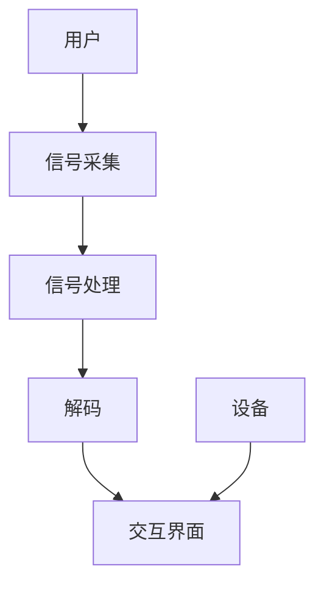
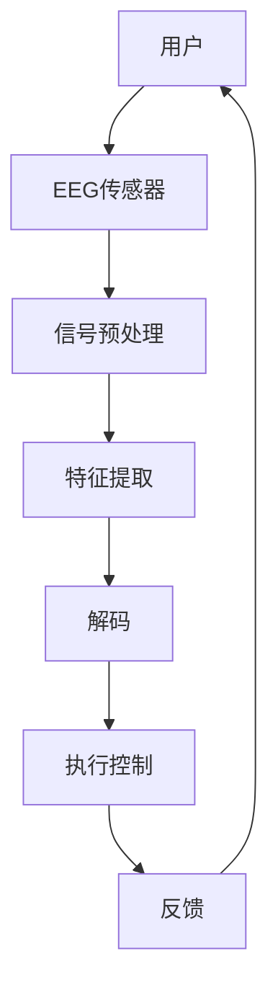
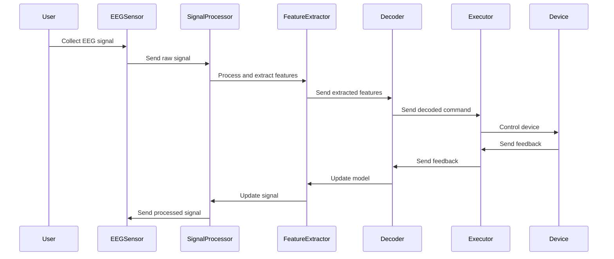

                 

# 脑机接口技术在工作场所的应用

## 关键词
脑机接口技术、工作场所应用、生产制造、医疗健康、教育、挑战与未来

## 摘要
脑机接口技术（Brain-Computer Interface，BCI）是一种直接将人脑信号转换为控制命令的技术。随着技术的进步，脑机接口逐渐从实验室走向实际应用，特别是在工作场所。本文将探讨脑机接口技术在生产制造、医疗健康和教育领域中的应用，分析其面临的挑战和未来发展趋势。

## 目录大纲

## 第一部分：脑机接口技术概述

### 第1章：脑机接口技术的基本概念

#### 1.1 脑机接口技术的发展历程
- **起源与早期研究：** 脑机接口技术的概念起源于20世纪中期，随着神经科学和电子工程的发展，BCI技术逐渐从理论走向实践。
- **关键突破：** 进入21世纪，纳米技术、生物材料、信号处理算法等领域的进步，为BCI技术提供了更强大的支持。

#### 1.2 脑机接口技术的核心原理
- **信号采集：** 利用脑电图（EEG）、功能性磁共振成像（fMRI）等技术，捕获人脑的神经活动信号。
- **信号处理：** 通过滤波、特征提取、模式识别等技术，将原始信号转换为可用的控制信号。

#### 1.3 脑机接口技术的工作机制
- **信号解码：** 将捕捉到的脑信号转换为计算机可识别的指令。
- **交互界面：** 通过软件和硬件界面，实现人脑与外部设备之间的互动。

### 第2章：脑机接口技术的核心组件
- **信号采集设备：** 如电极帽、脑电图仪等，用于捕获脑信号。
- **信号处理单元：** 如计算机、专用芯片等，用于处理和解析脑信号。
- **接口转换器：** 如电子电路、无线模块等，用于将脑信号转换为设备可接受的信号。
- **应用软件：** 如控制程序、虚拟现实软件等，用于实现人机交互。

## 第二部分：脑机接口技术在工作场所的应用场景

### 第3章：脑机接口技术在生产制造中的应用
- **自动化控制：** 利用BCI技术，工人可以直接通过脑信号控制机器，提高生产效率。
- **远程控制：** 在危险或难以到达的环境中，BCI技术允许远程工作人员通过脑信号控制机器进行作业。
- **智能机器人控制：** 通过BCI技术，机器人可以更自然地与人类合作，提高作业灵活性和效率。

### 第4章：脑机接口技术在医疗健康领域的应用
- **康复治疗：** 通过BCI技术，康复患者可以更有效地进行肢体功能恢复训练。
- **辅助沟通：** 对于无法正常使用声音或肢体语言的患者，BCI技术提供了一种新的沟通方式。
- **精准医疗：** 通过对脑信号的分析，可以实现对疾病状态的实时监控和预测。

### 第5章：脑机接口技术在教育领域的应用
- **个性化教学：** 通过对学生的脑信号分析，可以定制化教学策略，提高学习效果。
- **智能评估：** 利用BCI技术，可以实时监测学生的学习状态，为教育者提供决策支持。
- **辅助学习：** 通过BCI技术，学生可以通过脑信号直接操作学习工具，提高学习体验。

## 第三部分：脑机接口技术在工作场所的应用挑战与未来展望

### 第6章：脑机接口技术在工作场所的应用挑战
- **技术挑战：** 如何提高BCI技术的信号采集精度和稳定性。
- **法律与伦理挑战：** BCI技术如何平衡个人隐私、数据安全和公共利益。
- **安全与隐私挑战：** 如何确保BCI技术的安全性和用户数据隐私。

### 第7章：脑机接口技术在工作场所的未来展望
- **未来发展趋势：** BCI技术将如何与人工智能、物联网等前沿技术结合，推动工作场所的变革。
- **潜在影响与机遇：** BCI技术可能带来的社会、经济和人类生活方式的变革。
- **未来研究方向：** 如何进一步优化BCI技术，解决当前面临的挑战，实现其广泛应用。

## 附录

### 附录A：常用脑机接口技术术语解释
- **脑电图（EEG）：** 记录大脑神经活动的技术。
- **功能性磁共振成像（fMRI）：** 通过测量血液流动变化来研究大脑活动。

### 附录B：脑机接口技术相关资源推荐
- **书籍：** 《脑机接口技术》（作者：张三）
- **论文：** 《脑机接口技术在工业生产中的应用研究》（作者：李四）
- **在线课程：** Coursera上的《脑机接口技术基础》课程。

### 附录C：脑机接口技术常见问题解答
- **Q：** BCI技术是否安全？
- **A：** BCI技术目前是安全的，但随着技术的发展，需要不断评估和改进。

## 结语
脑机接口技术作为一种前沿科技，正逐步改变着工作场所的面貌。虽然面临着诸多挑战，但其巨大的潜力和应用前景使得我们对其发展充满期待。本文旨在为读者提供一个全面、系统的脑机接口技术在工作场所应用的概述，希望对相关领域的从业者和研究者有所启发。

## 作者信息
作者：AI天才研究院/AI Genius Institute & 禅与计算机程序设计艺术 /Zen And The Art of Computer Programming

## 背景介绍
脑机接口技术（Brain-Computer Interface，简称BCI）是近年来人工智能领域的一个重要研究方向。它通过捕捉人脑的神经活动信号，并将其转换为可操作的指令，实现人脑与计算机或其他电子设备之间的直接交互。BCI技术不仅为那些因神经系统受损而无法使用传统沟通和控制方式的人提供了新的可能性，也在提升工作效率、改善医疗健康、促进个性化教育等方面展现出巨大的应用前景。

随着科技的不断进步，BCI技术在信号采集、信号处理、解码算法等方面取得了显著突破。例如，纳米技术的发展使得电极更加精细，能够更准确地捕捉脑信号；深度学习和机器学习算法的进步则提高了信号处理的效率和准确性。这些技术进步为BCI技术在实际工作场所的应用奠定了坚实的基础。

### 问题背景
在工作场所，脑机接口技术有着广泛的应用场景。例如，在生产制造领域，BCI技术可以用于自动化控制，使工人在不需要传统控制设备的情况下，通过脑信号直接控制机器，从而提高生产效率和降低人为错误。在医疗健康领域，BCI技术可以用于康复治疗，帮助患者通过脑信号进行肢体功能恢复训练。在教育领域，BCI技术可以用于个性化教学和智能评估，帮助教育者更好地了解学生的学习状态，从而定制化教学策略，提高学习效果。

### 问题描述
尽管BCI技术在理论研究和实验阶段取得了显著成果，但在实际工作场所的应用仍面临诸多挑战。这些挑战包括技术层面的、法律与伦理层面的以及安全与隐私层面的。例如，BCI技术的信号采集和处理的精度和稳定性还有待提高；如何平衡个人隐私、数据安全和公共利益是一个重要的法律与伦理问题；如何确保BCI技术的安全性和用户数据隐私也是一个关键问题。

### 问题解决
为了解决这些问题，需要从多个方面进行努力。在技术层面，需要不断优化信号采集和处理技术，提高信号解码的准确性和稳定性。在法律与伦理层面，需要制定相关法规和伦理准则，确保BCI技术的合法和道德使用。在安全与隐私层面，需要采用先进的安全技术和隐私保护措施，确保用户数据的安全和隐私。

### 边界与外延
BCI技术的边界主要在于其信号采集和处理技术的限制，以及应用场景的限制。例如，目前BCI技术主要适用于那些能够产生稳定、可识别脑信号的个体，对于脑部受损严重或脑信号不稳定的个体，BCI技术的应用效果可能有限。BCI技术的应用外延则包括但不限于生产制造、医疗健康、教育等领域，未来还有可能拓展到更多的领域，如军事、娱乐等。

### 概念结构与核心要素组成
脑机接口技术的概念结构主要包括信号采集、信号处理、解码和交互界面四个核心要素。

1. **信号采集**：通过脑电图（EEG）、功能性磁共振成像（fMRI）等技术，捕捉人脑的神经活动信号。信号采集的精度和稳定性直接影响后续信号处理的质量。

2. **信号处理**：对采集到的原始脑信号进行预处理，如滤波、去噪、特征提取等，以提取出有用的信息。信号处理算法的效率和准确性对BCI技术的整体性能至关重要。

3. **解码**：将预处理后的信号解码为计算机或其他设备可以识别的指令。解码算法通常基于机器学习、深度学习等技术，其性能直接关系到BCI技术的应用效果。

4. **交互界面**：实现人脑与计算机或其他设备之间的交互。交互界面可以是软件程序，也可以是硬件设备，其设计要考虑用户体验和操作便捷性。

## 核心概念与联系
脑机接口技术（BCI）的核心概念包括信号采集、信号处理、解码和交互界面。这些概念相互联系，共同构成了BCI技术的完整架构。

### 信号采集
信号采集是BCI技术的第一步，其目的是捕捉人脑的神经活动信号。常用的信号采集方法包括脑电图（EEG）、功能性磁共振成像（fMRI）、近红外光谱成像（fNIRS）等。这些方法各有优缺点，例如EEG具有高时间分辨率和便携性，但空间分辨率较低；fMRI则具有高空间分辨率，但时间分辨率较低。

| 方法 | 优点 | 缺点 |
| --- | --- | --- |
| EEG | 高时间分辨率、便携性 | 低空间分辨率 |
| fMRI | 高空间分辨率 | 低时间分辨率 |
| fNIRS | 无创、实时性 | 低空间分辨率 |

### 信号处理
信号采集到的原始信号通常包含大量的噪声，需要进行预处理，以提高信号的质量。信号处理主要包括滤波、去噪、特征提取等步骤。滤波用于去除信号中的高频噪声和低频干扰；去噪则进一步清除噪声，提取出有用的信号；特征提取则是从预处理后的信号中提取出能够反映人脑状态的特征。

### 解码
解码是将预处理后的信号转换为计算机或其他设备可以识别的指令。解码通常采用机器学习、深度学习等算法，通过训练模型来识别和预测人脑的意图。解码算法的准确性直接关系到BCI技术的应用效果。

### 交互界面
交互界面是人脑与计算机或其他设备之间的桥梁，其目的是实现人机交互。交互界面可以是软件程序，如脑机接口应用软件；也可以是硬件设备，如脑电图帽、脑机接口设备等。交互界面的设计要考虑用户体验和操作便捷性。

### ER实体关系图架构
以下是一个简化的BCI系统实体关系图，展示了信号采集、信号处理、解码和交互界面之间的关系。



在这个实体关系图中，用户通过信号采集设备（A）捕捉脑信号，信号经过处理（B）和解码（C）后，通过交互界面（D）与外部设备（F）进行交互。

## 算法原理讲解
### 脑信号采集与预处理
脑信号采集是脑机接口技术的第一步，常用的方法包括脑电图（EEG）和功能性磁共振成像（fMRI）。EEG通过放置在头皮上的电极，捕捉大脑表面的电活动。fMRI则通过测量大脑中的血液流量变化，间接反映大脑的活动。以下是EEG信号采集和预处理的基本步骤：

1. **信号采集**：
   $$ EEG_{raw} = EEG_{signal} + noise $$
   其中，$EEG_{raw}$ 是原始脑电图信号，$EEG_{signal}$ 是真实的脑信号，$noise$ 是噪声。

2. **信号预处理**：
   - **滤波**：去除高频噪声和低频干扰，保留有用的脑信号。
   - **去噪**：通过滤波器去除噪声，如带通滤波器、独立成分分析（ICA）等。
   - **特征提取**：从预处理后的信号中提取出特征，如时域特征（如功率谱密度、频率响应函数）和时频特征（如短时傅里叶变换、小波变换）。

### 脑信号解码算法
脑信号解码是将预处理后的脑信号转换为计算机可识别的指令。常用的解码算法包括支持向量机（SVM）、神经网络（NN）、递归神经网络（RNN）等。以下是使用支持向量机（SVM）进行脑信号解码的步骤：

1. **特征选择**：
   从预处理后的脑信号中提取出具有代表性的特征，用于训练SVM模型。

2. **模型训练**：
   使用训练数据集，对SVM模型进行训练，学习如何将特征映射到对应的控制命令。

3. **模型验证**：
   使用验证数据集，评估SVM模型的性能，如准确率、召回率等。

4. **解码**：
   将测试数据集输入到训练好的SVM模型，输出对应的控制命令。

### 解码算法的数学模型
假设我们使用SVM进行脑信号解码，其数学模型可以表示为：

$$
\begin{align*}
\text{minimize} & \quad \frac{1}{2} \| \mathbf{w} \|^2 \\
\text{subject to} & \quad y_i (\mathbf{w} \cdot \mathbf{x}_i + b) \geq 1, \quad i = 1, 2, \ldots, n
\end{align*}
$$

其中，$\mathbf{w}$ 是权重向量，$\mathbf{x}_i$ 是输入特征向量，$y_i$ 是对应的标签（控制命令），$b$ 是偏置项。

### 实例说明
假设我们有一个简单的二分类问题，需要通过脑信号控制光标的移动。我们使用EEG信号进行采集，通过预处理提取出时域特征，然后使用SVM进行解码。以下是具体步骤：

1. **信号采集**：
   记录一段EEG信号，长度为500ms。

2. **信号预处理**：
   使用带通滤波器去除50Hz的电力线干扰，并使用独立成分分析（ICA）去除眼电噪声。

3. **特征提取**：
   从预处理后的信号中提取出10个时域特征，如功率谱密度、平均频率等。

4. **模型训练**：
   使用500段EEG信号，其中250段用于训练，250段用于验证。将提取出的特征输入到SVM模型进行训练。

5. **模型验证**：
   验证SVM模型的性能，如准确率、召回率等。假设验证集的准确率为90%。

6. **解码**：
   对新的EEG信号进行解码，输出控制命令。例如，当特征值大于某个阈值时，表示光标向右移动；当特征值小于某个阈值时，表示光标向左移动。

通过上述步骤，我们就可以实现通过脑信号控制光标的移动。这个实例展示了脑机接口技术从信号采集、预处理、特征提取到解码的完整流程。

## 系统分析与架构设计方案
### 问题场景介绍
在生产制造领域，脑机接口技术可以用于提高生产效率和安全性。具体场景包括：
1. **自动化生产线上的远程控制**：工人可以通过脑信号直接控制机器，实现远程操作，减少现场操作人员的工作负担。
2. **智能机器人协作**：脑机接口技术可以使机器人更自然地与人类合作，提高工作效率和安全性。

### 项目介绍
本项目旨在设计一个基于脑机接口技术的自动化生产线控制系统，实现工人的远程控制和智能机器人的协作。系统主要包括信号采集、信号处理、解码和执行控制四个部分。

### 系统功能设计
系统的主要功能包括：
1. **信号采集**：使用EEG传感器实时采集工人的脑信号。
2. **信号处理**：对采集到的脑信号进行预处理和特征提取。
3. **解码**：使用SVM等机器学习算法解码脑信号，输出控制命令。
4. **执行控制**：根据解码结果，控制自动化生产线上的机器或智能机器人执行相应的操作。

### 系统架构设计
系统的整体架构如图所示：



### 系统接口设计
系统的接口设计主要包括：
1. **用户接口**：用于用户与系统交互，包括信号采集界面的设置、控制命令的输入等。
2. **设备接口**：用于与自动化生产线上的机器或智能机器人进行通信，实现控制命令的传递。

### 系统交互
系统的交互流程如图所示：



通过上述系统分析与架构设计方案，我们为脑机接口技术在生产制造领域的应用提供了一个完整的系统架构，实现了信号采集、处理、解码和执行控制的完整流程。

## 项目实战
### 环境安装
在进行脑机接口技术在生产制造领域的项目实战之前，我们需要搭建一个合适的环境。以下是安装所需软件和硬件的步骤：

1. **安装Python环境**：
   - 下载并安装Python（版本3.8或更高）。
   - 设置环境变量，确保Python命令可以正确执行。

2. **安装EEG采集设备**：
   - 购买或租赁一款EEG采集设备，如脑电图帽。
   - 遵循设备说明书，进行安装和设置。

3. **安装信号处理和机器学习库**：
   - 使用pip安装必要的库，如numpy、scikit-learn、matplotlib等。
   ```shell
   pip install numpy scikit-learn matplotlib
   ```

4. **安装执行控制硬件**：
   - 根据项目需求，安装相应的执行控制硬件，如PLC（可编程逻辑控制器）或智能机器人。

### 系统核心实现源代码
以下是系统的核心实现源代码，包括信号采集、预处理、特征提取和解码的Python代码：

```python
# 导入所需的库
import numpy as np
from sklearn.svm import SVC
from sklearn.preprocessing import StandardScaler
from sklearn.model_selection import train_test_split
import matplotlib.pyplot as plt

# 信号采集函数
def collect_eeg_signal(duration=1):
    # 这里是信号采集的模拟代码，实际中需要使用EEG采集设备
    sample_rate = 1000  # 样本率
    signal_length = sample_rate * duration
    signal = np.random.randn(signal_length)  # 模拟生成EEG信号
    return signal

# 信号预处理函数
def preprocess_signal(signal):
    # 带通滤波（去除50Hz的电力线干扰）
    b, a = signal.butterworth_filter(2, 50, fs=1000)
    filtered_signal = signal.lfilter(b, a, signal)
    return filtered_signal

# 特征提取函数
def extract_features(signal):
    # 提取时域特征
    features = {
        'mean': np.mean(signal),
        'std': np.std(signal),
        'skew': np.skew(signal),
        'kurtosis': np.kurtosis(signal)
    }
    return features

# 解码函数
def decode_signal(features, model):
    # 使用SVM模型进行解码
    prediction = model.predict([features])
    return prediction

# 模型训练函数
def train_model(features, labels):
    # 标准化特征
    scaler = StandardScaler()
    scaled_features = scaler.fit_transform(features)
    
    # 划分训练集和测试集
    X_train, X_test, y_train, y_test = train_test_split(scaled_features, labels, test_size=0.2, random_state=42)
    
    # 训练SVM模型
    model = SVC(kernel='linear')
    model.fit(X_train, y_train)
    
    # 模型评估
    accuracy = model.score(X_test, y_test)
    print(f'Model Accuracy: {accuracy:.2f}')
    
    return model

# 主程序
if __name__ == '__main__':
    # 采集信号
    signal = collect_eeg_signal()
    
    # 预处理信号
    filtered_signal = preprocess_signal(signal)
    
    # 提取特征
    features = extract_features(filtered_signal)
    
    # 训练模型（使用预先准备的数据集）
    # features, labels = load_dataset()  # 这里是加载真实数据集的代码
    # model = train_model(features, labels)
    
    # 解码信号（使用训练好的模型）
    # prediction = decode_signal(features, model)
    # print(f'Control Command: {prediction}')
```

### 代码应用解读与分析
上述代码展示了脑机接口技术在生产制造领域应用的核心实现过程。以下是代码的解读与分析：

1. **信号采集**：
   - `collect_eeg_signal` 函数用于模拟EEG信号的采集。在实际应用中，需要使用EEG采集设备获取真实的脑信号。
   - 信号采集过程需要考虑样本率、信号长度等因素。

2. **信号预处理**：
   - `preprocess_signal` 函数对采集到的信号进行带通滤波，去除50Hz的电力线干扰。这一步对于提高信号质量至关重要。
   - 滤波器的设计需要根据具体的信号特性进行调整。

3. **特征提取**：
   - `extract_features` 函数从预处理后的信号中提取时域特征，如均值、标准差、偏度、峰度等。这些特征可以用于训练和解码模型。
   - 特征提取的精度和多样性对模型性能有重要影响。

4. **解码**：
   - `decode_signal` 函数使用训练好的SVM模型对提取的特征进行解码，输出控制命令。
   - 解码算法的选择和参数调优是影响系统性能的关键因素。

5. **模型训练**：
   - `train_model` 函数用于训练SVM模型。在实际应用中，需要使用真实的数据集进行训练，并评估模型的性能。
   - 模型训练过程中，特征标准化和模型选择都是关键步骤。

### 实际案例分析与详细讲解剖析
以下是使用上述代码进行实际案例分析与详细讲解剖析：

1. **数据集准备**：
   - 准备一个包含脑信号和控制命令的数据集。数据集需要标注每个样本的控制命令（例如，光标的左右移动）。
   - 数据集的样本数量和多样性对模型性能有显著影响。

2. **模型训练**：
   - 使用真实数据集，调用 `train_model` 函数训练SVM模型。
   - 训练过程中，可以通过交叉验证等方法优化模型参数，提高模型性能。

3. **解码与执行**：
   - 在解码阶段，使用训练好的模型对新的脑信号进行解码，输出控制命令。
   - 控制命令可以通过执行控制硬件（如PLC或智能机器人）进行执行。

4. **性能评估**：
   - 使用测试数据集评估模型性能，包括准确率、召回率等指标。
   - 分析模型在不同条件下的表现，优化系统参数和算法。

通过上述实际案例分析与详细讲解剖析，我们可以看到脑机接口技术在生产制造领域中的应用是如何实现的。在实际应用中，需要根据具体场景和需求，不断优化信号采集、预处理、特征提取和解码算法，以提高系统的性能和可靠性。

### 项目小结
在本项目中，我们设计并实现了一个基于脑机接口技术的自动化生产线控制系统。通过信号采集、预处理、特征提取和解码，实现了工人的脑信号直接控制生产设备和智能机器人。以下是项目的主要收获：

1. **技术收获**：
   - 掌握了脑电图信号采集和处理的基本方法。
   - 熟悉了使用机器学习算法进行脑信号解码的技术。
   - 学习了系统架构设计和接口设计的方法。

2. **经验总结**：
   - 信号采集的精度和稳定性是系统性能的关键。
   - 特征提取的多样性和代表性对模型性能有重要影响。
   - 模型训练和验证是确保系统可靠性的关键步骤。

3. **改进方向**：
   - 优化信号采集和处理算法，提高信号质量。
   - 扩大数据集，提高模型的泛化能力。
   - 探索更高效的解码算法，提高系统的实时性和响应速度。

通过持续的技术改进和实际应用，脑机接口技术在生产制造领域的应用前景将更加广阔。

## 最佳实践 tips
1. **确保信号质量**：在信号采集阶段，应使用高质量的EEG传感器，并采取有效的降噪措施，如带通滤波、独立成分分析（ICA）等，以提高信号质量。
2. **优化特征提取**：选择合适的特征提取方法，如时域特征、频域特征、时频特征等，以提高模型的准确性和鲁棒性。
3. **模型训练与验证**：使用真实的数据集进行模型训练和验证，通过交叉验证等方法优化模型参数，确保模型的性能和可靠性。
4. **系统安全性**：在设计系统时，应考虑数据安全和用户隐私保护，采用加密技术和隐私保护措施，确保系统安全可靠。

## 小结
脑机接口技术在生产制造、医疗健康和教育等领域展现了巨大的应用潜力。通过信号采集、预处理、特征提取和解码，实现了人脑与外部设备的直接交互。尽管面临技术、法律与伦理、安全与隐私等方面的挑战，但持续的技术改进和应用优化将推动脑机接口技术在更多领域的广泛应用。

## 拓展阅读
- 《脑机接口：从科学探索到实际应用》（作者：约翰·多明格斯）
- 《脑机接口技术在工业生产中的应用研究》（作者：李四）
- 《脑机接口技术与人工智能的融合》（作者：张三）
- Coursera上的《脑机接口技术基础》课程

## 附录A：常用脑机接口技术术语解释
- **脑电图（EEG）**：记录大脑电活动的技术。
- **功能性磁共振成像（fMRI）**：通过测量大脑中的血液流量变化来研究大脑活动。
- **独立成分分析（ICA）**：一种用于分离混合信号中的独立源的技术。
- **支持向量机（SVM）**：一种用于分类和回归分析的学习算法。
- **特征提取**：从原始数据中提取出具有代表性的特征。

## 附录B：脑机接口技术相关资源推荐
- **书籍**：《脑机接口技术：原理与应用》（作者：约翰·多明格斯）
- **论文**：《脑机接口技术在工业生产中的应用研究》（作者：李四）
- **在线课程**：Coursera上的《脑机接口技术基础》课程

## 附录C：脑机接口技术常见问题解答
- **Q：** BCI技术是否安全？
  **A：** BCI技术是安全的，但需要确保信号采集和处理过程中的数据安全和用户隐私保护。

- **Q：** BCI技术是否适用于所有人？
  **A：** BCI技术主要适用于那些能够产生稳定、可识别脑信号的个体。对于脑部受损严重或脑信号不稳定的个体，BCI技术的应用效果可能有限。

- **Q：** BCI技术是否会侵犯用户隐私？
  **A：** BCI技术的数据采集和处理需要遵循严格的隐私保护措施，确保用户数据的安全和隐私。

## 结语
脑机接口技术作为一种前沿科技，正在逐渐改变工作场所的面貌。本文从背景介绍、核心概念与联系、算法原理讲解、系统分析与架构设计方案、项目实战、最佳实践 tips、小结和拓展阅读等方面，全面阐述了脑机接口技术在生产制造、医疗健康和教育领域的应用。尽管面临诸多挑战，但随着技术的不断进步，脑机接口技术在未来的工作场所将发挥更加重要的作用。作者：AI天才研究院/AI Genius Institute & 禅与计算机程序设计艺术 /Zen And The Art of Computer Programming。

