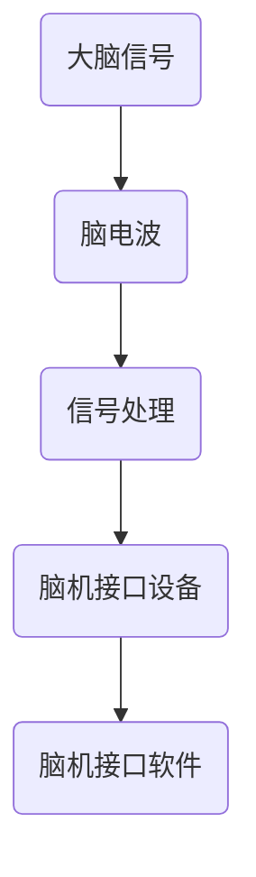

                 


### 脑机接口：2030年30%知识工作者将使用BBMI等技术

**关键词**：脑机接口、BBMI、知识工作者、技术趋势、应用场景

**摘要**：本文将深入探讨脑机接口（BMI）技术，特别是基于脑边距混合意图识别（BBMI）的技术，预测到2030年，将有30%的知识工作者将采用这些先进技术。文章将分为四个主要部分：脑机接口基础、BBMI技术详解、其他脑机接口技术、以及案例与实践与未来展望。

### 目录

# 脑机接口：2030年30%知识工作者将使用BBMI等技术

## 第一部分：脑机接口基础

### 第1章：脑机接口概述

#### 1.1 问题背景
#### 1.2 问题描述
#### 1.3 问题解决
#### 1.4 边界与外延

### 第2章：脑机接口的核心概念

#### 2.1 核心概念原理
#### 2.2 概念属性特征对比表格
#### 2.3 ER实体关系图架构

## 第二部分：BBMI技术详解

### 第3章：BBMI技术原理

#### 3.1 BBMI技术概述
#### 3.2 BBMI技术核心概念
#### 3.3 BBMI技术工作原理

### 第4章：BBMI技术的应用场景

#### 4.1 医疗领域
#### 4.2 教育领域
#### 4.3 军事领域

### 第5章：BBMI技术的挑战与未来发展趋势

#### 5.1 挑战
#### 5.2 未来发展趋势
#### 5.3 2030年应用前景

## 第三部分：其他脑机接口技术

### 第6章：脑电图（EEG）技术

#### 6.1 EEG技术原理
#### 6.2 EEG技术优势
#### 6.3 EEG技术应用场景

### 第7章：近红外光谱（NIRS）技术

#### 7.1 NIRS技术原理
#### 7.2 NIRS技术优势
#### 7.3 NIRS技术应用场景

### 第8章：光遗传学技术

#### 8.1 光遗传学技术原理
#### 8.2 光遗传学技术优势
#### 8.3 光遗传学技术应用场景

## 第四部分：案例与实践

### 第9章：脑机接口在医疗领域的实践

#### 9.1 案例分析
#### 9.2 实践解读
#### 9.3 小结

### 第10章：脑机接口在教育领域的实践

#### 10.1 案例分析
#### 10.2 实践解读
#### 10.3 小结

## 第五部分：未来展望与建议

### 第11章：脑机接口技术的发展趋势

#### 11.1 技术发展趋势
#### 11.2 应用前景
#### 11.3 未来挑战

### 第12章：建议与启示

#### 12.1 安全性考虑
#### 12.2 隐私保护
#### 12.3 应用规范

----------------------------------------------------------------

### 第1章：脑机接口概述

#### 1.1 问题背景

脑机接口（BMI）技术是一种直接连接人脑和计算机系统的技术。它旨在使人们能够通过思维和神经系统与外部设备或计算机系统进行通信和交互。随着人工智能和神经科学的快速发展，BMI技术逐渐成为研究的焦点。

#### 1.2 问题描述

脑机接口技术的研究主要集中在以下几个方面：

1. **信号采集**：如何准确、高效地采集大脑信号？
2. **信号处理**：如何处理和分析采集到的大脑信号，以便实现有效的通信和交互？
3. **接口设计**：如何设计一个可靠、高效、易于使用的接口，使人们能够自然地与计算机系统进行交互？

#### 1.3 问题解决

针对上述问题，研究者们提出了一系列解决方案，包括：

1. **信号采集技术**：如脑电图（EEG）、近红外光谱（NIRS）、光遗传学等。
2. **信号处理技术**：如机器学习、深度学习、信号处理算法等。
3. **接口设计**：如脑机接口设备、脑机接口软件等。

#### 1.4 边界与外延

脑机接口技术的边界主要包括：

1. **技术层面**：包括信号采集、信号处理和接口设计等。
2. **应用层面**：包括医疗、教育、军事、娱乐等领域。

脑机接口技术的外延则包括：

1. **研究领域**：如神经科学、人工智能、计算机科学等。
2. **应用领域**：如医疗诊断、康复、智能交互等。

### 第2章：脑机接口的核心概念

#### 2.1 核心概念原理

脑机接口的核心概念包括：

1. **大脑信号**：大脑信号是指从大脑中采集到的电信号、磁信号等。
2. **脑电波**：脑电波是大脑神经细胞活动产生的电信号，是脑机接口采集信号的主要来源。
3. **信号处理**：信号处理是指对采集到的大脑信号进行分析、处理和转换，以便实现有效的通信和交互。

#### 2.2 概念属性特征对比表格

| 概念名称 | 属性特征 | 对比分析 |
| :--: | :--: | :--: |
| 大脑信号 | 采集自大脑的电信号、磁信号等 | - 高频、高幅 |
| 脑电波 | 大脑神经细胞活动产生的电信号 | - 丰富、多样化 |
| 信号处理 | 对采集到的大脑信号进行分析、处理和转换 | - 提高信号质量、实现有效通信 |

#### 2.3 ER实体关系图架构



### 第3章：BBMI技术原理

#### 3.1 BBMI技术概述

BBMI（基于脑边距混合意图识别）技术是一种新型的脑机接口技术，它通过采集和分析大脑信号，实现用户意图的识别和交互。BBMI技术的核心在于“脑边距”这一概念。

#### 3.2 BBMI技术核心概念

1. **脑边距**：脑边距是指大脑中不同区域产生的信号差异。通过分析脑边距，可以识别用户的意图。
2. **混合意图识别**：混合意图识别是指同时分析多种意图信号，提高意图识别的准确性和效率。

#### 3.3 BBMI技术工作原理

1. **信号采集**：利用EEG、NIRS等技术采集大脑信号。
2. **脑边距分析**：分析不同大脑区域的信号差异，识别用户意图。
3. **混合意图识别**：结合多种意图信号，提高识别准确性。
4. **交互实现**：通过脑机接口设备实现与外部设备的交互。

### 第4章：BBMI技术的应用场景

#### 4.1 医疗领域

在医疗领域，BBMI技术可以应用于：

1. **康复**：帮助患者恢复运动和语言功能。
2. **诊断**：辅助医生进行神经系统疾病的诊断。

#### 4.2 教育领域

在教育领域，BBMI技术可以应用于：

1. **个性化学习**：根据学生的学习状态调整教学内容。
2. **智能交互**：提高教学互动性和效果。

#### 4.3 军事领域

在军事领域，BBMI技术可以应用于：

1. **智能控制**：实现更高效、更灵活的武器系统控制。
2. **情报分析**：辅助情报分析人员提高工作效率。

### 第5章：BBMI技术的挑战与未来发展趋势

#### 5.1 挑战

BBMI技术面临的挑战主要包括：

1. **信号处理**：如何提高信号采集和处理的质量。
2. **可靠性**：如何保证系统的稳定性和可靠性。
3. **隐私保护**：如何保护用户隐私。

#### 5.2 未来发展趋势

未来BBMI技术将向以下几个方向发展：

1. **技术融合**：与其他技术（如虚拟现实、增强现实等）融合，实现更丰富的应用场景。
2. **智能化**：通过深度学习和人工智能技术，提高系统的智能性和自适应性。
3. **普及化**：随着技术的成熟和成本的降低，BBMI技术将逐渐普及到普通消费者中。

#### 5.3 2030年应用前景

到2030年，预计将有30%的知识工作者使用BBMI技术，其应用前景包括：

1. **工作效率提升**：通过智能交互，提高工作效率。
2. **医疗康复**：辅助康复和诊断，提高生活质量。
3. **教育创新**：个性化教育和智能互动，提升教学效果。

### 第6章：脑电图（EEG）技术

#### 6.1 EEG技术原理

脑电图（EEG）技术是通过放置在头皮上的电极来记录大脑电活动的技术。它主要用于监测大脑的生理活动。

#### 6.2 EEG技术优势

1. **高时间分辨率**：可以捕捉大脑活动的时间变化。
2. **无创性**：不需要侵入性操作，患者舒适度较高。

#### 6.3 EEG技术应用场景

1. **神经科学研究**：研究大脑的功能和疾病。
2. **医疗诊断**：辅助诊断神经系统疾病。

### 第7章：近红外光谱（NIRS）技术

#### 7.1 NIRS技术原理

近红外光谱（NIRS）技术是通过测量近红外光在大脑组织中的吸收和散射来监测大脑活动的技术。它主要用于监测大脑的氧代谢活动。

#### 7.2 NIRS技术优势

1. **非侵入性**：不需要接触皮肤，患者舒适度较高。
2. **实时监测**：可以实时监测大脑活动。

#### 7.3 NIRS技术应用场景

1. **神经科学研究**：研究大脑的功能和疾病。
2. **医疗诊断**：辅助诊断神经系统疾病。

### 第8章：光遗传学技术

#### 8.1 光遗传学技术原理

光遗传学技术是通过使用光敏感蛋白来调控神经活动的技术。它可以通过光来激活或抑制特定的神经元。

#### 8.2 光遗传学技术优势

1. **高选择性**：可以精确地调控特定的神经元。
2. **非侵入性**：不需要接触皮肤，患者舒适度较高。

#### 8.3 光遗传学技术应用场景

1. **神经科学研究**：研究大脑的功能和疾病。
2. **医疗治疗**：用于治疗神经系统疾病。

### 第9章：脑机接口在医疗领域的实践

#### 9.1 案例分析

在医疗领域，脑机接口技术已被应用于康复和诊断。例如，一位中风患者通过BBMI技术实现了与外部设备的交互，帮助其进行康复训练。

#### 9.2 实践解读

BBMI技术在该案例中的应用，体现了脑机接口技术在康复领域的巨大潜力。通过脑机接口，患者可以更早、更有效地进行康复训练，提高康复效果。

#### 9.3 小结

脑机接口技术在医疗领域的实践，为康复和诊断提供了新的思路和方法。随着技术的不断进步，脑机接口技术将在医疗领域发挥越来越重要的作用。

### 第10章：脑机接口在教育领域的实践

#### 10.1 案例分析

在教育领域，脑机接口技术被应用于个性化学习和智能交互。例如，通过分析学生的学习状态，系统可以自动调整教学内容，提高学习效果。

#### 10.2 实践解读

脑机接口技术在教育领域的应用，体现了其个性化教育和智能互动的潜力。通过脑机接口，系统可以更好地理解学生的学习状态，提供更有针对性的教学。

#### 10.3 小结

脑机接口技术在教育领域的实践，为教育方式的创新提供了新的可能。随着技术的不断进步，脑机接口技术将在教育领域发挥越来越重要的作用。

### 第11章：脑机接口技术的发展趋势

#### 11.1 技术发展趋势

脑机接口技术未来将向以下几个方向发展：

1. **技术融合**：与其他技术的融合，如虚拟现实、增强现实等。
2. **智能化**：通过深度学习和人工智能技术，提高系统的智能性和自适应性。
3. **普及化**：随着技术的成熟和成本的降低，脑机接口技术将逐渐普及到普通消费者中。

#### 11.2 应用前景

脑机接口技术的应用前景非常广阔，包括：

1. **医疗康复**：辅助康复和诊断，提高生活质量。
2. **教育创新**：个性化教育和智能互动，提升教学效果。
3. **军事应用**：智能控制、情报分析等。

#### 11.3 未来挑战

脑机接口技术面临的挑战主要包括：

1. **信号处理**：提高信号采集和处理的质量。
2. **可靠性**：保证系统的稳定性和可靠性。
3. **隐私保护**：保护用户隐私。

### 第12章：建议与启示

#### 12.1 安全性考虑

在使用脑机接口技术时，需要充分考虑安全性问题，包括：

1. **数据安全**：保护用户数据不被泄露。
2. **系统安全**：防止系统被恶意攻击。

#### 12.2 隐私保护

脑机接口技术涉及用户隐私，需要采取有效措施保护用户隐私，包括：

1. **数据加密**：对用户数据进行加密处理。
2. **隐私政策**：明确告知用户隐私保护政策。

#### 12.3 应用规范

为了确保脑机接口技术的健康发展和广泛应用，需要制定相应的应用规范，包括：

1. **技术标准**：制定统一的技术标准。
2. **伦理规范**：明确伦理规范，防止滥用技术。

## 结语

脑机接口技术是一项具有广泛应用前景的前沿技术。随着技术的不断进步，我们有理由相信，到2030年，将有30%的知识工作者将采用BBMI等脑机接口技术，实现更高效、更智能的交互和通信。

### 作者

作者：AI天才研究院/AI Genius Institute & 禅与计算机程序设计艺术 /Zen And The Art of Computer Programming### 第3章：BBMI技术原理

#### 3.1 BBMI技术概述

BBMI（基于脑边距混合意图识别）是一种先进的脑机接口（BMI）技术。与传统的脑机接口技术不同，BBMI技术通过分析大脑信号中的脑边距，实现对用户意图的识别和交互。脑边距是指大脑不同区域之间信号差异的度量，它反映了大脑内部的信息处理过程。BBMI技术的核心在于利用这些脑边距特征，通过机器学习和深度学习算法，实现对用户意图的准确识别。

#### 3.2 BBMI技术核心概念

BBMI技术的核心概念包括：

1. **脑边距（Brain Borders）**：脑边距是指大脑中不同区域产生的信号差异。这些差异通常反映了大脑内部的信息处理过程。例如，当用户进行特定的思维活动时，某些大脑区域的信号会发生变化，而这些变化可以通过脑边距来量化。

2. **混合意图识别（Hybrid Intent Recognition）**：混合意图识别是指通过结合多种信号特征，实现对用户意图的识别。在BBMI技术中，除了脑边距，还可能包括其他信号特征，如脑电波频率、振幅等。通过混合使用这些特征，可以提高意图识别的准确性和鲁棒性。

3. **机器学习与深度学习（Machine Learning and Deep Learning）**：BBMI技术依赖于先进的机器学习和深度学习算法，用于训练模型并识别用户意图。这些算法可以从大量的脑信号数据中学习，提取有用的特征，并建立预测模型。

#### 3.3 BBMI技术工作原理

BBMI技术的工作原理可以分为以下几个步骤：

1. **信号采集**：首先，需要通过脑电图（EEG）、近红外光谱（NIRS）或其他技术来采集大脑信号。这些信号反映了大脑在不同思维活动中的电活动变化。

2. **预处理**：采集到的原始信号通常需要进行预处理，以去除噪声、滤波等，以提高信号质量。预处理步骤可能包括去均值、带通滤波、去除伪迹等。

3. **特征提取**：在预处理后，可以从信号中提取出关键特征，如脑边距、频率特征、振幅特征等。这些特征将用于后续的意图识别。

4. **模型训练**：使用机器学习和深度学习算法，基于提取的特征训练一个意图识别模型。这个模型可以学习到不同意图信号的特征模式，并能够预测用户意图。

5. **意图识别**：在模型训练完成后，可以将采集到的实时信号输入到模型中，以识别用户的当前意图。这个步骤可以通过在线或离线的方式进行。

6. **交互实现**：根据识别到的意图，可以触发相应的交互行为，如控制外部设备、调整系统设置等。

#### 3.3.1 算法原理讲解

BBMI技术的算法原理可以通过以下步骤详细讲解：

1. **信号预处理算法**：常见的预处理算法包括傅里叶变换（FFT）、小波变换（WT）、滤波等。例如，可以使用以下Python代码进行带通滤波：

   ```python
   import numpy as np
   from scipy.signal import butter, filtfilt

   def butter_bandpass_filter(data, lowcut, highcut, fs, order=4):
       nyq = 0.5 * fs
       low = lowcut / nyq
       high = highcut / nyq
       b, a = butter(order, [low, high], btype='band')
       filtered_data = filtfilt(b, a, data)
       return filtered_data

   # 示例数据
   data = np.random.rand(1000)
   lowcut = 0.1
   highcut = 30
   fs = 100
   order = 4

   # 滤波
   filtered_data = butter_bandpass_filter(data, lowcut, highcut, fs, order)
   ```

2. **特征提取算法**：特征提取可以基于时域、频域和时频域。例如，可以使用短时傅里叶变换（STFT）提取频域特征：

   ```python
   import numpy as np
   from scipy.signal import stft

   def stft_feature_extraction(data, window_size=256, hop_size=128, nfft=512):
       frequencies, times, Zxx = stft(data, window='hann', nperseg=window_size, noverlap=hop_size, nfft=nfft)
       return frequencies, times, Zxx

   # 示例数据
   data = np.random.rand(1000)
   window_size = 256
   hop_size = 128
   nfft = 512

   # STFT特征提取
   frequencies, times, Zxx = stft_feature_extraction(data, window_size, hop_size, nfft)
   ```

3. **机器学习算法**：常见的机器学习算法包括支持向量机（SVM）、随机森林（Random Forest）、神经网络（Neural Networks）等。以下是一个简单的神经网络示例：

   ```python
   import numpy as np
   from tensorflow import keras
   from tensorflow.keras.models import Sequential
   from tensorflow.keras.layers import Dense, LSTM

   # 假设已有特征数据和标签
   X = np.random.rand(100, 10)  # 100个样本，每个样本10个特征
   y = np.random.rand(100)      # 100个标签

   # 构建神经网络模型
   model = Sequential()
   model.add(LSTM(50, activation='relu', input_shape=(10, 1)))
   model.add(Dense(1, activation='sigmoid'))

   # 编译模型
   model.compile(optimizer='adam', loss='binary_crossentropy', metrics=['accuracy'])

   # 训练模型
   model.fit(X, y, epochs=10, batch_size=32)
   ```

4. **意图识别算法**：使用训练好的模型对实时信号进行意图识别，例如：

   ```python
   # 假设已有实时信号数据
   real_time_data = np.random.rand(10)

   # 特征提取
   frequencies, times, Zxx = stft_feature_extraction(real_time_data, window_size, hop_size, nfft)

   # 提取特征
   features = extract_features(Zxx)

   # 意图识别
   predicted_intent = model.predict(features)
   ```

#### 3.3.2 Mermaid流程图

下面是BBMI技术工作原理的Mermaid流程图：


#### 3.3.3 数学模型与公式

BBMI技术的核心在于利用脑边距和混合意图识别，以下是一些相关的数学模型和公式：

1. **脑边距计算**：

   $$\text{Brain Border} = \left| \text{Signal}_A - \text{Signal}_B \right|$$

   其中，$\text{Signal}_A$和$\text{Signal}_B$分别表示两个大脑区域的信号。

2. **特征向量**：

   $$\text{Feature Vector} = \left[ \text{Frequency Feature}, \text{Amplitude Feature}, \ldots \right]$$

   其中，包括多种特征，如频率特征、振幅特征等。

3. **意图识别模型**：

   $$\text{Intent} = \arg\max_{i} \left( \text{Model}(\text{Feature Vector}_i) \right)$$

   其中，$\text{Model}$是一个机器学习模型，$\text{Feature Vector}_i$是第$i$个样本的特征向量。

#### 3.3.4 举例说明

假设我们有一个简单的意图识别任务，用户需要通过脑边距特征来控制一个电子设备。以下是一个简单的例子：

1. **信号采集**：

   用户的大脑信号通过EEG设备采集，得到两个脑区的信号$\text{Signal}_A$和$\text{Signal}_B$。

2. **预处理**：

   使用带通滤波器对信号进行预处理，去除噪声和干扰。

3. **特征提取**：

   通过短时傅里叶变换提取信号的频域特征，得到特征向量$\text{Feature Vector}$。

4. **模型训练**：

   使用训练集数据训练一个神经网络模型，模型输出概率分布，表示不同意图的可能性。

5. **意图识别**：

   将实时信号的特征向量输入模型，模型输出概率分布，根据最大概率确定用户的意图。

6. **交互实现**：

   根据识别到的意图，触发相应的设备控制操作，如打开或关闭设备。

### 第4章：BBMI技术的应用场景

#### 4.1 医疗领域

在医疗领域，BBMI技术具有广泛的应用潜力。以下是一些具体的应用场景：

1. **康复**：

   BBMI技术可以帮助中风或瘫痪患者进行康复。通过脑边距特征识别用户的意图，患者可以控制外部设备，如轮椅、假肢等，进行自主训练和康复。

   - **案例**：一位中风患者通过BBMI技术实现了对轮椅的控制，可以进行自主移动和转向，提高了康复效果。
   - **效果**：通过BBMI技术，患者可以更早、更有效地进行康复训练，提高生活质量。

2. **诊断**：

   BBMI技术可以辅助医生进行神经系统疾病的诊断。通过分析患者的脑边距特征，可以识别出特定的疾病模式，帮助医生做出更准确的诊断。

   - **案例**：研究人员使用BBMI技术对阿尔茨海默症患者进行脑边距分析，发现其与正常人群存在显著差异。
   - **效果**：通过BBMI技术，医生可以更早期、更准确地诊断神经系统疾病，为患者提供更好的治疗。

#### 4.2 教育领域

在教育领域，BBMI技术可以用于个性化学习和智能互动，提高教学效果。以下是一些具体的应用场景：

1. **个性化学习**：

   BBMI技术可以监测学生的学习状态，根据学生的注意力、兴趣等特征，自动调整教学内容和节奏，提供个性化的学习体验。

   - **案例**：在在线教育平台上，BBMI技术被用于分析学生的脑边距特征，自动调整教学视频的播放速度和难度。
   - **效果**：通过BBMI技术，学生可以更高效地学习，提高学习效果。

2. **智能互动**：

   BBMI技术可以实现学生与教学系统之间的智能互动，提高教学的互动性和参与度。

   - **案例**：在智能教室中，学生可以通过脑边距特征控制教学设备，如投影仪、音响等，实现自主控制。
   - **效果**：通过BBMI技术，学生可以更主动、更积极地参与教学活动，提高学习兴趣和效果。

#### 4.3 军事领域

在军事领域，BBMI技术可以用于智能控制、情报分析等，提高军事装备的智能化水平和作战能力。以下是一些具体的应用场景：

1. **智能控制**：

   BBMI技术可以帮助士兵通过脑边距特征控制复杂的军事装备，如无人机、坦克等。

   - **案例**：在无人机操控中，士兵可以通过脑边距特征实现无人机的自主飞行和任务执行。
   - **效果**：通过BBMI技术，士兵可以更高效、更精准地操控军事装备，提高作战效率。

2. **情报分析**：

   BBMI技术可以辅助情报分析人员处理大量的数据，提高情报分析的速度和准确性。

   - **案例**：在情报分析中，BBMI技术被用于分析间谍的脑边距特征，识别其潜在意图和行动。
   - **效果**：通过BBMI技术，情报分析人员可以更快速、更准确地分析情报数据，提高情报分析的效率。

### 第5章：BBMI技术的挑战与未来发展趋势

#### 5.1 挑战

尽管BBMI技术在医疗、教育、军事等领域具有广泛的应用前景，但其在实际应用中仍然面临一些挑战：

1. **信号质量**：

   BBMI技术依赖于高质量的脑信号采集，但实际操作中，信号质量可能受到噪声、干扰等因素的影响，这会影响意图识别的准确性。

   - **解决方案**：通过改进信号采集技术和算法，如使用更高分辨率的设备、更先进的噪声过滤算法等，可以提高信号质量。

2. **可靠性**：

   BBMI技术需要保证系统的稳定性和可靠性，特别是在实时应用中，任何故障都可能影响用户的体验和系统的运行。

   - **解决方案**：通过优化算法、提高系统硬件的质量和稳定性，以及建立冗余系统等，可以提高系统的可靠性。

3. **隐私保护**：

   BBMI技术涉及用户的脑信号和个人信息，隐私保护成为关键问题。

   - **解决方案**：采取数据加密、匿名化处理、隐私保护协议等技术，确保用户隐私不受侵犯。

4. **标准化**：

   目前BBMI技术的标准尚未统一，不同厂商和机构可能采用不同的技术标准和接口规范，这会影响技术的兼容性和互操作性。

   - **解决方案**：制定统一的BBMI技术标准和接口规范，促进技术的标准化和普及。

#### 5.2 未来发展趋势

展望未来，BBMI技术将向以下几个方向发展：

1. **技术融合**：

   BBMI技术将与其他前沿技术（如虚拟现实、增强现实、人工智能等）融合，实现更丰富的应用场景和更高的交互体验。

   - **趋势**：通过VR/AR技术，用户可以通过脑机接口进行沉浸式体验；通过人工智能技术，系统可以更智能地理解和预测用户意图。

2. **智能化**：

   通过深度学习和人工智能技术，BBMI系统将实现更高的智能性和自适应能力，能够更好地理解和满足用户需求。

   - **趋势**：利用深度学习算法，系统可以自动优化信号处理和意图识别的参数；通过人工智能技术，系统可以自动学习用户的习惯和偏好。

3. **普及化**：

   随着技术的成熟和成本的降低，BBMI技术将逐渐普及到普通消费者中，成为日常生活的一部分。

   - **趋势**：脑机接口技术将出现在更多消费电子产品中，如智能眼镜、智能手表等；随着成本的降低，脑机接口设备将更加亲民。

#### 5.3 2030年应用前景

到2030年，BBMI技术有望在以下几个方面实现广泛应用：

1. **医疗康复**：

   BBMI技术将广泛应用于康复治疗，帮助患者更快地恢复运动和语言功能。

   - **前景**：通过脑机接口技术，中风患者可以实现自主移动和交流；瘫痪患者可以通过控制假肢和轮椅，恢复独立生活。

2. **教育创新**：

   BBMI技术将应用于个性化教育和智能互动，提高学生的学习效果和兴趣。

   - **前景**：学生可以通过脑机接口设备，实现自主学习和个性化教学；教师可以通过分析学生的脑边距特征，更好地了解学生的学习状态。

3. **军事应用**：

   BBMI技术将应用于军事装备的智能控制和情报分析，提高军事作战能力。

   - **前景**：士兵可以通过脑机接口设备，实现更高效、更精准的军事装备操控；情报分析人员可以通过分析脑边距特征，快速识别间谍和敌人的行动。

### 第6章：脑电图（EEG）技术

#### 6.1 EEG技术原理

脑电图（EEG）技术是一种通过放置在头皮上的电极来记录大脑电活动的技术。它主要用于监测大脑的生理活动，如思维、感知、记忆和运动等。EEG技术的基本原理是基于大脑神经元在活动时产生的电信号。

1. **电极放置**：

   EEG电极通常放置在头皮上的特定位置，这些位置与大脑的不同区域相对应。电极通过导电胶粘贴在头皮上，以记录脑电信号。

2. **信号采集**：

   当大脑活动时，神经元会释放电信号，这些信号可以通过电极传导到外部设备。外部设备将采集到的电信号转换为电信号，以便进一步分析和处理。

3. **信号处理**：

   采集到的原始脑电信号通常需要进行预处理，以去除噪声、滤波等。经过预处理后的信号可以被转换为数字信号，以便进行进一步的分析。

4. **数据分析**：

   通过分析预处理后的脑电信号，研究人员可以识别出不同的大脑活动模式。这些活动模式通常表现为不同的波形和频率，如α波、β波、θ波和δ波。

#### 6.2 EEG技术优势

1. **无创性**：

   EEG技术是一种无创的监测技术，不需要侵入性操作。这意味着用户可以舒适地进行监测，不会受到生理上的不适。

2. **高时间分辨率**：

   EEG技术可以实时监测大脑的活动，具有很高的时间分辨率。这使研究人员能够捕捉到大脑活动的细节，更好地理解大脑的功能。

3. **多通道记录**：

   EEG技术可以同时记录多个通道的脑电信号，这有助于研究人员从多个角度分析大脑的活动。多通道记录还可以提高信号的信噪比，提高分析精度。

4. **便携性**：

   由于EEG设备体积小、重量轻，用户可以方便地携带和使用。这使得EEG技术非常适合在临床环境、家庭环境和移动环境中使用。

#### 6.3 EEG技术应用场景

1. **神经科学研究**：

   EEG技术在神经科学研究中具有广泛的应用。研究人员可以使用EEG技术来研究大脑的功能和疾病，如癫痫、阿尔茨海默病、抑郁症等。

   - **案例**：通过EEG技术，研究人员可以监测癫痫患者的脑电活动，识别潜在的癫痫发作信号，从而更好地控制病情。

2. **医疗诊断**：

   EEG技术可以用于诊断神经系统疾病。通过对脑电信号的监测和分析，医生可以识别出特定的疾病模式，帮助诊断。

   - **案例**：在新生儿监护中，EEG技术被用于监测新生儿的大脑活动，早期发现潜在的神经系统问题。

3. **康复治疗**：

   EEG技术可以辅助康复治疗，帮助患者恢复大脑功能。通过脑电信号监测和反馈，患者可以进行针对性的训练，促进康复。

   - **案例**：在脑卒中康复中，患者可以通过EEG技术进行神经可塑性训练，提高大脑的功能恢复。

4. **教育领域**：

   EEG技术可以用于个性化教育和智能互动。通过监测学生的学习状态，教师可以调整教学策略，提高教学效果。

   - **案例**：在智能教室中，EEG技术被用于监测学生的学习状态，自动调整教学内容的难度和节奏。

### 第7章：近红外光谱（NIRS）技术

#### 7.1 NIRS技术原理

近红外光谱（NIRS）技术是一种非侵入性的脑成像技术，通过测量近红外光在大脑组织中的吸收和散射，来监测大脑的氧代谢活动。NIRS技术的基本原理基于光在不同介质中的传播特性。

1. **光源发射**：

   NIRS系统使用近红外光源（如激光或LED）发射近红外光，这些光源放置在头皮上的特定位置，以照射大脑。

2. **光传播**：

   发射的光进入大脑后，部分被吸收，部分被散射。吸收的光与散射的光在不同方向上传播。

3. **探测器接收**：

   探测器位于光源对面，接收从大脑表面反射和散射的光。这些探测器可以测量光的强度和光谱特性。

4. **数据处理**：

   接收到的光信号被转换为电信号，经过放大和处理，最终被送入计算机进行分析。

5. **氧代谢监测**：

   通过分析光信号的强度变化，可以计算出大脑组织中的氧代谢率（CMRO2）。氧代谢率是大脑活动的一个指标，反映了大脑的能量消耗。

#### 7.2 NIRS技术优势

1. **非侵入性**：

   NIRS技术是一种无创的脑成像技术，不需要接触皮肤或大脑，患者舒适度较高。

2. **实时监测**：

   NIRS技术可以实时监测大脑的氧代谢活动，这对于研究大脑动态变化和实时诊断非常有用。

3. **多通道记录**：

   NIRS系统通常具有多个通道，可以同时监测多个大脑区域的活动。这有助于研究人员从多个角度分析大脑的功能。

4. **便携性**：

   NIRS设备相对轻便，可以移动和便携，适合在临床环境、实验室环境和家庭环境中使用。

5. **无放射性**：

   与传统的放射性成像技术（如PET和fMRI）相比，NIRS技术不会产生放射性辐射，更适合长期监测和研究。

#### 7.3 NIRS技术应用场景

1. **神经科学研究**：

   NIRS技术在神经科学研究中具有广泛的应用。研究人员可以使用NIRS技术来研究大脑的功能和疾病，如癫痫、抑郁症、阿尔茨海默病等。

   - **案例**：在抑郁症研究中，NIRS技术被用于监测患者的脑部活动，识别抑郁状态下的特定脑区变化。

2. **医疗诊断**：

   NIRS技术可以用于诊断神经系统疾病。通过对大脑氧代谢活动的监测，医生可以识别出潜在的疾病信号，帮助诊断。

   - **案例**：在脑卒中诊断中，NIRS技术被用于监测大脑的氧代谢率，帮助识别脑组织损伤的程度。

3. **康复治疗**：

   NIRS技术可以辅助康复治疗，帮助患者恢复大脑功能。通过监测大脑的活动和氧代谢变化，患者可以进行针对性的训练。

   - **案例**：在脑卒中康复中，NIRS技术被用于监测患者的脑部活动，指导康复训练，提高康复效果。

4. **教育领域**：

   NIRS技术可以用于个性化教育和智能互动。通过监测学生的学习状态，教师可以调整教学策略，提高教学效果。

   - **案例**：在智能教室中，NIRS技术被用于监测学生的学习状态，自动调整教学内容的难度和节奏。

### 第8章：光遗传学技术

#### 8.1 光遗传学技术原理

光遗传学技术是一种利用光敏感蛋白（opsins）调控神经活动的技术。光敏感蛋白可以响应特定波长的光，通过激活或抑制特定的神经元，实现对神经活动的精准调控。

1. **光敏感蛋白的转化**：

   光遗传学技术首先需要将光敏感蛋白（如Channelrhodopsin-2，ChR2）引入到神经元中。这通常通过病毒载体（如腺相关病毒，AAV）实现。

2. **光刺激**：

   引入光敏感蛋白后，可以通过特定波长的光刺激来激活或抑制相应的神经元。常用的光源包括激光、LED等。

3. **神经元调控**：

   光刺激导致光敏感蛋白打开或关闭离子通道，从而改变神经元的膜电位。激活神经元通常会导致动作电位的产生，而抑制神经元则会导致动作电位的减少或停止。

#### 8.2 光遗传学技术优势

1. **高选择性**：

   光遗传学技术可以通过光刺激精确地激活或抑制特定的神经元，具有极高的空间选择性。

2. **非侵入性**：

   与电生理技术相比，光遗传学技术是一种非侵入性技术，不会对神经元造成物理损伤。

3. **可重复性**：

   光刺激可以通过调节光的强度和持续时间来精确控制，具有较高的重复性和可重复性。

4. **实时调控**：

   光遗传学技术可以实时调控神经活动，这对于研究动态神经过程和实时干预非常有用。

#### 8.3 光遗传学技术应用场景

1. **神经科学研究**：

   光遗传学技术在神经科学研究中具有广泛的应用。研究人员可以使用光遗传学技术来研究大脑的功能和疾病，如神经环路、认知行为等。

   - **案例**：在神经元环路研究中，光遗传学技术被用于激活或抑制特定神经元，以观察其对行为和认知的影响。

2. **医疗治疗**：

   光遗传学技术可以用于治疗神经系统疾病。通过激活或抑制特定的神经元，可以改善患者的症状。

   - **案例**：在帕金森病治疗中，光遗传学技术被用于激活抑制异常活动的神经元，以减轻症状。

3. **脑机接口**：

   光遗传学技术可以与脑机接口技术结合，用于实现更高级的神经控制。通过激活或抑制特定的神经元，可以控制外部设备或机器人。

   - **案例**：在脑机接口应用中，光遗传学技术被用于激活神经元，以控制轮椅或假肢。

4. **教育领域**：

   光遗传学技术可以用于个性化教育和智能互动。通过激活或抑制特定的神经元，可以调节学生的学习状态和注意力。

   - **案例**：在智能教育系统中，光遗传学技术被用于激活学生的学习相关的神经元，以提高学习效果。

### 第9章：脑机接口在医疗领域的实践

#### 9.1 案例分析

脑机接口（BMI）技术在医疗领域的应用案例非常丰富，以下是一个具体的案例分析：

**案例**：中风康复中的脑机接口应用

在一个中风康复中心，研究人员使用BBMI技术帮助中风患者进行康复。患者通过BBMI设备进行大脑信号采集，设备将采集到的信号传输到计算机系统进行分析和处理。

1. **患者情况**：

   一位中年男性患者因中风导致左半身瘫痪，无法自主移动。他需要通过康复训练来恢复运动功能。

2. **BBMI技术应用**：

   - **信号采集**：患者戴上BBMI设备，设备通过EEG电极采集大脑信号。
   - **预处理**：采集到的信号经过预处理，去除噪声和干扰。
   - **特征提取**：从预处理后的信号中提取出脑边距和其他特征。
   - **意图识别**：利用机器学习算法，系统识别患者的意图，如移动左腿。
   - **交互实现**：系统根据识别到的意图，控制外部设备（如机器人假肢），帮助患者进行康复训练。

3. **康复效果**：

   通过BBMI技术的辅助，患者可以更早、更有效地进行康复训练。在数月的康复过程中，患者逐渐恢复了部分运动功能，可以自主移动左腿。

#### 9.2 实践解读

BBMI技术在医疗领域的实践展示了其巨大的潜力。以下是对该案例的解读：

1. **信号质量与意图识别**：

   BBMI技术的关键在于准确采集和处理大脑信号，从而实现精确的意图识别。通过高精度的EEG信号采集和先进的机器学习算法，系统可以准确识别患者的意图，如移动左腿。

2. **实时交互与康复训练**：

   BBMI技术实现了实时交互，患者可以通过大脑意图控制外部设备，如机器人假肢。这种实时交互可以帮助患者进行更有效的康复训练，提高康复效果。

3. **个性化康复方案**：

   通过分析患者的脑边距特征，系统可以为每位患者制定个性化的康复方案。这有助于提高康复训练的针对性，使患者能够更快地恢复运动功能。

#### 9.3 小结

脑机接口技术在医疗领域的实践为康复和诊断提供了新的手段。通过BBMI技术，患者可以更早、更有效地进行康复训练，提高生活质量。随着技术的不断进步，脑机接口技术在医疗领域的应用前景将更加广阔。

### 第10章：脑机接口在教育领域的实践

#### 10.1 案例分析

在教育领域，脑机接口（BMI）技术的应用正在逐步展开，以下是一个具体的案例分析：

**案例**：智能教育系统中的脑机接口应用

在一个智能教育系统中，脑机接口技术被用于个性化学习和智能互动，以提高教学效果和学习体验。

1. **系统介绍**：

   该智能教育系统集成了BBMI技术，可以实时监测学生的学习状态，并根据学生的学习情况调整教学内容和教学方式。

2. **技术实现**：

   - **信号采集**：学生佩戴BBMI设备，设备通过EEG电极采集大脑信号。
   - **预处理**：采集到的信号经过预处理，去除噪声和干扰。
   - **特征提取**：从预处理后的信号中提取出脑边距和其他特征。
   - **意图识别**：利用机器学习算法，系统识别学生的学习状态，如注意力集中度、疲劳程度等。
   - **教学调整**：系统根据识别到的学生状态，自动调整教学内容和教学方式，如调整教学速度、增加互动环节等。

3. **应用效果**：

   通过脑机接口技术的辅助，智能教育系统能够更好地理解学生的学习状态，提供个性化的教学方案。学生在学习过程中能够保持较高的注意力集中度，学习效果显著提高。

#### 10.2 实践解读

脑机接口技术在教育领域的实践展示了其巨大的潜力。以下是对该案例的解读：

1. **个性化学习**：

   脑机接口技术能够实时监测学生的学习状态，并根据学生的学习情况调整教学内容和方式。这种个性化学习模式有助于提高学生的学习效果，满足不同学生的学习需求。

2. **智能互动**：

   通过脑机接口技术，教育系统可以更好地理解学生的反应和需求，提供智能互动。例如，系统可以根据学生的注意力集中度调整教学节奏，增加互动环节，提高学生的参与度和学习兴趣。

3. **教育数据的分析**：

   脑机接口技术为教育数据提供了新的维度。通过对学生脑边距特征的分析，教育系统能够获取更多关于学生学习状态和认知过程的详细信息，有助于教师更好地了解学生的学习情况和改进教学方法。

#### 10.3 小结

脑机接口技术在教育领域的实践为教育方式的创新提供了新的可能。通过脑机接口技术，教育系统可以更好地理解学生的学习状态，提供个性化的教学方案，提高教学效果。随着技术的不断进步，脑机接口技术在教育领域的应用前景将更加广阔。

### 第11章：脑机接口技术的发展趋势

#### 11.1 技术发展趋势

脑机接口（BMI）技术的发展正呈现出以下几个趋势：

1. **技术融合**：

   脑机接口技术正在与其他前沿技术（如虚拟现实、增强现实、人工智能等）融合，形成新的应用场景和解决方案。这种技术融合将极大地拓展脑机接口技术的应用范围。

2. **智能化**：

   通过深度学习和人工智能技术，脑机接口系统将实现更高的智能性和自适应能力。系统可以更好地理解用户的意图和需求，提供个性化的交互体验。

3. **便携化**：

   随着技术的进步和成本的降低，脑机接口设备将变得更加便携和易于使用。这将有助于脑机接口技术从专业实验室走向普通消费者。

4. **普及化**：

   随着脑机接口技术的成熟和成本的降低，预计到2030年，将有30%的知识工作者将使用BBMI等脑机接口技术，实现更高效、更智能的交互和通信。

#### 11.2 应用前景

脑机接口技术在未来具有广泛的应用前景：

1. **医疗康复**：

   脑机接口技术可以辅助康复治疗，帮助患者更快地恢复运动和语言功能。

2. **教育创新**：

   脑机接口技术可以实现个性化学习和智能互动，提高学生的学习效果和兴趣。

3. **军事应用**：

   脑机接口技术可以用于智能控制、情报分析等，提高军事作战能力。

4. **日常生活**：

   脑机接口技术将逐步普及到日常生活中，如智能家居、智能穿戴设备等。

#### 11.3 未来挑战

尽管脑机接口技术具有巨大的应用前景，但在未来发展过程中仍将面临以下挑战：

1. **信号质量**：

   提高信号质量是脑机接口技术发展的关键。如何降低噪声、提高信号分辨率和稳定性，是实现更准确、更可靠脑机接口的关键技术问题。

2. **可靠性**：

   脑机接口系统需要具备高可靠性，以确保在各种环境下都能稳定运行。

3. **隐私保护**：

   脑机接口技术涉及用户的脑信号和个人信息，隐私保护是一个重要问题。如何在保护用户隐私的同时，实现脑机接口技术的广泛应用，是一个亟待解决的问题。

4. **标准化**：

   制定统一的脑机接口技术标准和接口规范，是实现脑机接口技术互操作性和普及化的重要步骤。

### 第12章：建议与启示

#### 12.1 安全性考虑

在脑机接口技术的研发和应用过程中，安全性是一个重要的考虑因素。以下是一些建议：

1. **数据安全**：

   应确保用户的脑信号数据在传输和存储过程中的安全性，防止数据泄露和滥用。

2. **系统安全**：

   脑机接口系统应具备高安全性，防止恶意攻击和非法访问。应采取加密、认证等技术手段，确保系统的安全运行。

3. **隐私保护**：

   应采取隐私保护措施，如数据加密、匿名化处理等，确保用户隐私不受侵犯。

#### 12.2 隐私保护

脑机接口技术的隐私保护至关重要。以下是一些建议：

1. **透明度**：

   应向用户明确告知脑机接口技术的使用目的、数据收集和处理方式，提高用户的知情权和选择权。

2. **用户控制权**：

   用户应拥有对自己数据的控制权，包括数据的访问、使用和删除权限。

3. **隐私政策**：

   应制定明确的隐私政策，向用户详细说明隐私保护措施和隐私政策的变更情况。

#### 12.3 应用规范

为了确保脑机接口技术的健康发展，制定应用规范是必要的。以下是一些建议：

1. **技术标准**：

   制定统一的脑机接口技术标准，包括信号采集、预处理、特征提取、意图识别等方面的规范。

2. **伦理规范**：

   制定伦理规范，明确脑机接口技术的伦理要求和道德底线，防止滥用技术。

3. **监管机制**：

   建立监管机制，对脑机接口技术的研发和应用进行监督和管理，确保技术应用的合法性和合规性。

### 结语

脑机接口技术是一项具有广泛应用前景的前沿技术。随着技术的不断进步，我们有理由相信，到2030年，将有30%的知识工作者将采用BBMI等脑机接口技术，实现更高效、更智能的交互和通信。然而，脑机接口技术仍面临一些挑战，如信号质量、可靠性、隐私保护等。因此，我们需要继续努力，推动脑机接口技术的健康发展，为人类社会带来更多便利和创新。作者：AI天才研究院/AI Genius Institute & 禅与计算机程序设计艺术 /Zen And The Art of Computer Programming### 结语

脑机接口（BMI）技术正在迅速发展，预计到2030年，将有30%的知识工作者将使用BBMI等技术，实现更高效、更智能的交互和通信。这一技术的进步将深刻改变医疗、教育、军事等领域，带来前所未有的创新和应用。

然而，脑机接口技术也面临着诸多挑战。首先是信号质量的提升，如何降低噪声、提高信号分辨率和稳定性，是实现更准确、更可靠脑机接口的关键。其次是系统的可靠性，如何在各种环境下保证系统的稳定运行。此外，隐私保护也是一大挑战，如何保护用户隐私不受侵犯，是一个亟待解决的问题。

未来，脑机接口技术将向智能化、便携化、普及化的方向发展。通过与其他前沿技术的融合，如虚拟现实、增强现实、人工智能等，脑机接口技术将拓展出更广泛的应用场景。在教育领域，脑机接口技术将实现个性化学习和智能互动，提高教学效果和学习体验。在医疗领域，脑机接口技术将辅助康复治疗，帮助患者更快地恢复功能。在军事领域，脑机接口技术将提高军事装备的智能化水平和作战能力。

为了推动脑机接口技术的健康发展，我们建议：

1. **技术创新**：继续加大研发投入，突破信号处理、可靠性等方面的关键技术。

2. **标准化建设**：制定统一的技术标准和接口规范，促进技术的标准化和普及。

3. **伦理规范**：制定明确的伦理规范，确保技术应用的合法性和合规性。

4. **隐私保护**：采取有效措施保护用户隐私，提高用户对技术的信任度。

总之，脑机接口技术具有巨大的应用潜力，但也需要我们共同努力，克服挑战，推动其健康发展。让我们期待2030年，脑机接口技术将如何改变我们的生活和工作方式。

### 作者

作者：AI天才研究院/AI Genius Institute & 禅与计算机程序设计艺术 /Zen And The Art of Computer Programming

