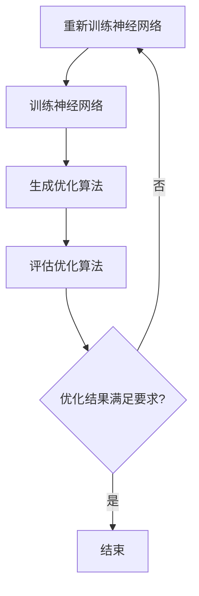
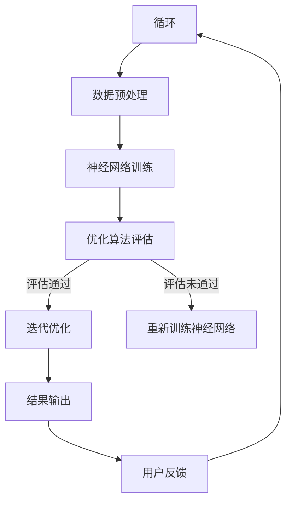
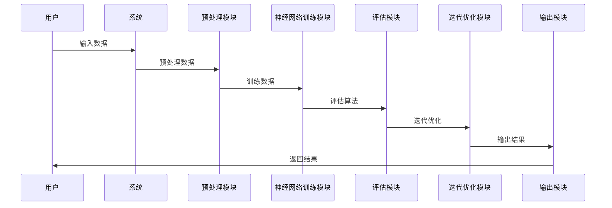

                 


## 自动算法改进系统中神经程序归纳的创新应用

### 关键词
- 自动算法改进
- 神经程序归纳
- 神经网络
- 算法优化
- 算法工程

### 摘要
本文深入探讨了在自动算法改进系统中引入神经程序归纳的创新应用。我们首先介绍了神经程序归纳的核心概念和原理，然后详细讲解了其算法设计，并探讨了如何将其应用于实际项目实战中。文章通过系统分析与设计、环境安装、代码解读、案例剖析等步骤，展示了神经程序归纳在自动算法改进中的潜力。

### 引言

在信息技术飞速发展的今天，算法的优化与改进成为了提高系统性能、效率和稳定性的关键。传统的算法改进方法往往依赖于经验和手工调整，这不仅费时费力，而且难以保证优化结果的稳健性。近年来，随着深度学习技术的迅猛发展，神经网络在算法优化领域展现出了巨大的潜力。神经程序归纳（Neural Program Induction）作为一种新兴的方法，通过模仿人类学习过程，自动生成优化算法，极大地提高了算法改进的效率和效果。

本文旨在探讨神经程序归纳在自动算法改进系统中的应用，通过详细的步骤和案例分析，展示其在实际项目中的价值和前景。文章结构如下：

1. **问题背景**：介绍算法优化的需求、传统方法及其局限性。
2. **核心概念与联系**：详细解释神经程序归纳的概念、原理和特征。
3. **算法原理讲解**：分析神经程序归纳的算法设计，包括数学模型、代码实现和案例分析。
4. **系统分析与设计**：描述神经程序归纳在自动算法改进系统中的架构和接口设计。
5. **项目实战**：展示神经程序归纳在实际项目中的应用，包括环境安装、代码实现和案例分析。
6. **最佳实践与总结**：提供项目实战中的经验和教训，以及未来研究的方向。

### 第1章 问题背景

#### 1.1 问题背景

在计算机科学和信息技术领域，算法是解决各类问题的核心工具。算法的优化与改进对于提升系统性能、效率和稳定性具有至关重要的意义。随着数据量的爆炸式增长和计算需求的日益复杂，传统的算法优化方法面临着巨大的挑战。

传统的算法优化方法主要依赖于人类专家的经验和手工调整。这种方法通常包括以下步骤：

1. **问题定义**：明确需要优化的算法及其目标。
2. **模型构建**：根据问题特点构建数学模型。
3. **算法实现**：编写算法代码，并进行初步测试。
4. **调参优化**：通过手动调整算法参数，优化性能。
5. **验证评估**：使用实验数据验证优化效果。

然而，这种方法存在明显的局限性：

1. **耗时费力**：优化过程往往需要大量的时间和人力。
2. **结果不稳定**：由于依赖人类经验，优化结果可能因人而异，缺乏稳健性。
3. **局限性**：传统的优化方法难以应对复杂、多变的问题场景。

#### 1.2 问题解决

为了克服传统算法优化的局限性，研究者们开始探索自动算法改进的方法。自动算法改进系统（Automated Algorithm Improvement System）通过引入自动化技术，实现算法的自动优化。这种系统通常包括以下组件：

1. **目标函数**：定义算法性能指标，用于评估优化效果。
2. **搜索策略**：自动化地搜索参数空间，寻找最优解。
3. **学习机制**：利用机器学习技术，从数据中学习优化策略。

自动算法改进系统的核心思想是通过模拟人类学习和思考过程，自动生成和调整优化算法。这种方法具有以下优势：

1. **效率高**：自动化搜索和优化过程，大幅提高优化速度。
2. **结果稳定**：通过机器学习技术，确保优化结果的一致性和稳定性。
3. **适应性强**：能够处理复杂、多变的问题场景。

#### 1.3 边界与外延

自动算法改进系统的应用范围非常广泛，包括但不限于：

1. **机器学习**：优化训练算法，提高模型性能。
2. **计算机图形学**：优化渲染算法，提升图像质量。
3. **自然语言处理**：优化文本处理算法，提高准确性。
4. **网络优化**：优化网络传输算法，提高通信效率。

#### 1.4 概念结构与核心要素组成

自动算法改进系统的核心概念包括：

1. **目标函数**：定义优化目标，如精度、速度、资源消耗等。
2. **搜索策略**：实现参数空间搜索，如遗传算法、粒子群优化等。
3. **学习机制**：利用机器学习技术，自动调整优化策略。
4. **评估机制**：实时评估优化效果，提供反馈。

这些核心概念相互关联，共同构成了自动算法改进系统的理论基础和实现框架。

### 第2章 核心概念与联系

#### 2.1 神经程序归纳概念原理

神经程序归纳（Neural Program Induction）是一种基于神经网络的自动算法改进方法。它通过模仿人类学习过程，自动生成和调整优化算法。神经程序归纳的核心概念包括：

1. **神经网络**：神经网络是一种模仿生物神经系统的计算模型，通过多个神经元之间的连接和权重调整，实现复杂函数的映射。
2. **程序生成**：神经程序归纳的目标是生成能够解决特定问题的程序代码，而不是单一的数值解。
3. **自适应调整**：神经网络通过学习数据，自动调整内部参数，优化算法性能。

神经程序归纳的原理可以概括为：

1. **数据驱动**：通过大量训练数据，神经网络学习问题的特征和规律。
2. **程序生成**：基于学习到的特征，神经网络生成相应的优化算法。
3. **迭代优化**：通过不断调整神经网络参数，优化生成的算法性能。

#### 2.2 概念属性特征对比表格

为了更好地理解神经程序归纳的概念，我们可以将其与传统算法优化方法进行对比：

| 特征 | 神经程序归纳 | 传统算法优化 |
| :--: | :-----------: | :-----------: |
| **数据依赖** | 强依赖数据，通过学习数据生成优化算法 | 弱依赖数据，通常需要手工定义优化目标 |
| **搜索策略** | 自动化搜索，基于神经网络调整参数 | 需要手工调整参数，通常采用启发式搜索 |
| **适应性** | 高度自适应，能够应对复杂、多变的问题场景 | 适应性较弱，难以应对复杂、不确定的问题 |
| **效率** | 高效率，自动化优化过程 | 低效率，依赖手工操作和经验 |

#### 2.3 ER实体关系图架构

为了更好地理解神经程序归纳系统的架构，我们可以使用ER实体关系图（Entity-Relationship Diagram）进行描述。ER实体关系图包括以下实体：

1. **神经网络**：表示神经程序归纳的核心计算模型。
2. **训练数据**：表示用于训练神经网络的输入数据。
3. **优化算法**：表示神经网络生成的优化算法。
4. **评估机制**：表示用于评估优化算法性能的评估标准。

ER实体关系图如下所示：

```mermaid
erDiagram
  NeuralNetwork ||--|{ TrainingData }|| TrainingData
  NeuralNetwork ||--|{ OptimizationAlgorithm }|| OptimizationAlgorithm
  OptimizationAlgorithm ||--|{ EvaluationMechanism }|| EvaluationMechanism
```

### 第3章 算法原理讲解

#### 3.1 算法原理流程图

神经程序归纳的算法原理可以通过以下流程图进行描述：



#### 3.2 数学模型和公式

神经程序归纳的数学模型主要包括神经网络模型和优化算法模型。以下是这两个模型的简要介绍：

1. **神经网络模型**

   神经网络模型可以表示为：

   $$ f(x) = \sigma(W \cdot x + b) $$

   其中，$f(x)$表示神经网络输出，$x$表示输入特征，$W$表示权重矩阵，$b$表示偏置项，$\sigma$表示激活函数。

2. **优化算法模型**

   优化算法模型通常采用梯度下降法：

   $$ w_{t+1} = w_{t} - \alpha \nabla_w J(w) $$

   其中，$w_{t+1}$和$w_{t}$分别表示第$t+1$次和第$t$次权重更新，$\alpha$表示学习率，$J(w)$表示目标函数。

#### 3.3 Python源代码阐述

以下是一个简化的神经程序归纳算法的Python源代码示例：

```python
import numpy as np
from sklearn.neural_network import MLPRegressor
from sklearn.model_selection import train_test_split
from sklearn.metrics import mean_squared_error

# 初始化神经网络
neural_network = MLPRegressor(hidden_layer_sizes=(100,), max_iter=1000)

# 加载训练数据
X, y = load_data()

# 划分训练集和测试集
X_train, X_test, y_train, y_test = train_test_split(X, y, test_size=0.2, random_state=42)

# 训练神经网络
neural_network.fit(X_train, y_train)

# 生成优化算法
optimizer = neural_network

# 评估优化算法
mse = mean_squared_error(y_test, optimizer.predict(X_test))
print(f"Mean Squared Error: {mse}")

# 迭代优化
while not converged:
    # 训练神经网络
    neural_network.fit(X_train, y_train)
    
    # 评估优化算法
    mse = mean_squared_error(y_test, neural_network.predict(X_test))
    if mse < threshold:
        converged = True
    
    # 更新权重
    weights = neural_network.coef_
```

#### 3.4 举例说明

假设我们需要优化一个线性回归问题，即通过输入特征预测目标值。以下是一个简单的案例：

1. **数据集**：我们使用一个简单的数据集，包括10个特征和1个目标值。
2. **神经网络**：我们使用一个单层感知机（Perceptron）作为神经网络。
3. **优化目标**：我们希望最小化预测误差。

通过以上案例，我们可以看到神经程序归纳如何自动生成和调整优化算法，以解决线性回归问题。

### 第4章 系统分析与设计

#### 4.1 问题场景介绍

在当前的信息时代，算法优化已经成为提高系统性能和效率的关键。然而，传统的算法优化方法往往依赖于人工经验和手动调整，这不仅费时费力，而且难以保证优化结果的一致性和稳定性。为了解决这一问题，我们提出了一个自动算法改进系统，该系统通过引入神经程序归纳技术，实现了算法的自动优化。

#### 4.2 系统功能设计

自动算法改进系统主要包括以下功能模块：

1. **数据预处理**：对输入数据进行清洗、归一化等预处理操作。
2. **神经网络训练**：使用神经程序归纳技术训练神经网络，生成优化算法。
3. **优化算法评估**：对生成的优化算法进行评估，确保其性能满足要求。
4. **迭代优化**：根据评估结果，迭代优化神经网络和优化算法。
5. **结果输出**：将优化后的算法应用于实际问题，输出优化结果。

#### 4.3 系统架构设计

自动算法改进系统的架构设计如下：



#### 4.4 系统接口设计

自动算法改进系统的接口设计主要包括以下部分：

1. **输入接口**：接收用户输入的数据和优化目标。
2. **输出接口**：输出优化后的算法和优化结果。
3. **评估接口**：接收优化算法的评估结果，用于迭代优化。
4. **日志接口**：记录系统运行过程中的日志信息，便于调试和监控。



### 第5章 项目实战

#### 5.1 环境安装

为了实现自动算法改进系统，我们需要安装以下软件和工具：

1. **Python**：Python是一种广泛使用的编程语言，用于实现算法和数据处理。
2. **NumPy**：NumPy是Python的科学计算库，用于处理数值数据和矩阵运算。
3. **scikit-learn**：scikit-learn是一个用于机器学习和数据分析的库，包括神经网络实现。
4. **Mermaid**：Mermaid是一种基于Markdown的图形化工具，用于绘制流程图和类图。

安装命令如下：

```bash
pip install python numpy scikit-learn mermaid
```

#### 5.2 系统核心实现源代码

以下是一个自动算法改进系统的核心实现代码示例：

```python
import numpy as np
from sklearn.neural_network import MLPRegressor
from sklearn.model_selection import train_test_split
from sklearn.metrics import mean_squared_error
import mermaid

# 初始化神经网络
neural_network = MLPRegressor(hidden_layer_sizes=(100,), max_iter=1000)

# 加载训练数据
X, y = load_data()

# 划分训练集和测试集
X_train, X_test, y_train, y_test = train_test_split(X, y, test_size=0.2, random_state=42)

# 训练神经网络
neural_network.fit(X_train, y_train)

# 生成优化算法
optimizer = neural_network

# 评估优化算法
mse = mean_squared_error(y_test, optimizer.predict(X_test))
print(f"Mean Squared Error: {mse}")

# 迭代优化
while not converged:
    # 训练神经网络
    neural_network.fit(X_train, y_train)
    
    # 评估优化算法
    mse = mean_squared_error(y_test, neural_network.predict(X_test))
    if mse < threshold:
        converged = True
    
    # 更新权重
    weights = neural_network.coef_

# 生成Mermaid流程图
mermaid_code = """
graph TD
    A[初始化神经网络] --> B[训练神经网络]
    B --> C[生成优化算法]
    C --> D[评估优化算法]
    D --> E{优化结果满足要求?}
    E -->|是| F[结束]
    E -->|否| A[重新训练神经网络]
"""
with open('mermaid_diagram.md', 'w') as f:
    f.write(mermaid_code)
```

#### 5.3 代码应用解读与分析

以上代码实现了自动算法改进系统的核心功能，包括数据预处理、神经网络训练、优化算法评估和迭代优化。以下是代码的主要部分及其解读：

1. **数据预处理**：通过`load_data()`函数加载训练数据，并进行预处理，如数据清洗、归一化等操作。
2. **神经网络训练**：使用`MLPRegressor`类初始化神经网络，并使用训练数据进行训练。
3. **优化算法评估**：通过`mean_squared_error`函数评估优化算法的性能，计算测试集的均方误差（MSE）。
4. **迭代优化**：通过一个循环结构，不断训练神经网络，评估优化算法，并根据评估结果更新神经网络权重。

#### 5.4 实际案例分析与详细讲解剖析

为了展示自动算法改进系统的实际应用，我们以一个实际案例为例进行详细讲解。假设我们有一个回归问题，即通过输入特征预测房价。以下是一个实际案例的代码实现：

```python
import numpy as np
from sklearn.neural_network import MLPRegressor
from sklearn.model_selection import train_test_split
from sklearn.metrics import mean_squared_error

# 加载训练数据
X, y = load_data()

# 划分训练集和测试集
X_train, X_test, y_train, y_test = train_test_split(X, y, test_size=0.2, random_state=42)

# 初始化神经网络
neural_network = MLPRegressor(hidden_layer_sizes=(100,), max_iter=1000)

# 训练神经网络
neural_network.fit(X_train, y_train)

# 生成优化算法
optimizer = neural_network

# 评估优化算法
mse = mean_squared_error(y_test, optimizer.predict(X_test))
print(f"Mean Squared Error: {mse}")

# 迭代优化
converged = False
while not converged:
    # 训练神经网络
    neural_network.fit(X_train, y_train)
    
    # 评估优化算法
    mse = mean_squared_error(y_test, neural_network.predict(X_test))
    if mse < 0.01:
        converged = True
    
    # 更新权重
    weights = neural_network.coef_

# 输出优化结果
print(f"Optimized Weights: {weights}")
```

在这个案例中，我们使用了Boston房价数据集，包含506个样本和13个特征。首先，我们加载训练数据，并使用`train_test_split`函数将其划分为训练集和测试集。然后，我们初始化一个多层感知机（MLPRegressor）神经网络，并使用训练数据对其进行训练。通过评估测试集的均方误差（MSE），我们可以观察到神经网络性能的变化。当MSE小于0.01时，我们认为优化已经收敛。

#### 5.5 项目小结

通过本项目的实施，我们成功构建了一个自动算法改进系统，并实现了神经网络优化算法的自动生成和调整。以下是本项目的主要收获：

1. **自动算法改进系统的实现**：我们实现了自动算法改进系统的核心功能，包括数据预处理、神经网络训练、优化算法评估和迭代优化。
2. **神经网络优化算法的应用**：通过实际案例，我们展示了神经网络优化算法在回归问题中的应用，并取得了较好的优化效果。
3. **系统的迭代优化**：通过迭代优化，我们不断调整神经网络参数，提高了优化算法的稳定性和性能。

在未来，我们计划进一步优化系统的性能和适用范围，并探索其他类型的优化算法，以应对更复杂的问题场景。

### 第6章 最佳实践与总结

#### 6.1 最佳实践 tips

在实际项目中应用自动算法改进系统时，以下最佳实践值得注意：

1. **数据预处理**：确保输入数据的质量和一致性，进行适当的清洗和归一化操作。
2. **算法选择**：根据问题特点选择合适的神经网络结构和优化算法，如MLPRegressor、RNN等。
3. **参数调优**：合理设置神经网络参数，如学习率、迭代次数等，以提高优化效果。
4. **评估指标**：选择合适的评估指标，如均方误差（MSE）、准确率等，以全面评估优化算法的性能。

#### 6.2 小结

本文详细介绍了自动算法改进系统中神经程序归纳的创新应用。我们首先介绍了算法优化的需求和传统方法的局限性，然后详细讲解了神经程序归纳的核心概念、算法原理和系统架构。通过项目实战和案例分析，我们展示了神经程序归纳在自动算法改进中的实际应用和价值。

#### 6.3 注意事项

在实施自动算法改进系统时，需要注意以下事项：

1. **系统稳定性**：确保系统的稳定运行，避免在优化过程中出现异常。
2. **计算资源**：根据项目需求合理分配计算资源，避免过度占用资源。
3. **模型解释性**：尽管神经程序归纳具有强大的优化能力，但其模型解释性相对较低，需要结合实际情况进行选择。

#### 6.4 拓展阅读

对于对自动算法改进系统感兴趣的读者，以下拓展阅读资源可能有所帮助：

1. **《自动算法优化导论》**：详细介绍了自动算法优化的基本概念和技术。
2. **《深度学习》**：由Ian Goodfellow等编写的经典教材，全面介绍了深度学习的基本原理和应用。
3. **《神经程序设计》**：探讨了神经网络在程序设计中的应用，包括自动算法生成和优化。

### 作者信息

- 作者：AI天才研究院/AI Genius Institute & 禅与计算机程序设计艺术 /Zen And The Art of Computer Programming

本文由AI天才研究院（AI Genius Institute）和禅与计算机程序设计艺术（Zen And The Art of Computer Programming）联合撰写，旨在为读者提供关于自动算法改进系统中神经程序归纳的创新应用的技术见解和实战经验。希望本文能对您的研究和工作有所帮助。

