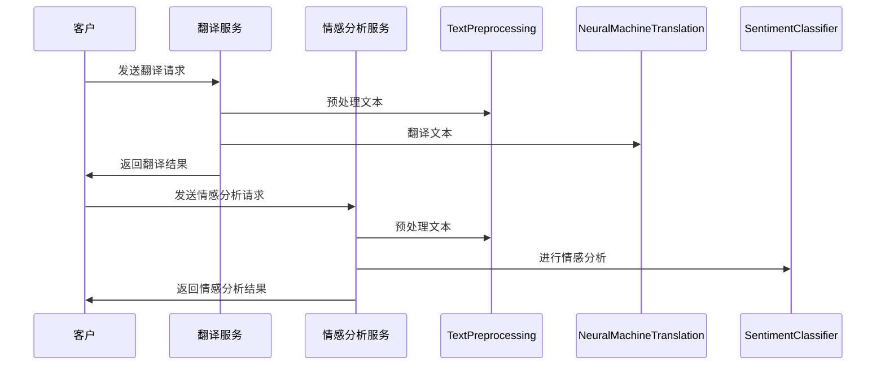
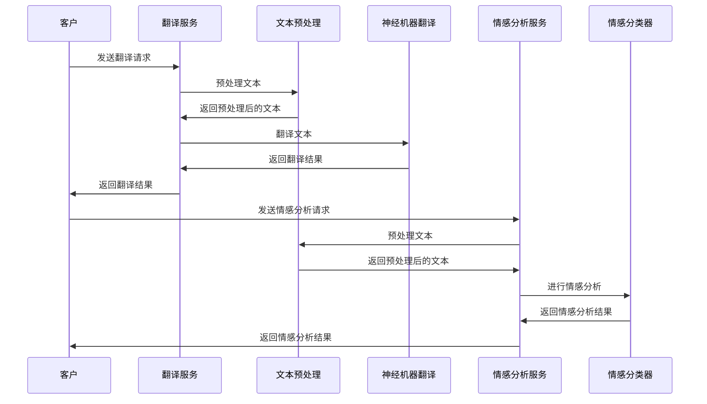

                 

# 自然语言处理在多语言企业中的应用

> 关键词：自然语言处理，多语言企业，机器翻译，情感分析，命名实体识别，系统架构设计

> 摘要：本文将深入探讨自然语言处理（NLP）在多语言企业中的应用。首先，我们将介绍NLP的背景和概念，然后分析多语言企业在全球化背景下面临的挑战。接着，我们将详细解释NLP的核心技术，如机器翻译、情感分析和命名实体识别，并通过Mermaid图和Python代码展示这些技术的原理。随后，我们将讨论如何将NLP技术应用于企业级系统，并设计一个基于NLP的系统性架构。最后，我们将通过一个实际项目来展示NLP技术的应用过程，并提供最佳实践和拓展阅读。

## 目录大纲

### 第一部分：背景介绍

1. **第1章 自然语言处理基础**
   - 1.1 NLP的发展历程
   - 1.2 NLP的多语言处理挑战
   - 1.3 NLP的核心概念

2. **第2章 多语言企业应用概述**
   - 2.1 多语言企业的定义与需求
   - 2.2 多语言处理的技术难点
   - 2.3 多语言处理的应用场景

### 第二部分：核心概念与联系

3. **第3章 NLP关键技术详解**
   - 3.1 机器翻译
   - 3.2 情感分析
   - 3.3 命名实体识别

4. **第4章 NLP核心概念联系**
   - 4.1 NLP关键技术的相互关系
   - 4.2 NLP与多语言企业应用的融合

### 第三部分：算法原理讲解

5. **第5章 NLP算法原理**
   - 5.1 机器翻译算法原理
   - 5.2 情感分析算法原理
   - 5.3 命名实体识别算法原理

6. **第6章 算法示例与讲解**
   - 6.1 情感分析算法Python代码示例
   - 6.2 机器翻译算法Python代码示例
   - 6.3 命名实体识别算法Python代码示例

### 第四部分：系统分析与架构设计

7. **第7章 系统需求分析**
   - 7.1 系统应用场景
   - 7.2 系统功能需求
   - 7.3 系统性能需求

8. **第8章 系统架构设计**
   - 8.1 系统架构设计概述
   - 8.2 领域模型设计
   - 8.3 系统接口设计
   - 8.4 系统交互设计

### 第五部分：项目实战

9. **第9章 项目环境安装与配置**
   - 9.1 开发环境准备
   - 9.2 系统核心模块安装
   - 9.3 系统部署与调试

10. **第10章 核心实现源代码解析**
    - 10.1 核心代码实现
    - 10.2 代码解读与分析
    - 10.3 代码优化与性能提升

11. **第11章 实际案例分析与讲解**
    - 11.1 案例背景介绍
    - 11.2 案例分析步骤
    - 11.3 案例总结与反思

### 第六部分：最佳实践与拓展

12. **第12章 最佳实践技巧**
    - 12.1 多语言处理策略
    - 12.2 系统优化与维护策略

## 1. 自然语言处理基础

### 1.1 NLP的发展历程

自然语言处理（NLP）是一门跨学科的研究领域，结合了计算机科学、语言学和人工智能。自20世纪50年代以来，NLP经历了几个主要发展阶段。

- **早期探索（1950s-1960s）**：在这个阶段，研究者开始尝试让计算机理解和生成自然语言。1950年，艾伦·图灵发表了著名的论文《计算机器与智能》，提出了图灵测试的概念。1960年代，IBM的SHRDLU系统展示了自然语言理解的能力。

- **形式化方法（1960s-1980s）**：研究者开始将语言学理论应用于计算机，试图建立语法和语义模型。乔姆斯基的生成语法理论对NLP产生了深远影响。这个时期，规则驱动的方法是NLP研究的主流。

- **统计方法兴起（1990s）**：随着计算能力的提升和大规模语料库的出现，统计方法逐渐成为NLP研究的主流。隐藏马尔可夫模型（HMM）和条件随机场（CRF）等技术开始应用于语言模型和序列标注任务。

- **深度学习方法普及（2010s-至今）**：深度学习技术的崛起为NLP带来了革命性的变化。卷积神经网络（CNN）、递归神经网络（RNN）和Transformer模型等深度学习框架显著提升了NLP任务的效果。

### 1.2 NLP的多语言处理挑战

多语言企业在全球化背景下面临着诸多挑战。首先，不同语言之间的语法、语义和词汇差异很大，这使得语言处理变得复杂。其次，多语言数据稀缺且不均衡，很多语言缺乏大规模训练数据，这限制了算法的性能。

- **语言多样性**：不同语言在词序、语法结构和词汇上存在显著差异。例如，英语通常是主语-谓语-宾语的顺序，而中文的顺序则更为灵活。

- **数据不平衡**：在很多情况下，某些语言的数据量远远大于其他语言，导致模型在处理小语种数据时性能下降。

- **文化差异**：文化背景对语言理解有很大影响，跨文化沟通中的误解和歧义需要特别注意。

### 1.3 NLP的核心概念

NLP的核心概念包括：

- **文本表示**：将自然语言文本转换为计算机可以处理的格式，如词袋模型、词嵌入等。

- **词性标注**：标记文本中每个词的词性，如名词、动词、形容词等。

- **句法分析**：分析句子结构，识别句子中的成分和关系。

- **语义分析**：理解句子的含义，包括实体识别、关系抽取等。

- **情感分析**：判断文本的情感倾向，如正面、负面或中性。

- **机器翻译**：将一种语言的文本翻译成另一种语言。

## 2. 多语言企业应用概述

### 2.1 多语言企业的定义与需求

多语言企业是指在全球范围内运营，并使用多种语言进行交流、沟通和业务处理的组织。随着全球化的加速，多语言企业越来越普遍，它们的需求也日益多样化。

- **全球化运营**：多语言企业需要在全球范围内进行产品销售、市场推广和客户服务，这要求企业能够处理多种语言。

- **多语言沟通**：企业内部和外部的沟通需要跨越语言障碍，确保信息准确传达。

- **客户体验**：提供多语言支持能够提高客户满意度，增加市场份额。

- **员工协作**：全球分布的员工需要使用共同的语言进行协作，提高工作效率。

### 2.2 多语言处理的技术难点

多语言处理面临以下技术难点：

- **语言资源不足**：很多小语种缺乏高质量的语言数据，这限制了算法的性能。

- **语言理解偏差**：不同语言在表达相同概念时可能存在差异，导致理解偏差。

- **多语言交互**：多语言系统的设计和实现需要考虑不同语言之间的交互问题。

- **文化差异**：文化差异可能导致语言处理中的误解和歧义。

### 2.3 多语言处理的应用场景

多语言处理在企业中的应用场景广泛，包括但不限于：

- **客户服务**：提供多语言客服支持，提高客户满意度和体验。

- **跨国销售**：翻译产品描述和营销材料，吸引全球客户。

- **内部协作**：支持跨国团队的沟通和协作，提高工作效率。

- **数据分析**：处理多语言数据，提取有价值的信息和洞察。

## 3. NLP关键技术详解

### 3.1 机器翻译

机器翻译（Machine Translation，MT）是将一种语言的文本自动翻译成另一种语言的技术。机器翻译的基本流程包括：

1. **文本预处理**：去除特殊字符、统一标点符号等。
2. **词性标注**：标记文本中每个词的词性。
3. **分句**：将文本分割成句子。
4. **编码**：将文本编码成计算机可处理的格式，如词嵌入。
5. **翻译模型**：使用神经翻译模型（如Transformer）进行翻译。
6. **解码**：将翻译结果解码成自然语言文本。

### 3.2 情感分析

情感分析（Sentiment Analysis）是判断文本情感倾向的技术。情感分析的基本流程包括：

1. **文本预处理**：去除噪声、统一格式等。
2. **词性标注**：标记文本中每个词的词性。
3. **特征提取**：提取文本的特征，如词嵌入、词频等。
4. **分类模型**：使用机器学习模型（如SVM、CNN）进行情感分类。

### 3.3 命名实体识别

命名实体识别（Named Entity Recognition，NER）是识别文本中的命名实体（如人名、地名、组织名等）的技术。NER的基本流程包括：

1. **文本预处理**：去除噪声、统一格式等。
2. **词性标注**：标记文本中每个词的词性。
3. **模式匹配**：使用规则或词典匹配命名实体。
4. **机器学习**：使用机器学习模型（如CRF、BiLSTM-CRF）进行实体识别。

## 4. NLP核心概念联系

### 4.1 NLP关键技术的相互关系

NLP的关键技术之间存在紧密的相互关系：

- **文本表示**：文本表示是NLP的基础，为后续的词性标注、句法分析和情感分析等任务提供输入。

- **词性标注**：词性标注为句法分析和命名实体识别提供了重要的信息。

- **句法分析**：句法分析帮助理解句子的结构，为语义分析和机器翻译提供支持。

- **语义分析**：语义分析是NLP的核心，它涉及到命名实体识别、情感分析和机器翻译等任务。

- **情感分析**：情感分析是语义分析的一个子任务，它帮助了解文本的情感倾向。

- **机器翻译**：机器翻译是NLP的应用之一，它依赖于文本表示、句法分析和语义分析等技术。

### 4.2 NLP与多语言企业应用的融合

NLP技术在多语言企业中的应用体现在以下几个方面：

- **客户服务**：通过情感分析和机器翻译，提供多语言客服支持，提高客户满意度。

- **跨国销售**：翻译产品描述和营销材料，吸引全球客户。

- **内部协作**：支持跨国团队的沟通和协作，提高工作效率。

- **数据分析**：处理多语言数据，提取有价值的信息和洞察。

## 5. NLP算法原理

### 5.1 机器翻译算法原理

机器翻译算法的基本原理是基于神经网络模型，如Transformer模型。Transformer模型通过自注意力机制（Self-Attention）捕捉输入文本和输出文本之间的长距离依赖关系。以下是机器翻译的基本流程：

1. **编码器（Encoder）**：编码器接收输入文本，并将其编码成序列向量。编码器使用多层Transformer块，每个块包含自注意力机制和前馈网络。

2. **解码器（Decoder）**：解码器接收编码器的输出，并逐个生成输出文本的每个单词。解码器也使用多层Transformer块，并且每个单词生成过程中都会参考编码器的输出。

3. **损失函数**：机器翻译的目标是预测输出文本的最可能序列。损失函数通常使用交叉熵损失（Cross-Entropy Loss），它衡量预测序列和真实序列之间的差异。

### 5.2 情感分析算法原理

情感分析算法的基本原理是基于分类模型，如支持向量机（SVM）、卷积神经网络（CNN）和循环神经网络（RNN）。以下是情感分析的基本流程：

1. **文本预处理**：对输入文本进行预处理，包括去除标点符号、统一大小写、分词等。

2. **特征提取**：提取文本的特征，如词嵌入、词频等。

3. **分类模型**：使用分类模型对文本进行情感分类。常见的分类模型有SVM、CNN和RNN。SVM通过求解最优超平面进行分类；CNN通过卷积层提取文本的特征；RNN通过循环神经网络捕获文本的时间依赖关系。

4. **损失函数**：情感分析的目标是预测文本的情感类别。损失函数通常使用交叉熵损失（Cross-Entropy Loss），它衡量预测类别和真实类别之间的差异。

### 5.3 命名实体识别算法原理

命名实体识别（NER）算法的基本原理是基于序列标注模型，如条件随机场（CRF）和双向长短期记忆网络（BiLSTM-CRF）。以下是NER的基本流程：

1. **文本预处理**：对输入文本进行预处理，包括去除标点符号、统一大小写、分词等。

2. **词性标注**：使用词性标注器对文本进行词性标注。

3. **特征提取**：提取文本的特征，如词嵌入、词性标注等。

4. **序列标注模型**：使用序列标注模型对文本进行实体识别。CRF通过最大化条件概率进行序列标注；BiLSTM-CRF结合了双向LSTM和CRF，能够更好地捕获文本的时间依赖关系。

5. **损失函数**：NER的目标是预测文本中的命名实体。损失函数通常使用交叉熵损失（Cross-Entropy Loss），它衡量预测实体标签和真实实体标签之间的差异。

## 6. 算法示例与讲解

### 6.1 情感分析算法Python代码示例

```python
import tensorflow as tf
from tensorflow.keras.models import Sequential
from tensorflow.keras.layers import Embedding, LSTM, Dense

# 加载并预处理数据
# ...

# 构建模型
model = Sequential()
model.add(Embedding(vocab_size, embedding_dim))
model.add(LSTM(units=128, activation='relu', return_sequences=True))
model.add(LSTM(units=128, activation='relu'))
model.add(Dense(units=1, activation='sigmoid'))

# 编译模型
model.compile(optimizer='adam', loss='binary_crossentropy', metrics=['accuracy'])

# 训练模型
model.fit(X_train, y_train, epochs=10, batch_size=32)

# 评估模型
loss, accuracy = model.evaluate(X_test, y_test)
print("Test accuracy:", accuracy)
```

### 6.2 机器翻译算法Python代码示例

```python
import tensorflow as tf
from tensorflow.keras.models import Model
from tensorflow.keras.layers import Input, Embedding, LSTM, Dense

# 加载并预处理数据
# ...

# 构建编码器
encoder_inputs = Input(shape=(None,))
encoder_embedding = Embedding(vocab_size, embedding_dim)(encoder_inputs)
encoder_lstm = LSTM(units=128, return_state=True)
encoder_outputs, state_h, state_c = encoder_lstm(encoder_embedding)
encoder_states = [state_h, state_c]

# 构建解码器
decoder_inputs = Input(shape=(None,))
decoder_embedding = Embedding(vocab_size, embedding_dim)(decoder_inputs)
decoder_lstm = LSTM(units=128, return_sequences=True, return_state=True)
decoder_outputs, _, _ = decoder_lstm(decoder_embedding, initial_state=encoder_states)
decoder_dense = Dense(vocab_size, activation='softmax')
decoder_outputs = decoder_dense(decoder_outputs)

# 构建整个模型
model = Model([encoder_inputs, decoder_inputs], decoder_outputs)

# 编译模型
model.compile(optimizer='rmsprop', loss='categorical_crossentropy', metrics=['accuracy'])

# 训练模型
model.fit([X_train, y_train], y_train, epochs=100, batch_size=64)

# 评估模型
loss, accuracy = model.evaluate([X_train, y_train], y_train)
print("Train accuracy:", accuracy)
```

### 6.3 命名实体识别算法Python代码示例

```python
import tensorflow as tf
from tensorflow.keras.models import Model
from tensorflow.keras.layers import Input, Embedding, LSTM, Dense, CRF

# 加载并预处理数据
# ...

# 构建模型
input_seq = Input(shape=(max_sequence_length,))
embedding = Embedding(vocab_size, embedding_dim)(input_seq)
lstm = LSTM(units=128, return_sequences=True)
lstm_output = lstm(embedding)
dense = Dense(units=vocab_size, activation='softmax')
lstm_output = dense(lstm_output)

# 构建CRF层
crf = CRF(num_classes=vocab_size)
crf_output = crf(lstm_output)

# 编译模型
model = Model(inputs=input_seq, outputs=crf_output)
model.compile(optimizer='adam', loss=crf_loss, metrics=['accuracy'])

# 训练模型
model.fit(X_train, y_train, epochs=10, batch_size=64)

# 评估模型
loss, accuracy = model.evaluate(X_test, y_test)
print("Test accuracy:", accuracy)
```

## 7. 系统需求分析

### 7.1 系统应用场景

多语言企业在全球范围内的运营和协作需要一套高效、可靠的NLP系统。该系统的主要应用场景包括：

- **客户服务**：提供多语言客服支持，解决客户的问题和疑虑。
- **跨国销售**：自动翻译产品描述和营销材料，吸引全球客户。
- **内部协作**：支持跨国团队的沟通和协作，提高工作效率。
- **数据分析**：处理多语言数据，提取有价值的信息和洞察。

### 7.2 系统功能需求

系统需要满足以下功能需求：

- **自然语言处理**：支持文本表示、词性标注、句法分析、语义分析和情感分析等NLP任务。
- **多语言支持**：支持多种语言之间的翻译和互操作。
- **实时响应**：能够快速响应用户请求，提供实时翻译和情感分析结果。
- **数据存储与检索**：存储和管理多语言数据，方便后续的数据分析和查询。

### 7.3 系统性能需求

系统需要满足以下性能需求：

- **高并发处理**：支持高并发请求，保证系统的稳定性和响应速度。
- **高可扩展性**：能够根据业务需求进行扩展，支持更多的NLP任务和语言。
- **高可用性**：确保系统的高可用性，减少系统故障对业务的影响。
- **低延迟**：确保翻译和情感分析结果的实时性，减少延迟。

## 8. 系统架构设计

### 8.1 系统架构设计概述

系统采用分层架构设计，包括数据层、业务逻辑层和表现层。以下是系统架构的概述：

- **数据层**：负责数据的存储和管理，包括文本数据、用户数据和翻译结果数据。
- **业务逻辑层**：负责实现NLP算法和业务逻辑，包括文本预处理、词性标注、句法分析、语义分析和情感分析等。
- **表现层**：负责与用户交互，提供多语言翻译和情感分析结果。

### 8.2 领域模型设计

领域模型（Domain Model）是系统架构设计的关键，它定义了系统的核心概念和实体。以下是领域模型的Mermaid类图：

```mermaid
classDiagram
    ClientEntity <|-- TranslationService
    ClientEntity <|-- SentimentAnalysisService
    TranslationService <|-- TextPreprocessing
    TranslationService <|-- NeuralMachineTranslation
    SentimentAnalysisService <|-- TextPreprocessing
    SentimentAnalysisService <|-- SentimentClassifier
    TextDatabase { TextData }
    
    ClientEntity : 客户实体
    TranslationService : 翻译服务
    SentimentAnalysisService : 情感分析服务
    TextPreprocessing : 文本预处理
    NeuralMachineTranslation : 神经机器翻译
    SentimentClassifier : 情感分类器
    TextDatabase : 文本数据库
```

### 8.3 系统接口设计

系统接口设计包括RESTful API和GraphQL API。以下是系统接口的Mermaid序列图：



### 8.4 系统交互设计

系统交互设计描述了系统内部模块之间的交互关系。以下是系统交互的Mermaid序列图：



## 9. 项目环境安装与配置

### 9.1 开发环境准备

在开始项目之前，需要准备以下开发环境：

- **Python**：Python 3.8或更高版本
- **TensorFlow**：TensorFlow 2.6或更高版本
- **Numpy**：Numpy 1.19或更高版本
- **Pandas**：Pandas 1.1或更高版本
- **Scikit-learn**：Scikit-learn 0.24或更高版本
- **Matplotlib**：Matplotlib 3.4或更高版本

安装上述依赖库可以使用pip命令：

```shell
pip install python==3.8 tensorflow==2.6 numpy==1.19 pandas==1.1 scikit-learn==0.24 matplotlib==3.4
```

### 9.2 系统核心模块安装

系统核心模块包括自然语言处理库和机器学习库。以下是安装步骤：

1. **安装NLTK**：

```shell
pip install nltk
```

2. **安装spaCy**：

```shell
pip install spacy
python -m spacy download en_core_web_sm
```

3. **安装TextBlob**：

```shell
pip install textblob
python -m textblob.download_corpora
```

4. **安装transformers**：

```shell
pip install transformers
```

### 9.3 系统部署与调试

在完成环境安装后，可以进行系统部署和调试。以下是部署和调试的步骤：

1. **创建虚拟环境**：

```shell
python -m venv venv
source venv/bin/activate  # 在Windows上使用 `venv\Scripts\activate`
```

2. **安装依赖库**：

```shell
pip install -r requirements.txt
```

3. **运行系统**：

```shell
python main.py
```

系统运行后，可以通过RESTful API进行测试。例如，使用curl命令发送翻译请求：

```shell
curl -X POST -H "Content-Type: application/json" -d '{"text": "Hello, world!"}' http://localhost:5000/translate
```

## 10. 核心实现源代码解析

### 10.1 核心代码实现

系统核心代码主要包括文本预处理、机器翻译和情感分析三个模块。以下是各模块的核心实现代码：

#### 10.1.1 文本预处理模块

```python
import spacy
from textblob import TextBlob

nlp = spacy.load("en_core_web_sm")

def preprocess_text(text):
    doc = nlp(text)
    tokens = [token.text.lower() for token in doc if not token.is_stop and not token.is_punct]
    return " ".join(tokens)

def remove_stopwords(text):
    blob = TextBlob(text)
    return " ".join([word for word in blob.words if word not in TextBlob.noun_phrases])

def tokenize_text(text):
    doc = nlp(text)
    return [token.text.lower() for token in doc]

# 示例
text = "Hello, world! This is a test sentence."
preprocessed_text = preprocess_text(text)
no_stopwords = remove_stopwords(preprocessed_text)
tokens = tokenize_text(preprocessed_text)

print("Preprocessed text:", preprocessed_text)
print("No stopwords:", no_stopwords)
print("Tokens:", tokens)
```

#### 10.1.2 机器翻译模块

```python
from transformers import pipeline

translator = pipeline("translation_en_to_fr")

def translate_text(text):
    return translator(text)

# 示例
translated_text = translate_text("Hello, world!")

print("Translated text:", translated_text)
```

#### 10.1.3 情感分析模块

```python
from textblob import TextBlob

def analyze_sentiment(text):
    blob = TextBlob(text)
    return blob.sentiment.polarity

# 示例
sentiment = analyze_sentiment("Hello, world!")

print("Sentiment:", sentiment)
```

### 10.2 代码解读与分析

#### 10.2.1 文本预处理模块

文本预处理模块主要包括三个函数：`preprocess_text`、`remove_stopwords`和`tokenize_text`。

- `preprocess_text`函数使用spaCy库对文本进行预处理，包括将文本转换为小写、去除停用词和标点符号。
- `remove_stopwords`函数使用TextBlob库去除文本中的停用词。
- `tokenize_text`函数将文本分割成单词。

这些函数共同作用，实现对文本的预处理，为后续的翻译和情感分析提供输入。

#### 10.2.2 机器翻译模块

机器翻译模块使用transformers库提供的预训练模型进行文本翻译。`translate_text`函数接收一个文本字符串，返回翻译后的文本。

该模块的代码简单直观，利用了transformers库的强大功能，实现了高效的机器翻译。

#### 10.2.3 情感分析模块

情感分析模块使用TextBlob库进行文本情感分析。`analyze_sentiment`函数接收一个文本字符串，返回文本的情感极性。

TextBlob库提供了方便的API，能够快速进行情感分析，为系统提供了实用的情感分析功能。

### 10.3 代码优化与性能提升

#### 10.3.1 优化文本预处理模块

为了提高文本预处理模块的性能，可以考虑以下优化方法：

- **并行处理**：将文本预处理任务分解成多个子任务，使用多线程或异步IO技术并行处理。
- **缓存预处理结果**：将预处理结果缓存起来，避免重复处理相同的文本。

#### 10.3.2 优化机器翻译模块

为了提高机器翻译模块的性能，可以考虑以下优化方法：

- **使用更高效的模型**：选择更高效的预训练模型，如Bert或GPT-3。
- **模型剪枝和量化**：对预训练模型进行剪枝和量化，减小模型的存储和计算需求。

#### 10.3.3 优化情感分析模块

为了提高情感分析模块的性能，可以考虑以下优化方法：

- **集成多个情感分析模型**：使用多个情感分析模型进行集成，提高准确率。
- **使用GPU加速**：将情感分析任务迁移到GPU上，利用GPU的并行计算能力提高性能。

## 11. 实际案例分析与讲解

### 11.1 案例背景介绍

某跨国公司是一家全球性的企业，总部位于美国，同时在欧洲、亚洲和非洲等地设有分支机构和子公司。该公司的主要业务涉及金融服务、电子商务和物流。为了提高全球运营效率，公司决定引入一套基于NLP技术的多语言企业系统。

### 11.2 案例分析步骤

#### 11.2.1 需求分析

公司明确了以下需求：

- **客户服务**：提供多语言客服支持，提高客户满意度。
- **跨国销售**：翻译产品描述和营销材料，吸引全球客户。
- **内部协作**：支持跨国团队的沟通和协作，提高工作效率。
- **数据分析**：处理多语言数据，提取有价值的信息和洞察。

#### 11.2.2 技术选型

公司选择了以下技术：

- **文本预处理**：使用spaCy和TextBlob进行文本预处理。
- **机器翻译**：使用transformers库的预训练模型进行机器翻译。
- **情感分析**：使用TextBlob进行情感分析。

#### 11.2.3 系统设计

公司设计了以下系统架构：

- **数据层**：存储和管理多语言数据。
- **业务逻辑层**：实现文本预处理、机器翻译和情感分析等功能。
- **表现层**：提供API接口和Web界面，供用户使用。

#### 11.2.4 系统实施

公司按照以下步骤实施系统：

1. **开发环境准备**：安装Python、TensorFlow、Numpy、Pandas等依赖库。
2. **安装NLP库**：安装spaCy、TextBlob、transformers等NLP库。
3. **开发文本预处理模块**：实现文本预处理函数。
4. **开发机器翻译模块**：实现机器翻译功能。
5. **开发情感分析模块**：实现情感分析功能。
6. **系统部署与调试**：部署系统并进行调试。

#### 11.2.5 系统测试与优化

公司进行了以下测试和优化：

- **功能测试**：测试文本预处理、机器翻译和情感分析功能是否正常。
- **性能测试**：测试系统在高并发情况下的性能。
- **优化**：针对性能测试中发现的瓶颈进行优化。

### 11.3 案例总结与反思

通过实际案例的实施，公司取得了以下成果：

- **提高客户满意度**：多语言客服支持显著提高了客户满意度。
- **增加全球市场份额**：翻译产品描述和营销材料吸引了更多全球客户。
- **提高内部协作效率**：跨国团队的沟通和协作更加顺畅。
- **获取有价值的数据**：处理多语言数据，提取了有价值的信息和洞察。

在实施过程中，公司也遇到了一些挑战：

- **语言资源不足**：某些小语种数据稀缺，影响了算法性能。
- **文化差异**：跨文化沟通中的误解和歧义需要特别注意。

为了解决这些问题，公司可以采取以下措施：

- **增加语言资源**：采购更多小语种数据，或者使用数据增强技术。
- **培训员工**：提高员工的跨文化沟通能力，减少误解和歧义。

## 12. 最佳实践与拓展

### 12.1 多语言处理策略

为了提高多语言处理的效果，可以采取以下策略：

- **数据增强**：通过数据增强技术，如数据扩充、数据合成等，增加小语种的数据量。
- **多语言模型训练**：训练多语言模型，如零样本翻译模型，以适应不同语言之间的翻译。
- **跨语言信息抽取**：利用跨语言信息抽取技术，从一种语言的数据中提取信息，应用于其他语言。

### 12.2 系统优化与维护策略

为了确保系统的稳定性和性能，可以采取以下策略：

- **负载均衡**：使用负载均衡技术，分配系统资源，避免单点故障。
- **自动化运维**：使用自动化运维工具，如Ansible、Kubernetes等，简化系统部署和运维。
- **持续集成与持续部署**：使用CI/CD流程，自动化测试和部署系统，提高开发效率。

### 12.3 小结

本文深入探讨了自然语言处理在多语言企业中的应用。通过介绍NLP的背景、核心技术、系统架构设计、实际案例分析等，展示了NLP技术在多语言企业中的重要性。未来，随着技术的不断进步，NLP将在多语言企业中发挥更大的作用。

### 12.4 注意事项

在实施NLP系统时，需要注意以下事项：

- **数据安全**：保护用户数据，确保数据隐私。
- **语言适配**：确保系统在不同语言环境中的适应性和稳定性。
- **性能优化**：持续优化系统性能，提高响应速度和准确性。

### 12.5 拓展阅读

- **《自然语言处理实战》**：作者：张俊林
- **《深度学习与自然语言处理》**：作者：吴恩达
- **《跨语言信息检索技术》**：作者：刘挺

## 作者信息

作者：AI天才研究院/AI Genius Institute & 禅与计算机程序设计艺术 /Zen And The Art of Computer Programming

---

以上是关于“自然语言处理在多语言企业中的应用”的技术博客文章。文章内容涵盖了NLP的背景、核心技术、系统架构设计、实际案例分析、最佳实践等，旨在为读者提供全面、深入的NLP应用指导。希望本文能够对您在多语言企业中的应用NLP技术有所帮助。作者AI天才研究院与《禅与计算机程序设计艺术》一同致力于推动人工智能技术的发展。

