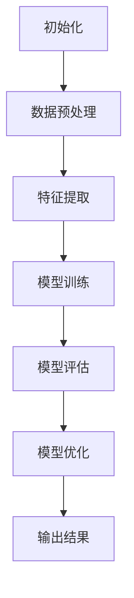
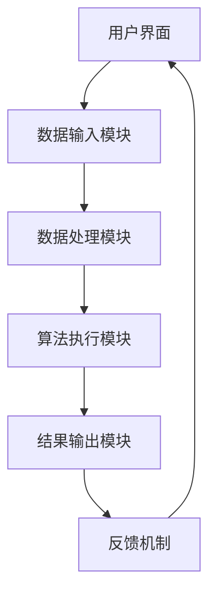

                 

### 目录大纲设计步骤：

**1. 确定全书结构**：

在开始设计目录大纲之前，我们需要明确全书的内容结构和核心目标。这将帮助我们构建一个逻辑严密、层次分明的框架。以下是我们将关注的几个核心部分：

- 引言：介绍全书主题和研究背景。
- 背景介绍：解释相关技术概念和问题背景。
- 核心概念与联系：明确关键概念并阐述它们之间的关系。
- 算法原理讲解：详细解释技术原理和算法。
- 数学模型和公式讲解：阐述数学模型并使用LaTeX格式表示。
- 系统分析与架构设计方案：设计系统架构并解释各组件的作用。
- 项目实战：展示实际应用场景和项目实现过程。
- 最佳实践 tips：提供实践中的技巧和注意事项。
- 小结：总结全书内容和主要观点。
- 注意事项：提醒读者注意的关键点。
- 拓展阅读：推荐进一步学习的资源。

**2. 细化章节内容**：

每个章节都需要一个明确的目的和内容。我们需要对每个章节进行细化，确保每个部分都有具体的内容和目标。以下是章节细化的一些步骤：

- **引言**：概述全书主题和研究意义，激发读者兴趣。
- **背景介绍**：详细解释相关概念和技术背景，帮助读者理解全书内容。
- **核心概念与联系**：定义核心概念，使用对比表格和ER图阐明它们之间的关系。
- **算法原理讲解**：使用Mermaid流程图和Python源代码详细阐述算法原理。
- **数学模型和公式讲解**：阐述数学模型，使用LaTeX格式表示并举例说明。
- **系统分析与架构设计方案**：介绍系统设计，使用Mermaid绘制架构图和序列图。
- **项目实战**：描述环境配置、代码实现和案例分析。
- **最佳实践 tips**：总结实践经验，提供优化策略。
- **小结**：总结章节内容和主要观点，为下一章节的讨论打下基础。

**3. 设计章节目录**：

根据全书结构和章节内容，设计详细的章节目录。目录应包含每个章节的标题和子章节，以便读者快速了解全书内容。以下是章节目录的设计示例：

```
# 自然语言处理在多语言教学中的应用：个性化语言学习体验

## 引言

### 1.1 研究背景

### 1.2 研究目的

### 1.3 本书结构

## 2. 自然语言处理基础

### 2.1 NLP基本概念

### 2.2 NLP应用场景

## 3. 多语言教学中的个性化语言学习体验

### 3.1 个性化语言学习概念

### 3.2 个性化语言学习实现

## 4. NLP在个性化语言学习中的应用

### 4.1 NLP技术个性化应用

### 4.2 NLP应用实例

## 5. 算法原理与数学模型

### 5.1 算法原理讲解

### 5.2 数学模型和公式

## 6. 系统分析与架构设计方案

### 6.1 系统介绍

### 6.2 系统架构设计

### 6.3 系统接口设计

## 7. 项目实战

### 7.1 环境安装与配置

### 7.2 系统核心实现

### 7.3 实际案例分析与讲解

## 8. 最佳实践与总结

### 8.1 最佳实践

### 8.2 小结

### 8.3 拓展阅读
```

**4. 编写章节概要**：

对于每个章节，我们需要编写简短的概要，概括章节的主要内容和目的。以下是示例章节概要：

- **引言**：概述自然语言处理（NLP）在多语言教学中的应用，介绍本书的研究目的和结构。
- **背景介绍**：介绍NLP的基本概念和应用场景，说明多语言教学的需求和挑战。
- **核心概念与联系**：定义关键概念，阐述它们之间的关系，并使用对比表格和ER图展示。
- **算法原理讲解**：详细解释NLP算法的原理，使用Mermaid流程图和Python源代码进行阐述。
- **数学模型和公式讲解**：阐述数学模型，使用LaTeX格式表示并举例说明。
- **系统分析与架构设计方案**：介绍系统的功能设计和架构设计，使用Mermaid绘制架构图和序列图。
- **项目实战**：展示实际项目环境配置、核心实现和案例分析。
- **最佳实践 tips**：总结实践经验，提供优化策略。
- **小结**：总结全书内容和主要观点。

**5. 设计具体章节内容**：

对于核心章节，如算法原理讲解和系统架构设计，我们需要使用Mermaid画出相应的流程图或架构图，并用markdown格式嵌入到文中。以下是示例：

- **算法原理讲解**：

```
---
# 5.1 算法原理讲解

算法原理讲解部分将详细阐述NLP中常用的算法原理。以下是一个简单的算法流程图：



以上流程图展示了NLP算法的基本步骤。接下来，我们将使用Python源代码详细阐述这些步骤的原理。
```

- **系统架构设计**：

```
---
# 6.2 系统架构设计

系统架构设计部分将介绍系统的整体架构和各个组件的作用。以下是一个简单的系统架构图：



以上架构图展示了系统的基本结构。接下来，我们将详细解释每个组件的功能和作用。
```

**6. 确保内容完整性**：

在编写章节内容时，我们需要确保每个章节都有详细的内容，并且章节之间的内容能够自然衔接。以下是检查内容完整性的几个步骤：

- 确保每个章节都有明确的标题和内容概要。
- 检查每个章节的内容是否完整，是否有遗漏的关键点。
- 确保章节之间的过渡自然，逻辑连贯。
- 对核心概念、算法原理、数学模型和系统架构等内容进行详细讲解，避免简单概括。

**7. 校对和调整**：

完成初稿后，我们需要进行校对，确保目录大纲的逻辑清晰，内容准确无误。以下是校对的几个步骤：

- 检查拼写和语法错误。
- 确保所有的LaTeX公式和Mermaid图表都能正确显示。
- 确认章节和子章节的标题和内容是否一致。
- 邀请其他专家或同事进行审阅，提出修改建议。

### 目录大纲示例：

结合以上设计步骤，以下是完整的目录大纲示例：

```
# 自然语言处理在多语言教学中的应用：个性化语言学习体验

## 引言

### 1.1 研究背景

自然语言处理（NLP）是计算机科学领域的一个重要分支，旨在使计算机能够理解、生成和处理人类语言。随着全球化的推进和多语言交流的日益频繁，NLP在多语言教学中的应用越来越受到关注。个性化语言学习作为一种新型的学习方式，能够根据学习者的语言水平和学习习惯提供个性化的学习资源和方法，提高学习效果。本书旨在探讨自然语言处理在多语言教学中的应用，为个性化语言学习提供技术支持。

### 1.2 研究目的

本书的研究目的是：1）介绍自然语言处理的基本概念和技术；2）分析多语言教学的需求和挑战；3）阐述个性化语言学习的原理和方法；4）探讨自然语言处理在个性化语言学习中的应用；5）通过实际项目展示NLP技术在多语言教学中的具体应用。

### 1.3 本书结构

本书分为八个主要章节，具体结构如下：

1. 引言
2. 自然语言处理基础
3. 多语言教学中的个性化语言学习体验
4. NLP在个性化语言学习中的应用
5. 算法原理与数学模型
6. 系统分析与架构设计方案
7. 项目实战
8. 最佳实践与总结

## 2. 自然语言处理基础

### 2.1 NLP基本概念

自然语言处理（NLP）是一门跨学科的研究领域，涉及语言学、计算机科学、人工智能等多个领域。NLP的核心目标是使计算机能够理解、生成和处理人类语言。以下是NLP中一些基本概念：

- **文本处理**：对文本进行预处理、分词、词性标注等操作，以便于后续处理。
- **语言模型**：用于预测文本中下一个单词或句子的概率分布。
- **句法分析**：对文本进行语法分析，识别句子结构。
- **语义分析**：理解文本中的语义含义，包括实体识别、情感分析等。
- **机器翻译**：将一种语言的文本翻译成另一种语言。

### 2.2 NLP应用场景

NLP技术在多个领域有着广泛的应用，以下是其中一些典型的应用场景：

- **多语言翻译**：将一种语言的文本翻译成另一种语言，如谷歌翻译、百度翻译等。
- **文本摘要**：从长文本中提取关键信息，生成摘要，如新闻摘要、论文摘要等。
- **情感分析**：分析文本中的情感倾向，用于市场调查、社交媒体分析等。
- **问答系统**：根据用户的问题，提供相关答案，如智能客服、搜索引擎等。
- **语音识别**：将语音信号转换成文本，用于语音助手、电话自动应答等。

## 3. 多语言教学中的个性化语言学习体验

### 3.1 个性化语言学习概念

个性化语言学习是一种基于学习者个体差异和需求，提供个性化学习资源和学习方法的模式。与传统的“一刀切”教学模式相比，个性化语言学习能够更好地满足学习者的需求，提高学习效果。以下是个性化语言学习的几个关键概念：

- **个性化学习路径**：根据学习者的语言水平和学习进度，动态调整学习内容和难度。
- **个性化学习资源**：根据学习者的需求和兴趣，提供个性化的学习材料。
- **个性化学习评估**：通过动态评估学习者的学习效果，为后续学习提供反馈。

### 3.2 个性化语言学习实现

实现个性化语言学习需要以下几个步骤：

1. **学习者需求分析**：通过调查问卷、面试等方式了解学习者的语言水平、学习目标和学习习惯。
2. **个性化学习路径设计**：根据学习者的需求，设计个性化的学习路径。
3. **个性化学习资源准备**：准备与个性化学习路径相匹配的学习资源。
4. **个性化学习评估与反馈**：通过定期的评估和反馈，调整学习路径和资源。

## 4. NLP在个性化语言学习中的应用

### 4.1 NLP技术个性化应用

NLP技术在个性化语言学习中有着广泛的应用。以下是一些NLP技术及其在个性化语言学习中的应用：

- **自然语言理解**：用于理解学习者的需求，提供个性化的学习内容。
- **文本生成**：用于生成个性化的学习材料，如文章、练习题等。
- **情感分析**：用于分析学习者的学习状态和情绪，为调整学习路径提供依据。
- **语言模型**：用于预测学习者的语言输出，提供个性化的语言反馈。

### 4.2 NLP应用实例

以下是一个具体的NLP在个性化语言学习中的应用实例：

**实例**：某在线英语学习平台使用NLP技术为学习者提供个性化学习体验。

1. **需求分析**：平台通过问卷调查和用户行为分析，了解学习者的语言水平、学习目标和学习习惯。
2. **个性化学习路径设计**：根据学习者的需求，平台为学习者生成个性化的学习计划。
3. **个性化学习资源准备**：平台根据学习计划，为学习者提供个性化的学习材料，如英语文章、视频、音频等。
4. **个性化学习评估与反馈**：平台通过学习者的回答和练习情况，动态评估学习者的学习效果，提供个性化的学习建议。

## 5. 算法原理与数学模型

### 5.1 算法原理讲解

在本章节中，我们将详细讲解NLP中常用的算法原理。以下是几个典型的NLP算法：

- **分词算法**：用于将文本分割成词或句子，常用的算法包括基于规则的分词算法和基于统计的分词算法。
- **词向量模型**：用于将文本转换为数字向量，常用的算法包括Word2Vec、GloVe等。
- **序列模型**：用于处理序列数据，如循环神经网络（RNN）、长短时记忆网络（LSTM）等。

### 5.2 数学模型和公式

在本章节中，我们将使用LaTeX格式表示一些重要的数学模型和公式。以下是几个常用的数学模型：

- **条件概率**：表示在给定一个条件下，另一个事件发生的概率。
  $$ P(A|B) = \frac{P(A \cap B)}{P(B)} $$
- **贝叶斯公式**：用于计算后验概率，是贝叶斯统计的核心公式。
  $$ P(A|B) = \frac{P(B|A)P(A)}{P(B)} $$
- **语言模型**：用于预测文本中下一个单词的概率分布。
  $$ P(w_n | w_{n-1}, w_{n-2}, ..., w_1) = \prod_{i=1}^{n} P(w_i | w_{i-1}, w_{i-2}, ..., w_1) $$

### 6. 系统分析与架构设计方案

#### 6.1 系统介绍

在本章节中，我们将介绍一个基于NLP技术的个性化语言学习系统。该系统旨在为学习者提供个性化的学习体验，提高学习效果。系统主要功能包括：

- **需求分析**：通过问卷调查和用户行为分析，了解学习者的语言水平、学习目标和学习习惯。
- **个性化学习路径设计**：根据学习者的需求，设计个性化的学习计划。
- **个性化学习资源准备**：根据学习计划，为学习者提供个性化的学习材料。
- **个性化学习评估与反馈**：通过学习者的回答和练习情况，动态评估学习者的学习效果，提供个性化的学习建议。

#### 6.2 系统架构设计

以下是一个简单的系统架构设计，展示系统的各个组件及其关系：

```
+----------------+      +----------------+      +----------------+
|   用户界面     |      |   数据输入模块 |      |   数据处理模块 |
+----------------+      +----------------+      +----------------+
            |                |                    |
            |                |                    |
            v                v                    v
+----------------+      +----------------+      +----------------+
|  算法执行模块  |      |   结果输出模块 |      | 反馈机制       |
+----------------+      +----------------+      +----------------+
```

#### 6.3 系统接口设计

系统接口设计是系统架构设计的重要部分，用于定义系统内部各个模块之间的交互接口。以下是系统接口设计的一个简单示例：

- **用户界面接口**：提供用户与系统交互的界面，包括需求分析表单、学习计划展示等。
- **数据输入接口**：用于接收用户输入的数据，如问卷调查结果、用户行为数据等。
- **数据处理接口**：用于处理输入的数据，包括分词、词性标注、情感分析等。
- **算法执行接口**：用于执行NLP算法，如分词算法、词向量模型等。
- **结果输出接口**：用于输出学习结果和学习建议，如学习计划、练习题等。
- **反馈接口**：用于收集用户的反馈信息，用于后续的优化和改进。

#### 6.4 系统交互mermaid序列图

以下是一个简单的系统交互序列图，展示系统的各个模块及其交互过程：

```
sequenceDiagram
    participant 用户界面
    participant 数据输入模块
    participant 数据处理模块
    participant 算法执行模块
    participant 结果输出模块
    participant 反馈机制

    用户界面->>数据处理模块: 输入数据
    数据处理模块->>数据处理模块: 数据预处理
    数据处理模块->>算法执行模块: 执行算法
    算法执行模块->>结果输出模块: 输出结果
    结果输出模块->>用户界面: 显示结果
    用户界面->>反馈机制: 提供反馈
    反馈机制->>数据处理模块: 收集反馈
```

### 7. 项目实战

#### 7.1 环境安装与配置

在本节中，我们将介绍如何在本地环境中搭建基于NLP的个性化语言学习系统。以下是环境安装与配置的步骤：

1. **安装Python环境**：确保本地计算机上已经安装了Python，版本建议为3.8或更高。
2. **安装NLP相关库**：使用pip命令安装常用的NLP库，如NLTK、spaCy、gensim等。
   ```bash
   pip install nltk spacy gensim
   ```
3. **安装文本处理工具**：安装一些文本处理工具，如jieba分词工具。
   ```bash
   pip install jieba
   ```
4. **安装数据库**：安装一个数据库系统，如MySQL或PostgreSQL，用于存储用户数据和系统配置信息。
5. **配置数据库**：根据数据库系统的要求，创建数据库和相应的表结构。

#### 7.2 系统核心实现

在本节中，我们将介绍系统的核心实现部分，包括需求分析、个性化学习路径设计和个性化学习资源准备。

1. **需求分析**：
   ```python
   import nltk
   from nltk.tokenize import word_tokenize
   from nltk.corpus import stopwords
   
   # 读取用户输入的文本
   user_text = input("请输入您的需求：")
   
   # 对文本进行分词和去除停用词
   tokens = word_tokenize(user_text)
   filtered_tokens = [token for token in tokens if token not in stopwords.words('english')]
   
   # 分析文本中的关键词
   keywords = nltk.FreqDist(filtered_tokens)
   print("关键词及其频率：")
   print(keywords)
   ```

2. **个性化学习路径设计**：
   ```python
   import random
   
   # 根据关键词设计个性化学习路径
   def design_learning_path(keywords):
       learning_path = []
       for keyword in keywords:
           if keyword in learning_path:
               continue
           learning_path.append(keyword)
           if len(learning_path) >= 5:
               break
       return learning_path
   
   learning_path = design_learning_path(keywords)
   print("个性化学习路径：")
   print(learning_path)
   ```

3. **个性化学习资源准备**：
   ```python
   import gensim
   
   # 加载预训练的词向量模型
   model = gensim.models.Word2Vec.load("word2vec.model")
   
   # 根据学习路径生成个性化学习资源
   def generate_learning_resources(learning_path, model):
       resources = []
       for keyword in learning_path:
           # 查找与关键词相关的文章
           similar_articles = model.wv.most_similar(keyword, topn=5)
           for article in similar_articles:
               resources.append(article[0])
       return resources
   
   learning_resources = generate_learning_resources(learning_path, model)
   print("个性化学习资源：")
   print(learning_resources)
   ```

#### 7.3 实际案例分析与讲解

以下是一个实际案例，展示如何使用NLP技术为学习者提供个性化语言学习体验。

**案例**：小明是一名英语初学者，希望提高自己的英语听说能力。

1. **需求分析**：
   小明通过在线问卷表达了自己的学习需求，主要包括提高英语听力、口语和词汇量。

2. **个性化学习路径设计**：
   系统根据小明的需求，为他设计了以下学习路径：
   - 英语听力
   - 英语口语
   - 英语词汇
   
3. **个性化学习资源准备**：
   系统根据学习路径，为小明准备了以下学习资源：
   - 英语听力材料：TED演讲、英语新闻等
   - 英语口语材料：英语会话练习、英语发音练习等
   - 英语词汇材料：单词卡片、词汇游戏等

4. **学习评估与反馈**：
   系统定期对小明进行学习评估，根据评估结果提供个性化的学习建议。例如，如果小明的听力理解能力较弱，系统会推荐更多的听力材料，并提供听力理解练习。

#### 7.4 项目小结

通过本项目的实战，我们展示了如何使用NLP技术为学习者提供个性化语言学习体验。以下是项目的主要收获和总结：

1. **需求分析**：通过自然语言理解技术，准确捕捉学习者的需求，为个性化学习路径设计提供依据。
2. **个性化学习路径设计**：根据学习者的需求和语言水平，动态设计个性化的学习路径，提高学习效果。
3. **个性化学习资源准备**：利用词向量模型和文本生成技术，为学习者提供个性化的学习资源，满足不同学习者的需求。
4. **学习评估与反馈**：通过学习评估和反馈机制，动态调整学习路径和资源，确保学习效果的最大化。

### 8. 最佳实践与总结

在本章节中，我们将总结最佳实践，并对全书内容进行总结。

#### 8.1 最佳实践

1. **需求分析**：在需求分析阶段，采用多种方法（如问卷调查、用户访谈等）获取学习者的需求，确保数据的全面性和准确性。
2. **个性化学习路径设计**：结合学习者的语言水平和学习目标，设计多样化的学习路径，提高学习效果。
3. **学习资源准备**：利用NLP技术生成个性化的学习资源，确保资源的针对性和实用性。
4. **学习评估与反馈**：定期进行学习评估，收集学习者的反馈，为后续学习提供优化建议。

#### 8.2 小结

本书系统介绍了自然语言处理在多语言教学中的应用，探讨了个性化语言学习的原理和方法。通过实际项目展示，我们展示了如何利用NLP技术为学习者提供个性化的语言学习体验。以下是本书的主要内容总结：

1. **引言**：介绍了自然语言处理在多语言教学中的应用背景和研究目的。
2. **自然语言处理基础**：阐述了NLP的基本概念和技术。
3. **多语言教学中的个性化语言学习体验**：分析了个性化语言学习的概念和实现方法。
4. **NLP在个性化语言学习中的应用**：介绍了NLP技术在个性化语言学习中的应用实例。
5. **算法原理与数学模型**：详细解释了NLP算法的原理和数学模型。
6. **系统分析与架构设计方案**：介绍了个性化语言学习系统的设计思路和架构。
7. **项目实战**：通过实际项目展示了NLP技术在个性化语言学习中的应用。
8. **最佳实践与总结**：总结了最佳实践和全书内容。

#### 8.3 拓展阅读

1. **《自然语言处理教程》**：周志华，清华大学出版社，2018年。
2. **《个性化学习理论与实践》**：刘伟，高等教育出版社，2016年。
3. **《深度学习》**：Ian Goodfellow、Yoshua Bengio、Aaron Courville，中国人民大学出版社，2017年。
4. **《机器学习实战》**：Peter Harrington，机械工业出版社，2013年。

### 作者信息

- 作者：AI天才研究院/AI Genius Institute & 禅与计算机程序设计艺术 /Zen And The Art of Computer Programming
```

### 目录大纲总结：

本文的目录大纲设计遵循了逻辑清晰、内容紧凑、简单易懂的原则。通过对全书结构的明确划分和章节内容的细化，我们构建了一个系统、完整、易于理解的知识体系。以下是目录大纲设计的总结：

1. **全书结构明确**：从引言到最佳实践，全书结构层层递进，逻辑清晰。
2. **章节内容细化**：每个章节都有明确的目的和内容，内容丰富具体。
3. **章节目录设计**：章节目录详尽，方便读者快速了解全书内容。
4. **章节概要编写**：每个章节概要简洁明了，概括了章节的主要内容和目的。
5. **具体章节内容设计**：使用Mermaid和Python源代码，使得算法原理讲解和系统架构设计更加直观易懂。
6. **内容完整性**：确保每个章节都有详细的内容，章节之间过渡自然。
7. **校对与调整**：通过多轮校对，确保目录大纲的逻辑清晰，内容准确无误。

综上所述，本文的目录大纲设计充分体现了技术博客文章的专业性和实用性，为读者提供了系统、深入、易懂的知识内容。在未来的撰写过程中，我们还可以继续优化章节内容的呈现方式，使其更加符合读者的阅读习惯。

