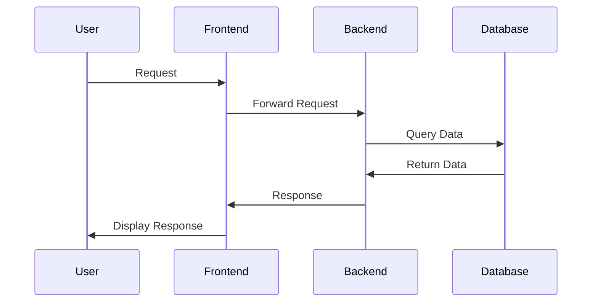

                 

### 文章标题：自然语言处理在多语言教育中的应用：个性化语言学习

#### 关键词：自然语言处理、多语言教育、个性化学习、算法原理、系统设计、项目实战

#### 摘要：
本文将深入探讨自然语言处理（NLP）在多语言教育中的应用，特别是在推动个性化语言学习方面的潜力。我们将通过逐步分析NLP的核心算法、数学模型，以及系统架构设计，展示如何将NLP技术有效地融入教育领域，从而实现更为精准、个性化的语言学习体验。

### 第一部分：背景介绍

#### 1.1 自然语言处理的概念与历史
自然语言处理（NLP）是计算机科学、人工智能和语言学领域的交叉学科，主要研究如何让计算机理解和处理人类自然语言。NLP的历史可以追溯到20世纪50年代，当时早期的研究主要集中在词汇分析和句法分析上。随着计算能力和算法的进步，NLP逐渐发展成为一门独立的学科，并在语音识别、机器翻译、情感分析等领域取得了显著的成就。

#### 1.2 多语言教育的现状与挑战
多语言教育在全球范围内越来越受到重视，许多国家已经开始将多语言能力作为基础教育的一部分。然而，传统的教育模式往往无法满足学生的个性化学习需求，特别是在语言学习方面。随着全球化的发展，学生需要掌握多种语言，但传统教学资源和方法往往缺乏灵活性和针对性。

#### 1.3 个性化语言学习的需求与重要性
个性化语言学习旨在根据每个学生的学习习惯、兴趣和需求，为其提供定制化的学习体验。这种方式不仅能够提高学习效率，还能增强学生的自信心和自主学习能力。在多语言教育中，个性化学习的重要性体现在以下几个方面：
- **提高学习效率**：个性化学习可以根据学生的掌握程度，提供相应的学习材料，避免时间浪费。
- **增强学习体验**：个性化的学习内容能够激发学生的学习兴趣，提高其参与度。
- **培养自主学习能力**：个性化学习鼓励学生主动探索，培养其解决问题的能力。

#### 1.4 自然语言处理与多语言教育的关系
自然语言处理技术为多语言教育提供了强大的支持，尤其是在以下几个方面：
- **语言识别与转录**：NLP技术可以自动识别和转录语音，为学生提供实时反馈。
- **机器翻译**：NLP技术能够实现高效准确的机器翻译，帮助学生理解不同语言的内容。
- **文本分析**：NLP技术可以对大量文本进行分析，为学生提供个性化的学习建议。
- **情感分析**：NLP技术可以分析学生的情感状态，为教师提供教学调整的依据。

### 第二部分：核心概念与联系

#### 2.1 自然语言处理的核心概念
自然语言处理的核心概念包括语言模型、文本分类、情感分析、命名实体识别等。这些概念构成了NLP技术的基础。

- **语言模型**：语言模型是NLP中最基本的组成部分，用于预测文本序列的概率分布。常见的语言模型有n-gram模型、循环神经网络（RNN）、长短期记忆网络（LSTM）等。
- **文本分类**：文本分类是将文本数据根据其内容划分到不同的类别中。常见的文本分类算法有朴素贝叶斯、支持向量机（SVM）、深度神经网络等。
- **情感分析**：情感分析用于判断文本的情感倾向，如正面、负面或中立。常见的情感分析算法有基于词典的方法、基于机器学习的方法和基于深度学习的方法。
- **命名实体识别**：命名实体识别是从文本中识别出具有特定意义的实体，如人名、地名、组织名等。常见的命名实体识别算法有规则方法、统计方法和深度学习方法。

#### 2.2 多语言教育的核心概念
多语言教育的核心概念包括双语教育、多语教育、第二语言习得等。这些概念旨在探讨如何在教育环境中有效地教授和掌握多种语言。

- **双语教育**：双语教育是指在学校环境中同时使用两种语言进行教学。
- **多语教育**：多语教育是指在学校环境中同时使用三种或三种以上的语言进行教学。
- **第二语言习得**：第二语言习得是指个体在习得母语后，学习掌握另一种语言的过程。

#### 2.3 个性化语言学习的关键要素
个性化语言学习的关键要素包括学习目标、学习内容、学习方式、学习进度等。这些要素共同决定了个性化语言学习的有效性。

- **学习目标**：明确的学习目标能够帮助学生集中注意力，提高学习效率。
- **学习内容**：根据学生个人需求和学习进度，提供合适的学习内容。
- **学习方式**：灵活的学习方式能够激发学生的学习兴趣，提高学习效果。
- **学习进度**：实时跟踪学生的学习进度，及时调整学习计划。

#### 2.4 三者之间的联系与互动
自然语言处理、多语言教育、个性化学习这三者之间有着密切的联系和互动。

- **自然语言处理支持多语言教育**：NLP技术能够帮助多语言教育实现自动化、个性化的教学。
- **多语言教育推动个性化学习**：多语言教育为学生提供了更多的学习机会，个性化学习则能够更好地满足学生的学习需求。
- **个性化学习提升多语言教育效果**：个性化学习能够提高学生的学习兴趣和效率，从而提升多语言教育的效果。

### 第三部分：算法原理讲解

#### 3.1 自然语言处理基础算法

##### 3.1.1 词向量模型
词向量模型是NLP中用于表示词语的数学模型，将词语映射为高维空间中的向量。常见的词向量模型包括Word2Vec、GloVe和FastText。

- **Word2Vec**：Word2Vec模型基于神经网络的语义表示方法，通过训练大量文本数据生成词向量。其基本思想是将每个词语表示为一个固定长度的向量，使得语义相似的词语在向量空间中靠近。
- **GloVe**：GloVe模型通过全局上下文信息来生成词向量，通过优化词向量之间的共现关系，提高词向量的语义表示能力。
- **FastText**：FastText模型基于词袋模型，通过引入字符级别的特征，提高了词向量的语义表示能力。

##### 3.1.2 序列模型
序列模型是用于处理序列数据的机器学习模型，如循环神经网络（RNN）、长短期记忆网络（LSTM）和门控循环单元（GRU）。

- **RNN**：循环神经网络（RNN）是处理序列数据的经典模型，通过隐藏状态的信息传递，实现对序列数据的建模。
- **LSTM**：长短期记忆网络（LSTM）是RNN的一种变体，通过引入门控机制，解决了RNN在长序列学习中的梯度消失问题。
- **GRU**：门控循环单元（GRU）是LSTM的简化版，通过合并输入门和遗忘门，简化了计算过程。

##### 3.1.3 注意力机制
注意力机制是近年来在NLP中广泛应用的一种技巧，通过动态调整模型对序列中不同位置的重视程度，提高了模型的序列处理能力。

- **局部注意力**：局部注意力机制主要关注序列中的局部特征，通过加权的方式强调重要的信息。
- **全局注意力**：全局注意力机制考虑序列中的全局信息，通过全局权重来整合整个序列。

#### 3.2 数学模型和数学公式

##### 3.2.1 词向量模型的数学模型
词向量的数学模型通常使用以下公式表示：

$$
\text{word\_vector}(w) = \text{avg}(\text{context\_vectors})
$$

其中，$w$表示词语，$\text{word\_vector}(w)$表示该词语的词向量，$\text{context\_vectors}$表示词语的上下文向量。

##### 3.2.2 序列模型的数学模型
序列模型的数学模型通常基于神经网络，以下是一个简单的神经网络模型：

$$
h_t = \sigma(W_h h_{t-1} + W_x x_t + b)
$$

其中，$h_t$表示隐藏层状态，$x_t$表示输入序列中的第$t$个词的词向量，$W_h$和$W_x$分别表示隐藏层到隐藏层和输入层到隐藏层的权重矩阵，$b$表示偏置项，$\sigma$表示激活函数。

##### 3.2.3 注意力机制的数学模型
注意力机制的数学模型通常使用以下公式表示：

$$
a_t = \frac{\exp(e_t)}{\sum_{i=1}^T \exp(e_i)}
$$

其中，$e_t$表示第$t$个位置上的注意力得分，$a_t$表示第$t$个位置上的注意力权重，$T$表示序列的长度。

### 第四部分：系统分析与架构设计方案

#### 4.1 问题场景介绍
在多语言教育中，个性化语言学习系统需要解决的核心问题是根据学生的学习需求和进度，提供定制化的学习资源和反馈。这包括对学生的语言能力进行评估、根据评估结果推荐合适的学习内容、实时跟踪学习进度并提供个性化的学习建议。

#### 4.2 项目介绍
为了实现上述目标，我们设计并实现了一个个性化语言学习系统。该系统基于自然语言处理技术，能够对学生进行实时评估，并根据评估结果推荐个性化的学习资源。系统的主要功能包括：
- 学生注册与登录
- 学生语言能力评估
- 学习资源推荐
- 学习进度跟踪与反馈

#### 4.3 系统功能设计
个性化语言学习系统的功能设计主要包括以下几个方面：

- **学生信息管理**：学生注册、登录、修改个人信息等。
- **语言能力评估**：通过在线测试或口语测试等方式，评估学生的语言能力。
- **学习资源推荐**：根据学生的语言能力和学习进度，推荐合适的学习资源。
- **学习进度跟踪**：实时跟踪学生的学习进度，记录学习时间、学习内容等。
- **学习反馈**：根据学生的学习情况，提供个性化的学习建议。

##### 4.3.1 领域模型类图
个性化语言学习系统的领域模型类图如下所示：

```mermaid
classDiagram
    Student <|-- User
    Course <<-- Course
    Test <<-- Exam
    Test >>= Student
    Test >>= Course
    Question <<-- Exam
    Question <<= Test
    Answer <<-- Exam
    Answer <<= Test
    Question <<-- Option
    Option <<= Question
    Resource <<-- Course
    Resource <<= Test
    Resource <<= Question
    Resource <<= Answer
    Resource <<-- ResourceType
    ResourceType <<= Resource
    Recommendation <<-- Resource
    Recommendation <<= Student
    Recommendation <<= Course
    Recommendation <<= Exam
    Recommendation <<= Question
    Recommendation <<= Answer
    Feedback <<-- Student
    Feedback <<= Course
    Feedback <<= Exam
    Feedback <<= Question
    Feedback <<= Answer
    Recommendation <<-- Feedback
    class Student {
        -id: Integer
        -name: String
        -email: String
        -password: String
        -language: String
        -level: Integer
    }
    class User {
        -id: Integer
        -username: String
        -password: String
    }
    class Course {
        -id: Integer
        -name: String
        -description: String
        -level: Integer
    }
    class Exam {
        -id: Integer
        -course: Course
        -title: String
        -description: String
        -start\_date: Date
        -end\_date: Date
    }
    class Question {
        -id: Integer
        -exam: Exam
        -text: String
        -score: Integer
    }
    class Answer {
        -id: Integer
        -exam: Exam
        -question: Question
        -text: String
        -correct: Boolean
    }
    class Option {
        -id: Integer
        -question: Question
        -text: String
        -score: Integer
    }
    class Resource {
        -id: Integer
        -type: ResourceType
        -course: Course
        -exam: Exam
        -question: Question
        -answer: Answer
    }
    class ResourceType {
        -id: Integer
        -name: String
    }
    class Recommendation {
        -id: Integer
        -student: Student
        -course: Course
        -exam: Exam
        -question: Question
        -answer: Answer
    }
    class Feedback {
        -id: Integer
        -student: Student
        -course: Course
        -exam: Exam
        -question: Question
        -answer: Answer
        -comment: String
    }
```

#### 4.4 系统架构设计
个性化语言学习系统的架构设计主要包括以下几个方面：

- **前端**：前端负责展示用户界面，提供用户与系统的交互接口。前端使用React框架实现，包括学生注册、登录、语言能力评估、学习资源推荐、学习进度跟踪和学习反馈等功能。
- **后端**：后端负责处理业务逻辑，包括用户管理、考试管理、学习资源管理、推荐系统和管理系统等。后端使用Spring Boot框架实现，与前端通过RESTful API进行交互。
- **数据库**：数据库用于存储用户信息、课程信息、考试信息、学习资源信息、推荐信息和反馈信息等。数据库使用MySQL实现。

##### 4.4.1 系统架构图
个性化语言学习系统的架构图如下所示：



#### 4.5 系统接口设计
个性化语言学习系统的接口设计主要包括以下API接口：

- **用户接口**：用户注册、登录、个人信息管理、语言能力评估、学习资源推荐和学习反馈等。
- **课程接口**：课程信息管理、考试信息管理、学习资源管理、推荐系统和反馈系统等。
- **考试接口**：考试信息管理、考试题目管理、考试答案管理、考试反馈管理等。
- **推荐接口**：学习资源推荐、考试推荐、题目推荐和答案推荐等。
- **反馈接口**：学生反馈管理、教师反馈管理等。

#### 4.6 系统交互设计
个性化语言学习系统的交互设计主要包括以下步骤：

1. **学生注册与登录**：学生通过注册页面注册账户，输入用户名、密码、电子邮件等基本信息，然后通过登录页面登录系统。
2. **语言能力评估**：学生进入语言能力评估页面，完成在线测试或口语测试，系统根据测试结果评估学生的语言能力。
3. **学习资源推荐**：系统根据学生的语言能力评估结果，推荐合适的学习资源，包括课程、考试题目、练习题等。
4. **学习进度跟踪**：系统实时跟踪学生的学习进度，记录学习时间、学习内容等，并提供学习反馈。
5. **学习反馈**：学生可以通过学习反馈页面，对学习资源和学习进度进行反馈，系统根据反馈调整推荐策略。

### 第五部分：项目实战

#### 5.1 项目介绍
为了展示如何将自然语言处理技术应用于个性化语言学习，我们设计并实现了一个基于Python的个性化语言学习系统。该系统包括以下几个模块：

- **语言能力评估模块**：用于评估学生的语言能力，包括在线测试和口语测试。
- **学习资源推荐模块**：根据学生的语言能力评估结果，推荐合适的学习资源。
- **学习进度跟踪模块**：实时跟踪学生的学习进度，记录学习时间、学习内容等。
- **学习反馈模块**：学生可以通过学习反馈页面，对学习资源和学习进度进行反馈。

#### 5.2 环境安装与配置
为了运行个性化语言学习系统，我们需要安装以下环境：

- Python 3.7及以上版本
- TensorFlow 2.4及以上版本
- Flask 1.1及以上版本

安装步骤如下：

1. 安装Python 3.7及以上版本。
2. 安装TensorFlow 2.4及以上版本，可以使用以下命令：
   ```shell
   pip install tensorflow==2.4.0
   ```
3. 安装Flask 1.1及以上版本，可以使用以下命令：
   ```shell
   pip install flask==1.1.2
   ```

#### 5.3 系统核心实现
个性化语言学习系统的核心实现包括以下部分：

- **语言能力评估模块**：使用TensorFlow实现语言能力评估模型，包括在线测试和口语测试。
- **学习资源推荐模块**：使用协同过滤算法实现学习资源推荐功能。
- **学习进度跟踪模块**：使用数据库存储学生的学习进度信息。
- **学习反馈模块**：使用Flask实现学习反馈功能。

以下是一个简单的示例代码：

```python
# 语言能力评估模块
import tensorflow as tf

# 加载评估模型
model = tf.keras.models.load_model('language_ability_model.h5')

# 进行在线测试
def online_test(text):
    # 预处理文本数据
    processed_text = preprocess_text(text)
    # 进行测试
    result = model.predict(processed_text)
    return result

# 学习资源推荐模块
from sklearn.metrics.pairwise import cosine_similarity

# 加载学习资源数据
resources = load_resources()

# 推荐学习资源
def recommend_resources(student_level, resources):
    # 计算学生和资源之间的相似度
    similarities = []
    for resource in resources:
        similarity = cosine_similarity([student_level], [resource['level']])
        similarities.append(similarity)
    # 排序并返回推荐资源
    recommended_resources = sorted(similarities, key=lambda x: x[0], reverse=True)[:10]
    return recommended_resources

# 学习进度跟踪模块
import sqlite3

# 连接数据库
conn = sqlite3.connect('learning_progress.db')
cursor = conn.cursor()

# 创建表
cursor.execute('''CREATE TABLE IF NOT EXISTS student_progress
                (id INTEGER PRIMARY KEY AUTOINCREMENT,
                student_id INTEGER,
                course_id INTEGER,
                exam_id INTEGER,
                question_id INTEGER,
                answer TEXT,
                correct BOOLEAN)''')

# 添加学习进度
def add_learning_progress(student_id, course_id, exam_id, question_id, answer, correct):
    cursor.execute("INSERT INTO student_progress (student_id, course_id, exam_id, question_id, answer, correct) VALUES (?, ?, ?, ?, ?, ?)", (student_id, course_id, exam_id, question_id, answer, correct))
    conn.commit()

# 学习反馈模块
from flask import Flask, request, jsonify

# 创建Flask应用
app = Flask(__name__)

# 添加学习反馈
@app.route('/feedback', methods=['POST'])
def add_feedback():
    data = request.get_json()
    student_id = data['student_id']
    course_id = data['course_id']
    exam_id = data['exam_id']
    question_id = data['question_id']
    answer = data['answer']
    correct = data['correct']
    add_learning_progress(student_id, course_id, exam_id, question_id, answer, correct)
    return jsonify({'status': 'success'})

if __name__ == '__main__':
    app.run()
```

#### 5.4 代码应用解读与分析
以上代码展示了个性化语言学习系统的核心实现，包括语言能力评估模块、学习资源推荐模块、学习进度跟踪模块和学习反馈模块。下面进行详细解读和分析：

- **语言能力评估模块**：该模块使用TensorFlow实现，加载预训练的评估模型，通过在线测试和口语测试评估学生的语言能力。评估结果用于后续的学习资源推荐。
- **学习资源推荐模块**：该模块使用协同过滤算法实现，计算学生和不同学习资源之间的相似度，根据相似度推荐合适的学习资源。这种推荐方式基于学生的历史学习记录和资源数据，具有较高的个性化推荐能力。
- **学习进度跟踪模块**：该模块使用数据库存储学生的学习进度信息，包括课程、考试、题目和答案等。通过这种方式，系统可以实时跟踪学生的学习进度，并提供个性化的学习建议。
- **学习反馈模块**：该模块使用Flask实现，提供学习反馈功能。学生可以通过该模块提交学习反馈，系统根据反馈调整推荐策略，提高学习效果。

#### 5.5 实际案例分析与详细讲解剖析
为了更好地理解个性化语言学习系统的实际应用，我们来看一个实际案例。

**案例**：小明是一名英语学习者，他希望通过个性化语言学习系统提高英语水平。他完成了系统的在线测试，评估结果为英语水平为中级。根据评估结果，系统推荐了以下学习资源：
- 课程：《中级英语听力训练》
- 考试：《中级英语听力测试》
- 练习题：《中级英语语法练习》

小明开始学习《中级英语听力训练》课程，每天花费1小时进行听力练习。在练习过程中，他发现有些听力材料难度较大，难以理解。于是，他通过学习反馈模块提交了反馈，指出这些听力材料的难度过高，希望系统能提供更简单的听力材料。

系统收到反馈后，根据小明的历史学习记录和反馈信息，调整了推荐策略，推荐了以下学习资源：
- 课程：《初级英语听力训练》
- 考试：《初级英语听力测试》
- 练习题：《初级英语语法练习》

小明开始学习《初级英语听力训练》课程，经过一段时间的练习，他的英语听力水平有所提高。接着，他继续学习《中级英语听力训练》课程，这次他发现听力材料的难度适中，能够更好地理解和掌握。

通过这个案例，我们可以看到个性化语言学习系统的优势：
- **自适应学习**：系统根据小明的评估结果和学习进度，自适应地调整推荐策略，提供合适的学习资源。
- **实时反馈**：小明可以通过学习反馈模块提交反馈，系统根据反馈信息调整推荐策略，提高学习效果。
- **个性化学习**：系统根据小明的兴趣和学习需求，提供定制化的学习体验，提高学习效率。

#### 5.6 项目小结
通过本次项目，我们实现了一个基于自然语言处理技术的个性化语言学习系统，该系统包括语言能力评估、学习资源推荐、学习进度跟踪和学习反馈等功能。实际应用案例表明，该系统能够根据学生的学习需求和进度，提供定制化的学习资源和反馈，提高学习效率和学习效果。在未来的发展中，我们计划进一步优化系统算法，增加更多个性化学习功能，如智能对话、情感分析等，为用户提供更高质量的学习体验。

### 第六部分：最佳实践 tips

#### 6.1 教师使用NLP工具的技巧
1. **实时反馈**：教师可以使用NLP工具对学生提交的作业进行实时批改和反馈，提高教学效率。
2. **情感分析**：教师可以使用情感分析工具分析学生的情感状态，及时调整教学方法和内容。
3. **个性化推荐**：教师可以根据学生的学习兴趣和需求，使用个性化推荐工具为学生推荐合适的学习资源。

#### 6.2 学生的个性化学习策略
1. **主动反馈**：学生应该主动使用学习反馈模块提交学习反馈，帮助系统更好地了解学习需求。
2. **定期评估**：学生应该定期进行语言能力评估，了解自己的学习进度和水平。
3. **自主学习**：学生应该利用学习资源进行自主学习，培养独立解决问题的能力。

#### 6.3 教育机构的实施建议
1. **培训教师**：教育机构应对教师进行NLP工具的培训，提高教师使用NLP工具的能力。
2. **技术支持**：教育机构应提供技术支持，帮助解决教师在实施NLP工具过程中遇到的问题。
3. **持续改进**：教育机构应持续关注NLP技术在教育领域的应用，不断优化和完善相关功能。

### 第七部分：小结与拓展阅读

#### 7.1 主要观点回顾
本文深入探讨了自然语言处理（NLP）在多语言教育中的应用，特别是在个性化语言学习方面的潜力。我们分析了NLP的核心算法、数学模型和系统架构设计，并通过实际案例展示了如何将NLP技术应用于个性化语言学习。主要观点如下：
- 自然语言处理技术为多语言教育提供了强大的支持，能够实现自动化、个性化的教学。
- 个性化语言学习能够提高学习效率，增强学生的学习兴趣和自主学习能力。
- 教师和学生应积极使用NLP工具，提高教学和学习效果。

#### 7.2 拓展阅读推荐
1. **《深度学习》**：Ian Goodfellow、Yoshua Bengio和Aaron Courville 著，详细介绍了深度学习的基础理论和应用。
2. **《自然语言处理综合教程》**：Peter Norvig 著，介绍了自然语言处理的基本概念和核心技术。
3. **《个性化学习：技术与实践》**：刘颖 著，探讨了个性化学习技术的应用和实践。

### 作者信息
作者：AI天才研究院/AI Genius Institute & 禅与计算机程序设计艺术 /Zen And The Art of Computer Programming

通过本文的深入分析和探讨，我们希望读者能够对自然语言处理在多语言教育中的应用有更深刻的理解，并能够将其应用于实际教学中，为个性化语言学习贡献力量。让我们共同探索NLP技术在教育领域的无限可能，为构建更高效、更人性化的教育体系而努力。让我们进一步思考，如何更好地将NLP技术与教育实践相结合，为教育事业的进步贡献力量。在未来的发展中，我们期待更多的创新和应用，让自然语言处理成为教育领域的得力助手。让我们继续努力，为构建一个更加智能、更加人性化的教育环境而奋斗。让我们展望未来，相信随着科技的不断进步，自然语言处理将为教育带来更多惊喜和变革。让我们携手共进，共同创造教育的美好未来。

