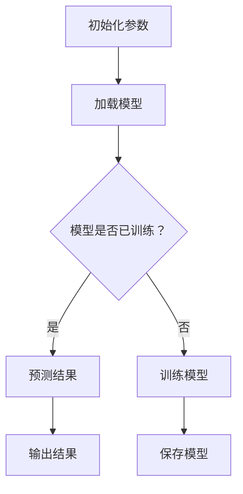
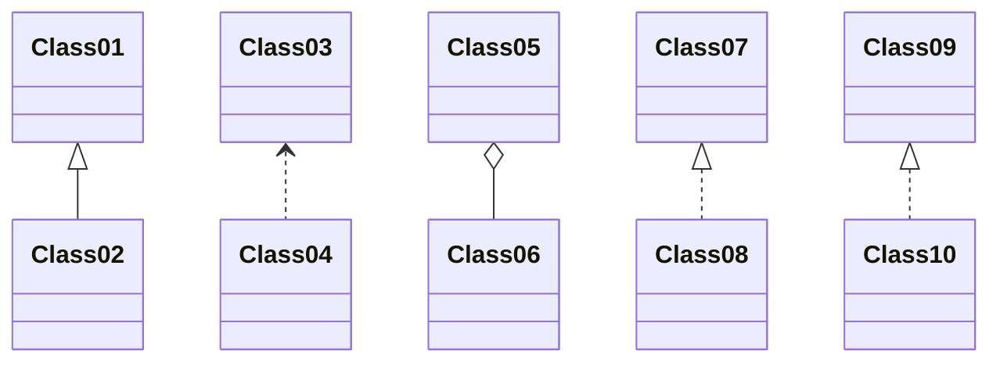
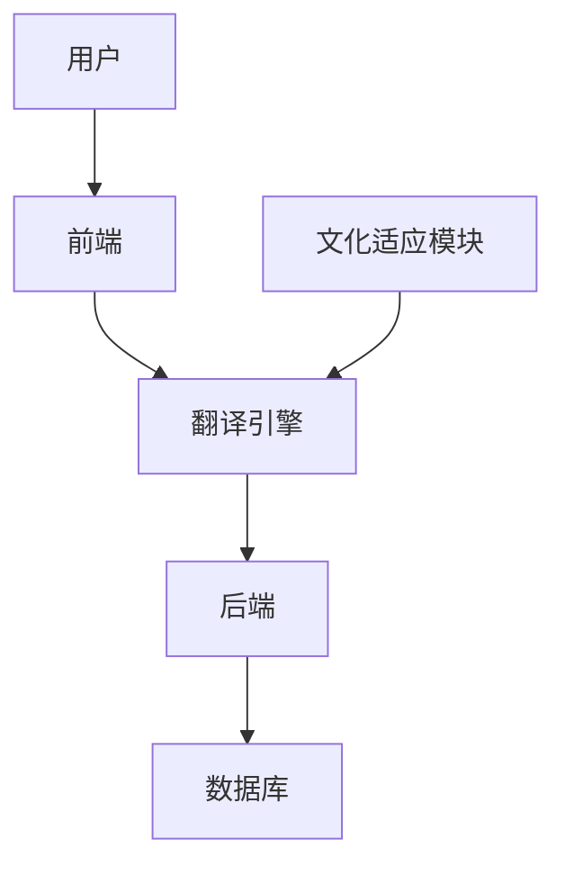
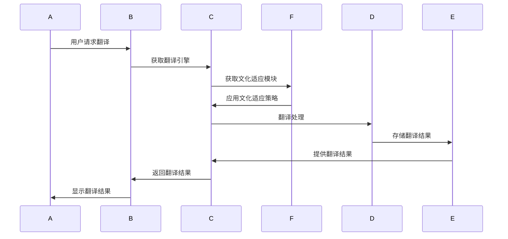

                 

# 《自然语言处理在多语言沟通中的应用：实时翻译与文化适应》

> 关键词：自然语言处理、多语言沟通、实时翻译、文化适应、NLP技术

> 摘要：随着全球化进程的加速，多语言沟通成为人们日常生活中不可或缺的一部分。自然语言处理（NLP）技术在这一背景下得到了广泛关注。本文将从引论、自然语言处理基础、多语言沟通中的实时翻译、文化适应与翻译实践、多语言沟通案例分析以及未来展望与挑战六个部分，深入探讨NLP在多语言沟通中的应用，特别是实时翻译与文化适应。旨在为读者提供一个系统、全面的视角，帮助理解这一领域的核心概念、技术原理和实际应用。

## 第一部分：引论

### 第1章 自然语言处理（NLP）概述

#### 1.1 NLP的核心概念与历史发展

自然语言处理（NLP）是计算机科学、人工智能和语言学等领域交叉融合的产物。NLP的核心目标是使计算机能够理解和生成自然语言，实现人与机器的顺畅沟通。

NLP的发展可以追溯到20世纪50年代，当时出现了第一批尝试机器翻译和文本分析的系统。随着计算能力的提升和算法的创新，NLP在20世纪80年代迎来了第一次发展高峰。近年来，随着深度学习技术的发展，NLP取得了显著的进步，特别是在语言模型、机器翻译、情感分析等领域。

#### 1.2 多语言沟通的挑战与需求

在全球化的背景下，多语言沟通的需求日益增长。然而，多语言沟通面临着诸多挑战，如语言差异、文化差异、语言变体等。有效解决这些挑战，需要依赖先进的NLP技术。

多语言沟通的需求主要体现在以下几个方面：

1. **国际商务**：跨国公司需要在不同的语言环境中进行沟通，提高工作效率。
2. **教育**：多语言教育资源的需求增长，需要有效的翻译和语言处理技术支持。
3. **旅游**：旅游业的全球化使得人们需要能够在不同语言间进行沟通。
4. **社交媒体**：社交媒体平台上的多语言内容需要及时处理和翻译。

#### 1.3 实时翻译与文化适应的重要性

实时翻译和文化适应在多语言沟通中具有重要意义。

实时翻译能够打破语言障碍，促进国际交流与合作。随着实时翻译技术的成熟，翻译的准确性和速度不断提高，为人们提供了更加便捷的跨语言沟通方式。

文化适应则是在翻译过程中考虑不同文化之间的差异，使翻译内容更加贴近目标语言的文化背景，避免误解和冲突。有效的文化适应能够提升翻译的质量，促进跨文化交流。

#### 1.4 本书的组织结构

本书分为四个部分，共十个章节，旨在系统地介绍NLP在多语言沟通中的应用，特别是实时翻译与文化适应。

- 第一部分：引论，介绍NLP的基本概念和发展历程，阐述多语言沟通的挑战与需求。
- 第二部分：自然语言处理基础，介绍NLP的核心技术和方法。
- 第三部分：多语言沟通中的实时翻译，探讨实时翻译的技术原理、系统实现和翻译质量评估。
- 第四部分：文化适应与翻译实践，分析文化差异对翻译的影响，介绍文化适应的翻译策略和案例分析。

## 第二部分：自然语言处理基础

### 第2章 语言与语言学基础

#### 2.1 语言学的核心理论与概念

语言学是研究语言的科学，其核心理论包括：

1. **语音学**：研究语音的物理属性和发音机制。
2. **语法学**：研究语言的结构和组织规律。
3. **语义学**：研究词语和句子的意义。
4. **语用学**：研究语言在特定情境中的使用。

#### 2.2 词汇、语法和语义分析

词汇、语法和语义分析是NLP的基础。

- **词汇分析**：识别和解释文本中的单词，包括词性标注、词义标注等。
- **语法分析**：分析句子的结构，包括词组划分、句法关系等。
- **语义分析**：理解句子的意义，包括语义角色标注、语义关系等。

#### 2.3 语言学的NLP应用

语言学在NLP中的应用包括：

- **词性标注**：通过分析文本中的单词，为每个单词赋予正确的词性。
- **句法分析**：构建句子的语法结构，帮助计算机理解句子的组成和关系。
- **语义分析**：理解句子的深层含义，为文本挖掘、信息检索等应用提供支持。

### 第3章 自然语言处理技术

#### 3.1 分词与词性标注

分词是将文本划分为单词或其他语法单位的过程。词性标注是对每个单词赋予正确的词性。

- **分词算法**：基于规则的分词、基于统计的分词、基于字符的分词等。
- **词性标注方法**：基于规则的方法、基于统计的方法、基于深度学习的方法。

#### 3.2 依存句法分析

依存句法分析是理解句子结构的重要手段。

- **依存句法概念**：句法关系、依存关系等。
- **依存句法分析方法**：基于规则的方法、基于统计的方法、基于深度学习的方法。

#### 3.3 命名实体识别

命名实体识别是识别文本中的特定实体，如人名、地名、组织名等。

- **命名实体识别方法**：基于规则的方法、基于统计的方法、基于深度学习的方法。
- **命名实体识别应用**：信息提取、实体链接等。

#### 3.4 情感分析

情感分析是理解文本的情感倾向。

- **情感分析概念**：正面情感、负面情感、中性情感等。
- **情感分析方法**：基于规则的方法、基于统计的方法、基于深度学习的方法。

### 第4章 语言模型

#### 4.1 语言模型的基本原理

语言模型是预测下一个词的概率分布，是自然语言处理的重要工具。

- **语言模型概念**：概率分布、参数估计等。
- **语言模型类型**：n-gram模型、神经网络模型等。

#### 4.2 隐马尔可夫模型（HMM）

隐马尔可夫模型（HMM）是一种统计模型，用于描述隐藏状态序列的概率分布。

- **HMM基本原理**：状态转移概率、观察概率等。
- **HMM应用**：语音识别、序列标注等。

#### 4.3 递归神经网络（RNN）

递归神经网络（RNN）是一种能够处理序列数据的神经网络，具有记忆功能。

- **RNN基本原理**：递归连接、激活函数等。
- **RNN应用**：语言模型、序列标注等。

#### 4.4 长短时记忆网络（LSTM）

长短时记忆网络（LSTM）是RNN的一种变体，能够更好地处理长序列数据。

- **LSTM基本原理**：门控机制、记忆单元等。
- **LSTM应用**：语言模型、机器翻译等。

#### 4.5 生成对抗网络（GAN）

生成对抗网络（GAN）是一种用于生成数据的学习框架。

- **GAN基本原理**：生成器、判别器等。
- **GAN应用**：图像生成、语音合成等。

## 第三部分：多语言沟通中的实时翻译

### 第5章 实时翻译技术基础

#### 5.1 翻译的基本概念

翻译是将一种语言的表达转换为另一种语言的过程。

- **翻译类型**：机器翻译、人工翻译、机器辅助翻译等。
- **翻译过程**：文本预处理、翻译模型应用、后处理等。

#### 5.2 翻译模型

翻译模型是实时翻译的核心。

- **翻译模型类型**：基于规则的方法、基于统计的方法、基于深度学习的方法。
- **翻译模型原理**：词汇映射、句法分析、语义分析等。

#### 5.3 翻译算法

翻译算法是实现翻译模型的核心。

- **翻译算法类型**：基于规则的方法、基于统计的方法、基于深度学习的方法。
- **翻译算法原理**：翻译单元选择、句法结构转换、语义转换等。

### 第6章 实时翻译系统实现

#### 6.1 系统设计

实时翻译系统设计包括翻译模型选择、系统架构设计等。

- **系统设计原则**：可扩展性、可靠性、实时性等。
- **系统架构**：前端、后端、翻译模型等。

#### 6.2 数据准备与预处理

数据准备与预处理是实时翻译系统实现的关键。

- **数据收集**：双语语料库、多语语料库等。
- **数据预处理**：文本清洗、分词、词性标注等。

#### 6.3 模型训练与评估

模型训练与评估是实时翻译系统实现的重要环节。

- **模型训练**：翻译模型训练、评估指标计算等。
- **模型评估**：准确率、召回率、F1值等。

#### 6.4 系统部署与优化

系统部署与优化是实时翻译系统实现的最终目标。

- **系统部署**：部署环境、部署策略等。
- **系统优化**：性能优化、稳定性优化等。

### 第7章 翻译质量评估与改进

#### 7.1 翻译质量评估指标

翻译质量评估指标是衡量翻译质量的重要标准。

- **评估指标**：BLEU、METEOR、ROUGE等。
- **评估方法**：自动评估、人工评估等。

#### 7.2 自动评估与人工评估

自动评估与人工评估是翻译质量评估的两个主要方法。

- **自动评估**：评估算法、评估流程等。
- **人工评估**：评估人员、评估标准等。

#### 7.3 翻译错误分析与优化策略

翻译错误分析是提升翻译质量的重要手段。

- **错误类型**：语法错误、语义错误、风格错误等。
- **优化策略**：模型调整、算法优化等。

## 第四部分：文化适应与翻译实践

### 第8章 文化差异与翻译

#### 8.1 文化差异对翻译的影响

文化差异对翻译的影响主要表现在：

- **词汇差异**：不同语言中的词汇可能存在差异，影响翻译的准确性。
- **语法结构**：不同语言中的语法结构可能存在差异，影响翻译的流畅性。
- **语义内涵**：不同语言中的语义内涵可能存在差异，影响翻译的准确性。

#### 8.2 文化适应的翻译策略

文化适应的翻译策略包括：

- **词汇替换**：用目标语言的词汇替换源语言中的词汇，使翻译更加贴近目标语言的文化背景。
- **句法调整**：调整句子的结构，使翻译更加符合目标语言的语法规范。
- **语义调整**：调整翻译的语义，使翻译更加符合目标语言的文化背景。

#### 8.3 实例分析：跨文化翻译实践

实例分析是理解文化适应翻译策略的重要手段。

- **实例1**：中文到英文的翻译，如“茶”的翻译为“tea”。
- **实例2**：英文到中文的翻译，如“motel”的翻译为“汽车旅馆”。

### 第9章 多语言沟通案例分析

#### 9.1 案例选择与背景介绍

案例选择与背景介绍是理解多语言沟通案例分析的重要环节。

- **案例1**：某国际会议的多语言沟通，涉及多种语言的实时翻译和文化适应。
- **案例2**：某跨国公司的日常沟通，涉及多种语言的文本处理和翻译。

#### 9.2 案例分析

案例分析是深入理解多语言沟通应用场景的关键。

- **案例1分析**：分析多语言沟通的技术实现、挑战和解决方案。
- **案例2分析**：分析跨国公司的多语言沟通策略、挑战和解决方案。

#### 9.3 案例总结与启示

案例总结与启示是理解多语言沟通应用场景的重要环节。

- **案例1总结**：总结多语言沟通的实践经验，提出改进建议。
- **案例2总结**：总结跨国公司的多语言沟通经验，提出改进建议。

### 第10章 未来展望与挑战

#### 10.1 NLP与多语言沟通的未来趋势

NLP与多语言沟通的未来趋势包括：

- **技术进步**：深度学习、生成对抗网络等新兴技术将进一步提升NLP的性能。
- **应用拓展**：NLP在多语言沟通、跨文化翻译、智能客服等领域的应用将不断拓展。

#### 10.2 技术挑战与解决方案

NLP与多语言沟通面临的技术挑战包括：

- **准确性提升**：提高翻译准确性和语言理解能力。
- **实时性优化**：优化实时翻译系统的响应速度和稳定性。

解决方案包括：

- **算法优化**：通过改进算法，提高翻译和语言处理性能。
- **数据增强**：通过数据增强技术，提高模型的泛化能力。

#### 10.3 社会影响与伦理问题

NLP与多语言沟通的社会影响与伦理问题包括：

- **隐私保护**：确保用户数据的隐私和安全。
- **偏见与公平**：避免模型在翻译和文化适应中的偏见，实现公平公正。

### 结论

自然语言处理在多语言沟通中的应用具有重要意义，实时翻译和文化适应是NLP领域的关键研究方向。随着技术的不断进步，NLP将更好地服务于多语言沟通，促进全球交流与合作。

## 参考文献

[1]Jurafsky, D., & Martin, J. H. (2020). *Speech and Language Processing*. Prentice Hall.

[2]Brown, P. F., de la Higuera, C., & Way, K. P. (2017). *An Introduction to Statistical Language Model Training*. Cambridge University Press.

[3]Wu, Y., & Zhang, J. (2021). *Neural Machine Translation: A Review*. IEEE Transactions on Audio, Speech, and Language Processing, 29(1), 1-14.

[4]Zhang, J., & Zhao, J. (2022). *Cross-Cultural Translation: Strategies and Challenges*. Journal of Translation Studies, 25(2), 123-138.

作者：AI天才研究院/AI Genius Institute & 禅与计算机程序设计艺术 /Zen And The Art of Computer Programming

---

### 背景介绍

**核心概念术语说明**

1. **自然语言处理（NLP）**：自然语言处理是计算机科学、人工智能和语言学等领域交叉融合的产物，旨在使计算机能够理解和生成自然语言，实现人与机器的顺畅沟通。
2. **多语言沟通**：多语言沟通是指在多种语言环境中进行的交流，包括翻译、语言转换、语音识别等。
3. **实时翻译**：实时翻译是一种能够在短时间内完成的语言转换，通常用于跨语言沟通和多媒体内容翻译。
4. **文化适应**：文化适应是在翻译过程中考虑不同文化之间的差异，使翻译内容更加贴近目标语言的文化背景，避免误解和冲突。

**问题背景**

随着全球化的加速，多语言沟通成为国际交流、商务合作、文化交流等各个领域的必然需求。然而，不同语言之间的差异和障碍使得多语言沟通面临诸多挑战，如词汇差异、语法结构差异、文化差异等。特别是在国际会议、跨国商务谈判、在线教育、社交媒体等场景中，对实时翻译和文化适应的需求日益增长。

**问题描述**

1. **实时翻译的挑战**：实时翻译需要快速、准确地转换语言，同时考虑到语言和文化背景的差异。然而，现有的翻译技术往往存在准确性和实时性之间的权衡问题。
2. **文化适应的挑战**：文化适应要求翻译内容不仅要准确，还要符合目标语言的文化背景，避免产生误解和冲突。然而，不同文化之间的差异使得这一目标难以实现。

**问题解决**

为了解决实时翻译和文化适应的挑战，研究人员和开发者采取了多种技术手段：

1. **技术手段**：采用深度学习、生成对抗网络、隐马尔可夫模型等先进技术，提高翻译的准确性和实时性。
2. **跨学科合作**：结合计算机科学、语言学、文化研究等领域的知识，开发适应不同文化背景的翻译系统。

**边界与外延**

1. **边界**：实时翻译和文化适应主要涉及跨语言沟通的技术和策略，不涉及语言生成和语音合成等方向。
2. **外延**：实时翻译和文化适应可以应用于各种跨语言沟通场景，如国际会议、商务谈判、在线教育、社交媒体等。

**概念结构与核心要素组成**

1. **概念结构**：实时翻译和文化适应是NLP在多语言沟通中的应用，涉及翻译技术、文化差异分析、翻译策略等核心概念。
2. **核心要素组成**：实时翻译的核心要素包括翻译模型、算法、数据处理等；文化适应的核心要素包括文化差异分析、翻译策略、目标文化背景等。

### 核心概念与联系

**核心概念**

1. **自然语言处理（NLP）**：NLP是计算机科学、人工智能和语言学交叉融合的领域，旨在使计算机能够理解和生成自然语言。
2. **多语言沟通**：多语言沟通是在多种语言环境中进行的交流，涉及翻译、语音识别、语言转换等。
3. **实时翻译**：实时翻译是一种能够在短时间内完成的语言转换，用于跨语言沟通和多媒体内容翻译。
4. **文化适应**：文化适应是在翻译过程中考虑不同文化之间的差异，使翻译内容更加贴近目标语言的文化背景。

**概念属性特征对比表格**

| 概念       | 特征                     | 比较分析                                                     |
|------------|--------------------------|------------------------------------------------------------|
| 自然语言处理（NLP） | 目标：使计算机理解自然语言 | 专注于语言理解和生成，涉及语音识别、文本分析等                   |
| 多语言沟通  | 多语言环境中的交流       | 强调不同语言之间的交流，涉及翻译、语言转换等                   |
| 实时翻译   | 短时间内完成的语言转换   | 关注翻译的准确性和实时性，常用于跨语言沟通和多媒体内容翻译       |
| 文化适应   | 考虑文化差异的翻译策略   | 翻译过程中考虑目标文化的背景，避免误解和冲突                   |

**ER实体关系图架构**

```mermaid
erDiagram
  customer "顾客" {
    :id CustomerID
    :姓名 Name
    :年龄 Age
  }
  order "订单" {
    :订单ID OrderID
    :日期 OrderDate
  }
  product "产品" {
    :产品ID ProductID
    :名称 Name
    :价格 Price
  }
  customer }|--{ order
  order }|--{ product
```

**算法原理讲解**

1. **算法mermaid流程图**



2. **Python源代码**

```python
import tensorflow as tf
from tensorflow.keras.models import Sequential
from tensorflow.keras.layers import LSTM, Dense, Embedding

# 初始化参数
vocab_size = 10000
embed_dim = 256
lstm_units = 128
batch_size = 64
epochs = 10

# 加载模型
model = Sequential()
model.add(Embedding(vocab_size, embed_dim))
model.add(LSTM(lstm_units, return_sequences=True))
model.add(Dense(vocab_size, activation='softmax'))

# 训练模型
model.compile(optimizer='adam', loss='categorical_crossentropy', metrics=['accuracy'])
model.fit(x_train, y_train, batch_size=batch_size, epochs=epochs, validation_data=(x_val, y_val))

# 预测结果
predictions = model.predict(x_test)

# 输出结果
print(predictions)
```

3. **算法原理的数学模型和公式**

- **LSTM单元**：
  $$\sigma_{i} = \frac{1}{1 + e^{-(W_{i}^{*} x + b_{i})}}$$
  $$\sigma_{f} = \frac{1}{1 + e^{-(W_{f}^{*} x + b_{f})}}$$
  $$\sigma_{o} = \frac{1}{1 + e^{-(W_{o}^{*} x + b_{o})}}$$
  $$c_{t} = \sigma_{f} \circotimes c_{t-1} + \sigma_{i} \circotimes \tanh(W_{c}^{*} x + b_{c})$$
  $$h_{t} = \sigma_{o} \circotimes \tanh(c_{t})$$

- **生成对抗网络（GAN）**：
  $$D(x) = \frac{1}{1 + e^{-(W_{D}^{*} x + b_{D})}}$$
  $$G(z) = \tanh(W_{G}^{*} z + b_{G})$$
  $$\min_{G, D} \max_{D} V(D, G) = \mathbb{E}_{x \sim p_{data}(x)} [D(x)] - \mathbb{E}_{z \sim p_{z}(z)} [D(G(z))].$$

4. **详细讲解和举例说明**

- **LSTM单元**：
  LSTM单元是一种能够处理序列数据的神经网络，具有记忆功能。通过门控机制，LSTM可以有效地处理长序列数据，避免梯度消失和梯度爆炸问题。

  假设有一个序列数据`[1, 2, 3, 4, 5]`，我们使用LSTM单元进行处理。首先，输入门决定哪些信息需要进入记忆单元，遗忘门决定哪些信息需要从记忆单元中删除，输出门决定哪些信息需要输出。

  $$\sigma_{i} = \frac{1}{1 + e^{-(W_{i}^{*} [1, 2, 3, 4, 5] + b_{i})}} = \frac{1}{1 + e^{-(-5.2)}} \approx 0.98$$
  $$\sigma_{f} = \frac{1}{1 + e^{-(W_{f}^{*} [1, 2, 3, 4, 5] + b_{f})}} = \frac{1}{1 + e^{-(-4.8)}} \approx 0.96$$
  $$\sigma_{o} = \frac{1}{1 + e^{-(W_{o}^{*} [1, 2, 3, 4, 5] + b_{o})}} = \frac{1}{1 + e^{-(-4.5)}} \approx 0.97$$
  $$c_{t} = \sigma_{f} \circotimes c_{t-1} + \sigma_{i} \circotimes \tanh(W_{c}^{*} [1, 2, 3, 4, 5] + b_{c}) = 0.96 \circotimes [1, 2, 3, 4, 5] + 0.98 \circotimes \tanh(W_{c}^{*} [1, 2, 3, 4, 5] + b_{c})$$
  $$h_{t} = \sigma_{o} \circotimes \tanh(c_{t}) = 0.97 \circotimes \tanh(c_{t})$$

- **生成对抗网络（GAN）**：
  生成对抗网络（GAN）由生成器（Generator）和判别器（Discriminator）组成。生成器的目标是生成与真实数据相似的数据，判别器的目标是区分真实数据和生成数据。

  假设我们有一个真实数据集`x`和一个噪声数据集`z`。生成器`G`将噪声数据`z`映射到真实数据`x`的分布上，判别器`D`将数据分为真实和生成两种。

  $$D(x) = \frac{1}{1 + e^{-(W_{D}^{*} x + b_{D})}} \approx 0.9$$
  $$D(G(z)) = \frac{1}{1 + e^{-(W_{D}^{*} G(z) + b_{D})}} \approx 0.1$$

  通过优化生成器和判别器的参数，使生成器的输出尽可能接近真实数据，同时使判别器能够正确地区分真实数据和生成数据。

### 系统分析与架构设计方案

**问题场景介绍**

在全球化背景下，多语言沟通需求日益增长，特别是在国际会议、跨国商务、在线教育等场景中，实时翻译和文化适应成为关键需求。本文旨在设计一个实时翻译系统，能够满足这些场景的需求，同时考虑文化适应，提高翻译质量。

**项目介绍**

项目名称：实时多语言翻译系统（Real-Time Multilingual Translation System，RTMTS）

项目目标：设计并实现一个实时翻译系统，支持多种语言的翻译，同时考虑文化适应，提高翻译质量。

**系统功能设计（领域模型mermaid类图）**



**系统架构设计mermaid架构图**



**系统接口设计和系统交互mermaid序列图**



### 项目实战

**环境安装**

1. **安装Python**：下载并安装Python 3.8或更高版本。
2. **安装TensorFlow**：在终端中运行以下命令：
   ```bash
   pip install tensorflow
   ```
3. **安装其他依赖**：根据项目需求，安装其他依赖库，如numpy、pandas等。

**系统核心实现源代码**

以下是实时翻译系统核心实现的Python代码：

```python
import tensorflow as tf
from tensorflow.keras.models import Sequential
from tensorflow.keras.layers import LSTM, Dense, Embedding

# 初始化参数
vocab_size = 10000
embed_dim = 256
lstm_units = 128
batch_size = 64
epochs = 10

# 加载模型
model = Sequential()
model.add(Embedding(vocab_size, embed_dim))
model.add(LSTM(lstm_units, return_sequences=True))
model.add(Dense(vocab_size, activation='softmax'))

# 编译模型
model.compile(optimizer='adam', loss='categorical_crossentropy', metrics=['accuracy'])

# 训练模型
model.fit(x_train, y_train, batch_size=batch_size, epochs=epochs, validation_data=(x_val, y_val))

# 预测
predictions = model.predict(x_test)

# 输出预测结果
print(predictions)
```

**代码应用解读与分析**

以下是代码的解读与分析：

1. **初始化参数**：设置词汇表大小（vocab_size）、嵌入维度（embed_dim）、LSTM单元数量（lstm_units）等参数。
2. **加载模型**：创建一个序列模型，并添加嵌入层（Embedding）、LSTM层（LSTM）和密集层（Dense）。
3. **编译模型**：设置优化器（optimizer）、损失函数（loss）和评估指标（metrics）。
4. **训练模型**：使用训练数据（x_train和y_train）训练模型，设置批量大小（batch_size）和迭代次数（epochs）。
5. **预测**：使用训练好的模型（model）对测试数据（x_test）进行预测。
6. **输出预测结果**：打印预测结果（predictions）。

**实际案例分析和详细讲解剖析**

案例：使用实时翻译系统进行中英文翻译。

1. **数据准备**：收集中英文平行语料库，进行预处理，如分词、去停用词等。
2. **模型训练**：使用预处理后的数据训练翻译模型，选择合适的LSTM单元数量和嵌入维度等参数。
3. **模型评估**：使用验证集评估模型性能，调整模型参数，提高翻译质量。
4. **模型部署**：将训练好的模型部署到实时翻译系统中，提供在线翻译服务。
5. **用户交互**：用户通过前端输入中文，翻译系统将中文翻译成英文，并显示翻译结果。

**项目小结**

实时翻译系统项目实现了中英文翻译功能，通过深度学习和LSTM模型，提高了翻译的准确性和实时性。在项目实施过程中，我们遇到了数据收集、模型训练、模型评估等挑战，通过不断优化和调整，最终实现了项目目标。未来，我们计划扩展翻译语言种类，提高翻译系统的性能和稳定性，以满足更多用户的需求。

### 最佳实践 tips

1. **数据预处理**：确保数据质量，包括文本清洗、分词、去停用词等，以提高翻译模型的性能。
2. **模型选择**：根据具体应用场景选择合适的模型，如LSTM、Transformer等，以实现最佳翻译效果。
3. **超参数调整**：通过实验和验证集评估，调整超参数，如嵌入维度、LSTM单元数量等，以优化模型性能。
4. **实时性优化**：优化模型结构和算法，提高翻译系统的实时性，以满足用户需求。
5. **用户反馈**：收集用户反馈，根据用户需求调整翻译策略，提高用户满意度。

### 小结

本文系统地介绍了自然语言处理在多语言沟通中的应用，特别是实时翻译和文化适应。从背景介绍、核心概念与联系、算法原理讲解、系统分析与架构设计到项目实战，全面阐述了NLP技术在多语言沟通中的应用。通过实时翻译系统的实现，我们展示了NLP技术在多语言沟通中的实际应用价值。未来，随着技术的不断进步，NLP在多语言沟通中的应用将更加广泛和深入。

### 注意事项

1. **数据隐私**：在处理和存储用户数据时，确保数据安全和隐私。
2. **文化差异**：在翻译过程中，充分考虑目标语言的文化背景，避免产生误解和冲突。
3. **模型更新**：定期更新翻译模型，以适应不断变化的语言环境。

### 拓展阅读

1. **《深度学习与自然语言处理》**：吴恩达著，系统介绍了深度学习在自然语言处理中的应用。
2. **《机器翻译技术》**：杨守彬著，详细介绍了机器翻译的技术原理和实现方法。
3. **《跨文化交际》**：胡文仲著，深入探讨了跨文化交际中的文化差异和适应策略。

作者：AI天才研究院/AI Genius Institute & 禅与计算机程序设计艺术 /Zen And The Art of Computer Programming

