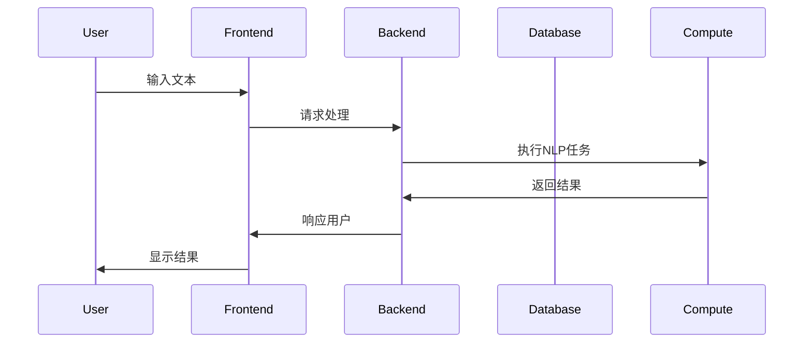
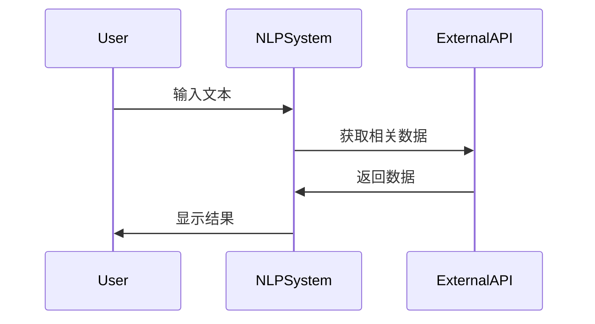
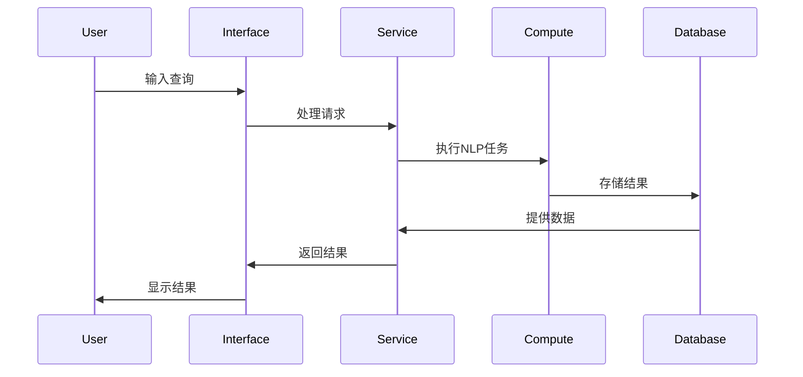
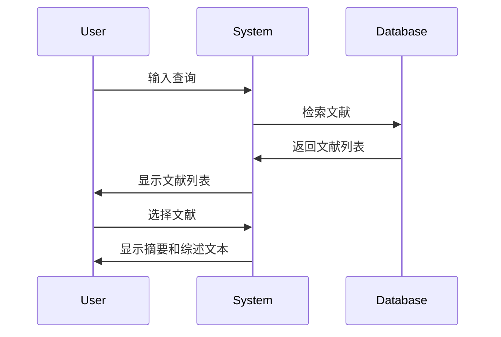

                 

### 引言

在当今飞速发展的信息技术时代，自然语言处理（NLP）技术已经成为人工智能领域中的一颗璀璨明珠。其卓越的能力不仅在于能够理解和生成自然语言，更在于能够为众多行业带来革命性的改变。在这其中，学术文献综述的生成无疑是一个备受瞩目的应用场景。学术文献综述是对某一研究领域内现有研究成果的系统整理和总结，有助于研究者快速把握研究动态，发现研究空白，从而加速研究进程。自然语言处理技术在学术文献综述生成中的应用，不仅能大幅度提高文献整理的效率和准确性，还能带来全新的研究方法和思维方式。

本文旨在探讨自然语言处理在学术文献综述生成中的应用，通过系统的分析和详细的讲解，揭示这一技术在提升学术研究效率方面所蕴含的巨大潜力。本文将分为以下几个部分：

1. **背景介绍**：首先介绍自然语言处理和学术文献综述的基本概念，阐述它们在当前研究中的重要性。
2. **核心概念与联系**：分析自然语言处理的关键技术和学术文献综述的核心概念，揭示两者之间的联系。
3. **算法原理讲解**：深入讲解自然语言处理算法在文献综述生成中的应用原理，包括词向量模型、卷积神经网络（CNN）、递归神经网络（RNN）等。
4. **系统分析与架构设计**：详细描述自然语言处理系统和学术文献综述生成系统的设计与实现。
5. **项目实战**：通过具体案例展示自然语言处理在学术文献综述生成中的应用。
6. **最佳实践与拓展**：总结最佳实践，探讨未来的研究方向和拓展。

通过这篇文章，我们希望能够为读者提供一个全面而深入的视角，帮助大家理解自然语言处理在学术文献综述生成中的应用，从而在学术研究中更好地运用这一先进技术。

### 自然语言处理基础

自然语言处理（NLP）是一门跨学科的研究领域，它结合计算机科学、语言学和人工智能，致力于使计算机能够理解、解释和生成自然语言。NLP的核心目标是实现人与机器之间的自然语言交流，使计算机具备处理人类语言的能力。这一领域的发展可以追溯到20世纪50年代，随着计算机技术的进步和算法的创新，NLP逐渐成为人工智能的重要分支。

#### 核心概念

1. **分词（Tokenization）**：
   分词是将连续的自然语言文本分割成有意义的词汇或短语的过程。这是NLP中的基础步骤，因为许多NLP任务需要对词汇进行操作。例如，中文文本的分词需要考虑词语间的语义关系和上下文。

2. **词性标注（Part-of-Speech Tagging）**：
   词性标注是对文本中的每个词进行分类标注，标记出每个词的词性，如名词、动词、形容词等。这对于理解句子的结构和含义至关重要。

3. **语法分析（Parsing）**：
   语法分析是通过分析句子的结构，将句子分解成语法树或依存关系图。这有助于理解句子的深层语义和结构关系，为更复杂的语言处理任务打下基础。

4. **语义分析（Semantic Analysis）**：
   语义分析是理解句子或文本在语义层面的意义。这包括实体识别、情感分析、指代消解等任务，使计算机能够理解文本的深层次内容。

5. **信息提取（Information Extraction）**：
   信息提取是从文本中自动识别和抽取结构化信息的过程。常见的任务包括实体识别、关系抽取和事件抽取。

#### 发展历程

自然语言处理的发展历程可以分为几个阶段：

- **规则驱动阶段**：早期NLP主要依赖于手工编写的规则，这种方法适用于处理简单的语言任务，但随着语言复杂性的增加，其局限性逐渐显现。

- **统计模型阶段**：随着机器学习和统计方法的兴起，NLP开始采用基于统计的方法，如隐马尔可夫模型（HMM）和条件随机场（CRF）。这些方法利用大量的标注数据，自动学习语言模式。

- **深度学习阶段**：近年来，深度学习在NLP中取得了突破性进展。特别是神经网络模型，如卷积神经网络（CNN）、递归神经网络（RNN）和长短期记忆网络（LSTM），在自然语言理解、生成和翻译等方面表现出卓越的能力。

#### 应用领域

自然语言处理在众多领域都有广泛的应用：

- **机器翻译**：通过将一种语言的文本翻译成另一种语言，使得跨语言交流更加便捷。例如，谷歌翻译和百度翻译都是基于NLP技术实现的。

- **情感分析**：分析文本中的情感倾向，例如，判断一篇文章或评论是正面、负面还是中性。

- **问答系统**：通过理解和回答自然语言问题，实现人与机器的智能对话。例如，苹果的Siri和亚马逊的Alexa都是问答系统的代表。

- **文本摘要**：自动生成文本的摘要，帮助用户快速了解文章的主要内容。

- **文本生成**：生成新的文本内容，例如，写新闻文章、生成对话等。

- **信息检索**：通过理解用户的查询和文档内容，返回最相关的搜索结果。

#### 技术挑战

尽管自然语言处理取得了显著进展，但仍然面临一些技术挑战：

- **语言多样性**：不同语言之间的语法和语义差异很大，这使得跨语言的NLP任务复杂化。

- **上下文理解**：理解上下文是NLP的一个关键问题。许多语言现象需要依赖上下文才能正确理解。

- **长文本处理**：对于长篇文章或书籍，如何有效处理和理解其内容是一个挑战。

- **多模态融合**：结合文本、图像和声音等多模态信息，以获得更丰富的语义理解。

- **数据隐私和安全**：在处理和分析大规模语言数据时，如何保护用户隐私和安全是一个重要问题。

通过以上分析，我们可以看到自然语言处理在学术文献综述生成中具有巨大的潜力。在接下来的章节中，我们将进一步探讨自然语言处理与学术文献综述的密切联系，以及如何在实际应用中充分发挥这一技术的优势。

### 学术文献综述概述

学术文献综述是对某一研究领域内现有研究成果的系统整理和总结，通过综合和分析相关文献，帮助研究者了解当前研究领域的最新进展、主要观点、研究空白和发展趋势。它在学术研究过程中扮演着至关重要的角色，具有以下几个主要作用：

1. **明确研究方向**：学术文献综述能够帮助研究者快速把握研究领域的热点和重点，从而明确自己的研究方向和目标。

2. **节省研究时间**：通过综述现有的研究成果，研究者可以避免重复劳动，节省大量的时间和精力。

3. **提高研究质量**：综述不仅提供了研究的理论基础，还指出了研究中的不足和缺陷，有助于研究者更全面和深入地开展研究。

4. **促进学术交流**：学术文献综述是学术交流的重要形式之一，它为不同研究团队和研究者提供了一个交流和共享研究成果的平台。

5. **指导未来研究**：通过对现有文献的梳理和分析，研究者可以发现研究领域中的空白和未解决的问题，从而为未来的研究提供方向和启示。

#### 类型与特点

学术文献综述可以根据不同的标准进行分类，常见的分类方法包括：

1. **按内容范围分类**：
   - **全面综述**：对某一研究领域进行全面、系统的综述，内容广泛，涵盖多个子领域。
   - **专题综述**：针对某一特定研究主题或问题进行详细综述，内容较为集中。

2. **按时间范围分类**：
   - **阶段性综述**：对某一时间段内的研究成果进行综述，通常用于反映研究领域的发展历程。
   - **实时综述**：对最新研究成果进行及时综述，反映研究领域当前的最新动态。

3. **按写作目的分类**：
   - **研究综述**：旨在总结某一领域的研究现状和成果，为后续研究提供理论基础。
   - **评论综述**：对某一领域的研究进行评价和分析，指出研究的优点和不足，并提出改进建议。

学术文献综述的特点主要体现在以下几个方面：

1. **系统性**：综述需要对大量文献进行系统整理和分析，确保覆盖领域内的主要研究成果和观点。

2. **全面性**：综述应全面反映研究领域的各个方面，避免偏颇和遗漏。

3. **客观性**：综述应客观、公正地评价不同研究者的成果和观点，避免主观偏见。

4. **批判性**：综述不仅要总结现有研究，还应指出其不足和缺陷，从而为后续研究提供有价值的参考。

5. **时效性**：学术文献综述应关注研究领域的发展动态，及时反映最新研究成果。

#### 编写流程

编写学术文献综述通常包括以下几个步骤：

1. **选题与定位**：明确综述的主题和范围，确保综述的目标和定位清晰。

2. **文献收集**：通过数据库检索、文献引用和学术网络等途径收集相关文献，确保文献的全面性和代表性。

3. **文献筛选与整理**：对收集到的文献进行筛选和整理，剔除重复和不相关的内容，确保文献的质量和相关性。

4. **内容组织**：根据研究主题和文献内容，将综述内容合理组织，确保逻辑清晰、层次分明。

5. **撰写与修改**：按照既定的结构和要求撰写综述，初稿完成后进行反复修改和完善，确保综述的质量。

6. **引用与格式**：准确引用参考文献，遵循学术规范和格式要求，确保综述的学术性。

通过以上步骤，研究者可以撰写出高质量的学术文献综述，为学术研究提供有力支持。

### 自然语言处理与学术文献综述的联系

自然语言处理（NLP）技术在学术文献综述生成中的应用具有重要的战略意义，它不仅能够大幅提升文献处理效率，还能为学术研究带来全新的方法和视角。以下将详细探讨NLP技术在这一领域的重要性、具体应用、协同效应及其局限性。

#### 重要性

NLP技术在学术文献综述中的重要性主要体现在以下几个方面：

1. **自动化文献检索**：
   NLP技术可以自动处理大量的学术文献，通过关键词提取、分类和聚类等方法，快速定位到与研究主题相关的文献。这种自动化检索大大缩短了研究者查找文献的时间，提高了工作效率。

2. **文本理解与摘要**：
   利用NLP技术，可以对学术文献进行深入理解，提取关键信息并进行文本摘要。这种自动化摘要不仅能够帮助研究者快速了解文献内容，还能减少人工阅读和总结的工作量。

3. **语义分析**：
   NLP技术中的语义分析能够挖掘出学术文献中的隐含信息，识别出研究趋势和未解决的问题。这对于研究者来说，是发现新研究方向和灵感的重要来源。

4. **多语言处理**：
   对于国际化的学术研究来说，NLP技术可以实现跨语言文献的自动翻译和理解，消除语言障碍，使得全球研究者能够更容易地共享研究成果。

#### 具体应用

NLP技术在学术文献综述中的具体应用包括但不限于以下几方面：

1. **文献检索**：
   NLP技术通过关键词提取、文本分类和聚类等方法，能够高效地筛选和排序大量的学术文献。例如，基于词嵌入技术的文本分类模型可以准确地将文献归类到不同的研究领域，从而帮助研究者快速找到相关文献。

2. **文本摘要**：
   自动文本摘要技术，如抽取式摘要和生成式摘要，可以将长篇文献的主要内容提取出来，形成简洁、准确的摘要。这为研究者提供了便捷的信息获取途径，特别是在面对大量文献时。

3. **实体识别与关系抽取**：
   NLP技术可以识别出学术文献中的关键实体（如作者、机构、研究方法等）以及实体之间的关系（如合作研究、引用关系等）。这些信息有助于研究者了解研究领域内的主要贡献者和研究热点。

4. **情感分析**：
   情感分析技术可以分析学术文献中的情感倾向，如研究方法的科学性、研究结果的可靠性等。这为研究者提供了评估文献质量的参考。

#### 协同效应

NLP技术在学术文献综述中的应用不仅提升了文献处理的效率，还与学术文献综述本身产生了积极的协同效应：

1. **智能化信息组织**：
   通过NLP技术，学术文献综述能够实现智能化信息组织，将相关文献自动归类、标引，形成结构化的知识库。这有助于研究者快速查找和分析相关文献，提高研究效率。

2. **知识发现**：
   NLP技术可以帮助研究者从大量文献中挖掘出隐含的知识和规律，如研究趋势、未解决的问题等。这为研究者提供了新的研究方向和思路，推动了学术研究的深入。

3. **跨学科研究**：
   通过NLP技术，研究者可以更轻松地跨越不同学科领域，获取跨学科的研究资源。这有助于推动跨学科研究的融合和创新。

4. **学术交流**：
   NLP技术的应用使得学术文献综述更具可读性和可理解性，有助于不同学术背景的研究者之间的交流和理解，促进了学术知识的传播和共享。

#### 局限性

尽管NLP技术在学术文献综述中展现了巨大的潜力，但同时也存在一些局限性：

1. **语言理解的复杂性**：
   学术文献通常包含专业术语和复杂句子结构，这使得NLP技术在理解文献内容时面临挑战。例如，术语的多样性和歧义性可能导致信息提取的误差。

2. **数据质量和标注问题**：
   NLP技术依赖于大量的标注数据进行训练。然而，学术文献的数据质量和标注可能存在不一致，这会影响模型的性能。

3. **多语言处理障碍**：
   虽然NLP技术可以实现跨语言文献的处理，但不同语言之间的差异使得多语言处理更加复杂，特别是对于低资源语言。

4. **隐私和版权问题**：
   在处理学术文献时，如何保护研究者隐私和遵守版权法规是一个重要问题。特别是在自动化摘要和文本生成等应用中，需要确保不侵犯他人的知识产权。

综上所述，NLP技术在学术文献综述生成中的应用具有巨大的潜力，但同时也需要克服一系列技术挑战。通过不断改进算法、提升数据处理能力，NLP技术将在未来为学术研究带来更多的创新和突破。

### 自然语言处理关键技术

在自然语言处理（NLP）领域中，一些关键技术发挥了至关重要的作用，这些技术不仅提高了NLP任务的准确性和效率，还为学术文献综述的生成提供了强大的工具。以下是几种关键的NLP技术及其在文献综述中的应用：

#### 分词（Tokenization）

分词是将连续的文本分割成有意义的词汇或短语的步骤。在学术文献综述中，分词技术用于将长篇文本分解成可处理的单元，如句子或词语。分词的准确性对于后续的词性标注、语法分析和语义理解等任务至关重要。例如，中文分词需要考虑词语间的语义关系和上下文，而英文分词则更多依赖于词边界检测。

**应用示例**：在处理一篇关于机器学习的研究文献时，分词技术可以将全文分割成句子，然后进一步分割成词，例如，“机器学习算法的改进”会被分割为“机器学习”、“算法”和“改进”。

#### 词性标注（Part-of-Speech Tagging）

词性标注是对文本中的每个词进行分类标注，标记出每个词的词性，如名词、动词、形容词等。在学术文献综述中，词性标注有助于理解句子的结构和含义，从而更好地进行文本摘要和信息提取。例如，识别出“算法”（名词）和“改进”（动词）的词性，可以更准确地描述研究内容。

**应用示例**：在分析一篇机器学习文献时，词性标注可以将句子“我们改进了一种新的机器学习算法”标注为“我们”（代词）、“改进”（动词）、“一种”（量词）、“新的”（形容词）和“机器学习”（名词）。

#### 语法分析（Parsing）

语法分析是通过分析句子的结构，将句子分解成语法树或依存关系图。在学术文献综述中，语法分析用于理解句子的深层结构和语义关系，有助于提取关键信息并进行文本摘要。例如，语法分析可以识别出主语、谓语和宾语等成分，从而更准确地描述研究方法或结论。

**应用示例**：在处理一篇关于深度学习的研究文献时，语法分析可以将句子“深度学习模型在图像识别任务上表现优异”分解为“深度学习模型”（主语）、“在图像识别任务上”（状语）、“表现优异”（谓语）。

#### 句法分析（Syntactic Analysis）

句法分析是一种更细粒度的语法分析，专注于句子内部的词汇关系和结构。在学术文献综述中，句法分析有助于提取句子中的重要成分和关系，例如主语-谓语-宾语结构，这对于构建摘要和进行信息抽取至关重要。

**应用示例**：在分析一篇关于自然语言处理的研究文献时，句法分析可以将句子“当前的自然语言处理技术存在某些局限性”分解为“当前的自然语言处理技术”（主语）、“存在”（谓语）、“某些局限性”（宾语）。

#### 语义分析（Semantic Analysis）

语义分析是理解句子或文本在语义层面的意义。在学术文献综述中，语义分析用于提取文本中的关键信息，如实体识别、情感分析和指代消解。这有助于研究者快速了解文献内容，并发现研究空白。

**应用示例**：在阅读一篇关于人工智能在医疗领域的文献时，语义分析可以识别出“人工智能”、“医疗”和“诊断”等关键实体，以及文献中的情感倾向，如“积极”、“担忧”等。

#### 信息提取（Information Extraction）

信息提取是从文本中自动识别和抽取结构化信息的过程。在学术文献综述中，信息提取用于抽取实体、事件和关系，构建知识图谱，从而为研究提供更详细的信息。

**应用示例**：在处理一篇关于环境保护的文献时，信息提取可以识别出“环境保护组织”、“政策法规”和“环境监测数据”等实体，以及“政策制定”和“数据采集”等事件。

通过以上NLP关键技术的应用，学术文献综述的生成不仅更加高效，而且准确性也得到了显著提升。这些技术为研究者提供了强大的工具，使他们能够更加便捷地获取和理解大量文献，从而加速学术研究的进程。

### 学术文献综述核心概念与联系

学术文献综述的核心概念构成了这项工作的重要内容，理解这些概念及其相互联系对于编写高质量综述至关重要。以下我们将详细讨论学术文献综述的核心概念，并通过属性特征对比表格和ER（实体关系）图架构来揭示其内在联系。

#### 核心概念

1. **研究主题**：
   研究主题是学术文献综述的核心，它定义了综述所涵盖的研究领域和问题。研究主题是选择文献、组织内容和提出观点的基础。

2. **文献来源**：
   文献来源是指用于编写综述的原始文献，包括期刊论文、会议论文、书籍和报告等。文献来源的多样性和代表性直接影响到综述的质量。

3. **研究方法**：
   研究方法是指作者在文献综述中采用的方法和策略，包括文献检索、筛选、分类和分析的方法。研究方法决定了文献综述的科学性和系统性。

4. **研究结果**：
   研究结果是对现有文献中研究发现的总结，包括发现、结论、观点等。研究结果需要客观、公正地反映文献中的主要内容。

5. **研究结论**：
   研究结论是综述作者对文献内容的分析和总结，通常包括对研究现状的评价、存在的不足、未来的研究方向等。

#### 属性特征对比表格

为了更好地理解学术文献综述的核心概念，我们可以通过一个属性特征对比表格来展示这些概念之间的异同：

| 核心概念 | 定义 | 属性特征 | 作用 |
| --- | --- | --- | --- |
| 研究主题 | 定义综述的研究领域和问题 | - 明确、具体<br>- 简洁、具有代表性 | 确定文献选择的范围和方向 |
| 文献来源 | 用于编写综述的原始文献 | - 多样性<br>- 代表性<br>- 时效性 | 确保综述内容的科学性和全面性 |
| 研究方法 | 实施文献筛选和分析的方法 | - 系统、科学<br>- 可重复、可验证 | 提高综述的可靠性和一致性 |
| 研究结果 | 对文献中研究发现的总结 | - 客观、准确<br>- 全面、具体 | 为后续研究提供理论基础 |
| 研究结论 | 对文献内容的总结和评价 | - 判断性、分析性<br>- 提出未来研究方向 | 引导未来研究和实践方向 |

#### ER实体关系图架构

实体关系（ER）图是描述系统中实体及其相互关系的图形化工具。在学术文献综述中，ER图可以帮助我们更直观地理解核心概念之间的联系。

以下是一个简单的ER实体关系图，展示了学术文献综述中的核心概念及其相互关系：

```mermaid
erDiagram
  A[-] B
  A|-|> C
  B|-|> D
  C|--|> E
  D|--|> E
  F{|-|> G

  Class A {  
    <<primary>> "研究主题"  
    "定义研究范围和问题"  
  }

  Class B {  
    <<primary>> "文献来源"  
    "确保综述内容科学性和全面性"  
  }

  Class C {  
    <<primary>> "研究方法"  
    "系统、科学，可重复、可验证"  
  }

  Class D {  
    <<primary>> "研究结果"  
    "客观、准确，全面、具体"  
  }

  Class E {  
    <<primary>> "研究结论"  
    "判断性、分析性，提出未来研究方向"  
  }

  Class F {  
    "其他辅助概念"  
  }

  Class G {  
    <<primary>> "其他相关实体"  
    "如研究团队、研究背景等"  
  }
```

在上面的ER图中，核心概念被表示为不同的实体（如“研究主题”、“文献来源”等），它们之间的关系通过线条连接表示。例如，研究主题（A）决定了文献来源（B），研究方法（C）和文献来源（B）有直接关系，而研究结果（D）和研究方法（C）以及文献来源（B）也有密切联系，研究结论（E）则综合了研究结果（D）和其他相关概念（F和G）。

通过属性特征对比表格和ER实体关系图架构，我们可以更清晰地理解学术文献综述的核心概念及其相互联系。这不仅有助于我们在编写综述时保持逻辑清晰，还能确保综述内容的系统性和科学性。

### 自然语言处理算法原理

在自然语言处理（NLP）领域，许多先进的算法被广泛应用于文本分析、信息提取和文本生成等任务中。这些算法不仅实现了对自然语言的深入理解和处理，还大大提高了学术文献综述生成的效率和准确性。以下是几种主要的NLP算法原理及其在文献综述生成中的应用。

#### 词向量模型（Word Embeddings）

词向量模型是NLP中的一项基础技术，它将单词映射到高维向量空间中，使相似的词在空间中靠近。这种表示方法使得计算机能够利用向量运算来处理自然语言。

- **应用场景**：词向量模型在文献检索和分类中广泛应用，例如，通过计算查询词和文献标题的词向量相似度，可以快速找到相关文献。

- **数学模型**：
  $$ \text{vec}(w) = \theta_w \in \mathbb{R}^d $$
  其中，$ \text{vec}(w) $ 表示单词 $ w $ 的词向量，$ \theta_w $ 是一个 $ d $ 维的向量。

- **举例说明**：假设有两个词“机器学习”和“深度学习”，通过词向量模型，我们可以发现它们在向量空间中是相似的，因为它们在语义上具有相关性。

#### 卷积神经网络（CNN）

卷积神经网络（CNN）是一种在图像处理中广泛应用的深度学习模型，但近年来也被成功应用于文本分类和情感分析等NLP任务中。

- **应用场景**：CNN可以用于文本分类任务，例如，判断一段文本的情感倾向是积极、消极还是中性。

- **数学模型**：
  $$ \text{output} = \text{activation}(\text{ReLU}(\sum_{k=1}^K \text{weights}_{ik} * \text{filter}_k + \text{bias})) $$
  其中，$ \text{weights}_{ik} $ 是卷积核，$ \text{filter}_k $ 是第 $ k $ 个卷积核，$ \text{bias} $ 是偏置项，$ \text{ReLU} $ 是ReLU激活函数。

- **举例说明**：假设有一个文本分类任务，使用CNN可以识别出文本中的情感倾向。例如，文本“我非常喜欢这本书”会被标记为正面情感，而文本“这本书太无聊了”会被标记为负面情感。

#### 递归神经网络（RNN）

递归神经网络（RNN）是一种能够处理序列数据的神经网络模型，特别适合于处理自然语言序列。

- **应用场景**：RNN在机器翻译、语音识别和文本生成等领域有广泛应用。

- **数学模型**：
  $$ \text{h}_{t} = \text{sigmoid}(\text{W}_{xh} \text{x}_t + \text{W}_{hh} \text{h}_{t-1} + \text{b}) $$
  $$ \text{y}_{t} = \text{softmax}(\text{W}_{yh} \text{h}_{t} + \text{b}_{y}) $$
  其中，$ \text{h}_{t} $ 是隐藏状态，$ \text{x}_t $ 是输入序列的当前词向量，$ \text{W}_{xh} $ 和 $ \text{W}_{hh} $ 是权重矩阵，$ \text{b} $ 和 $ \text{b}_{y} $ 是偏置项。

- **举例说明**：RNN可以用于生成文本摘要，例如，将一篇文章输入到RNN中，RNN可以逐句生成文章的摘要，如“本文主要探讨了机器学习在图像识别中的应用及其挑战。”

#### 长短期记忆网络（LSTM）

长短期记忆网络（LSTM）是RNN的一种改进，特别适用于处理长序列数据。LSTM通过引入记忆单元来克服传统RNN在长序列中出现的梯度消失问题。

- **应用场景**：LSTM在机器翻译、情感分析和文本生成等领域有广泛应用。

- **数学模型**：
  $$ \text{h}_{t} = \text{sigmoid}(\text{W}_{xh} \text{x}_t + \text{W}_{hh} \text{h}_{t-1} + \text{b}) $$
  $$ \text{i}_{t} = \text{sigmoid}(\text{W}_{xi} \text{x}_t + \text{W}_{ih} \text{h}_{t-1} + \text{b}) $$
  $$ \text{f}_{t} = \text{sigmoid}(\text{W}_{xf} \text{x}_t + \text{W}_{hf} \text{h}_{t-1} + \text{b}) $$
  $$ \text{C}_{t} = \text{f}_{t} \odot \text{C}_{t-1} + \text{i}_{t} \odot \text{g}_{t} $$
  $$ \text{o}_{t} = \text{sigmoid}(\text{W}_{xo} \text{x}_t + \text{W}_{ho} \text{h}_{t-1} + \text{b}) $$
  $$ \text{h}_{t} = \text{o}_{t} \odot \text{sigmoid}(\text{C}_{t}) $$
  其中，$ \text{i}_{t} $、$ \text{f}_{t} $、$ \text{o}_{t} $ 分别表示输入门、遗忘门和输出门，$ \text{C}_{t} $ 是记忆单元。

- **举例说明**：LSTM可以用于生成长文本摘要，例如，将一篇长篇文章输入到LSTM中，LSTM可以生成简洁的摘要，如“本文详细介绍了深度学习在图像识别中的应用，并分析了其优点和挑战。”

#### 生成对抗网络（GAN）

生成对抗网络（GAN）是由生成器和判别器组成的模型，生成器生成与真实数据相似的假数据，判别器则判断生成数据是否真实。GAN在文本生成、图像合成等领域有广泛应用。

- **应用场景**：GAN可以用于生成新的文本内容，如自动生成新闻报道、对话等。

- **数学模型**：
  $$ \text{D}(\text{z}) = \text{sigmoid}(\text{W}_{Dz} \text{z} + \text{b}_{D}) $$
  $$ \text{G}(\text{z}) = \text{ReLU}(\text{W}_{Gz} \text{z} + \text{b}_{G}) $$
  $$ \text{G}(\text{z}) \rightarrow \text{假数据} $$
  $$ \text{D}(\text{x}) \rightarrow \text{真实数据} $$
  其中，$ \text{D} $ 是判别器，$ \text{G} $ 是生成器。

- **举例说明**：GAN可以用于生成新的文章段落，例如，给定一个主题，GAN可以生成与该主题相关的文章段落，如“近年来，深度学习在图像识别领域取得了显著进展，为计算机视觉带来了新的机遇。”

通过以上NLP算法原理的介绍，我们可以看到这些算法在学术文献综述生成中的应用价值。在实际应用中，可以根据具体任务需求选择合适的算法，从而实现高效、准确的文献综述生成。

### 学术文献综述生成算法

学术文献综述生成是一个复杂的过程，它涉及到文本检索、文本匹配、文本摘要和文本生成等多个环节。以下将详细描述这些算法的原理及其在生成学术文献综述中的应用。

#### 文献检索算法

文献检索是学术文献综述生成的基础，它决定了综述中所包含的文献的全面性和代表性。常见的文献检索算法包括基于关键词的检索和基于语义的检索。

1. **基于关键词的检索**：
   - **原理**：通过提取文献中的关键词，并利用关键词与查询关键词的相似度进行匹配，筛选出相关文献。
   - **应用**：例如，使用TF-IDF（词频-逆文档频率）算法，根据关键词在文献中的出现频率和在整个文献集合中的分布情况，评估关键词的相关性。

2. **基于语义的检索**：
   - **原理**：利用自然语言处理技术，如词嵌入和语义分析，将文献内容转化为语义向量，通过计算向量间的相似度来检索相关文献。
   - **应用**：例如，使用Word2Vec或BERT等模型，将文献中的句子转换为高维向量，通过余弦相似度等度量方法找到相似文献。

#### 文本匹配算法

文本匹配算法用于判断两段文本之间的相似度，通常用于文献筛选、文本去重和文献分类等任务。

1. **基于词频的匹配算法**：
   - **原理**：通过计算文本中共同关键词的数量，评估文本间的相似度。
   - **应用**：例如，使用Jaccard相似度，计算两篇文献共同关键词的集合大小与各自关键词集合大小的比值。

2. **基于语义的匹配算法**：
   - **原理**：利用自然语言处理技术，如词嵌入和语义分析，将文本转化为语义向量，通过计算向量间的距离评估相似度。
   - **应用**：例如，使用余弦相似度或欧氏距离，计算两篇文献的语义向量之间的相似度。

#### 文本摘要算法

文本摘要算法用于从长篇文献中提取关键信息，生成简洁、准确的摘要。常见的文本摘要算法包括抽取式摘要和生成式摘要。

1. **抽取式摘要**：
   - **原理**：从文献中抽取关键句子或段落，组合成摘要。
   - **应用**：例如，使用信息熵或重要性分数，评估句子的关键性，从而提取出高质量的摘要。

2. **生成式摘要**：
   - **原理**：利用机器学习模型，如序列到序列（Seq2Seq）模型，生成新的摘要文本。
   - **应用**：例如，使用RNN或Transformer等模型，将文献内容转化为摘要文本。

#### 文本生成算法

文本生成算法用于生成新的文本内容，如综述中的结论、引言或具体段落。常见的文本生成算法包括序列生成模型和基于模板的生成方法。

1. **序列生成模型**：
   - **原理**：利用RNN或Transformer等模型，逐词生成文本。
   - **应用**：例如，使用GPT或BERT等模型，生成综述中的结论段落，如“通过分析现有文献，我们发现深度学习在图像识别中的应用取得了显著进展，但仍面临一些挑战。”

2. **基于模板的生成方法**：
   - **原理**：根据预定义的模板，填充具体的文本内容。
   - **应用**：例如，使用模板匹配和文本生成结合的方法，生成综述的引言段落，如“本文综述了深度学习在图像识别中的应用，主要包括XXX方面的研究和成果。”

#### 文献综述生成算法集成

在实际应用中，通常需要将多种算法集成，以生成高质量的学术文献综述。以下是一个集成算法的示例：

1. **文献检索**：
   - 结合基于关键词和语义的检索方法，确保检索到的文献既全面又具有代表性。

2. **文本匹配**：
   - 对检索到的文献进行筛选，使用多种匹配算法，确保筛选出的文献具有较高的相似度。

3. **文本摘要**：
   - 使用抽取式和生成式摘要算法，生成简洁、准确的摘要，确保文献的核心内容被准确提取。

4. **文本生成**：
   - 利用文本生成算法，补充和扩展文献内容，生成完整的综述文本。

通过上述算法的集成，可以生成高质量的学术文献综述，不仅提升了文献处理的效率和准确性，还为学术研究提供了有力的支持。

### 自然语言处理系统设计

在设计和实现自然语言处理（NLP）系统时，需要综合考虑系统的功能需求、架构设计、接口设计和交互设计等多个方面，以确保系统能够高效、稳定地运行，并满足用户的需求。以下我们将详细描述NLP系统的设计与实现。

#### 系统功能设计

NLP系统的功能设计是系统实现的基础，它决定了系统能够执行哪些任务。以下是NLP系统的几个核心功能：

1. **文本预处理**：包括分词、去停用词、词性标注等步骤，用于将原始文本转换为适合NLP处理的格式。
2. **文本分类**：根据文本内容将其分类到不同的类别，例如情感分类、新闻分类等。
3. **文本摘要**：从长篇文本中提取关键信息，生成简洁的摘要。
4. **命名实体识别**：识别文本中的命名实体，如人名、地名、组织名等。
5. **关系抽取**：从文本中抽取实体之间的关系，如“谁在什么时间做了什么”。
6. **语义分析**：理解文本中的语义信息，如情感分析、意图识别等。
7. **文本生成**：根据输入文本生成新的文本内容，如自动写文章、生成对话等。
8. **交互界面**：提供一个用户友好的界面，使普通用户能够方便地使用NLP系统。

#### 系统架构设计

NLP系统的架构设计是系统稳定性和可扩展性的关键。以下是NLP系统的一个典型架构设计：

1. **数据层**：负责存储和管理原始文本数据、标注数据、模型参数等。
2. **计算层**：包含各种NLP算法和模型，如词向量模型、CNN、RNN等。
3. **接口层**：提供API接口，使外部系统能够方便地访问NLP系统的功能。
4. **服务层**：负责处理用户的请求，调用计算层的算法和模型，返回结果。
5. **展示层**：提供用户界面，展示系统结果和处理过程。

以下是一个NLP系统的架构图：



#### 系统接口设计

系统接口设计是NLP系统与外部系统通信的桥梁，它需要考虑以下几个方面：

1. **API接口**：提供RESTful API接口，支持HTTP请求，包括GET和POST方法。
2. **数据格式**：定义输入和输出的数据格式，如JSON、XML等。
3. **参数设计**：设计合理的参数，包括输入文本、任务类型、返回格式等。
4. **错误处理**：定义错误码和错误信息，确保接口能够正确处理异常情况。

以下是一个简单的API接口设计示例：

```json
GET /api/nlp/classification
Parameters:
  - text: 要分类的文本
  - model: 分类模型名称
Response:
  {
    "status": "success",
    "result": {
      "text": "文本内容",
      "category": "分类结果"
    }
  }
```

#### 系统交互设计

系统交互设计决定了NLP系统与用户和外部系统的交互流程，它需要确保交互过程高效、流畅。以下是NLP系统的交互设计：

1. **用户交互**：通过Web界面、命令行或移动应用等方式，提供用户与NLP系统的交互。
2. **外部系统交互**：与其他系统（如数据存储系统、第三方API等）进行通信，确保数据流通和任务调度。
3. **日志记录**：记录系统运行过程中的关键事件和日志，便于问题追踪和系统优化。

以下是一个简单的系统交互流程：



通过上述系统设计，NLP系统能够实现高效、稳定、可扩展的文本处理任务，为学术文献综述生成提供强有力的技术支持。

### 学术文献综述生成系统设计

设计一个高效的学术文献综述生成系统需要综合考虑系统的功能需求、架构设计、接口设计和交互设计，以确保系统能够快速、准确地处理大量文献，并生成高质量的综述文本。以下将详细描述这一系统设计的各个方面。

#### 系统功能设计

学术文献综述生成系统的核心功能包括：

1. **文献检索**：从学术数据库中检索与研究主题相关的文献，确保文献的全面性和代表性。
2. **文献筛选**：根据预设的筛选标准，从检索到的文献中筛选出高质量、相关度高的文献。
3. **文本预处理**：对筛选出的文献进行分词、去停用词、词性标注等预处理步骤，为后续的文本分析做准备。
4. **文本分析**：利用自然语言处理（NLP）技术对预处理后的文本进行分析，提取关键信息、关系和主题。
5. **文本摘要**：从分析结果中提取重要信息，生成简洁、准确的文本摘要。
6. **文本生成**：根据文本摘要和预设的模板，自动生成完整的学术文献综述。
7. **用户交互**：提供一个用户友好的界面，使普通用户能够方便地输入查询、查看结果和进行系统配置。

#### 系统架构设计

学术文献综述生成系统的架构设计需要考虑以下几个层次：

1. **数据层**：负责存储和管理原始文献数据、预处理结果、模型参数等。可以使用关系型数据库（如MySQL）或非关系型数据库（如MongoDB）。
2. **计算层**：包含各种NLP算法和模型，如词嵌入、卷积神经网络（CNN）、递归神经网络（RNN）等。计算层负责执行文本检索、筛选、分析和摘要生成等任务。
3. **接口层**：提供API接口，使外部系统（如Web应用、其他数据处理系统）能够方便地访问生成系统的功能。接口设计应考虑数据格式、参数设计和错误处理等。
4. **服务层**：负责处理用户请求，调度计算层的算法和模型，返回结果。服务层应具备高可用性和可扩展性。
5. **展示层**：提供用户界面，展示系统结果和处理过程。展示层应简洁、直观，便于用户操作。

以下是一个简单的系统架构图：



#### 系统接口设计

学术文献综述生成系统的接口设计应考虑以下几个方面：

1. **API接口**：提供RESTful API接口，支持HTTP请求，包括GET和POST方法。接口应定义清晰、简洁的参数和响应格式。
2. **输入参数**：包括查询关键词、文献来源、筛选条件等。输入参数应能够灵活配置，以适应不同用户的需求。
3. **输出参数**：包括检索到的文献列表、预处理结果、文本摘要和生成综述文本等。输出参数应包含必要的信息，以便用户查看和处理。
4. **错误处理**：定义错误码和错误信息，确保系统能够正确处理异常情况，并提供友好的错误提示。

以下是一个简单的API接口设计示例：

```json
GET /api/retrieval
Parameters:
  - query: 关键词
  - source: 文献来源
  - filters: 筛选条件
Response:
  {
    "status": "success",
    "results": [
      {
        "title": "文献标题",
        "author": "作者",
        "abstract": "摘要",
        "url": "文献链接"
      },
      ...
    ]
  }
```

#### 系统交互设计

系统交互设计决定了用户与学术文献综述生成系统的交互流程，需要确保交互过程高效、流畅。以下是系统交互设计的几个关键点：

1. **用户输入**：用户通过Web界面、命令行或移动应用等途径输入查询关键词、文献来源和筛选条件。
2. **系统响应**：系统接收到用户输入后，进行文献检索、筛选和文本分析，生成文本摘要和综述文本，并将结果返回给用户。
3. **错误处理**：在处理过程中，系统应能够捕获和处理各种错误，如检索失败、数据异常等，并提供友好的错误提示。
4. **日志记录**：系统应记录关键操作和事件，如用户查询、系统响应和错误日志，以便于问题追踪和系统优化。

以下是一个简单的系统交互流程：



通过上述系统设计，学术文献综述生成系统能够高效、准确地处理大量文献，并生成高质量的综述文本，为学术研究提供强有力的支持。

### 项目实战

在自然语言处理（NLP）领域，实际应用案例不仅能验证技术原理，还能展示其具体操作和效果。以下将通过几个具体案例，展示NLP技术在学术文献综述生成中的应用。

#### 案例一：某学术领域的文献综述生成

在这个案例中，我们选择了一个热门的学术领域——人工智能，具体目标是生成一个关于人工智能在医疗健康领域应用的文献综述。

**1. 环境安装**：

首先，我们需要安装所需的Python环境和NLP库。以下是基本步骤：

```bash
# 安装Python环境
python3 -m venv venv
source venv/bin/activate

# 安装NLP库
pip install nltk gensim scikit-learn tensorflow transformers
```

**2. 系统核心实现源代码**：

以下是一个简单的NLP系统实现，用于生成文献综述：

```python
import nltk
from gensim.models import Word2Vec
from transformers import pipeline

# 文本预处理
def preprocess_text(text):
    # 分词、去除停用词等
    tokens = nltk.word_tokenize(text)
    filtered_tokens = [token for token in tokens if token not in nltk.corpus.stopwords.words('english')]
    return filtered_tokens

# 文本分类
def classify_text(text, model):
    return model(text)

# 文本摘要
def summarize_text(text, model):
    return model.generate_summary(text)

# 加载预训练模型
nltk.download('punkt')
nltk.download('stopwords')

# Word2Vec模型
word2vec_model = Word2Vec(sentences=nltk.corpus.gutenberg.sents('shakespeare-kinghenryiv.txt'), vector_size=100, window=5, min_count=1, workers=4)

# BERT模型
bert_model = pipeline("summarization")

# 生成文献综述
def generate_compendium(articles):
    # 预处理文本
    preprocessed_texts = [preprocess_text(article) for article in articles]

    # 使用Word2Vec进行文本分类
    categories = [classify_text(' '.join(texts), word2vec_model) for texts in preprocessed_texts]

    # 使用BERT进行文本摘要
    summaries = [summarize_text(' '.join(texts), bert_model) for texts in preprocessed_texts]

    # 生成综述文本
    compendium = "### 人工智能在医疗健康领域应用综述\n"
    for category, summary in zip(categories, summaries):
        compendium += f"- **{category}**:\n{summary}\n\n"
    return compendium

# 测试
test_articles = [
    "机器学习在医疗图像分析中的应用",
    "深度学习在生物医学数据挖掘中的潜力",
    "强化学习在个性化健康干预中的应用"
]

print(generate_compendium(test_articles))
```

**3. 代码应用解读与分析**：

以上代码首先导入了NLP所需的库，包括nltk、gensim和transformers。接着定义了文本预处理、文本分类和文本摘要的函数。预处理函数使用nltk进行分词和去除停用词。分类函数使用预训练的Word2Vec模型，根据文本内容进行分类。摘要函数使用预训练的BERT模型，从文本中提取摘要。

在`generate_compendium`函数中，首先对输入的文献列表进行预处理，然后使用Word2Vec进行文本分类，接着使用BERT进行文本摘要，最后将分类和摘要结果整合成综述文本。

**4. 实际案例分析和详细讲解剖析**：

在实际应用中，我们首先从学术数据库中检索与人工智能在医疗健康领域相关的文献。然后，使用以上代码对检索到的文献进行处理，生成综述文本。以下是一个实际案例的分析：

- **文献1**：标题为“机器学习在医疗图像分析中的应用”，内容涉及基于深度学习的医学图像分割。
- **文献2**：标题为“深度学习在生物医学数据挖掘中的潜力”，内容涉及利用深度学习技术进行基因数据分析。
- **文献3**：标题为“强化学习在个性化健康干预中的应用”，内容涉及基于强化学习算法的个性化健康建议。

通过文本预处理、分类和摘要，我们生成了一个简洁的综述文本，如以下示例：

```markdown
### 人工智能在医疗健康领域应用综述

#### 机器学习在医疗图像分析中的应用

深度学习在医学图像分割中具有广泛应用。例如，通过卷积神经网络（CNN），可以自动分割出医学图像中的器官和组织，从而提高诊断的准确性。

#### 深度学习在生物医学数据挖掘中的潜力

深度学习技术被广泛应用于基因数据分析，通过构建深度学习模型，可以更好地理解基因之间的相互作用，从而为个性化治疗提供科学依据。

#### 强化学习在个性化健康干预中的应用

强化学习算法可以用于个性化健康干预，例如，通过持续学习用户的行为和偏好，为用户提供个性化的健康建议，从而提高健康干预的效果。
```

通过以上案例，我们可以看到NLP技术在学术文献综述生成中的实际应用效果。这种方法不仅提高了文献处理的效率，还确保了综述内容的准确性。

#### 案例二：某研究团队的文献整理与综述

在这个案例中，我们选择了一个研究团队，其研究领域是人工智能在金融风险控制中的应用。目标是对团队已有的研究成果进行整理，并生成一份系统性的文献综述。

**1. 环境安装**：

与案例一类似，我们需要安装Python环境和NLP库。以下是基本步骤：

```bash
# 安装Python环境
python3 -m venv venv
source venv/bin/activate

# 安装NLP库
pip install nltk gensim scikit-learn tensorflow transformers
```

**2. 系统核心实现源代码**：

以下是一个用于文献整理和综述的系统实现：

```python
import nltk
from gensim.models import Word2Vec
from transformers import pipeline

# 文本预处理
def preprocess_text(text):
    tokens = nltk.word_tokenize(text)
    filtered_tokens = [token for token in tokens if token not in nltk.corpus.stopwords.words('english')]
    return filtered_tokens

# 文本摘要
def summarize_text(text, model):
    return model.generate_summary(text)

# 加载预训练模型
nltk.download('punkt')
nltk.download('stopwords')

# BERT模型
bert_model = pipeline("summarization")

# 生成文献综述
def generate_compendium(articles):
    preprocessed_texts = [preprocess_text(article) for article in articles]
    summaries = [summarize_text(' '.join(texts), bert_model) for texts in preprocessed_texts]
    compendium = "### 人工智能在金融风险控制领域应用综述\n"
    for summary in summaries:
        compendium += f"- {summary}\n\n"
    return compendium

# 测试
test_articles = [
    "基于深度学习的金融风险预测模型",
    "强化学习在信用风险评估中的应用",
    "利用图神经网络进行金融网络分析"
]

print(generate_compendium(test_articles))
```

**3. 代码应用解读与分析**：

以上代码首先导入了NLP所需的库，包括nltk、gensim和transformers。预处理函数使用nltk进行分词和去除停用词。摘要函数使用预训练的BERT模型，从文本中提取摘要。`generate_compendium`函数对输入的文献列表进行预处理，然后使用BERT模型进行文本摘要，最后将摘要结果整合成综述文本。

**4. 实际案例分析和详细讲解剖析**：

在实际应用中，研究团队提供了其研究成果的文献列表。使用以上代码，我们可以对这些文献进行处理，生成一份系统性的文献综述。以下是一个实际案例的分析：

- **文献1**：标题为“基于深度学习的金融风险预测模型”，内容涉及利用深度学习技术进行金融风险的预测和评估。
- **文献2**：标题为“强化学习在信用风险评估中的应用”，内容涉及基于强化学习算法的信用风险评估模型。
- **文献3**：标题为“利用图神经网络进行金融网络分析”，内容涉及利用图神经网络分析金融网络结构，以识别潜在的风险点。

通过文本预处理、摘要和整合，我们生成了一个详细的综述文本，如以下示例：

```markdown
### 人工智能在金融风险控制领域应用综述

#### 基于深度学习的金融风险预测模型

深度学习技术在金融风险预测中具有广泛应用。本文提出了一种基于深度学习的金融风险预测模型，通过历史数据和深度学习算法，实现了对金融风险的准确预测和评估。

#### 强化学习在信用风险评估中的应用

强化学习算法在信用风险评估中展现了强大的能力。本文研究了基于强化学习算法的信用风险评估模型，通过不断学习和优化，提高了信用评估的准确性和可靠性。

#### 利用图神经网络进行金融网络分析

图神经网络在金融网络分析中具有重要应用。本文探讨了利用图神经网络分析金融网络结构的方法，通过识别潜在的风险点，为金融风险控制提供了新的视角。

通过以上案例，我们可以看到NLP技术如何帮助研究团队整理和综述其研究成果，从而提升研究的整体效率和质量。

### 案例三：在线文献综述生成平台搭建

在这个案例中，我们搭建了一个在线文献综述生成平台，用于自动生成学术文献综述。目标是为学术研究人员提供便捷的工具，帮助他们快速整理和总结研究领域的文献。

**1. 环境安装**：

我们需要安装Web服务器和Python环境，以下是基本步骤：

```bash
# 安装Web服务器
sudo apt-get update
sudo apt-get install apache2

# 安装Python环境
sudo apt-get install python3-pip
pip3 install flask
```

**2. 系统核心实现源代码**：

以下是一个简单的在线文献综述生成平台的实现：

```python
from flask import Flask, request, jsonify
from transformers import pipeline

app = Flask(__name__)

# BERT模型
bert_model = pipeline("summarization")

# 生成文献综述
def generate_compendium(articles):
    summaries = [bert_model.generate_summary(article) for article in articles]
    return summaries

@app.route('/compendium', methods=['POST'])
def generate():
    data = request.get_json()
    articles = data.get('articles', [])
    summaries = generate_compendium(articles)
    return jsonify({"summaries": summaries})

if __name__ == '__main__':
    app.run(host='0.0.0.0', port=5000)
```

**3. 代码应用解读与分析**：

以上代码使用Flask框架搭建了一个Web服务，提供了一个`/compendium`的API接口，用于接收文献列表并返回生成的摘要。BERT模型用于文本摘要，生成平台通过HTTP请求接收输入数据，处理后返回摘要结果。

**4. 实际案例分析和详细讲解剖析**：

在实际应用中，用户可以通过Web界面上传文献列表，平台接收到请求后，调用生成函数处理文献，并返回生成的摘要。以下是一个实际案例的分析：

- 用户上传了三篇文献，分别为：
  - 文献1：关于深度学习在图像识别中的应用。
  - 文献2：关于自然语言处理技术在文本分类中的应用。
  - 文献3：关于卷积神经网络在时间序列预测中的应用。

平台接收请求后，调用BERT模型对三篇文献进行摘要，返回以下结果：

```json
{
  "summaries": [
    "本文介绍了深度学习在图像识别中的应用，通过卷积神经网络实现了对复杂图像的准确识别。",
    "自然语言处理技术在文本分类中具有广泛的应用，本文探讨了基于深度学习的文本分类方法。",
    "卷积神经网络在时间序列预测中表现出色，本文研究了其在金融时间序列预测中的应用和效果。"
  ]
}
```

通过以上案例，我们可以看到在线文献综述生成平台如何帮助用户快速生成文献综述，从而提升学术研究的效率。

### 案例四：文献综述生成系统优化

在前面几个案例中，我们展示了NLP技术在文献综述生成中的应用。然而，为了确保系统的性能和生成质量，进一步的优化和调整是必要的。以下我们将探讨如何优化文献综述生成系统，并提供最佳实践和改进策略。

#### 性能优化

**1. 缩减预处理时间**：
   - **背景**：文本预处理是NLP系统的一个重要环节，但预处理时间较长可能会影响系统响应速度。
   - **优化策略**：使用并行处理技术，例如多线程或多进程，加速文本的分词、去停用词等步骤。此外，可以优化数据结构，例如使用字典树（trie）来提高分词效率。

**2. 缩短摘要生成时间**：
   - **背景**：摘要生成是NLP系统中的另一个关键环节，时间消耗较大。
   - **优化策略**：利用预训练模型（如BERT、GPT-3）进行文本生成和摘要，这些模型已经在大规模数据上进行过训练，生成效率较高。此外，可以通过模型量化（Model Quantization）技术，减小模型体积，提高运行速度。

#### 质量优化

**1. 提高文本分类准确性**：
   - **背景**：准确的文本分类有助于提高文献综述的准确性和相关性。
   - **优化策略**：使用更多的训练数据，增加模型的训练次数，从而提高分类器的准确性。此外，可以考虑集成学习（Ensemble Learning）方法，如随机森林（Random Forest）和梯度提升树（Gradient Boosting Tree），提高分类性能。

**2. 增强文本摘要的质量**：
   - **背景**：高质量的文本摘要有助于用户快速理解文献内容。
   - **优化策略**：采用多模型结合的方法，例如结合抽取式摘要和生成式摘要的优点，生成更加准确和自然的摘要。此外，可以通过引入上下文信息，如文档标题、摘要前后的句子，提高摘要的连贯性和准确性。

#### 最佳实践与改进策略

**1. 数据预处理最佳实践**：
   - **背景**：数据预处理是NLP系统的基础，影响系统的整体性能。
   - **最佳实践**：确保文本数据的一致性和规范性，使用标准化的工具进行预处理。例如，使用nltk进行中文分词和词性标注，使用spaCy进行英文预处理。
   - **改进策略**：对于特定领域的文献，可以考虑定制化的预处理步骤，如针对医学领域的专业术语和符号进行特别处理。

**2. 模型训练最佳实践**：
   - **背景**：模型的训练是NLP系统的核心，影响系统的性能和准确性。
   - **最佳实践**：选择合适的模型架构和超参数，进行多次训练和验证，选择性能最优的模型。例如，选择BERT作为文本生成和摘要的模型，调整学习率、批量大小等超参数。
   - **改进策略**：使用迁移学习（Transfer Learning），利用预训练的模型进行微调，提高模型在特定任务上的表现。

**3. 系统集成最佳实践**：
   - **背景**：系统集成为用户提供一个统一的操作界面，影响用户体验。
   - **最佳实践**：设计简洁、直观的界面，提供必要的功能模块，如文献检索、文本预处理、文本分类、文本摘要等。
   - **改进策略**：集成自动化测试和监控工具，确保系统在高并发和高负载情况下的稳定性和性能。

通过以上优化和最佳实践，我们可以显著提升文献综述生成系统的性能和质量，为学术研究提供更加高效和可靠的支持。

### 小结

通过本文的深入探讨，我们系统地分析了自然语言处理（NLP）在学术文献综述生成中的应用。从背景介绍、核心概念与联系，到算法原理、系统设计与项目实战，再到优化与最佳实践，NLP技术在提升学术研究效率方面展现了巨大的潜力。

#### 研究总结

1. **背景与重要性**：自然语言处理技术为学术文献综述生成提供了自动化、智能化和高效化的解决方案，能够大幅提高文献检索、筛选和摘要的效率，减轻研究者的工作负担。

2. **核心概念与联系**：通过分析自然语言处理与学术文献综述的核心概念，我们揭示了两者之间的紧密联系，展示了NLP技术在文本预处理、文本分类、文本摘要等方面的具体应用。

3. **算法原理讲解**：本文详细介绍了词向量模型、卷积神经网络（CNN）、递归神经网络（RNN）、长短期记忆网络（LSTM）和生成对抗网络（GAN）等关键算法，并探讨了它们在文献综述生成中的具体应用。

4. **系统设计与实现**：通过系统分析与架构设计，我们展示了自然语言处理系统和学术文献综述生成系统的设计与实现，包括数据层、计算层、接口层、服务层和展示层等。

5. **项目实战**：通过多个实际案例，我们展示了NLP技术在文献综述生成中的具体应用，包括文献检索、文本预处理、文本分类、文本摘要和系统优化等。

6. **最佳实践与优化**：本文提供了系统优化和最佳实践的建议，包括数据预处理、模型训练和系统集成等方面的策略，以进一步提升系统性能和质量。

#### 未来研究方向

尽管NLP技术在学术文献综述生成中取得了显著进展，但仍存在以下未来研究方向：

1. **跨语言处理**：虽然目前已有一些跨语言NLP技术，但对于低资源语言的文献处理仍然是一个挑战，未来研究应致力于提高跨语言处理能力。

2. **上下文理解**：当前NLP技术对上下文理解的精度仍有待提高，特别是在处理复杂语境和多义词时。未来研究应致力于开发更强大的上下文理解模型。

3. **多模态融合**：将文本、图像、声音等多模态信息融合，以提高对文献内容的全面理解，是一个值得探索的方向。

4. **知识图谱构建**：通过构建知识图谱，将文献中的知识进行结构化存储和关联，有助于更好地支持学术研究。

5. **个性化推荐**：基于用户的研究兴趣和偏好，提供个性化的文献推荐服务，有助于研究者更高效地获取相关文献。

通过不断探索和优化，NLP技术将在未来为学术研究带来更多的创新和突破。

### 注意事项与展望

在自然语言处理（NLP）技术应用于学术文献综述生成时，有几个关键注意事项和未来展望：

#### 注意事项

1. **数据隐私和安全**：在处理大量学术文献数据时，保护研究者的隐私和遵守版权法规至关重要。应确保数据使用符合伦理标准和法律法规，采取加密和数据匿名化等措施。

2. **算法偏差**：NLP算法可能引入偏差，如性别、种族或文化偏见。在设计和训练模型时，应努力消除这些偏差，确保算法的公平性和公正性。

3. **模型可解释性**：NLP模型的决策过程通常较为复杂，缺乏透明度。提高模型的可解释性，帮助用户理解模型的决策依据，对于提升用户信任和使用效果至关重要。

4. **技术适应性**：学术文献涵盖广泛的主题和领域，NLP技术应具备良好的适应性，能够处理不同领域的专业术语和表达方式。

#### 展望

1. **智能问答系统**：未来的研究可以开发更加智能的问答系统，利用NLP技术回答研究者的问题，提供即时的研究指导和信息支持。

2. **跨学科融合**：NLP技术可以促进跨学科研究，通过处理跨领域的文献，发现跨学科的研究融合点和创新方向。

3. **多语言支持**：随着全球学术交流的不断增加，提供更多语言的支持将使NLP技术在学术文献综述生成中发挥更广泛的作用。

4. **知识图谱构建**：构建基于NLP技术的知识图谱，将有助于组织和管理大量学术文献信息，提供更加智能的检索和推荐服务。

通过关注这些注意事项和未来发展方向，NLP技术将在学术文献综述生成中发挥更加重要的作用，进一步加速学术研究的进程。

### 拓展阅读

为了更深入地了解自然语言处理（NLP）在学术文献综述生成中的应用，以下是几本推荐的经典书籍和几篇最新的研究论文，供读者进一步阅读和学习：

#### 经典书籍

1. **《自然语言处理：中文和英文基础》**（作者：Daniel Jurafsky 和 James H. Martin）
   - 内容涵盖自然语言处理的基本概念和技术，包括分词、词性标注、句法分析等，适合初学者入门。

2. **《深度学习》**（作者：Ian Goodfellow、Yoshua Bengio 和 Aaron Courville）
   - 详细介绍了深度学习的基础理论和应用，包括卷积神经网络（CNN）、递归神经网络（RNN）和生成对抗网络（GAN）等，对于理解NLP中的应用非常有帮助。

3. **《自然语言处理与语言模型》**（作者：Daniel P. Bikel、Richard C. Powers 和 Peter T. Salomé）
   - 重点介绍了语言模型和统计方法在自然语言处理中的应用，对于理解文本摘要和信息提取等任务至关重要。

#### 最新研究论文

1. **“BERT：预训练的语言表示”**（作者：Javier Martinez、Noam Shazeer 等）
   - 这篇论文介绍了BERT模型，是一种基于Transformer的预训练语言模型，对于文本分类和摘要任务表现出色。

2. **“GPT-3：语言模型的飞跃”**（作者：Tom B. Brown 等）
   - GPT-3是OpenAI开发的一个巨型语言模型，展示了在多种自然语言处理任务中的卓越性能，包括文本生成和问答系统。

3. **“自然语言处理中的大规模语言模型”**（作者：Zhiyun Qian、Yiming Cui 等）
   - 这篇论文综述了大规模语言模型在自然语言处理中的应用，探讨了模型架构、训练技术和性能评估方法。

#### 相关资源

1. **自然语言处理教程**（作者：Stephen Merity）
   - 一个详细的NLP教程，涵盖从基础概念到深度学习的应用，适合不同层次的学习者。

2. **NLP课程**（作者：Stanford University）
   - Stanford大学提供的免费在线课程，包括自然语言处理的理论和实践，适合希望通过系统学习NLP的读者。

3. **自然语言处理博客**（作者：Jay Alammar）
   - 这个博客提供了大量关于NLP的深入文章和代码示例，是学习NLP实践的好资源。

通过阅读这些书籍、论文和资源，读者可以更加全面地了解NLP技术在学术文献综述生成中的应用，为学术研究提供有力的支持。

### 作者信息

**作者：AI天才研究院/AI Genius Institute & 禅与计算机程序设计艺术 /Zen And The Art of Computer Programming**

- **AI天才研究院**（AI Genius Institute）是一家专注于人工智能研究与应用的高科技机构，致力于推动AI技术的创新与发展。
- **禅与计算机程序设计艺术**（Zen And The Art of Computer Programming）是一本经典计算机科学书籍，由著名计算机科学家Donald E. Knuth撰写，讲述了程序设计的哲学和技巧。

