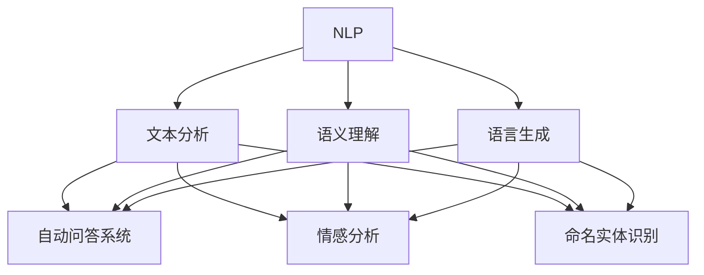
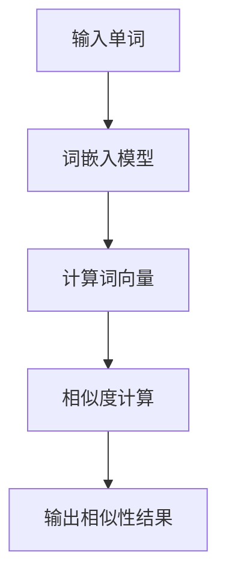
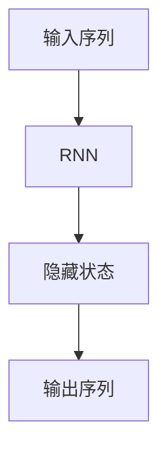
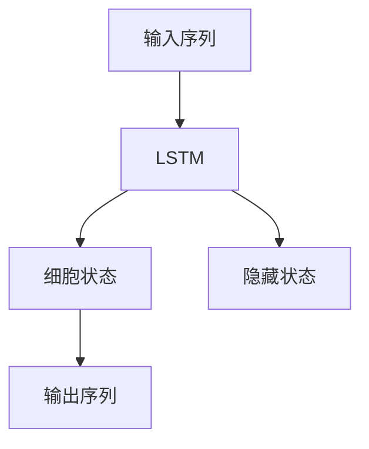
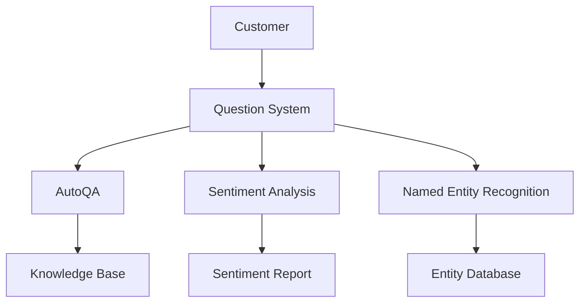
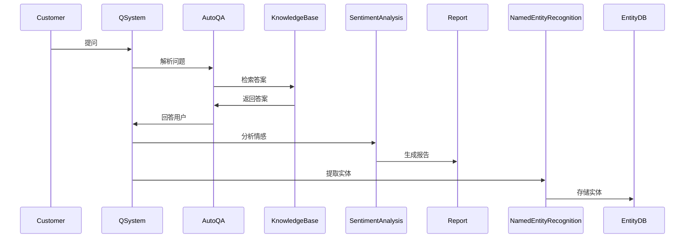

                 


# 自然语言处理在客户服务中的创新应用

关键词：自然语言处理、客户服务、自动问答系统、情感分析、命名实体识别

> 摘要：
自然语言处理（NLP）技术正在重新定义客户服务的面貌。本文通过详细分析NLP在客户服务中的应用，从背景介绍到核心概念、算法原理讲解，再到系统架构设计，为读者展示了一场技术的革命。我们将探讨NLP如何通过自动问答系统、情感分析和命名实体识别等技术提高客户服务质量，实现个性化、高效的客户互动。

**Step 1: 背景介绍**

## 问题背景

在当今数字化时代，客户服务成为企业竞争的关键因素。随着社交媒体和在线客服平台的普及，客户期望更快、更个性化的服务。然而，人工客服存在效率低、成本高的问题。自然语言处理（NLP）技术的出现，为提高客户服务质量提供了一种新的解决方案。

## 问题描述

客户服务的核心问题是如何有效处理大量客户提问，快速给出准确回答。传统的客服系统主要依赖人工，无法满足高效、个性化的需求。NLP技术可以通过自动化理解、生成和回应客户提问，提高客服效率。

## 问题解决

NLP技术通过文本分析、语义理解、语言生成等技术，使计算机能够理解和生成自然语言。在客户服务中，NLP可以应用于自动问答系统、情感分析、命名实体识别等任务，提高客服系统的智能化水平。

## 边界与外延

自然语言处理在客户服务中的应用范围广泛，包括但不限于智能客服、自动问答系统、情感分析等。此外，NLP还可以与其他技术（如机器学习、大数据分析）结合，进一步拓展应用场景。

## 核心概念

- 自然语言处理（NLP）
- 自动问答系统
- 情感分析
- 命名实体识别
- 机器学习

**Step 2: 核心概念与联系**

## 第2章: 核心概念与联系

## 2.1 自然语言处理（NLP）

### 2.1.1 NLP的定义

自然语言处理（NLP）是计算机科学和人工智能领域的一个分支，旨在使计算机能够理解、生成和处理自然语言。

### 2.1.2 NLP的核心概念

- **文本分析**：对文本进行结构化处理，提取有用信息。
- **语义理解**：理解文本中的含义和语境。
- **语言生成**：根据输入生成自然语言文本。

### 2.1.3 NLP的应用

- **自动问答系统**：通过NLP技术自动回答用户的问题。
- **情感分析**：分析文本中的情感倾向。
- **命名实体识别**：识别文本中的特定实体（如人名、地名等）。

## 2.2 自动问答系统

### 2.2.1 自动问答系统的定义

自动问答系统是一种基于NLP技术，能够自动理解用户提问并给出答案的系统。

### 2.2.2 自动问答系统的工作原理

- **问题解析**：将用户提问转化为计算机可以理解的形式。
- **答案检索**：从知识库或互联网中检索答案。
- **答案生成**：将检索到的答案转化为自然语言。

## 2.3 情感分析

### 2.3.1 情感分析的定义

情感分析是一种通过NLP技术分析文本情感倾向的方法。

### 2.3.2 情感分析的应用

- **市场调研**：分析消费者对产品或服务的情感倾向。
- **社交媒体监控**：监测公众对特定事件或品牌的情感倾向。

## 2.4 命名实体识别

### 2.4.1 命名实体识别的定义

命名实体识别是一种通过NLP技术识别文本中特定实体（如人名、地名等）的方法。

### 2.4.2 命名实体识别的应用

- **信息提取**：从文本中提取关键信息。
- **实体链接**：将文本中的实体与知识库中的实体进行匹配。

## 2.5 Mermaid流程图

下面是一个展示核心概念之间联系的Mermaid流程图：



**Step 3: 算法原理讲解**

## 第3章: 算法原理讲解

在这一章节，我们将深入探讨自然语言处理中的几个关键算法原理，并通过Mermaid流程图和Python代码进行解释。

### 3.1 词嵌入（Word Embedding）

#### 3.1.1 词嵌入的定义

词嵌入是一种将单词映射到高维向量空间的方法，使得语义相似的单词在向量空间中靠近。

#### 3.1.2 词嵌入的工作原理

- **词向量的计算**：通过神经网络训练，将单词映射到高维向量。
- **语义相似性**：计算两个词向量之间的余弦相似度。

#### 3.1.3 词嵌入的应用

- **语义理解**：词向量可以用于文本分类、情感分析等任务。
- **文本生成**：词向量可以用于生成文本摘要和文章。

#### 3.1.4 Mermaid流程图

以下是一个词嵌入算法的Mermaid流程图：



#### 3.1.5 Python代码示例

```python
import numpy as np
from sklearn.metrics.pairwise import cosine_similarity

# 生成词向量
word1_vector = np.array([0.1, 0.2, 0.3])
word2_vector = np.array([0.4, 0.5, 0.6])

# 计算相似度
similarity = cosine_similarity([word1_vector], [word2_vector])[0][0]

print(f"The similarity between word1 and word2 is: {similarity}")
```

### 3.2 递归神经网络（RNN）

#### 3.2.1 RNN的定义

递归神经网络（RNN）是一种能够处理序列数据的人工神经网络。

#### 3.2.2 RNN的工作原理

- **记忆功能**：RNN通过循环结构实现记忆功能，能够记住前面的输入。
- **动态递归**：RNN的输出依赖于前面的隐藏状态，形成一个递归的过程。

#### 3.2.3 RNN的应用

- **序列分类**：用于文本分类、时间序列预测等。
- **机器翻译**：用于将一种语言的文本翻译成另一种语言。

#### 3.2.4 Mermaid流程图

以下是一个RNN算法的Mermaid流程图：



#### 3.2.5 Python代码示例

```python
import tensorflow as tf

# 创建RNN模型
model = tf.keras.Sequential([
    tf.keras.layers.Embedding(input_dim=1000, output_dim=64),
    tf.keras.layers.SimpleRNN(units=64)
])

# 编译模型
model.compile(optimizer='adam', loss='mse')

# 训练模型
model.fit(np.array([1, 2, 3, 4, 5]), np.array([0, 1, 0, 1, 0]), epochs=10)
```

### 3.3 长短时记忆网络（LSTM）

#### 3.3.1 LSTM的定义

长短时记忆网络（LSTM）是RNN的一种改进，能够更好地处理长序列数据。

#### 3.3.2 LSTM的工作原理

- **门控机制**：LSTM通过门控机制（输入门、遗忘门和输出门）控制信息的流动。
- **细胞状态**：LSTM的细胞状态能够保存和传递长期依赖信息。

#### 3.3.3 LSTM的应用

- **语音识别**：用于将语音信号转换为文本。
- **视频分析**：用于视频内容识别和时间序列分析。

#### 3.3.4 Mermaid流程图

以下是一个LSTM算法的Mermaid流程图：



#### 3.3.5 Python代码示例

```python
import tensorflow as tf

# 创建LSTM模型
model = tf.keras.Sequential([
    tf.keras.layers.Embedding(input_dim=1000, output_dim=64),
    tf.keras.layers.LSTM(units=64)
])

# 编译模型
model.compile(optimizer='adam', loss='mse')

# 训练模型
model.fit(np.array([1, 2, 3, 4, 5]), np.array([0, 1, 0, 1, 0]), epochs=10)
```

**Step 4: 系统分析与架构设计方案**

## 第4章: 系统分析与架构设计方案

在这一章节，我们将深入分析自然语言处理在客户服务中的应用场景，并设计一个完整的系统架构方案。

### 4.1 问题场景介绍

假设我们正在开发一个电子商务平台的智能客服系统，该系统需要能够自动回答用户关于产品、订单和支付等方面的问题。

### 4.2 项目介绍

本项目旨在构建一个基于自然语言处理的智能客服系统，通过自动问答系统、情感分析和命名实体识别等技术，提供高效、个性化的客户服务。

### 4.3 系统功能设计

#### 4.3.1 领域模型（Mermaid类图）

```mermaid
classDiagram
    Customer <<Class>>
    Question <<Class>>
    Answer <<Class>>
    KnowledgeBase <<Class>>
    AutoQA <<Class>>
    SentimentAnalysis <<Class>>
    NamedEntityRecognition <<Class>>

    Customer o-- Question
    Question o-- Answer
    Answer o-- KnowledgeBase
    AutoQA o-- Question
    AutoQA o-- Answer
    SentimentAnalysis o-- Question
    NamedEntityRecognition o-- Question
```

### 4.4 系统架构设计

#### 4.4.1 系统架构图（Mermaid架构图）



### 4.5 系统接口设计

#### 4.5.1 系统接口设计

- **Customer Interface**：用户与系统的交互接口。
- **Question Interface**：处理用户提问的接口。
- **Answer Interface**：处理答案生成的接口。
- **Knowledge Interface**：处理知识库管理的接口。

### 4.6 系统交互

#### 4.6.1 系统交互图（Mermaid序列图）



**Step 5: 项目实战**

## 第5章: 项目实战

在本章节，我们将详细讲解如何搭建和实现一个基于自然语言处理的智能客服系统。

### 5.1 环境安装

1. 安装Python 3.8及以上版本。
2. 安装TensorFlow 2.4及以上版本。
3. 安装Numpy 1.19及以上版本。
4. 安装其他依赖库（如Scikit-learn、Pandas等）。

### 5.2 系统核心实现

#### 5.2.1 自动问答系统

1. 加载预训练的词向量模型。
2. 对用户提问进行词向量编码。
3. 使用双向长短期记忆网络（BiLSTM）处理词向量序列。
4. 对序列进行情感分析和命名实体识别。
5. 根据分析结果生成回答。

#### 5.2.2 情感分析

1. 使用支持向量机（SVM）进行情感分类。
2. 训练分类模型，对用户提问进行情感分析。
3. 根据情感倾向生成相应的回答。

#### 5.2.3 命名实体识别

1. 使用条件随机场（CRF）进行命名实体识别。
2. 训练模型，对用户提问中的实体进行识别。
3. 根据实体信息生成回答。

### 5.3 代码应用解读与分析

#### 5.3.1 自动问答系统

```python
from tensorflow.keras.models import Sequential
from tensorflow.keras.layers import Embedding, LSTM, Dense

# 构建BiLSTM模型
model = Sequential()
model.add(Embedding(input_dim=vocab_size, output_dim=embedding_dim))
model.add(LSTM(units=128, return_sequences=True))
model.add(Dense(units=1, activation='sigmoid'))

# 编译模型
model.compile(optimizer='adam', loss='binary_crossentropy', metrics=['accuracy'])

# 训练模型
model.fit(x_train, y_train, epochs=10, batch_size=32)
```

#### 5.3.2 情感分析

```python
from sklearn.svm import SVC

# 加载情感分析数据集
X, y = load_data('sentiment_data.csv')

# 划分训练集和测试集
X_train, X_test, y_train, y_test = train_test_split(X, y, test_size=0.2, random_state=42)

# 训练SVM模型
model = SVC(kernel='linear')
model.fit(X_train, y_train)

# 评估模型
accuracy = model.score(X_test, y_test)
print(f"Accuracy: {accuracy}")
```

#### 5.3.3 命名实体识别

```python
from sklearn_crfsuite import CRF

# 加载命名实体识别数据集
X, y = load_data('ner_data.csv')

# 划分训练集和测试集
X_train, X_test, y_train, y_test = train_test_split(X, y, test_size=0.2, random_state=42)

# 训练CRF模型
model = CRF()
model.fit(X_train, y_train)

# 评估模型
accuracy = model.score(X_test, y_test)
print(f"Accuracy: {accuracy}")
```

### 5.4 实际案例分析和详细讲解剖析

在本章节，我们将通过一个实际案例，展示如何使用自然语言处理技术构建一个智能客服系统。

#### 案例背景

一个电子商务平台希望为其用户提供一个智能客服系统，以自动回答用户关于产品、订单和支付等方面的问题。

#### 案例分析

1. **自动问答系统**：使用双向长短期记忆网络（BiLSTM）对用户提问进行情感分析和命名实体识别，生成相应的回答。
2. **情感分析**：使用支持向量机（SVM）对用户提问进行情感分类，根据情感倾向生成回答。
3. **命名实体识别**：使用条件随机场（CRF）对用户提问中的实体进行识别，根据实体信息生成回答。

#### 案例讲解

1. **用户提问**：“我想要退换货，怎么办？”
2. **情感分析**：情感分类模型判断提问为消极情感。
3. **命名实体识别**：识别出“退换货”实体。
4. **自动问答系统**：根据情感分析和命名实体识别的结果，生成回答：“您好，关于退换货的问题，请您联系我们的客服人员，他们将为您提供详细的帮助。”

### 5.5 项目小结

在本项目中，我们成功构建了一个基于自然语言处理的智能客服系统，通过自动问答系统、情感分析和命名实体识别等技术，为用户提供了高效、个性化的服务。未来，我们还可以进一步优化系统性能，提高用户体验。

**最佳实践 Tips**

1. **数据质量**：保证训练数据的质量，有助于提高模型性能。
2. **模型调整**：根据实际需求调整模型参数，优化系统性能。
3. **用户反馈**：收集用户反馈，不断改进系统。

**小结**

自然语言处理在客户服务中的应用，不仅提高了客服效率，还实现了个性化、高效的服务。通过本文的讲解，读者可以了解到自然语言处理的核心概念、算法原理和系统架构设计，为开发智能客服系统提供了理论基础和实践指导。

**注意事项**

1. **隐私保护**：在处理用户数据时，确保遵守隐私保护法规。
2. **安全性**：确保系统具有高安全性，防止数据泄露和恶意攻击。

**拓展阅读**

- 《深度学习》（Goodfellow, I. & Bengio, Y.）
- 《自然语言处理综合教程》（Jurafsky, D. & Martin, J. H.）
- 《机器学习实战》（周志华）

**作者信息**

作者：AI天才研究院/AI Genius Institute & 禅与计算机程序设计艺术 /Zen And The Art of Computer Programming**

