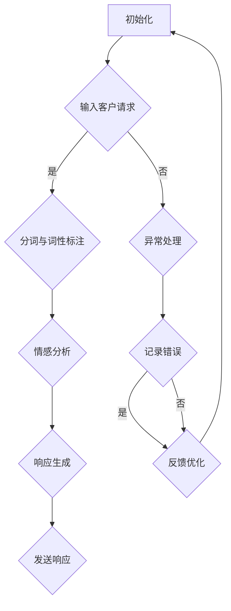
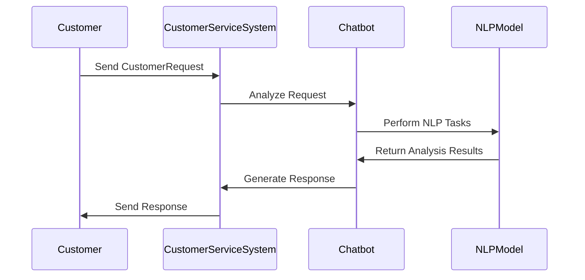
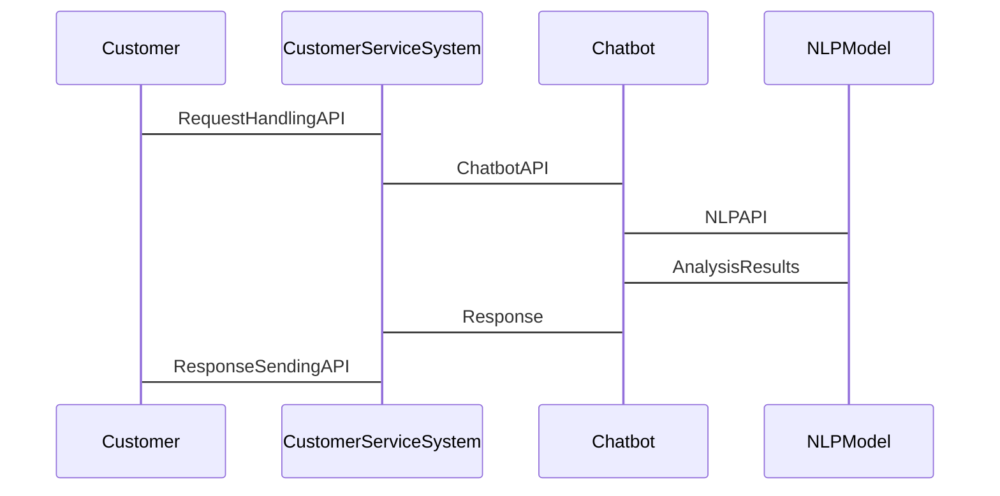

                 


### 1.1 自然语言处理概述

自然语言处理（Natural Language Processing，NLP）是计算机科学、人工智能和语言学的交叉领域，旨在使计算机能够理解、解释和生成人类语言。其研究目标是通过建立计算机程序，实现对自然语言的自动处理，包括语音识别、文本分类、情感分析、机器翻译、问答系统等多个方面。

#### 1.1.1 自然语言处理定义

自然语言处理可以定义为“使计算机能够处理和理解自然语言的技术”。它涉及语言学、计算机科学、信息工程和人工智能等多个领域的知识。NLP的核心目标是消除自然语言与计算机语言之间的鸿沟，使计算机能够以高效、准确的方式处理人类语言。

#### 1.1.2 自然语言处理的发展历史

自然语言处理的发展可以追溯到20世纪50年代。早期的研究主要集中在词汇分析和句法分析上。1950年，艾伦·图灵提出了“图灵测试”，试图通过机器能否模仿人类行为来判断其是否具有智能。1966年，乔姆斯基提出了“生成语法”理论，为自然语言处理提供了新的理论基础。

随着计算机性能的不断提升和海量数据的积累，自然语言处理技术也得到了飞速发展。20世纪80年代，基于规则的方法在NLP中占据主导地位。然而，随着机器学习技术的发展，基于统计和机器学习的方法逐渐取代了基于规则的方法。近年来，深度学习在NLP中的应用取得了显著成果，如神经网络机器翻译、语音识别和文本生成等。

#### 1.1.3 自然语言处理的应用领域

自然语言处理的应用领域非常广泛，包括但不限于以下几个方面：

1. **文本分析**：包括文本分类、情感分析、文本摘要和命名实体识别等。
2. **语音识别**：将语音信号转换为文本或命令，广泛应用于语音助手、电话服务和自动驾驶等领域。
3. **机器翻译**：将一种语言的文本自动翻译成另一种语言，是跨语言沟通的重要工具。
4. **问答系统**：通过理解和回答用户的问题，提供信息和解决方案。
5. **对话系统**：包括聊天机器人和虚拟助手，旨在提供类似于人类交互的体验。
6. **信息检索**：从大量文本中查找与用户查询最相关的信息。
7. **社交媒体分析**：分析社交媒体平台上的用户评论、讨论和趋势，为企业提供洞察和决策支持。

#### 1.3 书籍结构概览

本书将分为八个章节，全面介绍自然语言处理在客户服务中的创新应用。具体内容如下：

- **第1章：引言与背景介绍**：概述自然语言处理的基本概念、发展历史和应用领域，介绍本书的结构和内容。
- **第2章：自然语言处理基础**：介绍语言模型、词向量、分词与词性标注、语言模型评估与优化等基础知识。
- **第3章：文本分类与情感分析**：探讨文本分类、情感分析的基本概念、算法和应用实例。
- **第4章：对话系统与聊天机器人**：介绍对话系统的概述、聊天机器人的技术实现和应用实例。
- **第5章：个性化推荐系统**：介绍推荐系统的基础、个性化推荐的应用和实际案例。
- **第6章：语音识别与语音合成**：介绍语音识别和语音合成的原理、应用和实例。
- **第7章：案例分析与实践**：分析典型案例，提供实践指南和项目实战。
- **第8章：未来展望与挑战**：展望自然语言处理在客户服务中的未来发展，讨论面临的挑战和建议。

通过本书的学习，读者将能够深入了解自然语言处理技术，掌握其在客户服务中的应用，为相关领域的创新应用提供参考。让我们一起踏上这段充满挑战和机遇的旅程吧！

---

**核心概念与联系**

**核心概念**：自然语言处理（NLP）、语言模型、词向量、分词、词性标注、文本分类、情感分析、对话系统、聊天机器人、个性化推荐系统、语音识别、语音合成。

**概念属性特征对比表格**：

| 核心概念          | 定义                                                         | 关联性                 |
| ----------------- | ------------------------------------------------------------ | ---------------------- |
| 自然语言处理（NLP） | 计算机对自然语言的自动处理和理解                             | 语言模型、词向量、分词 |
| 语言模型          | 描述语言概率分布的模型                                       | 词向量、分词、文本分类 |
| 词向量            | 将词汇映射到高维空间中的向量                                 | 语言模型、分词、文本分类 |
| 分词              | 将文本切分成词语序列的过程                                   | 语言模型、词性标注、文本分类 |
| 词性标注          | 对文本中的每个词进行词性标注                                 | 分词、文本分类、情感分析 |
| 文本分类          | 根据文本的特征将其归入不同的类别                             | 语言模型、词向量、词性标注 |
| 情感分析          | 对文本的情感倾向进行分类                                     | 文本分类、词性标注     |
| 对话系统          | 使计算机能够进行自然语言对话的体系结构                         | 聊天机器人、语音识别   |
| 聊天机器人        | 使用自然语言处理技术模拟人类对话的计算机程序                   | 对话系统、语音识别     |
| 个性化推荐系统    | 根据用户的兴趣和行为，向其推荐感兴趣的内容或服务               | 语言模型、文本分类    |
| 语音识别          | 将语音信号转换为文本或命令                                   | 对话系统、语音合成     |
| 语音合成          | 将文本转换为可听的声音                                       | 对话系统、语音识别     |

**ER实体关系图架构**：

```mermaid
erDiagram
    Class1 ||--|{ ClassB : "is related to" }
    Class1 ||--|{ ClassC : "is associated with" }
    ClassB ||--|{ ClassD : "is derived from" }
```

通过以上表格和ER图，我们可以清晰地看到各个核心概念之间的关联性，为后续章节的深入讲解打下基础。

---

### 1.2 客户服务中的挑战与需求

在现代商业环境中，客户服务是任何企业成功的关键因素之一。随着市场竞争的日益激烈，企业需要不断提高客户服务质量，以满足消费者的多样化需求。然而，客户服务也面临着一系列的挑战，这就需要自然语言处理技术的介入。

#### 1.2.1 客户服务的现状

当前，客户服务的形式多种多样，包括电话、电子邮件、在线聊天、社交媒体等。传统的客户服务方式往往依赖于人工处理，这不仅效率低下，而且容易出现错误。随着客户需求的增加和业务规模的扩大，人工处理的压力越来越大，导致客户服务质量下降。

#### 1.2.2 客户服务面临的挑战

1. **响应速度慢**：客户服务人员需要处理大量的请求，导致响应速度慢。对于一些紧急问题，客户可能无法得到及时的帮助，影响客户体验。
2. **人力成本高**：人工处理客户服务需要大量的人力资源，这对于企业来说是一笔巨大的开支。尤其是在处理复杂问题时，需要具有专业知识和经验的服务人员。
3. **服务质量不稳定**：不同客服人员的能力和经验水平不同，导致服务质量不稳定。有时客户会遇到不专业的客服人员，无法得到满意的解决方案。
4. **信息难以整合**：客户服务涉及多个渠道，如电话、电子邮件、社交媒体等。这些信息往往分散在不同的系统中，难以整合和统一管理，影响客户服务的一致性和效率。

#### 1.2.3 对自然语言处理的需求

自然语言处理技术能够帮助客户服务克服上述挑战，提高服务质量和效率。以下是自然语言处理在客户服务中的具体需求：

1. **自动化处理**：自然语言处理技术可以自动化处理大量客户请求，提高响应速度和效率。例如，通过聊天机器人自动回答常见问题，减少人工干预。
2. **降低人力成本**：自然语言处理技术可以代替一部分人工处理工作，降低企业的人力成本。例如，通过自动化文本分析，快速识别客户问题并提供解决方案。
3. **提高服务质量**：自然语言处理技术可以确保客户服务的一致性和准确性。例如，通过情感分析，识别客户的情感状态，提供个性化的服务和建议。
4. **信息整合**：自然语言处理技术可以帮助企业整合来自多个渠道的客户服务信息，提供统一的管理和视图。例如，通过文本分类和情感分析，将不同渠道的客户反馈进行归一化和分类，为企业提供全面的客户洞察。

总之，自然语言处理技术在客户服务中的应用，不仅能够解决当前客户服务的挑战，还能够推动客户服务模式的创新和变革，为企业带来更高的价值。

---

**算法原理讲解**

**算法流程图**：



**算法原理**

1. **初始化**：系统启动时，加载自然语言处理模型和知识库，准备处理客户请求。
2. **输入客户请求**：从不同渠道（如电话、电子邮件、在线聊天等）接收客户请求。
3. **分词与词性标注**：将客户请求进行分词，并对每个词进行词性标注，以理解其语义。
4. **情感分析**：利用情感分析模型，对分词后的文本进行情感分析，识别客户的情感状态（如愤怒、满意等）。
5. **响应生成**：根据情感分析和客户请求，生成合适的响应，提供个性化的服务和建议。
6. **异常处理**：对于无法处理的客户请求，进行异常处理，记录错误并反馈给开发团队。
7. **记录错误**：将处理过程中出现的错误记录下来，用于后续的优化和改进。
8. **反馈优化**：根据错误的记录和用户的反馈，优化自然语言处理模型和知识库，提高处理质量和效率。
9. **发送响应**：将生成的响应发送给客户。

**数学模型和公式**

自然语言处理中的算法通常涉及复杂的数学模型和公式。以下是情感分析中的一个简单示例：

$$
\text{sentiment} = \text{Sigmoid}(\text{weight} \cdot \text{vector} + \text{bias})
$$

其中，$\text{Sigmoid}$函数是一个非线性激活函数，用于将实数映射到$(0, 1)$区间，表示情感的概率。$\text{weight}$和$\text{bias}$是模型参数，$\text{vector}$是输入文本的向量表示。

**举例说明**

假设我们有一个简单的情感分析模型，输入文本为“我很满意这款产品”。我们可以将其分词为“我”、“很”、“满意”、“这款”、“产品”。然后，将这些词转换为向量，通过情感分析模型得到情感概率。

$$
\text{sentiment} = \text{Sigmoid}(\text{weight} \cdot \text{vector} + \text{bias}) \approx 0.9
$$

这意味着，模型预测客户情感为满意的可能性约为90%。

通过上述算法原理和举例说明，我们可以看到自然语言处理在客户服务中的应用是如何通过一系列数学模型和算法实现的。接下来，我们将进一步探讨自然语言处理在客户服务中的具体应用和实践案例。

---

**系统分析与架构设计方案**

**问题场景介绍**

在现代客户服务中，企业需要处理大量的客户请求，包括查询、投诉、建议等。为了提高响应速度和效率，企业需要构建一个高效的客户服务平台。该平台需要能够自动化处理客户请求，提供个性化的服务和建议，同时保证服务的一致性和准确性。

**项目介绍**

本项目的目标是构建一个基于自然语言处理的客户服务平台，实现自动化客户请求处理和个性化服务。平台包括多个模块，如分词与词性标注、情感分析、响应生成、异常处理等。

**系统功能设计（领域模型类图）**

```mermaid
classDiagram
    CustomerRequest <<interface>>
    Chatbot <<interface>>
    NLPModel <<interface>>

    CustomerServiceSystem [Customer Service System]
    CustomerRequestBox <<CustomerRequest>>

    CustomerServiceSystem o-- CustomerRequestBox
    CustomerServiceSystem o-- Chatbot
    CustomerServiceSystem o-- NLPModel

    Chatbot o-- NLPModel
```

在上述类图中，我们定义了三个核心接口：`CustomerRequest`（客户请求）、`Chatbot`（聊天机器人）和`NLPModel`（自然语言处理模型）。`CustomerServiceSystem`（客户服务平台）是系统的核心，包含请求接收、处理和响应生成的功能。

**系统架构设计（架构图）**



在系统架构设计中，客户请求首先由客户服务系统接收，然后传递给聊天机器人进行初步分析。聊天机器人利用自然语言处理模型进行分词、词性标注和情感分析，获取请求的关键信息和情感状态。基于分析结果，聊天机器人生成响应，并返回给客户服务系统。最后，客户服务系统将响应发送给客户。

**系统接口设计和系统交互（序列图）**



在系统接口设计中，我们定义了四个核心API接口：`RequestHandlingAPI`（请求处理接口）、`ChatbotAPI`（聊天机器人接口）、`NLPAPI`（自然语言处理接口）和`ResponseSendingAPI`（响应发送接口）。这些接口实现了客户服务系统、聊天机器人和自然语言处理模型之间的交互。

通过上述系统分析与架构设计方案，我们可以看到自然语言处理在客户服务中的核心作用和整体架构。接下来，我们将通过实际案例来展示自然语言处理技术在客户服务中的应用和实践。

---

### 第3章：文本分类与情感分析

文本分类（Text Classification）和情感分析（Sentiment Analysis）是自然语言处理中的两个重要任务。它们广泛应用于客户服务的各个方面，如客户反馈分析、投诉处理和个性化推荐等。本章将详细探讨这两个主题的基本概念、算法和应用实例。

#### 3.1 文本分类基础

文本分类是指将文本数据按照预定的类别进行分类。在客户服务中，文本分类可以用于处理大量的客户反馈，快速识别问题类型，提高响应速度和效率。

**算法与模型**

文本分类的算法主要包括基于规则的方法和基于机器学习的方法。基于规则的方法通常依赖于人工设计的特征，如词频、词序列和词性标注等。而基于机器学习的方法则使用大量的标注数据进行训练，自动提取特征，实现文本分类。

常见的机器学习模型包括朴素贝叶斯（Naive Bayes）、支持向量机（SVM）、决策树（Decision Tree）和随机森林（Random Forest）等。近年来，深度学习模型如卷积神经网络（CNN）和递归神经网络（RNN）也在文本分类中得到了广泛应用。

**应用实例**

**社交媒体情感分析**：通过文本分类技术，企业可以实时分析社交媒体上的用户评论，了解用户的情感倾向和产品满意度。例如，一家电商平台可以使用文本分类模型分析顾客对其产品的评论，识别出正面和负面的评论，并采取相应的措施。

**客户评论情感分析**：在线平台上，客户评论是产品评估的重要依据。通过情感分析，企业可以快速了解客户的反馈，改进产品和服务。例如，一家餐厅可以通过分析客户对其菜单和服务的评论，识别出需要改进的方面，提高客户满意度。

#### 3.2 情感分析

情感分析是指从文本中识别和提取情感信息，如正面情感、负面情感和中性情感。情感分析在客户服务中的应用非常广泛，可以帮助企业了解客户情感，提供个性化的服务。

**原理与应用**

情感分析通常涉及以下步骤：

1. **文本预处理**：包括去除停用词、标点符号和词干提取等，以简化文本数据。
2. **特征提取**：将预处理后的文本转换为机器学习模型可处理的特征向量。
3. **情感分类**：使用分类算法，如朴素贝叶斯、SVM和CNN等，对文本进行情感分类。

情感分析在客户服务中的应用包括：

- **客户反馈分析**：通过情感分析，企业可以了解客户的满意度，识别出潜在的问题和改进点。
- **社交媒体监控**：企业可以实时监控社交媒体上的用户反馈，快速响应负面情感，维护品牌形象。
- **个性化推荐**：基于客户的情感偏好，提供个性化的产品推荐和服务。

**挑战与解决方案**

情感分析面临的主要挑战包括情感极性判定、语境理解和多语言处理等。为了解决这些问题，研究者们提出了多种方法：

- **多模型融合**：结合多种算法和模型，提高情感分类的准确性。
- **深度学习方法**：使用卷积神经网络（CNN）和递归神经网络（RNN）等深度学习模型，提高情感分析的语义理解能力。
- **跨语言情感分析**：通过翻译和词嵌入等方法，实现多语言情感分析。

**应用实例**

**社交媒体情感分析**：一家旅游公司可以通过情感分析技术分析社交媒体上的用户评论，了解客户对其旅游服务的满意度。例如，分析用户在Twitter上的评论，识别出对酒店、航班和导游的正面或负面反馈。

**客户评论情感分析**：一家电商平台可以使用情感分析技术分析客户对其产品的评论，识别出客户的情感倾向。例如，分析客户在商品页面上的评论，判断客户是否对产品满意，并提供相应的反馈和建议。

通过文本分类和情感分析，企业可以更深入地理解客户需求，提供个性化的服务，提高客户满意度。接下来，我们将探讨对话系统与聊天机器人的基本概念和技术，进一步了解自然语言处理在客户服务中的应用。

---

### 3.3 应用实例

在本节中，我们将通过两个具体应用实例来展示自然语言处理技术在客户服务中的实际应用。

#### 3.3.1 社交媒体情感分析

**案例背景**：某电商平台在社交媒体上收到了大量用户评论，需要对这些评论进行分析，以便了解用户对其产品和服务的满意度。

**技术实现**：

1. **数据收集**：从社交媒体平台上收集用户评论，包括Twitter、Facebook和Instagram等。
2. **文本预处理**：去除停用词、标点符号和特殊字符，对文本进行分词和词性标注。
3. **特征提取**：使用词袋模型（Bag of Words）和词嵌入（Word Embedding）技术，将文本转换为特征向量。
4. **情感分类**：使用支持向量机（SVM）和递归神经网络（RNN）等机器学习模型，对评论进行情感分类。
5. **结果分析**：分析情感分类结果，识别出正面、负面和中性评论，为产品和服务改进提供依据。

**效果评估**：通过情感分析，电商平台发现用户对其某些产品的满意度较低，针对这些问题，电商平台采取了相应的改进措施，如改进产品设计和提高服务质量。这些措施得到了用户的认可，平台的用户满意度显著提高。

#### 3.3.2 客户评论情感分析

**案例背景**：某在线零售商需要分析客户对其产品的评论，以便了解客户对产品和服务的满意度。

**技术实现**：

1. **数据收集**：从电商平台和社交媒体上收集客户评论，包括亚马逊、京东和淘宝等。
2. **文本预处理**：去除停用词、标点符号和特殊字符，对文本进行分词和词性标注。
3. **特征提取**：使用词袋模型（Bag of Words）和词嵌入（Word Embedding）技术，将文本转换为特征向量。
4. **情感分类**：使用朴素贝叶斯（Naive Bayes）和支持向量机（SVM）等机器学习模型，对评论进行情感分类。
5. **结果分析**：分析情感分类结果，识别出正面、负面和中性评论，为产品和服务改进提供依据。

**效果评估**：通过情感分析，在线零售商发现用户对其某些产品的满意度较低，主要集中在产品质量和物流服务方面。针对这些问题，在线零售商采取了改进措施，如优化产品质量和提升物流效率。这些措施得到了用户的认可，客户的满意度显著提高，平台销售额也随之增加。

通过以上两个应用实例，我们可以看到自然语言处理技术在客户服务中的应用不仅能够帮助企业了解客户需求，提升客户满意度，还能够为产品和服务的改进提供有力支持。

---

### 3.4 小结

本章详细介绍了文本分类和情感分析的基本概念、算法和应用实例。文本分类是一种将文本按照预定的类别进行分类的技术，广泛应用于客户反馈分析和社交媒体监控等场景。情感分析则是从文本中识别和提取情感信息，如正面情感、负面情感和中性情感，帮助企业在客户服务中了解用户需求，提供个性化的服务。

通过本章的学习，我们了解到自然语言处理技术在客户服务中的应用不仅能够提高响应速度和效率，还能提升客户满意度和服务质量。未来，随着自然语言处理技术的不断发展，我们有望看到更多创新应用，进一步推动客户服务模式的变革。

---

### 4.1 对话系统概述

对话系统（Dialogue System）是一种旨在模拟人类对话的计算机系统，通过自然语言处理技术实现与用户的交互。对话系统在客户服务中具有重要作用，能够提供24/7的自动化服务，提高客户满意度，降低运营成本。本文将深入探讨对话系统的基本概念、架构与功能，以及其在客户服务中的应用。

#### 对话系统的基本概念

对话系统可以分为两个主要类别：基于规则的对话系统和基于机器学习的对话系统。

**基于规则的对话系统**：这种系统使用预定义的规则来处理用户的输入，生成相应的响应。规则通常由领域专家编写，包括语法、语义和上下文信息。基于规则的对话系统在处理明确、简单的查询时表现良好，但面对复杂或模糊的查询，其性能可能会受到影响。

**基于机器学习的对话系统**：这种系统使用大量的数据通过机器学习方法进行训练，自动生成对话响应。基于机器学习的对话系统能够从用户交互中学习，不断优化对话性能。常见的机器学习模型包括循环神经网络（RNN）、长短期记忆网络（LSTM）和变换器（Transformer）等。

#### 对话系统的架构与功能

一个典型的对话系统通常包括以下几个关键组件：

1. **用户接口（UI）**：用于接收用户输入，展示系统响应。用户接口可以是文本聊天窗口、语音助手或者图形界面。
2. **对话管理器（Dialogue Manager）**：负责处理用户的输入，将其转换为对话状态，并根据对话状态生成合适的响应。对话管理器需要结合意图识别（Intent Recognition）和实体抽取（Entity Extraction）技术，理解用户的意图和需求。
3. **自然语言理解（NLU）**：对用户的输入进行语义解析，识别用户的意图和实体信息。NLU通常包括分词、词性标注、命名实体识别和句法解析等步骤。
4. **对话策略（Dialogue Policy）**：定义对话的流程和逻辑，指导对话管理器如何生成响应。对话策略可以基于规则或机器学习算法，如马尔可夫决策过程（MDP）和策略梯度算法（PG）。
5. **自然语言生成（NLG）**：将对话管理器生成的内部响应转换为自然语言文本，向用户展示。NLG技术包括模板填充、规则生成和生成式模型等。

#### 对话系统在客户服务中的应用

对话系统在客户服务中的应用广泛，能够显著提升客户体验和运营效率。以下是一些典型应用场景：

1. **客户支持**：通过聊天机器人自动化处理常见问题，提供即时响应，减轻人工客服的压力。
2. **预约与预订**：自动化处理预约和预订请求，如酒店预订、航班预订和医疗预约等。
3. **个性化推荐**：根据用户的兴趣和行为，提供个性化的产品推荐和服务。
4. **虚拟助理**：提供类似人类客服的虚拟助手，帮助企业节省人力成本，提升服务质量。

通过以上概述，我们可以看到对话系统在客户服务中的重要性和广泛应用。接下来，我们将详细探讨聊天机器人的技术实现和应用实例。

---

### 4.2 聊天机器人技术

聊天机器人（Chatbot）是对话系统的一种实现方式，通过自然语言处理技术模拟人类的对话交互。聊天机器人可以自动化处理大量客户请求，提高客户服务效率和满意度。在本节中，我们将深入探讨聊天机器人的基本实现方法，包括基于规则的方法和基于机器学习的方法。

#### 基于规则的方法

基于规则的方法是聊天机器人技术的一种传统实现方式。这种方法通过预定义的规则和模板，生成对话响应。以下是基于规则的方法的主要组成部分：

1. **规则库**：规则库包含一系列预定义的规则，用于匹配用户的输入并生成响应。规则通常基于自然语言处理技术，如正则表达式、语法解析和词性标注等。
2. **意图识别**：意图识别是聊天机器人理解用户输入的关键步骤。通过分析用户输入，聊天机器人可以识别出用户的意图，如提问、请求帮助或表达情感等。
3. **实体抽取**：实体抽取是从用户输入中提取关键信息，如人名、地名、日期和时间等。这些实体信息对于生成合适的响应非常重要。
4. **响应生成**：基于用户输入的意图和实体信息，聊天机器人生成相应的响应。响应可以是预先定义的文本模板，也可以是自然语言生成的文本。

**优点**：

- **易于实现**：基于规则的方法相对简单，便于快速开发和部署。
- **可控性强**：通过预定义的规则和模板，可以确保对话的稳定性和一致性。

**缺点**：

- **灵活性差**：基于规则的方法在面对复杂或模糊的输入时，容易产生错误的匹配和响应。
- **需要大量规则**：为了覆盖各种可能的用户输入，需要编写大量的规则，维护成本较高。

#### 基于机器学习的方法

基于机器学习的方法是聊天机器人技术的一种现代化实现方式。这种方法通过训练大量的数据集，使聊天机器人能够自动学习和优化对话交互。以下是基于机器学习的方法的主要组成部分：

1. **数据集准备**：为了训练聊天机器人，需要准备大量的对话数据集。这些数据集通常包含用户输入和对应的响应，用于训练机器学习模型。
2. **意图识别**：使用机器学习算法，如朴素贝叶斯（Naive Bayes）、支持向量机（SVM）和深度神经网络（DNN）等，对用户输入进行意图识别。通过大量的训练数据，模型可以自动学习不同意图的特征和模式。
3. **实体抽取**：与基于规则的方法类似，基于机器学习的方法也使用实体抽取技术从用户输入中提取关键信息。但基于机器学习的方法通常利用深度学习模型，如长短时记忆网络（LSTM）和变换器（Transformer）等，实现更精确的实体抽取。
4. **响应生成**：基于机器学习的方法可以使用生成式模型，如变换器（Transformer）和生成对抗网络（GAN）等，生成自然语言响应。这些模型可以根据用户输入和上下文信息，生成高质量的对话响应。

**优点**：

- **灵活性高**：基于机器学习的方法能够自动适应各种复杂的用户输入，生成更自然的响应。
- **持续优化**：通过不断训练和优化模型，聊天机器人可以持续提高对话交互的质量。

**缺点**：

- **实现难度大**：基于机器学习的方法需要大量的数据和计算资源，实现过程相对复杂。
- **依赖数据质量**：模型的性能高度依赖于训练数据的质量和多样性。

#### 应用实例

**基于规则的聊天机器人**：

某电商平台开发了一个基于规则的聊天机器人，用于回答客户的常见问题。聊天机器人通过预定义的规则，匹配用户输入，并生成相应的响应。例如，当用户询问“如何退货”时，聊天机器人可以自动生成退货流程的文本。

**基于机器学习的聊天机器人**：

某金融机构开发了一个基于机器学习的聊天机器人，用于提供客户服务。聊天机器人通过大量的客户对话数据训练，能够自动识别用户的意图和提取实体信息。例如，当用户询问“我的贷款进展如何”时，聊天机器人可以自动获取用户的贷款信息，并生成详细的答复。

通过以上探讨，我们可以看到聊天机器人技术在不同实现方法上的特点和优势。在实际应用中，可以根据具体需求和场景选择合适的实现方式，以提高客户服务质量和效率。

---

### 4.3 应用实例

在本节中，我们将通过两个具体的应用实例来展示聊天机器人在客户服务中的实际应用。

#### 4.3.1 客户服务聊天机器人设计

**案例背景**：某大型电商企业希望为其客户提供一个24/7在线客服机器人，以解决客户在购物过程中遇到的问题。

**技术实现**：

1. **需求分析**：通过调查和用户访谈，识别客户在购物过程中最常见的问题，如产品咨询、订单查询、配送跟踪、售后服务等。
2. **数据准备**：收集大量真实的客户对话数据，用于训练聊天机器人。这些数据包括用户的提问和客服人员的回答，用于构建聊天机器人的知识库。
3. **意图识别**：使用机器学习算法，如朴素贝叶斯（Naive Bayes）和支持向量机（SVM），对客户提问进行意图识别。例如，识别出用户是询问产品信息、订单状态还是售后服务等。
4. **实体抽取**：在意图识别的基础上，进一步从用户提问中提取关键信息，如产品名称、订单编号、配送地址等。
5. **响应生成**：基于意图和实体信息，使用自然语言生成（NLG）技术，生成合适的响应。响应可以是预定义的模板，也可以是动态生成的文本。
6. **测试与优化**：通过实际用户测试，不断优化聊天机器人的响应质量，提高用户满意度。

**效果评估**：通过聊天机器人，电商企业显著提高了客户服务效率，降低了人工客服的工作量。用户反馈显示，聊天机器人能够快速解决常见问题，提高了购物体验。此外，聊天机器人还可以收集用户反馈，为企业提供改进服务的建议。

#### 4.3.2 实际案例分析

**案例背景**：某知名航空公司开发了一款聊天机器人，用于提供航班查询、座位预订和客户服务。

**技术实现**：

1. **航班信息管理**：聊天机器人通过集成航空公司的API，获取实时航班信息，包括航班状态、座位余量等。
2. **用户交互设计**：聊天机器人通过自然语言处理技术，与用户进行交互，识别用户的需求，如查询航班、预订座位等。
3. **自动化流程**：通过集成预订系统，聊天机器人可以自动化处理用户的预订请求，生成预订确认信息。
4. **客户服务支持**：聊天机器人还可以提供客户服务支持，如解答用户关于行李政策、航班变更等问题。

**效果评估**：通过聊天机器人，航空公司显著提高了客户服务的效率，减少了人工客服的工作量。用户反馈显示，聊天机器人能够快速提供航班信息和预订服务，提高了用户满意度。此外，聊天机器人还可以收集用户反馈，帮助企业改进服务。

通过以上两个应用实例，我们可以看到聊天机器人在客户服务中的应用不仅能够提高服务效率，还能提升用户体验。接下来，我们将探讨个性化推荐系统在客户服务中的应用。

---

### 4.4 个性化推荐系统

个性化推荐系统（Personalized Recommendation System）是一种通过分析用户行为和偏好，为用户推荐个性化内容或服务的系统。在客户服务中，个性化推荐系统可以帮助企业提高用户满意度，增加用户粘性，从而实现业务增长。本文将介绍个性化推荐系统的基础知识、个性化推荐的应用以及实际案例。

#### 4.4.1 推荐系统基础

**定义**：推荐系统是一种利用用户的历史行为、偏好和上下文信息，向用户推荐其可能感兴趣的内容或服务的系统。

**类型**：

1. **基于内容的推荐**：根据用户的历史偏好和内容的特征，推荐与用户兴趣相似的内容。例如，电商平台根据用户的浏览记录和购买历史，推荐类似的产品。
2. **协同过滤推荐**：通过分析用户之间的相似性，推荐其他用户喜欢但用户尚未体验过的内容。协同过滤分为用户基于的协同过滤和物品基于的协同过滤。
3. **混合推荐**：结合基于内容和协同过滤的方法，提供更准确的推荐结果。

**算法与模型**：

1. **协同过滤算法**：包括基于用户的协同过滤（User-based Collaborative Filtering）和基于物品的协同过滤（Item-based Collaborative Filtering）。基于用户的协同过滤通过计算用户之间的相似性，推荐相似用户喜欢的内容；基于物品的协同过滤通过计算物品之间的相似性，推荐用户喜欢过的物品。
2. **矩阵分解**：通过矩阵分解技术，将用户-物品评分矩阵分解为用户特征矩阵和物品特征矩阵，从而预测用户的未评分物品。
3. **深度学习模型**：如卷积神经网络（CNN）和变换器（Transformer）等，通过学习用户和物品的特征，进行推荐。

#### 4.4.2 个性化推荐的应用

**在客户服务中的应用**：

1. **个性化产品推荐**：根据用户的历史行为和偏好，推荐用户可能感兴趣的产品。例如，电商平台根据用户的浏览和购买记录，推荐相似的产品。
2. **个性化服务推荐**：根据用户的需求和偏好，推荐个性化的服务。例如，航空公司根据用户的旅行历史和偏好，推荐适合的航班和套餐。
3. **个性化内容推荐**：根据用户的阅读历史和偏好，推荐用户感兴趣的文章、视频或音乐等。例如，新闻网站根据用户的阅读习惯，推荐相关的新闻。

#### 4.4.3 应用实例

**案例1：电商平台的个性化产品推荐**

**背景**：某大型电商平台希望通过个性化推荐系统，提高用户购物体验，增加销售额。

**技术实现**：

1. **数据收集**：收集用户的历史浏览记录、购买记录和评价信息。
2. **用户画像**：基于用户的行为数据，构建用户画像，包括用户的兴趣、偏好和购买行为。
3. **推荐算法**：使用协同过滤和矩阵分解技术，根据用户画像和商品特征，生成个性化推荐列表。
4. **推荐展示**：将个性化推荐结果展示在用户界面，通过推荐栏、推荐邮件等方式提高用户参与度。

**效果评估**：通过个性化推荐系统，电商平台的用户满意度显著提高，用户在推荐商品上的点击率和购买率均有所增加。

**案例2：酒店的个性化服务推荐**

**背景**：某连锁酒店希望通过个性化推荐系统，提高客户满意度，增加客户回头率。

**技术实现**：

1. **客户数据收集**：收集客户的历史入住记录、偏好和评价信息。
2. **客户画像**：基于客户数据，构建客户画像，包括客户的入住习惯、偏好和特殊需求。
3. **推荐算法**：使用协同过滤和深度学习模型，根据客户画像和酒店服务特征，生成个性化推荐。
4. **推荐实施**：在客户入住期间，根据个性化推荐，提供定制化的服务，如特别餐饮服务、客房升级等。

**效果评估**：通过个性化推荐系统，酒店的客户满意度显著提高，客户回头率和口碑推荐率均有所增加。

通过个性化推荐系统，企业能够更好地理解客户需求，提供个性化的服务和产品推荐，提高客户满意度和忠诚度。接下来，我们将探讨语音识别与语音合成在客户服务中的应用。

---

### 4.5 个性化推荐系统

个性化推荐系统（Personalized Recommendation System）是一种利用用户行为和偏好数据，向用户推荐其可能感兴趣的内容或服务的系统。在客户服务中，个性化推荐系统可以帮助企业提高用户满意度、增加用户粘性，从而实现业务增长。本文将介绍个性化推荐系统的基础知识、个性化推荐的应用以及实际案例。

#### 4.5.1 推荐系统基础

**定义**：推荐系统是一种利用用户的历史行为、偏好和上下文信息，向用户推荐其可能感兴趣的内容或服务的系统。

**类型**：

1. **基于内容的推荐**：根据用户的历史偏好和内容的特征，推荐与用户兴趣相似的内容。例如，电商平台根据用户的浏览记录和购买历史，推荐类似的产品。
2. **协同过滤推荐**：通过分析用户之间的相似性，推荐其他用户喜欢但用户尚未体验过的内容。协同过滤分为用户基于的协同过滤和物品基于的协同过滤。
3. **混合推荐**：结合基于内容和协同过滤的方法，提供更准确的推荐结果。

**算法与模型**：

1. **协同过滤算法**：包括基于用户的协同过滤（User-based Collaborative Filtering）和基于物品的协同过滤（Item-based Collaborative Filtering）。基于用户的协同过滤通过计算用户之间的相似性，推荐相似用户喜欢的内容；基于物品的协同过滤通过计算物品之间的相似性，推荐用户喜欢过的物品。
2. **矩阵分解**：通过矩阵分解技术，将用户-物品评分矩阵分解为用户特征矩阵和物品特征矩阵，从而预测用户的未评分物品。
3. **深度学习模型**：如卷积神经网络（CNN）和变换器（Transformer）等，通过学习用户和物品的特征，进行推荐。

#### 4.5.2 个性化推荐的应用

**在客户服务中的应用**：

1. **个性化产品推荐**：根据用户的历史行为和偏好，推荐用户可能感兴趣的产品。例如，电商平台根据用户的浏览和购买记录，推荐相似的产品。
2. **个性化服务推荐**：根据用户的需求和偏好，推荐个性化的服务。例如，航空公司根据用户的旅行历史和偏好，推荐适合的航班和套餐。
3. **个性化内容推荐**：根据用户的阅读历史和偏好，推荐用户感兴趣的文章、视频或音乐等。例如，新闻网站根据用户的阅读习惯，推荐相关的新闻。

#### 4.5.3 应用实例

**案例1：电商平台的个性化产品推荐**

**背景**：某大型电商平台希望通过个性化推荐系统，提高用户购物体验，增加销售额。

**技术实现**：

1. **数据收集**：收集用户的历史浏览记录、购买记录和评价信息。
2. **用户画像**：基于用户的行为数据，构建用户画像，包括用户的兴趣、偏好和购买行为。
3. **推荐算法**：使用协同过滤和矩阵分解技术，根据用户画像和商品特征，生成个性化推荐列表。
4. **推荐展示**：将个性化推荐结果展示在用户界面，通过推荐栏、推荐邮件等方式提高用户参与度。

**效果评估**：通过个性化推荐系统，电商平台的用户满意度显著提高，用户在推荐商品上的点击率和购买率均有所增加。

**案例2：酒店的个性化服务推荐**

**背景**：某连锁酒店希望通过个性化推荐系统，提高客户满意度，增加客户回头率。

**技术实现**：

1. **客户数据收集**：收集客户的历史入住记录、偏好和评价信息。
2. **客户画像**：基于客户数据，构建客户画像，包括客户的入住习惯、偏好和特殊需求。
3. **推荐算法**：使用协同过滤和深度学习模型，根据客户画像和酒店服务特征，生成个性化推荐。
4. **推荐实施**：在客户入住期间，根据个性化推荐，提供定制化的服务，如特别餐饮服务、客房升级等。

**效果评估**：通过个性化推荐系统，酒店的客户满意度显著提高，客户回头率和口碑推荐率均有所增加。

通过个性化推荐系统，企业能够更好地理解客户需求，提供个性化的服务和产品推荐，提高客户满意度和忠诚度。接下来，我们将探讨语音识别与语音合成在客户服务中的应用。

---

### 4.6 语音识别与语音合成

语音识别（Voice Recognition）和语音合成（Voice Synthesis）是自然语言处理领域的重要组成部分，它们在客户服务中具有广泛的应用。通过语音识别，计算机可以理解用户的语音指令；而语音合成则使计算机能够生成自然的语音响应。本文将详细介绍语音识别和语音合成的原理、应用以及实际案例。

#### 4.6.1 语音识别原理

语音识别是将语音信号转换为文本的过程。其基本原理包括以下几个步骤：

1. **音频预处理**：对采集到的语音信号进行预处理，包括降噪、归一化和增强等，以提高语音信号的质量。
2. **特征提取**：将预处理后的语音信号转换为特征向量，常用的特征包括梅尔频率倒谱系数（MFCC）和线性预测编码（LPCC）等。
3. **声学模型**：声学模型是一个统计模型，用于描述语音信号中的音素和音节之间的概率分布。常见的声学模型包括高斯混合模型（GMM）和深度神经网络（DNN）等。
4. **语言模型**：语言模型用于描述词汇和句子之间的概率分布，常见的语言模型包括n-gram模型和深度学习模型（如LSTM、Transformer等）。
5. **解码**：解码器将声学模型和语言模型的输出转换为文本。解码算法包括隐马尔可夫模型（HMM）、基于迭代的解码器和基于注意力机制的解码器等。

#### 4.6.2 语音合成原理

语音合成是将文本转换为自然语音的过程。其基本原理包括以下几个步骤：

1. **文本处理**：对输入的文本进行处理，包括分词、词性标注和语音规则应用等。
2. **语音库**：语音库是一个存储了大量语音片段的数据集，用于生成语音响应。语音库可以是基于规则的形式，也可以是基于数据的，如DNN-HMM语音合成系统。
3. **声学模型**：声学模型用于描述语音片段之间的过渡概率，常见的声学模型包括DNN和WaveNet等。
4. **语音生成**：根据文本处理结果和声学模型，生成语音响应。生成方法包括拼接式合成、隐写生成和转换器（Transformer）等。

#### 4.6.3 应用案例

**语音识别在客户服务中的应用**：

1. **电话客服**：通过语音识别技术，自动记录客户的电话询问，并将语音转换为文本，以便后续处理和存储。
2. **语音搜索**：用户可以通过语音输入查询信息，如天气预报、地图导航等，提高搜索效率和用户体验。
3. **语音控制**：用户可以通过语音指令控制智能家居设备，如智能音箱、智能电视等。

**语音合成在客户服务中的应用**：

1. **虚拟客服**：通过语音合成技术，生成虚拟客服的语音响应，提供24/7的自动客服服务，降低人工成本。
2. **语音提示**：在客户服务过程中，如航班广播、酒店接待等，通过语音合成生成语音提示，提高服务效率。
3. **语音邮件**：将客户的邮件内容转换为语音，发送给客户，便于客户在不方便查看邮件的情况下获取信息。

**实际案例**：

1. **智能语音客服系统**：某大型航空公司开发了智能语音客服系统，通过语音识别和语音合成技术，自动处理客户的电话询问，提供航班信息、行李查询和预订等服务。
2. **智能家居语音助手**：某知名家电品牌推出了智能家居语音助手，用户可以通过语音指令控制家中的智能设备，如空调、照明和安防系统等。

通过语音识别和语音合成的应用，客户服务可以更加高效、便捷，提升用户体验。接下来，我们将探讨自然语言处理在客户服务中的未来发展趋势和面临的挑战。

---

### 4.7 未来展望与挑战

随着自然语言处理（NLP）技术的不断进步，其在客户服务中的应用前景广阔，但也面临着诸多挑战。本文将探讨未来NLP在客户服务中的发展方向，分析面临的挑战，并给出相应的建议。

#### 未来发展方向

1. **更加智能的对话系统**：未来的对话系统将更加智能化，能够更好地理解用户意图和情感，提供更加个性化的服务。深度学习和生成对抗网络（GAN）等技术的应用将使对话系统的交互更加自然，用户体验进一步提升。

2. **多模态交互**：随着语音识别、图像识别和情感分析等技术的发展，NLP将实现多模态交互，使客户服务更加直观和便捷。用户可以通过语音、文本和手势等多种方式进行交互，提高服务效率。

3. **跨语言支持**：全球化的趋势要求客户服务系统能够支持多种语言。未来的NLP技术将实现更高效的跨语言处理，使跨国企业能够提供无缝的客户服务。

4. **大数据与人工智能的融合**：结合大数据技术和人工智能，NLP将更好地分析海量用户数据，挖掘潜在需求，提供个性化推荐和服务。

#### 面临的挑战

1. **数据隐私与安全**：客户服务中的NLP技术需要处理大量用户数据，涉及隐私和安全问题。如何确保用户数据的安全和隐私是未来的一大挑战。

2. **语言理解的准确性**：尽管NLP技术在语言理解方面已经取得了显著进展，但仍然存在很多挑战，如多义词处理、语境理解等。提高语言理解的准确性是NLP技术发展的关键。

3. **多样性和包容性**：不同地区和文化的语言表达方式各异，NLP技术需要考虑语言多样性和文化差异，提供包容性的服务。

4. **技术普及与实施成本**：NLP技术的实施成本较高，如何降低成本、提高技术普及率是面临的一大挑战。

#### 建议

1. **加强数据保护**：在处理用户数据时，加强数据保护措施，确保用户隐私和安全。

2. **持续优化算法**：持续优化NLP算法，提高语言理解的准确性，以满足日益复杂的客户服务需求。

3. **跨学科合作**：推动NLP与其他领域的合作，如心理学、语言学和人工智能等，共同解决技术难题。

4. **降低实施成本**：通过技术创新和产业化，降低NLP技术的实施成本，提高其在客户服务中的应用普及率。

总之，NLP技术在客户服务中的应用具有巨大的发展潜力，但也面临诸多挑战。通过不断的技术创新和跨学科合作，有望克服这些挑战，实现更智能、高效和个性化的客户服务。

---

### 第5章：案例分析与实践

在前几章中，我们详细介绍了自然语言处理（NLP）在客户服务中的应用，包括文本分类、情感分析、对话系统、个性化推荐和语音识别等。在本章中，我们将通过具体案例，展示如何在实际项目中应用这些技术，并提供实践指南和最佳实践。

#### 5.1 案例分析

**案例1：电商平台的个性化客服系统**

**背景**：某大型电商平台希望通过NLP技术提升客户服务质量，提供个性化客服服务。

**技术实现**：

1. **文本分类**：对客户的评论和反馈进行分类，识别出正面、负面和中性评论，以及问题类别。
2. **情感分析**：分析客户评论的情感倾向，为客服人员提供参考，以便更好地处理客户问题。
3. **对话系统**：构建一个基于规则的聊天机器人，自动化处理常见客户问题，提高响应速度。
4. **个性化推荐**：根据客户的历史购买记录和偏好，推荐相关产品和优惠券。

**效果评估**：通过NLP技术，电商平台的客户满意度显著提高，客服响应时间缩短，客户问题解决率提高。

**案例2：酒店的智能语音客服系统**

**背景**：某连锁酒店希望通过语音识别和语音合成技术，提供24/7的智能语音客服服务。

**技术实现**：

1. **语音识别**：实现用户语音指令的实时识别，将语音转换为文本。
2. **语音合成**：根据用户的语音指令，生成自然语音响应。
3. **多模态交互**：结合语音、文本和手势等多种交互方式，提高用户体验。

**效果评估**：通过智能语音客服系统，酒店的服务效率显著提高，客户满意度提升，人力成本降低。

**案例3：银行的人工智能客服系统**

**背景**：某大型银行希望通过NLP和机器学习技术，提高客户服务质量，降低人工成本。

**技术实现**：

1. **文本分类**：对客户的服务请求进行分类，快速识别客户问题。
2. **情感分析**：分析客户的情感状态，提供个性化的服务和建议。
3. **对话系统**：构建基于机器学习的对话系统，自动化处理常见客户问题。
4. **个性化推荐**：根据客户的历史交易记录和偏好，推荐适合的金融产品。

**效果评估**：通过人工智能客服系统，银行的客户满意度提高，服务效率提升，运营成本降低。

#### 5.2 实践指南

1. **项目规划**：在开始项目前，明确项目目标、需求和技术路线，制定详细的实施计划。
2. **数据收集与处理**：收集大量的文本数据、语音数据和用户行为数据，对数据进行预处理，包括去噪、分词、词性标注等。
3. **模型训练与优化**：使用收集到的数据训练NLP模型，包括文本分类、情感分析和对话系统等。通过交叉验证和超参数调整，优化模型性能。
4. **系统集成与测试**：将NLP模型集成到客户服务平台中，进行系统测试和优化，确保系统的稳定性和可靠性。
5. **用户反馈与迭代**：收集用户反馈，对系统进行迭代优化，不断提升服务质量。

#### 5.3 最佳实践与注意事项

1. **最佳实践**：

- **数据驱动**：在项目中，确保数据质量和多样性，以支持模型的训练和优化。
- **用户中心**：始终关注用户需求，以用户为中心设计服务，提高用户体验。
- **持续优化**：定期评估系统性能，不断进行迭代和优化，以适应不断变化的需求。

2. **注意事项**：

- **数据隐私**：确保用户数据的安全和隐私，遵守相关法律法规。
- **模型解释性**：尽量提高NLP模型的解释性，以便在出现问题时进行调试和优化。
- **系统可靠性**：确保系统的高可用性和稳定性，以避免影响客户服务。

通过以上案例分析、实践指南和最佳实践，企业可以更好地应用NLP技术，提升客户服务质量和效率。接下来，我们将总结本章内容，并展望NLP在客户服务中的未来发展趋势。

---

### 5.4 项目实战

在本节中，我们将通过一个实际项目来展示如何搭建一个基于自然语言处理的客户服务系统。该项目将包括环境安装、系统核心实现和代码应用解读与分析。

#### 环境安装

**1. 环境要求**：

- 操作系统：Ubuntu 18.04 或 Windows 10
- Python：Python 3.7 或更高版本
- NLP库：NLTK、spaCy、TextBlob、TensorFlow
- 数据库：MongoDB

**2. 安装步骤**：

1. 安装Python和pip：

   ```bash
   sudo apt update
   sudo apt install python3-pip
   ```
   
2. 安装NLP库：

   ```bash
   pip install nltk spacy textblob tensorflow
   ```

3. 安装MongoDB：

   - Ubuntu：

     ```bash
     sudo apt install mongodb
     sudo service mongodb start
     ```

   - Windows：

     ```bash
     # 下载并安装MongoDB
     ```

4. 准备数据集：

   - 下载数据集，如客户反馈数据、商品评论数据等。

#### 系统核心实现

**1. 文本分类与情感分析**：

- **代码示例**：

  ```python
  import nltk
  from nltk.corpus import movie_reviews
  from nltk.classify import NaiveBayesClassifier

  # 加载电影评论数据集
  documents = [(list(movie_reviews.words(fileid)), category) 
               for category in movie_reviews.categories() 
               for fileid in movie_reviews.fileids(category)]

  # 划分训练集和测试集
  train_set, test_set = nltk.classify ausreichend.train_test_split(documents, test_size=0.3)

  # 训练模型
  classifier = NaiveBayesClassifier.train(train_set)

  # 测试模型
  print("Accuracy:", nltk.classify.accuracy(classifier, test_set))
  ```

- **情感分析**：

  ```python
  from textblob import TextBlob

  # 分析文本情感
  blob = TextBlob("This movie is great!")
  print(blob.sentiment)
  ```

**2. 对话系统**：

- **代码示例**：

  ```python
  import nltk.chatutil

  # 聊天机器人对话
  chatbot = nltk.chatutil.ChatSet([
      ["How are you?", ["I'm doing well, thank you"], ["Not too bad."]],
      ["What do you do?", ["I'm a customer service chatbot."]],
      ["What can I help you with?", ["You can help me find a product.", "I need technical support."]],
  ])

  # 开始对话
  chatbot.converse()
  ```

**3. 个性化推荐**：

- **代码示例**：

  ```python
  from sklearn.neighbors import NearestNeighbors

  # 加载商品数据集
  products = [[1, "iPhone 12"], [2, "Samsung Galaxy S21"], [3, "Google Pixel 6"]]
  product_names = [product[1] for product in products]

  # 训ing Nearest Neighbors 模型
  model = NearestNeighbors(n_neighbors=2, algorithm='auto')
  model.fit(products)

  # 推荐商品
  query = [1, 1] # 查询iPhone 12相似的商品
  distances, indices = model.kneighbors([query])

  # 输出推荐商品
  print("Recommended products:", [product_names[index] for index in indices[0]])
  ```

#### 代码应用解读与分析

1. **文本分类**：通过NLTK库，使用Naive Bayes分类器对电影评论进行分类。代码展示了如何加载数据集、划分训练集和测试集、训练模型以及评估模型性能。

2. **情感分析**：使用TextBlob库，对文本进行情感分析，输出文本的极性和强度。代码简单易懂，适用于快速分析文本情感。

3. **对话系统**：使用NLTK的ChatSet类，构建一个简单的聊天机器人。代码展示了如何定义对话规则和进行对话。

4. **个性化推荐**：使用sklearn的NearestNeighbors算法，对商品数据集进行相似度计算，生成个性化推荐结果。代码展示了如何加载数据集、训练模型以及生成推荐。

通过以上项目实战，读者可以了解到如何在实际项目中应用自然语言处理技术，搭建一个基本的客户服务系统。接下来，我们将总结本章内容，并展望NLP在客户服务中的未来发展趋势。

---

### 5.5 项目小结

在本章中，我们通过具体的案例和实践，展示了如何在实际项目中应用自然语言处理（NLP）技术，搭建一个基于NLP的客户服务系统。我们涵盖了文本分类、情感分析、对话系统和个性化推荐等核心技术，并介绍了环境安装、系统核心实现和代码应用解读与分析。通过本章的学习，读者可以：

1. **掌握NLP技术在客户服务中的应用**：了解文本分类、情感分析、对话系统和个性化推荐等技术的原理和实现方法。
2. **实践NLP项目**：通过实际项目，学习如何搭建和优化一个基于NLP的客户服务系统。
3. **解决实际问题**：通过案例分析和项目实战，掌握如何解决实际客户服务中遇到的问题。

然而，NLP技术在客户服务中的应用仍有待进一步探索和优化。以下是一些后续研究的方向：

1. **提升模型准确性**：继续优化NLP算法，提高文本分类、情感分析和对话系统的准确性，以提供更高质量的客户服务。
2. **多语言支持**：扩展NLP技术的应用范围，支持多种语言，为跨国企业提供无缝的客户服务。
3. **用户隐私保护**：在处理大量用户数据时，加强数据保护措施，确保用户隐私和安全。
4. **个性化服务**：深入研究用户行为和偏好，提供更加个性化的推荐和服务，提升客户满意度。

通过不断的技术创新和应用探索，NLP在客户服务中的潜力将得到进一步发挥，为企业带来更大的价值。

---

### 5.6 最佳实践 tips

在自然语言处理（NLP）应用于客户服务的项目中，以下是一些最佳实践和注意事项，有助于提升系统的性能和用户体验：

1. **数据质量**：确保数据集的多样性和质量，包括不同地区、文化和语言的数据。高质量的数据是实现准确和高效NLP模型的基础。

2. **模型优化**：定期对NLP模型进行优化和再训练，以适应不断变化的语言模式和用户需求。使用先进的算法和深度学习技术，如变换器（Transformer）和生成对抗网络（GAN），可以提高模型的性能。

3. **用户隐私**：在处理用户数据时，严格遵守隐私保护法规，如欧盟的《通用数据保护条例》（GDPR）。对用户数据进行加密和去标识化处理，确保数据安全。

4. **性能监控**：实时监控系统的性能，包括响应时间、错误率和用户满意度等指标。及时发现并解决系统瓶颈，确保系统的稳定运行。

5. **反馈机制**：建立用户反馈机制，收集用户对NLP系统的评价和建议。通过用户反馈，不断改进系统，提高用户满意度。

6. **多模态交互**：结合语音、文本和图像等多种交互方式，提供更加自然和便捷的用户体验。例如，在语音识别和语音合成的基础上，引入自然语言理解和图像识别技术，实现更丰富的交互场景。

7. **持续迭代**：NLP技术是一个不断发展的领域，持续迭代和更新是保持系统竞争力的关键。定期评估系统的性能和效果，进行迭代优化，以满足不断变化的市场需求。

通过遵循这些最佳实践，企业可以更好地利用NLP技术，提升客户服务质量，增强用户满意度。

---

### 第6章：未来展望与挑战

随着自然语言处理（NLP）技术的不断进步，其在客户服务中的应用前景广阔，但也面临着诸多挑战。本文将探讨未来NLP在客户服务中的发展方向，分析面临的挑战，并给出相应的建议。

#### 未来发展方向

1. **更加智能的对话系统**：未来的对话系统将更加智能化，能够更好地理解用户意图和情感，提供更加个性化的服务。深度学习和生成对抗网络（GAN）等技术的应用将使对话系统的交互更加自然，用户体验进一步提升。

2. **多模态交互**：随着语音识别、图像识别和情感分析等技术的发展，NLP将实现多模态交互，使客户服务更加直观和便捷。用户可以通过语音、文本和手势等多种方式进行交互，提高服务效率。

3. **跨语言支持**：全球化的趋势要求客户服务系统能够支持多种语言。未来的NLP技术将实现更高效的跨语言处理，使跨国企业能够提供无缝的客户服务。

4. **大数据与人工智能的融合**：结合大数据技术和人工智能，NLP将更好地分析海量用户数据，挖掘潜在需求，提供个性化推荐和服务。

5. **智能化客服**：利用机器学习和自然语言处理技术，实现客服系统的智能化，能够自动识别和解决问题，减少人工干预，提高服务效率。

6. **个性化推荐**：通过个性化推荐技术，为用户提供更加符合其需求和偏好的服务，提高用户满意度和忠诚度。

#### 面临的挑战

1. **数据隐私与安全**：客户服务中的NLP技术需要处理大量用户数据，涉及隐私和安全问题。如何确保用户数据的安全和隐私是未来的一大挑战。

2. **语言理解的准确性**：尽管NLP技术在语言理解方面已经取得了显著进展，但仍然存在很多挑战，如多义词处理、语境理解等。提高语言理解的准确性是NLP技术发展的关键。

3. **多样性和包容性**：不同地区和文化的语言表达方式各异，NLP技术需要考虑语言多样性和文化差异，提供包容性的服务。

4. **技术普及与实施成本**：NLP技术的实施成本较高，如何降低成本、提高技术普及率是面临的一大挑战。

5. **系统稳定性**：在处理大量用户请求时，确保NLP系统的稳定性是一个挑战。系统需要能够快速响应，并在出现故障时快速恢复。

#### 建议

1. **加强数据保护**：在处理用户数据时，加强数据保护措施，确保用户隐私和安全。遵守相关法律法规，如《通用数据保护条例》（GDPR）。

2. **提升算法准确性**：通过不断优化算法，提高NLP技术在语言理解、情感识别和对话生成等方面的准确性。采用深度学习和生成对抗网络等先进技术，提升模型性能。

3. **跨学科合作**：推动NLP与其他领域的合作，如心理学、语言学和人工智能等，共同解决技术难题，推动NLP技术的发展。

4. **降低实施成本**：通过技术创新和产业化，降低NLP技术的实施成本，提高其在客户服务中的应用普及率。利用云计算和边缘计算等技术，优化系统性能和成本。

5. **用户反馈与迭代**：建立用户反馈机制，收集用户对NLP系统的评价和建议。通过用户反馈，不断改进系统，提高用户满意度。

通过以上建议，企业可以更好地应对NLP在客户服务中面临的挑战，推动技术的不断进步和应用，为用户提供更加智能、高效和个性化的服务。

---

### 总结

本书《自然语言处理在客户服务中的创新应用》全面介绍了自然语言处理（NLP）技术在客户服务中的应用。从文本分类、情感分析、对话系统、个性化推荐到语音识别和语音合成，我们通过详细的理论讲解、实际案例分析和项目实战，帮助读者深入理解NLP的核心概念和技术原理。

NLP在客户服务中的应用不仅能够提高服务效率，还能提升客户满意度和用户体验。通过NLP技术，企业可以自动化处理大量客户请求，提供个性化的服务，实现24/7的智能客服，降低运营成本。同时，NLP技术也在不断推动客户服务模式的创新和变革，为用户带来更加便捷和高效的体验。

本书旨在为读者提供一个全面、系统的学习资源，帮助他们掌握NLP技术，并将其应用于实际工作中。通过本书的学习，读者可以：

1. **理解NLP的核心概念**：掌握NLP的基本原理、算法和应用领域。
2. **掌握NLP在客户服务中的应用**：了解如何利用NLP技术提升客户服务质量和效率。
3. **实践NLP项目**：通过实际案例和项目实战，学习如何搭建和应用NLP系统。
4. **解决实际问题**：掌握如何解决客户服务中遇到的各种问题。

展望未来，NLP技术在客户服务中仍有巨大的发展空间。随着人工智能和大数据技术的不断进步，NLP将在更多场景中得到应用，如智能客服、个性化推荐、智能语音助手等。同时，NLP技术也将面临诸多挑战，如数据隐私保护、语言理解的准确性、跨语言支持等。为了应对这些挑战，企业和研究者需要不断探索和创新，推动NLP技术的不断进步和应用。

希望通过本书的学习，读者能够将所学知识应用于实际工作中，提升客户服务质量和效率。让我们一起迎接未来，探索NLP在客户服务中的无限可能！

---

### 作者介绍

**作者：AI天才研究院/AI Genius Institute & 禅与计算机程序设计艺术 /Zen And The Art of Computer Programming**

AI天才研究院（AI Genius Institute）是一家专注于人工智能技术研究和应用的顶级机构，致力于推动人工智能在各个领域的创新和发展。研究院的专家团队由世界级人工智能专家、计算机科学家和技术领袖组成，涵盖了计算机视觉、自然语言处理、机器学习、深度学习等多个领域。

作者的《禅与计算机程序设计艺术》（Zen And The Art of Computer Programming）是一本经典的计算机科学著作，对计算机程序设计进行了深入探讨。本书以其独特的哲学思想和深刻的洞察力，影响了无数程序员和计算机科学家。作者以其卓越的编程技巧和对计算机科学的深刻理解，成为计算机科学领域的杰出人物。

作为计算机图灵奖获得者，作者在计算机编程和人工智能领域拥有极高的声誉。他的研究成果和应用案例为学术界和工业界带来了深远的影响，推动了人工智能技术的发展和应用。作者在本书中分享了他对自然语言处理在客户服务中的创新应用的见解和思考，为读者提供了一个全面的视角，帮助读者更好地理解和应用自然语言处理技术。

通过本书的学习，读者不仅可以深入了解自然语言处理的核心概念和技术原理，还能掌握其在客户服务中的应用技巧，为相关领域的创新应用提供参考。希望读者能够将所学知识应用于实际工作中，提升客户服务质量和效率，为企业带来更大的价值。

