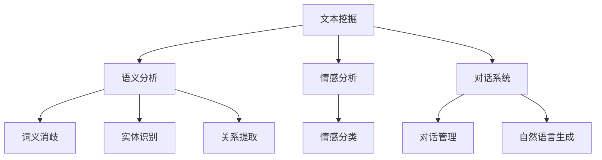
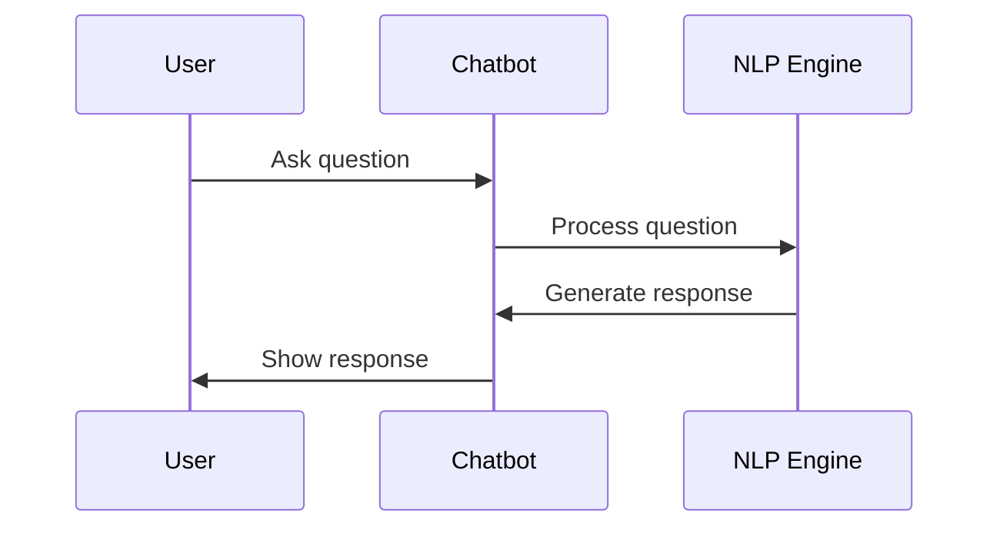
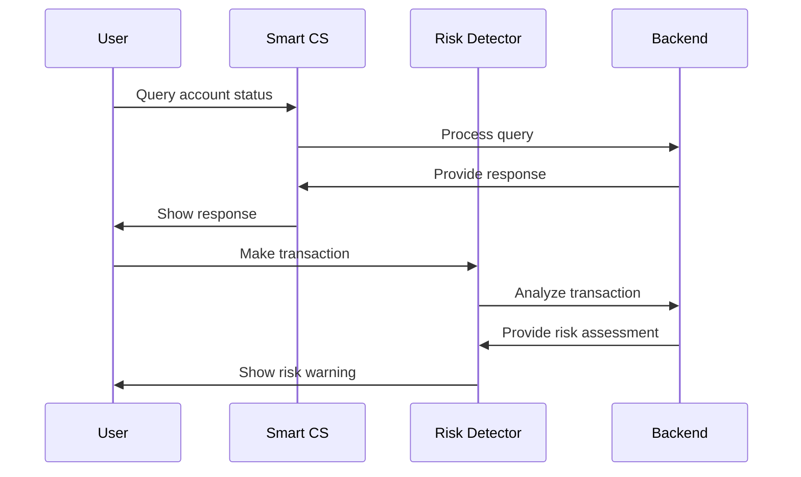
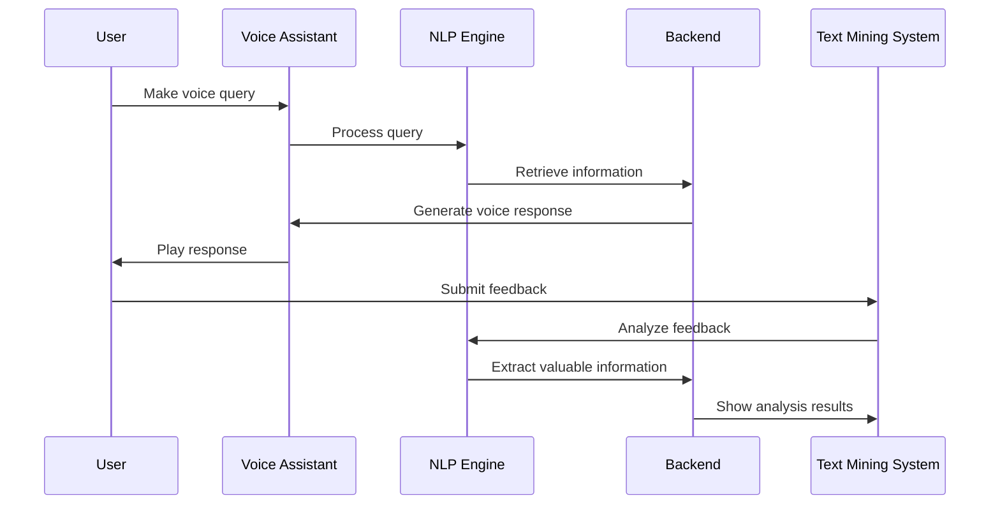

                 

### 第1章: 自然语言处理概述

#### 1.1 问题的背景

自然语言处理（NLP）是人工智能（AI）领域的一个重要分支，其目标是通过理解和生成人类语言来增强计算机与人之间的交互。随着互联网的普及和数字化信息的爆炸式增长，NLP技术的重要性日益凸显。在客户服务领域，传统的服务方式如电话、邮件和在线聊天等，不仅效率低下，而且成本高昂。为了提升客户服务的效率和质量，NLP技术的应用成为了一大革命性的突破点。

#### 1.2 问题描述

客户服务是企业和用户之间的重要纽带，其质量直接影响到企业的声誉和客户的满意度。然而，传统的客户服务方式存在以下几个问题：

1. **响应时间慢**：电话和邮件服务通常需要人工干预，导致响应时间较长。
2. **成本高昂**：雇佣大量客服人员不仅成本高，而且难以满足高峰期的需求。
3. **服务质量不均**：不同客服人员的处理方式和知识水平可能导致服务质量不均。
4. **数据分析困难**：传统服务方式难以收集和分析客户反馈，限制了企业对服务质量的改进。

#### 1.3 问题解决

自然语言处理技术提供了一种解决方案，通过自动化和智能化的方式，可以大幅提升客户服务的效率和质量。以下是一些关键的技术和应用：

1. **聊天机器人**：使用NLP技术构建的聊天机器人可以24/7全天候服务，快速响应客户的查询和请求，大大减少了人工干预的需求。
2. **情感分析**：通过情感分析，系统可以识别客户的情绪和需求，提供更个性化的服务，从而提升客户满意度。
3. **文本挖掘**：文本挖掘技术可以分析客户反馈，提取有价值的信息，帮助企业优化服务流程和策略。
4. **语音助手**：结合语音识别和自然语言生成技术，语音助手可以为用户提供自然、流畅的语音交互体验。

#### 1.4 边界与外延

虽然NLP在客户服务领域具有巨大的应用潜力，但其应用范围远不止于此。NLP技术还可以应用于其他领域，如机器翻译、信息检索、文本生成等。随着技术的不断进步，如深度学习、生成对抗网络等新技术的引入，NLP系统的性能和智能程度也在不断提升。

#### 1.5 概念结构与核心要素组成

自然语言处理的核心概念包括文本挖掘、语义分析、情感分析、对话系统等。文本挖掘涉及从大量文本数据中提取有价值的信息；语义分析旨在理解文本的含义和意图；情感分析用于识别文本中的情感倾向；对话系统则专注于实现人与计算机的自然语言交互。核心要素则包括语言模型、文本预处理、特征提取、模型训练和评估等。

### 概念结构与核心要素组成详细讲解

#### 核心概念

1. **文本挖掘**：文本挖掘是指从大量文本数据中提取有价值信息的过程。这个过程通常包括数据采集、数据清洗、数据分析和数据可视化等多个步骤。

2. **语义分析**：语义分析是NLP的核心任务之一，旨在理解文本的含义和上下文。它包括词义消歧、实体识别、关系提取等子任务。

3. **情感分析**：情感分析（Sentiment Analysis）是一种评估文本表达情感倾向的方法，常见于社交媒体分析、客户反馈评估等领域。

4. **对话系统**：对话系统（Dialogue System）是一种人机交互系统，旨在模拟自然语言对话，能够理解用户的输入并生成自然流畅的回应。

#### 核心要素

1. **语言模型**：语言模型（Language Model）是NLP的基础，用于预测下一个单词或短语的概率。常见的语言模型有n-gram模型、神经网络模型等。

2. **文本预处理**：文本预处理（Text Preprocessing）是指对原始文本进行一系列处理，以提高后续分析的准确性和效率。常见步骤包括分词、词性标注、停用词过滤等。

3. **特征提取**：特征提取（Feature Extraction）是从文本中提取有代表性的特征，用于训练机器学习模型。常见的特征提取方法包括词袋模型、词嵌入等。

4. **模型训练和评估**：模型训练（Model Training）是指使用标注好的数据集来训练机器学习模型。模型评估（Model Evaluation）则是通过测试集来评估模型的性能。

### ER实体关系图架构的 Markdown 格式中的 Mermaid 流程图

### 总结

自然语言处理技术在客户服务中的应用，不仅提升了服务效率和质量，还为企业和用户之间的互动带来了新的可能性。通过文本挖掘、语义分析、情感分析和对话系统等技术，企业可以更深入地理解用户需求，提供个性化的服务，从而增强用户满意度和忠诚度。随着技术的不断进步，NLP在客户服务中的应用将会更加广泛和深入。在接下来的章节中，我们将详细探讨NLP的核心概念、算法原理及其在客户服务中的具体应用。

### 第2章: 自然语言处理核心概念

#### 2.1 语言模型

语言模型（Language Model）是自然语言处理（NLP）中的基础组成部分，主要用于预测文本序列中的下一个单词或字符。语言模型在许多NLP任务中扮演着关键角色，如机器翻译、语音识别、文本生成和对话系统等。

##### 2.1.1 基本原理

语言模型的基本原理是通过对大量文本数据的学习，建立一个概率模型，用于预测下一个单词或字符。这种预测是基于历史数据的统计规律，即如果一个单词或字符在文本中频繁出现，那么它在下一个位置出现的概率就较高。

##### 2.1.2 常见类型

1. **n-gram模型**：n-gram模型是一种基于历史k个单词的概率模型。例如，二元语法模型（Bigram）是基于前一个单词预测下一个单词的概率。n-gram模型简单直观，易于实现，但在长文本中表现不佳。

2. **神经网络模型**：神经网络模型，特别是深度学习模型，如循环神经网络（RNN）、长短时记忆网络（LSTM）和变压器（Transformer）等，通过学习大量的文本数据来建立复杂的概率模型。这些模型能够捕捉到长距离依赖关系，从而在处理长文本时表现出更好的性能。

##### 2.1.3 应用实例

- **机器翻译**：在机器翻译中，语言模型用于预测目标语言中的下一个单词，从而生成流畅的翻译文本。
- **语音识别**：语音识别系统使用语言模型来预测用户语音输入的文本序列，提高识别的准确性。
- **文本生成**：在文本生成任务中，语言模型被用来生成连贯的自然语言文本，如文章摘要、对话生成等。

#### 2.2 文本预处理

文本预处理（Text Preprocessing）是NLP任务中的重要步骤，旨在将原始文本数据转换为适合模型训练的形式。文本预处理包括一系列操作，如分词、词性标注、停用词过滤等。

##### 2.2.1 方法与技巧

1. **分词**：分词是将文本切分成一组单词或短语的步骤。常用的分词方法包括基于规则的分词、基于统计的分词和基于深度学习的分词。中文文本的分词通常更复杂，因为中文没有明确的单词分隔符号。

2. **词性标注**：词性标注是对每个词进行分类的过程，标记其词性（如名词、动词、形容词等）。词性标注有助于理解文本的语义结构和含义。

3. **停用词过滤**：停用词（Stop Words）是指对文本理解没有太大贡献的常见词（如“的”、“和”、“在”等）。过滤停用词可以减少数据的冗余，提高分析效率。

##### 2.2.2 不同语言的文本处理

1. **英文文本处理**：英文文本预处理相对简单，因为英文单词之间有明显的空格分隔，且词性标注工具较为成熟。

2. **中文文本处理**：中文文本处理更为复杂，因为中文没有空格分隔，分词成为关键步骤。此外，中文词性标注也更具挑战性，因为很多词可以有多种词性。

#### 2.3 语义分析

语义分析（Semantic Analysis）是NLP中的高级任务，旨在理解文本的深层含义和意图。语义分析包括词义消歧、实体识别、关系提取和语义角色标注等子任务。

##### 2.3.1 方法

1. **词义消歧**：词义消歧（Word Sense Disambiguation）是指识别一个词在不同上下文中的确切含义。例如，“bank”可以指银行或河岸，词义消歧需要根据上下文确定其正确含义。

2. **实体识别**：实体识别（Entity Recognition）是指识别文本中的命名实体，如人名、地点、组织名等。实体识别有助于理解文本的主题和关键信息。

3. **关系提取**：关系提取（Relation Extraction）是指识别实体之间的关系。例如，在句子“美国总统是乔·拜登”中，关系是“是”，实体是“美国总统”和“乔·拜登”。

4. **语义角色标注**：语义角色标注（Semantic Role Labeling）是指识别句子中词的语义角色，如动作执行者、受事者、工具等。

##### 2.3.2 应用

- **问答系统**：语义分析有助于构建问答系统，能够理解用户的问题并给出准确的答案。
- **信息抽取**：在信息抽取任务中，语义分析用于提取文本中的重要信息，如事件、事实和关系。

#### 2.4 情感分析

情感分析（Sentiment Analysis）是NLP中用于识别文本中情感倾向的一种方法。情感分析广泛应用于社交媒体分析、市场调研、客户反馈分析等领域。

##### 2.4.1 基本原理

情感分析的基本原理是使用机器学习或深度学习模型来识别文本中的情感极性（如正面、负面或中性）和情感强度。

##### 2.4.2 常见模型

1. **传统机器学习模型**：如支持向量机（SVM）、朴素贝叶斯（Naive Bayes）和逻辑回归（Logistic Regression）等。

2. **深度学习模型**：如卷积神经网络（CNN）、循环神经网络（RNN）和变压器（Transformer）等。深度学习模型在处理复杂情感时表现出色。

##### 2.4.3 应用

- **社交媒体分析**：情感分析可用于分析社交媒体上的用户评论和反馈，帮助企业了解市场动态和客户需求。
- **客户反馈分析**：企业可以利用情感分析评估客户满意度，从而改进产品和服务。

### 总结

自然语言处理的核心概念包括语言模型、文本预处理、语义分析和情感分析。这些概念和技术在NLP的各个子领域中发挥着关键作用。通过理解这些核心概念，我们可以更好地利用NLP技术提升客户服务的效率和质量。在接下来的章节中，我们将进一步探讨自然语言处理算法的原理及其在客户服务中的具体应用。

### 第3章: 自然语言处理算法原理

#### 3.1 词嵌入

词嵌入（Word Embedding）是将词汇映射到连续向量空间的一种方法，其核心思想是将语义上相似的词映射到空间上接近的位置。词嵌入技术是自然语言处理中的基础，广泛应用于各种任务，如文本分类、情感分析、机器翻译等。

##### 3.1.1 原理

词嵌入的基本原理是通过学习得到一个词向量（word vector）表示，每个词向量都是高维空间中的一个点。词向量不仅可以表示词的语义信息，还可以捕捉词与词之间的关系。常见的词嵌入算法包括Word2Vec、GloVe和FastText等。

- **Word2Vec**：Word2Vec算法由Google提出，主要包括两种模型：连续词袋（CBOW）和Skip-gram。CBOW模型通过上下文词的均值来预测中心词，而Skip-gram模型则通过中心词来预测上下文词。

- **GloVe**：GloVe（Global Vectors for Word Representation）算法通过考虑词频和词共现信息来生成词向量。GloVe模型利用矩阵分解技术，将词频矩阵和词共现矩阵分解为词向量矩阵。

- **FastText**：FastText是由Facebook AI研究院提出的一种改进的词嵌入方法。它将词嵌入扩展到字符级别，通过字符级的组合来生成词向量，从而提高了词嵌入的准确性和泛化能力。

##### 3.1.2 应用实例

- **文本分类**：词嵌入技术可以用于文本分类任务，通过将文本中的每个词映射到词向量空间，然后计算整个文本的向量表示，从而实现分类。

- **情感分析**：在情感分析中，词嵌入技术可以帮助模型理解词汇的情感倾向，从而准确预测文本的情感极性。

- **机器翻译**：在机器翻译任务中，词嵌入技术用于将源语言和目标语言的词汇映射到共同的向量空间，从而提高翻译质量。

#### 3.2 递归神经网络（RNN）

递归神经网络（Recurrent Neural Network，RNN）是一种专门用于处理序列数据的神经网络。RNN通过其递归结构能够捕捉序列中的时间依赖关系，因此在自然语言处理任务中有着广泛的应用。

##### 3.2.1 原理

RNN的基本原理是在每个时间步上，网络将当前输入和上一个时间步的隐藏状态结合起来，更新隐藏状态。这种递归性使得RNN能够记住之前的信息，从而处理序列数据。

- **基本RNN**：基本的RNN由输入层、隐藏层和输出层组成。每个时间步，网络都会接收一个新的输入并更新隐藏状态。

- **LSTM（长短时记忆网络）**：LSTM是RNN的一种变体，通过引入门控机制（gate）来避免基本RNN中的梯度消失问题。LSTM能够记住长序列中的信息，适用于需要长期记忆的任务。

- **GRU（门控循环单元）**：GRU是另一种RNN变体，相对于LSTM结构更简单，计算效率更高。GRU通过更新门和控制门来管理信息流。

##### 3.2.2 应用实例

- **语言模型**：RNN及其变体广泛用于语言模型构建，通过训练RNN模型，可以生成高质量的文本序列。

- **机器翻译**：RNN在机器翻译任务中用于将源语言序列转换为目标语言序列，通过学习编码器和解码器的RNN模型，实现不同语言之间的翻译。

- **语音识别**：RNN在语音识别中用于将语音信号转换为文本序列，通过训练RNN模型，可以识别并转写语音中的单词和句子。

#### 3.3 生成对抗网络（GAN）

生成对抗网络（Generative Adversarial Network，GAN）是一种深度学习模型，由两个神经网络组成：生成器（Generator）和判别器（Discriminator）。GAN通过一个对抗性训练过程来生成高质量的数据。

##### 3.3.1 原理

GAN的工作原理可以类比为两个人玩游戏：生成器和判别器。生成器的目标是生成尽可能真实的数据，而判别器的目标是区分生成的数据和真实数据。在训练过程中，生成器和判别器相互对抗，不断调整自己的参数，最终生成器能够生成高质量的数据。

- **生成器**：生成器的目标是生成与真实数据相似的数据。在图像生成任务中，生成器通常生成一个噪声向量，并通过多层神经网络将其转换为图像。

- **判别器**：判别器的目标是区分生成器和真实数据。判别器接受真实数据和生成器生成的数据作为输入，并输出一个概率值，表示输入数据的真实性。

##### 3.3.2 应用实例

- **图像生成**：GAN在图像生成任务中表现出色，可以生成高质量的图像，如人脸、风景等。

- **文本生成**：GAN也可以用于文本生成任务，通过生成器和判别器的对抗性训练，生成自然语言文本。

- **数据增强**：GAN可以用于生成训练数据，特别是在数据稀缺的情况下，通过GAN生成的数据可以增强模型的训练效果。

### 总结

自然语言处理算法的原理包括词嵌入、递归神经网络（RNN）和生成对抗网络（GAN）。词嵌入用于将词汇映射到向量空间，以捕捉词与词之间的关系；RNN及其变体（如LSTM和GRU）用于处理序列数据，捕捉时间依赖关系；GAN通过生成对抗性训练，生成高质量的数据。这些算法在自然语言处理任务中有着广泛的应用，如语言模型、机器翻译、文本生成等。理解这些算法原理，有助于我们更好地应用NLP技术，提升客户服务的效率和质量。在接下来的章节中，我们将进一步探讨NLP在客户服务中的具体应用场景。

### 第4章: 自然语言处理在客户服务中的应用

#### 4.1 聊天机器人

聊天机器人（Chatbot）是自然语言处理在客户服务中的一项重要应用。聊天机器人通过模拟人类的对话方式，与用户进行交互，能够回答常见问题、提供个性化服务、处理投诉等。

##### 4.1.1 基本原理

聊天机器人的基本原理是利用自然语言处理技术，包括语言模型、对话管理和语音合成等，实现人与机器之间的自然语言交互。聊天机器人通常包含以下几个关键组成部分：

1. **语言模型**：用于理解和生成自然语言文本，实现对话的自动回复。
2. **对话管理**：管理对话流程，包括理解用户意图、生成回复和上下文跟踪。
3. **语音合成**：将文本转换为语音输出，提供语音交互体验。

##### 4.1.2 构建步骤

构建一个高效的聊天机器人通常需要以下步骤：

1. **需求分析**：确定聊天机器人的功能需求和目标用户群体。
2. **设计对话流程**：设计聊天机器人的对话流程和回复策略，确保对话的自然性和准确性。
3. **选择技术栈**：选择合适的自然语言处理框架和工具，如Rasa、ChatterBot等。
4. **数据收集和预处理**：收集对话数据并进行预处理，用于训练语言模型和对话管理模型。
5. **模型训练和优化**：训练语言模型和对话管理模型，并进行优化，以提高聊天机器人的性能。
6. **部署和监控**：将聊天机器人部署到生产环境中，并进行实时监控和性能评估。

##### 4.1.3 性能评估

评估聊天机器人的性能通常包括以下几个指标：

1. **响应速度**：聊天机器人的响应时间应该尽可能短，以提高用户体验。
2. **准确率**：聊天机器人理解用户意图和生成回复的准确率。
3. **用户体验**：用户对聊天机器人的整体满意度，包括对话的自然性和流畅度。
4. **业务指标**：如问题解决率、用户留存率等，用于衡量聊天机器人在业务上的效果。

#### 4.2 语音助手

语音助手（Voice Assistant）是另一种自然语言处理在客户服务中的典型应用。语音助手通过语音识别和自然语言生成技术，为用户提供语音交互服务，如查询天气、播放音乐、控制智能家居等。

##### 4.2.1 基本原理

语音助手的基本原理是结合语音识别和自然语言处理技术，实现语音输入到文本的转换，以及文本到语音输出的转换。语音助手的主要组成部分包括：

1. **语音识别**：将用户的语音输入转换为文本，用于理解用户指令。
2. **自然语言处理**：对转换后的文本进行处理，理解用户意图并生成回复。
3. **语音合成**：将回复文本转换为自然流畅的语音输出。

##### 4.2.2 应用实例

1. **智能客服**：语音助手可以应用于智能客服系统，用户通过语音输入问题，系统自动提供相应的解答，提高客服效率和质量。
2. **智能家居**：用户可以通过语音助手控制智能家居设备，如开关灯、调节空调温度等，实现更便捷的家居控制。
3. **信息查询**：语音助手可以用于提供天气预报、新闻资讯、交通信息等查询服务，方便用户快速获取所需信息。

##### 4.2.3 技术挑战

语音助手在应用过程中面临一些技术挑战：

1. **语音识别准确率**：提高语音识别的准确率是语音助手的关键，特别是在嘈杂环境或方言口音下。
2. **自然语言理解**：语音助手需要准确理解用户的语音输入，包括多义词处理、上下文理解等。
3. **语音合成自然度**：生成的语音输出需要自然流畅，避免机械化的感觉。

#### 4.3 情感分析

情感分析（Sentiment Analysis）是自然语言处理中的一种高级应用，用于识别文本中的情感倾向和情绪。情感分析在客户服务中具有重要意义，可以帮助企业了解客户的需求和满意度，从而改进服务质量。

##### 4.3.1 基本原理

情感分析的基本原理是通过机器学习或深度学习模型，对文本进行情感分类，判断其是正面、负面还是中性情感。情感分析通常包括以下几个步骤：

1. **数据收集**：收集包含情感标签的文本数据，用于训练情感分析模型。
2. **特征提取**：从文本中提取有助于情感分类的特征，如词频、词嵌入等。
3. **模型训练**：使用训练数据训练情感分析模型，如支持向量机（SVM）、朴素贝叶斯（Naive Bayes）或深度学习模型。
4. **模型评估**：使用测试数据评估模型的性能，包括准确率、召回率等指标。

##### 4.3.2 应用实例

1. **社交媒体分析**：企业可以通过情感分析分析社交媒体上的用户评论和反馈，了解用户对产品和服务的态度，及时调整市场策略。
2. **客户反馈分析**：企业可以通过情感分析分析客户反馈，识别潜在问题和改进机会，提高客户满意度。
3. **舆情监控**：政府和企业可以利用情感分析监控公众对特定事件或政策的反应，及时应对舆情变化。

##### 4.3.3 挑战与解决方案

情感分析在应用过程中面临一些挑战：

1. **情感表达的多样性**：情感表达方式多样，如隐喻、反讽等，增加了情感分析的难度。
2. **语言变化**：不同地区和群体的语言表达可能存在差异，增加了模型的泛化难度。

解决这些挑战的方法包括：

1. **使用更多样化的数据集**：收集涵盖多种情感表达方式和语言变化的数据集，以提高模型的泛化能力。
2. **引入上下文信息**：利用上下文信息，如句子结构、上下文环境等，帮助模型更好地理解情感表达。
3. **深度学习模型**：使用深度学习模型，如卷积神经网络（CNN）和变压器（Transformer），可以更好地捕捉文本中的复杂关系。

### 总结

自然语言处理在客户服务中的应用，包括聊天机器人、语音助手和情感分析，极大地提升了客户服务的效率和质量。通过语言模型、对话管理和语音合成等技术，聊天机器人可以实现24/7全天候服务，提高响应速度和准确性。语音助手通过语音识别和自然语言生成技术，为用户提供便捷的语音交互体验。情感分析则帮助企业深入了解客户需求和满意度，优化服务质量。在接下来的章节中，我们将进一步分析NLP在不同行业中的具体应用案例。

### 第5章: 自然语言处理在客户服务中的案例分析

#### 5.1 案例一：大型电商平台

大型电商平台通过引入自然语言处理技术，显著提升了客户服务质量。以下是一个具体的案例：

**项目介绍**：

某大型电商平台引入了基于NLP技术的聊天机器人，以提升用户购物体验。该聊天机器人能够回答用户关于商品、订单状态、支付方式等常见问题，减少用户等待时间和客服工作量。

**系统功能设计**：

- **问答功能**：聊天机器人通过自然语言处理技术理解用户的问题，并提供准确的答案。
- **情感分析**：系统对用户提问进行情感分析，以识别用户情绪，提供更贴心的服务。
- **个性化推荐**：聊天机器人根据用户的购物历史和偏好，提供个性化推荐。
- **多语言支持**：聊天机器人支持多种语言，以满足不同地区用户的需求。

**系统架构设计**：

- **前端**：用户通过网页或移动应用与聊天机器人交互。
- **后端**：包括自然语言处理引擎、数据库、API接口等。
- **自然语言处理引擎**：负责处理用户输入，包括问答、情感分析和个性化推荐。
- **数据库**：存储用户信息、商品数据、问答记录等。

**系统接口设计**：

- **API接口**：提供与其他系统的接口，如电商平台的后台系统、支付系统等。

**系统交互Mermaid序列图**：

**实际案例分析与详细讲解剖析**：

该平台通过聊天机器人实现了以下效果：

- **问题解决率**：聊天机器人能够快速响应用户问题，问题解决率显著提高。
- **用户满意度**：用户对聊天机器人的响应速度和准确度表示满意，提高了整体购物体验。
- **客服成本**：通过聊天机器人处理大量常见问题，客服工作量显著减少，降低了客服成本。

**项目小结**：

该大型电商平台通过引入NLP技术，成功提升了客户服务质量，减少了客服成本，提高了用户满意度。未来，随着NLP技术的不断进步，聊天机器人将更加智能和高效，为用户提供更好的服务。

#### 5.2 案例二：金融服务行业

金融服务行业通过自然语言处理技术，提升了客户服务和风险管理能力。以下是一个具体的案例：

**项目介绍**：

某金融服务公司引入了基于NLP技术的智能客服系统和风险预警系统，以优化客户服务和风险控制。

**系统功能设计**：

- **智能客服**：智能客服系统通过自然语言处理技术，自动回答用户关于账户状态、理财产品等常见问题，减少人工客服工作量。
- **风险预警**：风险预警系统通过分析用户行为和交易记录，识别潜在风险，并提供预警和建议。
- **客户情感分析**：系统对用户反馈和投诉进行分析，识别客户情感倾向，提供改进服务。

**系统架构设计**：

- **前端**：用户通过网页或移动应用与智能客服和风险预警系统交互。
- **后端**：包括自然语言处理引擎、风险模型、数据库、API接口等。
- **自然语言处理引擎**：负责处理用户输入，包括智能客服对话和情感分析。
- **风险模型**：用于分析用户行为和交易记录，识别潜在风险。
- **数据库**：存储用户信息、交易记录、投诉记录等。

**系统接口设计**：

- **API接口**：提供与其他系统的接口，如银行后台系统、风险控制系统等。

**系统交互Mermaid序列图**：

**实际案例分析与详细讲解剖析**：

该金融服务公司通过NLP技术实现了以下效果：

- **客服效率**：智能客服系统能够快速响应用户查询，提高了客服效率。
- **风险控制**：风险预警系统通过分析用户行为和交易记录，有效识别潜在风险，降低了金融风险。
- **客户满意度**：客户对智能客服和风险预警系统的反馈积极，满意度显著提高。

**项目小结**：

该金融服务公司通过引入NLP技术，成功优化了客户服务和风险管理，提高了业务效率和客户满意度。未来，随着NLP技术的不断进步，金融服务行业将实现更智能、更高效的客户服务。

#### 5.3 案例三：电信行业

电信行业通过自然语言处理技术，提升了客户服务质量和运营效率。以下是一个具体的案例：

**项目介绍**：

某电信公司引入了基于NLP技术的语音助手和文本挖掘系统，以优化客户服务和运营管理。

**系统功能设计**：

- **语音助手**：语音助手通过自然语言处理技术，为用户提供语音查询和交互服务，如查询账单、变更套餐等。
- **文本挖掘**：文本挖掘系统通过分析用户反馈和投诉，提取有价值的信息，用于改进服务和运营策略。
- **情感分析**：系统对用户反馈和投诉进行情感分析，识别客户情绪，提供改进服务。

**系统架构设计**：

- **前端**：用户通过电话或移动应用与语音助手和文本挖掘系统交互。
- **后端**：包括语音识别和自然语言处理引擎、数据库、API接口等。
- **语音识别和自然语言处理引擎**：负责处理用户语音输入和文本输出。
- **数据库**：存储用户信息、通话记录、文本数据等。

**系统接口设计**：

- **API接口**：提供与其他系统的接口，如客服后台系统、运营管理系统等。

**系统交互Mermaid序列图**：

**实际案例分析与详细讲解剖析**：

该电信公司通过NLP技术实现了以下效果：

- **服务效率**：语音助手能够快速响应用户查询，提高了服务效率。
- **运营优化**：文本挖掘系统通过分析用户反馈，为运营决策提供了有价值的信息。
- **客户满意度**：客户对语音助手和文本挖掘系统的反馈积极，满意度显著提高。

**项目小结**：

该电信公司通过引入NLP技术，成功优化了客户服务和运营管理，提高了业务效率和客户满意度。未来，随着NLP技术的不断进步，电信行业将实现更智能、更高效的客户服务。

### 总结

自然语言处理技术在客户服务中的应用，为不同行业带来了显著的效益。无论是电商平台、金融服务行业还是电信行业，NLP技术都通过提升服务效率、优化运营管理和提高客户满意度，实现了业务价值的最大化。在接下来的章节中，我们将进一步探讨自然语言处理在客户服务中的最佳实践，以期为读者提供实用的指导。

### 第6章: 自然语言处理在客户服务中的最佳实践

#### 6.1 实践一：构建高效的聊天机器人

构建一个高效的聊天机器人是提升客户服务质量的重要途径。以下是一些关键步骤和最佳实践：

##### 6.1.1 选择合适的技术栈

- **自然语言处理框架**：选择合适的NLP框架，如Rasa、ChatterBot等，这些框架提供了丰富的API和工具，有助于快速开发聊天机器人。
- **语言模型**：根据具体需求选择合适的语言模型，如n-gram模型、神经网络模型等。深度学习模型在处理复杂对话时表现更好。
- **对话管理**：采用先进的对话管理策略，如基于规则的对话管理和基于机器学习的对话管理，以提高对话的自然性和流畅性。

##### 6.1.2 数据收集与预处理

- **数据源**：收集多样化的对话数据，包括常见问题、用户反馈和投诉等。确保数据覆盖多种场景和用户群体。
- **数据预处理**：对对话数据进行清洗和标注，提取有用的信息，并去除噪声数据。数据预处理步骤包括分词、词性标注、情感分析等。

##### 6.1.3 对话流程设计

- **意图识别**：设计清晰明确的意图识别流程，确保聊天机器人能够准确理解用户的意图。
- **上下文管理**：合理管理对话上下文，避免对话中的歧义和重复。上下文管理包括对话历史记录、上下文更新等。

##### 6.1.4 性能评估与优化

- **性能评估**：定期评估聊天机器人的性能，包括响应速度、准确率、用户体验等。使用A/B测试等方法，不断优化对话流程和模型参数。
- **用户反馈**：收集用户对聊天机器人的反馈，及时调整和改进系统。

#### 6.2 实践二：情感分析的应用

情感分析在提升客户服务质量和优化服务策略方面发挥着重要作用。以下是一些最佳实践：

##### 6.2.1 选择合适的情感分析模型

- **传统机器学习模型**：如支持向量机（SVM）、朴素贝叶斯（Naive Bayes）等，适用于简单情感分类任务。
- **深度学习模型**：如卷积神经网络（CNN）、循环神经网络（RNN）、变压器（Transformer）等，适用于复杂情感分类任务。

##### 6.2.2 数据收集与预处理

- **数据源**：收集包含情感标签的文本数据，包括用户评论、社交媒体反馈、客户调查等。
- **数据预处理**：对文本数据进行清洗和标注，提取情感相关的特征，如词频、词嵌入等。

##### 6.2.3 情感分析应用场景

- **客户反馈分析**：分析客户反馈中的情感倾向，识别用户满意度、痛点等。
- **服务优化**：根据情感分析结果，调整服务策略，如改进客服流程、优化产品特性等。
- **市场调研**：分析社交媒体上的用户情感，了解市场趋势和用户需求。

##### 6.2.4 模型评估与优化

- **模型评估**：使用测试集评估情感分析模型的性能，包括准确率、召回率等指标。
- **优化策略**：根据评估结果，优化模型参数和特征提取方法，提高模型性能。

#### 6.3 实践三：语音助手的设计与实现

语音助手在提供便捷、自然的语音交互体验方面具有重要意义。以下是一些关键步骤和最佳实践：

##### 6.3.1 语音识别与自然语言处理

- **语音识别**：选择高效的语音识别系统，如基于深度学习的ASR（Automatic Speech Recognition）系统，提高识别准确率。
- **自然语言处理**：结合语言模型、对话管理和语音合成技术，实现自然流畅的语音交互。

##### 6.3.2 交互流程设计

- **意图识别**：设计清晰的意图识别流程，确保语音助手能够准确理解用户的语音指令。
- **上下文管理**：合理管理对话上下文，避免语音交互中的歧义和重复。

##### 6.3.3 用户体验优化

- **交互自然度**：优化语音合成技术，提高语音输出的自然度和流畅度。
- **多语言支持**：提供多语言支持，满足不同地区用户的需求。

##### 6.3.4 系统性能优化

- **响应速度**：优化系统架构和算法，提高语音助手的响应速度。
- **错误处理**：设计合理的错误处理机制，确保用户在遇到问题时能够得到及时有效的帮助。

### 总结

构建高效的聊天机器人、应用情感分析和设计高质量的语音助手是自然语言处理在客户服务中的三大最佳实践。这些实践不仅提升了客户服务的效率和质量，还为企业和用户之间的互动带来了新的可能性。随着NLP技术的不断进步，这些最佳实践将继续优化和完善，为用户提供更加智能、贴心的服务。

### 小结

在本文中，我们详细探讨了自然语言处理（NLP）在客户服务中的革命性应用。通过语言模型、文本预处理、语义分析、情感分析、对话系统等核心概念，NLP技术不仅显著提升了客户服务的效率和质量，还为企业和用户之间的互动带来了新的可能性。从聊天机器人到语音助手，再到情感分析，NLP技术在客户服务中的多方面应用，极大地优化了用户体验，降低了服务成本。

随着技术的不断进步，如深度学习、生成对抗网络等新技术的引入，NLP系统的性能和智能程度也在不断提升。未来，NLP在客户服务中的应用将更加广泛和深入，不仅限于传统的客户互动场景，还将扩展到个性化推荐、智能助理、自动化决策等领域。

在技术发展的同时，我们也需关注NLP技术在应用过程中可能带来的挑战和风险。例如，如何保证模型在不同语言和文化背景下的通用性，如何防止数据隐私泄露，以及如何提高模型的透明度和解释性等。这些问题需要我们在实际应用中不断探索和解决。

对于读者来说，掌握NLP的基本概念和原理，理解其在客户服务中的应用场景和最佳实践，将有助于更好地利用这项技术，提升业务效率和用户体验。同时，保持对新技术的关注和探索，将有助于抓住未来的机遇，推动业务的发展和创新。

### 注意事项

1. **数据隐私保护**：在使用NLP技术时，确保用户数据的安全和隐私。严格遵守相关法律法规，避免数据泄露和滥用。
2. **跨语言和文化兼容性**：在设计NLP系统时，考虑跨语言和文化差异，确保系统能够在不同语言和文化背景下正常运行。
3. **模型解释性**：提高NLP模型的透明度和解释性，以便用户和开发者能够理解模型的决策过程，减少误用和误解。
4. **持续优化**：定期评估和优化NLP系统的性能，及时更新模型和算法，以适应不断变化的需求和环境。

### 拓展阅读

- 《自然语言处理综论》（Daniel Jurafsky & James H. Martin）
- 《深度学习》（Ian Goodfellow、Yoshua Bengio & Aaron Courville）
- 《机器学习实战》（Peter Harrington）
- 《Python自然语言处理》（Steven Bird、Ewan Klein & Edward Loper）
- 《NLP技术与实践》（刘知远、刘俊、张奇）
- 《人工智能简史》（George Zarkadakis）

通过阅读这些书籍，读者可以更深入地了解自然语言处理的理论基础和应用实践，为未来的研究和应用提供有力支持。

