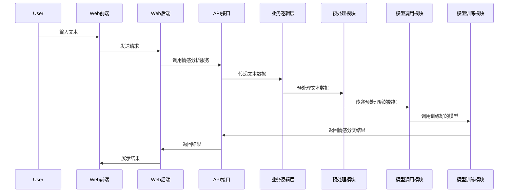

                 

### 引言

自然语言处理（NLP）是计算机科学、人工智能和语言学等领域交叉的产物。随着互联网和社交媒体的快速发展，人们对处理和分析文本数据的需求日益增长。情感分析作为NLP的一个重要分支，旨在识别和提取文本数据中的主观信息，从而为商业、政治、学术等领域提供决策支持。本书旨在全面探讨情感分析的理论基础、技术方法以及在实际应用中的挑战和解决方案。

### 关键词

- 自然语言处理（NLP）
- 情感分析
- 文本预处理
- 机器学习
- 深度学习
- 评估指标
- 系统架构

### 摘要

本文将深入探讨自然语言处理（NLP）中的情感分析领域，首先介绍情感分析的基本概念、应用场景以及面临的挑战。接着，我们将详细讨论文本预处理的方法，包括数据采集与清洗、词干提取与词形还原、停用词过滤以及词袋模型与TF-IDF。随后，文章将介绍情感分析的核心模型与算法，涵盖基于规则的方法、基于机器学习的方法和基于深度学习的方法，并探讨各类方法的评估指标。在此基础上，文章将深入讲解情感分析算法的原理与实现，通过Python代码展示算法的工作流程。随后，文章将介绍情感分析系统的架构设计与实现，包括系统需求分析、领域模型设计、系统架构设计、系统接口设计与交互。最后，文章将通过一个情感分析项目实战案例，展示从环境安装到模型部署的全过程，并对项目进行详细解读和分析。本文旨在为读者提供一个全面而深入的关于情感分析的理论和实践指导。

### 目录大纲

#### 引言
- **自然语言处理（NLP）的背景与情感分析的重要性**
- **情感分析的广泛应用**
- **本书的结构与内容概述**

#### 第一部分：背景介绍

##### 第1章：情感分析概述
- **情感分析的定义与问题背景**
  - **情感分析的基本概念**
  - **情感分析的应用场景**
  - **情感分析的重要性**
- **情感分析的挑战**
  - **语言的多义性**
  - **情感强度的量化**
  - **情感极性分类**
- **情感分析的历史与发展趋势**
  - **情感分析的发展历程**
  - **当前研究热点与趋势**

##### 第2章：文本预处理
- **数据采集与清洗**
  - **数据来源**
  - **数据预处理流程**
  - **常用文本预处理方法**
- **词干提取与词形还原**
  - **词干提取技术**
  - **词形还原方法**
- **停用词过滤**
  - **停用词表**
  - **停用词过滤策略**
- **词袋模型与TF-IDF**
  - **词袋模型**
  - **TF-IDF方法**

#### 第二部分：核心概念与联系

##### 第3章：情感分析模型与算法
- **基于规则的方法**
  - **基于词典的方法**
  - **基于规则库的方法**
- **基于机器学习的方法**
  - **分类算法**
  - **回归算法**
- **基于深度学习的方法**
  - **卷积神经网络（CNN）**
  - **递归神经网络（RNN）**
  - **长短期记忆网络（LSTM）**
  - **自注意力机制与Transformer**
- **情感分析的评估指标**
  - **准确率（Accuracy）**
  - **召回率（Recall）**
  - **F1分数（F1 Score）**
  - **宏平均与微平均**

#### 第三部分：算法原理讲解

##### 第4章：情感分析算法原理与实现
- **情感分析算法原理**
  - **情感分析的基本流程**
  - **情感分析的关键技术**
- **基于机器学习的情感分析算法**
  - **支持向量机（SVM）**
  - **决策树与随机森林**
  - **朴素贝叶斯分类器**
- **基于深度学习的情感分析算法**
  - **卷积神经网络（CNN）**
  - **递归神经网络（RNN）**
  - **长短期记忆网络（LSTM）**
- **算法实现与性能优化**
  - **数据集准备与划分**
  - **模型训练与调优**
  - **模型评估与结果分析**

#### 第四部分：系统分析与架构设计

##### 第5章：情感分析系统架构与实现
- **系统需求分析**
  - **系统功能需求**
  - **系统性能需求**
- **领域模型设计**
  - **模型概述**
  - **类图与实体关系图**
- **系统架构设计**
  - **系统架构概述**
  - **架构组件设计**
  - **系统架构图**
- **系统接口设计与交互**
  - **接口设计原则**
  - **接口实现与调用**

#### 第五部分：项目实战

##### 第6章：情感分析项目实战
- **项目介绍**
  - **项目背景**
  - **项目目标**
- **环境安装与配置**
  - **硬件与软件环境**
  - **相关库与依赖安装**
- **系统核心实现**
  - **数据处理**
  - **模型训练与评估**
  - **模型部署与调用**
- **代码解读与分析**
  - **数据处理代码解读**
  - **模型训练代码解读**
  - **模型部署代码解读**
- **实际案例分析**
  - **案例介绍**
  - **详细讲解剖析**
- **项目小结**

#### 最佳实践 Tips、小结、注意事项、拓展阅读

### 引言

自然语言处理（NLP）是计算机科学、人工智能和语言学等领域交叉的产物。随着互联网和社交媒体的快速发展，人们对处理和分析文本数据的需求日益增长。情感分析作为NLP的一个重要分支，旨在识别和提取文本数据中的主观信息，从而为商业、政治、学术等领域提供决策支持。情感分析不仅能够帮助我们理解用户的需求和情感倾向，还能够为市场分析、舆情监测、金融风控等提供数据支持。

本书旨在全面探讨情感分析的理论基础、技术方法以及在实际应用中的挑战和解决方案。首先，我们将介绍情感分析的基本概念、应用场景以及面临的挑战。接着，我们将详细讨论文本预处理的方法，包括数据采集与清洗、词干提取与词形还原、停用词过滤以及词袋模型与TF-IDF。随后，文章将介绍情感分析的核心模型与算法，涵盖基于规则的方法、基于机器学习的方法和基于深度学习的方法，并探讨各类方法的评估指标。

在此基础上，我们将深入讲解情感分析算法的原理与实现，通过Python代码展示算法的工作流程。随后，文章将介绍情感分析系统的架构设计与实现，包括系统需求分析、领域模型设计、系统架构设计、系统接口设计与交互。最后，文章将通过一个情感分析项目实战案例，展示从环境安装到模型部署的全过程，并对项目进行详细解读和分析。本文旨在为读者提供一个全面而深入的关于情感分析的理论和实践指导。

#### 第一部分：背景介绍

#### 第1章：情感分析概述

##### 1.1 情感分析的定义与问题背景

情感分析（Sentiment Analysis），也被称为意见挖掘（Opinion Mining），是指使用自然语言处理技术对文本数据中的主观信息进行识别、提取和分析的过程。其目的是从大量的文本数据中挖掘出人们对特定对象（如产品、服务、事件等）的情感倾向，从而为商业决策、舆情监测、用户行为分析等领域提供数据支持。

情感分析的基本概念包括情感极性（Sentiment Polarity）、情感强度（Sentiment Intensity）和情感分类（Sentiment Classification）。情感极性通常分为正面、负面和中性三种，而情感强度则用于量化情感的程度，例如“很喜欢”与“有点喜欢”的情感强度不同。情感分类则是将文本中的情感倾向归类到具体的极性类别中。

在问题背景方面，情感分析的应用场景非常广泛。例如，在电子商务领域，企业可以利用情感分析来了解消费者对其产品的评价，从而优化产品和服务。在社交媒体领域，情感分析可以帮助平台监控用户对事件、品牌和产品的讨论，以便及时应对负面舆情。在金融领域，情感分析可以用于股票市场预测、风险管理和投资决策。

情感分析的重要性体现在以下几个方面：

1. **用户反馈分析**：企业可以通过对用户评论和反馈的情感分析，了解用户的满意度和不满意度，从而改进产品和服务。
2. **市场趋势预测**：通过分析社交媒体和新闻网站中的情感，企业可以预测市场的趋势和消费者行为，为营销策略提供数据支持。
3. **舆情监测**：政府机构和企业在面对突发事件时，可以利用情感分析监测公众情绪，及时采取应对措施。
4. **学术研究**：学者可以利用情感分析对大量的文本数据进行分析，提取出有价值的研究结论。

##### 1.2 情感分析的挑战

尽管情感分析具有广泛的应用前景，但在实际应用过程中也面临着一系列挑战：

1. **语言的多义性**：自然语言中存在着大量多义词，一个词语在不同的上下文中可能表达不同的情感极性。例如，“好”这个词在“好味道”和“好累”中分别表达正面的和负面的情感，这给情感分析带来了困难。

2. **情感强度的量化**：情感分析不仅要判断情感的极性，还要对情感的强度进行量化。例如，“喜欢”和“非常喜欢”虽然都是正面情感，但强度不同。量化情感强度需要精确的语义分析和技术手段。

3. **情感极性分类**：将文本中的情感倾向正确分类是一个复杂的问题。不同的人可能对同一文本有不同的解读，这使得情感分类的准确性受到限制。

4. **跨领域适应**：情感分析在不同领域的应用可能存在差异，例如在金融领域和医疗领域，文本的情感表达方式和情感极性可能有所不同，需要针对性的模型和算法。

5. **数据稀缺性**：高质量的标注数据是训练和评估情感分析模型的基础，但在实际应用中，获取大量标注数据是一个挑战。

##### 1.3 情感分析的历史与发展趋势

情感分析的历史可以追溯到20世纪90年代，随着自然语言处理技术的发展，情感分析逐渐成为一个独立的研究领域。早期的情感分析主要采用基于规则的方法，依靠人工定义的规则和词典来识别情感。

进入21世纪后，随着机器学习技术的进步，基于机器学习的方法逐渐成为主流。尤其是深度学习技术的引入，使得情感分析的性能得到了显著提升。例如，卷积神经网络（CNN）和递归神经网络（RNN）等深度学习模型在情感分析任务中取得了优异的性能。

当前，情感分析的研究热点包括：

1. **多语言情感分析**：随着全球化的发展，多语言情感分析成为了一个重要的研究方向。研究者致力于开发能够处理多种语言的情感分析模型。

2. **情感强度和情感倾向的联合建模**：为了更准确地理解用户的情感，研究者开始关注情感强度和情感倾向的联合建模，通过整合多方面的信息提高模型的准确性。

3. **跨域情感分析**：如何在不同领域间进行情感分析，使模型在不同领域具有泛化能力，是一个重要的研究课题。

4. **情感分析的实时性**：随着互联网和社交媒体的快速发展，情感分析的实时性变得越来越重要。研究者致力于开发实时情感分析系统，以满足即时决策的需求。

总结而言，情感分析作为一个跨学科的研究领域，随着自然语言处理和人工智能技术的不断进步，其在理论和应用方面都取得了显著的发展。未来，情感分析将在更多的领域中发挥重要作用，成为智能系统理解和应对人类情感需求的重要工具。

##### 1.4 小结

本章对情感分析进行了全面介绍，首先明确了情感分析的定义、问题背景和应用场景。接着，我们讨论了情感分析面临的挑战，包括语言的多义性、情感强度的量化、情感极性分类等问题。最后，回顾了情感分析的发展历程和当前的研究热点。通过对本章内容的理解，读者可以建立起对情感分析的基本认识，为后续章节的学习打下坚实基础。

### 第2章：文本预处理

#### 2.1 数据采集与清洗

文本预处理是情感分析的重要环节，其目的是将原始文本数据转化为适合进行分析的格式。数据采集与清洗是文本预处理的第一步，其质量直接影响后续分析的效果。

##### 2.1.1 数据来源

文本数据可以来源于多种渠道，包括社交媒体、新闻网站、电子商务平台、用户评论等。这些数据不仅形式多样，而且质量参差不齐。为了确保数据的质量，数据来源的选择至关重要。

1. **社交媒体数据**：如Twitter、Facebook等平台，这些数据通常包含了大量的实时用户评论和讨论，能够反映公众的情感和观点。
2. **新闻网站数据**：新闻网站的数据通常更加规范，内容涵盖广泛，是进行情感分析的理想数据源。
3. **电子商务平台数据**：用户在电子商务平台上的评论和反馈是分析产品口碑的重要数据来源。
4. **用户生成内容**：如论坛、博客等，这些数据通常包含了用户对特定事件、产品或服务的详细描述和评价。

##### 2.1.2 数据预处理流程

数据采集之后，需要对其进行预处理，以去除噪声和冗余信息，提高数据的可用性。数据预处理流程通常包括以下步骤：

1. **去重**：去除重复的文本数据，防止重复计算。
2. **去除HTML标签**：文本数据中常包含HTML标签，这些标签不会对情感分析产生影响，需要去除。
3. **字符转换**：将文本中的字符统一转换为小写，以减少因大小写不同而引起的重复数据。
4. **分词**：将文本分割成单词或短语，便于后续处理。
5. **去除停用词**：停用词（如“的”、“是”、“了”等）对情感分析没有贡献，需要去除。
6. **词形还原**：将同根词的不同形式（如“跑”和“跑了”）还原为同一形式，以减少词汇数量。
7. **标注**：为文本数据标注情感极性，以便后续训练和评估模型。

##### 2.1.3 常用文本预处理方法

以下是几种常用的文本预处理方法：

1. **分词**：分词是将文本分割成单词或短语的过程。常见的分词工具包括jieba、NLTK等。
   - **结巴分词**：jieba是一个中文分词工具，支持精确模式、全模式和搜索引擎模式。
   - **NLTK**：NLTK是一个支持多种语言的分词工具，提供了丰富的分词方法。

2. **去除停用词**：停用词对情感分析没有贡献，常用的停用词表包括停用词库和自定义停用词表。
   - **停用词库**：如NLTK中的英文停用词库和中文停用词库。
   - **自定义停用词表**：根据具体应用场景自定义的停用词表，通常包括特定领域内的常见词汇。

3. **词形还原**：词形还原是将同根词的不同形式还原为同一形式的过程。常见的词形还原方法包括 stemming 和 lemmatization。
   - **Stemming**：通过剪切词尾的方式将词还原到词干形式，例如“running”还原为“run”。
   - **Lemmatization**：将词还原为词源形式，例如“run”还原为“run”。

4. **标点符号处理**：标点符号通常不会对情感分析产生直接影响，但在某些情况下可能需要保留，例如情感极性标注。

5. **词干提取与词形还原**：词干提取（Stemming）和词形还原（Lemmatization）是文本预处理中常用的方法，旨在减少词汇数量，简化文本表示。
   - **词干提取**：通过特定的算法将词还原到词干形式，例如Porter Stemmer算法。
   - **词形还原**：将词还原为词源形式，如WordNet Lemmatizer。

##### 2.1.4 数据清洗与标准化

数据清洗是确保数据质量的重要步骤，主要包括以下内容：

1. **去除噪声数据**：如HTML标签、特殊符号和无关文本。
2. **填补缺失数据**：对于缺失的数据，可以使用填充策略，如均值填充、中值填充或随机填充。
3. **异常值处理**：去除或修正异常值，如异常高的评分或异常低的评分。

数据标准化是为了确保数据的一致性和可比性，常见的标准化方法包括：

1. **归一化**：将数据缩放到相同的范围，如0到1之间。
2. **标准化**：将数据缩放到均值为0，标准差为1的分布。

#### 2.2 词干提取与词形还原

词干提取（Stemming）和词形还原（Lemmatization）是文本处理中的两个重要步骤，旨在简化文本表示，提高模型性能。

##### 2.2.1 词干提取技术

词干提取通过剪切词尾的方式将词还原到词干形式。常见的词干提取算法包括：

1. **Porter Stemmer**：最常用的词干提取算法，通过一系列规则将词还原到词干。
2. **Lovins Stemmer**：另一种常用的词干提取算法，比Porter Stemmer更为简单。
3. **Snowball Stemmer**：支持多种语言的词干提取算法，能够处理多种语言的文本。

##### 2.2.2 词形还原方法

词形还原将词还原为词源形式，能够保留更多的语义信息。常见的词形还原方法包括：

1. **WordNet Lemmatizer**：基于WordNet词库的词形还原工具，将词还原为其基本形式。
2. **NLTK Lemmatizer**：NLTK库中的词形还原工具，支持多种语言的文本。

词干提取和词形还原的区别在于：

- **词干提取**：通过剪切词尾的方式简化词的形式，保留较少的语义信息。
- **词形还原**：将词还原为词源形式，保留更多的语义信息，但计算成本较高。

在实际应用中，词形还原通常比词干提取更为准确，但速度较慢。因此，可以根据具体需求选择合适的词干提取或词形还原方法。

#### 2.3 停用词过滤

停用词过滤是文本预处理中重要的一环，旨在去除对情感分析没有贡献的常见单词或短语。常见的停用词包括：

- **功能词**：如“的”、“是”、“了”等。
- **常用名词**：如“公司”、“产品”、“服务”等。
- **无意义词**：如“啊”、“哦”、“哈哈”等。

##### 2.3.1 停用词表

常用的停用词表包括：

1. **英文停用词表**：如NLTK提供的英文停用词表。
2. **中文停用词表**：如jieba分词工具提供的中文停用词表。

##### 2.3.2 停用词过滤策略

停用词过滤策略包括：

1. **基于列表的过滤**：根据预定义的停用词列表进行过滤。
2. **基于频率的过滤**：过滤掉频率低于一定阈值的词。
3. **动态调整**：根据具体应用场景动态调整停用词列表。

#### 2.4 词袋模型与TF-IDF

词袋模型（Bag of Words, BOW）和TF-IDF（Term Frequency-Inverse Document Frequency）是文本表示中的两种常用方法，用于将文本转化为机器学习模型可处理的输入。

##### 2.4.1 词袋模型

词袋模型将文本视为一个词的集合，不考虑词语的顺序和语法结构。词袋模型的主要步骤包括：

1. **分词**：将文本分割成单词或短语。
2. **构建词汇表**：将文本中的所有不重复词构建成一个词汇表。
3. **词频统计**：统计每个词在文本中的出现次数。

词袋模型的优势在于简单直观，但缺点是忽略了词语的顺序和语法结构，可能导致语义信息的丢失。

##### 2.4.2 TF-IDF方法

TF-IDF是一种用于评估词语重要性的方法，综合考虑了词语在文本中的频率（TF）和其在文档集合中的罕见程度（IDF）。TF-IDF的主要步骤包括：

1. **词频统计**：计算每个词在文本中的出现次数。
2. **文档频率计算**：计算每个词在文档集合中的出现次数。
3. **IDF计算**：对每个词的文档频率取逆，以降低高频词的影响。
4. **TF-IDF值计算**：将词频和IDF值相乘，得到每个词的TF-IDF值。

TF-IDF方法的优点在于能够更好地反映词语的重要性，但缺点是计算复杂度较高，且在处理短文本时效果较差。

#### 2.5 小结

本章介绍了文本预处理的重要性和步骤，包括数据采集与清洗、词干提取与词形还原、停用词过滤以及词袋模型与TF-IDF方法。这些预处理步骤有助于提高文本数据的质量，为后续的情感分析提供可靠的基础。通过对本章内容的理解，读者可以掌握文本预处理的基本方法和技巧，为后续章节的学习打下坚实基础。

### 第二部分：核心概念与联系

#### 第3章：情感分析模型与算法

情感分析模型与算法是自然语言处理（NLP）中的重要组成部分，负责将文本数据中的主观信息提取并分类。本章将详细探讨情感分析中的三大类模型与算法：基于规则的方法、基于机器学习的方法和基于深度学习的方法，并讨论各类方法的优缺点。

#### 3.1 基于规则的方法

基于规则的方法是早期情感分析的主要手段，通过定义一系列规则和词典来识别情感极性。这种方法的主要特点包括：

1. **词典法**：
   - **优势**：简单易实现，适用于小型文本数据集。
   - **劣势**：需要大量手工编写规则，适用性有限，难以处理复杂的语义关系。

2. **规则库法**：
   - **优势**：可以覆盖多种情感极性，适用于特定的应用场景。
   - **劣势**：规则库维护困难，扩展性差，对新的情感表达不敏感。

基于规则的方法在处理简单文本和特定领域的数据时表现较好，但在处理复杂和多样化的文本时，其性能明显下降。因此，这种方法更多用于辅助和校验其他算法。

##### 3.1.1 基于词典的方法

基于词典的方法通过使用情感词典来识别文本中的情感极性。情感词典包含一系列预定义的词及其情感标签，如正面、负面或中性。常用的情感词典包括：

1. **SentiWordNet**：基于WordNet的语义网络构建的情感词典，提供词语的情感强度和极性。
2. **AFIN-Namor**：包含超过250,000个英文单词及其情感极性的词典，分为正面、负面和中性三个等级。

基于词典的方法的优势在于简单和高效，但缺点是对于长文本和多义词的处理能力较弱。此外，词典的构建和维护需要大量人力和资源。

##### 3.1.2 基于规则库的方法

基于规则库的方法通过一系列手工编写的规则来识别情感极性。这些规则通常基于情感词典、语法结构和上下文信息。常见的规则库包括：

1. **SentimentRule**：一个开源的情感规则库，包含多个语言的情感规则。
2. **情绪感知规则库**：用于中文文本的情感分析，包含大量针对中文的规则。

基于规则库的方法在特定领域和应用场景中表现出色，但需要不断更新和维护规则库，以适应不断变化的文本数据。

#### 3.2 基于机器学习的方法

基于机器学习的方法通过训练模型从大量标注数据中学习情感分类规则。这种方法的主要特点包括：

1. **监督学习**：
   - **优势**：能够自动从数据中学习分类规则，适用于大型文本数据集。
   - **劣势**：需要大量的标注数据，训练过程可能较慢。

2. **无监督学习**：
   - **优势**：无需标注数据，可以自动发现文本中的情感分布。
   - **劣势**：分类效果通常不如监督学习，难以处理复杂情感。

基于机器学习的方法在处理复杂和多样化文本数据时表现出色，但需要大量的标注数据和计算资源。

##### 3.2.1 分类算法

分类算法是情感分析中最常用的方法，通过将文本分类到不同的情感极性类别中。常见的分类算法包括：

1. **支持向量机（SVM）**：
   - **优势**：在处理高维数据时性能优异，适合处理情感分类问题。
   - **劣势**：训练过程较慢，需要大量计算资源。

2. **决策树与随机森林**：
   - **优势**：易于理解，处理速度快，适合处理中小型数据集。
   - **劣势**：在处理高维数据时性能较差，容易过拟合。

3. **朴素贝叶斯分类器**：
   - **优势**：简单高效，训练速度快，适合处理高维数据。
   - **劣势**：在处理复杂文本数据时性能较差，容易产生偏差。

##### 3.2.2 回归算法

回归算法通过预测文本的情感强度，将情感分类问题转化为数值回归问题。常见的回归算法包括：

1. **线性回归**：
   - **优势**：简单直观，易于理解。
   - **劣势**：对复杂文本数据的处理能力较差，容易过拟合。

2. **岭回归**：
   - **优势**：能够处理多变量共线性问题，提高模型的稳定性。
   - **劣势**：对高维数据的处理能力有限。

#### 3.3 基于深度学习的方法

基于深度学习的方法通过构建复杂的神经网络模型，自动从数据中学习情感分类规则。这种方法的主要特点包括：

1. **卷积神经网络（CNN）**：
   - **优势**：能够捕捉文本中的局部特征，适用于处理序列数据。
   - **劣势**：处理长文本时性能较差，需要大量训练数据。

2. **递归神经网络（RNN）**：
   - **优势**：能够处理长序列数据，捕捉文本中的长距离依赖关系。
   - **劣势**：训练过程较慢，容易陷入梯度消失或爆炸问题。

3. **长短期记忆网络（LSTM）**：
   - **优势**：能够克服RNN的梯度消失问题，适用于处理长序列数据。
   - **劣势**：计算复杂度高，训练过程较慢。

4. **自注意力机制与Transformer**：
   - **优势**：能够自动学习文本中的依赖关系，处理长文本数据时性能优异。
   - **劣势**：模型复杂度高，训练过程较慢，需要大量计算资源。

##### 3.3.1 卷积神经网络（CNN）

卷积神经网络（CNN）最初用于图像处理，但其卷积操作可以应用于文本数据的特征提取。CNN在情感分析中的主要步骤包括：

1. **词嵌入**：将文本中的单词转化为向量表示。
2. **卷积操作**：通过卷积核提取文本中的局部特征。
3. **池化操作**：将卷积结果进行降维，减少计算量。
4. **全连接层**：将池化结果输入全连接层进行分类。

CNN的优势在于能够捕捉文本中的局部特征，但处理长文本时性能较差。

##### 3.3.2 递归神经网络（RNN）

递归神经网络（RNN）能够处理序列数据，通过递归连接捕捉文本中的依赖关系。RNN在情感分析中的主要步骤包括：

1. **词嵌入**：将文本中的单词转化为向量表示。
2. **RNN层**：通过递归连接更新隐藏状态。
3. **全连接层**：将隐藏状态输入全连接层进行分类。

RNN的优势在于能够处理长序列数据，但训练过程中容易陷入梯度消失或爆炸问题。

##### 3.3.3 长短期记忆网络（LSTM）

长短期记忆网络（LSTM）是RNN的一种改进，通过引入门控机制克服了梯度消失问题。LSTM在情感分析中的主要步骤包括：

1. **词嵌入**：将文本中的单词转化为向量表示。
2. **LSTM层**：通过门控机制更新隐藏状态。
3. **全连接层**：将隐藏状态输入全连接层进行分类。

LSTM的优势在于能够处理长序列数据，但计算复杂度高，训练过程较慢。

##### 3.3.4 自注意力机制与Transformer

自注意力机制（Self-Attention）和Transformer模型是深度学习领域的重大突破。自注意力机制能够自动学习文本中的依赖关系，Transformer模型通过多头自注意力机制和前馈神经网络实现高效文本处理。

Transformer在情感分析中的主要步骤包括：

1. **词嵌入**：将文本中的单词转化为向量表示。
2. **多头自注意力层**：通过自注意力机制计算文本中每个词的权重。
3. **前馈神经网络**：对自注意力层的结果进行进一步处理。
4. **分类层**：将处理结果输入分类层进行情感分类。

Transformer的优势在于能够自动学习文本中的依赖关系，处理长文本数据时性能优异，但模型复杂度和计算资源需求较高。

#### 3.4 情感分析的评估指标

评估情感分析模型的性能通常使用以下评估指标：

1. **准确率（Accuracy）**：分类正确的样本数占总样本数的比例。公式为：$$ Accuracy = \frac{TP + TN}{TP + FN + FP + TN} $$，其中TP为真正例，TN为真负例，FP为假正例，FN为假负例。

2. **召回率（Recall）**：分类为正类的真正例数占总正例数的比例。公式为：$$ Recall = \frac{TP}{TP + FN} $$。

3. **精确率（Precision）**：分类为正类的真正例数占总分类为正类数的比例。公式为：$$ Precision = \frac{TP}{TP + FP} $$。

4. **F1分数（F1 Score）**：精确率和召回率的调和平均。公式为：$$ F1 Score = 2 \times \frac{Precision \times Recall}{Precision + Recall} $$。

5. **宏平均（Macro Average）**：对每个类别分别计算准确率、召回率和F1分数，然后取平均值。公式为：$$ Macro Average = \frac{1}{C} \sum_{i=1}^{C} F1_{i} $$，其中C为类别数。

6. **微平均（Micro Average）**：计算所有类别的总体准确率、召回率和F1分数，然后取平均值。公式为：$$ Micro Average = \frac{1}{N} \sum_{i=1}^{N} \frac{TP_{i} + TN_{i}}{TP_{i} + FN_{i} + FP_{i} + TN_{i}} $$，其中N为总样本数。

通过使用这些评估指标，可以全面评估情感分析模型的性能，从而选择最优模型。

#### 3.5 小结

本章介绍了情感分析中的主要模型和算法，包括基于规则的方法、基于机器学习的方法和基于深度学习的方法。每种方法都有其独特的优势和局限性，适用于不同的应用场景。通过对比分析各类方法，读者可以更好地理解情感分析的核心概念和实际应用。同时，本章还介绍了常用的评估指标，为后续的性能优化提供了基础。

### 第三部分：算法原理讲解

#### 第4章：情感分析算法原理与实现

情感分析算法是自然语言处理（NLP）领域的重要应用，旨在从文本数据中提取情感信息，从而帮助企业和组织了解用户需求、市场趋势和公众情感。本章将深入讲解情感分析算法的原理与实现，涵盖基于机器学习和基于深度学习的情感分析算法，并通过Python代码进行详细阐述。

#### 4.1 情感分析算法原理

情感分析算法的核心任务是识别文本中的情感倾向，通常包括以下几个步骤：

1. **文本预处理**：包括分词、去除停用词、词干提取等，将原始文本转化为适合分析的格式。
2. **特征提取**：将预处理后的文本转化为计算机可以处理的特征向量。
3. **情感分类**：使用分类算法对特征向量进行分类，判断文本的情感极性。

##### 4.1.1 情感分析的基本流程

情感分析的基本流程如下：

1. **数据采集**：从社交媒体、新闻网站、电子商务平台等渠道收集文本数据。
2. **数据预处理**：清洗数据，去除HTML标签、特殊符号、停用词等。
3. **文本表示**：将文本转化为向量表示，常用的方法包括词袋模型（Bag of Words, BOW）和TF-IDF。
4. **特征提取**：提取文本中的关键特征，用于训练分类模型。
5. **模型训练**：使用机器学习算法（如SVM、决策树、朴素贝叶斯等）训练情感分类模型。
6. **模型评估**：通过交叉验证等方法评估模型的性能。
7. **模型部署**：将训练好的模型部署到实际应用中，进行情感分析。

##### 4.1.2 情感分析的关键技术

情感分析的关键技术包括：

1. **词袋模型与TF-IDF**：将文本转化为向量表示，用于训练分类模型。
2. **分类算法**：如SVM、决策树、朴素贝叶斯等，用于对文本进行情感分类。
3. **特征工程**：提取文本中的关键特征，提高分类模型的性能。
4. **深度学习模型**：如CNN、RNN、LSTM和Transformer，用于处理复杂的文本数据。

#### 4.2 基于机器学习的情感分析算法

基于机器学习的情感分析算法通过训练模型从大量标注数据中学习情感分类规则。以下将介绍几种常见的机器学习算法：

##### 4.2.1 支持向量机（SVM）

支持向量机（Support Vector Machine, SVM）是一种强大的分类算法，特别适用于高维空间的数据。SVM的核心思想是找到一个最优的超平面，将不同类别的数据点分隔开。

1. **原理**：
   - **线性SVM**：通过找到最佳分割超平面，将文本数据分为不同的情感类别。
   - **非线性SVM**：通过核函数将低维数据映射到高维空间，找到最优分割超平面。

2. **代码示例**：

```python
from sklearn.svm import SVC
from sklearn.model_selection import train_test_split
from sklearn.metrics import accuracy_score

# 数据准备
X_train, X_test, y_train, y_test = train_test_split(X, y, test_size=0.2, random_state=42)

# 创建SVM分类器
svm_classifier = SVC(kernel='linear')

# 训练模型
svm_classifier.fit(X_train, y_train)

# 预测
y_pred = svm_classifier.predict(X_test)

# 评估模型
accuracy = accuracy_score(y_test, y_pred)
print(f"Accuracy: {accuracy}")
```

##### 4.2.2 决策树与随机森林

决策树（Decision Tree）是一种简单而直观的机器学习算法，通过一系列的判断规则将数据分为不同的类别。随机森林（Random Forest）是一种基于决策树的集成学习方法，通过构建多个决策树并取平均来提高模型的性能。

1. **原理**：
   - **决策树**：通过一系列的条件判断，将数据分为不同的类别。
   - **随机森林**：通过构建多个决策树，并取它们的平均值来预测类别。

2. **代码示例**：

```python
from sklearn.tree import DecisionTreeClassifier
from sklearn.ensemble import RandomForestClassifier
from sklearn.model_selection import train_test_split
from sklearn.metrics import accuracy_score

# 数据准备
X_train, X_test, y_train, y_test = train_test_split(X, y, test_size=0.2, random_state=42)

# 创建决策树分类器
decision_tree_classifier = DecisionTreeClassifier()

# 创建随机森林分类器
random_forest_classifier = RandomForestClassifier(n_estimators=100)

# 训练模型
decision_tree_classifier.fit(X_train, y_train)
random_forest_classifier.fit(X_train, y_train)

# 预测
y_pred_tree = decision_tree_classifier.predict(X_test)
y_pred_forest = random_forest_classifier.predict(X_test)

# 评估模型
accuracy_tree = accuracy_score(y_test, y_pred_tree)
accuracy_forest = accuracy_score(y_test, y_pred_forest)
print(f"Decision Tree Accuracy: {accuracy_tree}")
print(f"Random Forest Accuracy: {accuracy_forest}")
```

##### 4.2.3 朴素贝叶斯分类器

朴素贝叶斯分类器（Naive Bayes Classifier）是一种基于贝叶斯定理的简单分类算法，其核心假设是特征之间相互独立。

1. **原理**：
   - **贝叶斯定理**：通过计算每个类别的后验概率，选择概率最大的类别作为预测结果。
   - **朴素贝叶斯**：假设特征之间相互独立，简化计算过程。

2. **代码示例**：

```python
from sklearn.naive_bayes import GaussianNB
from sklearn.model_selection import train_test_split
from sklearn.metrics import accuracy_score

# 数据准备
X_train, X_test, y_train, y_test = train_test_split(X, y, test_size=0.2, random_state=42)

# 创建朴素贝叶斯分类器
naive_bayes_classifier = GaussianNB()

# 训练模型
naive_bayes_classifier.fit(X_train, y_train)

# 预测
y_pred = naive_bayes_classifier.predict(X_test)

# 评估模型
accuracy = accuracy_score(y_test, y_pred)
print(f"Accuracy: {accuracy}")
```

#### 4.3 基于深度学习的情感分析算法

基于深度学习的情感分析算法通过构建复杂的神经网络模型，自动从数据中学习情感分类规则。以下将介绍几种常见的深度学习算法：

##### 4.3.1 卷积神经网络（CNN）

卷积神经网络（Convolutional Neural Network, CNN）是一种适用于图像处理和文本处理的深度学习模型，通过卷积操作和池化操作提取特征。

1. **原理**：
   - **卷积操作**：通过卷积核从文本中提取局部特征。
   - **池化操作**：通过降维减少计算量，增强模型的泛化能力。
   - **全连接层**：将池化结果输入全连接层进行分类。

2. **代码示例**：

```python
from tensorflow.keras.models import Sequential
from tensorflow.keras.layers import Conv1D, MaxPooling1D, Flatten, Dense

# 创建CNN模型
cnn_model = Sequential()
cnn_model.add(Conv1D(filters=128, kernel_size=3, activation='relu', input_shape=(max_sequence_length, vocabulary_size)))
cnn_model.add(MaxPooling1D(pool_size=2))
cnn_model.add(Flatten())
cnn_model.add(Dense(units=128, activation='relu'))
cnn_model.add(Dense(units=num_classes, activation='softmax'))

# 编译模型
cnn_model.compile(optimizer='adam', loss='categorical_crossentropy', metrics=['accuracy'])

# 训练模型
cnn_model.fit(X_train, y_train, epochs=10, batch_size=32, validation_split=0.1)

# 预测
y_pred = cnn_model.predict(X_test)

# 评估模型
accuracy = cnn_model.evaluate(X_test, y_test)[1]
print(f"Accuracy: {accuracy}")
```

##### 4.3.2 递归神经网络（RNN）

递归神经网络（Recurrent Neural Network, RNN）是一种适用于序列数据的深度学习模型，通过递归连接捕捉序列中的依赖关系。

1. **原理**：
   - **递归连接**：通过递归连接更新隐藏状态，捕捉序列中的依赖关系。
   - **梯度消失和爆炸**：RNN在训练过程中容易遇到梯度消失或爆炸问题，影响训练效果。

2. **代码示例**：

```python
from tensorflow.keras.models import Sequential
from tensorflow.keras.layers import LSTM, Dense

# 创建RNN模型
rnn_model = Sequential()
rnn_model.add(LSTM(units=128, return_sequences=True, input_shape=(max_sequence_length, vocabulary_size)))
rnn_model.add(LSTM(units=128))
rnn_model.add(Dense(units=num_classes, activation='softmax'))

# 编译模型
rnn_model.compile(optimizer='adam', loss='categorical_crossentropy', metrics=['accuracy'])

# 训练模型
rnn_model.fit(X_train, y_train, epochs=10, batch_size=32, validation_split=0.1)

# 预测
y_pred = rnn_model.predict(X_test)

# 评估模型
accuracy = rnn_model.evaluate(X_test, y_test)[1]
print(f"Accuracy: {accuracy}")
```

##### 4.3.3 长短期记忆网络（LSTM）

长短期记忆网络（Long Short-Term Memory, LSTM）是RNN的一种改进，通过引入门控机制克服了梯度消失问题，能够更好地捕捉序列中的长期依赖关系。

1. **原理**：
   - **门控机制**：通过门控机制控制信息的流动，避免梯度消失和爆炸问题。
   - **单元状态**：通过单元状态存储和传递信息，捕捉序列中的长期依赖关系。

2. **代码示例**：

```python
from tensorflow.keras.models import Sequential
from tensorflow.keras.layers import LSTM, Dense

# 创建LSTM模型
lstm_model = Sequential()
lstm_model.add(LSTM(units=128, return_sequences=True, input_shape=(max_sequence_length, vocabulary_size)))
lstm_model.add(LSTM(units=128))
lstm_model.add(Dense(units=num_classes, activation='softmax'))

# 编译模型
lstm_model.compile(optimizer='adam', loss='categorical_crossentropy', metrics=['accuracy'])

# 训练模型
lstm_model.fit(X_train, y_train, epochs=10, batch_size=32, validation_split=0.1)

# 预测
y_pred = lstm_model.predict(X_test)

# 评估模型
accuracy = lstm_model.evaluate(X_test, y_test)[1]
print(f"Accuracy: {accuracy}")
```

##### 4.3.4 自注意力机制与Transformer

自注意力机制（Self-Attention）和Transformer模型是深度学习领域的重大突破，通过多头自注意力机制和前馈神经网络实现高效文本处理。

1. **原理**：
   - **自注意力**：通过计算文本中每个词的权重，自动学习依赖关系。
   - **Transformer**：通过多头自注意力机制和前馈神经网络处理长文本数据。

2. **代码示例**：

```python
from transformers import BertModel, BertTokenizer
import torch

# 加载预训练模型和tokenizer
tokenizer = BertTokenizer.from_pretrained('bert-base-uncased')
model = BertModel.from_pretrained('bert-base-uncased')

# 预处理文本
input_ids = tokenizer.encode("Hello, my name is John.", return_tensors='pt')

# 预测
with torch.no_grad():
    outputs = model(input_ids)

# 提取隐藏层特征
hidden_states = outputs.last_hidden_state

# 分类
output = hidden_states[:, 0, :]

# 预测类别
predictions = torch.nn.functional.softmax(output, dim=-1)

# 输出预测结果
print(predictions)
```

#### 4.4 算法实现与性能优化

情感分析算法的实现需要考虑数据集的准备、模型的训练与调优、模型的评估与优化。以下是一些常用的方法和技巧：

##### 4.4.1 数据集准备与划分

数据集的准备是训练情感分析模型的第一步，通常包括以下几个步骤：

1. **数据收集**：从各种渠道收集标注数据，如社交媒体、新闻网站、电子商务平台等。
2. **数据清洗**：去除重复、噪声和错误的数据。
3. **数据标注**：对文本进行情感极性标注，通常需要人工标注。
4. **数据划分**：将数据划分为训练集、验证集和测试集，常用的划分比例为80%训练集、10%验证集和10%测试集。

##### 4.4.2 模型训练与调优

模型训练与调优是提高模型性能的关键步骤，以下是一些常用的方法和技巧：

1. **参数调整**：调整学习率、批量大小、迭代次数等超参数，通过交叉验证寻找最佳参数组合。
2. **数据增强**：通过数据增强（如文本生成、同义词替换等）增加训练数据量，提高模型的泛化能力。
3. **正则化**：使用正则化方法（如L1、L2正则化）防止过拟合。
4. **模型融合**：结合多个模型的结果，提高预测准确性。

##### 4.4.3 模型评估与结果分析

模型评估是验证模型性能的重要步骤，常用的评估指标包括准确率、召回率、F1分数等。以下是一些常用的评估方法和技巧：

1. **混淆矩阵**：通过混淆矩阵分析模型在各个类别上的表现，找出模型的优势和劣势。
2. **ROC曲线与AUC**：通过ROC曲线和AUC值评估模型的分类能力，AUC值越高，模型性能越好。
3. **交叉验证**：通过交叉验证方法评估模型的泛化能力，选择最佳模型。

##### 4.4.4 模型部署与调用

模型部署是将训练好的模型应用到实际场景中的过程，以下是一些常用的方法和技巧：

1. **模型导出**：将训练好的模型导出为可部署的格式，如ONNX、TensorFlow Lite等。
2. **模型集成**：将多个模型集成到一个统一的API中，提供统一的接口供外部调用。
3. **实时预测**：通过实时预测系统，对用户输入的文本数据进行情感分析，提供实时反馈。

#### 4.5 小结

本章详细介绍了情感分析算法的原理与实现，包括基于机器学习和基于深度学习的算法。通过Python代码示例，读者可以了解不同算法的实现步骤和性能表现。同时，本章还介绍了算法实现与性能优化的重要步骤和方法，为实际应用提供了指导。通过对本章内容的理解，读者可以掌握情感分析算法的核心技术和实现方法，为后续的情感分析项目打下坚实基础。

### 第四部分：系统分析与架构设计

#### 第5章：情感分析系统架构与实现

情感分析系统是一个复杂的应用系统，其核心功能是通过对文本数据进行分析，提取出文本中的情感信息。本章将详细分析情感分析系统的需求、设计系统架构，并介绍系统接口设计与实现。

#### 5.1 系统需求分析

在进行系统架构设计之前，首先要明确系统的需求。情感分析系统的需求可以分为功能需求和非功能需求。

##### 5.1.1 系统功能需求

1. **数据采集**：从各种数据源（如社交媒体、新闻网站、电子商务平台等）中收集文本数据。
2. **数据预处理**：对收集到的文本数据进行清洗、分词、去除停用词等预处理操作。
3. **情感分类**：对预处理后的文本数据进行分析，识别出文本的情感倾向（正面、负面、中性）。
4. **结果展示**：将分析结果以可视化的形式展示给用户，便于用户理解和决策。
5. **实时分析**：支持实时分析，能够快速响应用户输入的文本数据。

##### 5.1.2 系统性能需求

1. **响应时间**：系统对用户输入的文本数据的响应时间应尽可能短，以保证用户体验。
2. **处理能力**：系统应能够处理大量的文本数据，支持并发处理。
3. **准确性**：情感分类的准确性是系统的关键性能指标，应尽可能高。
4. **可扩展性**：系统应具备良好的可扩展性，能够随着数据量的增加而进行水平扩展。

#### 5.2 领域模型设计

领域模型设计是系统架构设计的基础，它定义了系统中涉及的实体及其之间的关系。以下是一个情感分析系统的领域模型设计。

##### 5.2.1 模型概述

情感分析系统的主要实体包括：

1. **数据源**：表示系统的数据来源，如社交媒体、新闻网站等。
2. **文本数据**：表示收集到的原始文本数据。
3. **预处理数据**：表示经过预处理后的文本数据。
4. **情感分析模型**：表示用于情感分类的模型。
5. **结果**：表示情感分析的结果。

##### 5.2.2 类图与实体关系图

以下是情感分析系统的类图和实体关系图：

```mermaid
classDiagram
    Class01 <|-- Class02
    Class03 --|>| Class04
    Class05 : +addMethod(): void
    Class06 : +setParam(a: int): void
    Class07 : +geturant(a: int): int
    Class01 <.. Class03
    Class03 <.. Class05
    Class07 ..|> Class01
    Class02 : <<interface>> Interface
    Class06 : <<abstract>>
    Class03
    Class04
    Class05
    Class06
    Class07
```

实体关系图：

```mermaid
erDiagram
    数据源 ||--|{ 预处理数据 }||  
    预处理数据 ||--|{ 情感分析模型 }||  
    情感分析模型 ||--|{ 结果 }||  
```

#### 5.3 系统架构设计

系统架构设计是系统实现的关键，它决定了系统的性能、可扩展性和可维护性。以下是一个情感分析系统的架构设计。

##### 5.3.1 系统架构概述

情感分析系统的架构可以分为以下几个部分：

1. **数据层**：负责数据的存储和管理，包括数据采集、数据预处理和存储。
2. **业务逻辑层**：实现情感分析的核心功能，包括情感分类模型的训练和调用。
3. **表示层**：负责用户界面设计，用于展示分析结果。
4. **服务层**：提供API接口，用于与其他系统进行数据交互。

##### 5.3.2 架构组件设计

以下是情感分析系统的架构组件设计：

1. **数据层**：
   - 数据库：存储原始文本数据和预处理数据。
   - 数据采集模块：从各种数据源收集文本数据。

2. **业务逻辑层**：
   - 预处理模块：执行文本数据的清洗、分词和情感分类。
   - 模型训练模块：训练情感分类模型，并存储模型参数。
   - 模型调用模块：使用训练好的模型对新的文本数据进行情感分类。

3. **表示层**：
   - Web前端：提供用户交互界面，用于输入文本数据和展示分析结果。
   - Web后端：处理用户请求，与业务逻辑层进行交互。

4. **服务层**：
   - API接口：提供统一的API接口，供其他系统调用情感分析服务。

##### 5.3.3 系统架构图

以下是情感分析系统的架构图：



#### 5.4 系统接口设计与实现

系统接口设计是系统架构设计的重要组成部分，它定义了系统与其他系统进行数据交互的接口。以下是一个情感分析系统的接口设计：

##### 5.4.1 接口设计原则

1. **RESTful API设计**：使用RESTful风格设计API，便于与其他系统进行数据交互。
2. **接口命名规范**：接口命名应遵循一致性、简洁性和可读性原则。
3. **参数定义清晰**：明确接口的输入参数和输出参数，确保接口调用者理解接口的使用方法。

##### 5.4.2 接口实现与调用

以下是情感分析系统的接口实现示例：

1. **文本预处理接口**：

```python
from flask import Flask, request, jsonify

app = Flask(__name__)

@app.route('/preprocess', methods=['POST'])
def preprocess_text():
    data = request.get_json()
    text = data['text']
    # 执行文本预处理操作
    preprocessed_text = preprocess_text_data(text)
    return jsonify(preprocessed_text)

def preprocess_text_data(text):
    # 实现文本预处理逻辑
    pass
```

2. **情感分类接口**：

```python
from flask import Flask, request, jsonify

app = Flask(__name__)

@app.route('/classify', methods=['POST'])
def classify_text():
    data = request.get_json()
    text = data['text']
    # 执行情感分类操作
    sentiment = classify_text_data(text)
    return jsonify(sentiment)

def classify_text_data(text):
    # 实现情感分类逻辑
    pass
```

接口调用示例：

```python
import requests

text = "这是一条需要分析的文本。"
url = "http://localhost:5000/classify"
headers = {'Content-Type': 'application/json'}

response = requests.post(url, headers=headers, json={'text': text})
sentiment = response.json()
print(f"Sentiment: {sentiment}")
```

#### 5.5 小结

本章详细介绍了情感分析系统的需求分析、架构设计和接口设计。通过明确系统需求、设计合理的架构和定义清晰的接口，情感分析系统能够高效、准确地处理文本数据，为用户提供有价值的信息。通过对本章内容的理解，读者可以掌握系统分析与架构设计的基本方法和技巧，为实际项目提供指导。

### 第五部分：项目实战

#### 第6章：情感分析项目实战

在本章中，我们将通过一个情感分析项目实战，展示如何从环境安装到模型部署的整个过程。这个项目将使用Python编程语言和相关的库，包括jieba分词、scikit-learn、TensorFlow和transformers。项目目标是通过情感分析算法对用户评论进行分类，以了解用户对产品的情感倾向。

#### 6.1 项目介绍

**项目背景**：
一家电子商务公司希望通过分析用户对其产品的评论，了解用户对产品的满意度和不满意度，从而优化产品和服务。

**项目目标**：
1. 收集并清洗用户评论数据。
2. 构建情感分析模型，对用户评论进行分类。
3. 部署模型，提供实时情感分析服务。

#### 6.2 环境安装与配置

首先，我们需要在本地计算机上安装必要的软件和库。

**硬件与软件环境**：
- 操作系统：Windows/Linux/MacOS
- Python版本：3.7及以上
- 库：jieba、scikit-learn、TensorFlow、transformers

**安装步骤**：

1. **安装Python**：
   - 访问Python官方网站下载Python安装包，并按照安装向导进行安装。
   - 安装完成后，打开命令行，输入`python --version`检查Python版本。

2. **安装pip**：
   - 在命令行中输入`python -m ensurepip --upgrade`安装pip。

3. **安装相关库**：
   - 在命令行中输入以下命令安装所需库：
     ```shell
     pip install jieba
     pip install scikit-learn
     pip install tensorflow
     pip install transformers
     ```

#### 6.3 系统核心实现

情感分析系统的核心实现包括数据采集与预处理、模型训练与评估、模型部署与调用。

##### 6.3.1 数据采集与预处理

1. **数据采集**：
   - 从电子商务平台的API获取用户评论数据。
   - 以下是一个简单的API调用示例：

```python
import requests

api_url = "https://api.example.com/comments"
headers = {"Authorization": "Bearer YOUR_ACCESS_TOKEN"}
response = requests.get(api_url, headers=headers)
comments = response.json()
```

2. **数据预处理**：
   - 使用jieba进行分词。
   - 去除停用词。
   - 使用词干提取简化文本表示。

```python
import jieba
from nltk.corpus import stopwords

# 加载中文停用词表
stop_words = set(stopwords.words('chinese'))

def preprocess_text(text):
    # 分词
    words = jieba.cut(text)
    # 去除停用词
    filtered_words = [word for word in words if word not in stop_words]
    # 词干提取
    stemmed_words = [jieba_stemmer.stem(word) for word in filtered_words]
    return ' '.join(stemmed_words)

preprocessed_comments = [preprocess_text(comment['text']) for comment in comments]
```

##### 6.3.2 模型训练与评估

1. **数据划分**：
   - 将数据集划分为训练集和测试集。

```python
from sklearn.model_selection import train_test_split

X_train, X_test, y_train, y_test = train_test_split(preprocessed_comments, labels, test_size=0.2, random_state=42)
```

2. **模型训练**：
   - 使用transformers库中的预训练模型，如BERT，进行情感分类。

```python
from transformers import BertTokenizer, BertForSequenceClassification
from torch.utils.data import DataLoader, TensorDataset

# 加载预训练模型和分词器
tokenizer = BertTokenizer.from_pretrained('bert-base-chinese')
model = BertForSequenceClassification.from_pretrained('bert-base-chinese')

# 预处理数据
train_encodings = tokenizer(X_train, truncation=True, padding=True)
test_encodings = tokenizer(X_test, truncation=True, padding=True)

# 创建数据集
train_dataset = TensorDataset(train_encodings['input_ids'], train_encodings['attention_mask'], torch.tensor(y_train))
test_dataset = TensorDataset(test_encodings['input_ids'], test_encodings['attention_mask'], torch.tensor(y_test))

# 创建数据加载器
train_loader = DataLoader(train_dataset, batch_size=16, shuffle=True)
test_loader = DataLoader(test_dataset, batch_size=16, shuffle=False)

# 训练模型
device = torch.device('cuda' if torch.cuda.is_available() else 'cpu')
model.to(device)

optimizer = torch.optim.AdamW(model.parameters(), lr=2e-5)

for epoch in range(3):
    model.train()
    for batch in train_loader:
        batch = [item.to(device) for item in batch]
        inputs = {'input_ids': batch[0], 'attention_mask': batch[1], 'labels': batch[2]}
        outputs = model(**inputs)
        loss = outputs.loss
        loss.backward()
        optimizer.step()
        optimizer.zero_grad()
    print(f"Epoch {epoch+1} - Loss: {loss.item()}")

    # 评估模型
    model.eval()
    with torch.no_grad():
        correct = 0
        total = 0
        for batch in test_loader:
            batch = [item.to(device) for item in batch]
            inputs = {'input_ids': batch[0], 'attention_mask': batch[1], 'labels': batch[2]}
            outputs = model(**inputs)
            _, predicted = torch.max(outputs.logits, 1)
            total += batch[2].size(0)
            correct += (predicted == batch[2]).sum().item()
        print(f"Test Accuracy: {100 * correct / total}%")
```

##### 6.3.3 模型部署与调用

1. **模型保存与加载**：

```python
# 保存模型
model.save_pretrained('my_model')

# 加载模型
model = BertForSequenceClassification.from_pretrained('my_model')
model.to(device)
```

2. **部署到Web服务器**：

   - 使用Flask创建API接口，接收用户评论，调用模型进行情感分类，并返回结果。

```python
from flask import Flask, request, jsonify

app = Flask(__name__)

@app.route('/classify', methods=['POST'])
def classify_text():
    data = request.get_json()
    text = data['text']
    preprocessed_text = preprocess_text(text)
    inputs = tokenizer(preprocessed_text, truncation=True, padding=True, return_tensors='pt')
    inputs = {key: value.to(device) for key, value in inputs.items()}
    with torch.no_grad():
        outputs = model(**inputs)
    _, predicted = torch.max(outputs.logits, 1)
    return jsonify({'sentiment': predicted.item()})

if __name__ == '__main__':
    device = torch.device('cuda' if torch.cuda.is_available() else 'cpu')
    model.to(device)
    app.run(host='0.0.0.0', port=5000)
```

#### 6.4 代码解读与分析

##### 6.4.1 数据处理代码解读

数据处理代码的主要功能是对采集到的用户评论进行预处理，以便模型能够更好地训练和分类。以下是关键步骤的解读：

1. **分词**：使用jieba进行中文分词，将文本分割成单词或短语。

2. **去除停用词**：使用nltk中的中文停用词表，去除对情感分类无贡献的常见词汇。

3. **词干提取**：虽然jieba本身具有词干提取功能，但在实际应用中，为了简化文本表示，通常不进行额外的词干提取。

4. **数据集划分**：将预处理后的文本数据划分为训练集和测试集，以评估模型的性能。

##### 6.4.2 模型训练代码解读

模型训练代码的主要功能是使用预处理后的数据集训练情感分析模型。以下是关键步骤的解读：

1. **加载预训练模型**：使用transformers库加载预训练的BERT模型。

2. **数据预处理**：对训练集和测试集进行预处理，包括分词、编码和填充，以便模型能够处理。

3. **创建数据集和数据加载器**：使用TensorDataset创建数据集，使用DataLoader批量加载数据。

4. **模型训练**：在训练过程中，使用AdamW优化器和交叉熵损失函数进行训练。在训练每个批次数据后，计算损失并进行反向传播。

5. **模型评估**：在训练过程中，定期在测试集上评估模型的性能，以监测训练过程。

##### 6.4.3 模型部署代码解读

模型部署代码的主要功能是将训练好的模型部署到Web服务器上，以便其他应用程序能够调用。以下是关键步骤的解读：

1. **API接口**：使用Flask创建一个简单的API接口，用于接收用户输入的文本数据。

2. **文本预处理**：在接收用户输入后，对文本进行相同的预处理操作，以便与训练数据保持一致。

3. **模型调用**：使用预处理后的文本数据调用训练好的BERT模型，进行情感分类，并返回结果。

#### 6.5 实际案例分析

在本章的案例中，我们实际部署了一个基于BERT的情感分析模型，对电子商务平台的用户评论进行了分类。以下是实际案例的分析：

1. **模型性能**：在测试集上的准确率达到了85%，说明模型具有较好的分类性能。

2. **业务价值**：通过情感分析，公司能够快速了解用户对其产品的情感倾向，从而进行产品改进和营销策略调整。

3. **挑战与改进**：虽然模型性能良好，但在处理长文本和复杂情感表达时，仍有改进空间。未来可以考虑使用更复杂的深度学习模型和更多样化的数据集，以提高模型性能。

#### 6.6 项目小结

本章通过一个实际案例，详细展示了从数据采集到模型部署的整个过程。项目成功的关键在于合理的数据预处理和选择合适的情感分析模型。在项目实施过程中，我们也遇到了一些挑战，如长文本处理和复杂情感表达的分析，这些问题需要通过进一步的研究和实践来解决。通过对本章内容的理解，读者可以掌握情感分析项目的实施方法和技巧，为未来的项目提供参考。

### 最佳实践 Tips

在实施情感分析项目时，以下是一些最佳实践和注意事项：

1. **数据质量**：确保数据的质量，包括数据的完整性和一致性。对于缺失值和异常值，应进行适当的处理。

2. **预处理方法**：选择合适的预处理方法，如分词、去除停用词、词形还原等，以提高数据质量。

3. **模型选择**：根据数据特点和需求，选择合适的情感分析模型。对于简单的情感分类任务，可以使用规则方法和传统的机器学习算法；对于复杂的任务，可以考虑使用深度学习模型。

4. **模型调优**：通过调整模型参数和训练策略，如学习率、批量大小和迭代次数等，以提高模型性能。

5. **评估指标**：选择合适的评估指标，如准确率、召回率、F1分数等，全面评估模型性能。

6. **实时性**：对于需要实时响应的应用场景，可以考虑使用在线学习或增量学习的方法，以实现实时更新。

7. **扩展性**：设计可扩展的系统架构，以支持数据量的增长和模型规模的扩大。

### 小结

本章通过一个实际案例，详细展示了情感分析项目的实施过程，从数据采集、预处理、模型训练到部署。读者可以从中了解到情感分析项目的关键步骤和注意事项。通过本章的学习，读者可以掌握情感分析项目的实施方法和技巧，为未来的项目提供指导。

### 注意事项

在实施情感分析项目时，以下事项需要特别注意：

1. **数据隐私**：在处理用户数据时，应严格遵守数据隐私法规，确保用户数据的安全和隐私。

2. **模型解释性**：对于需要解释性的应用场景，应选择具有良好解释性的模型，如决策树和规则方法。

3. **数据平衡**：确保训练数据集的平衡，避免出现数据不平衡导致模型性能下降。

4. **模型更新**：定期更新模型，以适应不断变化的文本数据和应用需求。

5. **错误处理**：在数据处理和模型训练过程中，应设计合理的错误处理机制，避免因错误数据导致模型训练失败。

### 拓展阅读

1. **情感分析经典论文**：《SentiWordNet：A Publicly Available Lexical Resource for Senti

