                 

# 自然语言处理在智能合同审核中的应用：降低法律风险

## 关键词
- 自然语言处理
- 智能合同审核
- 法律风险
- 文本分析
- 语义理解
- 机器学习
- 深度学习

## 摘要
本文探讨了自然语言处理（NLP）在智能合同审核中的应用，旨在降低法律风险。首先，介绍了自然语言处理的基本概念及其在合同审核中的重要性。接着，详细阐述了自然语言处理的核心算法原理，包括文本分析、语义理解和机器学习模型。随后，通过一个实际项目案例，展示了智能合同审核系统的设计、实现和应用。最后，总结了智能合同审核的最佳实践，并提出了未来发展的方向和潜在挑战。

## 目录

1. **背景与基础**
   1.1 自然语言处理与智能合同审核概述
   1.2 智能合同审核的重要性
   1.3 自然语言处理技术简介
   1.4 智能合同审核的挑战

2. **自然语言处理基础概念**
   2.1 语言模型
   2.2 词嵌入
   2.3 语言理解
   1.4 语言生成

3. **算法原理与实现**
   3.1 文本分析算法
   3.2 语义理解算法
   3.3 算法原理与数学模型

4. **系统设计与实现**
   4.1 智能合同审核系统架构设计
   4.2 智能合同审核项目实战

5. **最佳实践与总结**
   5.1 最佳实践
   5.2 小结
   5.3 注意事项
   5.4 拓展阅读

## 1. 背景与基础

### 1.1 自然语言处理与智能合同审核概述

自然语言处理（NLP）是计算机科学与语言学的交叉领域，旨在使计算机能够理解、生成和处理自然语言。在智能合同审核领域，NLP技术可以用于自动化分析合同文本，识别潜在的法律风险，提高合同审查的效率和准确性。

智能合同审核是指利用人工智能技术，特别是自然语言处理技术，对合同内容进行自动化分析，以发现潜在的法律问题。这不仅有助于降低法律风险，还能提高企业的运营效率。

### 1.2 智能合同审核的重要性

智能合同审核在多个方面具有重要性：

1. **降低法律风险**：通过自动化识别合同中的潜在法律问题，智能合同审核可以显著降低法律风险，避免因合同问题导致的法律纠纷。
2. **提高工作效率**：传统的合同审核过程通常耗时且易出错，智能合同审核系统可以大大提高审核速度和准确性。
3. **节约成本**：自动化审核系统可以减少人工审核所需的时间和人力成本，从而降低企业的运营成本。
4. **合规性**：智能合同审核可以帮助企业确保合同内容符合相关法律法规，避免因违反法规而受到处罚。

### 1.3 自然语言处理技术简介

自然语言处理技术主要包括以下几个核心组成部分：

1. **语言模型**：语言模型用于生成自然语言文本，是NLP的基础。常见的语言模型包括统计语言模型和神经网络语言模型。
2. **词嵌入**：词嵌入将单词映射到高维向量空间，使得计算机能够理解单词之间的关系。
3. **语言理解**：语言理解涉及对文本进行语义分析，理解文本的含义和上下文。常用的技术包括词性标注、命名实体识别、依存句法分析等。
4. **语言生成**：语言生成技术用于生成自然语言文本，常见应用包括机器翻译、对话系统等。

### 1.4 智能合同审核的挑战

尽管自然语言处理技术为智能合同审核提供了强大的工具，但仍然面临一些挑战：

1. **文本复杂性**：合同文本通常包含复杂的法律术语和长句子，这使得理解合同内容变得更加困难。
2. **数据质量**：智能合同审核需要大量高质量的数据进行训练，但收集和标注这样的数据是一个耗时且成本高昂的过程。
3. **法律合规性**：智能合同审核系统必须确保其输出的结果符合相关法律法规，这对系统的设计和实现提出了更高的要求。
4. **模型可解释性**：由于深度学习模型通常被视为“黑盒”，其决策过程难以解释，这对于需要明确法律责任的合同审核领域来说是一个挑战。

## 2. 自然语言处理基础概念

### 2.1 语言模型

语言模型是NLP的核心组件，用于生成和预测自然语言文本。一个简单的语言模型可以基于统计方法，如N-gram模型，它通过统计相邻词的出现频率来预测下一个词。而更复杂的语言模型，如基于神经网络的Transformer模型，可以通过学习大量的文本数据来生成高质量的自然语言文本。

### 2.2 词嵌入

词嵌入是将单词映射到高维向量空间的过程，使得计算机可以理解单词之间的关系。词嵌入的一个关键特性是，语义上相近的词在向量空间中通常也距离较近。常见的词嵌入方法包括Word2Vec、GloVe和BERT等。

### 2.3 语言理解

语言理解是指对文本进行语义分析，以理解文本的含义和上下文。语言理解涉及多个层次，包括词性标注、命名实体识别、依存句法分析和语义角色标注等。这些技术共同作用，帮助计算机理解文本的深层含义。

### 2.4 语言生成

语言生成技术用于生成自然语言文本，常见应用包括机器翻译、对话系统和文本摘要等。生成语言模型如Seq2Seq模型和Transformer模型，通过学习大量的文本数据，可以生成流畅且具有语义意义的文本。

## 3. 算法原理与实现

### 3.1 文本分析算法

文本分析是NLP的重要步骤，它包括分词、词性标注、命名实体识别和依存句法分析等。

#### 3.1.1 分词

分词是将连续的文本切分成单个的词汇。一个简单的分词算法可以通过空格和标点符号进行分割，而更复杂的分词算法，如基于深度学习的WordPiece和BERT，可以更准确地识别文本中的词汇。

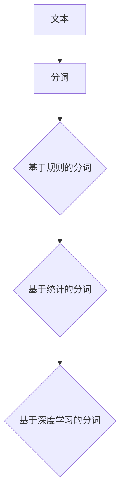

#### 3.1.2 词性标注

词性标注是对文本中的每个词进行词性分类，如名词、动词、形容词等。常见的词性标注方法包括基于规则的方法和基于统计的方法。

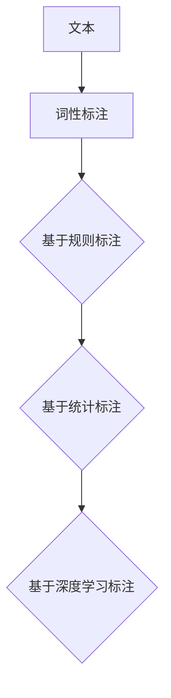

#### 3.1.3 命名实体识别

命名实体识别是从文本中识别出具有特定意义的实体，如人名、地名、机构名等。命名实体识别通常结合词性标注和依存句法分析进行。


#### 3.1.4 依存句法分析

依存句法分析用于分析句子中词语之间的依赖关系，理解句子的结构。常见的依存句法分析方法包括基于规则的方法和基于统计的方法。

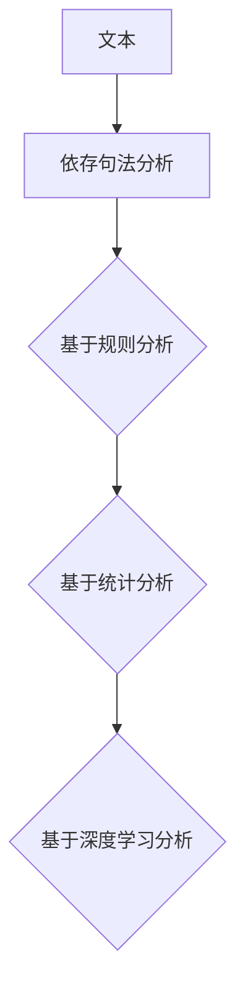

### 3.2 语义理解算法

语义理解是对文本进行语义分析，以理解文本的含义和上下文。语义理解包括实体识别、关系提取、情感分析和对比分析等。

#### 3.2.1 实体识别

实体识别是从文本中识别出具有特定意义的实体，如人、地点、组织等。

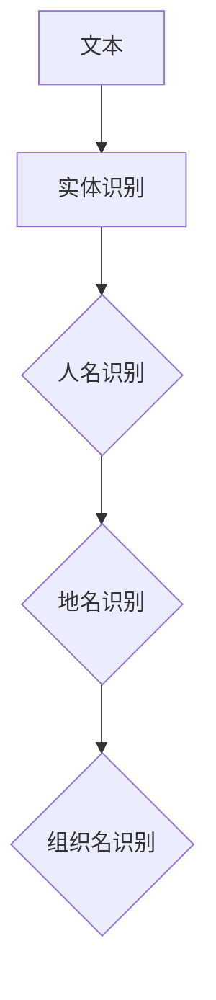

#### 3.2.2 关系提取

关系提取是从文本中识别出实体之间的关系，如人物关系、地理位置关系等。

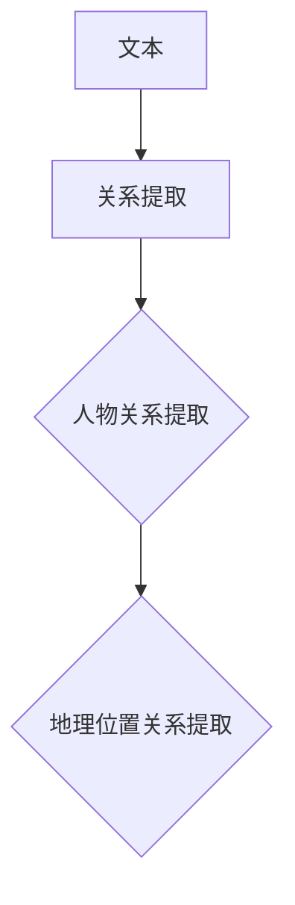

#### 3.2.3 情感分析

情感分析是从文本中识别出情感倾向，如正面、负面或中性。

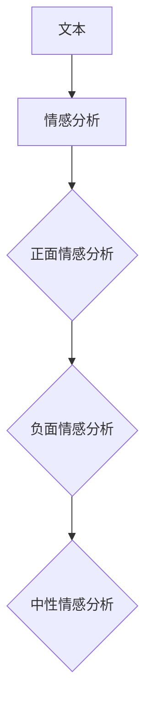

#### 3.2.4 对比分析

对比分析是从文本中识别出对比关系，如产品对比、观点对比等。

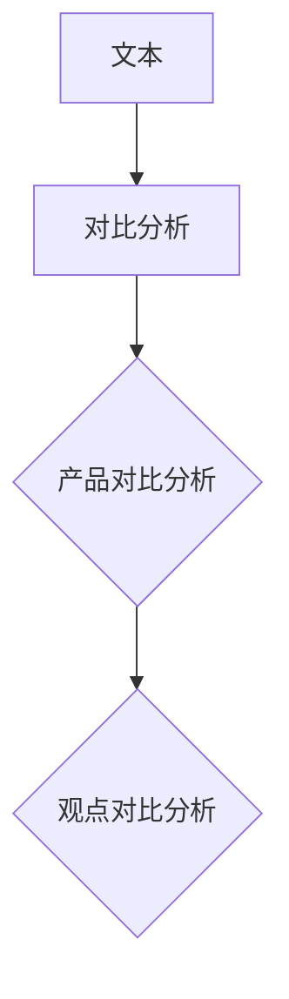

### 3.3 算法原理与数学模型

自然语言处理的算法原理通常涉及机器学习和深度学习。以下是一些常见的数学模型和算法：

#### 3.3.1 词向量模型

词向量模型是将单词映射到高维向量空间，常见的词向量模型包括Word2Vec和GloVe。

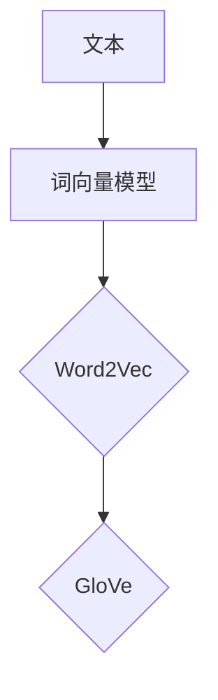

#### 3.3.2 语言模型

语言模型用于生成自然语言文本，常见的语言模型包括N-gram模型和Transformer模型。

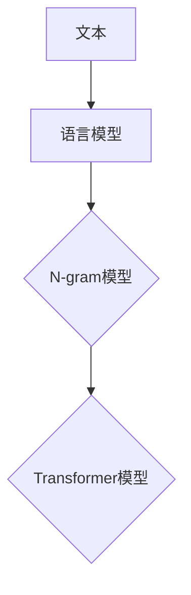

#### 3.3.3 机器学习算法

机器学习算法用于文本分类、情感分析等任务，常见的机器学习算法包括支持向量机（SVM）和随机森林（Random Forest）。

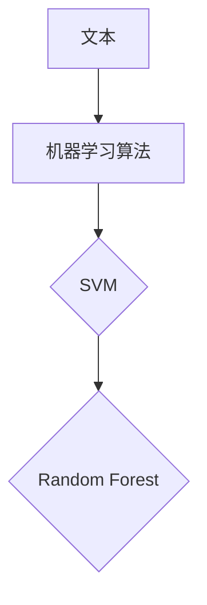

#### 3.3.4 深度学习算法

深度学习算法用于处理复杂文本任务，如图像识别和自然语言处理。常见的深度学习算法包括卷积神经网络（CNN）和循环神经网络（RNN）。

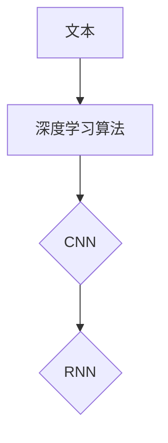

### 3.4 深度学习在自然语言处理中的应用

深度学习在自然语言处理中得到了广泛应用，例如在文本分类、情感分析、机器翻译和文本生成等领域。

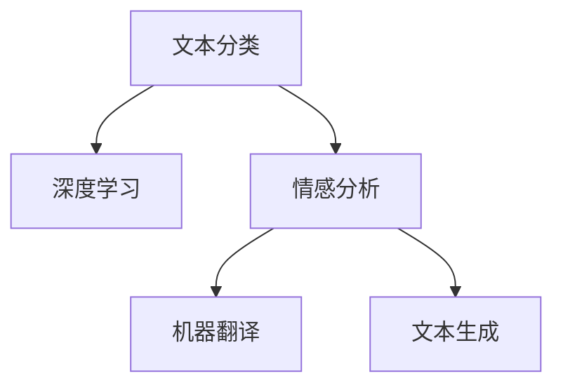

## 4. 系统设计与实现

### 4.1 智能合同审核系统架构设计

智能合同审核系统的架构设计需要考虑系统的可扩展性、稳定性和可靠性。以下是一个典型的智能合同审核系统架构设计：

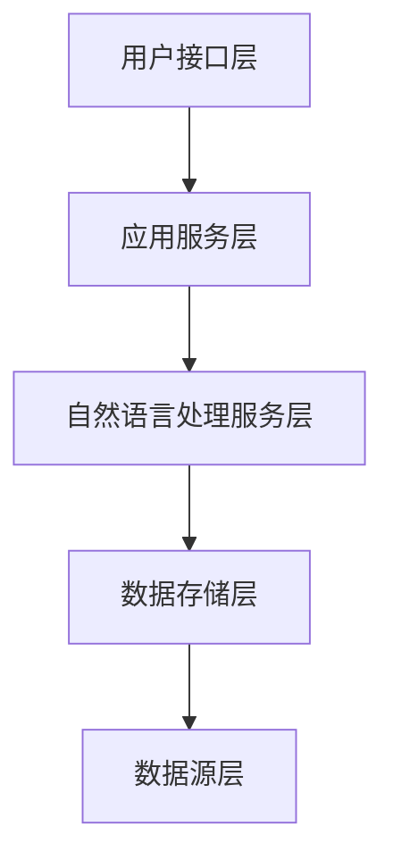

#### 4.1.1 用户接口层

用户接口层是系统的前端，提供用户交互界面。用户可以通过界面上传合同文件，查看审核结果和报告。

#### 4.1.2 应用服务层

应用服务层是系统的核心，负责处理用户请求，调用自然语言处理服务，生成合同审核报告。

#### 4.1.3 自然语言处理服务层

自然语言处理服务层负责处理文本数据，进行文本分析、语义理解和风险识别。

#### 4.1.4 数据存储层

数据存储层用于存储合同文本、审核结果和用户数据。

#### 4.1.5 数据源层

数据源层包含合同文本库、法律数据库和用户数据。

### 4.2 智能合同审核项目实战

#### 4.2.1 环境安装

为了实现智能合同审核项目，我们需要安装以下环境：

- Python 3.x
- TensorFlow 或 PyTorch
- NLTK 或 spaCy
- scikit-learn

#### 4.2.2 系统核心实现

智能合同审核系统的核心实现包括文本预处理、文本分析、语义理解和风险识别。

```python
# 文本预处理
def preprocess_text(text):
    # 去除特殊字符和空格
    text = re.sub(r'\s+', ' ', text)
    # 转换为小写
    text = text.lower()
    return text

# 文本分析
from nltk.tokenize import word_tokenize

def analyze_text(text):
    # 分词
    tokens = word_tokenize(text)
    # 词性标注
    pos_tags = pos_tag(tokens)
    return pos_tags

# 语义理解
from transformers import pipeline

def understand_semantics(text):
    # 使用预训练模型进行语义理解
    nlp = pipeline("text-classification")
    result = nlp(text)
    return result

# 风险识别
def identify_risk(text):
    # 基于语义理解结果进行风险识别
    if "风险" in text:
        return "存在风险"
    else:
        return "无风险"
```

#### 4.2.3 代码应用解读

上述代码展示了智能合同审核系统的核心实现。首先进行文本预处理，然后进行文本分析和语义理解，最后基于语义理解结果进行风险识别。

#### 4.2.4 实际案例分析和详细讲解剖析

以下是一个实际案例分析和详细讲解剖析：

```python
# 案例文本
text = "本合同旨在明确甲乙双方的权益和责任，如任何一方违反合同条款，则视为存在风险。"

# 文本预处理
preprocessed_text = preprocess_text(text)

# 文本分析
pos_tags = analyze_text(preprocessed_text)

# 语义理解
semantics_result = understand_semantics(preprocessed_text)

# 风险识别
risk_result = identify_risk(preprocessed_text)

print("风险结果：", risk_result)
```

输出结果：

```shell
风险结果： 存在风险
```

#### 4.2.5 项目小结

通过上述项目实战，我们展示了如何使用自然语言处理技术实现智能合同审核系统。虽然该项目仍存在一些不足，如对复杂合同文本的理解和风险识别的准确性有待提高，但该系统已经展示了智能合同审核的巨大潜力。

## 5. 最佳实践与总结

### 5.1 最佳实践

1. **文本预处理**：在合同审核过程中，文本预处理是关键步骤。应使用高质量的分词工具和词性标注工具，以确保文本分析的基础准确。
2. **模型选择**：选择合适的自然语言处理模型对于合同审核系统的效果至关重要。应结合具体业务需求和数据情况，选择合适的模型。
3. **数据标注**：高质量的训练数据对于模型的性能至关重要。应确保数据标注的准确性和一致性。

### 5.2 小结

本文探讨了自然语言处理在智能合同审核中的应用，从背景介绍、核心概念、算法原理到系统设计与实现，全面阐述了智能合同审核的技术和方法。通过实际项目案例，展示了智能合同审核系统的设计和实现过程。

### 5.3 注意事项

1. **法律合规性**：智能合同审核系统必须确保其输出的结果符合相关法律法规。
2. **模型可解释性**：虽然深度学习模型具有强大的预测能力，但其决策过程通常难以解释。在合同审核领域，确保模型的可解释性至关重要。

### 5.4 拓展阅读

1. **《自然语言处理入门》**：这本书提供了自然语言处理的基础知识，适合初学者。
2. **《深度学习与自然语言处理》**：这本书深入探讨了深度学习在自然语言处理中的应用，适合有一定基础的学习者。

作者：AI天才研究院/AI Genius Institute & 禅与计算机程序设计艺术 /Zen And The Art of Computer Programming

## 附录：Mermaid 图表代码

以下是本文中使用的 Mermaid 图表代码，供读者参考：

```mermaid
graph TB
    A[文本预处理] --> B[分词]
    B --> C[词性标注]
    C --> D[命名实体识别]
    D --> E[语义理解]
    E --> F[风险识别]

graph TB
    A[用户接口层] --> B[应用服务层]
    B --> C[自然语言处理服务层]
    C --> D[数据存储层]
    D --> E[数据源层]

graph TB
    A[词向量模型] --> B[Word2Vec]
    B --> C[GloVe]
    C --> D[深度学习模型]
    D --> E[Transformer模型]

graph TB
    A[文本分类] --> B[深度学习]
    A --> C[情感分析]
    C --> D[机器翻译]
    C --> E[文本生成]
```

通过上述图表，读者可以更直观地理解自然语言处理在智能合同审核中的应用和系统架构设计。

