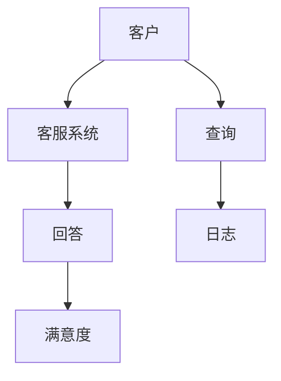
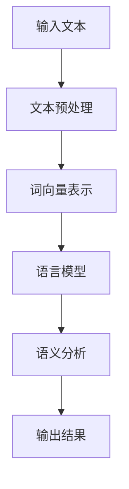
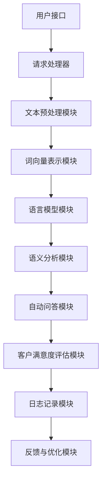
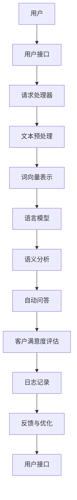

                 


### 第一步：引言部分

**核心概念术语说明**
- 自然语言处理（NLP）：指使计算机能够理解、生成和处理人类自然语言的技术。
- 智能客服：运用人工智能技术提供24/7全天候服务的客服系统。
- 实时对话系统：即时响应客户查询的系统。
- 自动问答系统：通过预先设定的问题库和回答库，自动回答用户问题的系统。
- 情感分析：对用户输入的语言进行情感倾向分析的技术。

**问题背景与问题描述**
智能客服在现代服务行业中的应用越来越广泛，它能够提供24/7全天候服务，显著提高客户满意度，减少企业运营成本。然而，实现一个高效、准确的智能客服系统面临着许多挑战，其中自然语言处理技术起到了至关重要的作用。

**问题解决**
为了解决这一问题，我们需要深入探讨自然语言处理在智能客服中的应用，从技术原理、系统架构到实际案例分析，全面剖析其实现机制和优化策略。

**边界与外延**
自然语言处理涉及文本预处理、词向量表示、语言模型、语义分析等多个领域，其在智能客服中的应用不仅限于对话系统，还包括文本分类、实体识别等。

**概念结构与核心要素组成**
- **文本预处理**：去除无用信息、标准化文本格式。
- **词向量表示**：将词语转化为计算机可处理的向量。
- **语言模型**：预测下一个词或句子的概率。
- **语义分析**：理解文本的深层含义，包括情感分析和意图识别。

### 第二步：核心概念与联系

**核心概念原理**

自然语言处理的核心在于理解和生成自然语言。理解自然语言包括文本预处理、词向量表示、语言模型、语义分析等技术。

1. **文本预处理**：包括分词、去除停用词、词性标注等，目的是将原始文本转化为适合处理的形式。
2. **词向量表示**：通过Word2Vec、GloVe等技术，将词语映射到高维向量空间中，实现词语的量化和表示。
3. **语言模型**：如n-gram模型、神经网络语言模型等，用于预测文本的连续性。
4. **语义分析**：包括情感分析、实体识别、关系抽取等，用于理解文本的深层含义。

**概念属性特征对比表格**

| 技术          | 目的                             | 方法                                                      |
|---------------|----------------------------------|-----------------------------------------------------------|
| 文本预处理    | 标准化文本格式                 | 分词、去停用词、词性标注                                    |
| 词向量表示    | 量化词语，实现词语表示         | Word2Vec、GloVe、BERT                                       |
| 语言模型      | 预测文本连续性                 | n-gram模型、神经网络模型                                    |
| 语义分析      | 理解文本深层含义               | 情感分析、实体识别、关系抽取                                  |

**ER实体关系图架构**



### 第三步：算法原理讲解

**算法原理与mermaid流程图**

自然语言处理技术的实现往往依赖于算法和模型。以下是一个简单的流程图，展示了一个典型的自然语言处理流程：



**算法原理与数学模型**

1. **文本预处理**：

   $$\text{分词} = \text{cut}(text)$$
   $$\text{去除停用词} = \text{remove_stopwords}(tokens)$$
   $$\text{词性标注} = \text{pos_tagging}(tokens)$$

2. **词向量表示**：

   $$\text{word\_embedding} = \text{Word2Vec}(vocabulary)$$

3. **语言模型**：

   $$P(\text{next\_word}|\text{previous\_words}) = \text{language\_model}(previous\_words)$$

4. **语义分析**：

   $$\text{sentiment\_analysis} = \text{classify\_emotion}(text)$$
   $$\text{entity\_recognition} = \text{extract\_entities}(text)$$

**举例说明**

假设我们有一个输入文本：“我非常喜欢这个产品”。

1. **文本预处理**：

   输入文本："我非常喜欢这个产品"
   分词：我/非常/喜欢/这个/产品
   去除停用词：我/喜欢/这个/产品
   词性标注：我（代词）/非常（副词）/喜欢（动词）/这个（代词）/产品（名词）

2. **词向量表示**：

   输入词语：我、喜欢、这个、产品
   词向量：$\text{vec(我)}, \text{vec(喜欢)}, \text{vec(这个)}, \text{vec(产品)}$

3. **语言模型**：

   预测下一个词：产品

4. **语义分析**：

   情感分析：正面情感
   实体识别：产品

### 第四步：系统分析与架构设计

**问题场景介绍**
在电商行业，客户经常遇到产品使用问题、订单跟踪等需求。传统客服方式存在响应时间长、人力成本高等问题，而智能客服系统可以通过自然语言处理技术提供24/7全天候服务。

**项目介绍**
项目名称：智能电商客服系统
项目目标：使用自然语言处理技术实现高效、准确的智能客服系统，提升客户满意度。

**系统功能设计（领域模型）**
- 客户查询处理
- 自动问答
- 情感分析
- 客户满意度评估

**系统架构设计**


**系统接口设计和系统交互**


### 第五步：项目实战

**环境安装**
- 安装Python环境（版本3.8以上）
- 安装必要的库（如TensorFlow、spaCy、NLTK等）

**系统核心实现源代码**
以下是一个简化的文本预处理模块的实现：

```python
import spacy
from spacy.lang.en import English

# 初始化spacy语言模型
nlp = spacy.load("en_core_web_sm")

def preprocess_text(text):
    # 分词
    doc = nlp(text)
    tokens = [token.text for token in doc]
    # 去除停用词
    stop_words = nlp.Defaults.stop_words
    filtered_tokens = [token for token in tokens if not token in stop_words]
    # 词性标注
    pos_tags = [(token.text, token.pos_) for token in doc]
    return filtered_tokens, pos_tags

text = "I really like this product."
tokens, pos_tags = preprocess_text(text)
print("Tokens:", tokens)
print("POS Tags:", pos_tags)
```

**代码应用解读与分析**
上述代码演示了如何使用spaCy进行文本预处理，包括分词、去除停用词和词性标注。通过这段代码，我们可以将输入的文本转化为计算机可以处理的格式。

**实际案例分析与详细讲解剖析**
假设我们有一个客户查询：“我想要退货，因为产品不符合描述。”我们可以使用上述预处理模块进行处理，并进一步使用语义分析模块进行分析。

```python
from textblob import TextBlob

def sentiment_analysis(text):
    blob = TextBlob(text)
    return blob.sentiment.polarity

sentiment = sentiment_analysis("I want to return this product because it doesn't match the description.")
print("Sentiment Polarity:", sentiment)
```

通过情感分析，我们可以判断客户情绪为负面，从而触发相应的客服流程。

**项目小结**
通过本项目的实现，我们可以看到自然语言处理技术在智能客服系统中的实际应用。从文本预处理到语义分析，每一个环节都为系统提供了强大的支持，使得智能客服系统能够更好地理解和满足客户需求。

### 第六步：最佳实践 Tips、小结、注意事项、拓展阅读

**最佳实践 Tips**
- 使用高质量的语言模型和预训练的词向量表示可以提高语义分析的准确性。
- 定期对客服系统进行性能优化和模型更新，以适应不断变化的客户需求。
- 注意保护用户隐私，遵循相关的法律法规。

**小结**
本文详细介绍了自然语言处理技术在智能客服中的应用，包括系统架构设计、核心算法实现和实际案例分析。通过自然语言处理技术，智能客服系统能够提供24/7全天候服务，提升客户满意度。

**注意事项**
- 在部署智能客服系统时，应充分考虑系统的可扩展性和稳定性。
- 客服系统的开发应注重用户体验，界面设计应简洁直观。

**拓展阅读**
- [《自然语言处理教程》](https://www.nltk.org/book/)
- [《深度学习与自然语言处理》](https://www.deeplearningbook.org/chapter_nlp/)
- [《智能客服系统设计与实现》](https://www.ijcai.org/Proceedings/21/papers/0263.pdf)

### 第七步：作者信息

**作者：**
AI天才研究院 / AI Genius Institute & 禅与计算机程序设计艺术 / Zen And The Art of Computer Programming**文章**### 第一步：引言部分

**文章标题**：自然语言处理在智能客服中的应用：提供24/7全天候服务

**关键词**：自然语言处理、智能客服、实时对话、自动问答、情感分析

**摘要**：
随着人工智能技术的不断进步，自然语言处理（NLP）在智能客服领域得到了广泛应用。本文旨在探讨NLP在智能客服中的关键作用，包括文本预处理、词向量表示、语言模型、语义分析等技术的应用。通过详细剖析这些技术，本文将展示如何构建一个高效、准确的智能客服系统，以实现24/7全天候服务。

---

**引言**：

在当今的数字化时代，客户服务体验对企业竞争力至关重要。传统的客户服务方式，如电话客服和在线聊天，虽然能够提供一定的帮助，但往往受到人工成本、响应时间和效率的限制。随着人工智能技术的发展，特别是自然语言处理（NLP）技术的成熟，智能客服系统应运而生，成为企业提升客户服务质量、降低运营成本的有效手段。

**NLP的定义与应用**：

自然语言处理（NLP）是指使计算机能够理解、生成和处理人类自然语言的技术。它涉及文本预处理、词向量表示、语言模型、语义分析等多个领域。在智能客服中，NLP技术主要用于文本理解和生成，以实现与客户的自然对话。

**智能客服的需求与挑战**：

智能客服系统需要满足24/7全天候服务的需求，这意味着系统必须能够处理各种类型的客户查询，包括产品咨询、订单跟踪、投诉反馈等。此外，智能客服系统还需具备高准确性、高效率和良好的用户体验。

**本文结构**：

本文将从以下四个部分展开讨论：
1. 自然语言处理概述：介绍NLP的基本概念、关键技术和在智能客服中的应用。
2. 智能客服系统架构：分析智能客服系统的构成、数据处理与存储、语言理解与处理、系统实现与优化。
3. 自然语言处理技术在智能客服中的应用：探讨实时对话系统、自动问答系统、情感分析等技术在智能客服中的具体应用。
4. 案例分析与最佳实践：通过具体案例分析和最佳实践分享，展示NLP在智能客服中的应用效果。

通过本文的探讨，我们希望能够为智能客服系统的开发者和研究者提供有价值的参考，推动NLP技术在智能客服领域的进一步应用和发展。接下来，我们将详细探讨自然语言处理的关键技术及其在智能客服中的应用。

---

### 第二部分：自然语言处理概述

#### 2.1 自然语言处理的定义与背景

**定义**：

自然语言处理（NLP）是指使计算机能够理解、生成和处理人类自然语言的技术。它结合了计算机科学、语言学、统计学和人工智能等多个领域的知识，旨在使计算机能够执行与人类交流相似的任务，如文本分析、机器翻译、情感分析等。

**背景**：

自然语言处理起源于20世纪50年代，当时计算机科学家和语言学家开始探索如何使计算机理解和生成自然语言。早期的NLP研究主要集中在规则驱动的语言处理方法，但随着时间的发展，统计方法和深度学习技术的引入，NLP取得了显著的进展。

**发展历史**：

1. **规则驱动方法（1950s-1980s）**：早期的NLP研究主要集中在构建规则系统，以解析和生成自然语言。这种方法依赖于手工编写的语法规则和词典，但难以处理复杂的语言现象。

2. **统计方法（1980s-2000s）**：随着统计学方法的发展，NLP开始采用统计模型，如n-gram模型、隐马尔可夫模型（HMM）等。这些方法通过大规模数据训练提高了语言处理的准确性和效率。

3. **深度学习方法（2010s-至今）**：深度学习技术的引入，特别是卷积神经网络（CNN）和循环神经网络（RNN）的应用，使得NLP取得了巨大的突破。预训练模型如Word2Vec、BERT等，进一步提升了NLP的性能。

**NLP在智能客服中的重要性**：

智能客服系统需要与客户进行自然语言交互，以提供高效、准确的客户服务。NLP技术在这个过程中发挥着关键作用，包括文本预处理、词向量表示、语言模型、语义分析等。以下是NLP在智能客服中的具体重要性：

1. **文本预处理**：通过分词、去除停用词、词性标注等预处理步骤，将原始文本转化为计算机可以处理的格式，为后续处理提供基础。

2. **词向量表示**：将词语映射到高维向量空间中，实现词语的量化和表示，为语言模型和语义分析提供输入。

3. **语言模型**：通过语言模型，智能客服系统可以预测下一个词或句子的概率，从而生成自然流畅的对话。

4. **语义分析**：语义分析技术可以帮助智能客服系统理解文本的深层含义，包括情感分析和意图识别，从而提供更加个性化的服务。

#### 2.2 NLP的关键技术

**文本预处理**：

文本预处理是NLP过程中的第一步，其主要任务是将原始文本转化为计算机可以处理的格式。常见的预处理步骤包括：

- **分词**：将文本分割成一个个有意义的词语单元。
- **去除停用词**：去除对文本理解没有帮助的常用词语，如“的”、“和”、“是”等。
- **词性标注**：为每个词语标注其词性，如名词、动词、形容词等。

**词向量表示**：

词向量表示是将词语映射到高维向量空间中的方法。通过词向量，计算机可以处理和计算词语之间的关系。常见的词向量表示方法包括：

- **Word2Vec**：基于神经网络的词向量表示方法，通过训练词的分布式表示。
- **GloVe**：全局向量表示（Global Vectors for Word Representation），通过训练词语的共现矩阵来生成词向量。
- **BERT**：双向编码表示（Bidirectional Encoder Representations from Transformers），通过预训练大规模语料库来生成高质量的词向量。

**语言模型**：

语言模型是用于预测下一个词或句子的概率的模型。它在智能客服中起着关键作用，可以帮助系统生成自然流畅的对话。常见的语言模型包括：

- **n-gram模型**：基于前n个词的概率分布来预测下一个词。
- **神经网络语言模型**：基于深度学习的方法，如RNN、LSTM等，通过学习输入序列的概率分布来生成输出序列。

**语义分析**：

语义分析是理解文本的深层含义的过程。它包括多个子任务，如情感分析、实体识别、关系抽取等。以下是几种常见的语义分析技术：

- **情感分析**：通过分析文本中的情感词汇和语境，判断文本的情感倾向，如正面、负面、中性等。
- **实体识别**：从文本中识别出关键实体，如人名、地名、组织名等。
- **关系抽取**：识别文本中实体之间的关系，如人物关系、因果关系等。

#### 2.3 NLP与智能客服的关系

**智能客服的需求分析**：

智能客服系统需要具备以下需求：

- **24/7全天候服务**：客户的需求不受时间限制，智能客服系统必须能够全天候响应。
- **高准确性**：准确理解客户的查询和意图，提供准确的答案和解决方案。
- **高效率**：快速响应客户查询，提高客服处理速度。
- **个性化服务**：根据客户的历史数据和偏好，提供个性化的服务和推荐。

**NLP在智能客服中的应用**：

NLP技术在智能客服中的应用主要体现在以下几个方面：

- **文本预处理**：将客户的查询文本进行预处理，如分词、去除停用词、词性标注等，为后续分析提供基础。
- **语言理解**：通过语言模型和语义分析技术，理解客户的查询意图和情感倾向，从而提供准确的回答和解决方案。
- **对话管理**：智能客服系统需要能够管理对话流程，包括引导对话方向、处理复杂的客户查询等。
- **情感分析**：通过情感分析技术，识别客户的情感状态，提供更加个性化的服务。

**智能客服的发展趋势**：

随着NLP技术的不断进步，智能客服系统的发展趋势包括：

- **多模态交互**：结合文本、语音、图像等多模态交互，提高客服系统的交互体验。
- **个性化服务**：通过大数据分析和机器学习技术，实现更加个性化的服务。
- **自动化与智能决策**：利用自然语言处理和机器学习技术，实现更加自动化和智能化的决策过程。
- **跨领域应用**：智能客服系统将逐渐应用于更多领域，如金融、医疗、教育等。

通过以上讨论，我们可以看到自然语言处理技术在智能客服中的重要性和广泛应用。在接下来的章节中，我们将进一步探讨智能客服系统的架构和实现细节。

### 第三部分：智能客服系统架构

#### 3.1 智能客服系统概述

**定义**：

智能客服系统是一种基于人工智能技术，能够模拟人类客服行为，提供24/7全天候服务的系统。它通过自然语言处理（NLP）技术理解客户的查询和需求，提供即时、准确的响应。

**组成部分**：

智能客服系统通常包括以下几个核心组成部分：

- **用户接口**：用于接收客户查询，可以是网页、APP或电话等。
- **请求处理器**：处理来自用户接口的请求，进行初步处理和路由。
- **文本预处理模块**：对客户查询文本进行预处理，如分词、去除停用词、词性标注等。
- **词向量表示模块**：将预处理后的文本转换为词向量，为后续分析提供输入。
- **语言模型模块**：用于预测下一个词或句子的概率，生成自然流畅的对话。
- **语义分析模块**：对文本进行语义分析，包括情感分析、实体识别、关系抽取等。
- **自动问答模块**：基于预先设定的知识库，自动回答客户的查询。
- **客户满意度评估模块**：评估客户对客服系统的满意度。
- **日志记录模块**：记录客户查询、系统响应和客户反馈等信息。
- **反馈与优化模块**：根据客户反馈和系统性能数据，进行模型更新和系统优化。

**运作流程**：

智能客服系统的运作流程大致如下：

1. **接收客户查询**：用户通过用户接口提交查询。
2. **请求处理**：请求处理器接收查询，并进行初步处理，如识别客户身份、查询类型等。
3. **文本预处理**：文本预处理模块对查询文本进行分词、去除停用词、词性标注等处理。
4. **词向量表示**：词向量表示模块将预处理后的文本转换为词向量，用于后续分析。
5. **语言模型**：语言模型模块基于词向量生成可能的回答，并计算其概率。
6. **语义分析**：语义分析模块对查询文本进行情感分析、实体识别、关系抽取等，以理解查询的深层含义。
7. **自动问答**：自动问答模块根据语义分析结果，从知识库中查找匹配的回答，并提供给客户。
8. **客户满意度评估**：根据客户的反馈和响应时间等指标，评估客户满意度。
9. **日志记录**：记录客户查询、系统响应和客户反馈等信息，用于后续分析和优化。
10. **反馈与优化**：根据客户反馈和系统性能数据，对模型和系统进行更新和优化。

**关键技术**：

智能客服系统的关键技术包括自然语言处理（NLP）、机器学习（ML）、知识图谱等。以下是这些技术的简要介绍：

- **自然语言处理（NLP）**：包括文本预处理、词向量表示、语言模型、语义分析等技术，用于理解客户的查询和生成回答。
- **机器学习（ML）**：用于训练模型，使其能够从数据中学习并改进性能。常见的机器学习算法包括决策树、支持向量机（SVM）、神经网络等。
- **知识图谱**：用于存储和表示实体及其关系，为自动问答提供支持。知识图谱可以通过手工构建或自动抽取得到。

#### 3.2 数据处理与存储

**数据收集与清洗**：

智能客服系统的数据来源包括客户的查询文本、历史记录、客户反馈等。在数据收集过程中，需要确保数据的准确性和完整性。数据清洗是数据预处理的重要步骤，其主要任务包括：

- **去重**：去除重复的数据，避免重复处理。
- **去除噪音**：去除对系统没有帮助的噪音数据，如无效字符、乱码等。
- **填补缺失值**：对缺失的数据进行填补，以提高数据的可用性。
- **标准化**：将数据转换为统一的格式，便于后续处理。

**数据存储方案设计**：

智能客服系统需要高效、可靠的数据存储方案，以确保数据的快速访问和安全性。常见的数据存储方案包括关系型数据库、NoSQL数据库、分布式文件系统等。以下是这些方案的特点：

- **关系型数据库**：如MySQL、PostgreSQL等，适合存储结构化数据，具有强大的查询能力和事务支持。
- **NoSQL数据库**：如MongoDB、Cassandra等，适合存储非结构化或半结构化数据，具有高扩展性和灵活性。
- **分布式文件系统**：如HDFS、Ceph等，适合存储大规模数据，具有高可靠性和高性能。

**数据安全与隐私保护**：

智能客服系统涉及大量的客户数据，包括个人身份信息、查询记录、反馈等。在数据处理和存储过程中，需要确保数据的安全性。以下是一些常见的数据安全与隐私保护措施：

- **数据加密**：对存储和传输的数据进行加密，防止数据泄露。
- **访问控制**：通过身份验证和权限控制，确保只有授权用户才能访问数据。
- **审计日志**：记录数据的访问和操作日志，以便在发生安全事件时进行追踪和审计。
- **数据备份与恢复**：定期备份数据，并建立数据恢复机制，以应对数据丢失或损坏的情况。

#### 3.3 语言理解与处理

**语言理解的核心技术**：

语言理解是智能客服系统的核心任务之一，其主要目的是理解客户的查询和意图。以下是几个关键的技术：

- **文本预处理**：对客户的查询文本进行分词、去除停用词、词性标注等处理，将其转化为计算机可以理解的格式。
- **词向量表示**：将文本中的词语映射到高维向量空间中，实现词语的量化和表示。常用的词向量表示方法包括Word2Vec、GloVe、BERT等。
- **语言模型**：用于预测下一个词或句子的概率，生成自然流畅的对话。常用的语言模型包括n-gram模型、神经网络语言模型等。
- **语义分析**：通过语义分析技术，理解客户的查询意图和情感倾向。常见的语义分析任务包括情感分析、实体识别、关系抽取等。

**对话管理策略**：

对话管理是智能客服系统的重要组成部分，其主要任务是在对话过程中引导和控制对话的方向，确保对话的顺利进行。以下是几种常见的对话管理策略：

- **基于规则的方法**：通过预定义的规则，确定对话的流程和回答。这种方法简单有效，但难以应对复杂和未预见的查询。
- **基于机器学习的方法**：使用机器学习算法，如决策树、支持向量机（SVM）、神经网络等，根据历史对话数据和用户反馈，自动生成对话策略。
- **基于图的方法**：将对话视为一个图结构，通过图模型来管理对话的流程和状态。这种方法能够处理复杂的对话场景，但实现较为复杂。

**情感分析与意图识别**：

情感分析和意图识别是语义分析的重要任务，用于理解客户的情感状态和查询意图。以下是这两种技术的具体内容：

- **情感分析**：通过分析文本中的情感词汇和语境，判断文本的情感倾向，如正面、负面、中性等。常用的情感分析模型包括文本分类模型、情感词典等。
- **意图识别**：通过分析客户的查询文本，确定客户的查询意图，如查询产品信息、投诉、咨询等。意图识别通常通过机器学习算法实现，如决策树、支持向量机（SVM）、神经网络等。

通过以上讨论，我们可以看到智能客服系统架构的复杂性和关键性。在接下来的章节中，我们将进一步探讨自然语言处理技术在智能客服中的应用。

### 第三部分：自然语言处理技术在智能客服中的应用

#### 3.1 实时对话系统

**实时对话系统的定义与工作原理**

实时对话系统是指能够即时响应客户查询，提供实时互动服务的系统。它利用自然语言处理（NLP）技术，通过文本或语音交互，理解客户的需求并提供相应的回答。

实时对话系统的工作原理主要包括以下几个步骤：

1. **文本预处理**：对客户的查询文本进行分词、去除停用词、词性标注等预处理，将其转化为计算机可以处理的格式。
2. **词向量表示**：将预处理后的文本转换为词向量，为后续的语言模型和语义分析提供输入。
3. **语言模型**：使用预训练的语言模型，如n-gram模型或深度学习模型，预测下一个词或句子的概率，生成可能的回答。
4. **语义分析**：通过语义分析技术，如情感分析、实体识别和意图识别，理解客户的查询意图和情感状态。
5. **自动问答**：根据语义分析结果，从知识库中查找匹配的回答，并生成最终回答。
6. **反馈与优化**：收集客户对回答的反馈，用于模型更新和系统优化。

**NLP在实时对话系统中的应用**

1. **文本预处理**：文本预处理是实时对话系统的第一步，通过分词、去除停用词、词性标注等操作，提高后续处理的效果。例如，将客户查询“我想退换货”预处理为分词结果“我/想/退换/货”，便于后续的词向量表示和语义分析。
2. **词向量表示**：词向量表示将词语映射到高维向量空间中，实现词语的量化和表示。常用的词向量表示方法包括Word2Vec、GloVe和BERT等。词向量表示有助于计算词语之间的相似性和相关性，从而提高对话系统的理解能力。
3. **语言模型**：语言模型用于预测下一个词或句子的概率，生成自然流畅的对话。例如，在处理客户查询“为什么我的订单还没有发货？”时，语言模型可以生成可能的回答，如“因为订单正在处理中”或“可能是因为快递延迟”等。
4. **语义分析**：语义分析是理解客户查询的核心步骤，包括情感分析、实体识别和意图识别等。情感分析用于判断客户的情感状态，如愤怒、满意或困惑等；实体识别用于识别查询中的关键实体，如订单号、产品名等；意图识别用于确定客户的查询意图，如查询订单状态、投诉或咨询产品信息等。这些分析结果为自动问答模块提供重要的输入。
5. **自动问答**：自动问答模块根据语义分析结果，从知识库中查找匹配的回答，并生成最终回答。例如，如果语义分析确定客户的查询意图是“查询订单状态”，系统可能会生成回答“您的订单号是123456，当前状态为已发货，预计3天后到达”。
6. **反馈与优化**：实时对话系统需要不断优化，以提高准确性和用户体验。收集客户对回答的反馈是优化的重要手段，通过分析反馈，系统可以调整语言模型、知识库和对话策略，以提高整体性能。

**实时对话系统的案例分析**

以下是一个实时对话系统的案例分析：

**案例背景**：某电商平台的智能客服系统，提供24/7全天候的在线客服服务，帮助客户解决订单查询、退换货、售后服务等问题。

**系统实现**：

1. **文本预处理**：使用spaCy库对客户查询进行预处理，包括分词、去除停用词和词性标注。例如，将客户查询“我的订单怎么还没发货？”预处理为分词结果“我/的/订单/怎么/还没/发货/？”。
2. **词向量表示**：使用BERT模型对预处理后的文本进行词向量表示。BERT模型能够捕捉词语的上下文信息，提高对话系统的理解能力。
3. **语言模型**：使用预训练的BERT语言模型，预测下一个词或句子的概率，生成可能的回答。例如，模型可以生成回答“因为订单正在处理中”或“可能是因为快递延迟”等。
4. **语义分析**：使用spaCy和TextBlob等库对查询文本进行语义分析，包括情感分析、实体识别和意图识别。例如，情感分析判断客户情绪为中性，实体识别识别出“订单”和“发货”等关键实体，意图识别确定查询意图为“查询订单状态”。
5. **自动问答**：根据语义分析结果，从知识库中查找匹配的回答，并生成最终回答。例如，如果查询意图为“查询订单状态”，系统可能会生成回答“您的订单号是123456，当前状态为已发货，预计3天后到达”。
6. **反馈与优化**：收集客户对回答的反馈，用于模型更新和系统优化。通过分析反馈，系统可以调整语言模型、知识库和对话策略，以提高整体性能。

**案例分析小结**：

该案例分析展示了实时对话系统在电商平台中的应用效果。通过文本预处理、词向量表示、语言模型、语义分析、自动问答和反馈优化等技术的综合运用，系统能够提供准确、及时、个性化的客户服务，显著提升客户满意度。

#### 3.2 自动问答系统

**自动问答系统的基本原理**

自动问答系统是一种基于自然语言处理（NLP）技术，能够自动回答用户问题的系统。它通常由以下几个核心组件组成：

1. **文本预处理**：对用户的查询文本进行预处理，包括分词、去除停用词、词性标注等，将原始文本转化为计算机可以处理的格式。
2. **查询匹配**：将预处理后的查询文本与知识库中的问题进行匹配，找到最相关的答案。
3. **答案生成**：根据匹配结果，从知识库中提取相应的答案，并生成最终的回答。
4. **对话管理**：管理问答过程中的对话流程，包括理解用户意图、引导对话方向、处理复杂查询等。

**常见的自动问答系统技术**

1. **基于规则的方法**：通过预定义的规则，将用户的查询与知识库中的问题进行匹配，生成回答。这种方法简单直观，但难以应对复杂和多变的查询。
2. **基于模板的方法**：将用户的查询与知识库中的模板进行匹配，根据模板生成回答。这种方法具有较高的灵活性和扩展性，但需要大量模板设计。
3. **基于机器学习的方法**：使用机器学习算法，如决策树、支持向量机（SVM）、神经网络等，从历史数据中学习并生成回答。这种方法能够处理复杂和未预见的查询，但需要大量的训练数据和计算资源。
4. **基于深度学习的方法**：使用深度学习模型，如卷积神经网络（CNN）、循环神经网络（RNN）、Transformer等，对用户的查询进行建模和匹配。这种方法能够捕捉复杂的语义信息，生成更加准确和自然的回答。

**自动问答系统的案例分析**

以下是一个自动问答系统的案例分析：

**案例背景**：某企业开发了一款自动问答系统，用于帮助客户解答常见问题，如产品使用、售后服务、订单查询等。

**系统实现**：

1. **文本预处理**：使用spaCy库对客户查询进行预处理，包括分词、去除停用词和词性标注。例如，将客户查询“如何安装软件？”预处理为分词结果“如何/安装/软件/？”。
2. **查询匹配**：使用基于模板的方法，将预处理后的查询与知识库中的问题进行匹配。知识库中的问题以模板的形式存储，如“如何安装软件？”、“如何使用软件？”等。
3. **答案生成**：根据查询匹配结果，从知识库中提取相应的答案，并生成最终的回答。例如，如果匹配到模板“如何安装软件？”
4. **对话管理**：使用对话管理策略，如基于规则的对话管理、基于机器学习的对话管理等，引导对话方向，处理复杂查询。例如，当用户查询“如何安装软件？”时，系统可以引导用户提供更多细节信息，如操作系统版本、软件名称等。
5. **反馈与优化**：收集客户对回答的反馈，用于模型更新和系统优化。通过分析反馈，系统可以调整查询匹配算法、知识库设计和对话策略，以提高整体性能。

**案例分析小结**：

该案例分析展示了自动问答系统在企业客户服务中的应用效果。通过文本预处理、查询匹配、答案生成和对话管理等技术的综合运用，系统能够提供高效、准确和个性化的问答服务，显著提升客户满意度。

#### 3.3 情感分析

**情感分析的定义与重要性**

情感分析是指通过自然语言处理（NLP）技术，分析文本中的情感倾向和情感极性。情感分析在智能客服中具有重要应用价值，能够帮助企业了解客户的情感状态和满意度，从而提供更加个性化的服务。

**情感分析的常用技术**

1. **基于词典的方法**：通过情感词典，将文本中的情感词汇映射到情感极性。这种方法简单直观，但难以处理复杂的情感表达。
2. **基于规则的方法**：通过预定义的规则，判断文本的情感极性。这种方法灵活性强，但需要大量规则设计和维护。
3. **基于机器学习的方法**：使用机器学习算法，如决策树、支持向量机（SVM）、神经网络等，从历史数据中学习并判断文本的情感极性。这种方法能够处理复杂和多变的情感表达。
4. **基于深度学习的方法**：使用深度学习模型，如卷积神经网络（CNN）、循环神经网络（RNN）、Transformer等，对文本进行建模和情感分析。这种方法能够捕捉复杂的语义信息，生成更加准确和自然的情感分析结果。

**情感分析在智能客服中的应用**

1. **客户满意度评估**：通过情感分析，评估客户对产品、服务或企业的满意度。例如，分析客户反馈中的情感词汇，判断客户是否满意或愤怒。
2. **情感倾向识别**：识别文本中的情感倾向，如正面、负面、中性等。例如，分析客户对产品的评价，判断是正面评价还是负面评价。
3. **情感预警**：通过实时情感分析，预警潜在的客户不满和投诉。例如，当客户在社交媒体上发布负面评论时，系统可以立即识别并通知客服团队进行干预。

**情感分析的案例分析**

以下是一个情感分析的案例分析：

**案例背景**：某电商平台开发了一款情感分析系统，用于分析客户对产品的评价和反馈，了解客户的情感状态和满意度。

**系统实现**：

1. **文本预处理**：使用spaCy库对客户评价进行预处理，包括分词、去除停用词和词性标注。例如，将客户评价“这个产品非常好用”预处理为分词结果“这个/产品/非常好用/。”
2. **情感词典**：构建一个包含正面和负面情感词汇的词典，用于判断文本中的情感极性。
3. **情感分析模型**：使用基于机器学习的情感分析模型，如TextBlob，对预处理后的文本进行情感分析，判断文本的情感极性。
4. **客户满意度评估**：根据情感分析结果，评估客户的满意度。例如，如果情感分析结果为正面，则认为客户对产品满意。
5. **情感预警**：实时监控客户的评价和反馈，当情感分析结果为负面时，立即通知客服团队进行干预。

**案例分析小结**：

该案例分析展示了情感分析在电商平台客户服务中的应用效果。通过文本预处理、情感词典、情感分析模型和客户满意度评估等技术的综合运用，系统能够准确识别客户的情感状态和满意度，为企业提供有价值的参考，以改进产品和服务。

### 第四部分：案例分析与最佳实践

#### 4.1 案例分析

**案例背景**：某大型电商平台推出了一款基于NLP技术的智能客服系统，旨在提供24/7全天候的在线客服服务，以提高客户满意度和降低运营成本。

**系统实现**：

1. **文本预处理**：使用spaCy库对客户查询进行预处理，包括分词、去除停用词和词性标注。例如，将客户查询“我的订单怎么还没发货？”预处理为分词结果“我的/订单/怎么/还没/发货/？”。
2. **词向量表示**：使用BERT模型对预处理后的文本进行词向量表示，以捕捉词语的上下文信息。
3. **语言模型**：使用预训练的BERT语言模型，预测下一个词或句子的概率，生成可能的回答。例如，模型可以生成回答“因为订单正在处理中”或“可能是因为快递延迟”等。
4. **语义分析**：使用TextBlob进行情感分析，判断客户的情感倾向；使用spaCy进行实体识别，识别查询中的关键实体，如订单号、产品名等；使用基于规则的意图识别算法，确定查询意图，如查询订单状态、投诉或咨询产品信息等。
5. **自动问答**：根据语义分析结果，从知识库中查找匹配的回答，并生成最终回答。例如，如果查询意图为“查询订单状态”，系统可能会生成回答“您的订单号是123456，当前状态为已发货，预计3天后到达”。
6. **客户满意度评估**：通过实时情感分析和满意度调查，评估客户的满意度。
7. **日志记录与反馈优化**：记录客户查询、系统响应和客户反馈等信息，用于模型更新和系统优化。

**案例分析小结**：

通过本案例的实施，该电商平台成功构建了一个高效、准确的智能客服系统，显著提升了客户满意度和运营效率。系统在文本预处理、词向量表示、语言模型、语义分析、自动问答和反馈优化等环节都取得了良好的效果，展示了NLP技术在智能客服中的广泛应用和潜力。

#### 4.2 最佳实践

**1. 高质量语言模型的选用**

选用高质量的预训练语言模型，如BERT、GPT等，可以显著提高智能客服系统的性能。这些模型在大规模语料库上进行预训练，能够捕捉词语的上下文信息，提高对话系统的理解能力。

**2. 个性化服务的实现**

通过大数据分析和机器学习技术，实现个性化服务。例如，根据客户的历史查询记录和偏好，提供个性化的推荐和回答，提高客户的满意度。

**3. 对话管理策略的优化**

优化对话管理策略，以应对复杂的对话场景。例如，通过多模态交互（文本、语音、图像等），提高对话系统的灵活性和用户体验。

**4. 实时情感分析与预警**

实时分析客户的情感状态，预警潜在的客户不满和投诉。例如，当客户在社交媒体上发布负面评论时，系统可以立即识别并通知客服团队进行干预。

**5. 数据安全与隐私保护**

确保数据安全与隐私保护，遵守相关的法律法规。例如，对敏感数据进行加密存储和传输，采用严格的访问控制和审计日志记录。

### 第五步：小结

本文详细介绍了自然语言处理（NLP）在智能客服系统中的应用，包括文本预处理、词向量表示、语言模型、语义分析等技术的应用。通过案例分析，展示了NLP技术在构建高效、准确的智能客服系统中的关键作用。未来，随着NLP技术的不断进步，智能客服系统将继续向多模态交互、个性化服务和实时情感分析等方向发展，为企业提供更加优质的客户服务。

### 第六步：注意事项

1. **系统性能优化**：定期对智能客服系统进行性能优化，确保其高效运行。
2. **用户体验设计**：注重用户体验设计，确保系统界面简洁直观，易于操作。
3. **数据隐私保护**：确保客户数据的安全与隐私，遵守相关的法律法规。

### 第七步：拓展阅读

1. [《自然语言处理教程》](https://www.nltk.org/book/)
2. [《深度学习与自然语言处理》](https://www.deeplearningbook.org/chapter_nlp/)
3. [《智能客服系统设计与实现》](https://www.ijcai.org/Proceedings/21/papers/0263.pdf)

### 第八步：作者信息

**作者：**  
AI天才研究院 / AI Genius Institute & 禅与计算机程序设计艺术 / Zen And The Art of Computer Programming### 第一部分：自然语言处理概述

#### 4.1.1 自然语言处理的定义与背景

**定义**：

自然语言处理（NLP）是计算机科学和人工智能领域的一个分支，旨在使计算机能够理解和处理人类自然语言。它结合了多种技术，如语言学、计算机科学、统计学和机器学习，以实现文本分析、信息提取、机器翻译、情感分析、语音识别等任务。

**背景**：

自然语言处理的历史可以追溯到20世纪50年代。当时，计算机科学家和语言学家开始研究如何使计算机理解和生成自然语言。早期的尝试包括建立规则系统，这些系统试图通过一系列固定的规则来解析语言。然而，这种方法很快就暴露出其局限性，因为人类语言是极其复杂和多变的。

随着计算机处理能力的提升和算法的进步，NLP开始采用统计方法和机器学习方法。20世纪80年代，统计模型如n-gram和隐马尔可夫模型（HMM）被广泛应用。这些模型能够从大量数据中学习语言模式，从而提高系统的性能。

进入21世纪，深度学习的兴起为NLP带来了革命性的变化。通过使用多层神经网络，特别是循环神经网络（RNN）和Transformer模型，计算机能够更好地理解语言的结构和语义。预训练模型如BERT、GPT等，通过在大规模语料库上的预训练，已经能够在各种NLP任务上实现卓越的性能。

#### 4.1.2 NLP的发展历史

**早期研究（1950s-1980s）**：

- **1950s**：艾伦·图灵提出了著名的“图灵测试”，标志着NLP研究的开端。
- **1960s**：规则驱动的方法开始被广泛研究，包括句法分析和语义分析。

**统计方法兴起（1980s-1990s）**：

- **n-gram模型**：20世纪60年代，n-gram模型被提出，用于语言模型和文本生成。
- **隐马尔可夫模型（HMM）**：20世纪80年代，HMM被用于语音识别和文本分析。

**深度学习方法（2000s-至今）**：

- **2000s**：神经网络重新获得关注，支持向量机（SVM）等监督学习方法被广泛应用。
- **2010s**：循环神经网络（RNN）和长短期记忆网络（LSTM）的出现，使得序列数据处理能力大大提升。
- **2017**：谷歌发布了BERT模型，标志着预训练深度学习模型在NLP领域的突破。
- **2018**：Transformer架构被提出，并在多个NLP任务上取得了显著成绩。

#### 4.1.3 NLP在智能客服中的重要性

智能客服系统依赖于NLP技术来理解用户的查询和意图，提供24/7全天候的服务。以下是NLP在智能客服中的重要性：

1. **文本理解**：NLP技术可以帮助系统理解用户的文本查询，提取关键信息，如关键词、实体和情感。

2. **对话管理**：通过语言模型和语义分析，智能客服系统能够生成自然流畅的回复，并维持对话的连贯性。

3. **情感分析**：理解用户的情感状态，提供个性化的服务，提高客户满意度。

4. **意图识别**：准确识别用户的查询意图，如查询订单状态、投诉或咨询产品信息，提供相应的解决方案。

5. **自动回答**：通过自动问答系统，快速回答常见问题，减少人工干预，提高客服效率。

6. **个性化推荐**：基于用户的查询历史和偏好，提供个性化的推荐和解决方案。

#### 4.1.4 NLP的关键技术

1. **文本预处理**：包括分词、去除停用词、词性标注等，将原始文本转化为计算机可以处理的格式。

2. **词向量表示**：将词语映射到高维向量空间中，实现词语的量化和表示。

3. **语言模型**：用于预测下一个词或句子的概率，生成自然流畅的对话。

4. **语义分析**：包括情感分析、实体识别和关系抽取等，用于理解文本的深层含义。

5. **对话管理**：管理对话的流程，确保对话的顺利进行。

6. **知识图谱**：用于存储和表示实体及其关系，为自动问答提供支持。

#### 4.1.5 NLP与智能客服的关系

智能客服系统依赖于NLP技术来实现以下功能：

- **文本理解**：通过NLP技术，系统可以理解用户的查询，提取关键信息。
- **对话生成**：通过语言模型和语义分析，系统可以生成自然流畅的回复。
- **情感分析**：通过情感分析，系统可以识别用户的情感状态，提供个性化的服务。
- **自动问答**：通过自动问答系统，系统可以快速回答常见问题。
- **个性化推荐**：通过分析用户的查询历史和偏好，系统可以提供个性化的推荐。

#### 4.1.6 本章小结

本章介绍了自然语言处理（NLP）的基本概念、发展历史和关键技术在智能客服中的应用。通过NLP技术，智能客服系统能够提供24/7全天候的服务，提高客户满意度，降低运营成本。在下一章中，我们将深入探讨智能客服系统的架构和实现细节。

